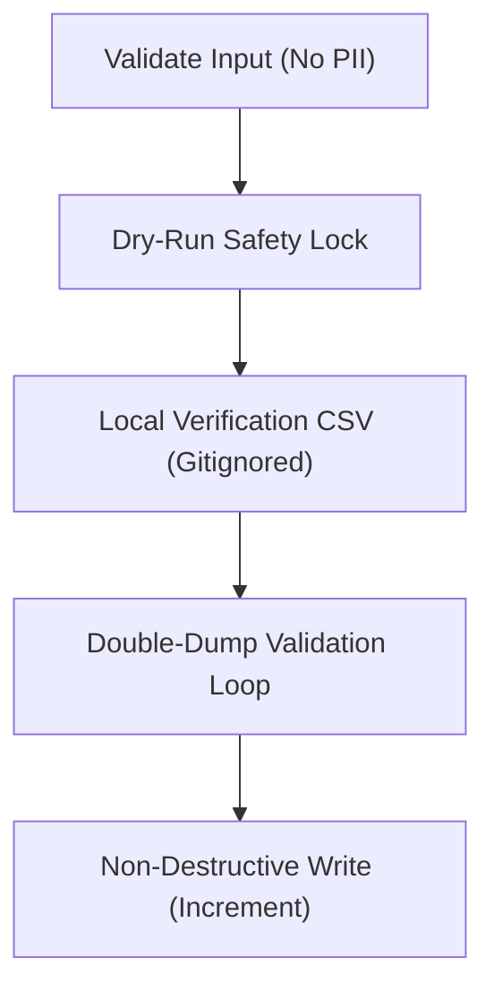

# df-safe-database-scripting

This skill establishes the **Safe Mutation Protocol** for creating, executing, or reviewing batch database modification scripts (seeding, data migrations, or cleanups) in KlickerUZH.

---

## 1. PII Refusal Guardrail

> [!CRITICAL] > **Strict PII Refusal**: The agent **MUST REFUSE** to process or parse any input files (Excel, CSV, JSON) containing personally identifiable information (such as personal names, email addresses, birthdates, or nationalities).
>
> - **Action**: Instruct the operator to sanitize the list locally first, providing only Klicker usernames, points, or achievements.

---

## 2. Safe Mutation Protocol

Mutating database scripts must implement three core design pillars:



### Pillar A: Dry-Run Safety Lock

Every mutating database script must be safe-by-default, running in logging-only mode unless an environment variable explicitly enables writes:

```ts
const DRY_RUN = process.env.DRY_RUN !== 'false'
// Default execution only outputs proposed changes.
// Mutation is only active when run with DRY_RUN=false
```

### Pillar B: Local Verification CSV

When resolving external identifiers (e.g., student usernames to database UUIDs):

1. Resolve usernames **case-insensitively** (`mode: 'insensitive'`).
2. Generate a local, gitignored `[script_basename]_comparison.csv` mapping `Source Identifier` to `Matched Database Username` and scores.
3. Keep this file gitignored to allow local manual verification before execution.

### Pillar C: Double-Dump Validation Loop

Before running the mutating writes on production:

1. **Dump Before**: Query the database for the starting states (scores, XP, or achievements) of all affected records, saving them locally to `[script_basename]_dump_before.json`.
2. **Execute Write**: Run the script with `DRY_RUN=false`.
3. **Dump After**: Query the same records again, saving to `[script_basename]_dump_after.json`.
4. **Compare**: Run a verification routine asserting:
   - Leaderboard entries and XP are incremented exactly by the expected delta (`After === Before + Delta`).
   - No existing records were overwritten or set to zero.
   - Print a clear summary: `Verification Summary: X Successes, 0 Mismatches`.

---

## 3. Gitignore Contract

All scripts and files must preserve repository hygiene. Ensure that the target package `.gitignore` contains:

```gitignore
# Excel raw inputs & local comparison sheets
*.xlsx
*.csv

# Intermediate local data inputs
*_data.json

# Verification state dumps
*dump*.json
```
