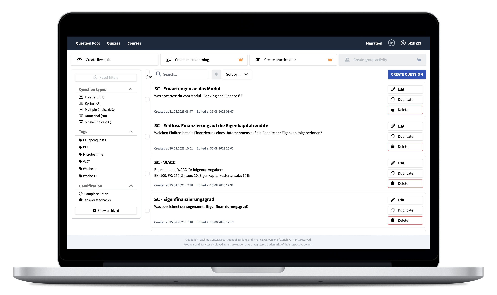

> Please note that this is the repository branch for KlickerUZH v3.0 released in August 2023. If you would like to have more information on the new concept of v3.0, have a look at our [public discussion](https://community.klicker.uzh.ch/t/klickeruzh-v3-0-concept-and-request-for-feedback/79).
>
> Please navigate to the [dev branch](https://github.com/uzh-bf/klicker-uzh/tree/dev) for the older [KlickerUZH v2.0](https://app.klicker.uzh.ch/), which will be available until the end of 2023. To migrate to KlickerUZH v3.0, first [log in](https://auth.klicker.uzh.ch/) and start the [migration process](https://manage.klicker.uzh.ch/migration).

`klicker-uzh` is the code repository of the [KlickerUZH](https://www.klicker.uzh.ch/) open-source audience interaction platform. KlickerUZH is developed by the Teaching Center of the Department of Banking and Finance at the University of Zurich, Switzerland.

KlickerUZH v3.0 uses multiple different web applications and services, which communicate with each other:

- [Frontend PWA](https://github.com/uzh-bf/klicker-uzh/tree/v3/apps/frontend-pwa) is the student frontend of KlickerUZH, which contains the student views for live quizzes, microlearnings, practice quizzes, leaderboards and more.
- [Frontend Manage](https://github.com/uzh-bf/klicker-uzh/tree/v3/apps/frontend-manage) is the lecturer frontend of KlickerUZH, which provides all the functionalities that lecturers need, including but not limited to question management, session management, course management and analytics.
- [Fontend Control](https://github.com/uzh-bf/klicker-uzh/tree/v3/apps/frontend-control) is a minimal controller frontend, which allows to control live sessions from mobile devices in an optimized layout. Soon, this app will also be available as a [PowerPoint integration](https://github.com/uzh-bf/klicker-uzh/tree/v3/apps/office-addin) (work in progress) for catalyst users.
- [Fontend Authentication](https://github.com/uzh-bf/klicker-uzh/tree/v3/apps/auth) is the authentication frontend of KlickerUZH, providing login functionalities through Edu-ID accounts and delegated logins to the manage frontend.
- [Backend Docker](https://github.com/uzh-bf/klicker-uzh/tree/v3/apps/backend-docker) is the main backend service of KlickerUZH.
- [Backend Responses](https://github.com/uzh-bf/klicker-uzh/tree/v3/apps/func-incoming-responses) is a service that handles incoming student responses during a live session and puts them into an Azure queue for improved load handling.
- [Backend Response Processor](https://github.com/uzh-bf/klicker-uzh/tree/v3/apps/func-response-processor) accesses queued elements from the aforementioned service and processes them by computing scores and experience points, updating the cache, etc.
- The [v2.0 Export](https://github.com/uzh-bf/klicker-uzh/tree/v3/apps/func-migration-v2-export) and [v3.0 Import](https://github.com/uzh-bf/klicker-uzh/tree/v3/apps/func-migration-v3-import) folders contain code related to the migration from KlickerUZH v2.0 to v3.0.

In addition to the key application components, this repository also includes the codebases for our landing page and documentation at [www.klicker.uzh.ch](https://www.klicker.uzh.ch/), as well as deployment scripts. An updated deployment documentation for self-hosting KlickerUZH v3.0 will be added later:

- [Documentation and Website](https://github.com/uzh-bf/klicker-uzh/tree/v3/apps/docs) (subfolder)
- [Deployment](https://github.com/uzh-bf/klicker-uzh/tree/v3/deploy) (subfolder)

To share code more easily between different services, we added new packages to the [Package Directory](https://github.com/uzh-bf/klicker-uzh/tree/v3/packages) with the following components:

- [Prisma](https://github.com/uzh-bf/klicker-uzh/tree/v3/packages/prisma): The prisma package contains the SQL database schema as well as migration scripts between different minor versions of KlickerUZH.
- [GraphQL](https://github.com/uzh-bf/klicker-uzh/tree/v3/packages/graphql): The GraphQL package contains the complete GraphQL schema and all resolvers for the KlickerUZH backend. For consistent typing, Pothos GraphQL and an auto-generated schema are used.
- [Grading](https://github.com/uzh-bf/klicker-uzh/tree/v3/packages/grading): The grading package provides the grading logic that is used to assign scores and experience points to participants and groups in gamified live sessions, learning elements, micro-sessions and other KlickerUZH elements.
- [LTI](https://github.com/uzh-bf/klicker-uzh/tree/v3/packages/lti): The LTI package contains logic to offer automatic sign ins for students through LTI (OLAT and Moodle integration).
- [Internationalization](https://github.com/uzh-bf/klicker-uzh/tree/v3/packages/i18n): The i18n package provides internationalization support across all KlickerUZH frontends.
- [Shared Components](https://github.com/uzh-bf/klicker-uzh/tree/v3/packages/shared-components): The `shared-components` package is configured as an internal turborepo package, mainly providing the possibility to share React components between the frontends and reduce code duplication.
- [Markdown](https://github.com/uzh-bf/klicker-uzh/tree/v3/packages/markdown): The markdown package exports a React component to render markdown strings into formatted elements.

For more code commonality between different projects at the Teaching Center and the Department of Banking and Finance more generally, we also use a [Design System Package](https://github.com/uzh-bf/design-system) with commonly used, pre-styled and theme-based components.

## Roadmap / Issues

The KlickerUZH project is publicly managed and documented in this repository. A corresponding roadmap of our current developments can be found on our [Homepage](https://www.klicker.uzh.ch/development). Please feel free to add any issues or feature requests you might have to the [Roadmap](https://klicker-uzh.feedbear.com) and [Bug reports](https://klicker-uzh.feedbear.com/boards/bug-reports) or start a new discussion in our [Community](https://community.klicker.uzh.ch/).

## Important Links

The following resources might be of special interest to you:

- [User Documentation](https://www.klicker.uzh.ch/getting_started/welcome)
- [Frequently Asked Questions](https://www.klicker.uzh.ch/faq)
- [Community and Discussions](https://community.klicker.uzh.ch/)
- [Roadmap](https://klicker-uzh.feedbear.com)

## Deployment

This section is still work in progress as our architecture continues to experience minor changes and will be updated as soon as possible. If you would like to deploy an instance of the legacy KlickerUZH v2.0, please refer to the corresponding [Deployment Section](https://www.klicker.uzh.ch/v2/deployment/deployment_docker/) of the legacy docs.

## Contributing

We welcome any contributions to the KlickerUZH project. Before considering any contribution, we recommend that you create a discussion to discuss your proposed addition with the project maintainers and other contributors. Please also make sure to follow our [Contributing Guidelines](https://www.klicker.uzh.ch/v2/contributing/contributing_guidelines/), as your PR might need amendments otherwise.

## License

The KlickerUZH and all of its subprojects are licensed under the [AGPLv3](https://www.gnu.org/licenses/agpl-3.0.de.html).

