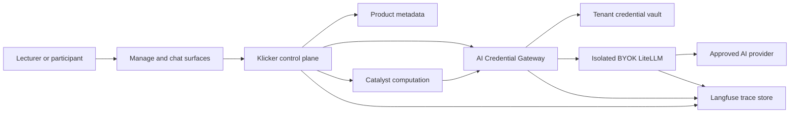

# AI Provider Credentials

This is the proposed contract for user- and institution-owned AI provider
credentials. The first implementation is chatbot-specific. Its explicit
contracts can later be extended to tutoring, content generation, grading, graph
work, embeddings, and Catalyst-backed computation without moving secret custody
into each runtime or introducing a polymorphic resource model now.

The decisions are recorded in [ADR 0037](./adr/0037-provider-credentials-use-vault-custody.md),
[ADR 0038](./adr/0038-byok-routes-through-isolated-litellm.md),
[ADR 0039](./adr/0039-provider-credential-use-requires-explicit-binding.md),
and [ADR 0040](./adr/0040-langfuse-is-the-time-bounded-ai-trace-store.md).

## Ownership

| Component                     | Owns                                                                                                                                                 | Does not own                                                                                                      |
| ----------------------------- | ---------------------------------------------------------------------------------------------------------------------------------------------------- | ----------------------------------------------------------------------------------------------------------------- |
| Klicker product control plane | User and participant authorization, provider credential metadata, resource bindings, delegation, budgets, provider notices, UI, and lifecycle events | Provider secret values                                                                                            |
| AI Credential Gateway         | Registration, validation, rotation, revocation, vault access, one-request authorization enforcement, and provider forwarding                         | Prisma access, canonical product state, courses, chatbot ownership, enrolment, or caller-authored provider policy |
| Azure Key Vault               | Provider secret values and versions                                                                                                                  | Product configuration or customer content                                                                         |
| BYOK LiteLLM                  | Request-scoped model routing, complete Auto execution, normalized usage and estimated cost, provider error normalization, and generation trace spans | Canonical credential custody, arbitrary endpoints, or product authorization                                       |
| Catalyst services             | Private computation behind Klicker contracts                                                                                                         | Credential custody, identity, bindings, quota, pricing, or canonical product state                                |
| Langfuse                      | The joined, comprehensive AI observability trace for a bounded retention period                                                                      | Product authorization, model training, or a general research data lake                                            |

The gateway code belongs in the KlickerUZH monorepo as a standalone internal
application because Klicker owns the canonical contracts and authorization
boundary. It deploys separately from the internet-facing chat and backend
processes, has no product-database access, and is the only workload that can read
the dedicated gateway application vault.
Infrastructure remains declared in df-cloud. The isolated BYOK LiteLLM
deployment and its trace callbacks remain in the AI deployment repository.

## Trust boundaries and data flow

### Registration and rotation

1. The lecturer selects a centrally governed Provider Profile, enters the
   provider secret once, and attests that the account permits the intended
   delegated use.
2. The manage surface sends the secret over TLS to a dedicated authenticated
   Klicker backend endpoint with request-body logging and tracing disabled. The
   secret does not use a GraphQL mutation and is not reflected, cached, persisted
   in client state, or returned.
3. Klicker passes the secret and safe provider-profile identifier to the
   internal gateway. Neither service logs request bodies or authorization
   material on this path.
4. The gateway writes a new opaque secret name and version to the tenant and
   environment vault, validates the approved model capabilities, and returns
   only an opaque handle, version, safe fingerprint, capability result, and
   status.
5. Klicker stores the safe metadata. A failed validation never activates the
   new version. Rotation preserves the old active version until the new version
   passes and the handle switches atomically.
6. A Provider Credential cannot change Provider Profile in place. Changing
   provider creates a new credential and explicit rebind, which also selects a
   new Provider Notice.

Validation should prefer a non-generative provider capability check where the
provider supports one. Any validation that creates billable model usage is a
separately visible operation and requires an explicit rollout gate.

### Runtime request

1. Klicker authenticates the caller and resolves course membership, resource
   access, an active chatbot binding, current credential status, active
   participation, named-model eligibility, Provider Notice acknowledgement, and
   available BYOK quota.
2. Klicker atomically creates a conservative hard reservation against both the
   participant and lecturer aggregate limits before dispatch.
3. Klicker creates a short-lived, single-request capability. Product state holds
   the opaque actor, chatbot binding, reservation, request and trace identifiers,
   profile revision, model policy, expiry, and unique token id. The bearer itself
   is random and opaque and contains no endpoint, vault handle, or provider secret.
4. A direct Klicker runtime calls the gateway with that bearer. A Catalyst runtime
   receives the same request-scoped bearer and fixed gateway origin through its
   existing provider boundary.
5. The gateway submits the bearer once to a private Klicker consume endpoint. An
   atomic transaction verifies the full stored scope, active participation and
   binding, reservation, current profile revision, expiry, and replay state, then
   returns the approved vault handle and version to the gateway. Replay fails.
6. The gateway refuses caller-supplied endpoints, handles, fallbacks, and model
   configurations. It reads the approved vault version, calls isolated BYOK
   LiteLLM with the fixed deployment alias and transient credential, and clears
   secret-bearing references after request setup.
7. LiteLLM routes the named model or, in the later Auto layer, the complete Auto
   manifest to the approved provider. Gateway and LiteLLM spans join the Klicker
   trace without exporting credentials, authorization headers, capability
   bearers, or vault handles.
8. Klicker settles reliable terminal usage and estimated currency cost
   idempotently. If reliable usage is unavailable, the full reservation remains
   charged; the request never crosses into UZH credits.

A request already executing may finish after a concurrent revocation. Revocation
blocks new gateway authorizations synchronously and disables the credential in
the gateway before the operation returns. The first version does not promise
provider-side cancellation of an in-flight generation.

## Canonical product records

These are logical contracts, not final Prisma names.

| Record                     | Required safe state                                                                                                                                                                                       | Forbidden state                                                  |
| -------------------------- | --------------------------------------------------------------------------------------------------------------------------------------------------------------------------------------------------------- | ---------------------------------------------------------------- |
| Provider Profile           | Stable id and version, provider kind, fixed endpoint alias, approved deployment aliases, complete Auto manifest, currency and pricing source, factual data-boundary fields, notice version, active status | User-supplied endpoint, provider credential                      |
| Provider Credential        | Owner, tenant, immutable provider profile, opaque vault secret name and active version, validation status and capability manifest, safe fingerprint, lifecycle timestamps                                 | Raw secret, encrypted secret, request headers, custom base URL   |
| Chatbot Credential Binding | Credential id, chatbot id, owner, active-participant delegation state, named model or later Auto manifest version, participant and aggregate quota policy, active state                                   | Ambient account-wide default or copied binding                   |
| Provider Notice Acceptance | Participant, binding, provider profile and notice version, acknowledged timestamp                                                                                                                         | Legal-basis or consent claim                                     |
| BYOK Usage Account         | Provider profile, binding and participant dimensions, hard reservation, token usage, estimated cost and currency, settlement status                                                                       | Provider invoice claim, UZH credit fallback                      |
| Trace Deletion Job         | Tombstoned subject or resource, Langfuse trace selectors, requested and verified timestamps, attempts, terminal status                                                                                    | Prompt, response, tool output, credential, or trace payload copy |

Provider credential lifecycle states are `PENDING_VALIDATION`, `ACTIVE`,
`SUSPENDED`, `REVOKED`, `DELETION_PENDING`, and `DELETED`. A binding
can be active only while its credential and Provider Profile are active and its
model policy is still valid.

## Provider profiles and model eligibility

Provider Profiles are centrally maintained policy, not lecturer configuration.
The first cohort supports one approved Provider Profile and one named model.
Auto is a later gated layer. A profile fixes:

- the exact provider API origin and regional or data-zone facts;
- the deployment aliases and reasoning efforts Klicker may expose;
- the complete current Auto target manifest, including classifier and embedding
  requests;
- the pricing source, currency, and timestamp used for cost estimates;
- validation behavior, known provider limitations, and the Provider Notice
  version.

A credential can expose one validated named model. It can expose Auto only when
the credential is validated for every target in the profile's active Auto
manifest. A manifest change suspends Auto for affected bindings until
revalidation succeeds. Named models that remain valid can continue if the
binding policy permits them.

Fallbacks stay within the credential, provider profile, and selected policy.
There is no fallback to a platform credential, a different provider, a partial
Auto target set, or another usage class.

## LiteLLM isolation contract

The existing shared LiteLLM deployment keeps its prohibition on client-side
provider credentials. BYOK uses a separate internal deployment because the
credential setting is a deployment-wide security boundary.

The isolated deployment must satisfy all of these before a real credential is
accepted:

- only the gateway network identity and proxy key can reach it;
- provider endpoints and deployment aliases are static and allowlisted;
- callers can vary only the minimum provider credential parameter;
- user-supplied `user_config`, provider base URLs, headers, callbacks, and
  fallback lists are rejected;
- request and error logging cannot record the provider credential;
- credentials do not enter LiteLLM persistence, spend logs, caches, metrics, or
  Langfuse;
- named-model and complete Auto requests preserve the same joined trace,
  terminal usage, and estimated cost contract;
- an unavailable gateway, vault, or LiteLLM instance fails closed.

The exact LiteLLM mechanism remains conditional on a synthetic contract test.
The documented per-model configurable credential path is preferred over an
arbitrary request-supplied router configuration. If complete Auto cannot safely
consume the transient key, the feature stops at named-model BYOK until the
isolated deployment has a verified mechanism; it does not ship partial Auto.

## Quota and cost

BYOK has a separate usage account. It composes with utilities from the active
chatbot usage stack but does not inherit its bounded concurrency overshoot. Every
request has a hard participant and lecturer reservation before dispatch, followed
by idempotent estimated-cost settlement.

- Each participant receives a binding-specific limit.
- Each lecturer has a lower aggregate BYOK cap across delegated participants.
- The platform also applies request-rate and concurrency ceilings independent
  of the provider's limits.
- Exhaustion fails closed for BYOK and does not select a UZH-funded model.
- The lecturer sees used and remaining quota plus estimated provider cost in
  the profile currency.
- LiteLLM's model cost map is the calculation source. The UI states the pricing
  version and that the amount is an estimate, not provider invoice truth.

## Provider notice

The chat surface can compose the Provider Notice with the existing chatbot
disclaimer, but its acceptance record remains separate because provider changes
have their own version lifecycle.

The notice is factual and profile-specific. For example, an institutionally
managed Azure profile can state its approved regional and processing boundary;
an OpenAI or OpenRouter profile must state that requests leave the UZH-managed
Azure boundary and identify the approved external provider facts. Wording is
derived from approved profile fields rather than lecturer-authored text.

Participants acknowledge the current notice before first use. A provider change
or material data-boundary change increments the version and blocks the next
request until acknowledgement. The product does not describe this as consent,
a waiver, or the legal basis for processing.

## Langfuse trace and deletion contract

Langfuse is the comprehensive observability trace store by design. One trace joins the product request,
gateway decision, LiteLLM generation, retrieval and tool activity, token usage,
estimated cost, selected model, provider profile, and terminal result. The
pre-export guard removes provider credentials, proxy keys, authorization
headers, gateway tokens, vault handles, and unnecessary direct identifiers.

Raw traces expire automatically after 180 days. Named platform operators receive
audited, least-privileged raw access for support and proactive quality
improvement. Lecturer analytics remain aggregate and do not expose
participant-authored text.

Deleting a user, chatbot, or binding synchronously:

1. disables new runtime use and tombstones trace selectors for every secondary
   purpose;
2. enqueues Langfuse deletion jobs;
3. verifies absence through the Langfuse API within seven days; and
4. alerts on overdue, failed, or partially selected deletion work.

Manual deletion is repair only. Research receives a separate, purpose-specific
export. UZH research requires institutional approval and uses minimized,
de-identified where possible, or protected pseudonymous records. External
tenants remain quality-improvement-only by default. No trace or export trains a
model. Before BYOK content tracing is enabled, the responsible institutional
owners must document the legal basis, purposes, processor terms, access owner,
retention, research-export boundary, and deletion-verification contract.

## Credential deletion and recovery

Deleting a Provider Credential disables every binding before the gateway
returns. The gateway deletes the active Key Vault secret and records only the
deletion operation status. The credential vault uses purge protection and the existing hardened 90-day
soft-delete recovery period; physical purge cannot be promised before that
period ends. The UI therefore distinguishes
"no longer usable" from "purged from the vault" and tells the owner to revoke
or rotate the key at the provider when compromise is suspected.

Key Vault deletion makes a credential immediately unusable in Klicker while the
secret remains recoverable in Azure for 90 days. This recovery boundary is
separate from the seven-day verified Langfuse trace-deletion target and the
180-day automatic trace schedule.

## Data protection by design

The design applies all nine principles before implementation:

| Principle          | Applied decision                                                                                                                                          |
| ------------------ | --------------------------------------------------------------------------------------------------------------------------------------------------------- |
| Proactive          | The current custom-endpoint/shared-key path is removed before user-controlled credentials are exposed; gateway and trace failures block launch.           |
| Privacy as default | Credentials are unbound by default, participants receive no key, arbitrary endpoints are impossible, and secondary use stops on tombstone.                |
| Embedded           | Authorization, notice versioning, retention, deletion verification, and research export boundaries are product contracts rather than operator convention. |
| Positive-sum       | Full operational traces remain available for 180 days while access, minimization, and automatic deletion constrain privacy impact.                        |
| Lifecycle          | Registration, validation, binding, use, rotation, suspension, revocation, deletion, recovery, and verified trace cleanup have explicit states.            |
| Visibility         | Users see the provider boundary, acknowledgement version, quota, and estimated cost; operators receive audited lifecycle and deletion evidence.           |
| User respect       | The owner controls credentials and bindings; participants see their own status and notice; lecturers do not receive raw participant conversations.        |
| Purpose limitation | Runtime fulfillment, support, quality improvement, and approved UZH research are separate purposes; external research and model training are excluded.    |
| Data minimization  | Product state keeps safe metadata only, traces omit credentials and unnecessary direct identity, and research uses a separate minimized export.           |

The four privacy defaults are:

- **Collection**: collect the provider secret once for vault write and the full
  AI interaction only because comprehensive tracing is an explicit operational
  requirement.
- **Processing**: use raw traces only for runtime-linked support and quality
  improvement; research is a separate approved export.
- **Storage**: keep product metadata for its lifecycle, raw traces for 180 days,
  deleted-resource traces for at most seven days after tombstone, and
  soft-deleted credentials for the 90-day vault recovery period.
- **Access**: credential owner for management, participant for own status,
  internal gateway for secret values, named operators for raw traces, and
  purpose-approved researchers for exports only.

Legal basis, institutional research approval, external-tenant contractual terms,
and final provider-notice wording require privacy and legal owner approval
before the corresponding environment is enabled. Notice acknowledgement does
not substitute for those decisions.

## Migration from the current chat path

| Current seam                                             | Target                                                                                                                 |
| -------------------------------------------------------- | ---------------------------------------------------------------------------------------------------------------------- |
| `Chatbot.openaiApiKey` and `openaiBaseUrl` in PostgreSQL | Provider Credential metadata plus a Credential Binding; secret in tenant Key Vault; endpoint in Provider Profile       |
| `safeDecrypt` in chat model selection                    | No provider-credential decryption in product runtimes; existing MCP-secret use is handled separately                   |
| Chat route `getModel` custom/default branching           | One gateway client using an explicit platform or BYOK funding source                                                   |
| Chat model registry allowlist                            | Compose the canonical registry with Provider Profile capability and complete Auto-manifest validation                  |
| `ChatUsageCredits` and account-usage stack               | Preserve participant credits and account budgets; add a separate BYOK funding source and estimated currency settlement |
| `ChatbotDisclaimer` acceptance                           | Compose UI with a separate versioned Provider Notice Acceptance                                                        |
| Chat-local Langfuse instrumentation                      | Repair OTel first, then join product, gateway, LiteLLM, retrieval, and tool spans                                      |
| Catalyst `Provider-Authorization` raw key                | Short-lived gateway authorization with the fixed gateway origin                                                        |
| Shared LiteLLM proxy                                     | Keep platform-key traffic unchanged; add isolated internal BYOK LiteLLM                                                |
| Ad hoc deletion                                          | Product tombstone plus durable vault and Langfuse deletion jobs with verification                                      |

Before migration, run a values-suppressed inventory that reports only whether
legacy credential fields are null, encrypted-looking, or plaintext-looking.
Never print, export, or copy values. If any legacy credential exists, its owner
must explicitly re-register a replacement; the system does not silently decrypt and
re-upload credentials in a database migration.

## Rollout gates

1. Repair and prove the current Klicker-to-Langfuse trace path with synthetic
   content.
2. Prove an isolated LiteLLM named-model request and complete Auto request with
   a synthetic provider credential, including redaction and non-persistence.
3. Provision the STG tenant vault, workload identity, private endpoint, RBAC,
   diagnostics, recovery, and alerting through declared infrastructure.
4. Ship gateway and product contracts behind a server-side feature flag with no
   credential registration exposed.
5. Prove lifecycle, cross-tenant denial, quota, notice, rotation, revocation,
   Key Vault recovery, trace retention, and deletion in STG.
6. Enable one approved Provider Profile with one named model for internal test
   owners, then a small lecturer cohort.
7. Enable Auto only after the environment-specific complete manifest passes the
   same credential, routing, quota, notice, and trace proof.
8. Require separate authority for real credential validation, PRD infrastructure
   apply, deployment, data-protection approval, and production enablement.

## External references

- [Azure Key Vault overview](https://learn.microsoft.com/en-us/azure/key-vault/general/overview)
- [Secure Azure Key Vault](https://learn.microsoft.com/en-us/azure/key-vault/general/secure-key-vault)
- [AKS Workload ID](https://learn.microsoft.com/en-us/azure/aks/workload-identity-overview)
- [LiteLLM client-side credentials](https://docs.litellm.ai/docs/proxy/clientside_auth)
- [Langfuse data masking](https://langfuse.com/docs/observability/features/masking)
- [Langfuse data retention](https://langfuse.com/docs/data-platform/features/data-retention)
