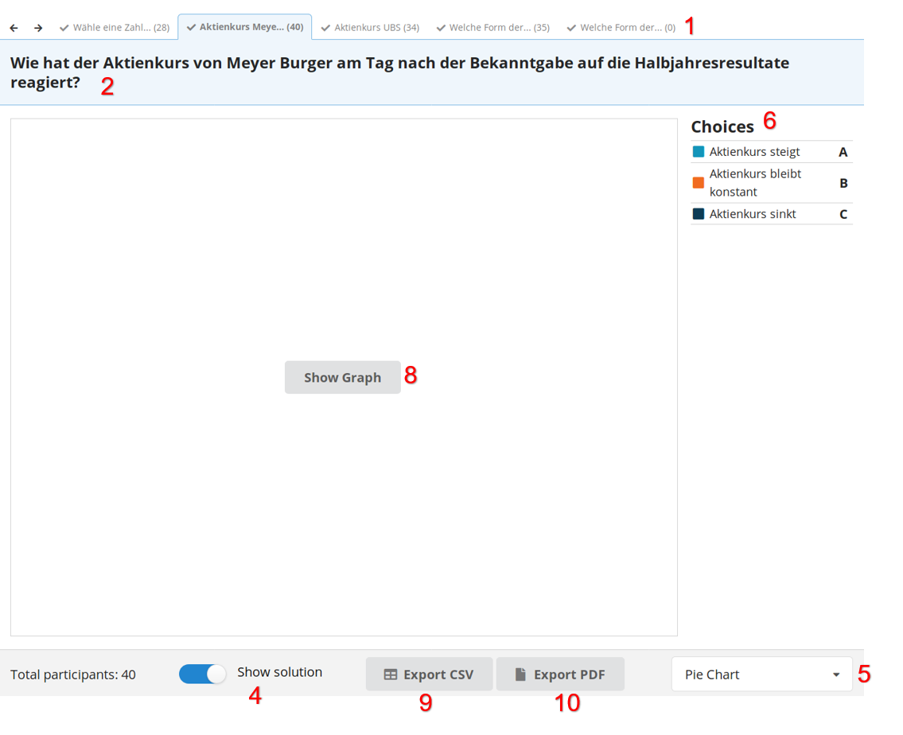
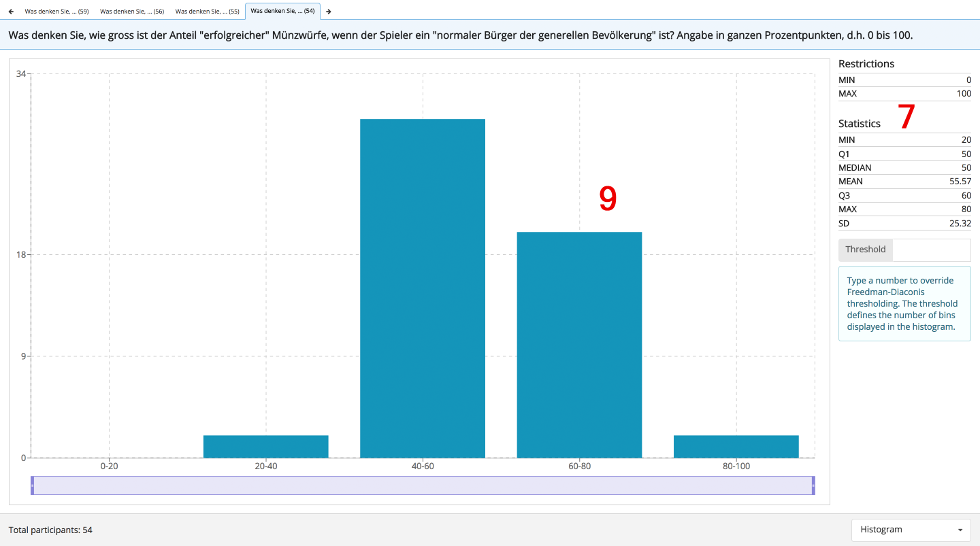

The evaluation screen provides different charts for all questions asked within a session.

Depending on the question type the evaluation screen might look different. Additionally, some
charts are not available for all question types. The following two screens show all features:

1. **Navigation:** All questions within the active block are listed here. Click the question or use the arrows on the very left or right to navigate through the questions.
2. **Question:** The question posed to the audience.
3. **Number of participants:** Indicates how many participants answered the question.
4. **Show Solution:** For single and multiple choice questions this slider can be used to show the correct answer within the graph.
5. **Chart Type:** This dropdown can be used to change the type of chart. There are 5 chart types available: Pie Chart, Bar Chart, Histogram, Word Cloud, and Table.
6. **Choices:** This list shows all possible answers (only for SC/MC).
7. **Statistics:** Statistics are only displayed for number range questions.
8. / 9. **Chart:** The chart is only displayed after the "Show Graph" button is clicked. Providing this feature enables the speaker to wait until enough participants answered the question before showing the results.

