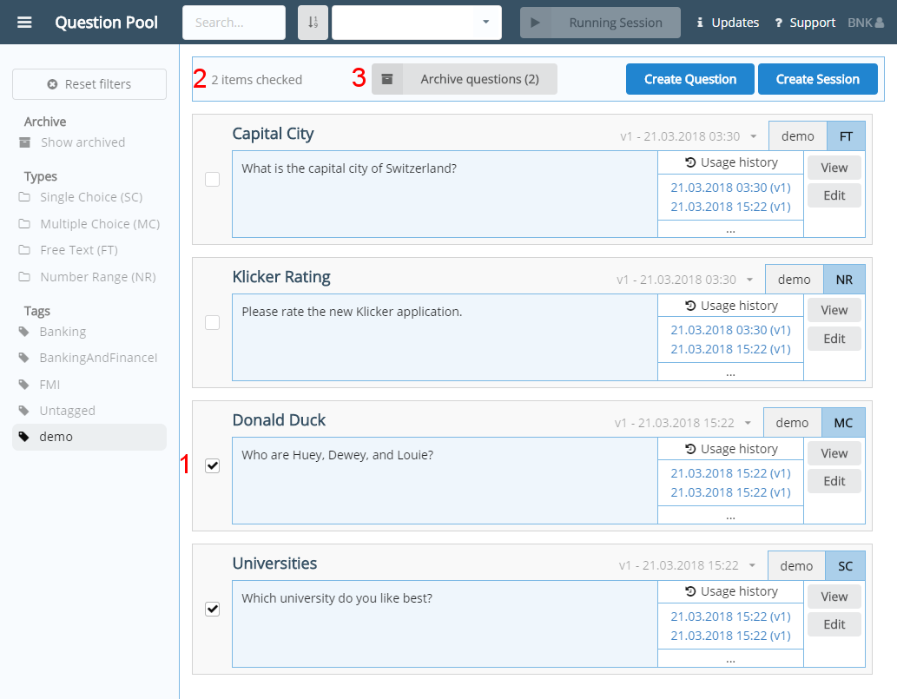
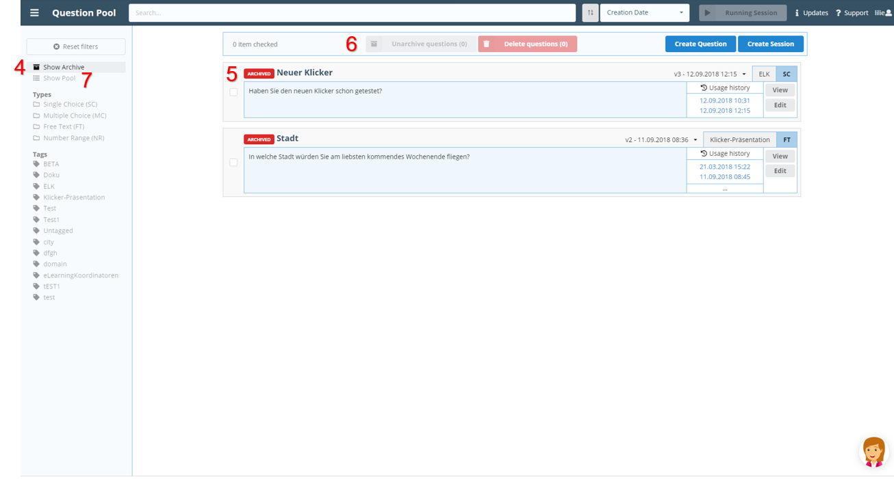

Questions are used within sessions and answered by the audience. Also the evaluation is linked to the questions. Therefore, it is not possible to delete a question. However, a question can be archived.

To archive a question and see all archived questions follow these steps:

1. Within the question pool, select the checkbox on the left of every question to archive.
2. Check whether the number of checked questions is correct.
3. Click the _Archive Questions_ button to archive the selected questions.
4. Click the _Show archived_ filter to show all archived questions.
5. Every archived question is labeled with a red "ARCHIVED" label.

All archived questions are no longer visible within the question pool.

