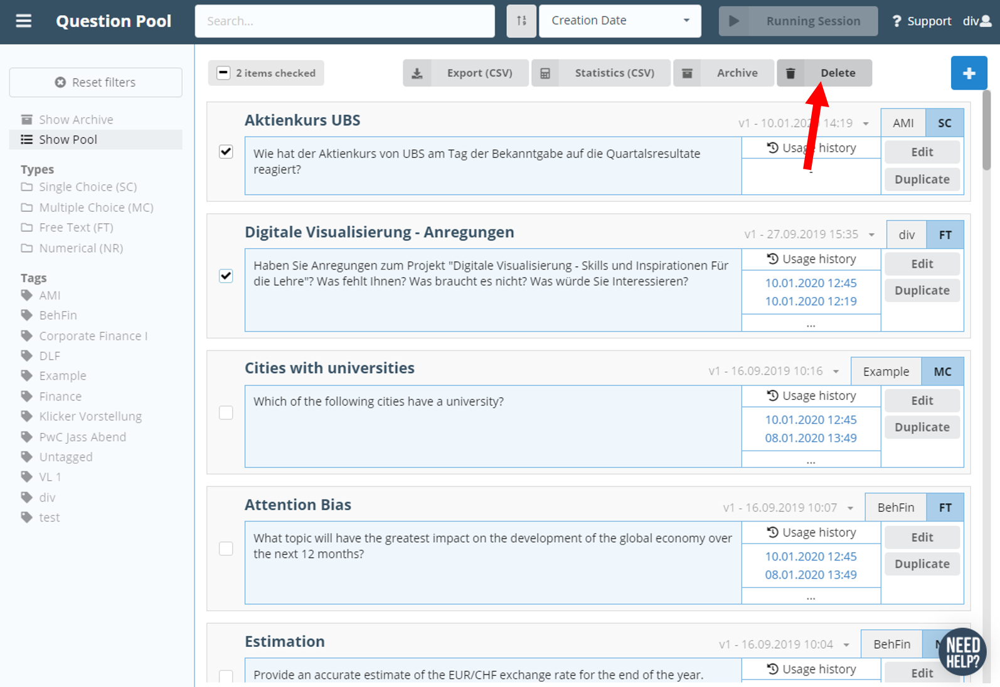

You may **delete questions** in your question pool or archive by checking the questions on the left side and clicking on the red _Delete questions_ button (1.). Deleted questions will no longer be visible to you but they are still available in our data base (soft delete) as polls of former sessions may be attached to them.

