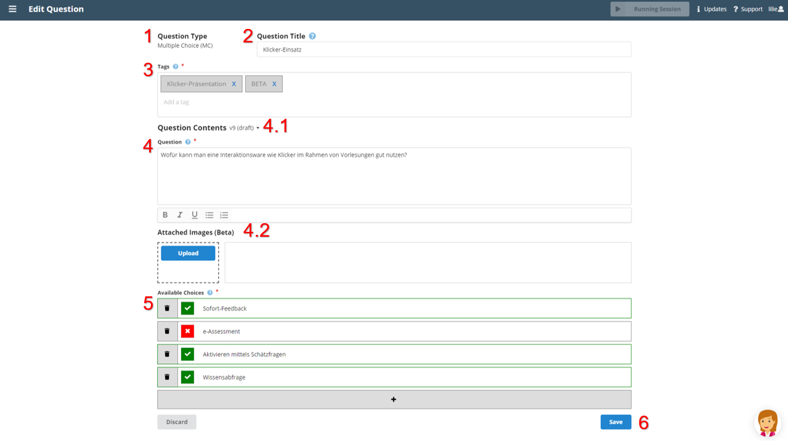

On the [Question Pool](question_pool.md) screen, click the _Edit_ button next to the question to edit it.

If you edit a question, a new version of the question is created automatically (4.1). This way already used questions in past sessions are not altered. You always see the latest version. The following list shows how to edit a question and how create a new version of a question:

1. **Question Type:** Once a question is created the question type can not be changed.

2. **Question Title:** The question title may be changed at any time and stays the same for all versions of a question.

3. **Tags:** Like the question title, the tags may be edited at any time. All versions of a question have the same tags.

4. **Question:** To change the actual question (5) and the available choices (SC/MC) or input restrictions (NR) a new version is created (4.1). The question posed to the audience may be edited in a new version of the question. You may also add to or change images of the question (4.2). 

5. **Available Choices (SC / MC only):** The available choices may be edited like creating a question, i.e. the text of existing choices cannot be altered but choices can be deleted, false/true can be changed, new choices can be added.

6. **Save:** Press the _Save_ button to save the edited question or the new created version.

