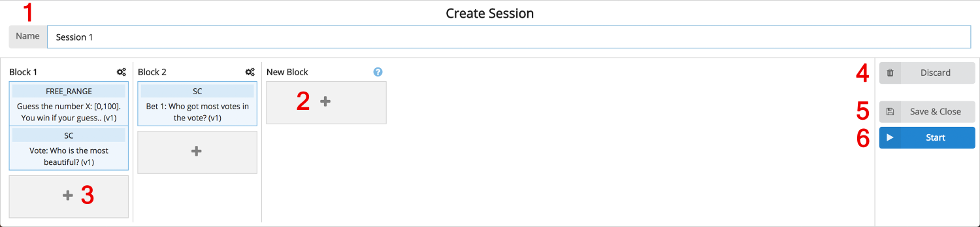

On the [Question Pool](question_pool.md) screen, click _Create Session_ to start combining the questions for a new session.

Every session consists of blocks of questions. During an ongoing session, the speaker unlocks a question block so that the audience can answer all question within this question block.

The following steps need to be done to create a new session:

1. Enter a new name for the session (only visible to the speaker and not to the audience).

Choose a question and select the version you want to use by clicking on the indicated version. Then Drag & Drop the question from the question list
2. here to create a new question block.
3. here to add a question to an existing question block.

4. (Click this button to discard this session draft.)

After all the questions are placed in a new session, there are two ways to save the session. Either
5. save and close the session creation or
6. save and start the session. You will be redirected to the [Running Session](session_running.md) screen.

