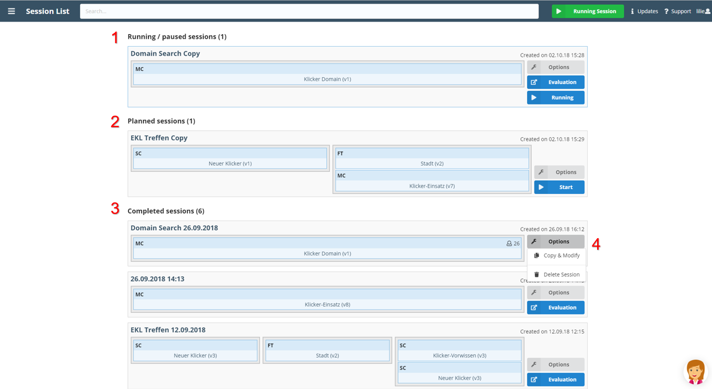

The session list is divided into three sections:

1. **Running Session**: Only shows a session if one session is currently running.
2. **Planned Sessions**: Shows all sessions that are created but not completed. These sessions can be started at any time (given that no session is currently running).
3. **Completed Sessions**: Shows all completed sessions. These sessions cannot be started again, but one can see the evaluation of the questions.

From the session list you can start a session, look up the evaluation or click on _Options_ (4.) in order to **Copy & Modify** or to **Delete a Session**.

