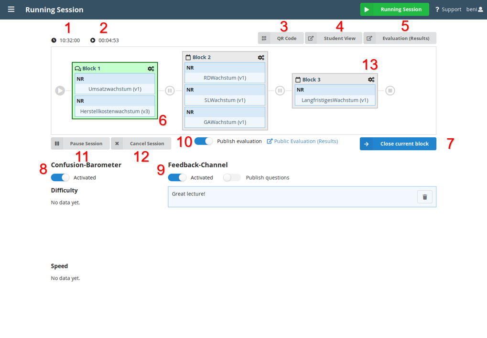

This screen is used during a speech or lecture to manage the questions and audience feedback and provides the following information and options:

1. **Starting Time:** The time the session was started at.
2. **Session Duration:** How long the session is already running.
3. **QR Code:** Click here to display the QR-Code so that the audience can scan it (e.g., with an appropriate mobile app) and get forwarded to the web page for answering the questions and giving feedback.
4. **Audience View:** Click here to see the [Audience View](audience_view.md). This also shows the URL to give to the audience for participation.
5. **Evaluation:** Click here to see the [Evaluation](evaluation.md) of the currently active question block.
6. **Question blocks:** Already executed question blocks are labeled with a tick, the active one is labeled with speech bubbles and colored in green and upcoming question blocks do not have any label.
7. **Navigation:** This button is used to navigate through the question blocks. It indicates the action taken when it is clicked. **One can never navigate backwards!**
8. **Confusion-Barometer:** The Confusion-Barometer enables the audience to give feedback about the speed and difficulty of the speech or lecture. Click the button to activate or deactivate the function. Below the feedback about the speed and difficulty is presented in separate graphs.
9. **Feedback-Channel:** The Feedback-Channel allows the audience to ask questions and give text feedback to the speaker. This function can be activated or deactivated with the button. Furthermore, the speaker may decide whether the feedbacks should be visible to the audience or not.

