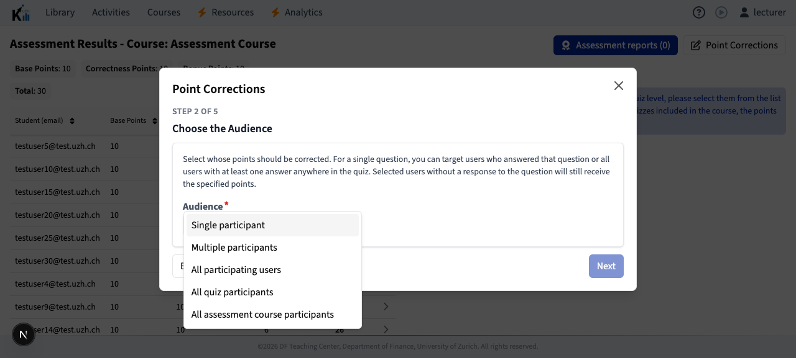
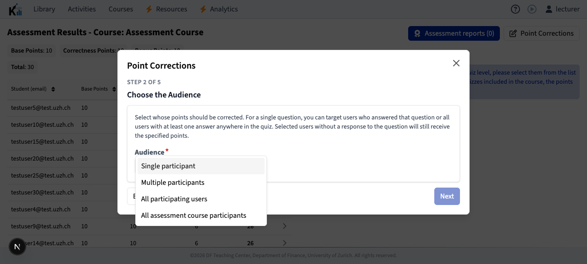

## 2026-08-14

- **Update:** Point corrections for one quiz element can now target all
  participants with at least one genuine response anywhere in the quiz, even if
  they did not answer the selected element. Whole-quiz corrections retain the
  original four audiences. See
  [assessment point corrections](../domain-model.md#assessment-point-corrections).

## Browser verification

Element corrections expose the fifth quiz-participant audience:

Whole-quiz corrections retain the original four audiences:

