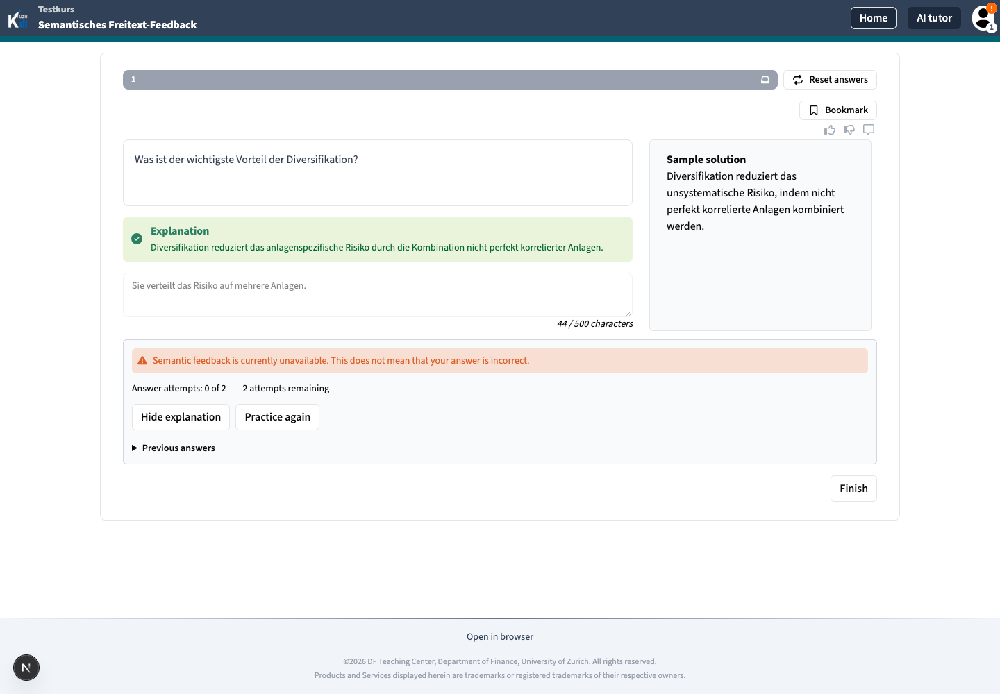
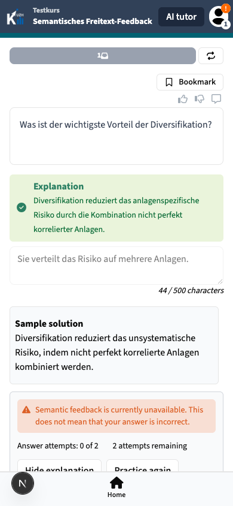
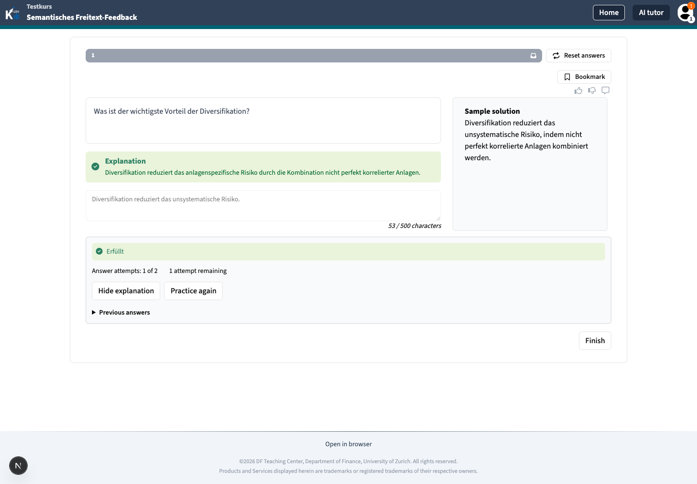
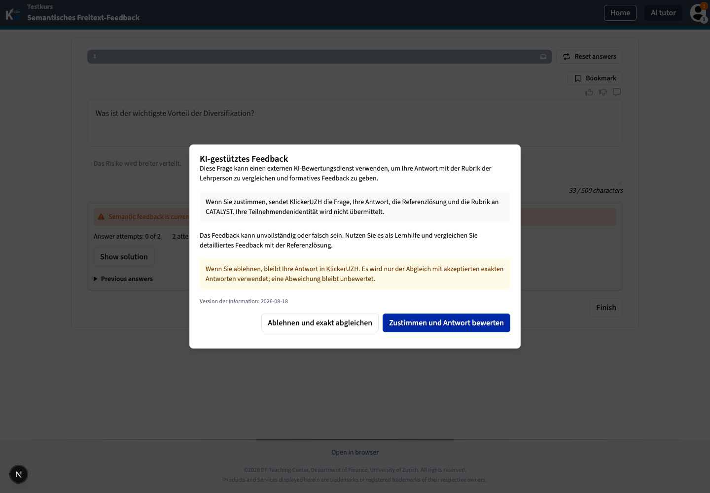

## 2026-08-19

- Added the participant Practice Quiz flow for persisted semantic feedback,
  per-answer retries, evaluation retry, solution reveal, and new practice cycles.
- Kept the initial stack submission while reopening only the semantic free-text
  answer after partial or incorrect feedback. Neighboring elements remain locked.
- Added a server-restored state hook that polls only pending work, preserves stable
  submission IDs, and rejects stale cycle/attempt revisions after mutations.
- Added the versioned, non-dismissible external-AI disclosure in the configured
  question language. Decline persists the deterministic exact-match fallback.
- Added generic custom/default outcome feedback, attempt history, per-attempt reward
  deltas, server-driven actions, and terminal reference solution, explanation,
  readable rubric rationale, and peer-answer details. Raw rubric JSON stays hidden.
- Added a localhost-only deterministic Catalyst boundary stub and a focused
  Playwright spec covering consent, partial-to-correct retry, reload recovery,
  neighboring-input locking, decline fallback, exact matching, and exhaustion.

### Verification

- Focused GraphQL integration suite: 17 passed.
- GraphQL, PWA, shared-components, and Playwright type checks passed.
- The complete `pnpm run check:all` pre-commit suite passed after restoring the
  ignored Analytics virtual environment to its documented Python 3.12 runtime.
- OpenGrep found no issues in the new participant and Playwright files. Its
  repository-wide scan reported the existing baseline findings outside this
  change.
- Real PWA verification covered unavailable fallback, persisted reload, solution
  reveal, exact-match correct, a fresh cycle after **Practice again**, and German
  disclosure copy in an English interface at desktop and mobile widths.
- The focused Playwright fixture and evaluator stub both completed global setup and
  test discovery. The local DevPod could not execute Chromium: its browser cache was
  initially absent, and the interrupted arm64 download left an invalid ICU payload.
  The repository CI uses the pinned Playwright browser image; the focused spec still
  requires a green CI/full-runtime execution before merge.
- The wiki skill's external validator was unavailable at its documented local
  path; Markdown formatting and `git diff --check` passed.

### Browser evidence

