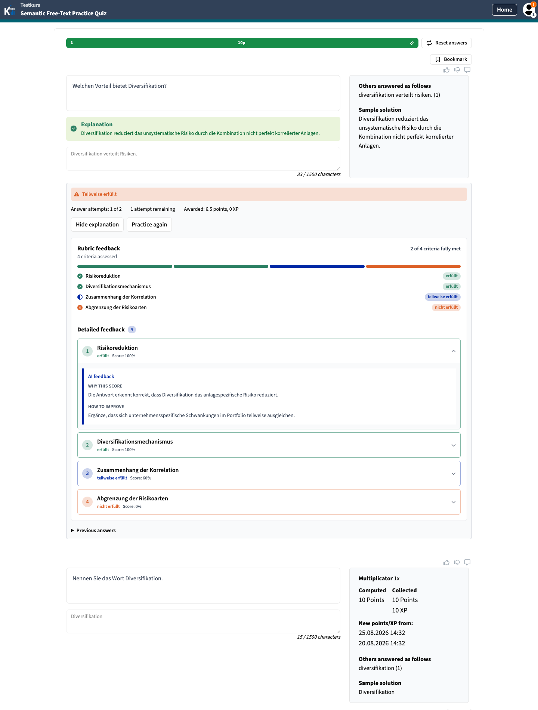
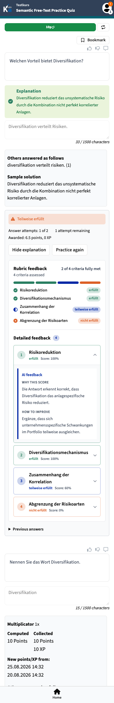

## 2026-08-19

- Added the participant Practice Quiz flow for persisted semantic feedback,
  per-answer retries, evaluation retry, solution reveal, and new practice cycles.
- Kept the initial stack submission while reopening only the semantic free-text
  answer after partial or incorrect feedback. Neighboring elements remain locked.
- Added a server-restored state hook that polls only pending work, preserves stable
  submission IDs, and rejects stale cycle/attempt revisions after mutations.
- Added the versioned, non-dismissible external-AI disclosure in the configured
  question language. Decline persists the deterministic exact-match fallback.
- Added generic custom/default outcome feedback, attempt history, per-attempt reward
  deltas, server-driven actions, and terminal reference solution, explanation,
  readable rubric rationale, and peer-answer details. Revealed rubric feedback now
  summarizes every criterion with a segmented status indicator and accessible
  per-criterion details. Each authorized detail card labels the evaluator rationale
  as the reason for its score and, when present, pairs it with the matching
  criterion-specific feedback proposal as improvement guidance. Raw rubric JSON
  stays hidden.
- Added a localhost-only deterministic Catalyst boundary stub and a focused
  Playwright spec covering consent, partial-to-correct retry, reload recovery,
  neighboring-input locking, decline fallback, exact matching, and exhaustion.

### Verification

- Focused GraphQL integration suite: 17 passed.
- GraphQL, PWA, shared-components, and Playwright type checks passed.
- The complete `pnpm run check:all` pre-commit suite passed after restoring the
  ignored Analytics virtual environment to its documented Python 3.12 runtime.
- The mandatory pre-push repository build passed all 22 build tasks, including
  the Manage and PWA production bundles.
- OpenGrep found no issues in the new participant and Playwright files. Its
  repository-wide scan reported the existing baseline findings outside this
  change.
- Real PWA verification covered unavailable fallback, persisted reload, solution
  reveal, exact-match correct, a fresh cycle after **Practice again**, and German
  disclosure copy in an English interface at desktop and mobile widths. The refined
  accepted-feedback state also covered four mixed rubric outcomes, exact-ID joins
  between assessments and feedback proposals, keyboard disclosure controls, and a
  responsive layout without horizontal overflow. The final 1440 x 1900 and
  390 x 2400 evidence keeps the question, submitted answer, generic outcome,
  revealed solution, complete rubric overview, and expanded AI feedback together in
  the student view.
- The focused Playwright fixture and evaluator stub both completed global setup and
  test discovery. The local DevPod could not execute Chromium because the pinned
  headless-shell executable is absent from its browser cache. The repository CI uses
  the pinned Playwright browser image; the focused spec still requires a green
  CI/full-runtime execution before merge.
- The wiki skill's external validator was unavailable at its documented local
  path; Markdown formatting and `git diff --check` passed.
- The four-layer draft stack was published as GitHub PRs #5430–#5433. The top
  participant PR includes the browser evidence below in its description.

### Browser evidence

