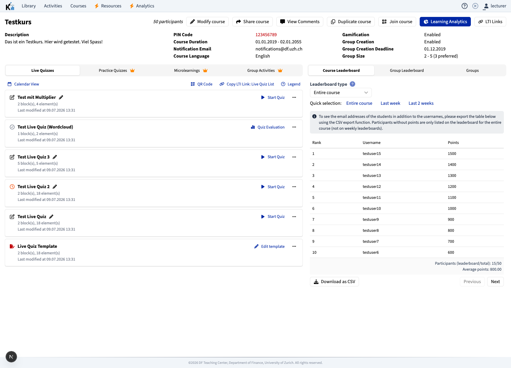
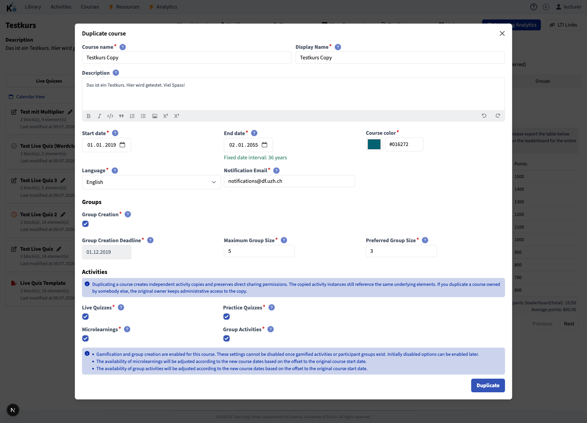
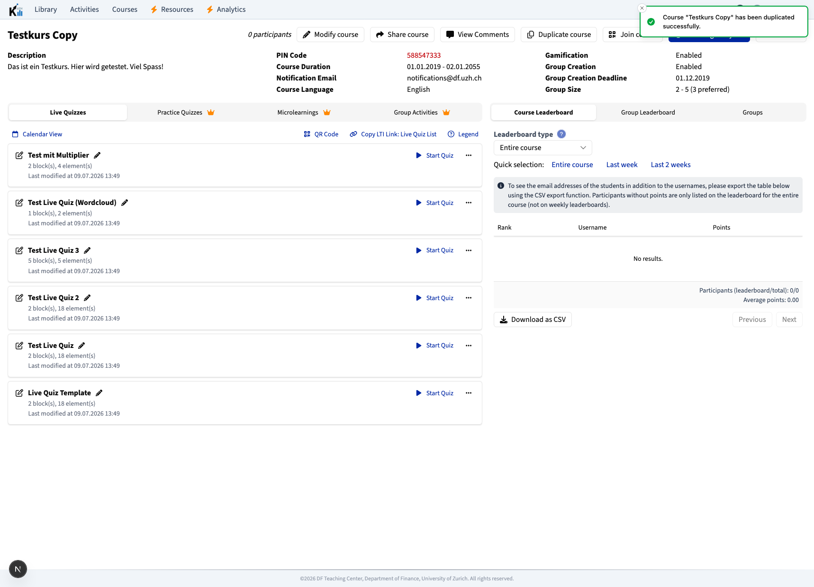
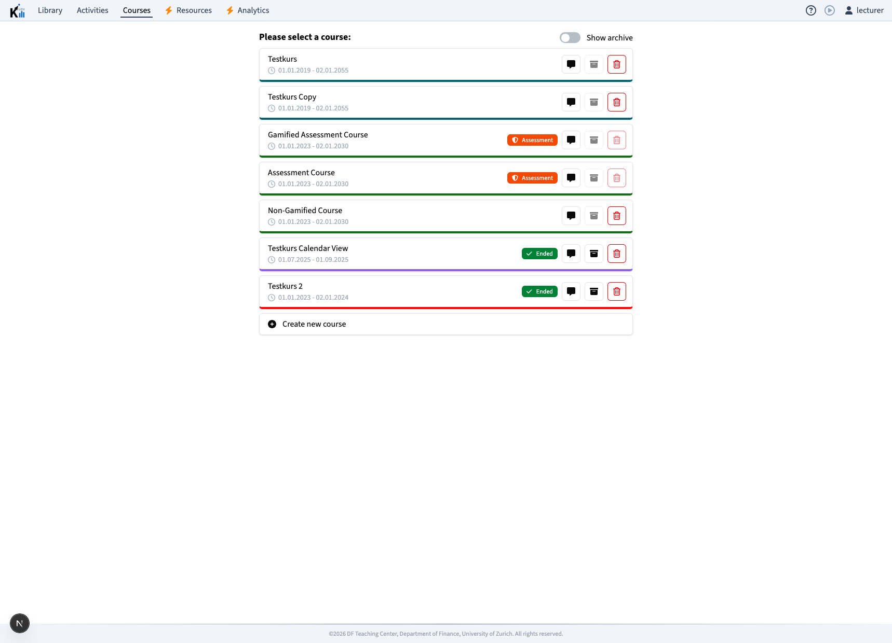

# PR documentation: Course duplication

Date: 2026-07-09
Branch context: `codex/course-duplication-devrouter` @ `d1e9a7afa`
Primary feature area: `frontend-manage`, `packages/graphql`, course/activity sharing, E2E fixtures

## Summary

This PR adds lecturer-facing course duplication. A course manager can open an existing course, click **Duplicate course**, adjust the duplicated course metadata, choose which activity categories should be copied, and create a new independent course from the source.

The new copy is designed for the common semester-to-semester workflow: reuse the course structure and activity material, but start with a clean participant and result state. The duplicated course gets fresh activity rows and fresh element-instance rows, while those instances still point to the same underlying question-bank `Element` rows. This keeps the copy lightweight and preserves shared element maintenance, without copying student data, leaderboard state, groups, or responses.

The feature also includes backend access checks and all-or-nothing transaction handling so a failed activity copy does not leave a half-created course behind.

## Screenshots

Course detail page with the new **Duplicate course** action:

Duplication modal with copied metadata, fixed course-duration interval, group settings, activity category switches, and explanatory notifications:

Successful duplication redirects to the copied course and confirms the operation with a success toast. The copied course starts with zero participants and an empty leaderboard:

The course overview then lists the copied course next to the source course:

## User-facing workflow

1. A lecturer opens a course detail page in Manage.
2. If the lecturer has manager-level access, the course header shows **Duplicate course** next to the existing course actions.
3. Clicking the button opens a dedicated duplication modal.
4. The modal is prefilled from the source course:
   - course name and display name with the localized copy suffix,
   - description,
   - start and end dates,
   - course color,
   - language,
   - notification email,
   - group creation settings,
   - maximum and preferred group size.
5. The lecturer chooses which activity categories to copy:
   - Live Quizzes,
   - Practice Quizzes,
   - Microlearnings,
   - Group Activities.
6. Submitting the modal creates the duplicated course.
7. On success, Manage shows a success toast and redirects directly to the duplicated course.
8. On failure, Manage shows a duplication-specific error toast instead of the generic course-creation error.

## Important UI behavior

The duplication modal intentionally differs from the normal course settings modal:

- The submit action says **Duplicate** / **Duplizieren**, not "Create".
- A copy-info notification explains that activities are copied independently, direct sharing permissions are preserved, and copied activity instances still reference the same underlying elements.
- The course duration is fixed to the source course duration while the copy is being created. Changing the start date shifts the end date by the same interval; changing the end date back-shifts the start date. The interval is displayed with localized ICU plural messages.
- Group creation can be disabled for the duplicated course when applicable. If group creation is disabled, group activities are automatically deselected and cannot be copied.
- Microlearning and group-activity availability dates are shifted by the new course-start offset.
- If a shifted group-creation deadline or duplicated course end date lands in the past, the modal shows an explicit warning.
- While the mutation is running, the submit control is disabled and shows the "Duplicating large courses can take a while" progress text.

## API shape

No separate GraphQL mutation was added. The existing `createCourse` mutation now acts as both:

- normal course creation when no `id` is passed,
- course duplication when `id` contains the source course id.

The frontend calls `CreateCourseDocument` with the usual course fields plus:

- `id`,
- `duplicateLiveQuizzes`,
- `duplicatePracticeQuizzes`,
- `duplicateMicrolearnings`,
- `duplicateGroupActivities`.

The resolver dispatches to `CourseService.duplicateCourse` when `id` is present.

## What is copied

The duplicated course copies the course-level configuration needed to reuse the source course:

- name, display name, description, color, language, dates, notification email,
- group-creation settings and group sizes from the modal,
- source gamification flag,
- source assessment flag,
- source competency tree reference,
- source course authentication type,
- selected live quizzes,
- selected practice quizzes,
- selected microlearnings,
- selected group activities,
- direct sharing permissions on the course,
- direct sharing permissions on copied activities,
- audit-log entries for copied permissions.

If a non-owner admin duplicates a course, the duplicating user becomes owner of the new course and the original course owner receives ADMIN access on the copy. This keeps the copy usable for the duplicator while preventing accidental lockout of the original owner.

## What is not copied

The copy deliberately starts as a clean course for a new cohort. The following data is not copied:

- participants,
- participations,
- participant groups,
- leaderboard entries,
- live quiz responses,
- practice quiz responses,
- microlearning responses,
- group activity responses,
- accumulated element-instance results,
- anonymous result aggregates,
- instance statistics from the source course,
- deleted source activities.

Live quiz PINs are not reused. New live quiz copies receive fresh PIN behavior through the existing activity creation services. For SSO-authenticated courses, the copied course keeps the auth type but the PIN code is nulled.

## Activity and element semantics

The feature separates three concepts:

- **Activities are copied.** The copied course receives new activity rows for the selected activity categories.
- **Element instances are copied.** Each copied activity receives new `ElementInstance` rows.
- **Elements are shared.** The new instances still connect to the same underlying `Element` rows as the source instances.

This means duplicated courses do not share student result state, but they do share the same reusable question-bank elements. The copied instances preserve the source instance `elementData` snapshot, so the duplicated course starts with the item version that was used in the source course at publication time.

If an underlying element is edited later, the usual instance-update flow is responsible for propagating those changes. The PR also adjusts instance-update activity lookup so cross-course activity references remain understandable.

## Date handling

Microlearning and group-activity schedules are shifted by the difference between the source course start date and the new course start date.

The backend computes this with a rounded day delta instead of truncating the exact timestamp difference. This matters around daylight-saving transitions and older non-midnight course timestamps, where a mathematically exact difference can be `243.958` days even though the intended local-calendar shift is `244` days. The date helper is covered by unit tests in `packages/graphql/test/courseDuplicationDates.test.ts`.

## Permission and security model

The duplicate button is shown only for course managers, but the backend is the actual security boundary.

The duplication service uses layered fail-closed checks:

1. The user must have ADMIN access on the source course before the service reads the course.
2. Derived permissions for the source course are recomputed.
3. ADMIN access on the source course is checked again after recomputation.
4. For every selected activity category, the user must have ADMIN access on every selected source activity.
5. For every selected element instance, the underlying element must have an ADMIN or OWNER derived permission for the user.
6. Any missing activity or element-instance access aborts duplication before the copy transaction.

Partial-copy failures throw a `GraphQLError` with `extensions.code = COURSE_DUPLICATION_PARTIAL_FAILURE`. The frontend maps this to a dedicated "No partial course was created" toast.

## Transaction behavior

Course duplication runs inside one interactive Prisma transaction with a 10-minute timeout. The transaction creates the course, copies the selected activities, copies relevant permissions, grants the original owner access when needed, recomputes derived permissions for the copy, and returns the refreshed course.

If an activity or instance required for duplication cannot be copied, the transaction is rolled back. The copied course is not left behind.

## Review issues addressed

This PR also addresses issues raised in previous reviews:

- The previous source-course access gap is closed by backend ADMIN checks before source course data is loaded.
- Selected activity and selected element-instance access are checked separately.
- Partial-copy failures no longer leave an orphaned course.
- The frontend has duplication-specific error toasts for access, partial-copy, and generic failures.
- Successful duplication redirects to the copied course.
- The modal displays a progress affordance for large courses.
- The submit button uses duplication wording.
- Group-size conversion falls back to source-course values instead of producing `NaN`.
- The English-only duration string was replaced with localized ICU plural messages.
- Dead validation props inherited from the edit modal were removed from the duplication modal.
- The group-deadline warning no longer depends on a disabled field being touched.
- The shared course name/display name/description fields were extracted into `CourseInformationFields` to reduce duplicated modal code.
- The helper component prop objects in the duplication modal are marked `Readonly` where relevant.
- Caught duplication errors in the course overview header are sent to `console.error`.

## Automated coverage

The branch includes coverage across Playwright, Cypress, and Vitest:

- Full course duplication with copied live quiz, practice quiz, microlearning, and group activity.
- Copied course appears in the course list and opens after duplication.
- Copied activities reference fresh activity and instance ids.
- Source and copied live quiz responses remain separated.
- Duplicating with group creation disabled does not copy group activities.
- Admin user can duplicate selected activity categories.
- Direct course and activity permissions are preserved on copied objects.
- Original owner keeps ADMIN access when another admin duplicates the course.
- Partial activity duplication failure shows the dedicated error and leaves no copied course.
- Date-offset helper handles aligned timestamps, daylight-saving transitions, legacy non-midnight timestamps, and negative offsets.

Relevant tests:

- `playwright/tests/N-course.spec.ts`
- `cypress/cypress/e2e/N-course-workflow.cy.ts`
- `packages/graphql/test/courseDuplicationDates.test.ts`

## Suggested manual QA

1. Start the dev environment and open Manage.
2. Log in as a seeded lecturer.
3. Open a course containing all four activity categories.
4. Click **Duplicate course**.
5. Verify the modal is prefilled and the course duration stays fixed when changing start/end dates.
6. Disable group creation and confirm group activities are deselected and disabled.
7. Submit the copy.
8. Confirm the success toast and redirect to the new course.
9. Confirm the copied course contains only selected activity categories.
10. Confirm participants, groups, leaderboard entries, and responses were not copied.
11. Duplicate as a shared ADMIN user and confirm the original owner keeps ADMIN access.
12. Run the partial-failure fixture and confirm no copied course remains after the error.

## Main implementation files

- `apps/frontend-manage/src/components/courses/CourseOverviewHeader.tsx`
- `apps/frontend-manage/src/components/courses/modals/CourseDuplicationModal.tsx`
- `apps/frontend-manage/src/components/courses/modals/CourseInformationFields.tsx`
- `packages/graphql/src/schema/mutation.ts`
- `packages/graphql/src/services/courses.ts`
- `packages/util/src/elements.ts`
- `packages/i18n/messages/en.ts`
- `packages/i18n/messages/de.ts`
- `apps/docs/docs/tutorials/course_management.mdx`
- `docs/domain-model.md`

## Operational notes

Course duplication can be a relatively large transaction for courses with many activities and instances. The frontend now communicates that the operation may take time. After merge, it is still worth watching backend logs for transaction timeouts or partial-copy errors during the first weeks of real usage.

The most important product note for lecturers is that duplicated courses share the same underlying elements. That is intentional and should be documented wherever lecturer-facing release notes or help pages explain this feature.
