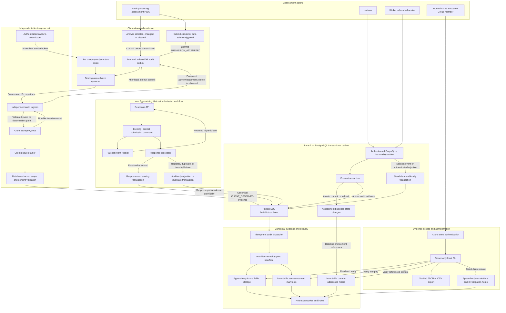
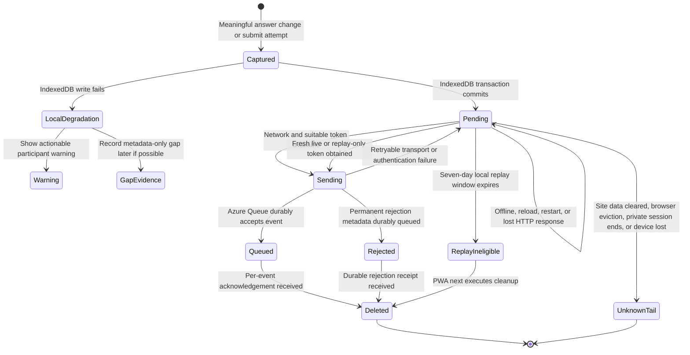
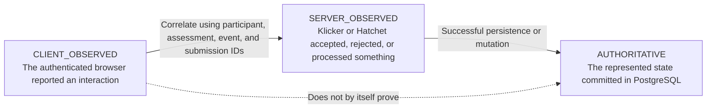

# Assessment Audit Logging Design

- **Status:** Approved decisions (revision 6), awaiting written-spec review
- **Date:** 2026-08-04
- **Last updated:** 2026-08-06 (revision 6 with durable client outbox)
- **Target branch:** `v3`
- **Related work:** [PR #4872](https://github.com/uzh-bf/klicker-uzh/pull/4872), [PR #4946](https://github.com/uzh-bf/klicker-uzh/pull/4946)

## Summary

KlickerUZH needs provider-neutral audit logging for assessment-enabled
LiveQuizzes. The first production release records the assessment state presented
to participants, material lecturer and system changes, participant interaction,
the complete submission lifecycle, grading and corrections, and assessment
report issuance. The evidence supports disputes such as "I submitted answer X"
or "I did not delete that question."

The production evidence store is Azure Table Storage. Application code treats
it as append-only. Human evidence access is controlled through Azure data-plane
authorization, independently of Klicker roles; the intended Resource Group
members are the user and their supervisor. A local operator CLI produces a
canonical JSON evidence bundle and a readable CSV projection.

Server evidence uses two emission lanes that converge on one PostgreSQL outbox
and one Azure delivery pipeline. Lane 1 writes canonical audit records directly
to the outbox; critical assessment mutations do so in the same Prisma
transaction and fail closed. Lane 2 reuses an existing durable Hatchet assessment
command as the source from which the response processor materializes canonical
audit records into the outbox. In v1, Lane 2 is limited to participant
submissions; there is no generic Hatchet audit emitter.

Client-observed evidence uses an independent third capture path. The PWA sends
events through a bounded IndexedDB client outbox to a separately deployable audit
ingress using a short-lived, assessment-scoped capture token. The ingress
validates the token and batch, then acknowledges only after Azure Storage Queue
durably accepts the message. The PWA removes acknowledged records immediately;
unacknowledged records become ineligible for replay after seven days and are
purged the next time the origin runs cleanup. A worker drains the queue, performs
database-backed scope validation, and materializes canonical records into the
shared outbox. Capture tokens and direct participant identifiers are never
persisted in the browser outbox.

A dispatcher writes every canonical application record from the outbox to Azure
Table Storage through a provider-neutral append interface. Owner annotations and
investigation holds are the sole direct-Azure exception: the
Azure-authenticated CLI appends them to an Azure control table.

Hatchet therefore remains Klicker's trusted submission transport and forms the
narrow second emission lane without becoming a second Azure delivery pipeline.
A stable `submissionId` and the Hatchet event ID correlate server acceptance,
rejection, duplication, persistence, and scoring. The audit design introduces
neither a duplicate submission message nor a separate generic audit queue.

Daily per-assessment event-hash manifests are written to immutable Azure Blob
Storage. Exact assessment media are captured separately as immutable,
content-addressed blobs. Table Storage remains the searchable evidence store;
the blobs preserve media and detect later evidence mutation or deletion.

## Decision log

These decisions were confirmed through the design review and grilling session
completed on 2026-08-06.

| # | Decision |
| --- | --- |
| 1 | The core contract and sink boundary are reusable, but v1 instruments only assessment-enabled LiveQuiz. PracticeQuiz, MicroLearning, GroupActivity, and unrelated authentication activity are excluded. |
| 2 | The implementation retains two server emission lanes that converge on one durable audit delivery path. Lane 1 writes canonical events to the PostgreSQL outbox. Lane 2 materializes evidence from an existing durable Hatchet assessment command into that outbox and is limited to submissions in v1. |
| 3 | Critical authoritative assessment changes fail closed and commit their outbox evidence in the same Prisma transaction. |
| 4 | Client-observed events use an independent audit ingress and durable Azure Storage Queue. Before transmission, the PWA commits them to a bounded IndexedDB client outbox and removes them after durable ingress acknowledgement or application-level expiry. Capture tokens remain memory-only. |
| 5 | Client evidence describes what an authenticated browser session reported. Server evidence describes what Klicker accepted or persisted. Neither claims to prove a person's subjective intent. |
| 6 | Every submission uses one stable `submissionId`; separate events represent server acceptance, rejection, duplication, persistence, and scoring. The Hatchet event ID is retained for correlation. |
| 7 | Audit coverage starts with a complete activation baseline and remains sticky. Existing nonterminal assessment-enabled LiveQuizzes receive a clearly incomplete rollout-current-state baseline. |
| 8 | The baseline is a root plus deterministic per-entity parts, not one unbounded aggregate object. Exact Klicker-owned media are captured in immutable Blob Storage. |
| 9 | Human evidence readers are trusted Azure Resource Group members. No Klicker account, role, API, or UI grants evidence-read access. Non-human identities receive the least privilege needed for automated processing. |
| 10 | Evidence is retained for one year after the latest assessment completion. Cancellation or deletion anchors retention when no later completion exists; active investigation holds pause deletion. |
| 11 | Every stored copy has an explicit lifecycle. Canonical evidence and integrity artifacts remain through the one-year boundary; transient transport copies are removed after durable handoff and never retained beyond that boundary. |
| 12 | Assessment-related effects inside Klicker and Hatchet are in scope. LTI, OLAT, LMS grade transfer, and other external-service effects are excluded from v1. |
| 13 | Assessment report issuance, supersession, and revocation are in scope; public report reads and evidence reads are not audited. |
| 14 | The rollout requires a UZH privacy review before the pilot. Formal approval is required only if the applicable UZH process demands it. |
| 15 | Delivery is organized as two sequential native stacks: authoritative evidence first, then client-observed evidence. |
| 16 | The browser-survival guarantee begins only after the IndexedDB transaction commits and covers ordinary reloads, browser restarts, and temporary offline periods for a seven-day replay window. Expired records are purged the next time the origin runs; IndexedDB cannot execute deletion while Klicker is not running. Replay-only token issuance is also capped from trusted server-side lifecycle time, so an altered browser clock cannot extend replay. Manual storage clearing, browser eviction, private-session termination, device loss, and failure before the commit remain explicit limitations. |

## Goals

- Reconstruct assessment content, access, participation, submissions, grading,
  corrections, reports, and deletion from the activation baseline onward.
- Preserve exact normalized values, content versions, server times, client
  context, provenance, and cryptographic hashes.
- Make critical authoritative changes inseparable from durable outbox capture.
- Keep the response API independent of PostgreSQL by deriving submission
  evidence from its existing durable Hatchet command, without emitting a
  duplicate audit message.
- Keep client capture available during a main Klicker backend outage through an
  independently deployable ingress and durable queue.
- Preserve unacknowledged client evidence across ordinary reloads, browser
  restarts, and temporary offline periods through a bounded seven-day client
  outbox.
- Distinguish browser-observed assertions, server transport acceptance, and
  authoritative database persistence.
- Keep Azure SDK types, keys, credentials, and error codes outside domain
  producers.
- Provide verified event, participant-within-assessment, and complete-assessment
  exports through an Azure-authenticated owner CLI.
- Retain evidence for one year after the assessment's final completion while
  supporting explicit investigation holds.
- Roll out progressively and report coverage gaps honestly.

## Non-goals

- Instrumenting assessment-enabled PracticeQuiz, MicroLearning, or GroupActivity
  in v1.
- A platform-wide authentication or observability system.
- Replaying browser-side audit records after durable ingress acknowledgement or
  beyond seven days.
- Persisting audit payloads in localStorage, sessionStorage, Cache Storage,
  cookies, or any browser store other than the dedicated IndexedDB outbox.
- Guaranteeing browser evidence survives manual site-data clearing, browser
  eviction, private-session termination, device loss, or failure before its
  IndexedDB transaction commits.
- Guaranteeing physical browser-record deletion at an exact wall-clock deadline
  while the Klicker origin is not running; cleanup occurs at the next execution
  opportunity.
- Changing response acceptance, deadline, or lifecycle rules, or guaranteeing
  that an offline submit attempt later becomes an authoritative submission.
- A generic Hatchet audit-emitter SDK for services without a concrete v1
  assessment command.
- Auditing LTI, OLAT, LMS grade transfer, email delivery, or other external
  service internals in v1.
- Mouse movements, individual keystrokes, focus changes, route changes,
  performance telemetry, unchanged autosaves, or passive lecturer views.
- Proving who physically operated a device or whether an action was intentional.
- A lecturer-, participant-, or Klicker-administrator-visible evidence UI.
- Automatic adjudication of complaints.
- Reusing the sharing-domain `AuditLogEntry` as the evidence store.
- Runtime selection among multiple storage providers. Azure is the only v1
  adapter.
- Historical reconstruction before the recorded coverage start.
- External notarization, protection against trusted Resource Group members, or
  cross-provider disaster recovery in v1.

## Domain vocabulary and coverage boundary

- A lecturer or administrator is a `User`.
- A student is a `Participant`, connected to a `Course` through `Participation`.
- The v1 audited activity is a `LiveQuiz` with `isAssessmentEnabled`, normally
  inherited from a `Course` with `isAssessmentEnabled`.
- An `Element` is the versioned source question. An `ElementInstance` is the
  effective snapshot placed in a LiveQuiz `ElementBlock`.
- The stable `Participant.id` is the pseudonymous evidence identifier. The audit
  store contains no separate UUID-to-person mapping.

Coverage begins when assessment mode first becomes effective for the LiveQuiz,
whether directly or through assignment to an assessment-enabled Course.
Pre-activation draft edits are not retained individually. Activation performs
an audit-readiness check and commits a sticky coverage marker plus the complete
baseline outbox records atomically.

Coverage cannot be disabled after activation. Disabling assessment mode,
detaching the quiz, ending it, reopening it, or deleting it does not remove the
coverage marker. A failed critical audit insert fails the related assessment
mutation.

Every existing nonterminal assessment-enabled LiveQuiz—scheduled, published,
running, paused, or otherwise still capable of future assessment actions—receives
a `ROLLOUT_CONFIGURATION_CURRENT_STATE` baseline. Assessments completed,
cancelled, or deleted before rollout are initially outside coverage. Reopening
one of these assessments atomically creates its rollout-current-state baseline
and sticky coverage marker before the assessment can accept further actions.
Exports identify the rollout coverage start and missing historical coverage.
Unavailable media and other rollout limitations appear as explicit coverage
gaps.

Updates to a source `Element` referenced by an audited assessment are recorded
as contextual provenance, including whether the effective `ElementInstance`
changed. Refreshing the instance from its source is a separate effective-content
mutation with exact before and after evidence.

## Evidence claims

Audit events are technical evidence attributed to sessions and server
components:

- `CLIENT_OBSERVED` establishes that a valid capture token issued to an
  authenticated browser session reported an interaction. It does not establish
  that the normal UI produced the claim, who physically used the device, or
  whether the interaction was intentional.
- `SERVER_OBSERVED` establishes that a trusted Klicker component accepted or
  rejected a request or command.
- `AUTHORITATIVE` establishes that the represented business state was committed
  in PostgreSQL.
- `ADMINISTRATIVE` establishes that an Azure-authenticated evidence owner
  appended a control action such as an annotation or investigation hold.

An export must preserve these labels. It may say that Klicker has no
authoritative evidence of receiving an action during a verified coverage
interval. It must not infer that the participant did not perform an untransmitted
local action.

## Architecture

### Emission lanes and persistence paths

The two server lanes describe how server evidence first becomes durable. They do
not create separate Table pipelines: both produce canonical records in the same
PostgreSQL outbox. Client observations use an independent ingress and Azure
Storage Queue before joining that outbox. Owner administration remains the
direct-Azure exception.

1. **Lane 1 — outbox emission**
   - A domain mutation receives a Prisma transaction client plus server-derived
     actor, authorization, and scope context.
   - For authoritative changes, the business rows and one or more
     `AuditOutboxEvent` rows commit or roll back together.
   - This path covers activated LiveQuiz content/configuration, permissions,
     eligibility, lifecycle, responses, grading, corrections, reports, and
     retention anchors.
   - It also covers accepted server observations with no corresponding business
     mutation through standalone outbox transactions.

2. **Lane 2 — Hatchet command materialization**
   - This lane is used only when an existing assessment operation already has a
     durable Hatchet command as its accepted transport. V1 has one such producer:
     participant submission through the response API.
   - The PWA creates and reuses a stable `submissionId`. The response API pushes
     the existing submission command and acknowledges only after Hatchet returns
     a receipt/event ID; it does not emit a second audit-specific Hatchet event.
   - The response processor materializes `SUBMISSION_SERVER_ACCEPTED` and the
     terminal processing outcome into the outbox. Persistence and scoring
     evidence commit with the response; rejection and duplicate outcomes commit
     in an audit-only transaction before the Hatchet task completes.
   - Stable submission identity, database uniqueness, and outbox idempotency make
     Hatchet retries safe. An unmaterialized command remains pending or failed in
     Hatchet and is covered by oldest-submission monitoring.

3. **Independent client ingress**
   - The authenticated assessment backend issues a short-lived capture token
     containing the stable Participant UUID, LiveQuiz, session or replay mode,
     lifecycle epoch, permitted client event families, an opaque
     assessment-specific client-subject binding, token ID, issue time, and
     expiry. The token is audience-limited to the audit ingress and remains
     memory-only in the PWA.
   - The PWA commits each meaningful event to a bounded IndexedDB client outbox
     before attempting transmission. It batches and retries pending records while
     online and replays matching records after reload or restart once it obtains
     a fresh capture token. A submit request waits for its
     `SUBMISSION_ATTEMPTED` outbox commit; answer rendering remains responsive.
   - IndexedDB contains normalized client evidence, event/stream identity,
     sequence, applicable `submissionId`, schema version, expiry, and the opaque
     subject binding only. It contains no token, cookie, solution, name, email,
     matriculation number, stable Participant UUID, or full assessment baseline.
   - The independently deployable ingress validates token signature, issuer,
     audience, expiry, batch schema, limits, and rate policy. It derives actor and
     assessment scope from token claims and never trusts identity or scope from
     the event body.
   - The ingress stamps `receivedAt`, writes the batch through a
     provider-neutral capture-queue interface, and acknowledges only after the
     Azure Storage Queue adapter confirms durable insertion. A lost response is
     retried with the same client event IDs.
   - Temporary failures remain pending. For a permanently invalid client event,
     the ingress first queues a metadata-only rejection record; only its
     durable receipt permits the PWA to delete the invalid raw local payload.
   - Batch responses contain a per-event durable outcome. The PWA deletes only
     event IDs confirmed as queued or durably rejected; one malformed event
     cannot cause acknowledged siblings to remain indefinitely or be deleted
     without their own receipt.
   - A queue drainer validates event schema and database-backed assessment scope,
     records whether referenced content matches the known assessment history,
     and materializes canonical events into the outbox. Client claims remain
     `CLIENT_OBSERVED` even when their references validate successfully.
   - The Azure adapter explicitly configures queue messages not to expire
     automatically; the default finite TTL is not accepted. Messages are
     encrypted by the Azure service, accessible only to the ingress and drainer
     identities, and deleted after durable outbox handoff. Poison messages move
     to a restricted metadata-only quarantine path without logging raw answers.

4. **Owner administrative records — direct Azure exception**
   - The Entra-authenticated owner CLI creates evidence annotations and
     investigation-hold records directly in a dedicated Azure control table.
   - The CLI has no update path. The retention worker reads the effective
     append-only hold history before deletion.
   - A CLI operation succeeds only after the control record, event locator, and
     retention-index registration exist. Partial writes are reconciled through
     idempotent retry before success is reported.

Both server lanes and the client-ingress drainer converge on one dispatcher and
one provider-neutral append interface after canonical records reach the outbox.

### Path-specific capture guarantees and timestamps

`CRITICAL` means that the component responsible for an event's declared
durability point may not acknowledge success until a durable recovery source for
that evidence exists. The mechanism differs by path and must remain visible in
the contract and export:

| Path | Required guarantee | Trusted times |
| --- | --- | --- |
| Lane 1, authoritative mutation | Business state and canonical outbox records commit or roll back in one PostgreSQL transaction. | `receivedAt` is when the trusted API/worker received or initiated the action; `recordedAt` is when the canonical event was constructed in the transaction. |
| Lane 1, standalone observation | The ingestion endpoint acknowledges acceptance only after the standalone outbox transaction commits. The browser interaction itself remains non-blocking. | `receivedAt` is when the trusted endpoint accepted the observation; `recordedAt` is when it constructed the canonical outbox event. |
| Lane 2, submission transport | The response API acknowledges only after Hatchet accepts the existing submission command and returns an event ID. The response processor does not complete the Hatchet task until terminal outcome evidence is committed to the outbox. | `receivedAt` is when the response API received the submission; `transportAttemptedAt` is stamped immediately before the Hatchet push; the returned `hatchetEventId` proves acknowledgement; `recordedAt` is when the response processor materialized the canonical event. |
| Independent client ingress | A client event is staged after its IndexedDB transaction commits. The ingress returns a per-event acknowledgement only after Azure Storage Queue durably accepts that event or all of its parts; acknowledged local records are then deleted. Pending records are eligible to replay for seven days and are purged on the next cleanup after expiry. | `clientOccurredAt` is untrusted browser context; `receivedAt` is ingress receipt; `transportAcceptedAt` is the Queue service's returned insertion time; `recordedAt` is queue-drainer materialization time. |
| Owner CLI exception | The CLI reports success only after the control record, locator, and retention-index registration exist. | `receivedAt` and `recordedAt` are trusted CLI times associated with the authenticated Azure principal. |

`transportAcceptedAt` is populated only when the durable transport returns an
accepted-time value that can travel with the durable record. The Azure Queue
adapter normalizes its returned insertion time; provider SDK types do not enter
the canonical contract. Hatchet currently returns an event ID but no server-side
acceptance time, so the contract preserves the pre-push `transportAttemptedAt`
and `hatchetEventId` rather than inventing a post-acknowledgement timestamp that
the response processor cannot recover. Exports preserve all applicable times
instead of collapsing transport attempt, acceptance, and later materialization.

### Why use narrowed server lanes plus independent client ingress

| Design choice | Argument | Difference from revision 2 |
| --- | --- | --- |
| Retain an outbox lane and a Hatchet-materialized lane | Klicker has two real server durability boundaries: PostgreSQL transactions for authoritative state and Hatchet acceptance for submissions. Modeling both makes the evidence claim and acknowledgement point explicit. | Revision 2 classified every non-PostgreSQL producer into a generic Hatchet audit lane. Revision 6 models only the existing assessment server workflow. |
| Converge both lanes on one PostgreSQL outbox | One dispatcher, retry model, quarantine path, provider adapter, and Azure delivery source are easier to verify and operate. | This convergence is retained from revision 2. |
| Reuse the existing submission command | The response API stays independent of PostgreSQL, and the Hatchet receipt is meaningful evidence of server acceptance. Reusing the command avoids ordering races between a submission and a duplicate audit message. | Revision 2 proposed a reusable typed audit emitter and append task for stateless services. Revision 6 needs no additional audit message for the response API. |
| Keep critical authoritative effects in database transactions | Hatchet acceptance proves transport, but only the response transaction can prove persistence and scoring. Those events therefore remain atomic with their PostgreSQL effects. | Revision 2 allowed only Lane 1 to be critical. Revision 6 instead ties each critical event to its actual durability point: Hatchet receipt for accepted transport, PostgreSQL transaction for authoritative effects. |
| Use an independent client ingress and durable queue | Client observations can be accepted while the main Klicker backend, PostgreSQL, or Hatchet workers are temporarily unavailable. The scoped token preserves trusted participant and assessment attribution until database validation resumes. | This restores revision 2's independent-ingress benefit while adding explicit assessment scoping and delayed database validation. |
| Use a narrow durable browser outbox | Once staged, client observations survive ordinary reloads and temporary offline periods. Immediate deletion after acknowledgement, a seven-day replay window, next-execution expiry cleanup, payload minimization, subject binding, and memory-only tokens limit the added device-side exposure. | Revision 2 also used IndexedDB, but did not define this complete storage lifecycle, scoped replay identity, or separation between persisted answer evidence and non-persisted credentials. |
| Do not implement a generic Lane 2 yet | No other in-scope v1 assessment producer requires it. Avoiding an unused emitter SDK, bounded process buffers, producer heartbeats, and synthetic gap records reduces failure modes and review surface. | These mechanisms were required by revision 2 because its generic lane covered auth, stateless workers, and future services. Those producers are outside the current scope or can use Lane 1. |

Lane 2 may be expanded later only for a concrete Klicker or Hatchet assessment
producer that cannot participate in a PostgreSQL transaction and already has, or
justifies, a durable command transport. Such an expansion must define its trusted
acknowledgement point, idempotency identity, retry and cleanup lifecycle,
criticality limits, monitoring, and how canonical records reach the shared
outbox. Merely avoiding a database call is not sufficient justification.

### Hatchet roles and provider-neutral boundary

Hatchet has three distinct roles, only the first of which is an emission-lane
durability boundary:

1. **Submission transport:** Hatchet acceptance is the durable recovery source
   for the Lane 2 submission command.
2. **Response processing:** the response worker maps the Hatchet command and task
   metadata into provider-neutral canonical audit events. Hatchet SDK and command
   types do not cross into the audit contract package.
3. **Audit worker runtime:** `hatchet-worker-general` may schedule or execute the
   client-queue drainer, dispatcher, manifest, media, and retention jobs. Azure
   Queue messages remain the durable source before client-event materialization;
   PostgreSQL outbox rows remain the durable source afterward. Losing or retrying
   a worker task cannot lose either durable record.

The provider-neutral boundary includes the client-capture queue and canonical
append-sink interfaces. Azure types remain inside the queue/storage adapters, and
Hatchet types remain inside the response and worker adapters.

### Components

1. **Audit contract package** (`packages/audit`)
   - Owns versioned event schemas, exhaustive criticality mapping, runtime
     validation, normalization, redaction, RFC 8785 JCS serialization, hashes,
     provider-neutral interfaces, and test vectors.
   - Unknown event types are rejected; there is no default `STANDARD`
     classification.
   - Contains no Azure or Hatchet SDK types, command types, or credentials.

2. **Audit scope and baseline service**
   - Resolves sticky assessment coverage.
   - Performs audit-readiness checks.
   - Builds deterministic baseline root and part records without loading the
     complete assessment into one canonical object.

3. **Transactional outbox helper**
   - Accepts the caller's Prisma transaction.
   - Generates event ID, server receipt time, idempotency key, canonical payload,
     payload hash, and event hash.
   - Rejects evidence that cannot be validated or normalized, causing critical
     business mutations to roll back.

4. **Assessment capture-token issuer**
   - Uses the existing authenticated `asParticipant` assessment boundary.
   - For live capture, verifies active `Participation`, sticky LiveQuiz coverage,
     lifecycle epoch, and assessment session before issuing a signed,
     audience-scoped token.
   - For pending events after reload, may issue a replay-only token to the same
     authenticated Participant for the covered LiveQuiz/lifecycle during the
     seven-day local window, even if the assessment session has ended. Replay
     authority cannot submit a response, change assessment state, or extend the
     event's local expiry.
   - Caps replay-only token issuance at seven days after the covered lifecycle's
     trusted server-side close. Client timestamps and browser clock changes
     cannot extend this server-enforced cutoff.
   - Includes an opaque assessment-specific client-subject binding that can
     match pending local records without storing the Participant UUID in
     IndexedDB or linking the browser record across assessments.
   - Uses an asymmetric signing key so the ingress receives verification
     capability only. Token duration covers the bounded assessment session plus
     a configured outage grace period; it cannot authorize evidence reads.

5. **Independent client audit ingress** (`apps/audit-ingress`)
   - Runs independently of the main Klicker backend and worker deployment.
   - Validates the capture token and client batch, enforces size/rate limits,
     derives trusted actor/scope, and never logs raw event payloads.
   - Writes through the provider-neutral capture-queue interface. Its Azure
     adapter uses create/send semantics with the least-privileged queue identity.
   - Returns a non-secret ingress receipt ID and accepted time only after durable
     queue acknowledgement. Azure deletion credentials remain inside the
     adapter. Repeated `clientEventId` values are safe and do not create
     duplicate canonical evidence.
   - Distinguishes retryable transport/auth-refresh failures from permanent
     schema or binding failures. Before returning a permanent rejection receipt,
     it durably queues a metadata-only rejection record without the raw answer.

6. **Client queue drainer**
   - Drains Azure Queue through a least-privileged managed identity whenever the
     main stack is available.
   - Performs database-backed coverage, lifecycle, Participation, ElementInstance,
     and content-version checks and records a stable validation result without
     upgrading client evidence to authoritative evidence.
   - Inserts accepted client events, detected gaps, append-only gap-resolution
     events, and durable client-rejection metadata into the outbox in an
     idempotent transaction, then deletes the source message.
   - Moves permanently malformed or unscoped messages to metadata-only
     quarantine; raw answers never enter logs or alerts.

7. **Hatchet submission evidence materializer**
   - Consumes the existing typed response command; no audit-only Hatchet command
     is published alongside it.
   - Preserves `submissionId`, the Hatchet event ID, original response-API receipt
     time, and trusted participant/assessment context.
   - Writes accepted, rejected, duplicate, persisted, scored, failed, and
     recovered evidence through the outbox helper at the matching durability
     point.
   - Does not complete the Hatchet task until the terminal outcome evidence has
     committed. Retries reproduce the same idempotency identities.

8. **Outbox dispatcher**
   - Leases committed rows safely across replicas.
   - Retries transient failures with backoff and jitter.
   - Retains invalid, conflicting, or oversized records in durable quarantine.
   - Marks rows cleanable only after Table insertion and successful immutable
     manifest inclusion.
   - Creates an append-only locator row for every evidence event. The locator is
     keyed by a deterministic shard of `eventId` and maps it to assessment,
     delivery partition, and row identity.

9. **Azure evidence adapter**
   - Maps canonical events to Azure Table entities and uses create operations,
     never update or upsert.
   - On conflict, reads the addressed entity and compares `eventHash`: identical
     means idempotent replay; different means integrity quarantine and alert.
   - Managed identities receive only the operations required for this processing.
     Human access remains independently restricted through Azure assignments.
   - Uses deterministic `Edm.Binary` chunks for canonical UTF-8 payload bytes;
     the initial conservative maximum is 48 KiB per binary chunk and is verified
     against real Azure.

10. **Manifest sealer**
   - Writes immutable manifests per assessment and delivery day.
   - Enumerates evidence, locator, control, and retention-index partitions
     directly so it covers dispatcher writes and direct owner-CLI writes alike.
   - Covers every confirmed Table write using sorted row identities and hashes.
   - Includes late arrivals in the next manifest and records their authoritative
     time separately.
   - Catches up missed sealing intervals and alerts on manifest age.

11. **Immutable media store**
   - Parses assessment content and explanations for referenced media.
   - Streams Klicker-owned media into a content-addressed immutable Blob while
     computing SHA-256; it does not buffer complete files in memory.
   - Records source URL, content hash, byte length, MIME type, and immutable blob
     identity in a baseline or mutation part.
   - Pins the effective assessment content to the captured version. Audited
     activation or media mutation fails if capture and verification fail.
   - Stages media before the database transaction. A failed transaction may
     leave a harmless content-addressed orphan, which a separate cleanup task
     removes only when no baseline or mutation references it.
   - External images and embeds must be imported before audited activation.

12. **Evidence operator CLI**
   - Runs locally with the invoking operator's Azure Entra credentials.
   - Has no Klicker login, evidence API, hosted UI, or shared export credential.
   - Supports one event ID, one participant UUID within one assessment, or one
     complete assessment.
   - Resolves event-ID-only queries through the sharded append-only locator table;
     it never performs an account-wide evidence scan.
   - Verifies payload chunks, baseline completeness, manifests, coverage, and
     hashes before producing canonical JSON and CSV.
   - Appends annotations and hold placement/release records directly through the
     Azure adapter; these are the only records that bypass PostgreSQL because
     their authorized source is the local Entra-authenticated tool.
   - Does not create a separate audit trail for reads.

13. **Retention worker**
    - Uses assessment lifecycle anchors and a retention index to find eligible
      evidence.
    - Runs a dry calculation, respects investigation holds, refuses early
      deletion, deletes every eligible server-managed copy, enforces expiry on
      newly received client events, and emits metadata-only deletion results.
    - Active assessments without a terminal lifecycle event are not eligible.

### Data flow

#### Complete architecture

#### Client event lifecycle

Replay-token issuance is capped independently at seven days after the trusted
server-side lifecycle close. A browser timestamp or clock change cannot extend
that cutoff. Exact physical deletion at the replay deadline is not claimed when
the Klicker origin is not running; the next origin execution performs cleanup.

#### Evidence meaning

The labels do not form an automatic promotion pipeline: a client observation
remains `CLIENT_OBSERVED` after validation. Correlated later records establish
separate server or authoritative facts. None proves who physically operated the
device or their subjective intent.

#### Storage, retention, and access overview

| Storage | Contents | Removal | Human access |
| --- | --- | --- | --- |
| IndexedDB | Exact pending client answer state; opaque binding; event and submission IDs | Immediately after durable acknowledgement, or next cleanup after the seven-day replay window | Browser-origin storage on the participant's device |
| Azure Storage Queue | Transient exact client events | After canonical outbox handoff and never beyond the central retention boundary | Managed ingress and drainer identities only |
| PostgreSQL outbox | Canonical pending evidence | After Azure insertion and successful immutable-manifest coverage | Klicker audit services |
| Azure Table Storage | Append-only canonical evidence | One year after the latest completion anchor unless held | Trusted Azure Resource Group members through Entra |
| Azure Blob Storage | Immutable manifests and captured media | Same central retention boundary | Trusted Azure Resource Group members through Entra |
| Local export | Verified JSON or CSV | Invoking operator's responsibility | Invoking Azure-authenticated operator |

## Canonical event model

| Field | Meaning |
| --- | --- |
| `eventId` | Trusted producer-generated UUID reused for delivery retries. |
| `schemaVersion` | Envelope and payload schema version. |
| `eventType` | Stable, exhaustively classified event name. |
| `criticality` | `CRITICAL` or `STANDARD`; defined explicitly per event type. |
| `evidenceClass` | `AUTHORITATIVE`, `SERVER_OBSERVED`, `CLIENT_OBSERVED`, or `ADMINISTRATIVE`. |
| `recordedVia` | `TRANSACTIONAL_OUTBOX`, `CLIENT_QUEUE_DRAINER`, `HATCHET_PROCESSOR`, `OWNER_CLI`, or `AUDIT_SERVICE`. |
| `receivedAt` | Trusted UTC time when the first Klicker component received or initiated the represented action. |
| `transportAttemptedAt` | Optional trusted UTC time immediately before a durable transport call. |
| `transportAcceptedAt` | Optional trusted UTC time returned by a durable transport as part of its receipt metadata. |
| `recordedAt` | Trusted UTC time when the canonical evidence record was constructed for its durable sink. |
| `clientOccurredAt` | Optional untrusted browser timestamp. |
| `actor` | Trusted `User`, `Participant`, `SYSTEM`, service, or Azure principal reference. |
| `initiatedBy` | Optional `User` that initiated later system work. |
| `authorization` | Auth scope object, required permission, and resolved object scope. |
| `scope` | Course, LiveQuiz, block, ElementInstance, Element, Participation, and lifecycle epoch references as applicable. |
| `correlationId` | Connects one action across API, Hatchet, worker, and persistence stages. |
| `causationId` | Optional preceding event that caused this event. |
| `submissionId` | Stable client-created submission idempotency key where applicable. |
| `hatchetEventId` | Hatchet receipt identifier where applicable. |
| `ingressReceiptId` | Non-secret independent-ingress receipt identifier where applicable; Azure deletion credentials are never canonical evidence. |
| `captureTokenId` | Non-secret identifier of the scoped token that the ingress validated when accepting the batch; a token used only during earlier local staging is not trusted provenance. |
| `scopeValidation` | Queue-drainer result for assessment/content references: matched, mismatched, or unavailable, with a stable reason. |
| `clientEventId` | Stable browser-generated UUID preserved across retries of one client event. |
| `clientStreamId` | Stable identifier for one browser event stream; a new stream receives a new ID. |
| `clientSequence` | Monotonic sequence for browser-observed events. |
| `outcome` | Stable success, rejection, duplicate, failure, or recovery reason code. |
| `payload` | Exact normalized event-specific evidence. |
| `payloadHash` | SHA-256 of canonical payload bytes. |
| `eventHash` | SHA-256 of the canonical envelope excluding `eventHash`. |
| `idempotencyKey` | Server-derived key preventing duplicate evidence for one transition. |

`emissionPath` is exhaustive contract metadata derived from `eventType`, rather
than a second producer-supplied envelope value that could drift. Exports include
the derived path, and runtime validation rejects a `recordedVia` value that is
not allowed for that path and event type.

Canonical JSON follows RFC 8785 JCS. Domain normalization fixes answer option
ordering and represents dates as UTC ISO 8601 strings. Test vectors cover
numbers, nulls, Unicode, object key order, answer order, and dates. Exact values
are retained because hashes alone cannot reconstruct a dispute.

## Event matrix

Every event has exactly one emission path, producer, evidence class, criticality,
and durability point. The contract contains the individual stable names within
each family. The emission path classifies canonical event capture, not the worker
runtime; a Hatchet-scheduled worker can still produce a Lane 1 transaction.

| Event family | Events included in v1 | Emission path | Producer | Class / criticality | Durability and acknowledgement |
| --- | --- | --- | --- | --- | --- |
| Coverage and baseline | audit activated; baseline root/part recorded; rollout-current-state recorded | `LANE_1_OUTBOX` | GraphQL assessment activation or reopening of an excluded pre-rollout assessment | `AUTHORITATIVE` / `CRITICAL` | Coverage marker and all baseline outbox parts commit with activation or before reopening. |
| Assessment lifecycle | assessment mode/course assignment changed; published; started; paused; resumed; completed; reopened; cancelled; reset; copied; imported; deleted | `LANE_1_OUTBOX` | GraphQL mutation or scheduled worker | `AUTHORITATIVE` / `CRITICAL` | Lifecycle state and event commit in one transaction. `SYSTEM` plus `initiatedBy` identifies scheduled work. |
| LiveQuiz configuration | metadata, options, restrictions, points, timing, access settings, and grading configuration changed | `LANE_1_OUTBOX` | GraphQL lecturer mutation | `AUTHORITATIVE` / `CRITICAL` | Exact affected-entity before/after values commit with the mutation. |
| Blocks | created, updated, reordered, activated, closed, deleted | `LANE_1_OUTBOX` | GraphQL lecturer mutation or scheduled worker | `AUTHORITATIVE` / `CRITICAL` | Exact block before/after values commit with the mutation. |
| ElementInstances | added, refreshed, updated, reordered, removed, deleted | `LANE_1_OUTBOX` | GraphQL lecturer mutation | `AUTHORITATIVE` / `CRITICAL` | Exact effective instance before/after values and content hashes commit with the mutation. |
| Source Elements and media | referenced source changed; effective content changed/unchanged; media captured/replaced | `LANE_1_OUTBOX` | GraphQL lecturer mutation and media readiness service | `AUTHORITATIVE` / `CRITICAL` | Source provenance and immutable media identity commit before the effective mutation succeeds. |
| Eligibility and permissions | participant eligibility added/removed; assessment-relevant lecturer permission changed | `LANE_1_OUTBOX` | GraphQL mutation | `AUTHORITATIVE` / `CRITICAL` | Permission/Participation change and evidence commit atomically. |
| Assessment session | session started, resumed, ended, forcibly terminated | `LANE_1_OUTBOX` | Existing authenticated assessment endpoints | `SERVER_OBSERVED` / `STANDARD` | A successful audit-only outbox transaction acknowledges recording; no passive page/focus events. |
| Participant answer state | answer state changed/cleared; text/numerical state committed after idle, blur, navigation, or submit | `CLIENT_INGRESS` | PWA through independent ingress and queue drainer | `CLIENT_OBSERVED` / `STANDARD` | The PWA stages the event in IndexedDB before transmission. Ingress acknowledges after durable queue insertion; acknowledgement removes the local record. Answer rendering does not wait for ingress. |
| Submission attempt | submit clicked; auto-submit triggered | `CLIENT_INGRESS` | PWA through independent ingress and queue drainer | `CLIENT_OBSERVED` / `STANDARD` | The submit request follows the durable local outbox commit. This evidence still does not mean server acceptance. |
| Submission validation and outcome | server accepted; validated; rejected; duplicate; processing failed/recovered | `LANE_2_HATCHET` | Response processor materializing the Hatchet command and result | `SERVER_OBSERVED`; accepted/validated/rejected/duplicate are `CRITICAL`, operational failure/recovery is `STANDARD` | Hatchet receipt exists first. Accepted plus validated/rejected/duplicate evidence commits in an audit-only or response transaction before task completion. |
| Submission persistence and scoring | persisted; scored | `LANE_2_HATCHET` | Response processor | `AUTHORITATIVE` / `CRITICAL` | Persistence and scoring evidence commit atomically with the response and stored scoring result. |
| Post-submission scoring and responses | score recomputed; response modified/deleted; points corrected; participant reset/removed | `LANE_1_OUTBOX` | GraphQL mutation or scheduled worker | `AUTHORITATIVE` / `CRITICAL` | Exact previous/new response or score, stable reason, actor, and algorithm/config version commit with the change. |
| Bulk operations | bulk operation started/completed plus per-item outcomes | `LANE_1_OUTBOX` | GraphQL mutation or worker | `AUTHORITATIVE` / `CRITICAL` | Root and per-item outcome events are committed with each authoritative effect; partial outcomes remain explicit. |
| Assessment reports | issued; superseded; revoked | `LANE_1_OUTBOX` | Assessment-report service | `AUTHORITATIVE` / `CRITICAL` | Report row, snapshot hash, and audit event commit in one transaction. Public reads are excluded. |
| Authenticated rejections | an authenticated assessment-scoped action was rejected | `LANE_1_OUTBOX` | Protected API or worker that rejects the action | `SERVER_OBSERVED` / `STANDARD` | An audit-only outbox transaction records attempted action and stable reason without raw request data. |
| Evidence administration | evidence annotation; investigation hold placed/released | `OWNER_CLI` | Owner CLI | `ADMINISTRATIVE` / `STANDARD` | Direct Azure create in the control table references the original evidence or assessment. Existing evidence is never changed. |
| Client-capture operations | client gap detected/resolved; client event permanently rejected | `CLIENT_INGRESS` | Independent ingress and client queue drainer | `SERVER_OBSERVED` / `STANDARD` | Permanent rejection metadata is durable in Azure Queue before the raw local payload may be deleted. Gap detection and resolution commit through standalone outbox transactions; earlier records are never updated. |
| Audit operations | delivery delayed/conflicted/quarantined/recovered; manifest sealed/failed; retention completed/failed | `LANE_1_OUTBOX` | Audit services | `SERVER_OBSERVED` / `STANDARD` | Operational evidence never masquerades as an assessment action. Recovery is appended; earlier records are never updated. |

Authenticated assessment-scoped rejections use stable reason codes. Raw
unauthenticated traffic, credentials, tokens, cookies, PINs, headers, stack
traces, and unnormalized error messages never enter the evidence store.

### Stable v1 event names

The v1 contract defines these names; none are reserved without a producer:

- Coverage and baseline: `ASSESSMENT_AUDIT_ACTIVATED`,
  `ASSESSMENT_ROLLOUT_BASELINE_RECORDED`,
  `ASSESSMENT_BASELINE_ROOT_RECORDED`, and
  `ASSESSMENT_BASELINE_PART_RECORDED`.
- Lifecycle: `ASSESSMENT_MODE_CHANGED`,
  `ASSESSMENT_COURSE_ASSIGNMENT_CHANGED`, `ASSESSMENT_PUBLISHED`,
  `ASSESSMENT_STARTED`, `ASSESSMENT_PAUSED`, `ASSESSMENT_RESUMED`,
  `ASSESSMENT_COMPLETED`, `ASSESSMENT_REOPENED`, `ASSESSMENT_CANCELLED`,
  `ASSESSMENT_RESET`, `ASSESSMENT_COPIED`, `ASSESSMENT_IMPORTED`, and
  `ASSESSMENT_DELETED`.
- Configuration and content: `ASSESSMENT_CONFIGURATION_CHANGED`,
  `ASSESSMENT_BLOCK_CREATED`, `ASSESSMENT_BLOCK_UPDATED`,
  `ASSESSMENT_BLOCK_REORDERED`, `ASSESSMENT_BLOCK_ACTIVATED`,
  `ASSESSMENT_BLOCK_CLOSED`, `ASSESSMENT_BLOCK_DELETED`,
  `ASSESSMENT_ELEMENT_INSTANCE_ADDED`,
  `ASSESSMENT_ELEMENT_INSTANCE_REFRESHED`,
  `ASSESSMENT_ELEMENT_INSTANCE_UPDATED`,
  `ASSESSMENT_ELEMENT_INSTANCE_REORDERED`,
  `ASSESSMENT_ELEMENT_INSTANCE_REMOVED`,
  `ASSESSMENT_ELEMENT_INSTANCE_DELETED`,
  `ASSESSMENT_SOURCE_ELEMENT_CHANGED`, `ASSESSMENT_MEDIA_CAPTURED`, and
  `ASSESSMENT_MEDIA_REPLACED`.
- Eligibility, permissions, and session:
  `ASSESSMENT_PARTICIPANT_ELIGIBILITY_CHANGED`,
  `ASSESSMENT_LECTURER_PERMISSION_CHANGED`, `ASSESSMENT_SESSION_STARTED`,
  `ASSESSMENT_SESSION_RESUMED`, `ASSESSMENT_SESSION_ENDED`,
  `ASSESSMENT_SESSION_FORCIBLY_TERMINATED`, and
  `ASSESSMENT_ACTION_REJECTED`.
- Client interaction: `RESPONSE_ANSWER_CHANGED`,
  `RESPONSE_ANSWER_CLEARED`, `SUBMISSION_ATTEMPTED`, and
  `SUBMISSION_AUTO_TRIGGERED`.
- Submission processing: `SUBMISSION_SERVER_ACCEPTED`,
  `SUBMISSION_VALIDATED`, `SUBMISSION_REJECTED`, `SUBMISSION_DUPLICATE`,
  `SUBMISSION_PERSISTED`, `SUBMISSION_SCORED`,
  `SUBMISSION_PROCESSING_FAILED`, and `SUBMISSION_PROCESSING_RECOVERED`.
- Responses and scores: `ASSESSMENT_SCORE_RECOMPUTED`,
  `ASSESSMENT_RESPONSE_MODIFIED`, `ASSESSMENT_RESPONSE_DELETED`,
  `ASSESSMENT_POINTS_CORRECTED`, `ASSESSMENT_PARTICIPANT_RESET`, and
  `ASSESSMENT_PARTICIPANT_REMOVED`.
- Bulk operations: `ASSESSMENT_BULK_OPERATION_STARTED`,
  `ASSESSMENT_BULK_ITEM_COMPLETED`, and
  `ASSESSMENT_BULK_OPERATION_COMPLETED`.
- Reports: `ASSESSMENT_REPORT_ISSUED`,
  `ASSESSMENT_REPORT_SUPERSEDED`, and `ASSESSMENT_REPORT_REVOKED`.
- Evidence administration: `EVIDENCE_ANNOTATION`,
  `EVIDENCE_HOLD_PLACED`, and `EVIDENCE_HOLD_RELEASED`.
- Client-capture operations: `AUDIT_GAP_DETECTED`, `AUDIT_GAP_RESOLVED`, and
  `AUDIT_CLIENT_EVENT_REJECTED`.
- Audit operations: `AUDIT_DELIVERY_DELAYED`, `AUDIT_DELIVERY_CONFLICTED`,
  `AUDIT_DELIVERY_QUARANTINED`, `AUDIT_DELIVERY_RECOVERED`,
  `AUDIT_MANIFEST_SEALED`, `AUDIT_MANIFEST_FAILED`,
  `AUDIT_RETENTION_COMPLETED`, and `AUDIT_RETENTION_FAILED`.

## Baseline and media representation

One unbounded LiveQuiz aggregate is not serialized. Activation creates:

1. `ASSESSMENT_BASELINE_ROOT` with `baselineId`, capture time, schema version,
   expected counts by part type, and an aggregate hash over deterministic
   `(partKey, payloadHash)` pairs.
2. One whitelisted LiveQuiz configuration and Course-relationship part.
3. One part per `ElementBlock`.
4. One part per effective `ElementInstance`, including ordering, options, exact
   `elementData`, source Element ID/version, and outdated status.
5. Exact solutions and scoring rules required to reconstruct correctness.
6. One part per eligible stable Participant UUID and relevant effective lecturer
   permission.
7. Media metadata parts pointing to immutable content-addressed blobs.

The aggregate hash is computed incrementally in deterministic part-key order.
Total stored content is approximately the same as one aggregate plus per-part
envelope/hash overhead; peak canonicalization memory is bounded by the largest
part. Export accepts the baseline only when all expected parts exist, every part
hash matches, and the aggregate hash recomputes correctly.

Raw Prisma objects are never spread into evidence. Fields are explicitly
whitelisted, excluding PINs, credentials, derived response results from the
activation baseline, and unrelated personal data.

## Participant interaction and submission details

### Client answer state

- SC, MC, and KPRIM contain selected option IDs plus the effective
  ElementInstance/content hashes needed to resolve the exact options shown from
  the baseline and later content evidence.
- Free-text and numerical answers are captured after a short idle interval,
  field blur, navigation, or submission—not per keystroke.
- Numerical evidence includes normalized value, unit, and applicable restriction
  context.
- Selection and case-study answers use normalized structured state.
- Every event carries the full resulting answer state, ElementInstance version,
  stable client event and stream IDs, client sequence, untrusted
  `clientOccurredAt`, expiry, schema version, and opaque local subject binding.
  The ingress records the validated replay token ID and adds trusted receipt,
  transport-acceptance, actor, and scope context; the drainer adds validation and
  materialization context.
- The PWA commits each event to a bounded, schema-versioned IndexedDB client
  outbox before transmission. It removes records only after a durable ingress
  acknowledgement or application-level expiry and retries with the same client
  event IDs while online. An event becomes ineligible for replay seven days after
  capture and is purged at the next cleanup opportunity.
- On startup, reload, or reconnection, the PWA obtains a fresh live or
  replay-only capture token and replays only records whose opaque subject,
  assessment, and lifecycle bindings match it. Capture tokens, direct
  participant identifiers, and solutions are never stored in IndexedDB.
- A submit request waits for the corresponding `SUBMISSION_ATTEMPTED` outbox
  transaction to commit. Answer-selection rendering remains responsive and does
  not wait for ingress or Azure.
- Batches are size-aware and remain below the queue adapter's tested safe limit.
  The implementation plan measures the largest valid Klicker answer envelope;
  if one valid event cannot fit, deterministic multi-message parts are required
  before client capture can be enabled. Oversized valid answers are never
  silently dropped.
- Late events remain evidence, are marked delayed, and never change an
  authoritative response or score.
- An event is covered by the browser-survival guarantee only after its IndexedDB
  transaction commits. Manual site-data clearing, browser eviction,
  private-session termination, device loss, expiry, or failure before commit can
  still lose client evidence. The design does not claim otherwise.
- IndexedDB unavailability, migration failure, or capacity exhaustion never
  silently evicts the oldest record. The PWA exposes an actionable local
  audit-degraded warning, retains what it safely can, and submits metadata-only
  gap evidence after recovery.
- Sequences are monotonic within a `clientStreamId`. Every page load, tab, or
  device creates a new stream starting at sequence one; pending records from an
  older stream remain replayable with their original identity. The drainer
  deduplicates by
  `(Participant, LiveQuiz, clientEventId)` and evaluates gaps per stream, so
  multiple tabs or devices cannot collide or create cross-stream gaps.

### Submission lifecycle

- The PWA creates `submissionId` before the first attempt and persists it
  atomically with `SUBMISSION_ATTEMPTED` before calling the response API. It
  reuses that ID for every allowed retry, including reconciliation after reload.
  After audit acknowledgement removes the raw event, a minimal retry marker may
  retain only `submissionId` and scope until a definitive response outcome or
  seven-day expiry.
- The response API includes `submissionId` in the Hatchet event and returns it
  with `hatchetEventId` after successful push.
- A failed Hatchet push returns an error; the client performs bounded retry with
  the same `submissionId`.
- Replaying client audit evidence never creates or changes an authoritative
  response. A post-reload response retry still passes normal authentication,
  lifecycle, deadline, and duplicate validation at the response API.
- The response processor uses the database uniqueness constraint as the
  duplicate authority. Redis remains only a cache and may not create an
  evidence-free success response.
- `SUBMISSION_SERVER_ACCEPTED` preserves the response API receipt time, its
  pre-push transport-attempt time, the returned Hatchet event ID, and the later
  canonical materialization time. It does not invent a Hatchet acceptance time
  that the current transport receipt does not provide.
- `SUBMISSION_PERSISTED` commits with the response. Rejection and duplicate
  outcomes preserve stable reason codes and the last durable stage.
- Raw submission payload logging is removed. Hatchet is treated as a temporary
  sensitive-data store governed by the same privacy and retention requirements.

## Failure and delivery semantics

### Critical authoritative changes

Validation, normalization, hashing, or outbox insertion failure aborts the
business transaction. This applies to every authoritative change in the event
matrix, including scheduled transitions and per-participant regrading effects.
Azure is never part of the business transaction.

### Hatchet-materialized submission evidence

The response API reports submission acceptance only after Hatchet durably
accepts the existing submission command. A failed push returns an error and the
client retries with the same `submissionId`. Once processing begins, the worker
does not complete the task until the corresponding terminal audit outcome is in
the outbox. Hatchet retry and PostgreSQL uniqueness therefore recover ambiguous
worker failures without creating a second response or audit event.

Lane 2 does not make later persistence authoritative at Hatchet time.
`SUBMISSION_SERVER_ACCEPTED` proves accepted transport; `SUBMISSION_PERSISTED`
and scoring events become authoritative only in the response transaction. An
oldest-unprocessed-submission alert exposes commands that have not yet reached a
terminal outbox outcome.

A permanently invalid command may not retry forever. If trusted participant and
assessment scope can still be established, the materializer writes a minimal
normalized `SUBMISSION_REJECTED` event with a stable reason and no raw command
payload. If trusted scope cannot be established, it writes a metadata-only
quarantine record and alerts. The Hatchet task becomes terminal only after one of
these outcomes is durable.

### Standard server and client-ingress events

The ingress returns a per-event durable outcome only after queue insertion. The
PWA retains each record in IndexedDB until its own acknowledgement, so a lost
HTTP response, reload, browser restart, or temporary offline period causes an
idempotent replay rather than loss. Ingress and Queue availability never block
answer rendering. A submit request waits only for the local
`SUBMISSION_ATTEMPTED` transaction, not for ingress or Azure.

If an already issued capture token remains valid, ingress and queue capture
continue while the main Klicker backend, PostgreSQL, or Hatchet workers are
unavailable; materialization resumes when the stack recovers. A reload discards
the memory-only token but not staged evidence. Upload resumes after the normal
authenticated backend issues a fresh live or replay-only token with matching
opaque subject, assessment, and lifecycle bindings. Replay-only tokens remain
available only until the trusted server-side replay cutoff, but cannot authorize
response submission. The design does not claim that a reloaded,
unauthenticated page can continue producing attributable assessment evidence
during a complete backend outage.

An invalid or expired token is retryable after refresh. Transport and Queue
failures remain pending with bounded backoff. A permanently invalid event does
not retry forever: the ingress queues `AUDIT_CLIENT_EVENT_REJECTED` with stable
metadata and no raw answer, then returns a durable rejection receipt that permits
local payload deletion.

The drainer does not assume Azure Queue ordering. It applies an
implementation-plan-defined reordering grace period before recording bracketed
sequence gaps. If delayed replay later fills a recorded gap, the drainer appends
`AUDIT_GAP_RESOLVED`; it never mutates the original gap. Site-data clearing,
browser eviction, private-session termination, device loss, expiration of the
seven-day replay window, or failure before the IndexedDB commit may leave an
unknowable tail.

Server-observed events without a business mutation retry their standalone outbox
transaction where practical.

### Azure delivery

- Transient provider failures retry without a finite drop limit.
- Invalid or unrepresentable records remain durably quarantined and alert.
- An identical-hash create conflict is an idempotent replay. A different hash is
  quarantined as an integrity incident.
- Outbox evidence is not deleted until Table insertion is confirmed and the row
  is included in a successfully sealed immutable manifest.
- Operational metrics expose outbox depth, oldest pending age, delivery latency,
  retries, conflicts, quarantine, ingress acceptance/error rates, metadata-only
  browser-outbox depth/age/storage-failure reports, Azure client-queue depth and
  oldest-message age, client drain latency, client gaps, oldest unprocessed
  submission, Hatchet-receipt-to-outbox materialization latency, permanently
  invalid command outcomes, manifest age, and retention failures.
- Metadata-only alerts may go to normal operations; evidence inspection remains
  limited to authorized Resource Group members.

## Append-only integrity design

Azure Table Storage is partitioned by assessment, delivery day, and deterministic
shard. Root and chunk rows for one event share a partition. A canonical
append-only Azure retention index records every evidence, locator, media,
manifest, and control partition belonging to an assessment lifecycle so deletion
can follow completion rather than the event's original day. PostgreSQL may cache
this information for scheduling but is not a second source of truth; the cache is
rebuildable from the Azure index.

The separate append-only locator table uses a deterministic shard derived from
`eventId` as its partition key and `eventId` as its row key. Each locator contains
the evidence assessment, partition, row identity, and event hash. Dispatcher and
owner-CLI operations are not complete until the evidence or control row, its
locator, and its retention-index registration exist. Partial writes are
reconciled through idempotent retry.

Large canonical payloads use deterministic binary chunks. A root stores total
byte length, chunk count, payload hash, and ordered chunk hashes. Reconstruction
rejects missing, reordered, duplicated, or altered chunks.

Normal event delivery exposes no update/upsert path. Deployment tests exercise
the effective create, read, update, and delete permissions for every human and
managed identity. Resource Group members are inside the trusted administrative
boundary.

The manifest sealer enumerates the assessment's evidence and associated control,
locator, and retention-index partitions, then writes one immutable manifest per
assessment and delivery day. A manifest contains schema version, scope, sorted
row identities and hashes, late-arrival references, previous-manifest hash,
creation time, and manifest hash. This direct enumeration ensures owner-CLI
annotations and holds are covered even though they bypass PostgreSQL. A missed
run is caught up before later manifests are considered current. Rows delivered
after sealing enter the next manifest. Export reports rows that are awaiting
their first sealing run and fails verification for older uncovered rows.

Manifests detect mutation or deletion; they do not by themselves restore lost
Table rows. Cross-region recovery and protection against trusted Resource Group
members are outside v1.

## Trust, access, and privacy

- Actor, authorization, scope, server time, event ID, and outcome are derived
  from trusted server context.
- `receivedAt`, applicable `transportAttemptedAt`/`transportAcceptedAt`, and
  `recordedAt` are trusted times with distinct meanings. `clientOccurredAt` is
  contextual and checked for unreasonable skew.
- Azure stores stable pseudonymous references, not names, emails, matriculation
  numbers, or a separate identity mapping.
- Exact answers, solutions, and assessment content are retained because they are
  required for dispute reconstruction.
- No event contains passwords, JWTs, cookies, magic links, PINs, headers,
  connection strings, Infisical values, or raw stack traces.
- Capture tokens never enter queue payloads or evidence; only their non-secret
  token IDs are retained. Queue messages contain exact client-observed answers
  transiently, receive the same encryption/access/logging restrictions as
  canonical evidence, and may never outlive its retention boundary.
- IndexedDB contains exact client-observed answer state transiently. Records are
  origin-scoped and minimized, become ineligible for replay after seven days,
  and are purged when the origin next runs cleanup. They contain neither
  credentials nor direct participant identifiers. V1 does not invent a custom
  browser cryptographic envelope; the UZH privacy review may require a reviewed
  encryption design before permitting the pilot.
- No audit payload is persisted in localStorage, sessionStorage, Cache Storage,
  or cookies.
- Raw answers and submission objects are removed from ordinary application logs.
- Human Table and manifest access is granted only through explicit Azure
  data-plane assignments to trusted Resource Group members. At design time, the
  intended human readers are the user and their supervisor.
- No Klicker role, Course permission, participant token, API, or frontend route
  grants evidence-read access.
- Managed identities may process evidence with narrowly scoped permissions;
  this is independent of human access.
- Local export files use owner-only filesystem permissions, are never uploaded
  automatically, and remain the operator's deletion responsibility.
- Evidence reads are not separately audited by this feature.

Participants are informed that assessment answer changes and submission
attempts may be stored temporarily on their device for reliable delivery and are
then retained centrally for integrity and dispute handling. Before the pilot,
the responsible UZH data-protection contact reviews proportionality, lawful
basis, notice wording, the seven-day local replay window and next-execution
deletion constraint, one-year central retention, investigation holds, access,
account deletion, browser-storage protection, and whether a formal
data-protection impact assessment or approval is required.

Participant account deletion does not rewrite evidence. The stable Participant
UUID remains for the approved retention period; identity resolution, if still
possible and authorized, happens outside this feature.

## Evidence annotations and investigation holds

Evidence is never corrected in place. An authorized owner may append an
`EVIDENCE_ANNOTATION` that references an event and contains a reason and case
reference. The original event remains authoritative and visibly separate.

An owner may place a hold on an assessment or a Participant within an assessment.
Because participant evidence depends on shared baseline, content, grading,
media, and manifests, either hold retains the complete assessment evidence
closure. The hold records case reference, owner, creation time, and review date.
It has no automatic expiry while the case remains open. Releasing it resumes the
original retention calculation. Placement and release are append-only Azure
control records.

## Export and retention

The owner CLI supports these explicit scopes:

1. One event ID.
2. One Participant UUID within one assessment.
3. One complete assessment.

Every export contains canonical records and chunks, selected filters, coverage
start, lifecycle epochs, schema versions, event count, sorted hashes, manifests,
bundle root hash, evidence-class labels, late events, detected gaps, unavailable
rollout media, and integrity status. CSV is a readable timeline and not the
canonical integrity artifact.

The retention anchor is the latest critical `ASSESSMENT_COMPLETED` event.
Reopening creates a new lifecycle epoch; a later completion replaces the anchor.
If no later completion exists, cancellation or deletion is the anchor. Active
assessments remain retained and alert after an implementation-plan-defined stale
activity threshold.

Canonical evidence, immutable media, and manifests remain available until one
year after the anchor unless an investigation hold applies. Transient copies
are removed as soon as their delivery purpose is fulfilled and may never outlive
that boundary. The retention and cleanup processes cover:

- IndexedDB client-outbox deletion immediately after ingress acknowledgement.
  Unacknowledged records become ineligible for replay seven days after capture
  and are purged on PWA startup and periodically while it remains open. If the
  origin is not executed, it cannot physically delete its IndexedDB at the exact
  deadline; the privacy review must accept this browser constraint. Manual
  clearing or browser eviction may remove records earlier. No browser copy
  participates in the one-year central-evidence retention period.
- Azure client-queue deletion immediately after durable outbox handoff. The
  drainer and retention process reject or purge messages that have crossed the
  assessment evidence boundary; raw poison payloads are deleted after a
  metadata-only quarantine record exists.
- Hatchet submission-event cleanup after the correlated terminal audit outcome
  is durable, subject to the operational replay window.
- PostgreSQL outbox cleanup only after immutable manifest inclusion; quarantine
  remains until resolved or the assessment evidence expires.
- Azure Table events and retention index.
- Immutable media and manifests, subject to their locked retention policy.
- Audit-related application/diagnostic logs, which contain no raw answers.
- Metadata-only deletion results.

Owner-created local exports cannot be deleted automatically and remain the
owner's responsibility. Retention handling is part of the feature program and
must be deployed before the first evidence becomes eligible for deletion.

## Authorization and layer footprint

- Existing lecturer mutations continue to use `asUser` and their existing
  object-specific `PermissionLevel` (`EXECUTE`, `WRITE`, or `ADMIN` as
  appropriate). Audit helpers receive and record the completed authorization
  decision; they do not replace authorization.
- The capture-token issuer uses `asParticipant`. Live tokens require active
  `Participation`, sticky LiveQuiz coverage, lifecycle epoch, and assessment
  session; replay-only tokens require the same authenticated Participant and
  covered historical lifecycle within the seven-day server-anchored replay
  cutoff. The ingress accepts only these audience-scoped tokens and exposes no
  evidence-read operation.
- The queue drainer performs delayed database-backed Participation, coverage,
  ElementInstance, and content-version validation before outbox materialization.
- The response API keeps its existing participant/session validation and adds
  stable submission identity and Hatchet receipt metadata.
- Evidence reads use Azure Entra only.

Expected implementation areas:

- `packages/prisma`: sticky audit scope, lifecycle epochs, outbox, and migrations;
  analytics schema sync where required. Azure control data—not Prisma—is
  canonical for locator, retention-index, annotation, and hold records.
- `packages/audit`: contract, normalization, hashing, transaction helper,
  provider-neutral capture-queue and append-sink interfaces, Azure adapters,
  manifest/media support, retention logic, and operator CLI.
- `packages/graphql`: activation/readiness, baseline capture, scoped capture-token
  issuance, assessment mutations, permissions, eligibility, corrections, and
  report events; generated GraphQL artifacts are committed.
- `packages/hatchet` and `apps/hatchet-worker-general`: dispatcher, manifest,
  client-queue drain, media, retention, quarantine, and operational tasks.
- `apps/audit-ingress`: independently deployable token validation, batch
  validation/rate limiting, trusted timestamps, Azure Queue insertion, receipts,
  health checks, and metadata-only diagnostics.
- `apps/response-api`: stable `submissionId`, Hatchet receipt metadata, bounded
  retry response contract, and removal of raw response logging. No new
  PostgreSQL connection is introduced.
- `apps/hatchet-worker-response-processor`: authoritative accepted, rejected,
  duplicate, persisted, scored, and recovery evidence. PostgreSQL response and
  critical evidence share a transaction; Redis and later Hatchet work remain
  outside it.
- `apps/frontend-pwa`: capture-token acquisition, meaningful interaction capture,
  schema-versioned IndexedDB client outbox, binding-aware replay, batching,
  retry/expiry/cleanup, local degradation feedback, stable submission retry, and
  privacy notice.
- `packages/prisma-data` and Playwright fixtures: synthetic assessment evidence
  scenarios without real personal data.
- Deployment configuration: independently routed ingress, exact PWA origin/CORS,
  asymmetric capture-token keys, Azure Storage Queue, Azure Table, immutable
  manifest/media Blob containers, managed identities, environment configuration,
  dashboards, and alerts.
- `docs/` and relevant skills: architecture, operation, privacy, verification,
  incident handling, and ADRs as implementation slices land.

## UI, gamification, and fixtures

- There is no evidence-search or export UI.
- The PWA adds the privacy notice, existing submission retry/error feedback, and
  an actionable warning only when local audit durability is unavailable or
  exhausted. It has no general evidence or system-wide audit-health UI.
- New participant-visible text is translated in German and English.
- Audit capture does not change points, XP, achievements, leaderboards, grading
  algorithms, or assessment results. It records their inputs and outputs.
- Synthetic fixtures cover a `User`, Participants, assessment-enabled Course,
  LiveQuiz, blocks, permissions, eligibility, and SC, MC, KPRIM, free-text,
  numerical, selection, case-study, and content elements.
- No real names, emails, rosters, responses, or student identifiers are committed.

## Verification and rollout

### Automated verification

- Canonical serialization, normalization, redaction, hash, and binary chunk test
  vectors.
- Exhaustive event classification: unknown, unclassified, and path-unassigned
  events fail tests.
- Dependency-boundary checks prove the provider-neutral contract imports neither
  Azure nor Hatchet SDK/command types.
- Baseline root/part completeness, incremental aggregate hash, large element,
  and bounded-memory tests.
- Immutable media capture, hashing, pinning, deduplication, missing-media, and
  external-media rejection tests.
- Transaction rollback tests for every critical producer family.
- Capture-token tests cover issuer, live/replay modes, audience, expiry,
  signature/key rotation, participant/assessment/lifecycle binding, post-session
  replay, browser clock manipulation and backdated client timestamps, and denial
  of response, mutation, or evidence-read authority.
- Ingress and queue-drainer tests cover schema/rate limits, durable
  acknowledgement, lost acknowledgements, idempotency, out-of-order delivery,
  delayed database validation, permanent client rejection, append-only gap
  resolution, expiry, poison handling, and recovery while the main Klicker stack
  is stopped.
- PWA tests cover write-before-send, reload and browser-restart recovery,
  offline replay, lost acknowledgements, fresh-token replay, account switching,
  multiple tabs, schema migration, seven-day replay expiry, next-execution
  cleanup, acknowledgement cleanup, IndexedDB unavailability, capacity
  exhaustion, permanent rejection, and the absence of credentials, solutions,
  direct identifiers, and unrelated data in persistent browser records. Tests
  also prove that no audit payload enters localStorage, sessionStorage, Cache
  Storage, or cookies.
- Submission tests for attempted, server-accepted, rejected, duplicate,
  persisted, scored, failed, recovered, and permanently invalid commands.
- Lane 2 crash-window tests cover successful Hatchet acceptance followed by a
  lost HTTP response, worker failure before outbox materialization, failure after
  outbox/database commit but before Hatchet task acknowledgement, and every
  ambiguous retry boundary.
- Provider conformance with in-memory adapters, Azurite, and real-Azure
  queue/binary-chunk/permission smoke tests.
- Manifest completeness, late arrival, missed sealing, mutation, deletion, and
  chunk-corruption tests.
- Retention anchor, reopening, cancellation, deletion, hold, dry-run, and
  multi-store deletion tests.
- Authorization tests proving no Klicker identity can read evidence and only the
  intended Azure principals have human data-plane access.
- Playwright complaint scenarios for selection changes, submission retries,
  lecturer modifications/deletions, regrading, and incomplete rollout coverage.
- Load tests proving ingress/queue throughput, client-drain catch-up, and critical
  outbox writes do not materially degrade assessment submission performance.

### Operational gates

- Dashboards expose outbox depth, oldest event, delivery latency, conflict,
  quarantine, ingress availability and rejection rate, metadata-only browser
  outbox failures/expiry, Azure client-queue depth and oldest message, drain
  latency, client sequence gaps and resolutions, oldest unprocessed submission,
  Hatchet-receipt-to-outbox materialization latency, permanently invalid command
  outcomes, manifest age, media capture failures, and retention failures.
- Alerts contain metadata only and have an owner and runbook.
- Schema readers remain compatible with every version retained for one year.
- Staging proves independent ingress routing, exact CORS, capture-token key
  rotation, outage-time queue capture, browser reload/offline recovery,
  seven-day replay expiry and next-execution cleanup, Azure assignments, Blob
  immutability, media capture, exports, holds, and retention dry runs.
- A UZH privacy review is recorded before the production pilot.

### Rollout order

1. Deploy dormant contract, schema, outbox, dispatcher, manifests, and monitoring.
2. Generate synthetic evidence and verify the owner CLI.
3. Enable activation baselines and server-authoritative producers for internal
   assessment-enabled LiveQuizzes.
4. Verify transaction rollback, evidence completeness, media capture, retention
   calculation, and complaint reconstruction.
5. Deploy the independent ingress and queue path with PWA capture still disabled.
6. Prove queue capture while the main stack is stopped, then enable the durable
   IndexedDB client outbox and privacy notice in staging.
7. Run submission, reload, restart, offline replay, account-switching, quota,
   privacy, load, and coverage-gap scenarios.
8. Enable one controlled fail-closed production assessment.
9. Independently verify its export and operational metrics.
10. Expand only after the trusted evidence owners and operations sign off.

## Stack topology for the implementation plan

The feature is split into two sequential native GitHub stacks. Each layer is an
independently reviewable and green work package, not one commit per PR. One
worktree and one topology owner are used per stack.

### Stack 1: authoritative assessment evidence

1. **Contract and transactional core:** canonical envelope, exhaustive LiveQuiz
   event matrix, server-lane/client-ingress provenance, Prisma
   outbox/scope/lifecycle schema, transaction helper, and test vectors.
2. **Evidence store and operator path:** dispatcher, Azure adapter, manifests,
   managed identities, synthetic delivery, verification/export CLI, monitoring,
   and runbooks.
3. **Activation, baseline, media, and retention:** sticky readiness, root/part
   baseline, immutable media capture, rollout baseline, lifecycle anchors, holds,
   and retention worker.
4. **Lecturer and system producers:** LiveQuiz content/configuration, lifecycle,
   scheduled and bulk operations, eligibility, permissions, regrading,
   corrections, and assessment reports.
5. **Hatchet-materialized authoritative submissions:** stable submission
   identity, reuse of the existing command, Hatchet receipt, processor
   transactions, duplicate/rejection outcomes, scoring, recovery, and load
   evidence.

### Stack 2: client-observed assessment evidence

1. **Capture identity and independent ingress:** scoped token issuance,
   asymmetric verification, provider-neutral queue interface, independently
   routed ingress, Azure Queue adapter, managed identities, rate limits, and
   outage tests.
2. **Queue materialization:** idempotent drainer, delayed database validation,
   sequence-gap handling, outbox insertion, poison quarantine, expiry, cleanup,
   dashboards, and runbooks.
3. **Durable PWA client outbox and rollout:** selection/submission-attempt
   capture, IndexedDB schema and migrations, write-before-send, binding-aware
   batching/replay, seven-day replay expiry and next-execution cleanup, capacity
   and degradation handling, privacy notice, browser durability assertions,
   coverage reporting, and controlled production enablement.

PRs #4872 and #4946 remain unchanged until the union of the replacement stacks
is compared against their complete diffs. Every deliberate omission is
documented before maintainers decide whether to close them.

## Acceptance criteria

- V1 claims complete coverage only for assessment-enabled LiveQuiz from the
  recorded activation or rollout baseline onward.
- An assessment excluded because it completed, was cancelled, or was deleted
  before rollout cannot be reopened until its rollout-current-state baseline and
  sticky coverage marker have committed.
- Activation cannot commit without the sticky coverage marker, complete
  root/part baseline evidence, and verified immutable copies of all referenced
  media.
- Every critical authoritative mutation commits with its audit evidence or does
  not commit.
- Every event type has an explicit emission path, producer, evidence class,
  criticality, durability point, and schema; unknown or path-unassigned types
  are rejected.
- Successful submission acknowledgement returns a stable `submissionId` and
  Hatchet event ID. Processing records server acceptance plus exactly one
  rejection, duplicate, or persistence outcome; persisted responses and scores
  are atomic with their evidence.
- Lane 2 publishes no duplicate audit-specific Hatchet command. The existing
  submission command is its durable source, and processing cannot complete
  without the terminal outcome in the shared outbox.
- Lane 2 evidence preserves the response receipt time, pre-push transport time,
  returned Hatchet event ID, and canonical materialization time. Exports do not
  invent a Hatchet server-side acceptance timestamp that the receipt lacks.
- The provider-neutral contract contains no Azure or Hatchet SDK/command types;
  provider and transport mappings remain in their adapters.
- Client events capture every meaningful discrete answer state and submit attempt
  without recording keystrokes. Answer rendering remains responsive; submission
  transport starts only after the local attempt record commits.
- Client capture uses an audience-scoped token and independent ingress. A valid
  event is acknowledged only after durable Azure Queue insertion, batch results
  identify each event independently, and repeated client event IDs materialize
  at most one canonical event.
- Every valid Klicker answer event fits the tested queue-safe envelope or uses a
  verified deterministic multi-message representation; size limits never cause
  silent loss of a valid answer. A multipart event is acknowledged only after
  every required part is durably queued.
- IndexedDB capacity, unavailability, or migration failure never silently evicts
  pending evidence; the PWA reports local degradation and later emits
  metadata-only gap evidence where communication remains possible.
- Once its IndexedDB transaction commits, an unacknowledged client event survives
  ordinary reloads, browser restarts, and temporary offline periods, replays with
  the same event identity, and is deleted after durable ingress acknowledgement
  or becomes ineligible after seven days. Expired data is purged at the next
  execution opportunity; exact wall-clock deletion while the origin is not
  running is not claimed.
- Capture tokens, credentials, solutions, direct participant identifiers, and
  unrelated data are absent from IndexedDB. A fresh live or replay-only token
  with matching opaque participant, assessment, and lifecycle bindings is
  required after reload. Backdated client timestamps and browser clock changes
  cannot extend the trusted server-side replay cutoff.
- Manual site-data clearing, browser eviction, private-session termination,
  device loss, expiry, and failure before the local transaction commits remain
  explicit limitations; exports do not disguise an unknowable tail as complete.
- While a page retains a still-valid capture token, ingress continues accepting
  client evidence during a main-stack outage. A reloaded page preserves already
  staged evidence but waits for the authenticated backend to recover before
  replaying it with a fresh token.
- Permanent client-event rejection and later resolution of a detected sequence
  gap produce new metadata-only append records; neither condition rewrites
  existing evidence.
- Client timestamps and server timestamps remain distinct; late events cannot
  alter authoritative responses or scores.
- Exports distinguish `CLIENT_OBSERVED`, `SERVER_OBSERVED`, and `AUTHORITATIVE`
  evidence and disclose gaps, delays, and rollout limitations.
- Azure Table/Blob downtime accumulates an outbox backlog and later delivers it
  without duplicate evidence. Azure Queue downtime prevents ingress
  acknowledgement, so IndexedDB retains the batch for later idempotent replay.
- Identical conflicts are recognized as idempotent replay; differing conflicts,
  invalid records, and missing manifest coverage quarantine and alert.
- Only explicitly authorized trusted Resource Group members have human Table and
  manifest read access; no Klicker identity can read evidence.
- Event, participant-within-assessment, and complete-assessment JSON/CSV exports
  pass independent hash, baseline, chunk, and manifest verification.
- Canonical evidence remains available until one year after final completion,
  cancellation, or deletion unless held. Temporary copies are cleaned after
  durable handoff and never retained beyond the boundary; automated deletion
  refuses early or held canonical records.
- Raw assessment answers are absent from ordinary logs, and the UZH privacy
  review is complete before the production pilot.
- Every intermediate stack layer remains independently testable and production
  capture stays gated until the controlled rollout layer.

## Implementation-plan parameters

The implementation plan fixes the concrete idle debounce, IndexedDB database and
schema versions, transactional write/delete protocol, byte/event capacity,
migrations, cleanup schedule, batching, retry/backoff, subject-binding format,
local degradation behavior, capture-token lifetime and outage grace, ingress
rate limits, server-anchored replay-cutoff calculation, Azure Queue message size
and retention settings, reordering grace, exact per-event idempotency-key
formulas, Hatchet task retry and
permanent-invalid-command criteria, Table partition/shard counts, polling
intervals, alert thresholds, and exact file-level work packages. The seven-day
local replay window and next-execution cleanup rule are product guarantees, not
adjustable implementation parameters. Other parameters may change without
reopening the product design as long as the guarantees and acceptance criteria
above remain true.
