# Stack 1 Assessment Audit Evidence Implementation Plan

- **Date:** 2026-08-10
- **Status:** approved at the single planning gate; implementation in progress
- **Binding design:**
  [assessment audit logging design, revision 7](./2026-08-04-assessment-audit-logging-design.md)
- **Completed first work item:**
  [PR quarry review](./2026-08-10-assessment-audit-pr-quarry-review.md)
- **Committed launch:** first assessment quiz of HS 2026, expected mid-September
- **Staging proof target:** 2026-09-01
- **Topology owner:** platform engineer implementing the stack

The planning gate approved this document. Stack 2 client-observed capture is
not part of this plan and cannot delay Stack 1.

## Delivery outcome

By the launch gate, a covered assessment-enabled LiveQuiz has:

1. a complete or explicitly incomplete rollout baseline and immutable copies of
   all referenced Klicker-owned media;
2. atomic PostgreSQL outbox evidence for every covered critical lecturer or
   system mutation;
3. authoritative submission evidence materialized from the existing Hatchet
   assessment command, without a duplicate audit command;
4. idempotent create-only delivery to Azure Table Storage, plus deterministic
   locator and retention-index rows;
5. a minimal Azure-authenticated CLI that verifies and exports by assessment,
   event ID, or stable Participant UUID;
6. basic backlog, conflict, quarantine, media, and submission monitoring;
7. a controlled first-quiz fail-closed pilot with independent export and metric
   verification before wider activation.

Azure or Hatchet audit delivery is never called from a lecturer business
transaction. Critical Lane 1 changes fail closed only on their local canonical
validation and PostgreSQL outbox insert, using the same PostgreSQL dependency as
the business state. Azure outages create a backlog and do not stop teaching.
If the implementation is not ready, coverage is not activated and the quiz runs
with a permanent documented rollout gap, per design decision 18.

## Scope split

### Launch-gating Stack 1A

Five native GitHub PR layers implement the September deliverable:

1. contract and transactional core;
2. evidence store and minimal operator path;
3. activation, baseline, and immutable media;
4. lecturer and system producers;
5. Hatchet-materialized submissions, legacy-stub removal, and pilot proof.

### Fast-follow Stack 1B

The server-side product scope remains Stack 1, but its fast-follow work is a
second native milestone stack after Stack 1A merges. This keeps the launch stack
at five reviewable layers and respects the repository maximum of six layers:

1. manifest sealer and post-seal outbox cleanup, targeted within four weeks of
   the pilot;
2. CLI export/annotation/hold polish and quarantine recovery tooling;
3. full dashboards, alert-routing polish, and completed operational runbooks;
4. semester-batch retention worker and dry-run approval.

Stack 2 remains the separate client-observed product stack from the design. Its
September go/no-go is evaluated only after Stack 1A is staging-proven and the
plaintext IndexedDB privacy ruling is available.

## Dependency and delivery map

```mermaid
flowchart LR
    GATE["Roland planning gate"] --> INFRA["df-cloud: dedicated Azure resources"]
    GATE --> L1["PR 1: contract + outbox"]
    L1 --> L2["PR 2: dispatcher + Table + minimal CLI"]
    INFRA --> L2
    L2 --> L3["PR 3: activation + baseline + media"]
    L3 --> L4["PR 4: lecturer/system producers"]
    L4 --> L5["PR 5: Hatchet submissions + pilot proof"]
    L5 --> STAGING["Staging proof by September 1"]
    STAGING --> PRIVACY["Central privacy approval"]
    PRIVACY --> PILOT["First production quiz: fail-closed pilot"]
    PILOT --> VERIFY["Independent export + metrics verification"]
    VERIFY --> EXPAND["Activate remaining assessment quizzes"]
    VERIFY --> FF["Stack 1B fast-follow"]
```



## Target schedule

The dates are delivery targets, not permission to skip a layer review. Reviewers
for the contract, storage/operations, GraphQL, and response pipeline should be
booked at the planning gate so review latency is not discovered in September.

| Window | Target |
| --- | --- |
| August 10–12 | Approve this plan and quarry disposition; freeze Stack 1A scope |
| August 10–16 | Provision/review df-cloud infrastructure; complete full review of layer 1 |
| August 17–21 | Complete layer 2 and staging synthetic Table delivery/export |
| August 20–26 | Complete layer 3 baseline/media path and rollout baseline rehearsal |
| August 24–29 | Complete layer 4 producer families and transaction failure tests |
| August 27–September 1 | Complete layer 5 submission path, load/outage proof, and independent staging export |
| September 1–pilot | Central privacy approval, production dormant deployment, runbook rehearsal, and pilot preparation |
| Mid-September | First fail-closed production pilot, independent verification, then expansion decision |

Only the df-cloud track is independent of the GitHub layer order. Work on later
layers may be prepared while an earlier review is open, but a later layer is not
submitted as actionable until its parent is green.

## Fixed implementation parameters

These are implementation decisions, not new product requirements. Changing one
requires an explicit plan note and reviewer agreement, but not a redesign if the
revision 7 guarantees remain true.

### Canonical identity and hashing

- Envelope schema starts at `1`; payload schemas are versioned per event type.
- Every event-registry entry has a non-payload delivery tier:
  - `LAUNCH`: coverage/baseline, authoritative lifecycle/configuration/content,
    eligibility/permission/session, submission processing/persistence/scoring,
    post-submission changes, bulk operations, reports, authenticated
    rejections, and delivery conflict/quarantine/recovery events;
  - `FAST_FOLLOW`: evidence annotation/holds, manifest, and retention events;
  - `STACK_2`: answer changes/clears, submission attempts, client gaps, and
    permanent client rejection.
  The registry names a single owner package for every tier. Runtime construction
  rejects deferred event types until that owner's implementation is enabled.
- JSON canonicalization is RFC 8785 JCS using pinned `canonicalize@3.0.0`, the
  JavaScript implementation referenced by RFC 8785 and currently published with
  built-in TypeScript declarations and no dependencies. Custom JCS number or
  Unicode logic is not hand-written. See the
  [RFC implementation list](https://www.rfc-editor.org/rfc/rfc8785.html#appendix-G)
  and [package release](https://www.npmjs.com/package/canonicalize).
- `payloadHash = sha256(JCS(payload))`.
- `eventHash = sha256(JCS(envelope without eventHash))`.
- Each producer constructs a stable `producerOperationId` once before its
  transaction:
  - API/GraphQL mutation: request correlation UUID plus event ordinal;
  - scheduled or bulk work: Hatchet run ID plus stable item ID;
  - baseline: `baselineId + partType + partKey`;
  - submission: `submissionId + outcome stage`;
  - recovery: original event ID plus recovery stage.
- `idempotencyKey` is the hex SHA-256 of the JCS tuple
  `["klicker-assessment-audit", 1, eventType, liveQuizId, lifecycleEpoch,
  producerOperationId]`.
- `eventId` is UUIDv5 of that idempotency key under one checked-in audit
  namespace UUID. Transaction retries and Hatchet replays therefore reconstruct
  the same identity; a distinct user action receives a distinct operation ID.
- `receivedAt`, `recordedAt`, and transport times are UTC ISO 8601 values with
  millisecond precision. `clientOccurredAt` never substitutes for a trusted
  time.

### Outbox scheduling and recovery

- Dispatcher cron: once per minute through Hatchet.
- Claim batch: at most 100 rows and 8 MiB of canonical bytes, with a single
  larger accepted business event allowed to form a one-row batch; at most 20
  batches (2,000 roots) per run.
- Concurrent Azure entity creates: 8.
- Lease: 2 minutes; expired leases are reclaimable.
- Retry: full-jitter exponential backoff starting at 2 seconds, factor 2, capped
  at 5 minutes, with no finite transient-failure drop limit.
- Permanent schema, canonicalization, or different-hash conflicts move the row
  to durable PostgreSQL quarantine immediately. Launch includes detection and
  alerting; operator recovery commands are fast-follow.
- Delivered launch rows remain `DELIVERED_UNSEALED` in PostgreSQL and are not
  deleted. The manifest fast-follow changes them to `SEALED` and makes them
  cleanup-eligible.

### Azure Table representation

- Canonical bytes are split into deterministic 48 KiB `Edm.Binary` chunks.
  Audit adds no smaller payload limit than the business operation that accepted
  the data. Baseline builders bound memory by emitting one part at a time.
- Evidence partition key:
  `v1|<liveQuizId>|<epoch>|<UTC-yyyyMMdd>|<eventId-shard-0..f>`.
- Evidence row keys: `e|<eventId>` for the root and
  `c|<eventId>|<zero-padded-index>` for chunks.
- Locator partition key: `v1|<eventId-shard-0..f>`; row key: `<eventId>`.
- Retention-index partition key:
  `v1|<liveQuizId>|<epoch>|<eventId-shard-0..f>`; row key records the resource
  kind and stable resource identity.
- A delivery is complete only when all chunks/root, locator, and retention-index
  rows exist with matching hashes. Partial writes recover through identical
  create retries.
- A `409` is successful only after reading the existing entity and comparing
  the expected identity and hash. A different value is an integrity incident.
- No production code path uses update, merge, upsert, or delete credentials for
  normal evidence delivery.

### Monitoring thresholds for launch

The launch monitor runs once per minute and emits one structured, metadata-only
snapshot. It marks its Hatchet run failed when a critical threshold is crossed,
making the condition visible without exposing evidence in ordinary logs.

| Signal | Warning | Critical |
| --- | ---: | ---: |
| Oldest pending outbox row | 2 minutes | 10 minutes |
| Pending outbox depth | 1,000 | 10,000 |
| Dispatcher heartbeat absent | 2 minutes | 3 minutes |
| Different-hash conflict | n/a | any |
| Quarantined row | n/a | any |
| Required media capture failure | n/a | any |
| Active media immutable horizon | less than 60 days | less than 30 days |
| Oldest covered Hatchet submission without terminal outbox outcome | 2 minutes | 5 minutes |
| `DELIVERED_UNSEALED` storage growth | 8-week projected capacity remains | less than 4-week projected capacity remains |

The Hatchet monitor emits
`assessment_audit_monitor_last_success_timestamp_seconds` but cannot detect its
own absence. A `PrometheusRule` in the existing AKS monitoring stack independently
alerts when that metric is stale, absent, or the audit-worker deployment has no
available replica. The Hatchet monitor sends all other critical signals. Both
paths use an owner-only Alertmanager receiver and a metadata-only notification
containing only environment, signal, severity, first-seen time, and
run/correlation identity: never participant, assessment content, payload, or
evidence. Both evidence owners receive it and the runbook requires one of them
to acknowledge it. If staging cannot prove both paths end to end, Stack 1A is
not launch-ready. Rich routing, escalation policies, and dashboards remain
fast-follow. During the first production pilot, both evidence owners additionally
watch the raw launch metrics.

### Rollout control

- `ASSESSMENT_AUDIT_ROLLOUT=disabled|pilot|all` controls creation of new audit
  scopes. It never implies that pre-existing quizzes were scanned.
- `ASSESSMENT_AUDIT_PILOT_LIVE_QUIZ_IDS` is required in `pilot` mode.
- Production pilot IDs are supplied through the existing Infisical deployment
  path, not committed to the public repository.
- An `AssessmentAuditScope` row is sticky. Changing the environment mode never
  disables or deletes an already activated scope.
- Covered critical operations use fail-closed outbox semantics. Uncovered
  quizzes continue normally and exports disclose the missing coverage.
- Secrets or storage credentials are never environment variables. Workloads
  receive only Azure account endpoints and use workload identity.

## Work item 0: PR quarry review — complete

**Artifact:**
`project/2026-08-10-assessment-audit-pr-quarry-review.md`

The review covers every changed path in #4872 and #4946, identifies reusable
test and integration ideas, rejects incompatible architecture, and records the
current `v3` free-form audit stub that the replacement stack must remove.

**Gate:** Roland agrees that the old branches remain unchanged until this plan
is approved, after which maintainers can close them with replacement links.

## Work item 1: week-one Azure infrastructure

This is a companion GitLab MR in the `df-cloud-klickeruzh` repository, not a
layer in the Klicker GitHub stack. The current local checkout is dirty and must
not be reused. After plan approval, create a clean repository-owned worktree at
`trees/assessment-audit-infra` on branch
`feat/assessment-audit-infrastructure`.

### Files

- Create `src/bootstrap/klicker-audit.ts`.
- Modify `src/bootstrap/index.ts` to own the dedicated resource group once.
- Create `src/apps/klicker/audit-storage.ts`.
- Create `src/apps/klicker/audit-storage.test.ts`.
- Modify `src/infra/config.ts` and `src/infra/index.ts` to add an owner-only
  Alertmanager receiver for assessment-audit critical metadata, reusing the
  existing kube-prometheus stack and secret-management path.
- Modify `src/apps/klicker/index.ts` to instantiate environment-specific audit
  storage, identities, federated credentials, service accounts, and outputs.
- Modify `src/apps/klicker/package.json` only if a test dependency is genuinely
  required; keep the lockfile synchronized.

### Resources

- Dedicated `DF_Klicker_Audit_RG` in `switzerlandnorth`.
- One staging and one production StorageV2 account; shared-key access and public
  blob access disabled, OAuth default enabled, HTTPS/TLS 1.2 required, service
  encryption enabled. Public network access remains enabled for the local owner
  CLI, but every data operation requires Entra authentication and explicit
  data-plane RBAC. Production uses ZRS and staging uses LRS. If the production
  preview reports that ZRS is unavailable, return to the planning gate rather
  than silently weakening the redundancy choice.
- Tables per environment: `AuditEvidence`, `AuditLocator`,
  `AuditRetentionIndex`, and `AuditControl`.
- Blob containers per environment: `audit-media` and `audit-manifests`.
- Queues per environment, provisioned now but dormant until Stack 2:
  `audit-client-events` and `audit-client-quarantine`.
- One owner-only Alertmanager route selected by the assessment-audit alert
  label. Its destination credential is fetched through existing secret
  management, never committed or exposed as a Pulumi output. This route carries
  no evidence and grants no Azure data access.
- Separate user-assigned identities for the audit dispatcher, synchronous
  backend media capture, media-policy renewal, manifest sealer, retention,
  future ingress, and future queue drainer. Each has a federated credential for
  its exact Kubernetes service account; identities and service accounts are not
  shared between privilege roles.
- Human object IDs are encrypted Pulumi configuration, not committed constants.
  The platform owner and platform engineer receive Resource Group ownership and
  explicit Table/Blob data-plane read access. Their CLI control-table assignment
  permits read plus entity add, not update/delete. They are the only human data
  readers; named workload identities retain only the non-human read operations
  required for conflict verification, media verification, sealing, and eventual
  retention.

The dispatcher custom role has Table entity `read` and `add` data actions but
not write/update/delete, assigned only at the `AuditEvidence`, `AuditLocator`,
and `AuditRetentionIndex` table scopes. It receives no `AuditControl` access.
Microsoft documents separate Table entity `add`, `update`, and `delete` data
actions, so Pulumi can enforce the create-only application path rather than
relying solely on code.

The backend media identity reads only the existing Klicker media source and can
create/read plus apply or extend immutability on versions in `audit-media`; it
cannot delete. The media-policy identity can read and extend policies on that
container but cannot create unrelated evidence. The future sealer can read all
four audit tables and create/read blob versions plus apply or extend
version-level immutability only in `audit-manifests`; it is not the dispatcher
and cannot delete or modify blob contents. The dormant retention identity is the
only workload identity that will later receive Table/Blob delete rights. Future
queue identities are split into ingress add-only and drainer
read/process/delete roles.

The current general Hatchet worker cannot safely host all these roles because a
pod has one workload-identity service account. The v3 chart therefore runs the
same worker image in separate audit deployments selected through
`HATCHET_WORKFLOWS`: dispatcher/monitor at launch, media-policy renewal at
launch, sealer in F1, and retention in F4. The GraphQL/backend deployment uses
the dedicated backend-media service account for synchronous activation capture.

The account enables Blob versioning and version-level WORM; there is no fixed
container-wide retention duration. Define `retentionBatchFor(anchor)` as the
first March 1 or October 1 at 00:00 UTC that is not earlier than twelve calendar
months after `anchor`. This is the same eligibility boundary used by the
retention worker and preserves the approved twelve-to-about-nineteen-month
window.

Each new media or manifest blob version is immediately given a locked
version-level `retainUntil` of `retentionBatchFor(now)` before its referencing
business transaction can commit. A daily media-policy job extends versions
referenced by active assessments to `retentionBatchFor(now)`; locked
version-level policies can be extended. When completion, cancellation, or
deletion creates the final anchor, the policy is extended, if needed, to
`retentionBatchFor(anchor)`. A completed assessment's manifest uses that same
anchor directly. No policy is ever shortened. The monitor is critical if an
active reference has less than 30 days of immutable horizon.

Boundary tests cover both semester schedules, leap years, events immediately
before/after batch time, long-running assessments, late manifests, and retries.
Staging proves create/lock/extend/read/overwrite/delete behavior first. The
central privacy review approves the calendar proof before production capture;
there is no silent fallback to a fixed duration or unlocked production blob.

Reference material:

- [Azure Storage data actions](https://learn.microsoft.com/en-us/azure/role-based-access-control/permissions/storage)
- [Azure custom roles](https://learn.microsoft.com/en-us/azure/role-based-access-control/custom-roles)
- [Azure immutable Blob Storage](https://learn.microsoft.com/en-us/azure/storage/blobs/immutable-storage-overview)
- [Azure version-level WORM policies](https://learn.microsoft.com/en-us/azure/storage/blobs/immutable-version-level-worm-policies)

### Verification

- Pulumi unit tests assert names, account security settings, resources,
  deterministic role IDs, principals, scopes, and the absence of account keys or
  connection-string outputs.
- `pulumi preview` for staging and production is reviewed before apply.
- A staging data-plane matrix proves each human and workload identity can do
  exactly its intended create/read/update/delete operations.
- Create, read, identical replay, different-hash conflict, binary chunk, Blob
  immutability, and Queue send/receive/delete smoke tests run with synthetic
  records.
- Record applied resource IDs and test results in the MR without credentials or
  evidence data.

**Exit:** the Klicker dispatcher and media service can authenticate from staging
AKS with workload identity; no app has account keys; only the two evidence owners
have human Table/Blob read access, alongside the explicitly tested
least-privileged workload identities.

## PR layer 1: contract and transactional core

Keep PR #5311 and its branch `feat/assessment-audit-design`; turn it into this
real first layer rather than merging it as documentation. It receives the full
review required by decision 26.

### Files

- Keep the binding design, quarry review, and this plan under `project/`.
- Create `packages/audit/package.json`, `tsconfig.json`, `rollup.config.js`, and
  `vitest.config.ts`.
- Create focused modules under `packages/audit/src/`:
  - `contract/envelope.ts`
  - `contract/event-registry.ts`
  - `contract/payloads/*.ts`, grouped by the design's event families
  - `canonical/canonicalize.ts`
  - `canonical/hash.ts`
  - `canonical/idempotency.ts`
  - `outbox/emit.ts`
  - `outbox/claim.ts`
  - `ports/append-sink.ts`
  - `index.ts`
- Add tests and golden vectors under `packages/audit/test/`.
- Create `packages/prisma/src/prisma/schema/assessmentAudit.prisma`.
- Generate
  `packages/prisma/src/prisma/schema/migrations/<timestamp>_assessment_audit_core/migration.sql`.
- Run the required Prisma analytics sync; modify generated analytics schema only
  through that workflow.
- Create `docs/assessment-audit-evidence.md` and link it from `docs/index.md`.
- Update `turbo.json` only for the two rollout variables; Azure endpoints are
  added with the deployment layer.

### Data model

Use assessment-specific names so the existing sharing `AuditLogEntry` remains
untouched:

- `AssessmentAuditScope`: `liveQuizId`, `lifecycleEpoch`, sticky coverage state,
  baseline ID/kind, activation time, and lifecycle retention anchors; composite
  primary key `(liveQuizId, lifecycleEpoch)`.
- `AssessmentAuditRolloutInventory`: one durable per-quiz rollout observation
  for every assessment-enabled LiveQuiz still present when the scan runs,
  scan ID, observed lifecycle state, outcome (`PENDING`, `ACTIVATED`,
  `ROLLOUT_BASELINED`, `EXCLUDED_TERMINAL`, or `FAILED`), stable reason, and the
  required canonical rollout event ID for every terminal outcome. `PENDING` is
  internal recovery state and never presented as durable Azure gap evidence.
- `AssessmentAuditOutboxEvent`: canonical JSON, hashes, event identity,
  idempotency key, scope, type/class/path/criticality, delivery state, attempt
  count, canonical byte length, next-attempt time, lease owner/expiry, delivery
  time, seal time, and durable quarantine reason.
- Enums for coverage kind/state, delivery state, evidence class, criticality,
  and recorded-via values. Event names remain the package's exhaustive typed
  registry rather than an extensible database enum.
- Unique constraints on `eventId` and `idempotencyKey`; indexes on dispatch
  readiness, assessment chronology, leases, and unsealed delivery.

Scope, inventory, and outbox rows store stable scalar IDs and deliberately have
no cascading Prisma relation to LiveQuiz, Course, Participant, or User. Deleting
business data cannot delete evidence or its retention anchor. Tests delete each
business entity through its supported path and prove the audit rows remain.

`emitAuditEvents(tx, trustedContext, drafts)` accepts only a Prisma transaction
client and typed event drafts. It derives the canonical envelope, validates the
event's registered path/class/criticality, hashes it, and inserts the outbox row.
Critical callers cannot pass a prebuilt envelope, actor, timestamp, hash, or
arbitrary object. A separate `recordStandaloneAuditEvents` opens an audit-only
transaction for standard server observations.

### Tests

- Golden RFC 8785 vectors for numbers, null, Unicode, key order, dates, and
  normalized answer ordering.
- One schema and one registry entry for every stable revision 7 event name.
- Tier/owner tests prove every event is assigned exactly once, every launch event
  has a producer, and no fast-follow or Stack 2 event can be emitted by launch
  code.
- Compile-time and runtime tests that reject unknown names, extra payload
  fields, wrong path/class/criticality, forbidden recorded-via values, and raw
  secret/cookie/header fields.
- Deterministic idempotency/event identities across transaction retries.
- Prisma integration tests proving business state and outbox rows commit or
  roll back together, duplicate keys do not create duplicate evidence, leases
  can be reclaimed, and the legacy sharing audit model is unchanged.
- Dependency-boundary test proving `packages/audit` contract/outbox modules
  import neither Azure nor Hatchet SDK types.

### Verification commands

```bash
pnpm --filter @klicker-uzh/audit check
pnpm --filter @klicker-uzh/audit test
pnpm --filter @klicker-uzh/audit build
pnpm --filter @klicker-uzh/prisma build
pnpm run prisma:sync
pnpm run check:all
```

Run migration/reset tests inside the repository devcontainer through
`devrouter exec`, never against shared or production data.

**Exit:** the layer is green and dormant, the contract is exhaustive and
provider-neutral, and a transaction test proves the fail-closed primitive.

## PR layer 2: evidence store and minimal operator path

Branch: `feat/assessment-audit-store`, stacked on layer 1.

### Files

- Add `packages/audit/src/azure/table-mapping.ts`, `table-sink.ts`,
  `blob-store.ts`, `credential.ts`, and focused tests.
- Add `packages/audit/src/dispatcher/dispatch.ts`, `monitor.ts`, and tests.
- Add a minimal CLI under `packages/audit/src/cli/` and expose its package bin.
- Modify `packages/hatchet/src/index.ts` and
  `packages/types/src/hatchet.ts` for `dispatchAssessmentAuditOutbox` and
  `monitorAssessmentAudit` cron tasks.
- Modify `apps/hatchet-worker-general/src/index.ts` and package dependencies.
- Create `deploy/charts/klicker-uzh-v3/templates/deployment-audit-workers.yaml`
  and `cm-audit-workers.yaml`, plus a ServiceMonitor and PrometheusRule for the
  audit-worker heartbeat/availability. Modify v3 chart values for the dedicated
  dispatcher/monitor deployment, Pulumi-owned service-account name, account
  endpoints, alert-routing label, and rollout mode. Do not add Azure privileges
  to the existing general worker deployment.
- Modify `deploy/env-uzh-stg/values.yaml` and
  `deploy/env-uzh-prd/values.yaml` with dormant defaults.
- Update `turbo.json`, `.env.example` files, and `docs/async-and-workers.md`.

### Behavior

- Claim rows with one PostgreSQL `FOR UPDATE SKIP LOCKED` CTE/update so worker
  replicas never own the same live lease.
- Recompute and verify canonical hashes before Azure delivery.
- Create evidence chunks/root, locator, and retention-index entries through the
  provider-neutral append-sink port.
- Mark successful launch delivery `DELIVERED_UNSEALED`; never delete it.
- Keep automatic quarantine in PostgreSQL and ordinary logs metadata-only.
- Minimal owner CLI commands:
  - verify one `--event-id`;
  - export a complete `--live-quiz-id` across every lifecycle epoch to canonical
    JSON, with optional `--lifecycle-epoch` as a narrowing filter;
  - optionally filter that export by stable `--participant-id`;
  - report baseline/hash/chunk/coverage status and explicitly report
    `UNSEALED` until the fast-follow sealer lands;
  - distinguish a durable rollout gap from `NO_ROLLOUT_RECORD`, which is not
    evidence that an unknown pre-instrumentation quiz existed or did not exist.
- CLI uses `DefaultAzureCredential` and account URLs. It has no Klicker login,
  evidence API, storage key, or connection string.
- Evidence export requires `--output`; it does not print evidence to stdout. It
  writes a `0600` temporary file in the destination directory, flushes and
  atomically renames it, refuses an existing destination unless `--force` is
  explicit, and preserves safe permissions on replacement.

### Tests

- In-memory append-sink conformance tests.
- Azurite create, chunk reconstruction, locator, index, partial-write recovery,
  identical conflict, different conflict, retry/backoff, expired lease, and
  multi-replica claim tests.
- CLI export/verification fixtures with synthetic UUIDs only, multiple lifecycle
  epochs, `0600` permissions, atomic replacement, and safe overwrite refusal.
- Staging real-Azure smoke for binary properties and the complete permission
  matrix.
- Synthetic end-to-end critical signal proves the metadata-only launch
  notification reaches both evidence owners and can be acknowledged without
  disclosing evidence.
- Backlog outage test: stop Azure delivery, accumulate rows, restore it, and
  prove exactly one reconstructed event per ID.

**Exit:** synthetic events travel from PostgreSQL through Hatchet to Azure and
back through a verified owner export; launch monitoring detects intentional
failure.

## PR layer 3: activation, baseline, and immutable media

Branch: `feat/assessment-audit-baseline`, stacked on layer 2.

### Files

- Add `packages/audit/src/baseline/build.ts`, `parts.ts`, `media-references.ts`,
  and tests.
- Add `packages/audit/src/media/capture.ts`, `content-address.ts`,
  `retention-horizon.ts`, and tests.
- Add `packages/graphql/src/services/assessmentAudit.ts` and tests.
- Modify current LiveQuiz create/manipulate/reopen/start paths in
  `packages/graphql/src/services/liveQuizzes.ts` only where audit scope
  activation/readiness is decided.
- Add an internal rollout script under
  `packages/graphql/src/scripts/activateAssessmentAudit.ts` that supports
  `--dry-run`, an explicit quiz ID set, the environment rollout mode, and an
  explicit/resumable `--scan-id`. It must not accept participant data files.
- Modify `packages/hatchet/src/index.ts` and the audit worker chart deployment
  for the daily media-policy renewal task.
- Modify the v3 backend deployment to use the Pulumi-owned backend-media service
  account and workload-identity pod label.
- Update `packages/graphql/test/helpers.ts` and synthetic Prisma fixtures.
- Update the assessment audit wiki with activation, media, rollout baseline,
  and rollback procedures.

### Behavior

- New assessment-enabled LiveQuizzes selected by rollout mode create a complete
  baseline and sticky scope before they become covered.
- Existing nonterminal selected quizzes get
  `ROLLOUT_CONFIGURATION_CURRENT_STATE`; terminal pre-rollout quizzes remain
  excluded unless reopening first creates that baseline.
- Every rollout scan accounts for every assessment-enabled LiveQuiz still
  present in PostgreSQL in `AssessmentAuditRolloutInventory`. A nonterminal
  quiz receives its exact rollout-current-state baseline and coverage-start
  gap. A completed, cancelled, or otherwise terminal pre-rollout record that is
  still present receives an
  `ASSESSMENT_ROLLOUT_BASELINE_RECORDED` record with
  `coverageState=EXCLUDED_TERMINAL`, its terminal state/anchor, and no false
  completeness claim; epoch `0` is reserved for this pre-coverage inventory.
  The record travels through the normal outbox and Azure delivery path. A quiz
  hard-deleted before audit instrumentation and before the first inventory scan
  is not discoverable from the current database. An export requested with such
  an operator-supplied ID reports `NO_ROLLOUT_RECORD` and the explicit
  `PRE_INSTRUMENTATION_DELETION_UNKNOWABLE` limitation; it must not manufacture
  either completeness or a gap event. Covered future delete paths first append
  their typed deletion evidence, and the scalar audit scope, inventory, and
  outbox records survive the business-row deletion.
- A rollout scan first creates deterministic `PENDING` inventory rows under one
  explicit `scanId`. Each successful activation/baseline transaction moves its
  row to a terminal outcome and appends its canonical
  `ASSESSMENT_ROLLOUT_BASELINE_RECORDED` evidence atomically. If baseline,
  media, or activation work fails before that transaction, an idempotent
  reconciliation transaction using the same `scanId`, quiz ID, and attempt ID
  moves the row to `FAILED` and appends that same event name with
  `coverageState=UNCOVERED`, `outcome=FAILED`, and an allowlisted reason code.
  It never stores the raw exception. If PostgreSQL/outbox insertion is itself
  unavailable, the row remains `PENDING`, the script exits nonzero, and a rerun
  with the same `scanId` must reconcile it before expansion. Thus the Azure-only
  CLI exports a failed scan only after its canonical gap record actually
  exists; it never infers a gap from unavailable application state.
- `ASSESSMENT_AUDIT_ROLLOUT=all` automatically covers newly created qualifying
  quizzes only. Existing quizzes are activated/accounted for by an explicit
  dry-run then apply of `activateAssessmentAudit.ts`; expansion is incomplete
  while any inventory row is `PENDING`, `FAILED`, or missing.
- Emit root plus deterministic per-configuration, block, instance, solution/
  scoring, eligible Participant UUID, effective lecturer permission, and media
  parts. Explicit field allowlists exclude PINs, credentials, names, emails,
  matriculation numbers, and unrelated data.
- Compute the root aggregate incrementally from ordered part keys/hashes; never
  load one unbounded aggregate.
- Discover Klicker-owned media, stream it to `sha256/<content-hash>` in the
  immutable container, verify hash/length, then commit its reference in the
  activation transaction. External/unavailable media is recorded as an
  explicit limitation; a failed required Klicker-owned capture aborts
  activation or mutation.
- Fetch only allowlisted Klicker storage hosts and paths. Strip query strings
  and SAS material from canonical metadata, resolve DNS/redirects defensively,
  and never turn assessment Markdown into a general server-side URL fetcher.
- Media staging happens before the Prisma transaction. Orphans are harmless and
  are only cleaned after the fast-follow reference-safe cleanup exists.
- Each media reference creates both the assessment-scoped retention-index entry
  and a reverse entry in `AuditRetentionIndex` with partition
  `media|<hash-shard>|<content-hash>` and a row key containing assessment,
  lifecycle epoch, and reference-event identity. The reverse entries make
  cross-assessment reference safety independently queryable from Azure.
- Lock and verify the blob version's `retentionBatchFor(...)` policy before
  committing the reference. The daily renewal job extends active references and
  is part of launch monitoring.

### Tests

- Small and large root/part baselines, deterministic ordering, bounded-memory
  construction, exact solutions/scoring data, and no sensitive extra fields.
- Complete versus rollout baseline behavior for draft, scheduled, running,
  completed, cancelled, deleted, and reopened quizzes.
- Rollout inventory tests prove mixed lifecycle sets are exhaustively accounted
  for, excluded terminal quizzes export a permanent gap, failed scans retry
  idempotently, a failed reconciliation leaves `PENDING` and blocks expansion,
  recovery with the same scan/attempt IDs emits exactly one canonical gap
  record, an unknown pre-instrumentation hard-deleted quiz reports the
  documented limitation, covered delete paths preserve evidence, and `all` mode
  does not pretend existing quizzes were scanned.
- Media hash/deduplication, missing media, corrupted transfer, external media,
  orphan staging, locked/extended Blob behavior, calendar boundaries, and one
  shared blob referenced by assessments with different anchors/holds.
- Failure injection at media staging, baseline part construction, scope insert,
  and outbox insert proves no partially covered assessment is reported complete.

**Exit:** a staging assessment can be activated, exported, and independently
reconstructed from its baseline and immutable media before any producer rollout.

## PR layer 4: lecturer and system producers

Branch: `feat/assessment-audit-producers`, stacked on layer 3.

### Files and producer families

- `packages/graphql/src/services/liveQuizzes.ts`: manipulate/create/copy/import,
  schedule/publish/unpublish, start/pause/resume/end/cancel/reset/delete,
  configuration/name/access/timing changes, block activation/closure, and
  scheduled publication/closure handlers.
- `packages/graphql/src/services/elements.ts`: effective source Element change,
  instance refresh/update/remove, and media capture/replacement for covered assessment
  references.
- `packages/graphql/src/services/courses.ts`: assessment eligibility, point
  corrections, and affected bulk operations; assessment-wide participant
  response reset is emitted by the reset service before deletion.
- `packages/graphql/src/services/participantInvitations.ts` and
  `packages/graphql/src/scripts/importParticipantInvitations.ts`: invitation
  auto-acceptance and semester-start repair paths emit effective assessment
  eligibility changes through one shared transaction.
- `packages/graphql/src/services/sharing.ts`: only effective Course/LiveQuiz
  lecturer permission changes that alter a covered assessment; generic sharing
  history remains in the existing model.
- `packages/graphql/src/services/assessmentReports.ts` and
  `packages/graphql/src/services/verification.ts`: issue, supersede, and revoke
  report events with snapshot hashes.
- New post-submission response administration names are added only when a real
  authoritative platform mutation and its durability point exist; the launch
  contract does not reserve placeholder events.
- Add focused tests beside the current GraphQL service tests and update
  `packages/audit/test/producer-coverage.test.ts`.

### Behavior

- Refactor each covered critical mutation so its business write and typed event
  drafts share one Prisma transaction.
- Record exact normalized before/after state, stable reason codes, authorization
  decision, actor, scope, and grading/config version. Do not spread Prisma
  objects into payloads.
- Bulk roots and per-item outcomes use stable operation/item IDs; partial success
  remains explicit.
- Standard authenticated rejections use standalone outbox transactions and
  stable reasons without raw requests or errors.
- Uncovered quizzes keep current behavior. Covered scopes cannot silently skip
  evidence.
- Replace every current free-form assessment call in these paths. Do not alter
  the existing sharing `AuditLogEntry` behavior outside the assessment mapping.

### Tests

- A table-driven test maps every `LAUNCH` lecturer/system event registry entry to
  exactly one producer and durability point. Fast-follow and Stack 2 entries
  remain explicitly owned but disabled, never represented by placeholder
  producers.
- Transaction rollback test for each producer family.
- Exact before/after assertions for configuration, blocks, instances, source
  changes, eligibility, permissions, corrections, reports, lifecycle, and bulk
  outcomes.
- Scheduled-worker tests assert `SYSTEM` plus `initiatedBy` when applicable.
- Sensitive-data scan asserts no raw cookie, token, PIN, email, name,
  matriculation number, request, or stack trace in emitted payloads/logs.

**Exit:** all launch-gating lecturer/system event names have tested producers and
no covered critical mutation can commit without its outbox evidence.

## PR layer 5: Hatchet-materialized submissions and launch proof

Branch: `feat/assessment-audit-submissions`, stacked on layer 4.

### Files

- Modify `apps/response-api/src/index.ts` and its tests.
- Modify
  `apps/hatchet-worker-response-processor/src/processors/assessmentProcessor.ts`,
  processor error handling, and tests.
- Modify the existing assessment command types in `packages/types/src/hatchet.ts`.
- Add focused Vitest configuration and `test` scripts to the Response API and
  response-processor packages; do not rely on untestable worker entry points.
- Add the minimal stable submission ID/retry behavior to
  `apps/frontend-pwa/src/components/liveQuiz/QuestionArea.tsx` and its request
  helper. This is not Stack 2 interaction capture and adds no IndexedDB.
- Remove `create-audit-log-entry` from `packages/hatchet/src/index.ts`, current
  worker registration, types, and every migrated current call site.
- Correct `docs/async-and-workers.md` and the assessment audit runbook.
- Add synthetic Playwright assessment coverage without real participant data.

### Response API contract

- PWA generates one UUID `submissionId` per submit action and reuses it for a
  retry of that action.
- Response API validates the ID, authenticates the Participant and correlation
  key, records `receivedAt`, stamps `transportAttemptedAt` immediately before the
  existing `response-received:assessment` push, and includes both in that
  command.
- Remove the Redis duplicate short-circuit before Hatchet. Duplicate commands
  reach the processor and produce a durable duplicate outcome.
- Await Hatchet acceptance. Success returns `submissionId`, trusted receipt
  time, and the returned Hatchet event ID. Failure returns a retryable `503` and
  never reports `response_submitted`.
- Remove raw request, response, correlation key, cookie, and error logging.

### Response processor semantics

- Preserve the existing assessment command as Lane 2's durable source.
- Materialize idempotent `SUBMISSION_SERVER_ACCEPTED` and validation outcome
  evidence before terminal task completion.
- A validation rejection or database duplicate commits its terminal evidence in
  an audit-only transaction, then ends non-retryably.
- Response creation, `SUBMISSION_PERSISTED`, `SUBMISSION_SCORED`, and stored
  scoring values share one Prisma transaction.
- Transient processing failure remains retryable. A recorded failure followed
  by success appends `SUBMISSION_PROCESSING_RECOVERED`; no earlier row changes.
- The Hatchet task cannot report success without exactly one terminal rejected,
  duplicate, or persisted path in the outbox.

### Tests and production-like proof

- Response API unit tests for auth rejection, stable retry, Hatchet failure,
  lost HTTP response, duplicate command, receipt metadata, and absence of raw
  logs.
- Processor integration tests for every validation type, late response,
  missing participation, duplicate, persistence rollback, scoring rollback,
  retry/recovery, and terminal evidence cardinality.
- Load test at the greater of 2,000 synthetic submissions per minute or twice
  the forecast first-quiz burst. Peak worker RSS must retain 20% headroom below
  the current 256 MiB container limit; verify submission processing remains
  within the existing service SLO and the dispatcher drains the generated
  backlog after a simulated Azure outage.
- Full provider-conformance run against staging Azure.
- Devcontainer assessment flow through response API and both Hatchet workers.
- Playwright submits as seeded participants, verifies visible acknowledgement,
  then owner CLI independently verifies exported authoritative evidence.
- Run `pnpm run check:all`, targeted tests, and full build at stack tip. Run
  `opengrep scan --config auto` and review findings before the pilot.

**Exit:** Stack 1A is staging-proven, no current assessment path uses the legacy
free-form task, and an independent reviewer can reproduce the synthetic export.

## Mandatory verification at every layer

Every layer must be independently green before its PR leaves draft. Run the
commands from a clean checkout of that layer's tip; a green descendant does not
substitute for a failing parent.

| Layer | Required focused verification |
| --- | --- |
| 1 | The six commands in the layer-1 verification block, including Prisma migration/reset coverage in the devcontainer. |
| 2 | `pnpm --filter @klicker-uzh/audit test`; `pnpm --filter @klicker-uzh/audit build`; `pnpm --filter @klicker-uzh/hatchet build`; `pnpm --filter @klicker-uzh/types build`; `pnpm --filter @klicker-uzh/hatchet-worker-general build`; `helm lint deploy/charts/klicker-uzh-v3 -f deploy/env-uzh-stg/values.yaml`; staging Azurite/real-Azure permission, conflict, outage, notification, and export proofs. |
| 3 | `pnpm --filter @klicker-uzh/audit test`; `pnpm --filter @klicker-uzh/audit build`; `pnpm --filter @klicker-uzh/graphql test`; `pnpm --filter @klicker-uzh/graphql build`; `pnpm --filter @klicker-uzh/backend-docker build`; staging activation/export/media/WORM proof. |
| 4 | `pnpm --filter @klicker-uzh/audit test`; `pnpm --filter @klicker-uzh/graphql test`; `pnpm --filter @klicker-uzh/graphql build`; producer coverage, rollback, before/after, scheduled-worker, and sensitive-data tests. |
| 5 | `pnpm --filter @klicker-uzh/audit test`; `pnpm --filter @klicker-uzh/response-api test`; `pnpm --filter @klicker-uzh/response-api build`; `pnpm --filter @klicker-uzh/hatchet-worker-response-processor test`; `pnpm --filter @klicker-uzh/hatchet-worker-response-processor build`; `pnpm --filter @klicker-uzh/frontend-pwa check`; `pnpm --filter @klicker-uzh/frontend-pwa build`; `pnpm --filter @klicker-uzh/playwright test:run:raw -- tests/assessment/audit-evidence.spec.ts`; load/outage/export proof. |

At every layer also run `pnpm run format:check`, `pnpm run check:all`, the
builds for every directly affected workspace, and `git diff --check`. Update the
affected engineering-wiki page in that layer, inspect the exact staged diff for
credentials and real participant data, and run the repository gitleaks hook (or
the equivalent local command when installed). At the Stack 1A tip, additionally
run `pnpm run build` and `opengrep scan --config auto`, resolve or explicitly
defer every finding, and have a different agent review the full union against
the binding design and this plan.

## Staging and production gates

### By 2026-09-01

- All five Stack 1A layers are independently green and deployed dormant to
  staging.
- The df-cloud permission matrix and WORM checks pass.
- One synthetic new quiz and one synthetic rollout quiz pass baseline,
  mutation, submission, export, conflict, outage, and recovery scenarios.
- Failure injection proves covered critical mutations roll back with outbox
  failure while Azure downtime only creates backlog.
- Load and PostgreSQL capacity results cover at least eight weeks of
  `DELIVERED_UNSEALED` accumulation at projected production volume.
- The two evidence owners independently compare the export with PostgreSQL and
  Hatchet facts and sign the runbook.
- Central privacy/storage/retention/access review is recorded; the separate
  IndexedDB ruling is not required for Stack 1.

### First production quiz

1. Deploy with rollout `disabled`; run synthetic delivery and export in
   production.
2. Set rollout to `pilot` with only the agreed LiveQuiz ID.
3. Activate it before teaching starts and verify baseline/media completeness.
4. Watch launch metrics for the complete quiz; Azure backlog is allowed, but
   conflict, quarantine, missing terminal submission evidence, or incomplete
   baseline is not.
5. After completion, the platform engineer exports by assessment and selected
   stable Participant UUIDs. Roland independently verifies counts, hashes,
   baseline, media references, and Hatchet/database correlation.
6. Only after written verification, dry-run and apply the rollout activation
   script to every existing assessment quiz, review the exhaustive inventory,
   and then set rollout to `all` for newly created quizzes. If verification or
   inventory fails, keep new quizzes uncovered, preserve/export every canonical
   terminal gap record, report any still-`PENDING` reconciliation as not yet
   represented in Azure, and let teaching continue.

## Fast-follow work packages

### F1: manifest sealer — first, within about four weeks

- Daily UTC per-assessment/day manifests with sorted row identities/hashes,
  previous hash, late-arrival references, catch-up, and immutable Blob write.
- After creating each manifest version, the sealer applies and verifies its
  locked `retentionBatchFor(anchor)` version-level policy before recording
  `AUDIT_MANIFEST_SEALED` or making any outbox row cleanup-eligible.
- Enumerate evidence, locator, retention index, and control records directly
  from Azure.
- Mark outbox rows sealed only after successful verification; then clean sealed
  rows in bounded batches.
- Alert on missed/old manifests and make export fail for overdue uncovered rows.

### F2: operator and quarantine tooling

- CSV timeline export, richer filters, annotations, hold placement/release, and
  signed investigation bundles.
- Conflict/quarantine inspect, replay, and append-only recovery operations.
- Every owner write creates control, locator, and retention-index records; no
  update command exists.

### F3: full operations

- Dashboards, escalation/routing polish, and aggregation for all revision 7
  signals; the minimal metadata-only critical notification already exists at
  launch.
- Incident, key/identity rotation, outage, restore, evidence access, and pilot
  runbooks.
- SIKO delta chapter covering data, roles, retention, holds, limitations, and
  the shared-AKS-fate decision.

### F4: semester-batch retention — last

- Dry runs on March 1 and October 1 schedules, using fixed FS/HS boundaries.
- Delete only when the latest completion/cancellation/deletion anchor is at
  least twelve months old and no effective hold exists.
- Treat content-addressed media as shared evidence. Before deleting a blob
  version, query its reverse media-reference rows and subtract only references
  whose complete resource sets are eligible in the same approved batch. Skip
  the blob if any younger, active, held, failed, or not-yet-completely-deleted
  reference remains. Delete an assessment's reverse-reference rows only after
  all of that assessment's canonical evidence, locator, manifest, and index
  resources have been deleted successfully. Replays must converge without
  weakening these checks.
- Include evidence, locator, retention index, media, manifests, control-linked
  resources, expired queue data, and eligible sealed/quarantine/outbox data.
- Produce append-only success/failure evidence and refuse partial or early
  deletion. Tests cover one hash shared by a younger assessment, a held
  assessment, multiple references in the same batch, and partial deletion
  retries. Owners approve the first real deletion separately.

## Principal delivery risks

| Risk | Early evidence | Mitigation / stop condition |
| --- | --- | --- |
| Lecturer/system producer breadth exceeds the August window | Registry rows remain unmapped or a producer cannot share a transaction | Freeze v1 to the approved event registry; build the coverage test in layer 1; escalate at the plan gate rather than silently weakening atomicity or omitting an event. |
| Existing service code cannot atomically emit a critical event without a larger refactor | Business write occurs through multiple disconnected transactions | Refactor that producer before coverage activation. Do not add a fire-and-forget bridge or direct Azure call. Keep the affected quiz uncovered until the atomic path is proven. |
| Four-week manifest delay exhausts PostgreSQL capacity | `DELIVERED_UNSEALED` growth leaves less than eight weeks projected headroom | Measure bytes/event in staging, obtain a production volume estimate, monitor relation size daily, and move F1 earlier. Do not delete unsealed outbox evidence. |
| Azure permission propagation or role definition is wrong | Real-Azure create/read/update/delete matrix differs from the Pulumi unit test | Block layer 2 staging exit. Test every principal after propagation; do not fall back to account keys or Storage Table Data Contributor for the dispatcher. |
| Locked Blob immutability is misconfigured | Staging cannot create/read new blobs or retention duration is wrong | Keep the policy unlocked until the complete staging matrix passes. Lock production only through the separately approved Pulumi change before capture. |
| Baseline media cannot be captured or classified | Required Klicker-owned URL is missing, corrupt, or not recognized | Abort activation for required owned media, record external-media limitations explicitly, and keep the quiz uncovered until the baseline export is complete. |
| Submission changes alter acknowledgement or grading behavior | Load, duplicate, or retry tests diverge from the current assessment flow | Keep the existing Hatchet assessment command and scoring logic, change only identity/receipt/transaction boundaries, and require production-like browser plus worker verification before rollout. |
| Review latency threatens September 1 | A parent layer is not actionable within its target window | Pre-assign reviewers at the planning gate and keep the first contract PR small. Teaching remains enabled with documented non-coverage rather than bypassing review or fail-closed guarantees. |

## Native stack procedure after plan approval

1. `trees/` is already ignored. After this plan commit is pushed and the current
   worktree is clean, record its exact HEAD, detach the current Codex worktree at
   that commit, and then check out `feat/assessment-audit-design` in a new
   repository-owned worktree at `trees/assessment-audit-stack-1`. Confirm both
   worktrees still reference the recorded commit before editing; do not delete
   either worktree.
2. Preserve #5311 and initialize its existing branch in that stack worktree as
   the stack base with the official `gh stack` extension.
3. Add the four named child branches in order. Do not create one PR per commit;
   each layer contains the complete work package above.
4. Keep all PRs draft until their own checks are green and their prerequisite
   layer review is actionable.
5. Give layer 1 the full contract review. Give each later layer an independent
   reviewer focused on its runtime boundary.
6. Before updating the final PR descriptions, compare each branch body with the
   complete branch diff and stack history. Have an independent agent review the
   final branch state as required by repository instructions.
7. Do not merge, reorder, unstack, close the quarry PRs, or mark the stack ready
   without explicit human authorization.

## Planning-gate decisions requested

Roland's approval of this plan confirms:

- five launch layers plus the separate Stack 1B fast-follow milestone;
- the deterministic event/idempotency scheme and outbox parameters;
- the Azure resource/RBAC/WORM topology, including the explicit later approval
  to lock production Blob immutability;
- the rollout modes and sticky covered-scope behavior;
- the September 1 staging criteria and first-quiz pilot/verification process;
- the deliberate omissions recorded in the quarry review;
- that Stack 2 remains gated separately and does not affect Stack 1 delivery.

Any unresolved item above pauses implementation at the planning gate. Once
approved, implementation begins with the df-cloud infrastructure track and PR
layer 1 in parallel, while keeping one topology owner for the Klicker stack.
