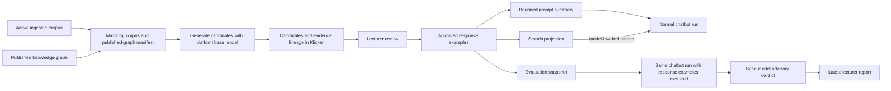

# Chatbot response-example design

> Superseded on 2026-08-26 by the [response-example review corrections
> plan](./2026-08-26-pr-5474-response-example-review-corrections-plan.md).
> This historical interview predates the current contract; locale and behavior
> dimensions described below are not part of the active implementation.

This historical document records the earlier product-design interview for
automatically generated, lecturer-reviewed chatbot response examples. It carries
language and the remaining decision frontier; it does not authorize
implementation, publication, deployment, or live-data access.

## Language

**Response-example candidate**:
A generated student-turn and ideal-reply pair awaiting review by the chatbot's
owner. It is not ground truth.
_Avoid_: Generated ground truth, draft example

**Approved response example**:
A response-example candidate that the chatbot's owner has accepted as the
desired response behavior. Owner edits change the live example immediately.
_Avoid_: Ground truth

**Response-behavior skill**:
A chatbot-local, mode-scoped set of approved response examples that demonstrates
pedagogy, structure, tool use, and citation style. Example facts are illustrative;
normal chatbot runs retrieve and verify current facts from knowledge sources.
_Avoid_: Knowledge skill, factual memory

**Response-example set**:
The one canonical collection of response examples for a chatbot. Each entry is
scoped by mode and locale; runtime selects only applicable entries.
_Avoid_: Mode corpus, locale corpus

**Response-example summary**:
A bounded prompt projection describing the approved set's categories, topics,
and search cues. It guides dynamic search without enumerating full examples.
_Avoid_: Example index, when it implies a complete listing

**Evaluation reference**:
An approved response example used as the expected answer in a run where the
response-behavior skill is excluded from the chatbot's input.
_Avoid_: Holdout, when the same example is available during normal use

**Eligible chatbot**:
A chatbot with an enabled knowledge base and a published knowledge graph that
matches the active ingested corpus.
_Avoid_: Supported chatbot

**Needs review**:
The state of an approved example whose supporting chunk is changed, removed,
unauthorized, or unverifiable. It is excluded from runtime until reviewed.
_Avoid_: Draft, stale warning

**Evidence lineage**:
The source and chunk identifiers, expected hashes, and citation anchors that
connect an example to currently authorized course material.
_Avoid_: Evidence copy, source snapshot

**Degraded selection**:
A normal chatbot turn that continues with its summary and scaffolding because
no applicable full example could be loaded.
_Avoid_: Skill failure

**Generation base model**:
The single platform-managed model used to generate all response-example
candidates in the first release. It is independent of the chatbot's runtime
model and any lecturer-provided credential.
_Avoid_: Qualified generation model, BYOK generation model

**Evaluation verdict**:
The generation base model's advisory `Pass` or `Needs attention` judgment for
one actual response, accompanied by one short reason. It does not block the
chatbot or replace lecturer judgment.
_Avoid_: Score, quality gate

## Settled decisions

- Generation creates response-example candidates; owner review creates
  approved response examples.
- The skill teaches response behavior rather than supplying factual knowledge.
- One approved set serves normal and evaluation runs under the run-scoped roles
  in [ADR 0028](../docs/adr/0028-one-response-example-set-has-run-scoped-roles.md).
- Generation fails closed unless corpus and graph match, as decided in
  [ADR 0029](../docs/adr/0029-response-example-generation-requires-a-matching-corpus-and-graph.md).
- Initially, only the chatbot's owning lecturer can edit, approve, or reject
  response examples. Course visibility does not grant this authority.
- The response-behavior skill uses the hybrid delivery decided in
  [ADR 0030](../docs/adr/0030-response-example-skills-use-hybrid-delivery.md):
  a bounded response-example summary plus dynamically loaded full examples.
- A matching corpus and graph publication automatically starts candidate
  generation. Generated candidates never overwrite approved examples.
- Each chatbot has one canonical response-example set whose entries carry mode
  and locale scope.
- Approved response examples are mutable and live, as decided in
  [ADR 0031](../docs/adr/0031-approved-response-examples-are-live-mutable-records.md).
  The first version has no example revision model.
- The graph selects coverage and relationships; ingested chunks support factual
  claims under
  [ADR 0032](../docs/adr/0032-graph-selects-coverage-and-chunks-support-factual-claims.md).
- Evaluation preserves the normal runtime configuration and excludes only the
  response-behavior skill. The run captures the example content and digest.
- Full approved examples are selected by model-invoked authenticated search
  under
  [ADR 0033](../docs/adr/0033-approved-examples-use-model-invoked-search.md).
  Selection is capped and visible in tool traces.
- Candidate generation crosses graph-backed knowledge coverage with
  mode-appropriate response behaviors. Scope redirects require supporting
  course-scope metadata, and all factual claims remain chunk-grounded.
- Evidence eligibility gates runtime delivery under
  [ADR 0034](../docs/adr/0034-evidence-eligibility-gates-live-response-examples.md).
  Invalid supporting chunks put the example in `Needs review`; graph rebuilds
  with unchanged chunks do not.
- Evaluation starts only through an explicit owner action. Results bind to the
  captured example-set digest and become stale when the live digest changes.
- Dynamic search requires an exact mode-and-locale match. No match or a loader
  failure continues without full examples and records degraded selection; no
  other scope or chatbot is substituted.
- Pilot generation fills supported behavior-matrix cells up to 16 candidates
  per active mode and locale and 40 candidates per chatbot per matching
  manifest. Unsupported cells stay empty.
- Klicker retains evidence lineage rather than course-content copies under
  [ADR 0035](../docs/adr/0035-klicker-retains-response-example-lineage-not-source-copies.md).
- Candidate generation uses the one platform-managed generation base model
  under
  [ADR 0036](../docs/adr/0036-candidate-generation-uses-the-platform-base-model.md).
  Runtime model selection and BYOK credentials do not affect generation.
- For a new matching corpus-and-graph manifest, generation preserves approved
  examples whose evidence remains valid, marks invalid approved examples
  `Needs review`, discards unapproved candidates from the previous manifest,
  and fills uncovered behavior-matrix cells. It never overwrites an approved
  example.
- Candidate review offers `Approve`, `Edit and approve`, and `Reject`. A
  rejection suppresses that candidate for the current manifest; a later
  manifest may propose a new candidate for the same coverage cell.
- The first release retains current product state only. Source-bearing
  generation scratch is deleted when its job finishes. Klicker retains only the
  latest evaluation report and its captured inputs; a stale result remains
  visible until the owner runs a replacement. There is no run-history UI or
  expiry policy.
- Evaluation uses the generation base model as a separate judge. Each case gets
  an advisory `Pass` or `Needs attention` verdict and one short reason based on
  factual support and the intended response behavior. Citation or tool use is
  considered only when the case requires it. The first release has no weighted
  score, metric suite, or multiple judges.
- Lecturer evaluation reports lead with case-level actual-versus-approved
  comparisons and plain-language evidence, tool, citation, and failure outcomes.
  Aggregates are secondary; technical artifacts remain operator-facing.

## Interview result

The first-release decision frontier is empty. The system map assumes:

- The platform base-model route is approved to process course chunks,
  candidates, and evaluation payloads. The platform pays for these jobs, the
  exact model version is recorded, and unavailability fails closed.
- Generation requires an exact active-corpus and published-graph manifest match
  plus verifiable chunk lineage. These are integration prerequisites, not
  assumed current capabilities.
- Current product state comprises candidates, approved or `Needs review`
  examples, evidence lineage, and the latest evaluation report. Source-bearing
  job scratch is deleted at completion.
- Existing chatbot ownership and deletion rules remain authoritative. Deleting
  a chatbot removes its response-example and evaluation state.
- Evaluation is an advisory snapshot, never a runtime gate. It excludes only
  response-example context and becomes visibly stale when its captured inputs
  no longer match the live inputs.

## Repository map

This map uses the following inspected revisions:

| Repository or branch | Revision | Relevant current seam |
| --- | --- | --- |
| KlickerUZH `origin/v3` | `f58986faa8cfa4ff78d20a1ebeb1666473343d38` | Chatbot ownership, PostgreSQL, Manage GraphQL/UI, and the chat runtime |
| Evaluation `origin/main` | `b2f94c1233588f167836c3f1e012b3999e5406ef` | Ground-truth case loading, agent adapters, DeepEval conversion, and reports |
| data-catalog | `2b6231a3fe49c994d82e003b63e589e8bfe8e8c` | Digest-bound catalog run manifests |
| data-ingestion | `4520e90efb72496a6c2dace31350faa2b03e7ed8` | Deterministic source, document, and chunk identity |
| mcp-doc-query | `bb2aba791520cd14f93635defd6b62b5a5d0799c` | Authorized retrieval and citation-rich chunk evidence |
| kg-content-generation | `5ba0056b477543adf650283c3ff59cc7d8a1934d` | Existing graph and question-generation research workflows |
| Catalyst | `18380d188f3d582eb174e27f51ef120a0da6ba23` | Intended graph/content-generation owner; implementation is still a scaffold |

One unmerged Klicker branch is a technical prerequisite, not a current
capability:

- `origin/feat/kb-graph-lifecycle` at `e8e115d` defines the Klicker-owned graph
  build ledger and the published graph pointer. It must be reconciled with
  `v3` before this design can rely on a published graph identity.

The separate chatbot HITL roadmap and its manual `ChatbotExample` proposal are
outside this package. They are neither an ownership parent nor an implementation
dependency. If either branch later changes the same schema or Manage UI seams,
the response-example package must reconcile the concrete code overlap against
the then-current `v3` base without joining that roadmap.

### What exists now

- Klicker's `Chatbot` already has an owning lecturer and course scope in
  `packages/prisma/src/prisma/schema/chat.prisma`. Owner-checked Manage queries
  and the one existing chatbot mutation live in
  `packages/graphql/src/services/chatbots.ts`.
- The chat route in
  `apps/chat/src/app/api/chatbots/[chatbotId]/chat/route.ts` already composes
  system instructions, selects a runtime model, loads MCP tools, streams the
  response, and persists tool traces. This is the seam for both the skill and
  the evaluation ablation.
- Current `v3` has no native KB resource, corpus manifest, graph publication,
  response-example, review, or evaluation-report model. Its knowledge seam is
  the external `doc_query` MCP configuration in
  `packages/prisma/src/prisma/schema/chat.prisma` and
  `apps/chat/src/services/mcpClients.ts`.
- The ingestion stack already supplies deterministic source IDs, content
  hashes, and chunk IDs. `mcp-doc-query` already enforces JWT scope filters and
  can return retrieval-only documents with chunk-level citation metadata.
- `kg-content-generation` can build, publish, snapshot, and inspect graphs and
  already has a Hatchet question-generation workflow. Its graph source IDs and
  publication semantics are not yet aligned with catalog identities or the
  proposed Klicker graph ledger.
- Catalyst owns the intended graph/content-generation boundary, but its
  `apps/content-generation` package does not yet implement a generator.
- Evaluation's Markdown loader in `src/utils/gt_loader.py` already represents a
  question, expected answer, and optional tool contract. Its normalized QA
  shape maps into DeepEval in `src/utils/utils.py`. It has no Klicker adapter,
  lecturer-review metadata, ordinary input digest, or production service.

## Target ownership

| Owner | Responsibility |
| --- | --- |
| Klicker | Canonical response-example set, owner authorization, generation state, review UI, runtime skill projection, evaluation trigger, and latest report |
| Data catalog and ingestion | Canonical corpus run, source identity, chunk identity, content hashes, and deletion/freshness semantics |
| `mcp-doc-query` | Scoped access to current chunks and citation metadata; it does not own response examples |
| Catalyst | Published graph runtime plus stateless candidate-generation jobs |
| Evaluation repository | Offline adapter and operator analysis for exported cases; it is not the product database or lecturer UI |

Klicker remains authoritative even if the runtime or generator changes. The
search index, prompt summary, graph, and Evaluation artifacts are projections
or inputs; none becomes a second response-example store.

## End-to-end flow

1. A graph publication becomes eligible only when its source-content digest
   matches the active corpus manifest for the chatbot's enabled knowledge base.
2. Klicker starts one idempotent generation job for the chatbot, manifest, and
   pinned generation profile. Catalyst reads graph coverage and retrieves the
   supporting chunks with a narrowly scoped service token.
3. The platform base model returns structured candidates. Every factual claim
   carries source ID, chunk ID, expected content hash, and citation anchor.
   Klicker validates the still-current manifest and stores the candidates and
   lineage, then the worker deletes source-bearing scratch.
4. On later manifests, Klicker preserves valid approved examples, marks invalid
   ones `Needs review`, removes older unreviewed candidates, and generates only
   uncovered behavior cells.
5. The owner approves, edits and approves, or rejects each candidate. Approval
   makes the same record live and refreshes the set digest, bounded summary, and
   search projection.
6. A normal chat request gets the bounded summary. The model can call an
   authenticated `search_response_examples` tool for a small number of full
   exact-mode-and-locale examples. The tool resolves search hits back through
   PostgreSQL and rechecks status, scope, and evidence before returning them.
   Factual answers still use `doc_query` against current course material.
7. `Run evaluation` snapshots the approved examples and runtime inputs. It
   calls the same Klicker chat orchestration without the response-example
   summary. The same search tool remains registered, but an examples-excluded
   projection returns no example content. The base model returns `Pass` or
   `Needs attention` with one short reason for each actual-versus-approved case.
   Klicker replaces the previous report atomically.

This evaluation measures the chatbot configuration without the skill against
the lecturer's desired responses. It does not measure the deployed
configuration's uplift from receiving those examples; that comparison remains
outside the first release.

## Minimal product state

The logical model needs three current-state aggregates. Physical table names
and normalization belong in execution planning.

### Response-example set

One row per chatbot records the current manifest identity, generation status,
exact generation model, bounded summary, and set digest. Its examples record:

- mode, locale, student turn, ideal reply, and behavior tag;
- `Candidate`, `Approved`, `Needs review`, or `Rejected` status;
- graph coverage identifiers and the manifest that produced the candidate;
- current reviewer and approval timestamps without a revision history; and
- one or more evidence-lineage entries containing source ID, chunk ID, expected
  hash, and citation anchor.

Rejected candidates remain only until the next manifest replaces the
unreviewed batch. Approved edits mutate the current record. Deleting the
chatbot cascades the set, examples, projections, and evaluation report.

### Search projection

The semantic index contains only derivative embeddings and filter metadata:
example ID, chatbot ID, mode, locale, behavior tag, status, and content digest.
Search always filters by chatbot, exact mode, and exact locale. Klicker reloads
the canonical rows after search, so a stale index cannot make an invalid or
cross-chatbot example visible.

The vector backend is an implementation choice. It must use existing managed
vector infrastructure or a PostgreSQL capability already approved for Klicker;
the first release should not introduce a new datastore solely for this feature.

### Latest evaluation report

One current report per chatbot records the example-set digest, runtime-config
digest, corpus/graph manifest, target model, judge model, timestamp, and the
case-level input, expected response, actual response, verdict, reason, evidence,
tool, and citation outcomes. A digest mismatch marks it stale. Starting a new
run builds a replacement and swaps it in only after the run completes.

## Cross-system contracts

The integration needs three small versioned contracts:

1. **Corpus-graph manifest**: knowledge-base ID, catalog run or corpus digest,
   published graph-build ID, graph source-content digest, and publication time.
   Klicker accepts the manifest only when the corpus and graph digests match.
2. **Generation job**: opaque operation ID, response-example set ID, knowledge
   base and graph-build IDs, corpus digest, active mode/locale pairs, required
   behavior cells, generation-profile version, and a scoped retrieval token.
   Results contain structured candidates, graph coverage IDs, evidence lineage,
   exact model identity, and terminal status.
3. **Evaluation case**: stable example ID, mode, locale, student turn, approved
   response, conditional citation/tool expectations, captured runtime inputs,
   and content digests. The runtime receives a server-controlled
   response-example exclusion flag that removes the summary and makes the
   unchanged search tool return no example content; clients cannot use that
   flag to bypass the live skill.

Callbacks are idempotent and accepted only while the operation, chatbot,
manifest, and graph build still match. Late or mismatched results are recorded
as operational failures and cannot change examples.

## Evaluation-repository fit

The Evaluation repository can later consume an authorized export of the
evaluation-case contract through a small adapter:

- map the student turn to `question` and approved response to
  `expected_answer` in its existing ground-truth loader shape;
- carry conditional tool expectations through its existing call-policy fields;
- add the example-set, runtime-config, corpus, and graph digests to the export
  manifest, following the hashing pattern in `src/evaluators/quality_baseline.py`;
  and
- keep exported prompts, responses, evidence, and judge reasons in ignored,
  access-controlled output as the repository already requires.

The first release does not include this adapter. It needs neither DeepEval,
multiple metrics, nor a new Evaluation service. Klicker produces the agreed
advisory verdict and retains only its latest report. A later operator adapter
must keep exports outside the product lifecycle and cannot make files in the
Evaluation repository canonical lecturer data.

## Delivery sequence

1. **Reconcile prerequisites**: land or replace the Klicker KB/graph lifecycle
   and define the corpus-graph manifest. Implement one response-example model
   and one owner UI within this independent package; reconcile only concrete
   code conflicts if another branch later changes those seams.
2. **Add canonical state and review**: implement the current-state records,
   owner-only GraphQL operations, manifest reconciliation, and the Manage
   candidate/approved/evaluation views.
3. **Generate from real evidence**: add Catalyst generation jobs, structured
   base-model output, graph coverage selection, scoped chunk retrieval,
   idempotent callback validation, and scratch deletion.
4. **Deliver the skill**: compile the bounded summary into the chat prompt,
   maintain the semantic projection, and expose authenticated model-invoked
   search with exact-scope and evidence checks.
5. **Evaluate**: add the server-only ablation path, current report, advisory
   judge, and staleness calculation. The Evaluation-repository adapter remains
   a documented later integration.

The first cross-system acceptance test should use synthetic course material and
prove one complete path: ingest, publish a matching graph, generate a grounded
candidate, approve it, retrieve it during normal chat, exclude it during
evaluation, and show a digest-bound latest report. It must also prove that a
manifest mismatch, cross-chatbot search, changed chunk hash, and late callback
fail closed.

## Progress (roadmap reconciliation)

- 2026-08-27 — Phase 5 routine reconciliation after package delivery: K1 (`feat/response-examples-foundation`, PR #5474) and K2 (`feat/response-examples-review`, PR #5498) merged into `v3-ai` as commits `0e10f2fa3` and `3d653275d` (verified reachable on `origin/v3-ai`). Remote branches and the design worktree were cleaned up. This independent milestone is delivered to its branch-integration boundary; deployment/live runtime activation stays outside it.
- 2026-08-27 — Delivery sequence state: steps 1–2 delivered by this package (foundation + review workflow). Steps 3–5 remain separate future work: generation from real evidence is gated on the KB/graph foundation (staging enablement commit `08eef3ad7`/#5612 is a prerequisite signal, not a gate clearing); delivery of the runtime skill additionally requires deactivation/reactivation semantics per the corrections plan's follow-up boundary. Evaluation follows the skill step.
- 2026-08-27 — Roadmap-level next W-item: **Lecturer Test & Teach** (save question/response pairs from chatbot preview into the existing candidate queue; no participant data, no AI rewrite/replay), exactly as bounded in the corrections plan follow-up boundary. It depends only on the now-merged review workflow and can start immediately as a separate plan in this same workstream on top of `v3-ai`. Corrections-plan verification note stands unchanged.
