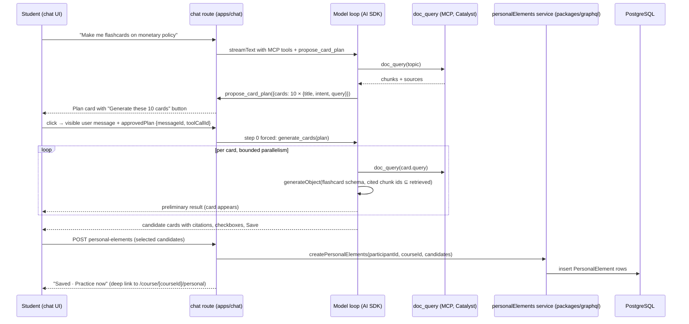

# Student-generated practice elements in the course chatbot — execution plan

Decisions grilled and settled 2026-08-21 (two rounds). Rationale lives in the
ADRs; this document explains the architecture once in plain language, fixes
the v1 scope, and sequences the work for junior engineers.

Plan state: corrected draft after the first planner pass; implementation,
runtime work, and delivery remain paused until the two rulings in section 7
are made.

Governing ADRs: [0006](../docs/adr/0006-public-catalyst-capability-floor.md)
(amended: student-initiated practice candidates row),
[0026](../docs/adr/0026-personal-elements-separate-participant-owned-model.md)
(personal elements are a separate participant-owned model),
[0027](../docs/adr/0027-plan-first-retrieval-backed-card-generation.md)
(plan-first, retrieval-backed generation contract). Vocabulary is fixed in
[CONTEXT.md](../CONTEXT.md): personal element, lecturer element, candidate
element, card plan, origin, verification, element proposal.

## 1. What the student gets (v1)

In Tutor mode of a course chatbot that has course materials attached, a
student can say "make me flashcards on X". The chatbot retrieves material on
X, proposes a card plan ("I propose these 10 cards"), and waits. The student
approves with a button. The chatbot then generates each card from its own
retrieval, shows the cards with citations, and the student saves the ones they
want. Saved cards are personal elements: they belong to the student, carry an
"AI-generated · unverified" badge, and are practiced with spaced repetition
on a "My cards" page per course. The student can ask the chatbot to change a
card (before or after saving) and can delete cards on the "My cards" page.

Not in v1: duplicate check against lecturer material, element proposals to the
lecturer, question types other than flashcards, a lecturer off-toggle, points
or XP, interleaving personal cards into the pooled course practice.

## 2. Architecture walkthrough (read this first)

### 2.1 One request, end to end

Plain-language version:

1. **The chatbot stays the same chatbot.** Generation is two new tools inside
   the existing chat route, next to the MCP tools the bot already has. No new
   service, no new deployment. The tools exist only when the selected mode has
   a `doc_query`-style retrieval tool and the student has credits left.
2. **Plan first.** The first tool, `propose_card_plan`, can only be called
   after the model has retrieved material on the topic. It produces a plan,
   not cards. The plan is a normal tool result, persisted in the assistant
   message like every tool call today, and rendered as a card with a button.
3. **Approval is a normal message.** The button sends a visible user message
   plus one extra request field naming the plan. The route reads the plan from
   the persisted message and forces the second tool, `generate_cards`, as the
   first step of that turn. Changing the plan is just chatting: the model
   issues a new plan, the old plan card shows as superseded.
4. **Every card is grounded by construction.** `generate_cards` runs the
   per-card work itself: one retrieval call per card, one structured model
   call per card whose output schema requires cited chunk ids from that
   retrieval. The retrieval adapter exposes a stable, bounded chunk shape
   (`chunkId`, `sourceId`, `text`, and optional title, URL, and page). Every
   non-empty `citedChunkIds` value must be a subset of that card's retrieved
   chunk IDs. Missing, malformed, or empty evidence fails closed and cannot
   produce a candidate. The local fixture, source normalization, UI citation
   chips, and stored source JSON use this same shape; links are sanitized and
   the stored fields are size-bounded. This is a guarantee in code, not a
   prompt instruction. Cards stream in one by one so the student sees
   progress.
5. **Saving is a button, never the model.** Saving calls a small API route in
   the chat app that uses the same server-safe service entry the GraphQL API
   exposes. The GraphQL package emits that service through an explicit
   server-only subpath/build entry, and Chat declares it as a runtime
   dependency; Chat never imports GraphQL source files directly. One
   implementation of the rules (caps, type validation, ownership), two
   transports.
6. **Practice lives in the PWA.** A "My cards" page per course lists and runs
   personal elements with the same `Flashcard` component and the same
   spaced-repetition function (`updateSpacedRepetition`) as lecturer cards.
   Personal elements never touch `Element`, `ElementInstance`, or
   `PracticeQuiz` tables.

### 2.2 Data model (content and approval schema additions)

`PersonalElement` is the new content table. A small `ChatGenerationApproval`
claim table is added in the same migration so an approved plan cannot be
replayed concurrently or after completion; lecturer-owned content tables do
not change. Fields, in plain terms:

- identity and ownership: `id`, `participantId` (cascade), `courseId`
  (cascade), `version`
- content in the existing element shape so the `Flashcard` component renders
  it unchanged: `type` (v1: `FLASHCARD` only, enforced in the service),
  `name`, `content` (front), `explanation` (back), `options` (reserved for
  question types)
- grounding: `sources` (card-local citations: source ID, title, sanitized URL,
  page, and chunk IDs; no retrieved chunk text is persisted). The retrieval
  adapter accepts at most 32 chunks per card, with IDs up to 128 characters,
  titles up to 256 characters, URLs up to 2048 characters, and a 64 KiB
  serialized source bound; over-limit or malformed evidence is rejected, not
  truncated.
- provenance: `origin` (`AI_GENERATED` | `AUTHORED`), `verification`
  (`UNVERIFIED` | `VERIFIED`)
- chat linkage for the saved-state join: `sourceMessageId`,
  `sourceToolCallId`, `candidateId`
- spaced repetition, per element: `eFactor` 2.5, `interval` 1,
  `correctCountStreak` 0, `correctCount`, `partialCorrectCount`, `wrongCount`,
  `nextDueAt`, `lastAnsweredAt`, `lastCorrectAt`, `lastPartialCorrectAt`,
  `lastWrongAt`, and `lastResponseCorrectness`. Use these existing
  `QuestionResponse` names; do not introduce the inaccurate
  `lastCorrectness` or `lastRespondedAt` names.
- index on `[participantId, courseId, nextDueAt]`

`ChatGenerationApproval` stores participant, chatbot, thread, plan message ID,
plan tool-call ID, a status (`CLAIMED`, `COMPLETED`, or `ABORTED`), a short
lease expiry, and the generated assistant message ID. A unique key on
participant + plan message + plan tool call is claimed transactionally. An
active claim rejects a concurrent request, a completed claim rejects replay,
and an aborted or expired claim may be retried after an atomic status update.
The plan message itself remains immutable.

Why per-element scheduling fields instead of `QuestionResponse`: that table
requires an `ElementInstance`, a `Participation`, and a course-owned
activity; personal elements have none of those (ADR 0026).

### 2.3 Who writes what

| Concern | Owner | Path |
| --- | --- | --- |
| Rules: caps, type validation, ownership, SM-2 update | `personalElements` service emitted through a server-only package entry | `packages/graphql/src/services/personalElements.ts` |
| Student GraphQL surface for the PWA | Pothos schema + ops | `packages/graphql/src/schema/*.ts`, `packages/graphql/src/graphql/ops/*PersonalElement*.graphql` |
| Generation tools, plan/approval handling, credit accounting | chat route | `apps/chat/src/app/api/chatbots/[chatbotId]/chat/route.ts` + new `apps/chat/src/lib/server/personalElements/` |
| Save/list API for the chat UI | chat route handlers | `apps/chat/src/app/api/chatbots/[chatbotId]/personal-elements/` |
| Plan card, candidate cards, saved state | chat components | `apps/chat/src/components/personal-elements/` dispatched by tool name in `apps/chat/src/components/message-parts.tsx` before the existing `part.toolUI`/`ToolFallback` path |
| "My cards" page: runner, list, delete | PWA | `apps/frontend-pwa/src/pages/course/[courseId]/personal.tsx` |

### 2.4 The generation contract (ADR 0027)

`generate_cards` is the public contract a later Catalyst engine implements
behind the same shape. The authenticated route injects the course ID from the
chatbot and participant context; neither the model nor the request body may
choose it. Input then consists of topic, language, and the approved plan
entries (title, intent, retrieval query). Output: candidate elements
(candidate id, type, name, content, explanation, and bounded card-local
sources whose cited chunk IDs are a non-empty subset of retrieved chunk IDs).
The engine does no database work and knows nothing about the UI (ADR 0006).
In v1 the implementation is the in-route pipeline described above. The
contract rejects malformed or evidence-free candidates before they reach the
save route.

## 3. Decisions fixed by the grill (2026-08-21)

| Topic | Ruling |
| --- | --- |
| Model | Separate `PersonalElement` table with own SM-2 fields; no changes to lecturer tables (ADR 0026) |
| Scope | Course-bound; cascades with course and participant |
| Grounding | Every card from its own retrieval call; cited chunk IDs are a non-empty subset of that retrieval; tools not offered without a `doc_query`-style tool; explicit tool order is preserved in the prompt-cache key |
| Flow | Plan after initial retrieval, approve button, then generation (ADR 0027) |
| Duplicate check | Out of v1 |
| Vocabulary | origin `AI_GENERATED`/`AUTHORED`; verification "unverified / verified by lecturer" |
| Write path | One server-safe service entry emitted from `packages/graphql`; GraphQL mutations for the PWA and Chat route handlers use that entry |
| Saved state in chat | Derived by join on `sourceMessageId` + `sourceToolCallId`; the persisted message is never mutated |
| Proposals to lecturer | Later phase with its own ADR amending 0022 |
| Gamification | No points, no XP |
| Availability | Default on for every chatbot; Tutor mode only; retrieval and credit gates apply; no `CHAT_STUDENT_GENERATION_ENABLED` switch or GrowthBook flag in v1 |
| Data boundary | No research-export or Learning Analytics query, processing, or export in v1; shared Prisma schema synchronization is unchanged |
| Sizes | Plan default 10, cap 20; 500 personal elements per participant per course; generation blocked at zero credits |
| Revision | Unsaved: rerun the per-card pipeline, old card superseded (client-derived along the branch). Saved: `list_personal_elements` + `revise_personal_element`, in place, `version` +1, SM-2 kept, `VERIFIED` → `UNVERIFIED` on content change; cards render from the joined row after save |
| Delete | "My cards" page only, per card with confirm; no bulk; not via chat |
| Entry points | `/course/[courseId]/personal` (bookmarks precedent), home Practice hub link, a row per course on `/repetition`, "Practice now" link on saved cards |
| Run UI | Dedicated flashcard runner using an explicit adapter around `Flashcard.tsx` for personal-element fields and response state |
| Element types | `FLASHCARD` first; SC/MC/KPRIM next; NUMERICAL/FREE_TEXT later; never CONTENT |
| Roles | `PARTICIPANT` only (not `TEMPORARY_PARTICIPANT`) |
| Language | `Course.language`, fallback thread locale |

## 4. Delivery shape

Provider: GitHub. The repository supports stacked PRs. Stack mode: `guided`.
The topology owner is the execution orchestrator (main). The recommended
topology is one linear stack `A → B → C`, with C based on B; topology still
needs approval before work starts. PR B may contain its page and GraphQL
client wiring, but it has no public Home Practice or `/repetition` links: the
page is directly reachable for review, while PR C adds those links only after
the complete generator path exists. This keeps an intermediate stack from
advertising an incomplete generator.
If the ruling keeps the forked shape, B and C both branch from A and the
integration owner must perform an additional cross-PR check before either is
presented as complete.

1. **PR A — backend**: schema, service, GraphQL. Reviewer audience: data
   model and API.
2. **PR B — PWA** (on A, or on the approved linear parent): "My cards" page
   and GraphQL client wiring; public hub and `/repetition` activation is
   integrated by PR C.
   Reviewer audience: student UI.
3. **PR C — chat** (on B for the recommended topology): plan tool, approval
   transport, generation
   pipeline, candidate cards, save route, revise and list tools. Reviewer
   audience: chat runtime and cost seam.

Each PR updates these named documentation surfaces in the same PR. PR A owns
`docs/domain-model.md`, `docs/graphql-api-layer.md`,
`.agents/skills/klicker-data-model/SKILL.md`, and
`.agents/skills/klicker-graphql-api/SKILL.md`. PR B owns
`docs/frontend-conventions.md` and
`.agents/skills/klicker-frontend-ui/SKILL.md`. PR C owns
`docs/chat-platform.md`, `.agents/skills/klicker-testing-verification/SKILL.md`,
and `.agents/skills/klicker-playwright-e2e/SKILL.md`. Do not create a
standalone docs slice or `docs/log/`; the current wiki policy keeps
documentation selective and stores durable decisions in ADRs. Branch from the
fresh `v3` ref; use one repo-local `trees/<branch>` worktree for this stack;
run checks in the devcontainer; commit with conventional types.

| Layer | Provider / stack mode | Reviewer / attention | Validation and activation | Risk boundary | Size signal |
| --- | --- | --- | --- | --- | --- |
| A — backend | GitHub / first stack layer | data model + API; high attention | migration, sync, GraphQL check; no user activation | data integrity, public API, analytics boundary | pause for re-review if more than one migration, more than five new public operations, or a service implementation over roughly 400 lines |
| B — PWA | GitHub / child of A | student UI + accessibility; high attention | GraphQL client, browser screenshots; nav remains inert until C | browser/auth/i18n and response-state adapter | pause if the page needs more than two new route-level surfaces or a second runner implementation |
| C — chat | GitHub / child of B (recommended) | chat runtime, cost, trust boundary; very high attention | route tests, browser reload evidence, `pnpm --filter @klicker-uzh/chat build`; activation follows all gates | nested usage, citation trust, approval transport, auth | pause and re-slice if the route diff exceeds roughly 400 lines or more than two interactive tool cards are introduced |

## Execution contract

**Authority.** Approval of this plan authorizes work only in the named task
worktree: in-scope edits, repository-native checks, the configured
simplifier/slice/final reviews, local commits, and exact runtime teardown.
Pushes, PR creation or updates, merges, deploys, cluster or live checks, and
paid external-model runs remain withheld unless separately named by the user.

**Terminal.** The plan is complete when the approved stack is locally
committed, all named checks and review gates pass, the worktree is clean apart
from explicitly preserved user artifacts, and the exact devcontainer runtime
has been stopped and verified stopped. No PR is opened or merged by this
plan.

**Pause.** Pause and report evidence before crossing a new authority boundary,
when a size signal fires, when the service/build seam differs from the plan,
when grounding or analytics consumers cannot be proven, or when a check needs
an external provider, paid run, live environment, or user data. Do not replace
the route or silently weaken a gate.

After PR A's migration and public GraphQL schema checks pass, pause for the
data-migration/public-API review before starting PR B or PR C. This is a
review gate, not permission to merge or publish the PR.

## Research and primitive impact

No external research or provider documentation is needed for this design
pass. The plan is grounded in the current `v3` repository, the accepted ADRs,
the existing `Flashcard` and `updateSpacedRepetition` primitives, the current
Chat route/tool loop, and the local MCP fixture. Any implementation question
that depends on a changing library API is rechecked through the repository's
current dependency/runtime before code is written.

The feature adds one durable primitive, `PersonalElement`, and one public
generation contract, `generate_cards`. It extends existing Prisma, GraphQL,
Chat, and PWA surfaces while deliberately leaving lecturer-owned
`Element`/`ElementInstance`, `PracticeQuiz`, `QuestionResponse`, XP, pooled
practice, and analytics processing untouched.

## Delegation map

Each slice is assigned once. The execution orchestrator (main) owns topology
and sequential writer handoffs in the one worktree. Documentation updates
belong to the owning slice.

| Slice | Owner role | Route | Depends on | Acceptance anchor |
| --- | --- | --- | --- | --- |
| S0 prototype gate | execution orchestrator (main) | `main` | fresh worktree only | synthetic/local provider or explicitly authorized model run proves structured output and MCP execute shape; no throwaway artifact remains |
| S1 schema and service | executor | `executor` — backend writer | approved topology, S0 | migration/sync, server-safe package entry, serializable cap with bounded retry, idempotency, actor checks, SM-2 and version tests |
| S2 GraphQL surface | executor | `executor` — sequential handoff from S1 | S1 | generated operations/schema and participant-only auth; practice-list counts and analytics negative check |
| S3 My cards page | executor | `executor` — sequential handoff from S2 | S2 | adapter-backed runner, i18n, empty/rated/delete states, browser screenshots in both locales and mobile width; direct route only until C |
| S4 plan tool and approval transport | executor | `executor` — sequential handoff from S3 | S3, approved topology | explicit named dispatch/order, retrieval gate, durable one-shot approved-plan claim and deterministic generation shell, persisted reload test and browser plan-card evidence |
| S5 generation and candidate cards | executor | `executor` — sequential handoff from S4 | S4 | per-card retrieval/citation subset, bounded parallelism, nested usage success/abort accounting, save idempotency and reload evidence |
| S6 revision, listing, and final activation | executor | `executor` — sequential handoff from S5 | S5 | authorization, expected-version conflict behavior, final PWA links, unsaved/saved revision browser evidence and feature-wide portfolio |

Estimates assume one junior per PR, a working devcontainer, and the S0
prototype gate passing: S0 ½ day; PR A 2–3 days; PR B 2–3 days; PR C 5–7 days
(the generation pipeline and the first interactive tool card carry the
uncertainty). If S0 fails against the auto router, add 1 day to PR C for the
pinned-deployment path.

## 5. Slices

Every product slice S1–S6 ends with the named acceptance check passing and a
local commit. S0 is intentionally non-committing. "Verified" means executed
and observed, not "the code looks right".

### S0 — Prototype gate (chat, no product code, non-committing)

Goal: prove the two unverified mechanics before anyone builds on them.

- Use an untracked temporary harness outside the product tree (or an existing
  test fixture) to call `generateObject` with a flashcard zod schema through
  the route's `getModel` for the `auto` registry entry, and call an MCP tool's
  `execute` directly with a minimal options object (`toolCallId`,
  `messages: []`, `abortSignal`). Remove the harness before the slice ends;
  S0 has no product-code commit.
- Acceptance: both calls return valid output against the local LiteLLM and
  local MCP fixture (`apps/chat/scripts/local-mcp-server.mjs`), with a stable
  chunk-shaped fixture result. Record model IDs, latency, and token usage in
  this file's Progress section only when the provider is local or the user has
  separately authorized a paid external run. If no non-paid provider exists,
  pause at the Authority boundary.
- If `generateObject` fails through the router: pin nested calls to a
  concrete deployment from the registry (`gpt-5.6-luna` locally) and record
  the decision here; the product slices then use that pin.

### S1 — Schema and service (PR A)

- Add `PersonalElement` (section 2.2) and the two enums to a new
  `packages/prisma/src/prisma/schema/personalElement.prisma`; relations on
  `Participant` and `Course`. Run the migrate → sync → generate ritual from
  `docs/data-and-migrations.md`.
- Add the `ChatGenerationApproval` status enum/table in the same migration,
  with the unique participant/plan-message/plan-tool-call key and lease fields
  described in section 2.2; this is the durable replay boundary, not a
  mutation of the plan message.
- `packages/graphql/src/services/personalElements.ts` with:
  `listPersonalElements(participantId, courseId)` ordered by `nextDueAt` nulls
  first (mirror `orderStacks` semantics in `packages/graphql/src/lib/util.ts`),
  `createPersonalElements` (type `FLASHCARD` only, cap 500 per course, trims,
  requires non-empty `content`/`explanation`, validates bounded card-local
  sources, stores sanitized chat linkage), `respondToPersonalElement(id,
  correctness)` mapping
  `FlashcardCorrectness` to a grade exactly as `stacks.ts:upsertFlashcardResponse`
  does and calling `updateSpacedRepetition`, `updatePersonalElement` (content
  replace, conditional on `expectedVersion`, `version` +1, `VERIFIED` →
  `UNVERIFIED`), `deletePersonalElement`. Every function receives explicit
  actor context, checks course participation and ownership, rejects
  `TEMPORARY_PARTICIPANT`, and never trusts a participant ID from the body.
- Add database uniqueness for generated rows covering participant, source
  message, source tool call, and candidate ID (those linkage fields are
  non-null for generated rows; any future authored path gets its own explicit
  idempotency key). Enforce the 500-card course cap and insert in a serializable
  transaction with at most three bounded retries on serialization failure (or
  an equivalent participant/course lock) so concurrent saves cannot exceed it.
  Freeze the source limits from section 2.2: at most 32 chunks and 64 KiB of
  serialized source metadata per card, IDs up to 128 characters, titles up to
  256, URLs up to 2048, and reject over-limit input rather than truncating it.
  Keep the service in a
  server-only GraphQL package entry, add Chat's runtime dependency on that
  entry, and bound/sanitize the persisted source JSON.
- Acceptance: vitest specs in `packages/graphql` for cap under concurrent
  saves, idempotent retry, ownership and participation, temporary-role
  rejection, SM-2 progression (three correct answers push `nextDueAt` forward;
  a wrong answer resets), verification downgrade, and stale
  `expectedVersion` conflict. These run against the live DB in CI
  (`test-graphql` job); locally run them in the devcontainer and reseed
  afterwards. Run the exact production seam check
  `pnpm --filter @klicker-uzh/chat build`; it must resolve the server-only
  service entry without importing GraphQL source.

### S2 — GraphQL surface (PR A)

- Pothos types `PersonalElement`, enums, query `personalElements(courseId)`,
  mutations `createPersonalElements`, `respondToPersonalElement`,
  `updatePersonalElement`, `deletePersonalElement`, all
  `t.withAuth(asParticipant)` (pattern: `bookmarkElementStack` in
  `packages/graphql/src/schema/mutation.ts`), with the resolver passing
  explicit actor context and rejecting temporary participants.
- Ops files `QPersonalElements.graphql`, `MCreatePersonalElements.graphql`,
  `MRespondToPersonalElement.graphql`, `MUpdatePersonalElement.graphql`,
  `MDeletePersonalElement.graphql`; run codegen.
- Extend `getPracticeQuizList` (`packages/graphql/src/services/participants.ts`)
  so a course with personal elements but no published practice quiz still
  appears, carrying a `personalElementCount` and `personalDueCount`.
- Define the analytics/export boundary in the owning query and export paths:
  no personal-element query, processing, or export is added. Add a negative
  acceptance check at `packages/export/src/exportCourse.ts` using its existing
  `packages/export/test/index.test.ts` seam: a seeded personal element is not
  read and no exported file contains it. Add the Analytics selector check at
  `apps/analytics/src/modules/participant_analytics/get_participant_responses.py`
  and `compute_participant_analytics.py`: a seeded personal element produces
  no response row. The shared Prisma sync remains unchanged.
- Acceptance: `pnpm --filter @klicker-uzh/graphql check` and `test` green;
  the public schema diff in `packages/graphql/src/public/schema.graphql`
  shows only the new types and the negative analytics/export check passes.

### S3 — "My cards" page (PR B)

- `apps/frontend-pwa/src/pages/course/[courseId]/personal.tsx` modeled on
  `bookmarks.tsx`: header with course name and due count, an explicit personal
  element adapter around `packages/shared-components/src/Flashcard.tsx` that
  maps front/back content, response state, and `respondToPersonalElement`,
  then a list of all personal elements with the badge ("AI-generated ·
  unverified" / "· verified by lecturer"), sources, and a per-card delete
  with confirm dialog.
- Keep the page directly reachable for review, but do not add Home Practice
  or `/repetition` links in PR B; PR C adds those links only after the Chat
  generation path is complete.
- i18n keys in `packages/i18n/messages/en.ts` and `de.ts` (informal `du` in
  German, consistent with the PWA).
- Acceptance: agent-browser run against the worktree's devcontainer stack,
  logged in as a seeded student, with screenshots of: empty state, runner
  with one card flipped and rated, list with badge, delete confirm, German
  and English, mobile width. Seed at least three personal elements via the
  GraphQL mutation for the check. The agent-browser evidence is the only
  completion gate; a later follow-up may extend a Playwright regression, but
  it is not part of this plan and never substitutes for the browser run. The
  browser run also verifies the auth boundary and that no personal card is
  interleaved into pooled practice.

### S4 — Plan tool and approval transport (PR C)

- `apps/chat/src/lib/server/personalElements/tools.ts`: `propose_card_plan`
  (zod input: topic, cards[≤20]{title, intent, query}; output: plan id +
  entries). Register it alongside `mcpTools` **before**
  `buildPromptCacheRequest` in `route.ts` so `toolOrder` and the cache key
  include it. Change the cache helper if necessary: its current alphabetical
  object-entry ordering must not silently reorder the plan/generation tools.
  Offer it only when: selected mode is `tutor`, a `doc_query`-style tool is
  present (`isDocQueryToolName` over the tool names, same gate as the citation
  contract), and `credits.current > 0`.
- `prepareStep`: keep `propose_card_plan` out of `activeTools` until at least
  one `doc_query` call has completed in this turn.
- Approval transport: new top-level body field `approvedPlan: { messageId,
  toolCallId }` in the route's zod schema and in `useChatResponse.ts` (same
  placement as `images`). When present, load the plan from the persisted
  assistant message's tool-call part, verify it belongs to this thread and
  participant and actor role, reject replayed or superseded IDs, and force
  `generate_cards` via `prepareStep` on step 0 only. Before starting the
  stream, atomically claim the `ChatGenerationApproval` key derived from the
  plan message/tool call. Revalidate Tutor mode, a current `doc_query` tool,
  positive credits, participant/thread ownership, the latest plan on the
  current branch, and the server-derived chatbot course. A completed claim
  rejects replay; an aborted or expired lease may be retried; a live claim
  rejects concurrent requests. The button's state must survive the complete
  path: Plan card → thread/runtime state → one-shot request body → persisted
  assistant tool result.
- Implement claim creation, status transitions, and bounded lease recovery in
  `apps/chat/src/lib/server/personalElements/approvalClaims.ts` using the
  `ChatGenerationApproval` table; keep the route's model loop independent of
  the claim storage details.
- Add a deterministic `generate_cards` contract shell in S4. It validates
  the approved plan and returns a typed pending/error result without model
  calls; S5 replaces the shell with the retrieval-backed implementation.
- Plan card: `apps/chat/src/components/personal-elements/PlanCard.tsx`
  dispatched by an explicit `part.toolName` branch in
  `apps/chat/src/components/message-parts.tsx` before the existing
  `part.toolUI`/`ToolFallback` path (the current file renders but does not
  register tool UIs). Button appends the visible user message and the body
  field. A plan that is not the latest plan on the current branch renders as
  superseded (client derivation over `thread.messages`).
- System prompt: a short scaffolding paragraph telling the model to retrieve
  first, propose a plan, and never generate cards without approval; appended
  only when the named tools are present (same pattern as
  `withCitationContract`).
- Acceptance: route vitest with synthetic streams (pattern:
  `apps/chat/test/required-mcp-route.test.ts`) proving the tool is absent
  without `doc_query`, absent at zero credits, inactive before the first
  retrieval, and the deterministic shell is forced on step 0 when
  `approvedPlan` is sent; a
  `persisted-assistant-content` test proving the plan args survive reload; and
  an auth/replay test proving a plan from another thread or an already-used
  approval cannot trigger generation while an aborted claim can be retried.
  Browser evidence covers the plan card, visible approval message, reload, and
  superseded state in English and German at desktop and mobile widths.

### S5 — Generation pipeline and candidate cards (PR C)

- `generate_cards` tool: for each plan entry, with bounded parallelism
  (start with 3), call the first `doc_query` tool in the explicit `toolOrder`
  directly with the entry's query, normalize the result to the stable chunk
  shape from section 2.1, then call `generateObject` with the flashcard schema
  (`name`, `content`, `explanation`, `citedChunkIds` restricted to the
  retrieved chunk IDs; language from `Course.language`, fallback thread
  locale). Use the authenticated chatbot's server-derived course; do not
  accept a course ID from the model or request body. Require at least one
  cited chunk, validate the subset before
  emitting a candidate, and fail that card closed when retrieval or evidence
  is malformed. Extend the local fixture and source-normalization seam so
  chunk IDs are preserved for rendering and storage. Return an `AsyncIterable`
  so each finished card streams as a preliminary result; the final result
  carries all candidates plus bounded card-local sources in the `doc_query`
  result shape so `normalizeSourcesFromParts` can render citations for the
  card.
- Credit accounting: accumulate nested `generateObject` usage and add it
  exactly once at the three sites where `imageDescriptionCost` is added today
  (`onEnd`, `onAbort`, `messageMetadata`), preserving the existing success,
  abort, and metadata ownership so a retry or terminal callback cannot double
  charge.
- Candidate cards: `CandidateCards.tsx` dispatched by the same explicit
  tool-name branch: front/back
  stacked, citation chips from the card-local sources, checkbox per card,
  "Save selected" / "Save all", saved badge and "Practice now" link after
  save. Saved state comes from `GET /api/chatbots/[chatbotId]/personal-elements?messageId=…`
  (join on `sourceMessageId` + `sourceToolCallId`), never from the frozen
  tool result.
- Save route: `POST /api/chatbots/[chatbotId]/personal-elements` guarded by
  `withChatbotAuth`, passing explicit actor context, and calling
  `createPersonalElements` from the server-safe shared service entry;
  idempotent per `candidateId` and source message/tool call. Do not trust raw
  candidate source JSON or a participant ID from the request body.
- Acceptance: route vitest with injected SSE proving every persisted
  candidate cites at least one retrieved chunk ID from its own retrieval,
  malformed evidence is rejected, nested usage reaches `creditsUsed` on both
  success and abort paths, and retrying concurrent saves is idempotent and
  capped; agent-browser run in the devcontainer with the local MCP fixture
  and LiteLLM: ask for cards, approve, watch cards stream in, save two, reload
  the thread and see saved state and citations persist; screenshots in both
  locales and at mobile width.

### S6 — Revision and listing tools (PR C)

- `list_personal_elements` (course-scoped, own elements, compact) and
  `revise_cards` / `revise_personal_element(id, instruction)` reusing the
  per-card pipeline from S5. For unsaved candidates the revised card is a new
  candidate in the new message and the old card renders as superseded; for
  saved elements the route calls `updatePersonalElement` with
  `expectedVersion`; a stale version returns a conflict and leaves content
  unchanged. Every tool rechecks course participation and actor role.
- Acceptance: vitest for the two tools' validation and stale-version paths;
  agent-browser: "make card 2 shorter" before saving and after saving, then
  confirm the "My cards" page shows `version` 2 content and the card in chat
  shows the revised text after reload. The owning PR also updates the relevant
  wiki page and skill paragraph, and activates the Home Practice and
  `/repetition` links that PR B kept directly reachable only. No separate docs
  slice or log is created.

## Feature-wide verification portfolio

The following checks are required across the slices; a passing local check is
recorded with its producing command and observed output.

| Test obligation | Behavior obligation | Primary seam | Existing protection | Planned test / distinct failure | Owner / evidence |
| --- | --- | --- | --- | --- | --- |
| `add new` | Concurrent cap, idempotent save retry, source/message/tool-call uniqueness, actor/course authorization, stale `expectedVersion` | `packages/graphql/src/services/personalElements.ts` | Prisma constraints, existing service test harness, `withChatbotAuth` | DB-backed vitest for duplicate rows, cap overrun, stale overwrite, temporary-role write | S1 executor; concurrent callers |
| `add new` | Durable approval one-shot, cross-thread/replay rejection, persisted tool-state reload, candidate saved-state join | `apps/chat/src/lib/server/personalElements/approvalClaims.ts`, `useChatResponse.ts`, `RuntimeProvider.tsx`, named dispatch in `message-parts.tsx` | ChatThread/ChatMessage persistence and Chat store reload | route/browser checks for replay after completion, aborted retry, and frozen tool-result misreport | S4/S5 executor; route test plus browser reload |
| `add new` | Retrieval-before-plan, explicit tool order/cache key, per-card chunk-subset grounding, malformed-evidence rejection, nested usage on success and abort | Chat route, `apps/chat/src/lib/server/promptCacheIdentity.ts`, local MCP fixture, `apps/chat/src/lib/sources/normalizeSources.ts` | existing required-MCP route tests and citation contract | synthetic streams catch plan-before-retrieval, wrong cache order, uncited/cross-card citation, and double charge | S4/S5 executor; route tests with fixture chunks |
| `add new` | Empty, rated, due-count, badge, source, delete-confirm, pooled-practice exclusion, English/German, desktop/mobile | PWA personal page, repetition page, Practice hub, and Flashcard adapter | bookmarks/practice page precedent and shared `Flashcard.tsx` | browser evidence catches wrong response mapping, missing due count, pooled visibility, and inaccessible activation | S3/S6 executor; mandatory `agent-browser` screenshots |
| `none` | Runtime lifecycle | worktree-specific `devrouter ensure` and exact workspace stop command | `$rs-local-runtime-lifecycle` procedure | exact stop verification catches browser evidence from another checkout or a runtime left running | execution orchestrator; record start identity and verified stop |
| `extend existing` | Research export boundary | `packages/export/src/exportCourse.ts` and `packages/export/test/index.test.ts` | readonly Prisma client and existing export test seam | seeded negative case catches personal row or source JSON leaking into CSV/workbook | S2 executor; extend existing test |
| `add new` | Learning Analytics boundary | `apps/analytics/src/modules/participant_analytics/get_participant_responses.py` and `compute_participant_analytics.py` | selector joins only `QuestionResponseDetail` through practice/microlearning | seeded negative selector fixture catches a personal response reaching the dataframe or aggregate | S2 executor; new selector test/fixture |

Playwright is not a completion gate for this feature: use the mandatory
`agent-browser` run and screenshots as the deterministic browser proof. Extend
an existing Playwright spec only as a durable regression follow-up after the
feature is complete.

## 6. Review and verification gates

- This plan: read-only planner review and correction pass before approval;
  findings are recorded in `project/_local/reviews/` and dispositions belong
  in Progress.
- Per committed slice: simplifier pass. Slice review for S1 (data integrity),
  S4 (auth and approval trust boundary), S5 (cost seam, grounding and save
  route trust boundary), and S6 (concurrency and revision integrity), started
  in parallel with the simplifier where the risk applies.
- Final review after PR C integrates, before the PR descriptions are written
  with `$rs-mr-description-writer`.
- Browser verification is mandatory for S3, S4, S5, and S6 (the repository's
  `agent-browser` skill against the worktree's own devcontainer stack), with
  English/German and desktop/mobile evidence as named in the slices.
- Read `$rs-local-runtime-lifecycle` before runtime-dependent checks, after the
  final check, and at handoff; stop the exact worktree runtime and verify it
  stopped. No broad Docker cleanup is in scope.

## 7. Risks and open items

| Risk | Handling |
| --- | --- |
| Structured output through the LiteLLM auto router is unverified | S0 gate; pin a concrete deployment if it fails |
| Silent tool step killed by a proxy idle timeout | Preliminary results streamed per card; bounded parallelism |
| Nested model usage unbilled | Three accounting sites are named in S5 and checked by test |
| First interactive tool card in the app | Keep `ToolFallback` as default; register only the two new tool names |
| Stale plan after a branch switch | Superseded state is client-derived along the branch path |
| Citation IDs or source JSON are not trustworthy | Stable chunk adapter, subset validation, bounded/sanitized storage, and fail-closed candidate creation |
| Chat cannot load the shared service in production | Explicit server-only package entry, Chat runtime dependency, and standalone build smoke check |
| Concurrent saves or stale revisions corrupt state | Database uniqueness, transactional cap, idempotent retry, and `expectedVersion` conditional updates |
| Analytics wording overclaims isolation | Negative consumer/export checks; no claim that synchronized Prisma schema omits the model |
| Students expect the cards in the pooled practice queue | "My cards" entry points in S3; interleaving is a later explicit step |

Two rulings are required before implementation:

| Ruling | Recommended option | Alternative | Why it matters |
| --- | --- | --- | --- |
| Stack topology | One linear stack `A → B → C`; C is based on B and B stays inert until C | Keep B and C as children of A | Linear integration gives one tested backend → PWA → Chat path; the forked shape needs an extra integration review and can expose an incomplete flow |
| Operational switch | Do not ship `CHAT_STUDENT_GENERATION_ENABLED` in v1; rely on Tutor, retrieval, and credit gates, then consider a typed GrowthBook value with an explicit default-on contract later | Ship a default-on environment switch in C | The env switch duplicates availability controls, gates Chat but not PWA consistently, and adds rollout configuration without a current product need |

## Progress

- 2026-08-21: grill rounds 1 and 2 settled; CONTEXT.md terms recorded; ADRs
  0026 and 0027 written, ADR 0006 row amended; the task moved to
  `trees/student-generated-practice-elements-plan` and was synchronized
  against the fresh `origin/v3` ref. The synchronization and plan artifacts
  are committed locally as `02533ba35` and `54fb7c8df`; no delivery action has
  been taken.
- 2026-08-21: first planner pass completed with status
  `DONE_WITH_CONCERNS`. The full report is retained outside Git at
  `project/_local/reviews/2026-08-21-student-generated-practice-elements-plan-planner.md`.
-  Findings were applied: stable chunk contract and fail-closed validation,
  server-only service build seam, transactional/idempotent persistence and
  version checks, explicit approval transport and tool dispatch, analytics
  consumer boundary, linear-stack recommendation, no v1 env switch,
  delegated S0–S6 map, and expanded review/test gates.
- 2026-08-21: correction pass requested durable approval claims, a deterministic
  S4 generation shell, native route roles, explicit activation timing, frozen
  source limits, named export/Analytics seams, and exact Chat build evidence.
  Those corrections are now in the draft. The final confirmation pass found
  two presentation fixes (explicit test-obligation classifications and removal
  of conditional Playwright work); both are applied. **Status: corrected draft,
  awaiting the two rulings and plan approval.** The user then approved
  autonomous local execution with pushes, PRs, merges, deployments, live
  checks, and paid external-model runs withheld.
- 2026-08-21: the exact task DevPod was started and verified through DevRouter
  at the worktree path. The local MCP health and direct `doc_query.execute`
  prototype passed, returning the stable `KLICKER_LOCAL_MCP_OK` fixture marker
  and one source. The auto-router structured-output prototype could not run:
  the DevPod has no configured non-paid model key, and the safety boundary
  rejected an attempt that could forward to a paid external provider. S0
  therefore remains blocked at its explicit authority gate; no product code or
  temporary harness was kept.
