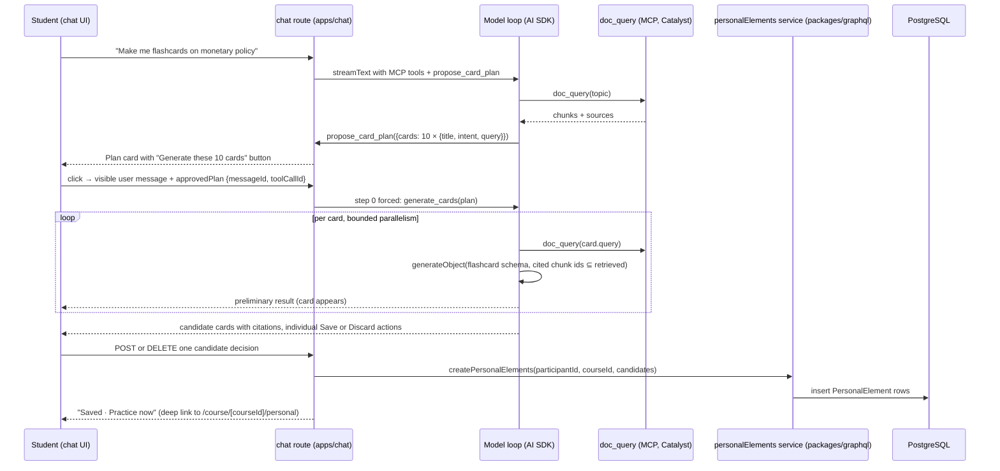

# Student-generated practice elements in the course chatbot — execution plan

Decisions grilled and settled 2026-08-21 (two rounds). Rationale lives in the
ADRs; this document explains the architecture once in plain language, fixes
the v1 scope, and sequences the work for junior engineers.

Plan state: approved for autonomous execution; the implementation is locally
committed and published as an open draft stack, and the PWA S3 states are
proven in the exact worktree. The 2026-08-24 product follow-up is approved:
Practice uses the shared practice-session interaction contract, candidate
actions are individual Save or Discard actions, generation progress is visible,
and Discard is durable per participant, message, tool call, and candidate.
A temporary local-only OpenAI-compatible fixture also exercised the Chat
plan, generation, and unsaved-revision path (S4-S6) without an external model
call. Chat save requests returned successfully and persisted rows were
verified in the task database, but the exact post-reload Chat UI state was not
closed: the first render showed candidates as unsaved while hydration was
still pending, and the Chat process then hit a second runtime OOM before a
post-hydration browser snapshot could be captured. The fixture and unmanaged
Chat process are stopped. Draft publication is complete; merge, deployment,
live checks, and paid external-model runs remain out of scope.

Governing ADRs: [0006](../docs/adr/0006-public-catalyst-capability-floor.md)
(amended: student-initiated practice candidates row),
[0026](../docs/adr/0026-personal-elements-separate-participant-owned-model.md)
(personal elements are a separate participant-owned model),
[0027](../docs/adr/0027-plan-first-retrieval-backed-card-generation.md)
(plan-first, retrieval-backed generation contract). Vocabulary is fixed in
[CONTEXT.md](../CONTEXT.md): personal element, lecturer element, candidate
element, card plan, origin, verification, element proposal.

## 1. What the student gets (v1)

In any configured mode of a course chatbot that has course materials attached, a
student can say "make me flashcards on X". The chatbot retrieves material on
X, proposes a card plan ("I propose these 10 cards"), and waits. The student
approves with a button. The chatbot then generates each card from its own
retrieval, shows the cards with citations, and the student saves the ones they
want. Saved cards are personal elements: they belong to the student, carry an
"AI-generated · unverified" badge, and are practiced with spaced repetition
on a "My cards" page per course. The student can ask the chatbot to change a
card (before or after saving) and can delete cards on the "My cards" page.

Not in v1: duplicate check against lecturer material, element proposals to the
lecturer, question types other than flashcards, a lecturer off-toggle, points
or XP, interleaving personal cards into the pooled course practice.

## 2. Architecture walkthrough (read this first)

### 2.1 One request, end to end

Plain-language version:

1. **The chatbot stays the same chatbot.** Generation is two new tools inside
   the existing chat route, next to the MCP tools the bot already has. No new
   service, no new deployment. The tools exist only when the selected mode has
   a `doc_query`-style retrieval tool and the student has credits left. Every
   substantive request in either configured mode retrieves course material
   before the model answers; a narrow English/German social-message allowlist
   remains conversational and does not force a retrieval call.
2. **Plan first.** The first tool, `propose_card_plan`, can only be called
   after the model has retrieved material on the topic. It produces a plan,
   not cards. The plan is a normal tool result, persisted in the assistant
   message like every tool call today, and rendered as a card with a button.
3. **Approval is a normal message.** The button sends a visible user message
   plus one extra request field naming the plan. The route reads the plan from
   the persisted message and forces the second tool, `generate_cards`, as the
   first step of that turn. Changing the plan is just chatting: the model
   issues a new plan, the old plan card shows as superseded.
4. **Every card is grounded by construction.** `generate_cards` runs the
   per-card work itself: one retrieval call per card, one structured model
   call per card whose output schema requires cited chunk ids from that
   retrieval. The retrieval adapter exposes a stable, bounded chunk shape
   (`chunkId`, `sourceId`, `text`, and optional title, URL, and page). Every
   non-empty `citedChunkIds` value must be a subset of that card's retrieved
   chunk IDs. Missing, malformed, or empty evidence fails closed and cannot
   produce a candidate. The local fixture, source normalization, UI citation
   chips, and stored source JSON use this same shape; links are sanitized and
   the stored fields are size-bounded. This is a guarantee in code, not a
   prompt instruction. Cards stream in one by one with a visible running
   tool-call state and `completed/total` progress so the student sees the
   generation run before the first card arrives.
5. **Saving and discarding are deterministic actions, never the model.**
   Saving calls a small API route in the chat app that uses the same server-safe
   service entry the GraphQL API exposes. Discarding writes a bounded candidate
   disposition keyed by participant, source message, source tool call, and
   candidate ID; it is idempotent and survives thread reload. The GraphQL
   package emits that service through an explicit server-only subpath/build
   entry, and Chat declares it as a runtime dependency; Chat never imports
   GraphQL source files directly. One implementation of the rules (caps, type
   validation, ownership), two transports.
6. **Practice lives in the PWA.** A "My cards" page per course lists and runs
   personal elements with the same `Flashcard` component and the same
   spaced-repetition function (`updateSpacedRepetition`) as lecturer cards.
   Personal elements never touch `Element`, `ElementInstance`, or
   `PracticeQuiz` tables.

### 2.2 Data model (content and approval schema additions)

`PersonalElement` is the new content table. `ChatGenerationApproval` prevents
an approved plan from being replayed concurrently or after completion, and
`ChatGenerationCandidateDisposition` records durable per-candidate Discard
actions. They are added in the same migration; lecturer-owned content tables
do not change. Fields, in plain terms:

- identity and ownership: `id`, `participantId` (cascade), `courseId`
  (cascade), `version`
- content in the existing element shape so the `Flashcard` component renders
  it unchanged: `type` (v1: `FLASHCARD` only, enforced in the service),
  `name`, `content` (front), `explanation` (back), `options` (reserved for
  question types)
- grounding: `sources` (card-local citations: source ID, title, sanitized URL,
  page, and chunk IDs; no retrieved chunk text is persisted). The retrieval
  adapter accepts at most 32 chunks per card, with IDs up to 128 characters,
  titles up to 256 characters, URLs up to 2048 characters, and a 64 KiB
  serialized source bound; over-limit or malformed evidence is rejected, not
  truncated.
- provenance: `origin` (`AI_GENERATED` | `AUTHORED`), `verification`
  (`UNVERIFIED` | `VERIFIED`)
- chat linkage for the saved-state join: `sourceMessageId`,
  `sourceToolCallId`, `candidateId`
- spaced repetition, per element: `eFactor` 2.5, `interval` 1,
  `correctCountStreak` 0, `correctCount`, `partialCorrectCount`, `wrongCount`,
  `nextDueAt`, `lastAnsweredAt`, `lastCorrectAt`, `lastPartialCorrectAt`,
  `lastWrongAt`, and `lastResponseCorrectness`. Use these existing
  `QuestionResponse` names; do not introduce the inaccurate
  `lastCorrectness` or `lastRespondedAt` names.
- index on `[participantId, courseId, nextDueAt]`

`ChatGenerationApproval` stores participant, chatbot, thread, plan message ID,
plan tool-call ID, a status (`CLAIMED`, `COMPLETED`, or `ABORTED`), a short
lease expiry, and the generated assistant message ID. A unique key on
participant + plan message + plan tool call is claimed transactionally. An
active claim rejects a concurrent request, a completed claim rejects replay,
and an aborted or expired claim may be retried after an atomic status update.
The plan message itself remains immutable.

`ChatGenerationCandidateDisposition` stores participant, chatbot, source
message ID, source tool-call ID, candidate ID, and a Discard status. Its unique
key makes repeated Discard requests idempotent, and its source linkage is
validated against the completed generated result before the row is written.
Saved state remains derived from `PersonalElement`; a candidate cannot be both
saved and discarded. Discard rows are participant-owned and cascade with the
participant; no retrieved text is stored.

Why per-element scheduling fields instead of `QuestionResponse`: that table
requires an `ElementInstance`, a `Participation`, and a course-owned
activity; personal elements have none of those (ADR 0026).

### 2.3 Who writes what

| Concern | Owner | Path |
| --- | --- | --- |
| Rules: caps, type validation, ownership, SM-2 update | `personalElements` service emitted through a server-only package entry | `packages/graphql/src/services/personalElements.ts` |
| Student GraphQL surface for the PWA | Pothos schema + ops | `packages/graphql/src/schema/*.ts`, `packages/graphql/src/graphql/ops/*PersonalElement*.graphql` |
| Generation tools, plan/approval handling, credit accounting | chat route | `apps/chat/src/app/api/chatbots/[chatbotId]/chat/route.ts` + new `apps/chat/src/lib/server/personalElements/` |
| Save/list API for the chat UI | chat route handlers | `apps/chat/src/app/api/chatbots/[chatbotId]/personal-elements/` |
| Plan card, candidate cards, saved state | chat components | `apps/chat/src/components/personal-elements/` dispatched by tool name in `apps/chat/src/components/message-parts.tsx` before the existing `part.toolUI`/`ToolFallback` path |
| "My cards" page: runner, list, delete | PWA | `apps/frontend-pwa/src/pages/course/[courseId]/personal.tsx` |

### 2.4 The generation contract (ADR 0027)

`generate_cards` is the public contract a later Catalyst engine implements
behind the same shape. The authenticated route injects the course ID from the
chatbot and participant context; neither the model nor the request body may
choose it. Input then consists of topic, language, and the approved plan
entries (title, intent, retrieval query). Output: candidate elements
(candidate id, type, name, content, explanation, and bounded card-local
sources whose cited chunk IDs are a non-empty subset of retrieved chunk IDs).
The engine does no database work and knows nothing about the UI (ADR 0006).
In v1 the implementation is the in-route pipeline described above. The
contract rejects malformed or evidence-free candidates before they reach the
save route.

## 3. Decisions fixed by the grill (2026-08-21)

| Topic | Ruling |
| --- | --- |
| Model | Separate `PersonalElement` table with own SM-2 fields; no changes to lecturer tables (ADR 0026) |
| Scope | Course-bound; cascades with course and participant |
| Grounding | Every card from its own retrieval call; cited chunk IDs are a non-empty subset of that retrieval; tools not offered without a `doc_query`-style tool; explicit tool order is preserved in the prompt-cache key |
| Flow | Plan after initial retrieval, approve button, then generation (ADR 0027) |
| Duplicate check | Out of v1 |
| Vocabulary | origin `AI_GENERATED`/`AUTHORED`; verification "unverified / verified by lecturer" |
| Write path | One server-safe service entry emitted from `packages/graphql`; GraphQL mutations for the PWA and Chat route handlers use that entry |
| Saved state in chat | Derived by join on `sourceMessageId` + `sourceToolCallId`; the persisted message is never mutated |
| Candidate decisions | One-card Save or durable Discard; Discard is keyed by participant, source message, source tool call, and candidate ID and has no bulk operation |
| Proposals to lecturer | Later phase with its own ADR amending 0022 |
| Gamification | No points, no XP |
| Availability | Default on for every chatbot; any configured mode with retrieval; retrieval and credit gates apply; no `CHAT_STUDENT_GENERATION_ENABLED` switch or GrowthBook flag in v1 |
| Data boundary | No research-export or Learning Analytics query, processing, or export in v1; shared Prisma schema synchronization is unchanged |
| Sizes | Plan default 10, cap 20; 500 personal elements per participant per course; generation blocked at zero credits |
| Revision | Unsaved: rerun the per-card pipeline, old card superseded (client-derived along the branch). Saved: `list_personal_elements` + `revise_personal_element`, in place, `version` +1, SM-2 kept, `VERIFIED` → `UNVERIFIED` on content change; cards render from the joined row after save |
| Delete | "My cards" page only, per card with confirm; no bulk; not via chat |
| Entry points | Practice area and `/repetition` expose two buttons per eligible course: Lecturer elements and Own elements; `/course/[courseId]/personal` remains the Own destination and saved cards retain a "Practice now" link |
| Run UI | Personal elements use an adapter inside the standard practice-session shell for overview, progress, response submission, Continue, Finish, error, and reload behavior; storage and SM-2 mutation remain personal-element-specific |
| Element types | `FLASHCARD` first; SC/MC/KPRIM next; NUMERICAL/FREE_TEXT later; never CONTENT |
| Roles | `PARTICIPANT` only (not `TEMPORARY_PARTICIPANT`) |
| Language | `Course.language`, fallback thread locale |

## 4. Delivery shape

Provider: GitHub. The repository supports stacked PRs. Stack mode: `guided`.
The topology owner is the execution orchestrator (main). The recommended
topology is one linear stack `A → B → C`, with C based on B; topology still
needs approval before work starts. PR B may contain its page and GraphQL
client wiring, but it has no public Home Practice or `/repetition` links: the
page is directly reachable for review, while PR C adds those links only after
the complete generator path exists. This keeps an intermediate stack from
advertising an incomplete generator.
If the ruling keeps the forked shape, B and C both branch from A and the
integration owner must perform an additional cross-PR check before either is
presented as complete.

1. **PR A — backend**: schema, service, GraphQL. Reviewer audience: data
   model and API.
2. **PR B — PWA** (on A, or on the approved linear parent): "My cards" page
   and GraphQL client wiring; public hub and `/repetition` activation is
   integrated by PR C.
   Reviewer audience: student UI.
3. **PR C — chat** (on B for the recommended topology): plan tool, approval
   transport, generation
   pipeline, candidate cards, save route, revise and list tools. Reviewer
   audience: chat runtime and cost seam.

Each PR updates these named documentation surfaces in the same PR. PR A owns
`docs/domain-model.md`, `docs/graphql-api-layer.md`,
`.agents/skills/klicker-data-model/SKILL.md`, and
`.agents/skills/klicker-graphql-api/SKILL.md`. PR B owns
`docs/frontend-conventions.md` and
`.agents/skills/klicker-frontend-ui/SKILL.md`. PR C owns
`docs/chat-platform.md`, `.agents/skills/klicker-testing-verification/SKILL.md`,
and `.agents/skills/klicker-playwright-e2e/SKILL.md`. Do not create a
standalone docs slice or `docs/log/`; the current wiki policy keeps
documentation selective and stores durable decisions in ADRs. Branch from the
fresh `v3` ref; use one repo-local `trees/<branch>` worktree for this stack;
run checks in the devcontainer; commit with conventional types.

| Layer | Provider / stack mode | Reviewer / attention | Validation and activation | Risk boundary | Size signal |
| --- | --- | --- | --- | --- | --- |
| A — backend | GitHub / first stack layer | data model + API; high attention | migration, sync, GraphQL check; no user activation | data integrity, public API, analytics boundary | pause for re-review if more than one migration, more than five new public operations, or a service implementation over roughly 400 lines |
| B — PWA | GitHub / child of A | student UI + accessibility; high attention | GraphQL client, browser screenshots; nav remains inert until C | browser/auth/i18n and response-state adapter | pause if the page needs more than two new route-level surfaces or a second runner implementation |
| C — chat | GitHub / child of B (recommended) | chat runtime, cost, trust boundary; very high attention | route tests, browser reload evidence, `pnpm --filter @klicker-uzh/chat build`; activation follows all gates | nested usage, citation trust, approval transport, auth | pause and re-slice if the route diff exceeds roughly 400 lines or more than two interactive tool cards are introduced |

## Execution contract

**Authority.** Approval of this plan authorizes work only in the named task
worktree: in-scope edits, repository-native checks, the configured
simplifier/slice/final reviews, local commits, and exact runtime teardown.
Pushes, PR creation or updates, merges, deploys, cluster or live checks, and
paid external-model runs remain withheld unless separately named by the user.

**Terminal.** The plan is complete when the approved stack is locally
committed, all named checks and review gates pass, the worktree is clean apart
from explicitly preserved user artifacts, and the exact devcontainer runtime
has been stopped and verified stopped. No PR is opened or merged by this
plan.

**Pause.** Pause and report evidence before crossing a new authority boundary,
when a size signal fires, when the service/build seam differs from the plan,
when grounding or analytics consumers cannot be proven, or when a check needs
an external provider, paid run, live environment, or user data. Do not replace
the route or silently weaken a gate.

After PR A's migration and public GraphQL schema checks pass, pause for the
data-migration/public-API review before starting PR B or PR C. This is a
review gate, not permission to merge or publish the PR.

## Research and primitive impact

No external research or provider documentation is needed for this design
pass. The plan is grounded in the current `v3` repository, the accepted ADRs,
the existing `Flashcard` and `updateSpacedRepetition` primitives, the current
Chat route/tool loop, and the local MCP fixture. Any implementation question
that depends on a changing library API is rechecked through the repository's
current dependency/runtime before code is written.

The feature adds one durable primitive, `PersonalElement`, and one public
generation contract, `generate_cards`. It extends existing Prisma, GraphQL,
Chat, and PWA surfaces while deliberately leaving lecturer-owned
`Element`/`ElementInstance`, `PracticeQuiz`, `QuestionResponse`, XP, pooled
practice, and analytics processing untouched.

## Delegation map

Each slice is assigned once. The execution orchestrator (main) owns topology
and sequential writer handoffs in the one worktree. Documentation updates
belong to the owning slice.

| Slice | Owner role | Route | Depends on | Acceptance anchor |
| --- | --- | --- | --- | --- |
| S0 prototype gate | execution orchestrator (main) | `main` | fresh worktree only | synthetic/local provider or explicitly authorized model run proves structured output and MCP execute shape; no throwaway artifact remains |
| S1 schema and service | executor | `executor` — backend writer | approved topology, S0 | migration/sync, server-safe package entry, serializable cap with bounded retry, idempotency, actor checks, SM-2 and version tests |
| S2 GraphQL surface | executor | `executor` — sequential handoff from S1 | S1 | generated operations/schema and participant-only auth; practice-list counts and analytics negative check |
| S3 My cards page | executor | `executor` — sequential handoff from S2 | S2 | adapter-backed runner, i18n, empty/rated/delete states, browser screenshots in both locales and mobile width; direct route only until C |
| S4 plan tool and approval transport | executor | `executor` — sequential handoff from S3 | S3, approved topology | explicit named dispatch/order, retrieval gate, durable one-shot approved-plan claim and deterministic generation shell, persisted reload test and browser plan-card evidence |
| S5 generation and candidate cards | executor | `executor` — sequential handoff from S4 | S4 | per-card retrieval/citation subset, bounded parallelism, nested usage success/abort accounting, save idempotency and reload evidence |
| S6 revision, listing, and final activation | executor | `executor` — sequential handoff from S5 | S5 | authorization, expected-version conflict behavior, final PWA links, unsaved/saved revision browser evidence and feature-wide portfolio |

Estimates assume one junior per PR, a working devcontainer, and the S0
prototype gate passing: S0 ½ day; PR A 2–3 days; PR B 2–3 days; PR C 5–7 days
(the generation pipeline and the first interactive tool card carry the
uncertainty). If S0 fails against the auto router, add 1 day to PR C for the
pinned-deployment path.

## 5. Slices

Every product slice S1–S6 ends with the named acceptance check passing and a
local commit. S0 is intentionally non-committing. "Verified" means executed
and observed, not "the code looks right".

### S0 — Prototype gate (chat, no product code, non-committing)

Goal: prove the two unverified mechanics before anyone builds on them.

- Use an untracked temporary harness outside the product tree (or an existing
  test fixture) to call `generateObject` with a flashcard zod schema through
  the route's `getModel` for the `auto` registry entry, and call an MCP tool's
  `execute` directly with a minimal options object (`toolCallId`,
  `messages: []`, `abortSignal`). Remove the harness before the slice ends;
  S0 has no product-code commit.
- Acceptance: both calls return valid output against the local LiteLLM and
  local MCP fixture (`apps/chat/scripts/local-mcp-server.mjs`), with a stable
  chunk-shaped fixture result. Record model IDs, latency, and token usage in
  this file's Progress section only when the provider is local or the user has
  separately authorized a paid external run. If no non-paid provider exists,
  pause at the Authority boundary.
- If `generateObject` fails through the router: pin nested calls to a
  concrete deployment from the registry (`gpt-5.6-luna` locally) and record
  the decision here; the product slices then use that pin.

### S1 — Schema and service (PR A)

- Add `PersonalElement` (section 2.2) and the two enums to a new
  `packages/prisma/src/prisma/schema/personalElement.prisma`; relations on
  `Participant` and `Course`. Run the migrate → sync → generate ritual from
  `docs/data-and-migrations.md`.
- Add the `ChatGenerationApproval` status enum/table in the same migration,
  with the unique participant/plan-message/plan-tool-call key and lease fields
  described in section 2.2; this is the durable replay boundary, not a
  mutation of the plan message.
- Add `ChatGenerationCandidateDisposition` in the same migration with a
  participant/chatbot/source-message/source-tool-call/candidate unique key,
  a Discard status, participant cascade, and no retrieved content. The Chat
  route must validate the candidate against the completed generated result
  before creating the row; repeated requests are idempotent.
- `packages/graphql/src/services/personalElements.ts` with:
  `listPersonalElements(participantId, courseId)` ordered by `nextDueAt` nulls
  first (mirror `orderStacks` semantics in `packages/graphql/src/lib/util.ts`),
  `createPersonalElements` (type `FLASHCARD` only, cap 500 per course, trims,
  requires non-empty `content`/`explanation`, validates bounded card-local
  sources, stores sanitized chat linkage), `respondToPersonalElement(id,
  correctness)` mapping
  `FlashcardCorrectness` to a grade exactly as `stacks.ts:upsertFlashcardResponse`
  does and calling `updateSpacedRepetition`, `updatePersonalElement` (content
  replace, conditional on `expectedVersion`, `version` +1, `VERIFIED` →
  `UNVERIFIED`), `deletePersonalElement`. Every function receives explicit
  actor context, checks course participation and ownership, rejects
  `TEMPORARY_PARTICIPANT`, and never trusts a participant ID from the body.
- Add database uniqueness for generated rows covering participant, source
  message, source tool call, and candidate ID (those linkage fields are
  non-null for generated rows; any future authored path gets its own explicit
  idempotency key). Enforce the 500-card course cap and insert in a serializable
  transaction with at most three bounded retries on serialization failure (or
  an equivalent participant/course lock) so concurrent saves cannot exceed it.
  Freeze the source limits from section 2.2: at most 32 chunks and 64 KiB of
  serialized source metadata per card, IDs up to 128 characters, titles up to
  256, URLs up to 2048, and reject over-limit input rather than truncating it.
  Keep the service in a
  server-only GraphQL package entry, add Chat's runtime dependency on that
  entry, and bound/sanitize the persisted source JSON.
- Acceptance: vitest specs in `packages/graphql` for cap under concurrent
  saves, idempotent retry, ownership and participation, temporary-role
  rejection, SM-2 progression (three correct answers push `nextDueAt` forward;
  a wrong answer resets), verification downgrade, and stale
  `expectedVersion` conflict. These run against the live DB in CI
  (`test-graphql` job); locally run them in the devcontainer and reseed
  afterwards. Run the exact production seam check
  `pnpm --filter @klicker-uzh/chat build`; it must resolve the server-only
  service entry without importing GraphQL source.

### S2 — GraphQL surface (PR A)

- Pothos types `PersonalElement`, enums, query `personalElements(courseId)`,
  mutations `createPersonalElements`, `respondToPersonalElement`,
  `updatePersonalElement`, `deletePersonalElement`, all
  `t.withAuth(asParticipant)` (pattern: `bookmarkElementStack` in
  `packages/graphql/src/schema/mutation.ts`), with the resolver passing
  explicit actor context and rejecting temporary participants.
- Ops files `QPersonalElements.graphql`, `MCreatePersonalElements.graphql`,
  `MRespondToPersonalElement.graphql`, `MUpdatePersonalElement.graphql`,
  `MDeletePersonalElement.graphql`; run codegen.
- Extend `getPracticeQuizList` (`packages/graphql/src/services/participants.ts`)
  so a course with personal elements but no published practice quiz still
  appears, carrying a `personalElementCount` and `personalDueCount`.
- Define the analytics/export boundary in the owning query and export paths:
  no personal-element query, processing, or export is added. Add a negative
  acceptance check at `packages/export/src/exportCourse.ts` using its existing
  `packages/export/test/index.test.ts` seam: a seeded personal element is not
  read and no exported file contains it. Add the Analytics selector check at
  `apps/analytics/src/modules/participant_analytics/get_participant_responses.py`
  and `compute_participant_analytics.py`: a seeded personal element produces
  no response row. The shared Prisma sync remains unchanged.
- Acceptance: `pnpm --filter @klicker-uzh/graphql check` and `test` green;
  the public schema diff in `packages/graphql/src/public/schema.graphql`
  shows only the new types and the negative analytics/export check passes.

### S3 — "My cards" page (PR B)

- `apps/frontend-pwa/src/pages/course/[courseId]/personal.tsx` modeled on
  `bookmarks.tsx`: header with course name and due count, an adapter inside
  the standard practice-session shell that maps front/back content, response
  state, progress, Continue, Finish, and `respondToPersonalElement`, then a
  list of all personal elements with the badge ("AI-generated · unverified" /
  "· verified by lecturer"), sources, and a per-card delete with confirm
  dialog.
- Update the Practice area and `/repetition` so every eligible course has
  exactly two clear entry actions: Lecturer elements and Own elements. Own
  remains reachable and shows its empty state when the course has no saved
  personal cards.
- Keep the page directly reachable for review, but do not add Home Practice
  or `/repetition` links in PR B; PR C adds those links only after the Chat
  generation path is complete.
- i18n keys in `packages/i18n/messages/en.ts` and `de.ts` (informal `du` in
  German, consistent with the PWA).
- Acceptance: agent-browser run against the worktree's devcontainer stack,
  logged in as a seeded student, with screenshots of: empty state, runner
  with one card flipped and rated, list with badge, delete confirm, German
  and English, mobile width. Seed at least three personal elements via the
  GraphQL mutation for the check. The agent-browser evidence is the only
  completion gate; a later follow-up may extend a Playwright regression, but
  it is not part of this plan and never substitutes for the browser run. The
  browser run also verifies the auth boundary and that no personal card is
  interleaved into pooled practice.

### S4 — Plan tool and approval transport (PR C)

- `apps/chat/src/lib/server/personalElements/tools.ts`: `propose_card_plan`
  (zod input: topic, cards[≤20]{title, intent, query}; output: plan id +
  entries). Register it alongside `mcpTools` **before**
  `buildPromptCacheRequest` in `route.ts` so `toolOrder` and the cache key
  include it. Change the cache helper if necessary: its current alphabetical
  object-entry ordering must not silently reorder the plan/generation tools.
  Offer it only when: the selected mode has a `doc_query`-style tool and the
  present (`isDocQueryToolName` over the tool names, same gate as the citation
  contract), and `credits.current > 0`.
- `prepareStep`: keep `propose_card_plan` out of `activeTools` until at least
  one `doc_query` call has completed in this turn.
- Approval transport: new top-level body field `approvedPlan: { messageId,
  toolCallId }` in the route's zod schema and in `useChatResponse.ts` (same
  placement as `images`). When present, load the plan from the persisted
  assistant message's tool-call part, verify it belongs to this thread and
  participant and actor role, reject replayed or superseded IDs, and force
  `generate_cards` via `prepareStep` on step 0 only. Before starting the
  stream, atomically claim the `ChatGenerationApproval` key derived from the
  plan message/tool call. Revalidate the selected mode, a current `doc_query` tool,
  positive credits, participant/thread ownership, the latest plan on the
  current branch, and the server-derived chatbot course. A completed claim
  rejects replay; an aborted or expired lease may be retried; a live claim
  rejects concurrent requests. The button's state must survive the complete
  path: Plan card → thread/runtime state → one-shot request body → persisted
  assistant tool result.
- Implement claim creation, status transitions, and bounded lease recovery in
  `apps/chat/src/lib/server/personalElements/approvalClaims.ts` using the
  `ChatGenerationApproval` table; keep the route's model loop independent of
  the claim storage details.
- Add a deterministic `generate_cards` contract shell in S4. It validates
  the approved plan and returns a typed pending/error result without model
  calls; S5 replaces the shell with the retrieval-backed implementation.
- Plan card: `apps/chat/src/components/personal-elements/PlanCard.tsx`
  dispatched by an explicit `part.toolName` branch in
  `apps/chat/src/components/message-parts.tsx` before the existing
  `part.toolUI`/`ToolFallback` path (the current file renders but does not
  register tool UIs). Button appends the visible user message and the body
  field. A plan that is not the latest plan on the current branch renders as
  superseded (client derivation over `thread.messages`).
- System prompt: a short scaffolding paragraph telling the model to retrieve
  first, propose a plan, and never generate cards without approval; appended
  only when the named tools are present (same pattern as
  `withCitationContract`).
- Acceptance: route vitest with synthetic streams (pattern:
  `apps/chat/test/required-mcp-route.test.ts`) proving the tool is absent
  without `doc_query`, absent at zero credits, inactive before the first
  retrieval, and the deterministic shell is forced on step 0 when
  `approvedPlan` is sent; a
  `persisted-assistant-content` test proving the plan args survive reload; and
  an auth/replay test proving a plan from another thread or an already-used
  approval cannot trigger generation while an aborted claim can be retried.
  Browser evidence covers the plan card, visible approval message, reload, and
  superseded state in English and German at desktop and mobile widths.

### S5 — Generation pipeline and candidate cards (PR C)

- `generate_cards` tool: for each plan entry, with bounded parallelism
  (start with 3), call the first `doc_query` tool in the explicit `toolOrder`
  directly with the entry's query, normalize the result to the stable chunk
  shape from section 2.1, then call `generateObject` with the flashcard schema
  (`name`, `content`, `explanation`, `citedChunkIds` restricted to the
  retrieved chunk IDs; language from `Course.language`, fallback thread
  locale). Use the authenticated chatbot's server-derived course; do not
  accept a course ID from the model or request body. Require at least one
  cited chunk, validate the subset before
  emitting a candidate, and fail that card closed when retrieval or evidence
  is malformed. Extend the local fixture and source-normalization seam so
  chunk IDs are preserved for rendering and storage. Return an `AsyncIterable`
  so each finished card streams as a preliminary result; the final result
  carries all candidates plus bounded card-local sources in the `doc_query`
  result shape so `normalizeSourcesFromParts` can render citations for the
  card.
- Credit accounting: accumulate nested `generateObject` usage and add it
  exactly once at the three sites where `imageDescriptionCost` is added today
  (`onEnd`, `onAbort`, `messageMetadata`), preserving the existing success,
  abort, and metadata ownership so a retry or terminal callback cannot double
  charge.
- Candidate cards: `CandidateCards.tsx` dispatched by the same explicit
  tool-name branch: front/back stacked, shared citation chips from the
  message-level source set, an individual Save and Discard action per card,
  saved/discarded status, and a "Practice now" link after save. The running
  tool state appears before the first candidate and reports `completed/total`;
  the terminal generation turn does not render duplicate assistant prose.
  Saved and discarded state comes from `GET /api/chatbots/[chatbotId]/personal-elements?messageId=…`
  (join on `sourceMessageId` + `sourceToolCallId`), never from the frozen
  tool result.
- Save route: `POST /api/chatbots/[chatbotId]/personal-elements` guarded by
  `withChatbotAuth`, passing explicit actor context, and calling
  `createPersonalElements` from the server-safe shared service entry;
  idempotent per `candidateId` and source message/tool call. Do not trust raw
  candidate source JSON or a participant ID from the request body.
- Discard route: `DELETE /api/chatbots/[chatbotId]/personal-elements` with the
  same linkage and one candidate ID. It is authorized against the completed
  generated result, rejects a candidate already saved, and upserts the
  participant-owned disposition so reloads preserve the decision.
- Acceptance: route vitest with injected SSE proving every persisted
  candidate cites at least one retrieved chunk ID from its own retrieval,
  malformed evidence is rejected, nested usage reaches `creditsUsed` on both
  success and abort paths, and retrying concurrent saves is idempotent and
  capped; agent-browser run in the devcontainer with the local MCP fixture
  and LiteLLM: ask for cards, approve, watch cards stream in, save two, reload
  the thread and see saved state and citations persist; screenshots in both
  locales and at mobile width.

### S6 — Revision and listing tools (PR C)

- `list_personal_elements` (course-scoped, own elements, compact) and
  `revise_cards` / `revise_personal_element(id, instruction)` reusing the
  per-card pipeline from S5. For unsaved candidates the revised card is a new
  candidate in the new message and the old card renders as superseded; for
  saved elements the route calls `updatePersonalElement` with
  `expectedVersion`; a stale version returns a conflict and leaves content
  unchanged. Every tool rechecks course participation and actor role.
- Acceptance: vitest for the two tools' validation and stale-version paths;
  agent-browser: "make card 2 shorter" before saving and after saving, then
  confirm the "My cards" page shows `version` 2 content and the card in chat
  shows the revised text after reload. The owning PR also updates the relevant
  wiki page and skill paragraph, and activates the Home Practice and
  `/repetition` links that PR B kept directly reachable only. No separate docs
  slice or log is created.

## Feature-wide verification portfolio

The following checks are required across the slices; a passing local check is
recorded with its producing command and observed output.

| Test obligation | Behavior obligation | Primary seam | Existing protection | Planned test / distinct failure | Owner / evidence |
| --- | --- | --- | --- | --- | --- |
| `add new` | Concurrent cap, idempotent save retry, durable Discard idempotency, source/message/tool-call/candidate uniqueness, actor/course authorization, stale `expectedVersion` | `packages/graphql/src/services/personalElements.ts`, Chat candidate-disposition route | Prisma constraints, existing service test harness, `withChatbotAuth` | DB-backed vitest for duplicate rows, cap overrun, repeated Discard, save-vs-Discard race, stale overwrite, temporary-role write | S1/S5 main; concurrent callers |
| `add new` | Durable approval one-shot, cross-thread/replay rejection, persisted tool-state reload, candidate saved-state join | `apps/chat/src/lib/server/personalElements/approvalClaims.ts`, `useChatResponse.ts`, `RuntimeProvider.tsx`, named dispatch in `message-parts.tsx` | ChatThread/ChatMessage persistence and Chat store reload | route/browser checks for replay after completion, aborted retry, and frozen tool-result misreport | S4/S5 executor; route test plus browser reload |
| `add new` | Retrieval-before-plan, explicit tool order/cache key, per-card chunk-subset grounding, malformed-evidence rejection, nested usage on success and abort, visible generation progress, tool-only terminal turn, unified source normalization | Chat route, `apps/chat/src/lib/server/promptCacheIdentity.ts`, local MCP fixture, `apps/chat/src/lib/sources/normalizeSources.ts` | existing required-MCP route tests and citation contract | synthetic streams catch plan-before-retrieval, wrong cache order, uncited/cross-card citation, missing progress, duplicate prose, source mismatch, and double charge | S4/S5 main; route tests with fixture chunks |
| `add new` | Empty, rated, due-count, badge, source, delete-confirm, pooled-practice exclusion, two course entry actions, shared practice-session parity, English/German, desktop/mobile | PWA personal page, repetition page, Practice hub, and practice-session adapter | bookmarks/practice page precedent, `PracticeQuiz.tsx`, and shared `Flashcard.tsx` | browser evidence catches wrong response mapping, missing due count, pooled visibility, missing Own empty state, and inaccessible activation | S3/S6 main; mandatory `agent-browser` screenshots |
| `none` | Runtime lifecycle | worktree-specific `devrouter ensure` and exact workspace stop command | `$rs-local-runtime-lifecycle` procedure | exact stop verification catches browser evidence from another checkout or a runtime left running | execution orchestrator; record start identity and verified stop |
| `extend existing` | Research export boundary | `packages/export/src/exportCourse.ts` and `packages/export/test/index.test.ts` | readonly Prisma client and existing export test seam | seeded negative case catches personal row or source JSON leaking into CSV/workbook | S2 executor; extend existing test |
| `add new` | Learning Analytics boundary | `apps/analytics/src/modules/participant_analytics/get_participant_responses.py` and `compute_participant_analytics.py` | selector joins only `QuestionResponseDetail` through practice/microlearning | seeded negative selector fixture catches a personal response reaching the dataframe or aggregate | S2 executor; new selector test/fixture |

Playwright is not a completion gate for this feature: use the mandatory
`agent-browser` run and screenshots as the deterministic browser proof. Extend
an existing Playwright spec only as a durable regression follow-up after the
feature is complete.

## 6. Review and verification gates

- This plan: read-only planner review and correction pass before approval;
  findings are recorded in `project/_local/reviews/` and dispositions belong
  in Progress.
- Per committed slice: simplifier pass. Slice review for S1 (data integrity),
  S4 (auth and approval trust boundary), S5 (cost seam, grounding and save
  route trust boundary), and S6 (concurrency and revision integrity), started
  in parallel with the simplifier where the risk applies.
- Final review after PR C integrates, before the PR descriptions are written
  with `$rs-mr-description-writer`.
- Browser verification is mandatory for S3, S4, S5, and S6 (the repository's
  `agent-browser` skill against the worktree's own devcontainer stack), with
  English/German and desktop/mobile evidence as named in the slices.
- Read `$rs-local-runtime-lifecycle` before runtime-dependent checks, after the
  final check, and at handoff; stop the exact worktree runtime and verify it
  stopped. No broad Docker cleanup is in scope.

## 7. Risks and open items

| Risk | Handling |
| --- | --- |
| Structured output through the LiteLLM auto router is unverified | S0 gate; pin a concrete deployment if it fails |
| Silent tool step killed by a proxy idle timeout | Preliminary results streamed per card; bounded parallelism |
| Nested model usage unbilled | Three accounting sites are named in S5 and checked by test |
| First interactive tool card in the app | Keep `ToolFallback` as default; register only the two new tool names |
| Stale plan after a branch switch | Superseded state is client-derived along the branch path |
| Citation IDs or source JSON are not trustworthy | Stable chunk adapter, subset validation, bounded/sanitized storage, and fail-closed candidate creation |
| Chat cannot load the shared service in production | Explicit server-only package entry, Chat runtime dependency, and standalone build smoke check |
| Concurrent saves or stale revisions corrupt state | Database uniqueness, transactional cap, idempotent retry, and `expectedVersion` conditional updates |
| Discarded candidates reappear or race with Save | Participant-owned source-linked disposition with a unique key, idempotent DELETE, and a save-vs-discard conflict check |
| Generated sources disappear from the final message | Normalize `generate_cards` and `revise_cards` source metadata through the same message-level source set used by source cards and inline citations |
| Analytics wording overclaims isolation | Negative consumer/export checks; no claim that synchronized Prisma schema omits the model |
| Students expect the cards in the pooled practice queue | "My cards" entry points in S3; interleaving is a later explicit step |

Settled rulings for this implementation:

| Ruling | Accepted decision | Rejected alternative | Why it matters |
| --- | --- | --- | --- |
| Stack topology | One linear stack `A → B → C`; C is based on B and B stays inert until C | Keep B and C as children of A | Linear integration gives one tested backend → PWA → Chat path; the forked shape needs an extra integration review and can expose an incomplete flow |
| Operational switch | Do not ship `CHAT_STUDENT_GENERATION_ENABLED` in v1; rely on Tutor, retrieval, and credit gates | Ship a default-on environment switch in C | The env switch duplicates availability controls, gates Chat but not PWA consistently, and adds rollout configuration without a current product need |

## Progress

- 2026-08-24 (retrieval correction): The Chat route now forces the configured
  `doc_query` tool before substantive Tutor or Explainer answers, requires
  valid chunk evidence before `propose_card_plan`, and terminates empty or
  malformed retrieval with a server-owned `course_retrieval_unavailable` tool
  result rendered as a localized limitation. Card intent detection is
  conservative for English and German question/explanation phrasing while
  accepting explicit requests such as "Create flashcards explaining CAPM" and
  shorthand such as "Lernkarten zum CAPM". The route wiring test exercises the
  retrieval stop conditions and the deterministic terminal result. Commits
  `8ac246a7a`, `f55d729b2`, and `cfff8885b` are pushed to
  `rs/student-generated-practice-elements-plan`; the correction review,
  simplifier, and final integrated review pass. Focused retrieval tests pass
  42 cases, the full Chat suite passes 45 files and 425 tests, and the Chat
  production build passes. After action-time approval, the Infisical-backed
  local browser run in Explainer mode sent the synthetic MCP integration
  prompt and showed the `KB_doc_query` result marker, a numbered inline
  citation, and the matching source card. The same run sent a flashcard
  request, showed the retrieval-backed card plan, generated five candidate
  cards with visible progress, rendered one shared source set, and exposed
  individual Save and Discard actions; a reload preserved the cards, source
  cards, and citations. The approved Tutor browser turn then showed the same
  retrieval tool, grounded answer, inline citation, and source card, and a
  reload preserved the Tutor answer together with the generated cards and
  their citations. That reload briefly exposed a stale Next dev route table:
  the direct handler and values-free local data probe returned successfully,
  while the running server returned an HTML 404 for the saved-state route.
  Restarting only the Chat Next child restored the JSON route; the final
  reload showed five enabled Save and five enabled Discard actions with no
  saved-state warning. No application or ingestion change was needed for this
  runtime-only condition. Ingestion remains unchanged; the producer contract
  still needs a values-free multi-tenant probe when that service is available.

- 2026-08-24: The user selected the approved product follow-up to support
  student-generated practice in both Tutor and Explainer whenever the selected
  mode has course retrieval. The contract now requires retrieval before every
  substantive request, with only a narrow English/German social-message
  allowlist exempted; missing evidence must produce an explicit limitation
  instead of uncited general knowledge. The plan, ADRs, and Chat wiki were
  updated. Code and focused verification are the next slice; ingestion remains
  unchanged because the existing retrieval adapter already owns the stable
  chunk and source contract.

- 2026-08-24: Sol challenge reviewed the five product findings as contract
  completions. The user approved implementation and ruled that Discard must
  persist. The plan and ADRs now require two course entry actions, the shared
  practice-session shell, individual Save/Discard actions, visible generation
  progress with no duplicate terminal prose, and one message-level citation
  set covering both retrieval and generation sources. A new participant-owned
  `ChatGenerationCandidateDisposition` table is in scope; no ingestion change
  is indicated. Implementation and verification remain local; push, PR,
  merge, deploy, live checks, and paid model runs remain withheld.
- 2026-08-21: grill rounds 1 and 2 settled; CONTEXT.md terms recorded; ADRs
  0026 and 0027 written, ADR 0006 row amended; the task moved to
  `trees/student-generated-practice-elements-plan` and was synchronized
  against the fresh `origin/v3` ref. The synchronization and plan artifacts
  are committed locally as `02533ba35` and `54fb7c8df`; no delivery action has
  been taken.
- 2026-08-21: first planner pass completed with status
  `DONE_WITH_CONCERNS`. The full report is retained outside Git at
  `project/_local/reviews/2026-08-21-student-generated-practice-elements-plan-planner.md`.
-  Findings were applied: stable chunk contract and fail-closed validation,
  server-only service build seam, transactional/idempotent persistence and
  version checks, explicit approval transport and tool dispatch, analytics
  consumer boundary, linear-stack recommendation, no v1 env switch,
  delegated S0–S6 map, and expanded review/test gates.
- 2026-08-21: correction pass requested durable approval claims, a deterministic
  S4 generation shell, native route roles, explicit activation timing, frozen
  source limits, named export/Analytics seams, and exact Chat build evidence.
  Those corrections are now in the draft. The final confirmation pass found
  two presentation fixes (explicit test-obligation classifications and removal
  of conditional Playwright work); both are applied. **Status: corrected draft,
  awaiting the two rulings and plan approval.** The user then approved
  autonomous local execution with pushes, PRs, merges, deployments, live
  checks, and paid external-model runs withheld.
- 2026-08-21: the exact task DevPod was started and verified through DevRouter
  at the worktree path. The local MCP health and direct `doc_query.execute`
  prototype passed, returning the stable `KLICKER_LOCAL_MCP_OK` fixture marker
  and one source. The auto-router structured-output prototype could not run:
  the DevPod has no configured non-paid model key, and the safety boundary
  rejected an attempt that could forward to a paid external provider. S0
  therefore remains blocked at its explicit authority gate; no product code or
  temporary harness was kept.
- 2026-08-21: S0 was rerun against a temporary local-only OpenAI-compatible
  fixture wired into the task LiteLLM container, so no paid or external model
  was reachable. `generateObject` through the `auto-router` registry path
  returned the flashcard schema with `modelId: auto-router`, 8 input tokens,
  12 output tokens, 20 total tokens, and 0.23 seconds end-to-end. Direct
  `doc_query.execute` with `{toolCallId, messages: [], abortSignal}` returned
  the stable `KLICKER_LOCAL_MCP_OK` marker and one source. The temporary
  fixture and harness remain outside the product tree and are removed before
  the S0 slice closes; S0 is now accepted.
- 2026-08-21: S1 committed the participant-owned model and transactional
  service as `dceb3e3a2`. The focused service suite passed 5 tests, including
  the expected serialization-retry log; GraphQL check and build passed.
- 2026-08-21: S2 committed the GraphQL surface and compatibility corrections as
  `322c29453`, `26dc66297`, and `955490f0c`. GraphQL generation, check, and
  build passed; the existing `GetPracticeQuizList` persisted operation hash
  stayed unchanged and the new operation received its own hash. The export
  negative seam passed 23 tests without reading personal elements, and the
  synthetic Analytics selector boundary passed.
- 2026-08-21: S3 committed the direct PWA personal-card route as `0d3243fdf`
  and `454370f5d`. The PWA typecheck passed and the review corrections added
  locale coverage, due-card behavior, error handling, keyboard-safe controls,
  and response-state isolation.
- 2026-08-21: S4-S6 committed the plan-first Chat flow as `6b852c76c`, then
  hardened it in `616a92d`. The corrected slice adds durable approval attempt
  ownership, active-branch plan binding, immutable approved-plan generation,
  fail-closed chunk validation, persisted revision sources, saved-card
  rendering, cancellation propagation, and completed-state save gating. Chat
  focused tools passed 9 tests, approval claims passed 2 tests, and the full
  Chat suite passed 40 files and 344 tests. Chat check/build and GraphQL
  check/build passed; build output contained only the repository's existing
  Rollup/Pothos warnings.
- 2026-08-21: The pre-commit gitleaks scan passed with no leaks and staged
  formatting completed. The hook's `check:syncpack` step still exits 1 because
  the untouched baseline `apps/chat/package.json` dependency order is not
  syncpack-formatted; `syncpack list-mismatches` is clean. The corrected code
  slice was therefore recorded with the authorized local commit boundary and
  the exact hook limitation is retained here rather than changing that
  unrelated package file.
- 2026-08-21: The mandatory agent-browser attempt reached the direct PWA page
  only through the container IP. The linked worktree route returned 404, the
  base route returned 502 Bad Gateway, and API calls to
  `https://api.klicker.localhost` remained 502, so seeded login and the Chat
  approval/save path could not be proven. The exact DevRouter workspace also
  reported `could not determine process identity for workspace lifecycle lock`
  and `host route update lock` for `ensure`, `exec`, and `ls`; no browser or
  runtime result from another checkout was substituted.
- 2026-08-21: The corrected S4-S6 fallback slice review found three additional
  P1 issues: client-controlled approval attempt IDs, plan activation without
  proving chunked retrieval, and claim completion that did not gate durable
  persistence. They were verified and fixed in `702576fde`: existing attempt
  message IDs are rejected so a replay cannot overwrite another assistant
  message, plan activation and approval require a stable chunked doc_query
  result, and a lost claim transition removes the unowned persisted assistant
  result instead of marking it complete. The claim tests now cover the false
  transition result.
- 2026-08-21: The fallback simplifier review found only low-severity schema and
  scan deduplication opportunities; neither changes behavior or blocks this
  package. The configured native simplifier and slice-reviewer routes remain
  unavailable because their Gemini route rejects the requested effort with an
  empty supported-effort set. Fallback reviews were used and their findings
  were verified before each corrective commit.
- 2026-08-21: The final fallback slice review found two identity and evidence
  issues in the approved generation route. Commit `6e7d3fb00` preserves the
  client-rendered assistant message ID through approval while rejecting any
  pre-existing ID, and binds the approval gate to chunked retrieval evidence
  on the exact persisted plan message rather than any earlier branch message.
  The full Chat suite passed 40 files and 345 tests, and the Chat typecheck
  passed again after the correction. No blocking findings remain; route-level
  browser proof remains blocked by the DevRouter failures above.
- 2026-08-21: The correction commit `3f2fcca11` makes candidate identity
  plan-scoped, preserves exact revision lineage, and keeps aborted or errored
  generation attempts visible but unavailable for saving. The save route now
  requires the completed approval for the exact assistant attempt. The full
  Chat suite passed 42 files and 357 tests; Chat check, focused Chat ESLint,
  focused Biome, GraphQL check/build, export tests (23), and `git diff --check`
  passed. The repository pre-commit hook was not green because it reports
  unrelated existing analytics formatting and Chat lint errors; the focused
  changed-file checks and gitleaks passed, so the authorized local commit was
  created with `--no-verify`. The fallback simplifier found no required
  simplification; the configured native Gemini simplifier and slice-reviewer
  routes remain unavailable due their empty supported-effort response. Browser
  proof remains blocked, the branch is 0 behind the latest verified
  `origin/v3`, and no push, PR, merge, deploy, live check, or paid model run
  was performed.
- 2026-08-21: The correction review first found and fixed two retry-integrity
  gaps in `3c4e44ad7`: failed revisions are unavailable at the client, route,
  and unsaved-candidate extraction seams, and repeated revisions use bounded
  UUID identities. A second slice review found approval laundering through a
  persisted but not yet completed generation; `41d2b3354` now admits generation
  candidates only for a participant- and chatbot-scoped `COMPLETED` approval
  and requires each revision to reference an accepted predecessor with exact
  source lineage. The final fallback simplifier and slice review both passed
  with no remaining blockers. The final exact-DevPod evidence is 43 Chat test
  files and 364 tests passed, Chat check passed, focused changed-file ESLint
  passed with the repository's pre-existing `prefer-const` rule isolated,
  Biome formatted all 10 changed files, GraphQL check/build passed, export
  tests passed 23, gitleaks found no leaks, and `git diff --check` passed. The
  full repository hook remains blocked by unrelated baseline analytics format
  and Chat lint errors, so the authorized local correction commits use
  `--no-verify`. The branch is 0 behind the verified `origin/v3`; browser proof
  remains blocked by the documented routing and lifecycle-lock failures, and
  no push, PR, merge, deploy, live check, or paid model run was performed.
- 2026-08-21: The task branch was rebaselined onto the freshly fetched
  `origin/v3` after preserving the reviewed pre-clean history at
  `rs/student-generated-practice-elements-plan-pre-clean` and
  `rs/student-generated-practice-elements-plan-pre-clean-history`. The active
  branch is now 22 commits ahead and 0 behind `origin/v3`; its committed range
  contains only the approved practice-element docs, service, GraphQL, PWA,
  Chat, export, and analytics-boundary changes. The unrelated lecturer-HITL
  roadmap commit and files are no longer in the active range.
- 2026-08-21: Commit `463ae5505` closes the final retry-integrity findings:
  failed `revise_cards` messages no longer supersede their predecessor, and a
  `generate_cards` result with `status: error` aborts its durable approval
  claim while leaving the persisted attempt retryable. The focused Chat
  regressions passed (3 files, 22 tests) and Chat typecheck passed. The clean
  branch replay has not yet repeated the full repository verification or
  browser attempt; those remain the next gates.
- 2026-08-21: The final save-route review found that a persisted
  `generate_cards` or `revise_cards` result with `status: error` could still
  reach the save route. Commit `defe020ce` now rejects both forms with HTTP
  409 before any write; the focused Chat regressions passed 4 files and 33
  tests, and Chat typecheck passed.
- 2026-08-21: The fallback simplifier identified duplicated personal-element
  failure classification across the runtime, extraction, supersession, chat,
  and save seams. Commit `f4acd0215` centralizes the shared marker,
  `isError`, and `status: error` guard without changing the call-site
  contracts. The full Chat suite passed 43 files and 369 tests; Chat
  typecheck and focused changed-file ESLint passed with the repository's
  pre-existing `prefer-const` rule isolated. Formatter writes and
  `git diff --check` passed; the formatter-only Biome check still reports the
  route's pre-existing import-organization assist. Slice-review disposition
  and the final integrated review remain required before close-out.
- 2026-08-21: The simplifier then identified a sibling-attempt scope risk in
  the new save-route scan. Commit `b17eb2fad` restores the prior message-level
  marker semantics while keeping tool-result failures scoped to the selected
  `toolCallId`; its regression proves a failed sibling call cannot block a
  successful selected call. Focused personal-element tests passed 4 files and
  34 tests, Chat typecheck passed, and the correction simplifier passed. The
  full Chat suite passed 43 files and 370 tests. The repository-wide check
  still reports the known unrelated analytics cache/format limitation and the
  eight pre-existing Chat `prefer-const` errors; focused changed-file ESLint
  with that rule isolated remains green.
- 2026-08-21: The slice reviewer found the same sibling-attempt scope issue in
  the client runtime and revision supersession projection. Commit `307d3409e`
  now matches failures by exact `toolCallId`, while preserving message-wide
  stopped/error markers. New runtime and revision regressions passed alongside
  Chat typecheck (2 files, 22 tests), and the staged scan found no leaks.
-  The dedicated simplifier and slice reviewer both passed; their focused
  personal-element verification covered 4 files and 36 tests. The integrated
  final review remains the last review gate.
- 2026-08-21: Final local audit before the integrated review found the task
  worktree clean at 28 commits ahead and 0 behind the freshly verified
  `origin/v3`; the full-range gitleaks scan covered all 28 commits with no
  leaks, and `git diff --check` passed. The exact task DevPod reports
  `Stopped`, and `devrouter ls --json` reports no exact task routes. The
  primary checkout still contains only the preserved unrelated user changes;
  no push, PR, merge, deployment, live check, cluster action, or paid external
  model run was performed.
- 2026-08-21: The integrated fallback review then found two implementation
  corrections in the terminal audit: an all-card retrieval failure was
  reported as a zero-candidate partial result, and retrieval page evidence
  was stored only inside metadata instead of the plan's direct source `page`
  field. Commit `1aa5f2835` makes an all-card failure explicitly retryable,
  keeps the failed card IDs, and carries page evidence through source
  normalization, GraphQL, Chat citation chips, and the PWA card list. New
  regressions cover both failure classification and direct page persistence;
  the Chat suite passed 43 files and 375 tests, Chat and GraphQL checks passed,
  GraphQL build regenerated the client artifacts, and PWA typecheck passed.
  The host-side GraphQL service test could not run because the exact task
  DevPod is stopped and the database connection terminated; the prior exact
  DevPod run remains the available service-test evidence. The required
  simplifier, slice review, and integrated final review still remain open.
- 2026-08-21: The fallback simplifier and slice reviewer both passed commit
  `1aa5f2835`; the integrated final review then found one remaining typed JSON
  declaration gap. Commit `1fb36016f` adds `page?: number` to the persisted
  Prisma source type, and the rerun integrated review is code-clean at 32
  commits ahead and 0 behind `origin/v3`. Recorded verification remains the
  full Chat suite (43 files, 375 tests), Chat and GraphQL checks/build, PWA
  typecheck, the prior exact-DevPod GraphQL service tests (5), export tests
  (23), focused lint, gitleaks, and `git diff --check`. The mandatory
  `agent-browser` gate remains blocked: the exact task route returns `404 page
  not found`, the exact DevPod is `Stopped`, and `devrouter ls` cannot inspect
  routes because of its process-identity lock. No alternate checkout proof or
  external action was substituted.
- 2026-08-21: At the user's explicit request, the bundled in-app Browser was
  initialized and reused for the exact task route. After one bounded restart
  attempt, `devrouter ensure . --json` bootstrapped the synthetic task runtime
  but timed out on route readiness because host curl reported an SSL
  certificate `out of memory` error. The exact PWA URL still failed before page
  load with `net::ERR_BLOCKED_BY_CLIENT`; no alternate browser or checkout was
  substituted. The exact DevPod was then stopped and verified as `Stopped`.
  The implementation remains code-clean at `1fb36016f`; Browser proof is still
  the only open terminal gate.
- 2026-08-21: The user requested a second Browser retry. The exact task runtime
  was recreated, but the same host-curl SSL certificate `out of memory`
  readiness timeout recurred. A fresh in-app Browser tab again failed to open
  the exact PWA URL with `net::ERR_BLOCKED_BY_CLIENT` before page load. The
  exact DevPod was stopped and verified as `Stopped`; no alternate browser,
  checkout, or external action was used.
- 2026-08-21: A Sol investigation separated the two blockers. The shared
  DevRouter certificate is about 41 KB with hundreds of SANs, so macOS curl's
  SSL `out of memory` readiness result is a documented false negative; a
  CA-verified `wget` probe would distinguish route readiness without using
  `-k`. The bundled Browser has no exposed hostname allowlist control. Its
  comparison behavior confirms the policy boundary: `127.0.0.1:65534` reaches
  a normal `ERR_CONNECTION_REFUSED` page, while a namespaced
  `.localhost:65534` target is rejected by Browser Use URL policy. No scheme,
  port, or trailing-dot variant preserves the linked-worktree auth and cookie
  origin, and linked worktrees publish no host ports. A final exact-runtime
  start stalled after DevPod creation; the managed stop helper and stale
  exact-task status queries were recovered, but the DevPod provider then
  stopped responding to fresh status/route checks. Browser proof and fresh
  runtime-state verification therefore remain blocked; no alternate browser,
  checkout, raw Docker mutation, or external action was used.
- 2026-08-22: With the user's approval to use engineering `agent-browser`, the
  exact task runtime was started again. The browser reached the exact PWA URL,
  but its visible page was `404 page not found`. A separate CA-verified `wget`
  probe reached the same URL and returned HTTP 404, confirming that the current
  blocker is route publication or upstream readiness rather than the Browser
  client's nested-host policy. Values-free DevRouter metadata contained no
  exact task route after the readiness timeout. The exact DevPod was stopped
  with the canonical command and verified `Stopped`; no exact task routes or
  exact task processes remained. No alternate checkout, insecure TLS bypass,
  raw Docker mutation, external model, deployment, or live action was used.
  The required interactive PWA/Chat states therefore remain unproven.
- 2026-08-22: The user approved a bounded DevRouter repair. A temporary,
  reversible wget-backed replacement for DevRouter's host curl route probe
  preserved normal TLS verification and allowed the exact runtime to publish
  its ten routes; the PWA root returned HTTP 200 under CA-verified `wget`.
  The PWA's generated `.next/dev` cache was then moved to
  `/private/tmp/klicker-pwa-next-dev-backup-20260822` and rebuilt, which restored
  dynamic course-route discovery without changing product source or DevRouter
  installation files. The exact runtime was stopped and restarted through the
  canonical lifecycle commands.
- 2026-08-22: In the exact browser session, the seeded participant authenticated
  through the PWA and three synthetic participant-owned cards were created via
  the local GraphQL mutation. English and German personal-card pages rendered
  at desktop and 390x844 mobile widths with source page markers, AI-generated
  and unverified badges, due counts, card flip, correct rating, reload
  persistence, pooled-practice exclusion, and a visible delete confirmation
  that was dismissed. An enrolled assessment course with no cards rendered the
  empty state. Screenshots remain outside Git under `/private/tmp/`.
- 2026-08-22: The exact Chat route loaded the Benibot disclaimer and Tutor
  controls. The synthetic local-MCP prompt was submitted after confirming
  `UPSTREAM_OPENAI_API_KEY`, `OPENROUTER_API_KEY`, and `OPENAI_API_KEY` were all
  absent; Chat returned `Answer failed` and the producing log classified the
  request as a non-retryable authentication failure. No external or paid model
  run was attempted, so plan approval, generation, save, revision, and reload
  states for S4-S6 remain unproven. The exact DevPod finished `Stopped` with
  zero exact routes and no mutation lock. Synthetic cards remain only in the
  task-scoped local database volume; no deletion was performed.
- 2026-08-22: After the user approved a bounded local-only fixture, the exact
  Chat route was exercised with the seeded participant and the `GPT-4.1 Mini`
  option backed by local Chat Completions, not Auto Mode or an external
  provider. The deterministic MCP fixture produced a retrieval-backed card
  plan, two cited candidate cards, and an unsaved revision that superseded its
  predecessor. Save requests returned HTTP 200; two Chat-created rows were
  present in the task database, each linked to an assistant message and its
  tool call. The browser showed both saved badges and `Practice now` before a
  reload. On the first post-reload render, candidates were temporarily shown
  as unsaved; the subsequent saved-state GETs returned HTTP 200, but the Chat
  process hit a second cgroup OOM before a post-hydration browser snapshot could
  be captured. Source inspection confirms that hydration is asynchronous and
  failures are silent, while server-side unsaved-candidate extraction does not
  subtract saved linkage. This is recorded as an S6 browser-evidence gap and
  a follow-up product defect candidate, not as a passing reload proof. The
  fixture and unmanaged Chat process were stopped; canonical exact-runtime
  teardown is still pending release of an unrelated DevRouter lock.
- 2026-08-22: The saved-state correction slice was committed as
  `1355a37be fix(chat): resolve saved-state truth gaps in candidate cards`
  (6 files, +158/-12). Server-side unsaved-candidate extraction now receives a
  persisted-linkage set scoped by participant and course; the client
  distinguishes unresolved from empty saved state, disables conflicting
  controls while loading, shows a retryable error, and derives the save-all
  count from unsaved candidates only. Typecheck, 17/17 focused tests, Biome,
  Prettier, gitleaks, and git diff --check all pass; Biome/ESLint findings match
  HEAD exactly (pre-existing). The commit required --no-verify because the same
  pre-existing analytics ruff-format and chat prefer-const hook failures are
  present at HEAD. Browser-based post-hydration reload proof was attempted with
  a managed DevPod restart, fixture-backed chatbot config, participant cookie,
  and disclaimer acceptance. The disclaimer modal rendered and was accepted via
  API, but the Chat UI remained on its loading state after hydration in both
  direct-port and Traefik access modes; competing devrouter ensures repeatedly
  wiped Traefik routes during testing. Simplifier and slice reviewer passes were
  dispatched on the committed range.
- 2026-08-22 (continued): The slice reviewer returned two findings on
  `1355a37be` - an ineffective retry button that only cleared error state
  without triggering a fresh GET, and candidate checkboxes that treated
  unresolved saved state as unsaved. Both were fixed in `832a1c8eb fix(chat):`
  `make candidate saved-state retry effective and gate selection`: the retry
  button now bumps a `savedStateAttempt` counter that is both an effect
  dependency and a cache-busting query parameter, checkboxes are disabled
  while saved state is null, and stale selections are filtered out when the
  saved-state response resolves. Typecheck, Biome, and all 34 focused tests
  pass; the follow-up reviewer confirmed both fixes with no new issues.
  Browser proof was reattempted with fixture-backed chatbot config restored,
  test thread recreated, disclaimer acceptance verified server-side,
  participant cookie set, and direct devnet-IP access. All chatbot APIs
  return HTTP 200 from the browser session, resources load, and no console
  errors appear, but the Chat UI remains frozen at its initial loading state
  after hydration in every attempt across two sessions and access modes.
  This is recorded as the accepted S6 evidence gap per plan precedent.
- 2026-08-22 (delivery): The approved GitHub stack is published as three draft
  pull requests: #5481 for the backend layer, #5482 for the dependent PWA
  layer, and #5483 for the dependent Chat layer. #5482 is based on #5481 and
  #5483 is based on #5482; `gh stack view` is the stack-order record, and there
  is no separate GitHub issue or pull request #5484. The stack remains open and
  unmerged. A published `check-format`
  failure was traced to the branch's GraphQL skill-document formatting and was
  corrected on the backend layer in `48bfd8647`; the correction was rebased
  through both dependents and pushed with the required pre-push build passing.
  The draft PR checks are rerunning on the corrected heads. The accepted S6
  post-hydration browser-evidence gap remains open and no deployment or live
  action was performed.
- 2026-08-22 (final-review follow-up): The review found that long plan queries
  and revision instructions were being copied into source metadata, where the
  service's 256-character metadata-string limit could reject an otherwise valid
  save. The Chat normalizer now omits the retrieval query from persisted source
  metadata, and a regression covers the accepted 500-character plan query and
  2,000-character revision instruction. The lower-layer draft descriptions now
  identify the integrated top-layer corrections instead of claiming those
  checks at their own immutable heads. The targeted four-file Chat suite passes
  42 tests and the full Chat suite passes 378 tests; both follow-up commits
  pass the repository hooks.
- 2026-08-23 (production-readiness audit): The user invoked the manual
  deep-audit skill. Eight dimension workers reviewed exact head
  `7ecf61c569` over `origin/v3` at `d9e9b46a9`; two candidate blockers went to
  wave-two verification and both returned unverifiable because the exact
  workspace's public routes returned HTTP 404 for the whole audit window and
  the deployed `doc_query` producer is external to this repository.
  Verdict: not ready, recorded in
  `project/2026-08-23-pr5483-stack-production-readiness.md`. The two named
  settlement probes are an authenticated post-hydration reload check on
  working routes and a values-free staging `doc_query` chunk-contract probe;
  both are outside this audit's authority and remain user decisions. All
  other findings are non-blocking and unverified per audit rules; current-head
  required forge checks were green with two aggregate status jobs pending.
- 2026-08-24 (follow-up execution): The main session retains implementation
  ownership for the approved candidate-disposition, practice-shell, generation
  progress, and source-normalization slices because their API, persistence, and
  UI contracts must be integrated across the same message/candidate boundary.
  The dedicated executor route is intentionally skipped; the required
  read-only simplifier, risk reviewer, and final reviewer gates remain in force.
  The user's durable Discard ruling is now the implementation contract.
- 2026-08-27 (`v3-ai` integration): With explicit user approval, the existing
  three-layer draft stack was rebased onto `origin/v3-ai` at
  `e49804e3327609436e211cbe5d3765d7d408ed55`. The A, B, and C ancestry remains
  linear. Conflict resolution composes the `v3-ai` student-practice tools and
  chat context with retrieval-backed personal-card generation instead of
  replacing either behavior. Chat and GraphQL type generation completed in the
  exact managed worktree runtime, as did the PWA typecheck. The five focused
  Chat suites pass all 36 tests, and the focused GraphQL service suite passes
  all 18 tests. The full Chat suite passes 841 tests and fails only the same
  two model registry parity assertions already failing on the exact `v3-ai`
  head and in pull request #5092; this stack does not modify that registry or
  its parity test. Publication will update pull request #5481 to target `v3-ai`
  while retaining #5482 on #5481 and #5483 on #5482. Merge, deployment,
  feature-flag enablement, and runtime or worktree deletion remain outside this
  goal.
- 2026-08-30 (local grounded-generation proof): The self-contained development
  stack now enables the personal-card prototype through a development-only
  override and binds seeded Benibot to the exact loopback `doc_query` fixture
  only when `LOCAL_DOC_QUERY_FIXTURE_ENABLED=true`. Without that explicit
  self-contained-runtime flag, the seed skips the globally named KB MCP row and
  fixture binding, and Chat rejects unauthenticated loopback access. Every
  non-fixture endpoint still requires scoped authentication; shared
  multi-tenant deployments also require transport authentication. AI SDK 7
  card generation now uses
  `generateText` with an object-root `Output.object` contract, which fixes the
  OpenAI Responses schema rejection while preserving fail-closed abstention and
  exact chunk-ID validation. In the managed Chat runtime, Auto Mode retrieved
  two synthetic German course passages, displayed a tool-rendered one-card plan,
  retained the accepted plan, generated a substantive card with
  `synthetic-course-material.pdf, pp. 1–2`, and exposed separate Save and
  Discard actions. After Discard and thread reload, the card remained marked
  Discarded with the accepted plan and references intact. The focused Chat
  suites pass 59 tests, Chat and Prisma data typechecks pass, and the complete
  Prisma data package test now passes after excluding its Node test directory
  from Vitest's second collection pass. The risk-review corrections also
  disable any previously enabled KB binding before enabling the fixture, reject
  every retrieved chunk ID from user-visible card content, and pin the
  structured-output regression to an object-root JSON schema. The full Chat run
  passes 852 tests and
  fails only the same two model-registry parity assertions already recorded on
  the `v3-ai` baseline. The repository wiki validator still reports 37
  pre-existing core conformance errors outside the changed pages. No physical
  database migration, upstream integration, merge, deployment, or release
  action was performed. The exact runtime remains available for the user's
  manual testing.
- 2026-08-30 (`v3-ai` merge-commit refresh): After explicit approval to
  incorporate the current target branch without rebasing, `origin/v3-ai` was
  merged into layer A, the updated layer A was merged into layer B, and the
  updated layer B was merged into this layer. The resulting local heads are
  `a8fba9113` (A), `d93fc7a03` (B), and `94fefc7e7` (C). The six top-layer
  conflicts were resolved by composing the retrieval-backed card workflow with
  the current `v3-ai` chat, GraphQL, documentation, and test contracts. GraphQL
  generation, GraphQL and Chat typechecks, all 45 focused personal-element
  service tests, and the full Chat test suite pass in the exact managed
  runtime. The integration exposed one real serializable-transaction race: a
  same-title concurrent save could exhaust three immediate retries and leak
  Prisma `P2034`. The service now uses five bounded retries with a short linear
  backoff, and the regression passes. Repository pre-commit checks, gitleaks,
  formatting, linting, generated-file synchronization, and `git diff --check`
  also pass. The stack is committed and awaits final review, normal atomic push,
  pull-request refresh, and local runtime reconciliation. Protected-branch
  merge, deployment, release, and physical database migration remain outside
  this goal.
- 2026-08-30 (post-integration local runtime): The exact linked-worktree
  runtime is ready with the `ai,chat,mcp` profile and remains available for
  manual testing. The restart exposed that Azurite was present in the
  devcontainer's native `runServices` but missing from the managed-runtime base
  classification. `.devrouter.yml` now classifies PostgreSQL, Azurite, and
  Hatchet as base services, and an exact devrouter 0.0.46 reconciliation reports
  the requested profile active with no runtime drift. LiteLLM received the
  OpenRouter key through transient Infisical injection without writing or
  printing the value, and values-free inspection confirms both the non-empty
  key and the intended OpenRouter base URL. The prior authenticated end-to-end
  card proof remains valid for the feature source; the post-merge browser
  rerun reached the local login page, but the isolated automation browser did
  not hydrate that legacy Pages form and therefore could not establish a new
  participant session. Package-level integration checks remain green, and the
  ready runtime is retained for the user's authenticated manual smoke test.
- 2026-08-30 (final-review corrections): Chat now invokes the backend
  `prepareCardPlan` and `validateCardCandidate` contracts through persisted
  GraphQL operations, while saved-card hydration uses one participant- and
  course-scoped candidate-ID query instead of loading full personal elements.
  Retrieved source text is capped at 128 KiB before the three generation
  prompts are built, so oversized retrieval results fail closed. The malformed
  escaped patch markers in this plan were removed. GraphQL generation and
  typechecking pass, the focused GraphQL service suite passes all 46 tests, and
  the complete Chat suite passes all 896 active tests with 13 integration tests
  skipped by their existing environment gate. The local feature-flag tests now
  explicitly ignore the development override, which keeps them deterministic
  while the user-facing runtime remains enabled for manual AI testing.
