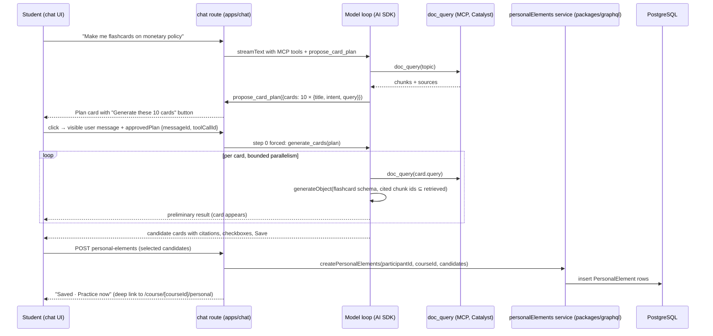

# Student-generated practice elements in the course chatbot — execution plan

Decisions grilled and settled 2026-08-21 (two rounds). Rationale lives in the
ADRs; this document explains the architecture once in plain language, fixes
the v1 scope, and sequences the work for junior engineers.

Governing ADRs: [0006](../docs/adr/0006-public-catalyst-capability-floor.md)
(amended: student-initiated practice candidates row),
[0026](../docs/adr/0026-personal-elements-separate-participant-owned-model.md)
(personal elements are a separate participant-owned model),
[0027](../docs/adr/0027-plan-first-retrieval-backed-card-generation.md)
(plan-first, retrieval-backed generation contract). Vocabulary is fixed in
[CONTEXT.md](../CONTEXT.md): personal element, lecturer element, candidate
element, card plan, origin, verification, element proposal.

## 1. What the student gets (v1)

In Tutor mode of a course chatbot that has course materials attached, a
student can say "make me flashcards on X". The chatbot retrieves material on
X, proposes a card plan ("I propose these 10 cards"), and waits. The student
approves with a button. The chatbot then generates each card from its own
retrieval, shows the cards with citations, and the student saves the ones they
want. Saved cards are personal elements: they belong to the student, carry an
"AI-generated · unverified" badge, and are practiced with spaced repetition
on a "My cards" page per course. The student can ask the chatbot to change a
card (before or after saving) and can delete cards on the "My cards" page.

Not in v1: duplicate check against lecturer material, element proposals to the
lecturer, question types other than flashcards, a lecturer off-toggle, points
or XP, interleaving personal cards into the pooled course practice.

## 2. Architecture walkthrough (read this first)

### 2.1 One request, end to end

Plain-language version:

1. **The chatbot stays the same chatbot.** Generation is two new tools inside
   the existing chat route, next to the MCP tools the bot already has. No new
   service, no new deployment. The tools exist only when the selected mode has
   a `doc_query`-style retrieval tool and the student has credits left.
2. **Plan first.** The first tool, `propose_card_plan`, can only be called
   after the model has retrieved material on the topic. It produces a plan,
   not cards. The plan is a normal tool result, persisted in the assistant
   message like every tool call today, and rendered as a card with a button.
3. **Approval is a normal message.** The button sends a visible user message
   plus one extra request field naming the plan. The route reads the plan from
   the persisted message and forces the second tool, `generate_cards`, as the
   first step of that turn. Changing the plan is just chatting: the model
   issues a new plan, the old plan card shows as superseded.
4. **Every card is grounded by construction.** `generate_cards` runs the
   per-card work itself: one retrieval call per card, one structured model
   call per card whose output schema requires cited chunk ids from that
   retrieval. This is a guarantee in code, not a prompt instruction. Cards
   stream in one by one so the student sees progress.
5. **Saving is a button, never the model.** Saving calls a small API route in
   the chat app that uses the same service function the GraphQL API exposes.
   One implementation of the rules (caps, type validation, ownership), two
   transports.
6. **Practice lives in the PWA.** A "My cards" page per course lists and runs
   personal elements with the same `Flashcard` component and the same
   spaced-repetition function (`updateSpacedRepetition`) as lecturer cards.
   Personal elements never touch `Element`, `ElementInstance`, or
   `PracticeQuiz` tables.

### 2.2 Data model (the one schema change)

`PersonalElement` is a new table; nothing else changes. Fields, in plain terms:

- identity and ownership: `id`, `participantId` (cascade), `courseId`
  (cascade), `version`
- content in the existing element shape so the `Flashcard` component renders
  it unchanged: `type` (v1: `FLASHCARD` only, enforced in the service),
  `name`, `content` (front), `explanation` (back), `options` (reserved for
  question types)
- grounding: `sources` (card-local citations: file or URL, page, chunk ids)
- provenance: `origin` (`AI_GENERATED` | `AUTHORED`), `verification`
  (`UNVERIFIED` | `VERIFIED`)
- chat linkage for the saved-state join: `sourceMessageId`,
  `sourceToolCallId`, `candidateId`
- spaced repetition, per element (the same fields `QuestionResponse` carries
  today): `eFactor` 2.5, `interval` 1, `correctCountStreak` 0, `nextDueAt`,
  `lastCorrectness`, `lastRespondedAt`
- index on `[participantId, courseId, nextDueAt]`

Why per-element scheduling fields instead of `QuestionResponse`: that table
requires an `ElementInstance`, a `Participation`, and a course-owned
activity; personal elements have none of those (ADR 0026).

### 2.3 Who writes what

| Concern | Owner | Path |
| --- | --- | --- |
| Rules: caps, type validation, ownership, SM-2 update | `personalElements` service | `packages/graphql/src/services/personalElements.ts` |
| Student GraphQL surface for the PWA | Pothos schema + ops | `packages/graphql/src/schema/*.ts`, `src/graphql/ops/*PersonalElement*.graphql` |
| Generation tools, plan/approval handling, credit accounting | chat route | `apps/chat/src/app/api/chatbots/[chatbotId]/chat/route.ts` + new `src/lib/server/personalElements/` |
| Save/list API for the chat UI | chat route handlers | `apps/chat/src/app/api/chatbots/[chatbotId]/personal-elements/` |
| Plan card, candidate cards, saved state | chat components | `apps/chat/src/components/personal-elements/` registered as `toolUI` in `message-parts.tsx` |
| "My cards" page: runner, list, delete | PWA | `apps/frontend-pwa/src/pages/course/[courseId]/personal.tsx` |

### 2.4 The generation contract (ADR 0027)

`generate_cards` is the public contract a later Catalyst engine implements
behind the same shape. Input: course id, topic, language, and the approved
plan entries (title, intent, retrieval query). Output: candidate elements
(candidate id, type, name, content, explanation, sources with chunk ids). The
engine does no database work and knows nothing about the UI (ADR 0006). In
v1 the implementation is the in-route pipeline described above.

## 3. Decisions fixed by the grill (2026-08-21)

| Topic | Ruling |
| --- | --- |
| Model | Separate `PersonalElement` table with own SM-2 fields; no changes to lecturer tables (ADR 0026) |
| Scope | Course-bound; cascades with course and participant |
| Grounding | Every card from its own retrieval call with citations; tools not offered without a `doc_query`-style tool; first tool in `toolOrder` when a mode has two |
| Flow | Plan after initial retrieval, approve button, then generation (ADR 0027) |
| Duplicate check | Out of v1 |
| Vocabulary | origin `AI_GENERATED`/`AUTHORED`; verification "unverified / verified by lecturer" |
| Write path | One service module in `packages/graphql`; GraphQL mutations for the PWA; chat route handlers import the service |
| Saved state in chat | Derived by join on `sourceMessageId` + `sourceToolCallId`; the persisted message is never mutated |
| Proposals to lecturer | Later phase with its own ADR amending 0022 |
| Gamification | No points, no XP |
| Availability | Default on for every chatbot; Tutor mode only; lecturer off-toggle later; GrowthBook not used |
| Data boundary | Excluded from research exports and Learning Analytics in v1 |
| Sizes | Plan default 10, cap 20; 500 personal elements per participant per course; generation blocked at zero credits |
| Revision | Unsaved: rerun the per-card pipeline, old card superseded (client-derived along the branch). Saved: `list_personal_elements` + `revise_personal_element`, in place, `version` +1, SM-2 kept, `VERIFIED` → `UNVERIFIED` on content change; cards render from the joined row after save |
| Delete | "My cards" page only, per card with confirm; no bulk; not via chat |
| Entry points | `/course/[courseId]/personal` (bookmarks precedent), home Practice hub link, a row per course on `/repetition`, "Practice now" link on saved cards |
| Run UI | Dedicated flashcard runner reusing `Flashcard.tsx`; adapter decision deferred to the question-types phase |
| Element types | `FLASHCARD` first; SC/MC/KPRIM next; NUMERICAL/FREE_TEXT later; never CONTENT |
| Roles | `PARTICIPANT` only (not `TEMPORARY_PARTICIPANT`) |
| Language | `Course.language`, fallback thread locale |

## 4. Delivery shape

Stacked PRs (repository capability; topology needs approval before work
starts):

1. **PR A — backend**: schema, service, GraphQL. Reviewer audience: data
   model and API.
2. **PR B — PWA** (on A): "My cards" page, hub link, `/repetition` row.
   Reviewer audience: student UI.
3. **PR C — chat** (on A): plan tool, approval transport, generation
   pipeline, candidate cards, save route, revise and list tools. Reviewer
   audience: chat runtime and cost seam.

Each PR updates the affected wiki pages and skills in the same PR
(`docs/domain-model.md`, `docs/chat-platform.md`, `docs/graphql-api-layer.md`,
`.agents/skills/klicker-*`). Branch from `v3`; work in `trees/<branch>`
worktrees; run checks in the devcontainer; commit with conventional types.

Estimates assume one junior per PR, a working devcontainer, and the S0
prototype gate passing: S0 ½ day; PR A 2–3 days; PR B 2–3 days; PR C 5–7 days
(the generation pipeline and the first interactive tool card carry the
uncertainty). If S0 fails against the auto router, add 1 day to PR C for the
pinned-deployment path.

## 5. Slices

Every slice ends with the named acceptance check passing and a local commit.
"Verified" means executed and observed, not "the code looks right".

### S0 — Prototype gate (chat, no product code)

Goal: prove the two unverified mechanics before anyone builds on them.

- In a throwaway script or vitest spec under `apps/chat`, call
  `generateObject` with a flashcard zod schema through the route's `getModel`
  for the `auto` registry entry, and call an MCP tool's `execute` directly
  with a minimal options object (`toolCallId`, `messages: []`, `abortSignal`).
- Acceptance: both calls return valid output against the local LiteLLM +
  local MCP fixture (`apps/chat/scripts/local-mcp-server.mjs`). Record model
  ids, latency, and token usage in this file's Progress section.
- If `generateObject` fails through the router: pin nested calls to a
  concrete deployment from the registry (`gpt-5.6-luna` locally) and record
  the decision here; the product slices then use that pin.

### S1 — Schema and service (PR A)

- Add `PersonalElement` (section 2.2) and the two enums to a new
  `packages/prisma/src/prisma/schema/personalElement.prisma`; relations on
  `Participant` and `Course`. Run the migrate → sync → generate ritual from
  `docs/data-and-migrations.md`.
- `packages/graphql/src/services/personalElements.ts` with:
  `listPersonalElements(participantId, courseId)` ordered by `nextDueAt` nulls
  first (mirror `orderStacks` semantics in `packages/graphql/src/lib/util.ts`),
  `createPersonalElements` (type `FLASHCARD` only, cap 500 per course, trims,
  requires non-empty `content`/`explanation`, stores sources and chat
  linkage), `respondToPersonalElement(id, correctness)` mapping
  `FlashcardCorrectness` to a grade exactly as `stacks.ts:upsertFlashcardResponse`
  does and calling `updateSpacedRepetition`, `updatePersonalElement` (content
  replace, `version` +1, `VERIFIED` → `UNVERIFIED`), `deletePersonalElement`.
  Every function checks ownership by `participantId` and rejects
  `TEMPORARY_PARTICIPANT`.
- Acceptance: vitest specs in `packages/graphql` for cap, ownership, SM-2
  progression (three correct answers push `nextDueAt` forward; a wrong answer
  resets), and the verification downgrade. These run against the live DB in
  CI (`test-graphql` job); locally run them in the devcontainer and reseed
  afterwards.

### S2 — GraphQL surface (PR A)

- Pothos types `PersonalElement`, enums, query `personalElements(courseId)`,
  mutations `createPersonalElements`, `respondToPersonalElement`,
  `updatePersonalElement`, `deletePersonalElement`, all
  `t.withAuth(asParticipant)` (pattern: `bookmarkElementStack` in
  `packages/graphql/src/schema/mutation.ts`).
- Ops files `QPersonalElements.graphql`, `MCreatePersonalElements.graphql`,
  `MRespondToPersonalElement.graphql`, `MUpdatePersonalElement.graphql`,
  `MDeletePersonalElement.graphql`; run codegen.
- Extend `getPracticeQuizList` (`packages/graphql/src/services/participants.ts`)
  so a course with personal elements but no published practice quiz still
  appears, carrying a `personalElementCount` and `personalDueCount`.
- Acceptance: `pnpm --filter @klicker-uzh/graphql check` and `test` green;
  the public schema diff in `packages/graphql/src/public/schema.graphql`
  shows only the new types.

### S3 — "My cards" page (PR B)

- `apps/frontend-pwa/src/pages/course/[courseId]/personal.tsx` modeled on
  `bookmarks.tsx`: header with course name and due count, a runner over due
  cards using `packages/shared-components/src/Flashcard.tsx` and
  `respondToPersonalElement`, then a list of all personal elements with the
  badge ("AI-generated · unverified" / "· verified by lecturer"), sources, and
  a per-card delete with confirm dialog.
- Home Practice hub (`apps/frontend-pwa/src/pages/index.tsx`, Practice
  section) and `/repetition` rows link to the page; `/repetition` shows the
  personal due count per course.
- i18n keys in `packages/i18n/messages/en.ts` and `de.ts` (informal `du` in
  German, consistent with the PWA).
- Acceptance: agent-browser run against the worktree's devcontainer stack,
  logged in as a seeded student, with screenshots of: empty state, runner
  with one card flipped and rated, list with badge, delete confirm, German
  and English, mobile width. Seed at least three personal elements via the
  GraphQL mutation for the check. One Playwright spec covering rate → due
  count changes is optional if the agent-browser evidence is complete.

### S4 — Plan tool and approval transport (PR C)

- `apps/chat/src/lib/server/personalElements/tools.ts`: `propose_card_plan`
  (zod input: topic, cards[≤20]{title, intent, query}; output: plan id +
  entries). Register it alongside `mcpTools` **before**
  `buildPromptCacheRequest` in `route.ts` so `toolOrder` and the cache key
  include it. Offer it only when: selected mode is `tutor`, a `doc_query`-style
  tool is present (`isDocQueryToolName` over the tool names, same gate as the
  citation contract), and `credits.current > 0`.
- `prepareStep`: keep `propose_card_plan` out of `activeTools` until at least
  one `doc_query` call has completed in this turn.
- Approval transport: new top-level body field `approvedPlan: { messageId,
  toolCallId }` in the route's zod schema and in `useChatResponse.ts` (same
  placement as `images`). When present, load the plan from the persisted
  assistant message's tool-call part, verify it belongs to this thread and
  participant, and force `generate_cards` via `prepareStep` on step 0 only.
- Plan card: `apps/chat/src/components/personal-elements/PlanCard.tsx`
  registered as `toolUI` in `message-parts.tsx` (first registration in the
  app; `ToolFallback` remains for everything else). Button appends the
  visible user message and the body field. A plan that is not the latest
  plan on the current branch renders as superseded (client derivation over
  `thread.messages`).
- System prompt: a short scaffolding paragraph telling the model to retrieve
  first, propose a plan, and never generate cards without approval; appended
  only when the tools are registered (same pattern as `withCitationContract`).
- Acceptance: route vitest with synthetic streams (pattern:
  `apps/chat/test/required-mcp-route.test.ts`) proving the tool is absent
  without `doc_query`, absent at zero credits, inactive before the first
  retrieval, and forced on step 0 when `approvedPlan` is sent; a
  `persisted-assistant-content` test proving the plan args survive reload.

### S5 — Generation pipeline and candidate cards (PR C)

- `generate_cards` tool: for each plan entry, with bounded parallelism
  (start with 3), call the first `doc_query` tool in `toolOrder` directly
  with the entry's query, then `generateObject` with the flashcard schema
  (`name`, `content`, `explanation`, `citedChunkIds` restricted to the
  retrieved chunk ids; language from `Course.language`, fallback thread
  locale). Return an `AsyncIterable` so each finished card streams as a
  preliminary result; the final result carries all candidates plus
  card-local sources in the `doc_query` result shape so
  `normalizeSourcesFromParts` can render citations for the card.
- Credit accounting: accumulate nested `generateObject` usage and add it at
  the three sites where `imageDescriptionCost` is added today (`onEnd`,
  `onAbort`, `messageMetadata`).
- Candidate cards: `CandidateCards.tsx` registered as `toolUI`: front/back
  stacked, citation chips from the card-local sources, checkbox per card,
  "Save selected" / "Save all", saved badge and "Practice now" link after
  save. Saved state comes from `GET /api/chatbots/[chatbotId]/personal-elements?messageId=…`
  (join on `sourceMessageId` + `sourceToolCallId`), never from the frozen
  tool result.
- Save route: `POST /api/chatbots/[chatbotId]/personal-elements` guarded by
  `withChatbotAuth`, calling `createPersonalElements` from the shared
  service; idempotent per `candidateId`.
- Acceptance: route vitest with injected SSE proving every persisted
  candidate cites at least one retrieved chunk id and that nested usage
  reaches `creditsUsed`; agent-browser run in the devcontainer with the local
  MCP fixture and LiteLLM: ask for cards, approve, watch cards stream in,
  save two, reload the thread and see saved state and citations persist;
  screenshots in both locales and at mobile width.

### S6 — Revision and listing tools (PR C)

- `list_personal_elements` (course-scoped, own elements, compact) and
  `revise_cards` / `revise_personal_element(id, instruction)` reusing the
  per-card pipeline from S5. For unsaved candidates the revised card is a new
  candidate in the new message and the old card renders as superseded; for
  saved elements the route calls `updatePersonalElement`.
- Acceptance: vitest for the two tools' validation paths; agent-browser:
  "make card 2 shorter" before saving and after saving, then confirm the
  "My cards" page shows `version` 2 content and the card in chat shows the
  revised text after reload.

### S7 — Docs and skills (each PR)

- `docs/domain-model.md`: personal element section linking ADR 0026.
- `docs/chat-platform.md`: local tools, plan-first flow, approval transport,
  credit accounting sites, tool UI registration, linking ADR 0027.
- `docs/graphql-api-layer.md`: the new participant-scoped surface.
- `.agents/skills/klicker-frontend-ui` and `klicker-graphql-api`: one
  paragraph each on the new surfaces. Log entry in `docs/log/`.

## 6. Review and verification gates

- This plan: one read-only planner review before approval (done, see
  Progress).
- Per committed slice: simplifier pass. Slice review for S1 (data integrity)
  and S5 (cost seam, auth on the save route, tool-result trust boundary),
  started in parallel with the simplifier.
- Final review after PR C integrates, before the PR descriptions are written
  with `$rs-mr-description-writer`.
- Browser verification is mandatory for S3, S5, S6 (CLAUDE.md: agent-browser
  against the worktree's own devcontainer stack).

## 7. Risks and open items

| Risk | Handling |
| --- | --- |
| Structured output through the LiteLLM auto router is unverified | S0 gate; pin a concrete deployment if it fails |
| Silent tool step killed by a proxy idle timeout | Preliminary results streamed per card; bounded parallelism |
| Nested model usage unbilled | Three accounting sites are named in S5 and checked by test |
| First interactive tool card in the app | Keep `ToolFallback` as default; register only the two new tool names |
| Stale plan after a branch switch | Superseded state is client-derived along the branch path |
| Students expect the cards in the pooled practice queue | "My cards" entry points in S3; interleaving is a later explicit step |

Open for your ruling: the stacked-PR topology in section 4, and whether an
operational env kill switch (`CHAT_STUDENT_GENERATION_ENABLED`, default on)
should ship in PR C — it does not change the default-on behavior but gives
ops a stop without a deploy of code.

## Progress

- 2026-08-21: grill rounds 1 and 2 settled; CONTEXT.md terms recorded; ADRs
  0026 and 0027 written, ADR 0006 row amended; first draft of this plan
  written. **Status: first draft, not yet approved.** The required read-only
  planner review of this draft was interrupted by a session limit and must be
  rerun before the plan is presented for approval; the stacked-PR topology
  (section 4) and the env kill switch question (section 7) are still open
  for the product lead.
