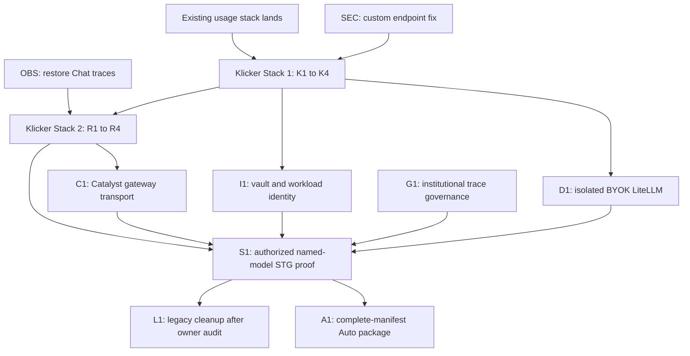

# AI Provider Credential Management Implementation Plan

## Research

### Questions and evidence

| Question                                             | Assignment                                                                           | Evidence                                                                                                                                                                                                        | Applicability                                                                                                             |
| ---------------------------------------------------- | ------------------------------------------------------------------------------------ | --------------------------------------------------------------------------------------------------------------------------------------------------------------------------------------------------------------- | ------------------------------------------------------------------------------------------------------------------------- |
| Can provider keys stay out of PostgreSQL?            | Main session with Azure official documentation; Sol planner cross-check              | Azure Key Vault stores API keys, encrypts vaults at rest, supports private endpoints and Azure RBAC, and AKS workload identity uses OIDC federation                                                             | Directly applicable to the AKS and Pulumi environment; exact role and network declarations still need local preview proof |
| Is another customer-managed encryption key required? | Main session; Sol planner cross-check                                                | Key Vault already encrypts vault contents with HSM-held service keys; the existing df-cloud helper already applies the hardened vault controls                                                                  | Do not add application envelope encryption or another CMK unless an institutional control explicitly requires it          |
| Can BYOK retain LiteLLM routing and Langfuse traces? | Main session with current LiteLLM and Langfuse documentation                         | LiteLLM supports request-scoped provider credentials, but the shared deployment deliberately forbids that mode; Langfuse supports masking, retention, and asynchronous deletion                                 | Use an isolated BYOK LiteLLM and prove the exact dynamic-key path with synthetic contract tests before relying on it      |
| Where should authorization and custody live?         | Local code inventory plus Catalyst, deployment, and df-cloud inspection; Sol planner | Klicker owns identity and product state; Catalyst is stateless; the existing shared LiteLLM and Key Vault helpers already define security boundaries                                                            | Keep product state in Klicker, put secret custody behind one standalone gateway app, and keep Catalyst stateless          |
| What current behavior makes migration unsafe?        | Local code inventory and native explore pass                                         | A custom base URL can receive the shared platform key, `safeDecrypt` accepts plaintext-looking values, active participation is not checked by the current guard, and chat spans do not currently reach Langfuse | Ship independent security and observability prerequisites; never migrate legacy values automatically                      |

### Primary external references

- [Azure Key Vault overview](https://learn.microsoft.com/en-us/azure/key-vault/general/overview)
- [Secure Azure Key Vault](https://learn.microsoft.com/en-us/azure/key-vault/general/secure-key-vault)
- [AKS Workload ID](https://learn.microsoft.com/en-us/azure/aks/workload-identity-overview)
- [LiteLLM client-side credentials](https://docs.litellm.ai/docs/proxy/clientside_auth)
- [Langfuse data masking](https://langfuse.com/docs/observability/features/masking)
- [Langfuse data retention](https://langfuse.com/docs/data-platform/features/data-retention)

### Limitations

- No live cluster, vault, secret value, provider account, or production data was
  inspected.
- No paid provider request, infrastructure apply, Argo reconciliation, or
  Langfuse deletion was performed.
- The exact LiteLLM transient-key behavior remains an implementation gate. A
  synthetic provider must prove named routing, complete Auto routing, redaction,
  callbacks, estimated cost, and non-persistence.
- The repository-required `writing-for-agents` skill was unavailable. This plan
  uses the current ADR, context, planning, and review contracts as the compatible
  fallback.

## Goal

Deliver a disabled-by-default, locally verified BYOK capability in which a
lecturer registers one approved provider credential, binds it to one chatbot,
delegates use to active participants, and routes named-model requests through
one internal gateway and an isolated LiteLLM without storing the provider secret
in PostgreSQL. The design also defines the later all-target Auto layer, full
Langfuse observability, hard quota reservations, provider notices, rotation,
revocation, and verified deletion.

## Non-goals

- Arbitrary provider endpoints, multiple first-cohort providers, partial Auto,
  direct-provider routing, or fallback to UZH-funded usage.
- A generic binding abstraction for tutoring, grading, graphs, embeddings, or
  future AI resources in the first implementation.
- Per-user or per-credential vaults, application-side envelope encryption, an
  additional CMK layer, or a separate gateway repository.
- Automatic legacy-key migration, invoice reconciliation, provider billing
  truth, a model marketplace, a generalized research-export product, or model
  training.
- Pushes, PR creation, merges, infrastructure apply, cluster changes, real
  credential registration, STG or PRD enablement, production data deletion, or
  legacy column removal without the separate gates below.

## Execution contract

- **Execution owner:** the current session or a user-authorized peer main
  session acting as execution orchestrator.
- **Boundary owner:** self.
- **One-time approval:** approval of this plan accepts the settled product and
  security decisions, the two Klicker stacks, and the named companion
  workstreams. It authorizes fresh worktrees, reversible local edits,
  repository-native checks, required specialist reviews, and local commits in
  the named repositories.
- **Authority granted after approval:** commit the reviewed ADR, architecture,
  threat-model, and plan artifacts separately; implement SEC, OBS, Stack 1,
  Stack 2, D1, I1, and C1 locally; update `Progress`; use synthetic fixtures and
  fake providers only.
- **Authority withheld:** branch push, draft or ready PR, stack publication or
  landing, merge, Pulumi apply, Argo sync, cluster access, provider-account use,
  real secret write, Langfuse deletion, STG execution, PRD promotion, live
  smoke, and destructive legacy cleanup.
- **Terminal:** all authorized local package branches are committed and pass
  their applicable checks and reviews; the feature remains default-off and all
  external delivery is recorded as `delivery_pending`.
- **Pause:** stop for an unresolved first Provider Profile, a changed data or
  funding boundary, inability to enforce hard reservations, failure to prove
  LiteLLM non-persistence or trace redaction, unapproved real-provider use, a
  legacy audit that finds owners who have not re-registered, or any requested
  external action outside the granted authority.

## Plan identity

- **Plan:** `project/2026-08-23-ai-provider-credential-management-plan.md`
- **Current branch:** `rs/ai-provider-credentials-design`
- **Current worktree:** `trees/rs/ai-provider-credentials-design`
- **Target:** `v3`, after the active chatbot-usage stack lands.
- **PR:** none.
- **Base status:** the worktree was created from `8503c1424`; current
  `origin/v3` is `35142c81a` and differs only by an STG values promotion. Rebase
  immediately before the first commit.
- **Related handoff:**
  `/Users/rschlae/.handoffs/klicker-uzh/2026-08-10-ai-credential-management-security-design-handoff.md`.
- **Current dependency:** PRs #5460, #5475, #5480, and #5490 form the active
  chatbot-usage stack. Reverify their topology and checks before implementation;
  #5460 currently has a failed GitGuardian check.

## Grill findings and resolved decisions

| Decision frontier          | Settled contract                                                                                                                                                                                                                                                                         |
| -------------------------- | ---------------------------------------------------------------------------------------------------------------------------------------------------------------------------------------------------------------------------------------------------------------------------------------- |
| Routing                    | BYOK normally goes through isolated LiteLLM. Direct provider access is a later approved exception, never an implicit fallback.                                                                                                                                                           |
| Custody                    | One internal gateway app reads a dedicated gateway application vault per institutional tenant and environment through workload identity. PostgreSQL stores safe metadata and an opaque handle only.                                                                                      |
| Scope                      | First cohort: UZH, one Provider Profile, one named model, one chatbot-specific binding. Auto follows only after every revisioned target is proven with the same credential.                                                                                                              |
| Delegation                 | The credential owner explicitly delegates a chatbot binding. Only active enrolled participants may use it, and participants never receive the key.                                                                                                                                       |
| Funding                    | BYOK has hard participant and lecturer reservations, separate from UZH credits. Reliable usage settles estimated actual cost; otherwise the full reservation remains charged.                                                                                                            |
| Disclosure                 | A profile-owned factual Provider Notice is acknowledged before first use and again after a material profile or data-boundary revision. It is not consent or legal basis.                                                                                                                 |
| Tracing                    | Langfuse is the comprehensive observability trace store for 180 days, including prompts, responses, tools, retrieval, tokens, and estimated cost. Secrets and unnecessary direct identifiers are removed before export.                                                                  |
| Secondary use and deletion | Named operators may use traces for support and quality improvement. Approved UZH research receives a governed export; external tenants are quality-only by default; no training. Product deletion tombstones secondary use immediately and verifies Langfuse deletion within seven days. |
| Credential lifecycle       | Rotation validates a new vault version before switch. Revocation and deletion block new use synchronously. Key Vault soft-deleted secrets remain recoverable for the existing 90-day period.                                                                                             |
| Legacy state               | Run a values-suppressed inventory, disable legacy routing, require owner re-registration, and remove old columns only when no unresolved owner remains.                                                                                                                                  |

## Primitive impact

| Primitive                   | Disposition        | Contract delta                                                                                                                    | Compositions and consumers                                                            | Evidence or open ruling                                                                  |
| --------------------------- | ------------------ | --------------------------------------------------------------------------------------------------------------------------------- | ------------------------------------------------------------------------------------- | ---------------------------------------------------------------------------------------- |
| Provider Profile            | Create             | Versioned platform policy fixes provider origin, named model, later Auto manifest, pricing source, notice facts, and active state | Credential registration, runtime routing, notices, cost display, operator kill switch | First exact provider profile still needs product, security, and data-protection approval |
| Provider Credential         | Create             | Owner-managed safe metadata points to a vault version; secret never enters ordinary product state                                 | Manage lifecycle, gateway custody, chatbot binding                                    | ADR 0037 and threat model                                                                |
| Chatbot Credential Binding  | Create             | Explicit resource authority, active-participant delegation, model policy, quota policy, notice version                            | Lecturer configuration, participant Chat, copy and ownership lifecycle                | Chatbot-specific for MVP; generic resource binding is deferred                           |
| Account usage               | Compose and extend | Reuse account dimensions and display patterns, but add a distinct BYOK funding source with hard reservation semantics             | Participant and lecturer caps, estimated provider cost                                | Active usage stack must land first                                                       |
| Chatbot disclaimer          | Compose            | Keep lecturer-authored disclaimer; add separate profile-owned Provider Notice Acceptance                                          | Chat first-use gate and provider-change re-acknowledgement                            | Acknowledgement is not legal basis                                                       |
| AI observability trace      | Extend             | Join Chat, gateway, LiteLLM, retrieval, tools, usage, cost, and terminal outcome under stable deletion selectors                  | Support, quality improvement, governed UZH exports, deletion worker                   | Existing Chat exporter is broken and must be repaired first                              |
| Catalyst provider transport | Extend             | Replace raw provider bearer and provider origin with fixed gateway origin plus one-use opaque capability                          | Tutoring engine and future Catalyst-backed computation                                | Catalyst remains stateless                                                               |

## ADR gate

- **Result:** passed. Secret custody, authorization, provider routing, data
  retention, research boundaries, and multi-repository ownership are durable
  architectural decisions.
- **Records:** ADR 0037 covers vault custody and the gateway; ADR 0038 covers
  isolated LiteLLM and credential-closed Auto; ADR 0039 covers chatbot binding,
  delegation, notices, and quota; ADR 0040 covers the observability trace store,
  retention, access, and governed exports.
- **Reopen triggers:** an institutional CMK mandate, per-credential vaults,
  direct-provider default, multiple first-cohort providers, a generic resource
  binding, changed trace purposes or retention, external-tenant research, model
  training, or a gateway that owns product state.
- `origin/v3` has no ADR index to update; the architecture page links every new
  record directly.

## Skill routing

- `rs-takeover`: reconcile the handoff and preserve existing worktree ownership.
- `rs-product-primitives`: freeze new product primitives and compositions.
- `domain-modeling`: own ADR and glossary contracts.
- `rs-data-protection-by-design`: own trace purpose, minimization, access,
  retention, research, and deletion gates.
- `security-threat-model`: bound the credential lifecycle threat model; no broad
  repository security scan is authorized.
- `rs-sliced-development-workflow`, `rs-stacked-change`, and `gh-stack`: own
  package boundaries, reviews, commits, and Klicker stack topology.
- During implementation, use the relevant Klicker data-model, GraphQL,
  frontend, testing, Playwright, wiki, local-runtime, workload-identity,
  Langfuse, and deployment skills named by each repository.

## Planning-stage specialist

- **Route:** native `planner`, Sol, read-only.
- **Terminal:** `DONE_WITH_CONCERNS`.
- **Report:**
  `project/_local/reviews/2026-08-23-ai-provider-credentials-planner.md`.
- **Accepted:** hard reservations, active-participation checks, dedicated
  non-GraphQL secret ingress, no Prisma access in the gateway, 90-day vault
  recovery, one provider and named model first, owner-driven legacy replacement,
  explicit trace-governance gate, two Klicker stacks, and independent SEC/OBS
  prerequisites.
- **Modified:** instead of a signed field-bearing capability, use a random
  opaque bearer with its full scope stored server-side and atomically consumed
  once. This preserves replay, revocation, and state checks without a new signing
  key or duplicated claims.

## Architecture invariants

| Boundary            | Invariant                                                                                                                                                                                                                                      |
| ------------------- | ---------------------------------------------------------------------------------------------------------------------------------------------------------------------------------------------------------------------------------------------- |
| Secret ingress      | A dedicated authenticated backend endpoint accepts the key once with request-body logging and tracing disabled. No GraphQL variable, response, browser cache, analytics event, or trace contains it.                                           |
| Product database    | PostgreSQL stores owner, profile, safe fingerprint, lifecycle, opaque vault name/version, chatbot binding, reservations, notice acceptance, trace index, and deletion jobs. It stores no raw or encrypted provider key and no custom endpoint. |
| Gateway             | One separately deployed app has no Prisma access. It accepts no caller endpoint, vault handle, fallback list, or router config.                                                                                                                |
| Capability          | A random opaque bearer maps to server-side actor, active chatbot binding, reservation, request, trace, profile revision, model policy, expiry, and unique id. Gateway consumption is atomic and one-use before vault read.                     |
| Vault               | One dedicated gateway application vault per institutional tenant and environment uses private endpoint, public access disabled, RBAC, workload identity, diagnostics, purge protection, and 90-day soft delete.                                |
| LiteLLM             | The shared deployment remains closed to client credentials. Isolated BYOK LiteLLM is gateway-only, static-profiled, non-persisting, and receives only the transient key parameter.                                                             |
| Funding and routing | Every request hard-reserves BYOK quota. Named routing and later complete Auto never cross provider, credential, or UZH funding boundaries. Dependency failure is closed.                                                                       |
| Trace and deletion  | Langfuse receives the joined full-content observability trace after secret redaction, retains it 180 days, and supports verified product-triggered deletion within seven days.                                                                 |

## Delivery topology

Do not extend the current four-PR chatbot-usage stack. Land it first, then use
two sequential four-layer Klicker stacks. SEC and OBS are independent
prerequisites. Cross-repository packages use their own worktrees and plans. Auto
and legacy cleanup remain later packages.

### Package boundaries

- **SEC:** standalone security fix from current `v3`.
- **OBS:** standalone trace-export repair from current `v3`.
- **Klicker Stack 1:** K1 domain and docs -> K2 lifecycle control plane -> K3
  gateway and disabled deployment -> K4 lecturer controls.
- **Klicker Stack 2:** after Stack 1 lands, R1 reservations and capabilities ->
  R2 named runtime -> R3 trace and deletion lifecycle -> R4 participant
  experience and complete E2E proof.
- **Companion packages:** D1 in `ai/deployment`, I1 in `df-cloud`, and C1 in
  Catalyst. Each has an independent branch, local plan, checks, and review.
- **Later packages:** G1 is a human governance gate; S1 is authorized STG proof;
  A1 adds Auto after named proof; L1 removes legacy paths only after the
  values-suppressed owner audit.

## Delegation Map

| Workstream and slices | Owner                                                                      | Dependency or handoff                                           | Acceptance boundary                                                                                         |
| --------------------- | -------------------------------------------------------------------------- | --------------------------------------------------------------- | ----------------------------------------------------------------------------------------------------------- |
| SEC                   | separate task proposed; execution orchestrator in fresh Klicker worktree   | Current `v3`                                                    | No custom URL can receive `OPENAI_API_KEY`; focused regression passes                                       |
| OBS                   | separate task proposed; main                                               | Current `v3`                                                    | Synthetic Chat trace reaches Langfuse-compatible collector with stable selectors                            |
| K1-K3                 | main                                                                       | Usage stack landed; SEC; D1/I1 contracts before K3 finalization | Inert domain and lifecycle exist; gateway is DB-free and disabled by default                                |
| K4                    | native executor, UI-only write scope                                       | K2-K3 API contract                                              | Lecturer lifecycle UI works in both locales and never returns the secret                                    |
| D1                    | separate task proposed; execution orchestrator in `ai/deployment` worktree | K3 request contract                                             | Named and complete Auto synthetic requests prove redaction, callbacks, cost, and non-persistence            |
| I1                    | separate task proposed; execution orchestrator in `df-cloud` worktree      | K3 service-account contract                                     | Pulumi tests and preview prove dedicated vault, identity, private endpoint, RBAC, diagnostics, and no apply |
| R1-R3                 | main                                                                       | Stack 1 landed; OBS; D1 named path                              | Hard quotas, one-use capabilities, named routing, joined traces, and deletion jobs pass risk tests          |
| R4                    | native executor, participant UI and E2E write scope                        | R1-R3                                                           | Active participant path, notice, quota, revocation, locale, and accessibility journeys pass                 |
| C1                    | separate task proposed; execution orchestrator in Catalyst worktree        | Frozen R1 capability contract                                   | Fixed gateway origin and opaque bearer work; raw provider origin and key fail                               |
| G1                    | assigned institutional data-protection and service owners                  | ADR 0040                                                        | Written legal basis, purposes, processor terms, access owner, retention, export, and deletion approval      |
| S1                    | authorized operations session                                              | K1-R4, D1, I1, C1, G1                                           | Synthetic STG named-model lifecycle and outage proof; stop before PRD                                       |
| A1                    | main, later package                                                        | Successful named-model S1 and complete D1 Auto proof            | Every revisioned target uses the same credential/profile or Auto stays unavailable                          |
| L1                    | main, later cleanup                                                        | S1 plus zero unresolved legacy owners                           | Legacy reads, columns, and routing are removed with migration and final review                              |

## Feature-wide test portfolio

| Consequential contract                                                 | Existing evidence                                               | Test obligation                                                  | Primary stable seam                                         | Distinct failure                                                                      | Owner           |
| ---------------------------------------------------------------------- | --------------------------------------------------------------- | ---------------------------------------------------------------- | ----------------------------------------------------------- | ------------------------------------------------------------------------------------- | --------------- |
| Platform key never reaches a custom endpoint                           | Current `getModel` branch exposes the hazard                    | Add new regression                                               | Chat model selection                                        | Non-profile origin receives platform key                                              | SEC             |
| Secret ingress and custody never persist in product state or telemetry | No self-service write path exists                               | Add new fake-secret integration and storage/log scan             | Dedicated backend endpoint -> gateway -> fake vault         | Secret appears in DB, response, log, trace, cache, or spend record                    | K2-K3, D1       |
| Owner and tenant authorization is closed                               | Existing chatbot ownership guards                               | Extend existing authorization tests                              | Lifecycle endpoints and binding service                     | Non-owner manages or uses a credential                                                | K2              |
| Only active participants can use delegated BYOK                        | Existing guard checks row existence only                        | Add new authorization tests                                      | Capability issue and atomic consume transaction             | Inactive participation obtains or consumes a capability                               | R1              |
| Concurrent quota cannot overshoot either cap                           | Existing funded credits permit bounded overshoot                | Add new transaction and concurrency tests                        | BYOK reservation and settlement service                     | Parallel requests exceed participant or lecturer cap                                  | R1              |
| Capability is one-use, current, and exact-scope                        | No current gateway capability                                   | Add new replay, expiry, revision, and scope tests                | Product consume endpoint and gateway client                 | Replay, stale profile, wrong chatbot, or missing reservation succeeds                 | R1-K3           |
| Named BYOK never crosses funding or provider boundaries                | Existing platform routing has fallbacks                         | Add new route and outage tests                                   | Chat -> gateway -> isolated LiteLLM                         | UZH key, different provider, custom URL, or direct fallback is selected               | R2, D1          |
| Auto is complete or absent                                             | Existing Auto has classifier, embedding, and generation targets | Add new manifest contract tests                                  | Versioned Provider Profile and isolated LiteLLM config      | Any target uses another credential/provider or partial Auto ships                     | D1, A1          |
| Rotation, revoke, and delete fail closed                               | No reusable lifecycle exists                                    | Add new lifecycle and race tests                                 | Credential state plus vault version switch                  | Failed validation replaces active version or revoked key starts a request             | K2-K3           |
| Joined trace is complete and secret-free                               | Current docs report absent Chat traces                          | Replace broken proof with synthetic joined trace and canary scan | W3C trace across Chat, gateway, LiteLLM, tools, retrieval   | Missing child spans/selectors or secret-bearing attributes                            | OBS, R3, D1, C1 |
| Product deletion is verified in Langfuse                               | No durable deletion index/job exists                            | Add new idempotent worker and residual-query tests               | Trace index, outbox, Hatchet worker, Langfuse adapter       | Tombstoned content remains selectable after seven days                                | R3              |
| Vault and workload identity are least-privileged                       | Existing hardened helper lacks this app wiring                  | Extend Pulumi tests and preview evidence                         | df-cloud vault, private endpoint, identity, role assignment | Public access, wrong service account, missing diagnostics, or broad subscription role | I1              |
| Lecturer and participant UX communicates provider, quota, and cost     | Existing disclaimer and credit UI cover other funding           | Extend UI tests and add Playwright journeys                      | Manage credential controls and Chat first-use gate          | Secret is redisplayed, notice is stale, cost looks like invoice, or quota falls back  | K4, R4          |
| Catalyst remains stateless                                             | Existing exact-origin provider seam                             | Extend contract and denial tests                                 | `resolveProvider` gateway transport                         | Raw provider key/origin accepted or Catalyst stores state                             | C1              |

## Slices

### SEC — close platform-key forwarding before BYOK

- **Problem:** a custom base URL can be combined with the shared platform key.
- **Evidence:** current Chat model selection passes the global key when no custom
  key exists.
- **Decision:** a platform credential may only use its fixed platform origin;
  custom URL state fails closed and is removed from the future contract.
- **Risk:** immediate credential exfiltration if self-service makes the URL
  attacker-controlled.
- **Do:** implement the narrow branch correction and focused regression without
  starting BYOK schema work.
- **Route:** separate task proposed; main because the fix is security-sensitive.
- **Check / Acceptance:** filtered Chat tests prove no platform key can be sent
  to a non-profile origin; exact diff and secret scan are clean.
- **Commit:** `fix(chat): prevent platform key forwarding to custom endpoints`.

### OBS — restore the current Chat trace path

- **Problem:** Chat uses an OpenTelemetry major version that does not reach
  Langfuse.
- **Decision:** repair the existing exporter and prove one synthetic trace with
  stable product selectors before BYOK tracing builds on it.
- **Risk:** successful model calls without support, cost, or deletion evidence.
- **Do:** align the supported telemetry path, add a synthetic collector proof,
  and document the verified version contract.
- **Route:** separate task proposed; main due the privacy and cross-service seam.
- **Check / Acceptance:** Chat tests and a synthetic trace show product span,
  terminal outcome, and deletion selectors with no credential-shaped canary.
- **Commit:** `fix(chat): restore Langfuse trace export`.

### K1 — establish an inert chatbot BYOK domain

- **Problem:** current chatbot fields mix secrets, endpoints, and product state.
- **Decision:** add chatbot-specific Provider Profile, Provider Credential,
  Binding, Notice Acceptance, hard-usage, trace-index, and deletion-outbox
  contracts without exposing registration or runtime use.
- **Risk:** premature generic abstractions or a new secret column.
- **Do:** land reviewed ADRs, architecture, threat model, glossary, plan, additive
  Prisma migration, safe profile manifest, and domain tests. Preserve the active
  account-usage model and compose with it explicitly.
- **Route:** main; architecture, data, and migration are critical-path coupled.
- **Check / Acceptance:** Prisma and GraphQL checks pass; schema contains only
  safe metadata; no generic resource binding or secret field exists.
- **Commit:** docs and plan first as separate commits, then
  `feat(chatbot): add provider credential domain`.

### K2 — add secure registration and lifecycle control

- **Problem:** credentials need a one-time ingress and owner-controlled lifecycle
  without entering GraphQL logging.
- **Decision:** use a dedicated authenticated backend endpoint for the secret;
  keep non-secret lifecycle status in ordinary authorized APIs.
- **Risk:** request-body logging, reflected keys, IDOR, failed rotation replacing
  the active version, or lifecycle/outbox drift.
- **Do:** implement registration, attestation, validation, binding, rotation,
  suspend, revoke, delete, profile revision, provider notice state, and durable
  outbox using a fake gateway adapter.
- **Route:** main; secret handling and authorization remain with the orchestrator.
- **Check / Acceptance:** owner/cross-tenant denial, no-response-secret,
  validate-before-switch, synchronous disable, and idempotent outbox tests pass.
- **Commit:** `feat(chatbot): add provider credential lifecycle`.

### D1 — prove isolated BYOK LiteLLM

- **Problem:** the shared proxy intentionally forbids request credentials and
  persists prompt/spend data under a different trust model.
- **Decision:** add a separate gateway-only, static-profiled, non-persisting
  LiteLLM deployment; keep the shared validator unchanged.
- **Risk:** dynamic endpoint, callback, fallback, persistence, or secret leakage.
- **Do:** create the repo-local plan and worktree, config validator, mock OpenAI
  provider, named and complete Auto contract tests, cost/callback proof, network
  restriction, and canary scan.
- **Route:** separate task proposed; execution orchestrator due cross-system and
  security-sensitive configuration.
- **Check / Acceptance:** deployment-native tests prove only the transient key
  parameter varies; logs, cache, spend store, metrics, and Langfuse contain no
  canary; shared client-credential safety remains green.
- **Commit:** `feat(litellm): add isolated byok routing`.

### I1 — declare the dedicated gateway vault and identity

- **Problem:** only the gateway may read provider credentials, with an
  institutional and environment blast-radius boundary.
- **Decision:** one dedicated gateway application vault per institutional tenant
  and environment, using the existing 90-day hardened recovery default.
- **Risk:** shared vault reuse, public access, broad RBAC, wrong service-account
  federation, missing diagnostics, or an apply beyond authority.
- **Do:** create the repo-local plan and worktree; extend Pulumi declarations and
  tests for private endpoint/DNS, RBAC, workload identity, diagnostics, purge
  protection, and exact gateway service account. Stop at preview.
- **Route:** separate task proposed; execution orchestrator due infrastructure
  ownership and apply boundary.
- **Check / Acceptance:** Pulumi tests and values-free preview prove exact
  resources and assignments; no live apply occurs.
- **Commit:** `feat(klicker): add byok credential vault`.

### K3 — add the DB-free gateway and disabled deployment

- **Problem:** product runtimes and Catalyst must never receive or decrypt the
  provider key.
- **Decision:** one standalone internal gateway owns vault lifecycle enforcement
  and forwarding, has no Prisma access, and accepts only product-issued opaque
  capabilities and static profile aliases.
- **Risk:** confused deputy, caller-selected handle, broad vault enumeration,
  secret-bearing logs, or accidental public ingress.
- **Do:** implement the gateway with fake vault/provider adapters, strict control
  and runtime contracts, redaction, W3C propagation, workload identity seam,
  Helm deployment/service/network policy, and default-off feature wiring.
- **Route:** main; security and cross-repository contracts are tightly coupled.
- **Check / Acceptance:** fake integrations prove no DB dependency, endpoint or
  handle input, replay acceptance, or key reflection; chart checks show internal
  disabled deployment and exact service account.
- **Commit:** `feat(chat): add AI credential gateway`.

### K4 — expose lecturer credential controls

- **Problem:** owners need a privacy-minimal way to register, bind, rotate,
  revoke, and inspect safe status and estimated use.
- **Decision:** expose one approved profile and named model, explicit delegation,
  attestation, provider notice preview, hard caps, and safe lifecycle state.
- **Risk:** secret redisplay, misleading invoice language, or ambient co-owner
  management.
- **Do:** implement Manage UI, both locales, keyboard and screen-reader states,
  non-secret GraphQL operations, and the dedicated secret submission client.
- **Route:** native executor with UI-only ownership after K2-K3 contracts freeze.
- **Check / Acceptance:** browser verification and screenshots show registration,
  binding, rotation, revoke, error, and reload states; no response or storage
  contains the secret.
- **Commit:** `feat(manage): add provider credential controls`.

### R1 — enforce hard reservations and one-use capabilities

- **Problem:** BYOK spend cannot inherit bounded overshoot or stale enrollment.
- **Decision:** atomically reserve participant and lecturer caps, then mint a
  random opaque bearer whose complete scope is stored server-side and consumed
  once by the authenticated gateway.
- **Risk:** concurrent overspend, replay, stale profile, inactive participant,
  cross-chatbot use, or settlement duplication.
- **Do:** implement reserve, issue, consume, expire, cancel, and settle
  transactions; store actor, active binding, reservation, request, trace, profile
  revision, model policy, expiry, and token id; store only a bearer hash.
- **Route:** main; financial, authorization, and replay invariants are coupled.
- **Check / Acceptance:** concurrency and property-focused tests prove both caps,
  active participation, exact scope, one-use consume, idempotent settlement, and
  full reservation retention when usage is unreliable.
- **Commit:** `feat(chat): add byok reservations and capabilities`.

### R2 — route one named model through the gateway

- **Problem:** Chat must use the owner key while preserving central routing,
  usage, error, and trace behavior.
- **Decision:** add an explicit BYOK funding source that only selects the bound
  named deployment and fails closed through gateway and isolated LiteLLM.
- **Risk:** platform fallback, direct provider call, stale binding, missing
  settlement, or in-flight revoke ambiguity.
- **Do:** integrate the gateway client into Chat, reserve before dispatch,
  propagate trace context, settle terminal usage, surface stable errors, and
  keep the feature default-off.
- **Route:** main; runtime, funding, and security boundary converge in Chat.
- **Check / Acceptance:** route and outage tests prove named success with
  synthetic provider, no cross-funding fallback, revoked/stale denial, and at
  most the already-started request completing after concurrent revoke.
- **Commit:** `feat(chat): route named byok models through gateway`.

### R3 — join traces and verify product deletion

- **Problem:** full traces are essential but currently incomplete and need
  reliable subject and resource cleanup.
- **Decision:** index stable trace selectors in product state, redact before
  export, keep 180-day automatic retention, tombstone secondary use immediately,
  and retry and verify Langfuse deletion through Hatchet within seven days.
- **Risk:** credentials in traces, orphan child spans, operator over-access,
  fire-and-forget deletion, or research purpose drift.
- **Do:** join Chat, gateway, LiteLLM, retrieval, and tool spans; add trace index,
  tombstone and outbox; implement idempotent deletion adapter and residual query;
  document operator and research boundaries without building export machinery.
- **Route:** main; privacy, deletion, and cross-service tracing are coupled.
- **Check / Acceptance:** synthetic joined trace contains required content,
  tokens, estimated cost, provider profile, and outcome but no canary secret;
  deletion retry and verification tests cover partial and overdue work.
- **Commit:** `feat(chat): add byok trace lifecycle`.

### R4 — deliver the participant BYOK experience

- **Problem:** active participants need factual provider disclosure, own quota
  status, stable failures, and no key exposure.
- **Decision:** block first use and material provider revisions on the current
  Provider Notice; show estimated cost and remaining BYOK quota separately from
  UZH credits.
- **Risk:** acknowledgement described as consent, stale notice after provider
  change, inactive enrollment, inaccessible blocking UI, or silent fallback.
- **Do:** implement participant notice, status, quota and failure states; add
  complete Playwright journeys in both locales and relevant viewports.
- **Route:** native executor with participant UI and E2E-only ownership.
- **Check / Acceptance:** delegated login proves active/inactive access, first use,
  re-acknowledgement, quota exhaustion, revoke, reload, keyboard, screen-reader,
  locale, and screenshot evidence.
- **Commit:** `feat(chat): add participant byok experience`.

### C1 — preserve Catalyst as a stateless gateway caller

- **Problem:** Catalyst currently accepts a raw request-scoped provider bearer
  and provider base URL.
- **Decision:** retain the seam but accept only the fixed gateway origin and
  one-use opaque capability, with W3C trace propagation.
- **Risk:** raw provider key acceptance, alternate origin, state ownership, or
  lost trace context.
- **Do:** create the repo-local plan/worktree, update strict contracts and
  allowlist, remove raw-provider semantics, and add denial tests.
- **Route:** separate task proposed; execution orchestrator due cross-system
  authorization seam.
- **Check / Acceptance:** gateway path works; provider origin/key, malformed
  bearer, wrong audience, and missing trace context fail; no persistence appears.
- **Commit:** `feat(tutoring): route provider calls through gateway`.

### G1 and S1 — approve governance and prove named STG behavior

- **Problem:** local code cannot establish legal basis, processor terms, live
  workload identity, real Langfuse retention, or deletion evidence.
- **Decision:** obtain the named institutional approvals, then run a separately
  authorized synthetic STG proof. Stop before PRD.
- **Risk:** treating notice acknowledgement, green CI, Pulumi preview, or Argo
  health as full data-protection and runtime proof.
- **Do:** record approved purposes, processor list, access owner, retention,
  research export, and deletion contract; separately authorize apply and run
  named-model lifecycle, quota, trace, deletion, and fail-closed outage checks.
- **Route:** institutional owners and authorized operations session.
- **Check / Acceptance:** signed governance record plus source, desired-state,
  deployed revision, runtime, and cross-service evidence. No real user content.
- **Commit:** no product commit solely for approval or live evidence; update the
  relevant plan `Progress` alongside the owning package.

### A1 — add credential-closed Auto after named proof

- **Problem:** Auto invokes classifier, embedding, and generation targets whose
  inventory can change.
- **Decision:** expose Auto only under an environment-specific revisioned
  manifest after every target passes the same credential and profile contract.
- **Risk:** partial Auto, hidden platform credential, different provider,
  unacknowledged data-boundary change, or stale cost profile.
- **Do:** add complete-manifest validation, suspension on revision drift,
  all-target routing tests, notice/version integration, and default-off UI.
- **Route:** main in a later package after S1 and D1 proof.
- **Check / Acceptance:** removing any target disables Auto; every selected
  target trace proves the same credential/profile/funding boundary.
- **Commit:** `feat(chat): add credential-closed auto routing`.

### L1 — remove legacy credential state after owner re-registration

- **Problem:** `openaiApiKey`, `openaiBaseUrl`, and plaintext-compatible
  decryption keep the old custody path alive.
- **Decision:** never decrypt and upload legacy values automatically. Count only
  null, encrypted-looking, and plaintext-looking states; require owners to
  re-register; remove reads and columns only at zero unresolved owners.
- **Risk:** secret exposure during audit, silent owner surprise, destructive
  migration, or removal before replacement.
- **Do:** run the separately authorized values-suppressed audit, gate unresolved
  owners, remove legacy routing and fields, sync Prisma consumers, and prove no
  reads remain.
- **Route:** main; data migration and destructive boundary require the
  orchestrator.
- **Check / Acceptance:** counters only, zero values in output, owner completion
  evidence, migration and repository checks, staged secret/data scan, final
  risk review. Stop if any unresolved owner remains.
- **Commit:** `refactor(chat): remove legacy provider credential path`.

## Review routing

- Persist each required report under `project/_local/reviews/` or the companion
  repository's equivalent ignored path.
- Every substantive full-path slice receives a simplifier pass after its commit.
- SEC, OBS, K1-K3, D1, I1, R1-R3, C1, A1, and L1 cross a security, data,
  architecture, or cross-system boundary and receive a slice-reviewer pass.
- K4 and R4 receive risk review if implementation changes auth, secret ingress,
  or data flow beyond the frozen contracts.
- Each standalone package and each integrated four-layer stack receives a
  final-reviewer pass after all repository-native checks.
- UI packages use real browser verification, before/after screenshots, both
  locales, relevant viewports, delegated local credentials, and accessibility
  checks before final review.

## Final evidence expected

- Exact branch/worktree/base and substantive diff size for every package.
- Filtered and repository-wide checks appropriate to each touched repository.
- Synthetic canary evidence that provider secrets, proxy keys, capability
  bearers, and vault handles do not enter logs, traces, caches, spend stores,
  metrics, responses, or PostgreSQL.
- Transaction evidence for hard reservations, active participation, replay,
  profile revision, rotation, revoke, and idempotent settlement/deletion.
- LiteLLM named and complete Auto contract reports; Pulumi tests and preview;
  Catalyst denial tests; joined trace and residual deletion proof.
- Lecturer and participant screenshots and E2E results in both locales.
- Separate `delivery_pending` records for every withheld push, PR, apply, STG,
  governance, cleanup, and production boundary.

## Progress

- **Status:** Stack 1 through K3 complete; K4 pending.
- **Active slice:** none; clean checkpoint between K3 and K4.
- **Completed:** handoff reconciliation; source inventory; Azure/LiteLLM/Langfuse research; product grilling; ADRs 0037-0040; architecture contract; threat model; plan approval; SEC fix 4e226a528; OBS fix 97386f3c1; K1 domain 548f09600; K2 lifecycle 4d75b3509 (PASS-WITH-NOTES); K3 gateway 7ecb69d26 (PASS-WITH-NOTES).
- **K3 verification summary:** tsc typecheck passes; all 12 tests pass; pre-commit hooks passed (gitleaks clean, turbo check 31 packages). Gateway is DB-free with fake adapters proving control-plane contracts.
- **Review reports location:** project/_local/reviews/2026-08-24-k{2,3}-slice-review.md and -simplifier.md (local-only, gitignored).
- **Remaining:** K4 lecturer UI (browser verification + i18n + a11y); D1/I1 contracts; C1 cross-cutting; final integration review. G1, S1, A1, L1 remain gated later work.
- **Latest verified commit/range:** fee5bdc09 (Progress) on branch rs/ai-provider-credentials-design; ahead 10 of base 35142c81a, behind 8 unrelated upstream commits on origin/v3.
- **Unresolved required gates:** D1/I1 contracts before gateway finalization; institutional trace governance; any external delivery or runtime authority.
- **Delivery layer:** local verified commits only; push/PR/merge/deploy withheld.
- **Next action:** begin K4 per plan definition at line 405; requires browser verification environment and fresh context for the UI-heavy work.
