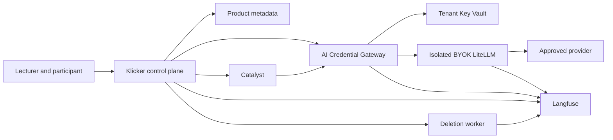

# AI Provider Credential Threat Model

## Executive summary

The highest risks are credential exfiltration through the current custom-endpoint
path, cross-tenant confused-deputy errors in the proposed gateway, secret
capture by LiteLLM or Langfuse, and unverified retention or deletion of complete
AI traces. The target architecture is viable only if the existing shared
LiteLLM credential policy remains closed, the gateway is the sole vault reader,
all endpoints and models come from central profiles, and end-to-end trace
redaction and deletion are proven before launch.

## Scope and assumptions

This is a bounded threat model for AI provider credential registration,
binding, runtime use, rotation, revocation, deletion, LiteLLM routing, Catalyst
handoff, quota, provider notices, and Langfuse trace governance.

In scope:

- KlickerUZH `apps/chat`, relevant GraphQL and Prisma product state, current
  credential crypto, disclaimers, credits, model registry, and deployment chart;
- the proposed standalone AI Credential Gateway and its internal contract;
- the AI deployment repository's isolated BYOK LiteLLM and Langfuse callbacks;
- df-cloud Key Vault, private endpoint, RBAC, diagnostics, and workload identity;
- Catalyst tutoring-engine request-scoped provider boundary;
- migrations from the current `openaiApiKey` and `openaiBaseUrl` fields.

Out of scope:

- provider-internal security and billing correctness;
- a repository-wide security audit, CI supply-chain review, or unrelated MCP
  credential redesign;
- live cluster state, secret values, real provider calls, and production apply;
- final institutional legal basis or research approval.

Assumptions already validated with the product owner during the design
interview:

- authenticated lecturers manage credentials and explicitly delegate bindings
  to enrolled participants;
- Klicker is multi-user and will become multi-institutional, with UZH first;
- participant and lecturer traffic is internet-facing, while gateway, vault, and
  BYOK LiteLLM interfaces are private;
- complete AI content traces are required for support and quality improvement,
  retained for 180 days, and never used for model training;
- deletion tombstones secondary use immediately and Langfuse removal is verified within
  seven days;
- BYOK fails closed and never falls back to a platform-funded credential.

Open questions that affect residual risk but do not change the proposed
boundary:

- Which Provider Profiles are approved for the first cohort, and which
  provider-specific validation calls are non-billable?
- Does a values-suppressed production inventory find any existing non-null or
  plaintext-looking `openaiApiKey` value that requires owner-driven migration?

### Evidence anchors

- `packages/prisma/src/prisma/schema/chat.prisma:Chatbot.openaiApiKey` stores
  the current encrypted key and separate base URL.
- `packages/util/src/crypto.ts:safeDecrypt` returns values that do not look
  encrypted unchanged.
- `apps/chat/src/app/api/chatbots/[chatbotId]/chat/route.ts:getModel` decrypts
  the custom key and can combine a custom base URL with the shared key.
- `apps/backend-docker/src/app.ts` enables GraphQL request logging, so provider
  secrets require a dedicated non-GraphQL ingress endpoint.
- `apps/chat/src/lib/server/apiGuards.ts` checks participation existence, while
  `Participation.isActive` is a separate product state that BYOK must enforce.
- `docs/chat-platform.md:Message feedback and Langfuse` documents the current
  OTel major-version mismatch and absent chat traces.
- `litellm/validate_client_credential_safety.py:unsafe_settings` in the AI
  deployment repository rejects shared client credential opt-ins.
- `litellm/prd-generic/config.yaml:default_team_settings` routes Klicker to its
  Langfuse project and `callbacks` selects OTel v2.
- `src/common/resources.ts:createKeyVaultV2` in df-cloud enables RBAC, purge
  protection, private-endpoint construction, and 90-day soft delete.
- `apps/tutoring-engine/src/app.ts:resolveProvider` in Catalyst currently
  accepts a request-scoped provider bearer after exact origin validation.

## System model

### Primary components

- **Manage and chat clients** accept lecturer credential input once and send
  participant AI requests.
- **Klicker control plane** owns identity, authorization, product metadata,
  bindings, provider profiles, notices, and BYOK budgets.
- **AI Credential Gateway** owns credential lifecycle, vault operations,
  one-request authorization enforcement, and forwarding without Prisma access.
- **Tenant gateway application Key Vault** holds provider secret values and versions.
- **Isolated BYOK LiteLLM** performs approved named-model and complete Auto
  routing with a transient provider credential.
- **Approved provider** performs generation, embedding, classification, or
  another allowlisted AI operation.
- **Catalyst** performs stateless private computation and calls the gateway with
  a request-scoped authorization instead of the provider key.
- **Langfuse** stores the joined full-content trace for 180 days.
- **Deletion worker** tombstones secondary use, requests deletion, and verifies
  completion.

### Data flows and trust boundaries

- Lecturer browser -> Klicker control plane:
  - Data: selected Provider Profile, provider secret, attestation.
  - Channel: authenticated HTTPS.
  - Guarantees: user authorization, CSRF/origin protections, body logging off,
    schema and size validation, no response reflection.
- Klicker control plane -> AI Credential Gateway:
  - Data: provider secret during registration, safe profile id, lifecycle
    operation, or short-lived runtime authorization.
  - Channel: internal TLS with workload/service authentication.
  - Guarantees: exact audience, request id, replay protection, rate limit,
    strict schema; no caller-selected endpoint or vault handle.
- AI Credential Gateway -> tenant Key Vault:
  - Data: opaque secret name and secret value or version.
  - Channel: Azure private endpoint with AKS workload identity.
  - Guarantees: tenant-specific gateway application vault, Azure RBAC, TLS, purge protection,
    diagnostics, public access disabled.
- Klicker or Catalyst -> AI Credential Gateway:
  - Data: prompt request, binding-scoped capability, model policy, trace context.
  - Channel: private HTTP/TLS.
  - Guarantees: random opaque bearer, short expiry, one request, exact chatbot
    binding and provider profile, gateway enforcement, no provider secret,
    endpoint, or vault handle.
- AI Credential Gateway -> private Klicker capability consume endpoint:
  - Data: opaque capability bearer.
  - Channel: private TLS with gateway workload authentication.
  - Guarantees: atomic one-use consume, active participation and binding, hard
    reservation, current profile revision, approved handle returned only to the
    gateway.
- AI Credential Gateway -> isolated BYOK LiteLLM:
  - Data: approved deployment alias, AI request, transient provider key, trace
    context.
  - Channel: private network with dedicated proxy authentication.
  - Guarantees: gateway-only ingress, static endpoint/model profiles, dynamic
    key only, no arbitrary router config, request/error logging redaction.
- BYOK LiteLLM -> approved provider:
  - Data: prompt, retrieval/tool-derived context where applicable, provider key.
  - Channel: TLS to a centrally fixed origin.
  - Guarantees: exact origin and model alias, provider authentication, no
    fallback outside the profile and credential.
- Klicker, gateway, and LiteLLM -> Langfuse:
  - Data: full prompts, responses, retrieval, tool calls, token usage, estimated
    cost, model and provider profile, pseudonymous resource selectors.
  - Channel: authenticated OTLP/API.
  - Guarantees: pre-export credential/header/token removal, project isolation,
    named operator access, 180-day policy.
- Product deletion -> deletion worker -> Langfuse:
  - Data: tombstoned resource or subject selectors and deletion job state.
  - Channel: durable queue and authenticated API.
  - Guarantees: immediate secondary-use block, idempotency, verified completion
    within seven days, overdue alert.

#### Diagram

## Assets and security objectives

| Asset                                 | Why it matters                                                                     | Security objective (C/I/A) |
| ------------------------------------- | ---------------------------------------------------------------------------------- | -------------------------- |
| User provider secrets                 | Theft creates external spend, data access, impersonation, and contractual harm     | C, I                       |
| Platform provider secrets             | Theft can expose shared UZH capacity and data across users                         | C, I, A                    |
| Credential ownership and bindings     | They define who may spend through which teaching resource                          | I, A                       |
| Provider Profiles and Auto manifests  | They fix data boundaries, endpoints, model eligibility, and fallback behavior      | I, A                       |
| Gateway authorization tokens          | Replay or widening creates a confused deputy across bindings or tenants            | C, I                       |
| BYOK quota and cost state             | Tampering can create unbounded external spend or false cost reporting              | I, A                       |
| Provider notices and acknowledgements | Stale or false facts mislead participants about processing boundaries              | I                          |
| Full Langfuse traces                  | Prompts, answers, retrieval, and tool calls can contain personal or sensitive data | C, I                       |
| Deletion and retention evidence       | Missing proof creates privacy, contractual, and research-governance failures       | I, A                       |
| Gateway and LiteLLM availability      | Failure must stop BYOK without changing provider or funding boundary               | A, I                       |
| Audit logs                            | Needed to detect credential access, abuse, deletion failures, and operator misuse  | I, A                       |

## Attacker model

### Capabilities

- An authenticated lecturer can supply a provider key, select from exposed
  Provider Profiles, bind owned resources, and generate concurrent requests.
- An authenticated participant can send adversarial prompts and tool inputs,
  replay browser requests, and create concurrent usage within an enrolled
  course.
- A remote attacker may steal a user session or provider key outside the
  platform and try to use exposed APIs.
- A malicious or compromised internal caller can forge resource identifiers,
  binding identifiers, trace headers, model aliases, or replay a gateway token.
- A compromised gateway or Kubernetes service account can attempt broad Key
  Vault access.
- A compromised provider, LiteLLM process, Langfuse operator, or platform
  operator can misuse data available to that role.

### Non-capabilities

- A normal lecturer or participant cannot deploy code, alter Provider Profiles,
  choose arbitrary endpoints, access the cluster, or call Key Vault directly.
- Catalyst cannot read Key Vault and receives no provider secret in the target
  design.
- Researchers have no routine raw Langfuse access.
- The model does not assume an attacker already controls Azure subscription
  owners, production CI, or the identity provider; those would require a wider
  infrastructure threat model.

## Entry points and attack surfaces

| Surface                        | How reached                          | Trust boundary                      | Notes                                                     | Evidence                                                            |
| ------------------------------ | ------------------------------------ | ----------------------------------- | --------------------------------------------------------- | ------------------------------------------------------------------- |
| Current chat generation        | Authenticated participant POST       | Internet -> chat route              | Current custom/default provider branch and key decryption | `apps/chat/src/app/api/chatbots/[chatbotId]/chat/route.ts:getModel` |
| Current credential fields      | Prisma reads and migrations          | Product DB -> chat process          | Encrypted key and separate base URL                       | `packages/prisma/src/prisma/schema/chat.prisma:Chatbot`             |
| Future credential registration | Authenticated lecturer action        | Browser -> control plane -> gateway | Secret exists only on transient registration path         | Proposed `apps/ai-credential-gateway`                               |
| Model settings                 | Manage GraphQL operations            | Browser -> GraphQL                  | Must not accept endpoint or vault input                   | `packages/graphql/src/services/chatbots.ts`                         |
| Runtime gateway                | Internal request or Catalyst handoff | Product service -> gateway          | High-value confused-deputy boundary                       | Proposed gateway runtime contract                                   |
| Key Vault data plane           | Gateway workload identity            | Gateway pod -> Azure                | One tenant vault per environment                          | df-cloud `createKeyVaultV2`                                         |
| BYOK LiteLLM                   | Gateway-only proxy request           | Gateway -> model router             | Dynamic credential boundary must be isolated              | deployment `litellm/*-generic/config.yaml` patterns                 |
| Catalyst tutoring              | Authenticated internal POST          | Klicker -> Catalyst -> gateway      | Existing request provider bearer becomes gateway token    | Catalyst `apps/tutoring-engine/src/app.ts`                          |
| Langfuse export                | OTLP/callback                        | Three services -> trace store       | Full content, tool and retrieval data                     | `apps/chat/src/instrumentation.ts`; deployment callbacks            |
| Deletion and research export   | Queue/API/operator workflow          | Product lifecycle -> secondary data | Idempotent selection and purpose boundaries               | Proposed deletion contract                                          |

## Top abuse paths

1. A lecturer-controlled endpoint reaches the current custom-base path; the chat
   route supplies the shared platform key when no custom key is selected; the
   endpoint captures that key and spends or reads through the platform account.
2. A caller obtains a valid gateway authorization for one binding, changes a
   binding or resource identifier, and the gateway reads a different owner's
   secret because it trusts request fields instead of the atomically consumed server-side scope.
3. A compromised gateway pod uses a vault-wide reader identity to enumerate and
   exfiltrate every credential in the tenant vault before alerts fire.
4. A valid provider key is sent to LiteLLM through an unrestricted
   `user_config` or dynamic base URL; the request selects an attacker endpoint,
   persistence path, or callback and leaks the key.
5. Request/error instrumentation captures a provider key, gateway token, or
   authorization header; Langfuse retains it for 180 days and exposes it to
   operators.
6. A chatbot is copied or ownership changes while its binding remains active;
   the new owner or participants spend through the original owner's credential.
7. Concurrent participant requests bypass or race a non-atomic reservation; aggregate
   BYOK spend exceeds the lecturer cap before settlement catches up.
8. Auto eligibility checks only generation targets; classifier or embedding
   calls use a platform credential or a different provider, silently changing
   funding and data boundary.
9. A product deletion tombstones only PostgreSQL while incomplete trace
   selectors leave tool, retrieval, or child-generation spans in Langfuse past
   seven days.
10. An approved research workflow reads raw Langfuse or reuses an old export for
    a new purpose, bypassing UZH approval, external-tenant restrictions, and
    deletion obligations.

## Threat model table

| Threat ID | Threat source                                        | Prerequisites                                                                         | Threat action                                                                    | Impact                                                       | Impacted assets                             | Existing controls (evidence)                                                                          | Gaps                                                                               | Recommended mitigations                                                                                                                                                                                                                      | Detection ideas                                                                                    | Likelihood | Impact severity | Priority |
| --------- | ---------------------------------------------------- | ------------------------------------------------------------------------------------- | -------------------------------------------------------------------------------- | ------------------------------------------------------------ | ------------------------------------------- | ----------------------------------------------------------------------------------------------------- | ---------------------------------------------------------------------------------- | -------------------------------------------------------------------------------------------------------------------------------------------------------------------------------------------------------------------------------------------- | -------------------------------------------------------------------------------------------------- | ---------- | --------------- | -------- |
| TM-001    | Malicious lecturer or compromised configuration path | A custom base URL becomes attacker-controlled and the shared key branch is selected   | Capture the platform key at the custom endpoint                                  | Cross-user spend, provider-account compromise, data exposure | Platform provider secret                    | Current URL/key branch is centralized in `chat/route.ts:getModel`                                     | Custom URL can pair with shared key; no write-path validation is visible           | Remove the branch before BYOK exposure; never combine a non-profile endpoint with any platform credential; add a regression test                                                                                                             | Alert on non-profile egress and any platform key use outside fixed origins                         | Medium     | High            | High     |
| TM-002    | Developer, operator, LiteLLM, or tracing callback    | A secret-bearing request is logged or exported                                        | Persist a provider key, proxy key, gateway token, or vault handle                | Long-lived credential disclosure                             | User secrets, tokens, traces                | Shared deployment disables verbose logs; Langfuse team routing exists                                 | Full tracing is required; redaction and non-persistence are unproven               | Central pre-export guard, structured allowlist logging, synthetic canary secret scan across logs/spend/cache/Langfuse                                                                                                                        | Secret-pattern alerts with values suppressed; gitleaks-style synthetic canary checks               | High       | High            | High     |
| TM-003    | Malicious internal caller or participant             | Gateway trusts caller-selected identifiers or a replayed bearer                       | Use another binding, tenant, model, or secret                                    | Cross-tenant spend and data-boundary breach                  | Bindings, provider secrets, quota           | Current product routes authenticate participants; Catalyst uses service bearer and strict Zod schemas | No gateway contract or replay protection yet                                       | Random opaque one-request bearer; server-side chatbot binding, actor, reservation, request, trace, profile revision, model policy, expiry, and token id; atomic consume with active-participation check; no endpoint or handle in the bearer | Denied-scope counters, replay alerts, inactive-participation and profile-revision mismatch metrics | Medium     | High            | High     |
| TM-004    | Compromised gateway workload or service account      | Vault-wide read role and network access                                               | Enumerate or exfiltrate all secrets in one tenant gateway application vault      | Broad provider-account compromise                            | User provider secrets                       | df-cloud supports private Key Vault and RBAC; AKS supports workload identity                          | One gateway identity remains a tenant-wide reader; human role design not specified | Dedicated gateway application vault per tenant and environment, reader-only workload identity, no list permission where feasible, private endpoint, egress allowlist, separate JIT operator role, rapid provider-key incident runbook        | Key Vault read-rate anomaly, list attempts, new source identity, unusual provider failures/spend   | Low        | High            | High     |
| TM-005    | Malicious gateway caller or config change            | Dynamic LiteLLM credentials are enabled without isolation                             | Supply arbitrary router config, endpoint, callback, or fallback                  | Secret exfiltration and policy bypass                        | Provider secrets, Provider Profiles, traces | Shared deployment validator forbids client credential opt-ins                                         | Official LiteLLM dynamic paths are broad and Auto compatibility is unproven        | Separate gateway-only deployment, static aliases/origins, key-only dynamic parameter, reject `user_config`, dedicated validator and contract tests                                                                                           | Config-policy CI, egress monitoring, rejected dynamic-param metrics                                | Medium     | High            | High     |
| TM-006    | Resource owner, race, or lifecycle bug               | Copy, transfer, revoke, delete, or profile suspend is not transactional with bindings | Continue using stale authority                                                   | Unauthorized spend after ownership or policy change          | Bindings, quota, user secret                | Current relations cascade some chatbot state; proposed binding is explicit                            | No binding lifecycle exists                                                        | Copy unbound, transfer unbind, synchronous tombstone, version checks, idempotent lifecycle tests and reconciliation worker                                                                                                                   | Active binding with inactive owner/credential invariant alert                                      | Medium     | High            | High     |
| TM-007    | Participant concurrency or malicious lecturer        | Reservation is absent, non-atomic, or released before reliable settlement             | Burst concurrent expensive requests                                              | External cost overrun and service denial                     | BYOK quota, provider account                | Current credit decrement is atomic and clamps at zero                                                 | Hard participant and aggregate BYOK reservations do not exist                      | Atomic conservative hard reservation against both caps, request and concurrency ceilings, idempotent settlement, full reservation charged when usage is unreliable, no funded fallback                                                       | Per-binding concurrency, overrun delta, provider 429 and spend anomaly alerts                      | High       | Medium          | High     |
| TM-008    | Routing bug or stale manifest                        | Auto capability validation is incomplete                                              | Use a missing target through another credential or fail over outside the profile | Undisclosed provider and funding change                      | Provider Profile, notice, quota             | Current registry and deployment Auto aliases exist                                                    | Registry does not prove all classifier/embedding/generation targets under one key  | Version complete Auto manifests; validate every target; suspend Auto on change; fail closed; named-model fallback only if explicitly bound                                                                                                   | Manifest drift CI and runtime selected-target audit                                                | Medium     | High            | High     |
| TM-009    | Product or provider-profile maintainer               | Notice facts or acceptance version are stale                                          | Process through a changed provider boundary without re-acknowledgement           | Misleading disclosure and governance failure                 | Provider notice, user trust                 | Existing disclaimer gate blocks chat until accepted                                                   | Existing acceptance is chatbot-scoped, not provider-profile-versioned              | Separate Provider Notice Acceptance, central factual fields, version bump on material change, next-use gate                                                                                                                                  | Requests with notice-version mismatch; profile changes without notice review                       | Medium     | Medium          | Medium   |
| TM-010    | Deletion worker bug or Langfuse API failure          | Trace selectors are incomplete or deletion is treated as fire-and-forget              | Retain prompts, tools, retrieval, or child generations after deletion SLA        | Privacy and contractual breach                               | Full traces, deletion evidence              | Langfuse supports deletion and retention; proposed tombstone blocks secondary use                     | Current trace export is broken and no deletion index/job exists                    | Stable resource/subject selectors on every span, durable idempotent jobs, API verification, seven-day SLO, 180-day automatic backstop                                                                                                        | Overdue deletion dashboard, residual-query check, selector coverage metrics                        | Medium     | High            | High     |
| TM-011    | Researcher or operator                               | Raw access or old export is reused                                                    | Use UZH or external data beyond approved purpose                                 | Research ethics, privacy, and contractual harm               | Traces, research datasets                   | User decision forbids training and routine researcher Langfuse access                                 | Export approval, deletion propagation, and retention contracts are not implemented | Separate export service/workflow, purpose id, tenant eligibility, minimization, access expiry, dataset deletion registry, no raw Langfuse role                                                                                               | Export ledger review, access expiry alerts, tenant/purpose mismatch audit                          | Medium     | High            | High     |
| TM-012    | External key theft or provider compromise            | Provider key is revoked or abused outside Klicker                                     | Continue accepting a credential that no longer represents safe account control   | Spend, data exposure, failed requests                        | User credential, binding availability       | Validation state is proposed; provider rejects invalid keys                                           | Provider revocation is not automatically signaled for most providers               | Failure-threshold suspension, owner notification, provider-profile kill switch, fast revoke, revalidation on rotation and manifest change                                                                                                    | Authentication-failure burst, anomalous provider spend, profile-wide incident flag                 | Medium     | High            | High     |
| TM-013    | Outage or retry logic                                | Gateway, vault, BYOK LiteLLM, Langfuse, or provider is unavailable                    | Bypass the gateway or silently use a platform provider                           | Changed data and funding boundary                            | Authorization, provider profile, user trust | User explicitly chose fail closed                                                                     | Existing chat has global fallback behavior                                         | Encode funding source in request; forbid cross-source fallbacks; return stable retryable denial; test every dependency outage                                                                                                                | Fallback-source mismatch metric, dependency health and denial-rate alerts                          | Medium     | High            | High     |
| TM-014    | Migration operator or application code               | Legacy values include plaintext or are printed during inventory/migration             | Leak or silently re-upload credentials                                           | Credential disclosure and owner surprise                     | Legacy provider secrets                     | Public repo warns against secret exposure; values can be classified by shape                          | `safeDecrypt` passes plaintext; production population is unknown                   | Values-suppressed type/null inventory, owner-driven replacement, no bulk export, no logs, staged column removal, secret scan staged diff                                                                                                     | Migration counters only, no values; alert on legacy-field reads after cutover                      | Low        | High            | High     |
| TM-015    | Telemetry version or callback drift                  | Product spans fail while requests still succeed                                       | Operate without complete traces, usage evidence, or deletion selectors           | Untraceable incidents and incomplete deletion                | Trace integrity, cost state                 | Deployment LiteLLM has OTel v2 and team routing                                                       | Klicker docs state chat export currently fails                                     | Make trace-export proof a launch gate; synthetic joined trace and deletion canary; fail the readiness gate, not user generation, when telemetry is degraded                                                                                  | Missing-span ratio, trace-join completeness, canary trace alarm                                    | High       | Medium          | High     |

## Criticality calibration

**Critical** means an internet-reachable path can immediately expose provider
credentials or cross institutional tenants at scale without another privileged
compromise. Examples are an unauthenticated gateway secret-read path, a forged
a broken capability-consume endpoint that authorizes any vault handle, or shared platform-key
forwarding to arbitrary public endpoints after lecturer self-service ships.

**High** means realistic authenticated or service compromise can expose one
tenant's credentials, create material external spend, silently change provider
or funding boundaries, or retain full traces beyond deletion obligations.
Examples are a binding IDOR, unrestricted dynamic LiteLLM configuration, and
unverified Langfuse deletion.

**Medium** means the issue degrades disclosure, bounded availability, or
accounting but existing scoping limits immediate credential exposure. Examples
are stale notice acknowledgement, conservative cost-estimate drift, and a
single in-flight request completing after revocation.

**Low** means exploitation requires operator control already equivalent to the
impact or causes minor, readily detected inconsistency. Examples are cosmetic
status lag after verified deletion, a harmless duplicate idempotent cleanup job,
or missing aggregate cost display while request authorization remains correct.

No current finding is ranked critical because the current repository exposes no
lecturer write path for custom credentials. TM-001 becomes critical if that path
is made self-service before the shared-key/custom-origin branch is removed.

## Focus paths for security review

| Path                                                                   | Why it matters                                                                                                           | Related Threat IDs                     |
| ---------------------------------------------------------------------- | ------------------------------------------------------------------------------------------------------------------------ | -------------------------------------- |
| `klicker-uzh/apps/chat/src/app/api/chatbots/[chatbotId]/chat/route.ts` | Current credential selection, custom base URL, shared fallback, authorization, routing, and trace creation converge here | TM-001, TM-008, TM-013, TM-015         |
| `klicker-uzh/packages/prisma/src/prisma/schema/chat.prisma`            | Current secret fields and future credential, binding, quota, notice, and deletion state                                  | TM-003, TM-006, TM-007, TM-009, TM-014 |
| `klicker-uzh/packages/util/src/crypto.ts`                              | Plaintext-compatible decryption creates migration and secret-handling risk                                               | TM-001, TM-014                         |
| `klicker-uzh/apps/chat/src/lib/server/chatModelRegistry.ts`            | Model and Auto eligibility must compose with complete credential capabilities                                            | TM-008                                 |
| `klicker-uzh/apps/chat/src/lib/server/langfuseTracing.ts`              | Trace identity and later deletion selectors depend on stable correlation                                                 | TM-002, TM-010, TM-015                 |
| `klicker-uzh/apps/chat/src/instrumentation.ts`                         | Current OTel mismatch blocks trace evidence                                                                              | TM-002, TM-015                         |
| `klicker-uzh/apps/chat/src/services/disclaimers.ts`                    | Existing gate must compose with provider-version acknowledgement                                                         | TM-009                                 |
| `klicker-uzh/apps/chat/src/services/credits.ts`                        | Existing participant credits must remain separate from BYOK settlement                                                   | TM-007, TM-013                         |
| `klicker-uzh/packages/graphql/src/services/chatbots.ts`                | Lecturer model settings and product authorization must not admit endpoints or secret handles                             | TM-003, TM-005, TM-008                 |
| `klicker-uzh/deploy/charts/klicker-uzh-v3`                             | Gateway service account, internal ingress, network policy, and feature flag land here                                    | TM-003, TM-004, TM-013                 |
| `deployment/litellm/validate_client_credential_safety.py`              | Shared policy must remain closed and a dedicated BYOK policy must be explicit                                            | TM-005                                 |
| `deployment/litellm/prd-generic/config.yaml`                           | Current model aliases, fallbacks, callbacks, cost, headers, and persistence establish the migration boundary             | TM-002, TM-005, TM-008, TM-015         |
| `df-cloud/src/common/resources.ts`                                     | Key Vault RBAC, purge protection, private endpoints, and retention are declared here                                     | TM-004, TM-006                         |
| `df-cloud/src/infra/index.ts`                                          | Workload identity and role assignments determine the gateway's vault blast radius                                        | TM-004                                 |
| `klicker-uzh-catalyst/apps/tutoring-engine/src/app.ts`                 | The raw request provider bearer must become a scoped gateway authorization                                               | TM-003, TM-013                         |

## Quality check

- [x] Covered the current chat, future registration, gateway, vault, LiteLLM,
      provider, Catalyst, Langfuse, deletion, and research entry points.
- [x] Addressed every documented trust boundary in at least one threat.
- [x] Separated current runtime evidence from proposed controls and excluded
      unrelated CI, dev, and provider-internal security.
- [x] Incorporated the product owner's validated multi-tenant, authorization,
      data-sensitivity, tracing, retention, deletion, and fail-closed decisions.
- [x] Marked remaining infrastructure retention, provider allowlist, and legacy
      population questions explicitly.
- [x] Included concrete existing evidence, gaps, mitigations, detection, and
      repository paths without reading or exposing secret values.
