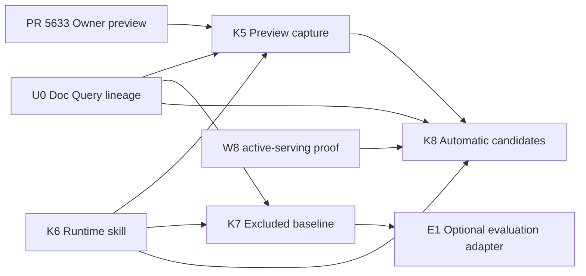

# Chatbot Test & Teach ground-truth plan

## Plan identity

- Date: 2026-08-28
- Ceremony: full-path, multi-package product plan
- Status: approved for K6 local execution; push, PR publication, merge,
  deployment, and live model calls remain withheld
- Repository home: `uzh-bf/klicker-uzh`
- Target branch for Klicker packages: `v3-ai`
- Prepared in: `trees/chatbot-owner-preview` on
  `rs/chatbot-owner-preview` at
  `245345cc306e03430e4455317aff8654cf289d2e`
- Current target evidence after the presentation refresh: `origin/v3-ai` at
  `609000ea9626e3fef2e713768ca2a796cac2f9a4`; its only commit beyond this
  prepared tree is the deployment-only promotion of the already-integrated
  code head `edae586280ca2a63e5bc7a3005d4136e0b1e8ad7`
- Predecessors: response-example foundation and review PRs #5474 and #5498;
  owner-preview PR #5633
- Planning review:
  `project/_local/reviews/2026-08-28-chatbot-test-and-teach-ground-truth-planning-stage.md`
  (`DONE_WITH_CONCERNS`, dispositions incorporated; local and gitignored)

This is a successor plan, not an expansion of PR #5633. It moved into K6's
purpose-based worktree after approval and lands with K6's implementation; it
is never added to #5633 or published alone.

All Klicker packages start from a freshly fetched `v3-ai`. K5 starts after
#5633 lands; it does not stack on or extend the owner-preview PR. K7 starts
after K6 lands; it does not create an optional stack path.

## Goal

Let a lecturer turn a real, source-grounded owner-preview answer into a
reviewable response example, approve it in the existing Manage editor, use the
approved examples as a chatbot skill during normal use, and run an honest
baseline test in which those same examples are ground truth but are completely
withheld from model input.

The first release stays deliberately small:

- one current response-example set per chatbot;
- one question and one Markdown ideal answer per example;
- current approved content is live immediately;
- one platform base model for target answers, advisory judging, and later
  candidate generation;
- current source lineage, not copied source content;
- one latest baseline report, not evaluation history.

Later automatic generation uses the same candidate queue. It starts only after
the KB/KG path has synthetic active-serving proof and never auto-approves
content.

## Non-goals

- No second teaching, development, or held-out set; no variants, rubrics,
  criteria, profiles, teaching personas, or reviewer roles.
- No response-example revisions, audit history, draft branching, merge editor,
  locale, language routing, or translation records.
- No multi-turn ground-truth examples. The current canonical model remains one
  question and one ideal answer.
- No new vector database, embedding provider, model qualification layer, or
  custom evaluator service.
- No knowledge-base ingestion, graph generation, provider activation, GitOps,
  deployment, or W8-owned infrastructure changes.
- No second canonical dataset in the evaluation repository and no committed
  real course examples or exports.
- No runtime activation, live model calls, staging proof, production mutation,
  merge, or release as part of plan approval.

## Terminology

| Term | Meaning |
| --- | --- |
| Response example | Lecturer-facing question, ideal response, response approach, mode, and current evidence lineage. |
| Ground truth | The same approved response example when its ideal response is used only after a target answer for evaluation. It is not a second stored object. |
| Included run | Normal chat or owner preview in which the bounded response-example summary and search skill are available. |
| Excluded baseline | Owner-triggered test in which all response-example content is withheld while the other chatbot configuration remains fixed. |
| Evidence eligible | Approved example whose citation markers, current chatbot-bound source authorization, and active content hashes all validate now. |
| Active-serving proof | Upstream evidence that the selected KB/KG digest is not only built but is the digest actually served by Doc Query. |

Lecturer copy always says “Response examples” and “Baseline test.” “Ground
truth,” “projection,” and “receipt” remain implementation and evaluation terms.

## Settled product contract

- Each chatbot has one canonical response-example set. The set carries a
  deterministic digest of its current state.
- A lecturer may capture only the first completed, source-grounded
  user-assistant exchange in a fresh owner preview. This prevents a dependent
  later turn from being stored without the conversation that gave it meaning.
- Capture creates a `CANDIDATE`. It never auto-approves, overwrites an existing
  question, or silently invents evidence.
- The existing Manage review inbox owns substantive editing. The ideal response
  stays Markdown and is edited through the Slate-based `ContentInput`.
- Approval makes the current example live immediately. Editing an approved
  example uses the existing compare-and-set contract and creates no revision.
- Rejected examples remain terminal in this release.
- Normal chatbot use and owner preview receive approved examples through the
  same response-example skill. The baseline receives none of their content.
- Language is inferred by the base model from the current conversation. There
  is no locale field or language filter.
- The existing response-approach enum remains the only lecturer-selected
  behavior metadata. Chat mode uses the existing intuitive dropdown.
- All approved ideal responses contain at least one citation and retain only
  source ID, chunk ID, content hash, citation index, and anchor.

Plan approval also accepts the recommended first-turn capture boundary. A
future request for multi-turn examples reopens the schema, authoring UI,
runtime projection, baseline input, and export contract together.

## Lecturer journey

### 1. Create a candidate in owner preview

1. The lecturer opens the existing owner preview and selects the chatbot mode.
2. They ask one representative question in a fresh preview.
3. After a completed answer with valid citations, the assistant action bar
   shows **Save as response example**.
4. One click creates a candidate and leaves the conversation in place. A toast
   offers **Review now**.
5. If the answer has no complete canonical source lineage, the action is
   unavailable and explains that the lecturer must rerun after sources are
   available.

After the first exchange, the capture action is unavailable. The preview
offers **Start a new preview** so the lecturer can create another independent
example without pretending a later dependent turn is self-contained.

### 2. Review and approve in Manage

**Review now** opens the chatbot details page with the candidate focused. The
existing review card and Slate editor remain the primary editing surface. The
editor shows current owner-authorized source cards beside the answer, including
the citation number, source label, anchor, and current/changed state. It never
stores source bodies or durable source URLs in the response example.

The candidate receives a deterministic initial response approach:

| Chat mode | Initial response approach |
| --- | --- |
| `tutor` | Guided questions |
| `explainer` | Step-by-step explanation |
| other current or future modes | Concise answer |

The lecturer can change the dropdown before approval. Approval is possible
only while citation parity and current evidence eligibility pass. A source
change moves an already-approved example to **Needs review** before it can be
delivered again.

### 3. Use approved examples as a chatbot skill

The system prompt always receives a small deterministic summary for the exact
chatbot and mode. The model can call `search_response_examples` with the current
question when a full example would help. The server binds chatbot and mode; the
model cannot request another scope.

The returned examples teach response behavior and structure. They do not
replace Doc Query. Current factual claims still require current Doc Query
sources.

### 4. Run the baseline test

The chatbot details page shows **Run baseline test** with the number of approved
eligible cases and a short account-budget notice. The lecturer starts one
bounded asynchronous run. The report compares the ideal response with the
actual base-model response **without response examples**.

The report is case-first:

- question and selected mode;
- ideal response and its evidence anchors;
- actual response and sources returned by Doc Query;
- advisory **Pass** or **Needs attention** with one short reason;
- model, prompt, Doc Query, graph/serving, and response-example-set fingerprints.

Changing the current set digest marks the report stale. Starting a new run
replaces the previous run and report; the product keeps no evaluation history.

## Architecture and dependency map

This plan deliberately has two independent Klicker tracks. K6 can start now
from merged response-example foundations. K5 starts after #5633 lands. Neither
waits for graph generation. K8 alone remains blocked on W8's active-serving
evidence and deployed U0 lineage.

## Package topology

| Package | Repository, branch, and target | Scope and terminal condition | Dependency |
| --- | --- | --- | --- |
| U0 — Doc Query lineage | `mcp-doc-query`; proposed `feat/response-example-lineage`; target `dev` only after its branch-flow ruling | Bounded canonical lineage in authorized answer and documents source records; contract tests and bounded security review; source PR ready | Current `main` contract; deployment is separate |
| K5 — Preview capture | Klicker; `feat/chatbot-response-example-capture`; target fresh `v3-ai` after #5633 and K6 land | Receipt prototype, signed capture, idempotent candidate creation, Manage deep link, source-aware editor, and owner-preview use of the K6 skill; PR ready | Merged #5633 and K6; live proof requires deployed U0 |
| K6 — Runtime skill | Klicker; `feat/chatbot-response-example-runtime`; target `v3-ai` | Current eligibility, deterministic summary, ranked search skill, participant inclusion, and reusable included/excluded assembly; PR ready | Merged #5474/#5498 only |
| K7 — Excluded baseline | Klicker; `feat/chatbot-response-example-baseline`; target fresh `v3-ai` after K6 lands | One current async run/report, strict no-example isolation, owner budget, Manage report UI, and the optional owner-authorized normalized export contract; PR ready | Merged K6; trustworthy live lineage proof requires deployed U0 |
| K8 — Automatic candidates | Klicker; `feat/chatbot-response-example-generation`; no branch until unblocked | Current-state candidate reconciliation from active KB/KG; PR ready, no activation | K5, K6, deployed U0 lineage, and W8 active-serving proof |
| E1 — Evaluation adapter | `evaluation`; `feat/klicker-response-example-import`; target current default branch | Loader that consumes K7's optional normalized export while preserving stable IDs and provenance; optional PR ready | K7.4 export contract and implementation |

Every package receives its own repo-local execution plan before implementation.
U0 and E1 plans live in their own repositories. The packages do not share a
mega-branch, and K8 does not create an empty branch while blocked.

### What can proceed before W8

| Work | Can start now | Evidence boundary |
| --- | --- | --- |
| K5 receipt/data-part prototype and UI states | after #5633 and K6 land | synthetic lineage only until U0 is deployed |
| K6 runtime eligibility, summary, and ranked search | yes, directly from current `v3-ai` | local fixtures prove selection, not live source freshness |
| K7 schema, worker, isolation tests, and report UI | after K6 execution-kernel contract | provider-backed source proof waits for U0 and deployment authority |
| U0 source change | after the upstream branch-flow ruling | merge and deployment remain separate states |
| K8 automatic generation | no | waits for W8 synthetic active-serving proof |

## Product primitive impact

| Primitive | Disposition | Contract change | Main consumers |
| --- | --- | --- | --- |
| Response-example set | reuse | Still one current set with one digest and run-scoped roles | review, runtime, baseline, generation |
| Response example | extend | Adds owner-preview candidate capture; stored answer remains Markdown | Manage review, runtime, evaluation |
| Evidence lineage | extend | Adds current source authorization/hash resolution and shared citation indexing | capture, approval, runtime, baseline |
| Preview-turn receipt | create, ephemeral | Short-lived proof of a specific source-grounded preview answer; never a product record | K5 capture only |
| Response-example skill | create as projection | Bounded summary plus server-bound ranked search over approved eligible examples | participant chat in K6; owner preview in K5 |
| Baseline run/report | create, current only | One current case snapshot and output per set; no history | Manage owner UI, optional export |
| Candidate generation state | create later, current only | One reconciled state keyed to active-serving evidence | K8 worker and review inbox |

There is no separate ground-truth primitive. The approved response example is
the reference answer only in the excluded baseline role.

## ADR gate

No new ADR is required if the implementation stays within the decisions below:

- Update ADR 0028 to name the owner baseline as an examples-excluded role over
  the same canonical set.
- Clarify ADR 0030: the always-present summary is deterministic, bounded, and
  carries counts and response-approach guidance rather than full answers.
- Amend ADR 0033 from external semantic search to PostgreSQL ranked full-text
  search, while preserving model invocation, exact server-bound scope, caps,
  observability, and degraded continuation.
- Extend ADR 0034 with the shared current-eligibility projection and automatic
  `APPROVED` to `NEEDS_REVIEW` reconciliation when evidence becomes invalid.
- Keep ADR 0035: resolve current source display metadata at read time and never
  store source bodies in examples or reports.
- Keep ADR 0036: the platform base model is the first candidate generator and
  advisory judge.

Reopen the ADR gate if work needs multi-turn examples, revisions, another
canonical set, a vector provider, a second model tier, durable source copies,
evaluation history, or participant-facing evaluation controls.

## Shared contracts

### Canonical source normalization

Create one React-free pure projection module in the existing util package. It
converts authorized Doc Query results into a stable ordered list used by
preview display, capture receipts, live chat citations, runtime example
projection, and baseline results. K6 adds only the participant-facing server
loader and search composition in the chat app; K5 later reuses it from the
merged owner-preview route.

The order is deterministic. Duplicate chunks collapse only when their complete
canonical lineage matches. Citation indexes refer to this ordered list. Receipt
creation includes only sources actually cited in the final answer, never every
retrieved chunk. Display-only IDs from `normalizeSources.ts` are not evidence
IDs.

### Current evidence eligibility

One service projection is authoritative for all consumers. An example is
eligible only when all of these hold:

1. status is `APPROVED`;
2. set belongs to the exact chatbot and example mode matches the run mode;
3. rendered citation markers exactly match stored citation indexes;
4. each source belongs to the knowledge base currently enabled for the chatbot;
5. each stored content hash matches the source's current
   `activeContentSha256` and each source remains active and authorized.

The projection excludes invalid rows before any prompt, tool result, or
baseline snapshot is built. In the same owner-scoped transaction, invalid
approved rows move to `NEEDS_REVIEW`, reviewer fields are cleared as required
by the existing lifecycle, and the complete set digest is refreshed. Approval,
Manage reads, summary generation, ranked search, and baseline snapshotting all
reuse this projection rather than trusting the stored `evidenceEligible`
Boolean alone.

Citation parity remains an integrity check, not a semantic-support claim. The
lecturer remains responsible for whether the cited material actually supports
the ideal response.

### Preview-turn receipt

Reuse the existing JOSE-based server token approach with a response-example
specific purpose, version, and audience. Signing authority stays server-side;
GraphQL receives verification authority only. Key material is supplied through
Infisical-backed environment configuration and is never logged or copied into
the database.

The receipt binds bounded values for:

- purpose, schema version, token ID, issued time, and expiry;
- lecturer user ID, chatbot ID, enabled knowledge-base ID, and chat mode;
- hashes of the canonical question and final Markdown answer;
- cited source ID, chunk ID, content hash, citation index, and anchor.

The capture route re-authenticates the Manage session and forwards that session
to the canonical GraphQL mutation. GraphQL verifies the receipt, ownership,
current chatbot-KB binding, source membership, current active hashes, citation
parity, and input bounds. It creates the set if missing, inserts one candidate
and its evidence refs transactionally, then refreshes the set digest.

Receipt replay is harmless and idempotent: the existing unique key on set,
mode, and question returns the existing example. It never updates that row. A
stale or changed source returns a coded conflict that tells the lecturer to
start a fresh preview. Logs contain identifiers and error codes only, never the
receipt, question, answer, or source text.

### assistant-ui prototype gate

Before K5 commits to the token transport, a discardable prototype must prove
all four properties:

1. a completed assistant message retains a bounded custom receipt data part;
2. the message action can read that part after completion and after another UI
   turn;
3. server reconstruction removes the part from every subsequent model request;
4. page refresh removes it because preview remains server-stateless.

If any property fails, K5 pauses and documents one alternative transport. It
does not add Redis, a conversation table, or participant-thread persistence by
default.

### Ranked response-example search

`search_response_examples` accepts only a bounded query string. The server
binds current chatbot ID, mode, owner-authorized set, and included-run role.
The model cannot pass those fields.

Selection first narrows through the existing `(setId, chatMode, status)` index.
It then ranks the small eligible candidate set with PostgreSQL
`websearch_to_tsquery` and `to_tsvector` using the `simple` configuration. The
question has higher weight than the ideal answer. Rank, current update time,
and stable ID provide deterministic ordering.

Return at most three complete examples within a 24,000-character total budget.
Skip an example that does not fit; never truncate its ideal answer. Because the
first release caps a chatbot at a small reviewed set, no expression index or
new migration is required. Reopen indexing only when measured query evidence
shows the exact-set narrowing is insufficient.

The always-present summary is deterministic and at most 1,500 characters. It
contains the eligible example count, response-approach distribution, and a
short instruction to search when behavior guidance would help. It contains no
full answer, source text, model-generated topic classification, or hidden
fallback scope.

Example answer citations are rewritten into an explicit example-only namespace
inside the tool projection. The tool returns their source anchors separately.
The prompt states that the model must not copy these markers as current-answer
citations. Current claims still require live Doc Query retrieval.

Loader or search failure records degraded response-example selection and
continues with the ordinary mode prompt and Doc Query. It never searches
another chatbot or mode.

### Response-example runtime composition

K6 adds a pure projection entry point to the existing util package and one
server-only chat module. They own only current eligibility, bounded summary,
the stable search-tool schema, included or excluded implementation, and the
response-example projection digest. Model selection, base prompts, Doc Query,
authentication, persistence, credits, and UI remain with their existing
routes. This narrower topology supersedes the earlier proposed shared runtime
package because only participant chat exists on the current target branch.

Participant chat composes the included role in K6. K5 applies the same
composition to owner preview after PR #5633 and K6 are merged. K7 uses the
excluded role: no summary, the identical search-tool schema, an empty result,
and no response-example read.

## Baseline isolation and report contract

The baseline is an owner base-model test profile, not a participant-session
replay. K6 makes participant chat an included run, and K5 later does the same
for owner preview. K7 invokes the same response-example composition with
exactly two response-example differences:

1. omit the response-example summary from the system prompt and prompt-cache
   identity;
2. expose the same `search_response_examples` tool schema but bind it to an
   empty result without reading the set's content.

Model, mode, fixed prompt layers, Doc Query configuration, other tool schemas,
timeouts, and source normalization remain the same and are fingerprinted. The
evaluation worker sends the question to the target first. Only after the target
answer and sources finish does it join the snapshotted ideal answer for the
advisory base-model judge.

One Prisma-generated K7 migration adds the current report model. One run row is
unique per response-example set and owns its current case snapshots. Starting
a new run replaces that row's run ID and case snapshot; no previous report is
retained. Every worker read and write compares the current run ID so a retry
from an older run exits without overwriting newer state.

Case snapshots retain the question, ideal Markdown answer, mode, response
approach, evidence lineage, and set digest needed to finish the current run if
the live example changes. They are part of the current report, not
response-example history. Actual answer sources retain current lineage and
display anchors, not source bodies.

The run uses the standard account-level `BASE` budget for both target and
advisory-judge calls. It creates no `ChatThread`, `ChatMessage`, participant,
participant-credit, or rating row. Budget exhaustion fails the remaining cases
with a coded incomplete-run state; it never falls back to another model or
usage class.

The report is stale when its captured set digest differs from the current set
digest. It may still finish after the set changes because its current-run case
snapshot is complete. A lecturer can replace it by starting a new run.

### Required no-leak proof

Provider-request capture tests must prove that the target receives no ideal
answer, approved question other than the current case input, response-example
summary, full example, example evidence, response style, set digest, or search
result. The assertion covers system instructions, messages, tool arguments,
tool results, provider metadata, and prompt-cache identity.

The target receives only the current question as conversation content. The
expected answer appears only in the post-target QA record and advisory judge
input. This preserves the evaluation repository's existing order: target query
first, expected-answer join second.

## U0 Doc Query lineage contract

Authoritative planning evidence is `mcp-doc-query` `origin/main` at
`748b5a216a9b1dcc64e2045f17b63662c9b89f14`. The internal pipeline already
knows `source_id`, `content_hash`, and stable chunk IDs. U0 exposes the minimum
opaque lineage needed by authorized Klicker answer and documents responses:

- `source_id` matching the Klicker KB resource ID;
- stable `chunk_id`;
- `content_hash` matching the active source content;
- existing display title, URL/page metadata, and citation anchor where
  available.

The contract does not add source bodies beyond the content already returned by
the selected Doc Query mode. It does not expose embeddings, internal paths,
credentials, or ingestion details. Contract tests verify both modes, absence
from unauthorized/error responses, bounds, and stable identifier semantics. A
bounded security review covers the participant-visible opaque identifiers and
scope-token authorization.

`mcp-doc-query` currently has materially divergent `main` and `dev` refs. This
plan does not guess an upstream integration strategy. The recommended path is a
separately authorized realignment of `dev` from current `main`, followed by a
U0 feature PR to `dev`. A direct-to-`main` feature PR requires an explicit
repository-owner exception. No U0 branch is created until that ruling is
recorded.

Source merge, CI, released package/image, GitOps desired state, deployed
revision, and a live authorized response are separate evidence states. K5 and
K7 may use synthetic lineage locally but cannot claim production-like source
proof before the U0 contract is deployed in the chosen environment.

## Later automatic candidate generation

K8 starts only after W8 supplies synthetic proof that the graph/source digest
used for generation is the digest actually served for the chatbot. A source
merge or completed graph build alone does not satisfy this gate.

The existing Hatchet worker pattern runs one idempotent reconciliation keyed by
chatbot ID, active graph build or source-content digest, and generation contract
version. The graph proposes coverage; Doc Query supplies authorized chunks with
canonical lineage; the platform base model drafts questions and Markdown ideal
answers with citations.

The reconciler:

- creates `CANDIDATE` rows only;
- never modifies an approved example whose evidence remains current;
- moves approved examples with invalid evidence to `NEEDS_REVIEW`;
- replaces stale unapproved candidates from an older generation key;
- keeps one current generation state and deletes source-bearing scratch when
  the job completes.

The initial bound remains up to 16 candidates per active mode and 40 total per
chatbot. Generation does not add locale, profiles, variants, or a second model.
No schedule or event activation is part of source implementation; producer
activation, deployment, and live calls remain later approval boundaries.

## Optional evaluation-repository adapter

Authoritative planning evidence is the evaluation repository `origin/main` at
`95d566fb26aec82bb01a98240fbb42d6564929ca`. Its existing harness already sends
the question to the target before joining `expected_answer` and can evaluate
normalized QA JSON.

E1 is optional and does not block lecturer value. Klicker exports one
access-controlled normalized artifact from the current report, containing a
stable example ID, mode, set digest, question, ideal answer, actual answer,
source lineage, and run fingerprints. The adapter preserves those identifiers
and metadata through DeepEval rather than matching cases only by question text.

Exports remain ignored or outside the repository and follow the same course
authorization as the chatbot. The evaluation repository never becomes the
canonical store and never commits real course examples.

## Feature-wide test portfolio

| Risk or behavior | Existing protection | New obligation | Primary seam | Package |
| --- | --- | --- | --- | --- |
| Only the owner can capture and review | owner-preview guard and owner-only response-example service | re-authenticate on capture; non-owner, participant, and wrong-scope denials | chat capture route plus GraphQL service | K5 |
| Receipt cannot be altered or reused across purpose/scope | JOSE token patterns | claim bounds, expiry, purpose/audience, hash, KB binding, tamper, replay-idempotency tests | pure receipt contract and service test | K5 |
| Receipt never reaches the model | server message reconstruction drops custom data | prototype and captured-provider-request assertion | assistant-ui message action plus request builder | K5 |
| Candidate creation is atomic and duplicate-safe | unique set/mode/question key and digest refresh | create, stale source, changed binding, duplicate, rollback tests | GraphQL database fixture suite | K5 |
| Lecturer can verify evidence while editing | source lineage cards exist outside edit modal | source cards in modal, changed-source state, keyboard and responsive checks | Manage component and browser journey | K5 |
| Invalid approved examples never enter prompts or tools | citation parity and stored eligibility | current source authorization/hash projection and status reconciliation | shared runtime unit plus database tests | K6 |
| Search stays exact, deterministic, and bounded | set/mode/status index | query ranking, tie order, mode isolation, three-item and character caps | PostgreSQL-backed service test | K6 |
| Example citations never masquerade as live citations | Markdown marker validation | namespace rewrite and Doc Query-only live citation assertion | runtime projection and chat route test | K6 |
| Participant chat uses the bounded skill without route regression | response examples are not yet composed at runtime | prompt/tool identity, auth, persistence, credit, and degraded-load tests | chat server module and participant route tests | K6 |
| Owner preview uses the same skill contract | PR #5633 is not merged into the K6 baseline | included-run parity and zero-persistence tests after both predecessors land | owner-preview route tests | K5 |
| Baseline target sees no example content | evaluation repo query-first behavior | full provider request capture including prompt-cache metadata | shared kernel exclusion test | K7 |
| Baseline creates no participant state | owner preview is stateless | zero ChatThread, ChatMessage, participant-credit writes | worker database test | K7 |
| Async retry cannot overwrite a newer run | existing Hatchet retry patterns | current-run ID compare-and-set, digest movement, retry race tests | report service and handler | K7 |
| Report and budget states are understandable | account `BASE` usage contract | completed, stale, incomplete-budget, failed, and rerun UI states | GraphQL plus Manage browser journey | K7 |
| U0 lineage is minimal and authorized | Doc Query scope token | answer/documents contract and negative disclosure tests | mcp-doc-query contract suite | U0 |
| Generation never auto-approves or overwrites reviewed work | response-example lifecycle | idempotent current-state reconciliation and scratch cleanup | Hatchet/database integration test | K8 |
| Export cannot leak or fork canonical data | evaluation normalized QA path | owner authorization, stable IDs, no committed fixture/export | Klicker export and evaluation loader tests | E1 |

Do not add tests for held-out generalization, locale, revisions, variants,
multi-turn examples, vector search, model qualification, or production
deployment in these packages.

## Review routing

Each package follows its repo's full-path execution workflow. K5, K6, and K7
cross authorization, source integrity, runtime architecture, or evaluation
isolation boundaries, so each committed substantive slice receives its armed
risk-selected review. Each package receives a final integrated review after
its local verification is green.

- K5 review lenses: authorization, token integrity, privacy, UI behavior, and
  source provenance.
- K6 review lenses: architecture, prompt/tool scope, source eligibility,
  citation semantics, and query determinism.
- K7 review lenses: evaluation leakage, budget/data integrity, async races,
  migration provenance, and report wording.
- U0 review lenses: external contract compatibility, authorization, bounded
  disclosure, and stable lineage.
- K8 review lenses: active-serving preconditions, idempotency, reviewed-content
  preservation, scratch deletion, and disabled activation.

Reviewer findings remain advice until verified against the exact diff. A
remote branch move alone does not invalidate a review; only a material in-scope
contract or behavior change does.

## Execution contract

- **Boundary owner:** self. The user remains the approval authority; this plan
  does not turn one package approval into authority for another package or an
  external action.
- **Execution owner:** after explicit execution approval, the current main
  session becomes K6's execution orchestrator. It owns K6 decomposition,
  integration, reviews, verification, commits, and `Progress` through K6's
  terminal condition. Each later package plan names its own execution
  orchestrator before work begins.
- **Delivery layer:** source and PR packages only. Merge, release, deployment,
  runtime activation, live model calls, and production proof remain outside
  this plan.
- **First terminal condition:** K6 is committed on its purpose-based branch,
  repository-native checks and browser-required proof pass, the final review is
  dispositioned, this umbrella plan and K6's package plan are included, and the
  exact branch is ready for a separately authorized push/PR boundary.
- **Program terminal condition:** U0, K5, K6, and K7 have independently
  reviewable source packages; K8 is either still explicitly blocked on exact
  evidence or independently ready; E1 is explicitly selected or deferred. No
  state beyond source/PR readiness is implied.

This umbrella plan governs contracts and dependencies. Each repo-local package
plan narrows files, commands, checks, commits, and its external boundary without
reopening settled product decisions. This file first becomes tracked with K6;
it is not a documentation-only PR.

### Authority after explicit execution approval

An explicit approval to execute this plan authorizes only the next unblocked
package named by the user or the active goal: fresh remote-state verification,
repo-local worktree and purpose-based branch creation, in-scope edits,
repository-native checks, required read-only specialist passes, browser proof
when the UI changes, scoped local commits, and plan `Progress` updates.

It does not authorize upstream branch realignment, push, PR publication, merge,
release, secret writes, deployment, GitOps changes, cluster access, live model
calls, staging/production data, W8 changes, or runtime activation. Those remain
separate named boundaries. A package plan may later name push and PR creation
as its terminal boundary for one explicit approval.

### Pause conditions

Pause when any of these occurs:

- K5 cannot keep the receipt out of subsequent model requests without adding
  preview persistence;
- current source authorization cannot be verified from the chatbot's enabled
  KB and `KBResource.activeContentSha256`;
- K6 requires a vector provider, unbounded prompt injection, or participant
  route behavior outside prompt/tool composition;
- K7 cannot reuse the same execution kernel or cannot prove target-input
  isolation;
- U0 requires a branch-flow decision, breaking response contract, or wider
  identifier disclosure than planned;
- K8 lacks exact active-serving proof or would overwrite approved content.

### Delivery states

Report source readiness, CI, release artifact, GitOps desired state, deployed
revision, runtime health, and live feature proof separately. No earlier state
implies a later one. Local synthetic examples prove product logic only.

## Delegation map

This table is the authoritative route and acceptance boundary for each slice.
The main session keeps architecture, authorization, migration, evaluation
isolation, branch integration, and final proof. Executors own only the bounded
paths named by the package plan and do not revert other work.

| Slice | Route | Depends on | Acceptance boundary |
| --- | --- | --- | --- |
| U0.1 branch flow | main | user ruling | exact current upstream ancestry and approved target are recorded before branch creation |
| U0.2 lineage contract | executor; main integrates security contract | U0.1 | both authorized response modes expose the same bounded lineage and negative disclosure tests pass |
| K5.1 receipt prototype | main prototype | merged #5633 | retention and action access pass while next-request and refresh exclusion are proven |
| K5.2 receipt contract | main | K5.1 and U0 schema | bounded signed claims validate exact owner/chatbot/KB/mode/content scope without sensitive logs |
| K5.3 candidate creation | main | K5.2 | owner-only transaction is atomic, current-source checked, idempotent, and digest-correct |
| K5.4 capture and review UI | executor; main integrates | K5.3 | first-turn action, deep link, Slate editing, current evidence, accessibility, and browser states pass |
| K5.5 owner-preview inclusion | executor; main integrates | merged K6 and K5.4 | owner preview uses the same included-role skill contract and preserves zero persistence |
| K6.1 current eligibility | main | merged response-example foundation | every consumer excludes stale evidence and the status/digest reconcile transaction is correct |
| K6.2 response-example assembly | main | K6.1 | included and excluded roles share one stable schema without moving route ownership |
| K6.3 hybrid skill | executor; main integrates | K6.1 and K6.2 | summary and ranked search are exact-scope, deterministic, complete-example bounded, and observable |
| K6.4 participant inclusion | executor; main integrates | K6.3 | participant chat receives the skill and retains existing auth, persistence, credit, and tool behavior |
| K7.1 current report model | main | merged K6 | one generated migration and current-run compare-and-set semantics pass |
| K7.2 isolated worker | main | K7.1 | no-example provider capture, owner budget, no participant state, and retry guards pass |
| K7.3 report UI | executor; main integrates | K7.2 | all current report states render accurately and accessibly in EN/DE |
| K7.4 optional export | main | stable K7 report contract and explicit E1 selection | owner-authorized normalized artifact preserves stable IDs and never becomes repository data |
| K8.1 candidate reconciliation | main | K5, K6, deployed U0, W8 proof | active-serving precondition, reviewed-content preservation, idempotency, caps, and scratch deletion pass |
| E1.1 evaluation adapter | executor; evaluation main session integrates | implemented K7.4 | stable metadata round-trips and target query remains question-only |

## Package slices

### U0 — Doc Query canonical lineage

#### U0.1 — Resolve branch flow and freeze the response contract

- **Problem:** current `main` contains the lineage foundation under review,
  while `dev` is materially behind. Starting from `dev` would discard required
  behavior; targeting `main` would violate the normal branch flow.
- **Evidence:** `origin/main` was reviewed at `748b5a2`; the planning review
  observed commits present on `main` and absent from `dev`.
- **Decision:** stop before branch creation. Recommend separately realigning
  `dev` from `main`, then create the U0 feature branch from current `dev`.
- **Risk:** hidden feature loss or an accidental direct-to-main exception.
- **Do:** after the ruling, create the repo-local plan/worktree and record exact
  refs and the approved integration boundary.
- **Check:** remote-state gate, branch ancestry, default branch, clean control
  checkout, and approved target readback.
- **Commit:** none in this slice; upstream integration has its own approved
  operation and evidence.

#### U0.2 — Expose bounded lineage in both response modes

- **Problem:** Klicker sees human-facing sources but cannot prove canonical
  source/chunk/hash lineage for capture and current eligibility.
- **Evidence:** the pipeline already carries the required internal identifiers;
  public answer/documents records do not expose the complete set consistently.
- **Decision:** add the same minimal opaque lineage to authorized sources in
  answer and documents modes.
- **Risk:** accidental disclosure outside course scope or contract drift between
  modes.
- **Do:** extend schemas, mapping, contract docs, and negative authorization
  behavior without adding source bodies or ingestion internals.
- **Check:** focused contract suite, schema fixtures, unauthorized/error
  responses, bounds, backward-compatible existing fields, and security review.
- **Commit:** `feat(doc-query): expose authorized source lineage` after exact
  diff classification.

### K5 — Owner-preview candidate capture

#### K5.1 — Prove the stateless receipt transport

- **Problem:** the message action needs server-attested evidence, but preview
  remains stateless and custom data must never re-enter model context.
- **Evidence:** current reconstruction drops custom assistant data, while exact
  assistant-ui retention for the action is unproven.
- **Decision:** run a narrow disposable prototype before schema/API work.
- **Risk:** choosing a transport that leaks into prompts or forces persistent
  preview conversations.
- **Do:** attach a bounded synthetic receipt part to the first assistant turn,
  read it from the action after completion, prove next-request stripping, and
  prove refresh removal.
- **Check:** focused component/request tests and one browser interaction.
- **Commit:** no product commit if the prototype is discarded; record its
  result in `project/_local/`.

#### K5.2 — Canonical source indexing and signed receipt

- **Problem:** display-derived source IDs and client payloads are not trustworthy
  evidence.
- **Evidence:** current source normalization optimizes for citation UI, while
  the response-example contract requires source ID, chunk ID, and content hash.
- **Decision:** use the shared pure source projection and sign cited canonical
  lineage server-side.
- **Risk:** tampering, stale KB binding, oversized tokens, answer logging, or
  signing uncited retrieval results.
- **Do:** implement bounded claim schemas, purpose/audience verification,
  canonical content hashing, expiry, cited-only extraction, and sanitized error
  logging.
- **Check:** tamper, expiry, wrong owner/chatbot/KB/mode/purpose, hash mismatch,
  claim-bound, citation-parity, and no-content-log tests.
- **Commit:** `feat(chat): attest source-grounded preview turns` after review.

#### K5.3 — Idempotent candidate creation

- **Problem:** the existing API can review candidates but cannot create one
  from owner preview.
- **Evidence:** response-example mutations currently cover approve,
  edit-and-approve, and reject only.
- **Decision:** add one owner-only create-candidate mutation and one chat-side
  forwarding route that preserves the Manage session.
- **Risk:** non-owner writes, stale sources, partial evidence rows, duplicate
  overwrites, or digest drift.
- **Do:** revalidate all receipt claims and current evidence in GraphQL; create
  set/example/evidence/digest in one transaction; return the existing row on a
  duplicate without changing it.
- **Check:** database fixture tests for ownership, scope, duplicate, replay,
  rollback, stale source, changed KB, rejected duplicate, and digest stability.
- **Commit:** `feat(graphql): capture response-example candidates` after exact
  diff classification.

#### K5.4 — Preview action and source-aware review handoff

- **Problem:** lecturers need one simple capture action and a complete editing
  context, not a second large editor inside chat.
- **Evidence:** owner preview and the Manage Slate review editor already exist;
  the edit modal lacks source evidence.
- **Decision:** add capture/reset actions in preview, then deep-link to the
  existing review inbox and show current source cards inside its editor.
- **Risk:** misleading availability, inaccessible controls, stale source
  display, or duplicated editing behavior.
- **Do:** gate the action to the first complete eligible turn; add success,
  duplicate, stale, and unavailable states; focus the candidate in Manage; add
  responsive and keyboard-usable evidence cards beside the Slate editor.
- **Check:** focused component tests, EN/DE copy, desktop and narrow browser
  journey, duplicate flow, changed-source flow, and signed-out/non-owner denial.
- **Commit:** `feat(chat): save preview answers as response examples` after
  exact diff classification.

#### K5.5 — Include the runtime skill in owner preview

- **Problem:** K6 cannot wire a route that is still unmerged, but preview must
  eventually match normal chatbot use.
- **Evidence:** PR #5633 owns the stateless owner-preview route; K6 owns the
  reusable included/excluded response-example composition.
- **Decision:** after both predecessors land, K5 adopts K6's included role in
  owner preview rather than duplicating the loader or tool.
- **Risk:** preview/runtime drift or accidental preview persistence.
- **Do:** compose the identical prompt summary and search-tool schema while
  retaining owner authorization, stateless history, and zero participant
  credits.
- **Check:** included-run projection parity, owner authorization, loader/search
  degradation, and zero `ChatThread`, `ChatMessage`, and credit writes.
- **Commit:** fold into K5's owner-preview delivery commit after exact diff
  classification.

### K6 — Response-example runtime skill

#### K6.1 — Shared current-eligibility projection

- **Problem:** approval and runtime cannot rely on stored citation parity and an
  old eligibility Boolean after KB content changes.
- **Evidence:** current contract proves marker parity but not current source
  authorization or active hashes.
- **Decision:** resolve current eligibility from the enabled KB every time a
  projection is built and reconcile invalid approved rows.
- **Risk:** stale content reaching prompts, digest mismatch, or status writes
  racing with lecturer edits.
- **Do:** add one transactional service used by approval, Manage reads, runtime,
  and baseline snapshotting; preserve compare-and-set editing semantics.
- **Check:** active, changed, deleted, wrong-KB, incomplete-citation, concurrent
  edit, status-transition, and digest tests.
- **Commit:** `fix(chat): gate response examples on current evidence` after
  exact diff classification.

#### K6.2 — Create bounded response-example assembly

- **Problem:** included chat and the later excluded baseline need the same
  response-example tool contract without moving existing route ownership.
- **Evidence:** only participant chat exists on the current target branch;
  owner preview remains in PR #5633.
- **Decision:** add pure projection helpers to util and one server-only chat
  module, not a new workspace package or broad execution kernel.
- **Risk:** hidden coupling or a later baseline that cannot prove exclusion.
- **Do:** expose included and excluded roles. The excluded role omits the
  summary and keeps the identical search-tool schema backed by an empty
  implementation that never reads examples.
- **Check:** package exports, included/excluded prompt and tool identity, no-read
  exclusion, and deterministic projection digest tests.
- **Commit:** `feat(chat): assemble the response-example runtime skill` after
  exact diff classification.

#### K6.3 — Add bounded summary and ranked search

- **Problem:** full examples cannot all fit in every prompt, but the model needs
  stable guidance and optional access to relevant examples.
- **Evidence:** ADR 0030 requires hybrid delivery; ADR 0033 currently assumes a
  semantic service that does not exist.
- **Decision:** inject a deterministic summary and offer exact-scope PostgreSQL
  ranked search without a new provider or migration.
- **Risk:** scope escape, irrelevant examples, prompt bloat, citation collision,
  or nondeterministic selection.
- **Do:** implement included-role summary and search, character/item caps,
  weighted ranking, deterministic ties, example-only citation namespace,
  degraded continuation, traces, and ADR updates.
- **Check:** exact chatbot/mode/status scope, ranking, ties, caps, no truncation,
  empty/no-match, loader failure, citation rewrite, and prompt-size tests.
- **Commit:** `feat(chat): add response-example skill` after exact diff
  classification.

#### K6.4 — Activate inclusion in participant chat

- **Problem:** approved examples do not yet affect normal chatbot answers.
- **Evidence:** participant chat already composes its final prompt and tools
  after MCP discovery; owner preview is not in the current target branch.
- **Decision:** compose the included role in participant chat now. K5 later
  adopts it in owner preview after PR #5633 lands.
- **Risk:** participant auth, persistence, credits, MCP tools, or prompt-cache
  identity change unexpectedly.
- **Do:** add only the response-example summary and search tool, record the set
  and projection digest, and feed the final prompt and final tool set into the
  existing prompt-cache identity.
- **Check:** route tests, participant persistence/credit regression checks,
  loader/search degradation, prompt-cache identity, and existing MCP behavior.
- **Commit:** `feat(chat): use approved response examples at runtime` after
  exact diff classification.

### K7 — Examples-excluded baseline

#### K7.1 — Add the one-current-run data model

- **Problem:** asynchronous evaluation needs a stable case snapshot and retry
  guard without creating response-example revisions or report history.
- **Evidence:** no evaluation run/report model exists; current examples are live
  mutable records.
- **Decision:** add one unique current run per set with replaceable case
  snapshots and outputs.
- **Risk:** avoidable schema growth, stale retry overwrite, or migration drift.
- **Do:** make the smallest Prisma model, generate one migration, and implement
  current-run compare-and-set replacement and digest staleness.
- **Check:** generated provenance, one migration, schema equivalence, cascade
  behavior, new-run replacement, old-retry denial, and digest movement.
- **Commit:** `feat(chat): store current response-example baseline` after exact
  diff classification.

#### K7.2 — Execute the isolated base-model run

- **Problem:** a useful report requires the real chatbot configuration while
  guaranteeing that examples do not influence the target.
- **Evidence:** the evaluation repository already establishes question-first,
  expected-answer-second ordering; K6 supplies the shared kernel.
- **Decision:** run one Hatchet workflow over the snapshotted cases using the
  excluded role, then invoke the base-model advisory judge after each target
  answer.
- **Risk:** expected-answer leakage, participant-state writes, budget bypass,
  model fallback, partial-run ambiguity, or retry races.
- **Do:** dispatch owner-authorized bounded jobs; settle standard BASE usage;
  capture actual sources and fingerprints; produce Pass/Needs attention and one
  reason; guard every write by current run ID.
- **Check:** provider request capture, no-leak assertions, no participant rows,
  budget exhaustion, target/judge ordering, timeout, partial failure, retry,
  and current-run replacement tests.
- **Commit:** `feat(chat): run response-example baselines` after exact diff
  classification.

#### K7.3 — Lecturer report UI

- **Problem:** lecturers need an understandable comparison, not evaluator
  metrics or internal traces.
- **Evidence:** the current chatbot details page already owns response-example
  review and is the natural Test & Teach surface.
- **Decision:** add run controls and one case-first report below the current
  response examples.
- **Risk:** implying held-out quality, hiding staleness, unclear budget failure,
  or exposing source internals.
- **Do:** add eligibility count, budget notice, start/replace confirmation,
  progress, ideal-versus-actual cards, current source links/anchors, advisory
  verdict, fingerprints, stale banner, and rerun action.
- **Check:** component tests and EN/DE browser states for empty, running,
  complete, stale, incomplete-budget, failed, and replaced runs.
- **Commit:** `feat(manage): review chatbot baseline results` after exact diff
  classification.

#### K7.4 — Optional owner-authorized evaluation export

- **Problem:** E1 needs a stable normalized artifact, but the evaluation
  repository must not infer course identity from display text or become a
  second canonical store.
- **Evidence:** K7 owns the current report, stable example IDs, set digest,
  source lineage, and runtime fingerprints.
- **Decision:** implement this slice only when E1 is explicitly selected. K7
  owns the access-controlled export contract and artifact production; E1 only
  consumes it.
- **Risk:** course-data disclosure, committed exports, unstable question-text
  matching, or target-input leakage.
- **Do:** add an owner-only export of the current report's normalized QA records
  with stable example ID, mode, set digest, actual and ideal responses,
  provenance, and fingerprints. Keep the output outside tracked repository
  paths and give it no persistence beyond the user's explicit export target.
- **Check:** owner/non-owner authorization, duplicate-question identity,
  metadata round-trip fixture, ignored-output check, and target-input no-leak
  regression.
- **Commit:** `feat(chat): export response-example baseline data` after exact
  diff classification.

### K8 — Automatic candidate generation after W8

#### K8.1 — Reconcile current candidates from active-serving evidence

- **Problem:** lecturers should eventually start with grounded suggestions
  rather than authoring every example manually.
- **Evidence:** graph and ingestion work exist upstream, but generation is not
  safe until served digest and authorized Doc Query lineage match.
- **Decision:** park branch creation until W8 provides exact synthetic
  active-serving proof; then use one current idempotent Hatchet reconciliation.
- **Risk:** generation from stale/unserved content, auto-approval, overwriting
  reviewed work, or retaining source-bearing scratch.
- **Do:** record the generation key, select bounded coverage, retrieve current
  chunks, call the platform base model, validate citations, preserve approved
  rows, replace stale unapproved candidates, and clear scratch.
- **Check:** precondition failure, idempotency, unchanged rebuild, changed
  sources, approved preservation, Needs-review transition, caps, model failure,
  scratch deletion, and disabled producer tests.
- **Commit:** `feat(chat): generate grounded response-example candidates` after
  exact diff classification.

### E1 — Optional DeepEval adapter

#### E1.1 — Preserve stable case identity and provenance

- **Problem:** the evaluation harness can consume normalized QA but currently
  drops arbitrary provenance and may match by question text.
- **Evidence:** Klicker K7 owns the canonical current report and can export the
  needed stable identifiers.
- **Decision:** add one optional access-controlled adapter after the K7 export
  contract stabilizes.
- **Risk:** duplicate canonical data, course-data commits, or expected-answer
  leakage into the target query.
- **Do:** validate normalized input, preserve example ID/mode/set digest and
  fingerprints, and keep the existing question-first execution order.
- **Check:** loader tests, duplicate-question cases, metadata round-trip,
  ignored export path, and target-request no-leak assertion.
- **Commit:** `feat(evaluation): import Klicker response-example reports` after
  exact diff classification.

## Progress

- Status: approved and executing K6 locally; the runtime skill and participant
  composition are committed and repository-native verified. Slice review
  corrections are committed and cleared; the final review gate remains in
  progress. Push, PR publication, merge, deployment, and live model use remain
  withheld.
- Completed: current `v3-ai` and PR #5633 seam mapping; response-example schema,
  API, and Manage workflow mapping; owner-preview mapping; Doc Query lineage
  contract mapping; evaluation-repository query-order mapping; required Sol
  planning review and disposition; K6 package planning; the committed K6.1
  current-evidence slice; K6.2 bounded hybrid skill; K6.3 authenticated
  participant composition; native util, chat, PostgreSQL, GraphQL, type/schema,
  formatting, and lint verification; and the first slice review corrections.
- Ready now: finish K6 documentation and reviews, stop the exact task runtime,
  and present the separately withheld push and PR boundary. K5 starts only
  after K6 lands on `v3-ai`. K7 planning can follow the K6 runtime contract
  without waiting for W8.
- External decision: U0 cannot create a branch until the `mcp-doc-query`
  `main`/`dev` flow is explicitly resolved.
- Blocked: K8 remains blocked on W8 synthetic active-serving proof. U0-backed
  live source proof, deployment, and activation remain separately withheld.
- Next action: complete K6 verification and reviews, then stop at the separately
  withheld push and PR boundary. K5 becomes the next independent package after
  K6 is merged and separately authorized.
