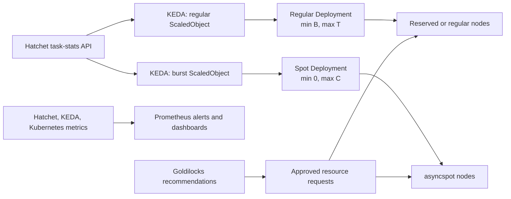

# KEDA-native horizontal scaling full execution plan

## Identity

- **Date:** 2026-08-29
- **Task:** `01a04d8f-4152-7851-b437-bbb08457b450`
- **Plan path:** `project/2026-08-29-pr-5491-keda-horizontal-scaling-plan.md`
- **Planning branch:** `rs/keda-horizontal-scaling-roadmap`
- **Execution branch:** `rs/scaling-replica-ownership`
- **Application target:** `v3`; W0 reuses PR #5491 and preserves dependent
  PR #5492
- **Infrastructure target:** the confirmed `df-cloud-klickeruzh` `stg` flow;
  no infrastructure PR exists for this plan
- **Authoritative application base:** `origin/v3` at `bb495a1b2`, refreshed on
  2026-08-29 before the coordinated W0 integration
- **Infrastructure base inspected:** `df-cloud-klickeruzh` `origin/stg`
- **Audience:** KlickerUZH application, platform, and operations maintainers
- **Status:** Planner-reviewed full execution plan; W0 execution activated by
  the user on 2026-08-29. Merge, deployment, and cluster changes remain
  unauthorized.

## Goal and scope

Make horizontal scaling event-driven and KEDA-native, starting with every
Hatchet worker profile. Each profile gets an explicit capacity contract, a
measured minimum, and a deterministic regular-node ceiling. Eligible excess
work can then use the existing `asyncspot` pool without moving assessment or
control-plane work onto interruptible capacity.

This plan also establishes the metrics needed to explain and tune scaling.
It keeps resource-request tuning in the parallel Goldilocks workstream. A later,
gated package may replace the three remaining CPU-utilization HPAs for HTTP
services with KEDA when better service-level signals are available.

Out of scope are vertical resource recommendations, VPA activation, Hatchet
server replacement, database scaling, cluster creation, and production changes
without separate approval.

## Execution contract

- **Execution owner:** `main` owns architecture, cross-repository sequencing,
  stack topology, integration, review disposition, and evidence. A package may
  use only the route listed in the Delegation Map and still returns integration
  to `main`.
- **Autonomy model:** The 2026-08-29 approval accepts the architecture and this
  full planning pass. The subsequent explicit W0 activation authorizes W0's
  named local edits, checks, reviews, progress updates, commits, stack repair,
  push, and PR update through Gate 2.
- **Boundary owner:** `self` for each active package. Separate proposed tasks
  never become hidden integration owners.
- **Granted now:** Take over and repair W0 in the existing W0/W1 GitHub stack,
  preserve W1 topology without changing its semantics, run repository checks
  and required reviews, commit, push the repaired branches, and update PR #5491
  through Gate 2.
- **Withheld now:** W1 semantic implementation, PR visibility changes, merge,
  staging branch promotion, Argo reconciliation, cluster reads or writes, load
  generation, pod termination, spot eviction, production rollout, node-pool
  changes, and Goldilocks request changes.
- **Planning terminal:** A planner-accepted full plan exists under `project/`,
  with the architecture, stack boundaries, test portfolio, evidence gates,
  approval gates, and next package frozen. The plan remains uncommitted until
  it can ship with the first implementing package rather than in a plan-only PR.
- **Epic terminal:** Every approved Hatchet profile has reached its package's
  required evidence layer, production packages have separately passed A4, and
  W9 records a reviewed migrate/defer decision for eligible HTTP services.
- **Pause:** Stop for a material topology change; an unresolved architecture,
  data-integrity, security, or task-safety decision; a failed evidence gate;
  live behavior that contradicts source assumptions; missing package authority;
  or local/remote stack divergence. Routine slice, commit, review, and progress
  boundaries do not pause an already activated package.

## How to work this plan

- Treat each W-item as one independently reviewable PR-sized package. Reuse the
  named existing PR when one is listed instead of opening a duplicate.
- Work from a freshly fetched base in a task worktree. Application changes base
  on `v3`; platform changes use the repository's confirmed `stg` flow.
- Keep source/render, CI, Argo desired revision, deployed resources, and live
  scaling evidence separate. A green render does not prove live KEDA behavior.
- Land disabled primitives before activation. Enabling a ScaledObject, changing
  Argo ownership, and changing a Deployment's replica ownership must be
  sequenced so that exactly one controller owns replicas at every point.
- Cluster reads, staging activation, production rollout, merge, push, and Argo
  sync retain their normal explicit authority boundaries.

## Resolved questions and assumptions

- **Problem:** “Fully KEDA-native” could mean replacing every existing HPA even
  when no better signal exists.
  **Evidence:** The worker Deployments currently have no scaler, while PWA,
  Manage, and GraphQL already have CPU-utilization HPAs.
  **Decision:** Make every Hatchet worker profile KEDA-managed. W9 evaluates
  HTTP services separately and migrates only when a service-level signal is
  more useful than the existing CPU HPA policy.
- **Problem:** A single Deployment cannot express a guaranteed regular floor
  followed by spot-only excess capacity.
  **Evidence:** Placement preferences do not partition replica ordinals or
  capacity ownership.
  **Decision:** A spot-eligible profile uses separate regular and burst
  Deployments with explicit floors, ceilings, identities, and required
  placement.
- **Problem:** Queue depth can fall while tasks are still occupying worker
  slots.
  **Evidence:** Hatchet exposes queued and running task statistics, while the
  existing Prometheus metrics expose used worker slots.
  **Decision:** Normalize queued plus running demand by explicit slot pools and
  use a distinct-busy-worker Prometheus lower bound only for burst scale-down.
- **Problem:** Goldilocks can change Pod requests independently of horizontal
  limits.
  **Decision:** Goldilocks owns recommendations and approved requests; this
  plan owns slots, floors, thresholds, caps, and placement. A versioned
  capacity artifact joins the two workstreams and blocks stale promotion.
- **Assumptions:** Live KEDA version, CRDs, Hatchet revision, metric labels,
  scrape health, node health, and Secret projection remain unverified until
  E1b. The current floors are the migration baseline, not final optimized
  values. A1 must provide numerical SLO and cost targets before activation.

No formal product grill was required because this work changes deployment and
operational behavior without changing a participant, user, assessment, or
public API contract. The user approved the architecture and roadmap on
2026-08-29; package execution authority remains separate.

## Primitive impact

No product primitive is affected. Existing activities, responses, assessment
semantics, worker task effects, and API contracts must remain behaviorally
equivalent. The plan changes only task-registration profiles, capacity
ownership, placement, and operational evidence. A discovered change to task
effects, response ordering, or externally visible latency policy re-arms the
product-primitive gate.

## ADR gate

- **Decision:** The two-Deployment regular/spot topology, queued-plus-running
  demand source, and narrow Prometheus control dependency pass the ADR gate:
  they are costly to reverse, non-obvious from the manifests, and reject real
  alternatives.
- **Artifact:** [ADR-0043](../docs/adr/0043-keda-managed-hatchet-worker-pools.md)
  records the durable rationale. It remains `proposed` until it ships with the
  first implementing application package.
- **Reopen when:** Hatchet gains enforceable regular-first routing, task-stats
  no longer supplies reliable queued/running state, assessment spot policy is
  reconsidered, or Prometheus becomes the proposed primary queue control path.

## Skill routing

| Concern | Route | Execution effect |
|---|---|---|
| Full-path package planning and delivery | `rs-sliced-development-workflow` | Each W-item carries authority, terminal, checks, reviews, and progress evidence |
| KEDA, Hatchet, Argo, and spot safety | `rs-keda-hatchet-scaling` composed with `rs-k8s` | One replica owner, explicit slots, safe fallback, required placement, and live proof are mandatory |
| Prometheus control and observability | `prometheus-configuration` | Queries remain low-cardinality, tenant/profile isolated, and independently alerted |
| Durable architecture rationale | `domain-modeling` | ADR-0043 owns the reason for the selected topology |
| W0/W1 dependent PRs | `rs-stacked-change` with `gh-stack` | One topology owner, independent green layers, draft discipline, and human landing |
| Research and specialist review | `rs-model-routing` | Repository mapping, external research, planner review, slice reviews, simplification, and final review use their configured roles |

## Research

| Question | Route | Finding | Applicability and limitation |
|---|---|---|---|
| What worker identities, replica owners, selectors, slots, and task hazards exist? | `explore` repository inventory | Three worker Deployments exist; the worker autoscaling switch can omit replicas without creating an owner; slots are SDK defaults; general tasks are heterogeneous | Verified from current application source; implementation must refresh against the then-current `v3` |
| What GitOps, KEDA, Prometheus, Hatchet, and spot capabilities exist? | `explore` infrastructure inventory | Managed KEDA, Prometheus, Hatchet task stats/worker metrics, exact Argo replica-ignore support, External Secrets, and `asyncspot` exist in source | No live cluster read was authorized; E1b must prove deployed versions and health |
| How must KEDA combine demand and fallback? | Context7 plus official KEDA documentation | Multiple triggers max-combine unless `scalingModifiers` supplies a formula; `AverageValue` and fallback behavior must be explicit | Initial source contract is constrained to KEDA 2.16 features and revalidated live |
| How should spot capacity be bounded on AKS? | External primary documentation research | Spot is suitable only for interruptible, retry-safe work and needs explicit taints, tolerations, selectors, caps, and regular fallback | Platform policy keeps assessment and control work off spot |
| How should request recommendations interact with horizontal limits? | Cross-workstream design | Requests and replica arithmetic need one versioned schedulability contract | Goldilocks recommendations remain external evidence until approved |

Primary references are the [KEDA 2.16 ScaledObject
specification](https://keda.sh/docs/2.16/reference/scaledobject-spec/), [KEDA
metrics API scaler](https://keda.sh/docs/2.16/scalers/metrics-api/), [AKS KEDA
add-on](https://learn.microsoft.com/en-us/azure/aks/keda-about), and [AKS spot
node guidance](https://learn.microsoft.com/en-us/azure/architecture/aws-professional/eks-to-aks/node-pools).

## Planning-stage specialist

- **Scope:** The complete architecture, formulas, activation transaction,
  package boundaries, routing map, evidence gates, and approval gates.
- **Findings accepted:** Separate regular/burst residual arithmetic; ordered
  HPA ownership transfer and rollback; `v3-ai` staging boundary; effect-level
  idempotence; live Secret and metric proof; distinct busy-worker occupancy;
  acyclic E1a/E1b gates; separate W8d1-W8d3 production packages; and one owner
  form with an explicit launcher per route.
- **Prior verdict:** `DONE` with no remaining architecture blocker.
- **Full-plan verdict:** `DONE`. The final pass accepted the execution contract,
  ADR disposition, test portfolio, stack topology, and per-package routes with
  no remaining planning correction.

## Recommended target architecture



A spot-eligible profile has two Deployments that register the same bounded task
set and share the same per-pod slot contract:

- The **regular Deployment** has floor `B` and ceiling `T`. It is pinned to
  non-spot capacity. `B` protects registration and latency; `T` is the amount
  of demand the regular pool promises to carry.
- The **spot Deployment** has floor zero and ceiling `C`. It tolerates and
  selects only `asyncspot`. It supplies residual capacity above `T`; Hatchet may
  still assign any eligible task to either pool.
- A critical profile still uses KEDA but has no spot Deployment. Assessment is
  the first such profile.

One Deployment with preferred affinity is not an acceptable substitute. It
cannot guarantee that the first replicas use regular nodes and only later
replicas use spot nodes.

### Capacity arithmetic

For one slot pool, demand is not queue length alone:

```text
demand = queued + running
requiredPods = ceil(demand / slotsPerPod)
regularPods = clamp(B, T, requiredPods)
spotPods = clamp(0, C, ceil(max(0, demand - T * slotsPerPod) / slotsPerPod))
```

Including running work prevents scale-down while all slots are occupied. For a
worker with independent standard and durable slot pools, calculate each pool's
residual before taking the larger result. Let `Ds` and `Dd` be queued plus
running standard and durable demand, `Ss` and `Sd` their per-pod slots, and `Pb`
the number of distinct burst worker IDs currently reporting at least one used
slot:

```text
regularPods = clamp(B, T, ceil(max(Ds / Ss, Dd / Sd)))
spotPods = clamp(0, C, ceil(max(
  max(0, Ds - T * Ss) / Ss,
  max(0, Dd - T * Sd) / Sd,
  Pb
)))
```

KEDA normally combines multiple triggers by taking their maximum. It therefore
must not receive separate queued and running triggers without a composite
formula. Each ScaledObject uses named triggers and
`advanced.scalingModifiers` to implement the formulas above with target `1`.
The composite value is normalized into pod-equivalents and explicitly uses
`metricType: AverageValue`; rendered-manifest fixtures must prove that target
`1` produces the expected replicas. Formula evaluation is bypassed during
fallback. The regular ScaledObject therefore falls back to the static floor
`B`. On KEDA 2.16, the burst ScaledObject falls back to static `C`, preserving
potentially occupied burst capacity at bounded extra spot cost; an alert fires
immediately. A newer current-replica fallback may replace this only after the
live add-on proves its semantics. The chart must remain compatible with the
version proven live; the initial design uses only KEDA 2.16 features.

Aggregate task stats do not identify whether running work is on the regular or
spot pool. The burst ScaledObject therefore has one Prometheus trigger named
`burst_busy_workers`. Its frozen query shape is
`count((sum by(worker_id)(hatchet_tenant_used_worker_slots{tenant_id="<tenant>",worker_name="<burst>"}) > 0))`.
E1b must prove the live metric and label names, that each busy burst Pod emits at
least one distinct positive worker ID, and that the labels isolate the pool.
Multiple internal worker IDs may overcount a Pod, which is safe and bounded by
`C`; sparse occupancy cannot undercount busy Pods. Scale-down stabilization and
graceful drain remain required because a Deployment controller does not know
which individual Pod is idle. W6 is not required for W5; it aggregates demand
for high-fan-out general profiles, not this busy-worker safety metric.

The two Deployments enforce placement and capacity, not “regular-first” task
routing. Hatchet may assign work to any eligible registered worker. Matching
task definitions do not inherently duplicate one run, but retries, lease loss,
termination, and spot eviction can repeat effects. Shared-pool tasks must prove
idempotence at their effect boundary.

The residual formula assumes the regular pool can schedule and keep `T` replicas
ready. That is a capacity promise, not merely a chart value. Goldilocks request
changes therefore trigger a fresh schedulability calculation for every `T` and
`C` before promotion.

### Smart minimum policy

The first migration preserves current production floors: general `2`, live
response `4`, and assessment response `4`. It changes the controller, not the
availability posture. After staging and production observations exist, tune
each floor from these facts:

| Worker class | Minimum policy | Spot policy |
|---|---|---|
| Registration, cron, lifecycle, and control tasks | At least one ready replica for every registered profile; increase only when queue-wait evidence requires it | Regular only |
| Live response processing | Preserve the current floor first; later set the smallest floor that meets queue-to-start latency during normal teaching load | Burst allowed only after idempotence and eviction tests pass |
| Assessment response processing | Preserve the current assessment floor and reserved-node placement | Never spot under the current platform policy |
| Batch and maintenance work | Zero is allowed when Hatchet can retain work until a worker registers and cold-start latency is acceptable | Preferred candidate for spot |

Scale-down stabilization, polling, cooldown, and fallback start conservatively
and are tuned from measured queue wait and scale latency. KEDA 2.16-compatible
fallback is static `B` for regular capacity and static `C` for the retry-safe
burst pool. The latter trades bounded spot cost for active-task preservation and
alerts immediately. Critical work has no burst Deployment.

### Initial worker-profile model

| Profile | Current source | Target topology | Scaling signal |
|---|---|---|---|
| Assessment response | Assessment mode of `hatchet-worker-response-processor` | One KEDA-managed regular Deployment on `klickerasm`; no spot | Assessment task queued plus running, normalized by durable slots |
| Live response | Regular mode of `hatchet-worker-response-processor` | Regular Deployment plus optional spot burst Deployment | Maximum of standard and durable normalized demand |
| General baseline | Lifecycle, audit, cron, notification, and sweep tasks in `hatchet-worker-general` | KEDA-managed regular Deployment with minimum at least one | Aggregate profile demand; no spot initially |
| Live aggregation | Standard live-quiz aggregation tasks currently in the general worker | Separate regular profile; spot only after replay tests | Aggregate queued plus running for the profile |
| Course duplication batch | Globally concurrency-limited duplication task with a 30-minute execution timeout | Scale-to-zero spot only after checkpoint/replay and unavailable-pool behavior are proven; otherwise regular-only batch | Queued plus running; maximum one because extra replicas cannot exceed the global concurrency limit |

Profile separation is intentional. Scaling all general-worker tasks as one pool
would let an infrequent long-running batch task scale replicas that mostly
register unrelated control work. The existing `HATCHET_WORKFLOWS` selector is a
useful seam, but unknown or empty selections must fail closed before it becomes
a deployment contract.

### Metrics and control-plane boundary

Use the Hatchet task-stats API as the primary demand source because the shared
Hatchet version exposes zero-filled per-task queued and running totals.
Prometheus is observational for regular scaling and is one narrow control-path
dependency for burst scale-down through `burst_busy_workers`.

| Metric family | Purpose | Initial source |
|---|---|---|
| Queued and running tasks per worker profile | KEDA desired replicas | Hatchet task-stats API through KEDA `metrics-api` triggers |
| Count of distinct busy worker IDs for the exact burst identity | KEDA burst scale-down lower bound | Prometheus query over the existing Hatchet used-slot gauge; E1b validates pod coverage, labels, semantics, and freshness |
| Queue-to-assignment latency, outcomes, retries, and available slots | SLOs, saturation, and failure diagnosis | Existing shared Hatchet Prometheus metrics |
| ScaledObject readiness/activity, generated HPA status, desired/current replicas, scaler errors | Autoscaling health | KEDA operator and Kubernetes metrics |
| Pending or unschedulable pods, regular and spot node capacity, restarts, eviction reason, scheduling latency | Capacity and spot safety | kube-state-metrics, AKS, and Kubernetes events/metrics |
| Per-profile aggregate demand and API freshness | Reduce high trigger fan-out for general profiles, if needed | Optional low-cardinality adapter introduced only after the pilot proves the need |

The assessment and live-response pilots have few tasks and can call task-stats
directly. The general worker has many task names; two triggers per task and two
Deployments would create excessive polling. Before general-profile activation,
measure this fan-out. If it is material, add one small internal adapter that
caches a single task-stats response, returns aggregate profile JSON directly to
KEDA, and exposes the same low-cardinality aggregates to Prometheus. KEDA should
still query the adapter directly so a Prometheus outage does not become a queue
scaling outage.

### Goldilocks interface

Goldilocks owns resource-request recommendations and any approved request
changes. This plan owns slots, queue formulas, replica floors and ceilings,
placement, and horizontal behavior. Neither workstream silently changes the
other's contract.

After a request change, horizontal scaling must recalculate how many regular
and spot replicas fit on each node pool, then revalidate `T`, `C`, topology
spread, and pending-pod behavior. Slots remain an explicit application
capacity decision; they do not automatically equal CPU requests. VPA
recommendation mode may run in parallel, but VPA Auto/Recreate ownership for
these Deployments is outside this plan.

Each environment keeps a versioned capacity artifact containing the approved
resource requests, standard and durable slots, node allocatable capacity,
reserved system overhead, scheduling limits, floor `B`, regular ceiling `T`,
and burst ceiling `C`. A Goldilocks change creates a new artifact version and
blocks promotion until schedulability is recalculated; it never silently edits
slot arithmetic.

### Replica-ownership activation transaction

Disabled primitives may merge safely. An Argo replica-ignore exception must not
remain as steady state for a static target; it is allowed only inside the
paused, monitored transaction below. Activate one target at a time.

| State | Deployment manifest | KEDA state | Argo state |
|---|---|---|---|
| Before | Explicit static replica value | No active ScaledObject/HPA | No replica-ignore exception |
| Active | `spec.replicas` omitted | ScaledObject Ready and generated HPA owns the exact target | Exact `/spec/replicas` ignore active with `RespectIgnoreDifferences=true` |
| Rollback complete | Safe static replica value restored | ScaledObject removed or disabled | Exact exception removed |

| Step | Authorized action | Expected live owner and evidence | Compensation if the expectation fails |
|---|---|---|---|
| 0 — Preflight | Record exact app and infrastructure revisions. Require Argo `Synced`/`Healthy`, live static count `B`, no ScaledObject/HPA, no exact ignore, projected W3a Secret keys, and a green W3b capacity check. | The Deployment's static `spec.replicas: B` is the only owner. | Stop without mutation. |
| 1 — Hold reconciliation | Pause auto-sync for the one Argo Application under A2. | Live static `B` remains the only owner; Argo reports the intentional hold. | Resume auto-sync and stop. |
| 2 — Stage desired app state | Merge the approved content-equivalent activation and generated promotion into current `v3-ai` while auto-sync is paused. Do not sync it yet. | Live remains static `B`; desired app revision is OutOfSync and contains the ScaledObject plus a Deployment manifest without replicas. | Revert the activation source, wait for the static desired revision, resume auto-sync, and stop. |
| 3 — Stage Argo ownership | Apply W3a with the one exact target ignore and Secret projection. Keep auto-sync paused. | Live remains static `B`; the exact ignore is active only inside this transaction. | Remove the ignore, revert the app activation, verify static desired/live `B`, resume auto-sync, and stop. |
| 4 — Transfer ownership | Manually sync the recorded activation revision. | Static `B` remains until KEDA creates the generated HPA; then the HPA becomes the only active replica controller. ScaledObject is Ready/Active as expected, and Argo reports no replica drift. | Keep auto-sync paused and run the rollback sequence below. |
| 5 — Commit active state | Verify demand metric, desired/current/ready replicas, exact HPA target, Argo `Synced`/`Healthy`, and no second HPA/ScaledObject. Resume auto-sync. | HPA remains the only replica controller; exact Argo ignore and `RespectIgnoreDifferences=true` remain active. | Pause auto-sync again and run rollback. |

Rollback from step 4 or later is also ordered: keep auto-sync paused; sync the
recorded rollback app revision so the ScaledObject is removed while the Argo
replica ignore remains active; wait until KEDA deletes the generated HPA and
verify no autoscaler targets the Deployment; only then set the live Deployment
to safe static `B`; remove the exact Argo ignore through W3a; sync and verify
desired/live static `B`; then resume auto-sync. Never write static `B` while the
HPA exists. The live scale action, Argo pause/manual sync, and
infrastructure update are named cluster changes and require A2. Stop and
escalate if a target has zero or two controllers, an unexpected revision is
selected, the HPA is not Ready, self-heal fights the HPA, or rollback cannot
restore static `B`.

Staging is a separate delivery branch boundary. Infrastructure currently tracks
`v3-ai`, and `STG_SOURCE_BRANCH` is explicitly `v3-ai`; an unset variable would
default to `v3`. Work merged only to `v3` is therefore not staging evidence.
Staging activation requires a separately approved, content-equivalent sync to
the selected source branch and its generated promotion workflow. Do not retarget
Argo or change `STG_SOURCE_BRANCH` as an implicit implementation step.

## Planning snapshot and takeover evidence

| Area | Verified source state | Consequence |
|---|---|---|
| Freshness | Plan authoring started at `f0659e130`. W0 execution refreshed `origin/v3` through `bb495a1b2`; the four newer commits change devcontainer/runtime and final-review tooling plus deployment-wiki text outside W0's ownership section. A merge-tree check resolves the wiki overlap cleanly. The primary checkout was not used or mutated. | Progress and forge readback, not the original planning SHA, own current execution state. Recheck before any later package mutates the repository. |
| Worker Deployments | `deployment-hatchet-workers.yaml` renders general, live-response, and assessment-response Deployments. Values default to one static replica and expose an `autoscaling.enabled` switch. | There are three current workload identities, not yet explicit scaling profiles. |
| Replica ownership | Enabling a worker's current autoscaling switch omits `spec.replicas`, but no worker HPA or ScaledObject template exists. The three existing HPAs cover only PWA, Manage, and GraphQL. | The switch currently creates an ownerless Deployment and must not be enabled. |
| Production placement | Production values request `2/4/4` worker replicas. Assessment is pinned to the reserved `klickerasm` pool. General and response values declare topology spread, but the worker template does not render it. | Preserve floors and assessment placement; repair topology spread before scaling out. |
| Runtime capacity | Current code does not pass SDK `slots` or `durableSlots`; the pinned Hatchet TypeScript SDK 1.9.4 defaults to `100/1000`. Current worker code also lacks Kubernetes health probes and a complete explicit drain contract. | Queue-to-replica arithmetic is unsafe until slots and lifecycle are explicit. |
| Existing Klicker PRs | PR [#5491](https://github.com/uzh-bf/klicker-uzh/pull/5491) adds replica-ownership checks. Stacked PR [#5492](https://github.com/uzh-bf/klicker-uzh/pull/5492) adds worker capacity, probes, and termination handling. They were conflict-blocked at plan authoring. The coordinated takeover restored mergeability and kept #5492 based on the exact published #5491 head. | `main` remains the single stack topology owner. W0 publication must be merge-propagated into W1 without changing W1 semantics. |
| Hatchet service | Klicker values target the shared Hatchet service. The inspected infrastructure source pins shared Hatchet `v0.98.9`, whose API includes task stats and whose chart enables engine Prometheus metrics. | This is suitable source-level prior art, but live version, endpoint behavior, auth, and scrape health remain an activation gate. |
| KEDA and spot | The AKS source enables the managed KEDA add-on. It defines a tainted, labelled `asyncspot` pool with autoscaling `1..3` and explicitly excludes exam-critical/control/stateful work. | Spot is available only for retryable, idempotent worker profiles. |
| Argo ownership | The infrastructure repo has an accepted exact-target `/spec/replicas` ignore helper and `RespectIgnoreDifferences=true`, but the Klicker Argo profile does not use it. | Every enabled KEDA target needs an exact Deployment-name entry before Argo self-heal is safe. |
| Metrics | The shared Hatchet chart enables low-level Prometheus metrics and ServiceMonitors. Klicker workers expose no application Prometheus endpoint today. Native Hatchet metrics do not provide the per-profile queue aggregate needed by the proposed formulas. | Start from task stats plus existing platform metrics; add only low-cardinality profile metrics where they remove a measured gap. |

No live cluster read was authorized or performed for this plan. Infrastructure
source state is not proof of the deployed KEDA version, Hatchet revision,
Prometheus scrape state, node readiness, or Argo configuration.

## Non-negotiables

### Scaling correctness

- Every Deployment has exactly one replica owner: static Git values or one
  KEDA-generated HPA, never both and never neither.
- Demand includes queued and running work. Independent slot pools use the
  maximum normalized demand. KEDA formulas are fixture-tested at boundaries.
- Slot counts, worker identity, task profile, and minimum are explicit and
  validated. Unknown task-profile configuration fails closed.
- Assessment remains on reserved regular nodes and never receives a spot
  toleration or selector.
- Regular thresholds are backed by schedulable capacity after Goldilocks
  changes; spot is residual capacity, not a substitute for the guaranteed floor.

### Operational safety

- Spot eligibility requires task idempotence or replay safety, graceful
  termination, bounded retry behavior, and an eviction test.
- ScaledObjects have safe static fallbacks, bounded maxima, stabilization, and
  alerts for metric or scheduling failure.
- Argo ignore rules list exact Deployment names and only `/spec/replicas`; no
  wildcard or broad resource ignore is accepted.
- Metrics and labels stay low-cardinality. Do not expose task payloads,
  participant identifiers, tokens, or unbounded workflow/run IDs.
- Activation is progressive: source/render proof, staging baseline, staged
  demand, spot interruption, then production canary. Rollback is disabling the
  ScaledObject and restoring an explicit safe replica count.

## Known traps

| Symptom | Cause | Required remedy |
|---|---|---|
| Worker stays at its minimum while queued and running are both high | KEDA took the maximum of separate triggers instead of their sum | Use named triggers and a tested `scalingModifiers` formula |
| Pods oscillate or scale down during long tasks | Formula uses queue depth but omits running work, or cooldown is too short | Include running totals and add measured scale-down stabilization |
| Argo repeatedly resets KEDA's replica count | Deployment replicas remain Git-owned or Argo lacks the exact ignore rule | Omit `spec.replicas` and add exact `/spec/replicas` ignore with `RespectIgnoreDifferences=true` |
| “Burst” replicas still land on regular nodes | One Deployment uses preferred affinity instead of separate templates | Use a distinct spot Deployment with required selector and toleration |
| Spot never starts below the threshold even when regular pods cannot schedule | Residual formula subtracts promised regular capacity, but `T` is not actually schedulable | Prove regular capacity, alert on pending regular pods, and lower `T` or increase guaranteed capacity |
| A busy burst Pod is terminated after total demand falls below the regular threshold | Aggregate task stats cannot show which pool owns running work | Include used burst slots as a lower-bound metric, stabilize scale-down, drain gracefully, and allow spot only for retry-safe work |
| Scaling creates no throughput | SDK slot defaults are larger than real CPU/memory capacity, or Hatchet global concurrency is the bottleneck | Set explicit slots and test throughput; retain intentional global limits |
| More response replicas change the recorded “first response” time | The live-response Redis path uses `HSET` where the assessment path uses `HSETNX`, so concurrent writers can race | Resolve or prove harmless the first-writer invariant before increasing live-response concurrency |
| General-worker scaler floods Hatchet API | Every task/state/profile/Deployment becomes a separate polling trigger | Measure pilot fan-out; introduce one cached profile adapter before general activation if needed |
| A PodDisruptionBudget blocks node scale-down but does not protect spot eviction | PDB expectations are applied to involuntary spot loss | Keep the reliable floor on regular nodes; avoid restrictive PDBs on disposable burst Deployments |
| Green manifests are reported as live autoscaling proof | Source/render, Argo, and runtime evidence were conflated | Record each proof layer separately and require a controlled staging exercise |

## Delivery topology

GitHub stacked PRs are enabled for this repository. Only W0/W1 form one stack:
they already exist as dependent PRs and share one topology owner. Later packages
are sequential PRs or cross-repository packages because live observation and
promotion gates must close between them; converting those packages into one
long stack would make the lower layers unsafe to land independently.

```yaml
feature: KEDA Hatchet worker foundations
provider: github
base: v3
mode: guided
layers:
  - id: W0
    name: scaling-replica-ownership
    branch: rs/scaling-replica-ownership
    pr: https://github.com/uzh-bf/klicker-uzh/pull/5491
    work_package: Every rendered Deployment has exactly one static or autoscaler owner
    responsibility: Repair and extend the chart ownership invariant for future ScaledObjects
    depends_on: v3
    reviewer: deployment and GitOps maintainers
    attention: judgment-heavy
    reviewer_focus:
      - Exact static-versus-autoscaled ownership across all rendered environments
      - No unrelated Playwright file diff remains; commit `203fc6417` is retained
        only as reverted public history because W0 does not authorize rewriting
    validation:
      - Ownership checker positive and negative fixtures
      - Base, staging, and production Helm renders
      - Repository-native check suite at this layer tip
    activation: inert
    risk: high
    size_signal: 350-500 human-authored lines across 12-15 files, excluding the plan; genuinely one work package because chart normalization and the checker implement one indivisible ownership invariant
  - id: W1
    name: hatchet-worker-runtime-contract
    branch: rs/hatchet-worker-runtime-contract
    pr: https://github.com/uzh-bf/klicker-uzh/pull/5492
    work_package: Workers expose explicit capacity, identity, health, and drain behavior
    responsibility: Reconcile the shared runtime contract, worker consumers, and Helm probes
    depends_on: W0
    reviewer: Hatchet runtime and deployment maintainers
    attention: judgment-heavy
    reviewer_focus:
      - Slot and identity semantics remain explicit and mode-correct
      - Health, signal handling, grace, and deployment probes form one lifecycle contract
    validation:
      - Focused runtime and mode tests
      - Worker builds and Helm renders
      - Repository-native check suite at this layer tip
    activation: inert
    risk: high
    size_signal: 700-1000 human-authored lines across 18-22 files, excluding the plan; genuinely one work package because splitting runtime state from worker wiring or probes would leave an independently misleading safety contract
follow_up_stacks:
  - W2 disabled KEDA application primitives as one inert ordinary PR
  - W3a GitOps/auth, W3b capacity, and W3c observability as separately landed cross-repository packages
  - W4 and W5 as separate pilot PRs with an observation gate between them
  - W6 when armed, then W7 general profiles as separate application PRs
  - W8a, W8b, W8c, W8d1, W8d2, and W8d3 as sequential production PRs
  - W9 as a decision package; any accepted HTTP migration receives a new plan
```

Gate 2 applies after the repaired W0 layer because replica ownership is a
shared deployment-safety foundation. Both PRs were non-draft and
conflict-blocked at plan authoring; the activated takeover now authorizes their
named stack repair and PR update through Gate 2. Gate 3 presents both
independently green layers bottom-up. Gate 4 is human landing through GitHub;
this plan never authorizes merge.

| Milestone | Packages | Boundary and reason |
|---|---|---|
| M0 — Foundation stack | W0-W1 | One GitHub stack and one worktree; W1 depends directly on W0 |
| M1 — Disabled control plane | W2, then W3a, W3b, W3c | Separate application/infrastructure PRs; source can land inert, while live projection and capacity gates close in order |
| M2 — Narrow staging pilots | W4, then W5 | Assessment proves regular ownership before live-response spot behavior is introduced |
| M3 — General worker profiles | W6 only if armed, then W7 | Polling evidence decides whether the adapter exists; W7 consumes exactly one metrics path |
| M4 — Production | W8a, W8b, W8c, W8d1, W8d2, W8d3 | Each PR gets its own activation, rollback, observation, and A4 decision |
| M5 — HTTP decision | W9 | Research-only migrate/defer decision; no scaler implementation |

At each pre-open gate, recompute substantive lines and files from the actual
branch. These size signals are planning diagnostics, not targets.

## Feature-wide test portfolio

| Consequential behavior or risk | Existing protection | Test obligation | Primary stable seam and distinct failure | Owner |
|---|---|---|---|---|
| Exactly one replica owner | PR #5491 checker and Helm renders, not current `v3` | Replace/consolidate during recovery | Rendered manifest ownership graph; catches ownerless, dual-owned, duplicate, and missing targets | W0, W2, W3a |
| Explicit worker slots, identity, health, and drain | PR #5492 tests, not current `v3` | Replace/consolidate during recovery | Runtime resolver and lifecycle integration; catches implicit defaults, wrong mode, premature readiness, and unordered exit | W1 |
| Queued-plus-running standard/durable arithmetic | No current KEDA formula suite | Add new | Parsed ScaledObject fixtures; catches max-versus-sum errors, wrong normalization, caps, and scale-down during running work | W2 |
| KEDA fallback and partial metric failure | No current worker scaler | Add new | Formula/fallback fixture table; catches loss of regular floor or burst capacity during source failure | W2 |
| Assessment never selects or tolerates spot | Static assessment selector plus source inspection | Extend existing rendered checks | Base/staging/production Helm output; catches accidental burst or `asyncspot` placement | W2, W4, W8a |
| Busy burst Pods cannot be undercounted | Hatchet used-slot metric exists; exact query unproven | Add new and live proof | Sparse-occupancy formula fixture plus live worker-ID-to-Pod mapping; catches aggregate occupancy undercount | W2, W3c, W5 |
| Secret-backed URLs, bearer auth, and PromQL never enter public values | Existing External Secret patterns | Add new | Rendered Secret references and values-free live probe; catches credential/path exposure or unusable TriggerAuthentication | W3a |
| Floors, thresholds, caps, slots, and Goldilocks requests remain schedulable | No joined machine-readable contract | Add new | Capacity artifact checker; catches stale limits after request or node-capacity changes | W3b |
| Live-response duplicate delivery preserves external effects | Existing response tests do not prove scaled duplicate concurrency | Extend existing | Redis first-writer and handler integration seam; catches timestamp overwrite or repeated effects | W5 |
| Every general task belongs to one fail-closed profile | Selector exists but is not a deployment-profile registry | Add new | Profile registry table; catches missing, duplicate, empty, or unknown membership | W7 |
| Scale-from-zero discovers and completes retained work | No current KEDA worker profile | Add live contract proof | Hatchet submission-to-completion exercise at zero workers; catches undiscoverable tasks or failure to wake | W7 and W8d3 |
| Ownership transfer and rollback never create zero or two controllers | Existing Argo helper pattern only | Add source contract and live exercise | Activation state-table test plus live HPA deletion ordering; catches Argo/KEDA fights and unsafe static writes | W3a, W4, W5 |
| Direct task-stats polling stays within budget | No current trigger inventory | No new test unless E4 arms W6 | Measured request rate, p95, and errors; catches excessive polling before general activation | E4, W6 |
| Dashboards and alerts isolate metric, capacity, and workload failure | Existing broad platform monitoring | Extend existing | Prometheus rule tests and values-free live target evidence; catches mixed tenant/profile labels and silent scaler failure | W3c |

No UI or browser test is required because this plan changes no frontend or
user-facing contract. Any later HTTP scaling package defines its own load and
service-level test portfolio.

## Work packages and tracer-bullet slices

### W0 — Recover the replica-ownership foundation

- **Priority:** P0; blocks every KEDA target.
- **Route:** `main` in the existing W0/W1 stack worktree.
- **Execution-tier skip reason:** Critical-path coupling and exclusive stack
  topology ownership.
- **Acceptance:** Current-base ownership checker and negative fixtures pass for
  base, staging, and production renders; the W0 PR tip is independently green,
  safe to land, and its final tree contains no unrelated change. Reverted
  Playwright commit `203fc6417` remains in public ancestry because force-push
  history rewriting is outside W0 authority.
- **Test obligation:** Replace/consolidate the replica-owner portfolio row.
- **Commit:** W0 activation created ADR-0043 and this plan as separate commits
  before the local reconstruction. A concurrent remote repair was then adopted;
  preserving its public stack history appends those documentation commits after
  the repair. This is an explicit ordering exception, not authority to rewrite.
  Preserve useful package commits and add focused progress commits without
  rewriting history unless explicitly authorized.
- **Problem:** Current `v3` can omit worker replicas without rendering a scaler.
  Existing PR #5491 addresses the broader chart invariant but is stale and open.
- **Do:** Take over PR #5491, rebase its intent onto fresh `v3`, retain the
  static-versus-scaled invariant, extend its checker design to recognize future
  ScaledObjects, and remove unrelated historical changes if they are no longer
  needed. Do not merge it as-is without a current diff review. Designate `main`
  as topology owner for both W0 and W1; no other task may
  independently rebase, reorder, merge, or restack either layer.
- **Check:** Base, staging, and production renders give every Deployment exactly
  one owner. Negative fixtures catch ownerless, dual-owned, duplicate-target,
  and invalid target references. The existing three HPAs render valid
  `autoscaling/v2` resources.
- **Working context:** Reuse branch `rs/scaling-replica-ownership` and PR #5491;
  target `v3`.
- **Authority and terminal:** Local repair, repository checks, review, and PR
  update require the normal takeover approval. Terminal is reviewed `pr_ready`;
  merge and deployment remain separate.
- **Boundary owner:** Klicker deployment maintainers.
- **Release note:** Internal deployment safety; no user-facing note.
- **Depends on / gates:** Fresh-current-head review; no cluster access required.

### W1 — Recover the explicit Hatchet worker runtime contract

- **Priority:** P0; blocks formula calibration and spot safety.
- **Route:** `main` under the same exclusive stack topology owner as W0.
- **Execution-tier skip reason:** Critical-path coupling across runtime,
  lifecycle, deployment probes, and the recovered lower stack layer.
- **Acceptance:** Runtime and mode tests, worker builds, Helm renders, and the
  repository-native suite pass at the W1 tip; current-head review confirms the
  explicit capacity/lifecycle contract and no unrelated inherited diff.
- **Test obligation:** Replace/consolidate the explicit-runtime portfolio row.
- **Commit:** Keep W1 as one stack layer with focused runtime, worker-wiring,
  deployment, documentation, and progress commits. Any lower-layer correction
  lands in W0 and propagates through the stack-aware rebase procedure.
- **Problem:** `v3` relies on SDK slot defaults and lacks explicit readiness and
  drain behavior. PR #5492 contains reviewed prior work and is stacked on W0.
  It was conflict-blocked at plan authoring; the coordinated takeover restored
  its topology without reopening W1 semantics.
- **Do:** Reconcile PR #5492 after W0. Preserve explicit standard and durable
  slots, distinct worker identities, health endpoints, exec-form process
  startup, readiness-before-exit ordering, and termination grace. Re-evaluate
  the prior `100/1000` preservation decision against measured capacity; do not
  silently change it in this package.
- **Check:** Focused tests prove fail-closed slot parsing, per-mode identity,
  exact task registration, liveness/readiness transitions, and signal ordering.
  Helm renders prove probes, ports, grace periods, and unchanged replica
  ownership. Execute a bounded Hatchet disconnect and pod-termination test in
  staging before claiming live drain safety. Record that a fixed 90-second grace
  cannot make a 30-minute task safe; such a task needs checkpoint/replay or must
  remain off spot.
- **Working context:** Reuse branch `rs/hatchet-worker-runtime-contract` and PR
  #5492 after W0; target W0's branch until the stack is restacked onto `v3`.
- **Authority and terminal:** Source repair can end `pr_ready`. Staging runtime
  proof needs explicit cluster and deployment approval. Required delivery is
  `live_proven`; the package parks at `delivery_pending` after PR readiness until
  that authority exists.
- **Boundary owner:** Hatchet worker maintainers.
- **Release note:** Internal worker reliability and capacity contract.
- **Depends on / gates:** W0 under the same stack topology owner; E1a source
  contract and E1b live runtime evidence; A2 for the staging proof layer.

### W2 — Add disabled KEDA chart primitives and formula tests

- **Priority:** P1; creates the reusable application-side control plane.
- **Route:** `main` on a fresh application branch after W0/W1 land.
- **Execution-tier skip reason:** Architecture and cross-system seam decisions
  couple formula semantics, replica ownership, Secret references, and placement.
- **Acceptance:** The parsed Helm fixture matrix proves every formula, owner,
  fallback, target, placement, PDB, and assessment no-spot invariant on a
  KEDA-2.16-compatible disabled render; repository checks are green.
- **Test obligation:** Add the formula, fallback, assessment-placement, and
  sparse-burst portfolio rows; extend the owner checker.
- **Commit:** Separate chart/schema implementation, executable fixtures, and
  plan/progress documentation into coherent conventional commits within one
  ordinary PR.
- **Problem:** The chart has no ScaledObject or TriggerAuthentication templates,
  no queue formula contract, and no deterministic regular/spot topology.
- **Do:** Add a values schema for profiles, floors, regular ceilings, burst
  ceilings, task names, slot pools, fallback, and HPA behavior. Render regular
  and optional spot Deployments plus KEDA resources, all disabled by default.
  Reference the dedicated W3a TriggerAuthentication Secret contract: values
  name only a profile-specific URL Secret key, while the Secret contains the
  full tenant path with explicit `taskNames` plus the bearer credential. Never
  render either value. Burst values also name a Secret key containing the full
  tenant-scoped `burst_busy_workers` PromQL query. Render topology spread and
  required node placement for both templates. Set `metricType: AverageValue`
  explicitly.
- **Check:** Formula fixtures enumerate zero, boundary, saturation, long-running,
  mixed standard/durable, zero-residual, cap, scale-from-zero, regular fallback
  to `B`, burst metric failure to `C`, partial-trigger failure, asymmetric regular/spot
  failure, unschedulable-regular, and residual-burst cases. Fixtures parse the
  rendered manifests and prove AverageValue target `1` semantics. Helm checks
  assert exact replica ownership, exact target names, no spot fields on
  assessment, required spot fields only on burst, KEDA 2.16-compatible CRDs,
  burst busy-worker lower-bound wiring, and PDB values that remain satisfiable
  at each floor. A sparse-occupancy fixture with two busy burst Pods and one task
  each requires at least two replicas. A synthetic chart failure proves
  activation cannot omit its scaler.
- **Working context:** New `rs/keda-worker-chart-primitives` branch from the
  integrated W0/W1 head; target `v3` through the approved stack topology.
- **Authority and terminal:** Deliver disabled source and render evidence at
  `pr_ready`; no environment activation.
- **Boundary owner:** Klicker chart maintainers.
- **Release note:** Internal KEDA capability, disabled by default.
- **Depends on / gates:** W0, W1, and E1a's frozen Secret key/authentication
  contract. W3a implements it after W2 freezes target names; E1b live
  compatibility blocks activation, not this disabled source package.

### W3a — Add disabled Argo ownership and KEDA authentication primitives

- **Priority:** P1; blocks every environment activation.
- **Route:** `separate task (proposed)` in the infrastructure repository;
  `main` launches it only after explicit W3a authorization and integrates the
  cross-repository result.
- **Acceptance:** Infrastructure tests prove exact Argo targets and
  values-free Secret projection; the authorized live probe closes E1b without
  exposing values, and source remains inert until activation.
- **Test obligation:** Add the Secret/auth and activation-state portfolio rows.
- **Commit:** Keep exact replica-ignore support, Secret projection, source
  tests, and progress evidence in one infrastructure PR with reviewable commits;
  deployment evidence updates that PR only when authority exists.
- **Problem:** The Klicker Argo profile lacks KEDA replica ownership, while KEDA
  also needs a task-stats tenant path and bearer credential without exposing
  either in public values.
- **Do:** In `df-cloud-klickeruzh`, add an exact-target Argo helper invocation
  behind an empty-by-default autoscaled-target list. Add a dedicated External
  Secret contract that projects one full environment-specific Hatchet
  task-stats URL per profile, including explicit task names, plus the bearer
  token and each tenant-scoped burst busy-worker PromQL query for
  TriggerAuthentication. Prove the
  deployed KEDA metrics-api authentication syntax with a values-free prototype;
  do not copy credentials or tenant identifiers into chart values or logs.
- **Check:** Unit tests assert exact Deployment names, only
  `/spec/replicas`, `RespectIgnoreDifferences=true`, and an empty default list.
  Secret-delivery tests assert key names and sources without values. The
  activation state-table test rejects an active ignore exception for a static
  target and rejects a ScaledObject target absent from the exact list.
- **Working context:** New `rs/klicker-keda-replica-ownership` branch in
  `df-cloud-klickeruzh`, from fresh `stg`; target that repository's confirmed
  integration branch.
- **Authority and terminal:** Required delivery is `live_proven`, but work parks
  at `delivery_pending` after reviewed IaC until the activation transaction has
  explicit cluster authority. Any Argo, External Secret, or KEDA change gets a
  **Cluster-level changes** summary.
- **Boundary owner:** GitOps platform maintainer; `main` owns the
  cross-repository activation order.
- **Release note:** Internal GitOps and KEDA authentication contract.
- **Depends on / gates:** W2 target names, E1a interface evidence, and A2 for
  live projection and activation proof. Successful deployment closes E1b.

### W3b — Establish the versioned capacity artifact

- **Priority:** P1; closes E2 and blocks every pilot.
- **Route:** `main` after W3a closes E1b and A1 supplies numerical limits.
- **Execution-tier skip reason:** Cross-workstream coupling between Goldilocks,
  AKS capacity evidence, slots, and rendered deployment contracts.
- **Acceptance:** `node util/check-klicker-keda-capacity.mjs` passes against
  base, staging, and production renders and its drift fixtures fail for stale
  requests, slots, or caps; the schema-v1 artifact records evidence revisions.
- **Test obligation:** Add the schedulable-capacity portfolio row.
- **Commit:** Add the schema-v1 artifact and checker together, then record
  verified evidence and progress in a separate documentation commit.
- **Problem:** Floors and ceilings have no single machine-checked contract that
  joins Goldilocks requests, worker slots, and node-pool capacity.
- **Do:** Add `deploy/scaling/hatchet-capacity.yaml` with `schemaVersion: 1` and
  an `artifactVersion` containing the evidence date and source revisions. For
  each environment and profile, record approved CPU/memory requests, standard
  and durable slots, placement, `B`, `T`, and `C`. Record node allocatable
  capacity, reserved overhead, max Pods, and the Goldilocks recommendation
  reference. Add `util/check-klicker-keda-capacity.mjs` to compare this artifact
  with base/staging/production Helm renders and reject unversioned drift.
- **Check:** The checker proves requests, slots, placement, floors, and ceilings
  match rendered manifests; sums all regular `T` values against guaranteed
  allocatable capacity; checks burst `C` against approved spot capacity; and
  fails after a fixture changes a request, slot, or cap without a new artifact
  version. W4-W8d3 run this exact checker.
- **Working context:** New `rs/keda-worker-capacity-contract` branch in
  KlickerUZH after W2; target `v3`.
- **Authority and terminal:** Reviewed `pr_ready` artifact and checker. Values-free
  cluster and Goldilocks reads need explicit read authority; node or request
  changes are not part of this package.
- **Boundary owner:** Klicker deployment maintainer with AKS capacity and
  Goldilocks evidence owners.
- **Release note:** Internal worker-capacity contract.
- **Depends on / gates:** E1b and A1. This package closes E2.

### W3c — Establish the observability baseline

- **Priority:** P1; blocks pilot SLO and scaling-health claims.
- **Route:** `separate task (proposed)` in the infrastructure repository;
  `main` launches it only after explicit W3c authorization.
- **Acceptance:** Prometheus rule tests isolate tenant, profile, and worker
  identity; values-free live evidence proves scrape freshness and worker-ID
  coverage; dashboards distinguish metric, capacity, and workload failure.
- **Test obligation:** Extend platform monitoring and add the sparse busy-worker
  query contract from the portfolio.
- **Commit:** Keep query/rule tests with their rules, dashboard changes with
  their provisioned source, and live evidence/progress in reviewable commits in
  one infrastructure PR.
- **Problem:** Existing metrics do not yet provide the exact burst busy-worker
  control query, worker-profile SLO dashboard, and independent failure alerts.
- **Do:** In one `df-cloud-klickeruzh` PR, add only missing low-cardinality
  KEDA/Hatchet dashboards, the exact `hatchet_tenant_used_worker_slots`-based
  `burst_busy_workers` query, and alerts. Link
  the W3b artifact as the capacity source. Document `asyncspot` eligibility and
  the Goldilocks recalculation hook. Do not resize a node pool.
- **Check:** Read-only live evidence records Prometheus targets, exact metric and
  label names, worker-ID-to-Pod coverage, metric freshness, current regular/spot capacity, and
  Argo options without secret values. Dashboards distinguish metric, capacity,
  and workload failure; fixtures prove the busy-worker query cannot mix regular,
  burst, tenant, or profile identities and cannot undercount sparse occupancy.
- **Working context:** New `rs/klicker-keda-observability-baseline` branch in
  `df-cloud-klickeruzh`, from fresh `stg`; target its confirmed integration
  branch.
- **Authority and terminal:** Required delivery is `live_proven`, with
  `delivery_pending` allowed while dashboard/alert deployment lacks authority.
  Live Prometheus or alert changes get a **Cluster-level changes** summary.
- **Boundary owner:** Observability and AKS capacity maintainers.
- **Release note:** Internal scaling observability baseline.
- **Depends on / gates:** W3b, E1b, E2, and A1.

### W4 — Pilot assessment as regular-only KEDA

- **Priority:** P1; safest end-to-end worker pilot because its placement is
  strict and its task set is narrow.
- **Route:** `main` because staging activation, rollback, and assessment policy
  remain cross-system external-effect boundaries.
- **Execution-tier skip reason:** External side effects and critical-path
  coupling to E1b, E2, A1, A2, Argo, and assessment placement.
- **Acceptance:** The recorded staging exercise proves idle floor, queued and
  running demand, maximum, fallback, drain, recovery, exact HPA ownership,
  Argo health, queue SLO, and absence of any spot placement.
- **Test obligation:** Extend the assessment no-spot render invariant and add
  the authorized live ownership/fallback evidence; no duplicate unit test.
- **Commit:** Keep disabled source/value support separate from the explicitly
  authorized staging activation/progress evidence. Do not commit generated
  promotion output before its named approval.
- **Problem:** Assessment is statically replicated and has no demand-based
  scaling, but moving exam-critical work to spot would violate the platform
  policy.
- **Do:** Enable only the assessment regular ScaledObject in staging. Keep its
  reserved `klickerasm` selector, floor, bounded maximum, fallback floor, and
  conservative scale-down. Use task-stats queued plus running durable demand.
  Production remains unchanged until the staging evidence gate passes.
- **Check:** Exercise idle floor, queued demand, running-only demand, maximum,
  metric outage fallback, Hatchet outage, rolling termination, and recovery.
  Prove the generated HPA owns replicas, Argo stays Synced, no assessment Pod
  can tolerate/select `asyncspot`, and queue-to-assignment latency meets A1.
- **Working context:** New `rs/keda-assessment-pilot` source branch after
  W2/W3a/W3b/W3c; target `v3`. Live proof also requires the separately approved
  content-equivalent transition to current staging source `v3-ai` and its
  generated promotion.
- **Authority and terminal:** Required delivery is `live_proven`; the package
  parks at `delivery_pending` after PR readiness. Merge, staging branch sync,
  activation, controlled task generation, and pod termination need explicit
  approval. Production is not part of this package.
- **Boundary owner:** Assessment service owner with platform operations.
- **Release note:** Operational assessment-worker scaling; no product behavior
  change.
- **Depends on / gates:** W1-W3c, E1b, E2, A1, A2, and a reviewed activation and
  rollback runbook.

### W5 — Pilot live-response regular plus spot burst

- **Priority:** P1 after W4 proves the control path.
- **Route:** `main` because response integrity, Redis first-writer semantics,
  mixed pool ownership, and spot eviction require integrated judgment.
- **Execution-tier skip reason:** Data-integrity risk, architecture seams, and
  external cluster effects.
- **Acceptance:** Staging evidence proves demand below/at/above `T`, mixed slot
  arithmetic, residual spot scaling, distinct busy-worker protection, bounded
  fallback, duplicate-safe effects, controlled eviction recovery, and rollback.
- **Test obligation:** Extend the response-effect seam and add the mixed-pool,
  sparse occupancy, and live eviction evidence from the portfolio.
- **Commit:** Land response-effect correctness before enabling burst behavior;
  keep regular/burst chart values, fixtures, and progress as reviewable commits
  in one pilot PR. Live evidence follows only under A2.
- **Problem:** Live-response workers need low latency during normal use and
  inexpensive burst capacity, but standard and durable tasks use independent
  slot pools and spot interruption can replay work.
- **Do:** Prove idempotence and retry behavior for both response paths. Enable a
  regular Deployment with preserved floor and threshold `T`, then a scale-zero
  burst Deployment on `asyncspot` using the residual formula. Give regular and
  burst distinct worker identities for metrics while registering the same
  bounded task profile. Require an atomic first-writer implementation or a test
  proving concurrent and duplicate delivery preserves the intended
  `firstResponseReceivedAt` invariant; an unresolved race blocks activation.
  Add the exact `burst_busy_workers` Prometheus lower bound so occupied burst
  capacity cannot voluntarily scale to zero merely because total demand crossed
  below `T`.
- **Check:** Formula fixtures cover each slot pool independently and together.
  In staging, drive demand below, at, and above `T`; prove regular replicas cap
  at `T`, spot scales only to supply residual capacity above `T`, and controlled duplicate
  delivery leaves each external effect correct. A forced spot eviction must
  recover within the agreed SLO. Let total demand cross below `T` while a burst
  task remains active and prove voluntary scale-down waits for drain. Prove
  metric failure keeps the regular floor, sets burst to bounded `C`, alerts,
  exercises the documented burst-retry path, and recovers without effect
  corruption.
- **Working context:** New `rs/keda-live-response-spot-pilot` branch after W4;
  target `v3`. Live proof uses the same separately approved `v3-ai` staging
  branch transition and generated promotion boundary as W4.
- **Authority and terminal:** Required delivery is `live_proven`; the package
  parks at `delivery_pending` after PR readiness. Staging branch sync, load,
  activation, and eviction require explicit approval; production remains
  withheld.
- **Boundary owner:** Live-response and AKS platform maintainers.
- **Release note:** Operational live-response elasticity and spot bursting.
- **Depends on / gates:** W4, E1b, E2, E3, A1, A2, and the current Goldilocks
  capacity artifact.

### W6 — Add a profile-metrics adapter only if direct polling fails its gate

- **Priority:** P2 and gated; skip when E4 accepts direct task-stats polling.
- **Route:** `separate task (proposed)` only after E4 arms the package and the
  user authorizes its new service boundary.
- **Acceptance:** Adapter tests and a bounded live probe prove correct
  aggregation, zero fill, freshness rejection, bounded cardinality, Secret
  isolation, reduced Hatchet request volume, safe fallback, and scale-from-zero.
- **Test obligation:** Add adapter contract tests only when armed; otherwise no
  code or tests are created for this row.
- **Commit:** Keep adapter core/tests, deployment wiring, and KEDA cutover/live
  evidence in coherent commits inside one ordinary PR.
- **Problem:** General-worker profiles could multiply Hatchet API requests
  across tasks, states, and regular/burst ScaledObjects. Folding an adapter into
  profile decomposition would make both packages harder to validate or revert.
- **Do:** If E4 is armed, add one internal service that authenticates to Hatchet,
  caches one zero-filled task-stats response per short freshness window,
  publishes bounded profile aggregates to KEDA, and exposes the same aggregates
  as low-cardinality Prometheus metrics. Keep KEDA's control query direct to the
  adapter rather than routing it through Prometheus.
- **Check:** Tests prove task/profile mapping, zero fill, stale-data rejection,
  bounded cardinality, secret isolation, cache concurrency, timeout behavior,
  health endpoints, and KEDA static fallback. A load probe demonstrates lower
  Hatchet request volume than direct triggers without missing scale-from-zero.
- **Working context:** New `rs/hatchet-scaling-metrics-adapter` branch after W5;
  target `v3`. Do not create the branch if E4 accepts direct polling.
- **Authority and terminal:** When E4 arms this package, required delivery is
  `live_proven`; it parks at `delivery_pending` after PR readiness. Deployment,
  direct-to-adapter KEDA cutover, failure exercise, and observation require A2.
- **Boundary owner:** Hatchet platform and observability maintainers.
- **Release note:** Internal scaling-metrics aggregation, when required.
- **Depends on / gates:** W2-W5 and affirmative E4 evidence.

### W7 — Split and scale general-worker profiles

- **Priority:** P2; follows the narrow pilots and optional W6.
- **Route:** `main` because task-profile boundaries, selector semantics, and
  spot eligibility define a cross-package execution contract.
- **Execution-tier skip reason:** Architecture and task-effect safety decisions
  remain on the critical path.
- **Acceptance:** Registry tests assign every task exactly once and fail closed;
  scaling fixtures isolate profile demand; authorized live exercises prove
  baseline registration, retained work, wake-from-zero, global concurrency,
  and safe replay for every spot-enabled batch profile.
- **Test obligation:** Add profile-registry and scale-from-zero portfolio rows;
  extend effect/replay evidence only for selected spot tasks.
- **Commit:** Land the fail-closed profile registry before deployment-profile
  templates, then add profile-specific scaling fixtures and progress evidence
  as separate commits in one ordinary PR.
- **Problem:** The general worker registers heterogeneous control, cron,
  aggregation, and batch tasks. One scaler would have weak capacity semantics
  and let one task class inflate unrelated capacity.
- **Do:** Turn the task selector into a validated deployment-profile contract.
  Keep lifecycle/control tasks on an always-registered regular profile, isolate
  live aggregation, and move batch work to spot only after E3. Course
  duplication stays regular-only unless checkpoint/replay and unavailable-spot
  semantics are proven; its cap remains one while global `maxRuns` is one.
  Consume either the accepted direct-trigger contract or the completed W6
  adapter without implementing a second metrics path in this PR.
- **Check:** A registry test proves every task belongs to exactly one intended
  profile and unknown/empty profiles fail closed. Scaling tests prove one task
  class cannot inflate unrelated capacity. Batch tests preserve Hatchet's
  global concurrency limit. Any spot batch test proves effect-level idempotence,
  replay after eviction, and that its grace/timeout contract is coherent; a
  90-second drain alone cannot prove safety for a 30-minute task. The baseline
  profile remains registered during idle periods. For every scale-to-zero
  profile, a live test removes all workers, submits work, proves Hatchet retains
  it and explicit task stats remain discoverable, observes KEDA wake the worker
  from zero, and completes the retained work.
- **Working context:** New `rs/keda-general-worker-profiles` branch after W5 and
  optional W6; target `v3`.
- **Authority and terminal:** Required delivery is `live_proven`; the package
  parks at `delivery_pending` after PR readiness. Profile activation, staging
  branch transition, and spot tests require separate approval.
- **Boundary owner:** General-worker task owners.
- **Release note:** Internal worker-profile isolation and batch elasticity.
- **Depends on / gates:** W1-W5, E3, E4, A1, A2, and W6 only when E4 arms it.

### W8a — Promote assessment regular scaling to production

- **Priority:** P2; first production package.
- **Route:** `main`; A4 must authorize this exact production package.
- **Execution-tier skip reason:** Production deployment, assessment policy, and
  external observation ownership.
- **Acceptance:** Exact revisions, capacity check, production activation,
  fallback, rollback, alerts, queue SLO, no-spot invariant, and the full
  observation window are `live_proven`.
- **Test obligation:** Reuse W2/W4 source tests; add no duplicate tests. Record
  production evidence against the deployed revisions.
- **Commit:** One assessment-only production values/progress PR; no live-response
  or general-worker setting joins it.
- **Problem:** Assessment needs production KEDA proof without introducing spot.
- **Do:** Promote only the W4 assessment regular profile, preserving floor `4`,
  reserved placement, bounded maximum, fallback, and conservative scale-down.
- **Check:** Run the W3b capacity checker, activation transaction, fallback and
  rollback exercise, and observation window. Prove no spot selector/toleration,
  queue SLO, Argo ownership, alert ownership, and exact deployed revisions.
- **Working context:** New `rs/keda-assessment-production` values branch after
  W4; target production branch `v3`.
- **Authority and terminal:** Required `live_proven`; park at
  `delivery_pending` until A4 grants merge, deployment, exercise, and observation.
- **Boundary owner:** Assessment owner and platform operations.
- **Release note:** Operational assessment-worker scaling.
- **Depends on / gates:** W4, W3b-W3c, E2, A1, and A4.

### W8b — Promote live-response regular scaling to production

- **Priority:** P2; follows W8a.
- **Route:** `main`; A4 must authorize this exact production package.
- **Execution-tier skip reason:** Production external effects and live-response
  SLO ownership.
- **Acceptance:** Regular-only production demand, floor, cap, fallback,
  rollback, alerts, capacity, queue SLO, exact ownership, and observation
  evidence are `live_proven` with burst still disabled.
- **Test obligation:** Reuse W2/W5 source tests; add no duplicate tests.
- **Commit:** One regular-live-response production values/progress PR with no
  burst activation.
- **Problem:** The reliable live-response floor and ceiling need production
  proof before spot is introduced.
- **Do:** Promote only the W5 regular Deployment and ScaledObject. Preserve the
  current floor `4`; keep burst disabled.
- **Check:** Run the capacity checker, regular fallback, mixed-slot demand,
  rollback, queue SLO, alerts, exact ownership, and observation window.
- **Working context:** New `rs/keda-live-response-regular-production` values
  branch after W8a; target `v3`.
- **Authority and terminal:** Required `live_proven`; park at
  `delivery_pending` until A4 grants the named production actions.
- **Boundary owner:** Live-response owner and platform operations.
- **Release note:** Operational live-response regular scaling.
- **Depends on / gates:** W5, W8a, W3b-W3c, E2, A1, and A4.

### W8c — Enable live-response spot burst in production

- **Priority:** P2; follows a stable W8b observation window.
- **Route:** `main`; A4 must authorize this exact spot production package.
- **Execution-tier skip reason:** Production spot interruption, cost, and
  response-integrity boundaries.
- **Acceptance:** Residual scaling, bounded `C` fallback, sparse busy-worker
  scale-down, controlled eviction, effect integrity, rollback, cost alert, and
  observation evidence are `live_proven`.
- **Test obligation:** Reuse W2/W3c/W5 protection; add no duplicate source test.
- **Commit:** One burst-only production values/progress PR after W8b evidence;
  do not fold general profiles into it.
- **Problem:** Spot cost savings must not share the first production change with
  the reliable regular control path.
- **Do:** Enable only the W5 burst Deployment, residual formula,
  `burst_busy_workers` lower bound, static `C` fallback, and spot placement.
- **Check:** Run the capacity checker, demand below/at/above `T`, Prometheus
  outage to bounded `C`, sparse busy-Pod scale-down, spot eviction,
  idempotent effects, rollback, cost alert, and observation window.
- **Working context:** New `rs/keda-live-response-spot-production` values branch
  after W8b; target `v3`.
- **Authority and terminal:** Required `live_proven`; park at
  `delivery_pending` until A4 grants the named production actions.
- **Boundary owner:** Live-response, AKS, and cost owners.
- **Release note:** Operational live-response spot bursting.
- **Depends on / gates:** W8b, E2, E3, A1, and A4.

### W8d1 — Promote the general baseline profile to production

- **Priority:** P2; first general-worker production package.
- **Route:** `main`; A4 must authorize this exact production package.
- **Execution-tier skip reason:** Production control/cron registration and
  external observation ownership.
- **Acceptance:** Capacity, idle registration, demand, fallback, alerts,
  rollback, queue SLO, and observation evidence are `live_proven` with no spot
  or scale-to-zero.
- **Test obligation:** Reuse W7 source protection; add no duplicate test.
- **Commit:** One baseline-only production values/progress PR.
- **Problem:** Lifecycle, control, and cron registration need a stable regular
  production floor before other general profiles move.
- **Do:** Promote only W7's always-registered general baseline profile; no spot
  and no scale-to-zero.
- **Check:** Run capacity, registration-at-idle, demand, fallback, alerts,
  rollback, queue SLO, and a complete observation window.
- **Working context:** New `rs/keda-general-baseline-production` branch after W7
  and mandatory W6 if armed; target `v3`.
- **Authority and terminal:** Required `live_proven`; park at
  `delivery_pending` until A4 grants this exact package.
- **Boundary owner:** General-worker owners and platform operations.
- **Release note:** Operational general baseline scaling.
- **Depends on / gates:** W7, W6 when armed, E2, A1, and A4.

### W8d2 — Promote the live-aggregation profile to production

- **Priority:** P2; starts only after W8d1's observation window.
- **Route:** `main`; A4 must authorize this exact production package.
- **Execution-tier skip reason:** Production task effects and observation
  ownership.
- **Acceptance:** Capacity, mixed demand, effect idempotence, fallback, alerts,
  rollback, queue SLO, and observation evidence are `live_proven` on regular
  capacity only.
- **Test obligation:** Reuse W7 source protection and accepted effect tests.
- **Commit:** One regular live-aggregation production values/progress PR; any
  later spot burst requires a new W-item and plan update.
- **Problem:** Live aggregation must not share its first production rollout with
  control and cron registration.
- **Do:** Promote only W7's live-aggregation profile on regular capacity. Any
  later spot burst receives a separate W-item and PR.
- **Check:** Run capacity, mixed demand, effect idempotence, fallback, alerts,
  rollback, queue SLO, and a complete observation window.
- **Working context:** New `rs/keda-live-aggregation-production` branch after
  W8d1; target `v3`.
- **Authority and terminal:** Required `live_proven`; park at
  `delivery_pending` until A4 grants this exact package.
- **Boundary owner:** Live-aggregation and platform operations owners.
- **Release note:** Operational live-aggregation scaling.
- **Depends on / gates:** W8d1, E2, A1, and A4.

### W8d3 — Promote one approved general batch profile to production

- **Priority:** P2 and gated; skip when no batch profile passes E3.
- **Route:** `main`; A4 must authorize one exact named batch package.
- **Execution-tier skip reason:** Production replay, spot interruption, cost,
  and task-effect integrity.
- **Acceptance:** Wake-from-zero, retained work, global concurrency,
  timeout/grace, eviction/replay, idempotent effects, fallback, rollback, cost
  alert, and observation evidence are `live_proven` for the named profile.
- **Test obligation:** Reuse W7 source tests and add only the selected task's
  distinct effect/replay protection.
- **Commit:** One named-batch production values/progress PR. Every additional
  batch profile receives a new package.
- **Problem:** A batch profile needs its own observation and rollback window;
  course duplication is globally capped and may run for 30 minutes.
- **Do:** Promote exactly one named W7 batch profile. The first candidate is
  course duplication with maximum one, but only after checkpoint/replay and
  unavailable-spot behavior pass E3. A later batch profile receives a new
  W-item and PR rather than joining this package.
- **Check:** Run scale-from-zero discovery, retained queue wake-up, global
  concurrency, timeout/grace, eviction/replay, idempotent effect, fallback,
  rollback, cost alert, and a complete observation window.
- **Working context:** New `rs/keda-course-duplication-production` branch after
  W8d2 and the candidate's E3 evidence; target `v3`.
- **Authority and terminal:** Required `live_proven`; park at
  `delivery_pending` until A4 grants this exact package.
- **Boundary owner:** Named batch-task owner, platform operations, and cost
  owner.
- **Release note:** Operational scaling for the named batch profile.
- **Depends on / gates:** W8d2, E2, E3, A1, and A4.

### W9 — Decide whether eligible HTTP services should join KEDA

- **Priority:** P3; does not block complete KEDA coverage for workers.
- **Route:** `researcher` for the bounded signal comparison after A3; `main`
  launches the role, verifies the method, and integrates the decision artifact.
- **Acceptance:** Each HTTP service has a reviewed migrate/defer ruling backed
  by correlation evidence, an explicit better-than-current-signal criterion,
  and a future one-owner transition when migration is recommended.
- **Test obligation:** No new application test; approved load or observation
  evidence belongs to the decision. A later migration gets a new test portfolio.
- **Commit:** Decision artifact and any qualifying ADR only. Do not implement a
  scaler in W9.
- **Problem:** Replacing an HPA with KEDA without a better signal only changes
  YAML ownership. The current chart has CPU-utilization HPAs for PWA, Manage,
  and GraphQL but no application request metrics.
- **Do:** Inventory PWA, Manage, GraphQL, and other HTTP workloads. Prototype or
  observe low-cardinality request-rate or in-flight metrics only where they may
  predict saturation better than the existing CPU HPA policy. Record an
  explicit migrate/defer decision per service. Do not implement an HPA-to-KEDA
  migration in this item;
  an accepted candidate receives its own execution package.
- **Check:** Correlate candidate metrics with latency, saturation, and replicas
  under an approved bounded observation or load test. Every migrate decision
  names a future atomic one-owner transition and rollback; no source scaler is
  changed here.
- **Working context:** Research package after selected W8a-W8d3 rollouts; persist an ADR or plan
  update on a dedicated `rs/keda-http-scaling-decision` branch only when the ADR
  gate is met.
- **Authority and terminal:** Terminal is a reviewed evidence-backed
  migrate/defer decision. Load generation requires approval; implementation and
  activation are outside this item.
- **Boundary owner:** Each HTTP service owner and platform operations.
- **Release note:** Decision record only; no release note unless a later
  execution package implements a migration.
- **Depends on / gates:** W0-W3c, selected W8a-W8d3 evidence, A3, and current
  Goldilocks recommendations.

## Delegation Map

This records the recommended execution topology, not authorization to launch a
task or mutate either repository.

| Package | Owner form | Launcher and authorization gate | Dependency | Acceptance boundary |
|---|---|---|---|---|
| W0-W1 stack recovery | `main`, also the single stack topology owner | User-authorized takeover of the two named PRs | Current PR heads and fresh `v3` | Both layers independently green and correctly based; W1 later `live_proven` |
| W2 KEDA primitives | `main` | Approved W2 execution plan | W0-W1 and E1a | Rendered formulas, auth references, fallback, ownership, and placement pass |
| W3a Argo/auth primitives | `separate task (proposed)` | `main` launches only after explicit W3a infrastructure-package authorization | W2 names and E1a | Disabled source reviewable; activation later `live_proven` |
| W3b capacity artifact | `main` | Approved W3b package plus values-free read authority | W2, E1b, and A1 | Versioned artifact and consumer checker close E2 |
| W3c observability | `separate task (proposed)` | `main` launches only after explicit W3c infrastructure-package authorization | W3b and E1b | Dashboard, alerts, and busy-worker query are `live_proven` |
| W4-W5 pilots | `main` | A2 grants the staging branch, activation, load, and interruption actions | W1-W3c, E1b-E3, and A1 | Assessment and live-response behavior are `live_proven` |
| W6 optional adapter | `separate task (proposed)` | `main` launches only when E4 fails and the user authorizes W6 | E4 threshold crossed | Adapter deployment and KEDA cutover are `live_proven` |
| W7 general profiles | `main` | Approved W7 plan and A2 | W5, E3-E4, and W6 when armed | Every task assigned exactly once; selected profiles `live_proven` |
| W8a-W8d3 production | `main` | A4 authorizes each exact package separately | Selected staging profiles and current E2 artifact | Exact revisions, ownership, rollback, capacity, and health are `live_proven` |
| W9 HTTP decision | `researcher` | `main` launches the bounded research only after A3 and integrates the report | Selected production evidence | Evidence-backed migrate/defer decision; no scaler implementation |

## Evidence gates

These gates close from observed evidence; they are not user preference
questions.

| Gate | Pass condition | Stop condition | Blocks |
|---|---|---|---|
| E1a — Pre-W2 interface freeze | From KEDA 2.16 source/docs and offline schema checks, freeze ScaledObject fields, `AverageValue` formula/fallback semantics, TriggerAuthentication parameters, dedicated Secret name, per-profile URL and burst-PromQL key names, bearer key name, worker identity convention, and explicit standard/durable slots | Stop W2 if 2.16 cannot inject URL, bearer, and PromQL parameters from Secret, any credential or tenant path would enter public values, or slots/identities remain implicit | W2 and W3a source packages |
| E1b — Live compatibility and projection | After W3a deployment, record live KEDA version/CRDs and single adapter; shared Hatchet revision; projected key presence without values; explicit-`taskNames` zero fill; values-free authenticated task-stats probe; two identities registering identical actions; `burst_busy_workers` metric semantics, labels, worker-ID-to-Pod coverage, and freshness; pinned SDK lifecycle | Stop activation if deployed behavior differs from E1a, Secret projection/auth fails, pools cannot share actions safely, the busy-worker query can undercount burst Pods, or SDK drain/slots remain unproven | W3b-W8d3 live work; W3a closes this gate |
| E2 — Schedulable capacity | Commit W3b's schema-v1 `deploy/scaling/hatchet-capacity.yaml` with requests, slots, node allocatable capacity, reserved overhead, pod limits, `B`, `T`, `C`, artifact version, and evidence revisions; its named checker proves regular floors/ceilings and spot caps fit | Stop when the checker fails, any floor or `T` is unschedulable, pending Pods appear, or a Goldilocks change invalidates the artifact | W4-W8d3 activation; W3b closes this gate |
| E3 — Spot task safety | For each candidate, prove effect-level idempotence or duplicate suppression, retry/lease behavior, timeout versus grace, stopped intake, replay/checkpoint behavior, and controlled eviction recovery | Keep the profile regular-only if effects can repeat unsafely, a task can exceed grace without replay safety, or eviction misses the SLO; assessment and control fail this gate by policy | W5, W7 spot paths, W8c, and W8d3 |
| E4 — Direct polling budget | Before W7, the Hatchet owner accepts a numerical budget and the final general-profile trigger inventory is probed. Provisional pass is at most 1 steady task-stats request/second per environment, p95 below 250 ms, and less than 1% request errors | If any bound is exceeded, W6 becomes mandatory before general activation; stop W7 if the adapter is unavailable or stale/failure behavior is unsafe | W6 and W7 |

## Approval gates

| Gate | Ruling required | Recommendation | Stop condition |
|---|---|---|---|
| A1 — SLO and cost envelope | Queue-to-assignment target, cold-start allowance, maximum backlog age, regular capacity commitment, spot cap/cost, and alert owner per profile | Preserve current floors first; tune only from observed staging and production data | Stop activation when an owner or numerical target is missing |
| A2 — Staging delivery path and test authority | Approve the content-equivalent transition to current `v3-ai`, generated promotion, activation transaction, bounded load, and any eviction/pod termination | Keep current explicit `v3-ai`; do not retarget Argo or change `STG_SOURCE_BRANCH` for this work | Park at `delivery_pending` without all named authority |
| A3 — HTTP scope | After worker rollout, rule whether better request/in-flight signals justify separate HTTP migration packages | Finish all worker profiles first; defer services whose signal does not beat the existing CPU HPA policy | End W9 as “defer” when evidence is weak; do not migrate by convention alone |
| A4 — Production rollout | Approve exact revisions, capacity artifact, values, alert ownership, load/observation window, and rollback transaction per profile | Promote assessment first, then regular live-response, burst, and general profiles | Park at `delivery_pending` if any revision, owner, rollback, or evidence layer is missing |

No gate permits assessment on spot. Changing that boundary conflicts with the
current platform policy and requires a new architecture and risk decision, not
a values edit.

## External dependencies

| Dependency | Owner | Needed for | Failure handling |
|---|---|---|---|
| Goldilocks request recommendations and approved changes | Parallel vertical-sizing workstream | Regular/spot schedulability, node packing, and caps | Keep current requests and conservative caps; recalculate after every accepted change |
| Shared Hatchet API and Prometheus targets | Hatchet platform owner | Queue/running demand and scaling SLOs | Use regular fallback floor `B` for task-stats or Hatchet API failure, and burst fallback floor `C` for burst Prometheus failure; alert and stop promotion |
| Managed KEDA add-on and single external metrics adapter | AKS platform owner | ScaledObject reconciliation | Verify live version first; do not install another adapter |
| Dedicated Hatchet scaling URL and bearer projection from Infisical | Secret-delivery owner | Values-free KEDA `metrics-api` authentication | Stop at E1b if the Secret cannot be projected and referenced without exposing values |
| Guaranteed regular capacity and `asyncspot` health | AKS/cost owner | Threshold and burst promises | Lower caps or increase approved capacity; never let spot replace the critical floor |
| Argo exact replica ownership | GitOps platform owner | Self-healed KEDA targets | Do not activate until exact ignore rules and sync options are live |
| Existing PRs #5491 and #5492 | Klicker maintainers | Ownership and worker lifecycle foundations | Take over and repair or explicitly supersede; do not duplicate silently |

## Review and evidence expectations

- Every PR receives its repository-native checks, exact diff inspection, and the
  workflow's required architecture/risk review. Cross-repository W2/W3a target
  names, W3b/W3c evidence, and rollout order receive one integrated review before
  activation.
- Scaling formulas use executable fixture tables. Manifest checks parse Helm
  output and enforce owner, target, placement, fallback, and assessment no-spot
  invariants.
- A staging exercise records timestamps and raw counters without task payloads:
  demand, desired/current/ready replicas, queue wait, scheduling delay, node
  pool, task outcomes, scaler errors, and recovery.
- Production promotion requires a named rollback value set, a safe static
  replica count, alert ownership, an observation window, and explicit merge,
  deployment, and cluster authority.
- Current official references: [KEDA 2.16 ScaledObject
  specification](https://keda.sh/docs/2.16/reference/scaledobject-spec/), [KEDA
  metrics API scaler](https://keda.sh/docs/2.16/scalers/metrics-api/), [AKS KEDA
  add-on](https://learn.microsoft.com/en-us/azure/aks/keda-about), and [AKS spot
  node pools](https://learn.microsoft.com/en-us/azure/architecture/aws-professional/eks-to-aks/node-pools).

## Progress

- **Current status:** W0 reached the Gate 2 review boundary on PR #5491. The
  replica-ownership foundation, ADR-0043, and this roadmap are published and
  independently verified. PR #5492 remains directly based on the exact
  published W0 head without a semantic W1 change.
- **Completed:** Application, infrastructure, and external research;
  architecture and roadmap approval; ADR-0043 proposal; execution contract;
  stack topology; test portfolio; package routes and acceptance boundaries.
- **Remaining:** GitGuardian incident `1509424` requires manual disposition as
  an inherited test-service credential. The manual GitHub `final-ai-review`
  status and maintainer review also remain required before any merge. W1-W9
  remain semantically unstarted.
- **Latest verified source:** Published PR #5491 behavior head `819f6b573`
  against merge base `f0659e130`; its descendants change only roadmap and
  progress evidence. PR #5492 remains directly based on the exact published W0
  tip without a semantic W1 change. `origin/v3` is `aaf7cdf34`, five commits
  beyond the merge base. The newest video-embed fix does not overlap W0, and a
  merge-tree check still resolves current target-branch drift cleanly.
- **Required delivery layer:** W0 `pr_ready` at Gate 2. **Achieved layer:** Gate
  2 review boundary reached. The behavior head passed focused Node 24 ownership
  checks, three Helm lints, formatting, gitleaks, integrated final review, core
  exact-head CI, and all eight public-PR Playwright shards. The trusted Final AI
  review initialization reran successfully. The PR is mergeable and remains
  `UNSTABLE` while the inherited GitGuardian incident and manual
  `final-ai-review` status await disposition.
- **Unresolved gates:** E1a-E4 and A1-A4 remain open by design. None blocks plan
  finalization; their named subsets block package activation.
- **Next action:** Human Gate 2 review, manual GitGuardian disposition, and the
  manual GitHub `final-ai-review`. Merge, deployment, cluster reads or changes,
  and semantic W1 execution remain outside current authority.

| Date | Evidence layer | Result | Next action |
|---|---|---|---|
| 2026-08-29 | Planning repository freshness | Planning worktree was created at `f0659e130`. GitHub then confirmed `origin/v3` at `05d379714`; the two intervening commits were limited to devcontainer/runtime documentation and tooling plus final-review CI provider routing. Primary checkout preserved. | Treat this as plan-authoring evidence; refresh before implementation |
| 2026-08-29 | Klicker source inventory | Three worker Deployments, ownerless autoscaling switch, static production floors, missing topology-spread rendering, SDK-default slots, and no app Prometheus endpoint verified | Reconcile W0/W1 before KEDA implementation |
| 2026-08-29 | Plan-authoring prior-work reconciliation | PRs #5491 and #5492 were open and conflict-blocked; neither was in `v3` | Assign one stack topology owner and treat them as recovery packages, not completed foundations |
| 2026-08-29 | Infrastructure source inventory | Managed KEDA, exact Argo ignore helper, shared Hatchet metrics/task stats, Prometheus, `asyncspot`, External Secret projection, and staging `v3-ai` target verified in source | Close E1a/E1b and produce the E2 capacity artifact |
| 2026-08-29 | External documentation | Context7 resolved KEDA documentation; design is constrained to 2.16-compatible composite formulas and version-gated fallback behavior | Validate rendered formula and fallback fixtures in W2 |
| 2026-08-29 | Planning review | Independent planner returned `DONE_WITH_CONCERNS`: mixed-pool residuals, activation transaction, staging branch, effect-level idempotence, live delivery layers, package boundaries, authentication, capacity artifact, and evidence/approval gates required correction | Corrections incorporated; request a focused re-review before marking the plan ready |
| 2026-08-29 | Focused planning re-review | Planner retained blockers for executable cross-repo ordering, exact burst used-slot control, E1 circularity, Redis and scale-to-zero proof, capacity artifact identity, adapter delivery, production package size, and launcher forms | Added ordered activation/rollback, frozen Prometheus formula and `C` fallback, E1a/E1b, strict safety checks, schema-v1 artifact/checker, live-proven adapter, W8a-W8d3, and explicit routing launchers; request final focused acceptance |
| 2026-08-29 | Final planning acceptance | Planner returned `DONE` after verifying distinct busy-worker occupancy, rollback ownership order, acyclic E1 gates, separate W8d1-W8d3 packages, and single-owner routing | Architecture and roadmap accepted; implementation remains unauthorized |
| 2026-08-29 | User approval | User approved the architecture and requested a full plan under `project/` | Promote the reviewed roadmap into this full execution contract without starting W0 |
| 2026-08-29 | Full-plan authoring | Added ADR disposition, execution authority, stack topology, test portfolio, per-package routes, acceptance evidence, and commit boundaries | Run one final planner pass over the complete artifact |
| 2026-08-29 | Full-plan acceptance | Planning specialist returned `DONE` on the complete plan and ADR with no remaining correction | Planning terminal complete; wait for explicit W0/W1 takeover authority |
| 2026-08-29 | W0 activation and takeover | User activated W0; live PRs #5491 and #5492 remain open, non-draft, conflict-blocked, and correctly ordered. Recovery refs preserve heads `203fc6417` and `c3742cfdd`; current `v3` is `05d379714`. | Reconstruct W0 from current `v3`, preserve W1 topology, and stop at Gate 2 |
| 2026-08-29 | Current-v3 baseline verification | Exact Markdown formatting, staged-secret scanning, removed-document checks, and agent-document checks pass. The full `pnpm run check:all` reaches an unrelated analytics lint failure because uv selects CPython 3.14.4 and pandas 2.2.2 cannot build without a C compiler. DevPod also reports that the host data volume has only 272 MiB free while updating its workspace metadata. | Use focused W0 checks for commits, retain the baseline failure as non-regression evidence, and avoid broad runtime writes until host disk capacity is restored |
| 2026-08-29 | Remote W0 reconciliation | A concurrent repair advanced PR #5491 to `4c1d25e41`, removed the unrelated Playwright file diff, restored mergeability, strengthened HPA target checks, and kept PR #5492 based on the exact W0 head. Reverted commit `203fc6417` remains in public ancestry. Independent Node 24 ownership checks, three Helm lints, formatting, diff checks, and final review found no code defect. | Correct the two low documentation findings, publish the ADR and full plan with W0, and preserve W1 through merge-only propagation |
| 2026-08-29 | Integrated W0 review | Final review of `91cd28320` confirmed the chart and checker behavior, then found three low plan/history issues: the reverted Playwright commit remains in public ancestry, four HTTP-scaler baselines still named memory, and Progress overstated review freshness. | Preserve and disclose the history-only commit because force-push rewriting is withheld; correct the roadmap claims and rerun final review on the descendant |
| 2026-08-29 | W0 Gate 2 publication | PR #5491 behavior head `819f6b573` passed final review and focused local checks. Its published documentation descendant passed core exact-head CI and all eight public-PR Playwright shards. PR #5492 remains directly based on the exact W0 tip without a semantic W1 change. All review threads are resolved. | Hold at Gate 2 for maintainer review, inherited GitGuardian disposition, and the manual GitHub `final-ai-review`; do not merge or deploy |
| 2026-08-29 | Runtime release | DevPod `rs-scaling-replica-ownership-reb` for `trees/keda-horizontal-scaling-stack` reports `Stopped`; devrouter reports zero exact checkout routes. Worktree and runtime data remain retained. | Delete only through a separately approved exact cleanup action |
