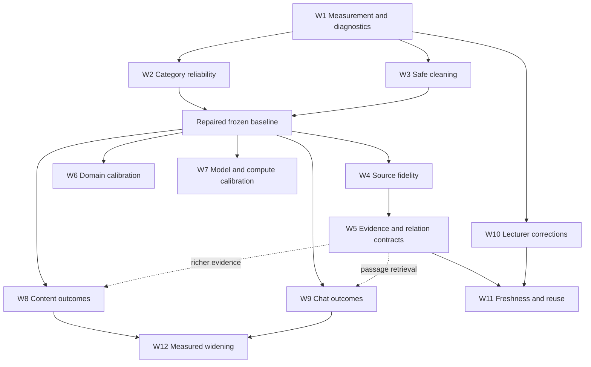

# Knowledge graph quality roadmap

Date: 2026-09-12  
Status: roadmap direction reviewed; approved checkpoint A source package and controlled evaluation delivered on 2026-09-12. Remaining roadmap acceptance work is listed below.  
Scope: graph generation and its use in content generation, chatbot retrieval, and lecturer review.  
Parent: [six-domain selection plan](2026-09-11-kg-domain-selection-plan.md).

## Execution status — 2026-09-12

The user approved checkpoint A implementation, its controlled reruns, and a comprehensive review. Source delivery is in generator MR !17, stacked on the domain selection MR !15; Klicker foundation PR #5904 and selector PR #5906 remain drafts. This status records achieved evidence without expanding the roadmap's remaining scope.

| Area                              | Achieved                                                                                                                                                                           | Still required                                                                                                                            |
| --------------------------------- | ---------------------------------------------------------------------------------------------------------------------------------------------------------------------------------- | ----------------------------------------------------------------------------------------------------------------------------------------- |
| Six-domain UI and frozen dispatch | All six versioned choices, category preview, persisted selections, compatibility gates, focused contract tests and mocked browser proof                                            | Unmocked UI → API → worker → publication proof; worker release/capability activation under separate authority                             |
| W1 diagnostics                    | Optional atomic cleaning reports, recipe thresholds, normalization/repair details, retained raw/cleaned artifacts                                                                  | Consumer-facing diagnostics and richer provenance/decision observability                                                                  |
| W2 category reliability           | Frozen diagnostic improved from 11/33 to 33/33 valid builds on the first repaired matrix; corrected matrix also 33/33; complete malformed-batch rejection protected by regressions | Legacy/explicit-Finance equivalence and actual dispatch-path diagnostic; arbitrary-corpus reliability remains unproven                    |
| W3 semantic preservation          | Value/unit/opposite/subtype guards, compound extrema fixes, described-leaf retention, safe handling of failed merge decisions                                                      | Cross-category regressions fixed in `67a6646` with deterministic evidence; post-fix consumer precision/noise trade-off remains unmeasured |
| W4–W12                            | Direction and dependencies documented; existing content/chat/correction primitives identified                                                                                      | Implementation and consumer-quality evidence; no claim these packages are complete                                                        |

The earlier rerun findings conflated normalization with LLM repair and double-counted baseline cost. The receipt audit establishes baseline provider cost USD0.65058847, first rerunUSD0.70012750, and cumulative provider cost USD1.35071597 before the corrected rerun; conservative historic charges add USD0.12560240. Current per-matrix reporting separates these figures.

The next dependency-ordered work remains closing W2/W3 acceptance gaps, then W4 source fidelity and multi-chunk evaluation. W8 content and W9 chat comparisons use fixed tasks and source evidence; structural validity alone is not their acceptance signal. This update does not authorize merge, deployment, worker publication, real-course uploads, or further unbounded paid experiments.

The [corrected comparison](_local/kg-quality-corrected-evaluation/FINDINGS.md) records 33/33 valid builds at `13fe172`, 1,203 normalization writes and 79 LLM repairs. It found four cross-category merge errors in three semantic classes. Commit `67a6646` addresses those with category checks, rejects malformed classifier batches, and fixes top-level mutation counters; 1,111 offline tests passed with one skip excluding the pre-existing DOCX dependency failures. The paid matrix predates these last corrections. It cost USD0.69727569; total ledger spend USD2.17359406 includes conservative historic charges, with zero holds.

Integrated correction review passed at `67a6646`; [generator CI 663516](https://gitlab.uzh.ch/uzh-bf/tc/kg-content-generation/-/pipelines/663516) passed gating jobs with the existing allowed legacy audit failure. Offline replay rejected all four bad merge records and two plausible synonyms with conflicting categories, permitting eight. This conservative duplication trade-off remains W3 evaluation work. Klicker OCR remains HTTP 402 and ready-only stack review is unavailable while drafts remain drafts.

## Approval summary

Improve the graph as a source-linked semantic index that helps select concepts, relationships, and teaching coverage. Continue to ground factual claims in authorized source chunks. Content generation and chatbot answers are co-primary outcomes; a visually attractive or category-valid graph is insufficient evidence of either.

Start with a small reliability package: reproducible diagnostics, category handling, conservative merging, and preservation of important source-supported leaves. Our real 33-build comparison produced only 11 category-valid cleaned graphs and exposed semantic damage in some successful outputs. Domain selection changes types as intended, but those results cannot establish a quality advantage.

Next improve source fidelity, evidence lineage, and domain policies, measuring each change against a stable baseline. Then optimize consumers independently: curriculum coverage and valid assessment items for content generation; relevant evidence and grounded answers for chat. Reuse the existing graph-assisted chat draft before considering more elaborate retrieval. Finish with lecturer correction, freshness controls, and measured rollout.

This roadmap proposes twelve work packages in four horizons. The immediate next execution proposal should cover **W1–W3: measurement, category reliability, and safe cleaning**, with a separately bounded paid rerun. Later packages require their stated dependencies and decisions. No framework migration, default change, worker publication, merge, deployment, real-course upload, or extra provider spend follows from accepting this direction alone.

## Outcomes and architectural guardrails

| Use case                          | What a better graph enables                                                                                             | Acceptance evidence                                                                                                                                   |
| --------------------------------- | ----------------------------------------------------------------------------------------------------------------------- | ----------------------------------------------------------------------------------------------------------------------------------------------------- |
| Questions and assessment drafts   | Select distinct, important concepts and relations within the requested source scope, objectives, format, and difficulty | Blinded item review; supported correct answers and distractor rationales; calculation checks; topic coverage; lecturer acceptance and editing effort  |
| Flashcards and practice sequences | Select atomic learning targets with useful relationships and limited duplication                                        | Factual support, answerability, one coherent retrieval target per card, objective coverage, and useful diversity                                      |
| Chatbot answers                   | Find relevant passages for terminology variants, comparisons, and multi-concept questions                               | Evidence recall and precision, grounded answer quality, correct citations, appropriate abstention, latency, and cost against document retrieval alone |
| Lecturer knowledge review         | Understand missing or questionable concepts, inspect evidence, and correct recurring errors                             | Actionable build diagnostics, traceable correction effects, preserved lecturer decisions, and reduced review effort                                   |

Preserve accepted boundaries: a KB owns independent document-retrieval and graph projections; graph builds are explicit paid operations. Klicker owns authorization, product lifecycle, budget settlement, and publication. The generator owns extraction and graph quality; ingestion owns document conversion and source identity. The intended Catalyst runtime boundary does not authorize moving the current GitLab generator.

Graph structure guides selection; source chunks support factual claims. Model confidence, edge existence, graph descriptions, or centrality cannot substitute for evidence. Distinguish source assertions, instructor assertions, and inferred pedagogical relationships. Conflicting sources should retain their attribution and conditions rather than becoming one authoritative assertion.

Reuse [ADR 0009](../docs/adr/0009-kb-owns-two-derived-projections.md), [ADR 0011](../docs/adr/0011-catalyst-owns-knowledge-graph-runtime.md), and [ADR 0032](../docs/adr/0032-graph-selects-coverage-and-chunks-support-factual-claims.md). The current generation eligibility and response-example evidence rules remain in [ADR 0029](../docs/adr/0029-response-example-generation-requires-a-matching-corpus-and-graph.md), [ADR 0034](../docs/adr/0034-evidence-eligibility-gates-live-response-examples.md), and [ADR 0035](../docs/adr/0035-klicker-retains-response-example-lineage-not-source-copies.md). Do not retain source copies in Klicker to make diagnostics convenient.

## Current evidence and its limits

The [completed comparison](_local/kg-domain-evaluation/FINDINGS.md) used six short synthetic German sources, all forming one chunk. Five specialist/general pairs plus mixed/general, each repeated three times, produced 33 raw graphs. The frozen extraction and cleaning model was GPT-5.4 Mini, with text-embedding-3-large embeddings and version-1 policies.

| Source                  | Specialist valid cleaned builds | General / Mixed valid cleaned builds |
| ----------------------- | ------------------------------: | -----------------------------------: |
| Finance                 |                             3/3 |                                  1/3 |
| Economics               |                             0/3 |                                  2/3 |
| Business Administration |                             0/3 |                                  0/3 |
| Mathematics             |                             2/3 |                                  3/3 |
| Informatics             |                             0/3 |                                  0/3 |
| Mixed                   |                               — |                                  0/3 |

Three findings support immediate engineering work. LightRAG strips spaces from multiword categories, conflicting with the adapter's case-only canonicalization. Relationship-only endpoints become `UNKNOWN`, which correctly fails the explicit-domain contract. Some model outputs invent unsupported categories. These are different causes and need separate handling.

Successful graphs can still be wrong. An executed merge combined x=0 and x=2 into x=3 while retaining descriptions for the original values. Other merges combined an ETF with shares, diversification with a portfolio, and maxima with minima. The cleaner also removes nodes with fewer than two supporting chunks **and** degree below two. On one-chunk material this exposes every leaf to deletion, including useful concepts and relations.

These observations establish defects, not their historical origin or the best domain policy. The comparison omitted the legacy no-policy baseline. Review was neither blinded nor exhaustive; lexical coverage is only a proxy. A larger multi-chunk corpus could behave differently. The direct provider test used input schema v2; Klicker currently dispatches schema v1 with explicit models. Graph bundle manifest version 2 is a separate contract. Neither the benchmark nor mocked UI tests establish the complete live UI-to-worker path.

### Reuse existing work

| Existing primitive or work                                                                                           | Disposition      | Roadmap delta and owner                                                                                                                                 |
| -------------------------------------------------------------------------------------------------------------------- | ---------------- | ------------------------------------------------------------------------------------------------------------------------------------------------------- |
| Versioned domain catalog, frozen build selection, worker capability checks, policy/recipe digests                    | Extend           | Generator extends measurable policy behavior; Klicker continues to expose compatible versions and frozen selections                                     |
| KB build ledger, pinned corpus, cost reservation/settlement, last-good publication, immutable graph bundles          | Reuse / extend   | Add bounded quality diagnostics and complete effective settings without creating a second lifecycle; generator and Klicker maintain their current sides |
| Source chunk identity, graph-to-chunk selection, blueprint objectives, evidence and calculation validation           | Compose          | Evaluate coverage and strengthen provenance at the existing seams; generator/content owner                                                              |
| Graph correction sets, instructor assertions, preview/materialization and consistency validation in generator branch | Compose          | Product review and correction adoption after dependency readiness; avoid a separate mutable graph editor                                                |
| Document retrieval plus basic graph-assisted query expansion in PR #5912                                             | Reuse / evaluate | Chat owner measures the existing design, then adds passage-oriented graph retrieval only if justified                                                   |

The domain feature is in draft [Klicker foundation PR #5904](https://github.com/uzh-bf/klicker-uzh/pull/5904), [selector PR #5906](https://github.com/uzh-bf/klicker-uzh/pull/5906), and [generator MR !15](https://gitlab.uzh.ch/uzh-bf/tc/kg-content-generation/-/merge_requests/15), with the generator's existing MR !4 dependency preserved. Source presence is not deployment proof.

The separate [graph-assisted chat PR #5912](https://github.com/uzh-bf/klicker-uzh/pull/5912) already proposes bounded lexical seeds, one-hop hints, and at most one extra document query. It preserves the original retrieval, source scope, citations, and fallback. Retrieval and map display have separate lecturer controls. It is a draft with no paid quality comparison; do not propose its basic behavior again as new work.

The [existing production roadmap](2026-08-10-kb-graph-production-roadmap.md) owns serving, deployment, and cross-repository rollout work. Its model evaluation work should consume this roadmap's evidence. Existing [question-generation UX work](2026-08-29-pr-5667-question-generation-ux-audit-and-roadmap.md) owns draft review and editing improvements. Reconcile dependencies at execution time rather than opening duplicate programs.

## Improvement levers

### Inputs, extraction, and graph construction

| Lever                         | Current foothold                                                                                              | Proposed quality improvement and tradeoff                                                                                                                               |
| ----------------------------- | ------------------------------------------------------------------------------------------------------------- | ----------------------------------------------------------------------------------------------------------------------------------------------------------------------- |
| Domain selection              | Six explicit policies: Finance, Economics, Business Administration, Mathematics, Informatics, General / Mixed | Tune entity definitions, relation guidance, examples, exclusion and retention rules. More specific labels help only when they preserve the right concepts and relations |
| Course context                | Policy supports terminology, themes, audience, and bounded overrides; UI currently selects a domain           | Add justified course-level context after evaluation. Avoid silently inferring a domain or exposing a large prompt editor                                                |
| Document conversion           | Existing ingestion and page/source identity                                                                   | Preserve headings, table structure, formulas, code, captions, and reading order. Multimodal extraction adds cost and a data boundary; use it only for demonstrated gaps |
| Chunking and context          | Worker uses fixed-token chunking; size, overlap, and gleaning are recipe inputs                               | Compare structure-aware sections and parent context with fixed chunks. Larger context may improve cross-sentence relations but dilute extraction and increase cost      |
| Extraction strategy           | LightRAG extraction, domain guidance, and gleaning                                                            | Improve endpoint completeness, bounded structured output, relation direction and conditions. Additional passes must earn their cost through missed-evidence recovery    |
| Entity identity and relations | Alias/merge candidates, qualifier/index/acronym guards, relation descriptions                                 | Preserve symbol values, units, subtype distinctions, negation, and context. Introduce stable machine identity separately from translated display labels where needed    |

### Cleaning, consumers, and operation

| Lever                      | Current foothold                                                               | Proposed quality improvement and tradeoff                                                                                                                |
| -------------------------- | ------------------------------------------------------------------------------ | -------------------------------------------------------------------------------------------------------------------------------------------------------- |
| Cleaning aggressiveness    | Noise plan, merge plan, similarity threshold 0.92, chunk/degree filter         | Conservative identity decisions and evidence-aware retention. A compact viewer may use a projection without deleting material needed by other consumers  |
| Evidence and diagnostics   | Source/chunk maps, recipe and bundle hashes, correction reports                | Record why a node exists or disappeared, and whether each pass actually ran. Extend lineage without copying private source bodies into product telemetry |
| Model and embedding choice | Separate extraction/cleaning models, reasoning controls, speed/quality presets | Compare effective model routes, embeddings, reranking, and budgets. A stronger model or a “high” tier is a hypothesis, not demonstrated quality          |
| Consumer selection         | Content subgraph/evidence ranking; separate chat query expansion               | Optimize evidence selection per task, controlling centrality bias, duplication, irrelevant expansion, and evidence truncation                            |
| Lecturer feedback          | Content review plus generator correction primitives                            | Classify errors and apply reviewable, versioned corrections. Ratings alone do not identify a graph defect or justify automated prompt changes            |
| Freshness and reuse        | Pinned sources, immutable artifacts, staleness/publication checks              | Reuse unchanged computation safely; reconcile changed/deleted sources and corrections. Automatic paid rebuilds remain a separate product decision        |

## Sequenced work packages

Owners below are accountable roles to assign when authorizing execution, not claims of staffing. Main-session integration owns cross-system contracts. Each package needs its own bounded source plan; this roadmap does not prescribe a branch stack for all twelve items.

### Horizon 1 — make improvements measurable and stop known damage

**W1 — Reproducible quality diagnostics and evaluation foundation.** Owner: generator/evaluation engineer with a subject reviewer. Dependency: retained baseline; no new runtime needed to design the fixtures. Size: medium.

Preserve the original 33-run evidence. Record effective thresholds, chunking, parser warnings, actual model routes, repair attempts, fallback use, and per-pass counts. Persist a bounded cleaning decision report with stable identifiers and reasons. Existing bundles omit cleaner noise/merge plans, and `CleaningRecipe` currently includes similarity and batch size but not chunk/degree survival thresholds. Extend the existing recipe/bundle contract compatibly; define retention and authorization before retaining any source-bearing decision material.

Build a small deterministic regression set from the observed failures. Define the held-out evaluation portfolio below before tuning prompts. Completion: a report can explain each failed or degraded attempt, distinguish parser loss from model output, reproduce effective settings, and compare raw, cleaned, and consumed evidence. Historical bundles remain readable; new reports do not become required fields for old builds. Existing bundle and recipe tests are the verification home. This instrumentation supports fixes; it must not delay a reproduced deterministic adapter correction.

**W2 — Category and extraction reliability.** Owner: generator engineer. Dependency: W1's regression fixtures; can proceed while broader scoring is developed. Size: small–medium.

Normalize only known equivalent representations of allowed categories, checking canonicalization collisions. Repair missing typed endpoints and invalid model categories through a bounded, source-grounded path; validate every resulting entity and relation endpoint. Prefer protocol/schema improvements and targeted repair to unlimited whole-build retries. Do not map an unknown category to the first allowed type. Keep explicit-policy validation strict and preserve legacy behavior unless separately changed.

Completion: all deterministic category regressions pass, malformed/unrepairable output fails safely, and a frozen rerun reports every attempt. Target 33/33 structurally valid results on the controlled diagnostic set; this is not a guarantee for arbitrary corpora. Add a small legacy/explicit-Finance equivalence diagnostic to establish whether failures are new. Verify the actual Klicker request route as well as direct-provider extraction. Use existing policy/pipeline tests and an authorized synthetic UI → API → worker → publication run. If no safe repair exists, retain last-good publication and report failure rather than weakening the contract.

**W3 — Conservative semantic identity and cleaning.** Owner: generator engineer. Dependency: W1 diagnostics; paired rerun follows W2. Size: medium.

Extend existing merge guards to distinguish numeric/symbol values, units, semantic roles, parent/subtype concepts, and opposing concepts such as minima/maxima. Treat relatedness as insufficient for identity. Prefer preserving two nodes when uncertain. Remove the destructive similarity-only approval fallback on LLM merge failure; record a skipped merge instead. Existing code has this fallback, although the benchmark did not exercise it.

Make retention aware of source support and corpus/chunk structure. Do not remove a supported concept solely because it is a leaf or appears in one chunk. Keep an auditable raw graph and transformation record within existing storage/retention boundaries; consumer-specific simplification should be a derived view when appropriate. Completion: the known false merges and lost supported relationships are protected, legitimate synonyms still merge, and evidence/graph-store consistency survives each pass. Test existing cleaner and bundle seams; compare raw, unmerged, conservatively cleaned, and current-cleaned variants. Advance only if semantic preservation improves without an unacceptable retrieval/noise cost.

### Horizon 2 — improve the knowledge represented

**W4 — Source fidelity and chunking.** Owner: ingestion engineer; generator engineer owns extraction integration. Dependency: W1 portfolio; W2–W3 provide a stable comparison. Size: medium–large.

Add representative long chapters, slide decks, tables, mathematical derivations, code, and cross-document terminology. Diagnose conversion before blaming extraction. Compare fixed-token chunks against section-aware boundaries and bounded parent/neighbor context. Preserve page and chunk identity through table/formula handling. Trial OCR or figure interpretation only on cases where text conversion loses necessary evidence, with an approved source/provider boundary.

Completion: important passages and relationships crossing chunk boundaries remain recoverable; citations resolve to the correct source location; fewer conversion omissions appear in blinded review. Record token/cost growth and duplicate extraction. Keep the original converter/chunker available by version for rollback; never reuse vectors from incompatible source or embedding versions.

**W5 — Evidence-linked entities and relations.** Owner: generator engineer; Klicker/content/chat owners approve the consumer contract. Dependency: W1 and W4 identity requirements. Size: large, contract decision required.

Strengthen the existing entity/relation-to-chunk bridge with stable identity and evidence spans or anchors where the source format permits. Represent useful relation semantics—direction, conditions, polarity, units, and scope—before adding more node categories. Keep source facts, instructor assertions, and inferred teaching dependencies distinguishable. A model-suggested prerequisite needs review or clear inference status; a graph path is not proof of causality or prerequisite order.

Completion: consumers can resolve a selected claim to authorized matching source evidence, trace a merge or correction, and refuse stale or missing support. Include conflicting-source, multilingual alias, formula, and deletion cases. Use versioned additive bundles and existing hydration/consistency tests. Decide the smallest schema extension and compatibility approach before implementation; do not impose an elaborate ontology on every domain.

**W6 — Domain and course-policy calibration.** Owner: generator/prompt engineer with domain educators. Dependency: W2–W3; W4–W5 results inform later iterations. Size: medium and recurring.

Evaluate all six policies on type assignment, important-concept retention, useful relationships, and downstream tasks. Revise examples and definitions, not just allowed names. Test domain-confusable concepts, German/English terminology, mixed material, and course-specific notation. Use bounded existing policy overrides for audience, terminology, and exclusions before proposing new UI controls.

Completion: versioned policy candidates improve a declared target without material regressions in other domain/use-case strata. Compare specialist versus General / Mixed on identical sources and holdout tasks; report where the generic policy remains preferable. Keep v1 immutable and retries pinned. Expose a new version only through existing capability/catalog checks. Any change to generation language or automatic domain selection is a separate product decision; UI locale alone must not change the ontology.

**W7 — Model, embedding, and compute calibration.** Owner: evaluation/generator engineer. Dependency: W1 and W2–W3; use stable corpus/policy variants. Size: medium, bounded experiments.

Measure the current route first, then vary one stage at a time: extraction model/gleaning, cleaning model and reasoning, embedding, reranker, or context budgets. Use small paired pilots to eliminate weak candidates before a broader run. Include model failures and fallback execution in results. Record effective provider/model, source and policy digests, latency, and spend; changing embedding identity requires compatible indexes and a rebuild plan.

Completion: publish a quality–cost–latency comparison and select configurations only when the gain is meaningful for a consumer. Keep separate budgets for generation and online retrieval. Reuse existing cost tiers only where measured settings fit their promises. Roll back by pinned recipe/version, not by silently rerouting historical builds. New paid work requires an explicit ceiling, price verification, and stop rule; the prior USD20 authorization covered the completed comparison only.

### Horizon 3 — prove downstream value

**W8 — Content-generation quality and pedagogical coverage.** Owner: content-generation engineer with educators. Dependency: W3 and W1 task cases; richer W5 evidence adds capabilities incrementally. Size: medium–large.

Reuse blueprint source/page scope, learning objectives, Bloom levels, requested formats/difficulty, graph selection, source evidence, and calculation checks. Compare ordinary evidence selection with graph-guided selection on the same generation tasks. Improve coverage of important low-degree concepts, complementary relationships, diversity across a batch, and objective-to-evidence alignment. Separate domain understanding from difficulty: advanced vocabulary or graph depth does not establish cognitive demand.

Score question correctness, answer uniqueness where applicable, true multiple-correct behavior, plausible evidence-consistent distractors, feedback quality, and calculation validity. For flashcards, score atomicity and answerability. For response examples, reuse the accepted source-matching and evidence-eligibility rules; the inspected Klicker head has review/runtime primitives but no production candidate-generation path. Adding that producer is a distinct execution slice, not a hidden consequence of better graphs.

Completion: blinded educator review demonstrates a meaningful gain in predeclared measures, with no critical grounding or format regression. Report usable drafts per attempted batch and editing effort, not just quality of retained items. Preserve explicit review/approval before publication. Deterministic generation contracts and focused end-to-end synthetic jobs support, but do not replace, content review.

**W9 — Chat retrieval and answer quality.** Owner: chat/retrieval engineer. Dependency: W1 chat cases; reuse PR #5912 when its delivery gates are satisfied. Size: medium initially; advanced approaches conditional.

First compare document retrieval alone with the existing bounded graph query expansion. Hold the answering model, corpus, prompt, evidence budget, and question set fixed. Measure factual lookup, terminology variants, comparison, multi-hop evidence needs, whole-topic synthesis, and unanswerable/conflicting questions separately. Penalize irrelevant expansion and hub dominance. Preserve original-query evidence so graph hints cannot crowd it out.

If failure analysis shows the bottleneck is graph-to-passage selection, trial source-chunk lookup from selected entities/relations plus evidence reranking using W5. Keep authorization and source resolution server-side; the model cannot widen KB scope. Current basic graph retrieval does not establish multi-KB graph support even though document scoping supports multiple KBs. Treat that as a separate contract and permission test frontier.

Completion: a graph variant improves the selected question classes at acceptable latency/cost while preserving citations, abstention, and scope. If it adds no useful gain, keep ordinary document retrieval as the default and retain graph value for other consumers. Only then consider community summaries, adaptive multi-hop search, or query-specific routing. These add indexing cost, summary grounding, freshness, and latency obligations; no wholesale GraphRAG framework migration is proposed.

**W10 — Lecturer review and correction loop.** Owner: Klicker product engineer; generator owns correction materialization. Dependency: W1 diagnostics and existing correction-contract readiness; W5 for richer evidence. Size: medium–large.

Show build status, selected/published domain, source coverage limitations, and actionable warnings separately. Present missing evidence, questionable merges, and excluded concepts with source access and a reversible preview. Compose existing correction sets and instructor assertions, preserving review across rebuilds through explicit rebase/conflict handling. Prioritize uncertain, high-impact items; do not require educators to inspect every node.

Completion: a lecturer can correct a known fixture defect, preview affected concepts and evidence, materialize a versioned result, and observe the intended consumer change. Rebuilding cannot silently overwrite the decision or apply it to a different concept. Route feedback by cause—source, graph, retrieval, generation, pedagogy—before revising a policy. Avoid a single opaque “graph quality score” and automatic retraining from thumbs-up/down. UI interactions, permissions, and browser captures are required during execution.

### Horizon 4 — sustain quality and widen safely

**W11 — Freshness, incremental reuse, and recovery.** Owner: generator engineer with ingestion and Klicker lifecycle owners. Dependency: W1 effective recipes, W5 identity, W10 correction semantics for corrected graphs. Size: large if incremental rebuilds are justified.

Measure full-rebuild costs before adding incremental complexity. Reuse unchanged extraction only with matching source, policy, parser/chunker, model/embedding, and correction identities. Recompute impacted relations, summaries, and indexes when sources change. Explicitly test deletion and contradiction propagation. Keep graph freshness distinct from response-example validity: unchanged supporting sources can keep an approved example live through a graph rebuild under ADR 0034.

Completion: small source edits/deletions produce semantically correct results without stale citations or orphaned correction targets; reported cost savings include invalidation overhead. Preserve idempotency, cancellation, cost settlement, publication fencing, and last-good behavior. Roll back to a compatible retained build only when current authorization/evidence permits. Automatic paid rebuilding requires a named product/budget decision; freshness warnings and explicit rebuild remain the default contract.

**W12 — Operational quality and rollout.** Owner: product/evaluation lead; deployment owner uses the existing production roadmap. Dependency: W1–W3 for repaired baseline; W8/W9 for claims about their respective consumers. Size: medium, then recurring.

Use synthetic/local regression evidence, then an approved internal corpus and canary, then controlled widening. Segment failures and user outcomes by domain, recipe, source complexity, language, and consumer. Establish who reviews regressions, how a policy/model version is disabled, and how costs and fallback rates are monitored. Use source identifiers and bounded diagnostics; real learner data and production content need their own access/retention plan.

Completion: required compatibility/source CI and live delivery gates pass independently; domain and consumer scorecards support the specific quality claim being made; rollback and incident ownership are exercised. Preserve [ADR 0014](../docs/adr/0014-beta-learns-before-quality-thresholds.md): do not invent retrospective statistical blockers for an initial beta. Known correctness defects need remediation; the reviewed 30–50-case corpus supports widening and broader quality claims. Learning-outcome studies belong later, with study design and data authority; answer ratings alone cannot prove educational benefit.

## Dependencies and delivery checkpoints

The diagram shows quality dependencies, not authorization. W6/W7 variants feed consumer experiments without requiring every combination. W10 can start with current correction primitives; richer evidence is incremental. W11 and advanced chat retrieval must not delay a simpler useful result.

| Checkpoint                | Deliverable                                                                        | Decision                                                                                    |
| ------------------------- | ---------------------------------------------------------------------------------- | ------------------------------------------------------------------------------------------- |
| A — trustworthy baseline  | W1–W3 diagnostics, regressions, repaired comparison, actual dispatch-path evidence | Confirm engineering reliability before claiming that domain selection improves quality      |
| B — better representation | W4–W7 paired results and the smallest justified contract/policy changes            | Keep changes that preserve meaning and improve downstream evidence; stop ineffective tuning |
| C — useful consumers      | W8/W9 independent scorecards; W10 targeted lecturer workflow                       | Enable consumer-specific improvements based on their own evidence, not graph aesthetics     |
| D — sustainable widening  | W11 where cost warrants it; W12 canary and operational ownership                   | Widen only the validated capability; use existing release/deployment gates                  |

For capacity planning, A is roughly 1–2 engineering weeks, B another 2–4, C another 2–4 with some parallel work, and D 2–4 where incremental processing is needed. These are provisional elapsed ranges assuming one generator engineer, one part-time product/retrieval engineer, timely educator review, and working infrastructure. Re-estimate after A; source conversion, schema decisions, and reviewer availability can dominate. No calendar commitment or speculative long-term infrastructure investment is implied.

## Evaluation portfolio and decision rules

Extend the existing quality program rather than introducing a new evaluation service. Keep deterministic contracts in existing tests and model-quality evidence in versioned local evaluation artifacts. DeepEval can host the latter if the existing project setup fits; selecting a framework is not required to begin.

Use **30–50 reviewed scenarios** spanning the six policies, including mixed material. A scenario pairs a source collection with target concepts/relationships and downstream tasks; it is not one generated graph or one question. Include multiple independent documents and multi-chunk collections, short-input regressions, tables/formulas/code, bilingual terminology, conflicting claims, and missing/changed evidence. Separate development and held-out collections by document/topic; do not tune on the holdout. Have educators review reference validity and allow multiple correct graph representations.

| Layer                  | Measures                                                                                                                     | Interpretation                                                                                |
| ---------------------- | ---------------------------------------------------------------------------------------------------------------------------- | --------------------------------------------------------------------------------------------- |
| Extraction/reliability | Completed usable builds / all attempts; parser loss; unsupported categories/endpoints; repair and fallback rates             | Structural validity and actual execution, not semantic accuracy                               |
| Representation         | Important concept/relation recall, type/identity precision, unsupported claims, destructive merges, retained source evidence | Score semantic equivalence and conditions; node counts and lexical matches remain diagnostics |
| Retrieval              | Relevant evidence recall at a fixed budget, precision, ranking, irrelevant expansion, authorized-source coverage             | Compare same question and budget; distinguish missed retrieval from poor answer generation    |
| Content/answers        | Claim support and citation correctness, task completeness, pedagogical/format validity, critical errors, abstention          | Blinded human assessment is the reference; calibrated judges assist triage                    |
| Operation              | Cost per usable graph/task, p50/p95 latency, rebuild/correction effort, fallback incidence                                   | Count failures, repairs, embeddings, judges, and discarded candidates in cost                 |

Start with paired ablations, not a full cross-product. Preserve source hashes, model routes, policy versions, effective parameters, random schedule, raw and cleaned outputs, and producing logs under the authorized retention boundary. Run repeated generations to measure variance; three repeats are a diagnostic starting point, not statistical power. Treat documents/scenarios as independent units for uncertainty estimates, not individual nodes or repeated outputs from one source.

Calibrate scoring with blinded educator review and a second reviewer on disagreements and a sample of agreements. Keep the evaluator separate from the generating prompt; validate automated judges against human labels before using them for decisions. Report results by domain and use case, including failure denominators and survivor-only caveats. Predeclare the smallest useful improvement and tolerated regression after the initial rubric pilot, before examining candidate results.

Hard invariants are zero unauthorized evidence access, no knowingly incorrect source attribution, preserved explicit policy/version semantics, and no publication of invalid artifacts. Deterministic regression fixtures must protect the reproduced category and identity defects. For stochastic quality, report confidence and failure severity; do not manufacture certainty from a small sample or demand perfection on arbitrary source material. Safe refusal is an outcome, and frequent refusal still reduces usable yield.

The baseline order is: original frozen run; repaired pipeline with unchanged inputs/settings; specialist versus General / Mixed; raw versus cleaned; source/chunking variants; selected model/policy changes; then consumer-specific retrieval/generation variants. Compare against both graph-free evidence selection and current graph behavior wherever meaningful. A change earns adoption through a useful task improvement at acceptable cost, not a higher abstract graph score.

## Execution decisions and authority

| Decision before dependent work    | Recommended direction                                                                           | Boundary                                                                                                |
| --------------------------------- | ----------------------------------------------------------------------------------------------- | ------------------------------------------------------------------------------------------------------- |
| First implementation package      | W1–W3 with regression fixtures; preserve existing domain feature and draft dependencies         | Requires a bounded implementation plan; roadmap preparation itself changes no application code          |
| Additional model experiments      | Synthetic pilot, explicit ceiling including embeddings/judging/retries, then holdout evaluation | New spend approval; existing completed benchmark credit allowance is not a recurring budget             |
| Real source collections           | Reviewed, non-personal teaching material with permission for the chosen provider                | No broad course/student discovery or external upload under this roadmap                                 |
| Contract and user-control changes | Small additive evidence/recipe extensions; explicit versioned domain selection and rebuilds     | Resolve ADR-worthy changes, language behavior, multi-KB graphs, and new retention before implementation |
| Release or activation             | Keep current drafts and release topology; use the existing serving/rollout roadmap              | Named authority for merge, worker publication, deployment, or changed live defaults                     |

The immediate follow-up is to turn checkpoint A into an executable package with exact owner paths, fixtures, compatibility checks, paid-rerun ceiling, and terminal evidence. Later work remains prioritized direction; it should be revised using checkpoint A's results.

## Evidence baseline and source map

Inspected on 2026-09-12 after fetching both remotes. Klicker task head: `216634e91a545fdf02fe434e86f454f6c49446df`, branch `rs/kg-domain-selection-ui`, in `trees/rs/kg-domain-selection-plan`. It is 9 commits ahead and 14 behind `origin/v3-ai`; no integration was performed for this planning request. Generator task head: `d9934498e671de986176f5215a82ea56840a2cf3`, branch `rs/kg-domain-selection`, in the generator task worktree. Graph-assisted chat prior art: `bdd02dc55552ca3db85ee366418f8046b733bcd0`, separate draft worktree. Draft metadata is current to inspection; CI/deployment readiness was not re-established for this roadmap.

Klicker source anchors are relative to this worktree. Generator anchors below are relative to `/Volumes/HOME/Git/klicker/kg-content-generation/trees/rs/kg-domain-selection/lightrag_research/`. These are inspected implementation locations, not claims that every branch capability is deployed.

| Claim                                            | Source anchor                                                                                                                                                                              |
| ------------------------------------------------ | ------------------------------------------------------------------------------------------------------------------------------------------------------------------------------------------ |
| Frozen dispatch, input route and models          | Klicker `packages/hatchet/src/kbGraphIngestion.ts:575`; lifecycle contract in `docs/async-and-workers.md`                                                                                  |
| Published graph versus generation eligibility    | Klicker `packages/graphql/src/services/elementGenerationGraphReadiness.ts:26`; `questionGenerationGraph.ts:89`                                                                             |
| Existing objectives and source-scoped blueprints | Klicker `packages/graphql/src/services/questionGenerationBlueprint.ts:17`; `flashcardGenerationBlueprint.ts`                                                                               |
| Policy and effective recipe levers               | Generator `hatchet_workflows/domain_policy.py:212`; `generation_recipe.py:40`; `tasks.py:238`                                                                                              |
| Category handling and cleaning passes            | Generator `lightrag_scripts/pipeline.py:186`, `:876`; `kg_cleaner.py:1033`, `:1359`                                                                                                        |
| Bundle inventory and correction seam             | Generator `hatchet_workflows/graph_bundle_io.py:21`; `graph_correction_schemas.py:284`; `graph_corrections.py:461`                                                                         |
| Existing graph/evidence content selection        | Generator `questions_generation/graph_retrieval.py:54`; `questions_generation/pipeline.py:1935`; `questions_generation/source_evidence.py`; `questions_generation/calculation_verifier.py` |
| Basic chat augmentation prior art                | Separate chat worktree `apps/chat/src/services/graphAssistedDocQuery.ts:143`; `packages/knowledge-graph/src/retrieval.ts:1`; its `project/2026-09-11-student-chat-graphrag-basic.md`       |

The independent generator inspection was reconciled with schema and call-site evidence. A suggested explicit-policy allowlist bypass is not established: `schemas.py:257` rejects that combination. Strict validation also runs after cleaning. File presence on a default branch is not evidence of shipping. Neither claim is used to justify new work here. Benchmark logs already establish false merges and leaf loss; additional diagnostics improve repeatability rather than making those findings real for the first time.

### External research informing experiments

The [official Microsoft GraphRAG query overview](https://microsoft.github.io/graphrag/query/overview/) distinguishes local graph-plus-chunk retrieval, global community-report synthesis, and DRIFT. These are candidate experiment patterns for W9, not evidence they outperform current Klicker retrieval. Global synthesis carries additional indexing and answer-generation costs.

The [LightRAG paper](https://arxiv.org/abs/2410.05779) motivates graph-enhanced retrieval; the [official core API documentation](https://github.com/HKUDS/LightRAG/blob/main/docs/ProgramingWithCore.md) exposes retrieval modes, candidate/token budgets, and optional reranking. Verify the pinned installed version before adopting any setting. LightRAG's `global` mode and Microsoft's community-report global search are different mechanisms.

[RAGChecker](https://arxiv.org/abs/2408.08067) supports diagnosing retrieval and answer generation separately and calibrating automated evaluation against human judgments. That principle informs the portfolio above; no dependency adoption or paper-level performance claim is assumed for this project.

## Latest acceptance checkpoint

The [next acceptance evidence](2026-09-12-kg-next-acceptance.md#completed-experiment-evidence) records twelve additional successful builds, actual multi-chunk processing and a six-query retrieval comparison. Future legacy recipe lineage is now distinguishable without invalidating historical digests. These results extend engineering evidence; W1 publication and W8/W9 consumer acceptance remain open.

Prioritize the isolated publication binding, an effective content evidence treatment, and raw-source coverage within mixed retrieval before more domain/model tuning. The proposed content comparison was ineffective and made no paid generation calls. Mixed retrieval omitted one document's raw evidence for the conflict query; answers were not evaluated. Educator-calibrated semantic scoring and held-out scenarios remain necessary. Cumulative experimental ledger cost is USD2.59520654 of the existing USD20 ceiling with zero holds; this is not recurring spend authority.
