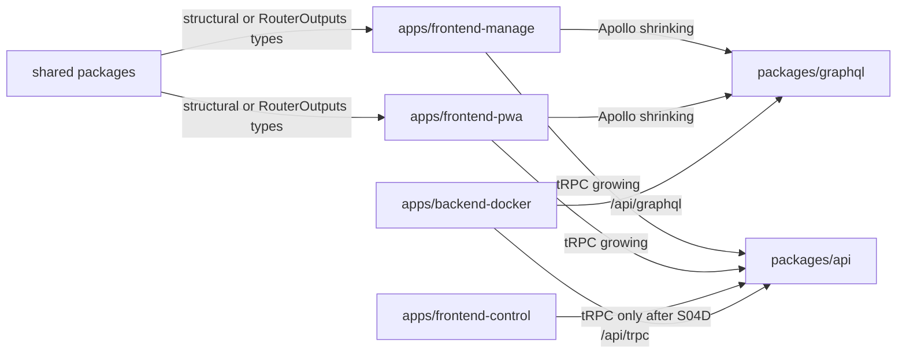
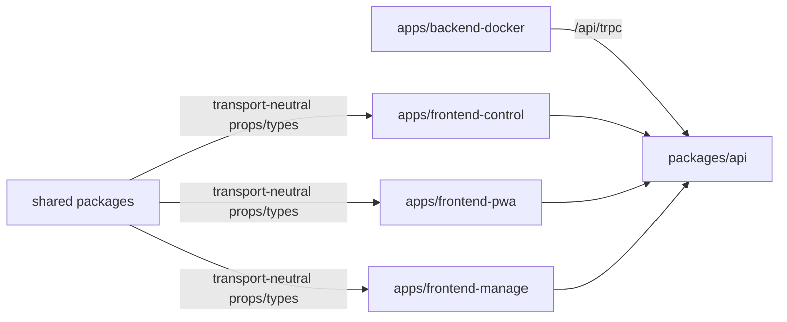

# Full Implementation Plan: GraphQL to tRPC Dual-API Migration

## Identity

Plan path: `project/plans_future/graphql-to-trpc-dual-api-migration/FULL_IMPLEMENTATION_PLAN.md`

Goal prompt: `project/plans_future/graphql-to-trpc-dual-api-migration/GOAL_PROMPT.md`

Branch: `codex/trpc-dual-api-migration`

Target branch: `v3`

Repository worktree: `.claude/worktrees/trpc-dual-api`

Supporting files:

- `project/plans_future/graphql-to-trpc-dual-api-migration/README.md`
- `project/plans_future/graphql-to-trpc-dual-api-migration/S00-plan-and-audit.md`
- `project/plans_future/graphql-to-trpc-dual-api-migration/S01-api-package-kernel.md`
- `project/plans_future/graphql-to-trpc-dual-api-migration/S02-backend-dual-mount.md`
- `project/plans_future/graphql-to-trpc-dual-api-migration/S03-client-provider-shells.md`
- `project/plans_future/graphql-to-trpc-dual-api-migration/S04-vertical-migrations.md`
- `project/plans_future/graphql-to-trpc-dual-api-migration/S05-realtime-migration.md`
- `project/plans_future/graphql-to-trpc-dual-api-migration/S06-final-cleanup.md`

Sources:

- Local KlickerUZH codebase inspection.
- Existing tRPC dual-stack branch commits.
- `graphql-to-trpc-migration` skill and GBL UZH migration lessons.
- Current repository instructions in `AGENTS.md`.

## Goal

Problem: KlickerUZH currently depends on GraphQL/Yoga/Pothos/codegen, Apollo Client, generated operation types, persisted query artifacts, and GraphQL subscriptions across the backend, PWA, manage app, control app, shared components, tests, scripts, and deployment assumptions.

Goal: migrate the product to tRPC end to end while keeping GraphQL live in parallel until all active consumers have moved and final cleanup gates prove GraphQL can be removed safely.

Success:

- `packages/api` owns the application API.
- `/api/trpc` serves all app workflows.
- GraphQL and tRPC coexist during S04/S05.
- Apollo hooks/providers and generated GraphQL operation imports are gone from active apps before GraphQL deletion.
- Realtime flows use tRPC subscriptions or transport-neutral event invalidation.
- `/api/graphql`, GraphQL WS, `packages/graphql`, codegen, generated/persisted artifacts, and GraphQL dependencies are removed only in S06 after explicit cleanup approval.
- Full repository checks and browser smoke flows pass without GraphQL.

## Non-Goals

- Do not rewrite product behavior while changing transport.
- Do not replace Prisma schema, Hatchet flows, auth model, Redis usage, grading logic, or deployment topology unless GraphQL coupling blocks migration.
- Do not remove GraphQL during S04/S05.
- Do not migrate by generated-file count; migrate by user workflow.
- Do not force shared components to tRPC-only types while Apollo-backed callers still exist.
- Do not introduce broad new abstractions unless they remove real transport coupling.

## Current State

Done and committed:

- S00: migration planning/audit files exist.
- S01: `@klicker-uzh/api` package exists with tRPC foundation.
- S02: backend mounts `/api/trpc` beside `/api/graphql`.
- S03: tRPC providers exist beside Apollo in control, PWA, and manage.
- S04A: frontend-control read pilot was runtime-verified and committed.
- S04B: frontend-control live-quiz reads migrated and committed.
- S04C: frontend-control mutations migrated and committed.
- S04D: frontend-control Apollo/provider/dependency removal completed and committed.

Committed markers:

- `d940d86d7 docs(api): plan dual-stack trpc migration`
- `ccffa7518 feat(api): add dual-stack trpc foundation`
- `a20a32aaa fix(check): restore dependency ordering`
- `c6be4df9c feat(api): port dual-stack control pilot`
- `9fd2c326c docs(project): add end-to-end trpc migration plan`
- `4d28f1d87 docs(project): record control trpc runtime verification`
- `df2d8f16e docs(project): refine trpc migration plan`
- `a274ab4b6 feat(api): migrate control read screens to trpc`
- `d53406154 feat(api): migrate control mutations to trpc`
- `0e437a306 chore(control): remove apollo after trpc migration`

Current next action:

- Continue S04I with the PWA group activity detail read and decision-submission follow-up slices, while keeping GraphQL subscriptions live until S05.

Still intentionally live:

- `packages/graphql`
- `/api/graphql`
- GraphQL WS/subscriptions
- GraphQL codegen and persisted operation artifacts
- Apollo in PWA and manage
- Generated GraphQL types for unmigrated PWA/manage/shared callers

## Hard Rules

Do:

- Keep GraphQL mounted and working until S06.
- Add new API behavior under `packages/api/src/**`.
- Use existing GraphQL resolvers/services as behavior source.
- Extract transport-neutral services only when tRPC needs logic currently trapped in GraphQL-specific modules.
- Validate procedure inputs with Zod.
- Use SuperJSON consistently.
- Return explicit DTOs; do not return broad Prisma records.
- Preserve enum string values, nullability, authorization, cookies, redirects, and side effects.
- Use type-only router imports in browser code.
- Update this plan's `Progress` section before and after every slice.
- Commit one slice at a time with conventional commit messages.
- Run review and simplification before each slice commit when subagent tooling is available; otherwise do an explicit self-review and record the tooling gap.

Avoid:

- Browser imports from `appRouter`, Prisma client runtime, backend runtime modules, or Node-only modules.
- New runtime imports from `@klicker-uzh/graphql` inside `packages/api`.
- Global type rewrites before the consuming workflow has migrated.
- Combining reads, mutations, realtime, app cleanup, and backend cleanup in one commit.
- Removing GraphQL dependencies or generated artifacts because one app was migrated.

## Architecture During Migration



Final architecture:



## Execution Cadence

For every slice:

1. Read this plan and the relevant supporting slice file.
2. Check `git status --short --branch`; preserve unrelated user changes.
3. Update `Progress` with active slice, operation mapping, write scope, intended verification, and cleanup gates.
4. Inspect GraphQL documents, generated op types, resolvers, services/helpers, permissions, side effects, and active consumers.
5. Implement the smallest complete workflow migration.
6. Add focused tests when behavior is cheap to isolate.
7. Run fastest meaningful checks first, then app build/check.
8. Browser-verify UI slices with `npx agent-browser` screenshots when local stack/data allow.
9. Run coexistence audit during S04/S05, cleanup audit during S06.
10. Review correctness, scope, security impact, and test gaps.
11. Simplify incidental complexity.
12. Re-run affected checks.
13. Update `Progress` with evidence, residual risk, and next slice.
14. Commit only the slice files.

Operation mapping template:

```text
Slice:
GraphQL operation(s):
GraphQL resolver(s):
Behavior source:
tRPC router.procedure:
Input schema:
Output DTO:
Active frontend consumers:
Apollo cache/refetch/subscription behavior:
React Query replacement:
Browser verification path:
Cleanup blocked until:
```

## Tooling

Use the repository-pinned toolchain:

```bash
volta run --node 20.19.4 --pnpm 10.15.0 pnpm <command>
```

Focused checks after API changes:

```bash
volta run --node 20.19.4 --pnpm 10.15.0 pnpm --filter @klicker-uzh/api test
volta run --node 20.19.4 --pnpm 10.15.0 pnpm --filter @klicker-uzh/api check
volta run --node 20.19.4 --pnpm 10.15.0 pnpm --filter @klicker-uzh/api build
volta run --node 20.19.4 --pnpm 10.15.0 pnpm --filter @klicker-uzh/backend-docker check
```

Focused checks after app changes:

```bash
volta run --node 20.19.4 --pnpm 10.15.0 pnpm --filter <target-app> check
volta run --node 20.19.4 --pnpm 10.15.0 pnpm --filter <target-app> build
```

Broad checks at major gates:

```bash
volta run --node 20.19.4 --pnpm 10.15.0 pnpm run check
volta run --node 20.19.4 --pnpm 10.15.0 pnpm run check:all
volta run --node 20.19.4 --pnpm 10.15.0 pnpm run build
volta run --node 20.19.4 --pnpm 10.15.0 pnpm run test:run
```

Browser verification:

```bash
npx agent-browser open <local-url>
npx agent-browser screenshot /tmp/<slice>-before.png --full
npx agent-browser screenshot /tmp/<slice>-after.png --full
```

Use current tRPC docs before changing subscription or client-link code. Prefer Context7 if available; otherwise use official tRPC docs and verify against installed package versions.

## Audit Commands

Coexistence audit during S04/S05:

```bash
rg -n "@apollo/client|ApolloProvider|@klicker-uzh/graphql|/api/graphql|graphql-yoga|graphql-ws" apps packages cypress package.json pnpm-lock.yaml turbo.json
rg -n "@trpc|createTRPC|/api/trpc|type AppRouter|TrpcProvider" apps packages package.json pnpm-lock.yaml
```

Per-app Apollo gate:

```bash
rg -n "@apollo/client|ApolloProvider|useApollo|SSELink|GraphQLWsLink|graphql-ws|@klicker-uzh/graphql|useQuery|useMutation|useSubscription|subscribeToMore" apps/<app>
```

Generated type leak gate:

```bash
rg -n "@klicker-uzh/graphql/dist/ops|TypedDocumentNode|src/graphql/ops|ops\\.ts|ops\\.schema|client\\.json|server\\.json" apps packages cypress
```

API no-GraphQL-runtime gate:

```bash
rg -n "@klicker-uzh/graphql|packages/graphql|graphql/dist" packages/api apps/*/src
```

Final cleanup gate:

```bash
rg -n "@apollo/client|ApolloProvider|@klicker-uzh/graphql|graphql-yoga|graphql-ws|graphql-codegen|@pothos|graphql-scalars|/api/graphql" apps packages cypress deploy docs project package.json pnpm-lock.yaml turbo.json
```

## Progress

### 2026-06-03 Completed: S04I1 PWA Group Activity Start Mutation

Status: complete for the scoped slice. This slice migrated only the PWA participant `StartGroupActivityDocument` mutation to `participant.startGroupActivity`. The group activity detail query, `submitGroupActivityDecisions`, and GraphQL subscription adapter remain live for later S04I/S05 slices.

Changed scope:

- Added `packages/api/src/services/participantGroupActivities.ts` with transport-neutral start behavior mirrored from `packages/graphql/src/services/groups.ts`, including published/activity-window checks, group membership checks, minimum group size, clue instance creation, and clue assignment creation.
- Added `participantStartGroupActivityInput` and wired `participant.startGroupActivity` in the participant tRPC router with a narrow `{ groupActivity: { id, status, activityInstance: { id } } | null }` DTO.
- Added focused API tests for successful start, non-member rejection, and single-member rejection.
- Updated the PWA group activity detail page to call the tRPC start mutation, keep the existing Apollo detail query/refetch, and leave subscription behavior untouched.
- Updated this plan file.

```text
Slice: S04I1 PWA group activity start mutation
GraphQL operation(s): StartGroupActivityDocument
GraphQL resolver(s): Mutation.startGroupActivity
Behavior source: packages/graphql/src/services/groups.ts startGroupActivity
tRPC router.procedure: participant.startGroupActivity
Input schema: participantStartGroupActivityInput { activityId, groupId }
Output DTO: { groupActivity: { id, status, activityInstance: { id } } | null }
Active frontend consumers: apps/frontend-pwa/src/pages/group/[groupId]/activity/[activityId].tsx
Apollo cache/refetch/subscription behavior: Apollo detail query remains; after tRPC mutation, call existing Apollo refetch for the current detail query
React Query replacement: mutation only in this slice; read invalidation waits for detail-query migration
Browser verification path: local participant group activity detail page start action if local stack fixture is available
Cleanup blocked until: group activity detail read, submit decisions mutation, generated group activity types, and S05 subscriptions
```

Verification:

- `volta run --node 20.19.4 --pnpm 10.15.0 pnpm exec prettier --config .prettierrc.mjs --write ...` passed for touched files and this plan.
- `volta run --node 20.19.4 --pnpm 10.15.0 pnpm --filter @klicker-uzh/api check` passed after removing an unused type alias.
- `volta run --node 20.19.4 --pnpm 10.15.0 pnpm --filter @klicker-uzh/api test -- --run participant-group-activities` passed; Vitest ran 17 files / 141 tests.
- `volta run --node 20.19.4 --pnpm 10.15.0 pnpm --filter @klicker-uzh/api build` passed.
- `volta run --node 20.19.4 --pnpm 10.15.0 pnpm --filter @klicker-uzh/frontend-pwa check` passed.
- `volta run --node 20.19.4 --pnpm 10.15.0 pnpm --filter @klicker-uzh/frontend-pwa build` passed, with existing Next.js warnings for page data size, next-intl config, Browserslist freshness, and `images.domains` deprecation.
- Focused audit confirmed the page no longer imports `StartGroupActivityDocument` or Apollo `useMutation`, while the detail query still uses Apollo intentionally.
- Coexistence audit `rg -n "@klicker-uzh/graphql" packages/api/src packages/api/dist` returned no matches.
- `git diff --check` passed.
- Browser verification used `npx agent-browser` against local backend `http://127.0.0.1:3100` and PWA `http://127.0.0.1:3102` with seeded participant `testuser1`.
- The first fixture attempt was removed by a concurrent shared Cypress run resetting the database; the fixture was recreated immediately before the click flow.
- Pre-click screenshot: `/tmp/klicker-pwa-s04i1-group-start-before.png` showed the group activity detail page with two hint placeholders, two group members, and the `START` button.
- Post-click screenshot: `/tmp/klicker-pwa-s04i1-group-start-after.png` showed the transition to `Your tasks`, assigned hints, and no start button.
- Browser network evidence included `POST http://127.0.0.1:3100/api/trpc/participant.startGroupActivity?batch=1` after clicking Start.
- Prisma evidence confirmed `GroupActivityInstance` id `16` with two clue instances and two `GroupActivityClueAssignment` rows for the verification group.

Residual risk / next step:

- The page still depends on Apollo for the group activity detail query and GraphQL subscription updates. Next S04I slice should migrate the detail read or the decision-submission mutation while keeping subscriptions live until S05.

### 2026-06-03 Completed: S04H13 PWA Microlearning Evaluation And Completion

Status: complete for the scoped slice. This slice migrated the PWA microlearning evaluation page from Apollo `GetMicroLearningDocument`, `SelfDocument`, `GetParticipationDocument`, and `MarkMicroLearningCompletedDocument` to tRPC. The GraphQL subscription replacement remains out of scope for S05.

Done:

- Added `participant.participation` and `participant.markMicroLearningCompleted` to `packages/api`, preserving the GraphQL `getParticipation` nullable participant behavior and `completedMicroLearnings.push(id)` completion side effect.
- Added a narrow mark-completed input schema and focused router tests for authenticated completion, anonymous/lecturer participation nullability, and selected participation fields.
- Migrated `apps/frontend-pwa/src/pages/course/[courseId]/microLearnings/[id]/evaluation.tsx` to tRPC reads/mutation with React Query `participant.participations` invalidation before the existing home redirect.
- Decoupled `useStackEvaluationAggregation` from generated GraphQL enums by using the structural microlearning shape needed by the evaluation page.
- Kept GraphQL mounted, Apollo available in PWA for remaining routes, and realtime subscription cleanup deferred.

Verification:

- `volta run --node 20.19.4 --pnpm 10.15.0 pnpm exec prettier --config .prettierrc.mjs --write ...` passed for touched S04H13 files.
- `volta run --node 20.19.4 --pnpm 10.15.0 pnpm --filter @klicker-uzh/api check` passed.
- `volta run --node 20.19.4 --pnpm 10.15.0 pnpm --filter @klicker-uzh/api test -- --run participant-microlearnings` passed with 138 tests.
- `volta run --node 20.19.4 --pnpm 10.15.0 pnpm --filter @klicker-uzh/api build` passed.
- `volta run --node 20.19.4 --pnpm 10.15.0 pnpm --filter @klicker-uzh/frontend-pwa check` passed after rebuilding `@klicker-uzh/api`.
- `volta run --node 20.19.4 --pnpm 10.15.0 pnpm --filter @klicker-uzh/frontend-pwa build` passed with the existing Next/i18n/Browserslist/page-data warnings.
- Focused Prettier check, `git diff --check`, evaluation-page GraphQL/Apollo import audit, and `packages/api` GraphQL runtime import audit passed.

Browser verification:

- Ran branch backend on `http://127.0.0.1:3100` and a temporary PWA dev server on `http://127.0.0.1:3102`, then stopped the temporary PWA server and confirmed port 3102 no longer responded.
- Captured anonymous evaluation render: `/tmp/klicker-pwa-s04h13-evaluation-anonymous.png`.
- Captured participant evaluation render with active points header and `Finish`: `/tmp/klicker-pwa-s04h13-evaluation-participant.png`.
- Clicked `Finish`, confirmed redirect to `http://127.0.0.1:3102/`, and captured `/tmp/klicker-pwa-s04h13-evaluation-finished.png`.
- Browser request evidence included `participant.self`, `participant.microLearning`, `participant.participation`, `participant.markMicroLearningCompleted`, and post-redirect `participant.participations` tRPC calls.
- DB confirmation after the click showed `completedMicroLearnings` contained `0fcb5a76-0e08-4495-85cb-9f9f13c04112` for seeded participant `testuser1`.

Verification caveat:

- A concurrent Cypress run from another worktree repeatedly reset the shared local DB during browser verification. The fixture was recreated between reset boundaries; post-click DB evidence still confirmed the completion array update, while the microlearning row itself was reset again by the external run.

Next slice:

- Continue S04 vertical migrations with remaining PWA group activity submit paths, keeping GraphQL live until S06 and subscriptions deferred until S05.

### 2026-06-03 Completed: S04H12 PWA Microlearning Detail And Stack Read

Status: complete for the scoped slice. This slice migrated the PWA microlearning intro and stack pages from Apollo `GetMicroLearningDocument` reads to tRPC while keeping the GraphQL subscription transport live as a temporary ended-event cache adapter. The evaluation page read, participation query, completion mutation, and S05 realtime replacement stay out of scope.

Done:

- Added `participant.microLearning` to `packages/api`, mirroring the GraphQL visibility rule: published and non-deleted microlearnings are public; authenticated owner permissions can also access matching rows.
- Returned an explicit microlearning detail DTO with course, ordered stacks, ordered element instances, ISO scheduled timestamps, and element data without solution fields.
- Reused the existing practice quiz solution-stripping element serializer instead of duplicating element option mapping.
- Switched the PWA microlearning intro and stack pages to `trpc.participant.microLearning` and `trpc.participant.self`.
- Refactored `MicroLearningSubscriber` from Apollo `subscribeToMore` query-cache coupling to an internal GraphQL subscription plus `onEnded` callback, then used React Query `setData` to merge ended payloads without refetching.
- Browser verification caught an anonymous stack-route redirect: `ElementStack` queried previous single-submission evaluations even when `withParticipant` was false. Fixed by requiring `withParticipant` for that query.

Write scope:

- `packages/api/src/services/participantMicroLearnings.ts`
- `packages/api/src/services/participantPracticeQuizzes.ts`
- `packages/api/src/trpc/schemas/participant.ts`
- `packages/api/src/trpc/routers/participant.ts`
- `packages/api/src/trpc/__tests__/participant-microlearnings.test.ts`
- `apps/frontend-pwa/src/components/microLearning/MicroLearningSubscriber.tsx`
- `apps/frontend-pwa/src/components/practiceQuiz/ElementStack.tsx`
- `apps/frontend-pwa/src/pages/course/[courseId]/microLearnings/[id]/index.tsx`
- `apps/frontend-pwa/src/pages/course/[courseId]/microLearnings/[id]/[ix].tsx`
- This plan file

```text
Slice: S04H12 PWA microlearning detail and stack read
GraphQL operation(s): GetMicroLearningDocument migrates off intro/stack pages; MicroLearningEndedDocument stays live temporarily for ended-event updates
GraphQL resolver(s): Query.microLearning -> MicroLearningService.getMicroLearningData; Subscription.microLearningEnded remains live
Behavior source: packages/graphql/src/services/microLearning.ts getMicroLearningData and QGetMicrolearning / FMicroLearningDataWithoutSolutions
tRPC router.procedure: participant.microLearning
Input schema: participantMicroLearningInput { id }
Output DTO: { microLearning: MicroLearningDataWithoutSolutions | null } with explicit course/stack/element DTOs and solution fields removed
Active frontend consumers: apps/frontend-pwa/src/pages/course/[courseId]/microLearnings/[id]/index.tsx and [ix].tsx
Apollo cache/refetch/subscription behavior: Apollo query subscribeToMore merged ended subscription payload into the active query without refetching
React Query replacement: tRPC query plus React Query setData from MicroLearningSubscriber's GraphQL subscription payload, avoiding a refetch that could hide ended activities
Browser verification path: local Testkurs microlearning intro and first stack route, confirm /api/trpc/participant.microLearning network path
Cleanup blocked until: evaluation page, completion mutation, subscriptions S05 replacement, generated operation cleanup, and full PWA Apollo removal
```

Verification:

- `volta run --node 20.19.4 --pnpm 10.15.0 pnpm --filter @klicker-uzh/api check` passed.
- `volta run --node 20.19.4 --pnpm 10.15.0 pnpm --filter @klicker-uzh/api test -- --run participant-microlearnings` passed: 16 files, 135 tests.
- `volta run --node 20.19.4 --pnpm 10.15.0 pnpm --filter @klicker-uzh/api build` passed.
- `volta run --node 20.19.4 --pnpm 10.15.0 pnpm --filter @klicker-uzh/frontend-pwa check` passed after rebuilding `@klicker-uzh/api` and again after the `ElementStack` guard fix.
- `volta run --node 20.19.4 --pnpm 10.15.0 pnpm --filter @klicker-uzh/frontend-pwa build` passed before and after the guard fix, with existing Next/PWA, Browserslist, and large page-data warnings.
- Focused Prettier check passed for touched files.
- `git diff --check` passed.
- Scoped GraphQL/Apollo read audit passed: no `GetMicroLearningDocument`, `SelfDocument`, `addApolloState`, `initializeApollo`, `subscribeToMore`, or `SubscribeToMoreOptions` references remain in the migrated intro/stack files or `MicroLearningSubscriber`.
- `packages/api` GraphQL import audit passed: no `@klicker-uzh/graphql` import in `packages/api/src` or built `packages/api/dist`.

Runtime:

- Branch backend was already running on `http://127.0.0.1:3100` and returned `system.health` with `api: trpc`, `status: ok`.
- Started branch PWA on `http://127.0.0.1:3102` against `NEXT_PUBLIC_API_URL=http://127.0.0.1:3100/api/graphql`, with the tRPC client deriving `/api/trpc`.
- Created a deterministic local DB fixture on Testkurs (`b8b1305e-bfe8-458b-bf26-9082fdca953f`): microlearning `0fcb5a76-0e08-4495-85cb-9f9f13c04112`, one stack, one content instance.
- Endpoint probe confirmed `participant.microLearning` returned the fixture with status `PUBLISHED`, one stack, and `ContentElementData`.
- Browser intro screenshot: `/tmp/klicker-pwa-s04h12-microlearning-intro.png`.
- Browser stack screenshot: `/tmp/klicker-pwa-s04h12-microlearning-stack.png`.
- Browser request evidence included `http://127.0.0.1:3100/api/trpc/participant.self,participant.microLearning,participant.self?...`.
- Cleaned up the browser session and stopped the temporary PWA server; port `3102` no longer served requests. Left the pre-existing branch backend running.

Review:

- Self-review used because no separate subagent tooling was available in this continuation.
- Kept the slice scoped to detail/stack reads plus the directly related anonymous previous-evaluation guard found by browser verification. Microlearning evaluation, completion, and realtime replacement remain intentionally live for later slices.

Next: migrate the microlearning evaluation read and completion mutation, then continue group activity submit paths.

### 2026-06-03 Completed: S04H11 PWA Microlearning Overview Read

Status: complete for the scoped slice. This slice migrated only the PWA microlearning overview page from Apollo/GraphQL to tRPC, preserving SSR redirect behavior and keeping GraphQL/generated operations live for remaining microlearning detail, evaluation, and subscription consumers.

Done:

- Added `participant.coursePublishedMicroLearnings` to `packages/api` using the GraphQL service behavior: published, non-deleted microlearnings ordered by `createdAt` and returned with a course summary.
- Added `toPublishedMicroLearning` DTO output with ISO string scheduled timestamps so `getServerSideProps` props remain JSON-serializable while matching the old GraphQL JSON date behavior.
- Switched `apps/frontend-pwa/src/pages/course/[courseId]/microLearnings/overview.tsx` from Apollo `GetCoursePublishedMicroLearningsDocument` / `addApolloState` to tRPC SSR proxy data plus React Query `initialData`.
- Preserved the no-active warning state and the single-microlearning SSR redirect to the detail page.
- Added focused participant read tests for the new query output and missing-course fallback.

Write scope:

- `packages/api/src/trpc/dto/participant.ts`
- `packages/api/src/trpc/routers/participant.ts`
- `packages/api/src/trpc/__tests__/participant-read.test.ts`
- `apps/frontend-pwa/src/pages/course/[courseId]/microLearnings/overview.tsx`
- This plan file

```text
Slice: S04H11 PWA microlearning overview read
GraphQL operation(s): GetCoursePublishedMicroLearningsDocument remains generated and live; PWA overview caller migrates off it
GraphQL resolver(s): Query.getCoursePublishedMicroLearnings -> MicroLearningService.getCoursePublishedMicroLearnings
Behavior source: packages/graphql/src/services/microLearning.ts getCoursePublishedMicroLearnings
tRPC router.procedure: participant.coursePublishedMicroLearnings
Input schema: participantCourseInput { courseId }
Output DTO: { microLearnings: [{ id, name, displayName, scheduledStartAt, scheduledEndAt, course: { id, displayName } }] }
Active frontend consumers: apps/frontend-pwa/src/pages/course/[courseId]/microLearnings/overview.tsx
Apollo cache/refetch/subscription behavior: SSR Apollo query hydrates the same operation; no cache updates or subscriptions on overview
React Query replacement: tRPC query with SSR proxy result passed as initialData
Browser verification path: local Testkurs microlearning overview showing multiple published microlearnings; confirm /api/trpc/participant.coursePublishedMicroLearnings network path
Cleanup blocked until: microlearning detail/evaluation pages, MicroLearningListSubscriber/MicroLearningSubscriber subscriptions, generated operation cleanup, and S05 subscriptions
```

Verification:

- `volta run --node 20.19.4 --pnpm 10.15.0 pnpm --filter @klicker-uzh/api check` passed.
- `volta run --node 20.19.4 --pnpm 10.15.0 pnpm --filter @klicker-uzh/api test -- --run participant-read` passed: 15 files, 132 tests.
- `volta run --node 20.19.4 --pnpm 10.15.0 pnpm --filter @klicker-uzh/api build` passed.
- `volta run --node 20.19.4 --pnpm 10.15.0 pnpm --filter @klicker-uzh/frontend-pwa check` passed.
- `volta run --node 20.19.4 --pnpm 10.15.0 pnpm --filter @klicker-uzh/frontend-pwa build` passed with existing Next/PWA warnings.
- `volta run --node 20.19.4 --pnpm 10.15.0 pnpm exec prettier --config .prettierrc.mjs --check <touched files>` passed.
- `git diff --check` passed.
- Scoped Apollo/GraphQL audit for the migrated overview page passed: no `GetCoursePublishedMicroLearningsDocument`, `@apollo/client`, `@lib/apollo`, `initializeApollo`, or `addApolloState` references remain in the file.
- Backend endpoint probe confirmed `participant.coursePublishedMicroLearnings` returns the two local fixture microlearnings with JSON-serializable scheduled timestamp strings.

Runtime:

- Used the running local backend on `http://127.0.0.1:3100` and started a temporary PWA dev server on `http://127.0.0.1:3102` with local API env vars.
- The local DB already had `Testkurs` but no microlearnings, so created two deterministic local fixture rows: `trpc-smoke-microlearning-1` and `trpc-smoke-microlearning-2`.
- First browser load caught a real SSR runtime regression: tRPC/SuperJSON returned `Date` objects in `initialMicroLearningData`, which Next.js rejected in `getServerSideProps`. Fixed by returning ISO strings from `toPublishedMicroLearning`.
- Browser screenshot after the fix: `/tmp/klicker-pwa-s04h11-microlearning-overview-verified.png`.
- Browser rendered page title `Testkurs - KlickerUZH`, heading `Active microlearnings in Testkurs`, and both fixture rows with scheduled windows.
- Browser resource evidence included `http://127.0.0.1:3100/api/trpc/participant.self,participant.coursePublishedMicroLearnings?...`.
- Stopped the temporary PWA dev server and closed the agent-browser session after verification.

Review:

- Self-review used because no separate subagent tooling was available in this continuation.
- Kept the slice scoped to the overview read path; microlearning detail/evaluation and subscriptions still use GraphQL and remain intentionally live.

Next: continue with the remaining microlearning detail/evaluation reads and completion mutation before moving to group activity submit paths.

### 2026-06-03 Completed: S04H10 PWA Practice Quiz Response Submission

Status: complete for the scoped slice. This slice migrated the PWA practice quiz `ElementStack` response submission from Apollo/GraphQL to tRPC while keeping the GraphQL mutation, generated operation, and shared-component generated types live for coexistence.

Done:

- Added `participant.respondToElementStack` to `packages/api` with Zod input validation and a response-submission service adapted from the existing GraphQL stack behavior.
- Kept owner-preview and anonymous paths compatible with the GraphQL caller by using a public procedure with optional participant tracking.
- Switched only `apps/frontend-pwa/src/components/practiceQuiz/ElementStack.tsx` from `RespondToElementStackDocument`/Apollo mutation to the tRPC mutation.
- Invalidates `participant.previousStackEvaluation` after a successful submit.
- Added focused API tests for owner preview and microlearning duplicate-submit behavior.
- Added the missing `@klicker-uzh/grading` workspace dependency to `packages/api` and synced `pnpm-lock.yaml`.

Write scope:

- `packages/api/src/services/participantStackEvaluations.ts`
- `packages/api/src/trpc/schemas/participant.ts`
- `packages/api/src/trpc/routers/participant.ts`
- `packages/api/src/trpc/__tests__/participant-stack-evaluations.test.ts`
- `apps/frontend-pwa/src/components/practiceQuiz/ElementStack.tsx`
- `packages/api/package.json`
- `pnpm-lock.yaml`
- This plan file

```text
Slice: S04H10 PWA practice quiz response submission
GraphQL operation(s): RespondToElementStackDocument remains generated and live; PWA ElementStack caller migrates off it
GraphQL resolver(s): Mutation.respondToElementStack -> StacksService.respondToElementStack
Behavior source: packages/graphql/src/services/stacks.ts respondToElementStack/respondToElement/respondToQuestion/respondToFlashcard/respondToContent
tRPC router.procedure: participant.respondToElementStack
Input schema: participantRespondToElementStackInput { stackId, courseId, responses, stackAnswerTime, isOwner? }
Output DTO: StackFeedback-compatible DTO { id, status, score, evaluations }
Active frontend consumers: apps/frontend-pwa/src/components/practiceQuiz/ElementStack.tsx
Apollo cache/refetch/subscription behavior: no explicit cache updates; hook loading state only
React Query replacement: tRPC mutation result; invalidate participant.previousStackEvaluation for the submitted stack when relevant
Browser verification path: local seeded Testkurs practice quiz, start quiz, submit first stack, verify evaluation/result screen
Cleanup blocked until: shared ElementStack generated type imports, generated feedback/evaluation fragments, microlearning/group activity submit paths, live/session flows, and S05 subscriptions
```

Verification:

- `volta run --node 20.19.4 --pnpm 10.15.0 pnpm --filter @klicker-uzh/api check` passed.
- `volta run --node 20.19.4 --pnpm 10.15.0 pnpm --filter @klicker-uzh/api test -- --run participant-stack-evaluations` passed: 15 files, 130 tests.
- `volta run --node 20.19.4 --pnpm 10.15.0 pnpm --filter @klicker-uzh/api build` passed.
- `volta run --node 20.19.4 --pnpm 10.15.0 pnpm --filter @klicker-uzh/frontend-pwa check` passed.
- `volta run --node 20.19.4 --pnpm 10.15.0 pnpm --filter @klicker-uzh/frontend-pwa build` passed with existing Next/PWA warnings.
- `volta run --node 20.19.4 --pnpm 10.15.0 pnpm exec prettier --config .prettierrc.mjs --check <touched files>` passed.
- `git diff --check` passed.
- Coexistence/import audits passed:
  - No active `RespondToElementStackDocument` source references outside generated GraphQL files.
  - `ElementStack.tsx` no longer imports Apollo or `RespondToElementStackDocument`; remaining `useMutation` is the tRPC hook.
  - No server runtime imports in the touched PWA component.
  - No `@klicker-uzh/graphql` imports in `packages/api/src`.

Runtime:

- Local broad `@klicker-uzh/prisma-data seed:raw` failed in existing derived-permission recomputation before practice quiz rows were created. For this slice, created a minimal local DB fixture with one published `Testkurs` practice quiz, one flashcard stack, one flashcard instance, and enrolled `testuser1`.
- Restarted local backend on `http://127.0.0.1:3100` with explicit local auth settings and kept the PWA on `http://127.0.0.1:3102`.
- Browser screenshots:
  - `/tmp/klicker-pwa-s04h10-fixture-overview-auth.png`
  - `/tmp/klicker-pwa-s04h10-fixture-before-submit.png`
  - `/tmp/klicker-pwa-s04h10-fixture-after-flip.png`
  - `/tmp/klicker-pwa-s04h10-fixture-selected.png`
  - `/tmp/klicker-pwa-s04h10-fixture-after-submit.png`
- Browser network evidence: resource entry for `http://127.0.0.1:3100/api/trpc/participant.respondToElementStack?batch=1`.
- DB evidence after browser submit:
  - `QuestionResponse`: participant `testuser1`, instance `33`, practice quiz `4214338b-c5af-4ff7-84f9-ae5a139d6e5b`, course `b8b1305e-bfe8-458b-bf26-9082fdca953f`, `trialsCount=1`, `lastResponseCorrectness=CORRECT`.
  - `QuestionResponseDetail`: response `{"correctness": "CORRECT"}`.
  - `InstanceStatistics`: `correctCount=1`, `lastCorrectCount=1`, `uniqueParticipantCount=1`.
  - `ElementInstance.results`: `{"total": 1, "CORRECT": 1, "PARTIAL": 0, "INCORRECT": 0}`.

Review:

- Self-review used because no separate subagent tooling was available in this continuation.
- Kept the `contentReponse` input spelling to preserve the existing GraphQL operation contract.
- No simplification applied beyond narrow enum-boundary casts in the PWA; broader generated GraphQL type cleanup remains a later S04 cleanup task.

Next:

- Continue S04 generated shared-component/type cleanup for practice quiz stack feedback/evaluation fragments, then move to the remaining microlearning/group activity submit paths.

### 2026-06-03 Completed: S04H9 PWA Practice Quiz Renderer Type Cleanup

Status: complete for the scoped slice. This slice removed the top-level PWA practice quiz renderer's generated GraphQL `PracticeQuiz`/`Course` prop types after the detail page already moved to the tRPC `participant.practiceQuiz` read. It intentionally leaves `RespondToElementStackDocument`, generated shared-component types, microlearning page data, group activity, live/session flows, and subscriptions on GraphQL.

Goal: replace `PracticeQuiz.tsx`'s generated `PracticeQuiz`/`Course` prop typing with a `RouterOutputs['participant']['practiceQuiz']['practiceQuiz']` alias while preserving the rendered workflow and keeping lower shared component cleanup out of scope.

Write scope:

- `apps/frontend-pwa/src/components/practiceQuiz/PracticeQuiz.tsx`
- `apps/frontend-pwa/src/components/practiceQuiz/PracticeQuizOverview.tsx`
- This plan file

```text
Slice: S04H9 PWA practice quiz renderer type cleanup
GraphQL operation(s): none removed; generated PracticeQuiz/Course type imports only
GraphQL resolver(s): none
Behavior source: packages/api participant.practiceQuiz DTO and existing PracticeQuiz renderer behavior
tRPC router.procedure: participant.practiceQuiz
Input schema: existing participantPracticeQuizInput { id }
Output DTO: existing PracticeQuizDetailOutput
Active frontend consumers: PracticeQuiz renderer props from the tRPC-backed practice quiz detail page
Apollo cache/refetch/subscription behavior: none in this slice
React Query replacement: already provided by the page-level participant.practiceQuiz query
Browser verification path: local seeded Testkurs practice quiz detail; verify overview and first stack render unchanged
Cleanup blocked until: RespondToElementStackDocument, ElementStack generated mutation/types, shared-components generated types, microlearning, group activity, live/session flows, and S05 subscriptions
```

Notes:

- Context7 MCP was requested by repo instructions, but no Context7 tools are exposed in this environment. Official tRPC v10 docs confirmed `useMutation` hooks wrap TanStack mutations and `useUtils` provides query invalidation helpers for later mutation work; this slice only uses existing `RouterOutputs` types.
- Verification:
  - `volta run --node 20.19.4 --pnpm 10.15.0 pnpm --filter @klicker-uzh/frontend-pwa check` passed after adding a structural renderer prop type and an explicit order-type translation-key mapper.
  - `volta run --node 20.19.4 --pnpm 10.15.0 pnpm --filter @klicker-uzh/frontend-pwa build` passed with existing warnings only: typeless `packages/next-config`, `next-intl` App Router notice, outdated Browserslist data, and large page data warnings.
  - Targeted audits passed: no generated `PracticeQuiz`/`Course` prop import remains in `PracticeQuiz.tsx`, no backend-only imports were added to the touched PWA files, and `git diff --check` was clean.
  - Browser verification with `npx agent-browser`: `/tmp/klicker-pwa-s04h9-practice-quiz-overview.png` showed the seeded Testkurs "Practice Quiz Demo Student Title" overview and `/tmp/klicker-pwa-s04h9-practice-quiz-first-stack.png` showed the first stack rendered after Start.
- Review/simplification: self-review only because no multi-agent tooling was available. The slice keeps a structural renderer boundary so both the tRPC detail page and older Apollo-backed practice/bookmarks callers remain compatible while direct generated `PracticeQuiz`/`Course` prop imports are removed.

### 2026-06-03 Completed: S04H8 PWA Previous Stack Evaluation Read

Status: complete for the scoped slice. This slice migrated only the participant previous-stack-evaluation read used by `ElementStack.tsx` for single-submission stacks. It intentionally leaves response submission, generated practice-quiz prop types, microlearning page data, group activity, live/session flows, and subscriptions on GraphQL.

Goal: replace `GetPreviousStackEvaluationDocument` in `ElementStack.tsx` with a tRPC query while preserving participant-only access, the microlearning stack type filter, stored-response evaluation reconstruction, local storage hydration for already submitted stacks, and the existing single-submission skip behavior.

Write scope:

- `packages/api/src/services/participantStackEvaluations.ts`
- `packages/api/src/trpc/schemas/participant.ts`
- `packages/api/src/trpc/routers/participant.ts`
- `packages/api/src/trpc/__tests__/participant-stack-evaluations.test.ts`
- `apps/frontend-pwa/src/components/practiceQuiz/ElementStack.tsx`
- This plan file

```text
Slice: S04H8 PWA previous stack evaluation read
GraphQL operation(s): GetPreviousStackEvaluationDocument
GraphQL resolver(s): getPreviousStackEvaluation
Behavior source: StacksService.getPreviousStackEvaluation and its evaluation helper functions
tRPC router.procedure: participant.previousStackEvaluation
Input schema: participantPreviousStackEvaluationInput { stackId }
Output DTO: Stack feedback DTO { id, status, score, evaluations } with GraphQL-compatible __typename discriminators used by the current component
Active frontend consumers: ElementStack single-submission previous-answer hydration
Apollo cache/refetch/subscription behavior: Apollo query skipped when previewOnly, not singleSubmission, or stackStorage exists
React Query replacement: tRPC query with the same enabled guard
Browser verification path: local seeded Testkurs "Test Microlearning" stack 1; submit first flashcard once, clear only qi-d2f7fcbc-a54c-4518-b094-91d8adbd803f-63 local storage, reload stack 1, verify previous answer/evaluation hydration through tRPC
Cleanup blocked until: RespondToElementStackDocument, generated PracticeQuiz/StackFeedback types, microlearning, group activity, live/session flows, and S05 subscriptions
```

Notes:

- Context7 MCP was requested by repo instructions, but no Context7 tools are exposed in this environment. Official tRPC v10 React Query docs confirmed `useQuery` accepts TanStack Query options such as `enabled`; this matches the installed `@trpc/*` `10.45.2` packages.
- Verification:
  - `volta run --node 20.19.4 --pnpm 10.15.0 pnpm --filter @klicker-uzh/api test -- participant-stack-evaluations.test.ts` passed.
  - `volta run --node 20.19.4 --pnpm 10.15.0 pnpm --filter @klicker-uzh/api check` passed.
  - `volta run --node 20.19.4 --pnpm 10.15.0 pnpm --filter @klicker-uzh/api build` passed.
  - `volta run --node 20.19.4 --pnpm 10.15.0 pnpm --filter @klicker-uzh/frontend-pwa check` passed.
  - `volta run --node 20.19.4 --pnpm 10.15.0 pnpm --filter @klicker-uzh/frontend-pwa build` passed with existing warnings only: typeless `packages/next-config`, `next-intl` App Router notice, outdated Browserslist data, and large page data warnings.
  - Coexistence audits passed: no remaining `GetPreviousStackEvaluationDocument`/`GetPreviousStackEvaluation` references in PWA/API sources, no GraphQL runtime imports in the new API service/router/schema files, no backend-only imports in the touched PWA component, and `git diff --check` was clean.
  - Browser verification with `npx agent-browser`: `/tmp/klicker-pwa-s04h8-ready-clean.png` showed the unsubmitted local microlearning stack, `/tmp/klicker-pwa-s04h8-selected-yes.png` showed the flashcard response selected, `/tmp/klicker-pwa-s04h8-submitted.png` showed the PWA advanced after submission, and `/tmp/klicker-pwa-s04h8-prev-eval-after-1000.png` showed the reloaded stack hydrated from the previous evaluation with disabled response buttons.
  - Database check confirmed `QuestionResponse` for participant `6f45065c-667f-4259-818c-c6f6b477eb48`, instance `266`, `lastResponse = {"correctness":"CORRECT"}`.
  - Browser state check after clearing local storage confirmed `qi-d2f7fcbc-a54c-4518-b094-91d8adbd803f-63` was repopulated with `evaluation.__typename = "FlashcardInstanceEvaluation"` and `evaluation.lastResponse.__typename = "SingleQuestionResponseFlashcard"`.
- Review/simplification: self-review only because no multi-agent tooling was available in this environment. The slice remains read-only on the new API side, keeps GraphQL-compatible discriminators only at the DTO boundary, avoids broad Prisma records, and keeps GraphQL live for all unmigrated PWA workflows.

### 2026-06-03 Completed: S04H7 PWA Practice Quiz Element Flagging

Status: complete for the scoped slice. This slice migrated the participant element-flagging mutation used by the PWA practice quiz feedback modal. It intentionally leaves previous stack evaluation, answer submission, generated practice-quiz prop types, microlearning, group activity, live/session flows, and subscriptions on GraphQL.

Goal: replace `FlagElementDocument` and its Apollo cache update against `GetStackElementFeedbacksDocument` in `FlagElementModal.tsx` with a tRPC mutation while preserving participant-only access, feedback text upsert behavior, notification webhook side effects, success/error toasts, modal close behavior, and refresh of the current stack's feedback list.

Write scope:

- `packages/api/src/services/participantElementFeedbacks.ts`
- `packages/api/src/trpc/schemas/participant.ts`
- `packages/api/src/trpc/routers/participant.ts`
- `packages/api/src/trpc/__tests__/participant-element-feedbacks.test.ts`
- `apps/frontend-pwa/src/components/flags/FlagElementModal.tsx`
- This plan file

```text
Slice: S04H7 PWA practice quiz element flagging
GraphQL operation(s): FlagElementDocument; Apollo cache update referenced GetStackElementFeedbacksDocument
GraphQL resolver(s): flagElement
Behavior source: ParticipantService.flagElement
tRPC router.procedure: participant.flagElement
Input schema: participantFlagElementInput { elementInstanceId, elementId, content }
Output DTO: { id, elementInstanceId, upvote, downvote, feedback } or null
Active frontend consumers: FlagElementModal feedback submission and active flag icon state
Apollo cache/refetch/subscription behavior: Apollo mutation updated GetStackElementFeedbacksDocument cache for the current stack input
React Query replacement: tRPC mutation invalidates participant.stackElementFeedbacks for the current stack input and keeps local feedback text update from the mutation result
Browser verification path: local seeded Testkurs practice quiz detail; start first stack, open flag modal, submit feedback, verify active flag icon and persisted feedback row
Cleanup blocked until: previous stack evaluation, response mutation, generated PracticeQuiz/StackFeedback/ElementFeedback types, microlearning, group activity, live/session flows, and S05 subscriptions
```

Verification:

- `volta run --node 20.19.4 --pnpm 10.15.0 pnpm exec prettier --config .prettierrc.mjs --write ...` passed.
- `volta run --node 20.19.4 --pnpm 10.15.0 pnpm --filter @klicker-uzh/api test -- participant-element-feedbacks.test.ts` passed. The package runner executed the current API test set: 14 files, 125 tests.
- `volta run --node 20.19.4 --pnpm 10.15.0 pnpm --filter @klicker-uzh/api check` passed.
- `volta run --node 20.19.4 --pnpm 10.15.0 pnpm --filter @klicker-uzh/api build` passed.
- `volta run --node 20.19.4 --pnpm 10.15.0 pnpm --filter @klicker-uzh/frontend-pwa check` passed.
- `volta run --node 20.19.4 --pnpm 10.15.0 pnpm --filter @klicker-uzh/frontend-pwa build` passed with existing Next.js warnings for typeless package detection, next-intl i18n, old Browserslist data, and large page data.
- Scoped audits passed for removed `FlagElementDocument` / `GetStackElementFeedbacksDocument` / Apollo imports in `FlagElementModal.tsx`, browser-only imports, intentional remaining `GetPreviousStackEvaluationDocument` / `RespondToElementStackDocument`, and `git diff --check`.
- Browser verification passed with `npx agent-browser` against the local seeded Testkurs practice quiz at `http://127.0.0.1:3102/course/7c12e44e-d083-4acf-845e-4c34aaff6b49/practiceQuizzes/4214338b-c5af-4ff7-84f9-ae5a139d6e5b?participantToken=...`: started the quiz, loaded `Flashcard Stack 1`, captured `/tmp/klicker-pwa-s04h7-flag-before.png`, opened `[data-cy="flag-element-0-button"]`, submitted `S04H7 tRPC flag feedback`, and captured `/tmp/klicker-pwa-s04h7-flag-after.png`.
- Browser DOM verification confirmed the flag button gained `text-primary-100`, the quiz page still rendered, and the participant token was stored in session storage.
- Database verification confirmed the local `ElementFeedback` row for participant `88bfe576-5d29-4311-a699-e4f87bf82d7b` and element instance `239` had `upvote = t`, `downvote = f`, and `feedback = S04H7 tRPC flag feedback`.
- Local verification cleanup completed: closed the `trpc-s04h7` browser session, stopped backend/PWA dev processes, verified ports `3100` and `3102` were closed, and ran `docker compose down`.

Review and simplification:

- No subagent tooling was available in this session, so review/simplification was local. The flagging service reuses the existing feedback DTO, keeps the participant-only procedure boundary, preserves the GraphQL upsert behavior, preserves the notification webhook side effect when a course notification email and notification URL exist, and avoids Apollo cache writes in favor of React Query invalidation.
- Previous stack evaluation was inspected as a candidate slice but deferred because its behavior is computed by a large GraphQL service helper set rather than a small read-only wrapper; extracting it safely should be its own slice.

Notes:

- Context7 MCP was requested by repo instructions, but no Context7 tools are exposed in this environment. Official tRPC v10 `useMutation`, `useUtils`, `useQuery`, and validator docs are used as fallback for this procedure and client-cache migration.

### 2026-06-03 Completed: S04H6 PWA Practice Quiz Element Feedback Read And Rating

Status: complete for the scoped slice. This slice migrated the participant element-feedback list read and rating mutation used by PWA practice quiz stack headers. It intentionally leaves element flagging, previous stack evaluation, answer submission, generated practice-quiz prop types, microlearning, group activity, live/session flows, and subscriptions on GraphQL.

Goal: replace `GetStackElementFeedbacksDocument` in `useStackElementFeedbacks.ts` and `RateElementDocument` in `InstanceHeader.tsx` with tRPC procedures while preserving participant-only access, current vote state, feedback text preservation, instance statistics updates, rating error toast behavior, and cache refresh of the current stack's feedback list.

Write scope:

- `packages/api/src/services/participantElementFeedbacks.ts`
- `packages/api/src/trpc/schemas/participant.ts`
- `packages/api/src/trpc/routers/participant.ts`
- `packages/api/src/trpc/__tests__/participant-element-feedbacks.test.ts`
- `apps/frontend-pwa/src/components/hooks/useStackElementFeedbacks.ts`
- `apps/frontend-pwa/src/components/practiceQuiz/InstanceHeader.tsx`
- This plan file

```text
Slice: S04H6 PWA practice quiz element feedback read and rating
GraphQL operation(s): GetStackElementFeedbacksDocument, RateElementDocument
GraphQL resolver(s): getStackElementFeedbacks, rateElement
Behavior source: ParticipantService.getStackElementFeedbacks and ParticipantService.rateElement
tRPC router.procedure: participant.stackElementFeedbacks, participant.rateElement
Input schema: participantStackElementFeedbacksInput { instanceIds }, participantRateElementInput { elementInstanceId, elementId, rating }
Output DTO: { id, elementInstanceId, upvote, downvote, feedback }[] / single feedback or null
Active frontend consumers: useStackElementFeedbacks feedback map and InstanceHeader upvote/downvote controls
Apollo cache/refetch/subscription behavior: Apollo query skipped without participant; rate mutation optimisticResponse and cache.updateQuery replaced local UI state and Apollo query cache
React Query replacement: tRPC query skipped without participant; rate mutation invalidates participant.stackElementFeedbacks for the current stack input and keeps local vote update from mutation result
Browser verification path: local seeded Testkurs practice quiz detail; start first stack, click upvote, verify active upvote state with Bookmark/Submit still rendered
Cleanup blocked until: FlagElementDocument, previous stack evaluation, response mutation, generated PracticeQuiz/StackFeedback/ElementFeedback types, microlearning, group activity, live/session flows, and S05 subscriptions
```

Verification:

- `volta run --node 20.19.4 --pnpm 10.15.0 pnpm exec prettier --config .prettierrc.mjs --write ...` passed.
- `volta run --node 20.19.4 --pnpm 10.15.0 pnpm --filter @klicker-uzh/api test -- participant-element-feedbacks.test.ts` passed. The package runner executed the current API test set: 14 files, 123 tests.
- `volta run --node 20.19.4 --pnpm 10.15.0 pnpm --filter @klicker-uzh/api check` passed.
- `volta run --node 20.19.4 --pnpm 10.15.0 pnpm --filter @klicker-uzh/api build` passed.
- `volta run --node 20.19.4 --pnpm 10.15.0 pnpm --filter @klicker-uzh/frontend-pwa check` passed.
- `volta run --node 20.19.4 --pnpm 10.15.0 pnpm --filter @klicker-uzh/frontend-pwa build` passed with existing Next.js warnings for typeless package detection, next-intl i18n, old Browserslist data, and large page data.
- Scoped audits passed for removed `GetStackElementFeedbacksDocument` / `RateElementDocument` in migrated files, browser-only imports, intentional remaining `FlagElementDocument` / stack evaluation / response GraphQL, and `git diff --check`.
- Browser verification passed with `npx agent-browser` against the local seeded Testkurs practice quiz at `http://127.0.0.1:3102/course/7c12e44e-d083-4acf-845e-4c34aaff6b49/practiceQuizzes/4214338b-c5af-4ff7-84f9-ae5a139d6e5b?participantToken=...`: started the quiz, loaded `Flashcard Stack 1`, captured `/tmp/klicker-pwa-s04h6-feedback-before.png`, clicked `[data-cy="upvote-element-0-button"]`, and captured `/tmp/klicker-pwa-s04h6-feedback-upvoted.png`.
- Browser DOM verification confirmed the upvote button gained `text-primary-100` while the downvote button stayed inactive.
- Database verification confirmed the local `ElementFeedback` row for participant `88bfe576-5d29-4311-a699-e4f87bf82d7b` and element instance `239` had `upvote = t`, `downvote = f`; `InstanceStatistics` for element instance `239` had `upvoteCount = 1`, `downvoteCount = 0`.
- Local verification cleanup completed: closed the `trpc-s04h6` browser session, stopped backend/PWA dev processes, verified ports `3100` and `3102` were closed, and ran `docker compose down`.

Review and simplification:

- No subagent tooling was available in this session, so review/simplification was local. The service keeps the DTO narrow, preserves feedback text through rating changes, rejects unsupported ratings before opening a transaction, and mirrors the previous-vote offset logic for instance statistics.
- The remaining Apollo cache update in `FlagElementModal.tsx` is intentionally out of scope because `FlagElementDocument` stays on GraphQL in this slice; the modal still updates local feedback text via `setFeedbackValue(content)`.

Notes:

- Context7 MCP was requested by repo instructions, but no Context7 tools are exposed in this environment. Official tRPC v10 `useMutation`, `useUtils`, and validator docs are used as fallback for this procedure and client-cache migration.

### 2026-06-03 Completed: S04H5 PWA Practice Quiz Participant Self Read

Status: complete for the scoped slice. This slice migrated only the participant identity reads inside the PWA practice quiz execution shell. It intentionally leaves previous stack evaluation, answer submission, element feedback/rating/flagging, generated practice-quiz prop types, microlearning, group activity, live/session flows, and subscriptions on GraphQL.

Goal: replace `SelfDocument` in `PracticeQuiz.tsx` and `PracticeQuizOverview.tsx` with the existing `participant.self` tRPC query while preserving preview skip behavior, participant-only bookmark fetching, temporary participant handling, logged-in warning behavior, and `ElementStack` `withParticipant` behavior.

Write scope:

- `apps/frontend-pwa/src/components/practiceQuiz/PracticeQuiz.tsx`
- `apps/frontend-pwa/src/components/practiceQuiz/PracticeQuizOverview.tsx`
- This plan file

```text
Slice: S04H5 PWA practice quiz participant self read
GraphQL operation(s): SelfDocument
GraphQL resolver(s): self
Behavior source: ParticipantService.getSelf and existing API participant.self procedure
tRPC router.procedure: participant.self
Input schema: participantSelfInput optional; no liveQuizId for this practice quiz consumer
Output DTO: existing self DTO from toParticipantSelf / toTemporaryParticipantSelf
Active frontend consumers: PracticeQuiz bookmark query enablement, ElementStack withParticipant flag, and PracticeQuizOverview logged-in warning
Apollo cache/refetch/subscription behavior: simple read-only Apollo query skipped in preview; no cache writes, refetchQueries, or subscriptions
React Query replacement: trpc.participant.self.useQuery(undefined, { enabled: !previewOnly }) with existing PWA role string checks
Browser verification path: local seeded Testkurs practice quiz detail; verify overview, first stack render, Bookmark, Submit, and participant token flow
Cleanup blocked until: previous stack evaluation, response mutation, element feedback/rating/flagging, generated PracticeQuiz/StackFeedback types, microlearning, group activity, live/session flows, and S05 subscriptions
```

Implementation:

- Replaced Apollo `SelfDocument` in `PracticeQuiz.tsx` with `trpc.participant.self.useQuery(undefined, { enabled: !previewOnly })`.
- Preserved participant-only bookmark fetching and `ElementStack` `withParticipant` behavior with local role string checks.
- Replaced Apollo `SelfDocument` in `PracticeQuizOverview.tsx` with the same tRPC self query and preserved the temporary/missing participant warning behavior.
- Kept generated practice quiz and `StackFeedbackStatus` types unchanged for now because downstream execution GraphQL hooks are intentionally still live.

Verification:

- `volta run --node 20.19.4 --pnpm 10.15.0 pnpm exec prettier --config .prettierrc.mjs --write apps/frontend-pwa/src/components/practiceQuiz/PracticeQuiz.tsx apps/frontend-pwa/src/components/practiceQuiz/PracticeQuizOverview.tsx project/plans_future/graphql-to-trpc-dual-api-migration/FULL_IMPLEMENTATION_PLAN.md` passed.
- `volta run --node 20.19.4 --pnpm 10.15.0 pnpm --filter @klicker-uzh/frontend-pwa check` passed.
- `volta run --node 20.19.4 --pnpm 10.15.0 pnpm --filter @klicker-uzh/frontend-pwa build` passed with existing Next.js/package-module warnings, next-intl warning, Browserslist warning, and existing large page-data warnings.
- Scoped audit confirmed no remaining `SelfDocument` in `apps/frontend-pwa/src/components/practiceQuiz` or `apps/frontend-pwa/src/components/hooks/useStackElementFeedbacks.ts`.
- Scoped audit confirmed no Apollo hooks in `PracticeQuiz.tsx` or `PracticeQuizOverview.tsx`.
- Browser-import audit found no Node/server-only imports in the migrated practice quiz shell files.
- Coexistence audit confirmed the remaining practice quiz GraphQL operations are the intended next slices: stack element feedbacks, previous stack evaluation, response submission, and element rating.
- `git diff --check` passed.

Browser verification:

- Local dependency stack: Docker PostgreSQL, Redis, Mailhog, and Hatchet; seeded practice quiz `4214338b-c5af-4ff7-84f9-ae5a139d6e5b`, course `7c12e44e-d083-4acf-845e-4c34aaff6b49`, and participant `testuser35` / `88bfe576-5d29-4311-a699-e4f87bf82d7b`.
- Backend ran on `http://127.0.0.1:3100` and returned `system.health` with `api: trpc`, `status: ok`. PWA ran on `http://127.0.0.1:3102`.
- Local participant auth used a development HS256 JWT for `testuser35`, injected through the existing `participantToken` query/sessionStorage path.
- `/tmp/klicker-pwa-s04h5-practice-self-overview.png`: overview rendered `Testkurs`, `Practice Quiz Demo Student Title`, `Number of question sets: 33`, and Start.
- `/tmp/klicker-pwa-s04h5-practice-self-stack.png`: after Start, first stack rendered `Flashcard Stack 1`, the flashcard prompt, Bookmark, and Submit.
- DOM assertion confirmed course, quiz title, stack title, prompt, Submit, Bookmark, and stored participant token.
- First refresh after the expanded slice hit a Next dev-server `.next` artifact conflict because `next build` had run while `next dev` was serving the same app. Restarted the PWA dev server and reran the browser smoke successfully.

Review and simplification:

- No subagent spawned because subagent tooling is unavailable in this thread; performed local review against GraphQL behavior parity, preview gating, role gating, browser-bundle import risk, and cleanup gates.
- Kept role constants local to the two migrated files to avoid adding a shared abstraction before the remaining practice quiz execution GraphQL hooks are migrated.

Notes:

- Context7 MCP was requested by repo instructions, but no Context7 tools are exposed in this environment. Official tRPC v10 `useQuery` docs are used as fallback for this existing hook replacement.

### 2026-06-03 Completed: S04H4 PWA Practice Quiz Detail Read

Status: complete for the scoped slice. This slice migrated only the PWA practice-quiz detail page read that feeds the existing `PracticeQuiz` renderer. It intentionally leaves answer submission, previous stack evaluation, self/profile data, element feedback/rating/flagging, microlearning, group activity, live/session flows, and subscriptions on GraphQL.

Goal: replace `GetPracticeQuizDocument` in `/course/[courseId]/practiceQuizzes/[id]` with a tRPC read that preserves public published quiz access, scheduled owner preview behavior, participant spaced-repetition stack ordering, course metadata, and the existing no-solutions element-data fragment shape.

Write scope:

- `packages/api/src/services/participantPracticeQuizzes.ts`
- `packages/api/src/trpc/schemas/participant.ts`
- `packages/api/src/trpc/routers/participant.ts`
- `packages/api/src/trpc/__tests__/participant-practice-quizzes.test.ts`
- `apps/frontend-pwa/src/pages/course/[courseId]/practiceQuizzes/[id].tsx`
- This plan file

```text
Slice: S04H4 PWA practice quiz detail read
GraphQL operation(s): GetPracticeQuizDocument
GraphQL resolver(s): practiceQuiz
Behavior source: PracticeQuizService.getPracticeQuizData
tRPC router.procedure: participant.practiceQuiz
Input schema: participantPracticeQuizInput { id }
Output DTO: { practiceQuiz: PracticeQuizDataWithoutSolutions + isOwner } with ordered stacks and elementData solution fields stripped, or null
Active frontend consumers: PWA /course/[courseId]/practiceQuizzes/[id] page feeding PracticeQuiz
Apollo cache/refetch behavior: client Apollo query only; SSR initialized Apollo state without pre-querying this operation; no cache writes
React Query replacement: tRPC useQuery with the route id as input; keep getParticipantToken LTI/session handling
Browser verification path: local seeded PWA Testkurs practice quiz detail, verify title, stack count, Start, and first stack render
Cleanup blocked until: SelfDocument in PracticeQuiz/PracticeQuizOverview, previous stack evaluation, response mutation, element feedback/rating/flagging, microlearning, group activity, live/session flows, and S05 subscriptions
```

Implementation:

- Added `participant.practiceQuiz` as a public tRPC query backed by an API-local `participantPracticeQuizzes` service.
- Mirrored `PracticeQuizService.getPracticeQuizData` visibility behavior: published non-deleted quizzes, scheduled quiz shells for non-owners, owner previews, and participant-specific spaced-repetition ordering.
- Added a no-solutions element-data DTO mapper for choices, numerical, free-text, selection, case-study, flashcard, and content elements; raw solution fields are not forwarded to the PWA detail read.
- Replaced the detail page's Apollo `GetPracticeQuizDocument` hook with `trpc.participant.practiceQuiz.useQuery`.
- Removed Apollo SSR state initialization from the page while preserving `getParticipantToken` LTI/session handling and the existing embedded postMessage behavior.
- Kept downstream `PracticeQuiz`, `ElementStack`, previous evaluation, response submission, bookmark, and feedback GraphQL dependencies unchanged.
- Added API tests for participant ordering/counts and solution stripping, scheduled non-owner stack hiding, scheduled owner preview, and missing-quiz null behavior.

Verification:

- `volta run --node 20.19.4 --pnpm 10.15.0 pnpm exec prettier --config .prettierrc.mjs --write ...` passed on touched files and this plan.
- `volta run --node 20.19.4 --pnpm 10.15.0 pnpm --filter @klicker-uzh/api test -- participant-practice-quizzes.test.ts` passed; the package runner executed all 13 API test files / 118 tests.
- `volta run --node 20.19.4 --pnpm 10.15.0 pnpm --filter @klicker-uzh/api check` passed.
- `volta run --node 20.19.4 --pnpm 10.15.0 pnpm --filter @klicker-uzh/api build` passed and refreshed untracked API dist types for the subsequent PWA check.
- `volta run --node 20.19.4 --pnpm 10.15.0 pnpm --filter @klicker-uzh/frontend-pwa check` passed.
- `volta run --node 20.19.4 --pnpm 10.15.0 pnpm --filter @klicker-uzh/frontend-pwa build` passed with existing Next.js / package-module warnings, next-intl warning, Browserslist warning, and existing large page-data warnings.
- Scoped audit found no remaining `GetPracticeQuizDocument` import in the migrated page or API package.
- Scoped audit found no Apollo or GraphQL runtime import in the migrated page, new API service, or new API test.
- Scoped browser-import audit found no server-only imports in the migrated PWA page.
- `git diff --check` passed.

Browser verification:

- Local dependency stack: Docker PostgreSQL, Redis, Mailhog, and Hatchet; seeded Testkurs practice quiz `4214338b-c5af-4ff7-84f9-ae5a139d6e5b` and participant `testuser35` were already present.
- Backend ran on `http://127.0.0.1:3100` and returned `system.health` with `api: trpc`, `status: ok`. PWA ran on `http://127.0.0.1:3102`.
- Hatchet log/token extraction was rejected by the approval system, so browser smoke used a non-secret syntactically valid dummy Hatchet JWT for SDK config initialization only; no real Hatchet token was exposed.
- Local participant auth used a development HS256 JWT for `testuser35`, injected through the existing `participantToken` query/sessionStorage path.
- `/tmp/klicker-pwa-s04h4-practice-overview.png`: detail overview rendered `Testkurs`, `Practice Quiz Demo Student Title`, `Number of question sets: 33`, and Start.
- `/tmp/klicker-pwa-s04h4-practice-stack.png`: after Start, the first stack rendered `Flashcard Stack 1`, the flashcard prompt `Welches sind die drei Aufgaben des Treasurers? (Theorie)`, Bookmark, and Submit.
- DOM assertion confirmed course, quiz title, stack title, prompt, Submit, and stored participant token.
- Cleanup closed agent-browser, stopped branch backend/PWA dev processes, ran `docker compose down`, and confirmed ports `3100` and `3102` no longer served requests.

Review and simplification:

- No subagent spawned because subagent tooling is unavailable in this thread; performed local review against GraphQL behavior parity, no-solutions data exposure, browser-bundle import risk, public/scheduled auth behavior, and cleanup gates.
- Kept the mapper page-specific for now. A shared no-solutions activity mapper can be extracted later if microlearning/group-activity detail migrations need the same shape.

Notes:

- Context7 MCP was requested by repo instructions, but no Context7 tools are exposed in this environment. Official tRPC v10 `useQuery` docs were checked as fallback because the installed stack is tRPC 10.45.x.

### 2026-06-03 Completed: S04H3 PWA Course Practice Quiz Overview

Status: complete for the scoped slice. This slice migrated the PWA course practice-quiz overview list only. It intentionally did not migrate practice quiz execution detail reads, answer submissions, previous stack evaluations, element feedback/rating/flagging, microlearning pages, group activity pages, live quiz/session flows, or subscriptions.

Goal: replace `GetCoursePublishedPracticeQuizzesDocument` in `/course/[courseId]/practiceQuizzes/overview` with a narrow tRPC read that preserves published/non-deleted filtering, creation-order sorting, inactive-course empty state, and the SSR single-quiz redirect behavior.

Write scope:

- `packages/api/src/trpc/dto/participant.ts`
- `packages/api/src/trpc/routers/participant.ts`
- `packages/api/src/trpc/__tests__/participant-read.test.ts`
- `apps/frontend-pwa/src/pages/course/[courseId]/practiceQuizzes/overview.tsx`
- This plan file

```text
Slice: S04H3 PWA course practice quiz overview
GraphQL operation(s): GetCoursePublishedPracticeQuizzesDocument
GraphQL resolver(s): getCoursePublishedPracticeQuizzes
Behavior source: PracticeQuizService.getCoursePublishedPracticeQuizzes
tRPC router.procedure: participant.coursePublishedPracticeQuizzes
Input schema: participantCourseInput { courseId }
Output DTO: { practiceQuizzes: [{ id, name, displayName, course: { id, displayName } }] }
Active frontend consumers: PWA /course/[courseId]/practiceQuizzes/overview page, including SSR single-quiz redirect
Apollo cache/refetch behavior: SSR Apollo query primes cache; client Apollo query skips when SSR marked inactive; no cache writes
React Query replacement: SSR tRPC proxy query for redirect/inactive decision; client tRPC useQuery with inactive guard
Browser verification path: local seeded PWA Testkurs practice quiz overview, verify multiple quiz links or direct single-quiz redirect depending seeded data
Cleanup blocked until: practice quiz detail/execution, previous evaluation and response mutations, element feedback/rating/flagging, microlearning pages, group activity flows, live quiz/session mutations, and S05 subscriptions
```

Implementation:

- Added `participant.coursePublishedPracticeQuizzes` as a public read procedure using `participantCourseInput`.
- Added a narrow published-practice-quiz DTO containing only `id`, `name`, `displayName`, and course `id` / `displayName`.
- Replaced the page's Apollo client query with a tRPC `useQuery` using SSR-provided `initialData`.
- Replaced the page's SSR Apollo query/cache hydration with `createTRPCSSRClient`, preserving inactive empty-state handling and single-quiz redirect behavior.
- Kept `getParticipantToken` LTI/session handling intact and left practice quiz detail/execution GraphQL consumers unchanged.
- Added API tests for populated and missing-course overview results.

Verification:

- `volta run --node 20.19.4 --pnpm 10.15.0 pnpm exec prettier --config .prettierrc.mjs --write ...` passed on touched files and this plan.
- `volta run --node 20.19.4 --pnpm 10.15.0 pnpm --filter @klicker-uzh/api test` passed, 114 tests.
- `volta run --node 20.19.4 --pnpm 10.15.0 pnpm --filter @klicker-uzh/api check` passed.
- `volta run --node 20.19.4 --pnpm 10.15.0 pnpm --filter @klicker-uzh/api build` passed.
- `volta run --node 20.19.4 --pnpm 10.15.0 pnpm --filter @klicker-uzh/frontend-pwa check` passed.
- `volta run --node 20.19.4 --pnpm 10.15.0 pnpm --filter @klicker-uzh/frontend-pwa build` passed with existing Next.js / package-module warnings, Browserslist warning, and existing large page-data warnings.
- Scoped audit found no remaining `GetCoursePublishedPracticeQuizzesDocument` import in the migrated page or API package.
- Scoped browser-import audit found no Apollo, GraphQL runtime, Prisma, package-source, or Node-only imports in the migrated page.
- `git diff --check` passed.

Browser verification:

- Local stack: `docker compose up -d` hit the known reverse-proxy port-80 conflict, but direct Postgres/Redis/Hatchet services were available. Backend ran on `127.0.0.1:3100`; PWA ran on `127.0.0.1:3102`.
- Seeded Testkurs had exactly one published, non-deleted practice quiz, so `/course/7c12e44e-d083-4acf-845e-4c34aaff6b49/practiceQuizzes/overview` correctly returned a `307` redirect to `/practiceQuizzes/4214338b-c5af-4ff7-84f9-ae5a139d6e5b`.
- `/tmp/klicker-pwa-s04h3-practice-overview-redirect.png`: redirected quiz page rendered `Practice Quiz Demo Student Title`, `Number of question sets: 33`, and Start.
- DOM assertion confirmed the final URL, Testkurs title, practice quiz title, Start button, and expected quiz body text.
- Local participant token file was deleted; browser closed; compose services stopped; ports `3100` and `3102` were no longer listening.

Review and simplification:

- No subagent spawned because subagent tooling is unavailable in this thread; performed local review against public GraphQL auth parity, SSR redirect parity, browser-bundle import risk, and cleanup gates.
- Simplification kept the DTO page-specific and avoided extracting a generic practice-quiz activity service until detail/execution and microlearning slices show shared needs.

Notes:

- Context7 MCP was requested by repo instructions, but no Context7 tools are exposed in this environment. Official tRPC v10 docs were checked as fallback because the installed stack is tRPC 10.45.x.
- The official tRPC v10 `useQuery` docs confirm procedure hooks accept backend-inferred input and React Query options such as `enabled` and `initialData`.

### 2026-06-03 Completed: S04H2 PWA Bookmarked Stacks Page

Status: complete for the scoped slice. This slice migrated the PWA course bookmarks page data from Apollo to tRPC. It intentionally did not migrate practice quiz execution submissions, previous evaluations, element feedback/rating, microlearning pages, group activity pages, or subscriptions.

Goal: replace `GetBookmarkedElementStacksDocument` on `/course/[courseId]/bookmarks` and remove that page's `GetBasicCourseInformationDocument` Apollo query by returning a narrow tRPC page DTO containing the course header data plus bookmarked element stacks compatible with the existing `PracticeQuiz` renderer.

Write scope:

- `packages/api/src/services/participantBookmarks.ts`
- `packages/api/src/trpc/routers/participant.ts`
- `packages/api/src/trpc/__tests__/participant-bookmarks.test.ts`
- `apps/frontend-pwa/src/pages/course/[courseId]/bookmarks.tsx`
- This plan file

```text
Slice: S04H2 PWA bookmarked stacks page
GraphQL operation(s): GetBookmarkedElementStacksDocument, GetBasicCourseInformationDocument
GraphQL resolver(s): getBookmarkedElementStacks, basicCourseInformation
Behavior source: ParticipantService.getBookmarkedElementStacks and CourseService.getBasicCourseInformation
tRPC router.procedure: participant.bookmarksPageData
Input schema: participantCourseInput { courseId }
Output DTO: { course: { id, displayName, description, color, owner.shortname } | null, stacks: bookmarked element stacks with ordered element instances and elementData.__typename }
Active frontend consumers: PWA /course/[courseId]/bookmarks page feeding PracticeQuiz
Apollo cache/refetch behavior: simple read-only queries, no cache writes
React Query replacement: single tRPC query with enabled router courseId guard
Browser verification path: local seeded PWA Testkurs bookmarks page with a temporary bookmark, verify PracticeQuiz-style bookmarked stack renders, then cleanup bookmark
Cleanup blocked until: practice quiz execution mutations/previous evaluation, element feedback/rating/flagging, microlearning reads/completion, group activity detail flows, live quiz/session mutations, and S05 subscriptions
```

Implementation:

- Added `participant.bookmarksPageData` backed by a transport-neutral service that fetches course header data and the participant's bookmarked element stacks.
- Added DTO mapping for bookmarked stack element instances, including `elementData.__typename` preservation needed by the existing `PracticeQuiz` renderer.
- Replaced the bookmarks page's two Apollo queries with one tRPC query guarded by the Next.js route `courseId`.
- Kept the downstream `PracticeQuiz` GraphQL-backed execution and feedback flows unchanged.
- Added participant router tests for populated bookmarks page data, no-participation fallback, and non-participant rejection.

Verification:

- `volta run --node 20.19.4 --pnpm 10.15.0 pnpm exec prettier --config .prettierrc.mjs --write ...` passed on touched files after quoting the `[courseId]` path for zsh.
- `volta run --node 20.19.4 --pnpm 10.15.0 pnpm --filter @klicker-uzh/api test` passed, 112 tests.
- `volta run --node 20.19.4 --pnpm 10.15.0 pnpm --filter @klicker-uzh/api check` passed.
- `volta run --node 20.19.4 --pnpm 10.15.0 pnpm --filter @klicker-uzh/api build` passed.
- `volta run --node 20.19.4 --pnpm 10.15.0 pnpm --filter @klicker-uzh/frontend-pwa check` passed after fixing the synthetic `PracticeQuiz` type bridge.
- `volta run --node 20.19.4 --pnpm 10.15.0 pnpm --filter @klicker-uzh/frontend-pwa build` passed with existing Next.js / package-module warnings and existing large page-data warnings.
- Scoped audit found no remaining `GetBookmarkedElementStacksDocument` / `GetBasicCourseInformationDocument` imports in the migrated page or API package.
- Scoped browser-import audit found no Apollo, GraphQL runtime, Prisma, package-source, or Node-only imports in the migrated page.
- `git diff --check` passed.

Browser verification:

- Local stack: `docker compose up -d` hit the known reverse-proxy port-80 conflict, but direct Postgres/Redis/Hatchet services were available. Backend ran on `127.0.0.1:3100`; PWA ran on `127.0.0.1:3102`.
- Test setup inserted temporary bookmark row `_ElementStackToParticipation` (`A=44`, `B=39`) for seeded `testuser35`, generated a local participant token into `/tmp`, and cleaned both after verification.
- `/tmp/klicker-pwa-s04h2-bookmarks-overview.png`: bookmarks page rendered for Testkurs with the bookmarked practice quiz shell and Start action.
- `/tmp/klicker-pwa-s04h2-bookmarks-stack.png`: in-quiz view rendered `Flashcard Stack 1`, the flashcard prompt, Submit, and a filled bookmark icon.
- DOM assertion included `Flashcard Stack 1`, `Welches sind die drei Aufgaben des Treasurers? (Theorie)`, `Submit`, and `hasRedBookmarkIcon: true`.
- Cleanup confirmed the temporary bookmark count returned to `0`; browser closed; compose services stopped; ports `3100` and `3102` were no longer listening.

Review and simplification:

- No subagent spawned because subagent tooling is unavailable in this thread; performed local review against the slice map, browser-bundle import risk, DTO shape compatibility, auth boundary, and cleanup gates.
- Simplification kept this as a single page DTO instead of introducing generic bookmarked-stack abstractions before more PWA activity flows are migrated.

Notes:

- Context7 MCP was requested by repo instructions, but no Context7 tools are exposed in this environment. Official tRPC v10 docs were checked as fallback because the installed stack is tRPC 10.45.x.
- The bookmarks overview counter showed the existing `PracticeQuiz` wording `Number of question sets: 0` for a flashcard-only stack while the stack selector and in-quiz flashcard rendered correctly. This appears to be existing renderer semantics, not a transport regression.

### 2026-06-03 Completed: S04H1 PWA Practice Quiz Bookmark Toggle

Status: complete for the scoped slice. This slice migrated only the in-practice bookmark IDs query and bookmark toggle mutation. The bookmarked-stacks course page remains GraphQL for a later S04H DTO slice because it needs full element-stack data filtering.

Goal: replace `GetBookmarksPracticeQuizDocument` and `BookmarkElementStackDocument` in the PWA practice quiz bookmark controls while preserving participant-only authorization, optional quiz-specific bookmark filtering, bookmark connect/disconnect semantics, and the existing updated bookmark ID list used by `ElementStack`.

Write scope:

- `packages/api/src/services/participantBookmarks.ts`
- `packages/api/src/trpc/schemas/participant.ts`
- `packages/api/src/trpc/routers/participant.ts`
- `packages/api/src/trpc/__tests__/participant-bookmarks.test.ts`
- `apps/frontend-pwa/src/components/practiceQuiz/PracticeQuiz.tsx`
- `apps/frontend-pwa/src/components/practiceQuiz/Bookmark.tsx`
- `AGENTS.md`
- This plan file

```text
Slice: S04H1 PWA practice quiz bookmark toggle
GraphQL operation(s): GetBookmarksPracticeQuizDocument, BookmarkElementStackDocument
GraphQL resolver(s): getBookmarksPracticeQuiz, bookmarkElementStack
Behavior source: PracticeQuizService.getBookmarksPracticeQuiz and ParticipantService.bookmarkElementStack
tRPC router.procedure: participant.practiceQuizBookmarks, participant.bookmarkElementStack
Input schema: participantPracticeQuizBookmarksInput { courseId, quizId? }, participantBookmarkElementStackInput { courseId, stackId, bookmarked }
Output DTO: bookmark stack id list or null
Active frontend consumers: PracticeQuiz bookmark ID query, Bookmark button mutation inside ElementStack
Apollo cache/refetch behavior: mutation returned updated stack IDs and updated GetBookmarksPracticeQuizDocument cache, with an optimistic response
React Query replacement: tRPC query for bookmark IDs; mutation result writes updated IDs into participant.practiceQuizBookmarks cache for the same course/quiz input
Browser verification path: local seeded PWA Testkurs practice quiz; login as seeded participant, open a practice quiz stack, toggle bookmark, verify icon/cache/DB, toggle back or clean local DB
Cleanup blocked until: bookmarked-stacks page DTO, practice/microlearning execution flows, group activity detail flows, live quiz/session mutations, and S05 subscriptions
```

Implementation:

- Added transport-neutral bookmark services for practice-quiz bookmark reads and element-stack bookmark connect/disconnect updates.
- Added `participant.practiceQuizBookmarks` and `participant.bookmarkElementStack` with Zod inputs and participant-only guards.
- Swapped the in-practice PWA bookmark query/mutation to tRPC, preserved optimistic bookmark cache updates with rollback, and reconciled the matching React Query cache entry with the returned stack ID list.
- Preserved `SelfDocument` and Apollo in `PracticeQuiz.tsx` for the remaining unmigrated PWA surface.

Verification passed:

- Prettier on touched files and this plan.
- `volta run --node 20.19.4 --pnpm 10.15.0 pnpm --filter @klicker-uzh/api test`
- `volta run --node 20.19.4 --pnpm 10.15.0 pnpm --filter @klicker-uzh/api check`
- `volta run --node 20.19.4 --pnpm 10.15.0 pnpm --filter @klicker-uzh/api build`
- `volta run --node 20.19.4 --pnpm 10.15.0 pnpm --filter @klicker-uzh/frontend-pwa check`
- `volta run --node 20.19.4 --pnpm 10.15.0 pnpm --filter @klicker-uzh/frontend-pwa build`
- Scoped audits for removed GraphQL bookmark documents and server-only imports in migrated PWA files.
- `git diff --check`
- Browser verification against local seeded Testkurs on PWA port 3102:
  - `/tmp/klicker-pwa-s04h1-final-overview.png`
  - `/tmp/klicker-pwa-s04h1-final-before-bookmark.png`
  - `/tmp/klicker-pwa-s04h1-final-after-bookmark.png`
  - `/tmp/klicker-pwa-s04h1-final-after-unbookmark.png`
- DB verification used participant `testuser35`, participation `39`, and stack `44`: the join row existed after bookmark and count returned `0` after the cleanup unbookmark toggle.
- Local browser, token file, dev servers, and Docker Compose stack were cleaned up after verification.

Self-review and simplification:

- Confirmed `BookmarkElementStackDocument` and `GetBookmarksPracticeQuizDocument` no longer appear in the migrated practice-quiz component/API scope.
- Confirmed migrated PWA files do not import server-only modules or the new API service directly.
- Kept the slice narrow; full bookmarked-stack course-page data remains GraphQL until the dedicated DTO slice.
- Added a concise `AGENTS.md` learning for the PWA dev-mode GraphQL persisted-operation gotcha encountered during browser verification.

Notes:

- Context7 MCP was requested by repo instructions, but no Context7 tools are exposed in this environment. Official tRPC v10 docs for `useQuery`, `useMutation`, and `useUtils` were checked because the installed stack is tRPC 10.45.x.
- No subagent spawned because subagent tooling is unavailable in this thread; self-review and simplification were performed before commit.

### 2026-06-03 Completed: S04G14 PWA Active Group Mutations

Status: complete for the scoped slice. This slice migrated only the PWA active group controls for leaving a group, renaming a group, and adding a group chat message. Group activity detail mutations and subscriptions stay GraphQL until later slices.

Goal: replace `LeaveParticipantGroupDocument`, `RenameParticipantGroupDocument`, and `AddMessageToGroupDocument` in the active PWA group view while preserving existing mutation truthiness behavior, participant-only authorization, leave-group score recomputation/delete semantics, group rename trimming/invalidation, message membership checks, and existing course-overview refresh callbacks.

Write scope:

- `packages/api/src/services/participantGroups.ts`
- `packages/api/src/trpc/schemas/participant.ts`
- `packages/api/src/trpc/routers/participant.ts`
- `packages/api/src/trpc/__tests__/participant-groups.test.ts`
- `apps/frontend-pwa/src/components/course/SuspendedGroupView.tsx`
- `apps/frontend-pwa/src/components/course/EditableGroupName.tsx`
- This plan file

```text
Slice: S04G14 PWA active group mutations
GraphQL operation(s): LeaveParticipantGroupDocument, RenameParticipantGroupDocument, AddMessageToGroupDocument
GraphQL resolver(s): leaveParticipantGroup, renameParticipantGroup, addMessageToGroup
Behavior source: GroupService.leaveParticipantGroup, GroupService.renameParticipantGroup, GroupService.addMessageToGroup
tRPC router.procedure: participant.leaveParticipantGroup, participant.renameParticipantGroup, participant.addMessageToGroup
Input schema: participantLeaveGroupInput { courseId, groupId }, participantRenameGroupInput { groupId, name }, participantGroupMessageInput { groupId, content }
Output DTO: leave group id/name/code/participants or null; rename group id/name or null; message id/content/participant/timestamps or null
Active frontend consumers: SuspendedGroupView and EditableGroupName inside PWA /course/[courseId]
Apollo cache/refetch behavior: leave/message used mutation result truthiness then onCourseOverviewChanged callback; rename relied on Apollo normalized cache update for the displayed group name
React Query replacement: tRPC mutateAsync hooks with the same course overview refresh callback for leave/message and an explicit onCourseOverviewChanged callback after rename
Browser verification path: local seeded PWA Testkurs course page with disposable participant/group data; rename group, add message, leave group
Cleanup blocked until: group activity detail mutations, live quiz/session mutations, remaining auth/push mutations, and S05 subscriptions
```

Notes:

- Context7 MCP was requested by repo instructions, but no Context7 tools are exposed in this environment; this slice uses official tRPC v10 docs and existing repository tRPC v10 patterns.
- Self-review and simplification completed locally; no subagent spawned because subagent tooling is unavailable in this thread.

Implementation:

- Extended the API-local participant group service with `leaveParticipantGroup`, `renameParticipantGroup`, and `addMessageToGroup` behavior, preserving the existing GraphQL null/trim/invalidation/membership behavior.
- Added Zod inputs and participant-only tRPC procedures for the three active group mutations.
- Migrated `SuspendedGroupView` from Apollo mutations to tRPC `mutateAsync` for leave and message submission.
- Migrated `EditableGroupName` from Apollo to tRPC and added an explicit course-overview refresh callback after rename to replace Apollo's normalized cache update.
- Added focused API tests for singleton leave/delete invalidation, multi-member leave score recomputation, missing-group null behavior, rename trimming/blank rejection, message membership checks, and non-participant authorization rejection.

Verification:

- `volta run --node 20.19.4 --pnpm 10.15.0 pnpm exec prettier --config .prettierrc.mjs --write packages/api/src/services/participantGroups.ts packages/api/src/trpc/schemas/participant.ts packages/api/src/trpc/routers/participant.ts packages/api/src/trpc/__tests__/participant-groups.test.ts apps/frontend-pwa/src/components/course/SuspendedGroupView.tsx apps/frontend-pwa/src/components/course/EditableGroupName.tsx project/plans_future/graphql-to-trpc-dual-api-migration/FULL_IMPLEMENTATION_PLAN.md`
- `volta run --node 20.19.4 --pnpm 10.15.0 pnpm --filter @klicker-uzh/api test` -> passed, 11 files / 104 tests.
- `volta run --node 20.19.4 --pnpm 10.15.0 pnpm --filter @klicker-uzh/api check` -> passed.
- `volta run --node 20.19.4 --pnpm 10.15.0 pnpm --filter @klicker-uzh/api build` -> passed.
- `volta run --node 20.19.4 --pnpm 10.15.0 pnpm --filter @klicker-uzh/frontend-pwa check` -> passed.
- `volta run --node 20.19.4 --pnpm 10.15.0 pnpm --filter @klicker-uzh/frontend-pwa build` -> passed with known Node/package, Next config, next-intl, PWA, Browserslist, and large page-data warnings.
- `rg -n "AddMessageToGroupDocument|LeaveParticipantGroupDocument|RenameParticipantGroupDocument" apps/frontend-pwa/src/components/course packages/api/src` -> no matches.
- `rg -n "@apollo/client|@klicker-uzh/graphql" packages/api/src apps/frontend-pwa/src/components/course/SuspendedGroupView.tsx apps/frontend-pwa/src/components/course/EditableGroupName.tsx` -> no matches.
- `rg -n "@klicker-uzh/prisma/client|packages/api/src|packages/prisma|node:|fs|path" apps/frontend-pwa/src/components/course/SuspendedGroupView.tsx apps/frontend-pwa/src/components/course/EditableGroupName.tsx` -> no matches.
- `git diff --check` -> passed.

Browser verification:

- Local stack: Docker PostgreSQL/Redis/Mailhog/Hatchet, backend `http://127.0.0.1:3100`, PWA `http://127.0.0.1:3102`. `docker compose up -d` reported the known reverse-proxy port-80 conflict, but the direct localhost dependency stack was usable.
- Local DB prep: used enrolled no-group `testuser35`, created disposable single-member group `S04G14 Group` in local Testkurs, and temporarily set the local group deadline in the future so the leave control was reachable.
- Browser flow: opened the disposable group tab, renamed it to `S04G14 Renamed`, added `S04G14 message smoke`, and left the group. After leaving, the group tab disappeared and the selected tab returned to `Leaderboard`.
- DB verification: the disposable `ParticipantGroup` and its `GroupMessage` rows were deleted after leave; the Testkurs group deadline was restored to the seed value `2019-12-01 00:01:00`.
- Screenshots reviewed: `/tmp/klicker-pwa-s04g14-group-before.png`, `/tmp/klicker-pwa-s04g14-renamed.png`, `/tmp/klicker-pwa-s04g14-message.png`, `/tmp/klicker-pwa-s04g14-after-leave.png`.
- Runtime notes: backend logged the existing Rollup unused import warning; PWA dev emitted existing Next dev warnings only. Local cleanup closed agent-browser, deleted the temporary local token file, stopped branch backend/PWA dev servers, stopped compose services, and confirmed ports `3100`/`3102` were free.

### 2026-06-03 Completed: S04G13 PWA Course Group Membership Mutations

Status: complete for the scoped slice. This slice migrates only the PWA course-landing group creation/join/random-pool controls from Apollo to tRPC. Active-group chat messages, group rename, leaving an existing group, group activity detail mutations, and subscriptions stay GraphQL until later slices.

Goal: replace `CreateParticipantGroupDocument`, `JoinParticipantGroupDocument`, `JoinRandomCourseGroupPoolDocument`, and `LeaveRandomCourseGroupPoolDocument` in the PWA course group creation controls while preserving group-creation validation, group PIN join outcomes, random pool enter/leave behavior, existing toast behavior, selected-tab updates, and the existing React Query refresh of `courseOverview`.

Write scope:

- `packages/api/src/services/participantGroups.ts`
- `packages/api/src/trpc/schemas/participant.ts`
- `packages/api/src/trpc/routers/participant.ts`
- `packages/api/src/trpc/__tests__/participant-groups.test.ts`
- `apps/frontend-pwa/src/components/participant/groups/GroupCreationBlock.tsx`
- `apps/frontend-pwa/src/components/participant/groups/GroupJoinBlock.tsx`
- `apps/frontend-pwa/src/components/participant/groups/RandomGroupBlock.tsx`
- `apps/frontend-pwa/src/components/participant/groups/PoolNotification.tsx`
- This plan file

```text
Slice: S04G13 PWA course group membership mutations
GraphQL operation(s): CreateParticipantGroupDocument, JoinParticipantGroupDocument, JoinRandomCourseGroupPoolDocument, LeaveRandomCourseGroupPoolDocument
GraphQL resolver(s): createParticipantGroup, joinParticipantGroup, joinRandomCourseGroupPool, leaveRandomCourseGroupPool
Behavior source: GroupService.createParticipantGroup, GroupService.joinParticipantGroup, GroupService.joinRandomCourseGroupPool, GroupService.leaveRandomCourseGroupPool
tRPC router.procedure: participant.createParticipantGroup, participant.joinParticipantGroup, participant.joinRandomCourseGroupPool, participant.leaveRandomCourseGroupPool
Input schema: participantCreateGroupInput { courseId, name }, participantJoinGroupInput { courseId, code }, participantCourseInput { courseId }
Output DTO: created group id or null; join result group id / FAILURE / FULL; random pool booleans
Active frontend consumers: GroupCreationBlock, GroupJoinBlock, RandomGroupBlock, PoolNotification inside PWA /course/[courseId]
Apollo cache/refetch behavior: mutation result drives selected tab/toasts and calls onCourseOverviewChanged
React Query replacement: tRPC mutateAsync hooks with the same onCourseOverviewChanged callback for courseOverview invalidation
Browser verification path: local seeded PWA Testkurs course page; use localhost sessionStorage participant token fallback; enter random pool, leave random pool, create a group, join a group by PIN
Cleanup blocked until: active-group leave/rename/message mutations, activity flows, live quiz/session mutations, and S05 subscriptions
```

Notes:

- Context7 MCP was requested by repo instructions, but `tool_search` exposed only GitHub tools again. Official tRPC v10 docs matching the installed tRPC 10.45.x stack were checked for mutation, procedure, and validator usage; implementation follows existing local tRPC helpers and installed package patterns.
- Self-review and simplification completed locally; no subagent spawned because subagent tooling is unavailable in this environment.

Implementation:

- Added `packages/api/src/services/participantGroups.ts` with transport-neutral behavior mirroring the GraphQL group service for create, join-by-code, random-pool enter, and random-pool leave.
- Added `participantCreateGroupInput` and `participantJoinGroupInput` Zod schemas and wired `participant.createParticipantGroup`, `participant.joinParticipantGroup`, `participant.joinRandomCourseGroupPool`, and `participant.leaveRandomCourseGroupPool`.
- Kept DTOs narrow: create returns created group id or null, join returns group id / `FAILURE` / `FULL`, and random-pool mutations return booleans.
- Migrated `GroupCreationBlock`, `GroupJoinBlock`, `RandomGroupBlock`, and `PoolNotification` from Apollo `useMutation` to tRPC `mutateAsync`, preserving toasts, selected-tab behavior, and the existing `onCourseOverviewChanged` invalidation callback.

Verification:

- `volta run --node 20.19.4 --pnpm 10.15.0 pnpm exec prettier --config .prettierrc.mjs --write packages/api/src/services/participantGroups.ts packages/api/src/trpc/schemas/participant.ts packages/api/src/trpc/routers/participant.ts packages/api/src/trpc/__tests__/participant-groups.test.ts apps/frontend-pwa/src/components/participant/groups/GroupCreationBlock.tsx apps/frontend-pwa/src/components/participant/groups/GroupJoinBlock.tsx apps/frontend-pwa/src/components/participant/groups/RandomGroupBlock.tsx apps/frontend-pwa/src/components/participant/groups/PoolNotification.tsx project/plans_future/graphql-to-trpc-dual-api-migration/FULL_IMPLEMENTATION_PLAN.md`
- `volta run --node 20.19.4 --pnpm 10.15.0 pnpm --filter @klicker-uzh/api test` -> passed, 11 files / 96 tests.
- `volta run --node 20.19.4 --pnpm 10.15.0 pnpm --filter @klicker-uzh/api check` -> passed.
- `volta run --node 20.19.4 --pnpm 10.15.0 pnpm --filter @klicker-uzh/api build` -> passed.
- `volta run --node 20.19.4 --pnpm 10.15.0 pnpm --filter @klicker-uzh/frontend-pwa check` -> passed.
- `volta run --node 20.19.4 --pnpm 10.15.0 pnpm --filter @klicker-uzh/frontend-pwa build` -> passed with known Next/PWA/Browserslist/page-data warnings.
- `rg -n "CreateParticipantGroupDocument|JoinParticipantGroupDocument|JoinRandomCourseGroupPoolDocument|LeaveRandomCourseGroupPoolDocument" apps/frontend-pwa/src/components/participant/groups packages/api/src` -> no matches.
- `rg -n "@apollo/client|@klicker-uzh/graphql" packages/api/src apps/frontend-pwa/src/components/participant/groups/GroupCreationBlock.tsx apps/frontend-pwa/src/components/participant/groups/GroupJoinBlock.tsx apps/frontend-pwa/src/components/participant/groups/RandomGroupBlock.tsx apps/frontend-pwa/src/components/participant/groups/PoolNotification.tsx` -> no matches.
- `rg -n "createParticipantGroup|joinParticipantGroup|joinRandomCourseGroupPool|leaveRandomCourseGroupPool" apps/frontend-pwa/src/components/participant/groups packages/api/src packages/graphql/src/graphql/ops` -> only new tRPC code/tests plus intentionally retained GraphQL operation files.

Browser verification:

- Local stack: Docker PostgreSQL/Redis/Mailhog/Hatchet, backend `http://127.0.0.1:3100`, PWA `http://127.0.0.1:3102`. `docker compose up -d` reported a reverse-proxy port-80 conflict for one reverse proxy container, but the direct localhost dependency stack was usable; smoke used direct ports.
- Seeded data prep: advanced local `Testkurs` group deadline in the disposable DB and used enrolled no-group seeded participants so the create/join controls were reachable.
- Screenshots: controls `/tmp/klicker-pwa-s04g13-random-before.png`, random pool joined `/tmp/klicker-pwa-s04g13-random-joined.png`, random pool left `/tmp/klicker-pwa-s04g13-random-left.png`, group created `/tmp/klicker-pwa-s04g13-created-group.png`, join form `/tmp/klicker-pwa-s04g13-join-before.png`, joined group `/tmp/klicker-pwa-s04g13-joined-group.png`.
- Browser resource audit confirmed `/api/trpc/participant.joinRandomCourseGroupPool`, `/api/trpc/participant.leaveRandomCourseGroupPool`, `/api/trpc/participant.createParticipantGroup`, and `/api/trpc/participant.joinParticipantGroup`, each followed by tRPC `participant.courseOverview` refetches.
- DB checks confirmed the created smoke group had two members after join-by-code and the random-pool entry count returned to `0` after leaving.
- Cleanup completed: browser sessions closed, backend/PWA dev servers stopped, Docker Compose stack stopped, and ports `3100`, `3102`, `5432`, and `7077` had no listeners.

### 2026-06-03 Completed: S04G12 PWA Course Leaderboard Join/Leave Mutations

Status: complete for the scoped slice. This slice migrated only the course-landing individual leaderboard join/leave mutation pair from Apollo to tRPC. Group mutations, practice quiz, microlearning, live quiz session flows, and subscriptions stay GraphQL until later slices.

Goal: replace `JoinCourseLeaderboardDocument` and `LeaveCourseLeaderboardDocument` in the PWA course landing page with tRPC mutations while preserving participation activation/deactivation, course leaderboard entry upsert/delete behavior, timeline reset behavior on leave, invalidation side effects, and the existing React Query refresh of `courseOverview` and `courseLeaderboard`.

Write scope:

- `packages/api/src/trpc/routers/participant.ts`
- `packages/api/src/trpc/__tests__/participant-join.test.ts`
- `apps/frontend-pwa/src/pages/course/[courseId]/index.tsx`
- This plan file

```text
Slice: S04G12 PWA course leaderboard join/leave mutations
GraphQL operation(s): JoinCourseLeaderboardDocument, LeaveCourseLeaderboardDocument
GraphQL resolver(s): joinCourseLeaderboard, leaveCourseLeaderboard
Behavior source: CourseService.joinCourseLeaderboard, CourseService.leaveCourseLeaderboard
tRPC router.procedure: participant.joinCourseLeaderboard, participant.leaveCourseLeaderboard
Input schema: participantCourseInput { courseId }
Output DTO: learningData / leaveCourseParticipation id plus participation id/isActive
Active frontend consumers: PWA /course/[courseId] individual leaderboard join button, Leaderboard onJoin callback, LeaveLeaderboardModal onConfirm
Apollo cache/refetch behavior: useMutation onCompleted invalidates tRPC courseLeaderboard and courseOverview queries
React Query replacement: tRPC mutation hooks with onSuccess invalidating the same tRPC queries
Browser verification path: local seeded PWA Testkurs course page; use localhost sessionStorage participant token fallback; leave leaderboard, verify join notice; join leaderboard, verify leaderboard rows return
Cleanup blocked until: group mutations, activity flows, live quiz/session mutations, and S05 subscriptions
```

Notes:

- Context7 MCP was requested by repo instructions, but `tool_search` exposed only GitHub tools again. Official tRPC v10 docs matching the installed tRPC 10.45.x stack were checked for mutation, procedure, and validator usage; implementation follows existing local tRPC helpers and installed package patterns.
- Self-review and simplification completed locally; no subagent spawned because subagent tooling is unavailable in this environment.

Verification:

- `volta run --node 20.19.4 --pnpm 10.15.0 pnpm exec prettier --config .prettierrc.mjs --write packages/api/src/trpc/routers/participant.ts packages/api/src/trpc/__tests__/participant-join.test.ts 'apps/frontend-pwa/src/pages/course/[courseId]/index.tsx' project/plans_future/graphql-to-trpc-dual-api-migration/FULL_IMPLEMENTATION_PLAN.md`
- `volta run --node 20.19.4 --pnpm 10.15.0 pnpm --filter @klicker-uzh/api test`
- `volta run --node 20.19.4 --pnpm 10.15.0 pnpm --filter @klicker-uzh/api check`
- `volta run --node 20.19.4 --pnpm 10.15.0 pnpm --filter @klicker-uzh/api build`
- `volta run --node 20.19.4 --pnpm 10.15.0 pnpm --filter @klicker-uzh/frontend-pwa check`
- `volta run --node 20.19.4 --pnpm 10.15.0 pnpm --filter @klicker-uzh/frontend-pwa build`
- `rg -n "JoinCourseLeaderboardDocument|LeaveCourseLeaderboardDocument" apps/frontend-pwa/src packages/api/src`
- `rg -n "@apollo/client|@klicker-uzh/graphql" packages/api/src 'apps/frontend-pwa/src/pages/course/[courseId]/index.tsx'`
- `rg -n "JoinCourseLeaderboardDocument|LeaveCourseLeaderboardDocument|joinCourseLeaderboard\\(|leaveCourseLeaderboard\\(" apps/frontend-pwa/src packages/api/src`
- Browser verification with `npx agent-browser` against local PWA `http://127.0.0.1:3102/course/7c12e44e-d083-4acf-845e-4c34aaff6b49`: before leave `/tmp/klicker-pwa-s04g12-before-leave.png`, after leave `/tmp/klicker-pwa-s04g12-after-leave.png`, after join `/tmp/klicker-pwa-s04g12-after-join.png`.
- DB checks confirmed leave sets `Participation.isActive=false` and removes the course leaderboard entry; join sets `Participation.isActive=true` and recreates the course leaderboard entry.
- Browser resource audit confirmed calls to `/api/trpc/participant.leaveCourseLeaderboard` and `/api/trpc/participant.joinCourseLeaderboard`, followed by tRPC `participant.courseLeaderboard` and `participant.courseOverview` refetches.
- Cleanup completed: browser closed, backend/PWA dev servers stopped, Docker Compose stack stopped, and ports `3100` / `3102` had no listeners.

### 2026-06-03 Completed: S04G11 PWA Public Participant Profile Query

Status: complete for the scoped slice. This slice migrated only the course-landing public participant profile modal from Apollo to tRPC. Leaderboard join/leave mutations, group mutations, practice quiz, microlearning, live quiz session flows, and subscriptions stay GraphQL until later slices.

Goal: replace `GetPublicParticipantProfileDocument` in the PWA participant profile modal with a tRPC query while preserving the existing privacy behavior: self profiles show full data; another participant is visible only when both viewer and target profiles are public; otherwise username/avatar are anonymized while the existing GraphQL-compatible achievement/level shape is preserved for the modal.

Write scope:

- `packages/api/src/trpc/schemas/participant.ts`
- `packages/api/src/trpc/dto/participant.ts`
- `packages/api/src/trpc/routers/participant.ts`
- `packages/api/src/trpc/__tests__/participant-profile.test.ts`
- `apps/frontend-pwa/src/components/participant/ParticipantProfileModal.tsx`
- `apps/frontend-pwa/src/components/participant/ProfileData.tsx`
- `apps/frontend-pwa/src/components/participant/ReceivedAchievementTile.tsx`
- `apps/frontend-pwa/src/components/participant/PossibleAchievementsTile.tsx`
- `AGENTS.md`
- This plan file

```text
Slice: S04G11 PWA public participant profile query
GraphQL operation(s): GetPublicParticipantProfileDocument
GraphQL resolver(s): publicParticipantProfile
Behavior source: ParticipantService.getPublicParticipantProfile
tRPC router.procedure: participant.publicProfile
Input schema: participantId string
Output DTO: publicParticipantProfile nullable object with id/username/avatar/avatarSettings/isProfilePublic/isSelf/level/levelData/xp/achievements
Active frontend consumers: PWA ParticipantProfileModal opened from /course/[courseId] leaderboard entries
Apollo cache/refetch behavior: read-only useQuery; no cache writes or refetchQueries
React Query replacement: trpc.participant.publicProfile.useQuery({ participantId: selectedParticipant }, { enabled: Boolean(selectedParticipant) })
Browser verification path: local seeded PWA login as testuser1, open Testkurs course landing, click a leaderboard participant, screenshot modal before/after
Cleanup blocked until: leaderboard/group mutations, activity flows, live quiz/session mutations, and S05 subscriptions
```

Notes:

- Context7 MCP was requested by repo instructions, but `tool_search` exposed only GitHub tools again. Official tRPC v10 docs matching the installed tRPC 10.45.x stack were checked for `useQuery`, procedures, and validators; implementation follows the existing local tRPC helpers and installed package patterns.
- Self-review and simplification completed locally; no subagent spawned because subagent tooling is unavailable in this environment.

Implementation:

- Added `participant.publicProfile` as a participant-authenticated tRPC query with Zod input and a narrow DTO for the modal fields.
- Mirrored `ParticipantService.getPublicParticipantProfile` privacy behavior: self returns full data with `isSelf: true`; other profiles are visible only when both viewer and target are public; otherwise username/avatar are anonymized.
- Kept GraphQL-compatible nullability for `isSelf` on non-self profiles.
- Migrated `ParticipantProfileModal` from Apollo `useQuery(GetPublicParticipantProfileDocument)` to `trpc.participant.publicProfile.useQuery(...)`.
- Replaced generated GraphQL prop type imports in `ProfileData`, `ReceivedAchievementTile`, and `PossibleAchievementsTile` with narrow structural component types so the migrated modal and still-GraphQL `/profile` page can share the display component.
- Added API tests for self profile, public target profile, anonymized target profile, missing target, and participant-only authorization.
- Added a Codebase Learning for localhost PWA participant auth fallback behavior observed during browser verification.

Verification:

- `volta run --node 20.19.4 --pnpm 10.15.0 pnpm exec prettier --config .prettierrc.mjs --write <S04G11 files>` -> passed.
- `volta run --node 20.19.4 --pnpm 10.15.0 pnpm --filter @klicker-uzh/api test` -> passed, 10 files / 81 tests.
- `volta run --node 20.19.4 --pnpm 10.15.0 pnpm --filter @klicker-uzh/api check` -> passed.
- `volta run --node 20.19.4 --pnpm 10.15.0 pnpm --filter @klicker-uzh/api build` -> passed.
- `volta run --node 20.19.4 --pnpm 10.15.0 pnpm --filter @klicker-uzh/frontend-pwa check` -> passed.
- `volta run --node 20.19.4 --pnpm 10.15.0 pnpm --filter @klicker-uzh/frontend-pwa build` -> passed with known Next/PWA/Browserslist/page-data warnings.
- `rg -n "GetPublicParticipantProfileDocument|publicParticipantProfile\\(" apps/frontend-pwa/src packages/api/src` -> no matches.
- `rg -n "@klicker-uzh/graphql|@apollo/client" packages/api/src apps/frontend-pwa/src/components/participant/ParticipantProfileModal.tsx apps/frontend-pwa/src/components/participant/ProfileData.tsx apps/frontend-pwa/src/components/participant/ReceivedAchievementTile.tsx apps/frontend-pwa/src/components/participant/PossibleAchievementsTile.tsx` -> no matches.

Browser verification:

- Local stack: Docker PostgreSQL/Redis/Mailhog/Hatchet, backend `http://127.0.0.1:3100`, PWA `http://127.0.0.1:3102`.
- Seeded data checked: `Testkurs` course `7c12e44e-d083-4acf-845e-4c34aaff6b49`; `testuser1` has active participation.
- Standard PWA login accepted credentials at the API layer, but the local `127.0.0.1` cookie path was not usable for backend auth because the middleware only reads participant cookies for PWA-like origins before falling back to `Authorization`. Used the existing browser `sessionStorage` authorization fallback with a locally generated participant token to keep the smoke test focused on the migrated modal.
- Before screenshot: `/tmp/klicker-pwa-s04g11-course-before-modal.png`
- After screenshot: `/tmp/klicker-pwa-s04g11-profile-modal.png`
- Flow: opened `Testkurs`, confirmed individual leaderboard rows, clicked top non-self participant, modal rendered `Top 10` profile data for `testuser15`.
- Browser resource audit showed `/api/trpc/participant.publicProfile?...` for the modal request.
- Cleanup: closed `agent-browser` sessions, stopped backend/PWA dev processes, ran `docker compose down`, verified ports `3100` and `3102` had no listeners.

Next:

- Continue with a separate course-landing mutation slice for `JoinCourseLeaderboardDocument` / `LeaveCourseLeaderboardDocument`, then group mutations and S04H activity flows.

### 2026-06-03 Completed: S04G10 PWA Account Creation and LTI Login Mutations

Status: complete for the scoped slice. This slice migrated the remaining account-creation and LTI participant-login mutations in S04G. It intentionally did not migrate the public participant profile modal, leaderboard/group mutations, activity attempts, live quiz session mutations, or subscriptions.

Goal: replace `CreateParticipantAccountDocument` and `LoginParticipantWithLtiDocument` in active PWA consumers with tRPC procedures while preserving direct account creation, optional course participation, activation email generation, LTI 1.1/1.3 participant resolution, participant-token cookie behavior, and existing redirect/fallback behavior.

Write scope:

- `packages/api/src/services/participantAuth.ts`
- `packages/api/src/trpc/schemas/participant.ts`
- `packages/api/src/trpc/routers/participant.ts`
- `packages/api/src/trpc/__tests__/participant-account-creation.test.ts`
- `apps/frontend-pwa/src/pages/createAccount.tsx`
- `apps/frontend-pwa/src/pages/course/[courseId]/join.tsx`
- `apps/frontend-pwa/src/lib/getParticipantToken.ts`
- This plan file

```text
Slice: S04G10 PWA account creation and LTI login mutations
GraphQL operation(s): CreateParticipantAccountDocument, LoginParticipantWithLtiDocument
GraphQL resolver(s): createParticipantAccount, loginParticipantWithLti
Behavior source: AccountService.createParticipantAccount, AccountService.loginParticipantWithLti, resolveOrCreateParticipantForLti
tRPC router.procedure: participant.createAccount, participant.loginWithLti
Input schema: email/username/password/isProfilePublic plus optional courseId/signedLtiData; signedLtiData plus optional courseId for LTI login
Output DTO: participant id/email/username with optional participantToken for account creation; participant id with participantToken for LTI login
Active frontend consumers: PWA /createAccount, /course/[courseId]/join, getParticipantToken SSR LTI helper
Apollo cache/refetch behavior: create account page uses mutation result only; course join refetched SelfDocument; LTI helper used ApolloClient.mutate server-side
React Query replacement: React tRPC mutation hooks for create account forms; server-side tRPC client mutation for LTI token exchange; no broad cache migration in unrelated SSR pages
Browser verification path: create disposable direct account through /createAccount, verify activation email path is triggered and UI redirects to /login?newAccount=true; LTI path covered by API tests because local LTI launch is not readily available
Cleanup blocked until: public participant profile modal, leaderboard/group mutations, live quiz/session mutations, activity flows, and S05 subscriptions
```

Notes:

- Context7 MCP was requested by repo instructions, but `tool_search` exposed only GitHub tools again. Official tRPC docs were checked for current router/procedure/input usage; implementation follows the existing local tRPC helpers and installed package patterns.

Implementation:

- Ported the GraphQL account creation and LTI participant resolution behavior into API-local `participantAuth` service functions without importing `@klicker-uzh/graphql` at runtime.
- Added `participant.createAccount` and `participant.loginWithLti` public tRPC mutations with Zod inputs and narrow participant/token DTO outputs.
- Extended the PWA tRPC helper with a proxy-style SSR client while leaving the existing provider client unchanged.
- Migrated `/createAccount` and `/course/[courseId]/join` from `CreateParticipantAccountDocument` to `trpc.participant.createAccount.useMutation()`.
- Migrated `getParticipantToken` from server-side `ApolloClient.mutate(LoginParticipantWithLtiDocument)` to `createTRPCSSRClient(ctx).participant.loginWithLti.mutate(...)`, keeping the old optional `apolloClient` argument for call-site compatibility during mixed-state migration.
- Added focused API tests for direct account creation and activation email, duplicate-email rejection, LTI login by existing SSO id, and LTI-backed account creation.

Verification:

- `volta run --node 20.19.4 --pnpm 10.15.0 pnpm --filter @klicker-uzh/api test` -> passed, 10 files / 76 tests.
- `volta run --node 20.19.4 --pnpm 10.15.0 pnpm --filter @klicker-uzh/api check` -> passed.
- `volta run --node 20.19.4 --pnpm 10.15.0 pnpm --filter @klicker-uzh/api build` -> passed.
- `volta run --node 20.19.4 --pnpm 10.15.0 pnpm --filter @klicker-uzh/frontend-pwa check` -> initially failed because the non-proxy tRPC provider client does not expose nested router properties; fixed by adding `createTRPCSSRClient`, then reran -> passed.
- `volta run --node 20.19.4 --pnpm 10.15.0 pnpm --filter @klicker-uzh/frontend-pwa build` -> passed with known Next/PWA/Browserslist/page-data warnings.
- `rg -n "CreateParticipantAccountDocument|LoginParticipantWithLtiDocument" apps/frontend-pwa/src packages/api/src` -> no matches.
- `rg -n "@klicker-uzh/graphql|@apollo/client|CreateParticipantAccountDocument|LoginParticipantWithLtiDocument" <S04G10 api files>` -> no matches.
- `rg --count-matches "@apollo/client|ApolloProvider|@klicker-uzh/graphql|/api/graphql|graphql-yoga|graphql-ws" apps/frontend-pwa/src packages/api/src` -> remaining matches are expected unmigrated PWA GraphQL consumers plus mixed-state Apollo/tRPC helper infrastructure.
- `git diff --check` -> passed.

Browser evidence:

- Local stack: Docker PostgreSQL/Redis/Mailhog/Hatchet, backend on `http://127.0.0.1:3100`, PWA on `http://127.0.0.1:3102`.
- Browser flow: opened `/createAccount`, filled disposable account `s04g10acct@test.uzh.ch` / `s04g10acct`, accepted terms, submitted through the tRPC mutation, and landed on `/login?newAccount=true` with the account-created success notification.
- DB verification: created participant row had `email = 's04g10acct@test.uzh.ch'`, `username = 's04g10acct'`, `isEmailValid = false`, and `isSSOAccount = false`.
- Mailhog verification: captured one `KlickerUZH - Account Activation` email to `s04g10acct@test.uzh.ch` containing a local `/activation?token=...` link.
- Screenshots reviewed: `/tmp/klicker-pwa-s04g10-create-before.png`, `/tmp/klicker-pwa-s04g10-create-filled.png`, `/tmp/klicker-pwa-s04g10-after-create.png`.
- Runtime notes: backend logged `Email transport verified`; PWA dev emitted existing invalid Formik field-name, large page-data, deprecated `images.domains`, and local cross-origin `_next/*` warnings.
- Local cleanup: closed agent-browser, deleted the disposable participant row, cleared Mailhog messages, stopped branch backend/PWA dev servers, stopped compose services, and confirmed ports `3100`/`3102` were free.

Review / simplification:

- Self-review and simplification completed locally; no subagent spawned because subagent tooling is unavailable in this thread.
- Kept direct SSR call-site rewrites out of scope by making `getParticipantToken` accept the old optional `apolloClient` argument until those pages are migrated in later PWA slices.
- Kept public participant profile, leaderboard/group mutations, activity flows, and subscriptions out of this slice to preserve small commit boundaries.

### 2026-06-03 Completed: S04G9 PWA Account Deletion Mutation

Status: complete for the scoped slice. This slice migrated only PWA participant account deletion. Account creation, LTI token exchange, public participant profile modal, leaderboard/group mutations, activity attempts, live quiz session mutations, and subscriptions stay GraphQL until later slices.

Goal: replace `DeleteParticipantAccountDocument` in the PWA account deletion form with a tRPC mutation while preserving participant-only authorization, participant-token cookie clearing, deletion of empty participant groups that would otherwise be left behind, participant deletion, existing post-delete logout/session-storage cleanup, and page reload behavior.

Write scope:

- `packages/api/src/services/participantAuth.ts`
- `packages/api/src/trpc/routers/participant.ts`
- `packages/api/src/trpc/__tests__/participant-account.test.ts`
- `apps/frontend-pwa/src/components/forms/AccountDeletionForm.tsx`
- This plan file

```text
Slice: S04G9 PWA account deletion mutation
GraphQL operation(s): DeleteParticipantAccountDocument
GraphQL resolver(s): deleteParticipantAccount
Behavior source: AccountService.deleteParticipantAccount
tRPC router.procedure: participant.deleteAccount
Input schema: none
Output DTO: boolean
Active frontend consumers: PWA AccountDeletionForm
Apollo cache/refetch behavior: none; the existing form deletes, then calls participant logout, clears sessionStorage token, and reloads
React Query replacement: tRPC mutation; keep the existing post-delete logout mutation and reload behavior
Browser verification path: create disposable local participant, login through PWA, delete from edit profile modal, verify redirect/reload and DB participant removal
Cleanup blocked until: account creation, LTI token exchange, public participant profile modal, leaderboard/group mutations, live quiz/session mutations, activity flows, and S05 subscriptions
```

Notes:

- Context7 MCP was requested by repo instructions, but `tool_search` exposed only GitHub tools again; this slice follows the existing tRPC v10 patterns already present in the branch.

Implementation:

- Added API-local `deleteParticipantAccount` behavior to `participantAuth`, mirroring the GraphQL service: load participant groups, clear the participant token cookie, delete groups left empty by the participant deletion, delete the participant, and return a boolean.
- Added `participant.deleteAccount` as a participant-only tRPC mutation.
- Migrated `AccountDeletionForm` from `DeleteParticipantAccountDocument` to `trpc.participant.deleteAccount.useMutation()` while keeping the existing post-delete logout mutation, `sessionStorage.participant_token` cleanup, and page reload behavior.
- Added focused API tests for deleting empty groups plus participant, missing participant returning `false`, and non-participant authorization rejection.

Verification:

- `volta run --node 20.19.4 --pnpm 10.15.0 pnpm --filter @klicker-uzh/api test` -> passed, 9 files / 72 tests.
- `volta run --node 20.19.4 --pnpm 10.15.0 pnpm --filter @klicker-uzh/api check` -> passed.
- `volta run --node 20.19.4 --pnpm 10.15.0 pnpm --filter @klicker-uzh/api build` -> passed.
- `volta run --node 20.19.4 --pnpm 10.15.0 pnpm --filter @klicker-uzh/frontend-pwa check` -> passed.
- `volta run --node 20.19.4 --pnpm 10.15.0 pnpm --filter @klicker-uzh/frontend-pwa build` -> passed with known Next/PWA/Browserslist/page-data warnings.
- `rg -n "DeleteParticipantAccountDocument" apps/frontend-pwa/src packages/api/src` -> no matches.
- `rg -n "@klicker-uzh/graphql|@apollo/client|DeleteParticipantAccountDocument" <S04G9 api files>` -> no matches.
- `rg -n "@klicker-uzh/prisma/client|packages/api/src|packages/prisma|bcryptjs|nodemailer|verifyJWT" apps/frontend-pwa/src/components/forms/AccountDeletionForm.tsx` -> no matches.
- `git diff --check` -> passed.

Browser evidence:

- Local stack: Docker PostgreSQL/Redis, backend on `http://127.0.0.1:3100`, PWA on `http://127.0.0.1:3102`.
- Created disposable local participant `s04g9delete` id `11111111-1111-4111-8111-111111110409` with email `s04g9delete@test.uzh.ch` and password `abcdabcd`.
- Browser flow: logged in as `s04g9delete`, opened `/editProfile`, opened the delete-account confirmation modal, confirmed deletion, and landed on `/en/createAccount` after the edit-profile auth guard reloaded without a valid participant.
- DB verification: `select count(*) ... where username = 's04g9delete' or id = '11111111-1111-4111-8111-111111110409'` returned `0`.
- Screenshots reviewed: `/tmp/klicker-pwa-s04g9-login.png`, `/tmp/klicker-pwa-s04g9-home-authenticated.png`, `/tmp/klicker-pwa-s04g9-edit-profile-before-delete.png`, `/tmp/klicker-pwa-s04g9-delete-modal.png`, `/tmp/klicker-pwa-s04g9-after-delete.png`.
- Runtime notes: PWA dev emitted existing Next dev/page-data warnings; after deletion it also emitted an existing `CreateAccountForm` invalid field-name warning when the unauthenticated redirect rendered `/createAccount`.
- Local cleanup: closed agent-browser, stopped branch backend/PWA dev servers, stopped compose services, and confirmed ports `3100`/`3102` were free.

Review / simplification:

- Self-review and simplification completed locally; no subagent spawned because subagent tooling is unavailable in this thread.
- Kept account creation and LTI token exchange out of this slice because they include activation email, SSO resolution, course participation, and participant-token return behavior that need separate focused tests and browser coverage.

### 2026-06-03 Completed: S04G8 PWA Profile Update and Avatar Mutations

Status: complete for the scoped slice. This slice migrated only PWA username availability, participant profile update, and participant avatar update. Account creation, account deletion, LTI token exchange, public participant profile modal, leaderboard/group mutations, activity attempts, live quiz session mutations, and subscriptions stay GraphQL until later slices.

Goal: replace `CheckParticipantNameAvailableDocument`, `UpdateParticipantProfileDocument`, and `UpdateParticipantAvatarDocument` in the PWA account/profile forms with tRPC procedures while preserving username-availability semantics, duplicate username rejection, profile update validation, optional password hashing, profile visibility updates, avatar hash/settings persistence, existing toast callbacks, and self-cache refresh behavior.

Write scope:

- `packages/api/src/services/participantProfile.ts`
- `packages/api/src/trpc/schemas/participant.ts`
- `packages/api/src/trpc/routers/participant.ts`
- `packages/api/src/trpc/__tests__/participant-profile.test.ts`
- `apps/frontend-pwa/src/components/forms/CreateAccountForm.tsx`
- `apps/frontend-pwa/src/components/forms/UpdateAccountInfoForm.tsx`
- `apps/frontend-pwa/src/components/forms/AvatarUpdateForm.tsx`
- This plan file

```text
Slice: S04G8 PWA profile update and avatar mutations
GraphQL operation(s): CheckParticipantNameAvailableDocument, UpdateParticipantProfileDocument, UpdateParticipantAvatarDocument
GraphQL resolver(s): checkParticipantNameAvailable, updateParticipantProfile, updateParticipantAvatar
Behavior source: AccountService.checkParticipantNameAvailable and ParticipantService.updateParticipantProfile/updateParticipantAvatar
tRPC router.procedure: participant.checkNameAvailable, participant.updateProfile, participant.updateAvatar
Input schema: username string; profile username/email/password?/isProfilePublic?; avatar string + avatarSettings object
Output DTO: username availability boolean; profile id/username/email/isProfilePublic or null; avatar avatar/avatarSettings or null
Active frontend consumers: PWA CreateAccountForm username check, UpdateAccountInfoForm, AvatarUpdateForm
Apollo cache/refetch behavior: username lazy query had no cache dependency; profile update used mutation result only; avatar mutation updated SelfDocument avatar fields in Apollo cache
React Query replacement: tRPC query fetch for availability; tRPC mutations with participant.self invalidation after success
Browser verification path: local PWA login as seeded participant, edit profile visibility/profile fields and avatar, verify UI toast/DB updates, restore changed participant row afterward
Cleanup blocked until: account creation/delete, LTI token exchange, public participant profile modal, leaderboard/group mutations, live quiz/session mutations, activity flows, and S05 subscriptions
```

Notes:

- Context7 MCP was requested by repo instructions, but `tool_search` exposed only GitHub tools again; this slice follows the existing tRPC v10 patterns already present in the branch.
- `@klicker-uzh/api` does not currently depend on `validator`; profile email validation will use the existing Zod dependency instead of adding a new package for this small migration slice.

Implementation:

- Added API-local `participantProfile` service helpers for username availability, profile updates, and avatar updates without importing GraphQL runtime code.
- Added `participant.checkNameAvailable`, `participant.updateProfile`, and `participant.updateAvatar` procedures with Zod input schemas that preserve the old GraphQL operation contract for non-null `username`, `email`, and `avatar`.
- Migrated `CreateAccountForm` username availability, `UpdateAccountInfoForm`, and `AvatarUpdateForm` from Apollo operations to tRPC hooks/utils.
- Kept `editProfile` on the existing Apollo `SelfDocument` page read for this slice, but successful tRPC profile/avatar mutations now invalidate `participant.self` and trigger the page's existing Apollo `refetch()` callback to avoid stale profile form data during coexistence.
- Added focused API tests for availability semantics, profile update/password hashing, duplicate and invalid profile rejection, avatar persistence, and participant-only mutation authorization.

Verification:

- `volta run --node 20.19.4 --pnpm 10.15.0 pnpm --filter @klicker-uzh/api test` -> passed after final schema tightening, 8 files / 69 tests.
- `volta run --node 20.19.4 --pnpm 10.15.0 pnpm --filter @klicker-uzh/api check` -> passed.
- `volta run --node 20.19.4 --pnpm 10.15.0 pnpm --filter @klicker-uzh/api build` -> passed.
- `volta run --node 20.19.4 --pnpm 10.15.0 pnpm --filter @klicker-uzh/frontend-pwa check` -> passed.
- `volta run --node 20.19.4 --pnpm 10.15.0 pnpm --filter @klicker-uzh/frontend-pwa build` -> passed with known Next/PWA/Browserslist/page-data warnings.
- `rg -n "CheckParticipantNameAvailableDocument|UpdateParticipantProfileDocument|UpdateParticipantAvatarDocument" apps/frontend-pwa/src packages/api/src` -> no matches.
- `rg -n "@klicker-uzh/graphql|@apollo/client|CheckParticipantNameAvailableDocument|UpdateParticipantProfileDocument|UpdateParticipantAvatarDocument" <S04G8 api files>` -> no matches.
- `rg -n "@klicker-uzh/prisma/client|packages/api/src|packages/prisma|bcryptjs|nodemailer|verifyJWT" <S04G8 PWA files>` -> no matches.
- `git diff --check` -> passed.

Browser evidence:

- Local stack: Docker PostgreSQL/Redis, backend on `http://127.0.0.1:3100`, PWA on `http://127.0.0.1:3102`.
- Seed participant before verification: `testuser1` id `6f45065c-667f-4259-818c-c6f6b477eb48`, email `testuser1@test.uzh.ch`, `isProfilePublic = true`, avatar `d6a8459b605f0caca2d132821e3c7213004a6a28`, `avatarSettings = null`.
- Browser flow: logged in as `testuser1`, opened `/de/editProfile`, changed username to `s04g8user`, toggled profile visibility off, waited for debounced username availability, saved profile, and verified the DB row changed to `username = s04g8user` and `isProfilePublic = false`.
- Browser flow: changed avatar hair selector from `Lang` to `Kurz`, saved avatar, and verified the DB row changed avatar hash plus `avatarSettings.hair = short`.
- Screenshots reviewed: `/tmp/klicker-pwa-s04g8-login.png`, `/tmp/klicker-pwa-s04g8-home-authenticated.png`, `/tmp/klicker-pwa-s04g8-edit-profile-before.png`, `/tmp/klicker-pwa-s04g8-profile-updated.png`, `/tmp/klicker-pwa-s04g8-avatar-updated.png`.
- Local DB cleanup: restored `testuser1` username/email/profile visibility/avatar/avatarSettings and confirmed the original row values.
- Runtime notes: PWA dev emitted existing Next dev/page-data warnings only for the exercised pages.

Review / simplification:

- Self-review and simplification completed locally; no subagent spawned because subagent tooling is unavailable in this thread.
- Simplification tightened the tRPC schema for `username`, `email`, and `avatar` to non-null strings to match the migrated GraphQL operation variables; API tests/check/build and PWA check/build were rerun after that change.

### 2026-06-03 Completed: S04G7 PWA Join Course PIN Flow

Status: complete for the scoped slice. This slice migrated only the PWA course PIN validation and authenticated join mutation. Account creation/profile/delete, LTI token exchange, leaderboard/group mutations, activity attempts, live quiz session mutations, and subscriptions stay GraphQL until later slices.

Goal: replace `CheckValidCoursePinDocument` and `JoinCourseWithPinDocument` with tRPC procedures while preserving public PIN-to-course lookup behavior, authenticated participant-only course joining, non-assessment PIN join restriction, participation `connectOrCreate`, participant invalidation side effect, existing redirects, and error display behavior.

Write scope:

- `packages/api/src/services/participantCourseJoin.ts`
- `packages/api/src/trpc/schemas/participant.ts`
- `packages/api/src/trpc/routers/participant.ts`
- `packages/api/src/trpc/__tests__/participant-join.test.ts`
- `apps/frontend-pwa/src/pages/join.tsx`
- `apps/frontend-pwa/src/pages/course/[courseId]/join.tsx`
- `apps/frontend-pwa/src/components/forms/CreateAccountJoinForm.tsx`
- This plan file

```text
Slice: S04G7 PWA join course PIN flow
GraphQL operation(s): CheckValidCoursePinDocument, JoinCourseWithPinDocument
GraphQL resolver(s): checkValidCoursePin, joinCourseWithPin
Behavior source: CourseService.checkValidCoursePin and CourseService.joinCourseWithPin
tRPC router.procedure: participant.checkValidCoursePin, participant.joinCourseWithPin
Input schema: pin int >= 0 <= 999999999
Output DTO: checkValidCoursePin course id or null; joinCourseWithPin participant id or null
Active frontend consumers: PWA /join, CreateAccountJoinForm, PWA /course/[courseId]/join logged-in form
Apollo cache/refetch behavior: /course/[courseId]/join create-account path still refetches SelfDocument on GraphQL; join mutation itself had no refetch and redirects home on success
React Query replacement: tRPC query/mutation hooks; invalidate participant.self and participant.participations after successful join
Browser verification path: local PWA login as seeded not-enrolled participant, validate PIN 123456789, join Testkurs, verify redirect/home participation and DB participation row; restore local DB row afterward
Cleanup blocked until: account creation/update/delete, LTI token exchange, leaderboard/group mutations, live quiz/session mutations, activity flows, and S05 subscriptions
```

Implementation:

- Added `packages/api/src/services/participantCourseJoin.ts` with API-local implementations of the original `CourseService.checkValidCoursePin` and `CourseService.joinCourseWithPin` behavior.
- Added `participant.checkValidCoursePin` public query and `participant.joinCourseWithPin` participant-only mutation with a shared Zod PIN input schema (`0..999999999`).
- Preserved the original non-assessment join restriction, participation `connectOrCreate`, and participant invalidation emitter side effect.
- Migrated PWA `/join`, `CreateAccountJoinForm`, and the logged-in branch of `/course/[courseId]/join` from Apollo GraphQL to tRPC. Kept account creation and SSR course information reads on GraphQL intentionally for later slices.
- Added focused API tests for valid/invalid PIN lookup, valid join, missing/assessment-course join failures, invalidation emission, and non-participant rejection.

Verification:

- `volta run --node 20.19.4 --pnpm 10.15.0 pnpm --filter @klicker-uzh/api test` -> passed, 7 files / 59 tests.
- `volta run --node 20.19.4 --pnpm 10.15.0 pnpm --filter @klicker-uzh/api check` -> passed.
- `volta run --node 20.19.4 --pnpm 10.15.0 pnpm --filter @klicker-uzh/api build` -> passed.
- `volta run --node 20.19.4 --pnpm 10.15.0 pnpm --filter @klicker-uzh/frontend-pwa check` -> passed.
- `volta run --node 20.19.4 --pnpm 10.15.0 pnpm --filter @klicker-uzh/frontend-pwa build` -> passed with known Next/PWA/Browserslist/page-data warnings.
- `rg -n "JoinCourseWithPinDocument|CheckValidCoursePinDocument" apps/frontend-pwa/src` -> no matches.
- `rg -n "@klicker-uzh/graphql|@apollo/client|JoinCourseWithPinDocument|CheckValidCoursePinDocument" <S04G7 api files>` -> no matches.
- `git diff --check` -> passed.

Browser evidence:

- Local stack: Docker PostgreSQL/Redis, backend on `http://127.0.0.1:3100`, PWA on `http://127.0.0.1:3102`.
- Seed state before verification: 52 participants, `testuser51` id `908f84d0-fd32-4a99-8a9f-b4793288234d`, Testkurs id `7c12e44e-d083-4acf-845e-4c34aaff6b49`, PIN `123456789`, no existing participation for `testuser51`.
- Authenticated flow: logged in as `testuser51`, opened `/join`, submitted PIN `123456789`, redirected to `/`, saw `Testkurs` on home, and verified the DB participation row existed.
- Public PIN validation flow: opened separate unauthenticated browser session, selected `Create Account & Join Course`, submitted PIN `123456789`, and verified redirect to `/course/7c12e44e-d083-4acf-845e-4c34aaff6b49/join?pin=123456789`.
- Screenshots reviewed: `/tmp/klicker-pwa-s04g7-login.png`, `/tmp/klicker-pwa-s04g7-auth-home-before-join.png`, `/tmp/klicker-pwa-s04g7-join-form.png`, `/tmp/klicker-pwa-s04g7-after-join.png`, `/tmp/klicker-pwa-s04g7-public-pin-redirect.png`.
- Local DB cleanup: deleted the disposable `testuser51` / Testkurs participation row and confirmed `remaining_join = 0`.
- Runtime notes: PWA dev emitted existing page-data warnings and an existing `FormikPinField` / `InputOTPGroup` missing-key warning while rendering the PIN field; the migrated join and PIN validation flows completed successfully.

Review:

- Self-review and simplification completed locally; no subagent spawned because subagent tooling is unavailable in this thread.
- Context7 MCP was requested by repo instructions, but no Context7 tools were exposed by `tool_search`; implementation follows existing repository tRPC v10 patterns.

### 2026-06-03 Completed: S04G6 PWA Temporary Participant Login/Logout Mutations

Status: complete for the scoped slice. This slice migrated only temporary participant login/logout mutations used by the PWA live-quiz account selector and header. Live quiz reads, feedback, pin, leaderboard, and subscriptions stay GraphQL until their later slices.

Goal: replace `LoginTemporaryParticipantDocument` and `LogoutTemporaryParticipantDocument` with tRPC mutations while preserving temporary leaderboard entry creation/deletion, duplicate pseudonym behavior, temporary participant JWT cookie side effects, existing localStorage login-state handling, and reload/refetch behavior.

Write scope:

- `packages/api/src/services/participantAuth.ts`
- `packages/api/src/trpc/procedures.ts`
- `packages/api/src/trpc/schemas/participant.ts`
- `packages/api/src/trpc/routers/participant.ts`
- `packages/api/src/trpc/__tests__/participant-auth.test.ts`
- `apps/frontend-pwa/src/components/liveQuiz/AccountSelector.tsx`
- `apps/frontend-pwa/src/components/common/Header.tsx`
- This plan file

```text
Slice: S04G6 PWA temporary participant login/logout mutations
GraphQL operation(s): LoginTemporaryParticipantDocument, LogoutTemporaryParticipantDocument
GraphQL resolver(s): loginTemporaryParticipant, logoutTemporaryParticipant
Behavior source: AccountService.loginTemporaryParticipant and AccountService.logoutTemporaryParticipant
tRPC router.procedure: participant.loginTemporary, participant.logoutTemporary
Input schema: loginTemporary liveQuizId/pseudonym/avatar; logoutTemporary liveQuizId
Output DTO: loginTemporary temporary participant token or null; logoutTemporary boolean
Active frontend consumers: PWA AccountSelector temporary pseudonym flow, Header temporary participant logout menu item
Apollo cache/refetch behavior: login used refetchQueries(SelfDocument) plus explicit refetch; logout used refetchQueries(SelfDocument) then localStorage removal and router.reload()
React Query replacement: tRPC mutations; keep explicit Apollo self refetch in AccountSelector while surrounding live-quiz reads stay GraphQL; Header keeps router.reload()
Browser verification path: local PWA live quiz session with seeded published quiz; create temporary pseudonym, verify temporary header state, logout through header
Cleanup blocked until: live quiz/session reads and subscriptions, account creation/update/delete, LTI token exchange, join, leaderboard/group mutations, and S05 subscriptions
```

Implementation:

- Added transport-neutral temporary participant helpers in `packages/api/src/services/participantAuth.ts` that mirror the GraphQL behavior source: published live-quiz lookup, duplicate participant/temporary pseudonym checks, temporary leaderboard entry creation/deletion, temporary participant JWT cookie set/clear, and boolean/null failure results.
- Added `temporaryParticipantProcedure`, `participant.loginTemporary`, and `participant.logoutTemporary` with Zod input schemas and focused unit tests for success, missing live quiz, duplicate pseudonyms, logout deletion, and missing-entry logout.
- Replaced PWA temporary login/logout mutation consumers with tRPC hooks in `AccountSelector` and `Header`. Kept `SelfDocument` reads in `AccountSelector` intentionally because surrounding live-quiz/session reads are still GraphQL in this slice.
- Browser pass found a stale header state after temporary login because `Layout` reads identity through `trpc.participant.self` while `AccountSelector` only refetched Apollo `SelfDocument`. Fixed by invalidating `utils.participant.self` after successful temporary login.

Verification:

- `volta run --node 20.19.4 --pnpm 10.15.0 pnpm --filter @klicker-uzh/api test` -> passed, 6 files / 53 tests.
- `volta run --node 20.19.4 --pnpm 10.15.0 pnpm --filter @klicker-uzh/api check` -> passed.
- `volta run --node 20.19.4 --pnpm 10.15.0 pnpm --filter @klicker-uzh/api build` -> passed.
- `volta run --node 20.19.4 --pnpm 10.15.0 pnpm --filter @klicker-uzh/frontend-pwa check` -> passed.
- `volta run --node 20.19.4 --pnpm 10.15.0 pnpm --filter @klicker-uzh/frontend-pwa build` -> passed with known Next/PWA/Browserslist/page-data warnings.
- `rg -n "LoginTemporaryParticipantDocument|LogoutTemporaryParticipantDocument" apps/frontend-pwa/src` -> no matches.
- `rg -n "@klicker-uzh/graphql|@apollo/client|LoginTemporaryParticipantDocument|LogoutTemporaryParticipantDocument" packages/api/src` -> no matches.
- `git diff --check` -> passed.

Browser evidence:

- Local stack: Docker PostgreSQL/Redis, backend on `http://127.0.0.1:3100`, PWA on `http://127.0.0.1:3102`, disposable seeded live quiz `35aad5d9-285d-4dda-9e19-7507ee16e9e1` published locally for verification.
- Screenshots reviewed: `/tmp/klicker-pwa-s04g6-session-initial.png`, `/tmp/klicker-pwa-s04g6-temporary-joined-fixed.png`, `/tmp/klicker-pwa-s04g6-temporary-menu-fixed.png`, `/tmp/klicker-pwa-s04g6-temporary-after-logout.png`.
- Created temporary pseudonym `tmpS04G6b`; database row existed after login and was deleted after header logout (`count(*) = 0`).
- Local env notes: backend must run with `NODE_ENV=development` for non-persisted GraphQL dev operations; PWA must set local `APP_ORIGIN_PWA` / `APP_ORIGIN_ASSESSMENT_PWA` to avoid redirecting the session route through `pwa.klicker.com`.

Review:

- Self-review and simplification completed locally; no subagent spawned because subagent tooling is unavailable in this thread.
- Context7 MCP was requested by repo instructions, but no Context7 tools were exposed by `tool_search`; implementation follows existing repository tRPC v10 patterns.

### 2026-06-03 Completed: S04G5 PWA Regular Participant Locale/Logout Mutations

Status: complete for the scoped slice. This slice migrates regular participant locale switching and logout from Apollo to tRPC across current PWA consumers. Temporary participant logout stays GraphQL until the dedicated temporary participant login/logout slice because it depends on live-quiz scoped temporary participant state and localStorage cleanup.

Goal: replace `ChangeParticipantLocaleDocument` and `LogoutParticipantDocument` in PWA header/logout consumers with tRPC mutations while preserving locale cookie updates, participant locale persistence, regular participant logout cookie clearing, existing redirects/reloads, and GraphQL coexistence for all unrelated operations.

Write scope:

- `packages/api/src/services/participantAuth.ts`
- `packages/api/src/trpc/schemas/participant.ts`
- `packages/api/src/trpc/routers/participant.ts`
- `packages/api/src/trpc/__tests__/participant-auth.test.ts`
- `apps/frontend-pwa/src/components/common/Header.tsx`
- `apps/frontend-pwa/src/components/common/LiveQuizLeaderboard.tsx`
- `apps/frontend-pwa/src/components/forms/AccountDeletionForm.tsx`
- `AGENTS.md`
- This plan file

```text
Slice: S04G5 PWA regular participant locale/logout mutations
GraphQL operation(s): ChangeParticipantLocaleDocument, LogoutParticipantDocument
GraphQL resolver(s): changeParticipantLocale, logoutParticipant
Behavior source: AccountService.changeParticipantLocale and AccountService.logoutParticipant cookie side effects
tRPC router.procedure: participant.changeLocale, participant.logout
Input schema: locale enum for changeLocale; none for logout
Output DTO: changeLocale participant id/locale or null; logout participant id
Active frontend consumers: PWA Header, LiveQuizLeaderboard regular logout links, AccountDeletionForm post-delete logout
Apollo cache/refetch behavior: none for regular logout; locale mutation persists participant locale before Next locale navigation
React Query replacement: tRPC mutations; invalidate participant.self on regular logout/locale where local state may be reused
Browser verification path: local PWA login as seeded participant, switch locale through header, then regular logout through header
Cleanup blocked until: temporary participant logout, account creation/update/delete, LTI token exchange, temporary login, join, leaderboard/group mutations, and S05 subscriptions
```

Implementation result:

- Added API-local `changeParticipantLocale` and `logoutParticipant` service helpers that preserve the existing `NEXT_LOCALE`, `participant_token`, and `next-auth.participant-session-token` cookie side effects without importing GraphQL runtime code.
- Added `participant.changeLocale` and `participant.logout` tRPC mutations with a Prisma-backed locale input schema.
- Migrated regular participant locale/logout calls in `Header`, regular logout links in `LiveQuizLeaderboard`, and the post-delete logout in `AccountDeletionForm` from Apollo to tRPC.
- Kept `LogoutTemporaryParticipantDocument` in `Header` and `DeleteParticipantAccountDocument` in `AccountDeletionForm` on GraphQL by design for later S04G slices.
- Removed `sessionStorage.participant_token` after regular participant logout to avoid stale tRPC authorization headers in cookie-unavailable browser contexts.
- Added focused API tests for locale persistence/cookie setting and regular participant cookie clearing.
- Added an `AGENTS.md` learning for the PWA tRPC `sessionStorage` logout gotcha.

Verification:

```bash
volta run --node 20.19.4 --pnpm 10.15.0 pnpm exec prettier --config .prettierrc.mjs --write <S04G5 files>
volta run --node 20.19.4 --pnpm 10.15.0 pnpm --filter @klicker-uzh/api test
volta run --node 20.19.4 --pnpm 10.15.0 pnpm --filter @klicker-uzh/api check
volta run --node 20.19.4 --pnpm 10.15.0 pnpm --filter @klicker-uzh/api build
volta run --node 20.19.4 --pnpm 10.15.0 pnpm --filter @klicker-uzh/frontend-pwa check
volta run --node 20.19.4 --pnpm 10.15.0 pnpm --filter @klicker-uzh/frontend-pwa build
rg -n "ChangeParticipantLocaleDocument|LogoutParticipantDocument" apps/frontend-pwa/src
rg -n "@klicker-uzh/prisma/client|packages/api/src|packages/prisma|bcryptjs|nodemailer|verifyJWT" apps/frontend-pwa/src/components/common/Header.tsx apps/frontend-pwa/src/components/common/LiveQuizLeaderboard.tsx apps/frontend-pwa/src/components/forms/AccountDeletionForm.tsx
rg -n "from ['\"]@klicker-uzh/graphql|from ['\"].*packages/graphql|@klicker-uzh/graphql" packages/api/src
git diff --check
```

- API tests passed: 6 files, 47 tests.
- API check/build and PWA check/build exited 0. Expected warnings remained limited to existing Next config, next-intl, PWA, Browserslist, and large page data warnings.
- Targeted migrated-operation audit returned no PWA matches for `ChangeParticipantLocaleDocument` or `LogoutParticipantDocument`. Runtime-boundary audits returned no forbidden frontend imports and no API imports from GraphQL.
- Browser verification used branch backend on `http://127.0.0.1:3100` and branch PWA on `http://127.0.0.1:3102`. The local compose PostgreSQL/Redis services were started and seeded with raw local Prisma commands because the default setup wrapper required unavailable Infisical project access.
- Direct tRPC password login for seeded `testuser1` returned participant id `6f45065c-667f-4259-818c-c6f6b477eb48`.
- `npx agent-browser` verified login, header language switch to German, persisted DB locale `de`, header logout redirect to `/de/login`, empty browser errors, and browser-context `participant.self` returning `{ self: null }` after logout.
- Screenshots reviewed:
  - `/tmp/klicker-pwa-s04g5-login-filled.png`
  - `/tmp/klicker-pwa-s04g5-home-authenticated.png`
  - `/tmp/klicker-pwa-s04g5-header-menu-en.png`
  - `/tmp/klicker-pwa-s04g5-home-german.png`
  - `/tmp/klicker-pwa-s04g5-header-menu-de.png`
  - `/tmp/klicker-pwa-s04g5-after-logout.png`
- Verification servers were stopped, agent-browser was closed, compose services were stopped with `docker compose down`, and ports 3100/3102 were free afterward.

Review / simplification:

- Local review checked the API service/router/schema/test diffs, PWA consumer diffs, operation removal, runtime boundaries, and browser behavior. Dedicated subagent review was not run because the available multi-agent tool contract only permits spawning when the user explicitly asks for delegation.
- Simplification kept this slice limited to regular participant locale/logout. Temporary participant logout, account deletion itself, and other account/join/group mutations remain separate because they require additional live-quiz/account workflows.

### 2026-06-03 Completed: S04G4 PWA Account Activation Mutation

Status: complete for the scoped slice. This slice migrates only the `/activation` account-activation token page. Account creation/update/delete, LTI token exchange, temporary participant login, join-course, leaderboard, and group mutations stay GraphQL until later S04G sub-slices.

Goal: replace `ActivateParticipantAccountDocument` and the post-activation `SelfDocument` lazy query on `apps/frontend-pwa/src/pages/activation.tsx` with a tRPC mutation and `participant.self` fetch while preserving activation-token validation, `isEmailValid` update, participant cookie/locale side effects, failure toast behavior, and redirect timing.

Write scope:

- `packages/api/src/services/participantAuth.ts`
- `packages/api/src/trpc/schemas/participant.ts`
- `packages/api/src/trpc/routers/participant.ts`
- `packages/api/src/trpc/__tests__/participant-auth.test.ts`
- `apps/frontend-pwa/src/pages/activation.tsx`
- This plan file

```text
Slice: S04G4 PWA account activation mutation
GraphQL operation(s): ActivateParticipantAccountDocument
GraphQL resolver(s): activateParticipantAccount
Behavior source: AccountService.activateParticipantAccount and doParticipantLogin cookie side effects
tRPC router.procedure: participant.activateAccount
Input schema: token string
Output DTO: participant id or null
Active frontend consumers: PWA /activation token page
Apollo cache/refetch behavior: successful activation followed by network-only SelfDocument fetch before redirect; failures show existing toast and redirect back to /login after delay
React Query replacement: tRPC mutation; explicit participant.self.fetch(undefined) before redirect
Browser verification path: local PWA /activation against branch backend with an ACTIVATION token for seeded participant plus invalid-token path
Cleanup blocked until: account creation/update/delete, LTI token exchange, temporary login, join, leaderboard/group mutations, and S05 subscriptions
```

Implementation result:

- Added `participant.activateAccount` as a public tRPC mutation with a Zod token input and `participant id | null` output.
- Extended the API-local participant auth service to verify `ACTIVATION` scoped JWTs, update `isEmailValid`, map Prisma missing-row `P2025` to `null`, and reuse the existing participant-token and locale-cookie login side effects.
- Refactored the repeated token/scope check used by magic-login and activation into a small API-local helper.
- Migrated `apps/frontend-pwa/src/pages/activation.tsx` from Apollo `ActivateParticipantAccountDocument` plus network-only `SelfDocument` lazy query to tRPC `participant.activateAccount` plus `participant.self.fetch(undefined)` before redirect.
- Added focused API tests for successful activation/login, wrong-scope activation token, invalid activation token, and stale activation token with missing participant row.

Verification:

```bash
volta run --node 20.19.4 --pnpm 10.15.0 pnpm exec prettier --config .prettierrc.mjs --write <S04G4 files>
volta run --node 20.19.4 --pnpm 10.15.0 pnpm --filter @klicker-uzh/api test
volta run --node 20.19.4 --pnpm 10.15.0 pnpm --filter @klicker-uzh/api check
volta run --node 20.19.4 --pnpm 10.15.0 pnpm --filter @klicker-uzh/api build
volta run --node 20.19.4 --pnpm 10.15.0 pnpm --filter @klicker-uzh/frontend-pwa check
volta run --node 20.19.4 --pnpm 10.15.0 pnpm --filter @klicker-uzh/frontend-pwa build
rg -n "ActivateParticipantAccountDocument|SelfDocument|@apollo/client" apps/frontend-pwa/src/pages/activation.tsx
rg -n "@klicker-uzh/prisma/client|packages/api/src|packages/prisma|bcryptjs|nodemailer|verifyJWT" apps/frontend-pwa/src/pages/activation.tsx
git diff --check
```

- API tests passed: 6 files, 45 tests.
- API check/build and PWA check/build exited 0. Expected warnings remained limited to existing Next config, next-intl, PWA, Browserslist, and large page data warnings.
- Targeted migrated-operation audit returned no matches for `ActivateParticipantAccountDocument`, `SelfDocument`, or `@apollo/client` in the PWA activation page. The runtime-boundary audit returned no frontend imports from `packages/api`, `packages/prisma`, Prisma client, `bcryptjs`, `nodemailer`, or `verifyJWT`.
- Coexistence audit returned 492 expected GraphQL/Apollo files before S06 cleanup gates.
- Browser verification: branch backend on `http://127.0.0.1:3100` returned healthy tRPC status; branch PWA on `http://127.0.0.1:3102` opened `/activation`. Invalid token flow captured `/tmp/klicker-pwa-s04g4-invalid-before.png` and `/tmp/klicker-pwa-s04g4-invalid-after.png`, then redirected to `/login`. Valid `ACTIVATION` token for seeded `testuser1` redirected to `/`, loaded the authenticated home page, and captured `/tmp/klicker-pwa-s04g4-valid-before.png` and `/tmp/klicker-pwa-s04g4-valid-home.png`.
- Verification servers and agent-browser sessions were stopped after runtime checks; ports 3100 and 3102 were free afterward.
- Review/simplification: review agent found a stale-token missing-row risk; activation now maps Prisma `P2025` to `null` and API tests cover it. Simplification agent suggested removing the explicit `participant.self.fetch(undefined)` before redirect; kept it because it preserves the old page's network-only `SelfDocument` refresh semantics.

Residual risks and carry-over:

- This slice intentionally does not migrate account creation/update/delete, LTI token exchange, temporary participant login, join-course, leaderboard, or group mutations.
- Invalid activation token runtime still logs the underlying JWT verification failure from the shared util helper before the tRPC service returns `null`; the user-facing page handles it with the existing login redirect.

### 2026-06-03 Completed: S04G3 PWA Magic-Token Login Mutation

Status: complete for the scoped slice. This slice completes the magic-link login loop started in S04G2 by migrating only the `/magicLogin` token-consumption page. Account activation, account creation/update/delete, LTI token exchange, temporary participant login, join-course, leaderboard, and group mutations stay GraphQL until later S04G sub-slices.

Goal: replace `LoginParticipantMagicLinkDocument` and the post-login `SelfDocument` lazy query on `apps/frontend-pwa/src/pages/magicLogin.tsx` with a tRPC mutation and `participant.self` fetch while preserving OTP token validation, participant cookie/locale side effects, failure toast behavior, and redirect timing.

Write scope:

- `packages/api/src/services/participantAuth.ts`
- `packages/api/src/trpc/schemas/participant.ts`
- `packages/api/src/trpc/routers/participant.ts`
- `packages/api/src/trpc/__tests__/participant-auth.test.ts`
- `apps/frontend-pwa/src/pages/magicLogin.tsx`
- This plan file

```text
Slice: S04G3 PWA magic-token login mutation
GraphQL operation(s): LoginParticipantMagicLinkDocument
GraphQL resolver(s): loginParticipantMagicLink
Behavior source: AccountService.loginParticipantMagicLink and doParticipantLogin cookie side effects
tRPC router.procedure: participant.loginWithMagicLink
Input schema: token string
Output DTO: participant id or null
Active frontend consumers: PWA /magicLogin token page
Apollo cache/refetch behavior: successful magic login followed by network-only SelfDocument fetch before redirect; failures show existing toast and redirect back to /login after delay
React Query replacement: tRPC mutation; explicit participant.self.fetch(undefined) before redirect
Browser verification path: local PWA /magicLogin against branch backend with a test OTP token if available; invalid token path can be browser-smoked without email infrastructure
Cleanup blocked until: activation, account creation/update/delete, LTI token exchange, temporary login, join, leaderboard/group mutations, and S05 subscriptions
```

Implementation result:

- Added `participant.loginWithMagicLink` as a public tRPC mutation with a Zod token input and `participant id | null` output.
- Extended the API-local participant auth service to verify OTP JWTs, return `null` for invalid/expired/wrong-scope tokens, find the participant, and reuse the same participant-token and locale-cookie login side effects as password login.
- Migrated `apps/frontend-pwa/src/pages/magicLogin.tsx` from Apollo `LoginParticipantMagicLinkDocument` plus network-only `SelfDocument` lazy query to tRPC `participant.loginWithMagicLink` plus `participant.self.fetch(undefined)` before redirect.
- Added focused API tests for valid OTP login, wrong-scope token, invalid token, and valid token with missing participant.

Verification:

```bash
volta run --node 20.19.4 --pnpm 10.15.0 pnpm exec prettier --config .prettierrc.mjs --write <S04G3 files>
volta run --node 20.19.4 --pnpm 10.15.0 pnpm --filter @klicker-uzh/api test
volta run --node 20.19.4 --pnpm 10.15.0 pnpm --filter @klicker-uzh/api check
volta run --node 20.19.4 --pnpm 10.15.0 pnpm --filter @klicker-uzh/api build
volta run --node 20.19.4 --pnpm 10.15.0 pnpm --filter @klicker-uzh/frontend-pwa check
volta run --node 20.19.4 --pnpm 10.15.0 pnpm --filter @klicker-uzh/frontend-pwa build
rg -n "LoginParticipantMagicLinkDocument|SelfDocument" apps/frontend-pwa/src/pages/magicLogin.tsx
rg -n "@klicker-uzh/prisma/client|packages/api/src|packages/prisma|bcryptjs|nodemailer|verifyJWT" apps/frontend-pwa/src/pages/magicLogin.tsx
git diff --check
```

- API tests passed: 6 files, 41 tests.
- API check/build and PWA check/build exited 0. Expected warnings remained limited to existing Next config, next-intl, PWA, Browserslist, and large page data warnings.
- Targeted migrated-operation audit returned no matches for `LoginParticipantMagicLinkDocument` or `SelfDocument` in the PWA magic-login page. The runtime-boundary audit returned no frontend imports from `packages/api`, `packages/prisma`, Prisma client, `bcryptjs`, `nodemailer`, or `verifyJWT`.
- Coexistence audit returned 493 expected GraphQL/Apollo files before S06 cleanup gates.
- Browser verification: branch backend on `http://127.0.0.1:3100` returned healthy tRPC status; branch PWA on `http://127.0.0.1:3102` opened `/magicLogin`. Invalid token flow captured `/tmp/klicker-pwa-s04g3-invalid-before.png` and `/tmp/klicker-pwa-s04g3-invalid-after.png`, then redirected to `/login`. Valid OTP token for seeded `testuser1` redirected to `/`, loaded the authenticated home page, and captured `/tmp/klicker-pwa-s04g3-valid-before.png` and `/tmp/klicker-pwa-s04g3-valid-home.png`.
- Verification servers and agent-browser sessions were stopped after runtime checks; ports 3100 and 3102 were free afterward.
- Review/simplification: review agent found no critical or important issues; browser coverage concern was satisfied by the runtime screenshots and redirect checks above. The invalid-token catch remains intentional for this page's failed-login UI path, with the shared JWT helper still logging verification failures. Simplification agent suggested reducing repeated null-path tests; folded those into a table-driven test and reran API tests successfully.

Residual risks and carry-over:

- This slice intentionally does not migrate account activation, account creation/update/delete, LTI token exchange, temporary participant login, join-course, leaderboard, or group mutations.
- Invalid-token runtime still logs the underlying JWT verification failure from the shared util helper before the tRPC service returns `null`; the user-facing page handles it with the existing login redirect.

### 2026-06-03 Completed: S04G2 PWA Login Page Auth Mutations

Status: complete for the scoped slice. S04G remains split by flow. This slice migrated only the PWA login page password-login and magic-link request mutations. Magic-token login, activation, create account, LTI token exchange, temporary participant login, join-course, leaderboard, and group mutations stay GraphQL until later S04G sub-slices.

Goal: replace `LoginParticipantDocument` and `SendMagicLinkDocument` on `apps/frontend-pwa/src/pages/login.tsx` with tRPC mutations while preserving cookie/token side effects, locale cookie behavior, current toast/error behavior, and the post-login self refresh before redirect.

Write scope:

- `packages/api/package.json`
- `pnpm-lock.yaml`
- `packages/api/src/services/participantAuth.ts`
- `packages/api/src/trpc/schemas/participant.ts`
- `packages/api/src/trpc/routers/participant.ts`
- `packages/api/src/trpc/__tests__/participant-auth.test.ts`
- `apps/frontend-pwa/src/pages/login.tsx`
- `AGENTS.md`
- This plan file

```text
Slice: S04G2 PWA login page auth mutations
GraphQL operation(s): LoginParticipantDocument, SendMagicLinkDocument
GraphQL resolver(s): loginParticipant, sendMagicLink
Behavior source: AccountService.loginParticipant, AccountService.sendMagicLink, doParticipantLogin cookie side effects
tRPC router.procedure: participant.login, participant.sendMagicLink
Input schema: usernameOrEmail + password for login; usernameOrEmail for magic-link request
Output DTO: login returns participant id or null; magic-link request returns boolean or null
Active frontend consumers: PWA login page password form and magic-link-request mode
Apollo cache/refetch behavior: password login followed by network-only SelfDocument fetch before redirect; magic-link request has no cache writes
React Query replacement: tRPC mutations; invalidate/refetch participant.self before redirect; no cache mutation for magic-link request
Browser verification path: local PWA /login against branch backend; submit seeded `testuser1` password login, verify redirect and tRPC request path; optionally verify magic-link request UI if email transport is unavailable locally
Cleanup blocked until: magicLogin token page, activation, account creation/update/delete, LTI token exchange, temporary login, join, leaderboard/group mutations, and S05 subscriptions
```

Implementation notes:

- `packages/api` must not import runtime code from `@klicker-uzh/graphql`; port the small auth behavior into an API-local service.
- Password login needs `bcryptjs`; magic-link sending needs the same `nodemailer` SMTP behavior as the current GraphQL email helper. Pin versions to match `packages/graphql`.
- Preserve current email enumeration behavior: unknown username/email returns `true`; known participant without email returns `false`; missing email template returns `null`.
- Preserve current rate-limit behavior for magic-link requests.
- Context7 MCP was requested by repo instructions but is not available in this session; installed branch-local tRPC patterns are the implementation reference.

Implementation result:

- Added API-local participant auth service code for password login, participant token creation, `participant_token` and `NEXT_LOCALE` cookies, magic-link token creation, email-template hydration, SMTP send, Teams notification, and the existing in-memory magic-link rate limit.
- Added `participant.login` and `participant.sendMagicLink` public tRPC mutations with Zod input schemas.
- Migrated `apps/frontend-pwa/src/pages/login.tsx` from Apollo `LoginParticipantDocument`, `SendMagicLinkDocument`, and `SelfDocument` lazy fetch to tRPC mutations plus an explicit `participant.self.fetch(undefined)` before redirect.
- Added focused API tests for username login, invalid password, email-collision candidate login, unknown-address magic-link privacy behavior, known-address magic-link rendering/send call, and missing-email behavior.
- Added pinned `bcryptjs` / `nodemailer` API dependencies and matching type dev dependencies; lockfile changes were trimmed to the `packages/api` importer because snapshots already existed through `packages/graphql`.
- Added a local-dev learning to `AGENTS.md` for the backend Docker database URL needed during browser verification.

Verification:

```bash
volta run --node 20.19.4 --pnpm 10.15.0 pnpm install --config.confirmModulesPurge=false
volta run --node 20.19.4 --pnpm 10.15.0 pnpm install --frozen-lockfile --config.confirmModulesPurge=false
volta run --node 20.19.4 --pnpm 10.15.0 pnpm run check:syncpack
volta run --node 20.19.4 --pnpm 10.15.0 pnpm exec prettier --config .prettierrc.mjs --write <S04G2 files>
volta run --node 20.19.4 --pnpm 10.15.0 pnpm --filter @klicker-uzh/api test
volta run --node 20.19.4 --pnpm 10.15.0 pnpm --filter @klicker-uzh/api check
volta run --node 20.19.4 --pnpm 10.15.0 pnpm --filter @klicker-uzh/api build
volta run --node 20.19.4 --pnpm 10.15.0 pnpm --filter @klicker-uzh/frontend-pwa check
volta run --node 20.19.4 --pnpm 10.15.0 pnpm --filter @klicker-uzh/frontend-pwa build
rg -n "LoginParticipantDocument|SendMagicLinkDocument" apps/frontend-pwa/src/pages/login.tsx
rg -n "@klicker-uzh/prisma/client|packages/api/src|packages/prisma" apps/frontend-pwa/src/pages/login.tsx
git diff --check
```

- Lockfile sync passed; the frozen install and syncpack checks passed after trimming unrelated lockfile churn and formatting the `packages/api` manifest.
- API tests passed: 6 files, 37 tests.
- API check/build and PWA check/build exited 0. Expected warnings remained limited to existing Node/package, Next config, next-intl, PWA, Browserslist, and large page data warnings.
- Targeted migrated-operation audit returned no matches for `LoginParticipantDocument` or `SendMagicLinkDocument` in the PWA login page. The direct package/runtime-boundary audit returned no frontend imports from `packages/api`, `packages/prisma`, `@klicker-uzh/prisma/client`, `bcryptjs`, or `nodemailer`.
- Coexistence audit returned 494 files with expected GraphQL/Apollo hits before S06 cleanup gates.
- Browser verification: branch backend on `http://127.0.0.1:3100` returned healthy tRPC status; branch PWA on `http://127.0.0.1:3102` opened `/login`. Password login with seeded `testuser1` / `abcdabcd` redirected to `/`, loaded the authenticated home page, and request logs showed `participant.login` followed by `participant.self` / `participant.participations` tRPC reads. Screenshots captured `/tmp/klicker-pwa-s04g2-login-before.png`, `/tmp/klicker-pwa-s04g2-login-after-submit.png`, and `/tmp/klicker-pwa-s04g2-login-success-home.png`.
- Direct tRPC login smoke returned HTTP 200, `participant_token` and `NEXT_LOCALE` cookies, and seeded participant id `6f45065c-667f-4259-818c-c6f6b477eb48`.
- Magic-link browser smoke: fresh browser session submitted an unknown address in magic-link mode and displayed the existing success toast; screenshot captured `/tmp/klicker-pwa-s04g2-magic-link-unknown.png`. Direct unknown-address tRPC smoke returned HTTP 200 with `true`.

Residual risks and carry-over:

- Known-address magic-link email delivery was not verified end to end because local SMTP is not configured. Unit tests verify template hydration and nodemailer call shape; the browser/runtime smoke verified the privacy-safe unknown-address success path and direct tRPC response.
- Remaining S04G sub-slices still need magic-token login page, account activation, account creation/update/delete, LTI token exchange, temporary participant login, join-course, leaderboard, and group mutations.

### 2026-06-03 Completed: S04G1 PWA Push Mutations

Status: complete for the scoped slice. S04G is split by flow as planned; this slice migrated only the PWA home push subscription register/unregister mutations. Auth, join, account, leaderboard, and group mutations stay GraphQL until later S04G sub-slices.

Goal: replace the PWA home page `SubscribeToPushDocument` and `UnsubscribeFromPushDocument` Apollo mutations with tRPC mutations while preserving the existing `participant.participations` invalidation path from S04F1.

Write scope:

- `packages/api/src/trpc/schemas/participant.ts`
- `packages/api/src/trpc/routers/participant.ts`
- `packages/api/src/trpc/__tests__/participant-mutations.test.ts`
- `apps/frontend-pwa/src/pages/index.tsx`
- This plan file

```text
Slice: S04G1 PWA push mutations
GraphQL operation(s): SubscribeToPushDocument, UnsubscribeFromPushDocument
GraphQL resolver(s): subscribeToPush, unsubscribeFromPush
Behavior source: NotificationService.subscribeToPush, NotificationService.unsubscribeFromPush
tRPC router.procedure: participant.subscribeToPush, participant.unsubscribeFromPush
Input schema: courseId + subscriptionObject endpoint/expirationTime/keys for subscribe; courseId + endpoint for unsubscribe
Output DTO: narrow participation subscription list for subscribe; boolean for unsubscribe
Active frontend consumers: PWA home page push notification hook callbacks
Apollo cache/refetch behavior: no Apollo cache data is consumed; preserve existing React Query invalidation of participant.participations by endpoint/assessmentOnly
React Query replacement: tRPC mutation hooks with mutateAsync and existing utils.participant.participations.invalidate(...)
Browser verification path: authenticated seeded PWA home page; verify page renders with local backend and browser errors stay empty. Push permission action may remain manual if the browser environment blocks notification permission prompts.
Cleanup blocked until: remaining S04G auth/join/account/leaderboard/group mutations and S05 subscription migration
```

Verification:

```bash
volta run --node 20.19.4 --pnpm 10.15.0 pnpm exec prettier --config .prettierrc.mjs --write <S04G1 files>
volta run --node 20.19.4 --pnpm 10.15.0 pnpm --filter @klicker-uzh/api test
volta run --node 20.19.4 --pnpm 10.15.0 pnpm --filter @klicker-uzh/api check
volta run --node 20.19.4 --pnpm 10.15.0 pnpm --filter @klicker-uzh/api build
volta run --node 20.19.4 --pnpm 10.15.0 pnpm --filter @klicker-uzh/frontend-pwa check
volta run --node 20.19.4 --pnpm 10.15.0 pnpm --filter @klicker-uzh/frontend-pwa build
rg -n "SubscribeToPushDocument|UnsubscribeFromPushDocument" apps/frontend-pwa/src/pages/index.tsx
rg -n "@klicker-uzh/prisma/client|packages/api/src|packages/prisma" apps/frontend-pwa/src/pages/index.tsx
git diff --check
```

- API tests passed: 5 files, 31 tests.
- API check/build and PWA check/build exited 0. Expected warnings remained limited to existing Node/package, Next config, next-intl, PWA, Browserslist, and large page data warnings.
- Targeted migrated-operation audit returned no matches for `SubscribeToPushDocument` or `UnsubscribeFromPushDocument` in the PWA home page. The direct package/runtime-boundary audit returned no frontend imports from `packages/api`, `packages/prisma`, or `@klicker-uzh/prisma/client`.
- Coexistence audit returned 495 files with expected GraphQL/Apollo hits before S06 cleanup gates; sample hits were backend GraphQL, manage Apollo surfaces, package manifests, and lockfile entries.
- Browser verification: branch backend on `http://127.0.0.1:3100` returned healthy tRPC status; branch PWA on `http://127.0.0.1:3102` rendered the authenticated home page with requests confirmed against `http://127.0.0.1:3100/api/trpc`. Screenshot captured `/tmp/klicker-pwa-s04g1-home.png`; browser error log was empty apart from the local `npx` npm config warning.
- Push runtime smoke: a browser-side tRPC call subscribed a temporary endpoint for seeded Testkurs and then unsubscribed it; subscribe returned HTTP 200 with the temporary endpoint present, and unsubscribe returned HTTP 200 with `true`.

Residual risks and carry-over:

- Browser notification permission and service-worker prompt behavior were not manually exercised; the mutation path was verified with a temporary endpoint because local browser permission prompts are environment-dependent.
- Remaining S04G sub-slices still need auth/login/magic/LTI, join/account, leaderboard, and group mutations.

### 2026-06-03 Completed: S04F2 PWA Course Landing Reads

Status: complete for the scoped slice. S04F2 kept the course landing page read-focused, but included targeted invalidation callbacks for still-GraphQL mutations that previously refreshed the same Apollo overview/group queries.

Goal: migrate the PWA course landing read surface from Apollo to tRPC while keeping leaderboard/group mutations and group activity subscriptions on GraphQL until later slices.

Write scope:

- `packages/api/src/trpc/schemas/participant.ts`
- `packages/api/src/trpc/dto/participant.ts`
- `packages/api/src/trpc/routers/participant.ts`
- `packages/api/src/trpc/__tests__/participant-read.test.ts`
- `apps/frontend-pwa/src/pages/course/[courseId]/index.tsx`
- `apps/frontend-pwa/src/components/course/SuspendedGroupView.tsx`
- `apps/frontend-pwa/src/components/groupActivity/GroupActivityList.tsx`
- `apps/frontend-pwa/src/components/groupActivity/GroupActivityListSubscriber.tsx`
- `apps/frontend-pwa/src/components/groupActivity/ActivityInstanceLink.tsx`
- `apps/frontend-pwa/src/components/participant/groups/GroupCreationActions.tsx`
- `apps/frontend-pwa/src/components/participant/groups/GroupCreationBlock.tsx`
- `apps/frontend-pwa/src/components/participant/groups/GroupJoinBlock.tsx`
- `apps/frontend-pwa/src/components/participant/groups/RandomGroupBlock.tsx`
- `apps/frontend-pwa/src/components/participant/groups/PoolNotification.tsx`
- `apps/frontend-pwa/src/components/participant/groups/GroupVisualization.tsx` only for the participant prop type boundary
- This plan file

```text
Slice: S04F2 PWA course landing reads
GraphQL operation(s): GetCourseOverviewDataDocument, GetStudentCourseLeaderboardDocument, GetCourseGroupActivitiesDocument, GetGroupActivityInstancesDocument
GraphQL resolver(s): getCourseOverviewData, participantGroups, getStudentCourseLeaderboard, groupActivities, groupActivityInstances
Behavior source: CourseService.getCourseOverviewData, CourseService.getStudentCourseLeaderboard, GroupService.getCourseGroupActivities, GroupService.getGroupActivityInstances
tRPC router.procedure: participant.courseOverview, participant.courseLeaderboard, participant.courseGroupActivities, participant.groupActivityInstances
Input schema: courseId; leaderboard mode course|biweekly; group activity instances courseId+groupId
Output DTO: course overview, participantGroups, leaderboard entries/statistics, group activities, group activity instances matching fields currently rendered by PWA course landing
Active frontend consumers: PWA course landing page, SuspendedGroupView, GroupActivityList, ActivityInstanceLink, GroupCreationActions child components
Apollo cache/refetch/subscription behavior: leaderboard/group/pool/message mutations stay GraphQL; replace Apollo query refetch/cache writes against migrated read queries with tRPC invalidation callbacks; group activity list subscriptions stay GraphQL until S05
React Query replacement: tRPC useQuery calls with invalidation through trpc.useUtils()
Browser verification path: authenticated seeded participant opens /course/<Testkurs id>; verify tabs/course landing render and browser errors stay empty
Cleanup blocked until: S04G leaderboard/group/push/auth mutations, S04H activity flows, and S05 subscription migration
```

Verification:

```bash
volta run --node 20.19.4 --pnpm 10.15.0 pnpm exec prettier --config .prettierrc.mjs --write <S04F2 files>
volta run --node 20.19.4 --pnpm 10.15.0 pnpm --filter @klicker-uzh/api test
volta run --node 20.19.4 --pnpm 10.15.0 pnpm --filter @klicker-uzh/api check
volta run --node 20.19.4 --pnpm 10.15.0 pnpm --filter @klicker-uzh/api build
volta run --node 20.19.4 --pnpm 10.15.0 pnpm --filter @klicker-uzh/frontend-pwa check
volta run --node 20.19.4 --pnpm 10.15.0 pnpm --filter @klicker-uzh/frontend-pwa build
rg -n "GetCourseOverviewDataDocument|GetStudentCourseLeaderboardDocument|GetCourseGroupActivitiesDocument|GetGroupActivityInstancesDocument|GetParticipantGroupsDocument|useBackgroundQuery|useReadQuery" apps/frontend-pwa/src/pages/course/[courseId]/index.tsx apps/frontend-pwa/src/components/course/SuspendedGroupView.tsx apps/frontend-pwa/src/components/groupActivity/GroupActivityList.tsx apps/frontend-pwa/src/components/groupActivity/GroupActivityListSubscriber.tsx apps/frontend-pwa/src/components/groupActivity/ActivityInstanceLink.tsx apps/frontend-pwa/src/components/participant/groups
rg -n "@klicker-uzh/prisma/client|packages/api/src|packages/prisma" apps/frontend-pwa/src/pages/course/[courseId]/index.tsx apps/frontend-pwa/src/components/course/SuspendedGroupView.tsx apps/frontend-pwa/src/components/groupActivity apps/frontend-pwa/src/components/participant/groups
git diff --check
```

- API tests passed: 4 files, 27 tests.
- API check/build and PWA check/build exited 0. Expected warnings remained limited to existing Node/package, Rollup/GraphQL, Next config, next-intl, PWA, Browserslist, and large page data warnings.
- Targeted migrated-operation audit returned no matches for the course landing Apollo read operations in the touched PWA files. The direct package/runtime-boundary audit returned no frontend imports from `packages/api`, `packages/prisma`, or `@klicker-uzh/prisma/client`.
- Runtime smoke: branch backend on `http://127.0.0.1:3100` returned healthy tRPC status, and an authenticated `participant.courseOverview` request for seeded Testkurs returned the expected course, participant, and group data.
- Browser verification: branch PWA on `http://127.0.0.1:3102` opened seeded Testkurs as `testuser1`; final screenshots captured `/tmp/klicker-pwa-s04f2-course-final.png` and `/tmp/klicker-pwa-s04f2-course-group-final.png`. Requests were confirmed against the branch backend at `http://127.0.0.1:3100/api/trpc`; the browser error log was empty apart from the local `npx` npm config warning.
- Local verification note: running the production PWA build while `next dev` was active invalidated the dev `.next` cache, so the PWA dev server was restarted with explicit local API URLs before the final browser pass.

Residual risks and carry-over:

- Leaderboard join/leave, group membership/message mutations, and group activity started/ended subscriptions intentionally remain GraphQL until the follow-up mutation/subscription slices.
- Broader PWA/manage/backend GraphQL and Apollo imports remain expected before S06 cleanup gates.

### 2026-06-03 Completed: S04F1 PWA Home Participations Read

Status: complete for the scoped slice. S04F was split because the planned course landing work spans `GetCourseOverviewDataDocument`, student leaderboard reads, group activity reads/subscriptions, and leaderboard mutations. This commit kept the next migration vertical narrow: PWA home participations read plus the home microlearning-ended refresh path.

Goal: migrate `ParticipationsDocument` on the PWA home page to `participant.participations` while keeping GraphQL push mutations and GraphQL subscriptions live until later slices.

Write scope:

- `packages/api/src/trpc/schemas/participant.ts`
- `packages/api/src/trpc/dto/participant.ts`
- `packages/api/src/trpc/routers/participant.ts`
- `packages/api/src/trpc/__tests__/participant-read.test.ts`
- `apps/frontend-pwa/src/pages/index.tsx`
- `apps/frontend-pwa/src/components/microLearning/MicroLearningListSubscriber.tsx`
- `apps/frontend-pwa/src/lib/hooks/useStudentOverviewSplit.tsx` only if generated GraphQL types need replacing with structural/tRPC output types
- `apps/frontend-pwa/src/components/CourseElement.tsx` only to accept tRPC `Date` outputs for course dates
- This plan file

```text
Slice: S04F1 PWA home participations read
GraphQL operation(s): ParticipationsDocument
GraphQL resolver(s): participations
Behavior source: ParticipantService.getParticipations
tRPC router.procedure: participant.participations
Input schema: optional endpoint and assessmentOnly
Output DTO: participation id, completedMicroLearnings, endpoint-filtered subscriptions, course id/displayName/startDate/endDate/description/isGamificationEnabled, active published microLearnings, published liveQuizzes
Active frontend consumers: PWA home page, useStudentOverviewSplit, MicroLearningListSubscriber
Apollo cache/refetch/subscription behavior: push mutations stay GraphQL; after push mutation, invalidate tRPC participations; microlearning-ended subscription stays GraphQL but invalidates the tRPC query instead of updating Apollo participation cache
React Query replacement: participant.participations useQuery with endpoint/assessmentOnly input and invalidation through trpc.useUtils()
Browser verification path: authenticated PWA home page on seeded participant; assessment variant if local env can be started cheaply
Cleanup blocked until: S04F2 course landing reads, S04G push/auth mutations, and S05 subscription migration
```

Implementation notes:

- Preserve `assessmentOnly` filtering by assessment-enabled courses.
- Preserve endpoint-filtered subscriptions for `isSubscribed` on home course entries.
- Preserve active microlearning filter: started, not ended, published, not deleted.
- Preserve published live quiz filter: published and not deleted.
- Keep `SubscribeToPushDocument` / `UnsubscribeFromPushDocument` on GraphQL for S04G; only replace their `refetchQueries` with tRPC invalidation.
- Keep GraphQL `MicroLearningEndedDocument` active for now; S05 owns replacing realtime transport.

Planned checks:

```bash
volta run --node 20.19.4 --pnpm 10.15.0 pnpm --filter @klicker-uzh/api test
volta run --node 20.19.4 --pnpm 10.15.0 pnpm --filter @klicker-uzh/api check
volta run --node 20.19.4 --pnpm 10.15.0 pnpm --filter @klicker-uzh/api build
volta run --node 20.19.4 --pnpm 10.15.0 pnpm --filter @klicker-uzh/frontend-pwa check
volta run --node 20.19.4 --pnpm 10.15.0 pnpm --filter @klicker-uzh/frontend-pwa build
rg -n "ParticipationsDocument" apps/frontend-pwa/src/pages/index.tsx
rg -n "@klicker-uzh/prisma/client|packages/api/src|packages/prisma" apps/frontend-pwa/src
```

Implementation result:

- Added `participant.participations` with optional `endpoint` and `assessmentOnly` input.
- Added a narrow participation DTO preserving `completedMicroLearnings`, endpoint-filtered subscriptions, course dates, course gamification flag, active published microlearnings, and published live quizzes.
- Migrated PWA home from `useQuery(ParticipationsDocument)` to `trpc.participant.participations.useQuery`.
- Kept push subscribe/unsubscribe mutations on GraphQL for S04G, but replaced `refetchQueries` with `utils.participant.participations.invalidate(...)`.
- Kept the microlearning-ended subscription on GraphQL for S05, but changed the home subscriber to invalidate the tRPC query instead of updating Apollo participation cache.
- Removed generated GraphQL type imports from `useStudentOverviewSplit` and used narrow structural types that accept `Date | string` values.

Review / simplification:

- Local diff review performed for router, DTO, tests, and migrated PWA home/subscriber/helper components. Dedicated subagent review was not run because the available multi-agent tool contract only permits spawning when the user explicitly asks for delegation.
- Course landing reads were deliberately left for S04F2 to avoid mixing home read migration with leaderboard/group activity surfaces and adjacent mutations.

Verification evidence:

```bash
volta run --node 20.19.4 --pnpm 10.15.0 pnpm exec prettier --config .prettierrc.mjs --write <S04F1 files>
# pass

volta run --node 20.19.4 --pnpm 10.15.0 pnpm --filter @klicker-uzh/api test
# pass: 4 files, 24 tests

volta run --node 20.19.4 --pnpm 10.15.0 pnpm --filter @klicker-uzh/api check
# pass

volta run --node 20.19.4 --pnpm 10.15.0 pnpm --filter @klicker-uzh/api build
# pass

volta run --node 20.19.4 --pnpm 10.15.0 pnpm --filter @klicker-uzh/frontend-pwa check
# pass

volta run --node 20.19.4 --pnpm 10.15.0 pnpm --filter @klicker-uzh/frontend-pwa build
# pass; existing warnings: next-config MODULE_TYPELESS_PACKAGE_JSON, next-intl App Router migration warning, PWA disabled logs, Browserslist old data, large page-data warnings

rg -n "ParticipationsDocument" apps/frontend-pwa/src
# pass: no matches

rg -n "@klicker-uzh/prisma/client|packages/api/src|packages/prisma" apps/frontend-pwa/src/pages/index.tsx apps/frontend-pwa/src/components/microLearning/MicroLearningListSubscriber.tsx apps/frontend-pwa/src/lib/hooks/useStudentOverviewSplit.tsx apps/frontend-pwa/src/components/CourseElement.tsx
# pass: no matches

git diff --check
# pass
```

Runtime/browser evidence:

- Branch backend on `http://127.0.0.1:3100` served `GET /api/trpc/system.health` with `api: trpc`, `status: ok`.
- Authenticated seeded participant smoke for `participant.participations` returned `status: 200`, `participations: 1`, `courses: ["Testkurs"]`.
- Branch PWA ran on `http://127.0.0.1:3102` against `NEXT_PUBLIC_API_URL=http://127.0.0.1:3100/api/graphql`, with the tRPC client deriving `/api/trpc`.
- `npx agent-browser --session pwa-s04f1` opened `/` with a local seeded participant token in `sessionStorage`; token was not printed.
- Screenshot reviewed: `/tmp/klicker-pwa-s04f1-home.png`.
- Home rendered `Practice Activities`, `My Courses`, `Testkurs`, `Join Course`, and `Insights`; browser errors output empty.

Coexistence audit:

- `rg -n "@apollo/client|ApolloProvider|@klicker-uzh/graphql|/api/graphql|graphql-yoga|graphql-ws" apps/frontend-pwa apps/frontend-manage apps/backend-docker packages/graphql package.json pnpm-lock.yaml` still reports PWA/manage/backend/packages/graphql/lockfile hits by design. GraphQL/Apollo remain live until later S04/S05 consumers migrate and S06 cleanup gates pass.

Residual risk / next step:

- S04F1 intentionally did not migrate `GetCourseOverviewDataDocument`, `GetStudentCourseLeaderboardDocument`, `GetCourseGroupActivitiesDocument`, course landing subscriptions, or leaderboard mutations. Next slice: S04F2 PWA course landing reads and adjacent leaderboard/group read surfaces.

### 2026-06-03 Completed: S04E1 PWA Participant Identity and Low-Risk Course Reads

Status: complete for the scoped slice. Control app has completed its GraphQL-to-tRPC migration and Apollo cleanup. PWA now uses tRPC for participant shell identity plus the bookmarks/practice course landing reads migrated in this slice. PWA and manage remain mixed Apollo/tRPC. GraphQL backend remains intentionally live.

Goal: add participant read procedures and migrate the smallest PWA read consumers while keeping PWA Apollo mounted for login, join, push, activity, and realtime flows.

Write scope:

- `packages/api/src/trpc/procedures.ts`
- `packages/api/src/trpc/root.ts`
- `packages/api/src/trpc/routers/participant.ts`
- `packages/api/src/trpc/schemas/participant.ts`
- `packages/api/src/trpc/dto/participant.ts`
- `packages/api/src/trpc/__tests__/participant-read.test.ts`
- `apps/frontend-pwa/src/components/Layout.tsx`
- `apps/frontend-pwa/src/components/common/Header.tsx` only for the prop boundary if needed
- `apps/frontend-pwa/src/pages/bookmarks.tsx`
- `apps/frontend-pwa/src/pages/practice.tsx`
- `apps/frontend-pwa/src/pages/index.tsx` only for the locale-only `SelfDocument` read if it stays small

```text
Slice: S04E1 PWA participant identity and low-risk course reads
GraphQL operation(s): SelfDocument, GetParticipantCoursesDocument, GetPracticeCoursesDocument
GraphQL resolver(s): self, participantCourses, getPracticeCourses
Behavior source: ParticipantService.getSelf, CourseService.getParticipantCourses, ParticipantService.getPracticeCourses
tRPC router.procedure: participant.self, participant.courses, participant.practiceCourses
Input schema: optional liveQuizId for self
Output DTO: self participant DTO, course list DTO, practice course DTO
Active frontend consumers: Layout, bookmarks page, practice landing page, optional index locale redirect
Apollo cache/refetch/subscription behavior: read-only hooks; keep PWA Apollo mounted for unmigrated flows
React Query replacement: tRPC useQuery with enabled guards and normal query invalidation
Browser verification path: participant login, course list/bookmarks/practice pages
Cleanup blocked until: all PWA reads, mutations, realtime, and app Apollo gates complete
```

Implementation notes:

- `participant.self` should be public and return `{ self: null }` when no authenticated user exists, matching GraphQL.
- `participant.self` must preserve the `PARTICIPANT` and `TEMPORARY_PARTICIPANT` branches, including `liveQuizId` handling.
- `participant.courses` and `participant.practiceCourses` should require `PARTICIPANT`.
- The PWA bundle must not import Prisma runtime enums; use router output types or literal role strings.
- Header mutations and `SelfDocument` refetches stay GraphQL-backed until S04G.

Planned checks:

```bash
volta run --node 20.19.4 --pnpm 10.15.0 pnpm --filter @klicker-uzh/api test
volta run --node 20.19.4 --pnpm 10.15.0 pnpm --filter @klicker-uzh/api check
volta run --node 20.19.4 --pnpm 10.15.0 pnpm --filter @klicker-uzh/api build
volta run --node 20.19.4 --pnpm 10.15.0 pnpm --filter @klicker-uzh/frontend-pwa check
volta run --node 20.19.4 --pnpm 10.15.0 pnpm --filter @klicker-uzh/frontend-pwa build
rg -n "SelfDocument|GetParticipantCoursesDocument|GetPracticeCoursesDocument" apps/frontend-pwa/src
```

Implementation result:

- Added `participantProcedure` and mounted `participantRouter` under `participant`.
- Added DTO helpers for self, temporary self, participant course, and practice course outputs.
- Added `participant.self`, `participant.courses`, and `participant.practiceCourses` in `packages/api`.
- Migrated PWA `Layout`, `bookmarks`, `practice`, and the locale-only `index` self read to tRPC.
- Kept PWA Apollo mounted and left header mutations, login, join, push, activity, and realtime flows on GraphQL for later S04 slices.
- Added focused API tests for anonymous self, participant self, temporary participant self, participant courses, practice-course filtering/sorting, and participant role guarding.

Review / simplification:

- Local diff review performed for router, DTO, tests, and migrated PWA consumers. Dedicated subagent review was not run because the available multi-agent tool contract only permits spawning when the user explicitly asks for delegation.
- Simplified `participant.practiceCourses` sorting to compare `endDate.getTime()` values directly, preserving stable equality behavior instead of returning `1` for equal dates.

Verification evidence:

```bash
volta run --node 20.19.4 --pnpm 10.15.0 pnpm exec prettier --config .prettierrc.mjs --write <S04E1 files>
# pass

volta run --node 20.19.4 --pnpm 10.15.0 pnpm --filter @klicker-uzh/api test
# pass: 4 files, 23 tests

volta run --node 20.19.4 --pnpm 10.15.0 pnpm --filter @klicker-uzh/api check
# pass

volta run --node 20.19.4 --pnpm 10.15.0 pnpm --filter @klicker-uzh/api build
# pass

volta run --node 20.19.4 --pnpm 10.15.0 pnpm --filter @klicker-uzh/frontend-pwa check
# pass

volta run --node 20.19.4 --pnpm 10.15.0 pnpm --filter @klicker-uzh/frontend-pwa build
# pass; existing warnings: next-config MODULE_TYPELESS_PACKAGE_JSON, next-intl App Router migration warning, PWA disabled logs, Browserslist old data, large page-data warnings

rg -n "SelfDocument|GetParticipantCoursesDocument|GetPracticeCoursesDocument" apps/frontend-pwa/src/components/Layout.tsx apps/frontend-pwa/src/pages/bookmarks.tsx apps/frontend-pwa/src/pages/practice.tsx apps/frontend-pwa/src/pages/index.tsx
# pass: no matches in migrated files

rg -n "GetParticipantCoursesDocument|GetPracticeCoursesDocument" apps/frontend-pwa/src
# pass: no matches

git diff --check
# pass

rg -n "@klicker-uzh/api|@klicker-uzh/prisma/client|packages/api/src|packages/prisma" apps/frontend-pwa/src
# pass: only type-only `@klicker-uzh/api` import remains in `apps/frontend-pwa/src/lib/trpc.tsx`
```

Runtime/browser evidence:

- Branch backend on `http://127.0.0.1:3100` served `GET /api/trpc/system.health` with `api: trpc`, `status: ok`.
- Unauthenticated `participant.self` returned `{ self: null }` via tRPC.
- Authenticated seeded participant smoke used local participant `testuser1` with a sessionStorage token generated from the same local JWT shape as `createParticipantToken`; token was not printed. Direct tRPC runtime check returned `selfUser: testuser1`, `courses: 1`, `practiceCourses: 0`.
- Branch PWA ran on `http://127.0.0.1:3102` against `NEXT_PUBLIC_API_URL=http://127.0.0.1:3100/api/graphql`, with the tRPC client deriving `/api/trpc`.
- `npx agent-browser --session pwa-s04e1` opened and screenshot `/login`, `/bookmarks`, and `/practice`.
- Screenshots reviewed:
  - `/tmp/klicker-pwa-s04e1-login.png`
  - `/tmp/klicker-pwa-s04e1-login-after-submit.png`
  - `/tmp/klicker-pwa-s04e1-bookmarks.png`
  - `/tmp/klicker-pwa-s04e1-practice.png`
- `/bookmarks` rendered `My Bookmarks` with course `Testkurs`; browser errors output empty.
- `/practice` rendered `Practice Pool` empty state; browser errors output empty.
- Local GraphQL password-login attempt stayed on `/login`; a direct ad-hoc GraphQL login mutation returned `PersistedQueryOnly`. This is an unmigrated GraphQL auth-path caveat, not part of the migrated S04E1 read procedures. S04G must handle auth/login migration and verify password login normally.

Coexistence audit:

- `rg -n "@apollo/client|ApolloProvider|@klicker-uzh/graphql|/api/graphql|graphql-yoga|graphql-ws" apps/frontend-pwa apps/frontend-manage apps/backend-docker packages/graphql package.json pnpm-lock.yaml` still reports PWA/manage/backend/packages/graphql/lockfile hits by design. GraphQL/Apollo remain live until later S04/S05 consumers migrate and S06 cleanup gates pass.

Residual risk / next step:

- S04E1 intentionally did not migrate `ParticipationsDocument`, login/auth, joins, push registration, activity/account mutations, bookmark mutations, practice quiz detail/attempt flows, or realtime. Next slice: S04F PWA home, participations, and course landing reads.

## Remaining Implementation Plan

### S04E PWA Participant Shell and Course Reads

Goal: establish participant-side tRPC reads without touching risky auth, join, answer submission, or realtime flows.

Dependencies:

- S03 PWA provider shell exists.
- GraphQL remains live.
- Control app migration is complete and can serve as tRPC client pattern.

Likely operations:

- `SelfDocument`
- `GetParticipantCoursesDocument`
- `GetPracticeCoursesDocument`
- `ParticipationsDocument` only after the first small sub-slice is stable.

Do:

1. Audit all PWA imports of `SelfDocument`, participant course list operations, `ParticipationsDocument`, and generated participant/course types.
2. Add `participantProcedure` or equivalent role guard for `UserRole.PARTICIPANT`.
3. Add `participant.self` that preserves current anonymous/null, participant, and temporary participant behavior.
4. Add `participant.courses` for participant course list reads.
5. Add `participant.practiceCourses` for practice landing reads.
6. Keep PWA Apollo provider mounted and leave login/join/push/realtime flows on GraphQL.
7. Migrate the smallest pages first: layout/profile bootstrapping, bookmarks, practice course landing, and optional index locale redirect.
8. Add DTO tests for self mapping, temporary participant mapping, and course filtering if practical.
9. Run PWA check/build and API test/check/build.
10. Browser smoke participant login state plus migrated pages.

Avoid:

- Do not migrate `ParticipationsDocument` together with subscription-backed home behavior unless the sub-slice stays small.
- Do not import Prisma client runtime into browser code for `UserRole`; compare enum strings or use output types.
- Do not remove generated PWA types globally.

Check:

```bash
volta run --node 20.19.4 --pnpm 10.15.0 pnpm --filter @klicker-uzh/api test
volta run --node 20.19.4 --pnpm 10.15.0 pnpm --filter @klicker-uzh/api check
volta run --node 20.19.4 --pnpm 10.15.0 pnpm --filter @klicker-uzh/api build
volta run --node 20.19.4 --pnpm 10.15.0 pnpm --filter @klicker-uzh/frontend-pwa check
volta run --node 20.19.4 --pnpm 10.15.0 pnpm --filter @klicker-uzh/frontend-pwa build
rg -n "SelfDocument|GetParticipantCoursesDocument|GetPracticeCoursesDocument" apps/frontend-pwa/src
```

Commit: `feat(api): migrate pwa participant reads to trpc`

### S04F PWA Home, Participations, and Course Landing Reads

Goal: migrate participant home/course overview reads after the identity shell works.

Likely operations:

- `ParticipationsDocument`
- Course landing/activity-list reads.
- Assessment-mode equivalents if the same components are shared.

Do:

1. Map `ParticipationsDocument` fields, GraphQL subscription/refetch coupling, push-subscription mutation coupling, and microlearning/live-quiz list usage.
2. Add `participant.participations` with inputs for `endpoint` and `assessmentOnly`.
3. Preserve course filtering, ordering, active/current microlearning filtering, published live quiz filtering, and subscriptions filtered by endpoint.
4. Keep GraphQL subscription callers on GraphQL until S05. If a page needs subscription data, tRPC reads can coexist with GraphQL subscriptions temporarily.
5. Replace Apollo read hooks with tRPC reads and React Query invalidation where possible.
6. Browser verify PWA home, course overview, assessment-domain variant if available.

Check:

```bash
volta run --node 20.19.4 --pnpm 10.15.0 pnpm --filter @klicker-uzh/api test
volta run --node 20.19.4 --pnpm 10.15.0 pnpm --filter @klicker-uzh/frontend-pwa check
volta run --node 20.19.4 --pnpm 10.15.0 pnpm --filter @klicker-uzh/frontend-pwa build
rg -n "ParticipationsDocument|subscribeToMore|useSubscription" apps/frontend-pwa/src
```

Commit: `feat(api): migrate pwa home reads to trpc`

### S04G PWA Auth, Join, Account, and Push Mutations

Goal: migrate auth-adjacent participant mutations only after PWA read state is stable.

Likely operations:

- Participant login/logout variants.
- Magic link, SSO, temporary, and LTI-adjacent GraphQL calls.
- Join course with PIN.
- Participant account create/activate/update/delete.
- Push subscription register/unregister.

Risks:

- Cookie domain and token storage.
- Embedded/LTI redirects.
- Assessment domain behavior.
- Apollo mutation errors shown in UI.

Do:

1. Split by flow if one commit becomes large: login/logout, join, account, push.
2. Preserve token/cookie semantics exactly.
3. Add server tests for invalid credentials, invalid PIN/token, role mismatch, and cookie output where practical.
4. Replace Apollo mutation handling with tRPC mutation hooks and error mapping.
5. Replace Apollo refetches with targeted React Query invalidation.
6. Browser verify participant login, logout, join course, account update, and push registration if local browser permissions allow.

Check:

```bash
volta run --node 20.19.4 --pnpm 10.15.0 pnpm --filter @klicker-uzh/api test
volta run --node 20.19.4 --pnpm 10.15.0 pnpm --filter @klicker-uzh/frontend-pwa check
volta run --node 20.19.4 --pnpm 10.15.0 pnpm --filter @klicker-uzh/frontend-pwa build
rg -n "useMutation\\(|refetchQueries|cache\\.|Push|Login|Join|Participant" apps/frontend-pwa/src
```

Commit: one commit per flow group, for example `feat(api): migrate pwa join flow to trpc`

### S04H PWA Practice Quiz, Microlearning, and Non-Realtime Activity Flows

Goal: migrate participant activity workflows that do not require subscription replacement.

Likely scope:

- Practice quiz overview and execution.
- Bookmark reads/mutations not completed in S04E.
- Microlearning overview/detail/evaluation reads.
- Non-realtime answer submission and feedback mutations.

Do:

1. Map activity GraphQL operations by user journey, not by generated filename.
2. Build activity DTOs compatible with shared components.
3. Preserve answer submission, grading, XP, availability, and completion semantics.
4. Keep shared component props structural where manage still uses GraphQL.
5. Replace Apollo refetches/cache edits with React Query invalidation.
6. Browser verify representative practice quiz and microlearning flows.

Check:

```bash
volta run --node 20.19.4 --pnpm 10.15.0 pnpm --filter @klicker-uzh/api test
volta run --node 20.19.4 --pnpm 10.15.0 pnpm --filter @klicker-uzh/frontend-pwa check
volta run --node 20.19.4 --pnpm 10.15.0 pnpm --filter @klicker-uzh/frontend-pwa build
rg -n "@apollo/client|@klicker-uzh/graphql|useQuery|useMutation|refetchQueries|cache\\." apps/frontend-pwa/src
```

Commit: one commit per activity family.

### S04I PWA Group Activity Non-Realtime

Goal: migrate group activity reads and mutations while leaving subscriptions for S05.

Likely scope:

- Group join/create/random pool operations.
- Group activity stack reads.
- Group messages/submissions/participant actions that are not realtime-only.

Do:

1. Separate query/mutation migration from subscription migration.
2. Preserve group membership authorization and group assignment semantics.
3. Keep GraphQL `subscribeToMore`/subscription consumers until S05.
4. Browser verify group creation/join and participant interaction.

Check:

```bash
volta run --node 20.19.4 --pnpm 10.15.0 pnpm --filter @klicker-uzh/api test
volta run --node 20.19.4 --pnpm 10.15.0 pnpm --filter @klicker-uzh/frontend-pwa check
volta run --node 20.19.4 --pnpm 10.15.0 pnpm --filter @klicker-uzh/frontend-pwa build
```

Commit: `feat(api): migrate pwa group activity workflow to trpc`

### S04J Manage Shell, Settings, Course List, and Dashboard Reads

Goal: establish manage app tRPC usage with low-risk lecturer reads.

Likely scope:

- Manage layout and user profile/settings.
- Course list/dashboard reads.
- Navigation/course metadata reads.
- Analytics navigation reads that do not need heavy reporting payloads.

Do:

1. Reuse/adapt lecturer/user DTOs from control where safe.
2. Add page-specific course summary DTOs.
3. Keep Apollo mounted.
4. Avoid broad course detail DTOs that pull authoring/evaluation data prematurely.
5. Browser verify delegated login, dashboard, and a course page.

Check:

```bash
volta run --node 20.19.4 --pnpm 10.15.0 pnpm --filter @klicker-uzh/api test
volta run --node 20.19.4 --pnpm 10.15.0 pnpm --filter @klicker-uzh/frontend-manage check
volta run --node 20.19.4 --pnpm 10.15.0 pnpm --filter @klicker-uzh/frontend-manage build
```

Commit: `feat(api): migrate manage shell reads to trpc`

### S04K Manage Resources, Sharing, Catalog, Groups, and Collections Reads

Goal: migrate read-heavy manage domains before write workflows.

Likely scope:

- Sharing views.
- Catalog/browser views.
- Resource views.
- Group views.
- Answer collection views.
- Tag read views.

Do:

1. Build domain routers only as needed: `sharing`, `catalog`, `resources`, `groups`, `answerCollections`, `tags`.
2. Preserve permission checks from GraphQL services.
3. Use DTOs tailored to tables/cards/selectors.
4. Replace generated type imports in touched shared helpers with structural types.
5. Browser verify representative list/detail pages.

Check:

```bash
volta run --node 20.19.4 --pnpm 10.15.0 pnpm --filter @klicker-uzh/api test
volta run --node 20.19.4 --pnpm 10.15.0 pnpm --filter @klicker-uzh/frontend-manage check
volta run --node 20.19.4 --pnpm 10.15.0 pnpm --filter @klicker-uzh/frontend-manage build
```

Commit: one commit per domain.

### S04L Manage Course and Activity Authoring Mutations

Goal: migrate manage write workflows for courses and activities.

Likely scope:

- Course create/edit/archive/delete.
- Live quiz create/edit/delete.
- Practice quiz create/edit/delete.
- Microlearning create/edit/delete.
- Group activity create/edit/delete.
- Template operations.
- Batch operations.
- Upload/file metadata calls when GraphQL-backed.

Risks:

- Complex wizard state.
- Apollo cache updates and broad refetches.
- Server validation and permission levels.
- File upload/SAS flows.

Do:

1. Split by wizard/action family.
2. Move input validation schemas close to procedures.
3. Reuse existing service logic for element manipulation and activity creation.
4. Replace Apollo cache/refetch behavior with targeted invalidation.
5. Browser verify create/edit/save/delete cycles for each migrated family.
6. Keep unrelated authoring families on Apollo until their slice.

Check:

```bash
volta run --node 20.19.4 --pnpm 10.15.0 pnpm --filter @klicker-uzh/api test
volta run --node 20.19.4 --pnpm 10.15.0 pnpm --filter @klicker-uzh/frontend-manage check
volta run --node 20.19.4 --pnpm 10.15.0 pnpm --filter @klicker-uzh/frontend-manage build
```

Commit: one commit per wizard/action family.

### S04M Manage Element, Tag, and Answer Collection Editing

Goal: migrate high-use content editing surfaces and keep editors transport-neutral.

Likely scope:

- Element manipulation components.
- Element data editing for supported question types.
- Tag CRUD.
- Answer collection CRUD.
- Media/file metadata interactions.

Do:

1. Preserve element data discriminants and shape semantics.
2. Keep shared editor components transport-neutral.
3. Avoid generated GraphQL types in shared props.
4. Run browser smoke for representative element type creation/editing.
5. Check browser bundle for server-only import leaks through app builds.

Check:

```bash
volta run --node 20.19.4 --pnpm 10.15.0 pnpm --filter @klicker-uzh/api test
volta run --node 20.19.4 --pnpm 10.15.0 pnpm --filter @klicker-uzh/frontend-manage check
volta run --node 20.19.4 --pnpm 10.15.0 pnpm --filter @klicker-uzh/frontend-manage build
```

Commit: one commit per authoring family.

### S04N Manage Analytics, Evaluation, Grading, and Reporting

Goal: migrate reporting/evaluation pages after activity DTOs are stable.

Likely scope:

- Analytics overview/activity/performance pages.
- Live quiz evaluation.
- Practice quiz evaluation.
- Microlearning evaluation.
- Group activity grading.
- Point corrections and scoring views.

Risks:

- Large nested payloads.
- Date and Decimal serialization.
- Chart/table components using generated GraphQL types.

Do:

1. Use SuperJSON and explicit Decimal conversions with `!= null` checks.
2. Create DTOs around chart/table needs instead of exposing resolver internals.
3. Browser verify representative analytics/evaluation pages.
4. Add procedure tests for permission boundaries and numeric conversion cases.

Check:

```bash
volta run --node 20.19.4 --pnpm 10.15.0 pnpm --filter @klicker-uzh/api test
volta run --node 20.19.4 --pnpm 10.15.0 pnpm --filter @klicker-uzh/frontend-manage check
volta run --node 20.19.4 --pnpm 10.15.0 pnpm --filter @klicker-uzh/frontend-manage build
```

Commit: one commit per reporting family.

### S04O Secondary Runtime Consumers, Scripts, and Cypress

Goal: find and migrate non-obvious GraphQL consumers outside the three main frontend apps.

Likely scope:

- Cypress support, fixtures, or custom commands.
- Node scripts calling `/api/graphql` or importing generated operations.
- Backend workers or integration apps that import `@klicker-uzh/graphql`.
- Documentation examples that are executable or used by tests.
- Office add-in/auth/chat/lti/response-api if audits reveal active GraphQL clients.

Do:

1. Run repo-wide consumer audit.
2. Classify hits as active runtime, test-only, docs-only, or historical plan text.
3. Migrate active runtime/test consumers to tRPC.
4. Leave historical archived plans unchanged unless they confuse active tooling.
5. Update generated-operation dependent Cypress helpers before deleting GraphQL.

Check:

```bash
rg -n "@apollo/client|@klicker-uzh/graphql|/api/graphql|GraphQL|graphql" apps packages cypress scripts util deploy package.json turbo.json
volta run --node 20.19.4 --pnpm 10.15.0 pnpm run check
```

Commit: one commit per consumer class, for example `chore(tests): migrate cypress api helpers to trpc`

### S04P Generated Type Leak Cleanup During Mixed State

Goal: remove generated GraphQL type imports from migrated helpers/components without breaking mixed Apollo/tRPC callers.

Do:

1. Audit generated type-only imports in migrated app areas and shared packages.
2. Replace with `RouterOutputs`, local domain interfaces, or narrow structural types.
3. Keep shared props structural until all callers are tRPC.
4. Do not delete generated files yet.

Check:

```bash
rg -n "@klicker-uzh/graphql/dist/ops|TypedDocumentNode|ElementBlockStatus|PublicationStatus|src/graphql/ops" apps packages/shared-components packages/markdown
volta run --node 20.19.4 --pnpm 10.15.0 pnpm run check
```

Commit: `chore(types): replace generated graphql type leaks`

### S04Q API No-GraphQL Runtime Dependency Gate

Goal: prove the new API package can survive final GraphQL deletion.

Why: during coexistence GraphQL may delegate to new `packages/api` services, but `packages/api` must not depend on `packages/graphql` at runtime.

Do:

1. Audit every API/app import from `@klicker-uzh/graphql`.
2. Replace type-only generated imports with `RouterOutputs`, local structural types, or non-GraphQL domain enums.
3. Extract transport-neutral runtime services into `packages/api/src/services/**` or another server-only non-GraphQL package.
4. Update GraphQL to delegate to extracted services while it still exists.
5. Confirm `packages/api` has no runtime dependency on `@klicker-uzh/graphql`.

Check:

```bash
volta run --node 20.19.4 --pnpm 10.15.0 pnpm --filter @klicker-uzh/api check
volta run --node 20.19.4 --pnpm 10.15.0 pnpm --filter @klicker-uzh/api build
rg -n "@klicker-uzh/graphql|packages/graphql|graphql/dist" packages/api apps/*/src
```

Commit: `chore(api): remove graphql runtime dependency from trpc api`

### S05A Realtime Audit and Transport-Neutral Event Bridge

Goal: decouple event publishing from GraphQL-specific pubSub while GraphQL subscriptions still work.

Known event names to audit:

- `runningLiveQuizUpdated`
- `liveQuizSettingsChanged`
- `feedbackCreated`
- `feedbackPinned`
- `feedbackAdded`
- `feedbackRemoved`
- `feedbackUpdated`
- `groupActivityStarted`
- `groupActivityEnded`
- `singleGroupActivityEnded`
- `microLearningEnded`

Do:

1. Audit all GraphQL subscriptions, payloads, filters, and publisher call sites.
2. Define a transport-neutral event envelope: event name, domain key, payload DTO, timestamp, and optional source metadata.
3. Add server-only event bridge under `packages/api/src/trpc/events/**` or a better existing server-only location.
4. Bridge current GraphQL pubSub publishing so old subscribers keep receiving old payloads.
5. Add event envelope/helper tests.
6. Do not migrate clients in this slice.

Check:

```bash
rg -n "ctx\\.pubSub\\.publish|pubSub\\.publish|pubSub\\.subscribe|createPubSub|useSubscription|subscribeToMore|GraphQLWsLink|graphql-ws" apps packages
volta run --node 20.19.4 --pnpm 10.15.0 pnpm --filter @klicker-uzh/api test
volta run --node 20.19.4 --pnpm 10.15.0 pnpm --filter @klicker-uzh/backend-docker check
```

Commit: `feat(api): add realtime event bridge`

### S05B tRPC Subscription Transport Setup

Goal: add subscription-capable tRPC client/server plumbing where realtime clients need it.

Do:

1. Confirm current tRPC subscription API for the installed package version.
2. Add server subscription procedures for one smoke event if useful.
3. Add client `splitLink`/subscription link only to apps that need subscriptions.
4. Keep query/mutation links stable.
5. Preserve cookies/credentials behavior for local, production, embedded, and assessment domains.

Check:

```bash
volta run --node 20.19.4 --pnpm 10.15.0 pnpm --filter @klicker-uzh/api check
volta run --node 20.19.4 --pnpm 10.15.0 pnpm --filter @klicker-uzh/frontend-pwa check
volta run --node 20.19.4 --pnpm 10.15.0 pnpm --filter @klicker-uzh/frontend-manage check
```

Commit: `feat(api): add trpc subscription clients`

### S05C PWA Live Quiz Realtime

Goal: replace PWA live quiz GraphQL subscription flows with tRPC subscriptions or event-triggered invalidation.

Likely scope:

- Live quiz block updates.
- Live quiz settings changes.
- Feedback events relevant to participant live quiz views.

Do:

1. Add tRPC subscription procedures filtered by quiz/course/session keys.
2. Replace `subscribeToMore`/`useSubscription` in one live quiz flow at a time.
3. Prefer React Query invalidation/refetch over manual cache surgery unless UI state needs direct patching.
4. Verify with two browser sessions.
5. Confirm GraphQL subscription clients still work until all consumers are gone.

Check:

```bash
rg -n "subscribeToMore|useSubscription|GraphQLWsLink|graphql-ws" apps/frontend-pwa
volta run --node 20.19.4 --pnpm 10.15.0 pnpm --filter @klicker-uzh/frontend-pwa check
volta run --node 20.19.4 --pnpm 10.15.0 pnpm --filter @klicker-uzh/frontend-pwa build
```

Commit: `feat(api): migrate pwa live quiz realtime to trpc`

### S05D PWA Microlearning and Group Activity Realtime

Goal: replace remaining PWA subscription workflows.

Likely scope:

- `microLearningEnded`
- `groupActivityStarted`
- `groupActivityEnded`
- `singleGroupActivityEnded`

Do:

1. Migrate one event family at a time.
2. Preserve filtering by course/activity/group/participant.
3. Verify with two sessions when local data allows.
4. Record live-only/reconnect limitations if no replay ID exists.

Check:

```bash
rg -n "subscribeToMore|useSubscription|GraphQLWsLink|graphql-ws" apps/frontend-pwa
volta run --node 20.19.4 --pnpm 10.15.0 pnpm --filter @klicker-uzh/frontend-pwa check
volta run --node 20.19.4 --pnpm 10.15.0 pnpm --filter @klicker-uzh/frontend-pwa build
```

Commit: one commit per realtime family.

### S05E Manage Realtime

Goal: replace manage/cockpit/lecturer realtime GraphQL subscriptions.

Likely scope:

- Lecturer live quiz feedback create/update/pin/remove events.
- Cockpit live quiz updates.
- Audience interaction feedback paths.

Do:

1. Add manage-facing subscription procedures or reuse event procedures with role checks.
2. Replace Apollo subscription hooks.
3. Use invalidation/refetch for query-backed panels.
4. Verify lecturer/participant two-session flow for feedback/live quiz updates.

Check:

```bash
rg -n "subscribeToMore|SubscribeToMoreOptions|useSubscription|GraphQLWsLink|graphql-ws" apps/frontend-manage
volta run --node 20.19.4 --pnpm 10.15.0 pnpm --filter @klicker-uzh/frontend-manage check
volta run --node 20.19.4 --pnpm 10.15.0 pnpm --filter @klicker-uzh/frontend-manage build
```

Commit: `feat(api): migrate manage realtime to trpc`

### S05F Realtime GraphQL Client Removal Gate

Goal: remove app GraphQL WS client dependencies after no app subscriptions remain.

Gate:

```bash
rg -n "subscribeToMore|SubscribeToMoreOptions|useSubscription|GraphQLWsLink|graphql-ws" apps/frontend-control apps/frontend-manage apps/frontend-pwa
```

Do:

1. Remove app-side `graphql-ws` dependencies only when gates are clean.
2. Remove obsolete app subscription links/helpers.
3. Keep backend GraphQL WS until S06.

Check:

```bash
volta run --node 20.19.4 --pnpm 10.15.0 pnpm install --lockfile-only
volta run --node 20.19.4 --pnpm 10.15.0 pnpm run check
```

Commit: `chore(apps): remove graphql ws clients`

### S05G App-Level Apollo Removal Gates

Goal: remove Apollo app by app after each app has no active Apollo consumers.

Order:

1. `frontend-pwa`
2. `frontend-manage`
3. Any secondary app found by S04O

Gate per app:

```bash
rg -n "@apollo/client|ApolloProvider|useApollo|SSELink|GraphQLWsLink|graphql-ws|@klicker-uzh/graphql|useQuery|useMutation|useSubscription|subscribeToMore" apps/<app>
```

Do:

1. Confirm remaining hits are provider/helper/package files only.
2. Remove provider/helper/dependency.
3. Update lockfile with package manifest changes.
4. Browser smoke the app.
5. Keep backend GraphQL and `packages/graphql` until S06.

Check:

```bash
volta run --node 20.19.4 --pnpm 10.15.0 pnpm install --lockfile-only
volta run --node 20.19.4 --pnpm 10.15.0 pnpm --filter <target-app> check
volta run --node 20.19.4 --pnpm 10.15.0 pnpm --filter <target-app> build
```

Commit: one commit per app, for example `chore(pwa): remove apollo after trpc migration`

### S06A Final GraphQL Cleanup Readiness Review

Goal: prove final GraphQL removal is truly unblocked.

Dependencies:

- All S04 workflow migrations complete.
- All S05 realtime migrations complete.
- App-level Apollo removal gates complete.
- Generated type leak cleanup complete.
- `packages/api` has no GraphQL runtime dependency.

Do:

1. Run all cleanup audits.
2. Check deployment, local dev, docs, generated artifacts, package scripts, Cypress, and lockfile references.
3. Classify remaining hits as active blockers, historical docs/plans, or acceptable references.
4. Check whether any external/public GraphQL compatibility requirement exists.
5. Record explicit user approval for final GraphQL removal in this plan.
6. Stop if any active consumer remains or approval is absent.

Check:

```bash
rg -n "@apollo/client|ApolloProvider|@klicker-uzh/graphql|graphql-yoga|graphql-ws|graphql-codegen|@pothos|graphql-scalars|/api/graphql" apps packages cypress deploy docs project package.json pnpm-lock.yaml turbo.json
volta run --node 20.19.4 --pnpm 10.15.0 pnpm run check
```

Commit: `docs(project): record graphql cleanup readiness`

### S06B Remove Backend GraphQL Runtime

Goal: remove `/api/graphql`, Yoga, persisted operation loading, GraphQL WS server, and GraphQL-only pubSub bridge.

Do:

1. Remove Yoga app mount from `apps/backend-docker`.
2. Remove GraphQL WS server setup.
3. Remove persisted GraphQL operation loading from backend runtime.
4. Remove GraphQL-specific pubSub bridge code after no GraphQL subscribers remain.
5. Keep tRPC endpoint and transport-neutral event bridge.
6. Update health/runtime smoke docs if they mention GraphQL endpoint.

Check:

```bash
volta run --node 20.19.4 --pnpm 10.15.0 pnpm --filter @klicker-uzh/backend-docker check
volta run --node 20.19.4 --pnpm 10.15.0 pnpm --filter @klicker-uzh/backend-docker build
```

Commit: `chore(api): remove graphql backend runtime`

### S06C Remove `packages/graphql`, Codegen, and Persisted Operation Artifacts

Goal: delete the GraphQL package and generated artifacts only after no workspace package depends on them.

Do:

1. Remove all workspace dependencies on `@klicker-uzh/graphql`.
2. Delete `packages/graphql`.
3. Remove GraphQL codegen scripts and Turbo dependencies.
4. Remove generated SDL/introspection/persisted operation files.
5. Update workspace lockfile.

Check:

```bash
volta run --node 20.19.4 --pnpm 10.15.0 pnpm install --lockfile-only
volta run --node 20.19.4 --pnpm 10.15.0 pnpm run check
volta run --node 20.19.4 --pnpm 10.15.0 pnpm run build
```

Commit: `chore(api): remove graphql package`

### S06D Remove GraphQL Docs, Deploy, Env, and Lockfile Residue

Goal: clean non-code residue after runtime/package removal.

Do:

1. Update local dev docs from GraphQL API assumptions to tRPC API assumptions.
2. Update deployment charts/manifests if GraphQL-specific env/routes remain.
3. Update package scripts, Turbo env/dependency declarations, and lockfile residue.
4. Update `AGENTS.md` quick reference if GraphQL workflow instructions are obsolete.
5. Keep historical archived plans unchanged unless they affect active audits/tooling.

Check:

```bash
rg -n "GraphQL|graphql|Apollo|apollo|/api/graphql|@klicker-uzh/graphql|graphql-yoga|graphql-ws|graphql-codegen" apps packages cypress deploy docs project package.json pnpm-lock.yaml turbo.json AGENTS.md
volta run --node 20.19.4 --pnpm 10.15.0 pnpm run check:all
```

Commit: `docs(api): remove graphql migration residue`

### S06E Final End-to-End Verification Without GraphQL

Goal: prove the repo works without GraphQL.

Required checks:

```bash
volta run --node 20.19.4 --pnpm 10.15.0 pnpm install --frozen-lockfile
volta run --node 20.19.4 --pnpm 10.15.0 pnpm run check:all
volta run --node 20.19.4 --pnpm 10.15.0 pnpm run build
volta run --node 20.19.4 --pnpm 10.15.0 pnpm run test:run
```

Required browser flows:

- Manage delegated login, dashboard, and course view.
- Manage create/edit representative activity.
- Manage live quiz cockpit and feedback if realtime remains user-visible.
- PWA participant login, course overview, practice quiz, microlearning, group activity.
- PWA live quiz with two-session realtime updates.
- Control course list/detail, unassigned page, and live quiz control flow.

Required audits:

```bash
rg -n "@apollo/client|ApolloProvider|@klicker-uzh/graphql|graphql-yoga|graphql-ws|graphql-codegen|@pothos|graphql-scalars|/api/graphql" apps packages cypress deploy docs project package.json pnpm-lock.yaml turbo.json
rg -n "@trpc|/api/trpc|TrpcProvider|createTRPC" apps packages package.json pnpm-lock.yaml
```

Do:

1. Record command results and browser screenshot paths in `Progress`.
2. Record pre-existing or environment failures separately with evidence.
3. Run final security review and handle/defer findings explicitly.

Commit: `docs(project): record final trpc verification`

### S07 MR/PR Finish

Goal: prepare the branch for review and merge.

Do:

1. Run final security review if not already completed in S06E.
2. Update this plan with final status, residual risks, and `Next Steps`.
3. Use `$mr-description-writer` for the MR/PR body.
4. Build the MR/PR body from:
   - `git log v3..HEAD`
   - `git diff --stat v3...HEAD`
   - `git diff --name-status v3...HEAD`
   - this plan's `Progress`
   - verification screenshots
   - existing MR/PR body, if any
5. Create a draft MR/PR unless the user asks for ready.
6. If an MR/PR ID becomes known and workflow requires it, rename only the current plan file in a separate metadata commit.

Commit: metadata/documentation commit only if needed.

## Final Acceptance Criteria

Done when:

- No active Apollo hooks/providers remain.
- No active generated GraphQL operation imports remain.
- No app-side GraphQL WS clients remain.
- No GraphQL endpoint or GraphQL WS server remains.
- No workspace package depends on `@klicker-uzh/graphql`.
- `packages/graphql` and GraphQL codegen artifacts are removed.
- `packages/api` owns all app API workflows.
- Main manage/PWA/control flows pass browser smoke.
- Realtime workflows pass two-session verification where practical.
- Full repository checks pass or any pre-existing/environmental failures are documented with evidence.
- Cleanup audits are clean or contain only intentional historical references.
- MR/PR body reflects the whole branch and remaining manual verification.

## Stop Conditions

Stop and report before S06 if:

- Any active Apollo/GraphQL consumer remains.
- Any app still imports generated GraphQL operation types for active code.
- Any GraphQL subscription consumer remains.
- External/public GraphQL compatibility is required.
- User has not approved final GraphQL removal.

Stop within a slice if:

- The local behavior source is unclear and guessing would change product behavior.
- Auth/cookie/LTI/assessment semantics cannot be verified from code or local runtime.
- Browser runtime verification is required but local infrastructure is unavailable. Record the gap and ask whether to continue with code-only checks.

## Residual Risks To Track

- Realtime may be live-only without replay IDs; document reconnect behavior.
- PWA token/cookie behavior differs across normal, assessment, embedded, and LTI modes.
- Manage authoring mutations have broad cache invalidation behavior that needs workflow-level verification.
- Generated GraphQL types are embedded in shared components; structural props are safer during mixed state.
- Final GraphQL removal is high-risk and needs explicit approval after all audits are clean.

## Next Steps

1. Implement S04E1: PWA participant identity and low-risk course reads.
2. Keep PWA Apollo mounted for unmigrated flows.
3. Use S04F/S04G/S04H for PWA mutations and activities.
4. Move to manage read/write/reporting slices.
5. Migrate realtime in S05.
6. Request explicit S06 cleanup approval only after all active consumers and audits are clean.
