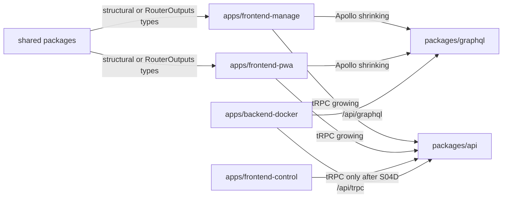
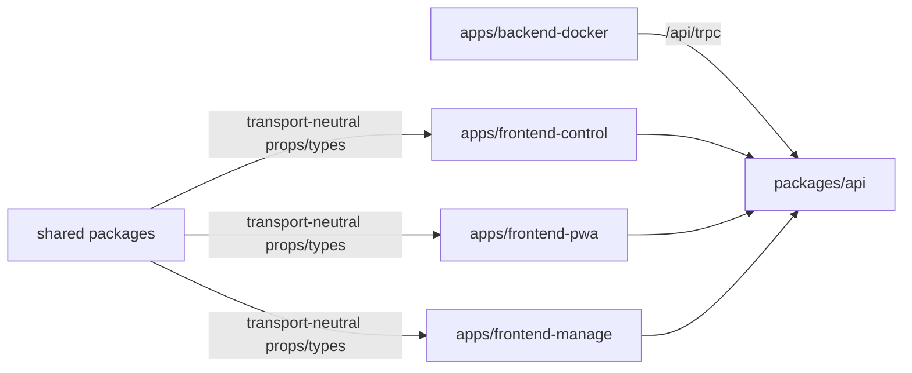

# Full Implementation Plan: GraphQL to tRPC Dual-API Migration

## Identity

Plan path: `project/plans_future/graphql-to-trpc-dual-api-migration/FULL_IMPLEMENTATION_PLAN.md`

Goal prompt: `project/plans_future/graphql-to-trpc-dual-api-migration/GOAL_PROMPT.md`

Branch: `codex/trpc-dual-api-migration`

Target branch: `v3`

Repository worktree: `.claude/worktrees/trpc-dual-api`

Supporting files:

- `project/plans_future/graphql-to-trpc-dual-api-migration/README.md`
- `project/plans_future/graphql-to-trpc-dual-api-migration/S00-plan-and-audit.md`
- `project/plans_future/graphql-to-trpc-dual-api-migration/S01-api-package-kernel.md`
- `project/plans_future/graphql-to-trpc-dual-api-migration/S02-backend-dual-mount.md`
- `project/plans_future/graphql-to-trpc-dual-api-migration/S03-client-provider-shells.md`
- `project/plans_future/graphql-to-trpc-dual-api-migration/S04-vertical-migrations.md`
- `project/plans_future/graphql-to-trpc-dual-api-migration/S05-realtime-migration.md`
- `project/plans_future/graphql-to-trpc-dual-api-migration/S06-final-cleanup.md`

Sources:

- Local KlickerUZH codebase inspection.
- Existing tRPC dual-stack branch commits.
- `graphql-to-trpc-migration` skill and GBL UZH migration lessons.
- Current repository instructions in `AGENTS.md`.

## Goal

Problem: KlickerUZH currently depends on GraphQL/Yoga/Pothos/codegen, Apollo Client, generated operation types, persisted query artifacts, and GraphQL subscriptions across the backend, PWA, manage app, control app, shared components, tests, scripts, and deployment assumptions.

Goal: migrate the product to tRPC end to end while keeping GraphQL live in parallel until all active consumers have moved and final cleanup gates prove GraphQL can be removed safely.

Success:

- `packages/api` owns the application API.
- `/api/trpc` serves all app workflows.
- GraphQL and tRPC coexist during S04/S05.
- Apollo hooks/providers and generated GraphQL operation imports are gone from active apps before GraphQL deletion.
- Realtime flows use tRPC subscriptions or transport-neutral event invalidation.
- `/api/graphql`, GraphQL WS, `packages/graphql`, codegen, generated/persisted artifacts, and GraphQL dependencies are removed only in S06 after explicit cleanup approval.
- Full repository checks and browser smoke flows pass without GraphQL.

## Non-Goals

- Do not rewrite product behavior while changing transport.
- Do not replace Prisma schema, Hatchet flows, auth model, Redis usage, grading logic, or deployment topology unless GraphQL coupling blocks migration.
- Do not remove GraphQL during S04/S05.
- Do not migrate by generated-file count; migrate by user workflow.
- Do not force shared components to tRPC-only types while Apollo-backed callers still exist.
- Do not introduce broad new abstractions unless they remove real transport coupling.

## Current State

Done and committed:

- S00: migration planning/audit files exist.
- S01: `@klicker-uzh/api` package exists with tRPC foundation.
- S02: backend mounts `/api/trpc` beside `/api/graphql`.
- S03: tRPC providers exist beside Apollo in control, PWA, and manage.
- S04A: frontend-control read pilot was runtime-verified and committed.
- S04B: frontend-control live-quiz reads migrated and committed.
- S04C: frontend-control mutations migrated and committed.
- S04D: frontend-control Apollo/provider/dependency removal completed and committed.

Committed markers:

- `d940d86d7 docs(api): plan dual-stack trpc migration`
- `ccffa7518 feat(api): add dual-stack trpc foundation`
- `a20a32aaa fix(check): restore dependency ordering`
- `c6be4df9c feat(api): port dual-stack control pilot`
- `9fd2c326c docs(project): add end-to-end trpc migration plan`
- `4d28f1d87 docs(project): record control trpc runtime verification`
- `df2d8f16e docs(project): refine trpc migration plan`
- `a274ab4b6 feat(api): migrate control read screens to trpc`
- `d53406154 feat(api): migrate control mutations to trpc`
- `0e437a306 chore(control): remove apollo after trpc migration`

Current next action:

- Start S04E: PWA participant shell and low-risk course reads.

Still intentionally live:

- `packages/graphql`
- `/api/graphql`
- GraphQL WS/subscriptions
- GraphQL codegen and persisted operation artifacts
- Apollo in PWA and manage
- Generated GraphQL types for unmigrated PWA/manage/shared callers

## Hard Rules

Do:

- Keep GraphQL mounted and working until S06.
- Add new API behavior under `packages/api/src/**`.
- Use existing GraphQL resolvers/services as behavior source.
- Extract transport-neutral services only when tRPC needs logic currently trapped in GraphQL-specific modules.
- Validate procedure inputs with Zod.
- Use SuperJSON consistently.
- Return explicit DTOs; do not return broad Prisma records.
- Preserve enum string values, nullability, authorization, cookies, redirects, and side effects.
- Use type-only router imports in browser code.
- Update this plan's `Progress` section before and after every slice.
- Commit one slice at a time with conventional commit messages.
- Run review and simplification before each slice commit when subagent tooling is available; otherwise do an explicit self-review and record the tooling gap.

Avoid:

- Browser imports from `appRouter`, Prisma client runtime, backend runtime modules, or Node-only modules.
- New runtime imports from `@klicker-uzh/graphql` inside `packages/api`.
- Global type rewrites before the consuming workflow has migrated.
- Combining reads, mutations, realtime, app cleanup, and backend cleanup in one commit.
- Removing GraphQL dependencies or generated artifacts because one app was migrated.

## Architecture During Migration



Final architecture:



## Execution Cadence

For every slice:

1. Read this plan and the relevant supporting slice file.
2. Check `git status --short --branch`; preserve unrelated user changes.
3. Update `Progress` with active slice, operation mapping, write scope, intended verification, and cleanup gates.
4. Inspect GraphQL documents, generated op types, resolvers, services/helpers, permissions, side effects, and active consumers.
5. Implement the smallest complete workflow migration.
6. Add focused tests when behavior is cheap to isolate.
7. Run fastest meaningful checks first, then app build/check.
8. Browser-verify UI slices with `npx agent-browser` screenshots when local stack/data allow.
9. Run coexistence audit during S04/S05, cleanup audit during S06.
10. Review correctness, scope, security impact, and test gaps.
11. Simplify incidental complexity.
12. Re-run affected checks.
13. Update `Progress` with evidence, residual risk, and next slice.
14. Commit only the slice files.

Operation mapping template:

```text
Slice:
GraphQL operation(s):
GraphQL resolver(s):
Behavior source:
tRPC router.procedure:
Input schema:
Output DTO:
Active frontend consumers:
Apollo cache/refetch/subscription behavior:
React Query replacement:
Browser verification path:
Cleanup blocked until:
```

## Tooling

Use the repository-pinned toolchain:

```bash
volta run --node 20.19.4 --pnpm 10.15.0 pnpm <command>
```

Focused checks after API changes:

```bash
volta run --node 20.19.4 --pnpm 10.15.0 pnpm --filter @klicker-uzh/api test
volta run --node 20.19.4 --pnpm 10.15.0 pnpm --filter @klicker-uzh/api check
volta run --node 20.19.4 --pnpm 10.15.0 pnpm --filter @klicker-uzh/api build
volta run --node 20.19.4 --pnpm 10.15.0 pnpm --filter @klicker-uzh/backend-docker check
```

Focused checks after app changes:

```bash
volta run --node 20.19.4 --pnpm 10.15.0 pnpm --filter <target-app> check
volta run --node 20.19.4 --pnpm 10.15.0 pnpm --filter <target-app> build
```

Broad checks at major gates:

```bash
volta run --node 20.19.4 --pnpm 10.15.0 pnpm run check
volta run --node 20.19.4 --pnpm 10.15.0 pnpm run check:all
volta run --node 20.19.4 --pnpm 10.15.0 pnpm run build
volta run --node 20.19.4 --pnpm 10.15.0 pnpm run test:run
```

Browser verification:

```bash
npx agent-browser open <local-url>
npx agent-browser screenshot /tmp/<slice>-before.png --full
npx agent-browser screenshot /tmp/<slice>-after.png --full
```

Use current tRPC docs before changing subscription or client-link code. Prefer Context7 if available; otherwise use official tRPC docs and verify against installed package versions.

## Audit Commands

Coexistence audit during S04/S05:

```bash
rg -n "@apollo/client|ApolloProvider|@klicker-uzh/graphql|/api/graphql|graphql-yoga|graphql-ws" apps packages cypress package.json pnpm-lock.yaml turbo.json
rg -n "@trpc|createTRPC|/api/trpc|type AppRouter|TrpcProvider" apps packages package.json pnpm-lock.yaml
```

Per-app Apollo gate:

```bash
rg -n "@apollo/client|ApolloProvider|useApollo|SSELink|GraphQLWsLink|graphql-ws|@klicker-uzh/graphql|useQuery|useMutation|useSubscription|subscribeToMore" apps/<app>
```

Generated type leak gate:

```bash
rg -n "@klicker-uzh/graphql/dist/ops|TypedDocumentNode|src/graphql/ops|ops\\.ts|ops\\.schema|client\\.json|server\\.json" apps packages cypress
```

API no-GraphQL-runtime gate:

```bash
rg -n "@klicker-uzh/graphql|packages/graphql|graphql/dist" packages/api apps/*/src
```

Final cleanup gate:

```bash
rg -n "@apollo/client|ApolloProvider|@klicker-uzh/graphql|graphql-yoga|graphql-ws|graphql-codegen|@pothos|graphql-scalars|/api/graphql" apps packages cypress deploy docs project package.json pnpm-lock.yaml turbo.json
```

## Progress

### 2026-06-03 Completed: S04E1 PWA Participant Identity and Low-Risk Course Reads

Status: complete for the scoped slice. Control app has completed its GraphQL-to-tRPC migration and Apollo cleanup. PWA now uses tRPC for participant shell identity plus the bookmarks/practice course landing reads migrated in this slice. PWA and manage remain mixed Apollo/tRPC. GraphQL backend remains intentionally live.

Goal: add participant read procedures and migrate the smallest PWA read consumers while keeping PWA Apollo mounted for login, join, push, activity, and realtime flows.

Write scope:

- `packages/api/src/trpc/procedures.ts`
- `packages/api/src/trpc/root.ts`
- `packages/api/src/trpc/routers/participant.ts`
- `packages/api/src/trpc/schemas/participant.ts`
- `packages/api/src/trpc/dto/participant.ts`
- `packages/api/src/trpc/__tests__/participant-read.test.ts`
- `apps/frontend-pwa/src/components/Layout.tsx`
- `apps/frontend-pwa/src/components/common/Header.tsx` only for the prop boundary if needed
- `apps/frontend-pwa/src/pages/bookmarks.tsx`
- `apps/frontend-pwa/src/pages/practice.tsx`
- `apps/frontend-pwa/src/pages/index.tsx` only for the locale-only `SelfDocument` read if it stays small

```text
Slice: S04E1 PWA participant identity and low-risk course reads
GraphQL operation(s): SelfDocument, GetParticipantCoursesDocument, GetPracticeCoursesDocument
GraphQL resolver(s): self, participantCourses, getPracticeCourses
Behavior source: ParticipantService.getSelf, CourseService.getParticipantCourses, ParticipantService.getPracticeCourses
tRPC router.procedure: participant.self, participant.courses, participant.practiceCourses
Input schema: optional liveQuizId for self
Output DTO: self participant DTO, course list DTO, practice course DTO
Active frontend consumers: Layout, bookmarks page, practice landing page, optional index locale redirect
Apollo cache/refetch/subscription behavior: read-only hooks; keep PWA Apollo mounted for unmigrated flows
React Query replacement: tRPC useQuery with enabled guards and normal query invalidation
Browser verification path: participant login, course list/bookmarks/practice pages
Cleanup blocked until: all PWA reads, mutations, realtime, and app Apollo gates complete
```

Implementation notes:

- `participant.self` should be public and return `{ self: null }` when no authenticated user exists, matching GraphQL.
- `participant.self` must preserve the `PARTICIPANT` and `TEMPORARY_PARTICIPANT` branches, including `liveQuizId` handling.
- `participant.courses` and `participant.practiceCourses` should require `PARTICIPANT`.
- The PWA bundle must not import Prisma runtime enums; use router output types or literal role strings.
- Header mutations and `SelfDocument` refetches stay GraphQL-backed until S04G.

Planned checks:

```bash
volta run --node 20.19.4 --pnpm 10.15.0 pnpm --filter @klicker-uzh/api test
volta run --node 20.19.4 --pnpm 10.15.0 pnpm --filter @klicker-uzh/api check
volta run --node 20.19.4 --pnpm 10.15.0 pnpm --filter @klicker-uzh/api build
volta run --node 20.19.4 --pnpm 10.15.0 pnpm --filter @klicker-uzh/frontend-pwa check
volta run --node 20.19.4 --pnpm 10.15.0 pnpm --filter @klicker-uzh/frontend-pwa build
rg -n "SelfDocument|GetParticipantCoursesDocument|GetPracticeCoursesDocument" apps/frontend-pwa/src
```

Implementation result:

- Added `participantProcedure` and mounted `participantRouter` under `participant`.
- Added DTO helpers for self, temporary self, participant course, and practice course outputs.
- Added `participant.self`, `participant.courses`, and `participant.practiceCourses` in `packages/api`.
- Migrated PWA `Layout`, `bookmarks`, `practice`, and the locale-only `index` self read to tRPC.
- Kept PWA Apollo mounted and left header mutations, login, join, push, activity, and realtime flows on GraphQL for later S04 slices.
- Added focused API tests for anonymous self, participant self, temporary participant self, participant courses, practice-course filtering/sorting, and participant role guarding.

Review / simplification:

- Local diff review performed for router, DTO, tests, and migrated PWA consumers. Dedicated subagent review was not run because the available multi-agent tool contract only permits spawning when the user explicitly asks for delegation.
- Simplified `participant.practiceCourses` sorting to compare `endDate.getTime()` values directly, preserving stable equality behavior instead of returning `1` for equal dates.

Verification evidence:

```bash
volta run --node 20.19.4 --pnpm 10.15.0 pnpm exec prettier --config .prettierrc.mjs --write <S04E1 files>
# pass

volta run --node 20.19.4 --pnpm 10.15.0 pnpm --filter @klicker-uzh/api test
# pass: 4 files, 23 tests

volta run --node 20.19.4 --pnpm 10.15.0 pnpm --filter @klicker-uzh/api check
# pass

volta run --node 20.19.4 --pnpm 10.15.0 pnpm --filter @klicker-uzh/api build
# pass

volta run --node 20.19.4 --pnpm 10.15.0 pnpm --filter @klicker-uzh/frontend-pwa check
# pass

volta run --node 20.19.4 --pnpm 10.15.0 pnpm --filter @klicker-uzh/frontend-pwa build
# pass; existing warnings: next-config MODULE_TYPELESS_PACKAGE_JSON, next-intl App Router migration warning, PWA disabled logs, Browserslist old data, large page-data warnings

rg -n "SelfDocument|GetParticipantCoursesDocument|GetPracticeCoursesDocument" apps/frontend-pwa/src/components/Layout.tsx apps/frontend-pwa/src/pages/bookmarks.tsx apps/frontend-pwa/src/pages/practice.tsx apps/frontend-pwa/src/pages/index.tsx
# pass: no matches in migrated files

rg -n "GetParticipantCoursesDocument|GetPracticeCoursesDocument" apps/frontend-pwa/src
# pass: no matches

git diff --check
# pass

rg -n "@klicker-uzh/api|@klicker-uzh/prisma/client|packages/api/src|packages/prisma" apps/frontend-pwa/src
# pass: only type-only `@klicker-uzh/api` import remains in `apps/frontend-pwa/src/lib/trpc.tsx`
```

Runtime/browser evidence:

- Branch backend on `http://127.0.0.1:3100` served `GET /api/trpc/system.health` with `api: trpc`, `status: ok`.
- Unauthenticated `participant.self` returned `{ self: null }` via tRPC.
- Authenticated seeded participant smoke used local participant `testuser1` with a sessionStorage token generated from the same local JWT shape as `createParticipantToken`; token was not printed. Direct tRPC runtime check returned `selfUser: testuser1`, `courses: 1`, `practiceCourses: 0`.
- Branch PWA ran on `http://127.0.0.1:3102` against `NEXT_PUBLIC_API_URL=http://127.0.0.1:3100/api/graphql`, with the tRPC client deriving `/api/trpc`.
- `npx agent-browser --session pwa-s04e1` opened and screenshot `/login`, `/bookmarks`, and `/practice`.
- Screenshots reviewed:
  - `/tmp/klicker-pwa-s04e1-login.png`
  - `/tmp/klicker-pwa-s04e1-login-after-submit.png`
  - `/tmp/klicker-pwa-s04e1-bookmarks.png`
  - `/tmp/klicker-pwa-s04e1-practice.png`
- `/bookmarks` rendered `My Bookmarks` with course `Testkurs`; browser errors output empty.
- `/practice` rendered `Practice Pool` empty state; browser errors output empty.
- Local GraphQL password-login attempt stayed on `/login`; a direct ad-hoc GraphQL login mutation returned `PersistedQueryOnly`. This is an unmigrated GraphQL auth-path caveat, not part of the migrated S04E1 read procedures. S04G must handle auth/login migration and verify password login normally.

Coexistence audit:

- `rg -n "@apollo/client|ApolloProvider|@klicker-uzh/graphql|/api/graphql|graphql-yoga|graphql-ws" apps/frontend-pwa apps/frontend-manage apps/backend-docker packages/graphql package.json pnpm-lock.yaml` still reports PWA/manage/backend/packages/graphql/lockfile hits by design. GraphQL/Apollo remain live until later S04/S05 consumers migrate and S06 cleanup gates pass.

Residual risk / next step:

- S04E1 intentionally did not migrate `ParticipationsDocument`, login/auth, joins, push registration, activity/account mutations, bookmark mutations, practice quiz detail/attempt flows, or realtime. Next slice: S04F PWA home, participations, and course landing reads.

## Remaining Implementation Plan

### S04E PWA Participant Shell and Course Reads

Goal: establish participant-side tRPC reads without touching risky auth, join, answer submission, or realtime flows.

Dependencies:

- S03 PWA provider shell exists.
- GraphQL remains live.
- Control app migration is complete and can serve as tRPC client pattern.

Likely operations:

- `SelfDocument`
- `GetParticipantCoursesDocument`
- `GetPracticeCoursesDocument`
- `ParticipationsDocument` only after the first small sub-slice is stable.

Do:

1. Audit all PWA imports of `SelfDocument`, participant course list operations, `ParticipationsDocument`, and generated participant/course types.
2. Add `participantProcedure` or equivalent role guard for `UserRole.PARTICIPANT`.
3. Add `participant.self` that preserves current anonymous/null, participant, and temporary participant behavior.
4. Add `participant.courses` for participant course list reads.
5. Add `participant.practiceCourses` for practice landing reads.
6. Keep PWA Apollo provider mounted and leave login/join/push/realtime flows on GraphQL.
7. Migrate the smallest pages first: layout/profile bootstrapping, bookmarks, practice course landing, and optional index locale redirect.
8. Add DTO tests for self mapping, temporary participant mapping, and course filtering if practical.
9. Run PWA check/build and API test/check/build.
10. Browser smoke participant login state plus migrated pages.

Avoid:

- Do not migrate `ParticipationsDocument` together with subscription-backed home behavior unless the sub-slice stays small.
- Do not import Prisma client runtime into browser code for `UserRole`; compare enum strings or use output types.
- Do not remove generated PWA types globally.

Check:

```bash
volta run --node 20.19.4 --pnpm 10.15.0 pnpm --filter @klicker-uzh/api test
volta run --node 20.19.4 --pnpm 10.15.0 pnpm --filter @klicker-uzh/api check
volta run --node 20.19.4 --pnpm 10.15.0 pnpm --filter @klicker-uzh/api build
volta run --node 20.19.4 --pnpm 10.15.0 pnpm --filter @klicker-uzh/frontend-pwa check
volta run --node 20.19.4 --pnpm 10.15.0 pnpm --filter @klicker-uzh/frontend-pwa build
rg -n "SelfDocument|GetParticipantCoursesDocument|GetPracticeCoursesDocument" apps/frontend-pwa/src
```

Commit: `feat(api): migrate pwa participant reads to trpc`

### S04F PWA Home, Participations, and Course Landing Reads

Goal: migrate participant home/course overview reads after the identity shell works.

Likely operations:

- `ParticipationsDocument`
- Course landing/activity-list reads.
- Assessment-mode equivalents if the same components are shared.

Do:

1. Map `ParticipationsDocument` fields, GraphQL subscription/refetch coupling, push-subscription mutation coupling, and microlearning/live-quiz list usage.
2. Add `participant.participations` with inputs for `endpoint` and `assessmentOnly`.
3. Preserve course filtering, ordering, active/current microlearning filtering, published live quiz filtering, and subscriptions filtered by endpoint.
4. Keep GraphQL subscription callers on GraphQL until S05. If a page needs subscription data, tRPC reads can coexist with GraphQL subscriptions temporarily.
5. Replace Apollo read hooks with tRPC reads and React Query invalidation where possible.
6. Browser verify PWA home, course overview, assessment-domain variant if available.

Check:

```bash
volta run --node 20.19.4 --pnpm 10.15.0 pnpm --filter @klicker-uzh/api test
volta run --node 20.19.4 --pnpm 10.15.0 pnpm --filter @klicker-uzh/frontend-pwa check
volta run --node 20.19.4 --pnpm 10.15.0 pnpm --filter @klicker-uzh/frontend-pwa build
rg -n "ParticipationsDocument|subscribeToMore|useSubscription" apps/frontend-pwa/src
```

Commit: `feat(api): migrate pwa home reads to trpc`

### S04G PWA Auth, Join, Account, and Push Mutations

Goal: migrate auth-adjacent participant mutations only after PWA read state is stable.

Likely operations:

- Participant login/logout variants.
- Magic link, SSO, temporary, and LTI-adjacent GraphQL calls.
- Join course with PIN.
- Participant account create/activate/update/delete.
- Push subscription register/unregister.

Risks:

- Cookie domain and token storage.
- Embedded/LTI redirects.
- Assessment domain behavior.
- Apollo mutation errors shown in UI.

Do:

1. Split by flow if one commit becomes large: login/logout, join, account, push.
2. Preserve token/cookie semantics exactly.
3. Add server tests for invalid credentials, invalid PIN/token, role mismatch, and cookie output where practical.
4. Replace Apollo mutation handling with tRPC mutation hooks and error mapping.
5. Replace Apollo refetches with targeted React Query invalidation.
6. Browser verify participant login, logout, join course, account update, and push registration if local browser permissions allow.

Check:

```bash
volta run --node 20.19.4 --pnpm 10.15.0 pnpm --filter @klicker-uzh/api test
volta run --node 20.19.4 --pnpm 10.15.0 pnpm --filter @klicker-uzh/frontend-pwa check
volta run --node 20.19.4 --pnpm 10.15.0 pnpm --filter @klicker-uzh/frontend-pwa build
rg -n "useMutation\\(|refetchQueries|cache\\.|Push|Login|Join|Participant" apps/frontend-pwa/src
```

Commit: one commit per flow group, for example `feat(api): migrate pwa join flow to trpc`

### S04H PWA Practice Quiz, Microlearning, and Non-Realtime Activity Flows

Goal: migrate participant activity workflows that do not require subscription replacement.

Likely scope:

- Practice quiz overview and execution.
- Bookmark reads/mutations not completed in S04E.
- Microlearning overview/detail/evaluation reads.
- Non-realtime answer submission and feedback mutations.

Do:

1. Map activity GraphQL operations by user journey, not by generated filename.
2. Build activity DTOs compatible with shared components.
3. Preserve answer submission, grading, XP, availability, and completion semantics.
4. Keep shared component props structural where manage still uses GraphQL.
5. Replace Apollo refetches/cache edits with React Query invalidation.
6. Browser verify representative practice quiz and microlearning flows.

Check:

```bash
volta run --node 20.19.4 --pnpm 10.15.0 pnpm --filter @klicker-uzh/api test
volta run --node 20.19.4 --pnpm 10.15.0 pnpm --filter @klicker-uzh/frontend-pwa check
volta run --node 20.19.4 --pnpm 10.15.0 pnpm --filter @klicker-uzh/frontend-pwa build
rg -n "@apollo/client|@klicker-uzh/graphql|useQuery|useMutation|refetchQueries|cache\\." apps/frontend-pwa/src
```

Commit: one commit per activity family.

### S04I PWA Group Activity Non-Realtime

Goal: migrate group activity reads and mutations while leaving subscriptions for S05.

Likely scope:

- Group join/create/random pool operations.
- Group activity stack reads.
- Group messages/submissions/participant actions that are not realtime-only.

Do:

1. Separate query/mutation migration from subscription migration.
2. Preserve group membership authorization and group assignment semantics.
3. Keep GraphQL `subscribeToMore`/subscription consumers until S05.
4. Browser verify group creation/join and participant interaction.

Check:

```bash
volta run --node 20.19.4 --pnpm 10.15.0 pnpm --filter @klicker-uzh/api test
volta run --node 20.19.4 --pnpm 10.15.0 pnpm --filter @klicker-uzh/frontend-pwa check
volta run --node 20.19.4 --pnpm 10.15.0 pnpm --filter @klicker-uzh/frontend-pwa build
```

Commit: `feat(api): migrate pwa group activity workflow to trpc`

### S04J Manage Shell, Settings, Course List, and Dashboard Reads

Goal: establish manage app tRPC usage with low-risk lecturer reads.

Likely scope:

- Manage layout and user profile/settings.
- Course list/dashboard reads.
- Navigation/course metadata reads.
- Analytics navigation reads that do not need heavy reporting payloads.

Do:

1. Reuse/adapt lecturer/user DTOs from control where safe.
2. Add page-specific course summary DTOs.
3. Keep Apollo mounted.
4. Avoid broad course detail DTOs that pull authoring/evaluation data prematurely.
5. Browser verify delegated login, dashboard, and a course page.

Check:

```bash
volta run --node 20.19.4 --pnpm 10.15.0 pnpm --filter @klicker-uzh/api test
volta run --node 20.19.4 --pnpm 10.15.0 pnpm --filter @klicker-uzh/frontend-manage check
volta run --node 20.19.4 --pnpm 10.15.0 pnpm --filter @klicker-uzh/frontend-manage build
```

Commit: `feat(api): migrate manage shell reads to trpc`

### S04K Manage Resources, Sharing, Catalog, Groups, and Collections Reads

Goal: migrate read-heavy manage domains before write workflows.

Likely scope:

- Sharing views.
- Catalog/browser views.
- Resource views.
- Group views.
- Answer collection views.
- Tag read views.

Do:

1. Build domain routers only as needed: `sharing`, `catalog`, `resources`, `groups`, `answerCollections`, `tags`.
2. Preserve permission checks from GraphQL services.
3. Use DTOs tailored to tables/cards/selectors.
4. Replace generated type imports in touched shared helpers with structural types.
5. Browser verify representative list/detail pages.

Check:

```bash
volta run --node 20.19.4 --pnpm 10.15.0 pnpm --filter @klicker-uzh/api test
volta run --node 20.19.4 --pnpm 10.15.0 pnpm --filter @klicker-uzh/frontend-manage check
volta run --node 20.19.4 --pnpm 10.15.0 pnpm --filter @klicker-uzh/frontend-manage build
```

Commit: one commit per domain.

### S04L Manage Course and Activity Authoring Mutations

Goal: migrate manage write workflows for courses and activities.

Likely scope:

- Course create/edit/archive/delete.
- Live quiz create/edit/delete.
- Practice quiz create/edit/delete.
- Microlearning create/edit/delete.
- Group activity create/edit/delete.
- Template operations.
- Batch operations.
- Upload/file metadata calls when GraphQL-backed.

Risks:

- Complex wizard state.
- Apollo cache updates and broad refetches.
- Server validation and permission levels.
- File upload/SAS flows.

Do:

1. Split by wizard/action family.
2. Move input validation schemas close to procedures.
3. Reuse existing service logic for element manipulation and activity creation.
4. Replace Apollo cache/refetch behavior with targeted invalidation.
5. Browser verify create/edit/save/delete cycles for each migrated family.
6. Keep unrelated authoring families on Apollo until their slice.

Check:

```bash
volta run --node 20.19.4 --pnpm 10.15.0 pnpm --filter @klicker-uzh/api test
volta run --node 20.19.4 --pnpm 10.15.0 pnpm --filter @klicker-uzh/frontend-manage check
volta run --node 20.19.4 --pnpm 10.15.0 pnpm --filter @klicker-uzh/frontend-manage build
```

Commit: one commit per wizard/action family.

### S04M Manage Element, Tag, and Answer Collection Editing

Goal: migrate high-use content editing surfaces and keep editors transport-neutral.

Likely scope:

- Element manipulation components.
- Element data editing for supported question types.
- Tag CRUD.
- Answer collection CRUD.
- Media/file metadata interactions.

Do:

1. Preserve element data discriminants and shape semantics.
2. Keep shared editor components transport-neutral.
3. Avoid generated GraphQL types in shared props.
4. Run browser smoke for representative element type creation/editing.
5. Check browser bundle for server-only import leaks through app builds.

Check:

```bash
volta run --node 20.19.4 --pnpm 10.15.0 pnpm --filter @klicker-uzh/api test
volta run --node 20.19.4 --pnpm 10.15.0 pnpm --filter @klicker-uzh/frontend-manage check
volta run --node 20.19.4 --pnpm 10.15.0 pnpm --filter @klicker-uzh/frontend-manage build
```

Commit: one commit per authoring family.

### S04N Manage Analytics, Evaluation, Grading, and Reporting

Goal: migrate reporting/evaluation pages after activity DTOs are stable.

Likely scope:

- Analytics overview/activity/performance pages.
- Live quiz evaluation.
- Practice quiz evaluation.
- Microlearning evaluation.
- Group activity grading.
- Point corrections and scoring views.

Risks:

- Large nested payloads.
- Date and Decimal serialization.
- Chart/table components using generated GraphQL types.

Do:

1. Use SuperJSON and explicit Decimal conversions with `!= null` checks.
2. Create DTOs around chart/table needs instead of exposing resolver internals.
3. Browser verify representative analytics/evaluation pages.
4. Add procedure tests for permission boundaries and numeric conversion cases.

Check:

```bash
volta run --node 20.19.4 --pnpm 10.15.0 pnpm --filter @klicker-uzh/api test
volta run --node 20.19.4 --pnpm 10.15.0 pnpm --filter @klicker-uzh/frontend-manage check
volta run --node 20.19.4 --pnpm 10.15.0 pnpm --filter @klicker-uzh/frontend-manage build
```

Commit: one commit per reporting family.

### S04O Secondary Runtime Consumers, Scripts, and Cypress

Goal: find and migrate non-obvious GraphQL consumers outside the three main frontend apps.

Likely scope:

- Cypress support, fixtures, or custom commands.
- Node scripts calling `/api/graphql` or importing generated operations.
- Backend workers or integration apps that import `@klicker-uzh/graphql`.
- Documentation examples that are executable or used by tests.
- Office add-in/auth/chat/lti/response-api if audits reveal active GraphQL clients.

Do:

1. Run repo-wide consumer audit.
2. Classify hits as active runtime, test-only, docs-only, or historical plan text.
3. Migrate active runtime/test consumers to tRPC.
4. Leave historical archived plans unchanged unless they confuse active tooling.
5. Update generated-operation dependent Cypress helpers before deleting GraphQL.

Check:

```bash
rg -n "@apollo/client|@klicker-uzh/graphql|/api/graphql|GraphQL|graphql" apps packages cypress scripts util deploy package.json turbo.json
volta run --node 20.19.4 --pnpm 10.15.0 pnpm run check
```

Commit: one commit per consumer class, for example `chore(tests): migrate cypress api helpers to trpc`

### S04P Generated Type Leak Cleanup During Mixed State

Goal: remove generated GraphQL type imports from migrated helpers/components without breaking mixed Apollo/tRPC callers.

Do:

1. Audit generated type-only imports in migrated app areas and shared packages.
2. Replace with `RouterOutputs`, local domain interfaces, or narrow structural types.
3. Keep shared props structural until all callers are tRPC.
4. Do not delete generated files yet.

Check:

```bash
rg -n "@klicker-uzh/graphql/dist/ops|TypedDocumentNode|ElementBlockStatus|PublicationStatus|src/graphql/ops" apps packages/shared-components packages/markdown
volta run --node 20.19.4 --pnpm 10.15.0 pnpm run check
```

Commit: `chore(types): replace generated graphql type leaks`

### S04Q API No-GraphQL Runtime Dependency Gate

Goal: prove the new API package can survive final GraphQL deletion.

Why: during coexistence GraphQL may delegate to new `packages/api` services, but `packages/api` must not depend on `packages/graphql` at runtime.

Do:

1. Audit every API/app import from `@klicker-uzh/graphql`.
2. Replace type-only generated imports with `RouterOutputs`, local structural types, or non-GraphQL domain enums.
3. Extract transport-neutral runtime services into `packages/api/src/services/**` or another server-only non-GraphQL package.
4. Update GraphQL to delegate to extracted services while it still exists.
5. Confirm `packages/api` has no runtime dependency on `@klicker-uzh/graphql`.

Check:

```bash
volta run --node 20.19.4 --pnpm 10.15.0 pnpm --filter @klicker-uzh/api check
volta run --node 20.19.4 --pnpm 10.15.0 pnpm --filter @klicker-uzh/api build
rg -n "@klicker-uzh/graphql|packages/graphql|graphql/dist" packages/api apps/*/src
```

Commit: `chore(api): remove graphql runtime dependency from trpc api`

### S05A Realtime Audit and Transport-Neutral Event Bridge

Goal: decouple event publishing from GraphQL-specific pubSub while GraphQL subscriptions still work.

Known event names to audit:

- `runningLiveQuizUpdated`
- `liveQuizSettingsChanged`
- `feedbackCreated`
- `feedbackPinned`
- `feedbackAdded`
- `feedbackRemoved`
- `feedbackUpdated`
- `groupActivityStarted`
- `groupActivityEnded`
- `singleGroupActivityEnded`
- `microLearningEnded`

Do:

1. Audit all GraphQL subscriptions, payloads, filters, and publisher call sites.
2. Define a transport-neutral event envelope: event name, domain key, payload DTO, timestamp, and optional source metadata.
3. Add server-only event bridge under `packages/api/src/trpc/events/**` or a better existing server-only location.
4. Bridge current GraphQL pubSub publishing so old subscribers keep receiving old payloads.
5. Add event envelope/helper tests.
6. Do not migrate clients in this slice.

Check:

```bash
rg -n "ctx\\.pubSub\\.publish|pubSub\\.publish|pubSub\\.subscribe|createPubSub|useSubscription|subscribeToMore|GraphQLWsLink|graphql-ws" apps packages
volta run --node 20.19.4 --pnpm 10.15.0 pnpm --filter @klicker-uzh/api test
volta run --node 20.19.4 --pnpm 10.15.0 pnpm --filter @klicker-uzh/backend-docker check
```

Commit: `feat(api): add realtime event bridge`

### S05B tRPC Subscription Transport Setup

Goal: add subscription-capable tRPC client/server plumbing where realtime clients need it.

Do:

1. Confirm current tRPC subscription API for the installed package version.
2. Add server subscription procedures for one smoke event if useful.
3. Add client `splitLink`/subscription link only to apps that need subscriptions.
4. Keep query/mutation links stable.
5. Preserve cookies/credentials behavior for local, production, embedded, and assessment domains.

Check:

```bash
volta run --node 20.19.4 --pnpm 10.15.0 pnpm --filter @klicker-uzh/api check
volta run --node 20.19.4 --pnpm 10.15.0 pnpm --filter @klicker-uzh/frontend-pwa check
volta run --node 20.19.4 --pnpm 10.15.0 pnpm --filter @klicker-uzh/frontend-manage check
```

Commit: `feat(api): add trpc subscription clients`

### S05C PWA Live Quiz Realtime

Goal: replace PWA live quiz GraphQL subscription flows with tRPC subscriptions or event-triggered invalidation.

Likely scope:

- Live quiz block updates.
- Live quiz settings changes.
- Feedback events relevant to participant live quiz views.

Do:

1. Add tRPC subscription procedures filtered by quiz/course/session keys.
2. Replace `subscribeToMore`/`useSubscription` in one live quiz flow at a time.
3. Prefer React Query invalidation/refetch over manual cache surgery unless UI state needs direct patching.
4. Verify with two browser sessions.
5. Confirm GraphQL subscription clients still work until all consumers are gone.

Check:

```bash
rg -n "subscribeToMore|useSubscription|GraphQLWsLink|graphql-ws" apps/frontend-pwa
volta run --node 20.19.4 --pnpm 10.15.0 pnpm --filter @klicker-uzh/frontend-pwa check
volta run --node 20.19.4 --pnpm 10.15.0 pnpm --filter @klicker-uzh/frontend-pwa build
```

Commit: `feat(api): migrate pwa live quiz realtime to trpc`

### S05D PWA Microlearning and Group Activity Realtime

Goal: replace remaining PWA subscription workflows.

Likely scope:

- `microLearningEnded`
- `groupActivityStarted`
- `groupActivityEnded`
- `singleGroupActivityEnded`

Do:

1. Migrate one event family at a time.
2. Preserve filtering by course/activity/group/participant.
3. Verify with two sessions when local data allows.
4. Record live-only/reconnect limitations if no replay ID exists.

Check:

```bash
rg -n "subscribeToMore|useSubscription|GraphQLWsLink|graphql-ws" apps/frontend-pwa
volta run --node 20.19.4 --pnpm 10.15.0 pnpm --filter @klicker-uzh/frontend-pwa check
volta run --node 20.19.4 --pnpm 10.15.0 pnpm --filter @klicker-uzh/frontend-pwa build
```

Commit: one commit per realtime family.

### S05E Manage Realtime

Goal: replace manage/cockpit/lecturer realtime GraphQL subscriptions.

Likely scope:

- Lecturer live quiz feedback create/update/pin/remove events.
- Cockpit live quiz updates.
- Audience interaction feedback paths.

Do:

1. Add manage-facing subscription procedures or reuse event procedures with role checks.
2. Replace Apollo subscription hooks.
3. Use invalidation/refetch for query-backed panels.
4. Verify lecturer/participant two-session flow for feedback/live quiz updates.

Check:

```bash
rg -n "subscribeToMore|SubscribeToMoreOptions|useSubscription|GraphQLWsLink|graphql-ws" apps/frontend-manage
volta run --node 20.19.4 --pnpm 10.15.0 pnpm --filter @klicker-uzh/frontend-manage check
volta run --node 20.19.4 --pnpm 10.15.0 pnpm --filter @klicker-uzh/frontend-manage build
```

Commit: `feat(api): migrate manage realtime to trpc`

### S05F Realtime GraphQL Client Removal Gate

Goal: remove app GraphQL WS client dependencies after no app subscriptions remain.

Gate:

```bash
rg -n "subscribeToMore|SubscribeToMoreOptions|useSubscription|GraphQLWsLink|graphql-ws" apps/frontend-control apps/frontend-manage apps/frontend-pwa
```

Do:

1. Remove app-side `graphql-ws` dependencies only when gates are clean.
2. Remove obsolete app subscription links/helpers.
3. Keep backend GraphQL WS until S06.

Check:

```bash
volta run --node 20.19.4 --pnpm 10.15.0 pnpm install --lockfile-only
volta run --node 20.19.4 --pnpm 10.15.0 pnpm run check
```

Commit: `chore(apps): remove graphql ws clients`

### S05G App-Level Apollo Removal Gates

Goal: remove Apollo app by app after each app has no active Apollo consumers.

Order:

1. `frontend-pwa`
2. `frontend-manage`
3. Any secondary app found by S04O

Gate per app:

```bash
rg -n "@apollo/client|ApolloProvider|useApollo|SSELink|GraphQLWsLink|graphql-ws|@klicker-uzh/graphql|useQuery|useMutation|useSubscription|subscribeToMore" apps/<app>
```

Do:

1. Confirm remaining hits are provider/helper/package files only.
2. Remove provider/helper/dependency.
3. Update lockfile with package manifest changes.
4. Browser smoke the app.
5. Keep backend GraphQL and `packages/graphql` until S06.

Check:

```bash
volta run --node 20.19.4 --pnpm 10.15.0 pnpm install --lockfile-only
volta run --node 20.19.4 --pnpm 10.15.0 pnpm --filter <target-app> check
volta run --node 20.19.4 --pnpm 10.15.0 pnpm --filter <target-app> build
```

Commit: one commit per app, for example `chore(pwa): remove apollo after trpc migration`

### S06A Final GraphQL Cleanup Readiness Review

Goal: prove final GraphQL removal is truly unblocked.

Dependencies:

- All S04 workflow migrations complete.
- All S05 realtime migrations complete.
- App-level Apollo removal gates complete.
- Generated type leak cleanup complete.
- `packages/api` has no GraphQL runtime dependency.

Do:

1. Run all cleanup audits.
2. Check deployment, local dev, docs, generated artifacts, package scripts, Cypress, and lockfile references.
3. Classify remaining hits as active blockers, historical docs/plans, or acceptable references.
4. Check whether any external/public GraphQL compatibility requirement exists.
5. Record explicit user approval for final GraphQL removal in this plan.
6. Stop if any active consumer remains or approval is absent.

Check:

```bash
rg -n "@apollo/client|ApolloProvider|@klicker-uzh/graphql|graphql-yoga|graphql-ws|graphql-codegen|@pothos|graphql-scalars|/api/graphql" apps packages cypress deploy docs project package.json pnpm-lock.yaml turbo.json
volta run --node 20.19.4 --pnpm 10.15.0 pnpm run check
```

Commit: `docs(project): record graphql cleanup readiness`

### S06B Remove Backend GraphQL Runtime

Goal: remove `/api/graphql`, Yoga, persisted operation loading, GraphQL WS server, and GraphQL-only pubSub bridge.

Do:

1. Remove Yoga app mount from `apps/backend-docker`.
2. Remove GraphQL WS server setup.
3. Remove persisted GraphQL operation loading from backend runtime.
4. Remove GraphQL-specific pubSub bridge code after no GraphQL subscribers remain.
5. Keep tRPC endpoint and transport-neutral event bridge.
6. Update health/runtime smoke docs if they mention GraphQL endpoint.

Check:

```bash
volta run --node 20.19.4 --pnpm 10.15.0 pnpm --filter @klicker-uzh/backend-docker check
volta run --node 20.19.4 --pnpm 10.15.0 pnpm --filter @klicker-uzh/backend-docker build
```

Commit: `chore(api): remove graphql backend runtime`

### S06C Remove `packages/graphql`, Codegen, and Persisted Operation Artifacts

Goal: delete the GraphQL package and generated artifacts only after no workspace package depends on them.

Do:

1. Remove all workspace dependencies on `@klicker-uzh/graphql`.
2. Delete `packages/graphql`.
3. Remove GraphQL codegen scripts and Turbo dependencies.
4. Remove generated SDL/introspection/persisted operation files.
5. Update workspace lockfile.

Check:

```bash
volta run --node 20.19.4 --pnpm 10.15.0 pnpm install --lockfile-only
volta run --node 20.19.4 --pnpm 10.15.0 pnpm run check
volta run --node 20.19.4 --pnpm 10.15.0 pnpm run build
```

Commit: `chore(api): remove graphql package`

### S06D Remove GraphQL Docs, Deploy, Env, and Lockfile Residue

Goal: clean non-code residue after runtime/package removal.

Do:

1. Update local dev docs from GraphQL API assumptions to tRPC API assumptions.
2. Update deployment charts/manifests if GraphQL-specific env/routes remain.
3. Update package scripts, Turbo env/dependency declarations, and lockfile residue.
4. Update `AGENTS.md` quick reference if GraphQL workflow instructions are obsolete.
5. Keep historical archived plans unchanged unless they affect active audits/tooling.

Check:

```bash
rg -n "GraphQL|graphql|Apollo|apollo|/api/graphql|@klicker-uzh/graphql|graphql-yoga|graphql-ws|graphql-codegen" apps packages cypress deploy docs project package.json pnpm-lock.yaml turbo.json AGENTS.md
volta run --node 20.19.4 --pnpm 10.15.0 pnpm run check:all
```

Commit: `docs(api): remove graphql migration residue`

### S06E Final End-to-End Verification Without GraphQL

Goal: prove the repo works without GraphQL.

Required checks:

```bash
volta run --node 20.19.4 --pnpm 10.15.0 pnpm install --frozen-lockfile
volta run --node 20.19.4 --pnpm 10.15.0 pnpm run check:all
volta run --node 20.19.4 --pnpm 10.15.0 pnpm run build
volta run --node 20.19.4 --pnpm 10.15.0 pnpm run test:run
```

Required browser flows:

- Manage delegated login, dashboard, and course view.
- Manage create/edit representative activity.
- Manage live quiz cockpit and feedback if realtime remains user-visible.
- PWA participant login, course overview, practice quiz, microlearning, group activity.
- PWA live quiz with two-session realtime updates.
- Control course list/detail, unassigned page, and live quiz control flow.

Required audits:

```bash
rg -n "@apollo/client|ApolloProvider|@klicker-uzh/graphql|graphql-yoga|graphql-ws|graphql-codegen|@pothos|graphql-scalars|/api/graphql" apps packages cypress deploy docs project package.json pnpm-lock.yaml turbo.json
rg -n "@trpc|/api/trpc|TrpcProvider|createTRPC" apps packages package.json pnpm-lock.yaml
```

Do:

1. Record command results and browser screenshot paths in `Progress`.
2. Record pre-existing or environment failures separately with evidence.
3. Run final security review and handle/defer findings explicitly.

Commit: `docs(project): record final trpc verification`

### S07 MR/PR Finish

Goal: prepare the branch for review and merge.

Do:

1. Run final security review if not already completed in S06E.
2. Update this plan with final status, residual risks, and `Next Steps`.
3. Use `$mr-description-writer` for the MR/PR body.
4. Build the MR/PR body from:
   - `git log v3..HEAD`
   - `git diff --stat v3...HEAD`
   - `git diff --name-status v3...HEAD`
   - this plan's `Progress`
   - verification screenshots
   - existing MR/PR body, if any
5. Create a draft MR/PR unless the user asks for ready.
6. If an MR/PR ID becomes known and workflow requires it, rename only the current plan file in a separate metadata commit.

Commit: metadata/documentation commit only if needed.

## Final Acceptance Criteria

Done when:

- No active Apollo hooks/providers remain.
- No active generated GraphQL operation imports remain.
- No app-side GraphQL WS clients remain.
- No GraphQL endpoint or GraphQL WS server remains.
- No workspace package depends on `@klicker-uzh/graphql`.
- `packages/graphql` and GraphQL codegen artifacts are removed.
- `packages/api` owns all app API workflows.
- Main manage/PWA/control flows pass browser smoke.
- Realtime workflows pass two-session verification where practical.
- Full repository checks pass or any pre-existing/environmental failures are documented with evidence.
- Cleanup audits are clean or contain only intentional historical references.
- MR/PR body reflects the whole branch and remaining manual verification.

## Stop Conditions

Stop and report before S06 if:

- Any active Apollo/GraphQL consumer remains.
- Any app still imports generated GraphQL operation types for active code.
- Any GraphQL subscription consumer remains.
- External/public GraphQL compatibility is required.
- User has not approved final GraphQL removal.

Stop within a slice if:

- The local behavior source is unclear and guessing would change product behavior.
- Auth/cookie/LTI/assessment semantics cannot be verified from code or local runtime.
- Browser runtime verification is required but local infrastructure is unavailable. Record the gap and ask whether to continue with code-only checks.

## Residual Risks To Track

- Realtime may be live-only without replay IDs; document reconnect behavior.
- PWA token/cookie behavior differs across normal, assessment, embedded, and LTI modes.
- Manage authoring mutations have broad cache invalidation behavior that needs workflow-level verification.
- Generated GraphQL types are embedded in shared components; structural props are safer during mixed state.
- Final GraphQL removal is high-risk and needs explicit approval after all audits are clean.

## Next Steps

1. Implement S04E1: PWA participant identity and low-risk course reads.
2. Keep PWA Apollo mounted for unmigrated flows.
3. Use S04F/S04G/S04H for PWA mutations and activities.
4. Move to manage read/write/reporting slices.
5. Migrate realtime in S05.
6. Request explicit S06 cleanup approval only after all active consumers and audits are clean.
