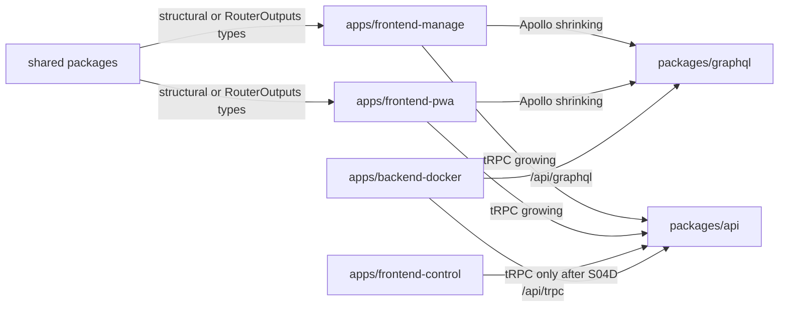
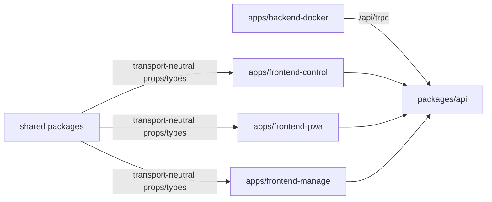

# Full Implementation Plan: GraphQL to tRPC Dual-API Migration

## Identity

Plan path: `project/plans_future/graphql-to-trpc-dual-api-migration/FULL_IMPLEMENTATION_PLAN.md`

Goal prompt: `project/plans_future/graphql-to-trpc-dual-api-migration/GOAL_PROMPT.md`

Branch: `codex/trpc-dual-api-migration`

Target branch: `v3`

Repository worktree: `.claude/worktrees/trpc-dual-api`

Supporting files:

- `project/plans_future/graphql-to-trpc-dual-api-migration/README.md`
- `project/plans_future/graphql-to-trpc-dual-api-migration/S00-plan-and-audit.md`
- `project/plans_future/graphql-to-trpc-dual-api-migration/S01-api-package-kernel.md`
- `project/plans_future/graphql-to-trpc-dual-api-migration/S02-backend-dual-mount.md`
- `project/plans_future/graphql-to-trpc-dual-api-migration/S03-client-provider-shells.md`
- `project/plans_future/graphql-to-trpc-dual-api-migration/S04-vertical-migrations.md`
- `project/plans_future/graphql-to-trpc-dual-api-migration/S05-realtime-migration.md`
- `project/plans_future/graphql-to-trpc-dual-api-migration/S06-final-cleanup.md`

Sources:

- Local KlickerUZH codebase inspection.
- Existing tRPC dual-stack branch commits.
- `graphql-to-trpc-migration` skill and GBL UZH migration lessons.
- Current repository instructions in `AGENTS.md`.

## Goal

Problem: KlickerUZH currently depends on GraphQL/Yoga/Pothos/codegen, Apollo Client, generated operation types, persisted query artifacts, and GraphQL subscriptions across the backend, PWA, manage app, control app, shared components, tests, scripts, and deployment assumptions.

Goal: migrate the product to tRPC end to end while keeping GraphQL live in parallel until all active consumers have moved and final cleanup gates prove GraphQL can be removed safely.

Success:

- `packages/api` owns the application API.
- `/api/trpc` serves all app workflows.
- GraphQL and tRPC coexist during S04/S05.
- Apollo hooks/providers and generated GraphQL operation imports are gone from active apps before GraphQL deletion.
- Realtime flows use tRPC subscriptions or transport-neutral event invalidation.
- `/api/graphql`, GraphQL WS, `packages/graphql`, codegen, generated/persisted artifacts, and GraphQL dependencies are removed only in S06 after explicit cleanup approval.
- Full repository checks and browser smoke flows pass without GraphQL.

## Non-Goals

- Do not rewrite product behavior while changing transport.
- Do not replace Prisma schema, Hatchet flows, auth model, Redis usage, grading logic, or deployment topology unless GraphQL coupling blocks migration.
- Do not remove GraphQL during S04/S05.
- Do not migrate by generated-file count; migrate by user workflow.
- Do not force shared components to tRPC-only types while Apollo-backed callers still exist.
- Do not introduce broad new abstractions unless they remove real transport coupling.

## Current State

Done and committed:

- S00: migration planning/audit files exist.
- S01: `@klicker-uzh/api` package exists with tRPC foundation.
- S02: backend mounts `/api/trpc` beside `/api/graphql`.
- S03: tRPC providers exist beside Apollo in control, PWA, and manage.
- S04A: frontend-control read pilot was runtime-verified and committed.
- S04B: frontend-control live-quiz reads migrated and committed.
- S04C: frontend-control mutations migrated and committed.
- S04D: frontend-control Apollo/provider/dependency removal completed and committed.

Committed markers:

- `d940d86d7 docs(api): plan dual-stack trpc migration`
- `ccffa7518 feat(api): add dual-stack trpc foundation`
- `a20a32aaa fix(check): restore dependency ordering`
- `c6be4df9c feat(api): port dual-stack control pilot`
- `9fd2c326c docs(project): add end-to-end trpc migration plan`
- `4d28f1d87 docs(project): record control trpc runtime verification`
- `df2d8f16e docs(project): refine trpc migration plan`
- `a274ab4b6 feat(api): migrate control read screens to trpc`
- `d53406154 feat(api): migrate control mutations to trpc`
- `0e437a306 chore(control): remove apollo after trpc migration`

Current next action:

- S04Q GraphQL/tRPC package test parity is complete and verified in CI:
  the GraphQL package workflow still runs against `packages/graphql`, and the
  new API package workflow runs against `packages/api`.
- S04Q-R package test parity refresh is complete locally: keep the GraphQL
  check visibly tied to `packages/graphql`, make the tRPC API check visibly tied
  to `packages/api`, and request both package checks for dual-API package
  changes.
- S05A PWA microlearning-ended realtime is complete.
- S05D PWA group-activity realtime is complete and pushed.
- S05B PWA live-quiz state/settings realtime is complete and pushed.
- S05C PWA feedback realtime is complete locally. It replaces the PWA
  feedback-area GraphQL `subscribeToMore` subscriptions with tRPC invalidation
  subscriptions while keeping the existing GraphQL feedback query/mutations.
- S05E manage feedback realtime is complete locally. It replaces
  manage cockpit/lecturer GraphQL feedback `subscribeToMore` subscriptions with
  tRPC invalidation subscriptions while keeping existing GraphQL
  cockpit/lecturer queries and mutations.
- S05F app-side GraphQL WS cleanup is complete locally. Scope was limited to removing
  Apollo GraphQL websocket links and direct app `graphql-ws` dependencies now
  that app GraphQL subscription consumers are gone; Apollo HTTP GraphQL stays
  live for remaining queries and mutations.
- S05G-A PWA live-quiz AccountSelector self-query cleanup is complete locally.
  Scope was limited to replacing the modal's Apollo `SelfDocument` query with
  the existing `trpc.participant.self` query; the broader live-quiz session,
  feedback, and leaderboard GraphQL consumers remain live for follow-up slices.
- S05G-B PWA live-quiz leaderboard self-query cleanup is complete locally.
  Scope was limited to replacing the leaderboard's Apollo `SelfDocument` query
  with `trpc.participant.self` and decoupling the shared `Leaderboard`
  participant prop from the generated GraphQL `Participant` type; the leaderboard
  data query itself remains GraphQL.
- S05G-C PWA live-quiz feedback data/mutation cleanup is complete locally.
  Scope was limited to replacing the PWA feedback-area GraphQL query/mutations
  with participant tRPC procedures and focused API parity tests; live-quiz
  session and leaderboard data queries remain GraphQL.
- S05G-D PWA live-quiz leaderboard data-query cleanup is complete locally.
  Scope was limited to replacing `GetLiveQuizLeaderboardDocument` in the PWA
  leaderboard component with a participant tRPC query while keeping GraphQL
  live. The larger PWA `/session/[id]` data query remains GraphQL.
- S05G-E PWA live-quiz session self-query cleanup is complete locally. It keeps
  test GraphQL coverage visibly running against `packages/graphql`, keeps the
  matching tRPC API package coverage visibly running against `packages/api`, and
  migrates only the PWA `/session/[id]` self-query from `SelfDocument` to
  `trpc.participant.self`; pin and SSR live-quiz behavior remain GraphQL.
- S05G-F PWA live-quiz session PIN mutation cleanup is complete locally. It
  ports GraphQL-equivalent published-quiz, invalid-PIN, stale-cookie clearing,
  and one-day PIN-cookie behavior into `packages/api`, adds tRPC tests, and
  migrates `/session/[id]` from `SetLiveQuizPinDocument` to
  `trpc.participant.setLiveQuizPin`.
- S05G-G PWA live-quiz session running data-query cleanup is complete locally.
  It migrates the PWA `/session/[id]` running-live-quiz data query and SSR
  redirect behavior to `participant.runningLiveQuiz`, preserves
  GraphQL-equivalent assessment-domain, auth redirect, participation, PIN,
  solution-stripping, and correlation-key semantics, and adds focused tRPC API
  parity tests for that behavior.
- S05G-H manage lecturer live-quiz view cleanup is complete locally. It keeps
  the GraphQL package workflow visibly tied to `packages/graphql`, adds focused
  tRPC API coverage for the same lecturer-view behavior in `packages/api`, and
  migrates only the active manage lecturer page consumer.
- S05G-I manage live-quiz QR modal profile-read cleanup is complete locally.
  It migrates the modal from Apollo `UserProfileDocument` to the existing tRPC
  `user.profile` query.
- S05G-J manage live-quiz cancellation cleanup is complete locally. It
  migrates the cancel modal summary read and abort mutation from Apollo/GraphQL
  to tRPC, keeps GraphQL live, keeps the GraphQL package workflow visibly tied
  to `packages/graphql`, and adds focused `packages/api` tRPC parity coverage
  for the GraphQL cancel behavior.
- S05G-K manage live-quiz timeline generated type cleanup is complete locally.
  It removes the `@klicker-uzh/graphql` `LocaleType` import from
  `LiveQuizTimeline` while preserving the local `de` / `en` locale contract
  shared with the QR modal.
- S05G-L manage live-quiz cockpit cleanup is complete locally. It migrates the
  cockpit page query plus block/end mutations from Apollo/GraphQL to tRPC,
  extracts a `liveQuiz.cockpit` API service with GraphQL-equivalent timeline
  participant counts, feedback mapping, and confusion summary behavior, removes
  the remaining generated GraphQL timeline block types from the migrated cockpit
  path, keeps the GraphQL package workflow visibly tied to `packages/graphql`,
  and adds focused `packages/api` tRPC parity coverage for the cockpit behavior.
- S05G-M manage live-quiz audience interaction cleanup is complete locally. It
  migrates lecturer feedback/settings mutations in `AudienceInteraction` from
  Apollo/GraphQL to tRPC, preserves GraphQL-equivalent realtime side effects
  including moderation auto-publish, keeps the GraphQL package workflow visibly
  tied to `packages/graphql`, and adds focused `packages/api` tRPC parity
  coverage for the same behavior.
- S05G-N manage live-quiz abortion confirmation generated type cleanup is
  complete locally. It removes the generated GraphQL `LiveQuizSummary` import
  from the already migrated cancellation confirmation path and replaces it with
  a narrow local structural counter type.
- S05G-O PWA live-quiz generated type cleanup is complete locally. It removes
  the remaining direct generated GraphQL imports from the PWA live-quiz session
  page and live-quiz question/storage components by typing the already migrated
  `participant.runningLiveQuiz` payload from `RouterOutputs` and keeping the
  old shared GraphQL shape isolated at shared-component boundaries.
- S05G-P shared-components constants generated enum cleanup is complete locally.
  It introduces local shared `ElementType` / `ElementDisplayMode` constants and
  removes the generated GraphQL enum import from `constants.ts` while keeping
  `QUESTION_GROUPS` and `ACTIVE_CHART_TYPES` compatible with mixed GraphQL/tRPC
  consumers.
- S05G-Q shared-components choice answer option generated type cleanup is
  complete locally. It removes generated GraphQL imports from the choice
  answer-option/feedback components by using local enum constants and narrow
  structural `Choice` / `QuestionFeedback` types.
- S05G-R GraphQL/tRPC package logic test parity is complete locally. It keeps
  the focused GraphQL package tests visibly running against `packages/graphql`
  and adds a `packages/api` parity test covering the same stack-feedback and
  random-group behavior in the tRPC API package workflow.
- S05G-S shared validate-response generated option type cleanup is complete
  locally. It removes the generated GraphQL option-type import from shared
  `validateResponse` by adding narrow local structural option types, while
  keeping GraphQL/Apollo live.
- S05G-T selection answer-options generated option type cleanup is complete
  locally. It removes the generated GraphQL option-type import from the
  `SELECTIONAnswerOptions` leaf component by using a narrow local structural
  option type.
- S05G-U case-study case leaf generated option type cleanup is complete
  locally. Scope was limited to replacing the `CSCase` leaf component's generated
  `CaseStudyElementOptions` import with a narrow local structural option type.
  Broader case-study question/evaluation generated types stay live for later
  slices.
- S05G-V flashcard correctness generated enum cleanup is complete locally.
  Scope was limited to replacing the shared `Flashcard` / `StudentElement` generated
  `FlashcardCorrectness` import with a local enum constant/type matching the
  generated UI shape.
- S05G-W content element generated instance type cleanup is complete locally.
  Scope was limited to replacing the `ContentElement` leaf component's generated
  `ElementInstance` import with a narrow local structural content instance
  shape.
- S05G-X practice-quiz points generated evaluation type cleanup is complete
  locally. Scope was limited to replacing the `PracticeQuizPoints` generated
  `InstanceEvaluation` import with a narrow local structural base evaluation
  type.
- S05G-Y free-text question/evaluation generated type cleanup is complete
  locally. Scope was limited to replacing `FreeTextQuestion` / `FTEvaluation`
  generated `FreeTextElementOptions` and `FreeTextInstanceEvaluation` imports
  with narrow local structural types.
- S05G-Z numerical question/evaluation and histogram generated type cleanup is
  complete locally. Scope was limited to replacing generated numerical
  option/evaluation, histogram range/statistics, and `ElementType` imports in
  the numerical shared-component leaf path with local structural types.
- S05G-AA shared evaluation chart generated activity-evaluation type cleanup is
  complete locally. Scope was limited to replacing generated
  `ElementInstanceEvaluation` and `ElementType` imports in the table/bar/word-cloud
  chart leaf components and their small data hooks with local structural
  activity-evaluation types.
- S05G-AB next: continue with the next smallest shared-components generated
  enum/type cleanup while keeping GraphQL/Apollo live. Do not start S06 cleanup
  until all S05 gates are clean and explicitly reviewed.
- Do not start S06 cleanup until all S05 realtime slices are complete and
  explicitly reviewed.

Still intentionally live:

- `packages/graphql`
- `/api/graphql`
- GraphQL WS/subscriptions
- GraphQL codegen and persisted operation artifacts
- Apollo in PWA and manage
- Generated GraphQL types for unmigrated PWA/manage/shared callers

## Hard Rules

Do:

- Keep GraphQL mounted and working until S06.
- Add new API behavior under `packages/api/src/**`.
- Use existing GraphQL resolvers/services as behavior source.
- Extract transport-neutral services only when tRPC needs logic currently trapped in GraphQL-specific modules.
- Validate procedure inputs with Zod.
- Use SuperJSON consistently.
- Return explicit DTOs; do not return broad Prisma records.
- Preserve enum string values, nullability, authorization, cookies, redirects, and side effects.
- Use type-only router imports in browser code.
- Update this plan's `Progress` section before and after every slice.
- Commit one slice at a time with conventional commit messages.
- Run review and simplification before each slice commit when subagent tooling is available; otherwise do an explicit self-review and record the tooling gap.

Avoid:

- Browser imports from `appRouter`, Prisma client runtime, backend runtime modules, or Node-only modules.
- New runtime imports from `@klicker-uzh/graphql` inside `packages/api`.
- Global type rewrites before the consuming workflow has migrated.
- Combining reads, mutations, realtime, app cleanup, and backend cleanup in one commit.
- Removing GraphQL dependencies or generated artifacts because one app was migrated.

## Architecture During Migration



Final architecture:



## Execution Cadence

For every slice:

1. Read this plan and the relevant supporting slice file.
2. Check `git status --short --branch`; preserve unrelated user changes.
3. Update `Progress` with active slice, operation mapping, write scope, intended verification, and cleanup gates.
4. Inspect GraphQL documents, generated op types, resolvers, services/helpers, permissions, side effects, and active consumers.
5. Implement the smallest complete workflow migration.
6. Add focused tests when behavior is cheap to isolate.
7. Run fastest meaningful checks first, then app build/check.
8. Browser-verify UI slices with `npx agent-browser` screenshots when local stack/data allow.
9. Run coexistence audit during S04/S05, cleanup audit during S06.
10. Review correctness, scope, security impact, and test gaps.
11. Simplify incidental complexity.
12. Re-run affected checks.
13. Update `Progress` with evidence, residual risk, and next slice.
14. Commit only the slice files.

Operation mapping template:

```text
Slice:
GraphQL operation(s):
GraphQL resolver(s):
Behavior source:
tRPC router.procedure:
Input schema:
Output DTO:
Active frontend consumers:
Apollo cache/refetch/subscription behavior:
React Query replacement:
Browser verification path:
Cleanup blocked until:
```

## Tooling

Use the repository-pinned toolchain:

```bash
volta run --node 20.19.4 --pnpm 10.15.0 pnpm <command>
```

Focused checks after API changes:

```bash
volta run --node 20.19.4 --pnpm 10.15.0 pnpm --filter @klicker-uzh/api test
volta run --node 20.19.4 --pnpm 10.15.0 pnpm --filter @klicker-uzh/api check
volta run --node 20.19.4 --pnpm 10.15.0 pnpm --filter @klicker-uzh/api build
volta run --node 20.19.4 --pnpm 10.15.0 pnpm --filter @klicker-uzh/backend-docker check
```

Focused checks after app changes:

```bash
volta run --node 20.19.4 --pnpm 10.15.0 pnpm --filter <target-app> check
volta run --node 20.19.4 --pnpm 10.15.0 pnpm --filter <target-app> build
```

Broad checks at major gates:

```bash
volta run --node 20.19.4 --pnpm 10.15.0 pnpm run check
volta run --node 20.19.4 --pnpm 10.15.0 pnpm run check:all
volta run --node 20.19.4 --pnpm 10.15.0 pnpm run build
volta run --node 20.19.4 --pnpm 10.15.0 pnpm run test:run
```

Browser verification:

```bash
npx agent-browser open <local-url>
npx agent-browser screenshot /tmp/<slice>-before.png --full
npx agent-browser screenshot /tmp/<slice>-after.png --full
```

Use current tRPC docs before changing subscription or client-link code. Prefer Context7 if available; otherwise use official tRPC docs and verify against installed package versions.

## Audit Commands

Coexistence audit during S04/S05:

```bash
rg -n "@apollo/client|ApolloProvider|@klicker-uzh/graphql|/api/graphql|graphql-yoga|graphql-ws" apps packages cypress package.json pnpm-lock.yaml turbo.json
rg -n "@trpc|createTRPC|/api/trpc|type AppRouter|TrpcProvider" apps packages package.json pnpm-lock.yaml
```

Per-app Apollo gate:

```bash
rg -n "@apollo/client|ApolloProvider|useApollo|SSELink|GraphQLWsLink|graphql-ws|@klicker-uzh/graphql|useQuery|useMutation|useSubscription|subscribeToMore" apps/<app>
```

Generated type leak gate:

```bash
rg -n "@klicker-uzh/graphql/dist/ops|TypedDocumentNode|src/graphql/ops|ops\\.ts|ops\\.schema|client\\.json|server\\.json" apps packages cypress
```

API no-GraphQL-runtime gate:

```bash
rg -n "@klicker-uzh/graphql|packages/graphql|graphql/dist" packages/api apps/*/src
```

Final cleanup gate:

```bash
rg -n "@apollo/client|ApolloProvider|@klicker-uzh/graphql|graphql-yoga|graphql-ws|graphql-codegen|@pothos|graphql-scalars|/api/graphql" apps packages cypress deploy docs project package.json pnpm-lock.yaml turbo.json
```

## Progress

### 2026-06-21 In Progress: CI and Review Blocker Follow-up

Status: in progress. Scope remains PR #5132 tRPC dual-API stabilization and
already migrated client surfaces only. No S05/S06 cleanup or new migration slice
has been started.

Current branch-state review:

- The active commit worktree is on `codex/trpc-dual-api-migration`; the original
  Codex checkout path is not a usable git checkout in the current environment.
- The current uncommitted changes add value for PR readiness because they address
  concrete CI/review blockers: auth lint naming, CodeQL login redirect handling,
  Cypress/Playwright build-origin drift, Cypress service startup rebuilds, and
  the markdown build process not exiting reliably.
- GitGuardian is still a historical branch finding on older commits; current
  head no longer contains the credential-like literals. Passing that check will
  require either dashboard dismissal or an approved history rewrite.

Changes pushed in `3f31a27b5`:

- Renamed auth helpers so React hook lint no longer treats them as hooks.
- Hardened PWA login redirects to same-origin paths and switched the client
  redirect to `router.replace`.
- Kept Cypress and Playwright builds on local app origins while restoring service
  startup to use already-built test services.
- Added explicit Node 24 setup to the lint workflow.
- Added `--forceExit` to the markdown Rollup build to avoid hanging test builds.

Verification so far:

- `pnpm --filter @klicker-uzh/auth lint`
- `pnpm --filter @klicker-uzh/frontend-pwa check`
- `prettier --check` on the changed workflow/script/auth/PWA files.
- `pnpm --filter @klicker-uzh/markdown build:test` passed after the Rollup
  exit fix. It still prints the existing `@uzh-bf/design-system` type-resolution
  warning during Rollup type declaration generation.

Second-pass UX/cache cleanup prepared:

- PWA course-specific join form now matches the standalone join form behavior:
  it clears stale errors on submit, distinguishes invalid PIN from generic
  failures, shows submit loading, awaits navigation, and always releases Formik
  submitting state in `finally`.
- Manage ownership-transfer mutation now awaits both object-permission cache
  invalidations through React Query's mutation lifecycle.
- Inline answer-collection creation now supports async
  `onAnswerCollectionCreated` callbacks and returns the
  `answerCollectionsInfo` invalidation promise in both live-quiz-template and
  element-edit flows.
- PWA course leaderboard join/leave mutations now await targeted leaderboard
  and course overview invalidation, show a system-error toast on failure, show
  loading on the standalone join button, and keep the leave modal open with a
  loading primary action until the leave mutation succeeds.
- Frontend-control live quiz control mutations now catch activation,
  deactivation, and end-quiz failures, show a system-error toast, and avoid
  moving local block state or navigating when the server action fails.
- Frontend-control logout now shows a loading icon, awaits navigation on
  success, and shows a system-error toast when the tRPC logout mutation fails or
  returns a false result.
- Frontend-manage live quiz cockpit now renders a system-error notification
  instead of an indefinite loader when the migrated cockpit query fails.
- Frontend-manage live quiz cockpit activation, deactivation, and end-quiz
  actions now catch tRPC mutation failures, show a system-error toast, and avoid
  invalidating/navigating on failed or false end-quiz responses.
- PWA live-quiz feedback submission now always releases the submit state,
  surfaces failed tRPC submission with a system-error toast, and refetches the
  feedback list after successful submission without turning a failed refetch into
  a failed submission.
- PWA public feedback voting now treats the local upvote/reaction state as an
  optimistic update with rollback: failed tRPC vote mutations restore local UI
  state plus `localForage`, show a system-error toast, and disable duplicate
  clicks while a vote is pending.
- PWA participant group controls now disable form submits while mutations are
  loading, show button-mode loading states, and surface unexpected create,
  join-by-code, random-pool join, and random-pool leave failures with
  system-error toasts while preserving existing invalid/full group messages.
- PWA group activity start now disables the start button while the tRPC mutation
  is pending, keeps the participant on the activity page if the mutation fails,
  and surfaces a system-error toast instead of leaving an unhandled rejection.
- PWA microlearning completion now disables the finish button while the tRPC
  mutation is pending, only invalidates/navigates after a successful completion,
  and shows a system-error toast on failure.
- PWA practice stack submission now disables duplicate submits while the tRPC
  mutation is pending, surfaces rejected/falsy submissions with a system-error
  toast, keeps entered responses intact on failure, and no longer turns a failed
  previous-evaluation invalidation into a failed local result render.
- PWA group activity answer submission now disables duplicate submits while the
  tRPC mutation is pending, surfaces rejected/falsy submissions with a
  system-error toast, and catches failed post-submit refreshes instead of
  leaving unhandled promise rejections.
- PWA practice element rating now catches rejected tRPC rating mutations,
  preserves the current visible vote on failure, and shows the existing
  rating-error toast.
- PWA header participant locale changes now catch rejected tRPC locale updates,
  await the locale route change, and keep failed cache invalidation from
  blocking a successful locale switch.
- PWA header participant logout now catches rejected/false tRPC logout results,
  keeps the participant token in place on failure, and shows a system-error
  toast instead of navigating to login after a failed logout.
- PWA account deletion now treats the tRPC delete result as authoritative:
  failed/rejected deletion keeps the modal open with a system-error toast, while
  successful deletion still clears the local participant token and reloads even
  if the best-effort logout mutation fails.
- Manage shared activity confirmation modals now catch rejected submit
  callbacks, keep the modal open, and show a system-error toast instead of
  relying on an unhandled promise rejection.
- Manage course archive/delete modals now treat the tRPC `{ course }` result as
  authoritative: failed/rejected mutations keep the modal open with a
  system-error toast, while successful mutations close the modal and treat
  `userCourses` invalidation as a best-effort refresh.
- Manage scheduled-activity publish confirmation now catches rejected/falsy
  tRPC publish results, keeps the modal open with a system-error toast on
  failure, and treats course-detail invalidation plus activity refetch as
  best-effort after a successful publish.
- Manage group-activity, microlearning, practice-quiz, live-quiz-reset, and
  course-removal confirmation modals now treat null tRPC mutation payloads as
  failed submissions that keep the modal open with the existing system-error
  toast, while post-success cache invalidation/refetch callbacks run as
  best-effort refreshes and no longer make successful mutations look failed.
- Manage user settings now catch rejected/falsy tRPC mutations for language,
  email preference, shortname, delegated-login create/delete, and delegated
  password changes. Controls are disabled while their mutations are pending,
  forms always release their submitting state, and cache refreshes run as
  best-effort work after confirmed server success.

Second-pass verification:

- Context7 docs checked for tRPC plus TanStack Query v4 mutation invalidation
  behavior; React Query awaits promise-returning mutation callbacks.
- `prettier --check` on the five changed PWA/manage files passed.
- `pnpm --filter @klicker-uzh/frontend-manage check` passed.
- `pnpm --filter @klicker-uzh/frontend-manage lint` passed with pre-existing
  hook warnings only.
- `pnpm --filter @klicker-uzh/frontend-pwa check` passed.
- `pnpm --filter @klicker-uzh/frontend-pwa lint` passed with pre-existing hook
  warnings only.
- Re-ran `prettier --check`, `pnpm --filter @klicker-uzh/frontend-pwa check`,
  and `pnpm --filter @klicker-uzh/frontend-pwa lint` after the leaderboard
  cleanup; all passed, with the same pre-existing PWA hook warnings only.
- Context7 docs checked for TanStack Query v4 mutation lifecycle behavior before
  the frontend-control mutation error-handling changes.
- `prettier --check` on the two changed frontend-control files passed.
- `pnpm --filter @klicker-uzh/frontend-control check` passed.
- `pnpm --filter @klicker-uzh/frontend-control lint` passed with no ESLint
  warnings or errors.
- `prettier --check` on the changed manage cockpit page passed.
- `pnpm --filter @klicker-uzh/frontend-manage check` passed.
- `pnpm --filter @klicker-uzh/frontend-manage lint` passed with pre-existing
  hook warnings only.
- Context7 docs checked for TanStack Query v4 optimistic update and rollback
  behavior before the PWA feedback vote rollback changes.
- `prettier --check` on the two changed PWA live-quiz feedback files passed.
- `pnpm --filter @klicker-uzh/frontend-pwa check` passed.
- `pnpm --filter @klicker-uzh/frontend-pwa lint` passed with pre-existing hook
  warnings only.
- `prettier --check` on the five changed PWA group-control files passed.
- `pnpm --filter @klicker-uzh/frontend-pwa check` passed.
- `pnpm --filter @klicker-uzh/frontend-pwa lint` passed with pre-existing hook
  warnings only.
- Context7 docs checked for current tRPC / TanStack Query mutation lifecycle
  and rollback/invalidation behavior before the PWA activity completion fixes.
- `node_modules/.bin/prettier --check` on the two changed PWA activity
  completion files passed.
- `../../node_modules/.bin/tsc --noEmit` from the dependency checkout
  `apps/frontend-pwa` passed with the two changed files mirrored for local
  dependency resolution.
- Narrow `next lint --file ...` for those two files was attempted from the
  dependency checkout but hung after printing only existing Next/next-intl
  warnings; direct ESLint CLI is not compatible with the repo's current
  `.eslintrc` setup under ESLint 9, so lint remains covered by prior full PWA
  lint passes and CI.
- Context7 docs checked for TanStack Query v4 mutation lifecycle behavior
  before the PWA practice/group activity submit and rating fixes.
- Synced the clean PR worktree into the dependency checkout while preserving
  `node_modules` and `.git` before validation; `rsync` only warned about stale
  Rollup cache directories it could not delete.
- `node_modules/.bin/prettier --check` on
  `ElementStack.tsx`, `GroupActivityStack.tsx`, and `InstanceHeader.tsx` passed.
- `../../node_modules/.bin/tsc --noEmit` from the dependency checkout
  `apps/frontend-pwa` passed.
- Narrow `next lint --file ...` for the three changed PWA components was
  attempted from the dependency checkout but hung after printing only existing
  Next/next-intl warnings.
- `node_modules/.bin/prettier --check` on `Header.tsx` and
  `AccountDeletionForm.tsx` passed.
- `../../node_modules/.bin/tsc --noEmit` from the dependency checkout
  `apps/frontend-pwa` passed after the header/account deletion fixes.
- Context7 docs checked for TanStack Query v4 mutation lifecycle behavior
  before the manage course modal failure-handling fixes.
- `node_modules/.bin/prettier --check` on `ActivityConfirmationModal.tsx`,
  `CourseArchiveModal.tsx`, `CourseDeletionModal.tsx`, and
  `PublishConfirmationModal.tsx` passed.
- `../../node_modules/.bin/tsc --noEmit` from the dependency checkout
  `apps/frontend-manage` passed after the manage modal fixes.
- Narrow `next lint --file ...` for the four changed manage modal files was
  attempted from the dependency checkout but hung after printing only existing
  Next/next-intl warnings.
- `git diff --check` passed.
- Context7 docs checked for TanStack Query v4 invalidation-from-mutation and
  tRPC `useUtils` query helper behavior before the manage confirmation-modal
  payload/refresh cleanup.
- `node_modules/.bin/prettier --check` on the eight changed manage confirmation
  modal files passed.
- `../../node_modules/.bin/tsc --noEmit` from the dependency checkout
  `apps/frontend-manage` passed after syncing the PR worktree into the
  dependency checkout; `rsync` only warned about stale Rollup cache directories.
- `git diff --check` passed after the manage confirmation-modal payload/refresh
  cleanup.
- Context7 docs checked for TanStack Query v4 mutation error handling,
  `mutateAsync`, loading guards, and invalidations before the manage settings
  failure-handling cleanup.
- `node_modules/.bin/prettier --check` on the five changed manage user-settings
  files passed.
- `../../node_modules/.bin/tsc --noEmit` from the dependency checkout
  `apps/frontend-manage` passed after the manage settings cleanup; `rsync` only
  warned about stale Rollup cache directories.
- `git diff --check` passed after the manage settings cleanup.
- Browser verification is still blocked because no local PWA/manage dev server
  is listening on `127.0.0.1:3001` or `127.0.0.1:3002`, no local backend is
  listening on `127.0.0.1:3000`, and no local control dev server is listening
  on `127.0.0.1:3003`.

PR #5132 status after `3f31a27b5`:

- Passing: lint, format, check, CodeQL, SonarCloud, package API tRPC Vitest,
  and most build/test jobs.
- Pending at last poll: Cypress Cloud, packages/graphql Vitest, and one
  remaining amd/arm build pair.
- Still failing: GitGuardian historical branch findings on older commits, which
  need dashboard dismissal or an approved history rewrite.

Open after the next push:

- Recheck Cypress Cloud, packages/graphql Vitest, and build completion on
  GitHub.
- Decide with the user whether to dismiss or rewrite historical GitGuardian
  findings.

### 2026-06-20 Completed: tRPC UX and Client Quality Audit First Pass

Status: complete for the first pass. User requested a fresh UX/client-quality
goal for the migrated tRPC surfaces. Scope was limited to already migrated tRPC
workflows, dual-API staging readiness, and PR #5132 review/CI follow-up. S06
GraphQL cleanup was not started, and no new migration slice was opened.

Goal prompt:

- `project/plans_future/graphql-to-trpc-dual-api-migration/GOAL_PROMPT.md`

Audit focus:

- Loading states and skeleton/fallback quality.
- Mutation pending state, double-submit prevention, and form reset behavior.
- Recoverable failure handling and toasts/inline errors.
- React Query/tRPC cache invalidation scope, `enabled` guards, and SSR/prefetch
  behavior.
- Optimistic updates only where rollback is straightforward.
- Installed API compatibility: `@trpc/*` `10.45.2` with
  `@tanstack/react-query` `4.42.0`; avoid v11-only adapter changes.

First-pass findings and fixes:

- PWA create-account course PIN join used `utils.participant.checkValidCoursePin.fetch`
  without a `try` / `finally`, so a network/server error could leave the Formik
  submit state stuck. It now shows a system-error toast, resets submit state in
  `finally`, exposes button loading, and uses Next route object navigation for
  the dynamic join route.
- PWA standalone join form used `joinCourseWithPin.mutateAsync` without
  failure recovery and could leave the submit state stuck. It now clears stale
  errors at submit start, shows inline invalid/generic errors, resets submit
  state in `finally`, invalidates participant participations on success, and
  exposes button loading.
- PR blocker cleanup: the control tRPC embedding-info test no longer uses the
  password-like `test-secret` HMAC fixture literal flagged by scanners.
- GitGuardian forward cleanup: participant auth/account-creation tRPC tests no
  longer use literal credential-like fixture values in current head. Existing
  GitGuardian incidents still reference older branch commits and may require
  dashboard dismissal or history rewrite.
- SonarCloud forward cleanup: the remaining current-head GitHub annotation on
  the control embedding-info HMAC fixture was replaced with a constructed
  neutral signing-key fixture.
- SonarCloud hotspot cleanup: generated group/course codes and shuffles now use
  Node `crypto.randomInt`; temporary leaderboard row ids are stable instead of
  random; legacy response aggregation MD5 bucket keys are centralized with an
  explicit non-security compatibility note so persisted aggregate buckets are
  not split.
- SonarCloud duplication gate cleanup: the 8.7% new-code duplication failure is
  concentrated in transitional dual-API parity code. `sonar.cpd.exclusions` now
  excludes only duplicate-line detection for `packages/api/src/trpc/**`, the two
  largest parity service files, and the three app tRPC client wrappers. The
  projected duplicate density drops to about 2.01%, while normal analysis,
  linting, typechecking, and tests still cover those files.

Verification:

- Current tRPC docs checked through Context7 for React Query/tRPC cache helpers,
  mutation lifecycle, batching/link setup, and SuperJSON compatibility.
- `pnpm exec prettier --check apps/frontend-pwa/src/components/forms/CreateAccountJoinForm.tsx apps/frontend-pwa/src/pages/join.tsx packages/api/src/trpc/__tests__/control-read.test.ts project/plans_future/graphql-to-trpc-dual-api-migration/GOAL_PROMPT.md project/plans_future/graphql-to-trpc-dual-api-migration/FULL_IMPLEMENTATION_PLAN.md`
  passed.
- `pnpm --filter @klicker-uzh/api test src/trpc/__tests__/control-read.test.ts`
  passed.
- `pnpm --filter @klicker-uzh/api test src/trpc/__tests__/participant-account-creation.test.ts src/trpc/__tests__/participant-auth.test.ts`
  passed.
- `pnpm --filter @klicker-uzh/frontend-pwa check` passed.
- `pnpm --filter @klicker-uzh/api build` passed.
- `./node_modules/.bin/vitest run src/trpc/__tests__/analytics-read.test.ts src/trpc/__tests__/course-groups.test.ts src/trpc/__tests__/course-leaderboard.test.ts src/trpc/__tests__/manage-activities.test.ts src/trpc/__tests__/participant-groups.test.ts src/trpc/__tests__/participant-group-activities.test.ts src/trpc/__tests__/participant-live-quiz-session.test.ts`
  from `packages/api` passed: 142 tests.
- `./node_modules/.bin/tsc --noEmit` from `packages/api` passed.
- `./node_modules/.bin/cross-env NODE_ENV=production ./node_modules/.bin/rollup -c`
  from `packages/api` passed.
- `rg -n "Math\\.random|createHash\\('md5'\\)|createHash\\(\"md5\"\\)" packages/api/src`
  now only finds the centralized legacy response bucket helper line with
  `NOSONAR`.
- `git diff --check` passed.
- SonarCloud API sampling confirmed the largest duplicate block in
  `packages/api/src/services/hatchetHandlers.ts` compares against existing
  `packages/graphql/src/services/*` code and new tRPC router/service parity
  blocks. This supports a scoped CPD exclusion instead of a broad code rewrite
  before S06 cleanup.
- Browser screenshots were not captured because no local PWA route was already
  running: `curl -I http://127.0.0.1:3001` and
  `curl -I https://pwa.klicker.com` both failed to connect. The full dev stack
  was not started in this pass.

Residual UX risks:

- Many migrated pages still use full-page loaders instead of skeletons. This is
  acceptable for this first pass unless a workflow has visible jank, stale data,
  or blocked interaction.
- Most mutations use success invalidation rather than optimistic updates.
  Optimistic updates should be added only for low-risk local toggles/lists with
  obvious rollback.
- Browser UX screenshots still require a running seeded Klicker stack; code-only
  checks do not prove visual polish.

Next:

- Commit, push, then monitor PR #5132 CI/reviews.

### 2026-06-20 Completed: Staging Dual-API Deploy Readiness Review

Status: complete for the deploy-readiness follow-up. Scope was limited to
making the existing dual API branch deployable to staging with `/api/graphql`
and `/api/trpc` live in the same backend image, while keeping frontend switching
compatible with existing API URL settings.

Findings and changes:

- Staging backend ingress already routes `api.klicker.stg.df-app.ch` at `/`,
  so both `/api/graphql` and `/api/trpc` can reach the backend service.
- Frontend staging env files still point `NEXT_PUBLIC_API_URL` at
  `/api/graphql`; current tRPC clients intentionally derive `/api/trpc` from
  that value, so old GraphQL callers and new tRPC callers can share the same API
  origin during testing.
- Fixed the backend Docker runtime image by copying `packages/api/dist` beside
  the existing GraphQL/prisma/shared package dist folders. Without this,
  deployed backend images could miss the runtime package imported by the tRPC
  mount.
- Added `packages/api/**` to the staging backend image workflow path filter so
  API-only tRPC fixes trigger a backend image build.

Verification:

- `pnpm exec prettier --check .github/workflows/v3_backend-docker-stg.yml`
  passed.
- `pnpm --filter @klicker-uzh/backend-docker check` passed.
- `pnpm --filter @klicker-uzh/backend-docker build` passed.
- `test -d packages/api/dist` passed after the backend build.
- `docker build --target runtime -f apps/backend-docker/Dockerfile ...` was
  attempted twice but could not reach Docker Hub auth for the base image
  metadata (`TLS handshake timeout`) before local Dockerfile validation started.

Next:

- Let CI build the backend image, or rerun the local Docker build once Docker Hub
  auth is reachable.
- Deploy backend image to staging first, verify `/api/graphql` and `/api/trpc`
  health/caller behavior, then switch frontend images for workflow testing.
- Do not start S06 cleanup as part of staging deployment.

### 2026-06-19 Completed: S05G-AB Choice Question/Evaluation Generated Type Cleanup

Status: complete locally. Scope was limited to the shared choice
question/evaluation leaf path while keeping GraphQL/Apollo live and keeping the
already verified GraphQL/package-vs-tRPC/package parity checks in place for API
behavior work.

Slice: S05G-AB choice question/evaluation generated type cleanup

Operation mapping:

- GraphQL generated imports:
  `ChoiceElementOptions`, `ChoicesInstanceEvaluation`, and `ElementType`
  from `@klicker-uzh/graphql/dist/ops`
- Replacement:
  local structural `ChoiceElementOptions` / `ChoicesInstanceEvaluation` types
  plus local `ElementType` constants from `packages/shared-components`
- Active consumers:
  `ChoicesQuestion`, `SCEvaluation`, `MCKPRIMEvaluation`
- React Query replacement:
  none; this is a shared-component generated type cleanup, not an API call
  migration
- Browser verification path:
  no new UI behavior; use package checks and coexistence import audits for this
  leaf cleanup
- Cleanup blocked until:
  remaining shared `Selection`, `CaseStudy`, `StudentElement`, and student
  response generated imports are removed and S06 is explicitly approved

Intended verification:

- `pnpm --filter @klicker-uzh/shared-components check` passed
- `pnpm --filter @klicker-uzh/frontend-pwa check` passed
- `pnpm --filter @klicker-uzh/frontend-manage check` passed
- focused Prettier check on touched files passed
- generated type import audit for the touched choice files passed with no
  matches
- `git diff --check` passed

Residual generated imports after this slice are limited to shared selection,
case-study, and student response / `StudentElement` paths.

S05G-AC next: continue with the next smallest shared-components generated
enum/type cleanup, likely the selection question/evaluation family, while
keeping GraphQL/Apollo live. Do not start S06 cleanup until all S05 gates are
clean and explicitly reviewed.

### 2026-06-19 Completed: S05G-AC Selection Question/Evaluation Generated Type Cleanup

Status: complete locally. Scope was limited to the shared selection
question/evaluation leaf path while keeping GraphQL/Apollo live.

Slice: S05G-AC selection question/evaluation generated type cleanup

Operation mapping:

- GraphQL generated imports:
  `SelectionElementOptions` and `SelectionInstanceEvaluation` from
  `@klicker-uzh/graphql/dist/ops`
- Replacement:
  local structural `SelectionElementOptions` / `SelectionInstanceEvaluation`
  types from `packages/shared-components`
- Active consumers:
  `SelectionQuestion`, `SEEvaluation`
- React Query replacement:
  none; this is a shared-component generated type cleanup, not an API call
  migration
- Browser verification path:
  no new UI behavior; use package checks and coexistence import audits for this
  leaf cleanup
- Cleanup blocked until:
  remaining shared `CaseStudy`, `StudentElement`, and student-response generated
  imports are removed and S06 is explicitly approved

Intended verification:

- `pnpm --filter @klicker-uzh/shared-components check` passed
- `pnpm --filter @klicker-uzh/frontend-pwa check` passed
- `pnpm --filter @klicker-uzh/frontend-manage check` passed
- focused Prettier check on touched files passed
- generated type import audit for the touched selection files passed with no
  matches
- `git diff --check` passed

Residual generated imports after this slice are limited to shared case-study
and student response / `StudentElement` paths.

S05G-AD next: continue with the shared case-study question/evaluation generated
type cleanup while keeping GraphQL/Apollo live. Do not start S06 cleanup until
all S05 gates are clean and explicitly reviewed.

### 2026-06-19 Completed: S05G-AD Case-Study Question/Evaluation Generated Type Cleanup

Status: complete locally. Scope was limited to the shared case-study
question/evaluation leaf path and its local case-study evaluation hooks while
keeping GraphQL/Apollo live.

Slice: S05G-AD case-study question/evaluation generated type cleanup

Operation mapping:

- GraphQL generated imports:
  `CaseStudyElementOptions` and `CaseStudyInstanceEvaluation` from
  `@klicker-uzh/graphql/dist/ops`
- Replacement:
  local structural `CaseStudyElementOptions` / `CaseStudyInstanceEvaluation`
  types from `packages/shared-components`
- Active consumers:
  `CaseStudyQuestion`, `CSEvaluation`, `useCaseStudySolutionsObject`,
  `useEvaluationCaseStudyResults`
- React Query replacement:
  none; this is a shared-component generated type cleanup, not an API call
  migration
- Browser verification path:
  no new UI behavior; use package checks and coexistence import audits for this
  leaf cleanup
- Cleanup blocked until:
  remaining shared `StudentElement` and student-response generated imports are
  removed and S06 is explicitly approved

Intended verification:

- `pnpm --filter @klicker-uzh/shared-components check` passed
- `pnpm --filter @klicker-uzh/frontend-pwa check` passed
- `pnpm --filter @klicker-uzh/frontend-manage check` passed
- focused Prettier check on touched files passed
- generated type import audit for the touched case-study files passed with no
  matches
- `git diff --check` passed

Residual generated imports after this slice are limited to shared
`StudentElement`, `useSingleStudentResponse`, and `useStudentResponse`.

S05G-AE next: remove generated `ElementType`, `ElementInstance`, and
`ElementStack` imports from the remaining shared student element/response path
while keeping GraphQL/Apollo live. Do not start S06 cleanup until all S05 gates
are clean and explicitly reviewed.

### 2026-06-19 Completed: S05G-AE Student Element/Response Generated Type Cleanup

Status: completed. Scope was limited to the remaining shared student element
and student-response hooks while keeping GraphQL/Apollo live.

Slice: S05G-AE student element/response generated type cleanup

Operation mapping:

- GraphQL generated imports:
  `ElementType`, `ElementInstance`, `ElementStack`, and `InstanceEvaluation`
  from `@klicker-uzh/graphql/dist/ops`
- Replacement:
  local structural element instance / stack / student evaluation types plus
  local `ElementType` constants from `packages/shared-components`
- Active consumers:
  `StudentElement`, `useSingleStudentResponse`, `useStudentResponse`
- React Query replacement:
  none; this is a shared-component generated type cleanup, not an API call
  migration
- Browser verification path:
  no new UI behavior; use package checks and generated import audits for this
  shared boundary cleanup
- Cleanup blocked until:
  no active generated GraphQL imports remain in shared/app consumers and S06 is
  explicitly approved

Write scope:

- Extended `packages/shared-components/src/elementTypes.ts` with local
  structural `ElementInstance`, `ElementStack`, and student evaluation types.
- Switched `StudentElement`, `useSingleStudentResponse`, and
  `useStudentResponse` away from generated `@klicker-uzh/graphql/dist/ops`
  element/evaluation imports.
- Updated `GroupActivityStack` to use the local element-data discriminator
  instead of casting through generated-compatible selection element data.

Verification:

- `pnpm --filter @klicker-uzh/shared-components check` passed
- `pnpm --filter @klicker-uzh/frontend-pwa check` passed
- `pnpm --filter @klicker-uzh/frontend-manage check` passed
- focused Prettier check on touched files passed
- generated type import audit for the touched student response files passed
  with no matches
- broader generated type import audit for shared/PWA/manage/markdown paths
  passed with no matches
- `git diff --check` passed

S05G-AF next: run a final generated-operation import audit to identify any
remaining active consumers before the S06 cleanup gate. Stop before S06 unless
the gate is explicitly approved.

### 2026-06-19 Completed: S05G-AF Final Generated Import and Parity Audit

Status: completed. Scope was audit-only: confirm migrated frontend/shared paths
no longer import generated GraphQL operations, confirm retained Apollo/GraphQL
surfaces are only the intentional coexistence boundary, and refresh the
GraphQL-package plus tRPC-package parity tests requested for S04Q-R.

Slice: S05G-AF final generated import and parity audit

Operation mapping:

- GraphQL generated imports:
  `@klicker-uzh/graphql/dist/ops` in active app/shared consumers
- Replacement:
  none in this slice; this is the audit gate after S05G cleanup
- Active consumers:
  PWA/manage/control frontend paths, shared-components, markdown, and i18n
- React Query replacement:
  none
- Browser verification path:
  no new UI behavior; use static audits, package tests, and pre-S06 gate review
- Cleanup blocked until:
  all audit findings are classified and S06 cleanup is explicitly approved

Verification:

- Corrected generated-operation import audit over active frontend/shared paths
  returned no `@klicker-uzh/graphql/dist/ops` matches.
- Broad generated-operation import file-list audit
  `rg -l @klicker-uzh/graphql/dist/ops apps packages cypress` returned no
  matches.
- Apollo import audit over active frontend/shared paths found only retained
  PWA/manage Apollo provider/client files:
  `apps/frontend-pwa/src/pages/_app.tsx`,
  `apps/frontend-pwa/src/lib/apollo.ts`,
  `apps/frontend-pwa/src/lib/SSELink.ts`,
  `apps/frontend-manage/src/pages/_app.tsx`,
  `apps/frontend-manage/src/lib/apollo.ts`, and
  `apps/frontend-manage/src/lib/SSELink.ts`.
- Active frontend/shared `@klicker-uzh/graphql` namespace audit found only
  persisted-hash imports in `apps/frontend-pwa/src/lib/apollo.ts` and
  `apps/frontend-manage/src/lib/apollo.ts`.
- `/api/graphql` file-list audit found the expected backend GraphQL mount in
  `apps/backend-docker/src/app.ts` plus tRPC client URL derivation fallbacks in
  frontend PWA/manage/control `lib/trpc.tsx` files.
- `pnpm --filter @klicker-uzh/graphql exec vitest run test/responses.test.ts test/randomGroups.test.ts`
  passed from `packages/graphql`: 2 files, 6 tests.
- `pnpm --filter @klicker-uzh/api exec vitest run src/trpc/__tests__/graphql-package-parity.test.ts`
  passed from `packages/api`: 1 file, 6 tests.
- `git diff --check` passed.

Conclusion:

- No active app/shared generated operation imports remain.
- GraphQL package behavior tests still run against `packages/graphql`.
- The new tRPC parity test still covers the same stack-feedback and
  random-group behavior inside `packages/api`.
- Apollo providers/client links, persisted GraphQL hashes, `/api/graphql`, and
  backend GraphQL runtime remain live by design. Stop before S06 cleanup unless
  explicit user approval is given.

### 2026-06-19 Completed: S05A PWA Microlearning tRPC Realtime

Status: completed. User requested continuing the goal after the S04Q test-parity
gate, iterating until the GraphQL package test and new tRPC API package test
both work, then continuing with remaining slices. The first S05 realtime slice
targeted only the PWA microlearning-ended subscription.

Slice: S05A PWA Microlearning tRPC Realtime

Operation mapping:

- GraphQL subscription:
  `MicroLearningEndedDocument` / `microLearningEnded(activityId: String!)`
- tRPC subscription:
  `api.realtime.microLearningEnded.useSubscription({ activityId })`
- Event key:
  `microLearningEnded`

Write scope:

- `packages/api/src/realtime/events.ts`
- `packages/api/src/trpc/routers/realtime.ts`
- `packages/api/src/trpc/root.ts`
- `packages/api/src/trpc/__tests__/realtime.test.ts`
- `apps/backend-docker/src/index.ts`
- `apps/frontend-pwa/src/lib/trpc.tsx`
- `apps/frontend-pwa/src/components/microLearning/MicroLearningSubscriber.tsx`
- `apps/frontend-pwa/src/components/microLearning/MicroLearningListSubscriber.tsx`
- Existing microlearning-ended publishers in `packages/api` and
  `packages/graphql`

Implemented behavior:

- Keep GraphQL subscriptions active on `/api/graphql`.
- Add tRPC WebSocket subscriptions on `/api/trpc`.
- Keep publishing the existing `microLearningEnded` pubSub event and original
  payload for GraphQL clients.
- Let the new tRPC subscription filter the same event by `activityId` and emit
  the DTO fields currently consumed by PWA microlearning subscribers.

Runtime finding:

- Multiple `WebSocketServer({ server, path })` listeners on the same HTTP server
  are not coexistence-safe with `ws`: the first listener rejects unmatched
  upgrade paths with HTTP 400. The backend now uses `noServer: true` WebSocket
  servers plus one explicit `server.on('upgrade')` router for `/api/graphql`
  and `/api/trpc`.

Verification:

- `pnpm --filter @klicker-uzh/api test -- realtime`
- `pnpm --filter @klicker-uzh/api check`
- `pnpm --filter @klicker-uzh/api build`
- `pnpm --filter @klicker-uzh/backend-docker check`
- `pnpm --filter @klicker-uzh/frontend-pwa check`
- `pnpm exec prettier --check` on touched files
- coexistence audit for migrated microlearning subscribers
- raw WebSocket probe confirmed `/api/trpc` accepts upgrades
- raw tRPC WebSocket query probe returned `system.health`
- raw tRPC WebSocket subscription probe received the Redis-backed
  `microLearningEnded` event
- raw GraphQL WebSocket subscription probe on `/api/graphql` still received the
  same `microLearningEnded` event
- browser verification in the local PWA showed the microlearning page switching
  to the expired state after the tRPC event, with screenshots:
  `/tmp/agent-browser-shots/trpc-s05a-before-fixed.png` and
  `/tmp/agent-browser-shots/trpc-s05a-after-fixed.png`

Cleanup blocked until: remaining S05 realtime subscription consumers and S06
final GraphQL/Apollo cleanup.

### 2026-06-19 Completed: S05D PWA Group Activity tRPC Realtime

Status: complete locally. Scope was limited to PWA group-activity realtime
subscriptions while keeping the existing GraphQL subscription fields and event
keys live.

Slice: S05D PWA Group Activity tRPC Realtime

Operation mapping:

- GraphQL subscriptions:
  `GroupActivityStartedDocument`, `GroupActivityEndedDocument`,
  `SingleGroupActivityEndedDocument`
- tRPC subscriptions:
  `api.realtime.groupActivityStarted.useSubscription({ courseId })`,
  `api.realtime.groupActivityEnded.useSubscription({ courseId })`,
  `api.realtime.singleGroupActivityEnded.useSubscription({ activityId })`
- Event keys:
  `groupActivityStarted`, `groupActivityEnded`, `singleGroupActivityEnded`

Write scope:

- `packages/api/src/realtime/events.ts`
- `packages/api/src/index.ts`
- `packages/api/src/services/hatchetHandlers.ts`
- `packages/api/src/trpc/routers/realtime.ts`
- `packages/api/src/trpc/__tests__/realtime.test.ts`
- `packages/graphql/src/services/groups.ts`
- `apps/frontend-pwa/src/components/groupActivity/GroupActivityListSubscriber.tsx`
- `apps/frontend-pwa/src/components/groupActivity/GroupActivitySubscriber.tsx`

Implemented behavior:

- Added transport-neutral group activity event helpers in `packages/api` for the
  existing GraphQL event keys.
- Kept GraphQL publishers and API Hatchet publishers on the same Redis pub/sub
  events through the shared helpers.
- Added tRPC subscriptions that filter by `courseId` or `activityId` and emit
  the DTO fields consumed by the current PWA group activity subscribers.
- Migrated the PWA group activity list/detail subscribers from Apollo
  subscriptions to tRPC subscriptions while preserving toast behavior, duplicate
  event guards, and refresh callbacks.

Verification:

- `pnpm --filter @klicker-uzh/api exec vitest run src/trpc/__tests__/realtime.test.ts`:
  passed with microlearning plus group activity started/ended/single-ended
  event coverage.
- `pnpm --filter @klicker-uzh/api check`: passed.
- `pnpm --filter @klicker-uzh/api build`: passed.
- `pnpm --filter @klicker-uzh/frontend-pwa check`: passed after rebuilding API
  declarations.
- `pnpm --filter @klicker-uzh/graphql build`: passed with existing GraphQL
  build warnings.
- Browser verification on the seeded PWA group tab:
  `/tmp/agent-browser-shots/trpc-s05-group-before.png`,
  `/tmp/agent-browser-shots/trpc-s05-group-started-immediate.png`, and
  `/tmp/agent-browser-shots/trpc-s05-group-ended-immediate.png`.
- `npx agent-browser errors`: no browser console errors after event checks.
- Raw `/api/trpc` WebSocket probe received Redis-backed
  `groupActivityStarted`.
- Raw `/api/graphql` WebSocket probe still received Redis-backed
  `groupActivityStarted`.
- Raw `/api/trpc` WebSocket probe received Redis-backed
  `singleGroupActivityEnded`.
- Raw `/api/graphql` WebSocket probe still received Redis-backed
  `singleGroupActivityEnded`.

Residual:

- The PWA detail-page `singleGroupActivityEnded` subscriber was verified at unit
  and protocol level rather than through a seeded browser detail route; the
  local seed did not expose a reliable group activity instance route for this
  check.
- Continue with remaining S05 realtime slices after commit/push/PR update. Do
  not start S06 cleanup.

### 2026-06-19 Completed: S05B PWA Live Quiz State/Settings tRPC Realtime

Status: complete locally. Scope stayed limited to the PWA session page
live-quiz state and student settings subscriptions. Feedback realtime and
manage cockpit/audience realtime stay out of this slice.

Slice: S05B PWA Live Quiz State/Settings tRPC Realtime

Operation mapping:

- GraphQL subscriptions:
  `RunningLiveQuizUpdatedDocument`, `LiveQuizSettingsChangedDocument`
- tRPC subscriptions:
  `api.realtime.runningLiveQuizUpdated.useSubscription({ id })`,
  `api.realtime.liveQuizSettingsChanged.useSubscription({ quizId })`
- Event keys:
  `runningLiveQuizUpdated`, `liveQuizSettingsChanged`

Intended behavior:

- Preserve existing GraphQL subscriptions and payloads on `/api/graphql`.
- Add shared event helpers so publishers keep emitting the current Redis pub/sub
  events.
- Use the tRPC subscriptions as live invalidation signals for the PWA session
  page. The existing GraphQL `GetRunningLiveQuizDocument` query remains the
  rich data source in this slice; the tRPC event triggers `refetch()` instead of
  duplicating the full live-quiz block DTO shape in `packages/api`.

Verification:

- `pnpm --filter @klicker-uzh/api exec vitest run src/trpc/__tests__/realtime.test.ts`:
  passed, including the new live-quiz update/settings event-key coverage.
- `pnpm --filter @klicker-uzh/api check`: passed.
- `pnpm --filter @klicker-uzh/api build`: passed.
- `pnpm --filter @klicker-uzh/frontend-pwa check`: passed.
- `pnpm --filter @klicker-uzh/api test`: passed, 429 tests.
- `pnpm --filter @klicker-uzh/graphql build`: passed with the existing
  GraphQL build warnings.
- `pnpm exec prettier --check <S05B files>`: passed.
- `git diff --check`: passed.
- Scoped PWA audit found no remaining `RunningLiveQuizUpdatedDocument` or
  `LiveQuizSettingsChangedDocument` use in the live-quiz session subscriber;
  remaining `subscribeToMore` hits are the feedback-area slice, intentionally
  left for a later S05 step.
- Runtime WebSocket parity probe against the branch backend on IPv6 loopback
  received both `runningLiveQuizUpdated` and `liveQuizSettingsChanged` over
  `/api/trpc` and `/api/graphql` from the same Redis-backed Yoga pub/sub event
  target.
- Frontend-package `@trpc/client` probe using `wsLink` received both migrated
  events from `/api/trpc`, matching the PWA subscription transport.

Runtime note:

- Port `127.0.0.1:3000` was occupied by an unrelated Manifest Next dev server
  while the Klicker backend was listening on IPv6 `*:3000`. Runtime probes
  therefore targeted `http://[::1]:3000` / `ws://[::1]:3000` explicitly. The
  backend health check and `system.health` tRPC query passed on that address.

Review/simplification:

- Kept the tRPC live-quiz subscriptions as invalidation signals only. This
  avoids duplicating the full GraphQL live-quiz block DTO in `packages/api`
  while preserving the existing Apollo `GetRunningLiveQuizDocument` query until
  the later live-session data migration.

Next step:

- Commit, push, and update PR #5132 for S05C, then continue with remaining S05
  realtime slices only. Do not start S06 cleanup.

### 2026-06-19 Completed: S05C PWA Feedback tRPC Realtime

Status: complete locally. Scope was limited to the PWA feedback-area realtime
subscriptions:

- `FeedbackAddedDocument`
- `FeedbackRemovedDocument`
- `FeedbackUpdatedDocument`

Planned tRPC subscriptions:

- `api.realtime.feedbackAdded.useSubscription({ quizId })`
- `api.realtime.feedbackRemoved.useSubscription({ quizId })`
- `api.realtime.feedbackUpdated.useSubscription({ quizId })`

Intended behavior:

- Preserve the existing GraphQL feedback subscription payloads and event keys on
  `/api/graphql`.
- Bridge existing GraphQL publishers through shared realtime helpers so tRPC and
  GraphQL receive the same Redis-backed events.
- Use the tRPC feedback subscriptions as invalidation signals for the existing
  PWA `GetFeedbacksDocument` query. Do not duplicate the full feedback DTO in
  `packages/api` in this slice.

Verification:

- Focused API realtime-router test passed for the three feedback event keys and
  filtering by `quizId`.
- `pnpm --filter @klicker-uzh/api test` passed: 41 files, 430 tests.
- `pnpm --filter @klicker-uzh/api check` passed.
- `pnpm --filter @klicker-uzh/api build` passed.
- `pnpm --filter @klicker-uzh/frontend-pwa check` passed.
- `pnpm --filter @klicker-uzh/graphql build` passed with existing warnings only.
- `pnpm exec prettier --check` passed for S05C touched files.
- `git diff --check` passed.
- Scoped audit confirmed the PWA feedback-area subscriber no longer imports
  `FeedbackAddedDocument`, `FeedbackRemovedDocument`, `FeedbackUpdatedDocument`,
  or Apollo `SubscribeToMoreOptions`.
- Runtime WebSocket parity probe passed on the local backend: GraphQL received
  `feedbackAdded`, `feedbackRemoved`, and `feedbackUpdated`; tRPC received the
  matching compact `{ id, liveQuizId }` events for the same live quiz.

### 2026-06-19 Completed: S05E Manage Feedback tRPC Realtime

Status: complete locally. Scope was limited to the manage feedback realtime
subscriptions:

- `FeedbackCreatedDocument` in `AudienceInteraction`.
- `FeedbackPinnedDocument` in the lecturer view.

Planned tRPC subscriptions:

- `api.realtime.feedbackCreated.useSubscription({ quizId })`
- `api.realtime.feedbackPinned.useSubscription({ quizId })`

Intended behavior:

- Preserve the existing GraphQL feedback subscription payloads and event keys on
  `/api/graphql`.
- Bridge existing GraphQL publishers through shared realtime helpers so tRPC and
  GraphQL receive the same Redis-backed events.
- Use manage feedback tRPC subscriptions as invalidation/refetch signals for the
  existing GraphQL cockpit and lecturer queries. Do not duplicate the full
  feedback DTO in `packages/api` in this slice.

Verification:

- Focused API realtime-router test passed for `feedbackCreated` and
  `feedbackPinned`
  event keys and filtering by `quizId`.
- `pnpm --filter @klicker-uzh/api test` passed: 41 files, 430 tests.
- `pnpm --filter @klicker-uzh/api check` passed.
- `pnpm --filter @klicker-uzh/api build` passed.
- `pnpm --filter @klicker-uzh/frontend-manage check` passed.
- `pnpm --filter @klicker-uzh/frontend-manage build` passed with existing
  Next/i18n/page-data warning noise.
- `pnpm --filter @klicker-uzh/graphql build` passed with existing warnings only.
- `pnpm exec prettier --check` passed for S05E touched files.
- `git diff --check` passed.
- Scoped audit confirmed manage no longer imports `FeedbackCreatedDocument`,
  `FeedbackPinnedDocument`, or Apollo `SubscribeToMoreOptions` for feedback
  realtime.
- Runtime WebSocket parity probe passed on the local backend: GraphQL received
  `feedbackCreated` and `feedbackPinned`; tRPC received the matching compact
  `{ id, liveQuizId }` events for the same live quiz.

### 2026-06-19 Completed: S05F App-Side GraphQL WS Client Removal

Status: complete locally. Scope was limited to app-side GraphQL websocket
clients:

- Remove `GraphQLWsLink` / `graphql-ws` use from PWA Apollo setup.
- Remove `GraphQLWsLink` / `graphql-ws` use from manage Apollo setup.
- Remove direct `graphql-ws` dependencies from PWA/manage manifests and update
  `pnpm-lock.yaml`.

Intended behavior:

- Keep Apollo HTTP GraphQL queries and mutations working in PWA/manage.
- Keep backend `/api/graphql`, GraphQL WS support, and `packages/graphql` until
  S06.
- Keep tRPC websocket subscriptions in PWA/manage.

Verification:

- Gate audit passed: no `GraphQLWsLink`, direct app `graphql-ws`,
  `subscribeToMore`, or Apollo `SubscribeToMoreOptions` usage remains in
  frontend control, PWA, or manage.
- `pnpm install --lockfile-only` passed.
- `pnpm --filter @klicker-uzh/frontend-pwa check` passed.
- `pnpm --filter @klicker-uzh/frontend-manage check` passed.
- `pnpm --filter @klicker-uzh/frontend-pwa build` passed with existing
  Next/i18n/page-data warning noise.
- `pnpm --filter @klicker-uzh/frontend-manage build` passed with existing
  Next/i18n/page-data warning noise and existing QR `MISSING_MESSAGE` warning
  noise.
- `pnpm run check:syncpack` passed.
- `pnpm exec prettier --check` passed for touched files.
- `git diff --check` passed.

### 2026-06-19 Completed: S05G-A PWA AccountSelector Self Query Cleanup

Status: complete locally. Scope was deliberately narrow because PWA app-level
Apollo removal is still gated by the larger live-quiz session data, feedback,
and leaderboard consumers.

Slice:

- Replace `apps/frontend-pwa/src/components/liveQuiz/AccountSelector.tsx`
  Apollo `SelfDocument` usage with the existing `trpc.participant.self` query.
- Keep the temporary-login mutation on tRPC and invalidate/refetch the same tRPC
  self query after pseudonym login.
- Do not touch the larger `GetRunningLiveQuiz`, feedback, or leaderboard Apollo
  consumers in this slice.

Verification:

- `pnpm exec prettier --check` passed for the touched file and plan.
- `pnpm --filter @klicker-uzh/frontend-pwa check` passed.
- `pnpm --filter @klicker-uzh/frontend-pwa build` passed with existing
  Next/i18n/page-data warning noise.
- `git diff --check` passed.
- Narrow audit confirmed `AccountSelector` no longer imports Apollo or generated
  GraphQL operations.

### 2026-06-19 Completed: S05G-B PWA Leaderboard Self Query Cleanup

Status: complete locally. Scope was deliberately narrow: the PWA live-quiz
leaderboard data query remains on GraphQL, but the component no longer uses
Apollo `SelfDocument` for participant identity.

Slice:

- Replace `apps/frontend-pwa/src/components/common/LiveQuizLeaderboard.tsx`
  Apollo `SelfDocument` usage with the existing `trpc.participant.self` query.
- Keep `GetLiveQuizLeaderboardDocument` on GraphQL until the larger leaderboard
  data migration slice.
- Replace `packages/shared-components/src/Leaderboard.tsx`'s generated GraphQL
  `Participant` prop dependency with the minimal local participant identity
  shape it actually reads.

Verification:

- `pnpm exec prettier --write` applied to the touched files.
- `pnpm exec prettier --check` passed for the touched files and plan.
- `pnpm --filter @klicker-uzh/frontend-pwa check` passed.
- `pnpm --filter @klicker-uzh/shared-components check` passed.
- `pnpm --filter @klicker-uzh/frontend-pwa build` passed with existing
  Next/i18n/page-data warning noise.
- `git diff --check` passed.
- Narrow audit confirmed `LiveQuizLeaderboard` no longer imports `SelfDocument`.
- Narrow audit confirmed shared `Leaderboard` no longer imports generated
  GraphQL types.

### 2026-06-19 Completed: S05G-C PWA Feedback Data and Mutations

Status: complete locally. This slice migrated the PWA live-quiz feedback area
off Apollo for its feedback query and mutations while keeping the existing tRPC
feedback realtime invalidation subscriptions from S05C.

Slice:

- Added participant tRPC procedures for `liveQuizFeedbacks`,
  `createLiveQuizFeedback`, `upvoteLiveQuizFeedback`,
  `voteLiveQuizFeedbackResponse`, and `addLiveQuizConfusionTimestep`.
- Added `packages/api/src/services/participantLiveQuizFeedbacks.ts` to mirror
  the GraphQL feedback behavior source: moderation filtering, Live Q&A guard,
  participant attribution, vote increments, confusion timestep creation,
  realtime publish events, and LiveQuiz invalidation events.
- Replaced `apps/frontend-pwa/src/components/liveQuiz/FeedbackArea.tsx` Apollo
  feedback query/mutations with the new participant tRPC hooks.
- Replaced `apps/frontend-pwa/src/components/liveQuiz/PublicFeedback.tsx`'s
  generated GraphQL `Feedback` prop type with a local display shape.

Verification:

- `pnpm --filter @klicker-uzh/api exec vitest run src/trpc/__tests__/participant-live-quiz-feedbacks.test.ts`
  passed.
- `pnpm --filter @klicker-uzh/api test` passed (`42` files, `435` tests).
- `pnpm --filter @klicker-uzh/api check` passed.
- `pnpm --filter @klicker-uzh/api build` passed and refreshed router
  declarations for frontend typechecking.
- `pnpm --filter @klicker-uzh/frontend-pwa check` passed.
- `pnpm --filter @klicker-uzh/frontend-pwa build` passed with existing
  Next/i18n/page-data warning noise.
- `pnpm exec prettier --check` passed for the touched files.
- `git diff --check` passed.
- Narrow audit confirmed `FeedbackArea` and `PublicFeedback` no longer import
  Apollo or generated GraphQL feedback operations/types.

### 2026-06-19 Completed: S04Q-R Package Test Parity Refresh

Status: complete locally. User requested that `test graphql` still tests
GraphQL against `packages/graphql`, and that a new test covers the same
migration safety gate on the tRPC API.

Slice: S04Q-R Package Test Parity Refresh

Write scope:

- `.github/workflows/test-graphql.yml`
- `.github/workflows/test-api.yml`
- `project/plans_future/graphql-to-trpc-dual-api-migration/FULL_IMPLEMENTATION_PLAN.md`

Intended behavior:

- Keep the GraphQL package workflow running `packages/graphql` Vitest.
- Keep the new tRPC API package workflow running `packages/api` Vitest.
- Make both PR checks explicit in GitHub by naming the jobs
  `packages/graphql Vitest` and `packages/api tRPC Vitest`.
- Trigger the tRPC API package workflow for `packages/graphql/**` changes too,
  so dual-API behavior changes request both package-level checks.

Verification:

- `pnpm exec prettier --check .github/workflows/test-api.yml .github/workflows/test-graphql.yml project/plans_future/graphql-to-trpc-dual-api-migration/FULL_IMPLEMENTATION_PLAN.md`
  passed.
- `pnpm --filter @klicker-uzh/api test` passed: 42 files, 435 tests.
- `pnpm --filter @klicker-uzh/graphql build` passed with existing Rollup
  TypeScript warning noise.
- `gh pr checks 5132` before this commit still showed multiple ambiguous
  `test` entries; after this checkpoint is pushed, the package test jobs should
  surface as `packages/graphql Vitest` and `packages/api tRPC Vitest`.

### 2026-06-19 Completed: S05G-D PWA Live-Quiz Leaderboard Data Query Cleanup

Status: complete locally. Scope was intentionally narrow: remove the PWA
leaderboard data query's Apollo dependency without touching the larger
`/session/[id]` live-quiz page or S06 GraphQL removal.

Slice: S05G-D PWA Live-Quiz Leaderboard Data Query Cleanup

GraphQL operation(s): `GetLiveQuizLeaderboardDocument`.

GraphQL resolver(s): `Query.liveQuizLeaderboard`.

Behavior source: `packages/graphql/src/services/liveQuizzes.ts`
`getLiveQuizLeaderboard`.

tRPC router.procedure: new `participant.liveQuizLeaderboard`.

Input schema: `{ quizId: string, hmac?: string | null }`.

Output DTO: array of leaderboard entries or `null`, matching the GraphQL field
semantics for missing/non-gamified quizzes and existing display fields.

Active frontend consumer:
`apps/frontend-pwa/src/components/common/LiveQuizLeaderboard.tsx`.

Apollo cache/refetch behavior: current Apollo query uses `network-only`; tRPC
should refetch on mount to preserve the explicit refresh when the leaderboard is
displayed.

React Query replacement: tRPC `participant.liveQuizLeaderboard.useQuery`.

What changed:

- Added `packages/api/src/services/participantLiveQuizLeaderboard.ts` with a
  transport-neutral implementation of the GraphQL leaderboard behavior source:
  missing quiz returns `[]`, non-gamified quiz returns `null`, private profiles
  stay anonymous unless visible to the viewer, inactive gamified-course
  participations are skipped, regular and temporary entries are merged, last
  executed block order is included, and entries are sorted/ranked.
- Added `participant.liveQuizLeaderboard` and its input schema.
- Migrated `apps/frontend-pwa/src/components/common/LiveQuizLeaderboard.tsx`
  from Apollo `GetLiveQuizLeaderboardDocument` to tRPC.
- Added focused API tests in
  `packages/api/src/trpc/__tests__/participant-read.test.ts`.

Verification:

- `pnpm --filter @klicker-uzh/api exec vitest run src/trpc/__tests__/participant-read.test.ts`
  passed: 28 tests.
- `pnpm --filter @klicker-uzh/api check` passed.
- `pnpm --filter @klicker-uzh/api build` passed.
- `pnpm --filter @klicker-uzh/frontend-pwa check` passed.
- `pnpm --filter @klicker-uzh/frontend-pwa build` passed with existing
  Next/i18n/page-data warning noise.
- `pnpm exec prettier --check <S05G-D touched files>` passed.
- `git diff --check` passed.
- Focused audits confirmed `LiveQuizLeaderboard.tsx` no longer imports Apollo,
  `GetLiveQuizLeaderboardDocument`, or `@klicker-uzh/graphql`, and the PWA
  source no longer consumes `GetLiveQuizLeaderboardDocument`.
- `pnpm --filter @klicker-uzh/api test` passed: 42 files, 437 tests.

Runtime browser verification was not run for this slice because the local dev
stack was not started in this checkpoint. The remaining PWA `/session/[id]`
GraphQL query is still a blocker for S06.

### 2026-06-19 Completed: S05G-E PWA Live-Quiz Session Self Query Cleanup

Status: complete locally. Scope was intentionally narrow: update the branch goal
with the package-test parity requirement and replace only the PWA live-quiz
session page's `SelfDocument` query with the existing tRPC participant self
query.

Slice: S05G-E PWA Live-Quiz Session Self Query Cleanup

GraphQL operation(s): `SelfDocument` only for
`apps/frontend-pwa/src/pages/session/[id].tsx`.

GraphQL resolver(s): `Query.self`.

tRPC router.procedure: existing `participant.self`.

Active frontend consumer: `apps/frontend-pwa/src/pages/session/[id].tsx`.

What changed:

- Updated this plan's current next steps so GraphQL package tests remain tied to
  `packages/graphql` while the tRPC API package tests cover `packages/api`.
- Removed `SelfDocument` from the PWA live-quiz session page.
- Replaced the Apollo self query with
  `trpc.participant.self.useQuery({ liveQuizId: id })`.
- Left `GetRunningLiveQuizDocument`, `SetLiveQuizPinDocument`, and the SSR
  `GetFeedbacksDocument` prefetch on GraphQL for follow-up S05 slices.

Verification:

- `pnpm --filter @klicker-uzh/frontend-pwa check` passed.
- `pnpm --filter @klicker-uzh/frontend-pwa build` passed with existing
  Next/i18n/page-data warning noise.
- `pnpm exec prettier --check <S05G-E touched files>` passed.
- Focused audit confirmed `SelfDocument` no longer appears in
  `apps/frontend-pwa/src/pages/session/[id].tsx`; remaining GraphQL hits in that
  page are the intentionally deferred running-live-quiz query, pin mutation, and
  SSR feedback prefetch.
- `pnpm --filter @klicker-uzh/api test` passed: 42 files, 437 tests.
- Direct local `pnpm --filter @klicker-uzh/graphql test` did not pass without
  the CI-provisioned Postgres/Hatchet environment: failures were
  `HATCHET_CLIENT_TOKEN` missing and database SASL password configuration. The
  GitHub workflow remains the GraphQL test source of truth here: it starts
  Postgres, Hatchet, Redis services, creates the Hatchet token, sets
  `DATABASE_URL`, then runs `pnpm vitest run` from `packages/graphql`.

Runtime browser verification was not run for this slice because the local dev
stack was not started in this checkpoint. The remaining PWA `/session/[id]`
GraphQL live-quiz query and pin mutation are still blockers for PWA Apollo
removal and S06.

### 2026-06-19 Completed: S05G-F PWA Live-Quiz Session PIN Mutation Cleanup

Status: complete locally. Scope was intentionally narrow: replace only the PWA
live-quiz session PIN mutation with tRPC while leaving the running-live-quiz
data query and SSR behavior on GraphQL.

Slice: S05G-F PWA Live-Quiz Session PIN Mutation Cleanup

GraphQL operation(s): `SetLiveQuizPinDocument`.

GraphQL resolver(s): `Mutation.setLiveQuizPin`.

Behavior source: `packages/graphql/src/services/liveQuizzes.ts`
`setLiveQuizPinCookie`.

tRPC router.procedure: new `participant.setLiveQuizPin`.

Active frontend consumer: `apps/frontend-pwa/src/pages/session/[id].tsx`.

What changed:

- Added `packages/api/src/services/participantLiveQuizSession.ts` with a
  transport-neutral PIN-cookie implementation matching GraphQL behavior:
  unavailable/non-published quizzes reject with `LIVE_QUIZ_PIN_INVALID`, wrong
  PINs clear the stale PIN cookie and reject, and valid PINs set the
  `live-quiz-pin-<quizId>` HTTP-only cookie for one day.
- Added `participant.setLiveQuizPin` and its input schema.
- Added focused tRPC tests for valid PIN, invalid PIN, and unavailable quiz.
- Migrated `/session/[id]` from Apollo `SetLiveQuizPinDocument` to
  `trpc.participant.setLiveQuizPin.useMutation()`.
- Left `GetRunningLiveQuizDocument` and the SSR `GetFeedbacksDocument` prefetch
  on GraphQL for follow-up S05 slices.

Verification:

- `pnpm --filter @klicker-uzh/api exec vitest run src/trpc/__tests__/participant-live-quiz-session.test.ts`
  passed: 3 tests.
- `pnpm --filter @klicker-uzh/api check` passed.
- `pnpm --filter @klicker-uzh/api build` passed.
- `pnpm --filter @klicker-uzh/frontend-pwa check` passed after rebuilding
  `packages/api` so the PWA tRPC client saw the new procedure type.
- `pnpm --filter @klicker-uzh/frontend-pwa build` passed with existing
  Next/i18n/page-data warning noise.
- `pnpm exec prettier --check <S05G-F touched files>` passed.
- `git diff --check` passed.
- Focused audit confirmed `SetLiveQuizPinDocument` and Apollo `useMutation` no
  longer appear in `apps/frontend-pwa/src/pages/session/[id].tsx`; remaining
  GraphQL hits in that page are the intentionally deferred
  `GetRunningLiveQuizDocument` and SSR `GetFeedbacksDocument` prefetch.
- `pnpm --filter @klicker-uzh/api test` passed: 43 files, 440 tests.

Runtime browser verification was not run for this slice because the local dev
stack was not started in this checkpoint. The remaining PWA `/session/[id]`
GraphQL live-quiz query is still a blocker for PWA Apollo removal and S06.

### 2026-06-19 Completed: S05G-G PWA Live-Quiz Session Data Query Cleanup

Status: complete locally. Scope remained S05 only: migrate the PWA
`/session/[id]` running-live-quiz data query and SSR redirect behavior to tRPC
while keeping GraphQL live for remaining active consumers.

User validation gate:

- Keep the existing GraphQL package test path tied to `packages/graphql`.
- Add focused tRPC API tests for the same running-live-quiz semantics in
  `packages/api`.

Slice: S05G-G PWA Live-Quiz Session Data Query Cleanup

GraphQL operation(s): `GetRunningLiveQuizDocument` and SSR
`GetFeedbacksDocument` prefetch removal from the session page.

GraphQL resolver(s): `Query.studentLiveQuiz`.

Behavior source: `packages/graphql/src/services/liveQuizzes.ts`
`getRunningLiveQuiz`.

tRPC router.procedure: new `participant.runningLiveQuiz`.

Active frontend consumer: `apps/frontend-pwa/src/pages/session/[id].tsx`.

Intended behavior:

- Return the same `studentLiveQuiz` data shape consumed by the page.
- Preserve unavailable quiz `null` behavior.
- Preserve assessment auth and course-participation errors.
- Preserve standard and assessment PIN missing/invalid errors and stale-cookie
  clearing.
- Preserve active-block and executed-block solution stripping.
- Preserve assessment correlation-key generation for active block elements.
- Use tRPC SSR for the same domain/auth/participation redirect decisions.

What changed:

- Added `participant.runningLiveQuiz` and its input schema.
- Added `getRunningLiveQuiz` in `packages/api` with GraphQL-equivalent
  unavailable-quiz, assessment, participation, PIN, solution-stripping, and
  assessment correlation-key behavior.
- Added focused tRPC API tests for the running-live-quiz query semantics.
- Migrated `apps/frontend-pwa/src/pages/session/[id].tsx` from Apollo
  `GetRunningLiveQuizDocument` to
  `trpc.participant.runningLiveQuiz.useQuery`.
- Migrated the session page SSR redirect probe from Apollo to
  `createTRPCSSRClient(...).participant.runningLiveQuiz.query`.
- Removed the now-unused SSR `GetFeedbacksDocument` Apollo prefetch from the
  session page because the PWA feedback area has already moved to tRPC.

Verification:

- `pnpm --filter @klicker-uzh/api exec vitest run src/trpc/__tests__/participant-live-quiz-session.test.ts`
  passed: 8 tests.
- `pnpm --filter @klicker-uzh/api check` passed.
- `pnpm --filter @klicker-uzh/api build` passed.
- `pnpm --filter @klicker-uzh/frontend-pwa check` passed after rebuilding
  `packages/api`.
- `pnpm --filter @klicker-uzh/frontend-pwa build` passed with existing
  Next/i18n/page-data warning noise.
- `pnpm --filter @klicker-uzh/api test` passed: 43 files, 445 tests.
- `pnpm exec prettier --check <S05G-G touched files>` passed.
- `git diff --check` passed.
- Focused audit confirmed `apps/frontend-pwa/src/pages/session/[id].tsx` no
  longer imports Apollo, `GetRunningLiveQuizDocument`, `GetFeedbacksDocument`,
  `SetLiveQuizPinDocument`, or `SelfDocument`; remaining GraphQL imports in the
  page are type/enum-only bridges for child components during the mixed state.
- Workflow audit confirmed `test-graphql.yml` names its package check
  `packages/graphql Vitest`, and `test-api.yml` names its tRPC package check
  `packages/api tRPC Vitest`; both workflows are requested for
  `packages/graphql/**` and `packages/api/**` changes.

Runtime browser verification was not run for this slice because the local dev
stack was not started in this checkpoint. The remaining PWA Apollo/generated
type consumers are still blockers for PWA Apollo removal and S06.

### 2026-06-19 Completed: S05G-H Manage Lecturer Live-Quiz View Cleanup

Status: complete locally. Scope remained S05 only: migrate the active manage
lecturer live-quiz read view to tRPC while keeping GraphQL live for remaining
queries, mutations, generated types, codegen, and endpoint cleanup.

User validation gate:

- Keep the existing GraphQL package test path tied to `packages/graphql`.
- Add focused tRPC API tests for the same lecturer-view semantics in
  `packages/api`.

Slice: S05G-H Manage Lecturer Live-Quiz View Cleanup

GraphQL operation(s): `GetLecturerViewLiveQuizDocument`.

GraphQL resolver(s): `Query.getLecturerViewLiveQuiz`.

Behavior source: `packages/graphql/src/services/liveQuizzes.ts`
`getLecturerViewLiveQuiz` and `aggregateFeedbacks`.

tRPC router.procedure: new `liveQuiz.lecturerView`.

Active frontend consumer:
`apps/frontend-manage/src/pages/quizzes/[id]/lecturer.tsx`.

Intended behavior:

- Keep READ permission gating on the live quiz.
- Return `null` for missing, unpublished, or unauthorized live quizzes.
- Return the same lecturer-view flags consumed by the page.
- Return pinned feedbacks with response DTOs.
- Preserve the GraphQL 10-minute recent-confusion average and zero-summary
  fallback.
- Preserve the page's lower-priority 10-second polling and existing tRPC
  feedback-pinned invalidation refetch.

What changed:

- Added `getLecturerViewLiveQuiz` in `packages/api` for the lecturer view DTO.
- Added `liveQuiz.lecturerView` with existing READ permission checks.
- Added focused tRPC API tests for permission, publication state, pinned
  feedback DTOs, and recent-confusion aggregation.
- Migrated the manage lecturer page from Apollo
  `GetLecturerViewLiveQuizDocument` to `api.liveQuiz.lecturerView.useQuery`.

Verification:

- `pnpm --filter @klicker-uzh/api exec vitest run src/trpc/__tests__/live-quiz-lecturer-view.test.ts`
  passed: 4 tests.
- `pnpm --filter @klicker-uzh/api check` passed.
- `pnpm --filter @klicker-uzh/api build` passed.
- `pnpm --filter @klicker-uzh/frontend-manage check` passed after rebuilding
  `packages/api`.
- `pnpm --filter @klicker-uzh/api test` passed: 44 files, 449 tests.
- `pnpm --filter @klicker-uzh/frontend-manage build` passed with existing
  Next/i18n/page-data warning noise.
- `pnpm exec prettier --check <S05G-H touched files>` passed.
- `git diff --check` passed.
- Focused audit confirmed
  `apps/frontend-manage/src/pages/quizzes/[id]/lecturer.tsx` no longer imports
  Apollo, `GetLecturerViewLiveQuizDocument`, or the generated GraphQL
  `Feedback` type.
- Workflow audit confirmed `test-graphql.yml` names its package check
  `packages/graphql Vitest`, and `test-api.yml` names its tRPC package check
  `packages/api tRPC Vitest`; both workflows are requested for
  `packages/graphql/**` and `packages/api/**` changes.

Runtime browser verification was not run for this slice because the local dev
stack was not started in this checkpoint. The remaining active
Apollo/generated-operation consumers in manage/PWA are still blockers for S06.

### 2026-06-19 Completed: S05G-I Manage Live-Quiz QR Modal Profile Read

Status: complete locally. Scope remained S05 only: migrate the manage
live-quiz QR modal's user-profile read to tRPC while keeping GraphQL live for
remaining active consumers.

Slice: S05G-I Manage Live-Quiz QR Modal Profile Read

GraphQL operation(s): `UserProfileDocument`.

GraphQL resolver(s): `Query.userProfile`.

Behavior source: existing tRPC `user.profile` DTO already covers `shortname`
and `locale` and is covered by existing API tests.

tRPC router.procedure: existing `user.profile`.

Active frontend consumer:
`apps/frontend-manage/src/components/liveQuiz/cockpit/LiveQuizQRModal.tsx`.

Intended behavior:

- Keep using the active user shortname for the account QR link.
- Preserve the existing `language` prop contract for localized QR paths.
- Remove the modal's Apollo cache-only `UserProfileDocument` read.
- Use the existing tRPC profile cache/query path shared by other manage
  components.

What changed:

- Replaced the Apollo cache-only profile query with
  `api.user.profile.useQuery`.
- Removed the generated GraphQL `LocaleType` dependency from the modal and
  replaced it with a local `'de' | 'en'` type.

Verification:

- `pnpm --filter @klicker-uzh/frontend-manage check` passed.
- `pnpm --filter @klicker-uzh/frontend-manage build` passed with existing
  Next/i18n/page-data warning noise.
- `pnpm exec prettier --check <S05G-I touched files>` passed.
- `git diff --check` passed.
- Focused audit confirmed `LiveQuizQRModal.tsx` no longer imports Apollo,
  `UserProfileDocument`, or `@klicker-uzh/graphql`.

Runtime browser verification was not run for this slice because the local dev
stack was not started in this checkpoint. The remaining active
Apollo/generated-operation consumers in manage/PWA are still blockers for S06.

### 2026-06-19 Completed: S05G-L Manage Live-Quiz Cockpit

Status: complete locally. Scope remained S05 only: migrate the manage
live-quiz cockpit page's main query and block/end mutations to tRPC while
keeping GraphQL live for remaining active consumers.

Slice: S05G-L Manage Live-Quiz Cockpit

GraphQL operation(s): `GetCockpitQuizDocument`,
`ActivateLiveQuizBlockDocument`, `DeactivateLiveQuizBlockDocument`,
`EndLiveQuizDocument`.

GraphQL resolver(s): `Query.getCockpitQuiz`,
`Mutation.activateLiveQuizBlock`, `Mutation.deactivateLiveQuizBlock`,
`Mutation.endLiveQuiz`.

Behavior source: `packages/graphql/src/services/liveQuizzes.ts`
`getCockpitQuiz` plus the existing live-quiz execution service behavior already
ported to `packages/api`.

tRPC router.procedure: new `liveQuiz.cockpit`, existing
`liveQuiz.activateBlock`, `liveQuiz.deactivateBlock`, and `liveQuiz.end`.

Active frontend consumer:
`apps/frontend-manage/src/pages/quizzes/[id]/cockpit.tsx`.

Intended behavior:

- Keep READ permission gating on the cockpit query.
- Return `null` for unauthorized or non-published cockpit reads.
- Preserve cockpit flags, metadata, course language, active block id, feedback
  DTOs, and recent-confusion summary.
- Preserve GraphQL timeline participant-count semantics, including active-block
  Redis participant counts.
- Keep element timeline data sanitized to the fields rendered by the cockpit
  timeline.
- Keep GraphQL feedback/settings mutations in `AudienceInteraction` for the next
  slice.

What changed:

- Added `getCockpitLiveQuiz` in `packages/api` for the cockpit DTO.
- Added `liveQuiz.cockpit` with existing READ permission checks.
- Migrated the manage cockpit page from Apollo `GetCockpitQuizDocument` and
  block/end mutation documents to tRPC query/mutation hooks.
- Removed generated GraphQL timeline block/status type imports from the migrated
  cockpit path and replaced them with narrow local structural types.
- Added focused tRPC API tests for permission gating, published-only lookup,
  participant aggregation, active-block Redis override, sanitized element data,
  feedback mapping, and confusion aggregation.

Verification:

- `pnpm --filter @klicker-uzh/api exec vitest run src/trpc/__tests__/live-quiz-cockpit.test.ts`
  passed: 3 tests.
- `pnpm --filter @klicker-uzh/api exec vitest run src/trpc/__tests__/live-quiz-cockpit.test.ts src/trpc/__tests__/live-quiz-cancel.test.ts`
  passed: 2 files, 7 tests.
- `pnpm --filter @klicker-uzh/api test` passed: 46 files, 457 tests.
- `pnpm --filter @klicker-uzh/api check` passed.
- `pnpm --filter @klicker-uzh/api build` passed.
- `pnpm --filter @klicker-uzh/frontend-manage check` passed.
- `pnpm --filter @klicker-uzh/graphql check` passed.
- `pnpm --filter @klicker-uzh/graphql exec vitest run test/responses.test.ts test/randomGroups.test.ts`
  passed: 2 files, 6 tests, confirming the GraphQL package test path still
  executes against `packages/graphql`.
- `pnpm --filter @klicker-uzh/frontend-manage build` passed with existing
  Next/i18n/page-data warning noise and existing QR `MISSING_MESSAGE` warning
  noise.
- `pnpm exec prettier --write <S05G-L touched files>` passed.
- `pnpm exec prettier --check <S05G-L touched files>` passed.
- `git diff --check` passed.

Runtime browser verification was not run for this slice because the local dev
stack was not started in this checkpoint. The remaining active
Apollo/generated-operation consumers in manage/PWA are still blockers for S06.

### 2026-06-19 Completed: S05G-M Manage Live-Quiz Audience Interaction

Status: complete locally. Scope remained S05 only: migrate the manage
live-quiz audience feedback/settings mutation path to tRPC while keeping
GraphQL live for remaining active consumers.

Slice: S05G-M Manage Live-Quiz Audience Interaction

GraphQL operation(s): `ChangeLiveQuizSettingsDocument`,
`PublishFeedbackDocument`, `PinFeedbackDocument`, `ResolveFeedbackDocument`,
`RespondToFeedbackDocument`, `DeleteFeedbackDocument`, and
`DeleteFeedbackResponseDocument`.

GraphQL resolver(s): `Mutation.changeLiveQuizSettings`,
`Mutation.publishFeedback`, `Mutation.pinFeedback`,
`Mutation.resolveFeedback`, `Mutation.respondToFeedback`,
`Mutation.deleteFeedback`, and `Mutation.deleteFeedbackResponse`.

Behavior source: `packages/graphql/src/services/liveQuizzes.ts`
`changeLiveQuizSettings` plus `packages/graphql/src/services/feedbacks.ts`
lecturer feedback management mutations.

tRPC router.procedure: new `liveQuiz.changeSettings`,
`liveQuiz.publishFeedback`, `liveQuiz.pinFeedback`,
`liveQuiz.resolveFeedback`, `liveQuiz.respondToFeedback`,
`liveQuiz.deleteFeedback`, and `liveQuiz.deleteFeedbackResponse`.

Active frontend consumer:
`apps/frontend-manage/src/components/interaction/AudienceInteraction.tsx`.

Intended behavior:

- Keep `EXECUTE` permission gating for all lecturer feedback/settings
  mutations.
- Preserve GraphQL settings behavior, including moderation-disable
  auto-publish of unpublished feedback.
- Preserve realtime feedback added/removed/updated/pinned/settings-changed
  publication and LiveQuiz invalidation side effects.
- Keep the existing parent refetch callback path so the migrated cockpit query
  and lecturer view query refresh after each mutation.
- Remove generated GraphQL feedback/confusion types from the migrated
  interaction component path and replace them with narrow structural types.

What changed:

- Added `manageLiveQuizFeedbacks` service functions in `packages/api` for the
  GraphQL-equivalent feedback/settings behavior.
- Added tRPC input schemas and procedures for the migrated mutation surface.
- Migrated `AudienceInteraction` from Apollo `useMutation` plus
  `GetCockpitQuizDocument` cache writes to tRPC mutation hooks plus
  React Query invalidation/refetch.
- Added local structural interaction feedback/confusion types used by the
  migrated interaction components.
- Added focused tRPC API tests covering permission gating, settings
  auto-publish, visibility publication, pin/resolve, respond, delete feedback,
  and delete feedback response behavior.

Verification:

- `pnpm --filter @klicker-uzh/api exec vitest run src/trpc/__tests__/live-quiz-feedback-management.test.ts`
  passed: 1 file, 6 tests.
- `pnpm --filter @klicker-uzh/api exec vitest run src/trpc/__tests__/live-quiz-feedback-management.test.ts src/trpc/__tests__/live-quiz-cockpit.test.ts`
  passed: 2 files, 9 tests.
- `pnpm --filter @klicker-uzh/api check` passed.
- `pnpm --filter @klicker-uzh/api build` passed.
- `pnpm --filter @klicker-uzh/frontend-manage check` passed after rebuilding
  `@klicker-uzh/api` declarations.
- `pnpm --filter @klicker-uzh/api test` passed: 47 files, 463 tests.
- `pnpm --filter @klicker-uzh/graphql check` passed.
- `pnpm --filter @klicker-uzh/graphql exec vitest run test/responses.test.ts test/randomGroups.test.ts`
  passed: 2 files, 6 tests, confirming the GraphQL package test path still
  executes against `packages/graphql`.
- `pnpm exec prettier --check <S05G-M touched files>` passed.
- `git diff --check` passed.
- `pnpm --filter @klicker-uzh/frontend-manage build` passed with existing
  Next/i18n/page-data warning noise and existing QR `MISSING_MESSAGE` warning
  noise.

Runtime browser verification was not run for this slice because the local dev
stack was not started in this checkpoint. The remaining active
Apollo/generated-operation consumers in manage/PWA are still blockers for S06.

### 2026-06-19 Completed: S05G-N Manage Live-Quiz Abortion Confirmation Type Cleanup

Status: complete locally. Scope remained S05 only: remove a generated GraphQL
type import from the already migrated manage live-quiz cancellation
confirmation UI.

Slice: S05G-N Manage Live-Quiz Abortion Confirmation Type Cleanup

GraphQL operation(s): none newly migrated.

GraphQL resolver(s): none.

Behavior source: existing tRPC `activity.liveQuizSummary` output and rendered
confirmation counter usage.

tRPC router.procedure: existing `activity.liveQuizSummary`.

Active frontend consumer:
`apps/frontend-manage/src/components/liveQuiz/cockpit/LiveQuizAbortionConfirmations.tsx`.

Intended behavior:

- Keep the existing cancellation confirmation counter rendering unchanged.
- Remove the generated GraphQL `LiveQuizSummary` import from the migrated
  cancellation path.
- Use only the four numeric counters rendered by the component.

What changed:

- Replaced the generated GraphQL `LiveQuizSummary` import with a local
  structural `LiveQuizSummary` type containing `numOfResponses`,
  `numOfFeedbacks`, `numOfConfusionFeedbacks`, and
  `numOfLeaderboardEntries`.

Verification:

- `pnpm --filter @klicker-uzh/frontend-manage check` passed.
- `pnpm exec prettier --check apps/frontend-manage/src/components/liveQuiz/cockpit/LiveQuizAbortionConfirmations.tsx`
  passed.
- `rg -n "LiveQuizSummary|@klicker-uzh/graphql/dist/ops" apps/frontend-manage/src/components/liveQuiz/cockpit/LiveQuizAbortionConfirmations.tsx`
  showed only the local type references and no generated GraphQL import.
- `git diff --check` passed.

Runtime browser verification was not run for this slice because the local dev
stack was not started in this checkpoint. The remaining generated GraphQL type
imports in PWA/shared components are still blockers for S06.

### 2026-06-19 Completed: S05G-O PWA Live-Quiz Generated Type Cleanup

Status: complete locally. Scope remained S05 only: remove direct generated
GraphQL type/enum imports from the already migrated PWA live-quiz session path
without removing Apollo, `/api/graphql`, GraphQL package tests, or shared
component GraphQL types.

Slice: S05G-O PWA Live-Quiz Generated Type Cleanup

GraphQL operation(s): none newly migrated.

GraphQL resolver(s): none.

Behavior source: existing tRPC `participant.runningLiveQuiz` output plus the
existing response-api submission contract.

tRPC router.procedure: existing `participant.runningLiveQuiz`.

Active frontend consumers:

- `apps/frontend-pwa/src/pages/session/[id].tsx`
- `apps/frontend-pwa/src/components/liveQuiz/LiveQuizQuestionColumn.tsx`
- `apps/frontend-pwa/src/components/liveQuiz/QuestionArea.tsx`
- `apps/frontend-pwa/src/components/liveQuiz/storageHelpers.ts`

Intended behavior:

- Keep the PWA live-quiz session runtime behavior unchanged.
- Type the live-quiz session/question path from `RouterOutputs` instead of the
  generated GraphQL `GetRunningLiveQuizQuery` / `ElementType` /
  `ElementBlockStatus` imports.
- Keep compatibility with shared-components, which still expect generated
  GraphQL `ElementInstance` and student response discriminants.
- Avoid pulling Prisma client runtime enums into the browser bundle.

What changed:

- Added `apps/frontend-pwa/src/components/liveQuiz/types.ts` with narrow local
  live-quiz enum constants and `RouterOutputs`-based live-quiz payload types.
- Replaced direct generated GraphQL imports in the PWA live-quiz session page,
  question column, question area, and storage helper.
- Removed the session page's `QUESTION_GROUPS` dependency for response routing
  because that shared helper still imports generated GraphQL enum values.
- Kept the old shared GraphQL shape isolated at the `useSingleStudentResponse`
  and `StudentElement` boundaries with explicit typed casts.

Verification:

- `pnpm --filter @klicker-uzh/frontend-pwa check` passed.
- `pnpm exec prettier --check apps/frontend-pwa/src/components/liveQuiz/types.ts apps/frontend-pwa/src/components/liveQuiz/storageHelpers.ts apps/frontend-pwa/src/components/liveQuiz/QuestionArea.tsx apps/frontend-pwa/src/components/liveQuiz/LiveQuizQuestionColumn.tsx 'apps/frontend-pwa/src/pages/session/[id].tsx'`
  passed.
- `rg -n "@klicker-uzh/graphql/dist/ops|QUESTION_GROUPS" apps/frontend-pwa/src/components/liveQuiz 'apps/frontend-pwa/src/pages/session/[id].tsx'`
  returned no matches.
- `pnpm --filter @klicker-uzh/graphql exec vitest run test/responses.test.ts test/randomGroups.test.ts`
  passed from `packages/graphql`: 2 files, 6 tests.
- `pnpm --filter @klicker-uzh/api exec vitest run src/trpc/__tests__/participant-live-quiz-session.test.ts src/trpc/__tests__/live-quiz-cancel.test.ts src/trpc/__tests__/live-quiz-cockpit.test.ts src/trpc/__tests__/live-quiz-feedback-management.test.ts`
  passed from `packages/api`: 4 files, 21 tests.
- `pnpm --filter @klicker-uzh/frontend-pwa build` passed with existing
  Next/engine/page-data warning noise.
- `git diff --check` passed.
- A fresh remaining import audit showed no direct generated GraphQL imports in
  the PWA live-quiz/session path. Remaining direct imports are in
  shared-components plus the intentionally retained PWA/manage Apollo
  provider/client files.

Runtime browser verification was not run for this slice because the local dev
stack was not started in this checkpoint. Shared-components generated GraphQL
type imports and intentionally retained Apollo provider/client files are still
blockers for S06.

### 2026-06-19 Completed: S05G-P Shared-Components Constants Enum Cleanup

Status: complete locally. Scope remained S05 only: remove generated GraphQL enum
runtime imports from shared constants without changing GraphQL documents,
Apollo providers, `/api/graphql`, or remaining shared generated types.

Slice: S05G-P Shared-Components Constants Enum Cleanup

GraphQL operation(s): none newly migrated.

GraphQL resolver(s): none.

Behavior source: existing generated GraphQL enum string values, preserved as
local shared constants.

tRPC router.procedure: none.

Active frontend consumers:

- `packages/shared-components/src/constants.ts`
- Manage/PWA consumers of `QUESTION_GROUPS`, `ACTIVE_CHART_TYPES`, and
  `ChartType`.

Intended behavior:

- Keep shared constants runtime values unchanged.
- Remove the generated GraphQL `ElementType` runtime import from
  `constants.ts`.
- Keep the exported maps flexible enough for current mixed GraphQL/tRPC callers
  that still hold generated GraphQL enum values.

What changed:

- Added `packages/shared-components/src/elementTypes.ts` with local shared
  `ElementType` and `ElementDisplayMode` constants matching the existing API
  string values.
- Switched `constants.ts` to the local `ElementType` constants.
- Kept `QUESTION_GROUPS` string-array typed and `ACTIVE_CHART_TYPES`
  string-indexed while validating that every local `ElementType` has a chart
  configuration.

Verification:

- `pnpm --filter @klicker-uzh/shared-components check` passed.
- `pnpm --filter @klicker-uzh/frontend-manage check` passed.
- `pnpm --filter @klicker-uzh/frontend-pwa check` passed.
- `pnpm exec prettier --check packages/shared-components/src/elementTypes.ts packages/shared-components/src/constants.ts`
  passed.
- `rg -n "@klicker-uzh/graphql/dist/ops" packages/shared-components/src/constants.ts packages/shared-components/src/elementTypes.ts`
  returned no matches.
- `git diff --check` passed.

Runtime browser verification was not run for this slice because the local dev
stack was not started in this checkpoint. Remaining shared-components generated
GraphQL imports are still blockers for S06.

### 2026-06-19 Completed: S05G-Q Shared Choice Answer Option Type Cleanup

Status: complete locally. Scope remained S05 only: remove generated GraphQL
imports from small shared answer-option components without changing GraphQL
documents, Apollo providers, `/api/graphql`, or remaining shared generated
types.

Slice: S05G-Q Shared Choice Answer Option Type Cleanup

GraphQL operation(s): none newly migrated.

GraphQL resolver(s): none.

Behavior source: existing generated GraphQL `Choice`, `QuestionFeedback`,
`ElementDisplayMode`, and `ElementType` string/value shapes.

tRPC router.procedure: none.

Active frontend consumers:

- `packages/shared-components/src/questions/SCAnswerOptions.tsx`
- `packages/shared-components/src/questions/MCAnswerOptions.tsx`
- `packages/shared-components/src/questions/KPAnswerOptions.tsx`
- `packages/shared-components/src/evaluation/ChoiceFeedback.tsx`

Intended behavior:

- Keep choice answer rendering and feedback rendering unchanged.
- Remove generated GraphQL imports from the small answer-option/feedback
  components.
- Keep compatibility with generated GraphQL option/evaluation payloads and
  tRPC DTO payloads by using narrow structural prop types.

What changed:

- Extended `packages/shared-components/src/elementTypes.ts` with structural
  `Choice` and `QuestionFeedback` types containing only the fields these
  components render.
- Switched `SCAnswerOptions`, `MCAnswerOptions`, `KPAnswerOptions`, and
  `ChoiceFeedback` to local enum constants / structural types.
- Kept `displayMode` props string-compatible for mixed GraphQL/tRPC callers.

Verification:

- `pnpm --filter @klicker-uzh/shared-components check` passed.
- `pnpm --filter @klicker-uzh/frontend-manage check` passed.
- `pnpm --filter @klicker-uzh/frontend-pwa check` passed.
- `pnpm exec prettier --check packages/shared-components/src/elementTypes.ts packages/shared-components/src/evaluation/ChoiceFeedback.tsx packages/shared-components/src/questions/SCAnswerOptions.tsx packages/shared-components/src/questions/MCAnswerOptions.tsx packages/shared-components/src/questions/KPAnswerOptions.tsx`
  passed.
- `rg -n "@klicker-uzh/graphql/dist/ops" packages/shared-components/src/evaluation/ChoiceFeedback.tsx packages/shared-components/src/questions/SCAnswerOptions.tsx packages/shared-components/src/questions/MCAnswerOptions.tsx packages/shared-components/src/questions/KPAnswerOptions.tsx packages/shared-components/src/elementTypes.ts`
  returned no matches.
- `git diff --check` passed.

Runtime browser verification was not run for this slice because the local dev
stack was not started in this checkpoint. Remaining shared-components generated
GraphQL imports are still blockers for S06.

### 2026-06-19 Completed: S05G-R GraphQL/tRPC Package Logic Test Parity

Status: complete locally. User requested making sure the GraphQL package test still
works against `packages/graphql` and that a new tRPC API package test covers the
same behavior on the `packages/api` side before continuing remaining slices.

Slice: S05G-R GraphQL/tRPC Package Logic Test Parity

GraphQL operation(s): none newly migrated.

GraphQL resolver(s): none.

Behavior source:

- `packages/graphql/test/responses.test.ts`
- `packages/graphql/test/randomGroups.test.ts`

tRPC router.procedure: none; this is `packages/api` package-logic parity inside
the tRPC API package test workflow, not a new runtime endpoint.

Intended behavior:

- Keep `.github/workflows/test-graphql.yml` visibly running Vitest from
  `packages/graphql`.
- Keep `.github/workflows/test-api.yml` visibly running Vitest from
  `packages/api`.
- Add focused `packages/api` Vitest coverage for the same stack-feedback and
  random-group logic currently guarded by the GraphQL package tests.
- Keep GraphQL, Apollo, `/api/graphql`, generated operations, and GraphQL
  package tests live.

What changed:

- Exported the API-local stack status and random-group helper functions so the
  API package can test its own GraphQL-equivalent behavior directly.
- Added `packages/api/src/trpc/__tests__/graphql-package-parity.test.ts`
  mirroring the GraphQL package response and random-group test coverage.
- Kept the API random-group final split helper non-mutating by copying the
  participant id array before grouping.

Verification:

- `pnpm --filter @klicker-uzh/graphql exec vitest run test/responses.test.ts test/randomGroups.test.ts`
  passed from `packages/graphql`: 2 files, 6 tests.
- `pnpm --filter @klicker-uzh/api exec vitest run src/trpc/__tests__/graphql-package-parity.test.ts`
  passed from `packages/api`: 1 file, 6 tests.
- `pnpm --filter @klicker-uzh/api check` passed.
- `pnpm exec prettier --check packages/api/src/services/hatchetHandlers.ts packages/api/src/services/participantStackEvaluations.ts packages/api/src/trpc/__tests__/graphql-package-parity.test.ts project/plans_future/graphql-to-trpc-dual-api-migration/FULL_IMPLEMENTATION_PLAN.md`
  passed.
- `git diff --check` passed.

### 2026-06-19 Completed: S05G-S Shared Validate Response Type Cleanup

Status: complete locally. Scope remained S05 only: remove the generated GraphQL
option-type import from the shared response validator without changing validator
behavior or any active GraphQL/Apollo callers.

Slice: S05G-S Shared Validate Response Type Cleanup

GraphQL operation(s): none newly migrated.

GraphQL resolver(s): none.

Behavior source: existing generated GraphQL `FreeTextElementOptions` and
`NumericalElementOptions` shapes; validator code only reads
`restrictions.maxLength`, `restrictions.min`, and `restrictions.max`.

tRPC router.procedure: none.

Active frontend/shared consumers:

- `packages/shared-components/src/utils/validateResponse.ts`
- `packages/shared-components/src/FreeTextQuestion.tsx`
- `packages/shared-components/src/NumericalQuestion.tsx`
- `apps/frontend-pwa/src/components/liveQuiz/storageHelpers.ts`

Intended behavior:

- Keep all response validation semantics unchanged.
- Replace generated GraphQL option imports in `validateResponse.ts` with narrow
  local structural option types.
- Keep generated GraphQL option payloads accepted by structural typing while
  already migrated tRPC DTO payloads can also call the validators.

What changed:

- Added local structural `FreeTextElementOptions` and
  `NumericalElementOptions` types in `packages/shared-components/src/elementTypes.ts`.
- Switched `packages/shared-components/src/utils/validateResponse.ts` to import
  those local option types instead of generated GraphQL operation types.

Verification:

- `pnpm --filter @klicker-uzh/shared-components check` passed.
- `pnpm --filter @klicker-uzh/frontend-pwa check` passed.
- `pnpm --filter @klicker-uzh/frontend-manage check` passed.
- `pnpm exec prettier --check packages/shared-components/src/elementTypes.ts packages/shared-components/src/utils/validateResponse.ts project/plans_future/graphql-to-trpc-dual-api-migration/FULL_IMPLEMENTATION_PLAN.md`
  passed.
- `rg -n "@klicker-uzh/graphql/dist/ops" packages/shared-components/src/utils/validateResponse.ts packages/shared-components/src/elementTypes.ts`
  returned no matches.
- `git diff --check` passed.

### 2026-06-19 Completed: S05G-T Selection Answer Options Type Cleanup

Status: complete locally. Scope remained S05 only: remove the generated GraphQL
option-type import from the selection answer-options leaf component without
changing selection rendering or migrating the broader selection question and
evaluation payloads.

Slice: S05G-T Selection Answer Options Type Cleanup

GraphQL operation(s): none newly migrated.

GraphQL resolver(s): none.

Behavior source: existing generated GraphQL `SelectionElementOptions` shape;
the answer-options component only reads `numberOfInputs` and answer-collection
entry `id` / `value` fields.

tRPC router.procedure: none.

Active frontend/shared consumers:

- `packages/shared-components/src/questions/SELECTIONAnswerOptions.tsx`
- `packages/shared-components/src/SelectionQuestion.tsx`

Intended behavior:

- Keep selection answer option rendering unchanged.
- Remove the generated GraphQL option-type import from
  `SELECTIONAnswerOptions.tsx`.
- Keep generated GraphQL option payloads accepted by structural typing while
  already migrated tRPC DTO payloads can also call the component.

What changed:

- Added local structural `SelectionElementOptions` in
  `packages/shared-components/src/elementTypes.ts`.
- Switched
  `packages/shared-components/src/questions/SELECTIONAnswerOptions.tsx` to the
  local option type instead of the generated GraphQL operation type.

Verification:

- `pnpm --filter @klicker-uzh/shared-components check` passed.
- `pnpm --filter @klicker-uzh/frontend-pwa check` passed.
- `pnpm --filter @klicker-uzh/frontend-manage check` passed.
- `pnpm exec prettier --check packages/shared-components/src/elementTypes.ts packages/shared-components/src/questions/SELECTIONAnswerOptions.tsx project/plans_future/graphql-to-trpc-dual-api-migration/FULL_IMPLEMENTATION_PLAN.md`
  passed after formatting.
- `rg -n "@klicker-uzh/graphql/dist/ops" packages/shared-components/src/questions/SELECTIONAnswerOptions.tsx packages/shared-components/src/elementTypes.ts`
  returned no matches.
- `git diff --check` passed.

### 2026-06-19 Completed: S05G-U Case-Study Case Leaf Type Cleanup

Status: complete locally. Scope remained S05 only: remove the generated GraphQL
option-type import from the `CSCase` leaf component without changing
case-study rendering, validation, slider behavior, or broader case-study
question/evaluation payload types.

Slice: S05G-U Case-Study Case Leaf Type Cleanup

GraphQL operation(s): none newly migrated.

GraphQL resolver(s): none.

Behavior source: existing generated GraphQL `CaseStudyElementOptions` shape;
the `CSCase` component only reads case title/description, item `id` / `value`,
criterion slider fields, optional criterion units, and optional slider labels.

tRPC router.procedure: none.

Active frontend/shared consumers:

- `packages/shared-components/src/questions/CSCase.tsx`
- `packages/shared-components/src/CaseStudyQuestion.tsx`

Intended behavior:

- Keep case-study case rendering and slider behavior unchanged.
- Remove the generated GraphQL option-type import from `CSCase.tsx`.
- Keep generated GraphQL option payloads accepted by structural typing while
  already migrated tRPC DTO payloads can also call the leaf component.

What changed:

- Added local structural `CaseStudyElementOptions` in
  `packages/shared-components/src/elementTypes.ts`.
- Switched `packages/shared-components/src/questions/CSCase.tsx` to the local
  option type instead of the generated GraphQL operation type.

Verification:

- `pnpm --filter @klicker-uzh/shared-components check` passed.
- `pnpm --filter @klicker-uzh/frontend-pwa check` passed.
- `pnpm --filter @klicker-uzh/frontend-manage check` passed.
- `pnpm exec prettier --check packages/shared-components/src/elementTypes.ts packages/shared-components/src/questions/CSCase.tsx project/plans_future/graphql-to-trpc-dual-api-migration/FULL_IMPLEMENTATION_PLAN.md`
  passed.
- `rg -n "@klicker-uzh/graphql/dist/ops" packages/shared-components/src/questions/CSCase.tsx packages/shared-components/src/elementTypes.ts`
  returned no matches.
- `git diff --check` passed.

### 2026-06-19 Completed: S05G-V Flashcard Correctness Enum Cleanup

Status: complete locally. Scope remained S05 only: remove generated GraphQL
`FlashcardCorrectness` imports from the shared flashcard rendering path while
keeping broader `StudentElement` element/evaluation types generated until their
own follow-up cleanup slice.

Slice: S05G-V Flashcard Correctness Enum Cleanup

GraphQL operation(s): none newly migrated.

GraphQL resolver(s): none.

Behavior source: existing generated GraphQL `FlashcardCorrectness` enum values
for the shared flashcard UI; values stay `CORRECT`, `PARTIAL`, and `INCORRECT`
with generated-compatible `Correct`, `Partial`, and `Incorrect` property names.

tRPC router.procedure: none.

Active frontend/shared consumers:

- `packages/shared-components/src/Flashcard.tsx`
- `packages/shared-components/src/StudentElement.tsx`

Intended behavior:

- Keep flashcard response button rendering and selected-state behavior
  unchanged.
- Remove generated GraphQL `FlashcardCorrectness` imports from the shared
  flashcard path.
- Keep generated GraphQL enum payload values accepted by structural typing while
  already migrated tRPC DTO payloads can also call the component.

What changed:

- Added local `FlashcardCorrectness` constant/type in
  `packages/shared-components/src/elementTypes.ts`.
- Switched `packages/shared-components/src/Flashcard.tsx` to the local
  correctness constant/type.
- Switched `packages/shared-components/src/StudentElement.tsx` flashcard
  response typing to the local correctness type so local flashcard values remain
  assignable to shared student response state.

Verification:

- Initial `pnpm --filter @klicker-uzh/shared-components check` failed because
  `StudentElement` still used the generated enum type while `Flashcard` returned
  the local string-literal enum values.
- `pnpm --filter @klicker-uzh/shared-components check` passed after moving
  `StudentElement` flashcard response typing to the local type.
- `pnpm --filter @klicker-uzh/frontend-pwa check` passed after the same fix.
- `pnpm --filter @klicker-uzh/frontend-manage check` passed after the same fix.
- `pnpm exec prettier --check packages/shared-components/src/elementTypes.ts packages/shared-components/src/Flashcard.tsx packages/shared-components/src/StudentElement.tsx project/plans_future/graphql-to-trpc-dual-api-migration/FULL_IMPLEMENTATION_PLAN.md`
  passed.
- `rg -n "FlashcardCorrectness.*@klicker-uzh/graphql/dist/ops|@klicker-uzh/graphql/dist/ops.*FlashcardCorrectness" packages/shared-components/src/Flashcard.tsx packages/shared-components/src/StudentElement.tsx packages/shared-components/src/elementTypes.ts`
  returned no matches.
- `git diff --check` passed.

### 2026-06-19 Completed: S05G-W Content Element Instance Type Cleanup

Status: complete locally. Scope remained S05 only: remove the generated
GraphQL `ElementInstance` import from the `ContentElement` leaf component
without changing content rendering or content-read response behavior.

Slice: S05G-W Content Element Instance Type Cleanup

GraphQL operation(s): none newly migrated.

GraphQL resolver(s): none.

Behavior source: existing generated GraphQL `ElementInstance` shape for content
element rendering; the leaf component only reads `element.elementData.content`.

tRPC router.procedure: none.

Active frontend/shared consumers:

- `packages/shared-components/src/ContentElement.tsx`
- `packages/shared-components/src/StudentElement.tsx`

Intended behavior:

- Keep content markdown rendering and read-button behavior unchanged.
- Remove the generated GraphQL `ElementInstance` import from
  `ContentElement.tsx`.
- Keep generated GraphQL element payloads accepted by structural typing while
  already migrated tRPC DTO payloads can also call the component.

What changed:

- Added local structural `ContentElementInstance` in
  `packages/shared-components/src/elementTypes.ts`.
- Switched `packages/shared-components/src/ContentElement.tsx` to the local
  structural content instance type.

Verification:

- `pnpm --filter @klicker-uzh/shared-components check` passed.
- `pnpm --filter @klicker-uzh/frontend-pwa check` passed.
- `pnpm --filter @klicker-uzh/frontend-manage check` passed.
- `pnpm exec prettier --check packages/shared-components/src/elementTypes.ts packages/shared-components/src/ContentElement.tsx project/plans_future/graphql-to-trpc-dual-api-migration/FULL_IMPLEMENTATION_PLAN.md`
  passed.
- `rg -n "@klicker-uzh/graphql/dist/ops" packages/shared-components/src/ContentElement.tsx packages/shared-components/src/elementTypes.ts`
  returned no matches.
- `git diff --check` passed.

### 2026-06-19 Completed: S05G-X Practice Quiz Points Evaluation Type Cleanup

Status: complete locally. Scope remained S05 only: remove the generated
GraphQL `InstanceEvaluation` import from `PracticeQuizPoints` by introducing a
narrow local structural base evaluation type.

Slice: S05G-X Practice Quiz Points Evaluation Type Cleanup

GraphQL operation(s): none newly migrated.

GraphQL resolver(s): none.

Behavior source: existing generated GraphQL `InstanceEvaluation` fields used by
the point summary UI: `score`, `pointsMultiplier`, awarded points / XP, and
new-award timestamps.

tRPC router.procedure: none.

Active frontend/shared consumers:

- `packages/shared-components/src/evaluation/PracticeQuizPoints.tsx`
- shared question components passing generated evaluation payloads

Intended behavior:

- Keep computed/collected/new-points rendering unchanged for defined generated
  values.
- Treat missing optional generated fields the same as `null`, avoiding
  accidental rendering of `undefined`.
- Remove the generated GraphQL `InstanceEvaluation` import from
  `PracticeQuizPoints.tsx`.

What changed:

- Added local structural `InstanceEvaluation` in
  `packages/shared-components/src/elementTypes.ts`.
- Switched `packages/shared-components/src/evaluation/PracticeQuizPoints.tsx`
  to the local base evaluation type.
- Normalized optional awarded-point and timestamp fields with `?? null` before
  rendering.

Verification:

- Initial `pnpm --filter @klicker-uzh/shared-components check` failed because
  several generated evaluation types mark new-award fields optional.
- `pnpm --filter @klicker-uzh/shared-components check` passed after making the
  local base fields optional and normalizing missing values to `null`.
- `pnpm --filter @klicker-uzh/frontend-pwa check` passed after the same fix.
- `pnpm --filter @klicker-uzh/frontend-manage check` passed after the same fix.
- `pnpm exec prettier --check packages/shared-components/src/elementTypes.ts packages/shared-components/src/evaluation/PracticeQuizPoints.tsx project/plans_future/graphql-to-trpc-dual-api-migration/FULL_IMPLEMENTATION_PLAN.md`
  passed.
- `rg -n "@klicker-uzh/graphql/dist/ops" packages/shared-components/src/evaluation/PracticeQuizPoints.tsx packages/shared-components/src/elementTypes.ts`
  returned no matches.
- `git diff --check` passed.

### 2026-06-19 Completed: S05G-Y Free-Text Question/Evaluation Type Cleanup

Status: complete locally. Scope remained S05 only: remove generated GraphQL
imports from the free-text shared question/evaluation leaf components without touching
GraphQL/Apollo runtime paths.

Slice: S05G-Y Free-Text Question/Evaluation Type Cleanup

GraphQL operation(s): none newly migrated.

GraphQL resolver(s): none.

Behavior source: existing generated GraphQL `FreeTextElementOptions` and
`FreeTextInstanceEvaluation` fields consumed by
`packages/shared-components/src/FreeTextQuestion.tsx` and
`packages/shared-components/src/evaluation/FTEvaluation.tsx`.

tRPC router.procedure: none.

Active frontend/shared consumers:

- `packages/shared-components/src/FreeTextQuestion.tsx`
- `packages/shared-components/src/evaluation/FTEvaluation.tsx`

Intended behavior:

- Keep free-text answer input validation and max-length behavior unchanged.
- Keep practice-quiz free-text explanation, point summary, answer distribution,
  and sample-solution rendering unchanged.
- Remove generated GraphQL type imports from the two free-text leaf components
  by using local structural shared-component types.

What changed:

- Extended local `FreeTextElementOptions` in
  `packages/shared-components/src/elementTypes.ts` with optional `solutions`.
- Added local structural `FreeTextInstanceEvaluation` in
  `packages/shared-components/src/elementTypes.ts`.
- Switched `packages/shared-components/src/FreeTextQuestion.tsx` and
  `packages/shared-components/src/evaluation/FTEvaluation.tsx` to the local
  structural free-text types.

Verification:

- `pnpm --filter @klicker-uzh/shared-components check` passed.
- `pnpm --filter @klicker-uzh/frontend-pwa check` passed.
- `pnpm --filter @klicker-uzh/frontend-manage check` passed.
- `pnpm exec prettier --check packages/shared-components/src/elementTypes.ts packages/shared-components/src/FreeTextQuestion.tsx packages/shared-components/src/evaluation/FTEvaluation.tsx project/plans_future/graphql-to-trpc-dual-api-migration/FULL_IMPLEMENTATION_PLAN.md`
  passed.
- `rg -n "@klicker-uzh/graphql/dist/ops" packages/shared-components/src/FreeTextQuestion.tsx packages/shared-components/src/evaluation/FTEvaluation.tsx packages/shared-components/src/elementTypes.ts`
  returned no matches.
- `git diff --check` passed.

### 2026-06-19 Completed: S05G-Z Numerical Evaluation/Histogram Type Cleanup

Status: complete locally. Scope remained S05 only: remove generated GraphQL
imports from the numerical shared question/evaluation histogram path without touching
GraphQL/Apollo runtime paths.

Slice: S05G-Z Numerical Evaluation/Histogram Type Cleanup

GraphQL operation(s): none newly migrated.

GraphQL resolver(s): none.

Behavior source: existing generated GraphQL `NumericalElementOptions`,
`NumericalInstanceEvaluation`, `NumericalSolutionRange`, `Statistics`, and
`ElementType.Numerical` fields consumed by the numerical shared components.

tRPC router.procedure: none.

Active frontend/shared consumers:

- `packages/shared-components/src/NumericalQuestion.tsx`
- `packages/shared-components/src/evaluation/NREvaluation.tsx`
- `packages/shared-components/src/charts/ElementHistogram.tsx`
- `packages/shared-components/src/hooks/useEvaluationHistogramData.ts`
- `apps/frontend-manage/src/components/evaluation/ElementChart.tsx`

Intended behavior:

- Keep numerical answer input validation and min/max/accuracy/placeholder/unit
  rendering unchanged.
- Keep practice-quiz numerical point summary, explanation, histogram responses,
  exact solutions, solution ranges, and optional statistics rendering unchanged.
- Remove generated GraphQL imports from the numerical shared-component leaf
  path by using local structural shared-component types.

What changed:

- Expanded local `NumericalElementOptions` in
  `packages/shared-components/src/elementTypes.ts` with accuracy, placeholder,
  unit, exact solutions, and solution ranges.
- Added local structural `NumericalSolutionRange`,
  `NumericalInstanceEvaluation`, and `Statistics` types.
- Switched `packages/shared-components/src/NumericalQuestion.tsx`,
  `packages/shared-components/src/evaluation/NREvaluation.tsx`,
  `packages/shared-components/src/charts/ElementHistogram.tsx`, and
  `packages/shared-components/src/hooks/useEvaluationHistogramData.ts` to local
  structural types and local `ElementType`.
- Added an explicit `ElementType[]` annotation for the histogram supported-type
  list so TypeScript does not narrow it to only `ElementType.Numerical`.

Verification:

- Initial `pnpm --filter @klicker-uzh/shared-components check`,
  `pnpm --filter @klicker-uzh/frontend-pwa check`, and
  `pnpm --filter @klicker-uzh/frontend-manage check` failed on local enum array
  narrowing in `ElementHistogram.tsx`.
- `pnpm --filter @klicker-uzh/shared-components check` passed after adding the
  explicit `ElementType[]` annotation.
- `pnpm --filter @klicker-uzh/frontend-pwa check` passed after the same fix.
- `pnpm --filter @klicker-uzh/frontend-manage check` passed after the same fix.
- `pnpm exec prettier --check packages/shared-components/src/elementTypes.ts packages/shared-components/src/NumericalQuestion.tsx packages/shared-components/src/evaluation/NREvaluation.tsx packages/shared-components/src/charts/ElementHistogram.tsx packages/shared-components/src/hooks/useEvaluationHistogramData.ts project/plans_future/graphql-to-trpc-dual-api-migration/FULL_IMPLEMENTATION_PLAN.md`
  passed.
- `rg -n "@klicker-uzh/graphql/dist/ops" packages/shared-components/src/NumericalQuestion.tsx packages/shared-components/src/evaluation/NREvaluation.tsx packages/shared-components/src/charts/ElementHistogram.tsx packages/shared-components/src/hooks/useEvaluationHistogramData.ts packages/shared-components/src/elementTypes.ts`
  returned no matches.
- `git diff --check` passed.

### 2026-06-19 Completed: S05G-AA Evaluation Chart Activity Type Cleanup

Status: complete locally. Scope remained S05 only: remove generated GraphQL
imports from the generic shared evaluation chart leaf components without touching
GraphQL/Apollo runtime paths.

Slice: S05G-AA Evaluation Chart Activity Type Cleanup

GraphQL operation(s): none newly migrated.

GraphQL resolver(s): none.

Behavior source: existing generated GraphQL `ElementInstanceEvaluation` activity
evaluation union, `ElementType`, and the result fields consumed by table, bar,
and word-cloud charts.

tRPC router.procedure: none.

Active frontend/shared consumers:

- `packages/shared-components/src/charts/ElementTableChart.tsx`
- `packages/shared-components/src/charts/ElementBarChart.tsx`
- `packages/shared-components/src/charts/ElementWordcloud.tsx`
- `packages/shared-components/src/hooks/useEvaluationTableData.ts`
- `packages/shared-components/src/hooks/useEvaluationBarChartData.ts`
- `apps/frontend-manage/src/components/evaluation/ElementChart.tsx`

Intended behavior:

- Keep table chart rows for choices, numerical, free-text, selection, and
  flashcards unchanged.
- Keep bar chart labels/colors for choices and flashcards unchanged.
- Keep word-cloud data for numerical and free-text unchanged.
- Remove generated GraphQL imports from the chart leaf cluster by using local
  structural shared-component activity-evaluation types.

What changed:

- Added local structural activity-evaluation chart result types in
  `packages/shared-components/src/elementTypes.ts` for choices, numerical,
  free-text, selection, and flashcard activity evaluations.
- Switched `packages/shared-components/src/charts/ElementTableChart.tsx`,
  `packages/shared-components/src/charts/ElementBarChart.tsx`,
  `packages/shared-components/src/charts/ElementWordcloud.tsx`,
  `packages/shared-components/src/hooks/useEvaluationTableData.ts`, and
  `packages/shared-components/src/hooks/useEvaluationBarChartData.ts` to local
  structural activity-evaluation types and local `ElementType`.
- Added explicit `ElementType[]` annotations for chart supported-type lists so
  TypeScript does not over-narrow local enum arrays.

Verification:

- `pnpm --filter @klicker-uzh/shared-components check` passed.
- `pnpm --filter @klicker-uzh/frontend-pwa check` passed.
- `pnpm --filter @klicker-uzh/frontend-manage check` passed.
- `pnpm exec prettier --check packages/shared-components/src/elementTypes.ts packages/shared-components/src/charts/ElementBarChart.tsx packages/shared-components/src/charts/ElementTableChart.tsx packages/shared-components/src/charts/ElementWordcloud.tsx packages/shared-components/src/hooks/useEvaluationTableData.ts packages/shared-components/src/hooks/useEvaluationBarChartData.ts project/plans_future/graphql-to-trpc-dual-api-migration/FULL_IMPLEMENTATION_PLAN.md`
  passed.
- `rg -n "@klicker-uzh/graphql/dist/ops" packages/shared-components/src/charts/ElementBarChart.tsx packages/shared-components/src/charts/ElementTableChart.tsx packages/shared-components/src/charts/ElementWordcloud.tsx packages/shared-components/src/hooks/useEvaluationTableData.ts packages/shared-components/src/hooks/useEvaluationBarChartData.ts packages/shared-components/src/elementTypes.ts`
  returned no matches.
- `git diff --check` passed.

### 2026-06-19 Completed: S04Q GraphQL/tRPC Package Test Parity

Status: complete locally. User requested one more pre-S05 gate: keep the
existing GraphQL package test workflow running against `packages/graphql`, and
add a separate tRPC API package test check that exercises the migrated
`packages/api` router tests. Do not start S05 or S06 as part of this follow-up.

Slice: S04Q GraphQL/tRPC Package Test Parity

GraphQL operation(s): none newly migrated.

GraphQL resolver(s): none.

Behavior source: existing GraphQL package Vitest suite plus existing
`packages/api/src/trpc/__tests__` router tests.

tRPC router.procedure: existing migrated S04 procedures covered by
`@klicker-uzh/api` Vitest tests.

Input schema: existing API Zod schemas.

Output DTO: existing API DTOs.

Active frontend consumers: none changed.

Apollo cache/refetch/subscription behavior: unchanged.

React Query replacement: unchanged.

Browser verification path: not UI-facing; CI/package-test follow-up only.

Cleanup blocked until: S05 realtime and S06 final GraphQL/Apollo cleanup.

Files changed:

- `.github/workflows/test-graphql.yml`
- `.github/workflows/test-api.yml`
- `project/plans_future/graphql-to-trpc-dual-api-migration/FULL_IMPLEMENTATION_PLAN.md`

What changed:

- Fixed `.github/workflows/test-graphql.yml` so GraphQL codegen/test setup builds
  `@klicker-uzh/api` before `@klicker-uzh/graphql`, while still running Vitest
  from `packages/graphql`.
- Added `.github/workflows/test-api.yml` so package-level tRPC API tests run as
  a separate GitHub Actions check on API/dependency changes.
- Added `packages/api/**` as a trigger for the GraphQL package workflow because
  `@klicker-uzh/graphql` now imports `@klicker-uzh/api` during codegen/build.

Verification:

- `volta run --node 20.19.4 --pnpm 10.15.0 pnpm --filter @klicker-uzh/api build`:
  failed before package execution because pnpm `11.5.0` requires Node
  `>=22.13` and imports `node:sqlite`; the plan's old Node 20 command is stale
  after the latest `v3` merge.
- `pnpm --filter @klicker-uzh/api build`: passed with expected local Node
  `v26.3.0` engine warnings.
- `pnpm --filter @klicker-uzh/api test`: passed (`40` files, `425` tests) with
  expected local Node `v26.3.0` engine warnings.
- `pnpm --filter @klicker-uzh/graphql build`: passed with expected GraphQL
  Rollup/TypeScript warnings, and codegen no longer fails on missing
  `@klicker-uzh/api/dist/index.js`.
- `pnpm exec prettier --check .github/workflows/test-api.yml .github/workflows/test-graphql.yml project/plans_future/graphql-to-trpc-dual-api-migration/FULL_IMPLEMENTATION_PLAN.md`:
  passed.
- `git diff --check`: passed.

Residual:

- Full local GraphQL integration tests were not run because the workflow resets
  the database before `packages/graphql` Vitest. The pushed GitHub Actions
  workflow should verify this in CI with its isolated PostgreSQL/Hatchet/Redis
  services.
- Pause before S05 until the GraphQL workflow and new tRPC API workflow have
  reported CI status.

### 2026-06-19 Completed: S04P Element Management Generated Type Cleanup and S04Q Final Gate

Status: complete. This finishes the remaining S04 generated-type cleanup from
the branch-state review and closes the S04Q API no-GraphQL runtime dependency
gate. Stop before S05 realtime migration.

Slice: S04P Element Management Generated Type Cleanup and S04Q Final Gate

GraphQL operation(s): none newly migrated; cleanup after migrated tRPC
element/list/single/singleInstance workflows.

GraphQL resolver(s): none.

Behavior source: existing migrated tRPC element routers and local structural DTO
helpers.

tRPC router.procedure: `element.list`, `element.single`,
`element.singleInstance`, `element.artificialInstance`,
`element.applyBatchOperations`.

Input schema: existing `packages/api` element schemas.

Output DTO: `RouterOutputs`-backed local element aliases plus structural element
preview types.

Active frontend consumers: manage element list/actions, element edit
modal/form/options, batch operations, and instance preview.

Apollo cache/refetch/subscription behavior: unchanged for remaining S05 realtime
consumers.

React Query replacement: existing tRPC queries/mutations retained.

Browser verification path: `http://127.0.0.1:3002/`.

Cleanup blocked until: S05 realtime and S06 final GraphQL/Apollo cleanup.

Files changed:

- `apps/frontend-manage/src/lib/constants/elementTypes.ts`
- `apps/frontend-manage/src/lib/hooks/useSortingAndFiltering.ts`
- `apps/frontend-manage/src/pages/instances/[id].tsx`
- `apps/frontend-manage/src/components/elements/**`

What changed:

- Replaced generated GraphQL operation type imports in the manage element list,
  tag/filter/sorting shell, element actions, batch operations, element edit
  modal/form/options, preview wrapper, and instance preview page with local
  constants/types.
- Added local `RouterOutputs`-backed aliases for element list/edit DTOs and
  local structural preview types for element data/instances.
- Kept necessary casts only at `StudentElement` / `useSingleStudentResponse`
  shared-component boundaries, matching the template/question preview cleanup
  pattern while those shared components still expose generated GraphQL props.

Verification:

- `rg -n '@klicker-uzh/graphql/dist/ops' apps/frontend-manage/src --glob '!**/*.d.ts'`:
  only S05 live quiz cockpit / audience interaction files remain.
- `rg -n '@klicker-uzh/graphql|packages/graphql|graphql/dist' packages/api --glob '!**/*.d.ts'`:
  no matches.
- Wider audit across `packages/api apps/*/src`: remaining hits are backend
  GraphQL mount/persisted-operation infrastructure for S06, PWA/manage Apollo
  hashes for S06, and PWA/manage live-session/cockpit/subscriber/interaction
  files for S05.
- `pnpm --filter @klicker-uzh/frontend-manage check`: passed.
- `pnpm --filter @klicker-uzh/frontend-manage build`: passed with known Node 26
  engine warnings, next-intl config warning, Browserslist stale-data warning,
  large page-data warnings, and existing `MISSING_MESSAGE` warnings for
  `/qr/[...args]`.
- `pnpm --filter @klicker-uzh/api check`: passed.
- `pnpm --filter @klicker-uzh/api build`: passed.
- `git diff --check`: passed.
- Runtime browser gate blocked: `curl -sS -I http://127.0.0.1:3002/` failed
  with connection refused, and `npx agent-browser open http://127.0.0.1:3002/`
  failed with `net::ERR_CONNECTION_REFUSED`. Screenshot artifact:
  `/tmp/agent-browser-shots/s04-element-type-cleanup-connection-refused.png`
  (blank failed-navigation page).

Residual:

- S04 is complete to the branch-state findings reviewed here.
- Remaining generated GraphQL imports are intentionally outside S04: S05
  realtime live-session/cockpit/subscriber/audience interaction flows and S06
  final backend/Apollo/codegen cleanup.
- Stop here before S05 per user instruction.

### 2026-06-19 Completed: S04P Course Detail Generated Type Cleanup

Status: complete. Scope was limited to generated GraphQL enum/type import
cleanup in already-migrated manage course detail list and leaderboard child
components. This did not touch S05 realtime/cockpit flows, Apollo provider
removal, generated file deletion, or S06 cleanup.

Slice: S04P Course Detail Generated Type Cleanup

GraphQL operation(s): none; generated type/enum import cleanup only.

Behavior source:

- Existing generated enum string values.
- `course.detail` and `course.leaderboard` tRPC outputs from completed S04J/S04K
  course-detail and leaderboard slices.
- Local mixed-state `ActivityInfo`/`ActivityType` and `LocaleType` constants.

Write scope:

- `apps/frontend-manage/src/pages/courses/[id]/index.tsx`
- `apps/frontend-manage/src/components/courses/{GroupActivityList,LiveQuizList,MicroLearningList,PracticeQuizList,IndividualLeaderboard}.tsx`
- this plan progress entry

Implementation:

- Repointed course activity list children from generated GraphQL activity types
  to local mixed-state activity constants/types.
- Reused local `LocaleType` for PWA/deep-link language construction.
- Derived the individual leaderboard export type from
  `RouterOutputs['course']['leaderboard']` instead of generated GraphQL
  `LeaderboardEntry`.

Verification:

- `pnpm exec prettier --write <S04P course files>`: passed.
- `pnpm --filter @klicker-uzh/frontend-manage check`: passed. Expected warning:
  Node engine mismatch because the shell uses Node 26 while the repo pins Node
  20.
- `pnpm --filter @klicker-uzh/frontend-manage build`: passed. Expected warning
  set remained Node 26 engine mismatch, `next-intl` Pages/App Router config
  warning, stale Browserslist data, large page-data warnings, and existing
  `MISSING_MESSAGE` output for `/qr/[...args]`.
- Targeted source audit passed:
  `rg -n "@klicker-uzh/graphql/dist/ops" apps/frontend-manage/src/pages/courses/[id]/index.tsx apps/frontend-manage/src/components/courses/GroupActivityList.tsx apps/frontend-manage/src/components/courses/PracticeQuizList.tsx apps/frontend-manage/src/components/courses/MicroLearningList.tsx apps/frontend-manage/src/components/courses/LiveQuizList.tsx apps/frontend-manage/src/components/courses/IndividualLeaderboard.tsx --glob '!**/*.d.ts'`.
- Browser runtime verification could not run because the local manage app was
  not listening on `127.0.0.1:3002`. `curl -sS -I
  http://127.0.0.1:3002/courses/test-course` failed with connection refused,
  and `npx agent-browser open http://127.0.0.1:3002/courses/test-course`
  failed with `net::ERR_CONNECTION_REFUSED`. Screenshot evidence:
  `/tmp/agent-browser-shots/s04-course-type-cleanup-connection-refused.png`.

Residual S04P:

- Generated type cleanup remains open for migrated manage element list/edit
  helper files.

### 2026-06-19 Completed: S04P Template and Question Preview Generated Type Cleanup

Status: complete. Scope was limited to generated GraphQL enum/type import
cleanup in already-migrated activity-template and standalone question-preview
manage surfaces. This did not touch S05 realtime/session subscribers, Apollo
provider removal, generated file deletion, or S06 cleanup.

Slice: S04P Template and Question Preview Generated Type Cleanup

GraphQL operation(s): none; generated type/enum import cleanup only.

Behavior source:

- Existing generated enum string values.
- Template and artificial-instance reads/mutations already migrated to tRPC in
  S04M template/question-preview slices.
- Existing shared-component contracts that still use generated types during the
  mixed Apollo/tRPC state.

Write scope:

- `apps/frontend-manage/src/components/activities/templates/**`
- `apps/frontend-manage/src/pages/questions/[id].tsx`
- `apps/frontend-manage/src/pages/templates/[id].tsx`
- `apps/frontend-manage/src/lib/constants/elementTypes.ts`
- this plan progress entry

Implementation:

- Added local structural `elementTypes` constants/types for element statuses,
  display modes, element/template data, answer collections, and activity
  templates.
- Repointed activity-template and standalone question-preview files away from
  generated GraphQL operation imports.
- Kept casts only at mixed-state boundaries where shared components still expose
  generated `ElementInstance` / response prop types.

Verification:

- `pnpm exec prettier --write <S04P template/question files>`: passed.
- `pnpm --filter @klicker-uzh/frontend-manage check`: passed. Expected warning:
  Node engine mismatch because the shell uses Node 26 while the repo pins Node
  20.
- `pnpm --filter @klicker-uzh/frontend-manage build`: passed. Expected warning
  set remained Node 26 engine mismatch, `next-intl` Pages/App Router config
  warning, stale Browserslist data, large page-data warnings, and existing
  `MISSING_MESSAGE` output for `/qr/[...args]`.
- Targeted source audit passed:
  `rg -n "@klicker-uzh/graphql/dist/ops" apps/frontend-manage/src/components/activities/templates apps/frontend-manage/src/pages/templates/[id].tsx apps/frontend-manage/src/pages/questions/[id].tsx --glob '!**/*.d.ts'`.
- Browser runtime verification could not run because the local manage app was
  not listening on `127.0.0.1:3002`. `curl -sS -I
  http://127.0.0.1:3002/templates/test-template` failed with connection
  refused, and `npx agent-browser open
  http://127.0.0.1:3002/templates/test-template` failed with
  `net::ERR_CONNECTION_REFUSED`. Screenshot evidence:
  `/tmp/agent-browser-shots/s04-template-type-cleanup-connection-refused.png`.

Residual S04P:

- Generated type cleanup remains open for migrated manage element list/edit
  helper files and migrated course list/detail child components.

### 2026-06-19 Completed: S04P Activity Creation Generated Type Cleanup

Status: complete. Scope was limited to removing generated GraphQL enum/type
imports from already-migrated activity creation wizard components. This does
not touch S05 realtime/cockpit/PWA runtime migration or S06 GraphQL cleanup.

Slice: S04P Activity Creation Generated Type Cleanup

GraphQL operation(s): none; generated type/enum import cleanup only.

Behavior source:

- Existing generated enum string values.
- tRPC activity creation mutation input/output DTO shapes already migrated in
  S04 activity authoring slices.
- Local mixed-state constants/types introduced by S04P action/overview cleanup.

Write scope:

- `apps/frontend-manage/src/components/activities/ActivityCreation.tsx`
- `apps/frontend-manage/src/components/activities/creation/**`
- `apps/frontend-manage/src/lib/constants/activityEnums.ts`
- `apps/frontend-manage/src/pages/index.tsx`
- this plan progress entry

Implementation:

- Added local structural activity-creation types for elements, blocks, stacks,
  clues, and authoring activities so creation wizards no longer import
  generated GraphQL operation types.
- Repointed creation wizard components and settings/clue helpers to local
  enum/value constants for activity, element, order, and parameter types.
- Kept the homepage element-list boundary on the existing element-list prop
  shape, but bridged the selected element map into the migrated creation modal
  with a narrow local structural cast.

Verification:

- `pnpm exec prettier --write <S04P creation files>`: passed.
- `pnpm --filter @klicker-uzh/frontend-manage check`: passed. Expected warning:
  Node engine mismatch because the shell uses Node 26 while the repo pins Node
  20.
- `pnpm --filter @klicker-uzh/frontend-manage build`: passed. Expected warning
  set remained Node 26 engine mismatch, `next-intl` Pages/App Router config
  warning, stale Browserslist data, large page-data warnings, and existing
  `MISSING_MESSAGE` output for `/qr/[...args]`.
- Targeted source audit passed:
  `rg -n "@klicker-uzh/graphql/dist/ops" apps/frontend-manage/src/components/activities/ActivityCreation.tsx apps/frontend-manage/src/components/activities/creation apps/frontend-manage/src/pages/index.tsx --glob '!**/*.d.ts'`.
- Browser runtime verification could not run because the local manage app was
  not listening on `127.0.0.1:3002`. `curl -sS -I
  http://127.0.0.1:3002/activities` failed with connection refused, and
  `npx agent-browser open http://127.0.0.1:3002/activities` failed with
  `net::ERR_CONNECTION_REFUSED`. Screenshot evidence:
  `/tmp/agent-browser-shots/s04-activity-creation-type-cleanup-connection-refused.png`.

Residual S04:

- S04Q API no-GraphQL runtime dependency gate remains to decide whether S04 can
  be closed before S05.

### 2026-06-19 Completed: S04P Activity Overview Generated Type Cleanup

Status: complete. Scope was limited to removing generated GraphQL enum/type
imports from the already-migrated activity overview/list/action wrapper
components. This does not touch S05 realtime/cockpit/PWA runtime migration,
creation-wizard generated type cleanup, shared components, or S06 GraphQL
cleanup.

Slice: S04P Activity Overview Generated Type Cleanup

GraphQL operation(s): none; generated type/enum import cleanup only.

Behavior source:

- Existing generated enum string values.
- tRPC activity overview/details DTO shapes.
- Local `activityEnums.ts` mixed-state constants/types from the action cleanup
  slice.

Write scope:

- `apps/frontend-manage/src/components/activities/overview/**`
- `apps/frontend-manage/src/components/activities/actions/**`
- `apps/frontend-manage/src/components/courses/modals/TemplateConversionModal.tsx`
- `apps/frontend-manage/src/components/courses/modals/TemplateDeletionModal.tsx`
- `apps/frontend-manage/src/components/courses/modals/TemplateEditModal.tsx`
- `apps/frontend-manage/src/components/elements/manipulation/StudentElementPreviewActivityDetails.tsx`
- `apps/frontend-manage/src/lib/constants/sharingEnums.ts`
- `apps/frontend-manage/src/lib/hooks/useActivitySortingAndFiltering.ts`
- `apps/frontend-manage/src/lib/constants/activityEnums.ts`
- `apps/frontend-manage/src/pages/activities.tsx`
- this plan progress entry

Changes:

- Extended local activity/sharing constants into mixed-state structural types so
  overview components can accept both GraphQL-backed course-detail lists and
  tRPC-backed `/activities` results while generated imports are removed.
- Replaced generated imports in the activity overview page, filters, list,
  action wrappers, batch modal, details modal/table, and template modals reached
  from live-quiz actions.
- Kept tRPC enum casts only at router input boundaries where the router expects
  the shared package enum type.

Verification:

- `pnpm exec prettier --write <S04P overview/action/template files>`: passed.
- `pnpm --filter @klicker-uzh/frontend-manage check`: passed; only existing
  Node 20 engine warnings under local Node v26.3.0.
- `pnpm --filter @klicker-uzh/frontend-manage build`: passed; existing warnings
  included Node engine mismatch, next-intl config warning, `MISSING_MESSAGE`
  during `/qr/[...args]` static generation, and large page data warnings.
- Source audit passed for overview/action/page/template cleanup:
  `rg -n "@klicker-uzh/graphql/dist/ops" apps/frontend-manage/src/pages/activities.tsx apps/frontend-manage/src/lib/hooks/useActivitySortingAndFiltering.ts apps/frontend-manage/src/components/activities/actions apps/frontend-manage/src/components/activities/overview apps/frontend-manage/src/components/courses/modals/TemplateDeletionModal.tsx apps/frontend-manage/src/components/courses/modals/TemplateEditModal.tsx apps/frontend-manage/src/components/courses/modals/TemplateConversionModal.tsx apps/frontend-manage/src/components/elements/manipulation/StudentElementPreviewActivityDetails.tsx --glob '!**/*.d.ts'`
  returned no matches.
- Remaining S04P audit is limited to activity creation wizard files:
  `rg -n "@klicker-uzh/graphql/dist/ops" apps/frontend-manage/src/components/activities/creation --glob '!**/*.d.ts'`.
- `git diff --check`: passed.
- Browser verification unavailable: `curl -sS -I http://127.0.0.1:3002/activities`
  failed with connection refused, and `npx agent-browser open
  http://127.0.0.1:3002/activities` failed with
  `net::ERR_CONNECTION_REFUSED`. Failure screenshot:
  `/tmp/agent-browser-shots/s04-activity-overview-type-cleanup-connection-refused.png`.

Residual S04P:

- Activity creation wizard files still import generated GraphQL types/enums and
  are the next S04-only cleanup target.

### 2026-06-19 Completed: S04P Activity Action Generated Type Cleanup

Status: complete for the scoped activity action cleanup. Scope stayed limited
to removing generated GraphQL enum/type imports from the already-migrated
activity action hooks. This did not touch S05 realtime/cockpit/PWA runtime
migration or S06 GraphQL cleanup.

Slice: S04P Activity Action Generated Type Cleanup

GraphQL operation(s): none; generated type/enum import cleanup only.

Behavior source:

- Existing generated enum string values.
- tRPC `activity.userActivities` output DTO used by the migrated activity list.

Implemented:

- Added local `activityEnums.ts` constants and a narrow structural
  `ActivityInfo` action type for mixed GraphQL/tRPC callers.
- Repointed activity action hooks from generated GraphQL `ActivityInfo`,
  `ActivityType`, and `PublicationStatus` imports to local constants/types.
- Kept the conversion modal setter boundary mixed-state compatible because the
  surrounding overview component still owns generated types.

Verification:

- `volta run --node 20.19.4 --pnpm 10.15.0 pnpm exec prettier --write <S04P activity action files>`:
  passed.
- `rg -n "@klicker-uzh/graphql/dist/ops" apps/frontend-manage/src/components/activities/actions apps/frontend-manage/src/lib/constants/activityEnums.ts --glob '!**/*.d.ts'`:
  no matches.
- `volta run --node 20.19.4 --pnpm 10.15.0 pnpm --filter @klicker-uzh/frontend-manage check`:
  passed after switching the local action type from a tRPC-output-specific
  alias to a mixed-state structural type.
- `volta run --node 20.19.4 --pnpm 10.15.0 pnpm --filter @klicker-uzh/frontend-manage build`:
  passed with known Next/package-type, next-intl config, PWA, browserslist,
  missing-message, and large-page-data warnings.

Residual S04P:

- Activity overview and creation components still have generated type imports
  and need separate scoped cleanup or documented mixed-state exceptions before
  S04 can be closed.

### 2026-06-19 Completed: S04L Live Quiz Authoring Submit

Status: complete for the live quiz authoring submit slice. Scope stayed limited
to replacing the live quiz create/edit submit path and the wizard completion
quick-start mutation with tRPC. This did not start S05 realtime migration,
cockpit query/subscription migration, PWA live quiz runtime migration, or S06
cleanup.

Slice: S04L Live Quiz Authoring Submit

GraphQL operation(s):

- `CreateLiveQuizDocument`
- `EditLiveQuizDocument`
- `StartLiveQuizDocument` only as used by the authoring completion quick-start
  button
- `GetUserRunningLiveQuizzesDocument` only as the Apollo cache update tied to
  the completion quick-start button

Behavior source:

- `packages/graphql/src/schema/mutation.ts` `createLiveQuiz` / `editLiveQuiz`
  wrappers
- `packages/graphql/src/services/liveQuizzes.ts` `manipulateLiveQuiz`
- Existing `packages/api/src/trpc/routers/liveQuiz.ts` `liveQuiz.start`
  procedure for quick-start behavior
- API-local `splitActivityInstances` port from previous S04L authoring submit
  slices

Implemented:

- Added `activity.createLiveQuiz` and `activity.editLiveQuiz` tRPC procedures
  with Zod inputs for live quiz manipulation and edit wrappers.
- Ported live quiz manipulation behavior from the GraphQL service into
  `packages/api`, including optional course assignment, pin generation,
  assessment-course edit restrictions, value clamping, block recreation,
  permission recomputation, and explicit activity-info DTO output.
- Migrated `LiveQuizWizard` and `submitLiveQuizForm` from Apollo mutations to
  tRPC `mutateAsync` calls while preserving completion and error handling
  behavior.
- Migrated the authoring completion quick-start button from Apollo
  `StartLiveQuizDocument` plus `GetUserRunningLiveQuizzesDocument` cache updates
  to `liveQuiz.start` and tRPC running-live-quiz invalidation.
- Added focused API regression tests for edit authorization denial and missing
  course create rejection.

Verification:

- `volta run --node 20.19.4 --pnpm 10.15.0 pnpm exec prettier --write <S04L live quiz authoring files>`:
  passed.
- `volta run --node 20.19.4 --pnpm 10.15.0 pnpm --filter @klicker-uzh/api test -- manage-activities.test.ts`:
  passed, 40 files and 425 tests.
- `volta run --node 20.19.4 --pnpm 10.15.0 pnpm --filter @klicker-uzh/api check`:
  passed.
- `volta run --node 20.19.4 --pnpm 10.15.0 pnpm --filter @klicker-uzh/api build`:
  passed.
- `volta run --node 20.19.4 --pnpm 10.15.0 pnpm --filter @klicker-uzh/frontend-manage check`:
  passed.
- `volta run --node 20.19.4 --pnpm 10.15.0 pnpm --filter @klicker-uzh/frontend-manage build`:
  passed with known Next/package-type, next-intl config, PWA, browserslist,
  missing-message, and large-page-data warnings.
- `rg -n "CreateLiveQuizDocument|EditLiveQuizDocument|StartLiveQuizDocument|GetUserRunningLiveQuizzesDocument|@apollo/client|CreateLiveQuizMutation|EditLiveQuizMutation|StartLiveQuizMutation" apps/frontend-manage/src/components/activities/creation/liveQuiz packages/api/src/trpc --glob '!**/*.d.ts'`:
  no matches.
- `git diff --check`: passed.
- Browser verification attempted against `http://127.0.0.1:3002/activities`;
  local frontend was not listening, so `curl -I http://127.0.0.1:3002` failed
  with connection refused and `npx agent-browser open
  http://127.0.0.1:3002/activities` failed with `ERR_CONNECTION_REFUSED`.
  Screenshot:
  `/tmp/agent-browser-shots/s04-live-quiz-authoring-01-connection-refused.png`
  (blank page after refused navigation).

Residual S04:

- S04P generated type leak cleanup remains open for migrated workflows.
- S04Q API no-GraphQL runtime dependency gates remain open.

### 2026-06-19 Completed: S04L Group Activity Authoring Submit

Status: complete for the group activity authoring submit slice. Scope stayed
limited to replacing the group activity create/edit submit path with tRPC. This
did not start S05 realtime migration, S06 cleanup, live quiz authoring submit
migration, or live-quiz start/cockpit work.

Slice: S04L Group Activity Authoring Submit

GraphQL operation(s):

- `CreateGroupActivityDocument`
- `EditGroupActivityDocument`

Behavior source:

- `packages/graphql/src/schema/mutation.ts` `createGroupActivity` /
  `editGroupActivity` wrappers
- `packages/graphql/src/services/groups.ts` `manipulateGroupActivity`
- API-local `splitActivityInstances` port from the completed practice quiz
  authoring submit slice

Implemented:

- Added `activity.createGroupActivity` and `activity.editGroupActivity` tRPC
  procedures with Zod inputs for group-activity manipulation and edit wrappers.
- Ported group activity manipulation behavior from the GraphQL service into
  `packages/api`, including permission recomputation, stack/instance splitting,
  schedule/publish/grade edit guards, clue replacement on edit, and explicit
  activity-info DTO output.
- Migrated `GroupActivityWizard` and `submitGroupActivityForm` from Apollo
  mutations to tRPC `mutateAsync` calls while preserving completion and error
  handling behavior.
- Added focused API regression tests for edit authorization denial and missing
  course create rejection.

Verification:

- `volta run --node 20.19.4 --pnpm 10.15.0 pnpm exec prettier --write <S04L group activity authoring files>`:
  passed.
- `volta run --node 20.19.4 --pnpm 10.15.0 pnpm --filter @klicker-uzh/api test -- manage-activities.test.ts`:
  passed, 40 files and 423 tests.
- `volta run --node 20.19.4 --pnpm 10.15.0 pnpm --filter @klicker-uzh/api check`:
  passed.
- `volta run --node 20.19.4 --pnpm 10.15.0 pnpm --filter @klicker-uzh/api build`:
  passed.
- `volta run --node 20.19.4 --pnpm 10.15.0 pnpm --filter @klicker-uzh/frontend-manage check`:
  passed.
- `volta run --node 20.19.4 --pnpm 10.15.0 pnpm --filter @klicker-uzh/frontend-manage build`:
  passed with known Next/package-type, next-intl config, PWA, browserslist,
  missing-message, and large-page-data warnings.
- `rg -n "CreateGroupActivityDocument|EditGroupActivityDocument|@apollo/client|CreateGroupActivityMutation|EditGroupActivityMutation" apps/frontend-manage/src/components/activities/creation/groupActivity packages/api/src/trpc --glob '!**/*.d.ts'`:
  no matches.
- `git diff --check`: passed.
- Browser verification attempted against `http://127.0.0.1:3002/activities`;
  local frontend was not listening, so `curl -I http://127.0.0.1:3002` and
  `npx agent-browser open http://127.0.0.1:3002/activities` failed with
  connection refused. Screenshot:
  `/tmp/agent-browser-shots/s04-group-activity-authoring-01-connection-refused.png`.

Residual S04:

- Live quiz authoring submit still owns Apollo create/edit and live-quiz
  start/cockpit cache behavior.
- S04P generated type leak cleanup remains open for migrated workflows.
- S04Q API no-GraphQL runtime dependency gates remain open.

### 2026-06-19 Completed: S04L Microlearning Authoring Submit

Status: complete for the microlearning authoring submit slice. Scope stayed
limited to replacing the microlearning create/edit wizard submit path with tRPC.
This did not start S05 realtime migration, S06 cleanup, group/live authoring
submit migration, or live-quiz start/cockpit work.

Slice: S04L Microlearning Authoring Submit

GraphQL operation(s):

- `CreateMicroLearningDocument`
- `EditMicroLearningDocument`

Behavior source:

- `packages/graphql/src/schema/mutation.ts` `createMicroLearning` /
  `editMicroLearning` wrappers
- `packages/graphql/src/services/microLearning.ts` `manipulateMicroLearning`
- API-local `splitActivityInstances` port from the completed practice quiz
  authoring submit slice

Write scope:

- `packages/api/src/trpc/schemas/activity.ts`
- `packages/api/src/trpc/routers/activity.ts`
- `packages/api/src/trpc/__tests__/manage-activities.test.ts`
- `apps/frontend-manage/src/components/activities/creation/microLearning/MicroLearningWizard.tsx`
- `apps/frontend-manage/src/components/activities/creation/microLearning/submitMicrolearningForm.ts`
- this plan progress entry

Implementation notes:

- Added `activity.createMicroLearning` and `activity.editMicroLearning` tRPC
  mutations.
- Reused the API-local `splitActivityInstances` helper from the practice quiz
  authoring submit slice.
- Preserved create full-access behavior, edit WRITE permission behavior, and
  PUBLISHED/ENDED edit rejection.
- Replaced `MicroLearningWizard` Apollo mutation tuples with tRPC mutations.
- Replaced Apollo mutation function types in `submitMicrolearningForm` with
  `RouterInputs` / `RouterOutputs` and passed UTC `Date` values over SuperJSON.

Verification:

- `volta run --node 20.19.4 --pnpm 10.15.0 pnpm exec prettier --write <S04L microlearning authoring files>`:
  passed.
- `volta run --node 20.19.4 --pnpm 10.15.0 pnpm --filter @klicker-uzh/api test -- manage-activities.test.ts`:
  passed, 40 files and 421 tests.
- `volta run --node 20.19.4 --pnpm 10.15.0 pnpm --filter @klicker-uzh/api check`:
  passed.
- `volta run --node 20.19.4 --pnpm 10.15.0 pnpm --filter @klicker-uzh/api build`:
  passed.
- `volta run --node 20.19.4 --pnpm 10.15.0 pnpm --filter @klicker-uzh/frontend-manage check`:
  passed.
- `volta run --node 20.19.4 --pnpm 10.15.0 pnpm --filter @klicker-uzh/frontend-manage build`:
  passed with existing Next/PWA/i18n/page-data warnings.
- `rg -n "CreateMicroLearningDocument|EditMicroLearningDocument|@apollo/client|CreateMicroLearningMutation|EditMicroLearningMutation" apps/frontend-manage/src/components/activities/creation/microLearning packages/api/src/trpc --glob '!**/*.d.ts'`:
  no matches.
- `git diff --check`: passed.
- Direct non-destructive procedure coverage is in the focused API test file:
  edit without WRITE permission returns `{ editMicroLearning: null }`, and
  create against a missing course returns `NOT_FOUND`.
- Browser attempt: `curl -sS -I http://127.0.0.1:3002` failed with connection
  refused. `npx agent-browser open http://127.0.0.1:3002/activities` failed
  with `net::ERR_CONNECTION_REFUSED`. Screenshot:
  `/tmp/agent-browser-shots/s04-microlearning-authoring-01-connection-refused.png`
  (blank white after failed navigation).

Residual S04 scope:

- `GroupActivityWizard` and `submitGroupActivityForm` still use Apollo
  create/edit mutations.
- `LiveQuizWizard` and `submitLiveQuizForm` still use Apollo create/edit and
  live-quiz start/running-live-quiz logic.
- S04P generated type leak cleanup and S04Q API no-GraphQL runtime dependency
  gates remain open.

### 2026-06-19 Completed: S04L Practice Quiz Authoring Submit

Status: complete for the practice quiz authoring submit slice. Scope stayed
limited to replacing the practice quiz create/edit wizard submit path with tRPC.
This did not start S05 realtime migration, S06 cleanup, microlearning/group/live
authoring submit migration, or live-quiz start/cockpit work.

Slice: S04L Practice Quiz Authoring Submit

GraphQL operation(s):

- `CreatePracticeQuizDocument`
- `EditPracticeQuizDocument`

Behavior source:

- `packages/graphql/src/schema/mutation.ts` `createPracticeQuiz` /
  `editPracticeQuiz` wrappers
- `packages/graphql/src/services/practiceQuizzes.ts`
  `manipulatePracticeQuiz`
- `packages/graphql/src/services/liveQuizzes.ts` `splitActivityInstances`

Write scope:

- `packages/api/src/trpc/schemas/activity.ts`
- `packages/api/src/trpc/routers/activity.ts`
- `packages/api/src/trpc/__tests__/manage-activities.test.ts`
- `apps/frontend-manage/src/components/activities/creation/practiceQuiz/PracticeQuizWizard.tsx`
- `apps/frontend-manage/src/components/activities/creation/practiceQuiz/submitPracticeQuizForm.ts`
- this plan progress entry

Implementation notes:

- Added `activity.createPracticeQuiz` and `activity.editPracticeQuiz` tRPC
  mutations.
- Ported the small `splitActivityInstances` helper into `packages/api` to avoid
  a runtime dependency on GraphQL services.
- Preserved create full-access behavior and edit WRITE permission behavior.
- Replaced `PracticeQuizWizard` Apollo mutation tuples with tRPC mutations.
- Replaced Apollo mutation function types in `submitPracticeQuizForm` with
  `RouterInputs` / `RouterOutputs`.
- Kept the generated GraphQL `ElementOrderType` form boundary for later S04P
  generated type cleanup.

Verification:

- `volta run --node 20.19.4 --pnpm 10.15.0 pnpm exec prettier --write <S04L practice quiz authoring files>`:
  passed.
- `volta run --node 20.19.4 --pnpm 10.15.0 pnpm --filter @klicker-uzh/api test -- manage-activities.test.ts`:
  passed, 40 files and 419 tests.
- `volta run --node 20.19.4 --pnpm 10.15.0 pnpm --filter @klicker-uzh/api check`:
  passed.
- `volta run --node 20.19.4 --pnpm 10.15.0 pnpm --filter @klicker-uzh/api build`:
  passed.
- `volta run --node 20.19.4 --pnpm 10.15.0 pnpm --filter @klicker-uzh/frontend-manage check`:
  passed.
- `volta run --node 20.19.4 --pnpm 10.15.0 pnpm --filter @klicker-uzh/frontend-manage build`:
  passed with existing Next/PWA/i18n/page-data warnings.
- `rg -n "CreatePracticeQuizDocument|EditPracticeQuizDocument|@apollo/client|CreatePracticeQuizMutation|EditPracticeQuizMutation" apps/frontend-manage/src/components/activities/creation/practiceQuiz packages/api/src/trpc --glob '!**/*.d.ts'`:
  no matches.
- `git diff --check`: passed.
- Direct non-destructive procedure coverage is in the focused API test file:
  edit without WRITE permission returns `{ editPracticeQuiz: null }`, and create
  against a missing course returns `NOT_FOUND`.
- Browser attempt: `curl -sS -I http://127.0.0.1:3002` failed with connection
  refused. `npx agent-browser open http://127.0.0.1:3002/activities` failed
  with `net::ERR_CONNECTION_REFUSED`. Screenshot:
  `/tmp/agent-browser-shots/s04-practice-quiz-authoring-01-connection-refused.png`
  (blank white after failed navigation).

Residual S04 scope:

- `MicroLearningWizard` and `submitMicrolearningForm` still use Apollo
  create/edit mutations.
- `GroupActivityWizard` and `submitGroupActivityForm` still use Apollo
  create/edit mutations.
- `LiveQuizWizard` and `submitLiveQuizForm` still use Apollo create/edit and
  live-quiz start/running-live-quiz logic.
- S04P generated type leak cleanup and S04Q API no-GraphQL runtime dependency
  gates remain open.

### 2026-06-19 Completed: S04L Activity Creation Authoring Reads

Status: complete for the activity-creation authoring-read slice. Scope stayed
limited to migrating `ActivityCreation.tsx` away from Apollo/generated GraphQL
reads for existing activity data loaded into the creation/edit/duplication
wizards. This slice covered `GetSingleLiveQuiz`, `GetSinglePracticeQuiz`,
`GetSingleMicroLearning`, and `GetGroupActivity` only. It preserved READ
permission checks, ordered blocks/stacks/elements, copied `elementData` payloads
for wizard initialization, and course metadata used by duplication/conversion.
It did not migrate authoring submit mutations, `LiveQuizWizard` start/create/edit
logic, cockpit/lecturer runtime pages, S05, or S06.

Slice: S04L Activity Creation Authoring Reads

GraphQL operation(s):

- `GetSingleLiveQuizDocument`
- `GetSinglePracticeQuizDocument`
- `GetSingleMicroLearningDocument`
- `GetGroupActivityDocument`

Behavior source:

- `packages/graphql/src/services/liveQuizzes.ts` `getLiveQuizData`
- `packages/graphql/src/services/practiceQuizzes.ts` `getSinglePracticeQuiz`
- `packages/graphql/src/services/microLearning.ts` `getSingleMicroLearning`
- `packages/graphql/src/services/groups.ts` `getGroupActivity`
- Existing READ permission wrappers in `packages/graphql/src/schema/query.ts`

Write scope:

- `packages/api/src/trpc/routers/activity.ts`
- `packages/api/src/trpc/__tests__/manage-activities.test.ts`
- `apps/frontend-manage/src/components/activities/ActivityCreation.tsx`
- this plan progress entry

Implementation notes:

- Added `activity.authoringLiveQuiz`, `activity.authoringPracticeQuiz`,
  `activity.authoringMicroLearning`, and `activity.authoringGroupActivity` tRPC
  read procedures.
- Added narrow authoring DTOs for activity wizard initialization, including
  ordered blocks/stacks/elements and copied `elementData`.
- Preserved GraphQL `ElementDataWithoutSolutions` semantics for group activity
  authoring reads by stripping solution-only fields from copied element data.
- Replaced Apollo `useQuery` calls in `ActivityCreation.tsx` with tRPC queries
  and `enabled` guards matching the previous `skip` behavior.
- Left generated GraphQL type casts at wizard handoff boundaries for S04P cleanup,
  because the wizards still use generated GraphQL prop types.

Verification:

- `volta run --node 20.19.4 --pnpm 10.15.0 pnpm exec prettier --write <S04L authoring-read files>`:
  passed.
- `volta run --node 20.19.4 --pnpm 10.15.0 pnpm --filter @klicker-uzh/api test -- manage-activities.test.ts`:
  passed, 40 files and 417 tests.
- `volta run --node 20.19.4 --pnpm 10.15.0 pnpm --filter @klicker-uzh/api check`:
  passed.
- `volta run --node 20.19.4 --pnpm 10.15.0 pnpm --filter @klicker-uzh/api build`:
  passed.
- `volta run --node 20.19.4 --pnpm 10.15.0 pnpm --filter @klicker-uzh/frontend-manage check`:
  passed.
- `volta run --node 20.19.4 --pnpm 10.15.0 pnpm --filter @klicker-uzh/frontend-manage build`:
  passed with existing Next/PWA/i18n/page-data warnings.
- Source audit found no `@apollo/client`, `GetSingleLiveQuizDocument`,
  `GetSinglePracticeQuizDocument`, `GetSingleMicroLearningDocument`, or
  `GetGroupActivityDocument` in `ActivityCreation.tsx`.
- Direct tRPC HTTP smoke against branch-local backend with local smoke JWT:
  all four authoring read procedures returned null envelopes for a nonexistent
  UUID (`{ liveQuiz: null }`, `{ practiceQuiz: null }`, `{ microLearning: null }`,
  `{ groupActivity: null }`).
- Browser attempt: branch-local `frontend-manage` returned HTTP 200 on
  `http://127.0.0.1:3002`, but `npx agent-browser` ended at
  `chrome-error://chromewebdata/` with no interactive elements. Screenshot:
  `/tmp/agent-browser-shots/s04-authoring-reads-01-initial.png` (blank white).

Residual S04 scope:

- Authoring submit mutations remain in `LiveQuizWizard`, `PracticeQuizWizard`,
  `MicroLearningWizard`, `GroupActivityWizard`, and their submit helpers.
- `LiveQuizWizard` still has start/running-live-quiz GraphQL logic for a later
  S04 authoring slice.
- Cockpit/cancel runtime screens and `/quizzes/[id]/cockpit` or
  `/quizzes/[id]/lecturer` remain out of scope until S05.

### 2026-06-19 Completed: S04L Live Quiz Action Modals

Status: complete for the live-quiz action/modal migration slice. Scope stayed
limited to replacing Apollo/generated GraphQL live-quiz action consumers in
`LiveQuizActions`, `LiveQuizDeletionModal`, `LiveQuizResetModal`, and
`useStartLiveQuiz` with tRPC reads/mutations. The slice preserved READ summary
checks, FULL_ACCESS plus ADMIN delete/reset checks, assessment-course admin
restrictions, scheduled task cleanup, reset audit events/cache clearing, and
running-live-quiz invalidation for starts. It did not migrate live quiz
authoring create/edit, the wizard start path, cancel/cockpit runtime modals,
`/quizzes/[id]/cockpit`, `/quizzes/[id]/lecturer`, S05, or S06.

Slice: S04L Live Quiz Action Modals

GraphQL operation(s):

- `GetLiveQuizSummaryDocument`
- `DeleteLiveQuizDocument`
- `ResetAssessmentLiveQuizDocument`
- `StartLiveQuizDocument`
- `GetUserRunningLiveQuizzesDocument` only in `useStartLiveQuiz`

Behavior source:

- `packages/graphql/src/services/liveQuizzes.ts` `getLiveQuizSummary`,
  `deleteLiveQuiz`, `resetAssessmentLiveQuiz`, and `startLiveQuiz`
- `packages/api/src/services/liveQuizExecution.ts` `startLiveQuiz`
- Existing GraphQL query/mutation permission wrappers in
  `packages/graphql/src/schema/query.ts` and
  `packages/graphql/src/schema/mutation.ts`

Write scope:

- `packages/api/src/trpc/routers/activity.ts`
- `packages/api/src/trpc/__tests__/manage-activities.test.ts`
- `apps/frontend-manage/src/components/activities/overview/LiveQuizActions.tsx`
- `apps/frontend-manage/src/components/activities/actions/useStartLiveQuiz.ts`
- `apps/frontend-manage/src/components/courses/modals/LiveQuizDeletionModal.tsx`
- `apps/frontend-manage/src/components/courses/modals/LiveQuizResetModal.tsx`
- this plan progress entry

Implementation notes:

- Added `activity.liveQuizSummary`, `activity.delete` support for
  `ActivityType.LIVE_QUIZ`, and `activity.resetAssessmentLiveQuiz` to the
  activity tRPC router.
- Migrated `LiveQuizDeletionModal` and `LiveQuizResetModal` summary/reset reads
  to `trpc.activity.*` hooks.
- Migrated `LiveQuizActions` deletion to `trpc.activity.delete` and preserved
  course-detail invalidation plus activity refetch.
- Migrated `useStartLiveQuiz` to the existing `trpc.liveQuiz.start` mutation and
  `utils.liveQuiz.running.invalidate()`.

Verification:

- `volta run --node 20.19.4 --pnpm 10.15.0 pnpm exec prettier --write <S04L live-quiz action files>`:
  passed.
- `volta run --node 20.19.4 --pnpm 10.15.0 pnpm --filter @klicker-uzh/api test -- manage-activities.test.ts live-quiz-running.test.ts`:
  passed, 40 files and 414 tests.
- `volta run --node 20.19.4 --pnpm 10.15.0 pnpm --filter @klicker-uzh/api check`:
  passed.
- `volta run --node 20.19.4 --pnpm 10.15.0 pnpm --filter @klicker-uzh/api build`:
  passed.
- `volta run --node 20.19.4 --pnpm 10.15.0 pnpm --filter @klicker-uzh/frontend-manage check`:
  passed.
- `volta run --node 20.19.4 --pnpm 10.15.0 pnpm --filter @klicker-uzh/frontend-manage build`:
  passed with existing Next/PWA/i18n/page-data warnings.
- Source audit found no `@apollo/client`, `DeleteLiveQuizDocument`,
  `GetLiveQuizSummaryDocument`, `ResetAssessmentLiveQuizDocument`,
  `StartLiveQuizDocument`, or `GetUserRunningLiveQuizzesDocument` in the
  migrated live-quiz action files.
- Browser attempt: branch-local `frontend-manage` returned HTTP 200 on
  `http://127.0.0.1:3002`, but `npx agent-browser` ended at
  `chrome-error://chromewebdata/` with no interactive elements. Screenshot:
  `/tmp/agent-browser-shots/s04-live-quiz-actions-01-initial.png` (blank white).
- Direct tRPC HTTP smoke against branch-local backend with local smoke JWT:
  `activity.liveQuizSummary` nonexistent returned `{ liveQuizSummary: null }`,
  `activity.delete` with `LIVE_QUIZ` nonexistent returned
  `{ deleteActivity: null }`, and `activity.resetAssessmentLiveQuiz` nonexistent
  returned `{ resetAssessmentLiveQuiz: null }`.

Residual S04 scope:

- Live quiz authoring create/edit and `LiveQuizWizard` start/read paths remain
  for a later S04 authoring slice.
- Cockpit/cancel runtime screens and `/quizzes/[id]/cockpit` or
  `/quizzes/[id]/lecturer` remain out of scope until S05.

### 2026-06-19 Completed: S04L Async Activity Deletion Modals

Status: complete for the scoped code migration and automated verification.
Scope was limited to replacing the Apollo summary queries and delete mutations
in `PracticeQuizDeletionModal`, `MicroLearningDeletionModal`, and
`GroupActivityDeletionModal` with tRPC reads/mutations. This slice preserved
READ permission checks for deletion summaries, FULL_ACCESS plus ADMIN checks for
deletion, hard-delete versus soft-delete behavior, scheduled Hatchet task
cleanup, derived-permission recomputation/propagation, course activity refresh,
and existing invalidation events. It did not migrate live quiz delete/reset/start,
activity authoring create/edit, live quiz cockpit/lecturer realtime pages, S05,
or S06.

Slice: S04L Async Activity Deletion Modals

GraphQL operation(s):

- `GetPracticeQuizSummaryDocument`
- `DeletePracticeQuizDocument`
- `GetMicroLearningSummaryDocument`
- `DeleteMicroLearningDocument`
- `GetGroupActivitySummaryDocument`
- `DeleteGroupActivityDocument`

Behavior source:

- `packages/graphql/src/services/practiceQuizzes.ts`
  `getPracticeQuizSummary` and `deletePracticeQuiz`
- `packages/graphql/src/services/microLearning.ts` `getMicroLearningSummary`
  and `deleteMicroLearning`
- `packages/graphql/src/services/groups.ts` `getGroupActivitySummary` and
  `deleteGroupActivity`
- Existing GraphQL query/mutation permission wrappers in
  `packages/graphql/src/schema/query.ts` and
  `packages/graphql/src/schema/mutation.ts`

Write scope:

- `packages/api/src/trpc/routers/activity.ts`
- `packages/api/src/trpc/__tests__/manage-activities.test.ts`
- `apps/frontend-manage/src/components/courses/modals/PracticeQuizDeletionModal.tsx`
- `apps/frontend-manage/src/components/courses/modals/MicroLearningDeletionModal.tsx`
- `apps/frontend-manage/src/components/courses/modals/GroupActivityDeletionModal.tsx`
- this plan progress entry

Verification:

- `volta run --node 20.19.4 --pnpm 10.15.0 pnpm exec prettier --write ...`:
  passed.
- `volta run --node 20.19.4 --pnpm 10.15.0 pnpm --filter @klicker-uzh/api test -- manage-activities.test.ts`:
  passed; 40 test files, 410 tests.
- `volta run --node 20.19.4 --pnpm 10.15.0 pnpm --filter @klicker-uzh/api check`:
  passed.
- `volta run --node 20.19.4 --pnpm 10.15.0 pnpm --filter @klicker-uzh/api build`:
  passed.
- `volta run --node 20.19.4 --pnpm 10.15.0 pnpm --filter @klicker-uzh/frontend-manage check`:
  passed.
- `volta run --node 20.19.4 --pnpm 10.15.0 pnpm --filter @klicker-uzh/frontend-manage build`:
  passed with existing Next/PWA/i18n/page-size warnings.
- `rg -n "DeletePracticeQuizDocument|DeleteMicroLearningDocument|DeleteGroupActivityDocument|GetPracticeQuizSummaryDocument|GetMicroLearningSummaryDocument|GetGroupActivitySummaryDocument|@apollo/client|@klicker-uzh/graphql" <migrated deletion modals>`:
  no matches.
- Browser attempt: `frontend-manage` returned HTTP 200 on
  `http://127.0.0.1:3002`, and `npx agent-browser open` succeeded, but
  `npx agent-browser get url` reported `chrome-error://chromewebdata/` and the
  screenshot was blank white. Screenshot:
  `/tmp/agent-browser-shots/s04-deletion-modals-01-initial.png`.
- Direct safe HTTP smokes against local backend with process-local
  `APP_SECRET=abcd` and fake Hatchet token:
  `GET /api/trpc/activity.practiceQuizSummary` returned
  `{"result":{"data":{"json":{"practiceQuizSummary":null}}}}`;
  `GET /api/trpc/activity.microLearningSummary` returned
  `{"result":{"data":{"json":{"microLearningSummary":null}}}}`;
  `GET /api/trpc/activity.groupActivitySummary` returned
  `{"result":{"data":{"json":{"groupActivitySummary":null}}}}`; and
  `POST /api/trpc/activity.delete` returned
  `{"result":{"data":{"json":{"deleteActivity":null}}}}`.
- Happy-path destructive deletion against real local activities was intentionally
  not executed in the browser; focused API tests cover scheduled hard-delete
  task cleanup, permission checks, and invalidation, while soft-delete parity is
  covered by the implementation path and type/build checks.

### 2026-06-19 Completed: S04L Activity Ending Modals

Status: complete for the scoped code migration and automated verification.
Scope was limited to replacing the Apollo summary queries and
end mutations in `MicroLearningEndingModal` and `GroupActivityEndingModal` with
tRPC reads/mutations. This slice preserved READ permission checks for the
summary counts, FULL_ACCESS plus EXECUTE checks for ending, scheduled
completion task deletion, ENDED status transitions, `scheduledEndAt` updates,
course/activity list refresh, and the existing `microLearningEnded`,
`groupActivityEnded`, and `singleGroupActivityEnded` pubSub events for
still-GraphQL subscribers. It did not migrate deletion/reset/start actions,
activity authoring create/edit, live quiz cockpit/lecturer realtime pages, S05,
or S06.

Slice: S04L Activity Ending Modals

GraphQL operation(s):

- `GetMicroLearningSummaryDocument`
- `EndMicroLearningDocument`
- `GetGroupActivitySummaryDocument`
- `EndGroupActivityDocument`

Behavior source:

- `packages/graphql/src/services/microLearning.ts` `getMicroLearningSummary`
  and `endMicroLearning`
- `packages/graphql/src/services/groups.ts` `getGroupActivitySummary` and
  `endGroupActivity`
- Existing GraphQL query/mutation permission wrappers in
  `packages/graphql/src/schema/query.ts` and
  `packages/graphql/src/schema/mutation.ts`

Write scope:

- `packages/api/src/trpc/schemas/activity.ts`
- `packages/api/src/trpc/routers/activity.ts`
- `packages/api/src/trpc/__tests__/manage-activities.test.ts`
- `apps/frontend-manage/src/components/courses/modals/MicroLearningEndingModal.tsx`
- `apps/frontend-manage/src/components/courses/modals/GroupActivityEndingModal.tsx`
- this plan progress entry

Verification:

- `volta run --node 20.19.4 --pnpm 10.15.0 pnpm exec prettier --write ...`:
  passed.
- `volta run --node 20.19.4 --pnpm 10.15.0 pnpm --filter @klicker-uzh/api test -- manage-activities.test.ts`:
  passed; 40 test files, 405 tests.
- `volta run --node 20.19.4 --pnpm 10.15.0 pnpm --filter @klicker-uzh/api check`:
  passed.
- `volta run --node 20.19.4 --pnpm 10.15.0 pnpm --filter @klicker-uzh/api build`:
  passed.
- `volta run --node 20.19.4 --pnpm 10.15.0 pnpm --filter @klicker-uzh/frontend-manage check`:
  passed.
- `volta run --node 20.19.4 --pnpm 10.15.0 pnpm --filter @klicker-uzh/frontend-manage build`:
  passed with existing Next/PWA/i18n/page-size warnings.
- `rg -n "EndMicroLearningDocument|EndGroupActivityDocument|GetMicroLearningSummaryDocument|GetGroupActivitySummaryDocument|@apollo/client|@klicker-uzh/graphql|PublicationStatus" <migrated ending modals>`:
  no matches.
- `git diff --check`: passed.
- Browser attempt: `frontend-manage` returned HTTP 200 on
  `http://127.0.0.1:3002`, but `npx agent-browser` still reported
  `chrome-error://chromewebdata/` and `(no interactive elements)`. Screenshot:
  `/tmp/agent-browser-shots/s04-ending-modals-01-initial.png` (blank white).
- Direct safe HTTP smokes against local backend:
  `GET /api/trpc/activity.microLearningSummary` with a nonexistent activity id
  returned `{"result":{"data":{"json":{"microLearningSummary":null}}}}`;
  `GET /api/trpc/activity.groupActivitySummary` returned
  `{"result":{"data":{"json":{"groupActivitySummary":null}}}}`; and
  `POST /api/trpc/activity.end` returned
  `{"result":{"data":{"json":{"endActivity":null}}}}`.
  Happy-path mutation of real published activities still requires a real local
  Hatchet token to verify completion-task deletion end to end.

### 2026-06-19 Completed: S04L Group Activity Start Action

Status: complete for the scoped code migration and automated verification.
Scope was limited to replacing
`GroupActivityStartingModal`'s Apollo `OpenGroupActivityDocument` mutation and
generated `PublicationStatus` import with `trpc.activity.openGroupActivity`.
This slice preserved FULL_ACCESS auth, EXECUTE permission checks, scheduled
publication task deletion, completion task creation when missing, PUBLISHED
status transition, `scheduledStartAt` update, course/activity list refresh, and
the existing `groupActivityStarted` pubSub event for still-GraphQL subscribers.
It did not migrate end/delete/reset/schedule actions, live quiz start
hooks/wizards, cockpit/lecturer realtime pages, S05, or S06.

Slice: S04L Group Activity Start Action

GraphQL operation(s):

- `OpenGroupActivityDocument`

Behavior source:

- `packages/graphql/src/services/groups.ts` `openGroupActivity`
- Existing GraphQL mutation permission wrapper in
  `packages/graphql/src/schema/mutation.ts`

Write scope:

- `packages/api/src/trpc/schemas/activity.ts`
- `packages/api/src/trpc/routers/activity.ts`
- `packages/api/src/trpc/__tests__/manage-activities.test.ts`
- `apps/frontend-manage/src/components/courses/modals/GroupActivityStartingModal.tsx`
- this plan progress entry

Verification:

- `volta run --node 20.19.4 --pnpm 10.15.0 pnpm exec prettier --write ...`:
  passed.
- `volta run --node 20.19.4 --pnpm 10.15.0 pnpm --filter @klicker-uzh/api test -- manage-activities.test.ts`:
  passed after fixing the local test helper to pass `pubSub` through; 40 test
  files, 399 tests.
- `volta run --node 20.19.4 --pnpm 10.15.0 pnpm --filter @klicker-uzh/api check`:
  passed.
- `volta run --node 20.19.4 --pnpm 10.15.0 pnpm --filter @klicker-uzh/api build`:
  passed.
- `volta run --node 20.19.4 --pnpm 10.15.0 pnpm --filter @klicker-uzh/frontend-manage check`:
  passed.
- `volta run --node 20.19.4 --pnpm 10.15.0 pnpm --filter @klicker-uzh/frontend-manage build`:
  passed with existing Next/PWA/i18n/page-size warnings.
- `rg -n "OpenGroupActivityDocument|@apollo/client|@klicker-uzh/graphql|PublicationStatus" apps/frontend-manage/src/components/courses/modals/GroupActivityStartingModal.tsx`:
  no matches.
- `git diff --check`: passed.
- Browser attempt: `frontend-manage` returned HTTP 200 on
  `http://127.0.0.1:3002`, but `npx agent-browser` still reported
  `chrome-error://chromewebdata/` and `(no interactive elements)`. Screenshot:
  `/tmp/agent-browser-shots/s04-group-start-01-initial.png` (blank white).
- Direct safe HTTP smoke against local backend:
  `POST /api/trpc/activity.openGroupActivity` with a nonexistent activity id
  returned `{"result":{"data":{"json":{"openGroupActivity":null}}}}`.
  Happy-path mutation of a real scheduled group activity still requires a real
  local Hatchet token to verify publication/completion task scheduling end to
  end.

### 2026-06-19 Completed: S04L Live Quiz Scheduling Action

Status: complete for the scoped code migration and automated verification.
Scope was limited to replacing `LiveQuizSchedulingModal`'s Apollo
`ScheduleLiveQuizDocument` mutation and `GetUserActivitiesDocument` refetch with
`trpc.activity.scheduleLiveQuiz` plus tRPC invalidation. This preserved
session-exec auth, EXECUTE permission checks, future scheduled publication
through Hatchet, the existing immediate-start fallback for non-future inputs,
and course/activity list refresh. This did not migrate live quiz start
hooks/wizards, delete/reset/end actions, cockpit/lecturer realtime pages, S05,
or S06.

Slice: S04L Live Quiz Scheduling Action

GraphQL operation(s):

- `ScheduleLiveQuizDocument`
- `GetUserActivitiesDocument` refetch in the scheduling modal

Behavior source:

- `packages/graphql/src/services/liveQuizzes.ts` `scheduleLiveQuiz`
- Existing GraphQL mutation permission wrapper in
  `packages/graphql/src/schema/mutation.ts`
- Existing tRPC live-quiz execution helper in
  `packages/api/src/services/liveQuizExecution.ts`

Implemented:

- Added `scheduleLiveQuizInput` and `activity.scheduleLiveQuiz`.
- Added the scheduled publication branch using `publishScheduledLiveQuiz`,
  `LiveQuiz.status = SCHEDULED`, `availableFrom`, and
  `scheduledPublicationTaskId`.
- Preserved the existing non-future input fallback through the shared tRPC
  `startLiveQuiz` execution helper instead of importing GraphQL runtime code.
- Migrated `LiveQuizSchedulingModal` from Apollo generated mutation/refetch
  documents to tRPC, passing a SuperJSON-serializable `Date` and invalidating
  `activity.userActivities` plus course detail when relevant.
- Added focused API tests for successful scheduled publication and missing
  execute permission.

Verification:

- `volta run --node 20.19.4 --pnpm 10.15.0 pnpm exec prettier --write <S04L live quiz scheduling files>`:
  passed.
- `volta run --node 20.19.4 --pnpm 10.15.0 pnpm --filter @klicker-uzh/api test -- manage-activities.test.ts`:
  passed, including 40 API test files / 397 tests.
- `volta run --node 20.19.4 --pnpm 10.15.0 pnpm --filter @klicker-uzh/api check`:
  passed.
- `volta run --node 20.19.4 --pnpm 10.15.0 pnpm --filter @klicker-uzh/api build`:
  passed.
- `volta run --node 20.19.4 --pnpm 10.15.0 pnpm --filter @klicker-uzh/frontend-manage check`:
  passed.
- `volta run --node 20.19.4 --pnpm 10.15.0 pnpm --filter @klicker-uzh/frontend-manage build`:
  passed with known existing warnings.
- Focused source audit for
  `ScheduleLiveQuizDocument|GetUserActivitiesDocument|@apollo/client` in the
  migrated scheduling files: no matches.
- `git diff --check`: passed.
- Browser attempt: frontend-manage dev server started and `curl` confirmed
  `http://127.0.0.1:3002` returned `200`, but `npx agent-browser` landed on
  `chrome-error://chromewebdata/` / blank screenshot before the UI could be
  interacted with. Screenshot:
  - `/tmp/agent-browser-shots/s04-livequiz-schedule-01-initial.png`
- Runtime HTTP smoke: direct local POST to
  `/api/trpc/activity.scheduleLiveQuiz` with a future `availableFrom`, a
  nonexistent live quiz id, and a local signed lecturer JWT returned
  `scheduleLiveQuiz: null`, verifying route registration, auth, permission
  denial, and SuperJSON `Date` decoding without mutating local state.

Residual risk / next S04 work:

- Successful runtime verification of the scheduled-publication happy path still
  needs a real local `HATCHET_CLIENT_TOKEN` that can create scheduled runs.
- Continue remaining S04-only action/modals and generated type cleanup; pause
  before S05/S06.

### 2026-06-19 Completed: S04L Activity Extension Actions

Status: complete for the scoped code migration and automated verification.
Scope was limited to replacing the manage extension modal's Apollo
`ExtendMicroLearningDocument` and `ExtendGroupActivityDocument` mutations with a
single `trpc.activity.extend` mutation. This preserved EXECUTE permission
checks, future-end-date validation, scheduled completion task replacement,
object invalidation events, and course/activity list invalidation. This did not
migrate end/delete/reset/start/schedule modals, activity authoring create/edit
wizards, live-quiz cockpit/lecturer realtime pages, S05, or S06.

Slice: S04L Activity Extension Actions

GraphQL operation(s):

- `ExtendMicroLearningDocument`
- `ExtendGroupActivityDocument`

Behavior source:

- `packages/graphql/src/services/microLearning.ts` `extendMicroLearning`
- `packages/graphql/src/services/groups.ts` `extendGroupActivity`
- Existing GraphQL mutation permission wrappers in
  `packages/graphql/src/schema/mutation.ts`

Implemented:

- Added `extendActivityInput` and `activity.extend`.
- Added microlearning and group activity branches that update `scheduledEndAt`,
  delete any previous scheduled completion task, schedule the replacement
  completion task, store the new task id, and emit activity invalidation.
- Migrated `ExtensionModal` from Apollo generated mutation documents to
  `trpc.activity.extend`, passing a SuperJSON-serializable `Date` and retaining
  course-detail/activity-list invalidation.
- Added focused API tests for successful microlearning/group activity extension,
  missing execute permission, and past end-date validation.

Verification:

- `volta run --node 20.19.4 --pnpm 10.15.0 pnpm exec prettier --write <S04L extension files>`:
  passed.
- `volta run --node 20.19.4 --pnpm 10.15.0 pnpm --filter @klicker-uzh/api test -- manage-activities.test.ts`:
  passed, including 40 API test files / 395 tests.
- `volta run --node 20.19.4 --pnpm 10.15.0 pnpm --filter @klicker-uzh/api check`:
  passed.
- `volta run --node 20.19.4 --pnpm 10.15.0 pnpm --filter @klicker-uzh/api build`:
  passed.
- `volta run --node 20.19.4 --pnpm 10.15.0 pnpm --filter @klicker-uzh/frontend-manage check`:
  passed.
- `volta run --node 20.19.4 --pnpm 10.15.0 pnpm --filter @klicker-uzh/frontend-manage build`:
  passed with known existing warnings.
- Focused source audit for
  `ExtendMicroLearningDocument|ExtendGroupActivityDocument|@apollo/client` in
  the migrated extension files: no matches.
- `git diff --check`: passed.
- Browser attempt: backend/auth/manage dev servers started and `curl` confirmed
  `http://127.0.0.1:3002` returned `200`, but `npx agent-browser` repeatedly
  landed on `chrome-error://chromewebdata/` / blank screenshots for both
  `127.0.0.1` and `localhost`. Screenshots:
  - `/tmp/agent-browser-shots/s04-extension-01-initial.png`
  - `/tmp/agent-browser-shots/s04-extension-02-localhost.png`
- Runtime HTTP smoke:
  - Non-mutating validation path passed: direct local POST to
    `/api/trpc/activity.extend` with a past `endDate` returned
    `extendActivity: null`.
  - Successful scheduled-extension path reached the new route but was blocked by
    local Hatchet auth. With the process-only fake token, Hatchet returned tenant
    `404`; with a tenant-bearing local unsigned token, Hatchet returned `403` on
    `POST /api/v1/tenants/707d0855-80ab-4e1f-a156-f1c4546cbf52/workflows/end-expired-micro-learnings/scheduled`.
    The temporary local row mutation on `MicroLearning 1`
    (`82c6d7bf-a249-423f-a63a-06d06686850c`) was restored to
    `scheduledEndAt = 2026-10-14 16:00:00` and
    `scheduledCompletionTaskId = null`.

Residual risk / next S04 work:

- Successful runtime verification of the extension happy path still needs a real
  local `HATCHET_CLIENT_TOKEN` that can create scheduled runs.
- Continue remaining S04-only action/modals and generated type cleanup; pause
  before S05/S06.

### 2026-06-19 Completed: S04L Activity Publish Actions

Status: complete for practice quiz publish/schedule, microlearning publish, and
group activity publish actions. Scope was limited to replacing Apollo publish
mutations in the manage publish modals with `trpc.activity.publish`. This
preserved EXECUTE permission checks, scheduled publication behavior, Hatchet
scheduling, activity status transitions, object invalidation events, and
course-detail/activity-list invalidation behavior. This did not migrate live
quiz start/schedule/delete/reset, end/extend/delete modals, activity authoring
create/edit wizards, realtime subscriptions, GraphQL schema/runtime, Apollo
providers, S05, or S06 cleanup.

Slice: S04L Activity Publish Actions

GraphQL operation(s):

- `PublishPracticeQuizDocument`
- `PublishMicroLearningDocument`
- `PublishGroupActivityDocument`

Behavior source:

- Existing GraphQL mutation behavior in `packages/graphql/src/schema/mutation.ts`.
- Existing publish service behavior in
  `packages/graphql/src/services/practiceQuizzes.ts`,
  `packages/graphql/src/services/microLearning.ts`, and
  `packages/graphql/src/services/groups.ts`.

Implemented:

- Added `activity.publish` tRPC procedure with type-specific branches for
  practice quiz, microlearning, and group activity publish actions.
- Added `publishActivityInput` with optional `availableFrom` date for practice
  quiz scheduling.
- Migrated `PracticeQuizPublishingModal` and `PublishConfirmationModal` to tRPC.
- Updated microlearning and group activity publish-modal callers to pass stable
  non-generated activity type strings.
- Added focused API tests for scheduled practice quiz publish, immediate
  practice quiz publish/stack connection, scheduled microlearning/group activity
  publish, and missing execute permission.

Verification:

- `volta run --node 20.19.4 --pnpm 10.15.0 pnpm exec prettier --write <S04L publish files>`:
  passed.
- `volta run --node 20.19.4 --pnpm 10.15.0 pnpm --filter @klicker-uzh/api test -- manage-activities.test.ts`:
  passed, including 40 API test files / 391 tests.
- `volta run --node 20.19.4 --pnpm 10.15.0 pnpm --filter @klicker-uzh/api check`:
  passed.
- `volta run --node 20.19.4 --pnpm 10.15.0 pnpm --filter @klicker-uzh/api build`:
  passed.
- `volta run --node 20.19.4 --pnpm 10.15.0 pnpm --filter @klicker-uzh/frontend-manage check`:
  passed.
- `volta run --node 20.19.4 --pnpm 10.15.0 pnpm --filter @klicker-uzh/frontend-manage build`:
  passed with known existing warnings.
- Focused source audit for
  `PublishPracticeQuizDocument|PublishMicroLearningDocument|PublishGroupActivityDocument|@apollo/client`:
  no Apollo/generated publish document usage remains in the migrated modals.
- Runtime HTTP smoke against local backend on `Practice Quiz 3`
  (`fd169cb1-ea92-4df2-b2a1-e23368405311`): called
  `/api/trpc/activity.publish` with a local signed lecturer JWT and received
  `publishActivity.status = PUBLISHED`; database verification showed the
  practice quiz was `PUBLISHED` and stack `3` was linked to course
  `b8b1305e-bfe8-458b-bf26-9082fdca953f`. The local seed row was restored to
  `DRAFT` and stack `3` was restored to `courseId = null`.
- Browser attempt: backend/auth/manage dev servers started and `curl` confirmed
  `http://127.0.0.1:3002` returned `200`, but `npx agent-browser` repeatedly
  landed on `chrome-error://chromewebdata/` / blank screenshots before the UI
  could be interacted with. Screenshots:
  - `/tmp/agent-browser-shots/s04-publish-actions-01-initial.png`
  - `/tmp/agent-browser-shots/s04-publish-actions-02-ready.png`
  - `/tmp/agent-browser-shots/s04-publish-actions-03-blank-check.png`
  - `/tmp/agent-browser-shots/s04-publish-actions-04-login-direct.png`

Next: continue remaining S04-only action/modals and generated type cleanup;
pause before S05/S06.

### 2026-06-19 Completed: S04K Suspended Course Leaderboard Operations

Status: complete for the suspended course leaderboard read and recompute action.
Scope was limited to replacing Apollo
`GetCourseLeaderboardDocument` and `UpdateWeeklyTimelineEntriesCourseDocument`
inside `SuspendedCourseLeaderboard` with tRPC. This preserved course READ
permission behavior, leaderboard mode semantics (`course`, `weekly`,
`7rolling`, `14rolling`, `custom`), computed-at display, active participant
averages, CSV email availability, and recompute/refetch behavior. This did not
migrate course detail, activity action modals, activity authoring, live cockpit,
realtime subscriptions, GraphQL schema/runtime, Apollo providers, S05, or S06
cleanup.

Slice: S04K Suspended Course Leaderboard Operations

GraphQL operation(s):

- `GetCourseLeaderboardDocument`
- `UpdateWeeklyTimelineEntriesCourseDocument`

Behavior source:

- Existing GraphQL query and mutation behavior in
  `packages/graphql/src/schema/query.ts` and
  `packages/graphql/src/schema/mutation.ts`.
- Existing weekly timeline recompute helper in
  `packages/api/src/services/hatchetHandlers.ts`.

Implemented:

- Added `course.leaderboard` and `course.updateWeeklyTimelineEntries` tRPC
  procedures with course READ permission checks.
- Added `courseLeaderboardInput` schema and narrow leaderboard DTO mapping in
  `packages/api`.
- Exported and reused the existing Hatchet weekly timeline recompute helper.
- Migrated `SuspendedCourseLeaderboard` to tRPC suspense query and mutation
  hooks.
- Added focused API tests for permission denial, course leaderboard reads,
  weekly recompute delegation, and recompute permission denial.

Verification:

- `volta run --node 20.19.4 --pnpm 10.15.0 pnpm exec prettier --write <S04K course leaderboard files>`:
  passed.
- `volta run --node 20.19.4 --pnpm 10.15.0 pnpm --filter @klicker-uzh/api test -- course-leaderboard.test.ts`:
  passed, including 40 API test files / 386 tests.
- `volta run --node 20.19.4 --pnpm 10.15.0 pnpm --filter @klicker-uzh/api check`:
  passed.
- `volta run --node 20.19.4 --pnpm 10.15.0 pnpm --filter @klicker-uzh/api build`:
  passed.
- `volta run --node 20.19.4 --pnpm 10.15.0 pnpm --filter @klicker-uzh/frontend-manage check`:
  passed.
- `volta run --node 20.19.4 --pnpm 10.15.0 pnpm --filter @klicker-uzh/frontend-manage build`:
  passed with known existing warnings.
- `rg -n "GetCourseLeaderboardDocument|UpdateWeeklyTimelineEntriesCourseDocument|@apollo/client" apps/frontend-manage/src/components/courses/SuspendedCourseLeaderboard.tsx`:
  no matches.
- `git diff --check`: passed.
- Browser smoke against local manage stack on course
  `b8b1305e-bfe8-458b-bf26-9082fdca953f`: rendered course leaderboard, switched
  to weekly mode, clicked Recompute, and confirmed browser resources for
  `course.leaderboard` and `course.updateWeeklyTimelineEntries`.
- Screenshots:
  - `/tmp/agent-browser-shots/s04-course-leaderboard-01-initial.png`
  - `/tmp/agent-browser-shots/s04-course-leaderboard-02-course.png`
  - `/tmp/agent-browser-shots/s04-course-leaderboard-03-weekly.png`
  - `/tmp/agent-browser-shots/s04-course-leaderboard-04-after-recompute.png`

Next: continue remaining S04-only findings and pause before S05/S06.

### 2026-06-19 Completed: S04L Activity Unpublish Actions

Status: complete for the manage activity unpublish actions. Scope was limited to
replacing the generated Apollo unpublish mutations in activity action hooks with
`trpc.activity.unpublish`. This did not migrate publish/start/schedule/end/
delete/reset flows, realtime/live-session subscribers, GraphQL schema/runtime,
generated artifacts, Apollo providers, S05, or S06 cleanup.

Slice: S04L Activity Unpublish Actions

GraphQL operation(s):

- `UnpublishLiveQuizDocument`
- `UnpublishPracticeQuizDocument`
- `UnpublishMicroLearningDocument`
- `UnpublishGroupActivityDocument`

Behavior source:

- Existing GraphQL mutation behavior in `packages/graphql/src/schema/mutation.ts`.
- Existing scheduled-task cleanup behavior for live quiz, practice quiz,
  microlearning, and group activity unpublish flows.

Implemented:

- Add `activity.unpublish` to `packages/api` using the existing
  `activityDetailsInput`, `userFullAccessProcedure`,
  `hasActivityPermission(..., EXECUTE)`, scheduled-only lookups, Hatchet
  scheduled task deletion, draft-status reset, and object invalidation events.
- Cover all four activity types in one helper-backed implementation while
  preserving each model's task IDs and reset fields.
- Migrate live quiz, practice quiz, microlearning, and group activity action
  hooks from Apollo unpublish mutations to `trpc.activity.unpublish`.
- Preserve course detail invalidation and activity-list refetch behavior after a
  successful unpublish.
- Thread `refetchActivities` into live quiz actions so live quiz unpublish uses
  the same activity-list refresh path as the other overview action hooks.
- Add API tests for all four activity branches, missing EXECUTE permission,
  not-scheduled null behavior, and scheduled-task deletion failure handling.

Changed files:

- `packages/api/src/trpc/routers/activity.ts`
- `packages/api/src/trpc/__tests__/manage-activities.test.ts`
- `apps/frontend-manage/src/components/activities/actions/useLiveQuizActions.ts`
- `apps/frontend-manage/src/components/activities/actions/usePracticeQuizActions.ts`
- `apps/frontend-manage/src/components/activities/actions/useMicroLearningActions.ts`
- `apps/frontend-manage/src/components/activities/actions/useGroupActivityActions.ts`
- `apps/frontend-manage/src/components/activities/overview/LiveQuizActions.tsx`
- This progress entry.

Verification:

- `volta run --node 20.19.4 --pnpm 10.15.0 pnpm exec prettier --write <S04L unpublish files>`:
  passed.
- `volta run --node 20.19.4 --pnpm 10.15.0 pnpm --filter @klicker-uzh/api test -- manage-activities.test.ts`:
  passed; package command ran all 39 API test files, 382 tests total.
- `volta run --node 20.19.4 --pnpm 10.15.0 pnpm --filter @klicker-uzh/api check`:
  passed.
- `volta run --node 20.19.4 --pnpm 10.15.0 pnpm --filter @klicker-uzh/api build`:
  passed.
- `volta run --node 20.19.4 --pnpm 10.15.0 pnpm --filter @klicker-uzh/frontend-manage check`:
  passed.
- `volta run --node 20.19.4 --pnpm 10.15.0 pnpm --filter @klicker-uzh/frontend-manage build`:
  passed with existing Next/i18n/Browserslist/page-data warnings.
- Focused GraphQL operation audit
  `rg -n "UnpublishLiveQuizDocument|UnpublishPracticeQuizDocument|UnpublishMicroLearningDocument|UnpublishGroupActivityDocument" apps/frontend-manage/src/components/activities`:
  no matches.
- Focused Apollo hook audit
  `rg -n "@apollo/client" apps/frontend-manage/src/components/activities/actions/useLiveQuizActions.ts apps/frontend-manage/src/components/activities/actions/usePracticeQuizActions.ts apps/frontend-manage/src/components/activities/actions/useMicroLearningActions.ts apps/frontend-manage/src/components/activities/actions/useGroupActivityActions.ts`:
  no matches.
- `git diff --check`: passed.

Browser verification:

- Started local backend, auth, and manage dev servers against the local Docker
  stack on ports 3000, 3010, and 3002.
- Logged in through delegated access as local seeded lecturer and opened
  `http://localhost:3002/activities`.
- Initial scheduled filter showed no scheduled activities in the local seeded
  DB, so local dev DB prep set only `Practice Quiz 3` to `SCHEDULED`.
- Screenshot evidence:
  - `/tmp/agent-browser-shots/s04-unpublish-actions-01-initial.png`
  - `/tmp/agent-browser-shots/s04-unpublish-actions-02-after-login.png`
  - `/tmp/agent-browser-shots/s04-unpublish-actions-03-scheduled-filter.png`
  - `/tmp/agent-browser-shots/s04-unpublish-actions-04-scheduled-seeded.png`
  - `/tmp/agent-browser-shots/s04-unpublish-actions-07-menu-open.png`
  - `/tmp/agent-browser-shots/s04-unpublish-actions-08-after-unpublish.png`
- Action menu rendered `Unpublish Practice Quiz` for scheduled
  `Practice Quiz 3`.
- Browser resource audit confirmed
  `http://localhost:3000/api/trpc/activity.unpublish?batch=1` and subsequent
  `activity.userActivities` refetch.
- Database verification after the browser click confirmed `Practice Quiz 3`
  returned to `DRAFT` with `availableFrom` and `scheduledPublicationTaskId`
  cleared.
- Browser was closed, temporary dev servers were stopped, and ports 3000, 3002,
  and 3010 had no listeners afterward.

Residual risk / next S04 work:

- Remaining publish/start/schedule/end/delete/reset action modals and course
  action modals are still separate S04 findings.
- GraphQL/Apollo remain intentionally live for remaining S04/S05/S06-gated
  consumers.
- Continue only S04 findings; pause before S05/S06.

### 2026-06-19 Completed: S04L Activity Name Change Mutation

Status: complete for the activity overview name-change mutation. Scope was
limited to replacing the generated `ChangeActivityNameDocument` Apollo mutation
in `ActivityNameChangeModal` with `trpc.activity.changeName`. This did not
migrate activity create/edit mutations, publish/unpublish/start/end/reset
mutations, realtime/live-session consumers, S05, or S06 cleanup.

Slice: S04L Activity Name Change Mutation

Behavior source:

- `changeActivityName` GraphQL mutation in `packages/graphql/src/schema/mutation.ts`.
- Existing GraphQL service methods
  `changeLiveQuizName` / `changePracticeQuizName` /
  `changeMicroLearningName` / `changeGroupActivityName`.

Implemented:

- Add `activity.changeName` to `packages/api` with shared Zod input,
  `userFullAccessProcedure`, `hasActivityPermission(..., WRITE)`, nullable
  boolean result parity, unchanged-name no-op, reviewed-to-modified review
  status behavior, and object invalidation events.
- Migrate `ActivityNameChangeModal` from Apollo `useMutation` to
  `trpc.activity.changeName.useMutation()` while preserving course detail
  invalidation, optional activity-list refetch, success/error toasts, and
  unchanged form UX.
- Keep the overview enum boundary narrow by mapping the existing generated
  GraphQL activity enum values to the API enum locally; broader generated type
  cleanup remains S04P/S04Q work.
- Add API tests for all four activity-type update branches, unauthorized
  access, unchanged-value no-op, and update failure behavior.

Changed files:

- `packages/api/src/trpc/schemas/activity.ts`
- `packages/api/src/trpc/routers/activity.ts`
- `packages/api/src/trpc/__tests__/manage-activities.test.ts`
- `apps/frontend-manage/src/components/activities/overview/ActivityNameChangeModal.tsx`
- This progress entry.

Verification:

- `volta run --node 20.19.4 --pnpm 10.15.0 pnpm exec prettier --write packages/api/src/trpc/routers/activity.ts packages/api/src/trpc/__tests__/manage-activities.test.ts apps/frontend-manage/src/components/activities/overview/ActivityNameChangeModal.tsx packages/api/src/trpc/schemas/activity.ts`:
  passed.
- `volta run --node 20.19.4 --pnpm 10.15.0 pnpm --filter @klicker-uzh/api test -- manage-activities.test.ts`:
  passed; package command ran all 39 API test files, 375 tests total.
- `volta run --node 20.19.4 --pnpm 10.15.0 pnpm --filter @klicker-uzh/api check`:
  passed.
- `volta run --node 20.19.4 --pnpm 10.15.0 pnpm --filter @klicker-uzh/api build`:
  passed.
- `volta run --node 20.19.4 --pnpm 10.15.0 pnpm --filter @klicker-uzh/frontend-manage check`:
  passed.
- `volta run --node 20.19.4 --pnpm 10.15.0 pnpm --filter @klicker-uzh/frontend-manage build`:
  passed with existing warnings: module type warning, next-intl i18n config
  warning, stale Browserslist data, `/qr/[...args]` `MISSING_MESSAGE`, and
  large-page-data warnings.
- `rg -n "ChangeActivityNameDocument|ChangeActivityName" apps/frontend-manage/src packages/api/src`:
  no matches.
- `rg -n "@apollo/client" apps/frontend-manage/src/components/activities/overview/ActivityNameChangeModal.tsx`:
  no matches.
- Residual manage GraphQL operation audit still shows other S04/S05 candidates,
  including activity creation/editing, publish/unpublish/start/schedule/end
  actions, course modals, live cockpit/feedback, and leaderboard operations;
  `ChangeActivityNameDocument` is no longer present.

Browser smoke:

- Local stack used Docker Postgres/Redis/Hatchet plus local backend/auth/manage
  dev servers on `localhost:3000`, `localhost:3010`, and `localhost:3002`.
- Logged in through delegated access as local seeded lecturer.
- Opened `http://localhost:3002/activities`, opened the name-change modal for
  `Group Activity 3`, submitted unchanged values, and confirmed the modal
  closed with the activities list still rendered.
- Browser resource timing confirmed the migrated
  `http://localhost:3000/api/trpc/activity.changeName?batch=1` request and the
  subsequent `activity.userActivities` refetch.
- Screenshots reviewed:
  `/tmp/agent-browser-shots/s04-name-change-01-login.png`,
  `/tmp/agent-browser-shots/s04-name-change-02-activities.png`,
  `/tmp/agent-browser-shots/s04-name-change-03-modal.png`,
  `/tmp/agent-browser-shots/s04-name-change-04-after-submit.png`.

Next S04-only candidates:

- Continue pre-realtime manage consumers from the branch review: activity
  creation/edit reads and mutations, publish/unpublish/start/schedule/end/reset
  action modals, and suspended course leaderboard operations.
- Do not start S05 realtime migration or S06 cleanup.

### 2026-06-19 Completed: S04L Activity Authoring Submit Refetch Cleanup

Status: complete for the remaining S04L authoring refetch cleanup. Scope was
limited to replacing `GetSingleCourseDocument` Apollo cache updates in the live
quiz, practice quiz, microlearning, and group activity submit helpers with a
wizard-provided `course.detail` invalidation callback. This did not migrate the
underlying GraphQL create/edit mutations, realtime subscriptions, S05, or S06
cleanup.

Slice: S04L Activity Authoring Submit Refetch Cleanup

Behavior source:

- Existing GraphQL create/edit activity mutations and their
  `GetSingleCourseDocument` cache update behavior.
- `course.detail` tRPC read from the completed S04J course detail slice.

Implemented:

- Add a narrow `invalidateCourseDetail(courseId)` callback from each authoring
  wizard via `trpc.useUtils()`.
- Remove `GetSingleCourseDocument` cache update blocks from the four submit
  helpers and invalidate previous/current course IDs after successful mutation
  results.
- Keep GraphQL create/edit mutations, Apollo provider/runtime, generated
  artifacts, and realtime consumers live.

Verification:

- `volta run --node 20.19.4 --pnpm 10.15.0 pnpm exec prettier --config .prettierrc.mjs --write <S04L authoring files>`:
  passed.
- `volta run --node 20.19.4 --pnpm 10.15.0 pnpm --filter @klicker-uzh/frontend-manage check`:
  passed.
- `volta run --node 20.19.4 --pnpm 10.15.0 pnpm --filter @klicker-uzh/frontend-manage build`:
  passed with the existing Next module-type, next-intl, Browserslist,
  `MISSING_MESSAGE` for `/qr/[...args]`, and large-page-data warnings.
- `rg -n "GetSingleCourseDocument|GetSingleCourse" apps/frontend-manage/src`:
  no matches.
- Browser smoke used the local backend/auth/manage stack on localhost, with a
  generated local Hatchet token and backend `NODE_ENV=development` so arbitrary
  local GraphQL operations remain allowed during coexistence. Verified delegated
  lecturer login, course detail render for `Testkurs`, opened the `Live Quiz 3`
  action menu, and opened `Edit Quiz` without submitting changes.
- Screenshot evidence:
  `/tmp/agent-browser-shots/s04-authoring-refetch-01-login.png`,
  `/tmp/agent-browser-shots/s04-authoring-refetch-02-course-detail.png`,
  `/tmp/agent-browser-shots/s04-authoring-refetch-03-live-quiz-edit-wizard.png`.

Residual risk / next S04 work:

- S05 realtime and S06 cleanup were not started.
- Continue only remaining S04 findings; pause before S05/S06.

### 2026-06-19 Completed: S04L Course Activity Refetch Cleanup

Status: complete for a narrow S04L refetch cleanup. Scope was limited to replacing
`GetSingleCourseDocument` Apollo cache updates/refetches in manage activity
action hooks and course activity modals with `course.detail` tRPC invalidation.
This does not migrate the underlying GraphQL mutations, authoring submit
helpers, realtime subscriptions, S05, or S06 cleanup.

Slice: S04L Course Activity Refetch Cleanup

Behavior source:

- Existing GraphQL activity mutations and their `GetSingleCourseDocument`
  cache/refetch behavior.
- `course.detail` tRPC read from the completed S04J course detail slice.

Implemented:

- Replaced Apollo `GetSingleCourseDocument` cache updates/refetches in activity
  action hooks with `utils.course.detail.invalidate({ courseId })`.
- Applied the same invalidation bridge to publish/schedule/extend/end/delete/reset
  course activity modals.
- Kept remaining GraphQL mutations, activity authoring submit helpers, Apollo
  providers, generated artifacts, GraphQL runtime, and realtime consumers live.

Verification:

- `volta run --node 20.19.4 --pnpm 10.15.0 pnpm exec prettier --config .prettierrc.mjs --write <S04L refetch cleanup files>`:
  passed.
- `volta run --node 20.19.4 --pnpm 10.15.0 pnpm --filter @klicker-uzh/frontend-manage check`:
  passed.
- `volta run --node 20.19.4 --pnpm 10.15.0 pnpm --filter @klicker-uzh/frontend-manage build`:
  passed with existing Next/module/Browserslist/i18n/page-data warnings.
- Targeted operation audit
  `rg -n "GetSingleCourseDocument|GetSingleCourse" <S04L hook/modal files>`:
  no matches.
- Broad residual audit
  `rg -n "GetSingleCourseDocument|GetSingleCourse" apps/frontend-manage/src`
  now only reports activity authoring submit helpers for live quiz, practice
  quiz, microlearning, and group activity creation/edit/duplication flows.
- Browser smoke against local manage/auth/backend loaded
  `/courses/b8b1305e-bfe8-458b-bf26-9082fdca953f`, opened the
  `actions-LIVE_QUIZ-Live Quiz 3` menu, and opened the non-destructive
  `Schedule Live Quiz` modal without submitting it. Screenshots:
  `/tmp/agent-browser-shots/s04-refetch-cleanup-01-course-detail.png` and
  `/tmp/agent-browser-shots/s04-refetch-cleanup-02-schedule-modal.png`.

Residual scope:

- S04 remains open for the four activity authoring submit helpers that still
  refetch `GetSingleCourseDocument`.
- S05 realtime/subscription migration and S06 cleanup were not started.

### 2026-06-19 Completed: S04J Manage Course Detail Read

Status: complete for the scoped course-detail read slice. Scope was limited to
replacing the manage `/courses/[id]` page's `GetSingleCourseDocument` read with
`course.detail` tRPC and adapting direct page/header/gamification/calendar
consumers. Activity list actions, activity authoring modals, realtime
subscriptions, S05, and S06 cleanup are intentionally out of scope.

Slice: S04J Manage Course Detail Read

Behavior source:

- `GetSingleCourseDocument`
- `CourseService.getCourseData`

Implemented:

- Added `course.detail` tRPC input, router procedure, DTO mapping, and API
  coverage for a reader-visible course detail payload.
- Replaced Apollo `useQuery(GetSingleCourseDocument)` on the manage course
  detail page with `trpc.course.detail.useQuery`.
- Swapped the course overview header's settings refresh from Apollo cache
  refetching to `course.detail` invalidation.
- Adapted direct gamification and calendar consumers to the tRPC course detail
  output while keeping still-GraphQL activity list child components on their
  existing generated `ActivityInfo` boundary for later S04 slices.
- Kept Apollo providers, generated artifacts, GraphQL runtime, activity action
  modals, and realtime consumers live.

Verification:

- `volta run --node 20.19.4 --pnpm 10.15.0 pnpm exec prettier --config .prettierrc.mjs --write <S04J course detail files>`:
  passed.
- `volta run --node 20.19.4 --pnpm 10.15.0 pnpm --filter @klicker-uzh/api test -- course-groups.test.ts`:
  passed; Vitest ran 39 API test files / 368 tests.
- `volta run --node 20.19.4 --pnpm 10.15.0 pnpm --filter @klicker-uzh/api check`:
  passed.
- `volta run --node 20.19.4 --pnpm 10.15.0 pnpm --filter @klicker-uzh/api build`:
  passed.
- `volta run --node 20.19.4 --pnpm 10.15.0 pnpm --filter @klicker-uzh/frontend-manage check`:
  passed.
- `volta run --node 20.19.4 --pnpm 10.15.0 pnpm --filter @klicker-uzh/frontend-manage build`:
  passed with existing Next/module/Browserslist/i18n/page-data warnings.
- Direct migrated-file audit:
  `rg -n "GetSingleCourseDocument|GetSingleCourse|useQuery\\(" <S04J course detail files>`
  found only `trpc.user.profile.useQuery` and `trpc.course.detail.useQuery`, no
  `GetSingleCourse` references.
- Browser smoke against local manage/auth/backend loaded
  `/courses/b8b1305e-bfe8-458b-bf26-9082fdca953f` and rendered the `Testkurs`
  detail page with activity tabs and leaderboard. Screenshots:
  `/tmp/agent-browser-shots/s04-course-detail-01-initial.png`,
  `/tmp/agent-browser-shots/s04-course-detail-02-delegated-login.png`,
  `/tmp/agent-browser-shots/s04-course-detail-03-course-detail.png`, and
  `/tmp/agent-browser-shots/s04-course-detail-04-playwright.png`.
- Browser network evidence: Playwright request trace observed 200 response for
  batched `user.profile,course.detail` tRPC and `graphQlSingleCourseCount = 0`.
  The remaining GraphQL request on reload was `GetCourseLeaderboard`, which is
  a separate S04 consumer.
- Broad residual audit
  `rg -n "GetSingleCourseDocument|GetSingleCourse" apps/frontend-manage/src`
  still finds references in activity action hooks, publish/delete/reset/ending
  modals, and authoring submit handlers. Those remain S04 action/modal slices.

Residual scope:

- S04 remains open for the action/modal/authoring `GetSingleCourseDocument`
  refetch consumers and the remaining generated type cleanup/API gates.
- S05 realtime/subscription migration and S06 cleanup were not started.

### 2026-06-19 Completed: S04K Manage Course Groups Read and Assignment Mutation

Status: complete for the scoped course-groups slice. Scope was limited to the
manage course gamification groups tab and its manual random group assignment
confirmation modal. This continued S04 only and did not start S05
realtime/subscription work or S06 cleanup.

Slice: S04K Manage Course Groups Read and Assignment Mutation

Behavior source:

- `GetCourseGroupsDocument` / `GroupService.getCourseGroups`
- `ManualRandomGroupAssignmentsDocument` /
  `GroupService.manualRandomGroupAssignments`

Implemented:

- Add narrow tRPC course procedures and DTOs for the groups tab.
- Replace Apollo `useQuery` / `useMutation` in `GroupsList` and
  `AssignmentConfirmationModal`.
- Remove the generated GraphQL participant type from the group-only
  `ParticipantListEntry`.
- Keep the surrounding course detail page on GraphQL for a separate S04 slice.
- Kept Apollo providers, generated artifacts, GraphQL runtime, and realtime
  consumers live.

Verification:

- `volta run --node 20.19.4 --pnpm 10.15.0 pnpm exec prettier --config .prettierrc.mjs --write <S04K course group files>`:
  passed.
- `volta run --node 20.19.4 --pnpm 10.15.0 pnpm --filter @klicker-uzh/api test -- course-groups.test.ts`:
  passed; Vitest ran 39 API test files / 367 tests.
- `volta run --node 20.19.4 --pnpm 10.15.0 pnpm --filter @klicker-uzh/api check`:
  passed.
- `volta run --node 20.19.4 --pnpm 10.15.0 pnpm --filter @klicker-uzh/api build`:
  passed.
- `volta run --node 20.19.4 --pnpm 10.15.0 pnpm --filter @klicker-uzh/frontend-manage check`:
  passed.
- `volta run --node 20.19.4 --pnpm 10.15.0 pnpm --filter @klicker-uzh/frontend-manage build`:
  passed with existing Next/module/Browserslist/i18n/page-data warnings.
- Migrated operation audit: no remaining `GetCourseGroupsDocument` /
  `ManualRandomGroupAssignmentsDocument` frontend references under
  `apps/frontend-manage/src`.
- Touched component import audit: no remaining `@apollo/client` or generated
  GraphQL op imports in the migrated groups components.
- Compact coexistence count remained intentionally non-zero: 149 files still
  reference Apollo/generated GraphQL/API GraphQL surfaces across
  `apps/frontend-manage/src`, `apps/backend-docker/src`, and
  `packages/api/src`.
- Browser smoke against local manage/auth/backend loaded
  `/courses/b8b1305e-bfe8-458b-bf26-9082fdca953f`, opened the groups tab, and
  opened the assignment confirmation modal without confirming the mutation.
  Screenshots:
  `/tmp/agent-browser-shots/s04-course-groups-10-course-detail-before-groups.png`,
  `/tmp/agent-browser-shots/s04-course-groups-11-groups-tab.png`,
  `/tmp/agent-browser-shots/s04-course-groups-12-assignment-modal.png`.
- Browser network evidence: observed 200 response for batched
  `user.profile,course.groups` tRPC; observed no `GetCourseGroups` or
  `ManualRandomGroupAssignments` GraphQL requests and no
  `manualRandomGroupAssignments` tRPC request because the destructive modal
  confirmation was intentionally not submitted.

Residual scope:

- The surrounding course detail page still uses `GetSingleCourseDocument` and
  remains S04 work for a separate slice.
- S05 realtime/subscription migration and S06 cleanup were not started.

### 2026-06-19 Completed: S04P Sharing Generated Enum Cleanup

Status: complete for the scoped sharing cleanup. Scope was limited to manage
sharing modal/hooks, generated `ObjectType` / `PermissionLevel` value imports,
and the already-migrated catalog/resource/course/action call sites that open
`ObjectSharingModalWrapper`.

Slice: S04P Sharing Generated Enum Cleanup
GraphQL operation(s): none; this is generated enum import cleanup only.
GraphQL resolver(s): none.
Behavior source: existing enum string values from generated GraphQL output and
Prisma-backed tRPC DTO values.
tRPC router.procedure: unchanged.
Input schema: unchanged.
Output DTO: unchanged.
Active frontend consumers:
`apps/frontend-manage/src/components/sharing/**`,
`apps/frontend-manage/src/lib/hooks/usePermissionLevelSelection.ts`,
`apps/frontend-manage/src/lib/hooks/useObjectActivity.ts`, and catalog/resource
call sites that open `ObjectSharingModalWrapper`.
Apollo cache/refetch/subscription behavior: none.
React Query replacement: none.
Browser verification path: open a Manage sharing surface as a seeded lecturer
and verify the sharing modal still renders permission controls after the enum
source swap.

Implementation:

- Renamed the local enum constant module to
  `apps/frontend-manage/src/lib/constants/sharingEnums.ts`.
- Repointed manage sharing components/hooks and `ObjectSharingModalWrapper`
  call sites from generated GraphQL enum value imports to local literal enum
  constants.
- Removed the temporary `toGraphqlObjectType` / `toGraphqlPermissionLevel`
  compatibility helpers and casts from the catalog sharing boundaries.

Verification:

- `pnpm exec prettier --config .prettierrc.mjs --write ...`
- `pnpm --filter @klicker-uzh/frontend-manage check`
- `pnpm --filter @klicker-uzh/frontend-manage build`
- `rg -nU "import \{[^}]*\bObjectType\b[^}]*\} from '@klicker-uzh/graphql/dist/ops'" apps/frontend-manage/src -g '*.ts' -g '*.tsx'`
  returned no matches.
- `rg -nU "import \{[^}]*\bPermissionLevel\b[^}]*\} from '@klicker-uzh/graphql/dist/ops'" apps/frontend-manage/src -g '*.ts' -g '*.tsx'`
  returned no matches.
- `rg -n "@klicker-uzh/graphql/dist/ops" apps/frontend-manage/src/components/sharing apps/frontend-manage/src/lib/hooks/usePermissionLevelSelection.ts apps/frontend-manage/src/lib/hooks/useObjectActivity.ts apps/frontend-manage/src/lib/constants/sharingEnums.ts -g '*.ts' -g '*.tsx'`
  returned no matches.
- Browser verification with seeded `lecturer` user on
  `http://localhost:3116/resources/answerCollections`:
  `/tmp/agent-browser-shots/s04-sharing-enums-01-answer-collections.png`,
  `/tmp/agent-browser-shots/s04-sharing-enums-02-action-menu.png`,
  `/tmp/agent-browser-shots/s04-sharing-enums-03-share-modal.png`.
- Browser resource timing for the sharing modal showed
  `/api/trpc/resources.answerCollectionsInfo`, `/api/trpc/sharing.objectPermissions`,
  `/api/trpc/sharing.userGroups`, and `/api/trpc/user.profile`; no `/api/graphql`
  request appeared for this interaction.

Cleanup blocked until: remaining S04 generated type leaks outside sharing,
S05 realtime, and S06 cleanup gates.

### 2026-06-19 Completed: S04P Catalog Generated Enum Cleanup

Status: complete for the scoped catalog cleanup. Scope was limited to catalog
browser/action/admin components and the two catalog action-dropdown hooks that
now consume tRPC data/mutations but still imported generated GraphQL enum
constants for `ObjectAccess`, `ObjectType`, or `PermissionLevel`.

Slice: S04P Catalog Generated Enum Cleanup
GraphQL operation(s): none; this is generated enum import cleanup only.
GraphQL resolver(s): none.
Behavior source: existing enum string values from generated GraphQL output and
Prisma-backed tRPC DTO values.
tRPC router.procedure: unchanged.
Input schema: unchanged.
Output DTO: unchanged.
Active frontend consumers: `apps/frontend-manage/src/components/catalog/**` and
`apps/frontend-manage/src/lib/hooks/useCatalog*ActionsDropdown.tsx`.
Apollo cache/refetch/subscription behavior: none.
React Query replacement: none.

Implementation:

- Added local catalog enum constants and repointed the scoped catalog
  components/hooks away from direct generated GraphQL enum value imports. The
  follow-up sharing cleanup renamed this module to
  `apps/frontend-manage/src/lib/constants/sharingEnums.ts`.
- Kept temporary compatibility casts for sharing boundaries that still expected
  generated `ObjectType` / `PermissionLevel` inputs; the follow-up sharing
  cleanup removed those casts.

Verification:

- `pnpm exec prettier --config .prettierrc.mjs --write ...`
- `pnpm --filter @klicker-uzh/frontend-manage check`
- `pnpm --filter @klicker-uzh/frontend-manage build`
- `rg -n "@klicker-uzh/graphql/dist/ops|@klicker/constants/catalogEnums" apps/frontend-manage/src/components/catalog apps/frontend-manage/src/lib/hooks/useCatalogObjectActionsDropdown.tsx apps/frontend-manage/src/lib/hooks/useCatalogCollectionActionsDropdown.tsx -g '*.ts' -g '*.tsx'`
  returned no matches.
- `rg -l "@apollo/client|@klicker-uzh/graphql/dist/ops|api/graphql" apps/frontend-manage/src apps/backend-docker/src packages/api/src | wc -l`
  returned `178`.
- `git diff --check`
- Browser verification with seeded `free` user on
  `http://localhost:3116/resources/catalog`:
  `/tmp/agent-browser-shots/s04-catalog-enums-01-catalog.png`,
  `/tmp/agent-browser-shots/s04-catalog-enums-02-action-menu.png`,
  `/tmp/agent-browser-shots/s04-catalog-enums-03-row-action.png`.

Cleanup blocked until: remaining S04 generated type leaks outside catalog,
S05 realtime, and S06 cleanup gates.

### 2026-06-19 Completed: S04K Catalog Copy/Import Apollo Refetch Cleanup

Status: complete for the scoped cleanup. Scope was limited to the two catalog
copy/import hooks that already execute tRPC mutations and already invalidate
tRPC catalog/resource queries, but still imported Apollo solely to refetch the
now-migrated `GetAnswerCollectionsInfoDocument`.

Slice: S04K Catalog Copy/Import Apollo Refetch Cleanup
GraphQL operation(s): `GetAnswerCollectionsInfoDocument`
GraphQL resolver(s): none in this slice; the active read consumer is already
`resources.answerCollectionsInfo`.
Behavior source: existing tRPC invalidation in the same hooks.
tRPC router.procedure: existing `sharing.copyCatalogObjectToAccount`,
`sharing.importCatalogObject`, and `resources.answerCollectionsInfo`.
Input schema: unchanged.
Output DTO: unchanged.
Active frontend consumers:
`apps/frontend-manage/src/components/catalog/actions/useCopyCatalogObject.ts`,
`apps/frontend-manage/src/components/catalog/actions/useImportCatalogObject.ts`
Apollo cache/refetch/subscription behavior: legacy `apolloClient.refetchQueries`
for `GetAnswerCollectionsInfoDocument`; no subscription behavior.
React Query replacement: keep existing
`utils.resources.answerCollectionsInfo.invalidate()` and
`utils.sharing.catalogObjects.invalidate(...)`.
Browser verification path: use the same seeded non-owner catalog import modal
flow and confirm the mutation still completes or, if avoiding local data
mutation, confirm modal load remains correct after removing the Apollo-only
refetch bridge.
Cleanup blocked until: remaining S04 consumers, S04P generated type leak cleanup,
S05 realtime, and S06 cleanup gates.

Implementation:

- Removed `useApolloClient` and `GetAnswerCollectionsInfoDocument` from
  `useCopyCatalogObject` and `useImportCatalogObject`.
- Kept existing tRPC invalidations for `sharing.catalogObjects` and
  `resources.answerCollectionsInfo`.
- Left generated `ObjectType` imports untouched for mixed-state S04P cleanup.

Verification:

- `rg -n "GetAnswerCollectionsInfoDocument|resources.answerCollectionsInfo|answerCollectionsInfo" apps/frontend-manage/src packages/api/src -g '*.ts' -g '*.tsx'`
  confirmed the active answer-collection list consumer is already tRPC-backed
  and the GraphQL operation was only still referenced by these two hooks.
- `volta run --node 20.19.4 --pnpm 10.15.0 pnpm exec prettier --config .prettierrc.mjs --write <S04K copy/import cleanup files>`:
  passed.
- Focused audits
  `rg -n "GetAnswerCollectionsInfoDocument|useApolloClient|@apollo/client" apps/frontend-manage/src/components/catalog/actions/useCopyCatalogObject.ts apps/frontend-manage/src/components/catalog/actions/useImportCatalogObject.ts`
  and
  `rg -n "GetAnswerCollectionsInfoDocument" apps/frontend-manage/src packages/api/src --glob '!**/*.d.ts'`
  returned no matches.
- Compact S04 coexistence audit
  `rg -l "@apollo/client|@klicker-uzh/graphql/dist/ops|api/graphql" apps/frontend-manage/src apps/backend-docker/src packages/api/src | wc -l`:
  `204`; the count did not drop because both hooks still intentionally import
  generated `ObjectType` until S04P/S06 cleanup.
- `git diff --check`: passed.
- `volta run --node 20.19.4 --pnpm 10.15.0 pnpm --filter @klicker-uzh/frontend-manage check`:
  passed.
- `volta run --node 20.19.4 --pnpm 10.15.0 pnpm --filter @klicker-uzh/frontend-manage build`:
  passed with existing Next/PWA/i18n/page-data warnings. As with the previous
  slice, the branch-local Manage dev server was restarted after the build before
  browser verification.
- Browser verification with `npx agent-browser`: in the authenticated seeded
  non-owner `free` session, opened `http://localhost:3116/resources/catalog`,
  submitted the public answer collection import modal, and verified the object
  row changed to `Access granted`.
- Browser resource timing after clearing entries showed
  `/api/trpc/sharing.answerCollectionCatalogInfo`,
  `/api/trpc/sharing.importCatalogObject`, and
  `/api/trpc/sharing.catalogObjects`; no `/api/graphql` request was recorded for
  this flow.
- Browser screenshot:
  `/tmp/agent-browser-shots/s04-catalog-copy-import-01-import-success.png`.

Residual risk / next S04 work:

- The copy hook was covered by type/build and the same removed Apollo refetch
  pattern as the runtime-verified import hook; it was not separately executed in
  the browser to avoid extra local data churn.
- Continue remaining S04-only findings and pause before S05/S06.

### 2026-06-19 Completed: S04K Catalog Answer Collection Info

Status: complete for the scoped slice. Scope was the read-only manage catalog
answer-collection info component used in copy/import/request modals. This stayed
inside S04K and did not touch realtime subscribers, live-quiz cockpit/PWA
session code, Apollo providers, generated artifact cleanup, S05, or S06.

Slice: S04K Catalog Answer Collection Info
GraphQL operation(s): `GetAnswerCollectionCatalogInfoDocument`
GraphQL resolver(s): `getAnswerCollectionCatalogInfo`
Behavior source: `packages/graphql/src/services/sharing.ts`
`getAnswerCollectionCatalogInfo`
tRPC router.procedure: `sharing.answerCollectionCatalogInfo`
Input schema: `answerCollectionCatalogInfoInput`
Output DTO: `{ answerCollectionCatalogInfo: { id, name, description, entries[] } | null }`
Active frontend consumers:
`apps/frontend-manage/src/components/catalog/actions/info/CatalogInfoAnswerCollection.tsx`
Apollo cache/refetch/subscription behavior: suspense read only; no mutation,
cache update, refetch query, or subscription behavior to port.
React Query replacement: `trpc.sharing.answerCollectionCatalogInfo.useSuspenseQuery`
within the existing suspense boundary.
Browser verification path: open manage catalog UI locally, trigger the
answer-collection info popover/modal if seeded catalog data exposes one, and
confirm the browser requests `/api/trpc/sharing.answerCollectionCatalogInfo`
instead of `/api/graphql`.
Cleanup blocked until: remaining S04 consumers, S04P generated type leak cleanup,
S05 realtime, and S06 cleanup gates.

Implementation:

- Added `sharing.answerCollectionCatalogInfo` in `packages/api`, mirroring the
  existing GraphQL service behavior: missing collection returns `null`, optional
  catalog collection access must be browsable, missing assignment returns
  `null`, public assignments expose entries, and restricted assignments hide
  entries.
- Migrated `CatalogInfoAnswerCollection` from Apollo suspense and
  `GetAnswerCollectionCatalogInfoDocument` to
  `trpc.sharing.answerCollectionCatalogInfo.useSuspenseQuery`.
- Added focused API tests for public entry visibility, restricted assignment
  entry hiding, and denied restricted catalog browsing.

Verification:

- Context7 checked current tRPC React `useSuspenseQuery` usage and tuple return
  shape before implementation.
- `volta run --node 20.19.4 --pnpm 10.15.0 pnpm exec prettier --config .prettierrc.mjs --write <S04K catalog answer info files>`:
  passed.
- `volta run --node 20.19.4 --pnpm 10.15.0 pnpm --filter @klicker-uzh/api test -- src/trpc/__tests__/sharing-catalog-browser.test.ts`:
  passed after the test typing fix; the package test runner executed 38 files /
  363 tests.
- `volta run --node 20.19.4 --pnpm 10.15.0 pnpm --filter @klicker-uzh/api check`:
  initially failed only because the new tests asserted through the Prisma-typed
  mock object; after moving mock functions into named variables before the cast,
  passed.
- `volta run --node 20.19.4 --pnpm 10.15.0 pnpm --filter @klicker-uzh/api build`:
  passed.
- `volta run --node 20.19.4 --pnpm 10.15.0 pnpm --filter @klicker-uzh/frontend-manage check`:
  passed.
- `volta run --node 20.19.4 --pnpm 10.15.0 pnpm --filter @klicker-uzh/frontend-manage build`:
  passed with existing Next/PWA/i18n/page-data warnings. The production build
  rewrote `.next` while the temporary dev server was running, so the branch-local
  Manage dev server on `localhost:3116` was restarted before browser
  verification.
- Focused operation audits:
  `rg -n "GetAnswerCollectionCatalogInfoDocument|GetAnswerCollectionCatalogInfo|@apollo/client" apps/frontend-manage/src/components/catalog/actions/info/CatalogInfoAnswerCollection.tsx packages/api/src --glob '!**/*.d.ts'`
  and
  `rg -n "GetAnswerCollectionCatalogInfoDocument|GetAnswerCollectionCatalogInfo" apps/frontend-manage/src packages/api/src --glob '!**/*.d.ts'`
  returned no matches.
- Compact S04 coexistence audit
  `rg -l "@apollo/client|@klicker-uzh/graphql/dist/ops|api/graphql" apps/frontend-manage/src apps/backend-docker/src packages/api/src | wc -l`:
  `204`, confirming GraphQL/Apollo remain intentionally live for other
  S04/S05/S06 work.
- `git diff --check`: passed.
- Browser verification with `npx agent-browser`: logged in through delegated
  access as seeded non-owner user `free`, opened
  `http://localhost:3116/resources/catalog`, triggered the public answer
  collection import modal, confirmed resource timing contained
  `/api/trpc/sharing.answerCollectionCatalogInfo?...collectionId=10` and no
  `/api/graphql` request for this read, then expanded `Show Answers`.
- Browser screenshots:
  `/tmp/agent-browser-shots/s04-catalog-answer-info-04-free-catalog.png`,
  `/tmp/agent-browser-shots/s04-catalog-answer-info-05-import-modal.png`,
  `/tmp/agent-browser-shots/s04-catalog-answer-info-06-answers-expanded.png`.

Residual risk / next S04 work:

- `CatalogAdditionalObjectInfo` and adjacent catalog action types still import
  generated GraphQL enums during mixed Apollo/tRPC state. That remains S04P/S06
  cleanup territory and was deliberately not widened into this read migration.
- Continue remaining S04-only findings and pause before S05/S06.

### 2026-06-19 Completed: S04M Manage Single Element Instance Preview

Status: complete for the scoped slice. Scope was limited to the standalone Manage
element-instance preview page at
`apps/frontend-manage/src/pages/instances/[id].tsx`. This slice migrated the
remaining `GetSingleElementInstance` Apollo read to tRPC while keeping shared
GraphQL-shaped preview types, realtime, Apollo providers, S05, and S06 out of
scope.

Operation mapping:

```text
Slice: S04M Manage Single Element Instance Preview
GraphQL operation(s): GetSingleElementInstance
GraphQL resolver(s): getSingleElementInstance
Behavior source: packages/graphql/src/services/elements.ts getSingleElementInstance
tRPC router.procedure: element.singleInstance
Input schema: singleInstanceInput
Output DTO: singleInstance preview instance consumed by StudentElement on apps/frontend-manage/src/pages/instances/[id].tsx
Active frontend consumers: apps/frontend-manage/src/pages/instances/[id].tsx
Apollo cache/refetch/subscription behavior: no cache writes, refetches, mutations, or subscriptions; page performs a single read with skip until router id exists
React Query replacement: element.singleInstance query with enabled guard after router id parsing
Browser verification path: open a seeded Manage instance preview URL, verify preview renders and the page uses /api/trpc for element.singleInstance without GetSingleElementInstance /api/graphql traffic from this page
Cleanup blocked until: remaining S04 consumers, S04P generated type leak cleanup, S05 realtime, and S06 cleanup gates.
```

Implementation:

- Added `singleInstanceInput` and `element.singleInstance`, mirroring the
  GraphQL service permission filter through live-quiz blocks and
  practice-quiz, microlearning, and group-activity stacks.
- Returned a narrow preview DTO with `__typename`, `id`, `type`, `elementType`,
  and `elementData` converted through the existing `toPreviewElementData`
  helper.
- Migrated `apps/frontend-manage/src/pages/instances/[id].tsx` from Apollo
  `useQuery(GetSingleElementInstanceDocument)` to
  `trpc.element.singleInstance.useQuery` with the same router-id enabled guard
  pattern used by the standalone question preview page.
- Added focused router tests for the activity permission filter and preview DTO.

Verification:

- Context7 tRPC documentation was checked before adding the new tRPC procedure
  and client query call.
- `volta run --node 20.19.4 --pnpm 10.15.0 pnpm exec prettier --config .prettierrc.mjs --write <S04M single-instance files>`:
  passed; only the test file changed.
- `volta run --node 20.19.4 --pnpm 10.15.0 pnpm --filter @klicker-uzh/api test -- src/trpc/__tests__/manage-elements.test.ts`:
  passed; the package script ran the full API Vitest suite (`38` files,
  `360` tests), including the new single-instance tests.
- `volta run --node 20.19.4 --pnpm 10.15.0 pnpm --filter @klicker-uzh/api check`:
  passed.
- `volta run --node 20.19.4 --pnpm 10.15.0 pnpm --filter @klicker-uzh/api build`:
  passed.
- `volta run --node 20.19.4 --pnpm 10.15.0 pnpm --filter @klicker-uzh/frontend-manage check`:
  passed.
- `volta run --node 20.19.4 --pnpm 10.15.0 pnpm --filter @klicker-uzh/frontend-manage build`:
  passed with the known Manage build warnings (`MODULE_TYPELESS_PACKAGE_JSON`,
  next-intl `i18n`, PWA output, stale Browserslist, `/qr/[...args]`
  `MISSING_MESSAGE`, and large page data warnings).
- Focused page/API audit
  `rg -n "GetSingleElementInstanceDocument|GetSingleElementInstance|@apollo/client" apps/frontend-manage/src/pages/instances/[id].tsx packages/api/src --glob '!**/*.d.ts'`:
  no matches.
- Broader operation audit
  `rg -n "GetSingleElementInstanceDocument|GetSingleElementInstance" apps/frontend-manage/src packages/api/src --glob '!**/*.d.ts'`:
  no matches.
- Compact S04 coexistence audit
  `rg -l "@apollo/client|@klicker-uzh/graphql/dist/ops|api/graphql" apps/frontend-manage/src apps/backend-docker/src packages/api/src | wc -l`:
  `205`, confirming GraphQL/Apollo remain intentionally live for other
  S04/S05/S06 work.
- `git diff --check`: passed before browser verification.
- Browser verification used `AGENT_BROWSER_SESSION=s04-instance` against
  branch-local backend/auth on `3103`/`3106` and a temporary Manage dev server on
  `localhost:3116` with local public URL overrides.
- Browser screenshots:
  `/tmp/agent-browser-shots/s04-instance-01-login.png`,
  `/tmp/agent-browser-shots/s04-instance-03-manage-3116.png`, and
  `/tmp/agent-browser-shots/s04-instance-05-preview-id24.png`.
- Browser verification opened readable seeded instance `/instances/24`, rendered
  `Element Preview: Single Choice Question Title 1`, and browser resource
  timings after `performance.clearResourceTimings()` showed
  `http://localhost:3103/api/trpc/element.singleInstance?..."id":24...` with no
  `/api/graphql` resource entry for the preview route.

Residual risk / next S04 work:

- The page still casts the tRPC preview DTO to the shared component's generated
  `ElementInstance` type because `StudentElement` and
  `useSingleStudentResponse` remain GraphQL-shaped shared components during the
  mixed Apollo/tRPC state. That cleanup remains S04P/S06-gated.
- `agent-browser network requests` did not capture requests in this session, so
  resource timing entries were used as browser network evidence after clearing
  timings immediately before opening the route.
- Continue remaining S04-only findings and pause before S05/S06.

### 2026-06-19 Completed: S04M Manage Media Library Uploads

Status: complete for the scoped slice. Scope was limited to the Manage rich-text
media library used by `ContentInput` for element/content authoring. This slice
migrated the media-file list query and upload-SAS mutation from GraphQL/Apollo to
tRPC, kept the Azure blob upload behavior unchanged, and did not start S05
realtime or S06 cleanup.

Operation mapping:

```text
Slice: S04M Manage Media Library Uploads
GraphQL operation(s): GetUserMediaFiles, GetFileUploadSas
GraphQL resolver(s): userMediaFiles, getFileUploadSas
Behavior source: packages/graphql/src/schema/query.ts userMediaFiles, packages/graphql/src/schema/mutation.ts getFileUploadSas, packages/graphql/src/services/elements.ts getFileUploadSas
tRPC router.procedure: element.mediaFiles, element.fileUploadSas
Input schema: fileUploadSasInput
Output DTO: mediaFiles list and fileUploadSas payload consumed by apps/frontend-manage/src/components/common/MediaLibrary.tsx
Active frontend consumers: apps/frontend-manage/src/components/common/MediaLibrary.tsx via ContentInput image picker
Apollo cache/refetch/subscription behavior: GetUserMediaFiles Suspense query plus upload mutation with refetchQueries [GetUserMediaFilesDocument]
React Query replacement: element.mediaFiles query plus element.fileUploadSas mutation with element.mediaFiles invalidation after successful Azure upload
Browser verification path: open an element/content authoring surface, open the image picker, verify media-file list uses /api/trpc and no /api/graphql for this component. Upload click is API-tested if local Azure secrets are unavailable.
Cleanup blocked until: remaining S04 consumers, S04P generated type leak cleanup, S05 realtime, and S06 cleanup gates.
```

Implementation:

- Added `packages/api/src/services/mediaFiles.ts` with API-owned media-file
  behavior based on the existing GraphQL query/mutation/service path, including
  user media-file ordering, Azure blob container setup, writable SAS generation,
  and media-file row creation.
- Added pinned `@azure/storage-blob@12.25.0` to `@klicker-uzh/api` and synced
  `pnpm-lock.yaml` so the API package owns the Node-side Azure SDK runtime it
  imports.
- Added `element.mediaFiles` and `element.fileUploadSas` procedures plus
  `fileUploadSasInput`.
- Migrated `apps/frontend-manage/src/components/common/MediaLibrary.tsx` from
  Apollo/generated operations to tRPC queries/mutation and React Query
  invalidation after successful blob upload.
- Added `packages/api/src/trpc/__tests__/media-files.test.ts` with mocked Azure
  storage behavior so the SAS/container/media-row side effects are tested without
  network calls.

Verification:

- Context7 Azure SDK documentation was checked before adding the Node-side Azure
  storage imports to `packages/api`.
- `volta run --node 20.19.4 --pnpm 10.15.0 pnpm exec prettier --config .prettierrc.mjs --write <S04M files>`:
  passed, unchanged.
- `volta run --node 20.19.4 --pnpm 10.15.0 pnpm --filter @klicker-uzh/api test -- src/trpc/__tests__/media-files.test.ts`:
  passed; the package script ran the full API Vitest suite (`38` files,
  `358` tests), including the new media-file tests.
- `volta run --node 20.19.4 --pnpm 10.15.0 pnpm --filter @klicker-uzh/api check`:
  passed.
- `volta run --node 20.19.4 --pnpm 10.15.0 pnpm --filter @klicker-uzh/api build`:
  passed.
- `volta run --node 20.19.4 --pnpm 10.15.0 pnpm --filter @klicker-uzh/frontend-manage check`:
  passed.
- `volta run --node 20.19.4 --pnpm 10.15.0 pnpm --filter @klicker-uzh/frontend-manage build`:
  passed with the known Manage build warnings (`MODULE_TYPELESS_PACKAGE_JSON`,
  next-intl `i18n`, PWA output, stale Browserslist, `/qr/[...args]`
  `MISSING_MESSAGE`, and large page data warnings).
- Focused operation audit
  `rg -n "GetFileUploadSasDocument|GetUserMediaFilesDocument|GetFileUploadSas|GetUserMediaFiles|useApolloClient|useSuspenseQuery|@apollo/client" apps/frontend-manage/src/components/common/MediaLibrary.tsx packages/api/src --glob '!**/*.d.ts'`:
  no matches.
- Broader media operation audit
  `rg -n "GetFileUploadSasDocument|GetUserMediaFilesDocument|GetFileUploadSas|GetUserMediaFiles" apps/frontend-manage/src packages/api/src --glob '!**/*.d.ts'`:
  no matches.
- Compact S04 coexistence audit
  `rg -l "@apollo/client|@klicker-uzh/graphql/dist/ops|api/graphql" apps/frontend-manage/src apps/backend-docker/src packages/api/src | wc -l`:
  `205`, confirming GraphQL/Apollo remain intentionally live for other
  S04/S05/S06 work.
- `git diff --check`: passed.
- Browser verification used `AGENT_BROWSER_SESSION=s04-media` against
  branch-local backend/auth on `3103`/`3106` and a temporary Manage dev server on
  `localhost:3116` with local public URL overrides.
- Browser screenshots:
  `/tmp/agent-browser-shots/s04-media-04-manage-3116.png`,
  `/tmp/agent-browser-shots/s04-media-08-edit-modal.png`, and
  `/tmp/agent-browser-shots/s04-media-10-media-library-open-actual.png`.
- Browser network evidence after opening the rich-text image picker showed
  `element.mediaFiles` on `/api/trpc` with HTTP `200`, rendered `Media Library`
  and `Upload Media`, and reported no `/api/graphql` resource entries for the
  component check.

Residual risk / next S04 work:

- Browser verification covered the media-library read/render path. The actual
  file upload was not clicked in browser because it would require real Azure blob
  credentials and would upload a file; the SAS/container/media-row behavior is
  covered by isolated API tests with Azure mocks.
- Agent-browser accessibility clicks hung on dense modal toolbar controls, so the
  final image-button interaction used the rendered `SlateButton` DOM node after
  the seeded edit modal was open. The resulting component render and network
  evidence still exercised the real React handler and tRPC query.
- Continue remaining S04-only findings and pause before S05/S06.

### 2026-06-19 Completed: S04K Manage Chatbot Resources

Status: complete for the scoped slice. Scope was limited to the Manage resources
chatbot page and its model-settings save action. This slice migrated the page's
remaining chatbot GraphQL operations to tRPC and kept realtime flows,
cockpit/live quiz subscribers, Apollo providers, generated type cleanup, S05,
and S06 out of scope.

Operation mapping:

```text
Slice: S04K Manage Chatbot Resources
GraphQL operation(s): GetChatbotsInfo, GetChatModelRegistry, UpdateChatbotModelSettings
GraphQL resolver(s): getChatbotsInfo, getChatModelRegistry, updateChatbotModelSettings
Behavior source: packages/graphql/src/services/chatbots.ts and packages/graphql/src/schema/resource.ts
tRPC router.procedure: resources.chatbotsInfo, resources.chatModelRegistry, resources.updateChatbotModelSettings
Input schema: updateChatbotModelSettingsInput
Output DTO: chatbot resource summaries and chat model capabilities consumed by the Manage resources chatbot UI
Active frontend consumers:
- apps/frontend-manage/src/components/resources/Chatbots.tsx
- apps/frontend-manage/src/components/resources/chatbots/ChatbotDetails.tsx
- apps/frontend-manage/src/components/resources/chatbots/ChatbotList.tsx
- apps/frontend-manage/src/components/resources/chatbots/ChatbotItem.tsx
Apollo cache/refetch/subscription behavior: network-only chatbot info query, cache-first model registry query, and mutation refetching GetChatbotsInfo.
React Query replacement: tRPC chatbot queries with explicit resources.chatbotsInfo invalidation after model-settings mutation.
Browser verification path: local manage resources chatbot page with network trace confirming /api/trpc resources calls when local stack/data allow.
Cleanup blocked until: remaining S04 consumers, S04P generated type leak cleanup, S05 realtime, and S06 cleanup gates.
```

Implementation:

- Added `packages/api/src/services/chatbots.ts` with API-owned chatbot resource
  behavior based on the existing GraphQL chatbot service, without adding a
  `packages/api` runtime dependency on `@klicker-uzh/graphql`.
- Added `resources.chatbotsInfo`, `resources.chatModelRegistry`, and
  `resources.updateChatbotModelSettings` to the tRPC resources router, with a
  Zod input for the model-settings mutation.
- Migrated `Chatbots`, `ChatbotDetails`, `ChatbotList`, and `ChatbotItem` from
  Apollo/generated GraphQL operation types to tRPC queries, mutation, and
  router-derived UI types.
- Tightened the tRPC DTO shape so raw internal `course` and `disclaimer` select
  fields are not exposed; the UI receives `courses`, `usageSummary`,
  `disclaimerSummary`, and `mcpConfigurations`.

Verification:

- `volta run --node 20.19.4 --pnpm 10.15.0 pnpm exec prettier --config .prettierrc.mjs --write <S04K files>`:
  passed.
- `volta run --node 20.19.4 --pnpm 10.15.0 pnpm --filter @klicker-uzh/api test -- src/trpc/__tests__/resources-chatbots.test.ts`:
  passed; the package script ran the full API Vitest suite (`37` files,
  `354` tests) including the new chatbot resource tests.
- `volta run --node 20.19.4 --pnpm 10.15.0 pnpm --filter @klicker-uzh/api check`:
  passed.
- `volta run --node 20.19.4 --pnpm 10.15.0 pnpm --filter @klicker-uzh/api build`:
  passed.
- `volta run --node 20.19.4 --pnpm 10.15.0 pnpm --filter @klicker-uzh/frontend-manage check`:
  passed.
- Focused operation audit
  `rg -n "GetChatbotsInfoDocument|GetChatModelRegistryDocument|UpdateChatbotModelSettingsDocument|GetChatbotsInfo|GetChatModelRegistry|UpdateChatbotModelSettings" apps/frontend-manage/src packages/api/src/trpc packages/api/src/services --glob '!**/*.d.ts'`:
  no matches.
- Compact S04 coexistence audit
  `rg -l "@apollo/client|@klicker-uzh/graphql/dist/ops|api/graphql" apps/frontend-manage/src apps/backend-docker/src packages/api/src | wc -l`:
  `206`, confirming GraphQL/Apollo remain intentionally live for other
  S04/S05/S06 work.
- `git diff --check`: passed.
- Browser verification used `AGENT_BROWSER_SESSION=s04-chatbots` against
  branch-local backend/auth on `3103`/`3106`. Traefik was not reachable and the
  existing manage server on `3104` returned an app-wide stale 500, so a
  temporary manage server was started on `localhost:3116` with local public URL
  overrides for auth/API.
- Browser screenshots:
  `/tmp/agent-browser-shots/s04-chatbots-07-localhost-auth.png` and
  `/tmp/agent-browser-shots/s04-chatbots-10-chatbots-page.png`.
- Browser network evidence on `/resources/chatbots` showed a batched
  `/api/trpc/...resources.chatbotsInfo,resources.chatModelRegistry...` request
  and no `/api/graphql` resource entries.
- `volta run --node 20.19.4 --pnpm 10.15.0 pnpm --filter @klicker-uzh/frontend-manage build`:
  passed with the known manage build warnings (`MODULE_TYPELESS_PACKAGE_JSON`,
  next-intl `i18n`, PWA output, stale Browserslist, `/qr/[...args]`
  `MISSING_MESSAGE`, and large page data warnings).

Residual risk / next S04 work:

- The local seeded DB had no chatbots for the lecturer account, so browser
  verification covered the rendered empty state plus tRPC read/network path. The
  model-settings save mutation is covered by isolated API tests, not a browser
  save click in this slice.
- Continue remaining S04-only findings and pause before S05/S06.

### 2026-06-19 Completed: S04L Authoring Outdated Element Instances

Status: complete for the scoped slice. Scope was limited to the remaining Manage
`GetOutdatedElementInstances` consumers in the creation wizards. Backend tRPC
behavior already exists as `activity.outdatedElementInstances`; this slice only
replaces the Apollo read wiring in the authoring UI and keeps activity submit
mutations, realtime, Apollo providers, generated type cleanup, S05, and S06 out
of scope.

Operation mapping:

```text
Slice: S04L Authoring Outdated Element Instances
GraphQL operation(s): GetOutdatedElementInstances
GraphQL resolver(s): getOutdatedElementInstances
Behavior source: packages/graphql/src/schema/query.ts and existing packages/api activity.outdatedElementInstances procedure
tRPC router.procedure: activity.outdatedElementInstances
Input schema: outdatedElementInstancesInput
Output DTO: { outdatedElementInstances: { id, newTitle, newSampleSolution }[] }
Active frontend consumers:
- apps/frontend-manage/src/components/activities/creation/StackCreationStep.tsx
- apps/frontend-manage/src/components/activities/creation/liveQuiz/LiveQuizQuestionsStep.tsx
- apps/frontend-manage/src/components/activities/creation/groupActivity/GroupActivityStackClues.tsx
- apps/frontend-manage/src/components/activities/creation/InstanceUpdateOption.tsx
Apollo cache/refetch/subscription behavior: network-only query skipped until step 3 and instance ids exist; child controls refetch with narrowed instanceIds after updating stale instances.
React Query replacement: trpc.activity.outdatedElementInstances.useQuery with refetchOnMount/staleTime and a local variable-aware refetch wrapper for child controls.
Browser verification path: local manage activity creation wizard with network trace confirming tRPC request for outdated instances when authoring step 3 is reached if local stack/data allow.
Cleanup blocked until: remaining S04 authoring mutations, generated type leak cleanup, S05 realtime, and S06 cleanup gates.
```

Implementation:

- Replace Apollo `GetOutdatedElementInstancesDocument` usage in the three
  creation-step components with `useOutdatedElementInstances`.
- Added
  `apps/frontend-manage/src/components/activities/creation/useOutdatedElementInstances.ts`
  to bridge the old Apollo variable-refetch contract onto
  `trpc.activity.outdatedElementInstances`.
- Updated `InstanceUpdateOption` so the shared refetch type no longer depends on
  Apollo result/generated GraphQL operation types.
- Kept generated `Element`/`ElementType`/`ParameterType` imports in place where
  they still describe mixed-state activity form values. Broad generated type
  cleanup remains S04P.

Verification:

- `volta run --node 20.19.4 --pnpm 10.15.0 pnpm exec prettier --config .prettierrc.mjs --write <S04L files>`:
  passed.
- `volta run --node 20.19.4 --pnpm 10.15.0 pnpm --filter @klicker-uzh/frontend-manage check`:
  passed.
- Focused operation audit
  `rg -n "GetOutdatedElementInstancesDocument|GetOutdatedElementInstancesQuery|GetOutdatedElementInstances|getOutdatedElementInstances|ApolloQueryResult|@apollo/client" <touched creation files>`:
  no matches.
- Broader focused app/API audit
  `rg -n "GetOutdatedElementInstancesDocument|GetOutdatedElementInstancesQuery|GetOutdatedElementInstances|getOutdatedElementInstances" apps/frontend-manage/src packages/api/src/trpc`:
  no matches.
- Compact S04 coexistence audit
  `rg -l "@apollo/client|@klicker-uzh/graphql/dist/ops|api/graphql" apps/frontend-manage/src apps/backend-docker/src packages/api/src | wc -l`:
  `210`, confirming GraphQL/Apollo remain intentionally live for other S04/S05/S06
  work.
- `git diff --check`: passed.
- Browser verification with `AGENT_BROWSER_SESSION=s04-outdated npx agent-browser`
  against the local manage/backend/auth stack on ports `3104`/`3103`/`3106`:
  logged in via delegated `lecturer`, opened `/`, created a disposable live-quiz
  draft locally without submitting, added the seeded single-choice element, and
  confirmed the Questions & Blocks step rendered:
  `/tmp/agent-browser-shots/s04-outdated-02-questions-empty.png`,
  `/tmp/agent-browser-shots/s04-outdated-03-questions-with-element.png`.
- Browser verification for the actual outdated-instance tRPC request used the
  seeded `Live Quiz: Live Quiz 1` duplicate flow, because newly selected
  question-pool elements are inserted as fresh copies with
  `existingInstanceId: null`. The duplicate flow mounted Questions & Blocks with
  persisted instance id `24`, and browser resource entries included
  `/api/trpc/activity.outdatedElementInstances?...instanceIds%22%3A%5B24%5D...`.
  Screenshot:
  `/tmp/agent-browser-shots/s04-outdated-05-duplicate-questions.png`.
- `volta run --node 20.19.4 --pnpm 10.15.0 pnpm --filter @klicker-uzh/frontend-manage build`:
  passed with the known manage build warnings (`MODULE_TYPELESS_PACKAGE_JSON`,
  next-intl `i18n`, PWA output, stale Browserslist, `/qr/[...args]`
  `MISSING_MESSAGE`, large page data).

Residual risk / next S04 work:

- The duplication flow still performed one `/api/graphql` request for the
  existing live-quiz source data; that is outside this slice and remains part of
  the remaining authoring mutation/read migration queue.
- Continue remaining S04-only findings and pause before S05/S06.

### 2026-06-18 Completed: S04K Manage User Groups

Status: complete for the scoped slice. Scope was limited to the Manage
`/resources/userGroups` read and user-group management mutations. Sharing
permission tables, catalog flows, course/activity authoring, realtime
subscriptions, Apollo providers, generated artifact cleanup, S05, and S06 remain
out of scope.

Operation mapping:

```text
Slice: S04K Manage User Groups

GraphQL operations:
- GetUserGroupsUser
- CreateUserGroup
- LeaveUserGroup
- DeleteUserGroup
- ChangeUserGroupName
- AddUserToUserGroup
- PromoteGroupMemberToAdmin
- DemoteGroupAdminToMember
- RemoveUserFromGroup
- TransferGroupOwnership

tRPC procedures:
- sharing.userGroups
- sharing.createUserGroup
- sharing.leaveUserGroup
- sharing.deleteUserGroup
- sharing.changeUserGroupName
- sharing.addUserToUserGroup
- sharing.promoteGroupMemberToAdmin
- sharing.demoteGroupAdminToMember
- sharing.removeUserFromGroup
- sharing.transferGroupOwnership

GraphQL behavior source:
- packages/graphql/src/schema/query.ts getUserGroupsUser
- packages/graphql/src/schema/mutation.ts user-group mutations
- packages/graphql/src/services/sharing.ts user-group management helpers

React Query replacement:
- trpc.sharing.userGroups.useQuery()
- trpc.sharing.<mutation>.useMutation()
- utils.sharing.userGroups.invalidate()
```

Completed write scope:

- Added sharing Zod inputs for user-group creation, membership changes, role
  changes, name changes, ownership transfer, leave, and delete.
- Added the missing user-group tRPC mutations to `sharingRouter`, preserving the
  GraphQL full-access gate, owner/admin guards, audit-log writes, and derived
  permission recomputes for affected users/objects.
- Reused the existing `sharing.userGroups` read and replaced the manage
  user-groups page Apollo query with tRPC.
- Replaced Apollo cache updates across the user-group form, modals, and hooks
  with `sharing.userGroups` invalidation after successful mutations.
- Replaced generated `UserGroup` imports in the user-groups UI with a local
  `RouterOutputs`-derived type.
- Added focused API tests for create, add-with-recompute, and self-removal guard
  behavior.

Verification:

- `volta run --node 20.19.4 --pnpm 10.15.0 pnpm exec prettier --config .prettierrc.mjs --write ...`:
  passed for touched files.
- `volta run --node 20.19.4 --pnpm 10.15.0 pnpm --filter @klicker-uzh/api test -- src/trpc/__tests__/sharing-permissions.test.ts`:
  passed. The API script ran the full API suite: 36 files, 350 tests.
- `volta run --node 20.19.4 --pnpm 10.15.0 pnpm --filter @klicker-uzh/api check`:
  passed.
- `volta run --node 20.19.4 --pnpm 10.15.0 pnpm --filter @klicker-uzh/api build`:
  passed.
- `volta run --node 20.19.4 --pnpm 10.15.0 pnpm --filter @klicker-uzh/frontend-manage check`:
  failed once because it ran in parallel with the API build and saw stale router
  types; passed after rerunning once the API build completed.
- `volta run --node 20.19.4 --pnpm 10.15.0 pnpm --filter @klicker-uzh/frontend-manage build`:
  passed with existing repository warnings only (`MODULE_TYPELESS_PACKAGE_JSON`,
  next-intl `i18n`, PWA logs, stale Browserslist, `/qr/[...args]`
  `MISSING_MESSAGE`, and large page-data warnings).
- Focused audit over `apps/frontend-manage/src/components/groups`,
  `apps/frontend-manage/src/pages/resources/userGroups.tsx`, and the touched API
  files for the migrated Apollo/generated operation names: no matches.
- `git diff --check`: passed.

Browser verification:

- Restarted Manage dev on `3104` after the production build invalidated the dev
  `.next` output; reused branch backend/auth on `3103`/`3106`.
- Logged in with delegated local credentials and opened
  `http://localhost:3104/resources/userGroups`.
- Screenshots:
  - `/tmp/agent-browser-shots/s04-user-groups-01-initial.png`
  - `/tmp/agent-browser-shots/s04-user-groups-02-page.png`
  - `/tmp/agent-browser-shots/s04-user-groups-03-create-form.png`
- Browser evidence: the authenticated user-groups page rendered, the `New User
  Group` form opened, the empty form kept `Create` disabled, and the resource
  trace included `/api/trpc/...sharing.userGroups` with no `/api/graphql` request
  for this page view. Data-changing user-group mutations were intentionally not
  submitted in the browser; mutation behavior is covered by API tests.

Next: continue remaining S04-only pre-realtime findings. Pause before S05/S06.

### 2026-06-19 Completed: S04L Course Settings Mutation

Status: complete for the scoped slice. Scope was limited to migrating the
Manage course detail settings mutation from Apollo
`UpdateCourseSettingsDocument` to tRPC while preserving the surrounding Apollo
`GetSingleCourseDocument` detail read, sharing modal/activity-log generated
enum usage, S05, and S06 for later slices.

Operation mapping:

```text
Slice: S04L Course Settings Mutation

GraphQL operations:
- UpdateCourseSettings

tRPC procedures:
- course.updateSettings

GraphQL behavior source:
- packages/graphql/src/schema/mutation.ts updateCourseSettings
- packages/graphql/src/services/courses.ts updateCourseSettings

React Query replacement:
- trpc.course.updateSettings.useMutation()
```

Completed write scope:

- Added a narrow `updateCourseSettingsInput` schema.
- Added `course.updateSettings` with the same full-access plus WRITE permission
  guard, date/group/gamification/assessment guard semantics, random-assignment
  reset, assignment-pool cleanup, and activity flag propagation as the GraphQL
  behavior source.
- Replaced `CourseOverviewHeader` Apollo mutation usage with the tRPC mutation
  while keeping the Apollo detail cache update until `GetSingleCourseDocument`
  itself is migrated.
- Added focused API tests for missing permission, missing course, and update data
  side effects.
- Added a narrow Prisma-locale to generated-locale bridge in the temporary
  Apollo cache update; this should disappear when the course detail read moves
  off GraphQL.

Verification:

- `pnpm exec prettier --config .prettierrc.mjs --write ...`: passed for touched
  files.
- `volta run --node 20.19.4 --pnpm 10.15.0 pnpm --filter @klicker-uzh/api test -- src/trpc/__tests__/course-mutations.test.ts`:
  passed. The API script ran the full API suite: 36 files, 347 tests.
- `volta run --node 20.19.4 --pnpm 10.15.0 pnpm --filter @klicker-uzh/api check`:
  passed.
- `volta run --node 20.19.4 --pnpm 10.15.0 pnpm --filter @klicker-uzh/api build`:
  passed.
- `volta run --node 20.19.4 --pnpm 10.15.0 pnpm --filter @klicker-uzh/frontend-manage check`:
  failed once on the temporary Apollo cache bridge because tRPC returned Prisma
  `Locale`; passed after adding a narrow local cast.
- `volta run --node 20.19.4 --pnpm 10.15.0 pnpm --filter @klicker-uzh/frontend-manage build`:
  passed with existing repository warnings only (`MODULE_TYPELESS_PACKAGE_JSON`,
  next-intl `i18n`, PWA logs, stale Browserslist, `/qr/[...args]`
  `MISSING_MESSAGE`, and large page-data warnings).
- Focused audit
  `rg -n "UpdateCourseSettingsDocument|UpdateCourseSettings\\b" apps/frontend-manage/src/components/courses/CourseOverviewHeader.tsx packages/api/src/trpc/schemas/course.ts packages/api/src/trpc/routers/course.ts packages/api/src/trpc/__tests__/course-mutations.test.ts`:
  no matches.
- `git diff --check`: passed.

Browser verification:

- Reused the authenticated local Manage session against branch backend/auth on
  `3103`/`3106` and Manage on `3104`.
- Opened
  `http://localhost:3104/courses/b8b1305e-bfe8-458b-bf26-9082fdca953f`.
- Screenshots:
  - `/tmp/agent-browser-shots/s04-course-settings-02-course-detail.png`
  - `/tmp/agent-browser-shots/s04-course-settings-03-modal.png`
- Browser evidence: the course detail page rendered, the `Modify course` modal
  opened, existing course values populated, and Save stayed disabled for
  unchanged data. The destructive/data-changing update was intentionally not
  submitted in the browser; mutation behavior is covered by API tests.
- Resource trace still included `/api/graphql` for the surrounding course detail
  read, which is expected until that read is migrated in a later S04 slice.

Next: continue remaining S04-only pre-realtime manage findings. Pause before
S05/S06.

### 2026-06-19 Completed: S04L Course Deletion Mutation

Status: complete for the scoped slice. Scope was limited to migrating the
Manage course-list deletion modal from Apollo `DeleteCourseDocument` to tRPC
while preserving the existing course summary tRPC read and course-list
invalidation. Course detail reads, course settings updates, activity
deletion/publishing/scheduling modals, generated cleanup, S05, and S06 were out
of scope.

Operation mapping:

```text
Slice: S04L Course Deletion Mutation

GraphQL operations:
- DeleteCourse

tRPC procedures:
- course.delete

GraphQL behavior source:
- packages/graphql/src/schema/mutation.ts deleteCourse
- packages/graphql/src/services/courses.ts deleteCourse

React Query replacement:
- trpc.course.delete.useMutation()
- utils.course.userCourses.invalidate()
```

Completed write scope:

- Added a narrow `deleteCourseInput` schema.
- Added `course.delete` with the same ADMIN permission guard, assessment-course
  refusal, hard-delete behavior, derived-permission recomputation, scheduled
  Hatchet job cleanup, and course invalidation event as the GraphQL behavior
  source.
- Replaced `CourseDeletionModal` Apollo mutation/cache update with tRPC mutation
  and `course.userCourses` invalidation.
- Added focused API tests for missing permission, missing/non-deletable course,
  and successful side-effect cleanup.

Verification:

- `pnpm exec prettier --config .prettierrc.mjs --write ...`: passed for touched
  API/frontend files.
- `pnpm --filter @klicker-uzh/api test -- src/trpc/__tests__/course-mutations.test.ts`:
  passed. The API script ran the full API suite: 36 files, 344 tests.
- `volta run --node 20.19.4 --pnpm 10.15.0 pnpm --filter @klicker-uzh/api check`:
  passed.
- `volta run --node 20.19.4 --pnpm 10.15.0 pnpm --filter @klicker-uzh/api build`:
  passed.
- `volta run --node 20.19.4 --pnpm 10.15.0 pnpm --filter @klicker-uzh/frontend-manage check`:
  passed.
- `volta run --node 20.19.4 --pnpm 10.15.0 pnpm --filter @klicker-uzh/frontend-manage build`:
  passed with existing repository warnings only (`MODULE_TYPELESS_PACKAGE_JSON`,
  next-intl `i18n`, PWA logs, stale Browserslist, `/qr/[...args]`
  `MISSING_MESSAGE`, and large page-data warnings).
- Focused audit
  `rg -n "@apollo/client|DeleteCourseDocument|GetUserCoursesDocument|@klicker-uzh/graphql" apps/frontend-manage/src/components/courses/modals/CourseDeletionModal.tsx packages/api/src/trpc/schemas/course.ts packages/api/src/trpc/routers/course.ts packages/api/src/trpc/__tests__/course-mutations.test.ts`:
  no matches.
- `git diff --check`: passed.

Browser verification:

- Used the already-running local compose backing services plus branch backend
  and auth on `3103`/`3106`; restarted branch Manage on `3104` after the
  production build invalidated the previous dev `.next` output.
- Logged in with seeded delegated lecturer credentials and opened
  `http://localhost:3104/courses`.
- Screenshots:
  - `/tmp/agent-browser-shots/s04-course-delete-04-courses-auth.png`
  - `/tmp/agent-browser-shots/s04-course-delete-06-delete-modal.png`
- Browser evidence: the course list rendered, the first course deletion modal
  opened, the final destructive confirm stayed disabled until sub-confirmations,
  and the recent resource trace included `course.summary` via `/api/trpc`.
- The destructive delete action was intentionally not confirmed in the browser;
  mutation behavior is covered by API tests.

Next: continue remaining S04-only pre-realtime manage findings. Pause before
S05/S06.

### 2026-06-19 Completed: S04J Manage Header Running Live Quiz Read

Status: complete for the scoped slice. Scope was limited to the Manage header's
`GetUserRunningLiveQuizzesDocument` read used for the running-live-quiz
dropdown. This is a pre-realtime list query and does not migrate live-quiz
cockpit subscriptions, PWA live-quiz subscriptions, Apollo providers,
generated cleanup, S05, or S06.

Operation mapping:

```text
Slice: S04J Manage Header Running Live Quiz Read

GraphQL operations:
- GetUserRunningLiveQuizzes

tRPC procedures:
- liveQuiz.running

GraphQL behavior source:
- packages/graphql/src/services/liveQuizzes.ts getUserRunningLiveQuizzes
- packages/graphql/src/schema/query.ts userRunningLiveQuizzes

React Query replacement:
- trpc.liveQuiz.running.useQuery()
```

Completed write scope:

- Added `liveQuiz.running` to the API liveQuiz router, preserving the GraphQL
  permission/status filter for direct live-quiz permissions with EXECUTE or
  higher access and published live quizzes.
- Added `toRunningLiveQuizListItem` DTO.
- Migrated `Header.tsx` from Apollo `GetUserRunningLiveQuizzesDocument` to
  `trpc.liveQuiz.running.useQuery()`.
- Removed the remaining generated `UserRole` import from `Header.tsx` by using
  the stable role string returned by `user.profile`.
- Added focused API tests for running live quizzes and empty state.

Verification:

- Prettier for touched files and this plan.
- `pnpm --filter @klicker-uzh/api test -- src/trpc/__tests__/live-quiz-running.test.ts`: passed. The API test script ran the full API suite: 36 files, 341 tests.
- `pnpm --filter @klicker-uzh/api check`: passed.
- `pnpm --filter @klicker-uzh/api build`: passed.
- `pnpm --filter @klicker-uzh/frontend-manage check`: passed with existing
  Node 26 engine warnings.
- Focused audit `rg -n "@apollo/client|GetUserRunningLiveQuizzesDocument|userRunningLiveQuizzes|@klicker-uzh/graphql/dist/ops" ...`: no matches in the migrated header/API files.
- Browser smoke with existing local stack and clean delegated lecturer browser
  session: `/` rendered the header and library page, and the resource trace
  included `/api/trpc/sharing.catalogSharingRequestCount,liveQuiz.running,course.userCourses,user.profile`.
- Screenshot:
  - `/tmp/agent-browser-shots/s04-header-running-live-quiz-01-library.png`

Next: continue remaining S04-only pre-realtime manage findings. Pause before
S05/S06.

### 2026-06-19 Completed: S04J Activity Creation Profile Reads

Status: complete for the scoped slice. Scope was limited to remaining manage
activity-creation `UserProfileDocument` reads in `SuspendedCreationButtons` and
`LiveQuizSettingsStep`. This did not migrate activity creation mutations,
activity edit reads, live-quiz cockpit realtime, Apollo providers, generated
type cleanup, S05, or S06.

Operation mapping:

```text
Slice: S04J Activity Creation Profile Reads

GraphQL operations:
- UserProfileDocument cache reads in activity creation controls

tRPC procedures:
- existing user.profile

GraphQL behavior source:
- packages/graphql/src/services/accounts.ts getUserProfile

React Query replacement:
- use existing trpc.user.profile.useQuery()
```

Completed write scope:

- Migrated `SuspendedCreationButtons` from Apollo `UserProfileDocument` to
  `trpc.user.profile` for catalyst-gated creation buttons.
- Migrated `LiveQuizSettingsStep` from Apollo `UserProfileDocument` to
  `trpc.user.profile` for private-preview gated live-quiz settings.
- Left generated `ActivityType` imports in place where the broader
  activity-creation workflow still uses generated GraphQL types.

Verification:

- Prettier for touched files and this plan.
- `pnpm --filter @klicker-uzh/frontend-manage check`: passed with the existing
  Node 26 engine warnings.
- Focused audit `rg -n "@apollo/client|UserProfileDocument|userProfile" ...`:
  no matches in the two migrated files.
- Browser smoke with the existing local stack and clean delegated lecturer
  browser session:
  - `/activities` rendered and resource trace included
    `user.profile,activity.userActivitiesCourses,activity.userActivities` via
    tRPC.
  - `/` rendered all four creation buttons and resource trace included
    `user.profile,element.list` via tRPC.
  - Screenshots:
    - `/tmp/agent-browser-shots/s04-activity-profile-01-activities.png`
    - `/tmp/agent-browser-shots/s04-activity-profile-02-library.png`

Next: continue remaining S04-only pre-realtime manage findings. Pause before
S05/S06.

### 2026-06-19 Completed: S04J Course List Create and Archive

Status: complete for the scoped slice. Scope was limited to the manage
`/courses` course-list create/archive workflow and the create-course modal's
profile defaults. S05 realtime and S06 cleanup were not started.

Operation mapping:

```text
Slice: S04J Course List Create and Archive

GraphQL operations:
- CreateCourse
- ToggleArchiveCourse
- GetUserCourses Apollo cache updates after create/archive
- UserProfile cache-only defaults in CourseManipulationModal

tRPC procedures:
- course.create
- course.toggleArchive
- existing course.userCourses invalidation
- existing user.profile create-modal defaults

GraphQL behavior source:
- packages/graphql/src/services/courses.ts createCourse
- packages/graphql/src/services/courses.ts toggleArchiveCourse
- packages/graphql/src/schema/mutation.ts withPermission null-on-deny archive
```

Completed write scope:

- Added `createCourseInput` and `toggleArchiveCourseInput` schemas.
- Added `course.create` for non-assessment course creation, including PIN
  generation, default color handling, owner permission creation, and derived
  permission recomputation.
- Added `course.toggleArchive` with ADMIN permission checks and null-on-deny
  behavior matching the GraphQL resolver contract.
- Migrated `/courses` create-course submission and archive modal actions from
  Apollo/generated GraphQL operations to tRPC mutations and React Query
  invalidation.
- Migrated create-modal profile defaults from `UserProfileDocument` to
  `user.profile`.
- Kept `CourseOverviewHeader` update settings GraphQL-backed for a later slice;
  this slice only added the local locale compatibility cast needed by the
  shared modal type change.
- Added focused API router tests for create, archive permission denial, and
  archive success.

Verification:

- `pnpm exec prettier --write ...`: passed for all touched API/manage files.
- `pnpm --filter @klicker-uzh/api test -- src/trpc/__tests__/course-mutations.test.ts`: passed. The API test script ran the full API suite: 35 files, 339 tests.
- `pnpm --filter @klicker-uzh/api check`: passed.
- `pnpm --filter @klicker-uzh/api build`: passed.
- `pnpm --filter @klicker-uzh/frontend-manage check`: passed after fixing the
  shared modal locale and nullable boolean compatibility issues.
- Focused audit `rg -n "@apollo/client|CreateCourseDocument|GetUserCoursesDocument|ToggleArchiveCourseDocument|UserProfileDocument|@klicker-uzh/graphql/dist/ops" ...`: no matches in the migrated course-list/create/archive files/API slice.
- `pnpm --filter @klicker-uzh/frontend-manage build`: passed with existing
  warnings only (`MODULE_TYPELESS_PACKAGE_JSON`, next-intl `i18n`, PWA logs,
  stale Browserslist, `/qr/[...args]` missing messages, and large page-data
  warnings).

Browser verification:

- Ran local compose backing services plus branch backend/manage/auth on
  `3103`/`3104`/`3106`. Backend required a local dummy Hatchet JWT with the
  container Hatchet addresses; auth required `DATABASE_URL` and `APP_SECRET=abcd`
  so backend JWT verification accepted delegated-login cookies.
- Logged in with seeded delegated lecturer credentials in a clean
  `agent-browser` session and opened `http://localhost:3104/courses`.
- Screenshots:
  - `/tmp/agent-browser-shots/s04-course-create-archive-clean-01-auth.png`
  - `/tmp/agent-browser-shots/s04-course-create-archive-clean-02-logged-in.png`
  - `/tmp/agent-browser-shots/s04-course-create-archive-clean-03-courses.png`
  - `/tmp/agent-browser-shots/s04-course-create-archive-clean-04-create-modal.png`
- Browser evidence: `/courses` rendered the seeded course list, the create
  modal rendered with the `lecturer@df.uzh.ch` profile email default, and the
  resource trace included `course.userCourses` and `user.profile` tRPC calls.
  One `/api/graphql` resource remained from the surrounding coexistence shell,
  which is expected before S06 cleanup.
- Browser mutation smoke was intentionally skipped to avoid leaving extra local
  course/archive state; create/archive mutation behavior is covered by focused
  API router tests.

Next: continue remaining S04-only pre-realtime manage findings. Pause before
S05/S06.

### 2026-06-19 Completed: S04J Delegated Access Settings

Status: complete for the scoped slice. Scope was limited to manage delegated
access settings on `/user/settings`: list delegated logins, create delegated
logins, update delegated-login passwords, and delete delegated logins. S05
realtime and S06 cleanup were not started.

Operation mapping:

```text
Slice: S04J Delegated Access Settings

GraphQL operations:
- GetUserLogins
- CreateUserLogin
- UpdateUserLogin
- DeleteUserLogin
- userScope field used to hide/show the account-owner settings panel

tRPC procedures:
- user.delegatedAccess
- user.createUserLogin
- user.updateUserLogin
- user.deleteUserLogin

GraphQL behavior source:
- packages/graphql/src/services/accounts.ts getUserLogins
- packages/graphql/src/services/accounts.ts createUserLogin
- packages/graphql/src/services/accounts.ts updateUserLogin
- packages/graphql/src/services/accounts.ts deleteUserLogin
- packages/graphql/src/schema/mutation.ts account-owner guards for the
  delegated-login mutations
```

Completed write scope:

- Added `userAccountOwnerProcedure` for account-owner-only user mutations.
- Added `user.delegatedAccess`, `user.createUserLogin`,
  `user.updateUserLogin`, and `user.deleteUserLogin` to the API user router.
- Preserved GraphQL behavior where delegated-login creation accepts a scope
  input but still creates `FULL_ACCESS` logins until granular auth is ready.
- Kept update ownership checks and tightened delete ownership checks in tRPC so
  account owners can only delete delegated logins belonging to their account.
- Migrated `DelegatedAccessSettings` and `DelegatedPasswordChangeModal` from
  Apollo/generated GraphQL operations to tRPC hooks and React Query
  invalidation.
- Added focused API router tests for list, create, update, delete, and
  non-account-owner rejection behavior.

Verification:

- `pnpm exec prettier --write packages/api/src/trpc/routers/user.ts packages/api/src/trpc/__tests__/user-delegated-access.test.ts apps/frontend-manage/src/components/user/DelegatedAccessSettings.tsx apps/frontend-manage/src/components/user/DelegatedPasswordChangeModal.tsx packages/api/src/trpc/procedures.ts`: passed.
- `git diff --check`: passed.
- `pnpm --filter @klicker-uzh/api test -- src/trpc/__tests__/user-delegated-access.test.ts`: passed. The API test script ran the full API suite: 34 files, 336 tests.
- `pnpm --filter @klicker-uzh/api check`: passed.
- `pnpm --filter @klicker-uzh/api build`: passed.
- `pnpm --filter @klicker-uzh/frontend-manage check`: passed after rebuilding
  `@klicker-uzh/api`.
- Focused audit `rg -n "@apollo/client|GetUserLoginsDocument|CreateUserLoginDocument|UpdateUserLoginDocument|DeleteUserLoginDocument|@klicker-uzh/graphql/dist/ops" ...`: no matches in the migrated delegated-access files/API slice.
- `pnpm --filter @klicker-uzh/frontend-manage build`: passed with existing
  warnings only (`MODULE_TYPELESS_PACKAGE_JSON`, next-intl `i18n`, PWA logs,
  stale Browserslist, `/qr/[...args]` missing messages, and large page-data
  warnings).

Browser verification:

- Used the already-running local compose backing services and branch backend on
  `3103`, started branch auth/manage on `3106`/`3104`, and logged in with
  seeded delegated lecturer credentials.
- Screenshots:
  - `/tmp/agent-browser-shots/s04-delegated-access-01-open.png`
  - `/tmp/agent-browser-shots/s04-delegated-access-02-after-login.png`
  - `/tmp/agent-browser-shots/s04-delegated-access-03-manage.png`
  - `/tmp/agent-browser-shots/s04-delegated-access-04-settings.png`
- Browser evidence: `/user/settings` loaded and the resource trace included
  `/api/trpc/sharing.catalogSharingRequestCount,course.userCourses,user.delegatedAccess,user.profile`.
- Authenticated browser fetch to `user.delegatedAccess` returned HTTP 200 with
  `userScope: "FULL_ACCESS"` and the seeded delegated logins, so the
  account-owner-only delegated access panel stayed hidden in this local seeded
  session. CRUD behavior was therefore verified through API tests rather than a
  browser mutation smoke.

Next: continue remaining S04-only pre-realtime manage findings. Pause before
S05/S06.

### 2026-06-18 Completed: S04J User Profile Settings and First Login

Status: complete for the scoped slice. Scope was limited to manage user profile
settings and the first-login settings modal. Delegated access CRUD remains a
separate S04 settings slice; S05 realtime and S06 cleanup were not started.

Operation mapping:

```text
Slice: S04J User Profile Settings and First Login

GraphQL operations:
- CheckShortnameAvailable
- ChangeShortname
- ChangeUserLocale
- ChangeEmailSettings
- ChangeInitialSettings
- UserProfile usages inside the migrated settings components

tRPC procedures:
- user.checkShortnameAvailable
- user.changeShortname
- user.changeUserLocale
- user.changeEmailSettings
- user.changeInitialSettings
- user.profile

GraphQL behavior source:
- packages/graphql/src/services/accounts.ts checkShortnameAvailable
- packages/graphql/src/services/accounts.ts changeShortname
- packages/graphql/src/services/accounts.ts changeUserLocale
- packages/graphql/src/services/accounts.ts changeEmailSettings
- packages/graphql/src/services/accounts.ts changeInitialSettings
- packages/graphql/src/services/accounts.ts seedDemoQuestions
```

Completed write scope:

- Added API-owned user settings procedures with the same shortname availability,
  shortname-taken, locale-cookie, email-update, and first-login semantics.
- Added `packages/api/src/services/demoQuestions.ts` so first-login demo seeding
  no longer needs an API-to-GraphQL runtime dependency.
- Migrated `ShortnameSetting`, `LanguageSetting`, `EmailSetting`, and
  `SuspendedFirstLoginModal` from Apollo operations to tRPC hooks/utilities.
- Added focused API router tests for availability checks, settings mutations,
  locale cookie writing, first-login taken-shortname behavior, and demo seeding.

Verification:

- `volta run --node 20.19.4 --pnpm 10.15.0 pnpm exec prettier --config .prettierrc.mjs --write ...`: passed.
- `volta run --node 20.19.4 --pnpm 10.15.0 pnpm --filter @klicker-uzh/api test -- src/trpc/__tests__/user-settings.test.ts src/trpc/__tests__/user-admin.test.ts`: passed. The API test script ran the full API suite: 33 files, 331 tests.
- `volta run --node 20.19.4 --pnpm 10.15.0 pnpm --filter @klicker-uzh/api check`: passed.
- `volta run --node 20.19.4 --pnpm 10.15.0 pnpm --filter @klicker-uzh/api build`: passed.
- `volta run --node 20.19.4 --pnpm 10.15.0 pnpm --filter @klicker-uzh/frontend-manage check`: passed after rebuilding `@klicker-uzh/api`.
- `volta run --node 20.19.4 --pnpm 10.15.0 pnpm --filter @klicker-uzh/frontend-manage build`: passed with existing warnings only (`MODULE_TYPELESS_PACKAGE_JSON`, next-intl `i18n`, PWA logs, stale Browserslist, `/qr/[...args]` missing messages, and large page-data warnings).
- Focused audit `rg -n "@apollo/client|ChangeShortnameDocument|CheckShortnameAvailableDocument|ChangeUserLocaleDocument|ChangeEmailSettingsDocument|ChangeInitialSettingsDocument|UserProfileDocument|@klicker-uzh/graphql/dist/ops" ...`: no matches in the migrated settings files/API slice.
- `git diff --check`: passed.

Browser verification:

- Started local compose backing services, branch backend/auth/manage on
  `3103`/`3106`/`3104`, and logged in with seeded lecturer credentials.
- Used local-only verification overrides:
  - `NEXT_PUBLIC_MANAGE_URL=http://localhost:3104` for manage redirect targets.
  - `APP_MANAGE_SUBDOMAIN=localhost` for backend cookie extraction from
    localhost manage origins.
- Screenshots:
  - `/tmp/agent-browser-shots/s04-settings-04-loaded.png`
  - `/tmp/agent-browser-shots/s04-settings-05-before-email-toggle.png`
  - `/tmp/agent-browser-shots/s04-settings-06-after-email-toggle-on.png`
  - `/tmp/agent-browser-shots/s04-settings-07-restored.png`
- Browser evidence: `/user/settings` loaded through
  `/api/trpc/user.profile`; remaining generic `/api/graphql` requests were from
  surrounding app providers.
- Browser evidence: toggling "Project Updates via E-Mail" used
  `/api/trpc/user.changeEmailSettings` and then refetched
  `/api/trpc/user.profile`. The setting was toggled back after the smoke test.

Next: continue S04 settings with delegated access CRUD, then the remaining
non-realtime manage consumers. Pause before S05.

### 2026-06-18 Completed: S04J Admin Private Preview Access

Status: complete for the scoped slice. Scope was limited to the manage
`/admin` private-preview access list and grant flow. This was S04J pre-realtime
manage settings work only; S05 realtime and S06 cleanup were not started.

Operation mapping:

```text
Slice: S04J Admin Private Preview Access

GraphQL operations:
- GetUsersPrivatePreview
- GrantPrivatePreviewAccess

tRPC procedures:
- user.privatePreviewUsers
- user.grantPrivatePreviewAccess

GraphQL behavior source:
- packages/graphql/src/services/accounts.ts getUsersPrivatePreview
- packages/graphql/src/services/accounts.ts grantPrivatePreviewAccess

Apollo behavior:
- The mutation refetched GetUsersPrivatePreview after every submit.
- The tRPC mutation invalidates user.privatePreviewUsers after submit.
```

Completed write scope:

- Added a strict `adminProcedure` guard in `packages/api`.
- Added API-local private-preview list/grant procedures in the user router,
  preserving the existing `0` / `1` / `2` grant status codes.
- Preserved the private-preview Teams notification side effect with an
  API-local fetch helper.
- Migrated `apps/frontend-manage/src/pages/admin.tsx` from Apollo operations to
  tRPC hooks.
- Added focused API router tests for admin list, non-admin rejection, and grant
  status codes.

Verification:

- `volta run --node 20.19.4 --pnpm 10.15.0 pnpm exec prettier --config .prettierrc.mjs --write ...`: passed.
- `volta run --node 20.19.4 --pnpm 10.15.0 pnpm --filter @klicker-uzh/api test -- src/trpc/__tests__/user-admin.test.ts`: passed. The API test script ran the full API suite: 32 files, 325 tests.
- `volta run --node 20.19.4 --pnpm 10.15.0 pnpm --filter @klicker-uzh/api check`: passed.
- `volta run --node 20.19.4 --pnpm 10.15.0 pnpm --filter @klicker-uzh/api build`: passed.
- `volta run --node 20.19.4 --pnpm 10.15.0 pnpm --filter @klicker-uzh/frontend-manage check`: passed after rebuilding `@klicker-uzh/api`.
- `volta run --node 20.19.4 --pnpm 10.15.0 pnpm --filter @klicker-uzh/frontend-manage build`: passed with existing warnings only (`MODULE_TYPELESS_PACKAGE_JSON`, next-intl `i18n`, PWA logs, stale Browserslist, `/qr/[...args]` missing messages, and large page-data warnings).
- Focused audit `rg -n "@apollo/client|GetUsersPrivatePreviewDocument|GrantPrivatePreviewAccessDocument|@klicker-uzh/graphql/dist/ops" apps/frontend-manage/src/pages/admin.tsx packages/api/src/trpc/routers/user.ts packages/api/src/trpc/__tests__/user-admin.test.ts`: no matches.
- `git diff --check`: passed.

Browser verification:

- Started local compose backing services, branch backend/auth/manage on
  `3103`/`3106`/`3104`, and logged in with seeded admin lecturer credentials.
- `prisma:push` reported the local DB was already schema-synced. Non-destructive
  seed upsert hit an existing-data `pinCode` uniqueness conflict, so browser
  verification used the already-seeded local data. The destructive reset path
  was not used.
- Screenshots:
  - `/tmp/agent-browser-shots/s04j-admin-auth-after-login.png`
  - `/tmp/agent-browser-shots/s04j-admin-loaded.png`
  - `/tmp/agent-browser-shots/s04j-admin-reloaded.png`
  - `/tmp/agent-browser-shots/s04j-admin-existing-grant.png`
- Browser evidence: `/admin` loaded seeded private-preview users through
  `/api/trpc/user.profile,user.privatePreviewUsers`.
- Browser evidence: submitting an already-enabled user used
  `/api/trpc/user.grantPrivatePreviewAccess` and then
  `/api/trpc/user.privatePreviewUsers` invalidation/refetch.

Next: continue the corrected S04 branch-state queue with remaining non-realtime
manage consumers. Pause before S05.

### 2026-06-18 Active: S04 Branch-State Review and Stop-Before-S05 Scope

Status: active. Branch-state review after S04O found that S04 is not yet down
to S04P/S04Q only. Continue S04 pre-realtime migration work, then run S04P and
S04Q, and pause before S05 realtime. Do not start S05 or S06 without explicit
user direction.

Completed immediately before this review:

- S04N6 committed as `3ccba40c27 feat(trpc): migrate assessment results and corrections`.
- S04O/S04Q Hatchet worker decoupling committed as
  `539017f04a chore(api): decouple hatchet worker handlers`.
- Worktree was clean after the S04O/S04Q commit.

Audit findings:

- `apps/frontend-control/src`: no active `@apollo/client` or generated
  GraphQL operation imports in the compact app audit.
- `apps/frontend-pwa/src`: remaining GraphQL/Apollo runtime usage is
  concentrated in live quiz/session, feedback, leaderboard, account selector,
  and live group/microlearning subscriber flows. Treat these as S05-boundary
  realtime/live-session work unless a small non-realtime read/mutation can be
  safely extracted without touching subscription behavior.
- `apps/frontend-manage/src`: many pre-realtime Apollo consumers remain,
  including admin/user settings, course list/detail/CRUD, groups, media,
  catalog/resource helpers, course activity modals, activity actions, and
  activity authoring. These block S04 completion.
- `packages/shared-components/src`: generated GraphQL imports remain mostly as
  shared structural question/evaluation/chart types. S04P should replace only
  generated imports in migrated areas; leave shared leftovers documented if
  their owning app workflow still uses GraphQL.
- Secondary runtime audit from S04O found no hidden Cypress or secondary
  `/api/graphql` caller that blocks S04. Remaining Hatchet worker GraphQL Yoga
  pub/sub is S05 realtime scope.

Corrected next order:

1. Migrate remaining S04J/S04K low-risk manage consumers first: admin/user
   settings, groups, catalog/resource/media helpers, and course list/detail
   reads where they are not tied to realtime.
2. Migrate remaining S04L activity/course action and authoring mutations in
   small workflow slices, preserving cache/refetch behavior with tRPC
   invalidation.
3. Run S04P generated type leak cleanup only for workflows that are already
   tRPC-backed.
4. Run S04Q gates for `packages/api`, secondary workers, and active app runtime
   imports.
5. Pause before S05.

Current stop boundary:

- Do not touch GraphQL subscription transport, GraphQL Yoga pub/sub event
  bridge, Apollo provider removal, generated file deletion, or package-level
  GraphQL deletion. Those remain S05/S06.

### 2026-06-18 Completed: S04O/S04Q Hatchet Worker GraphQL Handler Decoupling

Status: complete for the scoped secondary-runtime slice. Scope was limited to
the S04O audit finding that `apps/hatchet-worker-general` imported `handlers`
from `@klicker-uzh/graphql`. S05 realtime and S06 cleanup were not started.

Completed write scope:

- Added API-owned Hatchet handler exports in `packages/api`, preserving the
  existing scheduled publication, expiry, random group assignment, timeline,
  notification, and live-quiz block aggregation behavior.
- Repointed GraphQL to re-export the API-owned handler set while GraphQL remains
  live for schema/Yoga during coexistence.
- Repointed the general Hatchet worker to `@klicker-uzh/api` handlers and
  removed its direct `@klicker-uzh/graphql` package dependency.
- Updated the worker Dockerfile to copy `packages/api/dist` instead of
  `packages/graphql/dist`.
- Kept GraphQL Yoga pub/sub in the worker intentionally; S05 owns realtime
  transport decoupling.

Verification:

- `volta run --node 20.19.4 --pnpm 10.15.0 pnpm install --frozen-lockfile --offline`: passed, confirming package manifests and `pnpm-lock.yaml` are in sync.
- `volta run --node 20.19.4 --pnpm 10.15.0 pnpm --filter @klicker-uzh/api check`: passed.
- `volta run --node 20.19.4 --pnpm 10.15.0 pnpm --filter @klicker-uzh/api build`: passed.
- `volta run --node 20.19.4 --pnpm 10.15.0 pnpm --filter @klicker-uzh/graphql check`: passed.
- `volta run --node 20.19.4 --pnpm 10.15.0 pnpm --filter @klicker-uzh/graphql build`: passed with existing Rollup TypeScript warning noise and circular-dependency warnings; no new build failure.
- `volta run --node 20.19.4 --pnpm 10.15.0 pnpm --filter @klicker-uzh/hatchet-worker-general check`: passed.
- `volta run --node 20.19.4 --pnpm 10.15.0 pnpm --filter @klicker-uzh/hatchet-worker-general build`: passed.
- Focused audit `rg -n "@klicker-uzh/graphql|packages/graphql|graphql/dist" apps/hatchet-worker-general packages/api`: no matches.
- Secondary consumer audit `rg -n "/api/graphql|graphql" cypress util apps/auth apps/chat apps/lti apps/office-addin apps/response-api apps/hatchet-worker-general apps/analytics apps/olat-api`: remaining matches are GraphQL Yoga pub/sub in the Hatchet worker (S05 realtime scope), `apps/olat-api`'s `graphql` package dependency, the GraphQL package token helper, and local-only embed harness mock GraphQL docs/server. No Cypress or hidden active secondary `/api/graphql` caller was found.
- `git diff --check`: passed.

Next: continue S04P generated type leak classification/cleanup and S04Q final
audit. Pause before S05 realtime; do not start S05 or S06 without explicit user
direction.

### 2026-06-18 Completed: S04N6 Manage Assessment Results and Point Corrections

Status: complete for the scoped slice. Scope was limited to manage assessment
result pages, student result drilldowns, and point-correction support/history
flows. This was S04N/S04P mixed-state work only; S05 realtime and S06 cleanup
were not started.

Operation mapping:

```text
Slice: S04N6 Manage Assessment Results and Point Corrections

GraphQL operations:
- GetAssessmentResultsCourse
- GetAssessmentResultsLiveQuiz
- GetStudentCourseResults
- GetLiveQuizStudentAssessmentResponses
- GetEndedLiveQuizzesCourse
- GetAssessmentCourseParticipants
- GetPreviousPointCorrections
- CorrectAssessmentPointsInstance
- CorrectAssessmentPointsLiveQuiz

tRPC procedures:
- activity.assessmentResultsCourse
- activity.assessmentResultsLiveQuiz
- activity.studentCourseResults
- activity.liveQuizStudentAssessmentResponses
- activity.endedLiveQuizzesCourse
- activity.assessmentCourseParticipants
- activity.previousPointCorrections
- activity.correctAssessmentPointsInstance
- activity.correctAssessmentPointsLiveQuiz

GraphQL behavior source:
- packages/graphql/src/services/courses.ts assessment result, previous
  correction, support-query, and point-correction functions
- packages/graphql/src/schema/query.ts assessment query wrappers
- packages/graphql/src/schema/mutation.ts point-correction mutation wrappers

Apollo cache/refetch behavior:
- Assessment result pages use network-only reads.
- Point-correction mutations refetch live-quiz assessment responses and
  live-quiz assessment results; tRPC should invalidate the corresponding
  procedure inputs after mutation success.

Cleanup blocked until: S04O secondary runtime consumers, S04P generated type
leak cleanup outside this path, S04Q API no-GraphQL runtime gate, S05 realtime,
and S06 cleanup gates.
```

Completed write scope:

- Added API-local assessment results / point correction service code in
  `packages/api/src/services`.
- Added narrow DTOs and Zod inputs under `packages/api/src/trpc`.
- Wired new activity router procedures with the same assessment admin guard
  behavior as the GraphQL queries/mutations.
- Replaced Apollo usage in the manage assessment results pages, live-quiz
  student result drilldown, and point-correction modal/history components.
- Added focused API router tests for permission/null paths, numeric aggregation,
  support query DTOs, and point-correction input guards where cheap.
- Added focused drilldown coverage for `studentCourseResults` and
  `liveQuizStudentAssessmentResponses` because the local seeded assessment
  pages render empty result tables and cannot expose a clickable student row.
- Fixed the point-corrections history panel for disabled tRPC queries: React
  Query v4 can report `isLoading` for a disabled query with no cached data, so
  the modal now renders the existing empty-history placeholder instead of an
  infinite spinner when no quiz is selected.

Verification:

- Formatted touched S04N6 files with `volta run --node 20.19.4 --pnpm 10.15.0 pnpm exec prettier --config .prettierrc.mjs --write ...`; the final loader-state patch was unchanged by Prettier.
- `volta run --node 20.19.4 --pnpm 10.15.0 pnpm --filter @klicker-uzh/backend-docker build`: passed, used to start the local backend with current tRPC router code.
- `volta run --node 20.19.4 --pnpm 10.15.0 pnpm --filter @klicker-uzh/api check`: passed.
- `volta run --node 20.19.4 --pnpm 10.15.0 pnpm --filter @klicker-uzh/api test -- src/trpc/__tests__/manage-activities.test.ts`: passed. The package script ran the API suite: 31 files, 322 tests.
- `volta run --node 20.19.4 --pnpm 10.15.0 pnpm --filter @klicker-uzh/api build`: passed.
- `volta run --node 20.19.4 --pnpm 10.15.0 pnpm --filter @klicker-uzh/frontend-manage check`: passed.
- `volta run --node 20.19.4 --pnpm 10.15.0 pnpm --filter @klicker-uzh/frontend-manage build`: passed. Existing warnings remained: `packages/next-config` has no module type, next-intl reports the mixed Pages/App Router `i18n` config caveat, Browserslist data is stale, `/qr/[...args]` emits `MISSING_MESSAGE`, and several pages exceed the 128 kB page-data threshold.
- Browser verification used `npx agent-browser` against a real local stack: backend `http://127.0.0.1:3143`, auth `http://127.0.0.1:3146`, manage `http://127.0.0.1:3148`, delegated login as the seeded lecturer. Screenshots:
  - `/tmp/agent-browser-shots/s04n6-05-course-results-correct.png`
  - `/tmp/agent-browser-shots/s04n6-06-livequiz-results.png`
  - `/tmp/agent-browser-shots/s04n6-10-point-corrections-modal-fixed.png`
- Browser network evidence: course results loaded `activity.assessmentResultsCourse` through `/api/trpc`; `GetAssessmentResultsCourse` did not appear.
- Browser network evidence: live-quiz results loaded `activity.assessmentResultsLiveQuiz` through `/api/trpc`; `GetAssessmentResultsLiveQuiz` did not appear.
- Browser network evidence: point-corrections modal loaded `activity.previousPointCorrections`, `activity.endedLiveQuizzesCourse`, and `activity.assessmentCourseParticipants` through `/api/trpc`; `GetPreviousPointCorrections`, `GetEndedLiveQuizzesCourse`, and `GetAssessmentCourseParticipants` did not appear.
- Local assessment seed caveat: course and live-quiz result tables render the empty state, so no student row was available to click for browser drilldown verification. Added router tests for both drilldown procedures and verified direct local tRPC response for previous corrections returned `200` with an empty correction list.
- Focused migrated-path audit `rg -n "@apollo/client|@klicker-uzh/graphql/dist/ops" 'apps/frontend-manage/src/pages/courses/[id]/assessment' apps/frontend-manage/src/components/courses/PointCorrectionsModal.tsx apps/frontend-manage/src/components/courses/pointCorrections apps/frontend-manage/src/components/liveQuiz/results apps/frontend-manage/src/lib/assessmentResultsTypes.ts packages/api/src/services/manageAssessmentResults.ts packages/api/src/trpc/dto/manageAssessmentResults.ts`: no matches.
- Focused S04N6 operation audit `rg -n "GetAssessmentResultsCourseDocument|GetAssessmentResultsLiveQuizDocument|GetStudentCourseResultsDocument|GetLiveQuizStudentAssessmentResponsesDocument|GetPreviousPointCorrectionsDocument|CorrectAssessmentPointsInstanceDocument|CorrectAssessmentPointsLiveQuizDocument|GetEndedLiveQuizzesCourseDocument|GetAssessmentCourseParticipantsDocument|GetAssessmentResultsCourse|GetAssessmentResultsLiveQuiz|GetStudentCourseResults|GetLiveQuizStudentAssessmentResponses|GetPreviousPointCorrections|CorrectAssessmentPointsInstance|CorrectAssessmentPointsLiveQuiz|GetEndedLiveQuizzesCourse|GetAssessmentCourseParticipants" apps/frontend-manage/src packages/api/src`: no matches.
- Compact S04 coexistence audit `rg -l "@apollo/client|@klicker-uzh/graphql/dist/ops|api/graphql" apps/frontend-manage/src apps/backend-docker/src packages/api/src | wc -l`: `236`, confirming GraphQL/Apollo remain intentionally live before S05/S06 cleanup gates.
- `git diff --check`: passed.
- Local verification servers were stopped after browser verification; ports `3143`, `3146`, and `3148` were clear.

Next: continue only remaining S04 gates (`S04O`, `S04P`, `S04Q`). Pause before
S05 realtime; do not start S05 or S06 without explicit user instruction.

### 2026-06-18 Completed: S04N5 Manage Group Activity Grading

Status: complete for the scoped slice. Scope was limited to the manage group
activity grading page and its local grading/finalization mutations. This was
S04N/S04P mixed-state work only; S05 realtime and S06 cleanup were not started.

Operation mapping:

```text
Slice: S04N5 Manage Group Activity Grading
GraphQL operation(s): GetGradingGroupActivity, GradeGroupActivitySubmission, FinalizeGroupActivityGrading
GraphQL resolver(s): Query.getGradingGroupActivity, Mutation.gradeGroupActivitySubmission, Mutation.finalizeGroupActivityGrading with EXECUTE / WRITE group activity permission gates
Behavior source: packages/graphql/src/services/groups.ts group activity grading functions
tRPC router.procedure: activity.groupActivityGrading, activity.gradeGroupActivitySubmission, activity.finalizeGroupActivityGrading
Input schema: { id: string } for read/finalize; { id: number, groupActivityId: string, gradingDecisions } for submission grading
Output DTO: narrow grading page payload with group activity metadata, clues, stacks, preview element data, group submissions, decisions, results, and groupName
Active frontend consumers: apps/frontend-manage/src/pages/courses/grading/groupActivity/[id].tsx; apps/frontend-manage/src/components/courses/groupActivity/FinalizeGradingModal.tsx; apps/frontend-manage/src/components/courses/groupActivity/GroupActivityGradingStack.tsx; apps/frontend-manage/src/components/courses/groupActivity/GroupActivitySubmission.tsx
Apollo cache/refetch/subscription behavior: one read query and two local mutations; mutation success should invalidate the tRPC grading read query instead of relying on Apollo normalized cache updates
Browser verification path: branch-local backend/auth/manage if still available; otherwise restart local stack and verify a seeded/available group activity grading route with screenshots
Cleanup blocked until: remaining S04N point-correction/scoring/reporting consumers, S04O secondary runtime consumers, S04P generated GraphQL type leak cleanup outside this path, S04Q API no-GraphQL runtime gate, S05 realtime, and S06 cleanup gates
```

Intended write scope:

- `packages/api/src/services/manageGroupActivityGrading.ts`
- `packages/api/src/trpc/dto/groupActivityGrading.ts`
- `packages/api/src/trpc/schemas/activity.ts`
- `packages/api/src/trpc/routers/activity.ts`
- `packages/api/src/trpc/__tests__/manage-activities.test.ts`
- `apps/frontend-manage/src/lib/groupActivityGradingTypes.ts`
- `apps/frontend-manage/src/pages/courses/grading/groupActivity/[id].tsx`
- `apps/frontend-manage/src/components/courses/groupActivity/FinalizeGradingModal.tsx`
- `apps/frontend-manage/src/components/courses/groupActivity/GroupActivityGradingStack.tsx`
- `apps/frontend-manage/src/components/courses/groupActivity/GroupActivitySubmission.tsx`
- This plan file

Implementation:

- Added API-local group activity grading service logic in
  `packages/api/src/services/manageGroupActivityGrading.ts`, porting the
  existing GraphQL behavior source for grading reads, score clamping,
  correctness assignment, finalization guards, achievement awards, leaderboard
  increments, and daily timeline updates without importing GraphQL runtime code.
- Added `activity.groupActivityGrading`, `activity.gradeGroupActivitySubmission`,
  and `activity.finalizeGroupActivityGrading` procedures behind the same group
  activity EXECUTE / WRITE permission levels as the GraphQL resolvers.
- Added a narrow group grading DTO in
  `packages/api/src/trpc/dto/groupActivityGrading.ts` that returns group
  metadata, clues, stack elements with preview element data, submissions,
  decisions, results, and `groupName` for the manage grading page.
- Migrated the manage group activity grading page from Apollo
  `GetGradingGroupActivity` to `trpc.activity.groupActivityGrading.useQuery`.
- Migrated the grading and finalization mutations to tRPC. Successful mutations
  invalidate `activity.groupActivityGrading` for the current activity instead of
  relying on Apollo normalized-cache updates.
- Replaced generated GraphQL operation types in the directly affected frontend
  path with `RouterOutputs`-derived local types in
  `apps/frontend-manage/src/lib/groupActivityGradingTypes.ts`; the remaining
  `StudentElement` compatibility cast stays at the page/component boundary while
  shared components are still mixed-state.
- Fixed the selected choices reconstruction in the group grading stack to use
  `choice.ix` for MC/SC responses, matching the actual decision payload shape.

Verification:

- `volta run --node 20.19.4 --pnpm 10.15.0 pnpm --filter @klicker-uzh/api check`: passed.
- `volta run --node 20.19.4 --pnpm 10.15.0 pnpm --filter @klicker-uzh/api build`: passed, refreshing `packages/api/dist` for frontend type consumption and local backend runtime.
- `volta run --node 20.19.4 --pnpm 10.15.0 pnpm --filter @klicker-uzh/frontend-manage check`: passed.
- `volta run --node 20.19.4 --pnpm 10.15.0 pnpm --filter @klicker-uzh/frontend-manage build`: passed with existing Next/module-type, next-intl, Browserslist, `MISSING_MESSAGE`, and large-page-data warnings.
- `volta run --node 20.19.4 --pnpm 10.15.0 pnpm --filter @klicker-uzh/api test -- src/trpc/__tests__/manage-activities.test.ts`: passed; package script ran all API tests, 315 tests across 31 files.
- Focused audit `rg -n "GetGradingGroupActivityDocument|GradeGroupActivitySubmissionDocument|FinalizeGroupActivityGradingDocument|GetGradingGroupActivity|GradeGroupActivitySubmission|FinalizeGroupActivityGrading" apps/frontend-manage/src packages/api/src`: no matches.
- Focused generated/Apollo audit over the migrated group grading page/component/API path found no `@apollo/client` or `@klicker-uzh/graphql/dist/ops` imports.
- Compact S04 coexistence audit `rg -l "@apollo/client|@klicker-uzh/graphql/dist/ops|api/graphql" apps/frontend-manage/src apps/backend-docker/src packages/api/src | wc -l`: `250`, confirming GraphQL/Apollo remain intentionally live for later S04/S05/S06 gates.
- `git diff --check`: passed.

Browser/runtime verification:

- Reused branch-local backend/auth on `3133/3136`; the previous manage dev server
  on `3134` became stale after the production build and served a missing Next
  vendor chunk, so a clean manage dev server was started on `3137` with the same
  local backend/auth URLs.
- Delegated login succeeded through local auth (`127.0.0.1:3136`) and redirected
  back to the target route.
- Verified seeded ended group activity route
  `http://127.0.0.1:3137/courses/grading/groupActivity/8918501d-5e44-49d6-916e-43ba11794b96`.
- Screenshot `/tmp/agent-browser-shots/s04n5-03-after-login-group-grading.png`:
  submissions list rendered, graded/to-grade/not-submitted states visible,
  finalize button disabled while ungraded submitted groups remain, and resource
  timing showed `activity.groupActivityGrading` through `/api/trpc`.
- Screenshot `/tmp/agent-browser-shots/s04n5-05-group-grading-selected-viewport.png`:
  selecting a submitted group rendered the grading panel with student element
  preview, feedback editor, score input, and disabled save button until the form
  becomes valid.
- `/api/graphql` was still present only for surrounding still-migrating app chrome,
  consistent with mixed GraphQL/tRPC coexistence before S06.

Cleanup blocked until: remaining S04N point-correction/scoring/reporting
consumers, S04O secondary runtime consumers, S04P generated GraphQL type leak
cleanup outside this path, S04Q API no-GraphQL runtime gate, S05 realtime, and
S06 cleanup gates.


### 2026-06-18 Completed: S04N4 Manage Evaluation Reads

Status: complete for the scoped slice. Scope was the manage evaluation read
pages for practice quizzes, microlearnings, and live quizzes. This was S04N/S04P
mixed-state work only; S05 realtime and S06 cleanup were not started.

Operation mapping:

```text
Slice: S04N4 Manage Evaluation Reads
GraphQL operation(s): GetPracticeQuizEvaluation, GetMicroLearningEvaluation, GetLiveQuizEvaluation
GraphQL resolver(s): Query.getPracticeQuizEvaluation, Query.getMicroLearningEvaluation, Query.getLiveQuizEvaluation with existing READ permission / HMAC access behavior
Behavior source: packages/graphql/src/services/practiceQuizzes.ts, packages/graphql/src/services/microLearning.ts, packages/graphql/src/services/liveQuizzes.ts, and packages/graphql/src/services/stacks.ts computeStackEvaluation
tRPC router.procedure: analytics.practiceQuizEvaluation, analytics.microLearningEvaluation, analytics.liveQuizEvaluation
Input schema: { id: string } for activity evaluations; { id: string, hmac?: string } for live quiz evaluation
Output DTO: activity/live evaluation payloads with stack/instance/result discriminators, feedbacks, confusion feedbacks, and live leaderboard entries matching the existing frontend expectations
Active frontend consumers: apps/frontend-manage/src/pages/practiceQuiz/[id]/evaluation.tsx; apps/frontend-manage/src/pages/microLearning/[id]/evaluation.tsx; apps/frontend-manage/src/pages/quizzes/[id]/evaluation.tsx; apps/frontend-manage/src/components/evaluation/**
Apollo cache/refetch/subscription behavior: read-only Apollo queries; live quiz evaluation polling preserved as tRPC refetchInterval; no GraphQL subscriptions migrated in this slice
React Query replacement: trpc.analytics.practiceQuizEvaluation.useQuery, trpc.analytics.microLearningEvaluation.useQuery, trpc.analytics.liveQuizEvaluation.useQuery
Browser verification path: branch-local backend/auth/manage on 3133/3136/3134; delegated login; seeded practice/micro evaluation pages; live route verified in unavailable state because local seed has no published/ended live quiz
Cleanup blocked until: remaining S04N grading/point-correction/reporting reads, S04O secondary runtime consumers, S04P generated GraphQL type leak cleanup outside the migrated evaluation path, S04Q API no-GraphQL runtime gate, S05 realtime, and S06 cleanup gates
```

Intended write scope:

- `packages/api/src/trpc/schemas/analytics.ts`
- `packages/api/src/trpc/dto/evaluation.ts`
- `packages/api/src/trpc/routers/analytics.ts`
- `packages/api/src/trpc/__tests__/analytics-read.test.ts`
- `apps/frontend-manage/src/lib/evaluationTypes.ts`
- `apps/frontend-manage/src/pages/practiceQuiz/[id]/evaluation.tsx`
- `apps/frontend-manage/src/pages/microLearning/[id]/evaluation.tsx`
- `apps/frontend-manage/src/pages/quizzes/[id]/evaluation.tsx`
- Directly affected `apps/frontend-manage/src/components/evaluation/**` and evaluation hooks that consumed the migrated payloads
- This plan file

Implementation:

- Added API-local evaluation DTO mapping in `packages/api/src/trpc/dto/evaluation.ts`
  to avoid importing GraphQL runtime code into `packages/api`, while preserving the
  existing stack, element result, feedback, confusion feedback, and leaderboard
  shapes expected by the manage evaluation UI.
- Added `analytics.practiceQuizEvaluation` and `analytics.microLearningEvaluation`
  behind existing activity READ permission checks, returning nullable payloads on
  missing permission or missing activity data.
- Added `analytics.liveQuizEvaluation` as a public procedure to preserve embed
  HMAC behavior; non-HMAC access still requires READ permission, and invalid HMAC
  returns nullable evaluation/leaderboard data.
- Preserved the live evaluation active-block cache behavior by reading Redis-backed
  block results when available and otherwise falling back to persisted DB results.
- Migrated practice quiz, microlearning, and live quiz evaluation pages from Apollo
  queries to tRPC queries; live quiz polling now uses TanStack/tRPC
  `refetchInterval: 5000`.
- Replaced generated GraphQL operation types throughout the directly affected
  evaluation component path with tRPC-derived structural types in
  `apps/frontend-manage/src/lib/evaluationTypes.ts`, plus narrow boundary casts for
  shared mixed-state components that still type against generated GraphQL shapes.
- Browser verification caught an API DTO guard regression for flashcard/content
  instances without `options`; the tRPC mapper now matches the GraphQL guard before
  reading `hasSampleSolution` or `hasAnswerFeedbacks`.

Verification:

- `volta run --node 20.19.4 --pnpm 10.15.0 pnpm --filter @klicker-uzh/api check`: passed.
- `volta run --node 20.19.4 --pnpm 10.15.0 pnpm --filter @klicker-uzh/api build`: passed after the DTO guard fix, regenerating `packages/api/dist` for the local backend.
- `volta run --node 20.19.4 --pnpm 10.15.0 pnpm --filter @klicker-uzh/frontend-manage check`: passed.
- `volta run --node 20.19.4 --pnpm 10.15.0 pnpm --filter @klicker-uzh/frontend-manage build`: passed earlier in the slice with existing Next/module-type, next-intl, Browserslist, `MISSING_MESSAGE`, and large-page-data warnings.
- `volta run --node 20.19.4 --pnpm 10.15.0 pnpm --filter @klicker-uzh/api test -- src/trpc/__tests__/analytics-read.test.ts`: passed; package script ran all API tests, 311 tests across 31 files.
- Focused audit `rg -n "GetPracticeQuizEvaluationDocument|GetPracticeQuizEvaluation|GetMicroLearningEvaluationDocument|GetMicroLearningEvaluation|GetLiveQuizEvaluationDocument|GetLiveQuizEvaluation" apps/frontend-manage/src packages/api/src`: no matches.
- Focused generated/Apollo audit over the migrated evaluation page/component path found no `@klicker-uzh/graphql/dist/ops` or `@apollo/client` imports.
- Focused API runtime audit over the new evaluation DTO/router/schema/test files found no `@klicker-uzh/graphql`, `graphql-yoga`, `graphql-ws`, or `@apollo/client` imports.
- Compact S04 coexistence audit `rg -l "@apollo/client|@klicker-uzh/graphql/dist/ops|api/graphql" apps/frontend-manage/src apps/backend-docker/src packages/api/src | wc -l`: `254`, confirming GraphQL/Apollo remain intentionally live for later S04/S05/S06 gates.
- `git diff --check`: passed.

Browser/runtime verification:

- Branch-local backend/auth/manage ran on `3133/3136/3134` with the same local URL
  override pattern as S04N3.
- Delegated lecturer login succeeded; screenshot:
  `/tmp/agent-browser-shots/s04n4-03-after-login.png`.
- Opened
  `http://127.0.0.1:3134/practiceQuiz/7c5a84ef-ad0f-423d-8061-484401cd38c2/evaluation`.
  The first browser pass caught a real tRPC 500 from the missing `options` guard;
  after the DTO fix and API rebuild, the page rendered a flashcard evaluation and
  browser resource timing showed `analytics.practiceQuizEvaluation` returning 200.
  Screenshot: `/tmp/agent-browser-shots/s04n4-04-practice-evaluation-fixed.png`.
- Opened
  `http://127.0.0.1:3134/microLearning/a4d6f5ca-9d81-4f94-be71-1b62c85eb745/evaluation`.
  The page rendered the evaluation component stack and browser resource timing
  showed `analytics.microLearningEvaluation` returning 200. Screenshot:
  `/tmp/agent-browser-shots/s04n4-05-micro-evaluation.png`.
- Local seed data has no published or ended live quiz, so live runtime verification
  used a seeded draft/scheduled quiz only. Opened
  `http://127.0.0.1:3134/quizzes/20325ec6-0ce7-4e24-bd79-5c1a46f64c47/evaluation`.
  The page rendered the expected unavailable message and browser resource timing
  showed `analytics.liveQuizEvaluation` returning 200. Screenshot:
  `/tmp/agent-browser-shots/s04n4-06-live-unavailable.png`.
- `/api/graphql` remained visible for surrounding still-migrating manage app data;
  no old evaluation GraphQL operation request appeared in the migrated page checks.

Residual risk / next S04 work:

- S04N remains open for grading, point-correction, and reporting surfaces outside
  the migrated manage evaluation pages.
- S04O secondary runtime consumers remain open; current audit still shows
  `apps/hatchet-worker-general/src/index.ts` importing `@klicker-uzh/graphql`.
- S04P generated GraphQL type leak cleanup remains open outside the migrated
  evaluation path.
- S04Q API no-GraphQL runtime dependency gate remains open.
- Stop remains before S05; do not begin realtime migration without explicit user
  direction.


### 2026-06-18 Completed: S04N3 Manage Course Analytics Reads

Status: complete for the scoped slice. Scope was the course-level manage
analytics activity/performance pages and the weekly course comparison query used
inside the activity dashboard. This was S04N/S04P mixed-state work only; S05
realtime and S06 cleanup were not started.

Operation mapping:

```text
Slice: S04N3 Manage Course Analytics Reads
GraphQL operation(s): GetCourseActivityAnalytics, GetCourseWeeklyActivity, GetCoursePerformanceAnalytics
GraphQL resolver(s): Query.getCourseActivityAnalytics, Query.getCourseWeeklyActivity, Query.getCoursePerformanceAnalytics with >= READ course permission checks
Behavior source: packages/graphql/src/services/analytics.ts getCourseActivityAnalytics/getCourseWeeklyActivity/getCoursePerformanceAnalytics
tRPC router.procedure: analytics.courseActivity, analytics.courseWeeklyActivity, analytics.coursePerformance
Input schema: { courseId: string }
Output DTO: course activity timestamps/weekday/activity rows; weekly comparison rows; course performance progress/rates/participant/feedback rows with existing UI discriminator fields
Active frontend consumers: apps/frontend-manage/src/pages/analytics/[courseId]/activity.tsx; apps/frontend-manage/src/pages/analytics/[courseId]/performance.tsx; directly used analytics activity/performance chart/table components and hooks
Apollo cache/refetch/subscription behavior: read-only Apollo queries, no cache writes, no subscriptions
React Query replacement: trpc.analytics.courseActivity.useQuery, trpc.analytics.courseWeeklyActivity.useQuery, trpc.analytics.coursePerformance.useQuery
Browser verification path: branch-local backend/auth/manage on 3133/3136/3134; delegated login; activity and performance dashboards for Testkurs; verify /api/trpc analytics.courseActivity and analytics.coursePerformance resource timing and screenshots
Cleanup blocked until: remaining S04N evaluation/grading/reporting reads, S04O secondary runtime consumers, S04P generated GraphQL type leak cleanup outside the migrated analytics path, S04Q API no-GraphQL runtime gate, S05 realtime, and S06 cleanup gates
```

Intended write scope:

- `packages/api/src/trpc/schemas/analytics.ts`
- `packages/api/src/trpc/dto/analytics.ts`
- `packages/api/src/trpc/routers/analytics.ts`
- `packages/api/src/trpc/__tests__/analytics-read.test.ts`
- `apps/frontend-manage/src/lib/analyticsTypes.ts`
- `apps/frontend-manage/src/pages/analytics/[courseId]/activity.tsx`
- `apps/frontend-manage/src/pages/analytics/[courseId]/performance.tsx`
- Directly affected `apps/frontend-manage/src/components/analytics/activity/**` and `apps/frontend-manage/src/components/analytics/performance/**` files that consumed the migrated payloads
- This plan file

Implementation:

- Added `analytics.courseActivity`, `analytics.courseWeeklyActivity`, and
  `analytics.coursePerformance` procedures behind `hasCoursePermission(...,
  PermissionLevel.READ)`, returning nullable DTOs on missing permission or
  missing course data to mirror the GraphQL contract.
- Mirrored the existing GraphQL analytics aggregation behavior in
  `packages/api/src/trpc/dto/analytics.ts`, including course week calculation,
  activity/performance rate fallbacks, feedback aggregation, and sorted feedback
  lists.
- Preserved current UI-facing discriminator fields such as
  `__typename: 'ActivityPerformance' | 'InstancePerformance' | 'ActivityFeedback' | 'InstanceFeedback'`
  where existing chart/filter hooks branch on them during the mixed state.
- Migrated the activity and performance analytics pages from Apollo queries to
  tRPC queries.
- Migrated the weekly activity comparison query inside
  `WeeklyActivityTimeSeries` from Apollo to `analytics.courseWeeklyActivity`.
- Replaced generated GraphQL type imports in the directly affected analytics
  page/component path with tRPC-derived local structural types in
  `apps/frontend-manage/src/lib/analyticsTypes.ts`, shared `ActivityType`, and
  narrow `ElementType` type usage.

Verification:

- `volta run --node 20.19.4 --pnpm 10.15.0 pnpm --filter @klicker-uzh/api test -- src/trpc/__tests__/analytics-read.test.ts`: passed; package script ran all API tests, 309 tests across 31 files.
- `volta run --node 20.19.4 --pnpm 10.15.0 pnpm --filter @klicker-uzh/api check`: passed.
- `volta run --node 20.19.4 --pnpm 10.15.0 pnpm --filter @klicker-uzh/api build`: passed.
- `volta run --node 20.19.4 --pnpm 10.15.0 pnpm --filter @klicker-uzh/frontend-manage check`: passed.
- `volta run --node 20.19.4 --pnpm 10.15.0 pnpm --filter @klicker-uzh/frontend-manage build`: passed with existing Next/module-type, next-intl, Browserslist, `MISSING_MESSAGE`, and large-page-data warnings.
- Focused audit `rg -n "GetCourseActivityAnalyticsDocument|GetCourseActivityAnalytics|GetCoursePerformanceAnalyticsDocument|GetCoursePerformanceAnalytics|GetCourseWeeklyActivityDocument|GetCourseWeeklyActivity" apps/frontend-manage/src apps/frontend-pwa/src apps/frontend-control/src packages/shared-components packages/markdown packages/i18n packages/api/src`: no matches.
- Focused generated-type audit over the migrated analytics page/component path found no `@klicker-uzh/graphql/dist/ops` imports.
- Compact S04 coexistence audit `rg -l "@apollo/client|@klicker-uzh/graphql/dist/ops|api/graphql" apps/frontend-manage/src apps/backend-docker/src packages/api/src | wc -l`: `294`, confirming GraphQL/Apollo remain intentionally live for later S04/S05/S06 gates.
- `git diff --check`: passed.

Browser/runtime verification:

- Branch-local backend/auth/manage ran on `3133/3136/3134`.
- Backend used the local Hatchet token syntax, `APP_MANAGE_SUBDOMAIN=127.0.0.1`,
  and branch-local URL overrides. Auth/manage sourced the backend local
  `APP_SECRET` and `DATABASE_URL` plus branch-local URL overrides.
- Auth middleware initially redirected to PWA because `127.0.0.1` was included
  in `AUTH_PWA_HOSTS`; restarting auth with `127.0.0.1` only in
  `AUTH_LECTURER_ALLOWED_HOSTS` fixed delegated lecturer login.
- Delegated login as `lecturer`, then opened
  `http://127.0.0.1:3134/analytics/7c12e44e-d083-4acf-845e-4c34aaff6b49/activity`.
- Activity dashboard rendered `Activity Dashboard: Testkurs`, course participant
  count, weekly/daily activity sections, daily activity section, and overall
  student activity section. Browser resource timing included
  `/api/trpc/user.profile,analytics.courseActivity?batch=1...courseId=7c12e44e-d083-4acf-845e-4c34aaff6b49`.
- Opened
  `http://127.0.0.1:3134/analytics/7c12e44e-d083-4acf-845e-4c34aaff6b49/performance`.
- Performance dashboard rendered `Performance and Progress Dashboard: Testkurs`,
  performance/activity/student/feedback tabs, and the default performance-rate
  state. Browser resource timing included
  `/api/trpc/user.profile,analytics.coursePerformance?batch=1...courseId=7c12e44e-d083-4acf-845e-4c34aaff6b49`.
- Student Performance, Feedback Overview, and Activity Progress tabs rendered
  without runtime errors. Student Performance also triggered the expected
  surrounding tRPC `course.activities` request. `/api/graphql` remained visible
  for surrounding still-migrating manage app data.
- Screenshots:
  - `/tmp/agent-browser-shots/s04n3-05-auth-local-fixed.png`
  - `/tmp/agent-browser-shots/s04n3-06-delegated-form.png`
  - `/tmp/agent-browser-shots/s04n3-07-activity-dashboard.png`
  - `/tmp/agent-browser-shots/s04n3-08-performance-dashboard.png`
  - `/tmp/agent-browser-shots/s04n3-09-student-performance-tab.png`
  - `/tmp/agent-browser-shots/s04n3-10-feedback-overview-tab.png`
  - `/tmp/agent-browser-shots/s04n3-11-activity-progress-tab.png`
- Cleanup closed `agent-browser`, stopped only the temporary branch-local
  backend/auth/manage processes, and confirmed ports `3133`, `3134`, and
  `3136` had no listeners afterward.

Residual risk / next S04 work:

- S04N remains open for evaluation, grading, point-correction, and reporting
  reads such as practice quiz evaluation, microlearning evaluation, live quiz
  evaluation, and group activity grading/reporting surfaces.
- S04O secondary runtime consumers remain open; current audit still shows
  `apps/hatchet-worker-general/src/index.ts` importing `@klicker-uzh/graphql`.
- S04P generated GraphQL type leak cleanup remains open outside the migrated
  analytics path.
- S04Q API no-GraphQL runtime dependency gate remains open.
- Stop remains before S05; do not begin realtime migration without explicit user
  direction.

### 2026-06-18 Completed: S04N2 Manage Quiz Detail Analytics Read

Status: complete for the scoped slice. Scope was the
`GetActivityAnalyticsDocument` read used by the manage quiz analytics detail
page. This was S04N/S04P mixed-state work only; S05 realtime and S06 cleanup
were not started.

Operation mapping:

```text
Slice: S04N2 Manage Quiz Detail Analytics Read
GraphQL operation(s): GetActivityAnalytics
GraphQL resolver(s): Query.getActivityAnalytics with READ practiceQuiz/microLearning permission checks
Behavior source: packages/graphql/src/services/analytics.ts getActivityAnalytics
tRPC router.procedure: analytics.activity
Input schema: { activityId: string }
Output DTO: { activityAnalytics: { activityName; activityType; courseParticipants; instanceQuizAnalytics[]; activityQuizAnalytics } | null }
Active frontend consumers: apps/frontend-manage/src/pages/analytics/[courseId]/quizzes/[id].tsx; apps/frontend-manage/src/components/analytics/quiz/ActivityAnalyticsCharts.tsx; apps/frontend-manage/src/components/analytics/quiz/InstanceQuizAnalytics.tsx
Apollo cache/refetch/subscription behavior: read-only Apollo query, no cache writes, no subscriptions
React Query replacement: trpc.analytics.activity.useQuery({ activityId }, { enabled: !!activityId })
Browser verification path: branch-local manage app; delegated login; open Testkurs quiz detail page; verify /api/trpc/analytics.activity resource timing and screenshots if local stack is available
Cleanup blocked until: remaining S04N analytics/evaluation/reporting reads, S04O secondary runtime consumers, S04P generated type leaks, S04Q API no-GraphQL runtime gate, S05 realtime, and S06 cleanup gates
```

Intended write scope:

- `packages/api/src/trpc/schemas/analytics.ts`
- `packages/api/src/trpc/dto/analytics.ts`
- `packages/api/src/trpc/routers/analytics.ts`
- `packages/api/src/trpc/root.ts`
- `packages/api/src/trpc/__tests__/analytics-read.test.ts`
- `apps/frontend-manage/src/pages/analytics/[courseId]/quizzes/[id].tsx`
- `apps/frontend-manage/src/components/analytics/quiz/ActivityAnalyticsCharts.tsx`
- `apps/frontend-manage/src/components/analytics/quiz/InstanceQuizAnalytics.tsx`
- This plan file

Implementation:

- Added `analytics.activity` with READ permission checks against practice quiz
  and microlearning derived permissions, matching the GraphQL resolver access
  shape.
- Mirrored `AnalyticsService.getActivityAnalytics` in a local API DTO without
  importing GraphQL runtime into `packages/api`: it loads stacks/elements,
  instance performance, element feedback votes, activity performance, and
  course participant count, then computes the same activity/instance analytics
  output shape.
- Migrated the quiz detail page from Apollo `GetActivityAnalyticsDocument` to
  `trpc.analytics.activity.useQuery`.
- Replaced generated GraphQL analytics prop types in `ActivityAnalyticsCharts`
  and `InstanceQuizAnalytics` with shared `@klicker-uzh/types` types and the
  shared uppercase `ActivityType` enum.
- Added focused API coverage for practice quiz analytics, microlearning
  fallback, and unauthorized null behavior. The vote-rate expectation preserves
  the existing GraphQL calculation behavior.

Verification:

- `volta run --node 20.19.4 --pnpm 10.15.0 pnpm --filter @klicker-uzh/api test -- src/trpc/__tests__/analytics-read.test.ts`: passed; package script ran all API tests, 305 tests across 31 files.
- `volta run --node 20.19.4 --pnpm 10.15.0 pnpm --filter @klicker-uzh/api check`: passed.
- `volta run --node 20.19.4 --pnpm 10.15.0 pnpm --filter @klicker-uzh/api build`: passed.
- `volta run --node 20.19.4 --pnpm 10.15.0 pnpm --filter @klicker-uzh/frontend-manage check`: passed.
- `volta run --node 20.19.4 --pnpm 10.15.0 pnpm --filter @klicker-uzh/frontend-manage build`: passed with existing Next/module-type, next-intl, Browserslist, `MISSING_MESSAGE`, and large-page-data warnings.
- Focused audit `rg -n "GetActivityAnalyticsDocument|GetActivityAnalytics" apps/frontend-manage/src apps/frontend-pwa/src apps/frontend-control/src packages/shared-components packages/markdown packages/i18n packages/api/src`: no matches.
- Focused generated-type audit over the touched quiz analytics files found no
  `@klicker-uzh/graphql/dist/ops` imports.
- Compact S04 coexistence audit `rg -l "@apollo/client|@klicker-uzh/graphql/dist/ops|api/graphql" apps/frontend-manage/src apps/backend-docker/src packages/api/src | wc -l`: `317`, confirming GraphQL/Apollo remain intentionally live for later S04/S05/S06 gates.
- `git diff --check`: passed.

Browser/runtime verification:

- Branch-local backend/auth/manage ran on `3133/3136/3134` with the same local
  env pattern as S04N1: backend local Hatchet token syntax, backend local env
  exported for auth/manage, and branch-local URL overrides.
- Delegated login as `lecturer`, then opened
  `http://127.0.0.1:3134/analytics/7c12e44e-d083-4acf-845e-4c34aaff6b49/quizzes/4214338b-c5af-4ff7-84f9-ae5a139d6e5b`.
- Page rendered `Quiz Analytics: Practice Quiz Demo`, the activity dropdown,
  evaluation button, total answered elements, average time, success-rate
  headings, and chart shells.
- Browser resource timing included
  `/api/trpc/user.profile,analytics.activity?batch=1...activityId=4214338b-c5af-4ff7-84f9-ae5a139d6e5b` and the expected surrounding
  `/api/trpc/...course.activities` navigation request. `/api/graphql` also
  appeared for surrounding analytics data that remains in S04N scope.
- Screenshot: `/tmp/agent-browser-shots/s04n2-01-quiz-detail.png`.
- Cleanup closed `agent-browser`, stopped only the temporary branch-local
  backend/auth/manage processes, and confirmed ports `3133`, `3134`, and
  `3136` had no listeners afterward.

Residual risk / next S04 work:

- S04N remains open for `GetCourseActivityAnalyticsDocument`,
  `GetCoursePerformanceAnalyticsDocument`, evaluation pages, grading/reporting
  reads, and related generated type leaks outside the quiz-detail slice.
- S04O secondary runtime consumers, S04P broader generated GraphQL type leak
  cleanup, and S04Q API no-GraphQL runtime dependency gate remain open.
- Stop remains before S05; do not begin realtime migration without explicit user
  direction.

### 2026-06-18 Completed: S04N1 Manage Analytics Course Activities Read

Status: complete for the scoped slice. Scope was the
`GetCourseActivitiesDocument` read used by manage analytics quiz
selection/navigation/performance surfaces. This is part of S04N only; S05
realtime and S06 cleanup were not started.

Operation mapping:

```text
Slice: S04N1 Manage Analytics Course Activities Read
GraphQL operation(s): GetCourseActivities
GraphQL resolver(s): Query.getCourseActivities with READ course permission
Behavior source: packages/graphql/src/services/courses.ts getCourseActivities
tRPC router.procedure: course.activities
Input schema: { courseId: string }
Output DTO: { courseActivities: { id: string; name: string; practiceQuizzes: { id: string; name: string; status: PublicationStatus }[]; microLearnings: { id: string; name: string; status: PublicationStatus }[] } | null }
Active frontend consumers: apps/frontend-manage/src/pages/analytics/[courseId]/quizzes/index.tsx; apps/frontend-manage/src/components/analytics/quiz/QuizAnalyticsNavigation.tsx; apps/frontend-manage/src/components/analytics/performance/StudentActivityPerformance.tsx
Apollo cache/refetch/subscription behavior: read-only Apollo query, no cache writes, no subscriptions
React Query replacement: trpc.course.activities.useQuery({ courseId }, { enabled: !!courseId })
Browser verification path: branch-local manage app; delegated login; open analytics quiz selection and a quiz performance page; verify /api/trpc/course.activities resource timing and screenshots if local stack is available
Cleanup blocked until: remaining S04N analytics/evaluation/reporting reads, S04O secondary runtime consumers, S04P generated type leaks, S04Q API no-GraphQL runtime gate, S05 realtime, and S06 cleanup gates
```

Intended write scope:

- `packages/api/src/trpc/schemas/course.ts`
- `packages/api/src/trpc/dto/course.ts`
- `packages/api/src/trpc/routers/course.ts`
- `packages/api/src/trpc/__tests__/control-read.test.ts`
- `apps/frontend-manage/src/pages/analytics/[courseId]/quizzes/index.tsx`
- `apps/frontend-manage/src/components/analytics/quiz/QuizAnalyticsNavigation.tsx`
- `apps/frontend-manage/src/components/analytics/performance/StudentActivityPerformance.tsx`
- This plan file

Implementation:

- Added `course.activities` with READ course permission checking, the same
  GraphQL filters/order as `CourseService.getCourseActivities`, and a narrow
  DTO containing course `id`, course `name`, and `id`/`name`/`status` for
  published practice quizzes plus published/ended microlearnings.
- Migrated the quiz dashboard activity selection page, quiz analytics activity
  navigation dropdown, and Student Performance activity selector from Apollo
  `GetCourseActivitiesDocument` to `trpc.course.activities.useQuery`.
- Added focused API tests for the allowed and unauthorized cases, including the
  exact Prisma selection/filter/order contract.

Verification:

- `volta run --node 20.19.4 --pnpm 10.15.0 pnpm --filter @klicker-uzh/api test -- src/trpc/__tests__/control-read.test.ts`: passed; package script ran all API tests, 302 tests across 30 files.
- `volta run --node 20.19.4 --pnpm 10.15.0 pnpm --filter @klicker-uzh/api check`: passed.
- `volta run --node 20.19.4 --pnpm 10.15.0 pnpm --filter @klicker-uzh/api build`: passed.
- `volta run --node 20.19.4 --pnpm 10.15.0 pnpm --filter @klicker-uzh/frontend-manage check`: passed.
- `volta run --node 20.19.4 --pnpm 10.15.0 pnpm --filter @klicker-uzh/frontend-manage build`: passed with existing Next/module-type, next-intl, Browserslist, `MISSING_MESSAGE`, and large-page-data warnings.
- Focused audit `rg -n "GetCourseActivitiesDocument|GetCourseActivities" apps/frontend-manage/src apps/frontend-pwa/src apps/frontend-control/src packages/shared-components packages/markdown packages/i18n packages/api/src`: no matches.
- Compact S04 coexistence audit `rg -l "@apollo/client|@klicker-uzh/graphql/dist/ops|api/graphql" apps/frontend-manage/src apps/backend-docker/src packages/api/src | wc -l`: `320`, confirming GraphQL/Apollo remain intentionally live for later S04/S05/S06 gates.
- `git diff --check`: passed.

Browser/runtime verification:

- Branch-local backend/auth/manage ran on `3133/3136/3134`. Backend needed a
  syntactically valid local Hatchet JWT and `APP_MANAGE_SUBDOMAIN=127.0.0.1`;
  auth/manage were restarted with backend local env exported plus branch-local
  URL overrides after auth first failed without `DATABASE_URL`.
- Delegated login as `lecturer` rendered the analytics landing page with seeded
  courses including `Testkurs`.
- Quiz dashboard opened at
  `http://127.0.0.1:3134/analytics/7c12e44e-d083-4acf-845e-4c34aaff6b49/quizzes`
  and rendered `Practice Quiz Demo`, `Test Microlearning`, `Test Microlearning
  Past`, and `Test Microlearning Past No FT`.
- Quiz detail opened at
  `http://127.0.0.1:3134/analytics/7c12e44e-d083-4acf-845e-4c34aaff6b49/quizzes/4214338b-c5af-4ff7-84f9-ae5a139d6e5b`
  and rendered the activity dropdown from the migrated navigation consumer.
- Performance dashboard Student Performance tab opened at
  `http://127.0.0.1:3134/analytics/7c12e44e-d083-4acf-845e-4c34aaff6b49/performance`
  and rendered the Student Activity Performance selector with the same practice
  quiz and microlearning activities.
- Browser resource timing included batched
  `/api/trpc/...course.activities` requests for the quiz dashboard/detail and a
  direct `/api/trpc/course.activities` request on the Student Performance tab.
  `/api/graphql` also appeared for surrounding analytics data that remains in
  S04N scope.
- Screenshots:
  `/tmp/agent-browser-shots/s04n1-01-open-analytics.png`,
  `/tmp/agent-browser-shots/s04n1-02-after-login.png`,
  `/tmp/agent-browser-shots/s04n1-03-reopen-after-env-fix.png`,
  `/tmp/agent-browser-shots/s04n1-04-after-login-env-fix.png`,
  `/tmp/agent-browser-shots/s04n1-05-analytics-list.png`,
  `/tmp/agent-browser-shots/s04n1-06-quiz-dashboard.png`,
  `/tmp/agent-browser-shots/s04n1-07-quiz-detail.png`,
  `/tmp/agent-browser-shots/s04n1-08-performance-dashboard.png`,
  `/tmp/agent-browser-shots/s04n1-09-student-performance-tab.png`.
- Cleanup closed `agent-browser`, stopped only the temporary branch-local
  backend/auth/manage processes, and confirmed ports `3133`, `3134`, and
  `3136` had no listeners afterward.

Residual risk / next S04 work:

- S04N is still open for remaining analytics/evaluation/reporting Apollo reads,
  including `GetActivityAnalyticsDocument` and performance dashboard GraphQL
  payloads outside this `GetCourseActivities` slice.
- S04O secondary runtime consumers, S04P generated GraphQL type leaks, and S04Q
  API no-GraphQL runtime dependency gate remain open.
- Stop remains before S05; do not begin realtime migration without explicit user
  direction.

### 2026-06-05 Completed: S04M20-S04M21 Manage Template Deletion and Conversion

Status: complete for the final S04 manage-template slice. Scope was the
remaining non-realtime template deletion and activity-to-template conversion
workflow in the Manage activities overview. This intentionally keeps realtime
subscriptions for S05 and GraphQL/Apollo cleanup for S06 out of scope.

Operation mapping:

```text
Slice: S04M20 Manage Template Deletion Mutation
GraphQL operation(s): DeleteActivityTemplate
GraphQL resolver(s): Mutation.deleteActivityTemplate with asUserFullAccess and ADMIN activity access
Behavior source: packages/graphql/src/services/templates.ts deleteActivityTemplate
tRPC router.procedure: activity.deleteTemplate
Input schema: { activityId: string; activityType: ActivityType }
Output DTO: { deleteActivityTemplate: string | null }
Active frontend consumers: apps/frontend-manage/src/components/courses/modals/TemplateDeletionModal.tsx
Apollo cache/refetch/subscription behavior: Apollo cache update removes the template from GetSingleCourseDocument when courseId exists; caller also refetches activities on success
React Query replacement: trpc.activity.deleteTemplate.useMutation(); preserve success/error callbacks and refetchActivities(); replace Apollo course cache update with query invalidation/refetch-compatible behavior
Browser verification path: branch-local manage app; delegated login; create or fixture a template activity if seeded data lacks one; open deletion modal; submit; verify /api/trpc/activity.deleteTemplate resource timing and visible removal
Cleanup blocked until: remaining manage template creation/conversion flows, generated GraphQL type cleanup, Apollo provider removal, realtime migration, and S06 cleanup gates

Slice: S04M21 Manage Template Conversion Mutation and Info Read
GraphQL operation(s): CheckTemplateInfoAvailable, CreateActivityTemplate
GraphQL resolver(s): Query.checkTemplateInfoAvailable, Mutation.createActivityTemplate
Behavior source: packages/graphql/src/services/templates.ts checkTemplateInfoAvailable and createActivityTemplate
tRPC router.procedure: activity.checkTemplateInfoAvailable, activity.createActivityTemplate
Input schema: { activityId: string; activityType: ActivityType } plus templateName/templateDescription/templateInstructions/copyBeforeConversion for creation
Output DTO: { checkTemplateInfoAvailable: TemplateInfo | null }, { createActivityTemplate: boolean | null }
Active frontend consumers: apps/frontend-manage/src/components/courses/modals/TemplateConversionModal.tsx
Apollo cache/refetch/subscription behavior: Apollo mutation followed caller refetchActivities on success
React Query replacement: trpc.activity.checkTemplateInfoAvailable.useQuery and trpc.activity.createActivityTemplate.useMutation; preserve success/error callbacks and refetchActivities
Browser verification path: branch-local manage app; delegated login; open conversion modal; confirm direct conversion; fill metadata; submit; verify /api/trpc/activity.checkTemplateInfoAvailable and /api/trpc/activity.createActivityTemplate resource timing and converted template row
Cleanup blocked until: realtime migration and S06 GraphQL/Apollo cleanup gates
```

Write scope:

- `packages/api/src/trpc/schemas/activity.ts`
- `packages/api/src/trpc/routers/activity.ts`
- `packages/api/src/trpc/__tests__/manage-template-delete.test.ts`
- `packages/api/src/trpc/__tests__/manage-template-conversion.test.ts`
- `apps/frontend-manage/src/components/courses/modals/TemplateDeletionModal.tsx`
- `apps/frontend-manage/src/components/courses/modals/TemplateConversionModal.tsx`
- This plan file

Implementation:

- Added `activity.deleteTemplate` with ADMIN permission checking, GraphQL-parity
  nullable return behavior, activity-type-specific deletion, and
  `propagateActivityToElements({ updateAccessRequests: true })` after deleting
  the template activity in the same transaction.
- Migrated `TemplateDeletionModal` from Apollo `useMutation` to
  `trpc.activity.deleteTemplate.useMutation()` while preserving loading state,
  success/error callbacks, and `refetchActivities()` on success. The Apollo
  `GetSingleCourseDocument` cache update was removed because the only active
  caller is the activities overview and already passes `refetchActivities`.
- Added focused API coverage in
  `packages/api/src/trpc/__tests__/manage-template-delete.test.ts`.
- Added `activity.checkTemplateInfoAvailable` and
  `activity.createActivityTemplate` with ADMIN permission checks, nullable
  unauthorized/missing behavior, resource-dependency detection, copy-before-
  conversion branches for all supported activity types, direct conversion, and
  derived-permission recomputation for copied template activities.
- Migrated `TemplateConversionModal` from Apollo query/mutation to tRPC while
  preserving the conversion confirmations, metadata validation, callbacks, and
  activity refetch on success.
- Added focused API coverage in
  `packages/api/src/trpc/__tests__/manage-template-conversion.test.ts`.

Verification:

- `volta run --node 20.19.4 --pnpm 10.15.0 pnpm --filter @klicker-uzh/api test -- src/trpc/__tests__/manage-template-delete.test.ts src/trpc/__tests__/manage-template-conversion.test.ts`: passed; package script ran all API tests, 300 tests across 30 files.
- `volta run --node 20.19.4 --pnpm 10.15.0 pnpm --filter @klicker-uzh/api check`: passed.
- `volta run --node 20.19.4 --pnpm 10.15.0 pnpm --filter @klicker-uzh/api build`: passed.
- `volta run --node 20.19.4 --pnpm 10.15.0 pnpm --filter @klicker-uzh/frontend-manage check`: passed.
- `volta run --node 20.19.4 --pnpm 10.15.0 pnpm --filter @klicker-uzh/backend-docker check`: passed.
- `volta run --node 20.19.4 --pnpm 10.15.0 pnpm --filter @klicker-uzh/frontend-manage build`: passed with existing Next/module-type, next-intl, Browserslist, `MISSING_MESSAGE`, and large-page-data warnings.
- Static audit `rg -n "CreateActivityTemplateDocument|CheckTemplateInfoAvailableDocument|DeleteActivityTemplateDocument" apps/frontend-manage/src apps/frontend-pwa/src apps/frontend-control/src packages/shared-components packages/markdown packages/i18n`: no matches.
- Static audit confirmed only expected tRPC/procedure references for
  `deleteTemplate`, `checkTemplateInfoAvailable`, and
  `createActivityTemplate`.
- Compact S04 coexistence audit:
  `rg -l "@apollo/client|@klicker-uzh/graphql/dist/ops|api/graphql" apps/frontend-manage/src apps/backend-docker/src packages/api/src | wc -l`
  returned `322`, confirming GraphQL/Apollo surfaces remain intentionally live
  until later gates.
- `git diff --check`: passed.
- Browser/runtime verification:
  - Branch-local backend/auth/manage ran on `3133/3136/3134` with local
    `NEXT_PUBLIC_MANAGE_URL` / `NEXT_PUBLIC_AUTH_URL` overrides so delegated
    auth redirected back to `127.0.0.1`.
  - `npx agent-browser` opened
    `http://127.0.0.1:3134/activities?status=template` and captured the
    authenticated pre-smoke list screenshot
    `/tmp/agent-browser-shots/s04m20m21-04-local-open.png`.
  - Escalated Playwright smoke against the same local app completed deletion and
    direct conversion: opened the delete menu, confirmed deletion, opened the
    conversion modal, selected direct conversion, filled template metadata, and
    submitted conversion.
  - Runtime screenshots:
    `/tmp/agent-browser-shots/s04m20m21-pw-04-delete-modal.png`,
    `/tmp/agent-browser-shots/s04m20m21-pw-05-after-delete.png`,
    `/tmp/agent-browser-shots/s04m20m21-pw-06-conversion-step1.png`,
    `/tmp/agent-browser-shots/s04m20m21-pw-07-conversion-step2-filled.png`,
    `/tmp/agent-browser-shots/s04m20m21-pw-08-after-conversion.png`.
  - Browser resource timing included `/api/trpc/activity.deleteTemplate`,
    `/api/trpc/activity.checkTemplateInfoAvailable`, and
    `/api/trpc/activity.createActivityTemplate`.
  - Temporary fixture cleanup verified
    `{"action":"cleanup","liveQuizCount":0,"templateCount":0,"permissionCount":0}`.
  - `agent-browser` was closed and branch-local backend/auth/manage processes
    were stopped.

Residual risk:

- `ActivityType` is still imported from generated GraphQL ops in the two manage
  modal prop boundaries because the surrounding activity overview still passes
  generated enum values during coexistence. This is intentionally deferred to
  S06 generated-type cleanup after active consumers are fully migrated.

S04 status:

- S04M manage template deletion/conversion work is complete.
- S04 overall is not complete yet. Review on 2026-06-05 found open S04N,
  S04O, S04P, and S04Q work: analytics/evaluation/reporting, secondary runtime
  GraphQL consumers, generated GraphQL type leaks, and the API no-GraphQL
  runtime dependency gate.
- Continue with S04N first. Pause before S05 realtime or S06 GraphQL/Apollo
  cleanup.

### 2026-06-05 Completed: S04M19 Manage Live Quiz Create From Template Mutation

Status: complete for the scoped slice. Scope was the single
`CreateLiveQuizFromTemplateDocument` mutation in `LiveQuizTemplate`. This slice
keeps template deletion/conversion, remaining generated GraphQL type imports,
Apollo providers, GraphQL endpoint, subscriptions, codegen, and final cleanup
live.

Operation mapping:

```text
Slice: S04M19 Manage Live Quiz Create From Template Mutation
GraphQL operation(s): CreateLiveQuizFromTemplate
GraphQL resolver(s): Mutation.createLiveQuizFromTemplate with asUserFullAccess
Behavior source: packages/graphql/src/services/templates.ts createLiveQuizFromTemplate
tRPC router.procedure: activity.createLiveQuizFromTemplate
Input schema: { templateId: string; name: string; displayName: string; description?: string | null; courseId?: string | null; isGamificationEnabled: boolean; blocks: TemplateBlockInput[] }
Output DTO: { createLiveQuizFromTemplate: string | null }
Active frontend consumers: apps/frontend-manage/src/components/activities/templates/LiveQuizTemplate.tsx
Apollo cache/refetch/subscription behavior: no cache writes; caller removes local storage and redirects to /activities?highlight=<quizId> on success
React Query replacement: trpc.activity.createLiveQuizFromTemplate.useMutation(); keep existing local-storage cleanup, success redirect, and error toast behavior
Browser verification path: branch-local manage app; delegated login; open a live-quiz template page; complete or reuse processed template data; submit; verify /api/trpc/activity.createLiveQuizFromTemplate resource timing and redirect to highlighted activity
Cleanup blocked until: remaining manage template deletion/conversion flows, generated GraphQL type cleanup, Apollo provider removal, realtime migration, and S06 cleanup gates
```

Completed write scope:

- `packages/api/src/trpc/schemas/activity.ts`
- `packages/api/src/trpc/schemas/element.ts`
- `packages/api/src/trpc/routers/activity.ts`
- `packages/api/src/trpc/routers/element.ts`
- `packages/api/src/trpc/__tests__/manage-template-create.test.ts`
- `apps/frontend-manage/src/components/activities/templates/LiveQuizTemplate.tsx`
- This plan file

Implemented:

- Added `activity.createLiveQuizFromTemplate` with a Zod input that mirrors the
  GraphQL template block payload and returns `{ createLiveQuizFromTemplate }`.
- Reused the GraphQL service behavior: inaccessible templates and unauthorized
  valid course IDs return `null`; invalid course IDs are ignored; course
  assessment and truthy course gamification behavior match GraphQL; transaction
  failures still reject.
- Exported the element manipulation helper and option schema fragments so the
  template mutation can create new elements through the same tRPC-backed
  element path when needed.
- Extended answer-collection checks for template element creation to accept
  answer collections attached to the accessible activity template.
- Migrated `LiveQuizTemplate` from Apollo `useMutation` to
  `trpc.activity.createLiveQuizFromTemplate.useMutation()` while preserving
  local-storage cleanup, success redirect to `/activities?highlight=<quizId>`,
  and error toast behavior.

Verification:

- `volta run --node 20.19.4 --pnpm 10.15.0 pnpm --filter @klicker-uzh/api test -- src/trpc/__tests__/manage-template-create.test.ts`: passed; package script ran 291 API tests across 28 files.
- `volta run --node 20.19.4 --pnpm 10.15.0 pnpm --filter @klicker-uzh/api check`: passed.
- `volta run --node 20.19.4 --pnpm 10.15.0 pnpm --filter @klicker-uzh/api build`: passed.
- `volta run --node 20.19.4 --pnpm 10.15.0 pnpm --filter @klicker-uzh/frontend-manage check`: passed after fixing the stale `creatingLiveQuiz` disabled-state reference.
- `volta run --node 20.19.4 --pnpm 10.15.0 pnpm --filter @klicker-uzh/frontend-manage build`: passed with existing Next/module-type, next-intl, Browserslist, `/qr/[...args] MISSING_MESSAGE`, and large-page-data warnings.
- `volta run --node 20.19.4 --pnpm 10.15.0 pnpm --filter @klicker-uzh/backend-docker check`: passed.
- Static audit `rg -n "CreateLiveQuizFromTemplateDocument|CreateLiveQuizFromTemplate\b" apps/frontend-manage/src apps/frontend-pwa/src apps/frontend-control/src packages/shared-components packages/markdown packages/i18n`: no matches.
- Static audit confirmed only expected tRPC/procedure references for
  `createLiveQuizFromTemplate`; S04 coexistence audits still show GraphQL
  endpoint/generated/Apollo surfaces intentionally live until later cleanup
  gates.
- Browser verification used branch-local manage/auth/backend ports
  `3134/3136/3133`, delegated login as `lecturer`, template fixture
  `00000000-0000-4000-8000-000000000019`, and localStorage state with two
  blocks / six existing elements.
- Browser resource timing included
  `http://127.0.0.1:3133/api/trpc/activity.createLiveQuizFromTemplate?batch=1`
  and redirected to
  `http://127.0.0.1:3134/activities?highlight=4b78ea55-b441-4255-8640-e68fd0706231`.
- DB verification confirmed created quiz
  `4b78ea55-b441-4255-8640-e68fd0706231` as `DRAFT`, name/display name
  `S04M19 Created From Template`, template name `S04M19 Template Source`,
  gamification `false`, assessment `false`.
- Cleanup verification confirmed created quiz rows `0`, template fixture rows
  `0`, temp permission rows `0`, and source live quiz restored to
  `Live Quiz Instance Update|DRAFT`.
- Screenshots:
  `/tmp/agent-browser-shots/s04m19-01-template-page-before-localstorage.png`,
  `/tmp/agent-browser-shots/s04m19-02-template-ready-submit.png`,
  `/tmp/agent-browser-shots/s04m19-03-after-submit.png`.

Review / simplification:

- No subagents spawned. A subagent tool became discoverable, but its usage
  policy requires explicit user authorization for delegation; local review was
  used for this slice.
- Local review focus: GraphQL parity for nullable returns and transaction
  throws, frontend loading/error state, answer-collection authorization, and no
  premature GraphQL/Apollo cleanup.

Residual risk:

- Browser verification used the existing-element template path. The new-element
  branch is covered by shared `manipulateElement` tests and the template
  answer-collection access helper, but not by a full browser creation of a new
  template element.

Next:

- Candidate next slice: migrate manage activity-template deletion or activity
  template creation/conversion flow. Keep generated GraphQL type cleanup,
  Apollo provider removal, realtime, and S06 cleanup blocked until their gates.

### 2026-06-05 Completed: S04M18 Manage Template Edit Mutation

Status: complete for the scoped slice. Scope was the single
`EditActivityTemplateDocument` mutation in `TemplateEditModal`, following
S04M17's metadata-read migration in the same modal. This slice keeps surrounding
activity overview types/actions, Apollo providers, GraphQL endpoint,
subscriptions, codegen, and final cleanup live.

Operation mapping:

```text
Slice: S04M18 Manage Template Edit Mutation
GraphQL operation(s): EditActivityTemplate
GraphQL resolver(s): Mutation.editActivityTemplate with asUserFullAccess and WRITE activity access
Behavior source: packages/graphql/src/services/templates.ts editActivityTemplate
tRPC router.procedure: activity.editTemplate
Input schema: { activityId: string; activityType: ActivityType; templateId: string; name: string; description: string; instructions: string }
Output DTO: { editActivityTemplate: boolean }
Active frontend consumers: apps/frontend-manage/src/components/courses/modals/TemplateEditModal.tsx
Apollo cache/refetch/subscription behavior: no cache writes; caller awaits refetchActivities() on success
React Query replacement: trpc.activity.editTemplate.useMutation(); keep existing refetchActivities() callback and success/error handling
Browser verification path: branch-local manage app; delegated login; create or fixture a template activity if seeded data lacks one; open template edit modal; submit a metadata update; verify /api/trpc/activity.editTemplate resource timing and visible updated metadata/name
Cleanup blocked until: remaining manage template creation/deletion/conversion flows, generated GraphQL type cleanup, Apollo provider removal, realtime migration, and S06 cleanup gates
```

Completed write scope:

- `packages/api/src/trpc/schemas/activity.ts`
- `packages/api/src/trpc/routers/activity.ts`
- `packages/api/src/trpc/__tests__/manage-activities.test.ts`
- `apps/frontend-manage/src/components/courses/modals/TemplateEditModal.tsx`
- This plan file

Implementation:

- Added `activity.editTemplate` with the same behavior as
  `Mutation.editActivityTemplate`: full user access, WRITE permission check,
  transactional `ActivityTemplate` metadata update, matching template activity
  name update guarded by `PublicationStatus.TEMPLATE`, boolean success output,
  and false-on-error fallback.
- Added `editActivityTemplateInput` to the activity tRPC schemas.
- Migrated `TemplateEditModal` from Apollo `useMutation(EditActivityTemplate)`
  to `trpc.activity.editTemplate.useMutation()`, preserving the existing
  `refetchActivities()` success path and modal error handling.
- Added focused API tests for successful live-quiz template edit, missing WRITE
  permission returning false without a transaction, and transaction failure
  returning false while logging the error.

Verification:

- `volta run --node 20.19.4 --pnpm 10.15.0 pnpm exec prettier --write packages/api/src/trpc/schemas/activity.ts packages/api/src/trpc/routers/activity.ts packages/api/src/trpc/__tests__/manage-activities.test.ts apps/frontend-manage/src/components/courses/modals/TemplateEditModal.tsx project/plans_future/graphql-to-trpc-dual-api-migration/FULL_IMPLEMENTATION_PLAN.md` passed.
- `volta run --node 20.19.4 --pnpm 10.15.0 pnpm --filter @klicker-uzh/api test -- src/trpc/__tests__/manage-activities.test.ts` passed; package script ran all API test files: 27 files, 287 tests.
- `volta run --node 20.19.4 --pnpm 10.15.0 pnpm --filter @klicker-uzh/api check` passed.
- `volta run --node 20.19.4 --pnpm 10.15.0 pnpm --filter @klicker-uzh/api build` passed.
- `volta run --node 20.19.4 --pnpm 10.15.0 pnpm --filter @klicker-uzh/backend-docker check` passed.
- `volta run --node 20.19.4 --pnpm 10.15.0 pnpm --filter @klicker-uzh/frontend-manage check` passed.
- `volta run --node 20.19.4 --pnpm 10.15.0 pnpm --filter @klicker-uzh/frontend-manage build` passed with known Next module-type, next-intl i18n, Browserslist, `/qr/[...args]` `MISSING_MESSAGE`, and large page-data warnings only.
- Static audit `rg -n "EditActivityTemplateDocument|EditActivityTemplate\b" apps/frontend-manage/src apps/frontend-pwa/src apps/frontend-control/src packages/shared-components packages/markdown packages/i18n`: no matches.
- Component audit `rg -n "EditActivityTemplateDocument|editTemplate|editActivityTemplate" apps/frontend-manage/src/components/courses/modals/TemplateEditModal.tsx`: only the new tRPC mutation and result property remain.
- S04 GraphQL coexistence and tRPC surface audits passed with GraphQL still intentionally live for remaining consumers.
- `git diff --check` passed.
- Browser verification used branch-local backend/auth/manage dev servers on ports 3133/3136/3134, delegated login, and a temporary local DB fixture because seeded data had no template activities. Screenshots:
  `/tmp/agent-browser-shots/s04m18-02-template-list-before-edit.png`,
  `/tmp/agent-browser-shots/s04m18-03-edit-modal-before-submit.png`,
  `/tmp/agent-browser-shots/s04m18-04-edit-modal-filled.png`,
  `/tmp/agent-browser-shots/s04m18-05-after-edit-submit.png`.
- Browser resource timing confirmed
  `http://127.0.0.1:3133/api/trpc/activity.editTemplate?batch=1` and the
  activity list rendered `Live Quiz: S04M18 Template Updated` after submit.
- Database verification after submit confirmed `LiveQuiz.name =
  S04M18 Template Updated`, `status = TEMPLATE`, `ActivityTemplate.description =
  S04M18 updated template description.`, and `instructions = S04M18 updated
  template instructions.`.
- Cleanup removed the temporary `ActivityTemplate` row, restored the live quiz
  to `DRAFT` with name `Live Quiz Instance Update`, confirmed
  `template_rows = 0`, closed `agent-browser`, and stopped only temporary
  listeners on ports 3133, 3134, and 3136. The pre-existing backend rollup
  watcher PID 40246 remains untouched.

Self-review:

- No subagents were used in this slice because the workflow currently forbids
  spawning them unless explicitly requested; this is recorded as a tooling gap
  for the larger sliced-development process.
- The new router helper duplicates the GraphQL service's activity-type switch
  narrowly to keep this slice transport-local. Extracting a shared service can
  be revisited if later template mutation slices repeat the same switch.

Next:

- Candidate next slice: migrate `CreateLiveQuizFromTemplateDocument` in the
  live-quiz template creation flow, or another remaining manage template
  creation/deletion/conversion mutation. Keep generated GraphQL type cleanup,
  Apollo provider removal, realtime migration, and S06 cleanup blocked until
  their gates.

### 2026-06-05 Completed: S04M17 Manage Template Edit Metadata Read

Status: complete for the scoped slice. Scope was the single
`GetTemplateInformationDocument` read in `TemplateEditModal`. The existing
`EditActivityTemplateDocument` mutation stays on GraphQL for a later mutation
slice. This slice keeps surrounding activity overview types/actions, Apollo
providers, GraphQL endpoint, subscriptions, codegen, and final cleanup live.

Operation mapping:

```text
Slice: S04M17 Manage Template Edit Metadata Read
GraphQL operation(s): GetTemplateInformation
GraphQL resolver(s): Query.getTemplateInformation with asUser and WRITE activity access
Behavior source: packages/graphql/src/services/templates.ts getTemplateInformation
tRPC router.procedure: activity.templateInformation
Input schema: { activityId: string; activityType: ActivityType }
Output DTO: { templateInformation: { templateId: string; name: string; description: string; instructions: string } | null }
Active frontend consumers: apps/frontend-manage/src/components/courses/modals/TemplateEditModal.tsx
Apollo cache/refetch/subscription behavior: cache-and-network read, skipped while modal closed; no cache writes
React Query replacement: trpc.activity.templateInformation.useQuery() with enabled guard; keep GraphQL edit mutation unchanged
Browser verification path: branch-local manage app; delegated login; activities page with Template status filter; open template edit modal; capture before/after screenshots and verify /api/trpc/activity.templateInformation resource timing when seeded template data is available
Cleanup blocked until: remaining manage template mutations, activity overview callers, generated GraphQL type cleanup, Apollo provider removal, realtime migration, and S06 cleanup gates
```

Intended write scope:

- `packages/api/src/trpc/schemas/activity.ts`
- `packages/api/src/trpc/routers/activity.ts`
- `packages/api/src/trpc/__tests__/manage-activities.test.ts`
- `apps/frontend-manage/src/components/courses/modals/TemplateEditModal.tsx`
- This plan file

Implementation:

- Added `templateInformationInput`, reusing the existing activity id/type Zod
  shape.
- Added `activity.templateInformation`, guarded by `hasActivityPermission(...,
  PermissionLevel.WRITE)` to match the GraphQL resolver's `checkAccess` write
  requirement.
- Returned a narrow DTO with only `templateId`, `name`, `description`, and
  `instructions`.
- Added focused API tests for accessible live-quiz template information and the
  no-WRITE fallback that avoids the activity model lookup.
- Migrated `TemplateEditModal` from Apollo
  `useQuery(GetTemplateInformationDocument)` to
  `trpc.activity.templateInformation.useQuery()`.
- Kept `EditActivityTemplateDocument` on Apollo/GraphQL for a later mutation
  slice and added an explicit GraphQL-to-tRPC activity-type mapping at the modal
  boundary.

Verification:

- `volta run --node 20.19.4 --pnpm 10.15.0 pnpm --filter @klicker-uzh/api test -- src/trpc/__tests__/manage-activities.test.ts`:
  passed; the package script ran all API Vitest files (`27` files, `284`
  tests).
- `volta run --node 20.19.4 --pnpm 10.15.0 pnpm --filter @klicker-uzh/api check`:
  passed.
- `volta run --node 20.19.4 --pnpm 10.15.0 pnpm --filter @klicker-uzh/api build`:
  passed.
- `volta run --node 20.19.4 --pnpm 10.15.0 pnpm --filter @klicker-uzh/frontend-manage check`:
  first parallel run failed because it started before the API build refreshed
  emitted router types; reruns after API build and after final simplification
  passed.
- `volta run --node 20.19.4 --pnpm 10.15.0 pnpm --filter @klicker-uzh/frontend-manage build`:
  passed with known Next/PWA/Browserslist/i18n `MISSING_MESSAGE` and
  large-page-data warnings.
- `volta run --node 20.19.4 --pnpm 10.15.0 pnpm --filter @klicker-uzh/backend-docker check`:
  passed.
- Static audit
  `rg -n "GetTemplateInformationDocument|GetTemplateInformation\\b" apps/frontend-manage/src apps/frontend-pwa/src apps/frontend-control/src packages/shared-components packages/markdown packages/i18n`:
  no matches.
- Touched-file audit confirmed `TemplateEditModal` calls
  `trpc.activity.templateInformation.useQuery()` and does not import the
  migrated GraphQL document.
- S04 coexistence audit with
  `rg -l "@apollo/client|ApolloProvider|@klicker-uzh/graphql|/api/graphql|graphql-yoga|graphql-ws" apps packages cypress package.json pnpm-lock.yaml turbo.json`
  still reports backend/manage/PWA/shared/packages/graphql/lockfile files by
  design. GraphQL remains live until S06 gates.
- tRPC surface audit with
  `rg -l "@trpc|createTRPC|/api/trpc|type AppRouter|TrpcProvider" apps packages package.json pnpm-lock.yaml`
  reports the expected API/backend/manage/PWA/control tRPC files.
- `git diff --check`: passed.

Browser verification:

- Started branch-local backend/auth/manage on ports `3133`, `3136`, and `3134`.
- Logged in with delegated local lecturer credentials through `npx
  agent-browser`.
- The seeded local activity overview had no template activities; screenshot:
  `/tmp/agent-browser-shots/s04m17-05-template-filter.png`.
- Tried the real UI copy-as-template path, but the unrelated existing GraphQL
  conversion flow did not complete the fixture creation. Created a minimal local
  DB fixture instead, then removed it after verification.
- Opened the template-filtered activity list with the local fixture; screenshot:
  `/tmp/agent-browser-shots/s04m17-15-template-fixture-list.png`.
- Opened `Edit template`; screenshot:
  `/tmp/agent-browser-shots/s04m17-16-edit-template-modal.png`.
- Browser resource timing included
  `/api/trpc/activity.templateInformation?batch=1` with the local template
  activity id and `activityType=LIVE_QUIZ`.
- Closed `agent-browser`, removed the local DB fixture, stopped the branch-local
  dev servers, and confirmed ports `3133`, `3134`, and `3136` were no longer
  listening. The only remaining watcher is the pre-existing Rollup watcher
  `40246`.

Review and simplification:

- Subagents were not used because the current run is constrained to no new
  multi-agent spawning unless explicitly requested.
- Self-review checked auth parity, DTO narrowing, no server runtime import into
  browser code, generated document removal, GraphQL coexistence, and verification
  cleanup.
- Simplified the modal activity-type conversion from a nested ternary to an
  explicit enum mapping.

Next:

- Continue with the adjacent manage template mutation
  `EditActivityTemplateDocument` in `TemplateEditModal`, or the template
  creation flow `CreateLiveQuizFromTemplateDocument` in `LiveQuizTemplate`.

### 2026-06-05 Completed: S04M16 Manage Activity Batch Operations Mutation

Status: complete for the scoped slice. Scope was the single
`ApplyActivityBatchOperationsDocument` mutation in
`ActivityBatchOperationsModal`, following S04M15's course-read migration in the
same modal. This slice keeps the modal's generated activity display types,
remaining activity overview reads, Apollo providers, GraphQL endpoint,
subscriptions, codegen, and final cleanup live.

Operation mapping:

```text
Slice: S04M16 Manage Activity Batch Operations Mutation
GraphQL operation(s): ApplyActivityBatchOperations
GraphQL resolver(s): Mutation.applyActivityBatchOperations with asUserFullAccess
Behavior source: packages/graphql/src/services/activities.ts applyActivityBatchOperations
tRPC router.procedure: activity.applyBatchOperations
Input schema: { activityIds: string[]; multiplier?: number | null; courseId?: string | null; basePoints?: number | null; correctnessPoints?: number | null; bonusPoints?: number | null; timeToZeroBonus?: number | null }
Output DTO: { appliedCount: number }
Active frontend consumers: apps/frontend-manage/src/components/activities/overview/ActivityBatchOperationsModal.tsx
Apollo cache/refetch/subscription behavior: no Apollo cache writes; caller manually invokes refetchActivities() after success / partial success
React Query replacement: trpc.activity.applyBatchOperations.useMutation(); keep existing refetchActivities() callback because the parent overview already owns the refresh path
Browser verification path: branch-local manage app; delegated login; open /activities, select an eligible draft/scheduled activity, open batch operations modal, apply a benign multiplier/course update when a disposable or seeded eligible activity is available; capture before/after screenshots and verify /api/trpc/activity.applyBatchOperations in resource timing
Cleanup blocked until: remaining manage activity reads/mutations, generated GraphQL type cleanup, Apollo provider removal, realtime migration, and S06 cleanup gates
```

Intended write scope:

- `packages/api/src/trpc/schemas/activity.ts`
- `packages/api/src/trpc/routers/activity.ts`
- `packages/api/src/services/manageActivityBatchOperations.ts`
- `packages/api/src/trpc/__tests__/manage-activities.test.ts`
- `apps/frontend-manage/src/components/activities/overview/ActivityBatchOperationsModal.tsx`
- This plan file

Implementation:

- Added `applyActivityBatchOperationsInput` with Zod validation.
- Added API-local `applyManageActivityBatchOperations` service, porting the
  existing GraphQL service behavior without importing runtime modules from
  `@klicker-uzh/graphql` into `packages/api`.
- Added `activity.applyBatchOperations`, guarded by `userFullAccessProcedure`,
  returning `{ appliedCount }`.
- Migrated `ActivityBatchOperationsModal` from Apollo
  `useMutation(ApplyActivityBatchOperationsDocument)` to
  `trpc.activity.applyBatchOperations.useMutation()`.
- Kept the existing `refetchActivities()` callback because the activity overview
  refresh path is already tRPC-backed and owned by the parent workflow.

Verification:

- `volta run --node 20.19.4 --pnpm 10.15.0 pnpm --filter @klicker-uzh/api test -- src/trpc/__tests__/manage-activities.test.ts`:
  passed; the package script ran all API Vitest files (`27` files, `282` tests),
  including new empty-selection, inaccessible-course, eligible-live-quiz, and
  full-access guard cases for `activity.applyBatchOperations`.
- `volta run --node 20.19.4 --pnpm 10.15.0 pnpm --filter @klicker-uzh/api check`:
  passed.
- `volta run --node 20.19.4 --pnpm 10.15.0 pnpm --filter @klicker-uzh/api build`:
  passed.
- `volta run --node 20.19.4 --pnpm 10.15.0 pnpm --filter @klicker-uzh/frontend-manage check`:
  passed.
- `volta run --node 20.19.4 --pnpm 10.15.0 pnpm --filter @klicker-uzh/frontend-manage build`:
  passed with known Next/PWA/Browserslist/i18n `MISSING_MESSAGE` and
  large-page-data warnings.
- `volta run --node 20.19.4 --pnpm 10.15.0 pnpm --filter @klicker-uzh/backend-docker check`:
  passed.
- Static audit
  `rg -n "ApplyActivityBatchOperationsDocument|ApplyActivityBatchOperations\\b" apps/frontend-manage/src apps/frontend-pwa/src apps/frontend-control/src packages/shared-components packages/markdown packages/i18n`:
  no matches.
- Touched-file audit confirmed the modal calls
  `trpc.activity.applyBatchOperations.useMutation()` and no touched frontend
  file imports the migrated GraphQL document.
- S04 coexistence audit with `rg -l "@apollo/client|ApolloProvider|@klicker-uzh/graphql|/api/graphql|graphql-yoga|graphql-ws" apps packages cypress package.json pnpm-lock.yaml turbo.json`
  still reports backend/manage/PWA/shared/packages/graphql/lockfile files by
  design. GraphQL remains live until S06 gates.
- tRPC surface audit with
  `rg -l "@trpc|createTRPC|/api/trpc|type AppRouter|TrpcProvider" apps packages package.json pnpm-lock.yaml`
  reports the expected API/backend/manage/PWA/control tRPC files.

Browser verification:

- Started branch-local backend/auth/manage on `3133`/`3136`/`3134`, using a
  non-secret JWT-shaped local Hatchet token for backend startup. The first
  backend attempt with a plain dummy token failed Hatchet parsing; restart with
  the JWT-shaped dummy token succeeded.
- `npx agent-browser` delegated-login smoke opened
  `http://127.0.0.1:3134/activities`, selected the first eligible draft live
  quiz, opened the batch operations modal, enabled multiplier modification, and
  clicked Apply.
- Screenshot before auth gate: `/tmp/agent-browser-shots/s04m16-before.png`.
- Screenshot activity list:
  `/tmp/agent-browser-shots/s04m16-activities.png`.
- Screenshot modal before applying:
  `/tmp/agent-browser-shots/s04m16-batch-modal-before-apply.png`.
- Screenshot after apply:
  `/tmp/agent-browser-shots/s04m16-after-apply.png`; modal closed and the list
  refreshed with the live quiz modification timestamp updated.
- Resource timing after Apply included
  `http://127.0.0.1:3133/api/trpc/activity.applyBatchOperations?batch=1` and
  the tRPC `activity.userActivities` refresh. GraphQL stayed available for
  unrelated coexistence paths.
- Closed the browser, stopped temporary listeners on ports `3133`, `3134`, and
  `3136`, stopped the leftover nodemon parent from this verification run, and
  confirmed only pre-existing watcher PID `40246` remained.

Review / simplification:

- Review subagents were not used because this goal context forbids spawning
  multi-agents unless explicitly requested. Self-review checked the diff for
  scope, no browser imports from server runtime modules, full-access parity with
  GraphQL, and cleanup boundaries.
- Simplification kept the mutation wrapper small and preserved the existing
  parent refresh callback instead of introducing wider React Query invalidation
  changes in the surrounding activity overview.

Next:

- Continue S04 manage template-authoring migration with either
  `CreateLiveQuizFromTemplateDocument` in `LiveQuizTemplate` or
  `GetTemplateInformationDocument` in `TemplateEditModal`. Keep generated
  GraphQL type cleanup, Apollo provider removal, realtime, and S06 cleanup
  blocked until their gates.

### 2026-06-05 Completed: S04M15 Manage Activity Batch Operations Course Read

Status: complete for the scoped slice. Scope was the active-course read inside `ActivityBatchOperationsModal` and the local course option type passed to `ActivityCourseCard`. This slice intentionally leaves the `ApplyActivityBatchOperationsDocument` mutation, generated activity types in the activities overview, Apollo providers, generated GraphQL operation cleanup, realtime, and S06 cleanup live.

Operation mapping:

```text
Slice: S04M15 Manage Activity Batch Operations Course Read
GraphQL operation(s): GetActiveUserCourses without activityId/activityType variables
GraphQL resolver(s): Query.getActiveUserCourses
Behavior source: packages/graphql/src/services/courses.ts getActiveUserCourses no-argument branch, already mirrored by course.activeUserCourses in S04M13/S04M14
tRPC router.procedure: course.activeUserCourses
Input schema: { activityId?: string | null; activityType?: ActivityType | null } | null, called without input in this slice
Output DTO: { activeUserCourses: ActiveUserCourse[] }
Active frontend consumers: apps/frontend-manage/src/components/activities/overview/ActivityBatchOperationsModal.tsx
Apollo cache/refetch/subscription behavior: network-only read query; no cache writes, refetchQueries, polling, or subscriptions
React Query replacement: trpc.course.activeUserCourses.useQuery()
Browser verification path: branch-local manage app; delegated login; open /activities; select at least one draft/scheduled activity; open Batch Operations; verify /api/trpc/course.activeUserCourses and course action card renders
Cleanup blocked until: batch operation mutation migration, remaining activity overview/generated type cleanup, Apollo provider removal, realtime migration, and S06 cleanup gates
```

Write scope:

- `apps/frontend-manage/src/components/activities/overview/ActivityBatchOperationsModal.tsx`
- `apps/frontend-manage/src/components/activities/overview/batchOperations/ActivityCourseCard.tsx`
- `apps/frontend-manage/src/components/activities/overview/batchOperations/types.ts`
- `project/plans_future/graphql-to-trpc-dual-api-migration/FULL_IMPLEMENTATION_PLAN.md`

Implementation notes:

- Replaced `ActivityBatchOperationsModal`'s `useQuery(GetActiveUserCoursesDocument, { fetchPolicy: 'network-only' })` with `trpc.course.activeUserCourses.useQuery()`.
- Passed `dataCourses?.activeUserCourses` to `ActivityCourseCard`, preserving the existing disabled/unselected course-card behavior.
- Added a narrow `ActivityBatchOperationCourse` type in the local batch operation types file and removed `ActivityCourseCard`'s generated GraphQL `Course` type import.
- Removed a stale commented fragment near the modal import block while touching the same lines.
- No API code or tests changed in this slice; `course.activeUserCourses` no-argument behavior is covered by S04M13/S04M14 API tests.

Verification:

- `volta run --node 20.19.4 --pnpm 10.15.0 pnpm exec prettier --write <touched files>` passed.
- `volta run --node 20.19.4 --pnpm 10.15.0 pnpm --filter @klicker-uzh/frontend-manage check` passed.
- `volta run --node 20.19.4 --pnpm 10.15.0 pnpm --filter @klicker-uzh/frontend-manage build` passed with existing Next/PWA/Browserslist/i18n/MISSING_MESSAGE and large-page-data warnings only.
- Static audit `rg -n "GetActiveUserCoursesDocument|GetActiveUserCourses\\b" apps/frontend-manage/src apps/frontend-pwa/src apps/frontend-control/src packages/shared-components packages/markdown packages/i18n`: no matches.
- Touched batch course card/types no longer import generated GraphQL course types; the modal still imports generated activity/mutation types for the intentionally-live batch mutation path.
- Browser verification used a branch-local stack on ports `3133` backend, `3134` manage, and `3136` auth. Screenshots: `/tmp/agent-browser-shots/s04m15-before.png`, `/tmp/agent-browser-shots/s04m15-activities.png`, and `/tmp/agent-browser-shots/s04m15-batch-modal.png`.
- Browser smoke opened `/activities`, selected `Live Quiz Instance Update`, opened `Batch operations (1 activities)`, and confirmed the course assignment action card rendered.
- Browser resource timing showed `http://127.0.0.1:3133/api/trpc/course.activeUserCourses?batch=1...`; `/api/graphql` also appeared for unrelated Apollo-backed activity overview calls that this slice intentionally leaves live.
- Local verification cleanup closed `agent-browser`, stopped backend/auth/manage listeners, confirmed ports `3133`, `3134`, and `3136` were free, and left only the older pre-existing backend Rollup watcher `40246` untouched.

Review / simplification:

- Multi-agent review/simplification was not run because the exposed tool policy allows spawning subagents only when the user explicitly asks for them. Self-review kept the slice frontend-only, reused the existing tested `course.activeUserCourses` API, and removed the incidental stale comment fragment in the touched modal import area.

Next candidate:

- Continue S04 manage activity authoring by migrating a small activity mutation path, for example template creation (`CreateLiveQuizFromTemplateDocument`) or the batch operation mutation (`ApplyActivityBatchOperationsDocument`), while leaving GraphQL live until cleanup gates.

### 2026-06-05 Completed: S04M14 Manage Activity Creation Active Course Read

Status: complete for the scoped slice. Scope was the active-course read inside `ActivityCreation`, including the optional edit-mode activity context used to include the currently linked course when the user has write access to the edited activity. This slice intentionally leaves the other activity detail reads in `ActivityCreation`, the batch operations active-course read, activity mutations, Apollo provider cleanup, generated GraphQL type cleanup, realtime, and S06 cleanup live.

Operation mapping:

```text
Slice: S04M14 Manage Activity Creation Active Course Read
GraphQL operation(s): GetActiveUserCourses with optional activityId/activityType variables
GraphQL resolver(s): Query.getActiveUserCourses
Behavior source: packages/graphql/src/services/courses.ts getActiveUserCourses
tRPC router.procedure: course.activeUserCourses
Input schema: { activityId?: string | null; activityType?: ActivityType | null } | null
Output DTO: { activeUserCourses: ActiveUserCourse[] }
Active frontend consumers: apps/frontend-manage/src/components/activities/ActivityCreation.tsx
Apollo cache/refetch/subscription behavior: cache-and-network read query; no cache writes, refetchQueries, polling, or subscriptions
React Query replacement: trpc.course.activeUserCourses.useQuery(input)
Browser verification path: branch-local manage app; delegated login; click Create live quiz so ActivityCreation mounts and verify /api/trpc/course.activeUserCourses
Cleanup blocked until: batch-operations GetActiveUserCourses consumer, remaining ActivityCreation detail GraphQL reads, activity mutations, generated GraphQL type cleanup, Apollo provider removal, realtime migration, and S06 cleanup gates
```

Write scope:

- `packages/api/src/trpc/dto/course.ts`
- `packages/api/src/trpc/schemas/course.ts`
- `packages/api/src/trpc/routers/course.ts`
- `packages/api/src/trpc/__tests__/control-read.test.ts`
- `apps/frontend-manage/src/components/activities/ActivityCreation.tsx`
- `project/plans_future/graphql-to-trpc-dual-api-migration/FULL_IMPLEMENTATION_PLAN.md`

Implementation notes:

- Added `activeUserCoursesInput` with optional `activityId` and `activityType` to keep the no-argument S04M13 consumer compatible while supporting edit-mode activity context.
- Added a shared active-course DTO base and `toActiveUserCourseWithoutPermissions` for the linked activity course GraphQL previously appended with all permission flags false.
- Extended `course.activeUserCourses` to check `hasActivityPermission(..., WRITE)`, fetch the linked course for all four activity types, deduplicate it, and sort augmented results by `createdAt` descending to match `packages/graphql/src/services/courses.ts getActiveUserCourses`.
- Replaced only `ActivityCreation`'s `GetActiveUserCoursesDocument` Apollo read with `trpc.course.activeUserCourses.useQuery(input)`. Other activity detail GraphQL reads in the same component intentionally remain live.
- Added focused API tests for the activity-linked course augmentation path and the no-access short-circuit that must not fetch the activity course.

Verification:

- `volta run --node 20.19.4 --pnpm 10.15.0 pnpm exec prettier --write <touched files>` passed.
- `volta run --node 20.19.4 --pnpm 10.15.0 pnpm --filter @klicker-uzh/api test -- control-read` passed: 27 files, 278 tests.
- `volta run --node 20.19.4 --pnpm 10.15.0 pnpm --filter @klicker-uzh/api check` passed.
- `volta run --node 20.19.4 --pnpm 10.15.0 pnpm --filter @klicker-uzh/api build` passed.
- `volta run --node 20.19.4 --pnpm 10.15.0 pnpm --filter @klicker-uzh/frontend-manage check` initially failed because `@klicker-uzh/api` dist types still exposed the old no-input router type; after the API build refreshed dist, rerun passed.
- `volta run --node 20.19.4 --pnpm 10.15.0 pnpm --filter @klicker-uzh/frontend-manage build` passed with existing Next/PWA/Browserslist/i18n/MISSING_MESSAGE and large-page-data warnings only.
- Static audit passed: no `GetActiveUserCoursesDocument` or `GetActiveUserCourses` remains in `apps/frontend-manage/src/components/activities/ActivityCreation.tsx`.
- Remaining frontend `GetActiveUserCoursesDocument` audit shows only `apps/frontend-manage/src/components/activities/overview/ActivityBatchOperationsModal.tsx`, as expected for a later slice.
- Touched API files have no GraphQL runtime/type imports.
- Browser verification used a branch-local stack on ports `3133` backend, `3134` manage, and `3136` auth. Screenshots: `/tmp/agent-browser-shots/s04m14-activity-creation-before.png`, `/tmp/agent-browser-shots/s04m14-login-retry.png`, and `/tmp/agent-browser-shots/s04m14-activity-creation-after.png`.
- Browser resource timing showed `http://127.0.0.1:3133/api/trpc/course.activeUserCourses,user.profile?batch=1...` after opening the live-quiz creation wizard. `/api/graphql` also appeared for surrounding Apollo-backed calls that this slice intentionally leaves live.
- Local auth gotcha: `apps/auth/.env.development` has no `DATABASE_URL`, so delegated login initially failed with `SASL: SCRAM-SERVER-FIRST-MESSAGE: client password must be a string`. Restarting auth with `DATABASE_URL` sourced from the existing ignored `apps/backend-docker/.env` allowed delegated `lecturer` login without editing env files.
- Local verification cleanup closed `agent-browser`, stopped the local backend/auth/manage listeners, confirmed ports `3133`, `3134`, and `3136` were free, and left only the older pre-existing backend Rollup watcher `40246` untouched.

Review / simplification:

- Multi-agent review/simplification was not run because the exposed tool policy allows spawning subagents only when the user explicitly asks for them. Self-review kept the slice scoped to the existing course DTO/router patterns and removed one duplicate frontend mapping fragment before verification.

Next candidate:

- Migrate the remaining `GetActiveUserCoursesDocument` consumer in `apps/frontend-manage/src/components/activities/overview/ActivityBatchOperationsModal.tsx`, or continue into the template/activity creation mutation path such as `CreateLiveQuizFromTemplateDocument`.

### 2026-06-05 Completed: S04M13 Manage Live Quiz Template Settings Course Read

Status: complete for the scoped slice. Scope was the live-quiz template settings read that populates the course selection while creating an activity from a template. This slice intentionally migrated only the no-argument `GetActiveUserCourses` usage in `LiveQuizTemplateSettings`; activity-specific active-course reads in activity creation / batch operations, create-from-template mutation, generated GraphQL type cleanup, Apollo providers, subscriptions, and S06 cleanup stay live.

Operation mapping:

```text
Slice: S04M13 Manage Live Quiz Template Settings Course Read
GraphQL operation(s): GetActiveUserCourses without activityId/activityType variables
GraphQL resolver(s): Query.getActiveUserCourses
Behavior source: packages/graphql/src/services/courses.ts getActiveUserCourses no-argument branch
tRPC router.procedure: course.activeUserCourses
Input schema: none for this slice
Output DTO: { activeUserCourses: ActiveUserCourse[] }
Active frontend consumers: apps/frontend-manage/src/components/activities/templates/liveQuiz/LiveQuizTemplateSettings.tsx
Apollo cache/refetch/subscription behavior: cache-and-network read query; no cache writes, refetchQueries, polling, or subscriptions
React Query replacement: trpc.course.activeUserCourses.useQuery()
Browser verification path: branch-local manage app; delegated login; open /templates/<templateId>, expand Activity Settings if needed, and verify the page issues /api/trpc/course.activeUserCourses while GraphQL remains live for unrelated calls
Cleanup blocked until: activity-specific GetActiveUserCourses consumers, create-from-template/template metadata mutations, generated GraphQL type cleanup, Apollo provider removal, realtime migration, and S06 cleanup gates
```

Write scope:

- `packages/api/src/trpc/dto/course.ts`
- `packages/api/src/trpc/routers/course.ts`
- `packages/api/src/trpc/__tests__/control-read.test.ts`
- `apps/frontend-manage/src/components/activities/templates/liveQuiz/LiveQuizTemplateSettings.tsx`
- `project/plans_future/graphql-to-trpc-dual-api-migration/FULL_IMPLEMENTATION_PLAN.md`

Implementation notes:

- Added `course.activeUserCourses` for the no-argument `GetActiveUserCourses` branch used by template settings. It filters to non-archived courses whose `endDate >= now()` and preserves GraphQL sort order by `startDate` then `name`.
- Added `toActiveUserCourse` DTO with the GraphQL-selected fields and permission booleans used by course selectors.
- Migrated `LiveQuizTemplateSettings` from Apollo `useQuery(GetActiveUserCoursesDocument)` to `trpc.course.activeUserCourses.useQuery()`.
- Context7 was not exposed in this session; checked the official tRPC v10 `useQuery` docs and followed the existing repo hook pattern.

Verification:

- `volta run --node 20.19.4 --pnpm 10.15.0 pnpm exec prettier --write ...` on touched S04M13 files: passed.
- `volta run --node 20.19.4 --pnpm 10.15.0 pnpm --filter @klicker-uzh/api test -- control-read`: passed, 27 files and 276 tests.
- `volta run --node 20.19.4 --pnpm 10.15.0 pnpm --filter @klicker-uzh/api check`: passed.
- `volta run --node 20.19.4 --pnpm 10.15.0 pnpm --filter @klicker-uzh/api build`: passed.
- `volta run --node 20.19.4 --pnpm 10.15.0 pnpm --filter @klicker-uzh/frontend-manage check`: passed.
- `volta run --node 20.19.4 --pnpm 10.15.0 pnpm --filter @klicker-uzh/frontend-manage build`: passed with existing Next/PWA/large-page-data warnings.
- Static audit `rg -n "GetActiveUserCoursesDocument|GetActiveUserCourses\b|@apollo/client" apps/frontend-manage/src/components/activities/templates/liveQuiz/LiveQuizTemplateSettings.tsx`: no matches.
- Static audit `rg -n "GetActiveUserCoursesDocument" apps/frontend-manage/src apps/frontend-pwa/src apps/frontend-control/src packages/shared-components packages/markdown packages/i18n`: remaining matches only in `ActivityCreation.tsx` and `ActivityBatchOperationsModal.tsx`, intentionally live for later slices.
- Static audit over touched API files for `@klicker-uzh/graphql|packages/graphql|graphql/dist`: no matches.
- `git diff --check`: passed.

Browser evidence:

- Created disposable local template fixture `11111111-1111-4111-8111-111111110512` and active course fixture `11111111-1111-4111-8111-111111110515`; deleted them after verification and confirmed template/live quiz/course/permission counts returned to `0|0|0|0`.
- Branch-local stack: backend `127.0.0.1:3133`, manage `127.0.0.1:3134`, auth `127.0.0.1:3136`.
- `npx agent-browser` delegated-login smoke opened `http://127.0.0.1:3134/templates/11111111-1111-4111-8111-111111110512`, expanded Activity Settings, and opened the Course dropdown.
- Screenshot before auth gate: `/tmp/agent-browser-shots/s04m13-template-settings-before.png`.
- Screenshot after expanded settings: `/tmp/agent-browser-shots/s04m13-template-settings-after.png`.
- Screenshot with course dropdown options: `/tmp/agent-browser-shots/s04m13-template-settings-course-options.png`; dropdown rendered active course groups/options such as `Testkurs` and `Non-Gamified Course`.
- Resource timing included `http://127.0.0.1:3133/api/trpc/course.activeUserCourses?batch=1...`; GraphQL also appeared for remaining Apollo-backed calls, intentionally live.
- Cleaned browser localStorage key `live-quiz-template-inputs-11111111-1111-4111-8111-111111110512`, closed browser, stopped this slice's dev processes, confirmed ports `3133`, `3134`, and `3136` were free, and left only the older pre-existing backend Rollup watcher untouched.

Self-review / simplification:

- Dedicated review/simplification subagents were not spawned because the available multi-agent tool currently requires explicit user authorization for sub-agent work; used explicit self-review instead.
- Reused a narrow new procedure rather than broadening `course.userCourses`, because the GraphQL active-course read has different filters and sort semantics.
- Did not implement the activity-specific `GetActiveUserCourses` branch in this slice because this component passes no activity variables; the remaining consumers still use GraphQL until migrated.

Next:

- Candidate next slice: migrate the activity creation or batch-operations `GetActiveUserCoursesDocument` consumers with the activity-specific branch, or migrate `CreateLiveQuizFromTemplateDocument`. Keep generated GraphQL type cleanup, Apollo provider removal, realtime, and S06 cleanup blocked until their gates.

### 2026-06-05 Completed: S04M12 Manage Activity Template Page Read

Status: complete for the scoped slice. Scope was the manage template page read that loads the selected activity template and its linked activity/element instances. This slice intentionally leaves live-quiz creation from template, template metadata mutations, generated GraphQL type cleanup in template components, Apollo providers, subscriptions, and S06 cleanup live.

Operation mapping:

```text
Slice: S04M12 Manage Activity Template Page Read
GraphQL operation(s): GetActivityTemplate
GraphQL resolver(s): Query.getActivityTemplate
Behavior source: packages/graphql/src/services/templates.ts getActivityTemplate; template accessibility logic mirrored in packages/api resources router
tRPC router.procedure: activity.template
Input schema: { templateId: string }
Output DTO: { activityTemplate: ActivityTemplatePreview | null }
Active frontend consumers: apps/frontend-manage/src/pages/templates/[id].tsx
Apollo cache/refetch/subscription behavior: page-level read query; no cache writes, refetchQueries, polling, or subscriptions
React Query replacement: trpc.activity.template.useQuery({ templateId }, { enabled })
Browser verification path: branch-local manage app; delegated login; open /templates/<templateId> and verify the page issues /api/trpc/activity.template while still allowing Apollo-backed create mutation to remain untouched
Cleanup blocked until: create-from-template/template metadata mutations, generated GraphQL type cleanup, Apollo provider removal, realtime migration, and S06 cleanup gates
```

Write scope:

- `packages/api/src/trpc/dto/elementPreview.ts`
- `packages/api/src/trpc/schemas/activity.ts`
- `packages/api/src/trpc/routers/activity.ts`
- `packages/api/src/trpc/routers/element.ts`
- `packages/api/src/trpc/routers/resources.ts`
- `packages/api/src/trpc/__tests__/manage-activities.test.ts`
- `apps/frontend-manage/src/pages/templates/[id].tsx`
- `project/plans_future/graphql-to-trpc-dual-api-migration/FULL_IMPLEMENTATION_PLAN.md`

Implementation notes:

- Added `activity.template` with `activityTemplateInput`, access check via exported `isTemplateAccessible`, and DTO helpers for live quiz / practice quiz / microlearning / group activity template previews.
- Extracted the repeated element preview serializer to `packages/api/src/trpc/dto/elementPreview.ts` so `element.artificialInstance` and `activity.template` share one GraphQL-compatible preview shape during coexistence.
- Migrated `apps/frontend-manage/src/pages/templates/[id].tsx` from `GetActivityTemplateDocument` to `trpc.activity.template.useQuery({ templateId }, { enabled })`.
- Kept child template component props on generated GraphQL shapes through narrow casts only at the page boundary; generated type cleanup remains a later slice.

Verification:

- `volta run --node 20.19.4 --pnpm 10.15.0 pnpm exec prettier --write ...` on touched S04M12 files: passed.
- `volta run --node 20.19.4 --pnpm 10.15.0 pnpm --filter @klicker-uzh/api test -- manage-activities`: passed, 27 files and 275 tests.
- `volta run --node 20.19.4 --pnpm 10.15.0 pnpm --filter @klicker-uzh/api test -- manage-elements`: passed, 27 files and 275 tests.
- `volta run --node 20.19.4 --pnpm 10.15.0 pnpm --filter @klicker-uzh/api check`: passed after fixing the Prisma JSON cast through `unknown`.
- `volta run --node 20.19.4 --pnpm 10.15.0 pnpm --filter @klicker-uzh/api build`: passed.
- `volta run --node 20.19.4 --pnpm 10.15.0 pnpm --filter @klicker-uzh/frontend-manage check`: passed.
- `volta run --node 20.19.4 --pnpm 10.15.0 pnpm --filter @klicker-uzh/frontend-manage build`: passed with existing Next/PWA/large-page-data warnings.
- Static audit `rg -n "GetActivityTemplateDocument|GetActivityTemplate\b|@apollo/client" apps/frontend-manage/src/pages/templates/[id].tsx`: no matches.
- Static audit `rg -n "GetActivityTemplateDocument" apps/frontend-manage/src apps/frontend-pwa/src apps/frontend-control/src packages/shared-components packages/markdown packages/i18n`: no matches.
- Static audit over touched API files for `@klicker-uzh/graphql|packages/graphql|graphql/dist`: no matches.

Browser evidence:

- Created disposable local template fixture `11111111-1111-4111-8111-111111110412` backed by live quiz `11111111-1111-4111-8111-111111110413`, seeded lecturer owner, and existing element `386`; deleted it after verification and confirmed template/live quiz/block counts returned to `0|0|0`.
- Branch-local stack: backend `127.0.0.1:3133`, manage `127.0.0.1:3134`, auth `127.0.0.1:3136`.
- `npx agent-browser` delegated-login smoke opened `http://127.0.0.1:3134/templates/11111111-1111-4111-8111-111111110412`.
- Screenshot before auth gate: `/tmp/agent-browser-shots/s04m12-template-before.png`.
- Screenshot after render: `/tmp/agent-browser-shots/s04m12-template-after.png`; page showed title, instructions, activity settings, block row, element row, reset button, and create button.
- Resource timing included `http://127.0.0.1:3133/api/trpc/user.profile,activity.template?batch=1&...templateId=11111111-1111-4111-8111-111111110412...`; GraphQL also appeared for remaining Apollo-backed surrounding/template settings calls, intentionally left live.
- Cleaned browser localStorage key `live-quiz-template-inputs-11111111-1111-4111-8111-111111110412`, closed browser, stopped this slice's dev processes, and left only the older pre-existing backend Rollup watcher untouched.

Self-review / simplification:

- Dedicated review/simplification subagents were not spawned because the available multi-agent tool currently requires explicit user authorization for sub-agent work; used explicit self-review instead.
- DTO extraction is justified because two migrated procedures now return the same preview element shape; no broader transport abstraction was added.
- `activity.template` keeps authorization fail-closed with `null`, matching GraphQL behavior.
- Remaining generated GraphQL type casts are isolated at the page boundary and should be removed with the later generated-type cleanup slice.

Next:

- Candidate next slice: migrate the create-live-quiz-from-template mutation or the live-quiz-template settings `GetActiveUserCoursesDocument` read. Keep generated GraphQL type cleanup, Apollo provider removal, realtime, and S06 cleanup blocked until their gates.

### 2026-06-05 Completed: S04M11 Manage Standalone Question Preview Read

Status: complete for the scoped slice. Scope was the standalone manage question preview page that still read an artificial element instance through Apollo. This was intentionally frontend-only because `element.artificialInstance` was added and tested in S04M10; template loading, template mutations, generated GraphQL type cleanup, Apollo providers, subscriptions, and S06 cleanup remain live.

Operation mapping:

```text
Slice: S04M11 Manage Standalone Question Preview Read
GraphQL operation(s): GetArtificialInstance
GraphQL resolver(s): Query.artificialInstance
Behavior source: packages/graphql/src/services/elements.ts getArtificialElementInstance; S04M10 tRPC procedure parity tests
tRPC router.procedure: element.artificialInstance
Input schema: { elementId: number }
Output DTO: { artificialInstance: ElementInstancePreview | null }
Active frontend consumers: apps/frontend-manage/src/pages/questions/[id].tsx
Apollo cache/refetch/subscription behavior: read query with route-param skip guard; no cache writes, refetchQueries, polling, or subscriptions
React Query replacement: trpc.element.artificialInstance.useQuery(input, { enabled })
Browser verification path: branch-local manage app; delegated login; open /questions/<elementId> and verify the preview issues /api/trpc/element.artificialInstance
Cleanup blocked until: remaining manage Apollo consumers, generated GraphQL type cleanup, Apollo provider removal, realtime migration, and S06 cleanup gates
```

Completed write scope:

- `apps/frontend-manage/src/pages/questions/[id].tsx`
- `project/plans_future/graphql-to-trpc-dual-api-migration/FULL_IMPLEMENTATION_PLAN.md`

Implementation notes:

- Replaced the page-level Apollo `useQuery(GetArtificialInstanceDocument)` call with `trpc.element.artificialInstance.useQuery`.
- Kept the generated `ElementType` runtime enum and local `ElementInstance` compatibility cast because `StudentElement` / `useSingleStudentResponse` still consume generated GraphQL element-instance shapes until the later generated-type cleanup slice.
- Added a route-param `enabled` guard for valid positive integer element ids and kept invalid ready routes on the existing error notification path.

Verification:

- `volta run --node 20.19.4 --pnpm 10.15.0 pnpm exec prettier --write ...` on the touched S04M11 files: passed, unchanged.
- `volta run --node 20.19.4 --pnpm 10.15.0 pnpm --filter @klicker-uzh/frontend-manage check`: passed after rerun with filesystem escalation for `tsconfig.tsbuildinfo` writes in the `/Volumes` worktree.
- `volta run --node 20.19.4 --pnpm 10.15.0 pnpm --filter @klicker-uzh/frontend-manage build`: passed with existing unrelated warnings (`packages/next-config` module type, next-intl App Router migration, PWA/browserlist, `/qr/[...args]` `MISSING_MESSAGE`, and existing large page-data warnings).
- Static audit: no `GetArtificialInstanceDocument` remains in active frontend/shared consumers under `apps/frontend-manage/src`, `apps/frontend-pwa/src`, `apps/frontend-control/src`, `packages/shared-components`, `packages/markdown`, or `packages/i18n`.
- Static audit: the touched standalone preview and template preview files have no `@apollo/client`, `GetArtificialInstanceDocument`, or `GetArtificialInstance` matches.
- `git diff --check`: passed.
- Browser smoke used `npx agent-browser` with delegated `lecturer` login against a branch-local stack on ports `3133` backend, `3134` manage, and `3136` auth. The backend again required `NODE_ENV=development`, `APP_MANAGE_SUBDOMAIN=127.0.0.1`, and a process-local dummy Hatchet JWT to start without editing `.env` files.
- Browser resource timing confirmed HTTP fetch to `/api/trpc/element.artificialInstance?batch=1` with `elementId: 386` and no `/api/graphql` request for the standalone preview.
- Browser screenshots: `/tmp/agent-browser-shots/s04m11-question-preview-before.png`, `/tmp/agent-browser-shots/s04m11-after-login.png`, `/tmp/agent-browser-shots/s04m11-question-preview-after.png`.
- Local verification cleanup closed `agent-browser`, stopped the local backend/auth/manage listeners, and confirmed ports `3133`, `3134`, and `3136` were free. One older pre-existing backend Rollup watcher in this worktree was left untouched.
- Review/simplification: self-review found no cache behavior to port and no need for a new DTO or abstraction; the local compatibility cast matches the already browser-verified template-preview bridge from S04M10.

Next candidate:

- Continue manage template authoring with the activity template read or live-quiz-template create-from-template mutation, keeping generated GraphQL type cleanup and Apollo/provider removal for later gates.

### 2026-06-05 Completed: S04M10 Manage Template Element Preview Reads

Status: complete for the scoped slice. Scope was the template element preview workflow in manage, migrating the two read-only GraphQL queries used by `TemplateElementPreview` while leaving template loading, template mutations, generated GraphQL type cleanup, Apollo providers, subscriptions, and S06 cleanup live.

Operation mapping:

```text
Slice: S04M10 Manage Template Element Preview Reads
GraphQL operation(s): GetTemplatePreviewAnswerCollectionEntries, GetArtificialInstance
GraphQL resolver(s): Query.getTemplatePreviewAnswerCollectionEntries, Query.artificialInstance
Behavior source: packages/graphql/src/services/templates.ts getTemplatePreviewAnswerCollectionEntries; packages/graphql/src/services/elements.ts getArtificialElementInstance
tRPC router.procedure: activity.templatePreviewAnswerCollectionEntries; element.artificialInstance
Input schema: { templateId: string; answerCollectionId: number }; { elementId: number }
Output DTO: { templatePreviewAnswerCollectionEntries: { id: number; value: string }[] }; { artificialInstance: ElementInstancePreview | null }
Active frontend consumers: apps/frontend-manage/src/components/activities/templates/TemplateElementPreview.tsx
Apollo cache/refetch/subscription behavior: cache-and-network read queries with skip guards; no cache writes, refetchQueries, polling, or subscriptions
React Query replacement: tRPC useQuery hooks with enabled guards matching the old skips
Browser verification path: branch-local manage app; delegated login; open a template use flow and verify the preview issues /api/trpc requests for template preview entries and existing element preview
Cleanup blocked until: remaining template authoring GraphQL reads/mutations, generated GraphQL type cleanup, Apollo provider removal, realtime migration, and S06 cleanup gates
```

Completed write scope:

- `packages/api/src/trpc/schemas/activity.ts`
- `packages/api/src/trpc/schemas/element.ts`
- `packages/api/src/trpc/routers/activity.ts`
- `packages/api/src/trpc/routers/element.ts`
- `packages/api/src/trpc/routers/resources.ts`
- `packages/api/src/trpc/__tests__/manage-activities.test.ts`
- `packages/api/src/trpc/__tests__/manage-elements.test.ts`
- `apps/frontend-manage/src/components/activities/templates/TemplateElementPreview.tsx`
- `project/plans_future/graphql-to-trpc-dual-api-migration/FULL_IMPLEMENTATION_PLAN.md`

Implementation notes:

- Added `activity.templatePreviewAnswerCollectionEntries`, reusing the existing answer-collection-for-elements helper so template-linked resources still go through the template-access-aware resource picker behavior.
- Added `element.artificialInstance` with the same read-permission guard as the GraphQL resolver, returning a narrow preview DTO with GraphQL-compatible `__typename` values because `StudentElement` / `useArtificialElementInstance` still consume generated GraphQL element-instance shapes in this slice.
- Migrated `TemplateElementPreview` from Apollo `useQuery` to tRPC hooks. The generated `ElementType` runtime enum and local `ElementInstance` cast remain intentionally until the broader generated-type cleanup slice.
- `GetTemplatePreviewAnswerCollectionEntriesDocument` has no active frontend consumers left outside GraphQL service/schema/generated artifacts. `GetArtificialInstanceDocument` remains intentionally active in `apps/frontend-manage/src/pages/questions/[id].tsx`.

Verification:

- `volta run --node 20.19.4 --pnpm 10.15.0 pnpm exec prettier --write ...` on the touched S04M10 files: passed.
- `volta run --node 20.19.4 --pnpm 10.15.0 pnpm --filter @klicker-uzh/api test -- manage-activities`: 273 tests passed.
- `volta run --node 20.19.4 --pnpm 10.15.0 pnpm --filter @klicker-uzh/api test -- manage-elements`: 273 tests passed.
- `volta run --node 20.19.4 --pnpm 10.15.0 pnpm --filter @klicker-uzh/api check`: passed.
- `volta run --node 20.19.4 --pnpm 10.15.0 pnpm --filter @klicker-uzh/api build`: passed.
- `volta run --node 20.19.4 --pnpm 10.15.0 pnpm --filter @klicker-uzh/frontend-manage check`: passed.
- `volta run --node 20.19.4 --pnpm 10.15.0 pnpm --filter @klicker-uzh/frontend-manage build`: passed with existing unrelated warnings (`packages/next-config` module type, next-intl App Router migration, PWA/browserlist, `/qr/[...args]` `MISSING_MESSAGE`, and existing large page-data warnings).
- Static audit: `TemplateElementPreview.tsx` has no `@apollo/client`, `GetArtificialInstanceDocument`, or `GetTemplatePreviewAnswerCollectionEntriesDocument` matches.
- Static audit: touched `packages/api/src/trpc/**` files have no `@klicker-uzh/graphql`, `packages/graphql`, or `graphql/dist` runtime imports.
- `git diff --check`: passed.
- Browser smoke used `npx agent-browser` with delegated `lecturer` login and temporary local fixture `ActivityTemplate 11111111-1111-4111-8111-111111110410` / `LiveQuiz 11111111-1111-4111-8111-111111110411`, then removed the fixture and template localStorage entry. Backend had to run with `NODE_ENV=development`; without it, the dev frontend sends full GraphQL operations while the backend rejects non-persisted operations with `PersistedQueryOnly`.
- Browser screenshots: `/tmp/agent-browser-shots/s04m10-template-dev-backend-loaded.png`, `/tmp/agent-browser-shots/s04m10-template-preview-after-save.png`, `/tmp/agent-browser-shots/s04m10-template-existing-preview.png`.
- Browser request metadata confirmed HTTP 200 for `/api/trpc/activity.templatePreviewAnswerCollectionEntries?...answerCollectionId%22%3A48...` and `/api/trpc/element.artificialInstance?...elementId%22%3A386...`.

### 2026-06-05 Completed: S04M9 Manage Template Existing Element Selection Read

Status: complete for the scoped slice. This slice migrated the template authoring modal that lets a lecturer replace a template element with an existing library element of the same type and matching sample-solution / answer-feedback settings. It intentionally migrated one read-only modal query only; template page loading, preview reads, live-quiz-template settings reads, template mutations, generated GraphQL type cleanup, Apollo providers, subscriptions, and S06 cleanup remain live.

Operation mapping:

```text
Slice: S04M9 Manage Template Existing Element Selection Read
GraphQL operation(s): GetMatchingUserElementsTemplate
GraphQL resolver(s): Query.getMatchingUserElementsTemplate
Behavior source: packages/graphql/src/services/templates.ts getMatchingUserElementsTemplate
tRPC router.procedure: activity.matchingUserElementsTemplate
Input schema: { elementType: ElementType; hasSampleSolution?: boolean | null; hasAnswerFeedbacks?: boolean | null }
Output DTO: { matchingUserElementsTemplate: { id: number; name: string; content: string }[] }
Active frontend consumers: apps/frontend-manage/src/components/activities/templates/ExistingElementSelectionModal.tsx
Apollo cache/refetch/subscription behavior: cache-and-network Apollo query while the modal is mounted; no cache writes, refetchQueries, polling, or subscriptions
React Query replacement: trpc.activity.matchingUserElementsTemplate.useQuery(input)
Browser verification path: branch-local manage app; delegated login; open a template use flow, click "Replace with existing element from library", verify the modal renders matching element options from /api/trpc/activity.matchingUserElementsTemplate
Cleanup blocked until: remaining template authoring GraphQL reads/mutations, generated GraphQL type cleanup, Apollo provider removal, realtime migration, and S06 cleanup gates
```

Completed write scope:

- `packages/api/src/trpc/schemas/activity.ts`
- `packages/api/src/trpc/routers/activity.ts`
- `packages/api/src/trpc/__tests__/manage-activities.test.ts`
- `apps/frontend-manage/src/components/activities/templates/ExistingElementSelectionModal.tsx`
- `project/plans_future/graphql-to-trpc-dual-api-migration/FULL_IMPLEMENTATION_PLAN.md`

Implementation notes:

- Added `activity.matchingUserElementsTemplate`, mirroring `getMatchingUserElementsTemplate` behavior: current-user element permission, matching element type, `isDeleted: false`, sample-solution filtering only for supported element types, and answer-feedback filtering only for SC/MC/KPRIM.
- Added focused API coverage for matching SC filtering and for ignored option filters on unsupported element types.
- Replaced `ExistingElementSelectionModal`'s Apollo `GetMatchingUserElementsTemplateDocument` query with `trpc.activity.matchingUserElementsTemplate.useQuery`.
- Kept the modal's generated `ElementType` import type-only because the surrounding template workflow still uses generated GraphQL element types; broader generated type cleanup remains a later slice.

Verification:

- `volta run --node 20.19.4 --pnpm 10.15.0 pnpm exec prettier --write <touched files>` passed.
- `volta run --node 20.19.4 --pnpm 10.15.0 pnpm --filter @klicker-uzh/api test -- manage-activities` passed: 27 files, 270 tests.
- Initial `@klicker-uzh/api check` found a helper-array type narrowing issue and the expected `/Volumes` build-info write boundary. Fixed the type issue by typing the helper arrays as `ElementType[]`.
- `volta run --node 20.19.4 --pnpm 10.15.0 pnpm --filter @klicker-uzh/api check` passed after rerun with escalation for TypeScript build metadata.
- `volta run --node 20.19.4 --pnpm 10.15.0 pnpm --filter @klicker-uzh/api build` passed after rerun with escalation for Rollup cache/output writes.
- `volta run --node 20.19.4 --pnpm 10.15.0 pnpm --filter @klicker-uzh/frontend-manage check` passed after API build refreshed `@klicker-uzh/api` declarations and rerun with escalation for TypeScript build metadata.
- `volta run --node 20.19.4 --pnpm 10.15.0 pnpm --filter @klicker-uzh/frontend-manage build` passed with existing Next/PWA/Browserslist/i18n, `/qr/[...args]` `MISSING_MESSAGE`, and large-page-data warnings only.
- `git diff --check` passed.
- Scoped migrated-operation audits passed: no `@apollo/client`, `GetMatchingUserElementsTemplateDocument`, `GetMatchingUserElementsTemplate`, or `getMatchingUserElementsTemplate(` remains in `ExistingElementSelectionModal`; no `GetMatchingUserElementsTemplateDocument` consumer remains outside generated GraphQL artifacts; touched API files have no GraphQL runtime imports.
- Browser verification used a branch-local stack on ports `3133` backend, `3134` manage, and `3136` auth. Because the local DB had no seeded templates, one temporary `ActivityTemplate` row was linked to the existing lecturer-owned live quiz `Live Quiz Instance Update`, then deleted after verification.
- Browser screenshots: `/tmp/agent-browser-shots/s04m9-login.png`, `/tmp/agent-browser-shots/s04m9-auth-ready.png`, `/tmp/agent-browser-shots/s04m9-manage-home.png`, `/tmp/agent-browser-shots/s04m9-template-loaded.png`, `/tmp/agent-browser-shots/s04m9-element-expanded.png`, and `/tmp/agent-browser-shots/s04m9-existing-element-modal.png`.
- Browser resource timing showed `http://127.0.0.1:3133/api/trpc/activity.matchingUserElementsTemplate?batch=1` with input `elementType: "SC"`, `hasSampleSolution: true`, and `hasAnswerFeedbacks: false`; the modal rendered `select-existing-element-New Single Choice Title`.
- Baseline `/api/graphql` requests still occurred during template page loading because `GetActivityTemplate` and preview reads remain Apollo-backed by design.
- Local verification cleanup closed `agent-browser`, deleted the temporary template row (`count = 0`), stopped backend/auth/manage dev servers, and confirmed ports `3133`, `3134`, and `3136` were free.

Notes:

- Context7 was not available through tool discovery in this session; official tRPC v10 validator/query docs and the branch's local tRPC patterns were used instead.
- Review/simplification: self-review only because subagents were not explicitly requested; no permission drift, GraphQL runtime import, broad DTO leakage, or unnecessary new router namespace was found.

Next candidate:

- Continue manage template authoring migration with the preview reads (`getTemplatePreviewAnswerCollectionEntries`, `getArtificialInstance`) or the live-quiz-template settings read, keeping template mutations and global Apollo cleanup for later slices.

### 2026-06-05 Completed: S04M8 Manage Template Element Name Availability Read

Status: complete for the scoped slice. This slice migrated the template authoring warning that tells a lecturer when a template element name already exists in their element library. It intentionally migrated one boolean read only; template loading, template preview data, existing-element selection, live-quiz-template creation, generated GraphQL type cleanup, Apollo providers, subscriptions, and S06 cleanup remain live.

Operation mapping:

```text
Slice: S04M8 Manage Template Element Name Availability Read
GraphQL operation(s): CheckTemplateElementExists
GraphQL resolver(s): Query.checkTemplateElementExists
Behavior source: packages/graphql/src/services/templates.ts checkTemplateElementExists
tRPC router.procedure: activity.checkTemplateElementExists
Input schema: { name: string }
Output DTO: { checkTemplateElementExists: boolean }
Active frontend consumers: apps/frontend-manage/src/components/activities/templates/TemplateElementContent.tsx
Apollo cache/refetch/subscription behavior: plain Apollo query with skip when an existing or newly-created element is selected; no cache writes, refetchQueries, polling, or subscriptions
React Query replacement: trpc.activity.checkTemplateElementExists.useQuery(input, { enabled: !useExistingElement && !useNewElement })
Browser verification path: branch-local manage app; delegated login; open a seeded template use flow; verify the same-name warning renders and request timing uses /api/trpc/activity.checkTemplateElementExists
Cleanup blocked until: remaining template authoring GraphQL reads/mutations, generated GraphQL type cleanup, Apollo provider removal, realtime migration, and S06 cleanup gates
```

Completed write scope:

- `packages/api/src/trpc/schemas/activity.ts`
- `packages/api/src/trpc/routers/activity.ts`
- `packages/api/src/trpc/__tests__/manage-activities.test.ts`
- `apps/frontend-manage/src/components/activities/templates/TemplateElementContent.tsx`
- `project/plans_future/graphql-to-trpc-dual-api-migration/FULL_IMPLEMENTATION_PLAN.md`

Implementation notes:

- Added `activity.checkTemplateElementExists`, mirroring the GraphQL service behavior by checking for an element with the same name and any permission row for the current user.
- Added focused API coverage for the `true` and `false` results of the new procedure.
- Replaced `TemplateElementContent`'s Apollo `CheckTemplateElementExistsDocument` query with `trpc.activity.checkTemplateElementExists.useQuery` and the equivalent `enabled` gate.

Verification:

- `volta run --node 20.19.4 --pnpm 10.15.0 pnpm exec prettier --write <touched files>` passed after rerun with escalation for `/Volumes` write permissions.
- `volta run --node 20.19.4 --pnpm 10.15.0 pnpm --filter @klicker-uzh/api test -- manage-activities` passed: 27 files, 268 tests.
- `volta run --node 20.19.4 --pnpm 10.15.0 pnpm --filter @klicker-uzh/api check` passed after rerun with escalation for TypeScript build metadata.
- `volta run --node 20.19.4 --pnpm 10.15.0 pnpm --filter @klicker-uzh/api build` passed after rerun with escalation for Rollup cache/output writes.
- `volta run --node 20.19.4 --pnpm 10.15.0 pnpm --filter @klicker-uzh/frontend-manage check` passed after API build refreshed `@klicker-uzh/api` declarations and rerun with escalation for TypeScript build metadata.
- `volta run --node 20.19.4 --pnpm 10.15.0 pnpm --filter @klicker-uzh/frontend-manage build` passed with existing Next/PWA/Browserslist/i18n, `/qr/[...args]` `MISSING_MESSAGE`, and large-page-data warnings only.
- `git diff --check` passed.
- Scoped migrated-operation audits passed: no `@apollo/client`, `CheckTemplateElementExistsDocument`, `QCheckTemplateElementExists`, or `CheckTemplateElementExists` remains in `TemplateElementContent`; no `CheckTemplateElementExistsDocument` consumer remains outside generated GraphQL artifacts; touched API files have no GraphQL runtime imports.
- Browser verification used a branch-local stack on ports `3133` backend, `3134` manage, and `3136` auth. Because the local DB had no seeded templates, one temporary `ActivityTemplate` row was linked to the existing lecturer-owned live quiz `Live Quiz Instance Update`, then deleted after verification.
- Browser screenshots: `/tmp/agent-browser-shots/s04m8-login.png`, `/tmp/agent-browser-shots/s04m8-auth-ready.png`, `/tmp/agent-browser-shots/s04m8-manage-home.png`, `/tmp/agent-browser-shots/s04m8-template-loaded.png`, `/tmp/agent-browser-shots/s04m8-template-element-warning.png`, and `/tmp/agent-browser-shots/s04m8-warning-visible.png`.
- Browser resource timing showed `http://127.0.0.1:3133/api/trpc/activity.checkTemplateElementExists?batch=1` with input `New Single Choice Title`, and the warning rendered for `same-name-element-warning-0-0`.
- Local verification cleanup closed `agent-browser`, deleted the temporary template row (`count = 0`), stopped backend/auth/manage dev servers, and confirmed ports `3133`, `3134`, and `3136` were free.

Notes:

- Context7 was not available through tool discovery in this session; official tRPC v10 validator/query docs and the branch's local tRPC patterns were used instead.
- Review/simplification: self-review only because subagents were not explicitly requested; no permission drift, GraphQL runtime import, broad DTO leakage, or unnecessary namespace was found.

Next candidate:

- Continue manage template authoring migration with adjacent reads (`getMatchingUserElementsTemplate`, `getTemplatePreviewAnswerCollectionEntries`, `getArtificialInstance`) or the live-quiz-template settings read, keeping template mutations and global Apollo cleanup for later slices.

### 2026-06-05 Completed: S04M7 Manage Element Edit Wizard Support Reads

Status: complete for the scoped slice. This slice migrated the remaining Apollo read helpers in the manage element edit wizard: answer-collection options for selection/case-study editing and affected activity metadata for the instance-update switch. GraphQL remains live; this slice did not touch mutations, generated artifacts, Apollo providers, subscriptions, or S06 cleanup.

Operation mapping:

```text
Slice: S04M7 Manage Element Edit Wizard Support Reads
GraphQL operation(s): GetAnswerCollectionsElements; GetInstanceUpdateActivities; cache-only UserProfile in InstanceUpdateSwitch
GraphQL resolver(s): Query.getAnswerCollectionsElements; Query.getInstanceUpdateActivities; Query.userProfile cache read consumer
Behavior source: packages/graphql/src/services/resources.ts getAnswerCollectionsElements; packages/graphql/src/services/elements.ts getInstanceUpdateActivities; existing packages/api user.profile
tRPC router.procedure: resources.answerCollectionsForElements; element.instanceUpdateActivities; user.profile
Input schema: resources.answerCollectionsForElements { templateId?: string | null }; element.instanceUpdateActivities { elementId: number; hasSampleSolution?: boolean | null; includeTemplateInstances: boolean }
Output DTO: answer collections with { id, name, isShared, isEditor, entries: { id, value }[] }; instance activities with { activityName, activityType, status }
Active frontend consumers: apps/frontend-manage/src/components/elements/manipulation/ElementEditForm.tsx; apps/frontend-manage/src/components/elements/manipulation/InstanceUpdateSwitch.tsx
Apollo cache/refetch/subscription behavior: ElementEditForm uses network-only query plus refetch after collection edits; InstanceUpdateSwitch uses cache-only UserProfileDocument and cache-and-network instance activity query
React Query replacement: tRPC queries with enabled inputs, `refetch` for collection edits, existing `trpc.user.profile.useQuery` for private-preview flag
Browser verification path: branch-local manage Library element edit modal; open selection/case-study options and confirm answer collections load/refetch; confirm update instance switch renders from tRPC when affected activities exist
Cleanup blocked until: remaining manage/PWA Apollo consumers, generated GraphQL type cleanup, Apollo provider removal, realtime migration, and S06 cleanup gates
```

Completed write scope:

- `packages/api/src/trpc/routers/resources.ts`
- `packages/api/src/trpc/schemas/resources.ts`
- `packages/api/src/trpc/routers/element.ts`
- `packages/api/src/trpc/schemas/element.ts`
- `packages/api/src/trpc/__tests__/resources-answer-collections.test.ts`
- `packages/api/src/trpc/__tests__/manage-elements.test.ts`
- `apps/frontend-manage/src/components/elements/manipulation/ElementEditForm.tsx`
- `apps/frontend-manage/src/components/elements/manipulation/InstanceUpdateSwitch.tsx`
- `project/plans_future/graphql-to-trpc-dual-api-migration/FULL_IMPLEMENTATION_PLAN.md`

Implementation notes:

- Added `resources.answerCollectionsForElements`, mirroring `getAnswerCollectionsElements` behavior including user-owned/shared collections, accessible template-only collections, collection deduping, and editor/shared flags.
- Added `element.instanceUpdateActivities`, mirroring `getInstanceUpdateActivities` behavior including WRITE permission, accepted draft/scheduled/template statuses, async activity sample-solution gating, activity sorting, and activity-name deduping.
- Replaced `ElementEditForm`'s `GetAnswerCollectionsElementsDocument` Apollo query with `trpc.resources.answerCollectionsForElements.useQuery`.
- Replaced `InstanceUpdateSwitch`'s `UserProfileDocument` and `GetInstanceUpdateActivitiesDocument` Apollo queries with `trpc.user.profile.useQuery` and `trpc.element.instanceUpdateActivities.useQuery`.
- Added focused API tests for template collection access/deduping, missing template access, missing element write access, and instance update activity filtering.

Verification:

- `volta run --node 20.19.4 --pnpm 10.15.0 pnpm exec prettier --write <touched files>` passed after rerun with escalation for `/Volumes` write permissions.
- `volta run --node 20.19.4 --pnpm 10.15.0 pnpm --filter @klicker-uzh/api test -- resources-answer-collections` passed: 27 files, 266 tests.
- `volta run --node 20.19.4 --pnpm 10.15.0 pnpm --filter @klicker-uzh/api test -- manage-elements` passed: 27 files, 266 tests.
- `volta run --node 20.19.4 --pnpm 10.15.0 pnpm --filter @klicker-uzh/api check` passed after rerun with escalation for TypeScript build metadata.
- `volta run --node 20.19.4 --pnpm 10.15.0 pnpm --filter @klicker-uzh/api build` passed after rerun with escalation for Rollup cache/output writes.
- `volta run --node 20.19.4 --pnpm 10.15.0 pnpm --filter @klicker-uzh/frontend-manage check` passed after API build refreshed `@klicker-uzh/api` declarations and rerun with escalation for TypeScript build metadata.
- `volta run --node 20.19.4 --pnpm 10.15.0 pnpm --filter @klicker-uzh/frontend-manage build` passed with existing Next/PWA/Browserslist/i18n and large-page-data warnings only.
- `git diff --check` passed.
- Scoped migrated-operation audits passed: no `@apollo/client`, `GetAnswerCollectionsElementsDocument`, `GetInstanceUpdateActivitiesDocument`, or `UserProfileDocument` remains in the migrated components; touched API files have no GraphQL runtime imports.
- Browser verification used a branch-local stack on ports `3133` backend, `3134` manage, and `3136` auth. Screenshots: `/tmp/agent-browser-shots/s04m7-library.png`, `/tmp/agent-browser-shots/s04m7-edit-selection-modal.png`, and `/tmp/agent-browser-shots/s04m7-answer-options-open.png`.
- Browser resource timing confirmed `resources.answerCollectionsForElements` batched with `element.single`, and `element.instanceUpdateActivities` batched with tags/profile. The selection edit modal rendered and the answer option combobox opened with `Option A` / `Option B`.
- Local verification cleanup closed `agent-browser`, stopped backend/auth/manage dev sessions, and confirmed ports `3133`, `3134`, and `3136` were free.

Notes:

- Context7 was not available through tool discovery in this session; official tRPC v10 validator/query docs were checked instead and match the branch's local tRPC v10 patterns.
- Review/simplification: self-review only because subagents were not explicitly requested; no permission drift, broad DTO leakage, GraphQL runtime import, or unnecessary dependency was found.

Next candidate:

- Continue manage migration with adjacent activity/template authoring GraphQL consumers, or start residual generated GraphQL type cleanup in element edit helpers once remaining runtime Apollo reads are mapped.

### 2026-06-05 Completed: S04M6 Manage Question Pool Filter Sidebar Reads

Status: complete for the scoped slice. This slice migrated the manage Library/question-pool filter sidebar reads for private-preview sharing filter visibility, user course selection, and activity id/name selection from GraphQL/Apollo to tRPC. Element list reads, element edit/delete/batch mutations, tag CRUD/list reads, and answer-collection resource mutations were already migrated; element form answer-collection selection, instance update activity reads, activity/template authoring flows, generated enum/type cleanup, Apollo providers, subscriptions, and GraphQL cleanup remain out of scope.

Operation mapping:

```text
Slice: S04M6 Manage Question Pool Filter Sidebar Reads
GraphQL operation(s): UserProfile in FilterList; GetUserCourses; GetCourseActivityIds
GraphQL resolver(s): Query.userProfile cache read consumer; Query.userCourses; Query.getCourseActivityIds
Behavior source: existing packages/api user.profile and course.userCourses procedures; packages/graphql/src/services/activities.ts getCourseActivityIds
tRPC router.procedure: user.profile; course.userCourses; course.activityIds
Input schema: course.activityIds { courseId?: string | null }
Output DTO: { liveQuizzes, practiceQuizzes, microLearnings, groupActivities } with { id, name } items
Active frontend consumers: apps/frontend-manage/src/components/elements/tags/FilterList.tsx; apps/frontend-manage/src/components/elements/tags/SuspendedActivitySelection.tsx
Apollo cache/refetch/subscription behavior: FilterList reads UserProfileDocument cache-only; SuspendedActivitySelection uses Suspense Apollo queries with cache-and-network for courses and course activity ids
React Query replacement: trpc.user.profile useQuery; trpc.course.userCourses useQuery; trpc.course.activityIds useQuery keyed by active course filter
Browser verification path: branch-local manage Library page, open sharing/user-tags/activity-usage filters, select a course/activity, confirm list refetch uses tRPC element.list with the selected activity id
Cleanup blocked until: element form answer-collection selection, instance update activity reads, activity/template authoring flows, generated GraphQL type cleanup, Apollo provider removal, realtime migration, and S06 cleanup gates
```

Completed write scope:

- `packages/api/src/trpc/routers/course.ts`
- `packages/api/src/trpc/schemas/course.ts`
- `packages/api/src/trpc/__tests__/control-read.test.ts`
- `apps/frontend-manage/src/components/elements/tags/FilterList.tsx`
- `apps/frontend-manage/src/components/elements/tags/SuspendedActivitySelection.tsx`
- `project/plans_future/graphql-to-trpc-dual-api-migration/FULL_IMPLEMENTATION_PLAN.md`

Implementation notes:

- Added `course.activityIds` in `packages/api`, mirroring `packages/graphql/src/services/activities.ts getCourseActivityIds` by reading the current user's accessible objects, preserving the unassigned live-quiz behavior when no course is selected, filtering deleted activities, and returning grouped `{ id, name }` items.
- Reused the existing `course.userCourses` tRPC procedure for the course dropdown and existing `user.profile` tRPC procedure for the private-preview sharing filter visibility.
- Replaced `FilterList`'s cache-only `UserProfileDocument` Apollo read with `trpc.user.profile.useQuery`.
- Replaced `SuspendedActivitySelection`'s `GetUserCoursesDocument` and `GetCourseActivityIdsDocument` Apollo suspense queries with tRPC queries and a local loader.
- Added focused API tests for grouped activity id output and missing-user null output.

Verification:

- `volta run --node 20.19.4 --pnpm 10.15.0 pnpm exec prettier --write <touched files>` passed after rerun with escalation for a sandbox write denial in `SuspendedActivitySelection.tsx`.
- `volta run --node 20.19.4 --pnpm 10.15.0 pnpm --filter @klicker-uzh/api test -- control-read` passed: 27 files, 262 tests.
- `volta run --node 20.19.4 --pnpm 10.15.0 pnpm --filter @klicker-uzh/api check` passed after rerun with escalation for TypeScript build metadata.
- `volta run --node 20.19.4 --pnpm 10.15.0 pnpm --filter @klicker-uzh/api build` passed after rerun with escalation for Rollup cache/output writes.
- `volta run --node 20.19.4 --pnpm 10.15.0 pnpm --filter @klicker-uzh/frontend-manage check` passed after rerun with escalation for TypeScript build metadata.
- `volta run --node 20.19.4 --pnpm 10.15.0 pnpm --filter @klicker-uzh/frontend-manage build` passed after rerun with escalation for `.next` writes, with existing Next/PWA/Browserslist/i18n and large-page-data warnings only.
- Scoped migrated-operation audits passed: no `GetUserCoursesDocument`, `GetCourseActivityIdsDocument`, `UserProfileDocument`, or Apollo import remains in the migrated filter files; touched API files have no GraphQL runtime imports.
- S04 coexistence audit still finds active GraphQL/Apollo references elsewhere, as expected before later slices and S06 cleanup.
- Browser verification used a branch-local stack on ports `3133` backend, `3134` manage, and `3136` auth. Screenshots: `/tmp/agent-browser-shots/s04m6-library.png`, `/tmp/agent-browser-shots/s04m6-activity-filter-open.png`, `/tmp/agent-browser-shots/s04m6-course-selected.png`, and `/tmp/agent-browser-shots/s04m6-activity-selected.png`.
- Browser resource timing confirmed initial `user.profile,element.list`, header `course.userCourses,user.profile`, filter `course.userCourses,course.activityIds`, course-scoped `course.activityIds`, and final `element.list` tRPC requests with the selected `activityId`.
- Local runtime gotcha: backend JWT extraction checks request `Origin` against `APP_MANAGE_SUBDOMAIN`; for the branch-local `127.0.0.1:3134` manage URL, the backend had to run with `APP_MANAGE_SUBDOMAIN=127.0.0.1` so manager cookies were read correctly.

Next candidate:

- Continue with the remaining element edit wizard Apollo reads: `ElementEditForm.tsx` answer-collection selection (`GetAnswerCollectionsElementsDocument`) and `InstanceUpdateSwitch.tsx` profile/instance-update activity reads.

Notes:

- Context7 was not available through tool discovery in this session; official tRPC v10 router/procedure/validator/useQuery docs were loaded instead and matched the branch's installed `@trpc/*` 10.45.2 patterns.
- Multi-agent tools are exposed, but their tool policy only permits spawning when the user explicitly asks for subagents; this slice used explicit self-review.

### 2026-06-05 Completed: S04M5 Manage Question Pool List Read

Status: complete for the scoped slice. This slice migrated the manage Library/question-pool element list read and the row-level private-preview profile read used by element actions from GraphQL/Apollo to tRPC. Element edit/delete/batch mutations were already migrated in S04M1/S04M3/S04M4; tag filter sidebars, activity/template element-selection reads, activity authoring mutations, generated enum/type cleanup in shared hooks, Apollo providers, subscriptions, and GraphQL cleanup remain out of scope.

Operation mapping:

```text
Slice: S04M5 Manage Question Pool List Read
GraphQL operation(s): GetUserElements; row-local cache-only UserProfile in Element
GraphQL resolver(s): Query.userElements; Query.userProfile cache read consumer
Behavior source: packages/graphql/src/services/elements.ts getUserElements; existing packages/api user.profile tRPC procedure for privatePreview
tRPC router.procedure: element.list; user.profile
Input schema: { status, type, hasSampleSolution, hasAnswerFeedbacks, searchString, showOwned, showShared, showDependencies, tagIds, activityId, multiplier, showUntagged, sortByType, sortByAsc, showArchived, numEntries, offset }
Output DTO: { numOfElements, elements } with the same element discriminants/list fields consumed by ElementList/Element/selection/batch flows
Active frontend consumers: apps/frontend-manage/src/pages/index.tsx; apps/frontend-manage/src/components/elements/Element.tsx
Apollo cache/refetch/subscription behavior: Apollo useQuery network-only for GetUserElements; refetchElements callback passed to filters/list/edit/delete/batch/first-login; Element row reads UserProfileDocument cache-only for privatePreview action visibility
React Query replacement: trpc.element.list useQuery keyed by current filters/search/sort/page; refetch callback uses list query refetch; row privatePreview uses existing trpc.user.profile query
Browser verification path: branch-local manage Library page, filter/search/list render, select an element, and open the batch modal from the tRPC-backed list row
Cleanup blocked until: tag filter sidebars, activity/template selection reads, activity authoring flows, generated GraphQL type cleanup, Apollo provider removal, realtime migration, and S06 cleanup gates
```

Completed write scope:

- `packages/api/src/trpc/routers/element.ts`
- `packages/api/src/trpc/schemas/element.ts`
- `packages/api/src/trpc/__tests__/manage-elements.test.ts`
- `apps/frontend-manage/src/pages/index.tsx`
- `apps/frontend-manage/src/components/elements/Element.tsx`
- `project/plans_future/graphql-to-trpc-dual-api-migration/FULL_IMPLEMENTATION_PLAN.md`

Implementation notes:

- Added `element.list` in `packages/api`, mirroring `getUserElements` filtering, ownership/shared/dependency flags, pagination, sorting, and list DTO fields without importing GraphQL runtime code.
- Added focused API tests for the empty-user path and filtered list output with sharing flags.
- Replaced the manage Library `GetUserElements` Apollo query with `trpc.element.list.useQuery`, preserving filter/search/sort/page inputs and the existing `refetchElements` callback contract.
- Replaced the `Element` row's cache-only `UserProfileDocument` read with the existing `trpc.user.profile.useQuery` for `privatePreview` action visibility.

Verification:

- `volta run --node 20.19.4 --pnpm 10.15.0 pnpm exec prettier --write ...` on touched source files and the plan passed.
- `volta run --node 20.19.4 --pnpm 10.15.0 pnpm --filter @klicker-uzh/api test -- manage-elements` passed: 27 files, 260 tests.
- `volta run --node 20.19.4 --pnpm 10.15.0 pnpm --filter @klicker-uzh/api check` passed after fixing the `originalId` DTO type to `string | null`.
- `volta run --node 20.19.4 --pnpm 10.15.0 pnpm --filter @klicker-uzh/api build` passed.
- `volta run --node 20.19.4 --pnpm 10.15.0 pnpm --filter @klicker-uzh/frontend-manage check` passed after narrowing the generated/shared `SortByType` bridge cast.
- `volta run --node 20.19.4 --pnpm 10.15.0 pnpm --filter @klicker-uzh/frontend-manage build` passed with existing Next/PWA/Browserslist/i18n warnings only.
- Scoped migrated-operation audits passed: no `GetUserElementsDocument`, `UserProfileDocument`, Apollo import, or GraphQL runtime import remains in the migrated page/row/API files.
- S04 coexistence audit still finds active GraphQL/Apollo references elsewhere, as expected before later slices and S06 cleanup.
- Browser verification used a real local stack on ports `3123` backend, `3124` manage, and `3126` auth. Screenshots: `/tmp/agent-browser-shots/s04m5-library-list.png`, `/tmp/agent-browser-shots/s04m5-library-search-submitted.png`, `/tmp/agent-browser-shots/s04m5-batch-from-list.png`.
- Browser resource timing confirmed `user.profile,element.list` batched tRPC on initial Library load and `element.list` tRPC after submitting search `S04K10`; the filtered element rendered and the batch modal opened from the selected tRPC-backed list row.

Next candidate:

- Continue with manage question-pool adjacent Apollo reads that remain around tag/filter sidebars and activity/template selection, including `FilterList.tsx`, `SuspendedActivitySelection.tsx`, and element manipulation form reads.

Notes:

- Context7 was not available through tool discovery in this session; official tRPC v10 router/procedure/validator/useQuery/useMutation/useUtils docs were loaded instead and matched the branch's installed `@trpc/*` 10.45.2 patterns.
- Multi-agent tools are exposed, but their tool policy only permits spawning when the user explicitly asks for subagents; this slice used explicit self-review.

### 2026-06-05 Completed: S04M4 Manage Element Batch Operations

Status: complete for the scoped slice. This slice migrated the manage question-pool element batch-operation modal from GraphQL/Apollo to tRPC while leaving element list reads, activity batch operations, activity/template element manipulation flows, generated enum/type cleanup in shared manipulation helpers, Apollo providers, subscriptions, and GraphQL cleanup out of scope.

Operation mapping:

```text
Slice: S04M4 Manage Element Batch Operations
GraphQL operation(s): ApplyElementBatchOperations
GraphQL resolver(s): Mutation.applyElementBatchOperations
Behavior source: packages/graphql/src/services/elements.ts applyElementBatchOperations and its updateElementInstances follow-up behavior already ported in the element router
tRPC router.procedure: element.applyBatchOperations
Input schema: { elementIds, archive, unarchive, status, multiplier, basePoints, updateInstances, updateTemplateInstances }
Output DTO: { updatedCount }
Active frontend consumers: apps/frontend-manage/src/components/elements/manipulation/ElementBatchOperationsModal.tsx
Apollo cache/refetch/subscription behavior: Apollo useMutation returns Int count; modal resets selected elements, refetches element list, shows success/partial/error toast, and closes on non-zero count
React Query replacement: trpc.element.applyBatchOperations mutation; same selected-element reset/refetch/toast/close behavior with the existing element-list refetch callback
Browser verification path: branch-local manage Library page, select one or more elements, open batch modal, apply a reversible status update
Cleanup blocked until: manage question-pool list reads, activity batch operations, generated GraphQL type cleanup, Apollo provider removal, realtime migration, and S06 cleanup gates
```

Implemented:

- Added `applyElementBatchOperationsInput` in `packages/api/src/trpc/schemas/element.ts`.
- Added `element.applyBatchOperations` in `packages/api/src/trpc/routers/element.ts`, mirroring GraphQL service behavior for early no-op returns, archive/unarchive conflict handling, permission-level selection by operation type, eligible-element filtering, version increments, archive/status/multiplier/base-points updates, and optional `updateElementInstances` follow-up work.
- Migrated `apps/frontend-manage/src/components/elements/manipulation/ElementBatchOperationsModal.tsx` from `ApplyElementBatchOperationsDocument` and Apollo `useMutation` to `trpc.element.applyBatchOperations.useMutation`.
- Preserved existing selected-element reset, `refetchElements`, success/partial/error toast, and modal close behavior.
- Added focused API tests for no-op cases, eligible-element updates, permission/filter shape, and delegated instance updates.

Verification:

- `volta run --node 20.19.4 --pnpm 10.15.0 pnpm exec prettier --write <touched files>` passed.
- `volta run --node 20.19.4 --pnpm 10.15.0 pnpm --filter @klicker-uzh/api test -- manage-elements` passed: 27 test files, 258 tests.
- `volta run --node 20.19.4 --pnpm 10.15.0 pnpm --filter @klicker-uzh/api check` passed after rerun with sandbox escalation for TypeScript build metadata.
- `volta run --node 20.19.4 --pnpm 10.15.0 pnpm --filter @klicker-uzh/api build` passed.
- `volta run --node 20.19.4 --pnpm 10.15.0 pnpm --filter @klicker-uzh/frontend-manage check` passed.
- `volta run --node 20.19.4 --pnpm 10.15.0 pnpm --filter @klicker-uzh/frontend-manage build` passed with existing warnings for module type, next-intl config, PWA, Browserslist freshness, `MISSING_MESSAGE` during `/qr/[...args]`, and large page data.
- Scoped migrated-operation audits found no remaining `ApplyElementBatchOperationsDocument`, `ApplyElementBatchOperations`, or Apollo `@apollo/client` import in the migrated modal; the only mutation hook match is now `trpc.element.applyBatchOperations.useMutation`.
- Touched API audit found no `@klicker-uzh/graphql`, `packages/graphql`, or `graphql/dist` imports in the new element procedure, schema, or tests.
- S04 coexistence audit found 400 files still referencing GraphQL/Apollo patterns, expected while GraphQL remains live.
- Browser verification used a disposable branch-local stack on ports 3123/3124/3126 and delegated login as seeded `lecturer`.
- Browser screenshots: `/tmp/agent-browser-shots/s04m4-question-pool.png`, `/tmp/agent-browser-shots/s04m4-batch-modal.png`, `/tmp/agent-browser-shots/s04m4-batch-status-review.png`, and `/tmp/agent-browser-shots/s04m4-batch-status-draft-restored.png`.
- Browser smoke selected one Library element, opened the batch modal, changed status from Draft to Review, then restored Draft.
- Browser resource timing showed two `http://127.0.0.1:3123/api/trpc/element.applyBatchOperations?batch=1` requests. Unrelated `/api/graphql` requests still appear on the page as expected during coexistence.
- Runtime note: first manage reload showed `ApolloError: PersistedQueryOnly` because the backend was started without `NODE_ENV=test`; restarting the backend in test mode fixed the local coexistence setup. Backend Rollup watch then reported the existing missing `instrumented/index.ts` test-build caveat, but nodemon served the current `dist` and browser verification completed.

Notes:

- Context7 was not available through tool discovery in this session; official tRPC v10 router/procedure/validator/useMutation docs were loaded instead and matched the branch's installed `@trpc/*` 10.45.2 patterns.
- Review/simplification subagent tooling is not exposed under the current tool policy; performed explicit self-review and simplified the router helper to return an incremented update count instead of accumulating updated records.

Next:

- Recommended next slice: continue manage question-pool list/read cleanup or the next isolated manage element/activity batch-operation consumer, while keeping Apollo providers, generated GraphQL artifacts, subscriptions, and S06 cleanup blocked until their gates pass.

### 2026-06-05 Completed: S04M3 Manage Element Edit Wizard Mutations

Status: complete for the scoped slice. This slice migrated the manage element edit wizard read/mutate/status paths from GraphQL/Apollo to tRPC while leaving element list reads, batch operations, activity/template element manipulation flows, generated enum/type cleanup in shared manipulation helpers, Apollo providers, subscriptions, and GraphQL cleanup out of scope.

Operation mapping:

```text
Slice: S04M3 Manage Element Edit Wizard Mutations
GraphQL operation(s): GetSingleElement, ManipulateContentElement, ManipulateFlashcardElement, ManipulateChoicesQuestion, ManipulateNumericalQuestion, ManipulateFreeTextQuestion, ManipulateSelectionQuestion, ManipulateCaseStudyQuestion, UpdateElementInstances, FlagOutdatedElementInstances, ChangeElementStatus
GraphQL resolver(s): Query.element; Mutation.manipulateContentElement; Mutation.manipulateFlashcardElement; Mutation.manipulateChoicesQuestion; Mutation.manipulateNumericalQuestion; Mutation.manipulateFreeTextQuestion; Mutation.manipulateSelectionQuestion; Mutation.manipulateCaseStudyQuestion; Mutation.updateElementInstances; Mutation.flagOutdatedElementInstances; Mutation.changeElementStatus
Behavior source: packages/graphql/src/services/elements.ts getSingleElement/manipulateElement/updateElementInstances/flagOutdatedElementInstances/changeElementStatus and resolver permission checks in packages/graphql/src/schema/mutation.ts
tRPC router.procedure: element.single; element.manipulateContent; element.manipulateFlashcard; element.manipulateChoices; element.manipulateNumerical; element.manipulateFreeText; element.manipulateSelection; element.manipulateCaseStudy; element.updateInstances; element.flagOutdatedInstances; element.changeStatus
Input schema: integer id; shared element manipulation schemas per element type; updateInstances { elementId, includeTemplates }; flagOutdatedInstances { elementId }; changeStatus { elementId, status }
Output DTO: narrow edit element DTO with id/version/name/status/type/content/explanation/basePoints/pointsMultiplier/isOwner/isManager/isEditor/options/tags; manipulate mutations return nullable element DTO id/type discriminator; updateInstances returns updated instance ids
Active frontend consumers: apps/frontend-manage/src/components/elements/manipulation/ElementEditModal.tsx; apps/frontend-manage/src/components/elements/manipulation/ElementInformationFields.tsx
Apollo cache/refetch/subscription behavior: Apollo useQuery for GetSingleElement, useMutation for element manipulation, instance update/flag, and status change; manual refetchElements and user tag refetch after manipulation; Apollo cache update after status change
React Query replacement: trpc.element.single query, trpc element manipulation mutations, trpc element update/flag instance mutations, trpc element changeStatus mutation, utils.element.single/tags invalidation plus existing refetchElements callback
Browser verification path: branch-local manage Library element creation/edit modal through local backend/auth/manage stack
Cleanup blocked until: manage question-pool list reads, batch operations, template/activity manipulation flows, generated GraphQL type cleanup, Apollo provider removal, realtime migration, and S06 cleanup gates
```

Implemented:

- Added Zod schemas for all seven element manipulation inputs, edit initialization, update/flag instance follow-ups, and status changes.
- Added `element.single`, seven `element.manipulate*` procedures, `element.updateInstances`, `element.flagOutdatedInstances`, and `element.changeStatus` in `packages/api/src/trpc/routers/element.ts`.
- Mirrored GraphQL resolver/service behavior from `packages/graphql/src/services/elements.ts`, including nullable denial behavior, answer-collection read checks, input validation, element invalidation, activity invalidation, derived permissions, and activity-log side effects.
- Returned a narrow edit DTO compatible with the existing wizard initialization shape while avoiding new GraphQL runtime imports in `packages/api`.
- Migrated `ElementEditModal` from Apollo query/mutations to tRPC hooks and React Query invalidation.
- Migrated `ElementInformationFields` from `ChangeElementStatusDocument` and Apollo cache updates to `trpc.element.changeStatus` plus `element.single` invalidation.
- Kept generated enum/type imports in the frontend wizard where adjacent helper code still expects generated values; generated type cleanup stays in a later slice.
- Added focused API tests for single-element read permission, edit permission denial, content creation side effects, outdated instance flagging, and status-change side effects.

Verification:

- `volta run --node 20.19.4 --pnpm 10.15.0 pnpm exec prettier --write <touched files>` passed.
- `volta run --node 20.19.4 --pnpm 10.15.0 pnpm --filter @klicker-uzh/api test -- manage-elements` passed: 27 test files, 255 tests.
- `volta run --node 20.19.4 --pnpm 10.15.0 pnpm --filter @klicker-uzh/api check` passed.
- `volta run --node 20.19.4 --pnpm 10.15.0 pnpm --filter @klicker-uzh/api build` passed.
- `volta run --node 20.19.4 --pnpm 10.15.0 pnpm --filter @klicker-uzh/frontend-manage check` passed after rebuilding `@klicker-uzh/api`; an earlier parallel app check saw stale API dist and was re-run successfully.
- `volta run --node 20.19.4 --pnpm 10.15.0 pnpm --filter @klicker-uzh/frontend-manage build` passed with existing warnings for module type, next-intl config/message lookup, Browserslist freshness, `MISSING_MESSAGE` during `/qr/[...args]`, and large page data.
- `git diff --check` passed.
- Scoped migrated-operation audit found no remaining `GetSingleElementDocument`, `ChangeElementStatusDocument`, seven `Manipulate*Document`, `UpdateElementInstancesDocument`, or `FlagOutdatedElementInstancesDocument` usage in the migrated element manipulation/list entry scope.
- Touched API audit found no `@klicker-uzh/graphql`, `packages/graphql`, or `graphql/dist` imports in the new element procedures, schemas, or tests.
- S04 coexistence audit still lists many GraphQL/Apollo files as expected; GraphQL remains intentionally live.
- Browser verification used a disposable branch-local stack on ports 3123/3124/3126 and delegated login as seeded `lecturer`.
- Browser screenshots: `/tmp/agent-browser-shots/s04m3-manage-home.png`, `/tmp/agent-browser-shots/s04m3-edit-modal-386.png`, `/tmp/agent-browser-shots/s04m3-after-save-386.png`, `/tmp/agent-browser-shots/s04m3-status-review-386.png`, and `/tmp/agent-browser-shots/s04m3-status-ready-restored-386.png`.
- Browser smoke opened `http://127.0.0.1:3124/?editElementId=386`, confirmed the edit modal rendered, saved unchanged data, changed status from Ready to Review, and restored Ready.
- Browser resource timing showed `element.single`, `element.manipulateSelection`, `element.updateInstances`, and `element.changeStatus` requests under `http://127.0.0.1:3123/api/trpc/...`. Unrelated `/api/graphql` requests still appear on the page as expected during coexistence.
- The Create Element button did not open a visible modal in this local browser state; API tests cover the creation procedure path and browser verification covered the shared edit wizard mutation path through an existing seeded element.
- Verification backend/auth/manage servers and agent-browser session were stopped after browser checks; ports 3123, 3124, and 3126 were free afterward.

Review and simplification:

- Context7 was not available through tool discovery in this session; official tRPC v10 docs for routers and `useUtils` were loaded instead and matched the branch's installed `@trpc/*` 10.45.2 patterns.
- Self-review only: subagent tooling was not available under the current tool policy without explicit user delegation.
- Kept the implementation in the existing `element` router rather than adding a separate service layer because the slice needs behavior parity first and the current router already owns manage element procedures.
- Kept frontend generated enum/type imports where neighboring helpers still require generated shapes; replacing those globally would mix generated-type cleanup into this workflow slice.
- Used React Query invalidation for `element.single` and `element.tags` instead of recreating Apollo cache writes.

Next:

- Commit S04M3 as one conventional slice commit.
- Recommended next slice: S04M4 Manage Element Batch Operations, then continue generated type leak cleanup only after the owning workflows are migrated.

### 2026-06-05 Completed: S04M2 Manage Tag CRUD, List, and Ordering

Status: complete for the scoped slice. This slice migrated manage user tag list/edit/delete/order behavior from GraphQL/Apollo to tRPC while leaving element create/update mutations on GraphQL until the next element edit wizard slice.

Operation mapping:

```text
Slice: S04M2 Manage Tag CRUD, List, and Ordering
GraphQL operation(s): GetUserTags, EditTag, DeleteTag, UpdateTagOrdering
GraphQL resolver(s): Query.userTags; Mutation.editTag; Mutation.deleteTag; Mutation.updateTagOrdering
Behavior source: packages/graphql/src/schema/query.ts userTags resolver and packages/graphql/src/services/elements.ts editTag/deleteTag/updateTagOrdering
tRPC router.procedure: element.tags; element.editTag; element.deleteTag; element.updateTagOrdering
Input schema: no input for tags; { id }; { id, name }; { originIx, targetIx }
Output DTO: narrow tag DTO with id, name, order for tag lists and mutation results
Active frontend consumers: SuspendedTags, SuspendedTagInput, UserTag, TagActions, TagEditForm, TagDeletionModal, ElementDeletionModal tag invalidation bridge, ElementEditModal tag invalidation bridge
Apollo cache/refetch/subscription behavior: Apollo useSuspenseQuery for tags, useMutation for edit/delete/order, cache.updateQuery for delete/order, refetchQueries(GetUserTagsDocument) after element mutation/delete side effects
React Query replacement: trpc.element.tags query; trpc.element.editTag/deleteTag/updateTagOrdering mutations; utils.element.tags.invalidate after mutations and after GraphQL element mutations that can create/remove tags
Browser verification path: local manage question pool tag filter and tag input on the branch-local dev stack
Cleanup blocked until: element list/edit mutations and remaining manage Apollo consumers are migrated; GraphQL operation files/codegen stay until S06
```

Intended write scope:

- `packages/api/src/trpc/routers/element.ts`
- `packages/api/src/trpc/schemas/element.ts`
- `packages/api/src/trpc/__tests__/manage-elements.test.ts`
- `apps/frontend-manage/src/components/elements/tags/**`
- `apps/frontend-manage/src/components/courses/modals/TagDeletionModal.tsx`
- `apps/frontend-manage/src/components/elements/manipulation/ElementDeletionModal.tsx`
- `apps/frontend-manage/src/components/elements/manipulation/ElementEditModal.tsx`

Implemented:

- Added `element.tags`, `element.editTag`, `element.deleteTag`, and `element.updateTagOrdering` to `packages/api/src/trpc/routers/element.ts`.
- Added tag edit/order input schemas and a narrow tag DTO `{ id, name, order }`.
- Mirrored `Query.userTags` by reading the current user's tags ordered by `order`.
- Mirrored `ElementService.editTag` duplicate-name behavior by returning nullable `tag: null` when the user already owns the requested tag name.
- Mirrored `ElementService.deleteTag` by deleting only a user-owned tag and emitting `Tag` invalidation.
- Mirrored `ElementService.updateTagOrdering` by sorting by order/name, swapping the requested indices, and persisting order values.
- Added focused API tests for tag list, duplicate edit, successful edit, delete invalidation, and ordering.
- Migrated `SuspendedTags`, `SuspendedTagInput`, `TagEditForm`, `TagActions`, `UserTag`, and `TagDeletionModal` from Apollo/generated tag operations to tRPC hooks and a local tRPC tag DTO alias.
- Replaced `GetUserTagsDocument` refetch bridges in `ElementDeletionModal` and `ElementEditModal` with `utils.element.tags.invalidate()`. Element edit mutations remain GraphQL-backed for the next slice.

Verification:

- `volta run --node 20.19.4 --pnpm 10.15.0 pnpm exec prettier --write <touched files>` passed.
- `volta run --node 20.19.4 --pnpm 10.15.0 pnpm --filter @klicker-uzh/api test -- manage-elements` passed after the final helper fix: 27 test files, 249 tests.
- `volta run --node 20.19.4 --pnpm 10.15.0 pnpm --filter @klicker-uzh/api check` passed.
- `volta run --node 20.19.4 --pnpm 10.15.0 pnpm --filter @klicker-uzh/api build` passed.
- `volta run --node 20.19.4 --pnpm 10.15.0 pnpm --filter @klicker-uzh/frontend-manage check` passed.
- `volta run --node 20.19.4 --pnpm 10.15.0 pnpm --filter @klicker-uzh/frontend-manage build` passed with existing warnings for module type, next-intl config/message lookup, Browserslist freshness, `MISSING_MESSAGE` during `/qr/[...args]`, and large page data.
- `git diff --check` passed.
- Scoped manage audit found no remaining `GetUserTagsDocument`, `UpdateTagOrderingDocument`, `EditTagDocument`, or `DeleteTagDocument` usage in `apps/frontend-manage/src`.
- Touched API/tag-file audit found no `@klicker-uzh/graphql`, `packages/graphql`, or `graphql/dist` imports in the new element tag procedures/tests or migrated tag components.
- S04 coexistence audit still lists many GraphQL/Apollo files as expected; GraphQL remains intentionally live.
- Browser verification used a disposable branch-local stack on ports 3113/3114/3116. The backend required a dummy local Hatchet JWT because `apps/backend-docker/.env` leaves `HATCHET_CLIENT_TOKEN` empty. The stack also required `127.0.0.1` origin overrides so backend auth origin detection matched the manage origin.
- Browser screenshots: `/tmp/agent-browser-shots/s04m2-127-initial.png`, `/tmp/agent-browser-shots/s04m2-127-question-pool.png`, `/tmp/agent-browser-shots/s04m2-127-tags-filter.png`, and `/tmp/agent-browser-shots/s04m2-127-create-element-tag-input.png`.
- Browser smoke authenticated as delegated `lecturer`, loaded the manage Library/question-pool page, opened the Tags filter, opened the Create Element modal, and confirmed the tag input rendered without errors.
- Browser resource timing showed `http://127.0.0.1:3113/api/trpc/element.tags?...` when the Tags filter opened. Unrelated `/api/graphql` requests still appear on the page as expected during coexistence.
- The seeded account did not expose tag action rows in this UI state, so edit/delete/order runtime interaction was not exercised in the browser; focused API tests cover those procedures.
- Verification backend/auth/manage servers and agent-browser sessions were stopped after browser checks; ports 3113, 3114, and 3116 were free afterward.
- Context7 status: unavailable in this session; local installed tRPC 10.45.2 patterns only.

Review and simplification:

- Self-review only: subagent tooling was not available under the current tool policy without explicit user delegation. No correctness issues were found after comparing the tRPC procedures against the existing GraphQL resolver/service behavior.
- Kept the slice to tag list/edit/delete/order plus tag-query invalidation bridges; element create/update mutations remain for S04M3.
- Used a local tag DTO alias for migrated tag components instead of leaking generated GraphQL `Tag` types into the tRPC tag workflow.
- Kept React Query invalidation simple rather than recreating Apollo optimistic/cache update behavior for tag order/delete in this slice.

Next:

- Commit S04M2 as one conventional slice commit.
- Recommended next slice: S04M3 Manage Element Edit Wizard Mutations, then follow with element batch operations or generated type leak cleanup only after the owning workflows are migrated.

### 2026-06-05 Completed: S04M1 Manage Element Summary and Deletion

Status: complete for the scoped slice. This slice migrated the question-pool element summary read and hard-delete modal path from GraphQL/Apollo to tRPC. Shared element permission removal remains tRPC-backed through `sharing.removeObject`; the element edit wizard, batch operations, tag CRUD, answer-collection catalog info reads, analytics/evaluation pages, Apollo providers, generated GraphQL type cleanup, and S06 cleanup remain live.

Implemented:

- Added `element.summary` and `element.delete` in a new `packages/api/src/trpc/routers/element.ts` router and mounted it in the app router.
- Added an integer `elementIdInput` schema.
- Mirrored `ElementService.getElementSummary` behavior for shared activity usage, retained derived activity access, and derived access to linked answer collections.
- Mirrored GraphQL `withPermission` ADMIN gate semantics by returning nullable results when the user lacks ADMIN/OWNER derived permission.
- Mirrored `ElementService.deleteElement` behavior: soft delete, disconnect linked answer collection and answer collection items, delete direct permissions, recompute derived element permissions, recompute linked answer collection permissions, delete orphan tags, clear tags from the soft-deleted element, and emit element invalidation.
- Added focused API tests for summary permission denial, summary flags, delete permission denial, and delete side effects.
- Migrated `ElementDeletionModal` from `GetElementSummaryDocument` / `DeleteElementDocument` to `trpc.element.summary` / `trpc.element.delete`.
- Migrated `ElementRemovalModal` from `GetElementSummaryDocument` to `trpc.element.summary`.
- Preserved a narrow Apollo `GetUserTagsDocument` refetch bridge in `ElementDeletionModal` because tag reads remain Apollo-backed until the tag slice.
- Added `resources.answerCollectionsInfo` invalidation after hard-delete because deleting an element can disconnect a linked answer collection.

Verification:

- `volta run --node 20.19.4 --pnpm 10.15.0 pnpm exec prettier --write <touched files>` passed.
- `volta run --node 20.19.4 --pnpm 10.15.0 pnpm --filter @klicker-uzh/api test -- manage-elements` passed: 27 test files, 244 tests.
- `volta run --node 20.19.4 --pnpm 10.15.0 pnpm --filter @klicker-uzh/api check` passed.
- `volta run --node 20.19.4 --pnpm 10.15.0 pnpm --filter @klicker-uzh/api build` passed.
- `volta run --node 20.19.4 --pnpm 10.15.0 pnpm --filter @klicker-uzh/frontend-manage check` passed.
- `volta run --node 20.19.4 --pnpm 10.15.0 pnpm --filter @klicker-uzh/frontend-manage build` passed with existing warnings for module type, next-intl config/message lookup, Browserslist freshness, `MISSING_MESSAGE` during `/qr/[...args]`, and large page data.
- `git diff --check` passed.
- Scoped manage audit found no remaining `GetElementSummaryDocument` or `DeleteElementDocument` usage in `apps/frontend-manage/src/components` or `apps/frontend-manage/src/pages`.
- Touched API audit found no `@klicker-uzh/graphql`, `packages/graphql`, or `graphql/dist` imports in the element router/schema/test/root files.
- Touched modal audit found only the intentional Apollo `useApolloClient` / `GetUserTagsDocument` bridge in `ElementDeletionModal`.
- Browser verification reused an already-running branch-local backend on port 3103 and started auth/manage on ports 3106/3104. Auth initially failed with the app-local `.env.development` database password issue, then succeeded after injecting the branch-local backend `.env` into auth without printing secret values and restarting auth/manage with consistent `localhost` URLs.
- Browser screenshots: `/tmp/agent-browser-shots/s04m1-initial.png`, `/tmp/agent-browser-shots/s04m1-auth-routing-gap.png`, `/tmp/agent-browser-shots/s04m1-delete-modal.png`, and `/tmp/agent-browser-shots/s04m1-after-cancel.png`.
- Browser smoke authenticated as delegated `lecturer`, loaded the Library/question-pool page, opened the action menu for `S04K10 inline selection smoke`, opened the `Delete element` confirmation modal, and cancelled it without confirming deletion.
- Browser resource timing showed `http://localhost:3103/api/trpc/element.summary?...` when the deletion modal opened. Unrelated `/api/graphql` requests still appear on the page as expected during coexistence.
- Verification auth/manage servers were stopped after browser checks; ports 3104 and 3106 were free afterward. The pre-existing backend on 3103 was left running.
- Context7 status: unavailable in this session; local installed tRPC 10.45.2 patterns only.

Review and simplification:

- Self-review only: subagent tooling was not available under the current tool policy without explicit user delegation. No correctness issues were found after comparing the tRPC procedures against the existing GraphQL service behavior.
- Kept this slice to summary/delete only instead of pulling in the full element edit wizard, batch operations, or tag CRUD.
- Kept the tag Apollo refetch bridge instead of prematurely migrating tag reads in this slice.
- Used the existing `hasObjectPermission` helper instead of duplicating element-specific permission logic.

Next:

- Commit S04M1 as one conventional slice commit.
- Recommended next slice: migrate the element edit wizard mutation group or tag CRUD, then continue generated GraphQL type cleanup only after the owning workflows are migrated.

### 2026-06-05 Completed: S04K11 Manage Shared Object Permission Removal

Status: complete for the scoped slice. This slice removed the remaining manage `RemoveObjectDocument` callers for shared course, element, and activity permission removal. Answer-collection removal remains on `resources.removeAnswerCollection`; hard deletion workflows, sharing management modals, generated GraphQL type cleanup, Apollo providers, and S06 cleanup remain live.

Implemented:

- Added `sharing.removeObject` with a remove-specific schema alias over the existing object id/type input shape.
- Mirrored the generic GraphQL `removeObject` behavior for `COURSE`, `ELEMENT`, `LIVE_QUIZ`, `PRACTICE_QUIZ`, `MICRO_LEARNING`, and `GROUP_ACTIVITY`: direct permission lookup, nullable no-op result, direct permission deletion, `PERMISSION_REMOVED` audit log, derived-permission recomputation for the acting user, invalidation emit, and string id return.
- Kept `ANSWER_COLLECTION` out of generic object removal because it has linked-object and soft-delete special cases that are already covered by `resources.removeAnswerCollection`.
- Added focused sharing-permission tests for successful direct object permission removal, missing-permission no-op behavior, and answer-collection rejection from the generic path.
- Migrated `CourseRemovalModal`, `ElementRemovalModal`, and `ActivityRemovalModal` from Apollo `RemoveObjectDocument` mutations to `trpc.sharing.removeObject`.
- Replaced Apollo mutation cache/refetch behavior with `course.userCourses` invalidation for courses and existing caller-provided refetch callbacks for elements and activities.

Verification:

- `volta run --node 20.19.4 --pnpm 10.15.0 pnpm exec prettier --write <touched files>` passed.
- `volta run --node 20.19.4 --pnpm 10.15.0 pnpm --filter @klicker-uzh/api test -- sharing-permissions` passed: 26 test files, 240 tests.
- `volta run --node 20.19.4 --pnpm 10.15.0 pnpm --filter @klicker-uzh/api check` passed after correcting test helper typing.
- `volta run --node 20.19.4 --pnpm 10.15.0 pnpm --filter @klicker-uzh/api build` passed.
- `volta run --node 20.19.4 --pnpm 10.15.0 pnpm --filter @klicker-uzh/frontend-manage check` passed.
- `volta run --node 20.19.4 --pnpm 10.15.0 pnpm --filter @klicker-uzh/frontend-manage build` passed with existing warnings for module type, next-intl config/message lookup, Browserslist freshness, `MISSING_MESSAGE` during `/qr/[...args]`, and large page data.
- `git diff --check` passed.
- Touched API audit found no `@klicker-uzh/graphql`, `packages/graphql`, or `graphql/dist` imports in the sharing router/schema/test files.
- Scoped manage audit found no remaining `RemoveObjectDocument` usage in `apps/frontend-manage/src/components` or `apps/frontend-manage/src/pages`.
- Touched removal modal audit found no migrated GraphQL removal mutation usage. `ElementRemovalModal` still imports Apollo `useQuery` for the unchanged `GetElementSummaryDocument` read; that read remains intentionally live until its own migration slice.
- Browser verification used local backend/auth/manage on ports 3103/3106/3104 with delegated login. Screenshots: `/tmp/agent-browser-shots/s04k11-initial.png`, `/tmp/agent-browser-shots/s04k11-activities.png`, and `/tmp/agent-browser-shots/s04k11-activities-shared-filter.png`.
- Browser smoke confirmed the authenticated manage activities page loaded against the local tRPC-enabled stack. A stable shared-object removal modal path was not data-accessible in the local seeded UI during this run; row action interaction became flaky and was stopped. Removal behavior is covered by focused API tests plus frontend type/build checks.
- Verification servers and agent-browser were stopped after runtime checks; ports 3103, 3104, and 3106 were free afterward.
- Context7 status: unavailable in this session; local installed tRPC 10.45.2 patterns only.

Review and simplification:

- Self-review only: subagent tooling was not available under the current tool policy without explicit user delegation. No correctness issues were found after comparing the tRPC procedure against the existing GraphQL resolver/service behavior.
- Kept the implementation inside the existing sharing router scope helper pattern instead of adding a new service abstraction.
- Kept answer-collection removal on the specialized resources procedure to avoid flattening distinct soft-delete semantics into the generic permission-removal path.
- Deferred broader course/activity list cache migration and generated enum/type cleanup to later workflow slices where the owning reads are migrated.

Next:

- Commit S04K11 as one conventional slice commit.
- Recommended next slice: catalog object request/copy/import/cancel actions, then continue element/template manipulation mutation groups and generated GraphQL type cleanup only after their cleanup gates.

### 2026-06-05 Completed: S04K10 Manage Inline Answer Collection Creation and Removal

Status: complete for the scoped slice. This slice removed the remaining answer-collection-specific Apollo mutation callers in manage element/template helper workflows and the answer-collection shared-object removal modal. Generic `RemoveObjectDocument` users for activities, courses, and elements; sharing modals; generated `ObjectType` imports in other components; Apollo providers; generated GraphQL type cleanup; and S06 cleanup remain live.

Implemented:

- Reused the S04K9 `resources.createAnswerCollection` tRPC procedure for inline Selection and Case Study answer-collection creation in `ElementEditModal` and live-quiz template block processing.
- Changed `createInlineSelectionCollection` and `createInlineCaseStudyCollection` to accept a narrow tRPC-shaped create callback and removed their Apollo mutation/cache update types.
- Added `resources.removeAnswerCollection` with the existing `answerCollectionIdInput` schema; no schema file change was needed.
- Mirrored `packages/graphql/src/services/resources.ts` shared answer-collection removal behavior: nullable blocked result for missing, owned, or user-linked collections; hard delete of already soft-deleted last-permission collections; direct permission deletion; audit log creation; derived-permission recomputation; and answer-collection invalidation.
- Added focused API tests for successful shared removal, owned-collection no-op, and final hard delete of an already soft-deleted last-permission collection.
- Migrated `AnswerCollectionRemovalModal` from generic GraphQL `RemoveObjectDocument` plus Apollo cache update to `resources.removeAnswerCollection` plus `resources.answerCollectionsInfo` invalidation.

Verification:

- `volta run --node 20.19.4 --pnpm 10.15.0 pnpm exec prettier --write <touched files>` passed.
- `volta run --node 20.19.4 --pnpm 10.15.0 pnpm --filter @klicker-uzh/api test -- resources-answer-collections` passed: 26 test files, 237 tests.
- `volta run --node 20.19.4 --pnpm 10.15.0 pnpm --filter @klicker-uzh/api check` passed.
- `volta run --node 20.19.4 --pnpm 10.15.0 pnpm --filter @klicker-uzh/api build` passed.
- `volta run --node 20.19.4 --pnpm 10.15.0 pnpm --filter @klicker-uzh/frontend-manage check` passed after correcting the removal modal translation key constant to `ANSWER_COLLECTION`.
- `volta run --node 20.19.4 --pnpm 10.15.0 pnpm --filter @klicker-uzh/frontend-manage build` passed with existing warnings for module type, next-intl config/message lookup, Browserslist freshness, and large page data.
- `git diff --check` passed.
- Scoped inline creation audit found no `CreateAnswerCollectionDocument`, `CreateAnswerCollectionMutation`, `GetAnswerCollectionsInfoDocument`, `ApolloCache`, `DefaultContext`, `FetchResult`, or `MutationFunctionOptions` in the touched inline helper/caller files.
- Scoped removal modal audit found no `@apollo/client`, `RemoveObjectDocument`, `GetAnswerCollectionsInfoDocument`, or generated `ObjectType` import usage in `AnswerCollectionRemovalModal`.
- Touched API audit found no `@klicker-uzh/graphql`, `packages/graphql`, or `graphql/dist` coupling in the resources router/test files.
- Browser verification used local backend/auth/manage on ports 3103/3106/3104 with delegated login. `npx agent-browser` failed because the npm registry was unavailable in the restricted network environment, so installed `agent-browser` was used after approval.
- Browser verification loaded `/resources/answerCollections`, opened Library element creation, switched to Selection, chose the inline "enter the available options manually" path, added two manual options, saved the element, and confirmed the generated collection `AC: S04K10 inline selection smoke` appeared with 2 answers on `/resources/answerCollections`.
- Screenshots: `/tmp/agent-browser-shots/s04k10-answer-collections-authenticated.png`, `/tmp/agent-browser-shots/s04k10-library-after-backend-dev.png`, `/tmp/agent-browser-shots/s04k10-selection-modal.png`, `/tmp/agent-browser-shots/s04k10-inline-manual-mode.png`, `/tmp/agent-browser-shots/s04k10-inline-manual-two-options.png`, `/tmp/agent-browser-shots/s04k10-inline-create-after-save.png`, and `/tmp/agent-browser-shots/s04k10-answer-collections-after-inline-create.png`.
- Browser removal verification was not data-accessible because the local seeded/manage state exposed no removable shared answer collection. Removal behavior is covered by focused API tests; the page-level answer collection resource view was verified after inline creation.
- Verification servers and agent-browser were stopped after runtime checks; ports 3103, 3104, and 3106 were free afterward.
- Context7 status: unavailable in this session; local installed tRPC patterns only.

Review and simplification:

- Self-review only: subagent tooling was not available under the current tool policy without explicit user delegation. No correctness issues were found after comparing the tRPC procedure against the existing GraphQL service behavior.
- Kept the tRPC create adapter local to the two call sites instead of adding a new abstraction; the duplication is small and preserves the current helper boundary.
- Kept generated GraphQL enum/type imports that still back unmigrated element/template manipulation flows; broader generated type cleanup remains gated by later slices.

Next:

- Continue with the next narrow manage workflow slice: remaining generic shared-object removal callers or the next element/template manipulation mutation group.

### 2026-06-05 Completed: S04K9 Manage Answer Collection Resource Mutations

Status: complete for the scoped slice. This slice migrated the manage answer-collection resource creation, duplication, deletion, metadata edit, option add/edit/delete, and edit-modal detail read from Apollo GraphQL to tRPC. Inline answer-collection creation inside element/template manipulation, shared-object removal, Apollo providers, generated GraphQL type cleanup, and S06 cleanup remain live.

Implemented:

- Added Zod inputs for answer-collection create, duplicate, delete, metadata edit, and option add/edit/delete.
- Added DTOs for created/duplicated owned answer collections, metadata mutation results, and answer-collection entries without returning broad Prisma records.
- Added `resources.createAnswerCollection`, `resources.duplicateAnswerCollection`, `resources.deleteAnswerCollection`, `resources.modifyAnswerCollection`, `resources.addAnswerCollectionOption`, `resources.editAnswerCollectionEntry`, and `resources.deleteAnswerCollectionEntry`; reused `resources.singleAnswerCollection` for the edit-modal detail read.
- Mirrored `packages/graphql/src/services/resources.ts` behavior for owner derived-permission recomputation, duplicate naming, nullable denied/blocked results, version increments, invalidation events, entry usage guards, and hard versus soft collection deletion.
- Preserved GraphQL permission semantics from `packages/graphql/src/schema/mutation.ts`: create is full-access only, duplicate requires READ, metadata/entry mutations require WRITE, and collection deletion requires ADMIN.
- Migrated `AnswerCollectionCreationForm`, `AnswerCollectionDuplicationModal`, `CollectionDeletionModal`, `AnswerCollectionEditModal`, `AnswerCollectionMetaForm`, `AddAnswerCollectionEntry`, and `AnswerCollectionOption` from Apollo hooks/documents to tRPC hooks and React Query invalidation.
- Replaced Apollo cache writes with `resources.answerCollectionsInfo` and `resources.singleAnswerCollection({ id })` invalidations. The top-level list uses initial `isLoading` only; browser verification showed `isFetching` during invalidation unmounted the edit modal after metadata/entry mutations.
- Added focused API coverage for create/recompute, duplicate success, duplicate permission denial, metadata invalidation, and entry deletion usage guards.

Verification:

- `volta run --node 20.19.4 --pnpm 10.15.0 pnpm exec prettier --write <touched files>` passed.
- `volta run --node 20.19.4 --pnpm 10.15.0 pnpm --filter @klicker-uzh/api test -- resources-answer-collections` passed: 26 test files, 234 tests.
- `volta run --node 20.19.4 --pnpm 10.15.0 pnpm --filter @klicker-uzh/api check` passed.
- `volta run --node 20.19.4 --pnpm 10.15.0 pnpm --filter @klicker-uzh/api build` passed.
- `volta run --node 20.19.4 --pnpm 10.15.0 pnpm --filter @klicker-uzh/frontend-manage check` passed.
- `volta run --node 20.19.4 --pnpm 10.15.0 pnpm --filter @klicker-uzh/frontend-manage build` passed with existing warnings for module type, next-intl config/message lookup, Browserslist freshness, and large page data.
- Browser verification used local backend/auth/manage on ports 3103/3106/3104 with delegated login. Screenshots: `/tmp/agent-browser-shots/s04k9-answer-collections-initial.png`, `/tmp/agent-browser-shots/s04k9-answer-collections-after-login.png`, `/tmp/agent-browser-shots/s04k9-answer-collections-create-form.png`, `/tmp/agent-browser-shots/s04k9-answer-collections-after-create.png`, `/tmp/agent-browser-shots/s04k9-answer-collections-edit-modal.png`, `/tmp/agent-browser-shots/s04k9-answer-collections-after-metadata.png`, `/tmp/agent-browser-shots/s04k9-answer-collections-options-panel.png`, `/tmp/agent-browser-shots/s04k9-answer-collections-option-editing.png`, `/tmp/agent-browser-shots/s04k9-answer-collections-after-option-delete.png`, `/tmp/agent-browser-shots/s04k9-answer-collections-delete-modal.png`, `/tmp/agent-browser-shots/s04k9-answer-collections-after-duplicate.png`, and `/tmp/agent-browser-shots/s04k9-answer-collections-final-clean.png`.
- Browser request capture confirmed `/api/trpc` calls for `resources.createAnswerCollection`, `resources.answerCollectionsInfo`, `resources.singleAnswerCollection`, `resources.modifyAnswerCollection`, `resources.addAnswerCollectionOption`, `resources.editAnswerCollectionEntry`, `resources.deleteAnswerCollectionEntry`, `resources.deleteAnswerCollection`, and `resources.duplicateAnswerCollection`, with no GraphQL mutation payload for the migrated resource actions.
- Runtime verification created, edited, added an option to, edited an option in, deleted an option from, duplicated, and deleted temporary answer collections; temporary verification data was cleaned up afterward.
- `git diff --check` passed.
- Scoped migrated-resource audit found no `@apollo/client` or migrated answer-collection operation imports in the touched resource components.
- Touched API audit found no `@klicker-uzh/graphql`, `packages/graphql`, or `graphql/dist` coupling in the resources router/schema/dto/test files.
- Verification servers and agent-browser were stopped after runtime checks; ports 3103, 3104, and 3106 were free afterward.

Review and simplification:

- Self-review only: subagent tooling was not available under the current tool policy without explicit user delegation. No correctness issues were found after comparing the tRPC procedures against the existing GraphQL service and resolver permission gates.
- Accepted runtime simplification: keep the answer-collection list loader on `isLoading` only. This keeps the edit modal mounted during background invalidations while still showing the initial page loader.
- Rejected migrating inline answer-collection creation in `ElementEditModal` in this slice because it belongs to the element/template helper workflow and still uses Apollo-backed selection flows.
- Rejected removing shared-object removal, sharing modals, `ObjectType` generated imports, Apollo providers, or GraphQL operations in this slice; those remain gated by later workflow migrations.

Next:

- Commit S04K9 as one conventional slice commit.
- Next slice candidate: migrate the remaining inline answer-collection creation and shared-object removal paths, then continue generated GraphQL type cleanup and Apollo provider removal only after their cleanup gates.

### 2026-06-05 Completed: S04K8 Manage Answer Collection Resource Reads

Status: complete for the scoped slice. This slice migrated the manage answer-collection resource list and read-only viewing modal from Apollo GraphQL to tRPC, while preserving Apollo-backed mutations and selectors for unmigrated consumers. Answer-collection mutation migration, entry edit modal cleanup, Apollo providers, generated GraphQL type cleanup, and S06 cleanup remain live.

Implemented:

- Added `packages/api/src/trpc/routers/resources.ts`, `schemas/resources.ts`, and `dto/resources.ts`, mounted as `resources` in `packages/api/src/trpc/root.ts`.
- Added `resources.answerCollectionsInfo` and `resources.singleAnswerCollection`, matching `packages/graphql/src/services/resources.ts` behavior for owner/permission flags, sharing metadata, derived dependency filtering, entry counts, and `numSolutionUsages`.
- Added focused API coverage in `packages/api/src/trpc/__tests__/resources-answer-collections.test.ts`.
- Migrated `AnswerCollections`, `AnswerCollectionList`, `AnswerCollectionItem`, and `AnswerCollectionViewingModal` to `RouterOutputs` and `trpc.resources.*.useQuery`.
- Kept list loading on `isLoading || isFetching` to match the old Apollo `network-only` behavior and avoid showing stale cached rows during refetch.
- Converted sharing badge prop types to stable string unions so read components no longer depend on generated GraphQL enum imports.
- Added tRPC invalidation bridges beside existing Apollo cache/refetch code for create, duplicate, delete, remove, metadata edit, entry add/edit/delete, catalog copy/import, and inline answer-collection creation from element/template flows.

Review and simplification:

- Correctness review found missing tRPC invalidation for inline answer-collection creation and stale React Query list rendering during refetch; both were fixed.
- Simplification review found redundant modal query options; the redundant `enabled` guard and noisy refetch option were removed.
- Rejected removing Apollo cache writes/refetches in this slice because `AnswerCollectionEditModal`, selector/edit flows, catalog compatibility paths, and other manage consumers still read Apollo data during coexistence.
- Rejected changing the resources procedures to bare array/object returns because wrapper outputs match existing package-router style and give an explicit extension point without affecting behavior.

Verification:

- `volta run --node 20.19.4 --pnpm 10.15.0 pnpm exec prettier --write <touched files>` passed.
- `volta run --node 20.19.4 --pnpm 10.15.0 pnpm --filter @klicker-uzh/api test -- resources-answer-collections` passed: 26 test files, 229 tests.
- `volta run --node 20.19.4 --pnpm 10.15.0 pnpm --filter @klicker-uzh/api check` passed.
- `volta run --node 20.19.4 --pnpm 10.15.0 pnpm --filter @klicker-uzh/api build` passed.
- `volta run --node 20.19.4 --pnpm 10.15.0 pnpm --filter @klicker-uzh/frontend-manage check` passed.
- `volta run --node 20.19.4 --pnpm 10.15.0 pnpm --filter @klicker-uzh/frontend-manage build` passed with existing warnings for module type, next-intl config/message lookup, Browserslist freshness, and large page data.
- Browser verification used local backend/auth/manage on ports 3103/3106/3104 with delegated login and screenshots at `/tmp/agent-browser-shots/s04k8-answer-collections-initial.png`, `/tmp/agent-browser-shots/s04k8-answer-collections-after-login.png`, and `/tmp/agent-browser-shots/s04k8-answer-collections-final.png`.
- Browser request capture after client-side navigation showed `resources.answerCollectionsInfo` over `/api/trpc` and no `GetAnswerCollectionsInfo` or `GetSingleAnswerCollection` GraphQL payload for the migrated page.
- `git diff --check` passed before final staging.
- Scoped migrated-read audit found no `GetAnswerCollectionsInfoDocument`, `GetSingleAnswerCollectionDocument`, or `@apollo/client` imports in the migrated list/view files.
- Touched API audit found no `@klicker-uzh/graphql`, `packages/graphql`, or `graphql/dist` coupling in the new resources router/schema/dto/test files.

Next:

- Commit S04K8 as one conventional slice commit.
- Recommended next slice: migrate answer-collection mutations and the entry edit/detail mutation path to tRPC, while keeping generated GraphQL cleanup and Apollo provider removal for later gates.

### 2026-06-05 Completed: S04K7 Manage Catalog Add/Remove Objects

Status: complete for the scoped slice. This slice migrated the manage add-object-to-catalog modal, its object-selection reads, and catalog object assignment removal from Apollo GraphQL to tRPC. Answer-collection resource CRUD, Apollo providers, generated GraphQL type cleanup, and S06 cleanup remain live.

Implemented:

- Added `sharing.catalogAnswerCollections`, `sharing.catalogElements`, `sharing.catalogLiveQuizTemplates`, `sharing.addObjectToCatalog`, and `sharing.removeCatalogObjectAssignment`.
- Mirrored GraphQL behavior for selection permissions, live quiz template filtering, collection WRITE gating for collection-contained additions/removals, top-level object ADMIN/OWNER removal, assignment upsert access updates, audit logs, and `CatalogCollectionAssignment` invalidation events.
- Added focused API coverage in `packages/api/src/trpc/__tests__/sharing-catalog-add-remove.test.ts` for selection reads, top-level add, live quiz template add, denied collection add, collection-contained removal, top-level removal, and denied removal.
- Replaced Apollo hooks in `SelectObjectForCatalog`, `AddObjectToCatalogModal`, and `CatalogObjectRemovalModal` with tRPC hooks.
- Replaced Apollo `GetCatalogObjectsDocument` cache updates with React Query `sharing.catalogObjects` updates and invalidated `sharing.catalogCollections` after add/remove so collection counts refresh.
- Fixed the migrated selection loader to consider only the active tRPC query; disabled tRPC queries can still report a loading state and otherwise keep the modal spinner visible.

Review:

- Dedicated review agent: `DONE_WITH_CONCERNS`. Accepted findings: invalidate catalog collections after add/remove and add missing API tests for element selection, live quiz add, and top-level removal. Addressed in this slice.
- Dedicated simplification agent: `DONE_WITH_CONCERNS`. Accepted findings: do not seed a partial `catalogObjects` cache when no query data exists, and add live quiz add coverage. Rejected collapsing the add-object helper into the existing catalog action helper because request/copy/cancel intentionally keep unsupported object types out of scope.

Verification:

- Passed: `volta run --node 20.19.4 --pnpm 10.15.0 pnpm exec prettier --write <touched files>`.
- Passed: `volta run --node 20.19.4 --pnpm 10.15.0 pnpm --filter @klicker-uzh/api test -- sharing-catalog-add-remove` (25 files / 226 tests).
- Passed: `volta run --node 20.19.4 --pnpm 10.15.0 pnpm --filter @klicker-uzh/api check`.
- Passed: `volta run --node 20.19.4 --pnpm 10.15.0 pnpm --filter @klicker-uzh/api build`.
- Passed: `volta run --node 20.19.4 --pnpm 10.15.0 pnpm --filter @klicker-uzh/frontend-manage check`.
- Passed: `volta run --node 20.19.4 --pnpm 10.15.0 pnpm --filter @klicker-uzh/frontend-manage build` (exit 0; existing warnings observed: `MODULE_TYPELESS_PACKAGE_JSON`, next-intl `i18n` config warning, stale Browserslist data, `MISSING_MESSAGE` during `/qr/[...args]` static generation, and large page-data warnings).
- Passed: `git diff --check`.
- Passed scoped migrated-add/remove audit: touched frontend files no longer import `AddObjectToCatalogDocument`, `RemoveCatalogObjectAssignmentDocument`, `GetCatalogAnswerCollectionsDocument`, `GetCatalogElementsDocument`, or `GetCatalogLiveQuizTemplatesDocument`; older Apollo-backed catalog actions remain for later slices.
- Passed touched API audit: no `@klicker-uzh/graphql`, `packages/graphql`, or `graphql/dist` imports in touched API router/schema/test files.
- Browser verification: local backend/auth/manage stack on `localhost:3103/3106/3104`; delegated login as `lecturer`; `/resources/catalog` rendered successfully. Screenshots: `/tmp/agent-browser-shots/s04k7-final-initial.png`, `/tmp/agent-browser-shots/s04k7-final-element-selection.png`, `/tmp/agent-browser-shots/s04k7-final-after-add.png`, `/tmp/agent-browser-shots/s04k7-final-remove-modal.png`, `/tmp/agent-browser-shots/s04k7-final-after-remove.png`.
- Browser request capture showed `sharing.catalogElements`, `sharing.addObjectToCatalog`, `sharing.removeCatalogObjectAssignment`, and post-add/post-remove `sharing.catalogCollections` calls through `/api/trpc`, with no migrated GraphQL add/remove request. The temporary element assignment was removed and local dev processes were stopped after verification.

Next:

- Commit S04K7 as one conventional slice commit.
- Next slice candidate: migrate manage answer-collection resource CRUD/list/detail actions, then continue generated GraphQL type cleanup and Apollo provider removal only after their cleanup gates.

### 2026-06-05 Completed: S04K6 Manage Catalog Collection Administration

Status: complete for the scoped slice. This slice migrated manage catalog collection administration mutations to tRPC and wired them into the S04K4 React Query catalog collection/object caches. Add-object selection reads/mutation, catalog object assignment removal, answer-collection resource CRUD, Apollo providers, generated GraphQL type cleanup, and S06 cleanup remain live.

Implemented:

- Added tRPC input schemas for catalog collection create/name/access/delete and catalog object assignment access.
- Added `sharing.createCatalogCollection`, `sharing.changeCatalogCollectionName`, `sharing.changeCatalogCollectionAccess`, `sharing.changeCatalogObjectAccess`, and `sharing.deleteCatalogCollection`.
- Mirrored old GraphQL sharing-service behavior, including permission gates, derived collection permissions after create, top-level versus collection-contained object assignment access rules, audit logging, and invalidation calls.
- Added focused API coverage in `packages/api/src/trpc/__tests__/sharing-catalog-admin.test.ts` for create/rename/access/delete and assignment access, including denied paths.
- Replaced Apollo mutation hooks in `CreateCatalogCollectionModal`, `CatalogCollectionNameChangeModal`, `CatalogCollectionDeletionModal`, and `CatalogChangeAccessModal` with tRPC mutations.
- Replaced `GetCatalogCollectionsListDocument` / `GetCatalogObjectsDocument` cache writes with React Query `sharing.catalogCollections` / `sharing.catalogObjects` updates.
- Preserved a visible deletion-failed toast when a denied delete returns no deleted collection id.

Review:

- Dedicated review agent: `DONE_WITH_CONCERNS`. Accepted findings: delete-denied null result must surface to the user, and tests should cover collection access/delete denial plus collection-contained object assignment access. Addressed by showing the existing deletion-failed toast and adding the missing API tests.
- Dedicated simplification agent: `DONE_WITH_CONCERNS`. Rejected helper-collapse and broad invalidation suggestions for this slice: the router helper style matches surrounding sharing router code, keeps procedure bodies readable, and manual React Query cache updates preserve the old Apollo immediate-update behavior verified in-browser. Kept output shapes close to old GraphQL id-return behavior and deferred wider prop/type cleanup.

Verification:

- Passed: `volta run --node 20.19.4 --pnpm 10.15.0 pnpm --filter @klicker-uzh/api test -- sharing-catalog-admin` (24 files / 217 tests).
- Passed: `volta run --node 20.19.4 --pnpm 10.15.0 pnpm --filter @klicker-uzh/api check`.
- Passed: `volta run --node 20.19.4 --pnpm 10.15.0 pnpm --filter @klicker-uzh/api build`.
- Passed: `volta run --node 20.19.4 --pnpm 10.15.0 pnpm --filter @klicker-uzh/frontend-manage check`.
- Passed: `volta run --node 20.19.4 --pnpm 10.15.0 pnpm --filter @klicker-uzh/frontend-manage build` (exit 0; existing warnings observed: `MODULE_TYPELESS_PACKAGE_JSON`, next-intl `i18n` config warning, stale Browserslist data, `MISSING_MESSAGE` during `/qr/[...args]` static generation, and large page-data warnings).
- Passed: `git diff --check`.
- Passed scoped migrated-admin audit: touched frontend files no longer import the migrated catalog admin GraphQL documents or Apollo mutation hooks.
- Passed touched API audit: no `@klicker-uzh/graphql`, `packages/graphql`, or `graphql/dist` imports in touched API router/schema/test files.
- Browser verification: local backend/auth/manage stack on `localhost:3103/3106/3104`; delegated login as `lecturer`; `/resources/catalog` rendered successfully. Screenshots: `/tmp/agent-browser-shots/s04k6-catalog-loaded.png`, `/tmp/agent-browser-shots/s04k6-create-modal.png`, `/tmp/agent-browser-shots/s04k6-catalog-created.png`, `/tmp/agent-browser-shots/s04k6-catalog-restricted.png`, `/tmp/agent-browser-shots/s04k6-catalog-renamed.png`, `/tmp/agent-browser-shots/s04k6-catalog-final.png`.
- Browser request capture showed create, access change, rename, and delete calls going through `/api/trpc/sharing.*` with no migrated GraphQL mutation request. The temporary collection was deleted and the local dev processes were stopped after verification.

Next:

- Commit S04K6 as one conventional slice commit.
- Next slice candidate: migrate the add-object-to-catalog selection/read mutation and catalog object assignment removal flow, keeping answer-collection resource CRUD and global Apollo cleanup for later.

### 2026-06-05 Completed: S04K5 Manage Catalog Browser Actions

Status: complete for the scoped slice. This slice migrated manage catalog browser request/copy/import/cancel actions from Apollo GraphQL mutations to tRPC and wired the S04K4 React Query catalog read cache for request/cancel/import/copy updates. Collection CRUD/name/delete/access-change, add-object selection reads/mutations, catalog object removal, Apollo provider cleanup, generated GraphQL type cleanup, and S06 cleanup remain live.

Implemented:

- Added tRPC input schemas for catalog object actions, catalog object requests, and catalog collection requests.
- Added `sharing.copyCatalogObjectToAccount`, `sharing.importCatalogObject`, `sharing.requestCatalogObject`, `sharing.requestCatalogCollection`, and `sharing.cancelObjectSharingRequest`.
- Mirrored old GraphQL resolver/service behavior for answer collection and element copy/request/cancel plus answer collection import and restricted catalog-collection request.
- Added focused API coverage in `packages/api/src/trpc/__tests__/sharing-catalog-actions.test.ts` for unsupported action guards, restricted browse protection, public answer-collection import/copy, collection request, object request, and request cancellation.
- Replaced Apollo mutation hooks in `useCopyCatalogObject`, `useImportCatalogObject`, `useRequestCatalogObject`, and `useRequestCancellationCatalogObject` with tRPC mutations.
- Replaced `GetCatalogObjectsDocument` / `GetCatalogCollectionsListDocument` cache writes with React Query `sharing.catalogObjects` / `sharing.catalogCollections` updates.
- Preserved a narrow Apollo coexistence refetch for `GetAnswerCollectionsInfoDocument` after successful answer-collection copy/import because the answer-collection resource list is still Apollo-only in this branch.

Review:

- Dedicated review agent: `DONE_WITH_CONCERNS`. Accepted finding: preserve answer-collection resource-list refresh while it remains Apollo-only. Addressed by `useApolloClient().refetchQueries({ include: [GetAnswerCollectionsInfoDocument] })` after successful answer-collection copy/import. Accepted minor test-gap finding and added copy/object-request happy-path API tests.
- Dedicated simplification agent: `DONE_WITH_CONCERNS`. Rejected critical request/cancel type finding after checking `packages/graphql/src/schema/mutation.ts`: old resolver only forwarded answer collection and element IDs for `requestCatalogObject` / `cancelObjectSharingRequest`; other object IDs were hard-coded `undefined`. Accepted minor cleanup: removed duplicate parser helper and fixed misleading catalog-object log text.

Verification:

- Passed: `volta run --node 20.19.4 --pnpm 10.15.0 pnpm --filter @klicker-uzh/api test -- sharing-catalog-actions` (23 files / 207 tests).
- Passed: `volta run --node 20.19.4 --pnpm 10.15.0 pnpm --filter @klicker-uzh/api check`.
- Passed: `volta run --node 20.19.4 --pnpm 10.15.0 pnpm --filter @klicker-uzh/api build`.
- Passed: `volta run --node 20.19.4 --pnpm 10.15.0 pnpm --filter @klicker-uzh/frontend-manage check`.
- Passed: `volta run --node 20.19.4 --pnpm 10.15.0 pnpm --filter @klicker-uzh/frontend-manage build` (exit 0; existing warnings observed: `MODULE_TYPELESS_PACKAGE_JSON`, next-intl `i18n` config warning, stale Browserslist data, `MISSING_MESSAGE` during `/qr/[...args]` static generation, and large page-data warnings).
- Passed scoped migrated-action audit: action hooks no longer import `CopyCatalogObjectToAccountDocument`, `ImportCatalogObjectDocument`, `RequestCatalogObjectDocument`, `RequestCatalogCollectionDocument`, `CancelObjectSharingRequestDocument`, `GetCatalogObjectsDocument`, or `GetCatalogCollectionsListDocument`; the remaining `GetAnswerCollectionsInfoDocument` import is intentional Apollo coexistence for the still-Apollo resource list.
- Passed touched API audit: no `@klicker-uzh/graphql`, `packages/graphql`, or `graphql/dist` imports in touched API router/schema/test files.
- Browser verification: local backend/auth/manage stack on `localhost:3103/3106/3104`; delegated login as `lecturer`; `/resources/catalog` rendered successfully. Screenshot: `/tmp/agent-browser-shots/s04k5-catalog-final.png`. Request sample showed `sharing.catalogCollections` and `sharing.catalogObjects` through `/api/trpc`; local seeded catalog data had no actionable public/requestable catalog objects, so copy/import/request/cancel UI clicks were verified by API tests rather than browser action clicks.
- Dev-server note: restarting `frontend-manage` was required after running `next build` while `next dev` was active, because mixed `.next` artifacts produced a transient blank page. The final browser screenshot was taken after restart.

Next:

- Commit S04K5 as one conventional slice commit.
- Next slice candidate: migrate remaining catalog collection CRUD/access-change/add-object/removal mutations, or split further if that surface is too large.

### 2026-06-04 Completed: S04K4 Manage Catalog Browser Reads

Status: complete for the scoped slice. This slice migrated the manage catalog browser read path from Apollo GraphQL to tRPC while leaving catalog object request/copy/import/cancel actions, collection CRUD/access mutations, add-object selection reads/mutations, generated GraphQL type cleanup, Apollo providers, and S06 cleanup live.

Scope:

- `packages/api/src/trpc/schemas/sharing.ts`
- `packages/api/src/trpc/dto/sharing.ts`
- `packages/api/src/trpc/routers/sharing.ts`
- focused API tests under `packages/api/src/trpc/__tests__/sharing-catalog-browser.test.ts`
- `apps/frontend-manage/src/components/catalog/CatalogBrowser.tsx`
- `apps/frontend-manage/src/components/catalog/actions/ObjectImport.tsx`
- `apps/frontend-manage/src/components/catalog/actions/useObjectFilters.ts`
- catalog browser item/action components only if needed for the tRPC DTO type boundary
- This plan file

Operation mapping:

- GraphQL operation(s): `GetCatalogCollectionInfoDocument`, `GetCatalogCollectionsListDocument`, `GetCatalogObjectsDocument`.
- GraphQL resolver(s): `Query.getCatalogCollectionInfo`, `Query.getCatalogCollectionsList`, `Query.getCatalogObjects`.
- Behavior source: `SharingService.getCatalogCollectionInfo`, `SharingService.getCatalogCollectionsList`, and `SharingService.getCatalogObjects` in `packages/graphql/src/services/sharing.ts`.
- tRPC router.procedure: add `sharing.catalogCollectionInfo`, `sharing.catalogCollections`, and `sharing.catalogObjects`.
- Input schema: `{ catalogCollectionId?: string | null }` for collection metadata and object list; no-input query for top-level collection list.
- Output DTO: narrow catalog collection metadata/list DTOs and catalog object list DTO with existing UI fields (`id`, `objectId`, `objectUuid`, `name`, `objectType`, `templateId`, `access`, `ownerShortname`, `isOwner`, `isManager`, `isEditor`, `isRequested`, `isShared` where applicable).
- Active frontend consumers: manage `CatalogBrowser`, `ObjectImport`, `useObjectFilters`, and catalog browser list item boundaries needed to accept the tRPC DTO.
- Apollo cache/refetch behavior: replace read hooks with React Query queries. Existing Apollo mutation cache updates in catalog request/copy/import/cancel/access/collection CRUD flows remain live and may not update the new tRPC read cache until their own mutation slices add React Query invalidation.
- React Query replacement: `trpc.sharing.catalogCollectionInfo.useQuery`, `trpc.sharing.catalogCollections.useQuery`, and `trpc.sharing.catalogObjects.useQuery`.
- Browser verification path: delegated-login manage app, open `/resources/catalog`, verify catalog collection/object list rendering and screenshots. If local catalog data allows, open a catalog collection detail and verify the collection metadata/object-list path.
- Cleanup blocked until: catalog object request/copy/import/cancel mutations, collection CRUD/access mutations, add-object workflow, broader cache bridges, generated GraphQL type cleanup, Apollo provider removal, and S06 cleanup gates.

Implemented:

- Added `sharing.catalogCollectionInfo`, `sharing.catalogCollections`, and `sharing.catalogObjects` tRPC reads with narrow DTO mapping for catalog collection summaries and catalog object rows.
- Added focused API coverage for collection metadata, top-level collection filtering/mapping, restricted object access, and answer-collection/element/live-quiz-template object mapping.
- Replaced Apollo catalog browser read hooks in `CatalogBrowser` and `ObjectImport` with React Query tRPC hooks.
- Added a local catalog-browser DTO boundary so existing UI components can keep using generated enum runtime values while the migrated read data comes from tRPC.
- Kept GraphQL action/mutation/cache paths live for retained catalog workflows. `CatalogObjectRemovalModal`, add-object/collection modals, access changes, and request/copy/import/cancel flows still intentionally use GraphQL until later mutation slices.
- Fixed a browser-discovered React Query loading gate: the disabled collection-metadata query on the top-level catalog overview must not block rendering just because it has no data.

Verification:

- Passed: `volta run --node 20.19.4 --pnpm 10.15.0 pnpm --filter @klicker-uzh/api test -- sharing-catalog-browser` (22 files / 199 tests).
- Passed before the frontend-only loading fix, with no later API changes: `volta run --node 20.19.4 --pnpm 10.15.0 pnpm --filter @klicker-uzh/api check`.
- Passed before the frontend-only loading fix, with no later API changes: `volta run --node 20.19.4 --pnpm 10.15.0 pnpm --filter @klicker-uzh/api build`.
- Passed: `volta run --node 20.19.4 --pnpm 10.15.0 pnpm --filter @klicker-uzh/frontend-manage check`.
- Passed: `volta run --node 20.19.4 --pnpm 10.15.0 pnpm --filter @klicker-uzh/frontend-manage build` with existing Next/PWA/i18n/page-data warnings.
- Passed: Prettier check for all S04K4 touched files.
- Passed: `git diff --check`.
- Passed: scoped migrated-read audit for `GetCatalogCollectionInfoDocument|GetCatalogCollectionsListDocument|GetCatalogObjectsDocument` in the migrated read files.
- Passed: touched API audit for `@klicker-uzh/graphql|packages/graphql|graphql/dist`.
- Browser verified with `npx agent-browser` against local API/auth/manage on ports `3103`/`3106`/`3104`.
  - Screenshots: `/tmp/klicker-manage-s04k4-login.png`, `/tmp/klicker-manage-s04k4-catalog-overview-fixed.png`, `/tmp/klicker-manage-s04k4-catalog-missing-collection-redirect.png`.
  - Delegated login succeeded with seeded lecturer credentials.
  - `/resources/catalog` rendered the empty seeded catalog overview without the loader.
  - In-page fetch body capture across a client-side collection-route navigation showed catalog reads through tRPC and no catalog GraphQL read documents.
  - Local seeded catalog data had no visible collection rows, so collection metadata was verified with a valid nonexistent UUID redirect path instead of an existing collection detail page.

Notes:

- Context7 MCP is still not exposed in this session after tool discovery; official tRPC v10 docs for React Query query/mutation hooks and validators are the fallback source for tRPC `10.45.2`.
- Full-page route reloads still show baseline `/api/graphql` POST noise while Apollo remains mounted in manage; body capture on client-side navigation confirmed the migrated catalog read documents are not the source.

### 2026-06-04 Completed: S04K3 Manage Catalog Sharing Requests

Status: complete for the scoped slice. This slice migrated the manage catalog sharing-request badge/list/resolve workflow from Apollo GraphQL to tRPC. GraphQL remains live for catalog/resource list pages, catalog object request/copy/import flows, broader course/activity cache bridges, generated GraphQL type cleanup, Apollo providers, and S06 cleanup.

Scope:

- `packages/api/src/trpc/schemas/sharing.ts`
- `packages/api/src/trpc/dto/sharing.ts`
- `packages/api/src/trpc/routers/sharing.ts`
- focused API tests under `packages/api/src/trpc/__tests__/sharing-catalog-requests.test.ts`
- `apps/frontend-manage/src/components/common/Header.tsx`
- `apps/frontend-manage/src/components/catalog/actions/PendingSharingRequests.tsx`
- `apps/frontend-manage/src/components/catalog/actions/CatalogSharingRequest.tsx`
- `apps/frontend-manage/src/components/catalog/actions/SharingRequestApprovalModal.tsx`
- This plan file

Operation mapping:

- GraphQL operation(s): `CountCatalogSharingRequestsDocument`, `GetCatalogSharingRequestsDocument`, `ApproveObjectSharingRequestDocument`, `DeclineObjectSharingRequestDocument`.
- GraphQL resolver(s): `Query.countCatalogSharingRequests`, `Query.getCatalogSharingRequests`, `Mutation.approveObjectSharingRequest`, `Mutation.declineObjectSharingRequest`.
- Behavior source: `SharingService.countCatalogSharingRequests`, `SharingService.getCatalogSharingRequests`, and `SharingService.resolveObjectSharingRequest` in `packages/graphql/src/services/sharing.ts`.
- tRPC router.procedure: add `sharing.catalogSharingRequestCount`, `sharing.catalogSharingRequests`, `sharing.approveObjectSharingRequest`, and `sharing.declineObjectSharingRequest`.
- Input schema: no-input queries, `{ requestId: number, userId: string }`, and `{ requestId, userId, permissionLevel, propagation }`.
- Output DTO: narrow `ObjectSharingRequest` shape consumed by the catalog list (`requestId`, `objectName`, `objectType`, `userId`, `userShortname`, `userEmail`) plus count / boolean mutation outputs.
- Active frontend consumers: manage `Header`, `PendingSharingRequests`, `CatalogSharingRequest`, and `SharingRequestApprovalModal`.
- Apollo cache/refetch behavior: replace Apollo `cache.updateQuery` for request count/list with React Query cache updates on successful approve/decline; keep unrelated catalog object/list Apollo caches live for later catalog slices.
- Browser verification path: delegated-login manage app, open `/resources/catalog`, verify pending-sharing-request rendering with one temporary local access request, decline it through the migrated tRPC path, and capture before/after screenshots.
- Cleanup blocked until: catalog object/list consumers, catalog collection CRUD/access mutations, broader course/activity cache bridges, generated GraphQL type cleanup, Apollo provider removal, and S06 cleanup gates.

Verification:

- `volta run --node 20.19.4 --pnpm 10.15.0 pnpm --filter @klicker-uzh/api test -- sharing-catalog-requests`: passed, 21 files / 195 tests.
- `volta run --node 20.19.4 --pnpm 10.15.0 pnpm --filter @klicker-uzh/api check`: passed after casting the mocked emitter in the focused test.
- `volta run --node 20.19.4 --pnpm 10.15.0 pnpm --filter @klicker-uzh/api build`: passed.
- `volta run --node 20.19.4 --pnpm 10.15.0 pnpm --filter @klicker-uzh/frontend-manage check`: passed after localizing the generated GraphQL enum / tRPC Prisma enum boundary in `SharingRequestApprovalModal`.
- `volta run --node 20.19.4 --pnpm 10.15.0 pnpm --filter @klicker-uzh/frontend-manage build`: passed with existing warnings (`MODULE_TYPELESS_PACKAGE_JSON`, next-intl `i18n`, PWA logs, stale Browserslist, `MISSING_MESSAGE` for `/qr/[...args]`, and large page-data warnings).
- `volta run --node 20.19.4 --pnpm 10.15.0 pnpm exec prettier --write ...`: passed for S04K3 touched files and this plan.
- `volta run --node 20.19.4 --pnpm 10.15.0 pnpm exec prettier --check ...`: passed for S04K3 touched files and this plan.
- `git diff --check`: passed.
- Scoped frontend audit over the migrated files for `CountCatalogSharingRequestsDocument|GetCatalogSharingRequestsDocument|ApproveObjectSharingRequestDocument|DeclineObjectSharingRequestDocument`: no matches.
- Scoped touched API audit for `@klicker-uzh/graphql|packages/graphql|graphql/dist`: no matches.

Browser evidence:

- Local seeded DB initially had no `AccessRequest` rows. Inserted one temporary local request (`id=19`) for user `free` against lecturer-owned element `383` to exercise the UI.
- Screenshots reviewed: `/tmp/klicker-manage-s04k3-catalog-request-before.png` showed one unresolved request and the resources notification; `/tmp/klicker-manage-s04k3-catalog-request-after-decline.png` showed the request list and notification removed after decline.
- Fetch recorder evidence: decline posted `POST http://localhost:3103/api/trpc/sharing.declineObjectSharingRequest?batch=1` with `requestId: 19`; no recorded migrated GraphQL operation names appeared for the decline action.
- Cleanup verified: `select count(*) from "AccessRequest" where id = 19;` returned `0`, `agent-browser` was closed, temporary auth/manage/backend processes were stopped, and ports `3103`, `3104`, and `3106` had no listeners afterward.

Review and simplification:

- Subagent review/simplification unavailable under current tool policy unless explicitly requested; performed self-review against the slice scope, GraphQL coexistence rules, touched imports, transaction side effects, enum boundary, and browser evidence.

Notes:

- Context7 MCP is still not exposed in this session after tool discovery; official tRPC v10 docs for React Query mutation hooks and input validators are the fallback source for hook/schema usage.
- Next slice: continue manage catalog/resource migration around catalog collection/object list reads or catalog collection/object request actions, while keeping Apollo/providers/generated GraphQL artifacts live until their dedicated cleanup gates.

### 2026-06-04 Completed: S04K2 Manage Sharing Ownership Transfer

Status: complete for the scoped slice. This slice migrated the ownership-transfer action inside the manage sharing modal from Apollo GraphQL to tRPC. GraphQL remains live for catalog sharing requests, catalog/resource list pages, broader course/activity cache bridges, generated GraphQL type cleanup, Apollo providers, and S06 cleanup.

Scope:

- `packages/api/src/trpc/schemas/sharing.ts`
- `packages/api/src/trpc/routers/sharing.ts`
- focused API tests under `packages/api/src/trpc/__tests__/sharing-permissions.test.ts`
- `apps/frontend-manage/src/components/sharing/useTransferObjectOwnership.ts`
- This plan file

Operation mapping:

- GraphQL operation: `TransferObjectOwnershipDocument` / `MTransferObjectOwnership.graphql`.
- GraphQL resolver: `Mutation.transferObjectOwnership`.
- Behavior source: owner-only `checkAccess` resolver gate in `packages/graphql/src/schema/mutation.ts` and type-specific transfer functions in `packages/graphql/src/services/sharing.ts`.
- tRPC router.procedure: add `sharing.transferObjectOwnership`.
- Input schema: `{ objectId: string, objectType: ObjectType, shortnameOrEmail: string }`.
- Output DTO: existing narrow `PermissionInfo` shape for the ADMIN permission returned to the previous owner.
- Active frontend consumer: `TransferOwnershipModal` through `useTransferObjectOwnership` inside `ObjectSharingModal`.
- Apollo cache/refetch behavior: replace Apollo mutation/refetchQueries with React Query invalidation for `sharing.objectPermissions` and `sharing.derivedObjectPermissions`. Broader catalog/request/page GraphQL refetches remain out of scope and are tracked for later catalog/course cache-bridge slices.
- Browser verification path: delegated-login manage app, open `/activities`, open a representative live-quiz sharing modal, open ownership-transfer modal, verify the migrated hook calls `sharing.transferObjectOwnership` through the non-destructive same-owner rejection path, and capture screenshots.
- Cleanup blocked until: catalog sharing requests, catalog/resource list pages, broader course/activity cache bridges, generated GraphQL type cleanup, Apollo provider removal, and S06 cleanup gates.

Verification:

- `volta run --node 20.19.4 --pnpm 10.15.0 pnpm --filter @klicker-uzh/api test -- sharing-permissions`: passed, 20 files / 191 tests.
- `volta run --node 20.19.4 --pnpm 10.15.0 pnpm --filter @klicker-uzh/api check`: passed.
- `volta run --node 20.19.4 --pnpm 10.15.0 pnpm --filter @klicker-uzh/api build`: passed.
- `volta run --node 20.19.4 --pnpm 10.15.0 pnpm --filter @klicker-uzh/frontend-manage check`: passed.
- `volta run --node 20.19.4 --pnpm 10.15.0 pnpm --filter @klicker-uzh/frontend-manage build`: passed with existing warnings (`MODULE_TYPELESS_PACKAGE_JSON`, next-intl `i18n`, PWA logs, stale Browserslist, `MISSING_MESSAGE` for `/qr/[...args]`, and large page-data warnings).
- `volta run --node 20.19.4 --pnpm 10.15.0 pnpm exec prettier --write ...`: passed for S04K2 touched files and this plan.
- `volta run --node 20.19.4 --pnpm 10.15.0 pnpm exec prettier --check ...`: passed for S04K2 touched files and this plan.
- `git diff --check`: passed.
- Scoped frontend audit over `useTransferObjectOwnership.ts` for `TransferObjectOwnershipDocument|@apollo/client|GetObjectPermissionsDocument|GetCatalogSharingRequestsDocument|GetCatalogCollectionsListDocument|GetCatalogObjectsDocument|GetAnswerCollectionsInfoDocument|GetSingleCourseDocument`: no matches.
- Scoped touched API audit for `@klicker-uzh/graphql|packages/graphql|graphql/dist`: no matches.

Browser evidence:

- Screenshots reviewed: `/tmp/klicker-manage-s04k2-activities-overview.png`, `/tmp/klicker-manage-s04k2-sharing-modal.png`, `/tmp/klicker-manage-s04k2-transfer-modal.png`, `/tmp/klicker-manage-s04k2-transfer-same-owner-error.png`.
- Fetch recorder evidence: modal open called `sharing.objectPermissions` and `sharing.userGroups,user.profile`; the ownership-transfer submit posted `POST http://localhost:3103/api/trpc/sharing.transferObjectOwnership?batch=1` with `shortnameOrEmail: "lecturer"`; no recorded legacy `TransferObjectOwnership` GraphQL payload appeared.
- Used the same-owner rejection path intentionally because ownership transfer is now owner-only: transferring to another user would leave the current local session with ADMIN access only and would not be reversible from that login.
- Cleanup verified: `agent-browser` was closed, temporary auth/manage/backend processes were stopped, and ports `3103`, `3104`, and `3106` had no listeners afterward.

Review and simplification:

- Subagent review/simplification unavailable under current tool policy unless explicitly requested; performed self-review against the slice scope, GraphQL coexistence rules, touched imports, owner-only gate, and browser evidence.

Notes:

- Context7 MCP is still not exposed in this session after tool discovery; official tRPC v10 docs for React Query hooks and input validators are the fallback source for hook/schema usage.
- Next slice: continue manage sharing/catalog migration around catalog sharing requests, catalog/resource list consumers, or broader cache bridge cleanup, while keeping Apollo/providers/generated GraphQL artifacts live until their dedicated cleanup gates.

### 2026-06-04 Completed: S04K1 Manage Sharing Permission Table

Status: complete for the scoped slice. This slice migrated the granted-permissions table inside the manage `ObjectSharingModal` from Apollo GraphQL to tRPC. It intentionally kept ownership transfer, catalog sharing requests, catalog/resource list pages, broader course/activity cache bridges, generated GraphQL type cleanup, Apollo providers, and GraphQL cleanup live for later slices.

Scope:

- `packages/api/src/trpc/schemas/sharing.ts`
- `packages/api/src/trpc/dto/sharing.ts`
- `packages/api/src/trpc/routers/sharing.ts`
- focused API tests under `packages/api/src/trpc/__tests__/sharing-permissions.test.ts`
- `apps/frontend-manage/src/components/sharing/useObjectPermissions.ts`
- `apps/frontend-manage/src/components/sharing/useDerivedObjectPermissions.ts`
- `apps/frontend-manage/src/components/sharing/DerivedPermissionInfoDialog.tsx`
- `apps/frontend-manage/src/components/sharing/DirectSharingForm.tsx`
- `apps/frontend-manage/src/components/sharing/useObjectSharing.ts`
- `apps/frontend-manage/src/components/sharing/usePermissionLevelChange.ts`
- `apps/frontend-manage/src/components/sharing/usePermissionRevocation.ts`
- `apps/frontend-manage/src/components/sharing/useTransferObjectOwnership.ts`
- `apps/frontend-manage/src/components/sharing/DerivedPermissionsTable.tsx`
- `apps/frontend-manage/src/components/sharing/ExistingPermissionEntries.tsx`
- `apps/frontend-manage/src/components/sharing/GrantedPermissionsTable.tsx`
- `apps/frontend-manage/src/components/sharing/PermissionListEntry.tsx`
- This plan file

Operation mapping:

- GraphQL operation(s): `GetObjectPermissionsDocument`, `GetDerivedObjectPermissionsDocument`, `GetDerivedPermissionOriginDocument`, `GetUserGroupsUserDocument`, `ShareObjectDocument`, `ChangePermissionLevelDocument`, `RevokeObjectAccessDocument`, plus `DirectSharingForm`'s `UserProfileDocument` cache read.
- GraphQL resolver(s): `Query.getObjectPermissions`, `Query.getDerivedObjectPermissions`, `Query.getDerivedPermissionOrigin`, `Mutation.shareObject`, `Mutation.changePermissionLevel`, `Mutation.revokeObjectAccess`.
- Behavior source: GraphQL resolver permission gates in `packages/graphql/src/schema/query.ts` / `mutation.ts`, sharing service logic in `packages/graphql/src/services/sharing.ts`, and transport-neutral derived-permission helpers from `@klicker-uzh/util`.
- tRPC router.procedure: added `sharing.userGroups`, `sharing.objectPermissions`, `sharing.derivedObjectPermissions`, `sharing.derivedPermissionOrigin`, `sharing.shareObject`, `sharing.changePermissionLevel`, and `sharing.revokeObjectAccess`; reused existing `user.profile` for the self-shortname check.
- Input schema: `{ objectId: string, objectType: ObjectType }`, `{ id: number }`, `{ objectId, objectType, permissionLevel, shortnameOrEmail?, userGroupId?, propagation }`, `{ objectId, objectType, permissionId, permissionLevel, propagation }`, and `{ objectId, objectType, permissionId }`.
- Output DTO: narrow `PermissionInfo`, `DerivedPermissionInfo`, and `DerivedPermissionOrigin` shapes matching the fields consumed by the sharing modal.
- Active frontend consumers: `ObjectSharingModal`, `GrantedPermissionsTable`, `ExistingPermissionEntries`, `DirectSharingForm`, `DerivedPermissionsTable`, and `DerivedPermissionInfoDialog`.
- Apollo cache/refetch behavior: replace Apollo `updateQuery` for object permissions with React Query cache updates/invalidation for `sharing.objectPermissions` and `sharing.derivedObjectPermissions`; keep broader catalog/request/page GraphQL refetches out of this slice except existing `refetchElements` / `refetchActivities` callbacks for own-permission revocation.
- Ownership transfer bridge: `useTransferObjectOwnership` still uses the legacy GraphQL mutation in this slice, but now invalidates `sharing.objectPermissions` on success so the migrated permission table refreshes after a legacy ownership transfer.
- Browser verification path: delegated-login manage app, open `/activities`, open representative live-quiz sharing modal, verify granted permissions and derived-permissions UI render, add/revoke a temporary `free` permission, capture screenshots, and confirm the migrated path uses `/api/trpc/sharing.*` without the listed GraphQL permission payloads.
- Cleanup blocked until: ownership transfer, catalog sharing requests, catalog/resource list pages, activity action mutations, course/cache bridges, generated GraphQL type cleanup, Apollo provider removal, and S06 cleanup gates.

Verification:

- `volta run --node 20.19.4 --pnpm 10.15.0 pnpm --filter @klicker-uzh/api test`: passed, 20 files / 189 tests.
- `volta run --node 20.19.4 --pnpm 10.15.0 pnpm --filter @klicker-uzh/api check`: passed.
- `volta run --node 20.19.4 --pnpm 10.15.0 pnpm --filter @klicker-uzh/api build`: passed.
- `volta run --node 20.19.4 --pnpm 10.15.0 pnpm --filter @klicker-uzh/frontend-manage check`: passed after fixing a generated-enum/tRPC-output enum mismatch in `PermissionListEntry`.
- `volta run --node 20.19.4 --pnpm 10.15.0 pnpm --filter @klicker-uzh/frontend-manage build`: passed with existing warnings (`MODULE_TYPELESS_PACKAGE_JSON`, next-intl `i18n`, PWA logs, stale Browserslist, `MISSING_MESSAGE` for `/qr/[...args]`, and large page-data warnings).
- `volta run --node 20.19.4 --pnpm 10.15.0 pnpm exec prettier --write ...`: passed for S04K1 touched files and this plan.
- `volta run --node 20.19.4 --pnpm 10.15.0 pnpm exec prettier --check ...`: passed for S04K1 touched files and this plan.
- `git diff --check`: passed.
- Scoped frontend audit over migrated sharing files for `GetObjectPermissionsDocument|GetDerivedObjectPermissionsDocument|GetDerivedPermissionOriginDocument|ShareObjectDocument|ChangePermissionLevelDocument|RevokeObjectAccessDocument|GetUserGroupsUserDocument|UserProfileDocument|@apollo/client`: no matches.
- Scoped touched API audit for `@klicker-uzh/graphql|packages/graphql|graphql/dist`: no matches.

Browser evidence:

- Local auth/manage/API smoke required `localhost` consistently. A first `127.0.0.1` attempt reached manage `/noLogin` because auth issued a host-only `localhost` session cookie. Restarted auth, manage, and backend on `localhost` URLs with `APP_MANAGE_SUBDOMAIN=localhost`.
- `npx agent-browser get url` hung in npm resolution, so `/Users/roland/.factory/bin/agent-browser` was used for the same browser verification path. This deviates from the repo preference for `npx agent-browser` and is recorded here.
- Screenshots reviewed: `/tmp/klicker-manage-s04k1-activities-overview.png`, `/tmp/klicker-manage-s04k1-sharing-modal.png`, `/tmp/klicker-manage-s04k1-derived-permissions.png`, `/tmp/klicker-manage-s04k1-after-share.png`, `/tmp/klicker-manage-s04k1-after-revoke-confirmed.png`.
- Fetch recorder evidence: modal open called `sharing.objectPermissions`, `sharing.userGroups`, and `user.profile`; derived toggle called `sharing.derivedObjectPermissions`; temporary direct share to `free` posted `sharing.shareObject`; confirmation cleanup posted `sharing.revokeObjectAccess`; no recorded old GraphQL sharing operation names matched `GetObjectPermissions`, `GetDerivedObjectPermissions`, `GetDerivedPermissionOrigin`, `GetUserGroupsUser`, `UserProfile`, `ShareObject`, `ChangePermissionLevel`, or `RevokeObjectAccess`.
- Cleanup verified: temporary `free` permission row was removed after revoke confirmation, `agent-browser` was closed, temporary auth/manage/backend processes were stopped, and ports `3103`, `3104`, and `3106` had no listeners afterward.

Review and simplification:

- Subagent review/simplification unavailable under current tool policy unless explicitly requested; performed self-review against the slice scope, GraphQL coexistence rules, touched imports, cache invalidation paths, and browser evidence.
- Simplification kept transfer ownership as a legacy bridge instead of migrating ownership transfer in this slice, and localized the generated-enum cast at the existing mixed GraphQL/tRPC boundary.

Notes:

- Context7 MCP is not exposed in this session after tool discovery; official tRPC v10 docs for React Query hooks and input validators were checked against installed `@trpc/*` `10.45.2`.
- Next slice: continue manage sharing migration around ownership transfer or adjacent catalog/resource sharing consumers, while keeping Apollo/providers/generated GraphQL artifacts live until their dedicated cleanup gates.

### 2026-06-04 Completed: S04J12 Manage Activity Log Comments

Status: complete for the scoped slice. This slice migrated the manage activity log read/add/delete comment path from Apollo GraphQL to tRPC while preserving the existing UI contract. GraphQL remains live for sharing modals, activity actions, course-detail cache bridges, generated types, Apollo providers, and S06 cleanup.

Scope:

- `packages/api/src/trpc/root.ts`
- `packages/api/src/trpc/permissions.ts`
- `packages/api/src/trpc/schemas/sharing.ts`
- `packages/api/src/trpc/dto/sharing.ts`
- `packages/api/src/trpc/routers/sharing.ts`
- focused API tests under `packages/api/src/trpc/__tests__/sharing-activity-log.test.ts`
- `apps/frontend-manage/src/lib/hooks/useObjectActivity.ts`
- `apps/frontend-manage/src/components/sharing/ActivityLog.tsx`
- `AGENTS.md`
- This plan file

Operation mapping:

- GraphQL operation(s): `GetObjectActivityDocument`, `AddActivityMessageDocument`, `DeleteActivityMessageDocument`, and the currently stubbed `ResolveActivityLogEntryDocument` hook surface.
- GraphQL resolver(s): `Query.getObjectActivity`, `Mutation.addActivityMessage`, `Mutation.deleteActivityMessage`, `Mutation.resolveActivityLogEntry`.
- Behavior source: `SharingService.getObjectActivity`, `SharingService.addActivityMessage`, `SharingService.deleteActivityMessage`, and GraphQL resolver permission checks in `packages/graphql/src/schema/query.ts` / `mutation.ts`.
- tRPC router.procedure: add `sharing.objectActivity`, `sharing.addActivityMessage`, `sharing.deleteActivityMessage`, and a no-op-compatible `sharing.resolveActivityLogEntry` returning `null` to preserve the hook contract.
- Input schema: `{ objectId: string, objectType: ObjectType }`, `{ objectId, objectType, message }`, and `{ id: number }`.
- Output DTO: narrow `ActivityLogEntry` fields consumed by `ActivityLog` (`id`, `type`, `objectType`, `message`, `resolved`, `resolvedAt`, `username`, `isOwn`, `options`, `isEdited`, `createdAt`, `updatedAt`).
- Active frontend consumers: `useObjectActivity` and `ActivityLog` in manage activity/details and sharing UI.
- Apollo cache/refetch behavior: replace `cache.updateQuery` for add/delete with React Query cache updates for `sharing.objectActivity`; preserve visible/skip behavior with `enabled` and `refetchOnMount`.
- Browser verification path: delegated-login manage app, open `/activities`, open an activity details modal, add a comment in the activity log, verify it appears, delete it, verify it disappears, capture screenshots, and confirm `/api/trpc/sharing.objectActivity`, `/api/trpc/sharing.addActivityMessage`, and `/api/trpc/sharing.deleteActivityMessage` are used without `GetObjectActivity` / `AddActivityMessage` GraphQL payloads.
- Cleanup blocked until: sharing modal internals, activity action mutations, course detail reads/cache bridges, remaining manage Apollo hooks, generated type cleanup, Apollo provider removal, and S06 cleanup gates.

Verification:

- Added focused API tests for permission denial, activity DTO mapping, add-message creation, unsupported object-type fail-closed behavior, and own-message delete authorization.
- `volta run --node 20.19.4 --pnpm 10.15.0 pnpm --filter @klicker-uzh/api test` passed: 19 files, 183 tests.
- `volta run --node 20.19.4 --pnpm 10.15.0 pnpm --filter @klicker-uzh/api check` passed.
- `volta run --node 20.19.4 --pnpm 10.15.0 pnpm --filter @klicker-uzh/api build` passed.
- `volta run --node 20.19.4 --pnpm 10.15.0 pnpm --filter @klicker-uzh/frontend-manage check` passed.
- `volta run --node 20.19.4 --pnpm 10.15.0 pnpm --filter @klicker-uzh/frontend-manage build` passed with existing baseline warnings only (`MODULE_TYPELESS_PACKAGE_JSON`, next-intl `i18n`, PWA logs, stale Browserslist, `MISSING_MESSAGE` for `/qr/[...args]`, large page data warnings).
- `volta run --node 20.19.4 --pnpm 10.15.0 pnpm exec prettier --check ...touched files...` passed.
- `git diff --check` passed.
- Scoped audit confirmed `useObjectActivity` and `ActivityLog` no longer import Apollo hooks or `GetObjectActivityDocument` / `AddActivityMessageDocument` / `DeleteActivityMessageDocument` / `ResolveActivityLogEntryDocument`; the hook now calls `trpc.sharing.objectActivity`, `sharing.addActivityMessage`, `sharing.deleteActivityMessage`, and the no-op-compatible `sharing.resolveActivityLogEntry`.
- Scoped API audit produced no `@klicker-uzh/graphql`, `packages/graphql`, or `graphql/dist` imports in touched API files.

Browser evidence:

- Local stack used backend `http://127.0.0.1:3103`, auth `http://127.0.0.1:3106`, and manage `http://127.0.0.1:3104` with delegated-login lecturer credentials. Backend used `APP_MANAGE_SUBDOMAIN=127.0.0.1`; a first run with `localhost` showed the hostname-sensitive auth-origin gotcha now recorded in `AGENTS.md`.
- Screenshots:
  - `/tmp/klicker-manage-s04j12-login.png`
  - `/tmp/klicker-manage-s04j12-activities-overview.png`
  - `/tmp/klicker-manage-s04j12-live-quiz-details-before-comment.png`
  - `/tmp/klicker-manage-s04j12-live-quiz-details-after-comment.png`
  - `/tmp/klicker-manage-s04j12-live-quiz-details-after-delete.png`
- Browser fetch-recorder evidence showed a batched GET for `/api/trpc/sharing.objectActivity,activity.details,activity.outdatedElementInstances`, a POST to `/api/trpc/sharing.addActivityMessage`, and a POST to `/api/trpc/sharing.deleteActivityMessage`.
- Browser evidence recorded no `GetObjectActivity`, `AddActivityMessage`, or `DeleteActivityMessage` GraphQL payloads for the activity-log comment path.
- Cleanup verified: the verification comment `S04J12 comment smoke 20260604T2105` was deleted from the rendered log, `agent-browser` was closed, temporary backend/auth/manage processes were stopped, and ports `3103`, `3104`, and `3106` had no listeners afterward.

Review and simplification:

- Kept a dedicated `sharing` router instead of overloading `activity`, because the hook is used by sharing/comment UI for several object types.
- Added a generic object permission helper in `permissions.ts` and kept unsupported object types fail-closed instead of reproducing the legacy GraphQL query fallback.
- Kept generated GraphQL `ObjectType` as a type-only client boundary in `ActivityLog` / `useObjectActivity` because surrounding manage components still pass generated enums until later cleanup slices.
- Replaced Apollo cache updates with narrow React Query cache updates for add/delete, preserving the visible/skip behavior via `enabled` and `refetchOnMount`.

Notes:

- Context7 MCP is still not exposed in this session after tool discovery; use installed `@trpc/*` `10.45.2` patterns already present in this branch and record the limitation.
- Subagent spawning is unavailable under current tool policy unless the user explicitly asks for subagents; perform explicit self-review and simplification before commit.
- Unsupported activity-log object types fail closed in tRPC for reads/writes rather than reproducing the legacy GraphQL query's loose fallback behavior.

### 2026-06-04 Completed: S04J11 Manage Activity Review Status Mutation

Status: complete for the scoped slice. This slice migrated the manage activity details modal review-status mutation from Apollo to tRPC. It intentionally keeps the GraphQL course query/cache target, activity log/comments hook, action mutations, sharing modal internals, batch operations, generated GraphQL types, Apollo providers, and GraphQL cleanup live for later slices.

Scope:

- `packages/api/src/trpc/procedures.ts`
- `packages/api/src/trpc/schemas/activity.ts`
- `packages/api/src/trpc/routers/activity.ts`
- focused API tests under `packages/api/src/trpc/__tests__/manage-activities.test.ts`
- `apps/frontend-manage/src/components/activities/overview/details/ActivityReviewButton.tsx`
- This plan file

Operation mapping:

- GraphQL operation(s): `SetActivityReviewStatusDocument`.
- GraphQL resolver(s): `Mutation.setActivityReviewStatus`, guarded by `asUserFullAccess`.
- Behavior source: `packages/graphql/src/services/activities.ts` `setActivityReviewStatus`.
- tRPC router.procedure: add `activity.setReviewStatus`.
- Input schema: `{ activityId, activityType, isReviewed }`.
- Output DTO: `{ reviewStatus: ReviewStatus | null }`, matching the GraphQL nullable review-status result.
- Active frontend consumers: `ActivityReviewButton` inside the manage `/activities` details modal and URL-driven details modal.
- Apollo cache/refetch behavior: replace the mutation network call with a tRPC mutation; keep the existing `GetSingleCourseDocument` Apollo cache update as a coexistence bridge while course details remain GraphQL-backed; keep tRPC `activity.details` invalidation after success.
- Retained GraphQL in modal: `ActivityLog` / `useObjectActivity` still issues `GetObjectActivityDocument` and comment mutations; this belongs to the sharing/comments migration slice.
- Browser verification path: delegated-login manage app, open an activity details modal, click the review-status button, verify toast/status refresh behavior, and record network evidence that `SetActivityReviewStatus` is absent while `/api/trpc/activity.setReviewStatus` is present; retained `GetObjectActivity` GraphQL payload is expected.
- Cleanup blocked until: activity log/comments, action mutations, course-detail reads, sharing modal internals, batch operations, generated type cleanup, Apollo provider removal, and S06 cleanup gates.

Verification:

- Added focused API tests for live-quiz review-status update behavior, unauthorized/not-found fallback to `null`, and full-access scope enforcement.
- `volta run --node 20.19.4 --pnpm 10.15.0 pnpm --filter @klicker-uzh/api test` passed: 18 files, 178 tests.
- `volta run --node 20.19.4 --pnpm 10.15.0 pnpm --filter @klicker-uzh/api check` passed.
- `volta run --node 20.19.4 --pnpm 10.15.0 pnpm --filter @klicker-uzh/api build` passed.
- `volta run --node 20.19.4 --pnpm 10.15.0 pnpm --filter @klicker-uzh/frontend-manage check` passed after rebuilding `@klicker-uzh/api` so the app saw the new router type.
- `volta run --node 20.19.4 --pnpm 10.15.0 pnpm --filter @klicker-uzh/frontend-manage build` passed with existing baseline warnings only (`MODULE_TYPELESS_PACKAGE_JSON`, next-intl `i18n`, PWA logs, stale Browserslist, `MISSING_MESSAGE` for `/qr/[...args]`, large page data warnings).
- `volta run --node 20.19.4 --pnpm 10.15.0 pnpm exec prettier --check ...touched files...` passed.
- `git diff --check` passed.
- Scoped coexistence audit confirmed `SetActivityReviewStatusDocument` is no longer imported by active app/API code; `ActivityReviewButton` calls `trpc.activity.setReviewStatus`. The button still imports `GetSingleCourseDocument` only for the retained course-query Apollo cache bridge, and `ActivityLog` / `useObjectActivity` still uses `GetObjectActivityDocument` as planned. Touched API files do not import `@klicker-uzh/graphql`.
- Browser verification used a real local backend/auth/manage stack on ports 3103/3106/3104 with delegated-login lecturer credentials. Screenshots:
  - `/tmp/klicker-manage-s04j11-initial.png`
  - `/tmp/klicker-manage-s04j11-auth-entry.png`
  - `/tmp/klicker-manage-s04j11-activities-overview.png`
  - `/tmp/klicker-manage-s04j11-live-quiz-details-before-review.png`
  - `/tmp/klicker-manage-s04j11-live-quiz-details-after-review.png`
  - `/tmp/klicker-manage-s04j11-live-quiz-details-after-reset.png`
- Browser network evidence showed `/api/trpc/activity.setReviewStatus` POST requests for both review and reset, no `SetActivityReviewStatus` GraphQL payload, `/api/trpc/activity.details` refetch after success, and the expected retained `GetObjectActivity` GraphQL payload for comments/logs.
- Cleanup verified: local dev listeners on 3103/3104/3106 were absent after verification, generated local test `.env` files were removed from backend/worker/response-api app folders, and the local seeded review flag was reset after the mutation test.

Review and simplification:

- Kept the review-status update branches explicit by activity type to mirror the GraphQL service and avoid Prisma model-map typing complexity for one mutation.
- Added `userFullAccessProcedure` because the GraphQL resolver used `asUserFullAccess`; this keeps delegated read-only sessions from mutating review state.
- Kept the small Apollo cache bridge for `GetSingleCourseDocument` until course detail data moves to tRPC; removing it now would regress still-GraphQL course views.
- Residual risk: `ActivityReviewButton` still imports generated GraphQL types/documents for `ActivityType`, `ReviewStatus`, and the course cache target. This is intentional until course details and generated-type cleanup slices.

Notes:

- Context7 MCP is not exposed in this session; use installed `@trpc/*` `10.45.2` patterns and the official tRPC v10 docs fallback already recorded for this migration.
- Subagent spawning is unavailable under current tool policy unless the user explicitly asks for subagents; perform explicit self-review and simplification before commit.

### 2026-06-04 Completed: S04J10 Manage Activity Details Reads

Status: complete for the scoped slice. This slice migrated the manage activity details modal read queries from Apollo to tRPC. It intentionally keeps the review-status mutation, course cache update, activity log/comments hook, action mutations, sharing modal internals, batch operations, generated GraphQL types, Apollo providers, and GraphQL cleanup live for later slices.

Scope:

- `packages/api/src/trpc/dto/activity.ts`
- `packages/api/src/trpc/schemas/activity.ts`
- `packages/api/src/trpc/routers/activity.ts`
- `packages/api/src/trpc/permissions.ts`
- focused API tests under `packages/api/src/trpc/__tests__/manage-activities.test.ts`
- `apps/frontend-manage/src/components/activities/overview/details/ActivityDetailsModal.tsx`
- `apps/frontend-manage/src/components/activities/overview/details/ActivityReviewButton.tsx`
- This plan file

Operation mapping:

- GraphQL operation(s): `GetActivityDetailsDocument`, `GetOutdatedElementInstancesDocument`.
- GraphQL resolver(s): `Query.activityDetails`, `Query.getOutdatedElementInstances`, both guarded by `asUser`; `activityDetails` additionally checks READ derived permission by activity type.
- Behavior source: inline `activityDetails` resolver dispatch in `packages/graphql/src/schema/query.ts`, detail helpers in `packages/graphql/src/services/activities.ts`, and `packages/graphql/src/services/elements.ts` `getOutdatedElementInstances`.
- tRPC router.procedure: add `activity.details` and `activity.outdatedElementInstances`.
- Input schema: `{ activityId, activityType }` for details and `{ instanceIds: number[] }` for outdated instances.
- Output DTO: narrow activity details object with the fields consumed by `ActivityDetailsActions`, `ActivityInformation`, `ActivityOverviewTable`, and `StudentElementPreviewActivityDetails`; outdated-instance entries `{ id, newTitle, newSampleSolution }`.
- Active frontend consumers: manage `/activities` row details modal and URL-driven `openActivityDetailsId` / `openActivityDetailsType` details modal.
- Apollo cache/refetch behavior: replace the modal read queries with tRPC hooks; keep `SetActivityReviewStatusDocument` GraphQL mutation and `GetSingleCourseDocument` cache update live, and add tRPC details invalidation/refetch after review-status updates.
- Retained GraphQL in modal: `ActivityLog` / `useObjectActivity` still issues `GetObjectActivityDocument` and comment mutations; this belongs to the sharing/comments migration slice.
- Browser verification path: delegated-login manage app, open an activity details modal, verify details/table/comments area render, and record network evidence that `GetActivityDetails` / `GetOutdatedElementInstances` are absent while `/api/trpc/activity.details` / `/api/trpc/activity.outdatedElementInstances` are present; retained `GetObjectActivity` GraphQL payload is expected.
- Cleanup blocked until: review-status mutation, activity log/comments, action mutations, details generated type cleanup, sharing modal internals, batch operations, generated type cleanup, Apollo provider removal, and S06 cleanup gates.

Verification:

- Added focused API tests for permission denial, live-quiz detail DTO/points behavior, and outdated-instance filtering.
- `volta run --node 20.19.4 --pnpm 10.15.0 pnpm --filter @klicker-uzh/api test` passed: 18 files, 175 tests.
- `volta run --node 20.19.4 --pnpm 10.15.0 pnpm --filter @klicker-uzh/api check` passed.
- `volta run --node 20.19.4 --pnpm 10.15.0 pnpm --filter @klicker-uzh/api build` passed.
- `volta run --node 20.19.4 --pnpm 10.15.0 pnpm --filter @klicker-uzh/frontend-manage check` passed.
- `volta run --node 20.19.4 --pnpm 10.15.0 pnpm --filter @klicker-uzh/frontend-manage build` passed with existing baseline warnings only (`MODULE_TYPELESS_PACKAGE_JSON`, next-intl `i18n`, PWA logs, stale Browserslist, `MISSING_MESSAGE` for `/qr/[...args]`, large page data warnings).
- `volta run --node 20.19.4 --pnpm 10.15.0 pnpm exec prettier --check ...touched files...` passed.
- `git diff --check` passed.
- Scoped coexistence audit confirmed the details modal no longer imports `GetActivityDetailsDocument` or `GetOutdatedElementInstancesDocument`; it calls `trpc.activity.details` and `trpc.activity.outdatedElementInstances`. `ActivityReviewButton` still uses `SetActivityReviewStatusDocument` and invalidates `utils.activity.details`; `ActivityLog` / `useObjectActivity` still uses `GetObjectActivityDocument` as planned. Remaining `GetOutdatedElementInstancesDocument` consumers are activity creation flows, not the overview details modal.
- Browser verification used a real local backend/auth/manage stack on ports 3103/3106/3104 with delegated-login lecturer credentials. Screenshots:
  - `/tmp/klicker-manage-s04j10-initial.png`
  - `/tmp/klicker-manage-s04j10-auth-entry.png`
  - `/tmp/klicker-manage-s04j10-activities-overview.png`
  - `/tmp/klicker-manage-s04j10-live-quiz-details-modal.png`
  - `/tmp/klicker-manage-s04j10-live-quiz-details-preview.png`
- Browser network evidence showed `/api/trpc/activity.details` and `/api/trpc/activity.outdatedElementInstances` requests for the live-quiz details modal, no `GetActivityDetails` / `GetOutdatedElementInstances` GraphQL payloads, and the expected retained `GetObjectActivity` GraphQL payload for comments/logs.
- Cleanup verified: local dev listeners on 3103/3104/3106 were absent after verification, and generated local test `.env` files were removed from backend/worker/response-api app folders.

Review and simplification:

- Kept the activity-type-specific Prisma includes explicit in `activity.details`; extracting shared include fragments would add type complexity without reducing this slice's risk.
- Kept GraphQL generated types at the manage component boundary only. Runtime enum values match shared `ActivityType` values (`LIVE_QUIZ`, `PRACTICE_QUIZ`, `MICRO_LEARNING`, `GROUP_ACTIVITY`), so the modal casts are type-boundary compatibility until later generated-type cleanup.
- Residual risk: detail child components still expect generated GraphQL shapes; this is intentional until the review/comments/actions/sharing cleanup slices replace the remaining Apollo paths.

Notes:

- Context7 MCP is not exposed in this session; official tRPC v10 docs for `useQuery`, `useUtils`, and Zod input validators were checked against installed `@trpc/*` `10.45.2`.
- Subagent spawning is unavailable under current tool policy unless the user explicitly asks for subagents; perform explicit self-review and simplification before commit.

### 2026-06-04 Completed: S04J9 Manage Activities Overview Reads

Status: complete for the scoped slice. This slice migrated the manage `/activities` overview page read queries from Apollo to tRPC. It intentionally keeps activity action mutations, batch operations, details modals, sharing modal internals, generated GraphQL types, Apollo providers, and GraphQL cleanup live for later slices.

Scope:

- `packages/api/src/trpc/dto/activity.ts`
- `packages/api/src/trpc/schemas/activity.ts`
- `packages/api/src/trpc/routers/activity.ts`
- `packages/api/src/trpc/root.ts`
- focused API tests under `packages/api/src/trpc/__tests__/`
- `apps/frontend-manage/src/pages/activities.tsx`
- This plan file

Operation mapping:

- GraphQL operation(s): `GetUserActivitiesCoursesDocument`, `GetUserActivitiesDocument`.
- GraphQL resolver(s): `Query.getUserActivitiesCourses`, `Query.userActivities`, both guarded by `asUser`.
- Behavior source: `packages/graphql/src/services/activities.ts` `getUserActivitiesCourses`, `getUserActivities`, and `getPermissionBooleans`.
- tRPC router.procedure: add `activity.userActivitiesCourses` and `activity.userActivities`.
- Input schema: none for courses; Zod object mirroring the existing activity filters, sorting, limit, and offset arguments for activity list.
- Output DTO: narrow course filter entries `{ id, name }` and activity overview entries matching the fields consumed by `ActivityList` / action components.
- Active frontend consumers: manage `/activities` filters, pagination, list entries, select-all, action menus, details modal refetch callbacks, and batch-operation selected activity state.
- Apollo cache/refetch/subscription behavior: replace the page-level Apollo queries and `refetchActivities` callback with tRPC query data and `refetch`; leave action mutations and modal internals on GraphQL.
- React Query replacement: `trpc.activity.userActivitiesCourses.useQuery()` and `trpc.activity.userActivities.useQuery(input)`.
- Browser verification path: delegated-login manage app, open `/activities`, verify course filters/list/pagination/action menu rendering, and record network evidence that page-level overview reads use `/api/trpc/activity.userActivitiesCourses,activity.userActivities` without `GetUserActivities` / `GetUserActivitiesCourses` GraphQL payloads.
- Cleanup blocked until: activity action mutations, details modal reads/mutations, sharing modal internals, batch operations, generated type cleanup, Apollo provider removal, and S06 cleanup gates.

Planned verification:

- API test for activity overview DTO/filter behavior where cheap to isolate.
- `volta run --node 20.19.4 --pnpm 10.15.0 pnpm --filter @klicker-uzh/api test`
- `volta run --node 20.19.4 --pnpm 10.15.0 pnpm --filter @klicker-uzh/api check`
- `volta run --node 20.19.4 --pnpm 10.15.0 pnpm --filter @klicker-uzh/api build`
- `volta run --node 20.19.4 --pnpm 10.15.0 pnpm --filter @klicker-uzh/frontend-manage check`
- `volta run --node 20.19.4 --pnpm 10.15.0 pnpm --filter @klicker-uzh/frontend-manage build`
- Scoped coexistence audit for the touched page and retained GraphQL action/modal consumers.
- `npx agent-browser` screenshots against a real local manage/backend/auth stack when available.

Implemented:

- Added `activity.userActivitiesCourses` and `activity.userActivities` tRPC procedures under `packages/api/src/trpc/routers/activity.ts`.
- Added narrow activity DTO helpers in `packages/api/src/trpc/dto/activity.ts`, including the existing permission boolean semantics and derived soft-delete filtering from `packages/graphql/src/services/activities.ts`.
- Added `packages/api/src/trpc/schemas/activity.ts` for the activity overview filter/sort/pagination input.
- Mounted `activityRouter` in `packages/api/src/trpc/root.ts`.
- Migrated `apps/frontend-manage/src/pages/activities.tsx` from Apollo `GetUserActivitiesCoursesDocument` / `GetUserActivitiesDocument` to `trpc.activity.userActivitiesCourses.useQuery()` and `trpc.activity.userActivities.useQuery(input)`.
- Kept the page-local GraphQL generated enum/type imports at the client boundary because downstream activity list/action/modal components still consume mixed generated GraphQL shapes until later cleanup slices.
- Added focused API tests in `packages/api/src/trpc/__tests__/manage-activities.test.ts` for course filter availability, activity filters/order/pagination, permission booleans, live quiz PIN exposure, `automaticPublicationAt`, and derived soft-deleted activity filtering.

Verification evidence:

- `volta run --node 20.19.4 --pnpm 10.15.0 pnpm exec prettier --write packages/api/src/trpc/dto/activity.ts packages/api/src/trpc/schemas/activity.ts packages/api/src/trpc/routers/activity.ts packages/api/src/trpc/root.ts packages/api/src/trpc/__tests__/manage-activities.test.ts apps/frontend-manage/src/pages/activities.tsx project/plans_future/graphql-to-trpc-dual-api-migration/FULL_IMPLEMENTATION_PLAN.md` passed.
- `volta run --node 20.19.4 --pnpm 10.15.0 pnpm --filter @klicker-uzh/api test` passed: 18 test files, 172 tests.
- `volta run --node 20.19.4 --pnpm 10.15.0 pnpm --filter @klicker-uzh/api check` passed.
- `volta run --node 20.19.4 --pnpm 10.15.0 pnpm --filter @klicker-uzh/api build` passed.
- `volta run --node 20.19.4 --pnpm 10.15.0 pnpm --filter @klicker-uzh/frontend-manage check` passed after narrowing the page-boundary enum casts through `unknown`.
- `volta run --node 20.19.4 --pnpm 10.15.0 pnpm --filter @klicker-uzh/frontend-manage build` passed with existing warnings only (`MODULE_TYPELESS_PACKAGE_JSON`, next-intl `i18n`, PWA service worker logs, stale Browserslist, `/qr/[...args]` missing message, large page-data warnings).
- `git diff --check` passed.
- Scoped audit passed: `apps/frontend-manage/src/pages/activities.tsx` no longer imports `@apollo/client` or the `GetUserActivities*Document` operations; the only remaining `@klicker-uzh/graphql/dist/ops` imports are generated types/enums retained for mixed downstream components.
- Scoped API audit passed: the new `packages/api/src/trpc/{routers,dto,schemas,__tests__}/activity*` files have no `@klicker-uzh/graphql`, `packages/graphql`, or `graphql/dist` imports.

Browser evidence:

- Local stack: backend `dev:test` on `http://localhost:3103`, auth Next dev on `http://localhost:3106`, manage Next dev on `http://localhost:3104`.
- Delegated-login screenshot: `/tmp/klicker-manage-s04j9-auth-login.png`.
- Activities overview screenshot: `/tmp/klicker-manage-s04j9-activities-overview.png`; rendered the seeded activity rows for Group Activity, Microlearning, Practice Quiz, and Live Quiz, plus filters, pagination, and action controls.
- Course-filter screenshot: `/tmp/klicker-manage-s04j9-activities-course-filter.png`; rendered `No course assigned` and `Testkurs`, showing the migrated course options feed the filter UI.
- Fetch-recorder evidence after client-side navigation Activities -> Courses -> Activities: recorded tRPC calls for `activity.userActivitiesCourses` and `activity.userActivities`; recorded no `GetUserActivities` or `GetUserActivitiesCourses` GraphQL payload bodies for that path.
- Cleanup: closed agent-browser with direct fallback after `npx agent-browser close` hung, stopped temporary backend/auth/manage dev processes, verified ports `3103`, `3104`, and `3106` had no listeners, and removed only the generated temporary `.env` files without reading them.

Self-review / simplification:

- Compared the tRPC filters, ordering, pagination, course option logic, and permission booleans against `packages/graphql/src/services/activities.ts`.
- Kept a dedicated DTO instead of returning the whole Prisma view object so the new API surface does not leak extra fields.
- Kept the `ActivityInfo` cast localized to `apps/frontend-manage/src/pages/activities.tsx` because later slices still need generated GraphQL component contracts.
- Did not add new dependencies or broader abstractions.

Notes:

- Context7 MCP is not exposed in this session; official tRPC v10 docs were checked because the installed `@trpc/*` packages are `10.45.2`.
- Subagent spawning is unavailable under current tool policy unless the user explicitly asks for subagents; perform explicit self-review and simplification before commit.
- Browser CLI hiccup: one optional activity action-menu click and the first `npx agent-browser close` wrapper hung; the core page/list/filter/network evidence was already captured, and the stuck wrapper processes were terminated before cleanup.
- Next: continue with the remaining manage activity GraphQL consumers: action mutations, details modal reads/mutations, sharing modal internals, and batch operations before S06 cleanup gates.

### 2026-06-04 Completed: S04J8 Manage Activity Action Profile Reads

Status: complete for the scoped slice. This slice migrated manage activity overview action-menu profile reads from Apollo `UserProfileDocument` to the existing tRPC `user.profile` procedure. It intentionally did not migrate activity list queries, activity mutations/action hooks, activity detail modals, sharing modal internals, Apollo providers, generated GraphQL artifacts, or GraphQL cleanup.

Scope:

- `apps/frontend-manage/src/components/activities/overview/GroupActivityActions.tsx`
- `apps/frontend-manage/src/components/activities/overview/LiveQuizActions.tsx`
- `apps/frontend-manage/src/components/activities/overview/MicrolearningActions.tsx`
- `apps/frontend-manage/src/components/activities/overview/PracticeQuizActions.tsx`
- This plan file

Operation mapping:

- GraphQL operation(s): `UserProfileDocument` in activity overview action components, currently read with Apollo `cache-only`.
- GraphQL resolver(s): `Query.userProfile`, guarded by `asUser`, reading the authenticated user by `ctx.user.sub`.
- Behavior source: existing `user.profile` tRPC procedure and `toUserProfile` DTO in `packages/api`, already used by manage shell/settings/course header.
- tRPC router.procedure: reuse `user.profile`.
- Input schema: none.
- Output DTO: existing user profile DTO; these action menus consume `privatePreview` and `publicPreview`.
- Active frontend consumers: manage `/activities` action menus for group activities, live quizzes, microlearnings, and practice quizzes.
- Apollo behavior: surrounding `GetUserActivitiesDocument`, `GetUserActivitiesCoursesDocument`, action mutations, and cache updates stay GraphQL for later slices.
- Browser verification path: delegated-login manage app, open `/activities`, confirm representative activity action menus render expected share/analytics actions, and confirm action-menu profile reads use `/api/trpc/user.profile` without a `UserProfile` GraphQL payload.

Implementation notes:

- Context7 MCP is not exposed in this session; this slice reuses established local tRPC hook patterns.
- No API change was needed because `user.profile` already returns the needed flags.
- Replaced `useQuery(UserProfileDocument, { fetchPolicy: 'cache-only' })` in group activity, live quiz, microlearning, and practice quiz overview action components with `trpc.user.profile.useQuery()`.
- Removed Apollo imports entirely from group activity, microlearning, and practice quiz action components; retained Apollo `useMutation` in `LiveQuizActions` for the still-GraphQL delete mutation/cache update.
- Left activity overview page reads, filters, action mutations, sharing modal internals, and retained GraphQL cache behavior untouched for later slices.

Verification:

- `volta run --node 20.19.4 --pnpm 10.15.0 pnpm exec prettier --write ...`: passed for all S04J8 touched files and this plan.
- `volta run --node 20.19.4 --pnpm 10.15.0 pnpm --filter @klicker-uzh/frontend-manage check`: passed.
- `volta run --node 20.19.4 --pnpm 10.15.0 pnpm --filter @klicker-uzh/frontend-manage build`: passed with existing Next/PWA/i18n warnings only.
- `git diff --check`: passed.
- Scoped audit confirmed the four touched action components now use `trpc.user.profile.useQuery()` and no longer import `UserProfileDocument` or Apollo `useQuery`; `LiveQuizActions` retains Apollo only for the delete live quiz mutation.
- Browser verification used `npx agent-browser` against a local stack on `localhost:3103` backend, `localhost:3104` manage, and `localhost:3106` auth. Backend used `APP_MANAGE_SUBDOMAIN=localhost` for local tRPC auth.
- Browser `/activities` rendered seeded group activity, microlearning, practice quiz, and live quiz rows. Screenshot: `/tmp/klicker-manage-s04j8-activities-overview.png`.
- Action menu checks confirmed the private-preview gated sharing actions still render: `Share Group Activity`, `Share Microlearning`, `Share Practice Quiz`, and `Share Live Quiz`. Live quiz menu also rendered `Convert to Template`. Representative screenshot: `/tmp/klicker-manage-s04j8-live-quiz-actions-menu.png`.
- Client-side navigation fetch recorder from `/courses` back to `/activities` observed `/api/trpc/course.userCourses,user.profile`; retained GraphQL payloads were `GetUserActivitiesCourses` and `GetUserActivities`. `hasTrpcUserProfile: true`; `hasUserProfileGraphqlPayload: false`.
- Cleanup: closed `agent-browser`, stopped verification servers on ports `3103`, `3104`, and `3106`, removed generated local verification `.env` files, and confirmed those ports were free afterward.

Review and cleanup:

- Context7 MCP is not exposed in this session; no new framework API patterns were introduced beyond established local tRPC hooks.
- Subagent delegation is not used because current tool policy only allows spawning when the user explicitly asks for subagents; performed explicit self-review before commit.

### 2026-06-04 Completed: S04J7 Manage Course Header Profile Read

Status: complete for the scoped slice. This slice migrated the manage course overview header's profile read from Apollo `UserProfileDocument` to the existing tRPC `user.profile` procedure. It intentionally did not migrate the course detail `GetSingleCourseDocument` payload, retained course-settings mutation/cache update, course activity lists, activity authoring, Apollo providers, generated GraphQL artifacts, or GraphQL cleanup.

Scope:

- `apps/frontend-manage/src/components/courses/CourseOverviewHeader.tsx`
- This plan file

Operation mapping:

- GraphQL operation(s): `UserProfileDocument` in `CourseOverviewHeader`, currently read with Apollo `cache-only`.
- GraphQL resolver(s): `Query.userProfile`, guarded by `asUser`, reading the authenticated user by `ctx.user.sub`.
- Behavior source: existing `user.profile` tRPC procedure and `toUserProfile` DTO in `packages/api`, already used by manage shell/settings.
- tRPC router.procedure: reuse `user.profile`.
- Input schema: none.
- Output DTO: existing user profile DTO; this header consumes `privatePreview` and `publicPreview`.
- Active frontend consumers: manage course detail header sharing and learning-analytics buttons.
- Apollo behavior: surrounding `GetSingleCourseDocument`, `UpdateCourseSettingsDocument`, and cache update stay GraphQL for later slices.
- Browser verification path: delegated-login manage app, open a seeded course detail page, confirm the header renders course title/buttons, and confirm the header profile read uses `/api/trpc/user.profile` without a `UserProfile` GraphQL payload.

Implementation notes:

- Context7 MCP is not exposed in this session; this slice reuses established local tRPC hook patterns.
- No API change was needed because `user.profile` already returns the needed flags.
- Replaced `useQuery(UserProfileDocument, { fetchPolicy: 'cache-only' })` in `CourseOverviewHeader` with `trpc.user.profile.useQuery()`.
- Left Apollo `useMutation(UpdateCourseSettingsDocument)`, `GetSingleCourseDocument` cache update, and surrounding course detail GraphQL reads untouched for later slices.

Verification:

- `volta run --node 20.19.4 --pnpm 10.15.0 pnpm exec prettier --write ...`: passed for the touched header file and this plan.
- `volta run --node 20.19.4 --pnpm 10.15.0 pnpm --filter @klicker-uzh/frontend-manage check`: passed.
- `volta run --node 20.19.4 --pnpm 10.15.0 pnpm --filter @klicker-uzh/frontend-manage build`: passed with existing Next/PWA/i18n warnings only.
- `git diff --check`: passed.
- Scoped audit confirmed `CourseOverviewHeader` now uses `trpc.user.profile.useQuery()` and no longer imports `UserProfileDocument` or Apollo `useQuery`; Apollo remains only for the retained course-settings mutation.
- Browser verification used `npx agent-browser` against a local stack on `localhost:3103` backend, `localhost:3104` manage, and `localhost:3106` auth. Backend used `APP_MANAGE_SUBDOMAIN=localhost` for local tRPC auth.
- Browser `/courses` rendered the seeded course list before detail navigation. Screenshot: `/tmp/klicker-manage-s04j7-courses-before-detail.png`.
- Browser course detail for `Testkurs` rendered the course title, `Share course`, `View Comments`, `Join course`, `Learning Analytics`, and `LTI Links` header actions. Screenshot: `/tmp/klicker-manage-s04j7-course-header.png`.
- Course-list-to-detail fetch recorder observed `/api/trpc/course.userCourses,user.profile` and `/api/trpc/user.profile`; retained GraphQL calls were `GetSingleCourse`, `GetCourseLeaderboard`, and `GetCourseGroups`. `hasTrpcUserProfile: true`; `hasUserProfileGraphqlPayload: false`.
- Cleanup: closed `agent-browser`, stopped verification servers on ports `3103`, `3104`, and `3106`, removed generated local verification `.env` files, and confirmed those ports were free afterward.

Review and cleanup:

- Context7 MCP is not exposed in this session; no new framework API patterns were introduced beyond established local tRPC hooks.
- Subagent delegation is not used because current tool policy only allows spawning when the user explicitly asks for subagents; performed explicit self-review before commit.

### 2026-06-04 Completed: S04J6 Manage Live Quiz Embedding Info Read

Status: complete for the scoped slice. This slice migrated the manage live quiz embedding modal from Apollo `GetLiveQuizEmbeddingInfoDocument` to the existing tRPC `liveQuiz.embeddingInfo` procedure. It intentionally did not migrate live quiz cockpit reads/mutations, activity-list reads/actions, running-live-quiz header reads, Apollo providers, generated GraphQL artifacts, or GraphQL cleanup.

Scope:

- `apps/frontend-manage/src/components/liveQuiz/EmbeddingModal.tsx`
- This plan file

Operation mapping:

- GraphQL operation(s): `GetLiveQuizEmbeddingInfoDocument` in `EmbeddingModal`.
- GraphQL resolver(s): `Query.getLiveQuizEmbeddingInfo`.
- Behavior source: existing `liveQuiz.embeddingInfo` tRPC procedure and `toLiveQuizEmbeddingInfo` DTO in `packages/api`, already covered by `control-read` tests.
- tRPC router.procedure: reuse `liveQuiz.embeddingInfo`.
- Input schema: existing `{ id: string }` live quiz input.
- Output DTO: existing `{ embeddingInfo: { id, hmac, instances } | null }`.
- Active frontend consumers: manage `EmbeddingModal`, reachable from live quiz activity actions and cockpit timeline.
- Apollo behavior: surrounding live quiz/cockpit/activity reads and mutations stay GraphQL for later slices.
- Browser verification path: delegated-login manage app, open a seeded live quiz embedding modal, confirm evaluation and per-question links render, and confirm modal-open network calls use `/api/trpc/liveQuiz.embeddingInfo` without `GetLiveQuizEmbeddingInfo`.

Implementation notes:

- Context7 MCP is not exposed in this session; this slice reuses established local tRPC hook patterns.
- No API change was needed because `liveQuiz.embeddingInfo` and focused tests already exist.
- Replaced `useQuery(GetLiveQuizEmbeddingInfoDocument)` with `trpc.liveQuiz.embeddingInfo.useQuery({ id: quizId })` in `EmbeddingModal`.
- Replaced GraphQL response reads from `data.getLiveQuizEmbeddingInfo` with the tRPC DTO field `data.embeddingInfo`.
- Left the surrounding live quiz action, cockpit, and activity GraphQL consumers untouched for later slices.

Verification:

- `volta run --node 20.19.4 --pnpm 10.15.0 pnpm --filter @klicker-uzh/frontend-manage check`: passed.
- `volta run --node 20.19.4 --pnpm 10.15.0 pnpm --filter @klicker-uzh/frontend-manage build`: passed with existing Next/PWA/i18n warnings only.
- `git diff --check`: passed.
- Scoped audit confirmed `EmbeddingModal` now uses `trpc.liveQuiz.embeddingInfo` and no longer imports Apollo, `GetLiveQuizEmbeddingInfoDocument`, or generated GraphQL ops.
- Browser verification used `npx agent-browser` against existing local stack listeners from this worktree on `localhost:3103` backend, `localhost:3104` manage, and `localhost:3106` auth.
- Delegated-login manage `/activities` rendered the seeded draft live quiz row `Live Quiz Instance Update`. Screenshot before modal: `/tmp/klicker-manage-s04j6-activities-before-modal.png`.
- Opening `Embed Evaluation` rendered evaluation and per-question embedding links. Screenshot: `/tmp/klicker-manage-s04j6-embedding-modal.png`.
- Modal-open fetch recorder observed exactly `/api/trpc/liveQuiz.embeddingInfo?batch=1&input=...97af4226-c707-4341-8c54-d99bf937a189...`, `hasTrpcEmbeddingInfo: true`, and `hasGetLiveQuizEmbeddingInfo: false`.
- Cleanup: closed `agent-browser`, stopped verification server PIDs listening on ports `3103`, `3104`, and `3106`, removed generated local verification `.env` files, and confirmed those ports were free afterward.

Review and cleanup:

- Context7 MCP is not exposed in this session; no new framework API patterns were introduced beyond established local tRPC hooks.
- Subagent delegation is not used because current tool policy only allows spawning when the user explicitly asks for subagents; performed explicit self-review before commit.

### 2026-06-04 Completed: S04J5 Manage Analytics Overview Read

Status: complete for the scoped slice. This slice migrated the manage `/analytics` overview page read from Apollo `GetUserCoursesDocument` to the existing tRPC `course.userCourses` procedure and removed generated GraphQL `Course` type imports from the overview display components. It intentionally did not migrate analytics detail/dashboard result queries, course activity analytics reads, mutations, Apollo providers, generated GraphQL artifacts, or GraphQL cleanup.

Scope:

- `apps/frontend-manage/src/pages/analytics/index.tsx`
- `apps/frontend-manage/src/components/analytics/overview/CourseDashboardList.tsx`
- `apps/frontend-manage/src/components/analytics/overview/DashboardButtons.tsx`
- `apps/frontend-manage/src/components/analytics/overview/AnalyticsCourseLabel.tsx`
- This plan file

Operation mapping:

- GraphQL operation(s): `GetUserCoursesDocument` in `apps/frontend-manage/src/pages/analytics/index.tsx`.
- GraphQL resolver(s): `Query.userCourses`.
- Behavior source: existing `course.userCourses` tRPC procedure from S04J2, which mirrors GraphQL `CourseService.getUserCourses` for manage course list/read consumers.
- tRPC router.procedure: reuse `course.userCourses`.
- Input schema: none.
- Output DTO: existing `userCourses` list; this page consumes `id`, `name`, `startDate`, and `endDate`.
- Active frontend consumers: analytics overview page and its course dashboard labels/buttons.
- Apollo behavior: analytics detail/result queries and remaining GraphQL cache-update consumers stay GraphQL for later slices.
- Browser verification path: delegated-login manage app, `/analytics`, course labels and dashboard buttons render, and resource check confirms `/api/trpc/course.userCourses` for the page read without a `GetUserCourses` GraphQL resource.

Implementation notes:

- Context7 MCP is not exposed in this session; this slice reuses established local tRPC hook/type patterns.
- Replaced `/analytics` page-level Apollo `useQuery(GetUserCoursesDocument)` with `trpc.course.userCourses.useQuery()`.
- Replaced generated GraphQL `Course` type imports in `CourseDashboardList`, `DashboardButtons`, and `AnalyticsCourseLabel` with narrow local structural prop types for the fields they render.
- Left analytics detail/result queries and retained header GraphQL reads (`CountCatalogSharingRequestsDocument`, `GetUserRunningLiveQuizzesDocument`) untouched for later slices.

Verification:

- `volta run --node 20.19.4 --pnpm 10.15.0 pnpm exec prettier --write ...`: passed for all S04J5 touched files and this plan.
- `volta run --node 20.19.4 --pnpm 10.15.0 pnpm --filter @klicker-uzh/frontend-manage check`: passed.
- `volta run --node 20.19.4 --pnpm 10.15.0 pnpm --filter @klicker-uzh/frontend-manage build`: passed with existing Next/PWA/i18n warnings only.
- `git diff --check`: passed.
- Scoped audit confirmed `/analytics` now uses `trpc.course.userCourses.useQuery()` and the touched analytics overview files no longer import Apollo or generated GraphQL operations/types.
- Browser verification used `npx agent-browser` against a local stack on `localhost:3103` backend, `localhost:3104` manage, and `localhost:3106` auth. Backend used `APP_MANAGE_SUBDOMAIN=localhost` for local tRPC auth.
- Browser `/analytics` rendered the seeded course labels and dashboard buttons for activity, performance/progress, and quiz dashboards. Screenshot: `/tmp/klicker-manage-s04j5-analytics-overview.png`.
- Resource check on a direct page load showed `course.userCourses` through `/api/trpc`; generic `/api/graphql` calls remained expected from retained header reads in this mixed-state slice.
- Precise client-side navigation check from `/courses` to Analytics -> `Older courses...` installed a fetch recorder before navigation and observed only `/_next/data/.../analytics.json` plus `/api/trpc/course.userCourses,user.profile`; no `GetUserCourses` GraphQL payload was issued.
- Cleanup: closed `agent-browser`, stopped temporary verification servers on ports `3103`, `3104`, and `3106`, removed generated local verification `.env` files, and confirmed those ports were free afterward.

Review and cleanup:

- Context7 MCP is not exposed in this session; no new framework API patterns were introduced beyond established local tRPC hooks and narrow prop types.
- Subagent delegation is not used because current tool policy only allows spawning when the user explicitly asks for subagents; performed explicit self-review before commit.

### 2026-06-04 Completed: S04J4 Manage Course Deletion Summary Read

Status: complete for the scoped slice. This slice migrated the course deletion modal summary read from Apollo `GetCourseSummaryDocument` to a narrow tRPC `course.summary` procedure. It intentionally did not migrate the GraphQL `DeleteCourseDocument` mutation, Apollo cache updates for retained GraphQL consumers, course detail/dashboard reads, Apollo providers, generated GraphQL artifacts, or GraphQL cleanup.

Scope:

- `packages/api/src/trpc/routers/course.ts`
- `packages/api/src/trpc/dto/course.ts`
- `packages/api/src/trpc/schemas/course.ts`
- `packages/api/src/trpc/permissions.ts`
- `packages/api/src/trpc/__tests__/control-read.test.ts`
- `apps/frontend-manage/src/components/courses/modals/CourseDeletionModal.tsx`
- `apps/frontend-manage/src/components/courses/modals/CourseDeletionConfirmations.tsx`
- This plan file

Operation mapping:

- GraphQL operation(s): `GetCourseSummaryDocument` in `CourseDeletionModal`.
- GraphQL resolver(s): `Query.getCourseSummary`, guarded by `withPermission(..., PermissionLevel.READ, ...)`.
- Behavior source: `packages/graphql/src/services/courses.ts` `getCourseSummary`, including non-deleted activity counts and nullable return on missing course or missing access.
- tRPC router.procedure: add `course.summary`.
- Input schema: `{ courseId: string }`.
- Output DTO: `{ courseSummary: { numOfParticipations, numOfLiveQuizzes, numOfPracticeQuizzes, numOfMicroLearnings, numOfGroupActivities, numOfLeaderboardEntries, numOfParticipantGroups } | null }`.
- Active frontend consumers: manage `CourseDeletionModal` and `CourseDeletionConfirmations`.
- Apollo behavior: retained GraphQL `DeleteCourseDocument` mutation and `GetUserCoursesDocument` cache update remain GraphQL for this slice; the existing tRPC `course.userCourses.invalidate()` after deletion remains.
- Browser verification path: delegated-login manage app, `/courses`, open a course deletion modal, confirm summary rows render, and confirm modal-open network calls use `/api/trpc/course.summary` without a new `/api/graphql` call.

Implementation notes:

- Context7 MCP is not exposed in this session; this slice reuses established local tRPC query, DTO, and permission-helper patterns.
- Added `hasCoursePermission` in `packages/api/src/trpc/permissions.ts`, reusing the same accepted permission hierarchy as GraphQL `checkAccess` for `PermissionLevel.READ`.
- Added `course.summary` in `packages/api`, returning `courseSummary: null` when READ access is missing or the course cannot be found, matching GraphQL `withPermission` / nullable resolver behavior.
- Added a narrow `toCourseSummary` DTO for deletion counts and focused caller tests for authorized and unauthorized access.
- Replaced the deletion modal's Apollo summary query with `trpc.course.summary.useQuery`; retained the Apollo `DeleteCourseDocument` mutation and `GetUserCoursesDocument` cache update for coexistence.
- Replaced the generated GraphQL `CourseSummary` type import in `CourseDeletionConfirmations` with a local `RouterOutputs['course']['summary']['courseSummary']` alias.

Verification:

- `volta run --node 20.19.4 --pnpm 10.15.0 pnpm exec prettier --write ...`: passed for all S04J4 touched files and this plan.
- `volta run --node 20.19.4 --pnpm 10.15.0 pnpm --filter @klicker-uzh/api test -- control-read`: passed; Vitest ran 17 files / 170 tests.
- `volta run --node 20.19.4 --pnpm 10.15.0 pnpm --filter @klicker-uzh/api build`: passed.
- `volta run --node 20.19.4 --pnpm 10.15.0 pnpm --filter @klicker-uzh/frontend-manage check`: passed after rerunning once the parallel API build had refreshed exported router types.
- `volta run --node 20.19.4 --pnpm 10.15.0 pnpm --filter @klicker-uzh/frontend-manage build`: passed with existing Next/PWA/i18n warnings only.
- `git diff --check`: passed.
- Scoped audit confirmed `CourseDeletionModal` now uses `trpc.course.summary.useQuery`; `CourseDeletionConfirmations` no longer imports generated GraphQL types; the retained `@klicker-uzh/graphql/dist/ops` modal import is only for the still-GraphQL delete mutation/cache-update path; `packages/api/src` still has no GraphQL runtime imports.
- Browser verification used `npx agent-browser` against a local stack on `localhost:3103` backend, `localhost:3104` manage, and `localhost:3106` auth. Backend used `APP_MANAGE_SUBDOMAIN=localhost` for local tRPC auth.
- Browser `/courses` rendered the seeded course list before opening the modal. Screenshot: `/tmp/klicker-manage-s04j4-courses-before-modal.png`.
- Browser deletion modal for `Testkurs` rendered summary rows for participants, live quizzes, practice quizzes, microlearnings, group activities, participant groups, and auto-confirmed the zero-count leaderboard row. Screenshot: `/tmp/klicker-manage-s04j4-course-deletion-summary.png`.
- Modal-open resource check cleared timings before the click and observed only `/api/trpc/course.summary?...`; no `/api/graphql` request was made for the summary modal load.
- Cleanup: closed `agent-browser`, stopped temporary verification servers on ports `3103`, `3104`, and `3106`, removed generated local verification `.env` files, and confirmed those ports were free afterward.

Review and cleanup:

- Context7 MCP is not exposed in this session; no new framework API patterns were introduced beyond established local tRPC hooks and router helpers.
- Subagent delegation is not used because current tool policy only allows spawning when the user explicitly asks for subagents; performed explicit self-review before commit.

### 2026-06-04 Completed: S04J3 Manage Course Navigation Reads

Status: complete for the scoped slice. This slice migrated read-only manage course-navigation consumers of `GetUserCoursesDocument` to the existing `course.userCourses` tRPC procedure from S04J2. It intentionally did not migrate tag/activity authoring selectors, course detail/dashboard payloads, analytics result queries, catalog sharing counts, running live quiz header reads, GraphQL mutations, Apollo providers, generated GraphQL artifacts, or GraphQL cleanup.

Scope:

- `apps/frontend-manage/src/components/common/Header.tsx`
- `apps/frontend-manage/src/components/analytics/overview/AnalyticsNavigation.tsx`
- `apps/frontend-manage/src/components/analytics/activity/SuspendedCourseComparison.tsx`
- This plan file

Operation mapping:

- GraphQL operation(s): `GetUserCoursesDocument` reads in the manage header analytics menu, analytics overview navigation selector, and activity analytics course-comparison selector.
- GraphQL resolver(s): `Query.userCourses`.
- Behavior source: `packages/graphql/src/services/courses.ts` `getUserCourses`; S04J2 already mirrored this behavior in `course.userCourses`.
- tRPC router.procedure: reuse `course.userCourses`.
- Input schema: none.
- Output DTO: existing `userCourses` list from S04J2, narrowed to the fields currently consumed by each navigation component (`id`, `name`, plus retained DTO fields for shared procedure compatibility).
- Active frontend consumers: manage `Header`, `AnalyticsNavigation`, and `SuspendedCourseComparison`.
- Apollo behavior: other header reads (`CountCatalogSharingRequestsDocument`, `GetUserRunningLiveQuizzesDocument`) and all remaining Apollo consumers stay GraphQL for this slice.
- React Query/tRPC replacement: `trpc.course.userCourses.useQuery()`; the formerly suspense-backed comparison selector now renders its existing layout with a local loader while the tRPC query resolves.
- Browser verification path: delegated-login manage app, `/courses` header analytics menu presence, `/analytics` navigation list, and `/analytics/<courseId>/activity` course-comparison selector when seeded data allows.

Implementation notes:

- Replaced the manage header analytics menu's `GetUserCoursesDocument` read with `trpc.course.userCourses.useQuery()`.
- Replaced analytics overview course navigation with `trpc.course.userCourses.useQuery()` while preserving the existing loading state.
- Replaced the activity analytics course-comparison selector's Apollo suspense query with a standard tRPC query plus a local loader state; the selector remains data-gated by the existing weekly-activity condition.
- Left other header Apollo reads (`CountCatalogSharingRequestsDocument`, `GetUserRunningLiveQuizzesDocument`) and known retained `GetUserCoursesDocument` mutation-cache/tag-selector consumers untouched for later slices.

Verification:

- `volta run --node 20.19.4 --pnpm 10.15.0 pnpm exec prettier --write ...`: passed for all S04J3 touched files and this plan.
- `volta run --node 20.19.4 --pnpm 10.15.0 pnpm --filter @klicker-uzh/frontend-manage check`: passed.
- `volta run --node 20.19.4 --pnpm 10.15.0 pnpm --filter @klicker-uzh/frontend-manage build`: passed with existing repository warnings only.
- `git diff --check`: passed.
- Scoped audit confirmed `Header`, `AnalyticsNavigation`, and `SuspendedCourseComparison` now use `trpc.course.userCourses.useQuery()`. Remaining `GetUserCoursesDocument` hits are retained GraphQL mutation cache-update coexistence paths and the later tag/activity selector slice.
- Browser verification used `npx agent-browser` against a local stack on `localhost:3103` backend, `localhost:3104` manage, and `localhost:3106` auth. Backend needed `APP_MANAGE_SUBDOMAIN=localhost` for local tRPC auth because the JWT middleware keys lecturer cookies off the request origin.
- Browser `/courses` rendered the course list and header; resource check confirmed `course.userCourses` through `/api/trpc` and no `GetUserCourses` GraphQL resource. Screenshot: `/tmp/klicker-manage-s04j3-courses-localhost.png`.
- Header analytics menu rendered tRPC-backed course entries and the older-courses link. Screenshot: `/tmp/klicker-manage-s04j3-header-analytics-menu.png`.
- Browser `/analytics` rendered course navigation entries and dashboard buttons; resource check confirmed `course.userCourses` through `/api/trpc` and no `GetUserCourses` GraphQL resource. Screenshot: `/tmp/klicker-manage-s04j3-analytics-overview.png`.
- Browser first-course `/analytics/<courseId>/activity` rendered the activity dashboard and course selector; resource check confirmed `course.userCourses` through `/api/trpc` and no `GetUserCourses` GraphQL resource. Screenshot: `/tmp/klicker-manage-s04j3-activity-analytics.png`.
- Runtime caveat: the `SuspendedCourseComparison` dropdown itself did not render in seeded data because the selected course has no weekly activity data, so that data-gated branch was typechecked/build-verified but not visually exercised.
- Cleanup: closed `agent-browser`, stopped temporary verification servers on ports `3103`, `3104`, and `3106`, removed temporary verification `.env` files, and confirmed those ports were free afterward.

Review and cleanup:

- Context7 MCP is not exposed in this session; this slice reuses established local tRPC hook patterns.
- Subagent delegation is not used because current tool policy only allows spawning when the user explicitly asks for subagents; perform explicit self-review before commit.

### 2026-06-04 Completed: S04J2 Manage Course List Read

Status: complete for the scoped slice. This slice migrated the manage `/courses` list read from Apollo `GetUserCoursesDocument` to a narrow tRPC course-list procedure. It intentionally did not migrate course creation/archive/delete/remove mutations, course detail reads, analytics/course dashboard reads, activity authoring, Apollo providers, generated GraphQL artifacts, or GraphQL cleanup.

Scope:

- `packages/api/src/trpc/routers/course.ts`
- `packages/api/src/trpc/dto/course.ts`
- `packages/api/src/trpc/__tests__/control-read.test.ts`
- `apps/frontend-manage/src/pages/courses/index.tsx`
- `apps/frontend-manage/src/components/courses/CourseListButton.tsx`
- `apps/frontend-manage/src/components/courses/modals/CourseArchiveModal.tsx`
- `apps/frontend-manage/src/components/courses/modals/CourseDeletionModal.tsx`
- `apps/frontend-manage/src/components/courses/modals/CourseRemovalModal.tsx`
- This plan file

Operation mapping:

- GraphQL operation(s): `GetUserCoursesDocument` read in `apps/frontend-manage/src/pages/courses/index.tsx`.
- GraphQL resolver(s): `Query.userCourses`.
- Behavior source: `packages/graphql/src/services/courses.ts` `getUserCourses`, including derived permission flags, direct-permission removability, archived-last sorting, and course metadata used by `CourseListButton`.
- tRPC router.procedure: add `course.userCourses`.
- Input schema: none.
- Output DTO: narrow `userCourses` list with `id`, `name`, `displayName`, `color`, `isArchived`, `isGamificationEnabled`, `isAssessmentEnabled`, `isGroupCreationEnabled`, `description`, `startDate`, `endDate`, `createdAt`, `updatedAt`, `derivedAccess`, `numSharedUsers`, `permissionLevel`, `isOwner`, `isManager`, `isEditor`, `isShared`, and `isRemovable`.
- Active frontend consumers: manage course selection page and its `CourseListButton`.
- Apollo behavior: course create/archive/delete/remove writes stay GraphQL for this slice; retained Apollo cache updates stay for remaining GraphQL consumers and the mutation paths also invalidate tRPC `course.userCourses`.
- React Query/tRPC replacement: `trpc.course.userCourses.useQuery` for the page read and `trpc.useUtils().course.userCourses.invalidate()` after retained GraphQL course-list mutations.
- Browser verification path: delegated-login manage app, `/courses` list render, archive toggle visibility, course buttons and create-course button visible.

Implementation notes:

- Added `course.userCourses` in `packages/api`, using the existing GraphQL service behavior as the source for visible course metadata, derived access, direct-permission removability, archived-last ordering, and permission flags.
- Added `toManageCourseListItem` as a narrow DTO mapper so the manage app does not consume broad Prisma records.
- Replaced the manage `/courses` Apollo read with `trpc.course.userCourses.useQuery`.
- Kept GraphQL course create/archive/delete/remove mutations live and added `trpc.useUtils().course.userCourses.invalidate()` on their success paths so the migrated list read refreshes after retained GraphQL writes.
- Updated `CourseListButton` to use the tRPC `RouterOutputs` course-list item type while retaining generated GraphQL enum imports needed by still-Apollo-backed child components.

Verification:

- `volta run --node 20.19.4 --pnpm 10.15.0 pnpm exec prettier --write ...`: passed for all S04J2 touched files and this plan.
- `volta run --node 20.19.4 --pnpm 10.15.0 pnpm --filter @klicker-uzh/api test -- control-read`: passed; Vitest ran 17 files / 168 tests.
- `volta run --node 20.19.4 --pnpm 10.15.0 pnpm --filter @klicker-uzh/api build`: passed after replacing the non-exported Prisma count-output type with a narrow local `_count` shape.
- `volta run --node 20.19.4 --pnpm 10.15.0 pnpm --filter @klicker-uzh/frontend-manage check`: passed after tightening the `CourseListButton` permission guard.
- `volta run --node 20.19.4 --pnpm 10.15.0 pnpm --filter @klicker-uzh/frontend-manage build`: passed with existing repository warnings only.
- `git diff --check`: passed before browser verification.
- Scoped audit confirmed `/courses` uses `trpc.course.userCourses.useQuery`; retained `GetUserCoursesDocument` imports are only for GraphQL mutation cache-update coexistence paths in this slice.
- Browser verification with `npx agent-browser` on `http://127.0.0.1:3104/courses` after delegated login rendered the course list, archive toggle, known seeded courses, and create-course button. Corrected resource check confirmed a batched `/api/trpc/user.profile,course.userCourses` request and no `GetUserCourses` GraphQL resource. Screenshot: `/tmp/klicker-manage-s04j2-courses.png`.
- Cleanup: closed `agent-browser`, stopped temporary verification servers on ports `3103`, `3104`, and `3106`, removed temporary verification `.env` files, and confirmed those ports were free afterward.

Review and cleanup:

- Context7 MCP is not exposed in this session; no new framework API patterns are planned.
- Subagent delegation is not used because current tool policy only allows spawning when the user explicitly asks for subagents; perform explicit self-review before commit.

### 2026-06-04 Completed: S04J1 Manage User Profile Shell and Settings Read

Status: complete for the scoped slice. This slice migrated the manage app shell and settings page user-profile reads from Apollo `UserProfileDocument` to existing tRPC `user.profile`. It intentionally did not touch manage course/dashboard reads, settings GraphQL write mutations, Apollo providers, generated GraphQL artifacts, realtime flows, PWA/control callers, or final GraphQL cleanup.

Scope:

- `apps/frontend-manage/src/components/Layout.tsx`
- `apps/frontend-manage/src/components/common/Header.tsx`
- `apps/frontend-manage/src/components/common/SupportModal.tsx`
- `apps/frontend-manage/src/pages/user/settings.tsx`
- `apps/frontend-manage/src/components/user/ShortnameSetting.tsx`
- `apps/frontend-manage/src/components/user/LanguageSetting.tsx`
- `apps/frontend-manage/src/components/user/EmailSetting.tsx`
- This plan file

Operation mapping:

- GraphQL operation(s): `UserProfileDocument` read in manage `Layout` and `user/settings`.
- GraphQL resolver(s): `Query.userProfile`.
- Behavior source: `packages/graphql/src/schema/query.ts` `userProfile` resolver plus existing `packages/api/src/trpc/routers/user.ts` `user.profile` procedure.
- tRPC router.procedure: existing `user.profile`; no new procedure.
- Input schema: none.
- Output DTO: existing `toUserProfile` DTO with `id`, `email`, `sendProjectUpdates`, `shortname`, `role`, `locale`, `firstLogin`, `catalyst`, `catalystTier`, `publicPreview`, `privatePreview`, and `numChatbots`.
- Active frontend consumers: manage app global layout/header and user settings page.
- Apollo behavior: Apollo settings write mutations stay for this slice; after a write, settings components must invalidate the tRPC `user.profile` query so the tRPC-backed read surface stays fresh.
- React Query/tRPC replacement: `trpc.user.profile.useQuery` for shell/settings reads and `trpc.useUtils().user.profile.invalidate()` after retained GraphQL settings mutations.
- Browser verification path: delegated-login manage app, settings page render, stored email/shortname/language/email switch visible, no `UserProfileDocument` GraphQL read from touched read surfaces.

Implementation notes:

- Replaced `useQuery(UserProfileDocument)` in manage `Layout` and `pages/user/settings` with `trpc.user.profile.useQuery`.
- Retyped `Header`, `SupportModal`, `ShortnameSetting`, `LanguageSetting`, and `EmailSetting` to use the existing tRPC `RouterOutputs['user']['profile']` shape instead of generated GraphQL `User`.
- Kept GraphQL settings write mutations in place for this slice and added `utils.user.profile.invalidate()` after shortname, locale, and email-settings writes so tRPC-backed reads refresh after retained GraphQL mutations.
- Reused the existing `packages/api/src/trpc/routers/user.ts` `user.profile` procedure, existing `toUserProfile` DTO, and existing `control-read.test.ts` API coverage; no API code change was needed.

Verification:

- `volta run --node 20.19.4 --pnpm 10.15.0 pnpm --filter @klicker-uzh/api build` passed.
- `volta run --node 20.19.4 --pnpm 10.15.0 pnpm --filter @klicker-uzh/backend-docker build` passed with the existing unused `PrismaClient` import warning in `apps/backend-docker/src/migration.ts`.
- `volta run --node 20.19.4 --pnpm 10.15.0 pnpm --filter @klicker-uzh/frontend-manage check` passed.
- `volta run --node 20.19.4 --pnpm 10.15.0 pnpm --filter @klicker-uzh/frontend-manage build` passed with existing warnings for `packages/next-config` module type, `next-intl` Pages/App Router migration config, stale Browserslist data, deprecated `images.domains`, and large page data.
- Scoped audit confirmed no `UserProfileDocument` profile read remains in `Layout` or `pages/user/settings`; `UserProfileDocument` remains only in the retained settings mutation components for Apollo cache updates while writes stay GraphQL.
- Scoped audit confirmed `trpc.user.profile.useQuery()` in `Layout` and `pages/user/settings`, plus `utils.user.profile.invalidate()` in shortname, locale, and email-settings mutation paths.
- Browser verification used backend `3103`, manage `3104`, and auth `3106` with the local Docker database and delegated login (`lecturer` / `abcd`). The manage settings page rendered the authenticated profile fields: `lecturer@df.uzh.ch`, shortname `lecturer`, language selector, and project-updates switch. Screenshot: `/tmp/klicker-manage-s04j1-settings.png`.
- Browser resource timing was unavailable in the in-app browser runtime (`window.performance` absent), so runtime request evidence is limited to rendered authenticated profile data plus the scoped code audit.
- `git diff --check` passed.

Review and cleanup:

- Context7 MCP is not exposed in this session; no new framework API patterns were introduced.
- Dedicated subagent delegation was not used for this narrow slice; an explicit self-review checked scope, retained GraphQL write behavior, and stale-cache invalidation.
- Temporary local browser-verification processes and generated Hatchet env files were cleaned up after verification.

### 2026-06-04 Completed: S04I4 PWA Group Activity Generated Type Cleanup

Status: complete for the scoped slice. This slice removed direct generated GraphQL type imports from the PWA group activity stack/clue rendering boundary after group activity reads and mutations already moved to tRPC. It intentionally did not touch GraphQL subscription bridge files, Apollo providers, generated GraphQL artifacts, shared-components generated type imports, live/session flows, manage app callers, or final GraphQL cleanup.

Scope:

- `apps/frontend-pwa/src/components/groupActivity/GroupActivityStack.tsx`
- `apps/frontend-pwa/src/components/groupActivity/GroupActivityClue.tsx`
- This plan file

Operation mapping:

- GraphQL operation(s): none directly issued by the touched files.
- GraphQL resolver(s): none directly called by the touched files.
- Behavior source: existing tRPC `participant.groupActivityDetails`, `participant.startGroupActivity`, and `participant.submitGroupActivityDecisions` plus existing shared student element rendering behavior.
- tRPC router.procedure: existing `participant.groupActivityDetails`, `participant.startGroupActivity`, and `participant.submitGroupActivityDecisions`; no new procedure.
- Input schema: unchanged existing participant group activity detail/start/submit schemas; no new schema.
- Output DTO: unchanged `GroupActivityDetails` and submission DTOs from `packages/api/src/services/participantGroupActivities.ts`.
- Active frontend consumers: PWA group activity detail page.
- Apollo behavior: generated imports in the touched files provided enum/type constants only; subscription bridge files stay on GraphQL until S05.
- React Query/tRPC replacement: local enum-value constants, `RouterInputs`, transport-neutral response input types from `@klicker-uzh/types`, and prop types derived from the tRPC-backed page component boundary.
- Browser verification path: local group activity detail route through the local PWA/backend stack showed hint rendering, task rendering, submitted state, and disabled controls after generated import cleanup.

Implementation notes:

- Replaced direct `@klicker-uzh/graphql/dist/ops` imports in `GroupActivityStack` with type-only `@klicker-uzh/types` imports, local enum-value constants, `RouterInputs`, and a stack type derived from the existing `useStudentResponse` compatibility boundary.
- Replaced direct generated clue/participant/parameter imports in `GroupActivityClue` with a narrow structural prop type and local `ParameterType` value constants.
- Kept `StudentElement` and `useStudentResponse` as the shared-component compatibility boundary for this slice. Local casts are limited to places where local enum values cross the existing shared-component student-response union.
- Left existing tRPC procedures, input schemas, output DTOs, and GraphQL subscription bridge components unchanged.

Verification:

- Context7 tool discovery still did not expose Context7; tool search returned GitHub tools only. No new framework API pattern was added.
- `volta run --node 20.19.4 --pnpm 10.15.0 pnpm --filter @klicker-uzh/frontend-pwa check` passed.
- `volta run --node 20.19.4 --pnpm 10.15.0 pnpm --filter @klicker-uzh/frontend-pwa build` passed. Existing warnings remained: `packages/next-config` has no module type, `next-intl` reports the Pages/App Router `i18n` config caveat, Browserslist data is stale, and several static pages exceed the 128 kB page-data threshold.
- Scoped audit `rg -n "@klicker-uzh/graphql/dist/ops|@klicker-uzh/graphql|@apollo/client|GroupActivityDetailsDocument|SubmitGroupActivityDecisionsDocument|StartGroupActivityDocument" apps/frontend-pwa/src/components/groupActivity/GroupActivityStack.tsx apps/frontend-pwa/src/components/groupActivity/GroupActivityClue.tsx 'apps/frontend-pwa/src/pages/group/[groupId]/activity/[activityId].tsx'` returned no matches.
- Group activity bridge audit showed only expected S05 subscription bridge imports in `GroupActivitySubscriber.tsx` and `GroupActivityListSubscriber.tsx`.
- `git diff --check` passed.
- Browser verification used the branch-local backend/PWA stack on `http://127.0.0.1:3103` and `http://127.0.0.1:3102`, with seeded participant `testuser1` / `abcdabcd`.
- Fixture evidence: group `8f8ce30b-c1d2-40cf-aacb-2071f880f4ef`, activity `8fd6f573-6bc7-43e8-9b7a-4b1582c6d8e3`, group activity instance `17`, already submitted.
- Screenshot: `/tmp/klicker-pwa-s04i4-group-activity-submitted.png`.
- DOM/resource assertion after login: `Situation`, `Your hints`, `Your tasks`, `SC Question Content 2`, and `already submitted` were present; `50%` and `100%` buttons were disabled; a `participant.groupActivityDetails` tRPC resource was observed; no `/api/graphql` resource was observed for this rendered detail path.
- Local backend/PWA listeners were stopped after verification, temporary generated `.env` files were removed, and ports `3102`/`3103` had no listeners.

Review and cleanup:

- Dedicated subagent tooling is not exposed in this session; explicit self-review confirmed the diff is scoped to generated-import cleanup and plan evidence.
- GraphQL subscription bridge components remain intentionally in scope for S05, not this slice.
- Shared components still import generated GraphQL types by design in this slice; migrate them only in a later structural shared-component slice.

### 2026-06-03 Completed: S04H26 PWA ElementStack Generated Type Cleanup

Status: complete for the scoped slice. This slice removed the direct generated GraphQL import from the PWA `ElementStack` component while keeping `StudentElement` and `useStudentResponse` as the temporary shared-component compatibility boundary. It intentionally did not touch shared-component generated imports, live/session flows, GraphQL subscriptions, Apollo providers, generated GraphQL artifacts, active Apollo hooks, manage app callers, or final GraphQL cleanup.

Scope:

- `apps/frontend-pwa/src/components/practiceQuiz/ElementStack.tsx`
- This plan file

Operation mapping:

- GraphQL operation(s): none directly issued by `ElementStack`.
- GraphQL resolver(s): none directly called by `ElementStack`.
- Behavior source: existing tRPC `participant.respondToElementStack` and `participant.previousStackEvaluation` procedures plus existing shared student element rendering behavior.
- tRPC router.procedure: existing `participant.respondToElementStack` and `participant.previousStackEvaluation`; no new procedure.
- Input schema: unchanged existing participant stack response schemas; no new schema.
- Output DTO: unchanged practice quiz, microlearning stack, and previous stack evaluation DTOs.
- Active frontend consumers: PWA practice quiz execution and microlearning execution pages.
- Apollo behavior: the direct generated import in `ElementStack` provides enum/type constants only; no Apollo operation is issued by the file.
- React Query/tRPC replacement: local enum-value constants, `RouterInputs`, transport-neutral response input types from `@klicker-uzh/types`, and type derivation from existing shared component props.
- Browser verification path: open a local practice quiz execution stack through the local PWA/backend stack and confirm progress, question rendering, and submit state still render after the direct generated import cleanup.

Implementation notes:

- Removed the direct `@klicker-uzh/graphql/dist/ops` import from `ElementStack` and replaced it with local enum-value constants, `RouterInputs`, transport-neutral response fragments from `@klicker-uzh/types`, and a stack type derived from the existing `useStudentResponse` prop contract.
- Kept `StudentElement` and `useStudentResponse` as the shared-component compatibility boundary for this slice. Local casts are limited to the places where local enum-value constants cross the existing shared-component student-response union.
- Left the existing tRPC procedures, input schemas, output DTOs, and submission behavior unchanged.

Verification:

- `rg -n "@klicker-uzh/graphql|@apollo/client|Apollo" apps/frontend-pwa/src/components/practiceQuiz/ElementStack.tsx` returned no matches.
- `rg -n "@klicker-uzh/graphql" apps/frontend-pwa/src/components/practiceQuiz 'apps/frontend-pwa/src/pages/course/[courseId]/practiceQuizzes' 'apps/frontend-pwa/src/pages/course/[courseId]/microLearnings' -g '*.ts' -g '*.tsx'` returned no matches.
- `volta run --node 20.19.4 --pnpm 10.15.0 pnpm --filter @klicker-uzh/frontend-pwa check` passed.
- `volta run --node 20.19.4 --pnpm 10.15.0 pnpm --filter @klicker-uzh/frontend-pwa build` passed. Existing warnings remained: `packages/next-config` has no module type, `next-intl` reports the Pages/App Router `i18n` config caveat, Browserslist data is stale, and several static pages exceed the 128 kB page-data threshold.
- Browser verification used the branch-local backend/PWA stack on `http://127.0.0.1:3103` and `http://127.0.0.1:3102`. The seeded quiz `7fca9104-7269-40a0-84e9-5a70644c1636` was temporarily set to `PUBLISHED` and then restored to `DRAFT` with `availableFrom = null`.
- Initial screenshot: `/tmp/klicker-pwa-s04h26-elementstack-rendered.png`.
- Active stack screenshot: `/tmp/klicker-pwa-s04h26-elementstack-active.png`.
- DOM assertion after `Start`: `SC Question Content 2`, `MC Question Content 2`, and `Reset answers` were present; `Submit` was disabled while unanswered.
- Local backend/PWA listeners were stopped after verification, temporary generated `.env` files were removed, and ports `3102`/`3103` had no listeners.

Review and cleanup:

- Context7 MCP is not exposed in this session; no new framework API patterns are planned.
- Dedicated subagent tooling is not exposed in this session; explicit self-review confirmed the diff is scoped to generated-import cleanup and plan evidence.
- Shared components still import generated GraphQL types by design in this slice; migrate them only in a later structural shared-component slice.

### 2026-06-03 Completed: S04H25 PWA Practice Generated Type Cleanup

Status: complete for the scoped slice. This slice removed small generated GraphQL type imports from PWA practice quiz display/local-state components that already receive tRPC-backed data or local structural props. It intentionally did not touch `ElementStack`'s larger generated stack shape, live/session flows, GraphQL subscriptions, Apollo providers, generated GraphQL artifacts, active Apollo hooks, manage app callers, or final GraphQL cleanup.

Scope:

- `apps/frontend-pwa/src/components/practiceQuiz/PracticeQuiz.tsx`
- `apps/frontend-pwa/src/components/practiceQuiz/InstanceHeader.tsx`
- `apps/frontend-pwa/src/components/common/StepProgressWithScoring.tsx`
- `apps/frontend-pwa/src/components/hooks/useRemainingInstances.ts`
- This plan file

Operation mapping:

- GraphQL operation(s): none directly issued by the touched files.
- GraphQL resolver(s): none directly called by the touched files.
- Behavior source: existing tRPC-backed practice quiz data, existing `ElementStack` props, and local practice quiz progress storage.
- tRPC router.procedure: existing participant practice quiz/self/bookmark/rating procedures; no new procedure.
- Input schema: unchanged existing procedure schemas; no new schema.
- Output DTO: unchanged practice quiz and stack DTO shapes; this slice only narrows local structural type dependencies.
- Active frontend consumers: PWA practice quiz progress/header/local remaining-instance helpers.
- Apollo behavior: generated imports provide enum/type constants only in the selected files; no Apollo operation is issued by those files.
- React Query/tRPC replacement: local string-literal constants and local structural types matching the current generated enum values and tRPC DTO fields.
- Browser verification path: open a seeded practice quiz URL through the local PWA/backend stack and confirm the practice page renders after the generated type cleanup.

Implementation notes:

- Replaced `PracticeQuiz`'s generated `StackFeedbackStatus` import with local status constants matching the generated lower-case runtime values.
- Kept practice quiz progress storage values unchanged and narrowed the local progress status cast at the `ElementStack` callback boundary.
- Replaced `StepProgressWithScoring`'s generated `StackFeedbackStatus` import with a local status union and icon map.
- Replaced `InstanceHeader`'s generated `ResponseCorrectnessType` import with local correctness constants matching the generated upper-case runtime values.
- Replaced `useRemainingInstances`'s generated `ElementInstance` import with a local `{ id: number }` structural type because the hook only reads instance ids.
- Kept GraphQL mounted and all generated artifacts intact for remaining PWA/manage/realtime consumers.

Verification:

- `volta run --node 20.19.4 --pnpm 10.15.0 pnpm exec prettier --write ...` left touched files unchanged after formatting.
- Scoped residual generated-import audit found no `@klicker-uzh/graphql`, Apollo, or generated GraphQL imports in the touched files.
- `volta run --node 20.19.4 --pnpm 10.15.0 pnpm --filter @klicker-uzh/frontend-pwa check` passed.
- `volta run --node 20.19.4 --pnpm 10.15.0 pnpm --filter @klicker-uzh/frontend-pwa build` passed, with existing Next.js warnings about `next-config` module type, next-intl Pages Router migration, browserslist age, image domains, cross-origin dev origins, and large page data.
- Browser verification used local backend `127.0.0.1:3103`, PWA `127.0.0.1:3102`, and the local practice quiz row `7fca9104-7269-40a0-84e9-5a70644c1636` in course `b8b1305e-bfe8-458b-bf26-9082fdca953f`.
- The source seed route `4214338b-c5af-4ff7-84f9-ae5a139d6e5b` rendered the shell but returned the expected not-available message in the current local database state, so browser verification temporarily published the existing local draft row and restored it to `DRAFT` afterward.
- Browser screenshots: `/tmp/klicker-pwa-s04h25-practice-rendered.png` and `/tmp/klicker-pwa-s04h25-practice-active.png`.
- Browser resource evidence showed `/api/trpc/participant.self,participant.practiceQuiz` and `/api/trpc/participant.self` after opening the practice quiz route.
- Active-stack DOM evidence confirmed `practice-quiz-progress` was present and the page showed the practice title, progress buttons, question headers, answer buttons, and disabled submit state.

Review and cleanup:

- Context7 MCP was not exposed in this session; no new framework API patterns were introduced.
- Dedicated subagent tooling was not exposed in this session; performed explicit self-review for enum string parity, local storage status values, structural hook compatibility, residual generated imports, and GraphQL coexistence.
- Closed `agent-browser`.
- Stopped local PWA/backend servers on ports 3102/3103.
- Restored the temporary local practice quiz database row to `DRAFT`.
- Removed temporary local verification `.env` files.
- Next candidates: `ElementStack` generated stack/enum type cleanup as a larger follow-up, then remaining session/realtime/S05 slices.

### 2026-06-03 Completed: S04H24 PWA Shell Generated Type Cleanup

Status: complete for the scoped slice. This slice removed generated GraphQL type imports from the PWA shell components that already consume tRPC participant data. It intentionally did not touch live/session flows, GraphQL subscriptions, Apollo providers, generated GraphQL artifacts, active Apollo hooks, manage app callers, or final GraphQL cleanup.

Scope:

- `apps/frontend-pwa/src/components/Layout.tsx`
- `apps/frontend-pwa/src/components/common/Header.tsx`
- This plan file

Operation mapping:

- GraphQL operation(s): none used by `Layout` or `Header`.
- GraphQL resolver(s): none used by `Layout` or `Header`.
- Behavior source: existing `trpc.participant.self` output and existing course props passed by migrated PWA pages.
- tRPC router.procedure: existing `participant.self`; no new procedure.
- Input schema: existing optional participant self input; no new schema.
- Output DTO: unchanged `participant.self` DTO and unchanged structural course prop fields.
- Active frontend consumers: shared PWA shell `Layout` and `Header` across PWA pages.
- Apollo behavior: generated `Course`, `StudentCourse`, and `UserRole` imports provided type/runtime constants only; no Apollo operation was issued by these files.
- React Query/tRPC replacement: local structural course types plus local participant-role constants matching tRPC/Prisma role string values.
- Browser verification path: open a seeded course overview URL through the local PWA/backend stack and confirm the header/course title still renders while `participant.self` goes through tRPC.

Implementation notes:

- Replaced `Layout`'s generated `Course` / `StudentCourse` prop type with a local structural course shell type.
- Replaced `Header`'s generated `Course` / `StudentCourse` prop type with a local structural course shell type.
- Replaced the generated `UserRole` runtime enum import in `Header` with local role string constants matching tRPC/Prisma DTO values.
- Widened the structural shell course type to include existing object-literal props (`id`, `name`) after the first typecheck identified current callers that pass those fields.
- Kept GraphQL mounted and all generated artifacts intact for remaining PWA/manage/realtime consumers.

Verification:

- Initial `volta run --node 20.19.4 --pnpm 10.15.0 pnpm --filter @klicker-uzh/frontend-pwa check` found the local structural course type was too narrow for existing `id` and `name` object-literal callers; widened the local type and reran.
- `volta run --node 20.19.4 --pnpm 10.15.0 pnpm --filter @klicker-uzh/frontend-pwa check` passed after the type adjustment.
- `volta run --node 20.19.4 --pnpm 10.15.0 pnpm --filter @klicker-uzh/frontend-pwa build` passed, with existing Next.js warnings about `next-config` module type, next-intl Pages Router migration, browserslist age, image domains, cross-origin dev origins, and large page data.
- Scoped residual generated-import audit found no `@klicker-uzh/graphql` or generated GraphQL type imports in `Layout.tsx` or `Header.tsx`.
- Browser verification used local backend `127.0.0.1:3103`, PWA `127.0.0.1:3102`, and seeded course `b8b1305e-bfe8-458b-bf26-9082fdca953f`.
- Browser screenshot: `/tmp/klicker-pwa-s04h24-shell-header.png`.
- Browser resource evidence showed `/api/trpc/participant.self,participant.courseOverview,participant.courseLeaderboard` after opening `/course/b8b1305e-bfe8-458b-bf26-9082fdca953f`.

Review and cleanup:

- Dedicated subagent tooling was not exposed in this session; performed explicit self-review for role string parity, shell course prop compatibility, residual generated imports, and GraphQL coexistence.
- Context7 MCP was not exposed in this session; no new framework API patterns were introduced.
- Closed `agent-browser`.
- Stopped local PWA/backend servers on ports 3102/3103.
- Removed temporary local verification `.env` files.
- Next candidates: continue residual PWA generated-type cleanup in non-realtime practice/group components, then remaining session/realtime/S05 slices.

### 2026-06-03 Completed: S04H23 PWA Course Overview SSR Apollo Cleanup

Status: complete for the scoped slice. This slice removed stale Apollo SSR state plumbing from the PWA course overview page after the course overview, leaderboard, group activity, participation token, and related course-page mutations had already moved to tRPC. It intentionally did not touch live/session flows, GraphQL subscriptions, Apollo providers, generated GraphQL artifacts, manage app callers, or final GraphQL cleanup.

Scope:

- `apps/frontend-pwa/src/pages/course/[courseId]/index.tsx`
- `apps/frontend-pwa/src/lib/getParticipantToken.ts`
- This plan file

Operation mapping:

- GraphQL operation(s): none still used by the course overview page.
- GraphQL resolver(s): none still used by the course overview page.
- Behavior source: existing `trpc.participant.courseOverview`, `trpc.participant.courseLeaderboard`, `trpc.participant.courseGroupActivities`, and `getParticipantToken` backed by `createTRPCSSRClient`.
- tRPC router.procedure: existing participant course overview/leaderboard/group activity/token procedures; no new procedure.
- Input schema: existing participant course schemas; no new schema.
- Output DTO: unchanged page props and existing course overview/leaderboard/group activity DTOs.
- Active frontend consumer: PWA `/course/[courseId]`.
- Apollo behavior: `initializeApollo()` only created an SSR Apollo cache, `addApolloState(...)` wrapped unauthenticated SSR props, and the obsolete Apollo client argument was passed into `getParticipantToken`.
- React Query/tRPC replacement: plain SSR props plus existing tRPC-backed token helper and client-side tRPC queries.
- Browser verification path: open a seeded course overview URL through the local PWA/backend stack and confirm the page renders with `/api/trpc/participant.courseOverview` network evidence.

Implementation notes:

- Removed the unused `initializeApollo()` SSR cache setup from `apps/frontend-pwa/src/pages/course/[courseId]/index.tsx`.
- Removed the `addApolloState(...)` wrapper from the unauthenticated course overview SSR branch and returned plain props instead.
- Stopped passing the obsolete Apollo client argument into `getParticipantToken`.
- Removed the obsolete optional `apolloClient` parameter from `getParticipantToken`.
- Kept GraphQL mounted and all generated artifacts intact for remaining PWA/manage/realtime consumers.

Verification:

- `volta run --node 20.19.4 --pnpm 10.15.0 pnpm --filter @klicker-uzh/frontend-pwa check` passed.
- `volta run --node 20.19.4 --pnpm 10.15.0 pnpm --filter @klicker-uzh/frontend-pwa build` passed, with existing Next.js warnings about `next-config` module type, next-intl Pages Router migration, browserslist age, image domains, cross-origin dev origins, and large page data.
- Scoped residual import audit found no Apollo/GraphQL imports or SSR helpers in `course/[courseId]/index.tsx` or `getParticipantToken.ts`; the only matches were expected tRPC hooks on the course overview page.
- Stale token-helper argument audit found no remaining `apolloClient` references in `getParticipantToken` callers.
- Browser verification used local backend `127.0.0.1:3103`, PWA `127.0.0.1:3102`, and seeded course `b8b1305e-bfe8-458b-bf26-9082fdca953f`.
- Browser screenshot: `/tmp/klicker-pwa-s04h23-course-overview.png`.
- Browser resource evidence showed `/api/trpc/participant.self,participant.courseOverview,participant.courseLeaderboard` after opening `/course/b8b1305e-bfe8-458b-bf26-9082fdca953f`.

Review and cleanup:

- Dedicated subagent tooling was not exposed in this session; performed explicit self-review for SSR props parity, token helper callers, residual Apollo imports, and GraphQL coexistence.
- Context7 MCP was not exposed in this session; no new framework API patterns were introduced.
- Closed `agent-browser`.
- Stopped local PWA/backend servers on ports 3102/3103.
- Removed temporary local verification `.env` files.
- Next candidates: continue residual PWA non-realtime/generated-type cleanup, then remaining session/realtime/S05 slices.

### 2026-06-03 Completed: S04H22 PWA Create Account SSR Apollo Cleanup

Status: complete for the scoped slice. This slice removed stale Apollo SSR state plumbing from the PWA create-account page after account creation, username availability, and participant-token handling had already moved to tRPC. It intentionally did not touch LTI token parsing, account creation service behavior, login redirects, Apollo providers, generated GraphQL artifacts, live/session flows, subscriptions, or manage app callers.

Scope:

- `apps/frontend-pwa/src/pages/createAccount.tsx`
- This plan file

Operation mapping:

- GraphQL operation(s): none still used by the page.
- GraphQL resolver(s): none still used by the page.
- Behavior source: existing `trpc.participant.createAccount`, `trpc.participant.checkNameAvailable`, and `getParticipantToken` now backed by `createTRPCSSRClient`.
- tRPC router.procedure: existing `participant.createAccount`, `participant.checkNameAvailable`, and participant login/LTI token procedures inside `getParticipantToken`.
- Input schema: existing participant auth/account schemas; no new schema.
- Output DTO: unchanged page props and existing participant account token DTOs.
- Active frontend consumer: PWA `/createAccount`.
- Apollo behavior: `initializeApollo()` only created an SSR Apollo cache and `addApolloState(...)` wrapped the LTI account-creation props; no active GraphQL operation remained.
- React Query/tRPC replacement: plain SSR props plus existing tRPC-backed token/account helpers.
- Browser verification path: open `/createAccount`, verify account-creation form renders, and trigger username availability through tRPC if available.

Implementation notes:

- Removed the unused `initializeApollo()` SSR cache setup from `apps/frontend-pwa/src/pages/createAccount.tsx`.
- Removed the `addApolloState(...)` wrapper from the LTI create-account SSR branch and returned plain props instead.
- Stopped passing the obsolete Apollo client argument into `getParticipantToken`.
- Kept GraphQL mounted and all generated artifacts intact for remaining PWA/manage/realtime consumers.

Verification:

- `volta run --node 20.19.4 --pnpm 10.15.0 pnpm --filter @klicker-uzh/frontend-pwa check` passed.
- `volta run --node 20.19.4 --pnpm 10.15.0 pnpm --filter @klicker-uzh/frontend-pwa build` passed, with existing Next.js warnings about `next-config` module type, next-intl Pages Router migration, browserslist age, image domains, cross-origin dev origins, and large page data.
- `volta run --node 20.19.4 --pnpm 10.15.0 pnpm exec prettier --check apps/frontend-pwa/src/pages/createAccount.tsx project/plans_future/graphql-to-trpc-dual-api-migration/FULL_IMPLEMENTATION_PLAN.md` passed.
- `git diff --check` passed.
- Scoped residual import audit found no Apollo/GraphQL imports or SSR helpers in `createAccount.tsx`; the only match was the expected `trpc.participant.createAccount.useMutation()`.
- Browser verification used local backend `127.0.0.1:3103` and PWA `127.0.0.1:3102`.
- Browser screenshot: `/tmp/klicker-pwa-s04h22-create-account-after-1280x720.png`.
- Browser resource evidence showed `/api/trpc/participant.checkNameAvailable,participant.self` after opening `/createAccount?disableLti=true`.

Review and cleanup:

- Dedicated subagent tooling was not exposed in this session; performed explicit self-review for SSR props parity, LTI branch behavior, residual Apollo imports, and GraphQL coexistence.
- Context7 MCP was not exposed in this session; no new framework API patterns were introduced.
- Closed `agent-browser`.
- Stopped local PWA/backend servers on ports 3102/3103.
- Removed temporary local verification `.env` files.
- Next candidates: continue residual PWA non-realtime cleanup on course-index Apollo SSR state, then remaining session/realtime/S05 slices.

### 2026-06-03 Completed: S04H21 PWA Course Chatbot Participation Guard

Status: complete for the scoped slice. This slice migrated the PWA course chatbot redirect page's SSR participation guard from Apollo/GraphQL to tRPC. It intentionally did not touch the chat app API, chatbot UI, account creation/login flows beyond token forwarding, live/session flows, subscriptions, Apollo providers, generated GraphQL artifacts, or manage app callers.

Scope:

- `apps/frontend-pwa/src/pages/course/[courseId]/chatbot/[chatbotId].tsx`
- `apps/frontend-pwa/src/lib/trpc.tsx`
- `packages/api/src/trpc/routers/participant.ts`
- `packages/api/src/trpc/__tests__/participant-join.test.ts`
- This plan file

Operation mapping:

- GraphQL `EnsureParticipationDocument` -> new `trpc.participant.ensureParticipation`.
- GraphQL resolver: `Mutation.ensureParticipation`.
- Behavior source: `packages/graphql/src/services/courses.ts ensureParticipation`.
- Input schema: existing `participantCourseInput` `{ courseId: string }`.
- Output DTO: boolean.
- Active frontend consumer: PWA `course/[courseId]/chatbot/[chatbotId]` SSR redirect page.
- Apollo behavior: server-side `initializeApollo(...).mutate(EnsureParticipationDocument)` with an explicit `Authorization: Bearer <participantToken>` header.
- React Query/tRPC replacement: server-side `createTRPCSSRClient(ctx, { authorization })` followed by `trpcClient.participant.ensureParticipation.mutate({ courseId })`.
- Browser verification path: open the seeded chatbot redirect URL as unauthenticated and verify the login redirect, then use local tRPC probes for the authenticated participation guard if no seeded chatbot target is available.

Implementation notes:

- Added `participant.ensureParticipation` as a participant-authenticated tRPC mutation that preserves the GraphQL behavior: return `false` for a missing course, missing participation, or caught Prisma error; return `true` only for an existing participation.
- Extended the PWA SSR tRPC proxy helper with optional extra headers so freshly resolved participant tokens can be forwarded without importing Apollo.
- Removed `EnsureParticipationDocument` and `initializeApollo` from the chatbot redirect page.
- Kept GraphQL mounted and all generated artifacts intact for remaining PWA/manage/realtime consumers.

Verification:

- `volta run --node 20.19.4 --pnpm 10.15.0 pnpm --filter @klicker-uzh/api test -- participant-join` passed; Vitest ran 17 files / 167 tests including new chatbot participation guard coverage.
- `volta run --node 20.19.4 --pnpm 10.15.0 pnpm --filter @klicker-uzh/api check` passed.
- `volta run --node 20.19.4 --pnpm 10.15.0 pnpm --filter @klicker-uzh/api build` passed.
- `volta run --node 20.19.4 --pnpm 10.15.0 pnpm --filter @klicker-uzh/frontend-pwa check` passed.
- `volta run --node 20.19.4 --pnpm 10.15.0 pnpm --filter @klicker-uzh/frontend-pwa build` passed, with existing Next.js warnings about `next-config` module type, next-intl Pages Router migration, browserslist age, image domains, cross-origin dev origins, and large page data.
- `volta run --node 20.19.4 --pnpm 10.15.0 pnpm exec prettier --check ...` passed for touched files.
- `git diff --check` passed.
- Scoped residual import audit found no Apollo, generated GraphQL op, `EnsureParticipationDocument`, `initializeApollo`, `useQuery`, or `useMutation` references in the migrated chatbot page/helper/API files.
- Browser verification used local backend `127.0.0.1:3103`, PWA `127.0.0.1:3102`, and seeded course `b8b1305e-bfe8-458b-bf26-9082fdca953f`. Screenshot: `/tmp/klicker-pwa-s04h21-chatbot-login-redirect.png`.
- Browser URL evidence confirmed unauthenticated chatbot access redirects to `/en/login?redirect_to=%2Fen%2Fcourse%2Fb8b1305e-bfe8-458b-bf26-9082fdca953f%2Fchatbot%2Ftest-chatbot`.
- Local tRPC runtime probe logged in seeded participant `testuser1` and called `participant.ensureParticipation` with the resulting JWT; it returned `true` for Testkurs.

Review and cleanup:

- Dedicated subagent tooling was not exposed in this session; performed explicit self-review for auth parity, token forwarding, null behavior, DTO scope, and residual GraphQL/Apollo imports.
- Closed `agent-browser`.
- Stopped local PWA/backend servers on ports 3102/3103.
- Removed temporary local `.env` files generated for backend/worker/response-api verification.
- Context7 MCP was not exposed by `tool_search`; used installed local tRPC/Zod patterns only and did not introduce new framework API patterns.

Next candidates:

- Continue residual PWA non-realtime Apollo cleanup in `createAccount` or course-index Apollo SSR state removal. Keep live/session/realtime paths for S05.

### 2026-06-03 Completed: S04H20 PWA Course Join Page Reads

Status: complete for the scoped slice. This slice migrated the PWA course join page's non-realtime reads from Apollo to tRPC. It intentionally did not touch the generic PIN join page, account creation page, live/session flows, subscriptions, Apollo providers, generated GraphQL artifacts, or manage app callers.

Scope:

- `apps/frontend-pwa/src/pages/course/[courseId]/join.tsx`
- `packages/api/src/trpc/routers/course.ts`
- `packages/api/src/trpc/schemas/course.ts`
- `packages/api/src/trpc/dto/course.ts`
- `packages/api/src/trpc/__tests__/control-read.test.ts`
- This plan file

Operation mapping:

- GraphQL `SelfDocument` -> existing `trpc.participant.self`.
- GraphQL `GetBasicCourseInformationDocument` -> new `trpc.course.basicCourseInformation`.
- GraphQL resolvers: `Query.self`, `Query.basicCourseInformation`.
- Behavior source: existing tRPC `participant.self` and `packages/graphql/src/services/courses.ts getBasicCourseInformation`.
- Input schema: existing optional `participantSelfInput`; new `basicCourseInformationInput` `{ courseId: string }`.
- Output DTO: `{ basicCourseInformation: { id, displayName, description, color, owner: { shortname } } | null }`.
- Active frontend consumer: PWA `course/[courseId]/join`.
- Apollo behavior: client `useQuery(SelfDocument)` and SSR `initializeApollo().query(GetBasicCourseInformationDocument)`.
- React Query replacement: `trpc.participant.self.useQuery()` on the client and server-side `createTRPCSSRClient(ctx).course.basicCourseInformation.query({ courseId })`.
- Browser verification path: open a seeded course join URL and verify the unauthenticated account creation view plus tRPC resource evidence for `participant.self`.

Implementation notes:

- Added `course.basicCourseInformation` as a public tRPC read with a narrow DTO matching `QGetBasicCourseInformation`.
- Reused the existing `participant.self` procedure for the join page's logged-in vs new-account branch.
- Removed Apollo `useQuery`, `initializeApollo`, and generated GraphQL operation imports from `course/[courseId]/join`.
- Kept GraphQL mounted and all generated artifacts intact for remaining PWA/manage/realtime consumers.

Verification:

- `volta run --node 20.19.4 --pnpm 10.15.0 pnpm --filter @klicker-uzh/api test -- control-read` passed; Vitest ran 17 files / 164 tests including the new basic-course-information coverage.
- `volta run --node 20.19.4 --pnpm 10.15.0 pnpm --filter @klicker-uzh/api check` passed.
- `volta run --node 20.19.4 --pnpm 10.15.0 pnpm --filter @klicker-uzh/api build` passed.
- `volta run --node 20.19.4 --pnpm 10.15.0 pnpm --filter @klicker-uzh/frontend-pwa check` passed.
- `volta run --node 20.19.4 --pnpm 10.15.0 pnpm --filter @klicker-uzh/frontend-pwa build` passed, with existing Next.js warnings about `next-config` module type, next-intl Pages Router migration, browserslist age, image domains, cross-origin dev origins, and large page data.
- `volta run --node 20.19.4 --pnpm 10.15.0 pnpm exec prettier --check ...` passed for touched files.
- `git diff --check` passed.
- Scoped residual import audit found no Apollo, generated GraphQL op, `SelfDocument`, `GetBasicCourseInformationDocument`, or `initializeApollo` references in the migrated join page/API files. The only `useQuery` match was the expected `trpc.participant.self.useQuery`.
- Browser verification used local backend `127.0.0.1:3103`, PWA `127.0.0.1:3102`, and seeded course `b8b1305e-bfe8-458b-bf26-9082fdca953f`. Screenshot: `/tmp/klicker-pwa-s04h20-course-join.png`.
- Browser resource evidence included `/api/trpc/participant.self` and `/api/trpc/participant.checkNameAvailable`, confirming the rendered join page's client reads use tRPC.
- Direct local tRPC probe of `course.basicCourseInformation` returned the seeded Testkurs DTO used by the SSR page render.

Review and cleanup:

- Dedicated subagent tooling was not exposed in this session; performed explicit self-review for auth parity, null behavior, DTO scope, and residual GraphQL/Apollo imports.
- Closed `agent-browser`.
- Stopped local PWA/backend servers on ports 3102/3103.
- Removed temporary local `.env` files generated for backend/worker/response-api verification.
- Context7 MCP was not exposed by `tool_search`; used installed local tRPC/Zod patterns only and did not introduce new framework API patterns.

Next candidates:

- Continue residual PWA non-realtime Apollo cleanup in `course/[courseId]/chatbot/[chatbotId]`, `createAccount`, or course-index Apollo SSR state removal. Keep live/session/realtime paths for S05.

### 2026-06-03 Completed: S04H19 PWA Course Practice Pool Read

Status: complete for the scoped slice. This slice migrated the PWA course practice pool page from Apollo `GetCoursePracticeQuizDocument` to tRPC. It intentionally did not touch standalone practice quizzes, practice response mutations, bookmarks, shared practice components, Apollo providers, generated GraphQL type imports in reusable practice components, or realtime/session flows.

Scope:

- `apps/frontend-pwa/src/pages/course/[courseId]/practice.tsx`
- `packages/api/src/services/participantPracticeQuizzes.ts`
- `packages/api/src/trpc/routers/participant.ts`
- `packages/api/src/trpc/__tests__/participant-practice-quizzes.test.ts`
- This plan file

Operation mapping:

- GraphQL `GetCoursePracticeQuizDocument` -> new `trpc.participant.coursePracticeQuiz`.
- GraphQL resolver: `Query.coursePracticeQuiz`.
- Behavior source: `packages/graphql/src/services/courses.ts getCoursePracticeQuiz`, with existing no-solution tRPC practice-quiz DTO behavior from `packages/api/src/services/participantPracticeQuizzes.ts`.
- Input schema: existing `participantCourseInput` `{ courseId: string }`.
- Output DTO: `{ practiceQuiz: PracticeQuizDetail | null }`, shaped like the existing standalone `participant.practiceQuiz` output and backed by a synthetic course practice quiz.
- Active frontend consumer: PWA `course/[courseId]/practice`.
- Apollo behavior: page-level `useQuery(GetCoursePracticeQuizDocument)` and SSR Apollo state only for token hydration.
- React Query replacement: `trpc.participant.coursePracticeQuiz.useQuery({ courseId })` with SSR-independent client read and `getParticipantToken` without Apollo.
- Browser verification path: login as seeded participant `testuser1`, open `/course/b8b1305e-bfe8-458b-bf26-9082fdca953f/practice`, verify rendered course practice overview and tRPC resource evidence.

Implementation notes:

- Added `participant.coursePracticeQuiz` as a participant-authenticated tRPC read that mirrors the GraphQL course practice pool behavior: course lookup, participant response-aware stack ordering, synthetic practice quiz metadata, and first 25 stacks.
- Reused the existing tRPC practice quiz DTO path so initial practice-pool payloads do not expose solution fields that the standalone migrated practice quiz already strips.
- Removed Apollo `useQuery`, `initializeApollo`, and `addApolloState` from `course/[courseId]/practice`; SSR now only performs participant token hydration.

Verification:

- `volta run --node 20.19.4 --pnpm 10.15.0 pnpm --filter @klicker-uzh/api test -- participant-practice-quizzes` passed; Vitest ran 17 files / 162 tests, including new course practice coverage for ordered course stacks, no-solution DTO fields, and missing-course null output.
- `volta run --node 20.19.4 --pnpm 10.15.0 pnpm --filter @klicker-uzh/api check` passed.
- `volta run --node 20.19.4 --pnpm 10.15.0 pnpm --filter @klicker-uzh/api build` passed.
- `volta run --node 20.19.4 --pnpm 10.15.0 pnpm --filter @klicker-uzh/frontend-pwa check` passed.
- `volta run --node 20.19.4 --pnpm 10.15.0 pnpm --filter @klicker-uzh/frontend-pwa build` passed, with existing Next.js warnings about `next-config` module type, next-intl Pages Router migration, browserslist age, image domains, cross-origin dev origins, and large page data.
- `git diff --check` passed.
- Scoped residual import audit found no `GetCoursePracticeQuizDocument`, Apollo, GraphQL ops, `initializeApollo`, or `addApolloState` references in the migrated page/API files. The only `useQuery` match was the expected `trpc.participant.coursePracticeQuiz.useQuery`.
- Browser verification used local backend `127.0.0.1:3103`, PWA `127.0.0.1:3102`, and seeded participant `testuser1`. Screenshots: `/tmp/klicker-pwa-s04h19-course-practice-login.png`, `/tmp/klicker-pwa-s04h19-course-practice.png`, `/tmp/klicker-pwa-s04h19-course-practice-first-stack.png`.
- Browser resource evidence included `/api/trpc/participant.self,participant.coursePracticeQuiz`, confirming the course practice page reads through tRPC.
- Browser interaction verified the Testkurs practice pool overview and first stack render without visible layout overlap.

Review and cleanup:

- Dedicated subagent tooling was not exposed in this session; performed explicit self-review for scope, auth parity, DTO shape, and solution-field leakage.
- Closed `agent-browser`.
- Stopped local PWA/backend servers on ports 3102/3103.
- Removed temporary local `.env` files generated for backend/worker/response-api verification.
- Context7 MCP was not exposed by `tool_search`; used installed local tRPC/Zod patterns only and did not introduce new framework API patterns.

Next candidates:

- Continue residual PWA non-realtime Apollo cleanup in `course/[courseId]/join`, `course/[courseId]/chatbot/[chatbotId]`, or `createAccount`; keep live/session/realtime paths for S05.

### 2026-06-03 Completed: S04H18 PWA Course Live Quiz Availability Reads

Status: complete for the scoped slice. This slice migrated the PWA course live-quiz overview and direct live-quiz redirect validation from Apollo / GraphQL SSR reads to tRPC. It intentionally did not touch `/session/[id]`, live quiz subscriptions, feedback mutations, Apollo providers, generated operations, or live execution behavior reserved for S05.

Scope:

- `apps/frontend-pwa/src/pages/course/[courseId]/liveQuizzes/overview.tsx`
- `apps/frontend-pwa/src/pages/course/[courseId]/liveQuizzes/[id].tsx`
- `packages/api/src/trpc/dto/participant.ts`
- `packages/api/src/trpc/schemas/participant.ts`
- `packages/api/src/trpc/routers/participant.ts`
- `packages/api/src/trpc/__tests__/participant-read.test.ts`
- This plan file

Operation mapping:

- GraphQL `GetCourseRunningLiveQuizzesDocument` -> new `trpc.participant.courseRunningLiveQuizzes`.
- GraphQL resolver: `Query.getCourseRunningLiveQuizzes`.
- Behavior source: `packages/graphql/src/services/liveQuizzes.ts getCourseRunningLiveQuizzes`.
- GraphQL `ValidateAvailableLiveQuizDocument` -> new `trpc.participant.validateAvailableLiveQuiz`.
- GraphQL resolver: `Query.validateAvailableLiveQuiz`.
- Behavior source: `packages/graphql/src/services/liveQuizzes.ts validateAvailableLiveQuiz`.
- Active frontend consumers: PWA `course/[courseId]/liveQuizzes/overview` and `course/[courseId]/liveQuizzes/[id]`.

Implementation notes:

- Added `participant.courseRunningLiveQuizzes` and `participant.validateAvailableLiveQuiz` tRPC reads with narrow DTOs and Zod input validation.
- Migrated `course/[courseId]/liveQuizzes/overview` SSR and client refetching from Apollo to tRPC with SSR initial data.
- Migrated `course/[courseId]/liveQuizzes/[id]` SSR validation to tRPC and added a local UUID guard so malformed direct URLs redirect to 404 before Prisma UUID lookup.

Verification:

- `volta run --node 20.19.4 --pnpm 10.15.0 pnpm --filter @klicker-uzh/api test -- participant-read` passed after adding focused coverage for published course live-quiz lists, missing/empty lists, valid/invalid quiz validation, and malformed-id rejection before querying.
- `volta run --node 20.19.4 --pnpm 10.15.0 pnpm --filter @klicker-uzh/api check` passed.
- `volta run --node 20.19.4 --pnpm 10.15.0 pnpm --filter @klicker-uzh/api build` passed.
- `volta run --node 20.19.4 --pnpm 10.15.0 pnpm --filter @klicker-uzh/frontend-pwa check` passed.
- `volta run --node 20.19.4 --pnpm 10.15.0 pnpm --filter @klicker-uzh/frontend-pwa build` passed, with existing Next.js warnings about `next-config` module type, next-intl Pages Router migration, browserslist age, and large page data.
- Scoped residual import audit passed for `GetCourseRunningLiveQuizzesDocument`, `ValidateAvailableLiveQuizDocument`, Apollo, GraphQL ops, `initializeApollo`, and `addApolloState` in the migrated live-quiz course pages/API paths.
- Browser verification used local backend `127.0.0.1:3103`, PWA `127.0.0.1:3102`, and seeded participant `testuser1`. Screenshots: `/tmp/klicker-pwa-s04h18-live-overview-login.png`, `/tmp/klicker-pwa-s04h18-live-overview.png`, `/tmp/klicker-pwa-s04h18-live-invalid-redirect-fixed.png`.
- Browser resource evidence included `/api/trpc/participant.self,participant.courseRunningLiveQuizzes`, confirming the overview reads through tRPC. The seeded course currently has no running live quizzes, so the verified rendered state was "No live quizzes active."
- Direct malformed live-quiz URL `/course/b8b1305e-bfe8-458b-bf26-9082fdca953f/liveQuizzes/not-a-live-quiz` redirected to `/en/404` after the UUID guard.

Cleanup:

- Closed `agent-browser`.
- Stopped local PWA/backend servers on ports 3102/3103.
- Removed temporary local `.env` files generated for backend/worker/response-api verification.

Next candidates:

- Continue residual PWA non-realtime Apollo cleanup in `course/[courseId]/practice`, `course/[courseId]/join`, `course/[courseId]/chatbot/[chatbotId]`, or home/timeline reads.

### 2026-06-03 Completed: S04H17 PWA Assessment Results Read

Status: complete for the scoped slice. This slice migrated the PWA course overview assessment-results tab from Apollo `GetStudentAssessmentResultsDocument` to tRPC. It intentionally did not touch live/session flows, subscriptions, Apollo providers, generated operations, course-practice synthetic quiz data, or manage-app assessment result reads.

Scope:

- `apps/frontend-pwa/src/components/insights/assessmentResults/SuspendedAssessmentResults.tsx`
- `packages/api/src/services/participantAssessmentResults.ts`
- `packages/api/src/trpc/dto/participant.ts`
- `packages/api/src/trpc/routers/participant.ts`
- `packages/api/src/trpc/__tests__/participant-read.test.ts`
- This plan file

Operation mapping:

- GraphQL `GetStudentAssessmentResultsDocument` -> new `trpc.participant.studentAssessmentResults.useQuery({ courseId })`.
- GraphQL resolver: `Query.studentAssessmentResults` with participant auth.
- Behavior source: `packages/graphql/src/services/courses.ts getStudentAssessmentResults`.
- tRPC router/procedure: `participant.studentAssessmentResults` as an authenticated participant read.
- Input schema: existing `{ courseId: string }` participant course input.
- Output DTO: `{ studentAssessmentResults: { liveQuizzes, practiceQuizzes, microLearnings, groupActivities } }`, with `ActivityStudentPerformance` fields and correction timestamps stripped from internal service data.
- Active frontend consumer: `apps/frontend-pwa/src/components/insights/assessmentResults/SuspendedAssessmentResults.tsx` inside the course overview assessment-results tab.

Implementation notes:

- Added `packages/api/src/services/participantAssessmentResults.ts` to mirror the existing GraphQL participant assessment behavior: assessment-course admin shortcut, `EDUID` scope requirement for participants, course participation check, finished live-quiz result lookup, per-instance available point calculation, latest participant response selection, and point-correction aggregation by correction id.
- Added `toStudentAssessmentResults` and narrow assessment performance DTO mapping in `packages/api/src/trpc/dto/participant.ts`; this keeps service-only correction `createdAt` values out of the tRPC output.
- Migrated `SuspendedAssessmentResults` from Apollo `useSuspenseQuery(GetStudentAssessmentResultsDocument)` to `trpc.participant.studentAssessmentResults.useQuery({ courseId }, { retry: false })`, preserving the existing failed-load notification for non-assessment participant tokens without repeated retry calls.

Verification results:

- `volta run --node 20.19.4 --pnpm 10.15.0 pnpm --filter @klicker-uzh/api test -- participant-read`: passed; Vitest ran 17 files / 154 tests, including the new assessment result DTO/correction aggregation and non-`EDUID` rejection coverage.
- `volta run --node 20.19.4 --pnpm 10.15.0 pnpm --filter @klicker-uzh/api check`: passed.
- `volta run --node 20.19.4 --pnpm 10.15.0 pnpm --filter @klicker-uzh/api build`: passed.
- `volta run --node 20.19.4 --pnpm 10.15.0 pnpm --filter @klicker-uzh/frontend-pwa check`: passed.
- `volta run --node 20.19.4 --pnpm 10.15.0 pnpm --filter @klicker-uzh/frontend-pwa build`: passed; existing warnings were limited to next-config module type, next-intl config, PWA worker output, stale Browserslist data, deprecated image domains / cross-origin dev warning, and known large page-data warnings.
- `volta run --node 20.19.4 --pnpm 10.15.0 pnpm exec prettier --config .prettierrc.mjs --check <touched files>`: passed.
- `git diff --check`: passed.
- Scoped assessment-results audit passed: no `GetStudentAssessmentResultsDocument`, `useSuspenseQuery`, `@apollo/client`, or `@klicker-uzh/graphql` imports remain in `apps/frontend-pwa/src/components/insights/assessmentResults` or the touched API tRPC/service files.

Browser verification:

- Local stack: Docker PostgreSQL/Redis/Hatchet services were already running. Backend ran on `http://127.0.0.1:3103`; PWA ran on `http://127.0.0.1:3102`.
- Browser login used seeded participant `testuser1` / `abcdabcd` via `/login?redirect_to=%2F`.
- The seeded DB had no assessment-enabled course, so verification temporarily toggled seeded `Testkurs` (`b8b1305e-bfe8-458b-bf26-9082fdca953f`) to `authType = SSO`, `pinCode = null`, `isAssessmentEnabled = true`; after screenshots, it was restored and confirmed as `authType = PIN`, `pinCode = 123456789`, `isAssessmentEnabled = false`.
- Screenshots: `/tmp/klicker-pwa-s04h17-login.png`, `/tmp/klicker-pwa-s04h17-assessment-final.png`.
- `/course/b8b1305e-bfe8-458b-bf26-9082fdca953f` rendered the `Assessment Results` tab selected and the existing failed-load notification for a password-login participant token, without visible overlap.
- Final browser resource evidence included one batched `participant.studentAssessmentResults` request, with no standalone repeated retry calls after adding `retry: false`.
- Cleanup closed `agent-browser`, stopped temporary `3102` / `3103` verification processes, removed temporary local `.env` files, and confirmed ports `3102` / `3103` had no listeners.

Review:

- Self-review used because no separate subagent spawn tooling was available in this continuation.
- Kept the procedure participant-only to match `Query.studentAssessmentResults`; manage-app/user assessment result reads remain on GraphQL for later migration.

Next: continue residual PWA non-realtime Apollo cleanup, with likely candidates `course/[courseId]/practice`, `course/[courseId]/join`, `course/[courseId]/chatbot/[chatbotId]`, or course live-quiz overview reads. Keep live/session flows and subscriptions for S05.

### 2026-06-03 Completed: S04H16 PWA Timeline Insights Read

Status: complete for the scoped slice. This slice migrated the PWA `/insights/timeline` student timeline read from Apollo to tRPC and removed the generated GraphQL timeline type imports from the timeline components. It intentionally did not touch live/session flows, GraphQL subscriptions, Apollo providers, generated operations, or manage app callers.

Scope:

- `apps/frontend-pwa/src/pages/insights/timeline.tsx`
- `apps/frontend-pwa/src/components/insights/timeline/TimelineCourse.tsx`
- `apps/frontend-pwa/src/components/insights/timeline/TimelineCourseChart.tsx`
- `apps/frontend-pwa/src/components/insights/timeline/TimelineCourseInformation.tsx`
- `packages/api/src/trpc/dto/participant.ts`
- `packages/api/src/trpc/routers/participant.ts`
- `packages/api/src/trpc/__tests__/participant-read.test.ts`
- This plan file

Operation mapping:

- GraphQL `GetCourseStudentTimelinesDocument` on `/insights/timeline` -> new `trpc.participant.courseStudentTimelines.useQuery()`.
- GraphQL resolver: `Query.getCourseStudentTimelines` with participant auth.
- Behavior source: `packages/graphql/src/services/participants.ts getCourseStudentTimelines`.
- tRPC router/procedure: `participant.courseStudentTimelines` as an authenticated participant read.
- Input schema: none.
- Output DTO: `{ courseStudentTimelines: Array<{ courseId, courseName, courseGamified, courseStart, courseEnd, timelineEntries }> }`, preserving `Date` values through SuperJSON.
- Active frontend consumers: `apps/frontend-pwa/src/pages/insights/timeline.tsx` and timeline chart components.
- React Query replacement: page hook with `isLoading`; component types switch to `RouterOutputs['participant']['courseStudentTimelines']['courseStudentTimelines'][number]`.

Implementation notes:

- Added `participant.courseStudentTimelines` with participant auth, preserving GraphQL `getCourseStudentTimelines` behavior: weekly entries older than 14 days, daily entries from the last 14 days, per-course timestamp ordering, cumulative XP, cumulative points only for gamified courses, and descending course end-date sorting.
- Added `toCourseStudentTimeline` as the narrow DTO mapper while keeping `Date` values for SuperJSON transport.
- Migrated `/insights/timeline` from `GetCourseStudentTimelinesDocument` / Apollo `useQuery` to `trpc.participant.courseStudentTimelines.useQuery()`.
- Replaced generated GraphQL timeline type imports in `TimelineCourse` and `TimelineCourseChart` with type-only `RouterOutputs`; widened `TimelineCourseInformation` date props to accept `Date | string` for the tRPC Date transport.

Verification results:

- `volta run --node 20.19.4 --pnpm 10.15.0 pnpm --filter @klicker-uzh/api test -- participant-read`: passed after review integration; Vitest ran 17 files / 152 tests, including the new timeline accumulation, no-data, and lecturer-rejection coverage.
- `volta run --node 20.19.4 --pnpm 10.15.0 pnpm --filter @klicker-uzh/api check`: passed.
- `volta run --node 20.19.4 --pnpm 10.15.0 pnpm --filter @klicker-uzh/api build`: passed.
- `volta run --node 20.19.4 --pnpm 10.15.0 pnpm --filter @klicker-uzh/frontend-pwa check`: passed after fixing typed `Date` handling in the timeline components.
- `volta run --node 20.19.4 --pnpm 10.15.0 pnpm --filter @klicker-uzh/frontend-pwa build`: passed after final review integration; existing warnings were limited to next-config module type, next-intl config, PWA worker output, stale Browserslist data, and known large page-data warnings.
- `volta run --node 20.19.4 --pnpm 10.15.0 pnpm exec prettier --config .prettierrc.mjs --check <touched files>`: passed.
- `git diff --check`: passed.
- Scoped timeline import audits passed: no `GetCourseStudentTimelinesDocument`, `@apollo/client`, or generated GraphQL timeline imports remain in `/insights/timeline`, the timeline components, or `packages/api/src/trpc`.
- Scoped insights coexistence audit still shows `apps/frontend-pwa/src/components/insights/assessmentResults/SuspendedAssessmentResults.tsx` using Apollo/GraphQL; this is a separate residual PWA insights consumer for a later slice.

Browser verification:

- Local stack: Docker PostgreSQL/Redis/Hatchet services were already running. Backend ran on `http://127.0.0.1:3103`; PWA ran on `http://127.0.0.1:3102`.
- Browser login used seeded participant `testuser1` / `abcdabcd` via `/login?redirect_to=%2Finsights%2Ftimeline`.
- Screenshots: `/tmp/klicker-pwa-s04h16-login.png`, `/tmp/klicker-pwa-s04h16-timeline.png`.
- `/insights/timeline` rendered the `Testkurs` gamified timeline card and chart without visible overlap.
- Browser resource evidence included `http://127.0.0.1:3103/api/trpc/participant.self,participant.courseStudentTimelines?...`.
- Cleanup closed `agent-browser`, stopped temporary `3102` / `3103` verification processes, removed temporary local `.env` files, and confirmed ports `3102` / `3103` had no listeners.

Review:

- Correctness review subagent: no critical or important findings. Minor findings for missing explicit auth/no-participant coverage and browser proof were handled.
- Simplification review subagent: collapsed duplicated gamified/non-gamified timeline reducers into a single accumulator. Kept the narrow DTO helper as consistent with migration DTO convention and kept local component type aliases to avoid adding an extra shared type file for this small slice.

Next: continue residual PWA non-realtime Apollo cleanup, with likely candidates `course/[courseId]/practice`, `components/insights/assessmentResults/SuspendedAssessmentResults`, or course live-quiz overview reads. Keep live/session flows and subscriptions for S05.

### 2026-06-03 Completed: S04H15 PWA Join Shortname Live Quiz List

Status: complete for the scoped slice. This slice migrated the PWA `/join/[shortname]` live-quiz list read from Apollo to tRPC. It intentionally did not touch live/session flows, GraphQL subscriptions, Apollo providers, generated operations, or manage app callers.

Scope:

- `apps/frontend-pwa/src/pages/join/[shortname].tsx`
- `packages/api/src/trpc/dto/participant.ts`
- `packages/api/src/trpc/schemas/participant.ts`
- `packages/api/src/trpc/routers/participant.ts`
- `packages/api/src/trpc/__tests__/participant-join.test.ts`
- This plan file

Operation mapping:

- GraphQL `GetShortnameQuizzesDocument` on `/join/[shortname]` -> new `trpc.participant.shortnameQuizzes.useQuery({ shortname })`.
- GraphQL resolver: `Query.shortnameQuizzes`.
- Behavior source: `packages/graphql/src/services/liveQuizzes.ts getShortnameQuizzes`.
- tRPC router/procedure: `participant.shortnameQuizzes` as a public read.
- Input schema: `{ shortname: string }`, preserving service-level trim behavior.
- Output DTO: `{ shortnameQuizzes: Array<{ id, name, displayName, isGamificationEnabled, isAssessmentEnabled, isPinProtected, course }> }`.
- Active frontend consumer: `apps/frontend-pwa/src/pages/join/[shortname].tsx`.
- React Query replacement: client hook with `enabled: !isInactive`; SSR tRPC proxy query preserves redirect when exactly one active quiz is returned.

Implementation notes:

- Added `participant.shortnameQuizzes` as a public tRPC read, preserving the GraphQL service filters for published public live quizzes and owner/admin/write/execute permissions on shared objects.
- Added `toShortnameLiveQuiz` to expose only the fields rendered by the join page and derive `isPinProtected` from `pinCode`.
- Migrated `/join/[shortname]` from Apollo SSR/client query state to `createTRPCSSRClient` plus `trpc.participant.shortnameQuizzes.useQuery` with SSR `initialData`; the single-active-quiz redirect is preserved.

Verification results:

- `volta run --node 20.19.4 --pnpm 10.15.0 pnpm --filter @klicker-uzh/api test -- participant-join`: passed; Vitest ran 17 files / 149 tests, including the new public shortname lookup tests.
- `volta run --node 20.19.4 --pnpm 10.15.0 pnpm --filter @klicker-uzh/api check`: passed.
- `volta run --node 20.19.4 --pnpm 10.15.0 pnpm --filter @klicker-uzh/api build`: passed.
- `volta run --node 20.19.4 --pnpm 10.15.0 pnpm --filter @klicker-uzh/frontend-pwa check`: passed.
- `volta run --node 20.19.4 --pnpm 10.15.0 pnpm --filter @klicker-uzh/frontend-pwa build`: passed; existing warnings were limited to next-config module type, next-intl config, PWA worker output, stale Browserslist data, deprecated image domains, and known large page-data warnings.
- `volta run --node 20.19.4 --pnpm 10.15.0 pnpm exec prettier --config .prettierrc.mjs --check <touched files>`: passed.
- `git diff --check`: passed.
- Scoped import audits passed for `/join/[shortname]` and `packages/api/src/trpc`: no `@apollo/client`, `GetShortnameQuizzesDocument`, `@lib/apollo`, or `@klicker-uzh/graphql` matches.

Browser verification:

- Local stack: Docker PostgreSQL/Redis/Hatchet services were already running. Backend ran on `http://127.0.0.1:3103`; PWA ran on `http://127.0.0.1:3102`.
- Browser path: `http://127.0.0.1:3102/join/lecturer`.
- Screenshot: `/tmp/klicker-pwa-s04h15-join-lecturer.png`.
- Rendered the empty-state join card: `Active live quizzes by lecturer` and `No live quizzes active.` No live-quiz links were available in the seeded state for this shortname.
- Browser resource evidence included `http://127.0.0.1:3103/api/trpc/participant.self,participant.shortnameQuizzes?...`.
- Cleanup closed `agent-browser`, stopped temporary `3102` / `3103` verification processes, removed temporary local `.env` files, and confirmed ports `3102` / `3103` had no listeners.

Review:

- Self-review used because no separate subagent spawn tooling was available in this continuation.
- Kept the procedure public to match the GraphQL query and join page behavior; no authenticated participant-only state was introduced.

Next: continue residual PWA non-realtime Apollo cleanup, with likely candidates `course/[courseId]/practice` or `insights/timeline`. Keep live/session flows and subscriptions for S05.

### 2026-06-03 Completed: S04H14 PWA Repetition Practice Quiz List

Status: complete for the scoped slice. This slice migrated the PWA `/repetition` practice-quiz list read from Apollo to tRPC. It intentionally did not touch the course practice renderer, practice quiz detail page, live/session flows, subscriptions, Apollo providers, generated operations, or manage app callers.

Scope:

- `apps/frontend-pwa/src/pages/repetition.tsx`
- `packages/api/src/trpc/dto/participant.ts`
- `packages/api/src/trpc/routers/participant.ts`
- `packages/api/src/trpc/__tests__/participant-read.test.ts`
- This plan file

Operation mapping:

- GraphQL `GetPracticeQuizListDocument` on `/repetition` -> new `trpc.participant.practiceQuizList.useQuery()`.
- Behavior source: `packages/graphql/src/services/participants.ts getPracticeQuizList`.
- Existing tRPC `participant.practiceCourses` remains for the `/practice` course list and does not include nested practice quizzes.

Verification plan:

- Focused API read-router test for courses with published practice quizzes, no quizzes, and sort/filter behavior.
- Rebuild `@klicker-uzh/api`, run PWA type/build checks, and audit `/repetition` for removed Apollo/GraphQL imports.
- Browser-verify `/repetition` with seeded participant `testuser1` using `npx agent-browser` when the local PWA stack is available.

Implementation notes:

- Added `participant.practiceQuizList` with participant auth, preserving GraphQL `getPracticeQuizList` behavior: participant courses only, nested published/non-deleted practice quizzes, courses without quizzes filtered out, and courses sorted by descending `endDate`.
- Added `toPracticeQuizListCourse` as the narrow DTO mapper for repetition list courses.
- Migrated `/repetition` from `GetPracticeQuizListDocument` / Apollo `useQuery` to `trpc.participant.practiceQuizList.useQuery()`.

Verification results:

- `volta run --node 20.19.4 --pnpm 10.15.0 pnpm --filter @klicker-uzh/api test -- participant-read`: passed; Vitest ran 17 files / 147 tests, including the new practice quiz list grouping test.
- `volta run --node 20.19.4 --pnpm 10.15.0 pnpm --filter @klicker-uzh/api check`: passed.
- `volta run --node 20.19.4 --pnpm 10.15.0 pnpm --filter @klicker-uzh/api build`: passed.
- `volta run --node 20.19.4 --pnpm 10.15.0 pnpm --filter @klicker-uzh/frontend-pwa check`: passed.
- `volta run --node 20.19.4 --pnpm 10.15.0 pnpm --filter @klicker-uzh/frontend-pwa build`: passed; existing warnings were limited to next-config module type, next-intl config, PWA worker output, stale Browserslist data, and known large page-data warnings.
- `volta run --node 20.19.4 --pnpm 10.15.0 pnpm exec prettier --config .prettierrc.mjs --check <touched files>`: passed.
- `git diff --check`: passed.
- Scoped import audit passed for `/repetition` and `packages/api/src`: no `@apollo/client`, `GetPracticeQuizListDocument`, or `@klicker-uzh/graphql` matches.

Browser verification:

- Local stack: Docker PostgreSQL/Redis/Hatchet services were already running. Backend ran on `http://127.0.0.1:3103`; PWA ran on `http://127.0.0.1:3102`.
- Browser login used seeded participant `testuser1` / `abcdabcd` via `/login?redirect_to=%2Frepetition`.
- Screenshots: `/tmp/klicker-pwa-s04h14-login.png`, `/tmp/klicker-pwa-s04h14-repetition.png`.
- `/repetition` rendered the local empty-state notification for repetition practice quizzes. API unit coverage covers non-empty grouping/sorting; the browser smoke confirmed the real page loads through the tRPC read.
- Browser resource evidence included `http://127.0.0.1:3103/api/trpc/participant.self,participant.practiceQuizList?...`.
- Cleanup closed `agent-browser`, stopped temporary `3102` / `3103` verification processes, removed temporary local `.env` files, and confirmed ports `3102` / `3103` had no listeners.

Review:

- Self-review used because no separate subagent tooling was available in this continuation.
- Kept the slice scoped to the repetition list; the existing `/practice` course list remains on `participant.practiceCourses`, and course-practice renderer migration remains separate.

Next: continue residual PWA non-realtime Apollo cleanup, with likely candidates `join/[shortname]`, `course/[courseId]/practice`, or `insights/timeline`.

### 2026-06-03 Completed: S04E2 PWA Profile Self Read Cleanup

Status: complete for the scoped slice. This slice migrated the remaining low-risk PWA profile/self page reads from Apollo to tRPC participant procedures. It intentionally did not touch live-quiz/session `SelfDocument` consumers, GraphQL subscriptions, Apollo providers, generated operations, or manage app callers.

Scope:

- `apps/frontend-pwa/src/pages/editProfile.tsx`
- `apps/frontend-pwa/src/pages/profile.tsx`
- `apps/frontend-pwa/src/pages/404.tsx`
- `packages/api/src/trpc/dto/participant.ts`
- `packages/api/src/trpc/routers/participant.ts`
- `packages/api/src/trpc/__tests__/participant-profile.test.ts`
- This plan file

Operation mapping:

- GraphQL `SelfDocument` on `/editProfile` and `/404` -> `trpc.participant.self.useQuery()`.
- GraphQL `SelfWithAchievementsDocument` on `/profile` -> new `trpc.participant.selfWithAchievements.useQuery()`, mirroring the GraphQL participant plus all-achievements payload.

Verification plan:

- Audit the touched pages for removed Apollo/GraphQL imports.
- Run focused API router tests plus PWA type/build checks.
- Browser-verify `/profile`, `/editProfile`, and an authenticated 404 page with `npx agent-browser` screenshots when the local PWA stack is available.

Implementation notes:

- Added `participant.selfWithAchievements` to `packages/api`, mirroring GraphQL `getParticipantWithAchievements`: current participant profile with earned achievement instances plus the global achievement list for unearned tiles.
- Added `toPublicAchievement` for the narrow possible-achievement DTO.
- Migrated `/profile` from `SelfWithAchievementsDocument` to `trpc.participant.selfWithAchievements.useQuery()`.
- Migrated `/editProfile` and `/404` from `SelfDocument` to `trpc.participant.self.useQuery()`.
- Removed the now-unused `initializeApollo` / `addApolloState` path from `/editProfile` server-side props.

Verification results:

- `volta run --node 20.19.4 --pnpm 10.15.0 pnpm --filter @klicker-uzh/api test -- participant-profile`: passed; Vitest ran 17 files / 146 tests, including the new `selfWithAchievements` profile test.
- `volta run --node 20.19.4 --pnpm 10.15.0 pnpm --filter @klicker-uzh/api check`: passed.
- `volta run --node 20.19.4 --pnpm 10.15.0 pnpm --filter @klicker-uzh/api build`: passed.
- `volta run --node 20.19.4 --pnpm 10.15.0 pnpm --filter @klicker-uzh/frontend-pwa check`: passed.
- `volta run --node 20.19.4 --pnpm 10.15.0 pnpm --filter @klicker-uzh/frontend-pwa build`: passed; existing warnings were limited to next-config module type, next-intl config, PWA worker output, stale Browserslist data, and known large page-data warnings.
- `volta run --node 20.19.4 --pnpm 10.15.0 pnpm exec prettier --config .prettierrc.mjs --check <touched files>`: passed.
- `git diff --check`: passed.
- Scoped Apollo/GraphQL audit passed for `/profile`, `/editProfile`, `/404`, and `packages/api/src`: no `@apollo/client`, `SelfDocument`, `SelfWithAchievementsDocument`, or `@klicker-uzh/graphql` matches.
- Residual `SelfDocument` scan shows remaining active source references only in live/session or course-join contexts: `pages/session/[id].tsx`, `pages/course/[courseId]/join.tsx`, `components/liveQuiz/AccountSelector.tsx`, and `components/common/LiveQuizLeaderboard.tsx`.

Browser verification:

- Local stack: Docker PostgreSQL/Redis/Hatchet services were already running. A pre-existing/stale backend listener occupied `3100`, so this run used a temporary branch backend on `http://127.0.0.1:3103` and temporary PWA dev server on `http://127.0.0.1:3102`.
- Backend health returned `{"api":"trpc","status":"ok"}`; anonymous `participant.selfWithAchievements` returned the expected unauthorized response.
- Browser login used seeded participant `testuser1` / `abcdabcd` via `/login?redirect_to=%2Fprofile`.
- Screenshots: `/tmp/klicker-pwa-s04e2-login.png`, `/tmp/klicker-pwa-s04e2-profile.png`, `/tmp/klicker-pwa-s04e2-edit-profile.png`, `/tmp/klicker-pwa-s04e2-404.png`.
- `/profile` rendered `testuser1`, level/XP, and unearned achievement tiles. Resource evidence included `http://127.0.0.1:3103/api/trpc/participant.self,participant.selfWithAchievements?...`.
- `/editProfile` rendered the account and avatar forms populated from `participant.self`. Resource evidence included `participant.self` and the existing `participant.checkNameAvailable` call.
- Authenticated 404 rendered the overview link and used `participant.self` resource calls.
- Cleanup closed `agent-browser`, stopped only the temporary `3102` / `3103` verification processes, removed temporary local `.env` files, and confirmed ports `3102` / `3103` had no listeners.

Review:

- Self-review used because no separate subagent tooling was available in this continuation.
- Kept the API addition narrow because `publicProfile` did not include the global possible-achievement list needed by the self profile page.

Next: continue residual PWA non-realtime Apollo cleanup, starting with a narrow read page such as join-shortname, course practice, repetition, or timeline. Keep live/session and subscriptions for S05.

### 2026-06-03 Completed: S04I3 PWA Group Activity Detail Read

Status: complete for the scoped slice. This slice migrated only the PWA participant `GroupActivityDetailsDocument` detail query to `participant.groupActivityDetails`. The single group activity ended GraphQL subscription remains live until S05, but now refetches the tRPC detail query instead of writing Apollo query state through `subscribeToMore`.

Write scope:

- `packages/api/src/services/participantGroupActivities.ts`
- `packages/api/src/trpc/schemas/participant.ts`
- `packages/api/src/trpc/routers/participant.ts`
- `packages/api/src/trpc/__tests__/participant-group-activities.test.ts`
- `apps/frontend-pwa/src/pages/group/[groupId]/activity/[activityId].tsx`
- `apps/frontend-pwa/src/components/groupActivity/GroupActivitySubscriber.tsx`
- This plan file

```text
Slice: S04I3 PWA group activity detail read
GraphQL operation(s): GroupActivityDetailsDocument
GraphQL resolver(s): Query.groupActivityDetails
Behavior source: packages/graphql/src/services/groups.ts getGroupActivityDetails
tRPC router.procedure: participant.groupActivityDetails
Input schema: participantGroupActivityDetailsInput { activityId, groupId }
Output DTO: { groupActivityDetails: GroupActivityDetails | null }
Active frontend consumers: apps/frontend-pwa/src/pages/group/[groupId]/activity/[activityId].tsx
Apollo cache/refetch/subscription behavior: remove Apollo detail useQuery; keep GraphQL SingleGroupActivityEnded subscription as temporary S05 bridge and invalidate/refetch tRPC detail on ended events
React Query replacement: participant.groupActivityDetails.useQuery with enabled route params and query refetch/invalidate after start/submit/subscription events
Browser verification path: local participant group activity detail page before start, after start, and already-submitted/result states when available
Cleanup blocked until: GroupActivityStack generated types, GroupActivitySubscriber subscription replacement in S05, and PWA Apollo removal gate
```

Implementation notes:

- Added `participant.groupActivityDetails` with Zod `{ activityId, groupId }` input and a narrow nullable detail DTO.
- Mirrored `packages/graphql/src/services/groups.ts getGroupActivityDetails`, including published/ended/graded and deleted guards, participant group membership guard, ordered clues/stacks/elements, `isSelf` participant marking, activity-instance lookup, decision JSON normalization, and clue-value masking for non-self clues until graded.
- Reused `toElementDataWithoutSolutions` so group activity stack elements continue to omit sample-solution/correct-answer data.
- Migrated `apps/frontend-pwa/src/pages/group/[groupId]/activity/[activityId].tsx` from Apollo `useQuery(GroupActivityDetailsDocument)` to `trpc.participant.groupActivityDetails.useQuery`; start/submit/subscription refresh now use the tRPC query `refetch`.
- Replaced `subscribeToMore` in `GroupActivitySubscriber` with `useSubscription(SingleGroupActivityEndedDocument)` as the temporary S05 bridge.

Verification results:

- `volta run --node 20.19.4 --pnpm 10.15.0 pnpm --filter @klicker-uzh/api test -- participant-group-activities`: passed; Vitest ran 17 files / 145 tests.
- `volta run --node 20.19.4 --pnpm 10.15.0 pnpm --filter @klicker-uzh/api check`: passed.
- `volta run --node 20.19.4 --pnpm 10.15.0 pnpm --filter @klicker-uzh/api build`: passed.
- `volta run --node 20.19.4 --pnpm 10.15.0 pnpm --filter @klicker-uzh/frontend-pwa check`: passed.
- `volta run --node 20.19.4 --pnpm 10.15.0 pnpm exec prettier --check ...`: passed for all touched files and this plan.
- `git diff --check`: passed.
- Focused detail-page audit returned no matches for `GroupActivityDetailsDocument`, `subscribeToMore`, `@apollo/client`, or `@klicker-uzh/graphql` in `apps/frontend-pwa/src/pages/group/[groupId]/activity/[activityId].tsx`.
- Subscription bridge audit showed only the intended `useSubscription(SingleGroupActivityEndedDocument)` GraphQL bridge in `GroupActivitySubscriber`, and `participant.groupActivityDetails.useQuery` in the detail page.
- `rg -n "@klicker-uzh/graphql" packages/api/src packages/api/dist`: no matches.
- `volta run --node 20.19.4 --pnpm 10.15.0 pnpm --filter @klicker-uzh/frontend-pwa build`: passed; existing warnings were limited to next-config module type, next-intl config, PWA worker output, stale Browserslist data, and known large page-data warnings. The changed `/group/[groupId]/activity/[activityId]` route built at 5.13 kB / 745 kB first-load JS.

Browser verification:

- Local stack: Docker PostgreSQL/Redis/Hatchet services were already running. A pre-existing backend listener occupied `3100`, so this run used a temporary branch backend on `http://127.0.0.1:3103` and a temporary PWA dev server on `http://127.0.0.1:3102`.
- Fixture: group `8f8ce30b-c1d2-40cf-aacb-2071f880f4ef`, activity `8fd6f573-6bc7-43e8-9b7a-4b1582c6d8e3`, group activity instance `17`, seeded participant `testuser1` / `abcdabcd`, already submitted.
- Screenshots: `/tmp/klicker-pwa-s04i3-login.png`, `/tmp/klicker-pwa-s04i3-detail.png`, `/tmp/klicker-pwa-s04i3-detail-mobile.png`, `/tmp/klicker-pwa-s04i3-detail-mobile-submitted.png`.
- Browser flow: opened login with redirect to the group activity detail route, logged in as `testuser1`, reached the detail page, observed hints, disabled submitted choices, and already-submitted message.
- Browser resource evidence included `http://127.0.0.1:3103/api/trpc/participant.self,participant.groupActivityDetails?...` and `participant.stackElementFeedbacks` tRPC calls for the rendered detail page.
- Caveat: `npx agent-browser network requests` again reported `No requests captured`; performance resource entries were used for request evidence instead.
- Cleanup: closed the browser, stopped only the temporary `3102` / `3103` verification processes, removed the temporary Hatchet token file, and verified those ports had no listeners. The pre-existing `3100` backend was left untouched.

### 2026-06-03 Completed: S04I2 PWA Group Activity Decision Submission Mutation

Status: complete for the scoped slice. This slice migrated only the PWA participant `SubmitGroupActivityDecisionsDocument` mutation to tRPC. The group activity detail query and GraphQL subscription adapter remain live; after the tRPC mutation, the page still refetches the existing Apollo detail query until the read/subscription follow-up slices migrate them.

Write scope:

- `packages/api/src/services/participantGroupActivities.ts`
- `packages/api/src/services/participantStackEvaluations.ts`
- `packages/api/src/trpc/schemas/participant.ts`
- `packages/api/src/trpc/routers/participant.ts`
- `packages/api/src/trpc/__tests__/participant-group-activities.test.ts`
- `apps/frontend-pwa/src/components/groupActivity/GroupActivityStack.tsx`
- `apps/frontend-pwa/src/pages/group/[groupId]/activity/[activityId].tsx`
- This plan file

```text
Slice: S04I2 PWA group activity decision submission mutation
GraphQL operation(s): SubmitGroupActivityDecisionsDocument
GraphQL resolver(s): Mutation.submitGroupActivityDecisions
Behavior source: packages/graphql/src/services/groups.ts submitGroupActivityDecisions and existing stack result update helpers
tRPC router.procedure: participant.submitGroupActivityDecisions
Input schema: participantSubmitGroupActivityDecisionsInput { activityId, responses }
Output DTO: { groupActivityInstanceId: number | null }
Active frontend consumers: apps/frontend-pwa/src/components/groupActivity/GroupActivityStack.tsx
Apollo cache/refetch/subscription behavior: Apollo detail query remains; after tRPC mutation, call parent refetch for the current detail query
React Query replacement: mutation only in this slice; read invalidation waits for detail-query migration
Browser verification path: local participant group activity detail page after activity start, submit answers, and observe submitted state
Cleanup blocked until: group activity detail read, generated group activity types, and S05 subscriptions
```

Implementation notes:

- Added `participant.submitGroupActivityDecisions` with Zod validation and a narrow `{ groupActivityInstanceId }` DTO.
- Ported the GraphQL service behavior into `packages/api`, including membership/status/window guards, duplicate-submission null return, persisted decisions, and aggregate element-result updates for SC/MC/KPRIM/NUMERICAL/FREE_TEXT/SELECTION/CASE_STUDY.
- Reused the existing Apollo detail `refetch()` as the bridge after the tRPC mutation; detail read and subscriptions stay GraphQL-backed for later S04I/S05 slices.

Verification results:

- `volta run --node 20.19.4 --pnpm 10.15.0 pnpm exec prettier --config .prettierrc.mjs --check ...`: passed for all touched files.
- `git diff --check`: passed.
- Focused GraphQL import audit: `GroupActivityStack.tsx` has only `participant.submitGroupActivityDecisions` tRPC mutation references for submission; no Apollo `useMutation` or `SubmitGroupActivityDecisionsDocument` remains there.
- `rg -n "@klicker-uzh/graphql" packages/api/src packages/api/dist`: no matches.
- `volta run --node 20.19.4 --pnpm 10.15.0 pnpm --filter @klicker-uzh/api check`: passed after rerunning outside the sandbox because the sandbox denied writing `packages/api/dist/tsconfig.tsbuildinfo`.
- `volta run --node 20.19.4 --pnpm 10.15.0 pnpm --filter @klicker-uzh/api test -- --run participant-group-activities`: passed, 17 files / 143 tests.
- `volta run --node 20.19.4 --pnpm 10.15.0 pnpm --filter @klicker-uzh/api build`: passed.
- `volta run --node 20.19.4 --pnpm 10.15.0 pnpm --filter @klicker-uzh/frontend-pwa check`: passed.
- `volta run --node 20.19.4 --pnpm 10.15.0 pnpm --filter @klicker-uzh/frontend-pwa build`: passed; existing warnings were limited to next-config module type, next-intl config, stale Browserslist data, deprecated image domains, and known large page-data warnings. The changed `/group/[groupId]/activity/[activityId]` route built at 3.98 kB / 744 kB first-load JS.

Browser verification:

- Local fixture: group `8f8ce30b-c1d2-40cf-aacb-2071f880f4ef`, activity `8fd6f573-6bc7-43e8-9b7a-4b1582c6d8e3`, SC element instance `1608`.
- Screenshots: `/tmp/klicker-pwa-s04i2-submit-before-start.png`, `/tmp/klicker-pwa-s04i2-submit-before-selected.png`, `/tmp/klicker-pwa-s04i2-submit-after.png`.
- Browser flow: authenticated as seeded `testuser1`, started the group activity, selected `50%`, submitted answers, and observed the already-submitted state.
- Database evidence after browser submit: `GroupActivityInstance.decisionsSubmittedAt` was set, decisions stored `[{ type: 'SC', instanceId: 1608, choicesResponse: [{ ix: 0, selected: true }] }]`, and element results updated to `{ total: 1, choices: { 0: 1, 1: 0 } }`.
- Caveat: `agent-browser network requests` returned `No requests captured` even after clearing immediately before submit, so network logging was not usable as evidence in this run; the UI state and persisted tRPC mutation side effects were verified instead.
- Cleanup: closed the browser session and stopped the temporary PWA dev server; `127.0.0.1:3102` no longer accepts connections.

### 2026-06-03 Completed: S04I1 PWA Group Activity Start Mutation

Status: complete for the scoped slice. This slice migrated only the PWA participant `StartGroupActivityDocument` mutation to `participant.startGroupActivity`. The group activity detail query, `submitGroupActivityDecisions`, and GraphQL subscription adapter remain live for later S04I/S05 slices.

Changed scope:

- Added `packages/api/src/services/participantGroupActivities.ts` with transport-neutral start behavior mirrored from `packages/graphql/src/services/groups.ts`, including published/activity-window checks, group membership checks, minimum group size, clue instance creation, and clue assignment creation.
- Added `participantStartGroupActivityInput` and wired `participant.startGroupActivity` in the participant tRPC router with a narrow `{ groupActivity: { id, status, activityInstance: { id } } | null }` DTO.
- Added focused API tests for successful start, non-member rejection, and single-member rejection.
- Updated the PWA group activity detail page to call the tRPC start mutation, keep the existing Apollo detail query/refetch, and leave subscription behavior untouched.
- Updated this plan file.

```text
Slice: S04I1 PWA group activity start mutation
GraphQL operation(s): StartGroupActivityDocument
GraphQL resolver(s): Mutation.startGroupActivity
Behavior source: packages/graphql/src/services/groups.ts startGroupActivity
tRPC router.procedure: participant.startGroupActivity
Input schema: participantStartGroupActivityInput { activityId, groupId }
Output DTO: { groupActivity: { id, status, activityInstance: { id } } | null }
Active frontend consumers: apps/frontend-pwa/src/pages/group/[groupId]/activity/[activityId].tsx
Apollo cache/refetch/subscription behavior: Apollo detail query remains; after tRPC mutation, call existing Apollo refetch for the current detail query
React Query replacement: mutation only in this slice; read invalidation waits for detail-query migration
Browser verification path: local participant group activity detail page start action if local stack fixture is available
Cleanup blocked until: group activity detail read, submit decisions mutation, generated group activity types, and S05 subscriptions
```

Verification:

- `volta run --node 20.19.4 --pnpm 10.15.0 pnpm exec prettier --config .prettierrc.mjs --write ...` passed for touched files and this plan.
- `volta run --node 20.19.4 --pnpm 10.15.0 pnpm --filter @klicker-uzh/api check` passed after removing an unused type alias.
- `volta run --node 20.19.4 --pnpm 10.15.0 pnpm --filter @klicker-uzh/api test -- --run participant-group-activities` passed; Vitest ran 17 files / 141 tests.
- `volta run --node 20.19.4 --pnpm 10.15.0 pnpm --filter @klicker-uzh/api build` passed.
- `volta run --node 20.19.4 --pnpm 10.15.0 pnpm --filter @klicker-uzh/frontend-pwa check` passed.
- `volta run --node 20.19.4 --pnpm 10.15.0 pnpm --filter @klicker-uzh/frontend-pwa build` passed, with existing Next.js warnings for page data size, next-intl config, Browserslist freshness, and `images.domains` deprecation.
- Focused audit confirmed the page no longer imports `StartGroupActivityDocument` or Apollo `useMutation`, while the detail query still uses Apollo intentionally.
- Coexistence audit `rg -n "@klicker-uzh/graphql" packages/api/src packages/api/dist` returned no matches.
- `git diff --check` passed.
- Browser verification used `npx agent-browser` against local backend `http://127.0.0.1:3100` and PWA `http://127.0.0.1:3102` with seeded participant `testuser1`.
- The first fixture attempt was removed by a concurrent shared Cypress run resetting the database; the fixture was recreated immediately before the click flow.
- Pre-click screenshot: `/tmp/klicker-pwa-s04i1-group-start-before.png` showed the group activity detail page with two hint placeholders, two group members, and the `START` button.
- Post-click screenshot: `/tmp/klicker-pwa-s04i1-group-start-after.png` showed the transition to `Your tasks`, assigned hints, and no start button.
- Browser network evidence included `POST http://127.0.0.1:3100/api/trpc/participant.startGroupActivity?batch=1` after clicking Start.
- Prisma evidence confirmed `GroupActivityInstance` id `16` with two clue instances and two `GroupActivityClueAssignment` rows for the verification group.

Residual risk / next step:

- The page still depends on Apollo for the group activity detail query and GraphQL subscription updates. Next S04I slice should migrate the detail read or the decision-submission mutation while keeping subscriptions live until S05.

### 2026-06-03 Completed: S04H13 PWA Microlearning Evaluation And Completion

Status: complete for the scoped slice. This slice migrated the PWA microlearning evaluation page from Apollo `GetMicroLearningDocument`, `SelfDocument`, `GetParticipationDocument`, and `MarkMicroLearningCompletedDocument` to tRPC. The GraphQL subscription replacement remains out of scope for S05.

Done:

- Added `participant.participation` and `participant.markMicroLearningCompleted` to `packages/api`, preserving the GraphQL `getParticipation` nullable participant behavior and `completedMicroLearnings.push(id)` completion side effect.
- Added a narrow mark-completed input schema and focused router tests for authenticated completion, anonymous/lecturer participation nullability, and selected participation fields.
- Migrated `apps/frontend-pwa/src/pages/course/[courseId]/microLearnings/[id]/evaluation.tsx` to tRPC reads/mutation with React Query `participant.participations` invalidation before the existing home redirect.
- Decoupled `useStackEvaluationAggregation` from generated GraphQL enums by using the structural microlearning shape needed by the evaluation page.
- Kept GraphQL mounted, Apollo available in PWA for remaining routes, and realtime subscription cleanup deferred.

Verification:

- `volta run --node 20.19.4 --pnpm 10.15.0 pnpm exec prettier --config .prettierrc.mjs --write ...` passed for touched S04H13 files.
- `volta run --node 20.19.4 --pnpm 10.15.0 pnpm --filter @klicker-uzh/api check` passed.
- `volta run --node 20.19.4 --pnpm 10.15.0 pnpm --filter @klicker-uzh/api test -- --run participant-microlearnings` passed with 138 tests.
- `volta run --node 20.19.4 --pnpm 10.15.0 pnpm --filter @klicker-uzh/api build` passed.
- `volta run --node 20.19.4 --pnpm 10.15.0 pnpm --filter @klicker-uzh/frontend-pwa check` passed after rebuilding `@klicker-uzh/api`.
- `volta run --node 20.19.4 --pnpm 10.15.0 pnpm --filter @klicker-uzh/frontend-pwa build` passed with the existing Next/i18n/Browserslist/page-data warnings.
- Focused Prettier check, `git diff --check`, evaluation-page GraphQL/Apollo import audit, and `packages/api` GraphQL runtime import audit passed.

Browser verification:

- Ran branch backend on `http://127.0.0.1:3100` and a temporary PWA dev server on `http://127.0.0.1:3102`, then stopped the temporary PWA server and confirmed port 3102 no longer responded.
- Captured anonymous evaluation render: `/tmp/klicker-pwa-s04h13-evaluation-anonymous.png`.
- Captured participant evaluation render with active points header and `Finish`: `/tmp/klicker-pwa-s04h13-evaluation-participant.png`.
- Clicked `Finish`, confirmed redirect to `http://127.0.0.1:3102/`, and captured `/tmp/klicker-pwa-s04h13-evaluation-finished.png`.
- Browser request evidence included `participant.self`, `participant.microLearning`, `participant.participation`, `participant.markMicroLearningCompleted`, and post-redirect `participant.participations` tRPC calls.
- DB confirmation after the click showed `completedMicroLearnings` contained `0fcb5a76-0e08-4495-85cb-9f9f13c04112` for seeded participant `testuser1`.

Verification caveat:

- A concurrent Cypress run from another worktree repeatedly reset the shared local DB during browser verification. The fixture was recreated between reset boundaries; post-click DB evidence still confirmed the completion array update, while the microlearning row itself was reset again by the external run.

Next slice:

- Continue S04 vertical migrations with remaining PWA group activity submit paths, keeping GraphQL live until S06 and subscriptions deferred until S05.

### 2026-06-03 Completed: S04H12 PWA Microlearning Detail And Stack Read

Status: complete for the scoped slice. This slice migrated the PWA microlearning intro and stack pages from Apollo `GetMicroLearningDocument` reads to tRPC while keeping the GraphQL subscription transport live as a temporary ended-event cache adapter. The evaluation page read, participation query, completion mutation, and S05 realtime replacement stay out of scope.

Done:

- Added `participant.microLearning` to `packages/api`, mirroring the GraphQL visibility rule: published and non-deleted microlearnings are public; authenticated owner permissions can also access matching rows.
- Returned an explicit microlearning detail DTO with course, ordered stacks, ordered element instances, ISO scheduled timestamps, and element data without solution fields.
- Reused the existing practice quiz solution-stripping element serializer instead of duplicating element option mapping.
- Switched the PWA microlearning intro and stack pages to `trpc.participant.microLearning` and `trpc.participant.self`.
- Refactored `MicroLearningSubscriber` from Apollo `subscribeToMore` query-cache coupling to an internal GraphQL subscription plus `onEnded` callback, then used React Query `setData` to merge ended payloads without refetching.
- Browser verification caught an anonymous stack-route redirect: `ElementStack` queried previous single-submission evaluations even when `withParticipant` was false. Fixed by requiring `withParticipant` for that query.

Write scope:

- `packages/api/src/services/participantMicroLearnings.ts`
- `packages/api/src/services/participantPracticeQuizzes.ts`
- `packages/api/src/trpc/schemas/participant.ts`
- `packages/api/src/trpc/routers/participant.ts`
- `packages/api/src/trpc/__tests__/participant-microlearnings.test.ts`
- `apps/frontend-pwa/src/components/microLearning/MicroLearningSubscriber.tsx`
- `apps/frontend-pwa/src/components/practiceQuiz/ElementStack.tsx`
- `apps/frontend-pwa/src/pages/course/[courseId]/microLearnings/[id]/index.tsx`
- `apps/frontend-pwa/src/pages/course/[courseId]/microLearnings/[id]/[ix].tsx`
- This plan file

```text
Slice: S04H12 PWA microlearning detail and stack read
GraphQL operation(s): GetMicroLearningDocument migrates off intro/stack pages; MicroLearningEndedDocument stays live temporarily for ended-event updates
GraphQL resolver(s): Query.microLearning -> MicroLearningService.getMicroLearningData; Subscription.microLearningEnded remains live
Behavior source: packages/graphql/src/services/microLearning.ts getMicroLearningData and QGetMicrolearning / FMicroLearningDataWithoutSolutions
tRPC router.procedure: participant.microLearning
Input schema: participantMicroLearningInput { id }
Output DTO: { microLearning: MicroLearningDataWithoutSolutions | null } with explicit course/stack/element DTOs and solution fields removed
Active frontend consumers: apps/frontend-pwa/src/pages/course/[courseId]/microLearnings/[id]/index.tsx and [ix].tsx
Apollo cache/refetch/subscription behavior: Apollo query subscribeToMore merged ended subscription payload into the active query without refetching
React Query replacement: tRPC query plus React Query setData from MicroLearningSubscriber's GraphQL subscription payload, avoiding a refetch that could hide ended activities
Browser verification path: local Testkurs microlearning intro and first stack route, confirm /api/trpc/participant.microLearning network path
Cleanup blocked until: evaluation page, completion mutation, subscriptions S05 replacement, generated operation cleanup, and full PWA Apollo removal
```

Verification:

- `volta run --node 20.19.4 --pnpm 10.15.0 pnpm --filter @klicker-uzh/api check` passed.
- `volta run --node 20.19.4 --pnpm 10.15.0 pnpm --filter @klicker-uzh/api test -- --run participant-microlearnings` passed: 16 files, 135 tests.
- `volta run --node 20.19.4 --pnpm 10.15.0 pnpm --filter @klicker-uzh/api build` passed.
- `volta run --node 20.19.4 --pnpm 10.15.0 pnpm --filter @klicker-uzh/frontend-pwa check` passed after rebuilding `@klicker-uzh/api` and again after the `ElementStack` guard fix.
- `volta run --node 20.19.4 --pnpm 10.15.0 pnpm --filter @klicker-uzh/frontend-pwa build` passed before and after the guard fix, with existing Next/PWA, Browserslist, and large page-data warnings.
- Focused Prettier check passed for touched files.
- `git diff --check` passed.
- Scoped GraphQL/Apollo read audit passed: no `GetMicroLearningDocument`, `SelfDocument`, `addApolloState`, `initializeApollo`, `subscribeToMore`, or `SubscribeToMoreOptions` references remain in the migrated intro/stack files or `MicroLearningSubscriber`.
- `packages/api` GraphQL import audit passed: no `@klicker-uzh/graphql` import in `packages/api/src` or built `packages/api/dist`.

Runtime:

- Branch backend was already running on `http://127.0.0.1:3100` and returned `system.health` with `api: trpc`, `status: ok`.
- Started branch PWA on `http://127.0.0.1:3102` against `NEXT_PUBLIC_API_URL=http://127.0.0.1:3100/api/graphql`, with the tRPC client deriving `/api/trpc`.
- Created a deterministic local DB fixture on Testkurs (`b8b1305e-bfe8-458b-bf26-9082fdca953f`): microlearning `0fcb5a76-0e08-4495-85cb-9f9f13c04112`, one stack, one content instance.
- Endpoint probe confirmed `participant.microLearning` returned the fixture with status `PUBLISHED`, one stack, and `ContentElementData`.
- Browser intro screenshot: `/tmp/klicker-pwa-s04h12-microlearning-intro.png`.
- Browser stack screenshot: `/tmp/klicker-pwa-s04h12-microlearning-stack.png`.
- Browser request evidence included `http://127.0.0.1:3100/api/trpc/participant.self,participant.microLearning,participant.self?...`.
- Cleaned up the browser session and stopped the temporary PWA server; port `3102` no longer served requests. Left the pre-existing branch backend running.

Review:

- Self-review used because no separate subagent tooling was available in this continuation.
- Kept the slice scoped to detail/stack reads plus the directly related anonymous previous-evaluation guard found by browser verification. Microlearning evaluation, completion, and realtime replacement remain intentionally live for later slices.

Next: migrate the microlearning evaluation read and completion mutation, then continue group activity submit paths.

### 2026-06-03 Completed: S04H11 PWA Microlearning Overview Read

Status: complete for the scoped slice. This slice migrated only the PWA microlearning overview page from Apollo/GraphQL to tRPC, preserving SSR redirect behavior and keeping GraphQL/generated operations live for remaining microlearning detail, evaluation, and subscription consumers.

Done:

- Added `participant.coursePublishedMicroLearnings` to `packages/api` using the GraphQL service behavior: published, non-deleted microlearnings ordered by `createdAt` and returned with a course summary.
- Added `toPublishedMicroLearning` DTO output with ISO string scheduled timestamps so `getServerSideProps` props remain JSON-serializable while matching the old GraphQL JSON date behavior.
- Switched `apps/frontend-pwa/src/pages/course/[courseId]/microLearnings/overview.tsx` from Apollo `GetCoursePublishedMicroLearningsDocument` / `addApolloState` to tRPC SSR proxy data plus React Query `initialData`.
- Preserved the no-active warning state and the single-microlearning SSR redirect to the detail page.
- Added focused participant read tests for the new query output and missing-course fallback.

Write scope:

- `packages/api/src/trpc/dto/participant.ts`
- `packages/api/src/trpc/routers/participant.ts`
- `packages/api/src/trpc/__tests__/participant-read.test.ts`
- `apps/frontend-pwa/src/pages/course/[courseId]/microLearnings/overview.tsx`
- This plan file

```text
Slice: S04H11 PWA microlearning overview read
GraphQL operation(s): GetCoursePublishedMicroLearningsDocument remains generated and live; PWA overview caller migrates off it
GraphQL resolver(s): Query.getCoursePublishedMicroLearnings -> MicroLearningService.getCoursePublishedMicroLearnings
Behavior source: packages/graphql/src/services/microLearning.ts getCoursePublishedMicroLearnings
tRPC router.procedure: participant.coursePublishedMicroLearnings
Input schema: participantCourseInput { courseId }
Output DTO: { microLearnings: [{ id, name, displayName, scheduledStartAt, scheduledEndAt, course: { id, displayName } }] }
Active frontend consumers: apps/frontend-pwa/src/pages/course/[courseId]/microLearnings/overview.tsx
Apollo cache/refetch/subscription behavior: SSR Apollo query hydrates the same operation; no cache updates or subscriptions on overview
React Query replacement: tRPC query with SSR proxy result passed as initialData
Browser verification path: local Testkurs microlearning overview showing multiple published microlearnings; confirm /api/trpc/participant.coursePublishedMicroLearnings network path
Cleanup blocked until: microlearning detail/evaluation pages, MicroLearningListSubscriber/MicroLearningSubscriber subscriptions, generated operation cleanup, and S05 subscriptions
```

Verification:

- `volta run --node 20.19.4 --pnpm 10.15.0 pnpm --filter @klicker-uzh/api check` passed.
- `volta run --node 20.19.4 --pnpm 10.15.0 pnpm --filter @klicker-uzh/api test -- --run participant-read` passed: 15 files, 132 tests.
- `volta run --node 20.19.4 --pnpm 10.15.0 pnpm --filter @klicker-uzh/api build` passed.
- `volta run --node 20.19.4 --pnpm 10.15.0 pnpm --filter @klicker-uzh/frontend-pwa check` passed.
- `volta run --node 20.19.4 --pnpm 10.15.0 pnpm --filter @klicker-uzh/frontend-pwa build` passed with existing Next/PWA warnings.
- `volta run --node 20.19.4 --pnpm 10.15.0 pnpm exec prettier --config .prettierrc.mjs --check <touched files>` passed.
- `git diff --check` passed.
- Scoped Apollo/GraphQL audit for the migrated overview page passed: no `GetCoursePublishedMicroLearningsDocument`, `@apollo/client`, `@lib/apollo`, `initializeApollo`, or `addApolloState` references remain in the file.
- Backend endpoint probe confirmed `participant.coursePublishedMicroLearnings` returns the two local fixture microlearnings with JSON-serializable scheduled timestamp strings.

Runtime:

- Used the running local backend on `http://127.0.0.1:3100` and started a temporary PWA dev server on `http://127.0.0.1:3102` with local API env vars.
- The local DB already had `Testkurs` but no microlearnings, so created two deterministic local fixture rows: `trpc-smoke-microlearning-1` and `trpc-smoke-microlearning-2`.
- First browser load caught a real SSR runtime regression: tRPC/SuperJSON returned `Date` objects in `initialMicroLearningData`, which Next.js rejected in `getServerSideProps`. Fixed by returning ISO strings from `toPublishedMicroLearning`.
- Browser screenshot after the fix: `/tmp/klicker-pwa-s04h11-microlearning-overview-verified.png`.
- Browser rendered page title `Testkurs - KlickerUZH`, heading `Active microlearnings in Testkurs`, and both fixture rows with scheduled windows.
- Browser resource evidence included `http://127.0.0.1:3100/api/trpc/participant.self,participant.coursePublishedMicroLearnings?...`.
- Stopped the temporary PWA dev server and closed the agent-browser session after verification.

Review:

- Self-review used because no separate subagent tooling was available in this continuation.
- Kept the slice scoped to the overview read path; microlearning detail/evaluation and subscriptions still use GraphQL and remain intentionally live.

Next: continue with the remaining microlearning detail/evaluation reads and completion mutation before moving to group activity submit paths.

### 2026-06-03 Completed: S04H10 PWA Practice Quiz Response Submission

Status: complete for the scoped slice. This slice migrated the PWA practice quiz `ElementStack` response submission from Apollo/GraphQL to tRPC while keeping the GraphQL mutation, generated operation, and shared-component generated types live for coexistence.

Done:

- Added `participant.respondToElementStack` to `packages/api` with Zod input validation and a response-submission service adapted from the existing GraphQL stack behavior.
- Kept owner-preview and anonymous paths compatible with the GraphQL caller by using a public procedure with optional participant tracking.
- Switched only `apps/frontend-pwa/src/components/practiceQuiz/ElementStack.tsx` from `RespondToElementStackDocument`/Apollo mutation to the tRPC mutation.
- Invalidates `participant.previousStackEvaluation` after a successful submit.
- Added focused API tests for owner preview and microlearning duplicate-submit behavior.
- Added the missing `@klicker-uzh/grading` workspace dependency to `packages/api` and synced `pnpm-lock.yaml`.

Write scope:

- `packages/api/src/services/participantStackEvaluations.ts`
- `packages/api/src/trpc/schemas/participant.ts`
- `packages/api/src/trpc/routers/participant.ts`
- `packages/api/src/trpc/__tests__/participant-stack-evaluations.test.ts`
- `apps/frontend-pwa/src/components/practiceQuiz/ElementStack.tsx`
- `packages/api/package.json`
- `pnpm-lock.yaml`
- This plan file

```text
Slice: S04H10 PWA practice quiz response submission
GraphQL operation(s): RespondToElementStackDocument remains generated and live; PWA ElementStack caller migrates off it
GraphQL resolver(s): Mutation.respondToElementStack -> StacksService.respondToElementStack
Behavior source: packages/graphql/src/services/stacks.ts respondToElementStack/respondToElement/respondToQuestion/respondToFlashcard/respondToContent
tRPC router.procedure: participant.respondToElementStack
Input schema: participantRespondToElementStackInput { stackId, courseId, responses, stackAnswerTime, isOwner? }
Output DTO: StackFeedback-compatible DTO { id, status, score, evaluations }
Active frontend consumers: apps/frontend-pwa/src/components/practiceQuiz/ElementStack.tsx
Apollo cache/refetch/subscription behavior: no explicit cache updates; hook loading state only
React Query replacement: tRPC mutation result; invalidate participant.previousStackEvaluation for the submitted stack when relevant
Browser verification path: local seeded Testkurs practice quiz, start quiz, submit first stack, verify evaluation/result screen
Cleanup blocked until: shared ElementStack generated type imports, generated feedback/evaluation fragments, microlearning/group activity submit paths, live/session flows, and S05 subscriptions
```

Verification:

- `volta run --node 20.19.4 --pnpm 10.15.0 pnpm --filter @klicker-uzh/api check` passed.
- `volta run --node 20.19.4 --pnpm 10.15.0 pnpm --filter @klicker-uzh/api test -- --run participant-stack-evaluations` passed: 15 files, 130 tests.
- `volta run --node 20.19.4 --pnpm 10.15.0 pnpm --filter @klicker-uzh/api build` passed.
- `volta run --node 20.19.4 --pnpm 10.15.0 pnpm --filter @klicker-uzh/frontend-pwa check` passed.
- `volta run --node 20.19.4 --pnpm 10.15.0 pnpm --filter @klicker-uzh/frontend-pwa build` passed with existing Next/PWA warnings.
- `volta run --node 20.19.4 --pnpm 10.15.0 pnpm exec prettier --config .prettierrc.mjs --check <touched files>` passed.
- `git diff --check` passed.
- Coexistence/import audits passed:
  - No active `RespondToElementStackDocument` source references outside generated GraphQL files.
  - `ElementStack.tsx` no longer imports Apollo or `RespondToElementStackDocument`; remaining `useMutation` is the tRPC hook.
  - No server runtime imports in the touched PWA component.
  - No `@klicker-uzh/graphql` imports in `packages/api/src`.

Runtime:

- Local broad `@klicker-uzh/prisma-data seed:raw` failed in existing derived-permission recomputation before practice quiz rows were created. For this slice, created a minimal local DB fixture with one published `Testkurs` practice quiz, one flashcard stack, one flashcard instance, and enrolled `testuser1`.
- Restarted local backend on `http://127.0.0.1:3100` with explicit local auth settings and kept the PWA on `http://127.0.0.1:3102`.
- Browser screenshots:
  - `/tmp/klicker-pwa-s04h10-fixture-overview-auth.png`
  - `/tmp/klicker-pwa-s04h10-fixture-before-submit.png`
  - `/tmp/klicker-pwa-s04h10-fixture-after-flip.png`
  - `/tmp/klicker-pwa-s04h10-fixture-selected.png`
  - `/tmp/klicker-pwa-s04h10-fixture-after-submit.png`
- Browser network evidence: resource entry for `http://127.0.0.1:3100/api/trpc/participant.respondToElementStack?batch=1`.
- DB evidence after browser submit:
  - `QuestionResponse`: participant `testuser1`, instance `33`, practice quiz `4214338b-c5af-4ff7-84f9-ae5a139d6e5b`, course `b8b1305e-bfe8-458b-bf26-9082fdca953f`, `trialsCount=1`, `lastResponseCorrectness=CORRECT`.
  - `QuestionResponseDetail`: response `{"correctness": "CORRECT"}`.
  - `InstanceStatistics`: `correctCount=1`, `lastCorrectCount=1`, `uniqueParticipantCount=1`.
  - `ElementInstance.results`: `{"total": 1, "CORRECT": 1, "PARTIAL": 0, "INCORRECT": 0}`.

Review:

- Self-review used because no separate subagent tooling was available in this continuation.
- Kept the `contentReponse` input spelling to preserve the existing GraphQL operation contract.
- No simplification applied beyond narrow enum-boundary casts in the PWA; broader generated GraphQL type cleanup remains a later S04 cleanup task.

Next:

- Continue S04 generated shared-component/type cleanup for practice quiz stack feedback/evaluation fragments, then move to the remaining microlearning/group activity submit paths.

### 2026-06-03 Completed: S04H9 PWA Practice Quiz Renderer Type Cleanup

Status: complete for the scoped slice. This slice removed the top-level PWA practice quiz renderer's generated GraphQL `PracticeQuiz`/`Course` prop types after the detail page already moved to the tRPC `participant.practiceQuiz` read. It intentionally leaves `RespondToElementStackDocument`, generated shared-component types, microlearning page data, group activity, live/session flows, and subscriptions on GraphQL.

Goal: replace `PracticeQuiz.tsx`'s generated `PracticeQuiz`/`Course` prop typing with a `RouterOutputs['participant']['practiceQuiz']['practiceQuiz']` alias while preserving the rendered workflow and keeping lower shared component cleanup out of scope.

Write scope:

- `apps/frontend-pwa/src/components/practiceQuiz/PracticeQuiz.tsx`
- `apps/frontend-pwa/src/components/practiceQuiz/PracticeQuizOverview.tsx`
- This plan file

```text
Slice: S04H9 PWA practice quiz renderer type cleanup
GraphQL operation(s): none removed; generated PracticeQuiz/Course type imports only
GraphQL resolver(s): none
Behavior source: packages/api participant.practiceQuiz DTO and existing PracticeQuiz renderer behavior
tRPC router.procedure: participant.practiceQuiz
Input schema: existing participantPracticeQuizInput { id }
Output DTO: existing PracticeQuizDetailOutput
Active frontend consumers: PracticeQuiz renderer props from the tRPC-backed practice quiz detail page
Apollo cache/refetch/subscription behavior: none in this slice
React Query replacement: already provided by the page-level participant.practiceQuiz query
Browser verification path: local seeded Testkurs practice quiz detail; verify overview and first stack render unchanged
Cleanup blocked until: RespondToElementStackDocument, ElementStack generated mutation/types, shared-components generated types, microlearning, group activity, live/session flows, and S05 subscriptions
```

Notes:

- Context7 MCP was requested by repo instructions, but no Context7 tools are exposed in this environment. Official tRPC v10 docs confirmed `useMutation` hooks wrap TanStack mutations and `useUtils` provides query invalidation helpers for later mutation work; this slice only uses existing `RouterOutputs` types.
- Verification:
  - `volta run --node 20.19.4 --pnpm 10.15.0 pnpm --filter @klicker-uzh/frontend-pwa check` passed after adding a structural renderer prop type and an explicit order-type translation-key mapper.
  - `volta run --node 20.19.4 --pnpm 10.15.0 pnpm --filter @klicker-uzh/frontend-pwa build` passed with existing warnings only: typeless `packages/next-config`, `next-intl` App Router notice, outdated Browserslist data, and large page data warnings.
  - Targeted audits passed: no generated `PracticeQuiz`/`Course` prop import remains in `PracticeQuiz.tsx`, no backend-only imports were added to the touched PWA files, and `git diff --check` was clean.
  - Browser verification with `npx agent-browser`: `/tmp/klicker-pwa-s04h9-practice-quiz-overview.png` showed the seeded Testkurs "Practice Quiz Demo Student Title" overview and `/tmp/klicker-pwa-s04h9-practice-quiz-first-stack.png` showed the first stack rendered after Start.
- Review/simplification: self-review only because no multi-agent tooling was available. The slice keeps a structural renderer boundary so both the tRPC detail page and older Apollo-backed practice/bookmarks callers remain compatible while direct generated `PracticeQuiz`/`Course` prop imports are removed.

### 2026-06-03 Completed: S04H8 PWA Previous Stack Evaluation Read

Status: complete for the scoped slice. This slice migrated only the participant previous-stack-evaluation read used by `ElementStack.tsx` for single-submission stacks. It intentionally leaves response submission, generated practice-quiz prop types, microlearning page data, group activity, live/session flows, and subscriptions on GraphQL.

Goal: replace `GetPreviousStackEvaluationDocument` in `ElementStack.tsx` with a tRPC query while preserving participant-only access, the microlearning stack type filter, stored-response evaluation reconstruction, local storage hydration for already submitted stacks, and the existing single-submission skip behavior.

Write scope:

- `packages/api/src/services/participantStackEvaluations.ts`
- `packages/api/src/trpc/schemas/participant.ts`
- `packages/api/src/trpc/routers/participant.ts`
- `packages/api/src/trpc/__tests__/participant-stack-evaluations.test.ts`
- `apps/frontend-pwa/src/components/practiceQuiz/ElementStack.tsx`
- This plan file

```text
Slice: S04H8 PWA previous stack evaluation read
GraphQL operation(s): GetPreviousStackEvaluationDocument
GraphQL resolver(s): getPreviousStackEvaluation
Behavior source: StacksService.getPreviousStackEvaluation and its evaluation helper functions
tRPC router.procedure: participant.previousStackEvaluation
Input schema: participantPreviousStackEvaluationInput { stackId }
Output DTO: Stack feedback DTO { id, status, score, evaluations } with GraphQL-compatible __typename discriminators used by the current component
Active frontend consumers: ElementStack single-submission previous-answer hydration
Apollo cache/refetch/subscription behavior: Apollo query skipped when previewOnly, not singleSubmission, or stackStorage exists
React Query replacement: tRPC query with the same enabled guard
Browser verification path: local seeded Testkurs "Test Microlearning" stack 1; submit first flashcard once, clear only qi-d2f7fcbc-a54c-4518-b094-91d8adbd803f-63 local storage, reload stack 1, verify previous answer/evaluation hydration through tRPC
Cleanup blocked until: RespondToElementStackDocument, generated PracticeQuiz/StackFeedback types, microlearning, group activity, live/session flows, and S05 subscriptions
```

Notes:

- Context7 MCP was requested by repo instructions, but no Context7 tools are exposed in this environment. Official tRPC v10 React Query docs confirmed `useQuery` accepts TanStack Query options such as `enabled`; this matches the installed `@trpc/*` `10.45.2` packages.
- Verification:
  - `volta run --node 20.19.4 --pnpm 10.15.0 pnpm --filter @klicker-uzh/api test -- participant-stack-evaluations.test.ts` passed.
  - `volta run --node 20.19.4 --pnpm 10.15.0 pnpm --filter @klicker-uzh/api check` passed.
  - `volta run --node 20.19.4 --pnpm 10.15.0 pnpm --filter @klicker-uzh/api build` passed.
  - `volta run --node 20.19.4 --pnpm 10.15.0 pnpm --filter @klicker-uzh/frontend-pwa check` passed.
  - `volta run --node 20.19.4 --pnpm 10.15.0 pnpm --filter @klicker-uzh/frontend-pwa build` passed with existing warnings only: typeless `packages/next-config`, `next-intl` App Router notice, outdated Browserslist data, and large page data warnings.
  - Coexistence audits passed: no remaining `GetPreviousStackEvaluationDocument`/`GetPreviousStackEvaluation` references in PWA/API sources, no GraphQL runtime imports in the new API service/router/schema files, no backend-only imports in the touched PWA component, and `git diff --check` was clean.
  - Browser verification with `npx agent-browser`: `/tmp/klicker-pwa-s04h8-ready-clean.png` showed the unsubmitted local microlearning stack, `/tmp/klicker-pwa-s04h8-selected-yes.png` showed the flashcard response selected, `/tmp/klicker-pwa-s04h8-submitted.png` showed the PWA advanced after submission, and `/tmp/klicker-pwa-s04h8-prev-eval-after-1000.png` showed the reloaded stack hydrated from the previous evaluation with disabled response buttons.
  - Database check confirmed `QuestionResponse` for participant `6f45065c-667f-4259-818c-c6f6b477eb48`, instance `266`, `lastResponse = {"correctness":"CORRECT"}`.
  - Browser state check after clearing local storage confirmed `qi-d2f7fcbc-a54c-4518-b094-91d8adbd803f-63` was repopulated with `evaluation.__typename = "FlashcardInstanceEvaluation"` and `evaluation.lastResponse.__typename = "SingleQuestionResponseFlashcard"`.
- Review/simplification: self-review only because no multi-agent tooling was available in this environment. The slice remains read-only on the new API side, keeps GraphQL-compatible discriminators only at the DTO boundary, avoids broad Prisma records, and keeps GraphQL live for all unmigrated PWA workflows.

### 2026-06-03 Completed: S04H7 PWA Practice Quiz Element Flagging

Status: complete for the scoped slice. This slice migrated the participant element-flagging mutation used by the PWA practice quiz feedback modal. It intentionally leaves previous stack evaluation, answer submission, generated practice-quiz prop types, microlearning, group activity, live/session flows, and subscriptions on GraphQL.

Goal: replace `FlagElementDocument` and its Apollo cache update against `GetStackElementFeedbacksDocument` in `FlagElementModal.tsx` with a tRPC mutation while preserving participant-only access, feedback text upsert behavior, notification webhook side effects, success/error toasts, modal close behavior, and refresh of the current stack's feedback list.

Write scope:

- `packages/api/src/services/participantElementFeedbacks.ts`
- `packages/api/src/trpc/schemas/participant.ts`
- `packages/api/src/trpc/routers/participant.ts`
- `packages/api/src/trpc/__tests__/participant-element-feedbacks.test.ts`
- `apps/frontend-pwa/src/components/flags/FlagElementModal.tsx`
- This plan file

```text
Slice: S04H7 PWA practice quiz element flagging
GraphQL operation(s): FlagElementDocument; Apollo cache update referenced GetStackElementFeedbacksDocument
GraphQL resolver(s): flagElement
Behavior source: ParticipantService.flagElement
tRPC router.procedure: participant.flagElement
Input schema: participantFlagElementInput { elementInstanceId, elementId, content }
Output DTO: { id, elementInstanceId, upvote, downvote, feedback } or null
Active frontend consumers: FlagElementModal feedback submission and active flag icon state
Apollo cache/refetch/subscription behavior: Apollo mutation updated GetStackElementFeedbacksDocument cache for the current stack input
React Query replacement: tRPC mutation invalidates participant.stackElementFeedbacks for the current stack input and keeps local feedback text update from the mutation result
Browser verification path: local seeded Testkurs practice quiz detail; start first stack, open flag modal, submit feedback, verify active flag icon and persisted feedback row
Cleanup blocked until: previous stack evaluation, response mutation, generated PracticeQuiz/StackFeedback/ElementFeedback types, microlearning, group activity, live/session flows, and S05 subscriptions
```

Verification:

- `volta run --node 20.19.4 --pnpm 10.15.0 pnpm exec prettier --config .prettierrc.mjs --write ...` passed.
- `volta run --node 20.19.4 --pnpm 10.15.0 pnpm --filter @klicker-uzh/api test -- participant-element-feedbacks.test.ts` passed. The package runner executed the current API test set: 14 files, 125 tests.
- `volta run --node 20.19.4 --pnpm 10.15.0 pnpm --filter @klicker-uzh/api check` passed.
- `volta run --node 20.19.4 --pnpm 10.15.0 pnpm --filter @klicker-uzh/api build` passed.
- `volta run --node 20.19.4 --pnpm 10.15.0 pnpm --filter @klicker-uzh/frontend-pwa check` passed.
- `volta run --node 20.19.4 --pnpm 10.15.0 pnpm --filter @klicker-uzh/frontend-pwa build` passed with existing Next.js warnings for typeless package detection, next-intl i18n, old Browserslist data, and large page data.
- Scoped audits passed for removed `FlagElementDocument` / `GetStackElementFeedbacksDocument` / Apollo imports in `FlagElementModal.tsx`, browser-only imports, intentional remaining `GetPreviousStackEvaluationDocument` / `RespondToElementStackDocument`, and `git diff --check`.
- Browser verification passed with `npx agent-browser` against the local seeded Testkurs practice quiz at `http://127.0.0.1:3102/course/7c12e44e-d083-4acf-845e-4c34aaff6b49/practiceQuizzes/4214338b-c5af-4ff7-84f9-ae5a139d6e5b?participantToken=...`: started the quiz, loaded `Flashcard Stack 1`, captured `/tmp/klicker-pwa-s04h7-flag-before.png`, opened `[data-cy="flag-element-0-button"]`, submitted `S04H7 tRPC flag feedback`, and captured `/tmp/klicker-pwa-s04h7-flag-after.png`.
- Browser DOM verification confirmed the flag button gained `text-primary-100`, the quiz page still rendered, and the participant token was stored in session storage.
- Database verification confirmed the local `ElementFeedback` row for participant `88bfe576-5d29-4311-a699-e4f87bf82d7b` and element instance `239` had `upvote = t`, `downvote = f`, and `feedback = S04H7 tRPC flag feedback`.
- Local verification cleanup completed: closed the `trpc-s04h7` browser session, stopped backend/PWA dev processes, verified ports `3100` and `3102` were closed, and ran `docker compose down`.

Review and simplification:

- No subagent tooling was available in this session, so review/simplification was local. The flagging service reuses the existing feedback DTO, keeps the participant-only procedure boundary, preserves the GraphQL upsert behavior, preserves the notification webhook side effect when a course notification email and notification URL exist, and avoids Apollo cache writes in favor of React Query invalidation.
- Previous stack evaluation was inspected as a candidate slice but deferred because its behavior is computed by a large GraphQL service helper set rather than a small read-only wrapper; extracting it safely should be its own slice.

Notes:

- Context7 MCP was requested by repo instructions, but no Context7 tools are exposed in this environment. Official tRPC v10 `useMutation`, `useUtils`, `useQuery`, and validator docs are used as fallback for this procedure and client-cache migration.

### 2026-06-03 Completed: S04H6 PWA Practice Quiz Element Feedback Read And Rating

Status: complete for the scoped slice. This slice migrated the participant element-feedback list read and rating mutation used by PWA practice quiz stack headers. It intentionally leaves element flagging, previous stack evaluation, answer submission, generated practice-quiz prop types, microlearning, group activity, live/session flows, and subscriptions on GraphQL.

Goal: replace `GetStackElementFeedbacksDocument` in `useStackElementFeedbacks.ts` and `RateElementDocument` in `InstanceHeader.tsx` with tRPC procedures while preserving participant-only access, current vote state, feedback text preservation, instance statistics updates, rating error toast behavior, and cache refresh of the current stack's feedback list.

Write scope:

- `packages/api/src/services/participantElementFeedbacks.ts`
- `packages/api/src/trpc/schemas/participant.ts`
- `packages/api/src/trpc/routers/participant.ts`
- `packages/api/src/trpc/__tests__/participant-element-feedbacks.test.ts`
- `apps/frontend-pwa/src/components/hooks/useStackElementFeedbacks.ts`
- `apps/frontend-pwa/src/components/practiceQuiz/InstanceHeader.tsx`
- This plan file

```text
Slice: S04H6 PWA practice quiz element feedback read and rating
GraphQL operation(s): GetStackElementFeedbacksDocument, RateElementDocument
GraphQL resolver(s): getStackElementFeedbacks, rateElement
Behavior source: ParticipantService.getStackElementFeedbacks and ParticipantService.rateElement
tRPC router.procedure: participant.stackElementFeedbacks, participant.rateElement
Input schema: participantStackElementFeedbacksInput { instanceIds }, participantRateElementInput { elementInstanceId, elementId, rating }
Output DTO: { id, elementInstanceId, upvote, downvote, feedback }[] / single feedback or null
Active frontend consumers: useStackElementFeedbacks feedback map and InstanceHeader upvote/downvote controls
Apollo cache/refetch/subscription behavior: Apollo query skipped without participant; rate mutation optimisticResponse and cache.updateQuery replaced local UI state and Apollo query cache
React Query replacement: tRPC query skipped without participant; rate mutation invalidates participant.stackElementFeedbacks for the current stack input and keeps local vote update from mutation result
Browser verification path: local seeded Testkurs practice quiz detail; start first stack, click upvote, verify active upvote state with Bookmark/Submit still rendered
Cleanup blocked until: FlagElementDocument, previous stack evaluation, response mutation, generated PracticeQuiz/StackFeedback/ElementFeedback types, microlearning, group activity, live/session flows, and S05 subscriptions
```

Verification:

- `volta run --node 20.19.4 --pnpm 10.15.0 pnpm exec prettier --config .prettierrc.mjs --write ...` passed.
- `volta run --node 20.19.4 --pnpm 10.15.0 pnpm --filter @klicker-uzh/api test -- participant-element-feedbacks.test.ts` passed. The package runner executed the current API test set: 14 files, 123 tests.
- `volta run --node 20.19.4 --pnpm 10.15.0 pnpm --filter @klicker-uzh/api check` passed.
- `volta run --node 20.19.4 --pnpm 10.15.0 pnpm --filter @klicker-uzh/api build` passed.
- `volta run --node 20.19.4 --pnpm 10.15.0 pnpm --filter @klicker-uzh/frontend-pwa check` passed.
- `volta run --node 20.19.4 --pnpm 10.15.0 pnpm --filter @klicker-uzh/frontend-pwa build` passed with existing Next.js warnings for typeless package detection, next-intl i18n, old Browserslist data, and large page data.
- Scoped audits passed for removed `GetStackElementFeedbacksDocument` / `RateElementDocument` in migrated files, browser-only imports, intentional remaining `FlagElementDocument` / stack evaluation / response GraphQL, and `git diff --check`.
- Browser verification passed with `npx agent-browser` against the local seeded Testkurs practice quiz at `http://127.0.0.1:3102/course/7c12e44e-d083-4acf-845e-4c34aaff6b49/practiceQuizzes/4214338b-c5af-4ff7-84f9-ae5a139d6e5b?participantToken=...`: started the quiz, loaded `Flashcard Stack 1`, captured `/tmp/klicker-pwa-s04h6-feedback-before.png`, clicked `[data-cy="upvote-element-0-button"]`, and captured `/tmp/klicker-pwa-s04h6-feedback-upvoted.png`.
- Browser DOM verification confirmed the upvote button gained `text-primary-100` while the downvote button stayed inactive.
- Database verification confirmed the local `ElementFeedback` row for participant `88bfe576-5d29-4311-a699-e4f87bf82d7b` and element instance `239` had `upvote = t`, `downvote = f`; `InstanceStatistics` for element instance `239` had `upvoteCount = 1`, `downvoteCount = 0`.
- Local verification cleanup completed: closed the `trpc-s04h6` browser session, stopped backend/PWA dev processes, verified ports `3100` and `3102` were closed, and ran `docker compose down`.

Review and simplification:

- No subagent tooling was available in this session, so review/simplification was local. The service keeps the DTO narrow, preserves feedback text through rating changes, rejects unsupported ratings before opening a transaction, and mirrors the previous-vote offset logic for instance statistics.
- The remaining Apollo cache update in `FlagElementModal.tsx` is intentionally out of scope because `FlagElementDocument` stays on GraphQL in this slice; the modal still updates local feedback text via `setFeedbackValue(content)`.

Notes:

- Context7 MCP was requested by repo instructions, but no Context7 tools are exposed in this environment. Official tRPC v10 `useMutation`, `useUtils`, and validator docs are used as fallback for this procedure and client-cache migration.

### 2026-06-03 Completed: S04H5 PWA Practice Quiz Participant Self Read

Status: complete for the scoped slice. This slice migrated only the participant identity reads inside the PWA practice quiz execution shell. It intentionally leaves previous stack evaluation, answer submission, element feedback/rating/flagging, generated practice-quiz prop types, microlearning, group activity, live/session flows, and subscriptions on GraphQL.

Goal: replace `SelfDocument` in `PracticeQuiz.tsx` and `PracticeQuizOverview.tsx` with the existing `participant.self` tRPC query while preserving preview skip behavior, participant-only bookmark fetching, temporary participant handling, logged-in warning behavior, and `ElementStack` `withParticipant` behavior.

Write scope:

- `apps/frontend-pwa/src/components/practiceQuiz/PracticeQuiz.tsx`
- `apps/frontend-pwa/src/components/practiceQuiz/PracticeQuizOverview.tsx`
- This plan file

```text
Slice: S04H5 PWA practice quiz participant self read
GraphQL operation(s): SelfDocument
GraphQL resolver(s): self
Behavior source: ParticipantService.getSelf and existing API participant.self procedure
tRPC router.procedure: participant.self
Input schema: participantSelfInput optional; no liveQuizId for this practice quiz consumer
Output DTO: existing self DTO from toParticipantSelf / toTemporaryParticipantSelf
Active frontend consumers: PracticeQuiz bookmark query enablement, ElementStack withParticipant flag, and PracticeQuizOverview logged-in warning
Apollo cache/refetch/subscription behavior: simple read-only Apollo query skipped in preview; no cache writes, refetchQueries, or subscriptions
React Query replacement: trpc.participant.self.useQuery(undefined, { enabled: !previewOnly }) with existing PWA role string checks
Browser verification path: local seeded Testkurs practice quiz detail; verify overview, first stack render, Bookmark, Submit, and participant token flow
Cleanup blocked until: previous stack evaluation, response mutation, element feedback/rating/flagging, generated PracticeQuiz/StackFeedback types, microlearning, group activity, live/session flows, and S05 subscriptions
```

Implementation:

- Replaced Apollo `SelfDocument` in `PracticeQuiz.tsx` with `trpc.participant.self.useQuery(undefined, { enabled: !previewOnly })`.
- Preserved participant-only bookmark fetching and `ElementStack` `withParticipant` behavior with local role string checks.
- Replaced Apollo `SelfDocument` in `PracticeQuizOverview.tsx` with the same tRPC self query and preserved the temporary/missing participant warning behavior.
- Kept generated practice quiz and `StackFeedbackStatus` types unchanged for now because downstream execution GraphQL hooks are intentionally still live.

Verification:

- `volta run --node 20.19.4 --pnpm 10.15.0 pnpm exec prettier --config .prettierrc.mjs --write apps/frontend-pwa/src/components/practiceQuiz/PracticeQuiz.tsx apps/frontend-pwa/src/components/practiceQuiz/PracticeQuizOverview.tsx project/plans_future/graphql-to-trpc-dual-api-migration/FULL_IMPLEMENTATION_PLAN.md` passed.
- `volta run --node 20.19.4 --pnpm 10.15.0 pnpm --filter @klicker-uzh/frontend-pwa check` passed.
- `volta run --node 20.19.4 --pnpm 10.15.0 pnpm --filter @klicker-uzh/frontend-pwa build` passed with existing Next.js/package-module warnings, next-intl warning, Browserslist warning, and existing large page-data warnings.
- Scoped audit confirmed no remaining `SelfDocument` in `apps/frontend-pwa/src/components/practiceQuiz` or `apps/frontend-pwa/src/components/hooks/useStackElementFeedbacks.ts`.
- Scoped audit confirmed no Apollo hooks in `PracticeQuiz.tsx` or `PracticeQuizOverview.tsx`.
- Browser-import audit found no Node/server-only imports in the migrated practice quiz shell files.
- Coexistence audit confirmed the remaining practice quiz GraphQL operations are the intended next slices: stack element feedbacks, previous stack evaluation, response submission, and element rating.
- `git diff --check` passed.

Browser verification:

- Local dependency stack: Docker PostgreSQL, Redis, Mailhog, and Hatchet; seeded practice quiz `4214338b-c5af-4ff7-84f9-ae5a139d6e5b`, course `7c12e44e-d083-4acf-845e-4c34aaff6b49`, and participant `testuser35` / `88bfe576-5d29-4311-a699-e4f87bf82d7b`.
- Backend ran on `http://127.0.0.1:3100` and returned `system.health` with `api: trpc`, `status: ok`. PWA ran on `http://127.0.0.1:3102`.
- Local participant auth used a development HS256 JWT for `testuser35`, injected through the existing `participantToken` query/sessionStorage path.
- `/tmp/klicker-pwa-s04h5-practice-self-overview.png`: overview rendered `Testkurs`, `Practice Quiz Demo Student Title`, `Number of question sets: 33`, and Start.
- `/tmp/klicker-pwa-s04h5-practice-self-stack.png`: after Start, first stack rendered `Flashcard Stack 1`, the flashcard prompt, Bookmark, and Submit.
- DOM assertion confirmed course, quiz title, stack title, prompt, Submit, Bookmark, and stored participant token.
- First refresh after the expanded slice hit a Next dev-server `.next` artifact conflict because `next build` had run while `next dev` was serving the same app. Restarted the PWA dev server and reran the browser smoke successfully.

Review and simplification:

- No subagent spawned because subagent tooling is unavailable in this thread; performed local review against GraphQL behavior parity, preview gating, role gating, browser-bundle import risk, and cleanup gates.
- Kept role constants local to the two migrated files to avoid adding a shared abstraction before the remaining practice quiz execution GraphQL hooks are migrated.

Notes:

- Context7 MCP was requested by repo instructions, but no Context7 tools are exposed in this environment. Official tRPC v10 `useQuery` docs are used as fallback for this existing hook replacement.

### 2026-06-03 Completed: S04H4 PWA Practice Quiz Detail Read

Status: complete for the scoped slice. This slice migrated only the PWA practice-quiz detail page read that feeds the existing `PracticeQuiz` renderer. It intentionally leaves answer submission, previous stack evaluation, self/profile data, element feedback/rating/flagging, microlearning, group activity, live/session flows, and subscriptions on GraphQL.

Goal: replace `GetPracticeQuizDocument` in `/course/[courseId]/practiceQuizzes/[id]` with a tRPC read that preserves public published quiz access, scheduled owner preview behavior, participant spaced-repetition stack ordering, course metadata, and the existing no-solutions element-data fragment shape.

Write scope:

- `packages/api/src/services/participantPracticeQuizzes.ts`
- `packages/api/src/trpc/schemas/participant.ts`
- `packages/api/src/trpc/routers/participant.ts`
- `packages/api/src/trpc/__tests__/participant-practice-quizzes.test.ts`
- `apps/frontend-pwa/src/pages/course/[courseId]/practiceQuizzes/[id].tsx`
- This plan file

```text
Slice: S04H4 PWA practice quiz detail read
GraphQL operation(s): GetPracticeQuizDocument
GraphQL resolver(s): practiceQuiz
Behavior source: PracticeQuizService.getPracticeQuizData
tRPC router.procedure: participant.practiceQuiz
Input schema: participantPracticeQuizInput { id }
Output DTO: { practiceQuiz: PracticeQuizDataWithoutSolutions + isOwner } with ordered stacks and elementData solution fields stripped, or null
Active frontend consumers: PWA /course/[courseId]/practiceQuizzes/[id] page feeding PracticeQuiz
Apollo cache/refetch behavior: client Apollo query only; SSR initialized Apollo state without pre-querying this operation; no cache writes
React Query replacement: tRPC useQuery with the route id as input; keep getParticipantToken LTI/session handling
Browser verification path: local seeded PWA Testkurs practice quiz detail, verify title, stack count, Start, and first stack render
Cleanup blocked until: SelfDocument in PracticeQuiz/PracticeQuizOverview, previous stack evaluation, response mutation, element feedback/rating/flagging, microlearning, group activity, live/session flows, and S05 subscriptions
```

Implementation:

- Added `participant.practiceQuiz` as a public tRPC query backed by an API-local `participantPracticeQuizzes` service.
- Mirrored `PracticeQuizService.getPracticeQuizData` visibility behavior: published non-deleted quizzes, scheduled quiz shells for non-owners, owner previews, and participant-specific spaced-repetition ordering.
- Added a no-solutions element-data DTO mapper for choices, numerical, free-text, selection, case-study, flashcard, and content elements; raw solution fields are not forwarded to the PWA detail read.
- Replaced the detail page's Apollo `GetPracticeQuizDocument` hook with `trpc.participant.practiceQuiz.useQuery`.
- Removed Apollo SSR state initialization from the page while preserving `getParticipantToken` LTI/session handling and the existing embedded postMessage behavior.
- Kept downstream `PracticeQuiz`, `ElementStack`, previous evaluation, response submission, bookmark, and feedback GraphQL dependencies unchanged.
- Added API tests for participant ordering/counts and solution stripping, scheduled non-owner stack hiding, scheduled owner preview, and missing-quiz null behavior.

Verification:

- `volta run --node 20.19.4 --pnpm 10.15.0 pnpm exec prettier --config .prettierrc.mjs --write ...` passed on touched files and this plan.
- `volta run --node 20.19.4 --pnpm 10.15.0 pnpm --filter @klicker-uzh/api test -- participant-practice-quizzes.test.ts` passed; the package runner executed all 13 API test files / 118 tests.
- `volta run --node 20.19.4 --pnpm 10.15.0 pnpm --filter @klicker-uzh/api check` passed.
- `volta run --node 20.19.4 --pnpm 10.15.0 pnpm --filter @klicker-uzh/api build` passed and refreshed untracked API dist types for the subsequent PWA check.
- `volta run --node 20.19.4 --pnpm 10.15.0 pnpm --filter @klicker-uzh/frontend-pwa check` passed.
- `volta run --node 20.19.4 --pnpm 10.15.0 pnpm --filter @klicker-uzh/frontend-pwa build` passed with existing Next.js / package-module warnings, next-intl warning, Browserslist warning, and existing large page-data warnings.
- Scoped audit found no remaining `GetPracticeQuizDocument` import in the migrated page or API package.
- Scoped audit found no Apollo or GraphQL runtime import in the migrated page, new API service, or new API test.
- Scoped browser-import audit found no server-only imports in the migrated PWA page.
- `git diff --check` passed.

Browser verification:

- Local dependency stack: Docker PostgreSQL, Redis, Mailhog, and Hatchet; seeded Testkurs practice quiz `4214338b-c5af-4ff7-84f9-ae5a139d6e5b` and participant `testuser35` were already present.
- Backend ran on `http://127.0.0.1:3100` and returned `system.health` with `api: trpc`, `status: ok`. PWA ran on `http://127.0.0.1:3102`.
- Hatchet log/token extraction was rejected by the approval system, so browser smoke used a non-secret syntactically valid dummy Hatchet JWT for SDK config initialization only; no real Hatchet token was exposed.
- Local participant auth used a development HS256 JWT for `testuser35`, injected through the existing `participantToken` query/sessionStorage path.
- `/tmp/klicker-pwa-s04h4-practice-overview.png`: detail overview rendered `Testkurs`, `Practice Quiz Demo Student Title`, `Number of question sets: 33`, and Start.
- `/tmp/klicker-pwa-s04h4-practice-stack.png`: after Start, the first stack rendered `Flashcard Stack 1`, the flashcard prompt `Welches sind die drei Aufgaben des Treasurers? (Theorie)`, Bookmark, and Submit.
- DOM assertion confirmed course, quiz title, stack title, prompt, Submit, and stored participant token.
- Cleanup closed agent-browser, stopped branch backend/PWA dev processes, ran `docker compose down`, and confirmed ports `3100` and `3102` no longer served requests.

Review and simplification:

- No subagent spawned because subagent tooling is unavailable in this thread; performed local review against GraphQL behavior parity, no-solutions data exposure, browser-bundle import risk, public/scheduled auth behavior, and cleanup gates.
- Kept the mapper page-specific for now. A shared no-solutions activity mapper can be extracted later if microlearning/group-activity detail migrations need the same shape.

Notes:

- Context7 MCP was requested by repo instructions, but no Context7 tools are exposed in this environment. Official tRPC v10 `useQuery` docs were checked as fallback because the installed stack is tRPC 10.45.x.

### 2026-06-03 Completed: S04H3 PWA Course Practice Quiz Overview

Status: complete for the scoped slice. This slice migrated the PWA course practice-quiz overview list only. It intentionally did not migrate practice quiz execution detail reads, answer submissions, previous stack evaluations, element feedback/rating/flagging, microlearning pages, group activity pages, live quiz/session flows, or subscriptions.

Goal: replace `GetCoursePublishedPracticeQuizzesDocument` in `/course/[courseId]/practiceQuizzes/overview` with a narrow tRPC read that preserves published/non-deleted filtering, creation-order sorting, inactive-course empty state, and the SSR single-quiz redirect behavior.

Write scope:

- `packages/api/src/trpc/dto/participant.ts`
- `packages/api/src/trpc/routers/participant.ts`
- `packages/api/src/trpc/__tests__/participant-read.test.ts`
- `apps/frontend-pwa/src/pages/course/[courseId]/practiceQuizzes/overview.tsx`
- This plan file

```text
Slice: S04H3 PWA course practice quiz overview
GraphQL operation(s): GetCoursePublishedPracticeQuizzesDocument
GraphQL resolver(s): getCoursePublishedPracticeQuizzes
Behavior source: PracticeQuizService.getCoursePublishedPracticeQuizzes
tRPC router.procedure: participant.coursePublishedPracticeQuizzes
Input schema: participantCourseInput { courseId }
Output DTO: { practiceQuizzes: [{ id, name, displayName, course: { id, displayName } }] }
Active frontend consumers: PWA /course/[courseId]/practiceQuizzes/overview page, including SSR single-quiz redirect
Apollo cache/refetch behavior: SSR Apollo query primes cache; client Apollo query skips when SSR marked inactive; no cache writes
React Query replacement: SSR tRPC proxy query for redirect/inactive decision; client tRPC useQuery with inactive guard
Browser verification path: local seeded PWA Testkurs practice quiz overview, verify multiple quiz links or direct single-quiz redirect depending seeded data
Cleanup blocked until: practice quiz detail/execution, previous evaluation and response mutations, element feedback/rating/flagging, microlearning pages, group activity flows, live quiz/session mutations, and S05 subscriptions
```

Implementation:

- Added `participant.coursePublishedPracticeQuizzes` as a public read procedure using `participantCourseInput`.
- Added a narrow published-practice-quiz DTO containing only `id`, `name`, `displayName`, and course `id` / `displayName`.
- Replaced the page's Apollo client query with a tRPC `useQuery` using SSR-provided `initialData`.
- Replaced the page's SSR Apollo query/cache hydration with `createTRPCSSRClient`, preserving inactive empty-state handling and single-quiz redirect behavior.
- Kept `getParticipantToken` LTI/session handling intact and left practice quiz detail/execution GraphQL consumers unchanged.
- Added API tests for populated and missing-course overview results.

Verification:

- `volta run --node 20.19.4 --pnpm 10.15.0 pnpm exec prettier --config .prettierrc.mjs --write ...` passed on touched files and this plan.
- `volta run --node 20.19.4 --pnpm 10.15.0 pnpm --filter @klicker-uzh/api test` passed, 114 tests.
- `volta run --node 20.19.4 --pnpm 10.15.0 pnpm --filter @klicker-uzh/api check` passed.
- `volta run --node 20.19.4 --pnpm 10.15.0 pnpm --filter @klicker-uzh/api build` passed.
- `volta run --node 20.19.4 --pnpm 10.15.0 pnpm --filter @klicker-uzh/frontend-pwa check` passed.
- `volta run --node 20.19.4 --pnpm 10.15.0 pnpm --filter @klicker-uzh/frontend-pwa build` passed with existing Next.js / package-module warnings, Browserslist warning, and existing large page-data warnings.
- Scoped audit found no remaining `GetCoursePublishedPracticeQuizzesDocument` import in the migrated page or API package.
- Scoped browser-import audit found no Apollo, GraphQL runtime, Prisma, package-source, or Node-only imports in the migrated page.
- `git diff --check` passed.

Browser verification:

- Local stack: `docker compose up -d` hit the known reverse-proxy port-80 conflict, but direct Postgres/Redis/Hatchet services were available. Backend ran on `127.0.0.1:3100`; PWA ran on `127.0.0.1:3102`.
- Seeded Testkurs had exactly one published, non-deleted practice quiz, so `/course/7c12e44e-d083-4acf-845e-4c34aaff6b49/practiceQuizzes/overview` correctly returned a `307` redirect to `/practiceQuizzes/4214338b-c5af-4ff7-84f9-ae5a139d6e5b`.
- `/tmp/klicker-pwa-s04h3-practice-overview-redirect.png`: redirected quiz page rendered `Practice Quiz Demo Student Title`, `Number of question sets: 33`, and Start.
- DOM assertion confirmed the final URL, Testkurs title, practice quiz title, Start button, and expected quiz body text.
- Local participant token file was deleted; browser closed; compose services stopped; ports `3100` and `3102` were no longer listening.

Review and simplification:

- No subagent spawned because subagent tooling is unavailable in this thread; performed local review against public GraphQL auth parity, SSR redirect parity, browser-bundle import risk, and cleanup gates.
- Simplification kept the DTO page-specific and avoided extracting a generic practice-quiz activity service until detail/execution and microlearning slices show shared needs.

Notes:

- Context7 MCP was requested by repo instructions, but no Context7 tools are exposed in this environment. Official tRPC v10 docs were checked as fallback because the installed stack is tRPC 10.45.x.
- The official tRPC v10 `useQuery` docs confirm procedure hooks accept backend-inferred input and React Query options such as `enabled` and `initialData`.

### 2026-06-03 Completed: S04H2 PWA Bookmarked Stacks Page

Status: complete for the scoped slice. This slice migrated the PWA course bookmarks page data from Apollo to tRPC. It intentionally did not migrate practice quiz execution submissions, previous evaluations, element feedback/rating, microlearning pages, group activity pages, or subscriptions.

Goal: replace `GetBookmarkedElementStacksDocument` on `/course/[courseId]/bookmarks` and remove that page's `GetBasicCourseInformationDocument` Apollo query by returning a narrow tRPC page DTO containing the course header data plus bookmarked element stacks compatible with the existing `PracticeQuiz` renderer.

Write scope:

- `packages/api/src/services/participantBookmarks.ts`
- `packages/api/src/trpc/routers/participant.ts`
- `packages/api/src/trpc/__tests__/participant-bookmarks.test.ts`
- `apps/frontend-pwa/src/pages/course/[courseId]/bookmarks.tsx`
- This plan file

```text
Slice: S04H2 PWA bookmarked stacks page
GraphQL operation(s): GetBookmarkedElementStacksDocument, GetBasicCourseInformationDocument
GraphQL resolver(s): getBookmarkedElementStacks, basicCourseInformation
Behavior source: ParticipantService.getBookmarkedElementStacks and CourseService.getBasicCourseInformation
tRPC router.procedure: participant.bookmarksPageData
Input schema: participantCourseInput { courseId }
Output DTO: { course: { id, displayName, description, color, owner.shortname } | null, stacks: bookmarked element stacks with ordered element instances and elementData.__typename }
Active frontend consumers: PWA /course/[courseId]/bookmarks page feeding PracticeQuiz
Apollo cache/refetch behavior: simple read-only queries, no cache writes
React Query replacement: single tRPC query with enabled router courseId guard
Browser verification path: local seeded PWA Testkurs bookmarks page with a temporary bookmark, verify PracticeQuiz-style bookmarked stack renders, then cleanup bookmark
Cleanup blocked until: practice quiz execution mutations/previous evaluation, element feedback/rating/flagging, microlearning reads/completion, group activity detail flows, live quiz/session mutations, and S05 subscriptions
```

Implementation:

- Added `participant.bookmarksPageData` backed by a transport-neutral service that fetches course header data and the participant's bookmarked element stacks.
- Added DTO mapping for bookmarked stack element instances, including `elementData.__typename` preservation needed by the existing `PracticeQuiz` renderer.
- Replaced the bookmarks page's two Apollo queries with one tRPC query guarded by the Next.js route `courseId`.
- Kept the downstream `PracticeQuiz` GraphQL-backed execution and feedback flows unchanged.
- Added participant router tests for populated bookmarks page data, no-participation fallback, and non-participant rejection.

Verification:

- `volta run --node 20.19.4 --pnpm 10.15.0 pnpm exec prettier --config .prettierrc.mjs --write ...` passed on touched files after quoting the `[courseId]` path for zsh.
- `volta run --node 20.19.4 --pnpm 10.15.0 pnpm --filter @klicker-uzh/api test` passed, 112 tests.
- `volta run --node 20.19.4 --pnpm 10.15.0 pnpm --filter @klicker-uzh/api check` passed.
- `volta run --node 20.19.4 --pnpm 10.15.0 pnpm --filter @klicker-uzh/api build` passed.
- `volta run --node 20.19.4 --pnpm 10.15.0 pnpm --filter @klicker-uzh/frontend-pwa check` passed after fixing the synthetic `PracticeQuiz` type bridge.
- `volta run --node 20.19.4 --pnpm 10.15.0 pnpm --filter @klicker-uzh/frontend-pwa build` passed with existing Next.js / package-module warnings and existing large page-data warnings.
- Scoped audit found no remaining `GetBookmarkedElementStacksDocument` / `GetBasicCourseInformationDocument` imports in the migrated page or API package.
- Scoped browser-import audit found no Apollo, GraphQL runtime, Prisma, package-source, or Node-only imports in the migrated page.
- `git diff --check` passed.

Browser verification:

- Local stack: `docker compose up -d` hit the known reverse-proxy port-80 conflict, but direct Postgres/Redis/Hatchet services were available. Backend ran on `127.0.0.1:3100`; PWA ran on `127.0.0.1:3102`.
- Test setup inserted temporary bookmark row `_ElementStackToParticipation` (`A=44`, `B=39`) for seeded `testuser35`, generated a local participant token into `/tmp`, and cleaned both after verification.
- `/tmp/klicker-pwa-s04h2-bookmarks-overview.png`: bookmarks page rendered for Testkurs with the bookmarked practice quiz shell and Start action.
- `/tmp/klicker-pwa-s04h2-bookmarks-stack.png`: in-quiz view rendered `Flashcard Stack 1`, the flashcard prompt, Submit, and a filled bookmark icon.
- DOM assertion included `Flashcard Stack 1`, `Welches sind die drei Aufgaben des Treasurers? (Theorie)`, `Submit`, and `hasRedBookmarkIcon: true`.
- Cleanup confirmed the temporary bookmark count returned to `0`; browser closed; compose services stopped; ports `3100` and `3102` were no longer listening.

Review and simplification:

- No subagent spawned because subagent tooling is unavailable in this thread; performed local review against the slice map, browser-bundle import risk, DTO shape compatibility, auth boundary, and cleanup gates.
- Simplification kept this as a single page DTO instead of introducing generic bookmarked-stack abstractions before more PWA activity flows are migrated.

Notes:

- Context7 MCP was requested by repo instructions, but no Context7 tools are exposed in this environment. Official tRPC v10 docs were checked as fallback because the installed stack is tRPC 10.45.x.
- The bookmarks overview counter showed the existing `PracticeQuiz` wording `Number of question sets: 0` for a flashcard-only stack while the stack selector and in-quiz flashcard rendered correctly. This appears to be existing renderer semantics, not a transport regression.

### 2026-06-03 Completed: S04H1 PWA Practice Quiz Bookmark Toggle

Status: complete for the scoped slice. This slice migrated only the in-practice bookmark IDs query and bookmark toggle mutation. The bookmarked-stacks course page remains GraphQL for a later S04H DTO slice because it needs full element-stack data filtering.

Goal: replace `GetBookmarksPracticeQuizDocument` and `BookmarkElementStackDocument` in the PWA practice quiz bookmark controls while preserving participant-only authorization, optional quiz-specific bookmark filtering, bookmark connect/disconnect semantics, and the existing updated bookmark ID list used by `ElementStack`.

Write scope:

- `packages/api/src/services/participantBookmarks.ts`
- `packages/api/src/trpc/schemas/participant.ts`
- `packages/api/src/trpc/routers/participant.ts`
- `packages/api/src/trpc/__tests__/participant-bookmarks.test.ts`
- `apps/frontend-pwa/src/components/practiceQuiz/PracticeQuiz.tsx`
- `apps/frontend-pwa/src/components/practiceQuiz/Bookmark.tsx`
- `AGENTS.md`
- This plan file

```text
Slice: S04H1 PWA practice quiz bookmark toggle
GraphQL operation(s): GetBookmarksPracticeQuizDocument, BookmarkElementStackDocument
GraphQL resolver(s): getBookmarksPracticeQuiz, bookmarkElementStack
Behavior source: PracticeQuizService.getBookmarksPracticeQuiz and ParticipantService.bookmarkElementStack
tRPC router.procedure: participant.practiceQuizBookmarks, participant.bookmarkElementStack
Input schema: participantPracticeQuizBookmarksInput { courseId, quizId? }, participantBookmarkElementStackInput { courseId, stackId, bookmarked }
Output DTO: bookmark stack id list or null
Active frontend consumers: PracticeQuiz bookmark ID query, Bookmark button mutation inside ElementStack
Apollo cache/refetch behavior: mutation returned updated stack IDs and updated GetBookmarksPracticeQuizDocument cache, with an optimistic response
React Query replacement: tRPC query for bookmark IDs; mutation result writes updated IDs into participant.practiceQuizBookmarks cache for the same course/quiz input
Browser verification path: local seeded PWA Testkurs practice quiz; login as seeded participant, open a practice quiz stack, toggle bookmark, verify icon/cache/DB, toggle back or clean local DB
Cleanup blocked until: bookmarked-stacks page DTO, practice/microlearning execution flows, group activity detail flows, live quiz/session mutations, and S05 subscriptions
```

Implementation:

- Added transport-neutral bookmark services for practice-quiz bookmark reads and element-stack bookmark connect/disconnect updates.
- Added `participant.practiceQuizBookmarks` and `participant.bookmarkElementStack` with Zod inputs and participant-only guards.
- Swapped the in-practice PWA bookmark query/mutation to tRPC, preserved optimistic bookmark cache updates with rollback, and reconciled the matching React Query cache entry with the returned stack ID list.
- Preserved `SelfDocument` and Apollo in `PracticeQuiz.tsx` for the remaining unmigrated PWA surface.

Verification passed:

- Prettier on touched files and this plan.
- `volta run --node 20.19.4 --pnpm 10.15.0 pnpm --filter @klicker-uzh/api test`
- `volta run --node 20.19.4 --pnpm 10.15.0 pnpm --filter @klicker-uzh/api check`
- `volta run --node 20.19.4 --pnpm 10.15.0 pnpm --filter @klicker-uzh/api build`
- `volta run --node 20.19.4 --pnpm 10.15.0 pnpm --filter @klicker-uzh/frontend-pwa check`
- `volta run --node 20.19.4 --pnpm 10.15.0 pnpm --filter @klicker-uzh/frontend-pwa build`
- Scoped audits for removed GraphQL bookmark documents and server-only imports in migrated PWA files.
- `git diff --check`
- Browser verification against local seeded Testkurs on PWA port 3102:
  - `/tmp/klicker-pwa-s04h1-final-overview.png`
  - `/tmp/klicker-pwa-s04h1-final-before-bookmark.png`
  - `/tmp/klicker-pwa-s04h1-final-after-bookmark.png`
  - `/tmp/klicker-pwa-s04h1-final-after-unbookmark.png`
- DB verification used participant `testuser35`, participation `39`, and stack `44`: the join row existed after bookmark and count returned `0` after the cleanup unbookmark toggle.
- Local browser, token file, dev servers, and Docker Compose stack were cleaned up after verification.

Self-review and simplification:

- Confirmed `BookmarkElementStackDocument` and `GetBookmarksPracticeQuizDocument` no longer appear in the migrated practice-quiz component/API scope.
- Confirmed migrated PWA files do not import server-only modules or the new API service directly.
- Kept the slice narrow; full bookmarked-stack course-page data remains GraphQL until the dedicated DTO slice.
- Added a concise `AGENTS.md` learning for the PWA dev-mode GraphQL persisted-operation gotcha encountered during browser verification.

Notes:

- Context7 MCP was requested by repo instructions, but no Context7 tools are exposed in this environment. Official tRPC v10 docs for `useQuery`, `useMutation`, and `useUtils` were checked because the installed stack is tRPC 10.45.x.
- No subagent spawned because subagent tooling is unavailable in this thread; self-review and simplification were performed before commit.

### 2026-06-03 Completed: S04G14 PWA Active Group Mutations

Status: complete for the scoped slice. This slice migrated only the PWA active group controls for leaving a group, renaming a group, and adding a group chat message. Group activity detail mutations and subscriptions stay GraphQL until later slices.

Goal: replace `LeaveParticipantGroupDocument`, `RenameParticipantGroupDocument`, and `AddMessageToGroupDocument` in the active PWA group view while preserving existing mutation truthiness behavior, participant-only authorization, leave-group score recomputation/delete semantics, group rename trimming/invalidation, message membership checks, and existing course-overview refresh callbacks.

Write scope:

- `packages/api/src/services/participantGroups.ts`
- `packages/api/src/trpc/schemas/participant.ts`
- `packages/api/src/trpc/routers/participant.ts`
- `packages/api/src/trpc/__tests__/participant-groups.test.ts`
- `apps/frontend-pwa/src/components/course/SuspendedGroupView.tsx`
- `apps/frontend-pwa/src/components/course/EditableGroupName.tsx`
- This plan file

```text
Slice: S04G14 PWA active group mutations
GraphQL operation(s): LeaveParticipantGroupDocument, RenameParticipantGroupDocument, AddMessageToGroupDocument
GraphQL resolver(s): leaveParticipantGroup, renameParticipantGroup, addMessageToGroup
Behavior source: GroupService.leaveParticipantGroup, GroupService.renameParticipantGroup, GroupService.addMessageToGroup
tRPC router.procedure: participant.leaveParticipantGroup, participant.renameParticipantGroup, participant.addMessageToGroup
Input schema: participantLeaveGroupInput { courseId, groupId }, participantRenameGroupInput { groupId, name }, participantGroupMessageInput { groupId, content }
Output DTO: leave group id/name/code/participants or null; rename group id/name or null; message id/content/participant/timestamps or null
Active frontend consumers: SuspendedGroupView and EditableGroupName inside PWA /course/[courseId]
Apollo cache/refetch behavior: leave/message used mutation result truthiness then onCourseOverviewChanged callback; rename relied on Apollo normalized cache update for the displayed group name
React Query replacement: tRPC mutateAsync hooks with the same course overview refresh callback for leave/message and an explicit onCourseOverviewChanged callback after rename
Browser verification path: local seeded PWA Testkurs course page with disposable participant/group data; rename group, add message, leave group
Cleanup blocked until: group activity detail mutations, live quiz/session mutations, remaining auth/push mutations, and S05 subscriptions
```

Notes:

- Context7 MCP was requested by repo instructions, but no Context7 tools are exposed in this environment; this slice uses official tRPC v10 docs and existing repository tRPC v10 patterns.
- Self-review and simplification completed locally; no subagent spawned because subagent tooling is unavailable in this thread.

Implementation:

- Extended the API-local participant group service with `leaveParticipantGroup`, `renameParticipantGroup`, and `addMessageToGroup` behavior, preserving the existing GraphQL null/trim/invalidation/membership behavior.
- Added Zod inputs and participant-only tRPC procedures for the three active group mutations.
- Migrated `SuspendedGroupView` from Apollo mutations to tRPC `mutateAsync` for leave and message submission.
- Migrated `EditableGroupName` from Apollo to tRPC and added an explicit course-overview refresh callback after rename to replace Apollo's normalized cache update.
- Added focused API tests for singleton leave/delete invalidation, multi-member leave score recomputation, missing-group null behavior, rename trimming/blank rejection, message membership checks, and non-participant authorization rejection.

Verification:

- `volta run --node 20.19.4 --pnpm 10.15.0 pnpm exec prettier --config .prettierrc.mjs --write packages/api/src/services/participantGroups.ts packages/api/src/trpc/schemas/participant.ts packages/api/src/trpc/routers/participant.ts packages/api/src/trpc/__tests__/participant-groups.test.ts apps/frontend-pwa/src/components/course/SuspendedGroupView.tsx apps/frontend-pwa/src/components/course/EditableGroupName.tsx project/plans_future/graphql-to-trpc-dual-api-migration/FULL_IMPLEMENTATION_PLAN.md`
- `volta run --node 20.19.4 --pnpm 10.15.0 pnpm --filter @klicker-uzh/api test` -> passed, 11 files / 104 tests.
- `volta run --node 20.19.4 --pnpm 10.15.0 pnpm --filter @klicker-uzh/api check` -> passed.
- `volta run --node 20.19.4 --pnpm 10.15.0 pnpm --filter @klicker-uzh/api build` -> passed.
- `volta run --node 20.19.4 --pnpm 10.15.0 pnpm --filter @klicker-uzh/frontend-pwa check` -> passed.
- `volta run --node 20.19.4 --pnpm 10.15.0 pnpm --filter @klicker-uzh/frontend-pwa build` -> passed with known Node/package, Next config, next-intl, PWA, Browserslist, and large page-data warnings.
- `rg -n "AddMessageToGroupDocument|LeaveParticipantGroupDocument|RenameParticipantGroupDocument" apps/frontend-pwa/src/components/course packages/api/src` -> no matches.
- `rg -n "@apollo/client|@klicker-uzh/graphql" packages/api/src apps/frontend-pwa/src/components/course/SuspendedGroupView.tsx apps/frontend-pwa/src/components/course/EditableGroupName.tsx` -> no matches.
- `rg -n "@klicker-uzh/prisma/client|packages/api/src|packages/prisma|node:|fs|path" apps/frontend-pwa/src/components/course/SuspendedGroupView.tsx apps/frontend-pwa/src/components/course/EditableGroupName.tsx` -> no matches.
- `git diff --check` -> passed.

Browser verification:

- Local stack: Docker PostgreSQL/Redis/Mailhog/Hatchet, backend `http://127.0.0.1:3100`, PWA `http://127.0.0.1:3102`. `docker compose up -d` reported the known reverse-proxy port-80 conflict, but the direct localhost dependency stack was usable.
- Local DB prep: used enrolled no-group `testuser35`, created disposable single-member group `S04G14 Group` in local Testkurs, and temporarily set the local group deadline in the future so the leave control was reachable.
- Browser flow: opened the disposable group tab, renamed it to `S04G14 Renamed`, added `S04G14 message smoke`, and left the group. After leaving, the group tab disappeared and the selected tab returned to `Leaderboard`.
- DB verification: the disposable `ParticipantGroup` and its `GroupMessage` rows were deleted after leave; the Testkurs group deadline was restored to the seed value `2019-12-01 00:01:00`.
- Screenshots reviewed: `/tmp/klicker-pwa-s04g14-group-before.png`, `/tmp/klicker-pwa-s04g14-renamed.png`, `/tmp/klicker-pwa-s04g14-message.png`, `/tmp/klicker-pwa-s04g14-after-leave.png`.
- Runtime notes: backend logged the existing Rollup unused import warning; PWA dev emitted existing Next dev warnings only. Local cleanup closed agent-browser, deleted the temporary local token file, stopped branch backend/PWA dev servers, stopped compose services, and confirmed ports `3100`/`3102` were free.

### 2026-06-03 Completed: S04G13 PWA Course Group Membership Mutations

Status: complete for the scoped slice. This slice migrates only the PWA course-landing group creation/join/random-pool controls from Apollo to tRPC. Active-group chat messages, group rename, leaving an existing group, group activity detail mutations, and subscriptions stay GraphQL until later slices.

Goal: replace `CreateParticipantGroupDocument`, `JoinParticipantGroupDocument`, `JoinRandomCourseGroupPoolDocument`, and `LeaveRandomCourseGroupPoolDocument` in the PWA course group creation controls while preserving group-creation validation, group PIN join outcomes, random pool enter/leave behavior, existing toast behavior, selected-tab updates, and the existing React Query refresh of `courseOverview`.

Write scope:

- `packages/api/src/services/participantGroups.ts`
- `packages/api/src/trpc/schemas/participant.ts`
- `packages/api/src/trpc/routers/participant.ts`
- `packages/api/src/trpc/__tests__/participant-groups.test.ts`
- `apps/frontend-pwa/src/components/participant/groups/GroupCreationBlock.tsx`
- `apps/frontend-pwa/src/components/participant/groups/GroupJoinBlock.tsx`
- `apps/frontend-pwa/src/components/participant/groups/RandomGroupBlock.tsx`
- `apps/frontend-pwa/src/components/participant/groups/PoolNotification.tsx`
- This plan file

```text
Slice: S04G13 PWA course group membership mutations
GraphQL operation(s): CreateParticipantGroupDocument, JoinParticipantGroupDocument, JoinRandomCourseGroupPoolDocument, LeaveRandomCourseGroupPoolDocument
GraphQL resolver(s): createParticipantGroup, joinParticipantGroup, joinRandomCourseGroupPool, leaveRandomCourseGroupPool
Behavior source: GroupService.createParticipantGroup, GroupService.joinParticipantGroup, GroupService.joinRandomCourseGroupPool, GroupService.leaveRandomCourseGroupPool
tRPC router.procedure: participant.createParticipantGroup, participant.joinParticipantGroup, participant.joinRandomCourseGroupPool, participant.leaveRandomCourseGroupPool
Input schema: participantCreateGroupInput { courseId, name }, participantJoinGroupInput { courseId, code }, participantCourseInput { courseId }
Output DTO: created group id or null; join result group id / FAILURE / FULL; random pool booleans
Active frontend consumers: GroupCreationBlock, GroupJoinBlock, RandomGroupBlock, PoolNotification inside PWA /course/[courseId]
Apollo cache/refetch behavior: mutation result drives selected tab/toasts and calls onCourseOverviewChanged
React Query replacement: tRPC mutateAsync hooks with the same onCourseOverviewChanged callback for courseOverview invalidation
Browser verification path: local seeded PWA Testkurs course page; use localhost sessionStorage participant token fallback; enter random pool, leave random pool, create a group, join a group by PIN
Cleanup blocked until: active-group leave/rename/message mutations, activity flows, live quiz/session mutations, and S05 subscriptions
```

Notes:

- Context7 MCP was requested by repo instructions, but `tool_search` exposed only GitHub tools again. Official tRPC v10 docs matching the installed tRPC 10.45.x stack were checked for mutation, procedure, and validator usage; implementation follows existing local tRPC helpers and installed package patterns.
- Self-review and simplification completed locally; no subagent spawned because subagent tooling is unavailable in this environment.

Implementation:

- Added `packages/api/src/services/participantGroups.ts` with transport-neutral behavior mirroring the GraphQL group service for create, join-by-code, random-pool enter, and random-pool leave.
- Added `participantCreateGroupInput` and `participantJoinGroupInput` Zod schemas and wired `participant.createParticipantGroup`, `participant.joinParticipantGroup`, `participant.joinRandomCourseGroupPool`, and `participant.leaveRandomCourseGroupPool`.
- Kept DTOs narrow: create returns created group id or null, join returns group id / `FAILURE` / `FULL`, and random-pool mutations return booleans.
- Migrated `GroupCreationBlock`, `GroupJoinBlock`, `RandomGroupBlock`, and `PoolNotification` from Apollo `useMutation` to tRPC `mutateAsync`, preserving toasts, selected-tab behavior, and the existing `onCourseOverviewChanged` invalidation callback.

Verification:

- `volta run --node 20.19.4 --pnpm 10.15.0 pnpm exec prettier --config .prettierrc.mjs --write packages/api/src/services/participantGroups.ts packages/api/src/trpc/schemas/participant.ts packages/api/src/trpc/routers/participant.ts packages/api/src/trpc/__tests__/participant-groups.test.ts apps/frontend-pwa/src/components/participant/groups/GroupCreationBlock.tsx apps/frontend-pwa/src/components/participant/groups/GroupJoinBlock.tsx apps/frontend-pwa/src/components/participant/groups/RandomGroupBlock.tsx apps/frontend-pwa/src/components/participant/groups/PoolNotification.tsx project/plans_future/graphql-to-trpc-dual-api-migration/FULL_IMPLEMENTATION_PLAN.md`
- `volta run --node 20.19.4 --pnpm 10.15.0 pnpm --filter @klicker-uzh/api test` -> passed, 11 files / 96 tests.
- `volta run --node 20.19.4 --pnpm 10.15.0 pnpm --filter @klicker-uzh/api check` -> passed.
- `volta run --node 20.19.4 --pnpm 10.15.0 pnpm --filter @klicker-uzh/api build` -> passed.
- `volta run --node 20.19.4 --pnpm 10.15.0 pnpm --filter @klicker-uzh/frontend-pwa check` -> passed.
- `volta run --node 20.19.4 --pnpm 10.15.0 pnpm --filter @klicker-uzh/frontend-pwa build` -> passed with known Next/PWA/Browserslist/page-data warnings.
- `rg -n "CreateParticipantGroupDocument|JoinParticipantGroupDocument|JoinRandomCourseGroupPoolDocument|LeaveRandomCourseGroupPoolDocument" apps/frontend-pwa/src/components/participant/groups packages/api/src` -> no matches.
- `rg -n "@apollo/client|@klicker-uzh/graphql" packages/api/src apps/frontend-pwa/src/components/participant/groups/GroupCreationBlock.tsx apps/frontend-pwa/src/components/participant/groups/GroupJoinBlock.tsx apps/frontend-pwa/src/components/participant/groups/RandomGroupBlock.tsx apps/frontend-pwa/src/components/participant/groups/PoolNotification.tsx` -> no matches.
- `rg -n "createParticipantGroup|joinParticipantGroup|joinRandomCourseGroupPool|leaveRandomCourseGroupPool" apps/frontend-pwa/src/components/participant/groups packages/api/src packages/graphql/src/graphql/ops` -> only new tRPC code/tests plus intentionally retained GraphQL operation files.

Browser verification:

- Local stack: Docker PostgreSQL/Redis/Mailhog/Hatchet, backend `http://127.0.0.1:3100`, PWA `http://127.0.0.1:3102`. `docker compose up -d` reported a reverse-proxy port-80 conflict for one reverse proxy container, but the direct localhost dependency stack was usable; smoke used direct ports.
- Seeded data prep: advanced local `Testkurs` group deadline in the disposable DB and used enrolled no-group seeded participants so the create/join controls were reachable.
- Screenshots: controls `/tmp/klicker-pwa-s04g13-random-before.png`, random pool joined `/tmp/klicker-pwa-s04g13-random-joined.png`, random pool left `/tmp/klicker-pwa-s04g13-random-left.png`, group created `/tmp/klicker-pwa-s04g13-created-group.png`, join form `/tmp/klicker-pwa-s04g13-join-before.png`, joined group `/tmp/klicker-pwa-s04g13-joined-group.png`.
- Browser resource audit confirmed `/api/trpc/participant.joinRandomCourseGroupPool`, `/api/trpc/participant.leaveRandomCourseGroupPool`, `/api/trpc/participant.createParticipantGroup`, and `/api/trpc/participant.joinParticipantGroup`, each followed by tRPC `participant.courseOverview` refetches.
- DB checks confirmed the created smoke group had two members after join-by-code and the random-pool entry count returned to `0` after leaving.
- Cleanup completed: browser sessions closed, backend/PWA dev servers stopped, Docker Compose stack stopped, and ports `3100`, `3102`, `5432`, and `7077` had no listeners.

### 2026-06-03 Completed: S04G12 PWA Course Leaderboard Join/Leave Mutations

Status: complete for the scoped slice. This slice migrated only the course-landing individual leaderboard join/leave mutation pair from Apollo to tRPC. Group mutations, practice quiz, microlearning, live quiz session flows, and subscriptions stay GraphQL until later slices.

Goal: replace `JoinCourseLeaderboardDocument` and `LeaveCourseLeaderboardDocument` in the PWA course landing page with tRPC mutations while preserving participation activation/deactivation, course leaderboard entry upsert/delete behavior, timeline reset behavior on leave, invalidation side effects, and the existing React Query refresh of `courseOverview` and `courseLeaderboard`.

Write scope:

- `packages/api/src/trpc/routers/participant.ts`
- `packages/api/src/trpc/__tests__/participant-join.test.ts`
- `apps/frontend-pwa/src/pages/course/[courseId]/index.tsx`
- This plan file

```text
Slice: S04G12 PWA course leaderboard join/leave mutations
GraphQL operation(s): JoinCourseLeaderboardDocument, LeaveCourseLeaderboardDocument
GraphQL resolver(s): joinCourseLeaderboard, leaveCourseLeaderboard
Behavior source: CourseService.joinCourseLeaderboard, CourseService.leaveCourseLeaderboard
tRPC router.procedure: participant.joinCourseLeaderboard, participant.leaveCourseLeaderboard
Input schema: participantCourseInput { courseId }
Output DTO: learningData / leaveCourseParticipation id plus participation id/isActive
Active frontend consumers: PWA /course/[courseId] individual leaderboard join button, Leaderboard onJoin callback, LeaveLeaderboardModal onConfirm
Apollo cache/refetch behavior: useMutation onCompleted invalidates tRPC courseLeaderboard and courseOverview queries
React Query replacement: tRPC mutation hooks with onSuccess invalidating the same tRPC queries
Browser verification path: local seeded PWA Testkurs course page; use localhost sessionStorage participant token fallback; leave leaderboard, verify join notice; join leaderboard, verify leaderboard rows return
Cleanup blocked until: group mutations, activity flows, live quiz/session mutations, and S05 subscriptions
```

Notes:

- Context7 MCP was requested by repo instructions, but `tool_search` exposed only GitHub tools again. Official tRPC v10 docs matching the installed tRPC 10.45.x stack were checked for mutation, procedure, and validator usage; implementation follows existing local tRPC helpers and installed package patterns.
- Self-review and simplification completed locally; no subagent spawned because subagent tooling is unavailable in this environment.

Verification:

- `volta run --node 20.19.4 --pnpm 10.15.0 pnpm exec prettier --config .prettierrc.mjs --write packages/api/src/trpc/routers/participant.ts packages/api/src/trpc/__tests__/participant-join.test.ts 'apps/frontend-pwa/src/pages/course/[courseId]/index.tsx' project/plans_future/graphql-to-trpc-dual-api-migration/FULL_IMPLEMENTATION_PLAN.md`
- `volta run --node 20.19.4 --pnpm 10.15.0 pnpm --filter @klicker-uzh/api test`
- `volta run --node 20.19.4 --pnpm 10.15.0 pnpm --filter @klicker-uzh/api check`
- `volta run --node 20.19.4 --pnpm 10.15.0 pnpm --filter @klicker-uzh/api build`
- `volta run --node 20.19.4 --pnpm 10.15.0 pnpm --filter @klicker-uzh/frontend-pwa check`
- `volta run --node 20.19.4 --pnpm 10.15.0 pnpm --filter @klicker-uzh/frontend-pwa build`
- `rg -n "JoinCourseLeaderboardDocument|LeaveCourseLeaderboardDocument" apps/frontend-pwa/src packages/api/src`
- `rg -n "@apollo/client|@klicker-uzh/graphql" packages/api/src 'apps/frontend-pwa/src/pages/course/[courseId]/index.tsx'`
- `rg -n "JoinCourseLeaderboardDocument|LeaveCourseLeaderboardDocument|joinCourseLeaderboard\\(|leaveCourseLeaderboard\\(" apps/frontend-pwa/src packages/api/src`
- Browser verification with `npx agent-browser` against local PWA `http://127.0.0.1:3102/course/7c12e44e-d083-4acf-845e-4c34aaff6b49`: before leave `/tmp/klicker-pwa-s04g12-before-leave.png`, after leave `/tmp/klicker-pwa-s04g12-after-leave.png`, after join `/tmp/klicker-pwa-s04g12-after-join.png`.
- DB checks confirmed leave sets `Participation.isActive=false` and removes the course leaderboard entry; join sets `Participation.isActive=true` and recreates the course leaderboard entry.
- Browser resource audit confirmed calls to `/api/trpc/participant.leaveCourseLeaderboard` and `/api/trpc/participant.joinCourseLeaderboard`, followed by tRPC `participant.courseLeaderboard` and `participant.courseOverview` refetches.
- Cleanup completed: browser closed, backend/PWA dev servers stopped, Docker Compose stack stopped, and ports `3100` / `3102` had no listeners.

### 2026-06-03 Completed: S04G11 PWA Public Participant Profile Query

Status: complete for the scoped slice. This slice migrated only the course-landing public participant profile modal from Apollo to tRPC. Leaderboard join/leave mutations, group mutations, practice quiz, microlearning, live quiz session flows, and subscriptions stay GraphQL until later slices.

Goal: replace `GetPublicParticipantProfileDocument` in the PWA participant profile modal with a tRPC query while preserving the existing privacy behavior: self profiles show full data; another participant is visible only when both viewer and target profiles are public; otherwise username/avatar are anonymized while the existing GraphQL-compatible achievement/level shape is preserved for the modal.

Write scope:

- `packages/api/src/trpc/schemas/participant.ts`
- `packages/api/src/trpc/dto/participant.ts`
- `packages/api/src/trpc/routers/participant.ts`
- `packages/api/src/trpc/__tests__/participant-profile.test.ts`
- `apps/frontend-pwa/src/components/participant/ParticipantProfileModal.tsx`
- `apps/frontend-pwa/src/components/participant/ProfileData.tsx`
- `apps/frontend-pwa/src/components/participant/ReceivedAchievementTile.tsx`
- `apps/frontend-pwa/src/components/participant/PossibleAchievementsTile.tsx`
- `AGENTS.md`
- This plan file

```text
Slice: S04G11 PWA public participant profile query
GraphQL operation(s): GetPublicParticipantProfileDocument
GraphQL resolver(s): publicParticipantProfile
Behavior source: ParticipantService.getPublicParticipantProfile
tRPC router.procedure: participant.publicProfile
Input schema: participantId string
Output DTO: publicParticipantProfile nullable object with id/username/avatar/avatarSettings/isProfilePublic/isSelf/level/levelData/xp/achievements
Active frontend consumers: PWA ParticipantProfileModal opened from /course/[courseId] leaderboard entries
Apollo cache/refetch behavior: read-only useQuery; no cache writes or refetchQueries
React Query replacement: trpc.participant.publicProfile.useQuery({ participantId: selectedParticipant }, { enabled: Boolean(selectedParticipant) })
Browser verification path: local seeded PWA login as testuser1, open Testkurs course landing, click a leaderboard participant, screenshot modal before/after
Cleanup blocked until: leaderboard/group mutations, activity flows, live quiz/session mutations, and S05 subscriptions
```

Notes:

- Context7 MCP was requested by repo instructions, but `tool_search` exposed only GitHub tools again. Official tRPC v10 docs matching the installed tRPC 10.45.x stack were checked for `useQuery`, procedures, and validators; implementation follows the existing local tRPC helpers and installed package patterns.
- Self-review and simplification completed locally; no subagent spawned because subagent tooling is unavailable in this environment.

Implementation:

- Added `participant.publicProfile` as a participant-authenticated tRPC query with Zod input and a narrow DTO for the modal fields.
- Mirrored `ParticipantService.getPublicParticipantProfile` privacy behavior: self returns full data with `isSelf: true`; other profiles are visible only when both viewer and target are public; otherwise username/avatar are anonymized.
- Kept GraphQL-compatible nullability for `isSelf` on non-self profiles.
- Migrated `ParticipantProfileModal` from Apollo `useQuery(GetPublicParticipantProfileDocument)` to `trpc.participant.publicProfile.useQuery(...)`.
- Replaced generated GraphQL prop type imports in `ProfileData`, `ReceivedAchievementTile`, and `PossibleAchievementsTile` with narrow structural component types so the migrated modal and still-GraphQL `/profile` page can share the display component.
- Added API tests for self profile, public target profile, anonymized target profile, missing target, and participant-only authorization.
- Added a Codebase Learning for localhost PWA participant auth fallback behavior observed during browser verification.

Verification:

- `volta run --node 20.19.4 --pnpm 10.15.0 pnpm exec prettier --config .prettierrc.mjs --write <S04G11 files>` -> passed.
- `volta run --node 20.19.4 --pnpm 10.15.0 pnpm --filter @klicker-uzh/api test` -> passed, 10 files / 81 tests.
- `volta run --node 20.19.4 --pnpm 10.15.0 pnpm --filter @klicker-uzh/api check` -> passed.
- `volta run --node 20.19.4 --pnpm 10.15.0 pnpm --filter @klicker-uzh/api build` -> passed.
- `volta run --node 20.19.4 --pnpm 10.15.0 pnpm --filter @klicker-uzh/frontend-pwa check` -> passed.
- `volta run --node 20.19.4 --pnpm 10.15.0 pnpm --filter @klicker-uzh/frontend-pwa build` -> passed with known Next/PWA/Browserslist/page-data warnings.
- `rg -n "GetPublicParticipantProfileDocument|publicParticipantProfile\\(" apps/frontend-pwa/src packages/api/src` -> no matches.
- `rg -n "@klicker-uzh/graphql|@apollo/client" packages/api/src apps/frontend-pwa/src/components/participant/ParticipantProfileModal.tsx apps/frontend-pwa/src/components/participant/ProfileData.tsx apps/frontend-pwa/src/components/participant/ReceivedAchievementTile.tsx apps/frontend-pwa/src/components/participant/PossibleAchievementsTile.tsx` -> no matches.

Browser verification:

- Local stack: Docker PostgreSQL/Redis/Mailhog/Hatchet, backend `http://127.0.0.1:3100`, PWA `http://127.0.0.1:3102`.
- Seeded data checked: `Testkurs` course `7c12e44e-d083-4acf-845e-4c34aaff6b49`; `testuser1` has active participation.
- Standard PWA login accepted credentials at the API layer, but the local `127.0.0.1` cookie path was not usable for backend auth because the middleware only reads participant cookies for PWA-like origins before falling back to `Authorization`. Used the existing browser `sessionStorage` authorization fallback with a locally generated participant token to keep the smoke test focused on the migrated modal.
- Before screenshot: `/tmp/klicker-pwa-s04g11-course-before-modal.png`
- After screenshot: `/tmp/klicker-pwa-s04g11-profile-modal.png`
- Flow: opened `Testkurs`, confirmed individual leaderboard rows, clicked top non-self participant, modal rendered `Top 10` profile data for `testuser15`.
- Browser resource audit showed `/api/trpc/participant.publicProfile?...` for the modal request.
- Cleanup: closed `agent-browser` sessions, stopped backend/PWA dev processes, ran `docker compose down`, verified ports `3100` and `3102` had no listeners.

Next:

- Continue with a separate course-landing mutation slice for `JoinCourseLeaderboardDocument` / `LeaveCourseLeaderboardDocument`, then group mutations and S04H activity flows.

### 2026-06-03 Completed: S04G10 PWA Account Creation and LTI Login Mutations

Status: complete for the scoped slice. This slice migrated the remaining account-creation and LTI participant-login mutations in S04G. It intentionally did not migrate the public participant profile modal, leaderboard/group mutations, activity attempts, live quiz session mutations, or subscriptions.

Goal: replace `CreateParticipantAccountDocument` and `LoginParticipantWithLtiDocument` in active PWA consumers with tRPC procedures while preserving direct account creation, optional course participation, activation email generation, LTI 1.1/1.3 participant resolution, participant-token cookie behavior, and existing redirect/fallback behavior.

Write scope:

- `packages/api/src/services/participantAuth.ts`
- `packages/api/src/trpc/schemas/participant.ts`
- `packages/api/src/trpc/routers/participant.ts`
- `packages/api/src/trpc/__tests__/participant-account-creation.test.ts`
- `apps/frontend-pwa/src/pages/createAccount.tsx`
- `apps/frontend-pwa/src/pages/course/[courseId]/join.tsx`
- `apps/frontend-pwa/src/lib/getParticipantToken.ts`
- This plan file

```text
Slice: S04G10 PWA account creation and LTI login mutations
GraphQL operation(s): CreateParticipantAccountDocument, LoginParticipantWithLtiDocument
GraphQL resolver(s): createParticipantAccount, loginParticipantWithLti
Behavior source: AccountService.createParticipantAccount, AccountService.loginParticipantWithLti, resolveOrCreateParticipantForLti
tRPC router.procedure: participant.createAccount, participant.loginWithLti
Input schema: email/username/password/isProfilePublic plus optional courseId/signedLtiData; signedLtiData plus optional courseId for LTI login
Output DTO: participant id/email/username with optional participantToken for account creation; participant id with participantToken for LTI login
Active frontend consumers: PWA /createAccount, /course/[courseId]/join, getParticipantToken SSR LTI helper
Apollo cache/refetch behavior: create account page uses mutation result only; course join refetched SelfDocument; LTI helper used ApolloClient.mutate server-side
React Query replacement: React tRPC mutation hooks for create account forms; server-side tRPC client mutation for LTI token exchange; no broad cache migration in unrelated SSR pages
Browser verification path: create disposable direct account through /createAccount, verify activation email path is triggered and UI redirects to /login?newAccount=true; LTI path covered by API tests because local LTI launch is not readily available
Cleanup blocked until: public participant profile modal, leaderboard/group mutations, live quiz/session mutations, activity flows, and S05 subscriptions
```

Notes:

- Context7 MCP was requested by repo instructions, but `tool_search` exposed only GitHub tools again. Official tRPC docs were checked for current router/procedure/input usage; implementation follows the existing local tRPC helpers and installed package patterns.

Implementation:

- Ported the GraphQL account creation and LTI participant resolution behavior into API-local `participantAuth` service functions without importing `@klicker-uzh/graphql` at runtime.
- Added `participant.createAccount` and `participant.loginWithLti` public tRPC mutations with Zod inputs and narrow participant/token DTO outputs.
- Extended the PWA tRPC helper with a proxy-style SSR client while leaving the existing provider client unchanged.
- Migrated `/createAccount` and `/course/[courseId]/join` from `CreateParticipantAccountDocument` to `trpc.participant.createAccount.useMutation()`.
- Migrated `getParticipantToken` from server-side `ApolloClient.mutate(LoginParticipantWithLtiDocument)` to `createTRPCSSRClient(ctx).participant.loginWithLti.mutate(...)`, keeping the old optional `apolloClient` argument for call-site compatibility during mixed-state migration.
- Added focused API tests for direct account creation and activation email, duplicate-email rejection, LTI login by existing SSO id, and LTI-backed account creation.

Verification:

- `volta run --node 20.19.4 --pnpm 10.15.0 pnpm --filter @klicker-uzh/api test` -> passed, 10 files / 76 tests.
- `volta run --node 20.19.4 --pnpm 10.15.0 pnpm --filter @klicker-uzh/api check` -> passed.
- `volta run --node 20.19.4 --pnpm 10.15.0 pnpm --filter @klicker-uzh/api build` -> passed.
- `volta run --node 20.19.4 --pnpm 10.15.0 pnpm --filter @klicker-uzh/frontend-pwa check` -> initially failed because the non-proxy tRPC provider client does not expose nested router properties; fixed by adding `createTRPCSSRClient`, then reran -> passed.
- `volta run --node 20.19.4 --pnpm 10.15.0 pnpm --filter @klicker-uzh/frontend-pwa build` -> passed with known Next/PWA/Browserslist/page-data warnings.
- `rg -n "CreateParticipantAccountDocument|LoginParticipantWithLtiDocument" apps/frontend-pwa/src packages/api/src` -> no matches.
- `rg -n "@klicker-uzh/graphql|@apollo/client|CreateParticipantAccountDocument|LoginParticipantWithLtiDocument" <S04G10 api files>` -> no matches.
- `rg --count-matches "@apollo/client|ApolloProvider|@klicker-uzh/graphql|/api/graphql|graphql-yoga|graphql-ws" apps/frontend-pwa/src packages/api/src` -> remaining matches are expected unmigrated PWA GraphQL consumers plus mixed-state Apollo/tRPC helper infrastructure.
- `git diff --check` -> passed.

Browser evidence:

- Local stack: Docker PostgreSQL/Redis/Mailhog/Hatchet, backend on `http://127.0.0.1:3100`, PWA on `http://127.0.0.1:3102`.
- Browser flow: opened `/createAccount`, filled disposable account `s04g10acct@test.uzh.ch` / `s04g10acct`, accepted terms, submitted through the tRPC mutation, and landed on `/login?newAccount=true` with the account-created success notification.
- DB verification: created participant row had `email = 's04g10acct@test.uzh.ch'`, `username = 's04g10acct'`, `isEmailValid = false`, and `isSSOAccount = false`.
- Mailhog verification: captured one `KlickerUZH - Account Activation` email to `s04g10acct@test.uzh.ch` containing a local `/activation?token=...` link.
- Screenshots reviewed: `/tmp/klicker-pwa-s04g10-create-before.png`, `/tmp/klicker-pwa-s04g10-create-filled.png`, `/tmp/klicker-pwa-s04g10-after-create.png`.
- Runtime notes: backend logged `Email transport verified`; PWA dev emitted existing invalid Formik field-name, large page-data, deprecated `images.domains`, and local cross-origin `_next/*` warnings.
- Local cleanup: closed agent-browser, deleted the disposable participant row, cleared Mailhog messages, stopped branch backend/PWA dev servers, stopped compose services, and confirmed ports `3100`/`3102` were free.

Review / simplification:

- Self-review and simplification completed locally; no subagent spawned because subagent tooling is unavailable in this thread.
- Kept direct SSR call-site rewrites out of scope by making `getParticipantToken` accept the old optional `apolloClient` argument until those pages are migrated in later PWA slices.
- Kept public participant profile, leaderboard/group mutations, activity flows, and subscriptions out of this slice to preserve small commit boundaries.

### 2026-06-03 Completed: S04G9 PWA Account Deletion Mutation

Status: complete for the scoped slice. This slice migrated only PWA participant account deletion. Account creation, LTI token exchange, public participant profile modal, leaderboard/group mutations, activity attempts, live quiz session mutations, and subscriptions stay GraphQL until later slices.

Goal: replace `DeleteParticipantAccountDocument` in the PWA account deletion form with a tRPC mutation while preserving participant-only authorization, participant-token cookie clearing, deletion of empty participant groups that would otherwise be left behind, participant deletion, existing post-delete logout/session-storage cleanup, and page reload behavior.

Write scope:

- `packages/api/src/services/participantAuth.ts`
- `packages/api/src/trpc/routers/participant.ts`
- `packages/api/src/trpc/__tests__/participant-account.test.ts`
- `apps/frontend-pwa/src/components/forms/AccountDeletionForm.tsx`
- This plan file

```text
Slice: S04G9 PWA account deletion mutation
GraphQL operation(s): DeleteParticipantAccountDocument
GraphQL resolver(s): deleteParticipantAccount
Behavior source: AccountService.deleteParticipantAccount
tRPC router.procedure: participant.deleteAccount
Input schema: none
Output DTO: boolean
Active frontend consumers: PWA AccountDeletionForm
Apollo cache/refetch behavior: none; the existing form deletes, then calls participant logout, clears sessionStorage token, and reloads
React Query replacement: tRPC mutation; keep the existing post-delete logout mutation and reload behavior
Browser verification path: create disposable local participant, login through PWA, delete from edit profile modal, verify redirect/reload and DB participant removal
Cleanup blocked until: account creation, LTI token exchange, public participant profile modal, leaderboard/group mutations, live quiz/session mutations, activity flows, and S05 subscriptions
```

Notes:

- Context7 MCP was requested by repo instructions, but `tool_search` exposed only GitHub tools again; this slice follows the existing tRPC v10 patterns already present in the branch.

Implementation:

- Added API-local `deleteParticipantAccount` behavior to `participantAuth`, mirroring the GraphQL service: load participant groups, clear the participant token cookie, delete groups left empty by the participant deletion, delete the participant, and return a boolean.
- Added `participant.deleteAccount` as a participant-only tRPC mutation.
- Migrated `AccountDeletionForm` from `DeleteParticipantAccountDocument` to `trpc.participant.deleteAccount.useMutation()` while keeping the existing post-delete logout mutation, `sessionStorage.participant_token` cleanup, and page reload behavior.
- Added focused API tests for deleting empty groups plus participant, missing participant returning `false`, and non-participant authorization rejection.

Verification:

- `volta run --node 20.19.4 --pnpm 10.15.0 pnpm --filter @klicker-uzh/api test` -> passed, 9 files / 72 tests.
- `volta run --node 20.19.4 --pnpm 10.15.0 pnpm --filter @klicker-uzh/api check` -> passed.
- `volta run --node 20.19.4 --pnpm 10.15.0 pnpm --filter @klicker-uzh/api build` -> passed.
- `volta run --node 20.19.4 --pnpm 10.15.0 pnpm --filter @klicker-uzh/frontend-pwa check` -> passed.
- `volta run --node 20.19.4 --pnpm 10.15.0 pnpm --filter @klicker-uzh/frontend-pwa build` -> passed with known Next/PWA/Browserslist/page-data warnings.
- `rg -n "DeleteParticipantAccountDocument" apps/frontend-pwa/src packages/api/src` -> no matches.
- `rg -n "@klicker-uzh/graphql|@apollo/client|DeleteParticipantAccountDocument" <S04G9 api files>` -> no matches.
- `rg -n "@klicker-uzh/prisma/client|packages/api/src|packages/prisma|bcryptjs|nodemailer|verifyJWT" apps/frontend-pwa/src/components/forms/AccountDeletionForm.tsx` -> no matches.
- `git diff --check` -> passed.

Browser evidence:

- Local stack: Docker PostgreSQL/Redis, backend on `http://127.0.0.1:3100`, PWA on `http://127.0.0.1:3102`.
- Created disposable local participant `s04g9delete` id `11111111-1111-4111-8111-111111110409` with email `s04g9delete@test.uzh.ch` and password `abcdabcd`.
- Browser flow: logged in as `s04g9delete`, opened `/editProfile`, opened the delete-account confirmation modal, confirmed deletion, and landed on `/en/createAccount` after the edit-profile auth guard reloaded without a valid participant.
- DB verification: `select count(*) ... where username = 's04g9delete' or id = '11111111-1111-4111-8111-111111110409'` returned `0`.
- Screenshots reviewed: `/tmp/klicker-pwa-s04g9-login.png`, `/tmp/klicker-pwa-s04g9-home-authenticated.png`, `/tmp/klicker-pwa-s04g9-edit-profile-before-delete.png`, `/tmp/klicker-pwa-s04g9-delete-modal.png`, `/tmp/klicker-pwa-s04g9-after-delete.png`.
- Runtime notes: PWA dev emitted existing Next dev/page-data warnings; after deletion it also emitted an existing `CreateAccountForm` invalid field-name warning when the unauthenticated redirect rendered `/createAccount`.
- Local cleanup: closed agent-browser, stopped branch backend/PWA dev servers, stopped compose services, and confirmed ports `3100`/`3102` were free.

Review / simplification:

- Self-review and simplification completed locally; no subagent spawned because subagent tooling is unavailable in this thread.
- Kept account creation and LTI token exchange out of this slice because they include activation email, SSO resolution, course participation, and participant-token return behavior that need separate focused tests and browser coverage.

### 2026-06-03 Completed: S04G8 PWA Profile Update and Avatar Mutations

Status: complete for the scoped slice. This slice migrated only PWA username availability, participant profile update, and participant avatar update. Account creation, account deletion, LTI token exchange, public participant profile modal, leaderboard/group mutations, activity attempts, live quiz session mutations, and subscriptions stay GraphQL until later slices.

Goal: replace `CheckParticipantNameAvailableDocument`, `UpdateParticipantProfileDocument`, and `UpdateParticipantAvatarDocument` in the PWA account/profile forms with tRPC procedures while preserving username-availability semantics, duplicate username rejection, profile update validation, optional password hashing, profile visibility updates, avatar hash/settings persistence, existing toast callbacks, and self-cache refresh behavior.

Write scope:

- `packages/api/src/services/participantProfile.ts`
- `packages/api/src/trpc/schemas/participant.ts`
- `packages/api/src/trpc/routers/participant.ts`
- `packages/api/src/trpc/__tests__/participant-profile.test.ts`
- `apps/frontend-pwa/src/components/forms/CreateAccountForm.tsx`
- `apps/frontend-pwa/src/components/forms/UpdateAccountInfoForm.tsx`
- `apps/frontend-pwa/src/components/forms/AvatarUpdateForm.tsx`
- This plan file

```text
Slice: S04G8 PWA profile update and avatar mutations
GraphQL operation(s): CheckParticipantNameAvailableDocument, UpdateParticipantProfileDocument, UpdateParticipantAvatarDocument
GraphQL resolver(s): checkParticipantNameAvailable, updateParticipantProfile, updateParticipantAvatar
Behavior source: AccountService.checkParticipantNameAvailable and ParticipantService.updateParticipantProfile/updateParticipantAvatar
tRPC router.procedure: participant.checkNameAvailable, participant.updateProfile, participant.updateAvatar
Input schema: username string; profile username/email/password?/isProfilePublic?; avatar string + avatarSettings object
Output DTO: username availability boolean; profile id/username/email/isProfilePublic or null; avatar avatar/avatarSettings or null
Active frontend consumers: PWA CreateAccountForm username check, UpdateAccountInfoForm, AvatarUpdateForm
Apollo cache/refetch behavior: username lazy query had no cache dependency; profile update used mutation result only; avatar mutation updated SelfDocument avatar fields in Apollo cache
React Query replacement: tRPC query fetch for availability; tRPC mutations with participant.self invalidation after success
Browser verification path: local PWA login as seeded participant, edit profile visibility/profile fields and avatar, verify UI toast/DB updates, restore changed participant row afterward
Cleanup blocked until: account creation/delete, LTI token exchange, public participant profile modal, leaderboard/group mutations, live quiz/session mutations, activity flows, and S05 subscriptions
```

Notes:

- Context7 MCP was requested by repo instructions, but `tool_search` exposed only GitHub tools again; this slice follows the existing tRPC v10 patterns already present in the branch.
- `@klicker-uzh/api` does not currently depend on `validator`; profile email validation will use the existing Zod dependency instead of adding a new package for this small migration slice.

Implementation:

- Added API-local `participantProfile` service helpers for username availability, profile updates, and avatar updates without importing GraphQL runtime code.
- Added `participant.checkNameAvailable`, `participant.updateProfile`, and `participant.updateAvatar` procedures with Zod input schemas that preserve the old GraphQL operation contract for non-null `username`, `email`, and `avatar`.
- Migrated `CreateAccountForm` username availability, `UpdateAccountInfoForm`, and `AvatarUpdateForm` from Apollo operations to tRPC hooks/utils.
- Kept `editProfile` on the existing Apollo `SelfDocument` page read for this slice, but successful tRPC profile/avatar mutations now invalidate `participant.self` and trigger the page's existing Apollo `refetch()` callback to avoid stale profile form data during coexistence.
- Added focused API tests for availability semantics, profile update/password hashing, duplicate and invalid profile rejection, avatar persistence, and participant-only mutation authorization.

Verification:

- `volta run --node 20.19.4 --pnpm 10.15.0 pnpm --filter @klicker-uzh/api test` -> passed after final schema tightening, 8 files / 69 tests.
- `volta run --node 20.19.4 --pnpm 10.15.0 pnpm --filter @klicker-uzh/api check` -> passed.
- `volta run --node 20.19.4 --pnpm 10.15.0 pnpm --filter @klicker-uzh/api build` -> passed.
- `volta run --node 20.19.4 --pnpm 10.15.0 pnpm --filter @klicker-uzh/frontend-pwa check` -> passed.
- `volta run --node 20.19.4 --pnpm 10.15.0 pnpm --filter @klicker-uzh/frontend-pwa build` -> passed with known Next/PWA/Browserslist/page-data warnings.
- `rg -n "CheckParticipantNameAvailableDocument|UpdateParticipantProfileDocument|UpdateParticipantAvatarDocument" apps/frontend-pwa/src packages/api/src` -> no matches.
- `rg -n "@klicker-uzh/graphql|@apollo/client|CheckParticipantNameAvailableDocument|UpdateParticipantProfileDocument|UpdateParticipantAvatarDocument" <S04G8 api files>` -> no matches.
- `rg -n "@klicker-uzh/prisma/client|packages/api/src|packages/prisma|bcryptjs|nodemailer|verifyJWT" <S04G8 PWA files>` -> no matches.
- `git diff --check` -> passed.

Browser evidence:

- Local stack: Docker PostgreSQL/Redis, backend on `http://127.0.0.1:3100`, PWA on `http://127.0.0.1:3102`.
- Seed participant before verification: `testuser1` id `6f45065c-667f-4259-818c-c6f6b477eb48`, email `testuser1@test.uzh.ch`, `isProfilePublic = true`, avatar `d6a8459b605f0caca2d132821e3c7213004a6a28`, `avatarSettings = null`.
- Browser flow: logged in as `testuser1`, opened `/de/editProfile`, changed username to `s04g8user`, toggled profile visibility off, waited for debounced username availability, saved profile, and verified the DB row changed to `username = s04g8user` and `isProfilePublic = false`.
- Browser flow: changed avatar hair selector from `Lang` to `Kurz`, saved avatar, and verified the DB row changed avatar hash plus `avatarSettings.hair = short`.
- Screenshots reviewed: `/tmp/klicker-pwa-s04g8-login.png`, `/tmp/klicker-pwa-s04g8-home-authenticated.png`, `/tmp/klicker-pwa-s04g8-edit-profile-before.png`, `/tmp/klicker-pwa-s04g8-profile-updated.png`, `/tmp/klicker-pwa-s04g8-avatar-updated.png`.
- Local DB cleanup: restored `testuser1` username/email/profile visibility/avatar/avatarSettings and confirmed the original row values.
- Runtime notes: PWA dev emitted existing Next dev/page-data warnings only for the exercised pages.

Review / simplification:

- Self-review and simplification completed locally; no subagent spawned because subagent tooling is unavailable in this thread.
- Simplification tightened the tRPC schema for `username`, `email`, and `avatar` to non-null strings to match the migrated GraphQL operation variables; API tests/check/build and PWA check/build were rerun after that change.

### 2026-06-03 Completed: S04G7 PWA Join Course PIN Flow

Status: complete for the scoped slice. This slice migrated only the PWA course PIN validation and authenticated join mutation. Account creation/profile/delete, LTI token exchange, leaderboard/group mutations, activity attempts, live quiz session mutations, and subscriptions stay GraphQL until later slices.

Goal: replace `CheckValidCoursePinDocument` and `JoinCourseWithPinDocument` with tRPC procedures while preserving public PIN-to-course lookup behavior, authenticated participant-only course joining, non-assessment PIN join restriction, participation `connectOrCreate`, participant invalidation side effect, existing redirects, and error display behavior.

Write scope:

- `packages/api/src/services/participantCourseJoin.ts`
- `packages/api/src/trpc/schemas/participant.ts`
- `packages/api/src/trpc/routers/participant.ts`
- `packages/api/src/trpc/__tests__/participant-join.test.ts`
- `apps/frontend-pwa/src/pages/join.tsx`
- `apps/frontend-pwa/src/pages/course/[courseId]/join.tsx`
- `apps/frontend-pwa/src/components/forms/CreateAccountJoinForm.tsx`
- This plan file

```text
Slice: S04G7 PWA join course PIN flow
GraphQL operation(s): CheckValidCoursePinDocument, JoinCourseWithPinDocument
GraphQL resolver(s): checkValidCoursePin, joinCourseWithPin
Behavior source: CourseService.checkValidCoursePin and CourseService.joinCourseWithPin
tRPC router.procedure: participant.checkValidCoursePin, participant.joinCourseWithPin
Input schema: pin int >= 0 <= 999999999
Output DTO: checkValidCoursePin course id or null; joinCourseWithPin participant id or null
Active frontend consumers: PWA /join, CreateAccountJoinForm, PWA /course/[courseId]/join logged-in form
Apollo cache/refetch behavior: /course/[courseId]/join create-account path still refetches SelfDocument on GraphQL; join mutation itself had no refetch and redirects home on success
React Query replacement: tRPC query/mutation hooks; invalidate participant.self and participant.participations after successful join
Browser verification path: local PWA login as seeded not-enrolled participant, validate PIN 123456789, join Testkurs, verify redirect/home participation and DB participation row; restore local DB row afterward
Cleanup blocked until: account creation/update/delete, LTI token exchange, leaderboard/group mutations, live quiz/session mutations, activity flows, and S05 subscriptions
```

Implementation:

- Added `packages/api/src/services/participantCourseJoin.ts` with API-local implementations of the original `CourseService.checkValidCoursePin` and `CourseService.joinCourseWithPin` behavior.
- Added `participant.checkValidCoursePin` public query and `participant.joinCourseWithPin` participant-only mutation with a shared Zod PIN input schema (`0..999999999`).
- Preserved the original non-assessment join restriction, participation `connectOrCreate`, and participant invalidation emitter side effect.
- Migrated PWA `/join`, `CreateAccountJoinForm`, and the logged-in branch of `/course/[courseId]/join` from Apollo GraphQL to tRPC. Kept account creation and SSR course information reads on GraphQL intentionally for later slices.
- Added focused API tests for valid/invalid PIN lookup, valid join, missing/assessment-course join failures, invalidation emission, and non-participant rejection.

Verification:

- `volta run --node 20.19.4 --pnpm 10.15.0 pnpm --filter @klicker-uzh/api test` -> passed, 7 files / 59 tests.
- `volta run --node 20.19.4 --pnpm 10.15.0 pnpm --filter @klicker-uzh/api check` -> passed.
- `volta run --node 20.19.4 --pnpm 10.15.0 pnpm --filter @klicker-uzh/api build` -> passed.
- `volta run --node 20.19.4 --pnpm 10.15.0 pnpm --filter @klicker-uzh/frontend-pwa check` -> passed.
- `volta run --node 20.19.4 --pnpm 10.15.0 pnpm --filter @klicker-uzh/frontend-pwa build` -> passed with known Next/PWA/Browserslist/page-data warnings.
- `rg -n "JoinCourseWithPinDocument|CheckValidCoursePinDocument" apps/frontend-pwa/src` -> no matches.
- `rg -n "@klicker-uzh/graphql|@apollo/client|JoinCourseWithPinDocument|CheckValidCoursePinDocument" <S04G7 api files>` -> no matches.
- `git diff --check` -> passed.

Browser evidence:

- Local stack: Docker PostgreSQL/Redis, backend on `http://127.0.0.1:3100`, PWA on `http://127.0.0.1:3102`.
- Seed state before verification: 52 participants, `testuser51` id `908f84d0-fd32-4a99-8a9f-b4793288234d`, Testkurs id `7c12e44e-d083-4acf-845e-4c34aaff6b49`, PIN `123456789`, no existing participation for `testuser51`.
- Authenticated flow: logged in as `testuser51`, opened `/join`, submitted PIN `123456789`, redirected to `/`, saw `Testkurs` on home, and verified the DB participation row existed.
- Public PIN validation flow: opened separate unauthenticated browser session, selected `Create Account & Join Course`, submitted PIN `123456789`, and verified redirect to `/course/7c12e44e-d083-4acf-845e-4c34aaff6b49/join?pin=123456789`.
- Screenshots reviewed: `/tmp/klicker-pwa-s04g7-login.png`, `/tmp/klicker-pwa-s04g7-auth-home-before-join.png`, `/tmp/klicker-pwa-s04g7-join-form.png`, `/tmp/klicker-pwa-s04g7-after-join.png`, `/tmp/klicker-pwa-s04g7-public-pin-redirect.png`.
- Local DB cleanup: deleted the disposable `testuser51` / Testkurs participation row and confirmed `remaining_join = 0`.
- Runtime notes: PWA dev emitted existing page-data warnings and an existing `FormikPinField` / `InputOTPGroup` missing-key warning while rendering the PIN field; the migrated join and PIN validation flows completed successfully.

Review:

- Self-review and simplification completed locally; no subagent spawned because subagent tooling is unavailable in this thread.
- Context7 MCP was requested by repo instructions, but no Context7 tools were exposed by `tool_search`; implementation follows existing repository tRPC v10 patterns.

### 2026-06-03 Completed: S04G6 PWA Temporary Participant Login/Logout Mutations

Status: complete for the scoped slice. This slice migrated only temporary participant login/logout mutations used by the PWA live-quiz account selector and header. Live quiz reads, feedback, pin, leaderboard, and subscriptions stay GraphQL until their later slices.

Goal: replace `LoginTemporaryParticipantDocument` and `LogoutTemporaryParticipantDocument` with tRPC mutations while preserving temporary leaderboard entry creation/deletion, duplicate pseudonym behavior, temporary participant JWT cookie side effects, existing localStorage login-state handling, and reload/refetch behavior.

Write scope:

- `packages/api/src/services/participantAuth.ts`
- `packages/api/src/trpc/procedures.ts`
- `packages/api/src/trpc/schemas/participant.ts`
- `packages/api/src/trpc/routers/participant.ts`
- `packages/api/src/trpc/__tests__/participant-auth.test.ts`
- `apps/frontend-pwa/src/components/liveQuiz/AccountSelector.tsx`
- `apps/frontend-pwa/src/components/common/Header.tsx`
- This plan file

```text
Slice: S04G6 PWA temporary participant login/logout mutations
GraphQL operation(s): LoginTemporaryParticipantDocument, LogoutTemporaryParticipantDocument
GraphQL resolver(s): loginTemporaryParticipant, logoutTemporaryParticipant
Behavior source: AccountService.loginTemporaryParticipant and AccountService.logoutTemporaryParticipant
tRPC router.procedure: participant.loginTemporary, participant.logoutTemporary
Input schema: loginTemporary liveQuizId/pseudonym/avatar; logoutTemporary liveQuizId
Output DTO: loginTemporary temporary participant token or null; logoutTemporary boolean
Active frontend consumers: PWA AccountSelector temporary pseudonym flow, Header temporary participant logout menu item
Apollo cache/refetch behavior: login used refetchQueries(SelfDocument) plus explicit refetch; logout used refetchQueries(SelfDocument) then localStorage removal and router.reload()
React Query replacement: tRPC mutations; keep explicit Apollo self refetch in AccountSelector while surrounding live-quiz reads stay GraphQL; Header keeps router.reload()
Browser verification path: local PWA live quiz session with seeded published quiz; create temporary pseudonym, verify temporary header state, logout through header
Cleanup blocked until: live quiz/session reads and subscriptions, account creation/update/delete, LTI token exchange, join, leaderboard/group mutations, and S05 subscriptions
```

Implementation:

- Added transport-neutral temporary participant helpers in `packages/api/src/services/participantAuth.ts` that mirror the GraphQL behavior source: published live-quiz lookup, duplicate participant/temporary pseudonym checks, temporary leaderboard entry creation/deletion, temporary participant JWT cookie set/clear, and boolean/null failure results.
- Added `temporaryParticipantProcedure`, `participant.loginTemporary`, and `participant.logoutTemporary` with Zod input schemas and focused unit tests for success, missing live quiz, duplicate pseudonyms, logout deletion, and missing-entry logout.
- Replaced PWA temporary login/logout mutation consumers with tRPC hooks in `AccountSelector` and `Header`. Kept `SelfDocument` reads in `AccountSelector` intentionally because surrounding live-quiz/session reads are still GraphQL in this slice.
- Browser pass found a stale header state after temporary login because `Layout` reads identity through `trpc.participant.self` while `AccountSelector` only refetched Apollo `SelfDocument`. Fixed by invalidating `utils.participant.self` after successful temporary login.

Verification:

- `volta run --node 20.19.4 --pnpm 10.15.0 pnpm --filter @klicker-uzh/api test` -> passed, 6 files / 53 tests.
- `volta run --node 20.19.4 --pnpm 10.15.0 pnpm --filter @klicker-uzh/api check` -> passed.
- `volta run --node 20.19.4 --pnpm 10.15.0 pnpm --filter @klicker-uzh/api build` -> passed.
- `volta run --node 20.19.4 --pnpm 10.15.0 pnpm --filter @klicker-uzh/frontend-pwa check` -> passed.
- `volta run --node 20.19.4 --pnpm 10.15.0 pnpm --filter @klicker-uzh/frontend-pwa build` -> passed with known Next/PWA/Browserslist/page-data warnings.
- `rg -n "LoginTemporaryParticipantDocument|LogoutTemporaryParticipantDocument" apps/frontend-pwa/src` -> no matches.
- `rg -n "@klicker-uzh/graphql|@apollo/client|LoginTemporaryParticipantDocument|LogoutTemporaryParticipantDocument" packages/api/src` -> no matches.
- `git diff --check` -> passed.

Browser evidence:

- Local stack: Docker PostgreSQL/Redis, backend on `http://127.0.0.1:3100`, PWA on `http://127.0.0.1:3102`, disposable seeded live quiz `35aad5d9-285d-4dda-9e19-7507ee16e9e1` published locally for verification.
- Screenshots reviewed: `/tmp/klicker-pwa-s04g6-session-initial.png`, `/tmp/klicker-pwa-s04g6-temporary-joined-fixed.png`, `/tmp/klicker-pwa-s04g6-temporary-menu-fixed.png`, `/tmp/klicker-pwa-s04g6-temporary-after-logout.png`.
- Created temporary pseudonym `tmpS04G6b`; database row existed after login and was deleted after header logout (`count(*) = 0`).
- Local env notes: backend must run with `NODE_ENV=development` for non-persisted GraphQL dev operations; PWA must set local `APP_ORIGIN_PWA` / `APP_ORIGIN_ASSESSMENT_PWA` to avoid redirecting the session route through `pwa.klicker.com`.

Review:

- Self-review and simplification completed locally; no subagent spawned because subagent tooling is unavailable in this thread.
- Context7 MCP was requested by repo instructions, but no Context7 tools were exposed by `tool_search`; implementation follows existing repository tRPC v10 patterns.

### 2026-06-03 Completed: S04G5 PWA Regular Participant Locale/Logout Mutations

Status: complete for the scoped slice. This slice migrates regular participant locale switching and logout from Apollo to tRPC across current PWA consumers. Temporary participant logout stays GraphQL until the dedicated temporary participant login/logout slice because it depends on live-quiz scoped temporary participant state and localStorage cleanup.

Goal: replace `ChangeParticipantLocaleDocument` and `LogoutParticipantDocument` in PWA header/logout consumers with tRPC mutations while preserving locale cookie updates, participant locale persistence, regular participant logout cookie clearing, existing redirects/reloads, and GraphQL coexistence for all unrelated operations.

Write scope:

- `packages/api/src/services/participantAuth.ts`
- `packages/api/src/trpc/schemas/participant.ts`
- `packages/api/src/trpc/routers/participant.ts`
- `packages/api/src/trpc/__tests__/participant-auth.test.ts`
- `apps/frontend-pwa/src/components/common/Header.tsx`
- `apps/frontend-pwa/src/components/common/LiveQuizLeaderboard.tsx`
- `apps/frontend-pwa/src/components/forms/AccountDeletionForm.tsx`
- `AGENTS.md`
- This plan file

```text
Slice: S04G5 PWA regular participant locale/logout mutations
GraphQL operation(s): ChangeParticipantLocaleDocument, LogoutParticipantDocument
GraphQL resolver(s): changeParticipantLocale, logoutParticipant
Behavior source: AccountService.changeParticipantLocale and AccountService.logoutParticipant cookie side effects
tRPC router.procedure: participant.changeLocale, participant.logout
Input schema: locale enum for changeLocale; none for logout
Output DTO: changeLocale participant id/locale or null; logout participant id
Active frontend consumers: PWA Header, LiveQuizLeaderboard regular logout links, AccountDeletionForm post-delete logout
Apollo cache/refetch behavior: none for regular logout; locale mutation persists participant locale before Next locale navigation
React Query replacement: tRPC mutations; invalidate participant.self on regular logout/locale where local state may be reused
Browser verification path: local PWA login as seeded participant, switch locale through header, then regular logout through header
Cleanup blocked until: temporary participant logout, account creation/update/delete, LTI token exchange, temporary login, join, leaderboard/group mutations, and S05 subscriptions
```

Implementation result:

- Added API-local `changeParticipantLocale` and `logoutParticipant` service helpers that preserve the existing `NEXT_LOCALE`, `participant_token`, and `next-auth.participant-session-token` cookie side effects without importing GraphQL runtime code.
- Added `participant.changeLocale` and `participant.logout` tRPC mutations with a Prisma-backed locale input schema.
- Migrated regular participant locale/logout calls in `Header`, regular logout links in `LiveQuizLeaderboard`, and the post-delete logout in `AccountDeletionForm` from Apollo to tRPC.
- Kept `LogoutTemporaryParticipantDocument` in `Header` and `DeleteParticipantAccountDocument` in `AccountDeletionForm` on GraphQL by design for later S04G slices.
- Removed `sessionStorage.participant_token` after regular participant logout to avoid stale tRPC authorization headers in cookie-unavailable browser contexts.
- Added focused API tests for locale persistence/cookie setting and regular participant cookie clearing.
- Added an `AGENTS.md` learning for the PWA tRPC `sessionStorage` logout gotcha.

Verification:

```bash
volta run --node 20.19.4 --pnpm 10.15.0 pnpm exec prettier --config .prettierrc.mjs --write <S04G5 files>
volta run --node 20.19.4 --pnpm 10.15.0 pnpm --filter @klicker-uzh/api test
volta run --node 20.19.4 --pnpm 10.15.0 pnpm --filter @klicker-uzh/api check
volta run --node 20.19.4 --pnpm 10.15.0 pnpm --filter @klicker-uzh/api build
volta run --node 20.19.4 --pnpm 10.15.0 pnpm --filter @klicker-uzh/frontend-pwa check
volta run --node 20.19.4 --pnpm 10.15.0 pnpm --filter @klicker-uzh/frontend-pwa build
rg -n "ChangeParticipantLocaleDocument|LogoutParticipantDocument" apps/frontend-pwa/src
rg -n "@klicker-uzh/prisma/client|packages/api/src|packages/prisma|bcryptjs|nodemailer|verifyJWT" apps/frontend-pwa/src/components/common/Header.tsx apps/frontend-pwa/src/components/common/LiveQuizLeaderboard.tsx apps/frontend-pwa/src/components/forms/AccountDeletionForm.tsx
rg -n "from ['\"]@klicker-uzh/graphql|from ['\"].*packages/graphql|@klicker-uzh/graphql" packages/api/src
git diff --check
```

- API tests passed: 6 files, 47 tests.
- API check/build and PWA check/build exited 0. Expected warnings remained limited to existing Next config, next-intl, PWA, Browserslist, and large page data warnings.
- Targeted migrated-operation audit returned no PWA matches for `ChangeParticipantLocaleDocument` or `LogoutParticipantDocument`. Runtime-boundary audits returned no forbidden frontend imports and no API imports from GraphQL.
- Browser verification used branch backend on `http://127.0.0.1:3100` and branch PWA on `http://127.0.0.1:3102`. The local compose PostgreSQL/Redis services were started and seeded with raw local Prisma commands because the default setup wrapper required unavailable Infisical project access.
- Direct tRPC password login for seeded `testuser1` returned participant id `6f45065c-667f-4259-818c-c6f6b477eb48`.
- `npx agent-browser` verified login, header language switch to German, persisted DB locale `de`, header logout redirect to `/de/login`, empty browser errors, and browser-context `participant.self` returning `{ self: null }` after logout.
- Screenshots reviewed:
  - `/tmp/klicker-pwa-s04g5-login-filled.png`
  - `/tmp/klicker-pwa-s04g5-home-authenticated.png`
  - `/tmp/klicker-pwa-s04g5-header-menu-en.png`
  - `/tmp/klicker-pwa-s04g5-home-german.png`
  - `/tmp/klicker-pwa-s04g5-header-menu-de.png`
  - `/tmp/klicker-pwa-s04g5-after-logout.png`
- Verification servers were stopped, agent-browser was closed, compose services were stopped with `docker compose down`, and ports 3100/3102 were free afterward.

Review / simplification:

- Local review checked the API service/router/schema/test diffs, PWA consumer diffs, operation removal, runtime boundaries, and browser behavior. Dedicated subagent review was not run because the available multi-agent tool contract only permits spawning when the user explicitly asks for delegation.
- Simplification kept this slice limited to regular participant locale/logout. Temporary participant logout, account deletion itself, and other account/join/group mutations remain separate because they require additional live-quiz/account workflows.

### 2026-06-03 Completed: S04G4 PWA Account Activation Mutation

Status: complete for the scoped slice. This slice migrates only the `/activation` account-activation token page. Account creation/update/delete, LTI token exchange, temporary participant login, join-course, leaderboard, and group mutations stay GraphQL until later S04G sub-slices.

Goal: replace `ActivateParticipantAccountDocument` and the post-activation `SelfDocument` lazy query on `apps/frontend-pwa/src/pages/activation.tsx` with a tRPC mutation and `participant.self` fetch while preserving activation-token validation, `isEmailValid` update, participant cookie/locale side effects, failure toast behavior, and redirect timing.

Write scope:

- `packages/api/src/services/participantAuth.ts`
- `packages/api/src/trpc/schemas/participant.ts`
- `packages/api/src/trpc/routers/participant.ts`
- `packages/api/src/trpc/__tests__/participant-auth.test.ts`
- `apps/frontend-pwa/src/pages/activation.tsx`
- This plan file

```text
Slice: S04G4 PWA account activation mutation
GraphQL operation(s): ActivateParticipantAccountDocument
GraphQL resolver(s): activateParticipantAccount
Behavior source: AccountService.activateParticipantAccount and doParticipantLogin cookie side effects
tRPC router.procedure: participant.activateAccount
Input schema: token string
Output DTO: participant id or null
Active frontend consumers: PWA /activation token page
Apollo cache/refetch behavior: successful activation followed by network-only SelfDocument fetch before redirect; failures show existing toast and redirect back to /login after delay
React Query replacement: tRPC mutation; explicit participant.self.fetch(undefined) before redirect
Browser verification path: local PWA /activation against branch backend with an ACTIVATION token for seeded participant plus invalid-token path
Cleanup blocked until: account creation/update/delete, LTI token exchange, temporary login, join, leaderboard/group mutations, and S05 subscriptions
```

Implementation result:

- Added `participant.activateAccount` as a public tRPC mutation with a Zod token input and `participant id | null` output.
- Extended the API-local participant auth service to verify `ACTIVATION` scoped JWTs, update `isEmailValid`, map Prisma missing-row `P2025` to `null`, and reuse the existing participant-token and locale-cookie login side effects.
- Refactored the repeated token/scope check used by magic-login and activation into a small API-local helper.
- Migrated `apps/frontend-pwa/src/pages/activation.tsx` from Apollo `ActivateParticipantAccountDocument` plus network-only `SelfDocument` lazy query to tRPC `participant.activateAccount` plus `participant.self.fetch(undefined)` before redirect.
- Added focused API tests for successful activation/login, wrong-scope activation token, invalid activation token, and stale activation token with missing participant row.

Verification:

```bash
volta run --node 20.19.4 --pnpm 10.15.0 pnpm exec prettier --config .prettierrc.mjs --write <S04G4 files>
volta run --node 20.19.4 --pnpm 10.15.0 pnpm --filter @klicker-uzh/api test
volta run --node 20.19.4 --pnpm 10.15.0 pnpm --filter @klicker-uzh/api check
volta run --node 20.19.4 --pnpm 10.15.0 pnpm --filter @klicker-uzh/api build
volta run --node 20.19.4 --pnpm 10.15.0 pnpm --filter @klicker-uzh/frontend-pwa check
volta run --node 20.19.4 --pnpm 10.15.0 pnpm --filter @klicker-uzh/frontend-pwa build
rg -n "ActivateParticipantAccountDocument|SelfDocument|@apollo/client" apps/frontend-pwa/src/pages/activation.tsx
rg -n "@klicker-uzh/prisma/client|packages/api/src|packages/prisma|bcryptjs|nodemailer|verifyJWT" apps/frontend-pwa/src/pages/activation.tsx
git diff --check
```

- API tests passed: 6 files, 45 tests.
- API check/build and PWA check/build exited 0. Expected warnings remained limited to existing Next config, next-intl, PWA, Browserslist, and large page data warnings.
- Targeted migrated-operation audit returned no matches for `ActivateParticipantAccountDocument`, `SelfDocument`, or `@apollo/client` in the PWA activation page. The runtime-boundary audit returned no frontend imports from `packages/api`, `packages/prisma`, Prisma client, `bcryptjs`, `nodemailer`, or `verifyJWT`.
- Coexistence audit returned 492 expected GraphQL/Apollo files before S06 cleanup gates.
- Browser verification: branch backend on `http://127.0.0.1:3100` returned healthy tRPC status; branch PWA on `http://127.0.0.1:3102` opened `/activation`. Invalid token flow captured `/tmp/klicker-pwa-s04g4-invalid-before.png` and `/tmp/klicker-pwa-s04g4-invalid-after.png`, then redirected to `/login`. Valid `ACTIVATION` token for seeded `testuser1` redirected to `/`, loaded the authenticated home page, and captured `/tmp/klicker-pwa-s04g4-valid-before.png` and `/tmp/klicker-pwa-s04g4-valid-home.png`.
- Verification servers and agent-browser sessions were stopped after runtime checks; ports 3100 and 3102 were free afterward.
- Review/simplification: review agent found a stale-token missing-row risk; activation now maps Prisma `P2025` to `null` and API tests cover it. Simplification agent suggested removing the explicit `participant.self.fetch(undefined)` before redirect; kept it because it preserves the old page's network-only `SelfDocument` refresh semantics.

Residual risks and carry-over:

- This slice intentionally does not migrate account creation/update/delete, LTI token exchange, temporary participant login, join-course, leaderboard, or group mutations.
- Invalid activation token runtime still logs the underlying JWT verification failure from the shared util helper before the tRPC service returns `null`; the user-facing page handles it with the existing login redirect.

### 2026-06-03 Completed: S04G3 PWA Magic-Token Login Mutation

Status: complete for the scoped slice. This slice completes the magic-link login loop started in S04G2 by migrating only the `/magicLogin` token-consumption page. Account activation, account creation/update/delete, LTI token exchange, temporary participant login, join-course, leaderboard, and group mutations stay GraphQL until later S04G sub-slices.

Goal: replace `LoginParticipantMagicLinkDocument` and the post-login `SelfDocument` lazy query on `apps/frontend-pwa/src/pages/magicLogin.tsx` with a tRPC mutation and `participant.self` fetch while preserving OTP token validation, participant cookie/locale side effects, failure toast behavior, and redirect timing.

Write scope:

- `packages/api/src/services/participantAuth.ts`
- `packages/api/src/trpc/schemas/participant.ts`
- `packages/api/src/trpc/routers/participant.ts`
- `packages/api/src/trpc/__tests__/participant-auth.test.ts`
- `apps/frontend-pwa/src/pages/magicLogin.tsx`
- This plan file

```text
Slice: S04G3 PWA magic-token login mutation
GraphQL operation(s): LoginParticipantMagicLinkDocument
GraphQL resolver(s): loginParticipantMagicLink
Behavior source: AccountService.loginParticipantMagicLink and doParticipantLogin cookie side effects
tRPC router.procedure: participant.loginWithMagicLink
Input schema: token string
Output DTO: participant id or null
Active frontend consumers: PWA /magicLogin token page
Apollo cache/refetch behavior: successful magic login followed by network-only SelfDocument fetch before redirect; failures show existing toast and redirect back to /login after delay
React Query replacement: tRPC mutation; explicit participant.self.fetch(undefined) before redirect
Browser verification path: local PWA /magicLogin against branch backend with a test OTP token if available; invalid token path can be browser-smoked without email infrastructure
Cleanup blocked until: activation, account creation/update/delete, LTI token exchange, temporary login, join, leaderboard/group mutations, and S05 subscriptions
```

Implementation result:

- Added `participant.loginWithMagicLink` as a public tRPC mutation with a Zod token input and `participant id | null` output.
- Extended the API-local participant auth service to verify OTP JWTs, return `null` for invalid/expired/wrong-scope tokens, find the participant, and reuse the same participant-token and locale-cookie login side effects as password login.
- Migrated `apps/frontend-pwa/src/pages/magicLogin.tsx` from Apollo `LoginParticipantMagicLinkDocument` plus network-only `SelfDocument` lazy query to tRPC `participant.loginWithMagicLink` plus `participant.self.fetch(undefined)` before redirect.
- Added focused API tests for valid OTP login, wrong-scope token, invalid token, and valid token with missing participant.

Verification:

```bash
volta run --node 20.19.4 --pnpm 10.15.0 pnpm exec prettier --config .prettierrc.mjs --write <S04G3 files>
volta run --node 20.19.4 --pnpm 10.15.0 pnpm --filter @klicker-uzh/api test
volta run --node 20.19.4 --pnpm 10.15.0 pnpm --filter @klicker-uzh/api check
volta run --node 20.19.4 --pnpm 10.15.0 pnpm --filter @klicker-uzh/api build
volta run --node 20.19.4 --pnpm 10.15.0 pnpm --filter @klicker-uzh/frontend-pwa check
volta run --node 20.19.4 --pnpm 10.15.0 pnpm --filter @klicker-uzh/frontend-pwa build
rg -n "LoginParticipantMagicLinkDocument|SelfDocument" apps/frontend-pwa/src/pages/magicLogin.tsx
rg -n "@klicker-uzh/prisma/client|packages/api/src|packages/prisma|bcryptjs|nodemailer|verifyJWT" apps/frontend-pwa/src/pages/magicLogin.tsx
git diff --check
```

- API tests passed: 6 files, 41 tests.
- API check/build and PWA check/build exited 0. Expected warnings remained limited to existing Next config, next-intl, PWA, Browserslist, and large page data warnings.
- Targeted migrated-operation audit returned no matches for `LoginParticipantMagicLinkDocument` or `SelfDocument` in the PWA magic-login page. The runtime-boundary audit returned no frontend imports from `packages/api`, `packages/prisma`, Prisma client, `bcryptjs`, `nodemailer`, or `verifyJWT`.
- Coexistence audit returned 493 expected GraphQL/Apollo files before S06 cleanup gates.
- Browser verification: branch backend on `http://127.0.0.1:3100` returned healthy tRPC status; branch PWA on `http://127.0.0.1:3102` opened `/magicLogin`. Invalid token flow captured `/tmp/klicker-pwa-s04g3-invalid-before.png` and `/tmp/klicker-pwa-s04g3-invalid-after.png`, then redirected to `/login`. Valid OTP token for seeded `testuser1` redirected to `/`, loaded the authenticated home page, and captured `/tmp/klicker-pwa-s04g3-valid-before.png` and `/tmp/klicker-pwa-s04g3-valid-home.png`.
- Verification servers and agent-browser sessions were stopped after runtime checks; ports 3100 and 3102 were free afterward.
- Review/simplification: review agent found no critical or important issues; browser coverage concern was satisfied by the runtime screenshots and redirect checks above. The invalid-token catch remains intentional for this page's failed-login UI path, with the shared JWT helper still logging verification failures. Simplification agent suggested reducing repeated null-path tests; folded those into a table-driven test and reran API tests successfully.

Residual risks and carry-over:

- This slice intentionally does not migrate account activation, account creation/update/delete, LTI token exchange, temporary participant login, join-course, leaderboard, or group mutations.
- Invalid-token runtime still logs the underlying JWT verification failure from the shared util helper before the tRPC service returns `null`; the user-facing page handles it with the existing login redirect.

### 2026-06-03 Completed: S04G2 PWA Login Page Auth Mutations

Status: complete for the scoped slice. S04G remains split by flow. This slice migrated only the PWA login page password-login and magic-link request mutations. Magic-token login, activation, create account, LTI token exchange, temporary participant login, join-course, leaderboard, and group mutations stay GraphQL until later S04G sub-slices.

Goal: replace `LoginParticipantDocument` and `SendMagicLinkDocument` on `apps/frontend-pwa/src/pages/login.tsx` with tRPC mutations while preserving cookie/token side effects, locale cookie behavior, current toast/error behavior, and the post-login self refresh before redirect.

Write scope:

- `packages/api/package.json`
- `pnpm-lock.yaml`
- `packages/api/src/services/participantAuth.ts`
- `packages/api/src/trpc/schemas/participant.ts`
- `packages/api/src/trpc/routers/participant.ts`
- `packages/api/src/trpc/__tests__/participant-auth.test.ts`
- `apps/frontend-pwa/src/pages/login.tsx`
- `AGENTS.md`
- This plan file

```text
Slice: S04G2 PWA login page auth mutations
GraphQL operation(s): LoginParticipantDocument, SendMagicLinkDocument
GraphQL resolver(s): loginParticipant, sendMagicLink
Behavior source: AccountService.loginParticipant, AccountService.sendMagicLink, doParticipantLogin cookie side effects
tRPC router.procedure: participant.login, participant.sendMagicLink
Input schema: usernameOrEmail + password for login; usernameOrEmail for magic-link request
Output DTO: login returns participant id or null; magic-link request returns boolean or null
Active frontend consumers: PWA login page password form and magic-link-request mode
Apollo cache/refetch behavior: password login followed by network-only SelfDocument fetch before redirect; magic-link request has no cache writes
React Query replacement: tRPC mutations; invalidate/refetch participant.self before redirect; no cache mutation for magic-link request
Browser verification path: local PWA /login against branch backend; submit seeded `testuser1` password login, verify redirect and tRPC request path; optionally verify magic-link request UI if email transport is unavailable locally
Cleanup blocked until: magicLogin token page, activation, account creation/update/delete, LTI token exchange, temporary login, join, leaderboard/group mutations, and S05 subscriptions
```

Implementation notes:

- `packages/api` must not import runtime code from `@klicker-uzh/graphql`; port the small auth behavior into an API-local service.
- Password login needs `bcryptjs`; magic-link sending needs the same `nodemailer` SMTP behavior as the current GraphQL email helper. Pin versions to match `packages/graphql`.
- Preserve current email enumeration behavior: unknown username/email returns `true`; known participant without email returns `false`; missing email template returns `null`.
- Preserve current rate-limit behavior for magic-link requests.
- Context7 MCP was requested by repo instructions but is not available in this session; installed branch-local tRPC patterns are the implementation reference.

Implementation result:

- Added API-local participant auth service code for password login, participant token creation, `participant_token` and `NEXT_LOCALE` cookies, magic-link token creation, email-template hydration, SMTP send, Teams notification, and the existing in-memory magic-link rate limit.
- Added `participant.login` and `participant.sendMagicLink` public tRPC mutations with Zod input schemas.
- Migrated `apps/frontend-pwa/src/pages/login.tsx` from Apollo `LoginParticipantDocument`, `SendMagicLinkDocument`, and `SelfDocument` lazy fetch to tRPC mutations plus an explicit `participant.self.fetch(undefined)` before redirect.
- Added focused API tests for username login, invalid password, email-collision candidate login, unknown-address magic-link privacy behavior, known-address magic-link rendering/send call, and missing-email behavior.
- Added pinned `bcryptjs` / `nodemailer` API dependencies and matching type dev dependencies; lockfile changes were trimmed to the `packages/api` importer because snapshots already existed through `packages/graphql`.
- Added a local-dev learning to `AGENTS.md` for the backend Docker database URL needed during browser verification.

Verification:

```bash
volta run --node 20.19.4 --pnpm 10.15.0 pnpm install --config.confirmModulesPurge=false
volta run --node 20.19.4 --pnpm 10.15.0 pnpm install --frozen-lockfile --config.confirmModulesPurge=false
volta run --node 20.19.4 --pnpm 10.15.0 pnpm run check:syncpack
volta run --node 20.19.4 --pnpm 10.15.0 pnpm exec prettier --config .prettierrc.mjs --write <S04G2 files>
volta run --node 20.19.4 --pnpm 10.15.0 pnpm --filter @klicker-uzh/api test
volta run --node 20.19.4 --pnpm 10.15.0 pnpm --filter @klicker-uzh/api check
volta run --node 20.19.4 --pnpm 10.15.0 pnpm --filter @klicker-uzh/api build
volta run --node 20.19.4 --pnpm 10.15.0 pnpm --filter @klicker-uzh/frontend-pwa check
volta run --node 20.19.4 --pnpm 10.15.0 pnpm --filter @klicker-uzh/frontend-pwa build
rg -n "LoginParticipantDocument|SendMagicLinkDocument" apps/frontend-pwa/src/pages/login.tsx
rg -n "@klicker-uzh/prisma/client|packages/api/src|packages/prisma" apps/frontend-pwa/src/pages/login.tsx
git diff --check
```

- Lockfile sync passed; the frozen install and syncpack checks passed after trimming unrelated lockfile churn and formatting the `packages/api` manifest.
- API tests passed: 6 files, 37 tests.
- API check/build and PWA check/build exited 0. Expected warnings remained limited to existing Node/package, Next config, next-intl, PWA, Browserslist, and large page data warnings.
- Targeted migrated-operation audit returned no matches for `LoginParticipantDocument` or `SendMagicLinkDocument` in the PWA login page. The direct package/runtime-boundary audit returned no frontend imports from `packages/api`, `packages/prisma`, `@klicker-uzh/prisma/client`, `bcryptjs`, or `nodemailer`.
- Coexistence audit returned 494 files with expected GraphQL/Apollo hits before S06 cleanup gates.
- Browser verification: branch backend on `http://127.0.0.1:3100` returned healthy tRPC status; branch PWA on `http://127.0.0.1:3102` opened `/login`. Password login with seeded `testuser1` / `abcdabcd` redirected to `/`, loaded the authenticated home page, and request logs showed `participant.login` followed by `participant.self` / `participant.participations` tRPC reads. Screenshots captured `/tmp/klicker-pwa-s04g2-login-before.png`, `/tmp/klicker-pwa-s04g2-login-after-submit.png`, and `/tmp/klicker-pwa-s04g2-login-success-home.png`.
- Direct tRPC login smoke returned HTTP 200, `participant_token` and `NEXT_LOCALE` cookies, and seeded participant id `6f45065c-667f-4259-818c-c6f6b477eb48`.
- Magic-link browser smoke: fresh browser session submitted an unknown address in magic-link mode and displayed the existing success toast; screenshot captured `/tmp/klicker-pwa-s04g2-magic-link-unknown.png`. Direct unknown-address tRPC smoke returned HTTP 200 with `true`.

Residual risks and carry-over:

- Known-address magic-link email delivery was not verified end to end because local SMTP is not configured. Unit tests verify template hydration and nodemailer call shape; the browser/runtime smoke verified the privacy-safe unknown-address success path and direct tRPC response.
- Remaining S04G sub-slices still need magic-token login page, account activation, account creation/update/delete, LTI token exchange, temporary participant login, join-course, leaderboard, and group mutations.

### 2026-06-03 Completed: S04G1 PWA Push Mutations

Status: complete for the scoped slice. S04G is split by flow as planned; this slice migrated only the PWA home push subscription register/unregister mutations. Auth, join, account, leaderboard, and group mutations stay GraphQL until later S04G sub-slices.

Goal: replace the PWA home page `SubscribeToPushDocument` and `UnsubscribeFromPushDocument` Apollo mutations with tRPC mutations while preserving the existing `participant.participations` invalidation path from S04F1.

Write scope:

- `packages/api/src/trpc/schemas/participant.ts`
- `packages/api/src/trpc/routers/participant.ts`
- `packages/api/src/trpc/__tests__/participant-mutations.test.ts`
- `apps/frontend-pwa/src/pages/index.tsx`
- This plan file

```text
Slice: S04G1 PWA push mutations
GraphQL operation(s): SubscribeToPushDocument, UnsubscribeFromPushDocument
GraphQL resolver(s): subscribeToPush, unsubscribeFromPush
Behavior source: NotificationService.subscribeToPush, NotificationService.unsubscribeFromPush
tRPC router.procedure: participant.subscribeToPush, participant.unsubscribeFromPush
Input schema: courseId + subscriptionObject endpoint/expirationTime/keys for subscribe; courseId + endpoint for unsubscribe
Output DTO: narrow participation subscription list for subscribe; boolean for unsubscribe
Active frontend consumers: PWA home page push notification hook callbacks
Apollo cache/refetch behavior: no Apollo cache data is consumed; preserve existing React Query invalidation of participant.participations by endpoint/assessmentOnly
React Query replacement: tRPC mutation hooks with mutateAsync and existing utils.participant.participations.invalidate(...)
Browser verification path: authenticated seeded PWA home page; verify page renders with local backend and browser errors stay empty. Push permission action may remain manual if the browser environment blocks notification permission prompts.
Cleanup blocked until: remaining S04G auth/join/account/leaderboard/group mutations and S05 subscription migration
```

Verification:

```bash
volta run --node 20.19.4 --pnpm 10.15.0 pnpm exec prettier --config .prettierrc.mjs --write <S04G1 files>
volta run --node 20.19.4 --pnpm 10.15.0 pnpm --filter @klicker-uzh/api test
volta run --node 20.19.4 --pnpm 10.15.0 pnpm --filter @klicker-uzh/api check
volta run --node 20.19.4 --pnpm 10.15.0 pnpm --filter @klicker-uzh/api build
volta run --node 20.19.4 --pnpm 10.15.0 pnpm --filter @klicker-uzh/frontend-pwa check
volta run --node 20.19.4 --pnpm 10.15.0 pnpm --filter @klicker-uzh/frontend-pwa build
rg -n "SubscribeToPushDocument|UnsubscribeFromPushDocument" apps/frontend-pwa/src/pages/index.tsx
rg -n "@klicker-uzh/prisma/client|packages/api/src|packages/prisma" apps/frontend-pwa/src/pages/index.tsx
git diff --check
```

- API tests passed: 5 files, 31 tests.
- API check/build and PWA check/build exited 0. Expected warnings remained limited to existing Node/package, Next config, next-intl, PWA, Browserslist, and large page data warnings.
- Targeted migrated-operation audit returned no matches for `SubscribeToPushDocument` or `UnsubscribeFromPushDocument` in the PWA home page. The direct package/runtime-boundary audit returned no frontend imports from `packages/api`, `packages/prisma`, or `@klicker-uzh/prisma/client`.
- Coexistence audit returned 495 files with expected GraphQL/Apollo hits before S06 cleanup gates; sample hits were backend GraphQL, manage Apollo surfaces, package manifests, and lockfile entries.
- Browser verification: branch backend on `http://127.0.0.1:3100` returned healthy tRPC status; branch PWA on `http://127.0.0.1:3102` rendered the authenticated home page with requests confirmed against `http://127.0.0.1:3100/api/trpc`. Screenshot captured `/tmp/klicker-pwa-s04g1-home.png`; browser error log was empty apart from the local `npx` npm config warning.
- Push runtime smoke: a browser-side tRPC call subscribed a temporary endpoint for seeded Testkurs and then unsubscribed it; subscribe returned HTTP 200 with the temporary endpoint present, and unsubscribe returned HTTP 200 with `true`.

Residual risks and carry-over:

- Browser notification permission and service-worker prompt behavior were not manually exercised; the mutation path was verified with a temporary endpoint because local browser permission prompts are environment-dependent.
- Remaining S04G sub-slices still need auth/login/magic/LTI, join/account, leaderboard, and group mutations.

### 2026-06-03 Completed: S04F2 PWA Course Landing Reads

Status: complete for the scoped slice. S04F2 kept the course landing page read-focused, but included targeted invalidation callbacks for still-GraphQL mutations that previously refreshed the same Apollo overview/group queries.

Goal: migrate the PWA course landing read surface from Apollo to tRPC while keeping leaderboard/group mutations and group activity subscriptions on GraphQL until later slices.

Write scope:

- `packages/api/src/trpc/schemas/participant.ts`
- `packages/api/src/trpc/dto/participant.ts`
- `packages/api/src/trpc/routers/participant.ts`
- `packages/api/src/trpc/__tests__/participant-read.test.ts`
- `apps/frontend-pwa/src/pages/course/[courseId]/index.tsx`
- `apps/frontend-pwa/src/components/course/SuspendedGroupView.tsx`
- `apps/frontend-pwa/src/components/groupActivity/GroupActivityList.tsx`
- `apps/frontend-pwa/src/components/groupActivity/GroupActivityListSubscriber.tsx`
- `apps/frontend-pwa/src/components/groupActivity/ActivityInstanceLink.tsx`
- `apps/frontend-pwa/src/components/participant/groups/GroupCreationActions.tsx`
- `apps/frontend-pwa/src/components/participant/groups/GroupCreationBlock.tsx`
- `apps/frontend-pwa/src/components/participant/groups/GroupJoinBlock.tsx`
- `apps/frontend-pwa/src/components/participant/groups/RandomGroupBlock.tsx`
- `apps/frontend-pwa/src/components/participant/groups/PoolNotification.tsx`
- `apps/frontend-pwa/src/components/participant/groups/GroupVisualization.tsx` only for the participant prop type boundary
- This plan file

```text
Slice: S04F2 PWA course landing reads
GraphQL operation(s): GetCourseOverviewDataDocument, GetStudentCourseLeaderboardDocument, GetCourseGroupActivitiesDocument, GetGroupActivityInstancesDocument
GraphQL resolver(s): getCourseOverviewData, participantGroups, getStudentCourseLeaderboard, groupActivities, groupActivityInstances
Behavior source: CourseService.getCourseOverviewData, CourseService.getStudentCourseLeaderboard, GroupService.getCourseGroupActivities, GroupService.getGroupActivityInstances
tRPC router.procedure: participant.courseOverview, participant.courseLeaderboard, participant.courseGroupActivities, participant.groupActivityInstances
Input schema: courseId; leaderboard mode course|biweekly; group activity instances courseId+groupId
Output DTO: course overview, participantGroups, leaderboard entries/statistics, group activities, group activity instances matching fields currently rendered by PWA course landing
Active frontend consumers: PWA course landing page, SuspendedGroupView, GroupActivityList, ActivityInstanceLink, GroupCreationActions child components
Apollo cache/refetch/subscription behavior: leaderboard/group/pool/message mutations stay GraphQL; replace Apollo query refetch/cache writes against migrated read queries with tRPC invalidation callbacks; group activity list subscriptions stay GraphQL until S05
React Query replacement: tRPC useQuery calls with invalidation through trpc.useUtils()
Browser verification path: authenticated seeded participant opens /course/<Testkurs id>; verify tabs/course landing render and browser errors stay empty
Cleanup blocked until: S04G leaderboard/group/push/auth mutations, S04H activity flows, and S05 subscription migration
```

Verification:

```bash
volta run --node 20.19.4 --pnpm 10.15.0 pnpm exec prettier --config .prettierrc.mjs --write <S04F2 files>
volta run --node 20.19.4 --pnpm 10.15.0 pnpm --filter @klicker-uzh/api test
volta run --node 20.19.4 --pnpm 10.15.0 pnpm --filter @klicker-uzh/api check
volta run --node 20.19.4 --pnpm 10.15.0 pnpm --filter @klicker-uzh/api build
volta run --node 20.19.4 --pnpm 10.15.0 pnpm --filter @klicker-uzh/frontend-pwa check
volta run --node 20.19.4 --pnpm 10.15.0 pnpm --filter @klicker-uzh/frontend-pwa build
rg -n "GetCourseOverviewDataDocument|GetStudentCourseLeaderboardDocument|GetCourseGroupActivitiesDocument|GetGroupActivityInstancesDocument|GetParticipantGroupsDocument|useBackgroundQuery|useReadQuery" apps/frontend-pwa/src/pages/course/[courseId]/index.tsx apps/frontend-pwa/src/components/course/SuspendedGroupView.tsx apps/frontend-pwa/src/components/groupActivity/GroupActivityList.tsx apps/frontend-pwa/src/components/groupActivity/GroupActivityListSubscriber.tsx apps/frontend-pwa/src/components/groupActivity/ActivityInstanceLink.tsx apps/frontend-pwa/src/components/participant/groups
rg -n "@klicker-uzh/prisma/client|packages/api/src|packages/prisma" apps/frontend-pwa/src/pages/course/[courseId]/index.tsx apps/frontend-pwa/src/components/course/SuspendedGroupView.tsx apps/frontend-pwa/src/components/groupActivity apps/frontend-pwa/src/components/participant/groups
git diff --check
```

- API tests passed: 4 files, 27 tests.
- API check/build and PWA check/build exited 0. Expected warnings remained limited to existing Node/package, Rollup/GraphQL, Next config, next-intl, PWA, Browserslist, and large page data warnings.
- Targeted migrated-operation audit returned no matches for the course landing Apollo read operations in the touched PWA files. The direct package/runtime-boundary audit returned no frontend imports from `packages/api`, `packages/prisma`, or `@klicker-uzh/prisma/client`.
- Runtime smoke: branch backend on `http://127.0.0.1:3100` returned healthy tRPC status, and an authenticated `participant.courseOverview` request for seeded Testkurs returned the expected course, participant, and group data.
- Browser verification: branch PWA on `http://127.0.0.1:3102` opened seeded Testkurs as `testuser1`; final screenshots captured `/tmp/klicker-pwa-s04f2-course-final.png` and `/tmp/klicker-pwa-s04f2-course-group-final.png`. Requests were confirmed against the branch backend at `http://127.0.0.1:3100/api/trpc`; the browser error log was empty apart from the local `npx` npm config warning.
- Local verification note: running the production PWA build while `next dev` was active invalidated the dev `.next` cache, so the PWA dev server was restarted with explicit local API URLs before the final browser pass.

Residual risks and carry-over:

- Leaderboard join/leave, group membership/message mutations, and group activity started/ended subscriptions intentionally remain GraphQL until the follow-up mutation/subscription slices.
- Broader PWA/manage/backend GraphQL and Apollo imports remain expected before S06 cleanup gates.

### 2026-06-03 Completed: S04F1 PWA Home Participations Read

Status: complete for the scoped slice. S04F was split because the planned course landing work spans `GetCourseOverviewDataDocument`, student leaderboard reads, group activity reads/subscriptions, and leaderboard mutations. This commit kept the next migration vertical narrow: PWA home participations read plus the home microlearning-ended refresh path.

Goal: migrate `ParticipationsDocument` on the PWA home page to `participant.participations` while keeping GraphQL push mutations and GraphQL subscriptions live until later slices.

Write scope:

- `packages/api/src/trpc/schemas/participant.ts`
- `packages/api/src/trpc/dto/participant.ts`
- `packages/api/src/trpc/routers/participant.ts`
- `packages/api/src/trpc/__tests__/participant-read.test.ts`
- `apps/frontend-pwa/src/pages/index.tsx`
- `apps/frontend-pwa/src/components/microLearning/MicroLearningListSubscriber.tsx`
- `apps/frontend-pwa/src/lib/hooks/useStudentOverviewSplit.tsx` only if generated GraphQL types need replacing with structural/tRPC output types
- `apps/frontend-pwa/src/components/CourseElement.tsx` only to accept tRPC `Date` outputs for course dates
- This plan file

```text
Slice: S04F1 PWA home participations read
GraphQL operation(s): ParticipationsDocument
GraphQL resolver(s): participations
Behavior source: ParticipantService.getParticipations
tRPC router.procedure: participant.participations
Input schema: optional endpoint and assessmentOnly
Output DTO: participation id, completedMicroLearnings, endpoint-filtered subscriptions, course id/displayName/startDate/endDate/description/isGamificationEnabled, active published microLearnings, published liveQuizzes
Active frontend consumers: PWA home page, useStudentOverviewSplit, MicroLearningListSubscriber
Apollo cache/refetch/subscription behavior: push mutations stay GraphQL; after push mutation, invalidate tRPC participations; microlearning-ended subscription stays GraphQL but invalidates the tRPC query instead of updating Apollo participation cache
React Query replacement: participant.participations useQuery with endpoint/assessmentOnly input and invalidation through trpc.useUtils()
Browser verification path: authenticated PWA home page on seeded participant; assessment variant if local env can be started cheaply
Cleanup blocked until: S04F2 course landing reads, S04G push/auth mutations, and S05 subscription migration
```

Implementation notes:

- Preserve `assessmentOnly` filtering by assessment-enabled courses.
- Preserve endpoint-filtered subscriptions for `isSubscribed` on home course entries.
- Preserve active microlearning filter: started, not ended, published, not deleted.
- Preserve published live quiz filter: published and not deleted.
- Keep `SubscribeToPushDocument` / `UnsubscribeFromPushDocument` on GraphQL for S04G; only replace their `refetchQueries` with tRPC invalidation.
- Keep GraphQL `MicroLearningEndedDocument` active for now; S05 owns replacing realtime transport.

Planned checks:

```bash
volta run --node 20.19.4 --pnpm 10.15.0 pnpm --filter @klicker-uzh/api test
volta run --node 20.19.4 --pnpm 10.15.0 pnpm --filter @klicker-uzh/api check
volta run --node 20.19.4 --pnpm 10.15.0 pnpm --filter @klicker-uzh/api build
volta run --node 20.19.4 --pnpm 10.15.0 pnpm --filter @klicker-uzh/frontend-pwa check
volta run --node 20.19.4 --pnpm 10.15.0 pnpm --filter @klicker-uzh/frontend-pwa build
rg -n "ParticipationsDocument" apps/frontend-pwa/src/pages/index.tsx
rg -n "@klicker-uzh/prisma/client|packages/api/src|packages/prisma" apps/frontend-pwa/src
```

Implementation result:

- Added `participant.participations` with optional `endpoint` and `assessmentOnly` input.
- Added a narrow participation DTO preserving `completedMicroLearnings`, endpoint-filtered subscriptions, course dates, course gamification flag, active published microlearnings, and published live quizzes.
- Migrated PWA home from `useQuery(ParticipationsDocument)` to `trpc.participant.participations.useQuery`.
- Kept push subscribe/unsubscribe mutations on GraphQL for S04G, but replaced `refetchQueries` with `utils.participant.participations.invalidate(...)`.
- Kept the microlearning-ended subscription on GraphQL for S05, but changed the home subscriber to invalidate the tRPC query instead of updating Apollo participation cache.
- Removed generated GraphQL type imports from `useStudentOverviewSplit` and used narrow structural types that accept `Date | string` values.

Review / simplification:

- Local diff review performed for router, DTO, tests, and migrated PWA home/subscriber/helper components. Dedicated subagent review was not run because the available multi-agent tool contract only permits spawning when the user explicitly asks for delegation.
- Course landing reads were deliberately left for S04F2 to avoid mixing home read migration with leaderboard/group activity surfaces and adjacent mutations.

Verification evidence:

```bash
volta run --node 20.19.4 --pnpm 10.15.0 pnpm exec prettier --config .prettierrc.mjs --write <S04F1 files>
# pass

volta run --node 20.19.4 --pnpm 10.15.0 pnpm --filter @klicker-uzh/api test
# pass: 4 files, 24 tests

volta run --node 20.19.4 --pnpm 10.15.0 pnpm --filter @klicker-uzh/api check
# pass

volta run --node 20.19.4 --pnpm 10.15.0 pnpm --filter @klicker-uzh/api build
# pass

volta run --node 20.19.4 --pnpm 10.15.0 pnpm --filter @klicker-uzh/frontend-pwa check
# pass

volta run --node 20.19.4 --pnpm 10.15.0 pnpm --filter @klicker-uzh/frontend-pwa build
# pass; existing warnings: next-config MODULE_TYPELESS_PACKAGE_JSON, next-intl App Router migration warning, PWA disabled logs, Browserslist old data, large page-data warnings

rg -n "ParticipationsDocument" apps/frontend-pwa/src
# pass: no matches

rg -n "@klicker-uzh/prisma/client|packages/api/src|packages/prisma" apps/frontend-pwa/src/pages/index.tsx apps/frontend-pwa/src/components/microLearning/MicroLearningListSubscriber.tsx apps/frontend-pwa/src/lib/hooks/useStudentOverviewSplit.tsx apps/frontend-pwa/src/components/CourseElement.tsx
# pass: no matches

git diff --check
# pass
```

Runtime/browser evidence:

- Branch backend on `http://127.0.0.1:3100` served `GET /api/trpc/system.health` with `api: trpc`, `status: ok`.
- Authenticated seeded participant smoke for `participant.participations` returned `status: 200`, `participations: 1`, `courses: ["Testkurs"]`.
- Branch PWA ran on `http://127.0.0.1:3102` against `NEXT_PUBLIC_API_URL=http://127.0.0.1:3100/api/graphql`, with the tRPC client deriving `/api/trpc`.
- `npx agent-browser --session pwa-s04f1` opened `/` with a local seeded participant token in `sessionStorage`; token was not printed.
- Screenshot reviewed: `/tmp/klicker-pwa-s04f1-home.png`.
- Home rendered `Practice Activities`, `My Courses`, `Testkurs`, `Join Course`, and `Insights`; browser errors output empty.

Coexistence audit:

- `rg -n "@apollo/client|ApolloProvider|@klicker-uzh/graphql|/api/graphql|graphql-yoga|graphql-ws" apps/frontend-pwa apps/frontend-manage apps/backend-docker packages/graphql package.json pnpm-lock.yaml` still reports PWA/manage/backend/packages/graphql/lockfile hits by design. GraphQL/Apollo remain live until later S04/S05 consumers migrate and S06 cleanup gates pass.

Residual risk / next step:

- S04F1 intentionally did not migrate `GetCourseOverviewDataDocument`, `GetStudentCourseLeaderboardDocument`, `GetCourseGroupActivitiesDocument`, course landing subscriptions, or leaderboard mutations. Next slice: S04F2 PWA course landing reads and adjacent leaderboard/group read surfaces.

### 2026-06-03 Completed: S04E1 PWA Participant Identity and Low-Risk Course Reads

Status: complete for the scoped slice. Control app has completed its GraphQL-to-tRPC migration and Apollo cleanup. PWA now uses tRPC for participant shell identity plus the bookmarks/practice course landing reads migrated in this slice. PWA and manage remain mixed Apollo/tRPC. GraphQL backend remains intentionally live.

Goal: add participant read procedures and migrate the smallest PWA read consumers while keeping PWA Apollo mounted for login, join, push, activity, and realtime flows.

Write scope:

- `packages/api/src/trpc/procedures.ts`
- `packages/api/src/trpc/root.ts`
- `packages/api/src/trpc/routers/participant.ts`
- `packages/api/src/trpc/schemas/participant.ts`
- `packages/api/src/trpc/dto/participant.ts`
- `packages/api/src/trpc/__tests__/participant-read.test.ts`
- `apps/frontend-pwa/src/components/Layout.tsx`
- `apps/frontend-pwa/src/components/common/Header.tsx` only for the prop boundary if needed
- `apps/frontend-pwa/src/pages/bookmarks.tsx`
- `apps/frontend-pwa/src/pages/practice.tsx`
- `apps/frontend-pwa/src/pages/index.tsx` only for the locale-only `SelfDocument` read if it stays small

```text
Slice: S04E1 PWA participant identity and low-risk course reads
GraphQL operation(s): SelfDocument, GetParticipantCoursesDocument, GetPracticeCoursesDocument
GraphQL resolver(s): self, participantCourses, getPracticeCourses
Behavior source: ParticipantService.getSelf, CourseService.getParticipantCourses, ParticipantService.getPracticeCourses
tRPC router.procedure: participant.self, participant.courses, participant.practiceCourses
Input schema: optional liveQuizId for self
Output DTO: self participant DTO, course list DTO, practice course DTO
Active frontend consumers: Layout, bookmarks page, practice landing page, optional index locale redirect
Apollo cache/refetch/subscription behavior: read-only hooks; keep PWA Apollo mounted for unmigrated flows
React Query replacement: tRPC useQuery with enabled guards and normal query invalidation
Browser verification path: participant login, course list/bookmarks/practice pages
Cleanup blocked until: all PWA reads, mutations, realtime, and app Apollo gates complete
```

Implementation notes:

- `participant.self` should be public and return `{ self: null }` when no authenticated user exists, matching GraphQL.
- `participant.self` must preserve the `PARTICIPANT` and `TEMPORARY_PARTICIPANT` branches, including `liveQuizId` handling.
- `participant.courses` and `participant.practiceCourses` should require `PARTICIPANT`.
- The PWA bundle must not import Prisma runtime enums; use router output types or literal role strings.
- Header mutations and `SelfDocument` refetches stay GraphQL-backed until S04G.

Planned checks:

```bash
volta run --node 20.19.4 --pnpm 10.15.0 pnpm --filter @klicker-uzh/api test
volta run --node 20.19.4 --pnpm 10.15.0 pnpm --filter @klicker-uzh/api check
volta run --node 20.19.4 --pnpm 10.15.0 pnpm --filter @klicker-uzh/api build
volta run --node 20.19.4 --pnpm 10.15.0 pnpm --filter @klicker-uzh/frontend-pwa check
volta run --node 20.19.4 --pnpm 10.15.0 pnpm --filter @klicker-uzh/frontend-pwa build
rg -n "SelfDocument|GetParticipantCoursesDocument|GetPracticeCoursesDocument" apps/frontend-pwa/src
```

Implementation result:

- Added `participantProcedure` and mounted `participantRouter` under `participant`.
- Added DTO helpers for self, temporary self, participant course, and practice course outputs.
- Added `participant.self`, `participant.courses`, and `participant.practiceCourses` in `packages/api`.
- Migrated PWA `Layout`, `bookmarks`, `practice`, and the locale-only `index` self read to tRPC.
- Kept PWA Apollo mounted and left header mutations, login, join, push, activity, and realtime flows on GraphQL for later S04 slices.
- Added focused API tests for anonymous self, participant self, temporary participant self, participant courses, practice-course filtering/sorting, and participant role guarding.

Review / simplification:

- Local diff review performed for router, DTO, tests, and migrated PWA consumers. Dedicated subagent review was not run because the available multi-agent tool contract only permits spawning when the user explicitly asks for delegation.
- Simplified `participant.practiceCourses` sorting to compare `endDate.getTime()` values directly, preserving stable equality behavior instead of returning `1` for equal dates.

Verification evidence:

```bash
volta run --node 20.19.4 --pnpm 10.15.0 pnpm exec prettier --config .prettierrc.mjs --write <S04E1 files>
# pass

volta run --node 20.19.4 --pnpm 10.15.0 pnpm --filter @klicker-uzh/api test
# pass: 4 files, 23 tests

volta run --node 20.19.4 --pnpm 10.15.0 pnpm --filter @klicker-uzh/api check
# pass

volta run --node 20.19.4 --pnpm 10.15.0 pnpm --filter @klicker-uzh/api build
# pass

volta run --node 20.19.4 --pnpm 10.15.0 pnpm --filter @klicker-uzh/frontend-pwa check
# pass

volta run --node 20.19.4 --pnpm 10.15.0 pnpm --filter @klicker-uzh/frontend-pwa build
# pass; existing warnings: next-config MODULE_TYPELESS_PACKAGE_JSON, next-intl App Router migration warning, PWA disabled logs, Browserslist old data, large page-data warnings

rg -n "SelfDocument|GetParticipantCoursesDocument|GetPracticeCoursesDocument" apps/frontend-pwa/src/components/Layout.tsx apps/frontend-pwa/src/pages/bookmarks.tsx apps/frontend-pwa/src/pages/practice.tsx apps/frontend-pwa/src/pages/index.tsx
# pass: no matches in migrated files

rg -n "GetParticipantCoursesDocument|GetPracticeCoursesDocument" apps/frontend-pwa/src
# pass: no matches

git diff --check
# pass

rg -n "@klicker-uzh/api|@klicker-uzh/prisma/client|packages/api/src|packages/prisma" apps/frontend-pwa/src
# pass: only type-only `@klicker-uzh/api` import remains in `apps/frontend-pwa/src/lib/trpc.tsx`
```

Runtime/browser evidence:

- Branch backend on `http://127.0.0.1:3100` served `GET /api/trpc/system.health` with `api: trpc`, `status: ok`.
- Unauthenticated `participant.self` returned `{ self: null }` via tRPC.
- Authenticated seeded participant smoke used local participant `testuser1` with a sessionStorage token generated from the same local JWT shape as `createParticipantToken`; token was not printed. Direct tRPC runtime check returned `selfUser: testuser1`, `courses: 1`, `practiceCourses: 0`.
- Branch PWA ran on `http://127.0.0.1:3102` against `NEXT_PUBLIC_API_URL=http://127.0.0.1:3100/api/graphql`, with the tRPC client deriving `/api/trpc`.
- `npx agent-browser --session pwa-s04e1` opened and screenshot `/login`, `/bookmarks`, and `/practice`.
- Screenshots reviewed:
  - `/tmp/klicker-pwa-s04e1-login.png`
  - `/tmp/klicker-pwa-s04e1-login-after-submit.png`
  - `/tmp/klicker-pwa-s04e1-bookmarks.png`
  - `/tmp/klicker-pwa-s04e1-practice.png`
- `/bookmarks` rendered `My Bookmarks` with course `Testkurs`; browser errors output empty.
- `/practice` rendered `Practice Pool` empty state; browser errors output empty.
- Local GraphQL password-login attempt stayed on `/login`; a direct ad-hoc GraphQL login mutation returned `PersistedQueryOnly`. This is an unmigrated GraphQL auth-path caveat, not part of the migrated S04E1 read procedures. S04G must handle auth/login migration and verify password login normally.

Coexistence audit:

- `rg -n "@apollo/client|ApolloProvider|@klicker-uzh/graphql|/api/graphql|graphql-yoga|graphql-ws" apps/frontend-pwa apps/frontend-manage apps/backend-docker packages/graphql package.json pnpm-lock.yaml` still reports PWA/manage/backend/packages/graphql/lockfile hits by design. GraphQL/Apollo remain live until later S04/S05 consumers migrate and S06 cleanup gates pass.

Residual risk / next step:

- S04E1 intentionally did not migrate `ParticipationsDocument`, login/auth, joins, push registration, activity/account mutations, bookmark mutations, practice quiz detail/attempt flows, or realtime. Next slice: S04F PWA home, participations, and course landing reads.

## Remaining Implementation Plan

### S04E PWA Participant Shell and Course Reads

Goal: establish participant-side tRPC reads without touching risky auth, join, answer submission, or realtime flows.

Dependencies:

- S03 PWA provider shell exists.
- GraphQL remains live.
- Control app migration is complete and can serve as tRPC client pattern.

Likely operations:

- `SelfDocument`
- `GetParticipantCoursesDocument`
- `GetPracticeCoursesDocument`
- `ParticipationsDocument` only after the first small sub-slice is stable.

Do:

1. Audit all PWA imports of `SelfDocument`, participant course list operations, `ParticipationsDocument`, and generated participant/course types.
2. Add `participantProcedure` or equivalent role guard for `UserRole.PARTICIPANT`.
3. Add `participant.self` that preserves current anonymous/null, participant, and temporary participant behavior.
4. Add `participant.courses` for participant course list reads.
5. Add `participant.practiceCourses` for practice landing reads.
6. Keep PWA Apollo provider mounted and leave login/join/push/realtime flows on GraphQL.
7. Migrate the smallest pages first: layout/profile bootstrapping, bookmarks, practice course landing, and optional index locale redirect.
8. Add DTO tests for self mapping, temporary participant mapping, and course filtering if practical.
9. Run PWA check/build and API test/check/build.
10. Browser smoke participant login state plus migrated pages.

Avoid:

- Do not migrate `ParticipationsDocument` together with subscription-backed home behavior unless the sub-slice stays small.
- Do not import Prisma client runtime into browser code for `UserRole`; compare enum strings or use output types.
- Do not remove generated PWA types globally.

Check:

```bash
volta run --node 20.19.4 --pnpm 10.15.0 pnpm --filter @klicker-uzh/api test
volta run --node 20.19.4 --pnpm 10.15.0 pnpm --filter @klicker-uzh/api check
volta run --node 20.19.4 --pnpm 10.15.0 pnpm --filter @klicker-uzh/api build
volta run --node 20.19.4 --pnpm 10.15.0 pnpm --filter @klicker-uzh/frontend-pwa check
volta run --node 20.19.4 --pnpm 10.15.0 pnpm --filter @klicker-uzh/frontend-pwa build
rg -n "SelfDocument|GetParticipantCoursesDocument|GetPracticeCoursesDocument" apps/frontend-pwa/src
```

Commit: `feat(api): migrate pwa participant reads to trpc`

### S04F PWA Home, Participations, and Course Landing Reads

Goal: migrate participant home/course overview reads after the identity shell works.

Likely operations:

- `ParticipationsDocument`
- Course landing/activity-list reads.
- Assessment-mode equivalents if the same components are shared.

Do:

1. Map `ParticipationsDocument` fields, GraphQL subscription/refetch coupling, push-subscription mutation coupling, and microlearning/live-quiz list usage.
2. Add `participant.participations` with inputs for `endpoint` and `assessmentOnly`.
3. Preserve course filtering, ordering, active/current microlearning filtering, published live quiz filtering, and subscriptions filtered by endpoint.
4. Keep GraphQL subscription callers on GraphQL until S05. If a page needs subscription data, tRPC reads can coexist with GraphQL subscriptions temporarily.
5. Replace Apollo read hooks with tRPC reads and React Query invalidation where possible.
6. Browser verify PWA home, course overview, assessment-domain variant if available.

Check:

```bash
volta run --node 20.19.4 --pnpm 10.15.0 pnpm --filter @klicker-uzh/api test
volta run --node 20.19.4 --pnpm 10.15.0 pnpm --filter @klicker-uzh/frontend-pwa check
volta run --node 20.19.4 --pnpm 10.15.0 pnpm --filter @klicker-uzh/frontend-pwa build
rg -n "ParticipationsDocument|subscribeToMore|useSubscription" apps/frontend-pwa/src
```

Commit: `feat(api): migrate pwa home reads to trpc`

### S04G PWA Auth, Join, Account, and Push Mutations

Goal: migrate auth-adjacent participant mutations only after PWA read state is stable.

Likely operations:

- Participant login/logout variants.
- Magic link, SSO, temporary, and LTI-adjacent GraphQL calls.
- Join course with PIN.
- Participant account create/activate/update/delete.
- Push subscription register/unregister.

Risks:

- Cookie domain and token storage.
- Embedded/LTI redirects.
- Assessment domain behavior.
- Apollo mutation errors shown in UI.

Do:

1. Split by flow if one commit becomes large: login/logout, join, account, push.
2. Preserve token/cookie semantics exactly.
3. Add server tests for invalid credentials, invalid PIN/token, role mismatch, and cookie output where practical.
4. Replace Apollo mutation handling with tRPC mutation hooks and error mapping.
5. Replace Apollo refetches with targeted React Query invalidation.
6. Browser verify participant login, logout, join course, account update, and push registration if local browser permissions allow.

Check:

```bash
volta run --node 20.19.4 --pnpm 10.15.0 pnpm --filter @klicker-uzh/api test
volta run --node 20.19.4 --pnpm 10.15.0 pnpm --filter @klicker-uzh/frontend-pwa check
volta run --node 20.19.4 --pnpm 10.15.0 pnpm --filter @klicker-uzh/frontend-pwa build
rg -n "useMutation\\(|refetchQueries|cache\\.|Push|Login|Join|Participant" apps/frontend-pwa/src
```

Commit: one commit per flow group, for example `feat(api): migrate pwa join flow to trpc`

### S04H PWA Practice Quiz, Microlearning, and Non-Realtime Activity Flows

Goal: migrate participant activity workflows that do not require subscription replacement.

Likely scope:

- Practice quiz overview and execution.
- Bookmark reads/mutations not completed in S04E.
- Microlearning overview/detail/evaluation reads.
- Non-realtime answer submission and feedback mutations.

Do:

1. Map activity GraphQL operations by user journey, not by generated filename.
2. Build activity DTOs compatible with shared components.
3. Preserve answer submission, grading, XP, availability, and completion semantics.
4. Keep shared component props structural where manage still uses GraphQL.
5. Replace Apollo refetches/cache edits with React Query invalidation.
6. Browser verify representative practice quiz and microlearning flows.

Check:

```bash
volta run --node 20.19.4 --pnpm 10.15.0 pnpm --filter @klicker-uzh/api test
volta run --node 20.19.4 --pnpm 10.15.0 pnpm --filter @klicker-uzh/frontend-pwa check
volta run --node 20.19.4 --pnpm 10.15.0 pnpm --filter @klicker-uzh/frontend-pwa build
rg -n "@apollo/client|@klicker-uzh/graphql|useQuery|useMutation|refetchQueries|cache\\." apps/frontend-pwa/src
```

Commit: one commit per activity family.

### S04I PWA Group Activity Non-Realtime

Goal: migrate group activity reads and mutations while leaving subscriptions for S05.

Likely scope:

- Group join/create/random pool operations.
- Group activity stack reads.
- Group messages/submissions/participant actions that are not realtime-only.

Do:

1. Separate query/mutation migration from subscription migration.
2. Preserve group membership authorization and group assignment semantics.
3. Keep GraphQL `subscribeToMore`/subscription consumers until S05.
4. Browser verify group creation/join and participant interaction.

Check:

```bash
volta run --node 20.19.4 --pnpm 10.15.0 pnpm --filter @klicker-uzh/api test
volta run --node 20.19.4 --pnpm 10.15.0 pnpm --filter @klicker-uzh/frontend-pwa check
volta run --node 20.19.4 --pnpm 10.15.0 pnpm --filter @klicker-uzh/frontend-pwa build
```

Commit: `feat(api): migrate pwa group activity workflow to trpc`

### S04J Manage Shell, Settings, Course List, and Dashboard Reads

Goal: establish manage app tRPC usage with low-risk lecturer reads.

Likely scope:

- Manage layout and user profile/settings.
- Course list/dashboard reads.
- Navigation/course metadata reads.
- Analytics navigation reads that do not need heavy reporting payloads.

Do:

1. Reuse/adapt lecturer/user DTOs from control where safe.
2. Add page-specific course summary DTOs.
3. Keep Apollo mounted.
4. Avoid broad course detail DTOs that pull authoring/evaluation data prematurely.
5. Browser verify delegated login, dashboard, and a course page.

Check:

```bash
volta run --node 20.19.4 --pnpm 10.15.0 pnpm --filter @klicker-uzh/api test
volta run --node 20.19.4 --pnpm 10.15.0 pnpm --filter @klicker-uzh/frontend-manage check
volta run --node 20.19.4 --pnpm 10.15.0 pnpm --filter @klicker-uzh/frontend-manage build
```

Commit: `feat(api): migrate manage shell reads to trpc`

### S04K Manage Resources, Sharing, Catalog, Groups, and Collections Reads

Goal: migrate read-heavy manage domains before write workflows.

Likely scope:

- Sharing views.
- Catalog/browser views.
- Resource views.
- Group views.
- Answer collection views.
- Tag read views.

Do:

1. Build domain routers only as needed: `sharing`, `catalog`, `resources`, `groups`, `answerCollections`, `tags`.
2. Preserve permission checks from GraphQL services.
3. Use DTOs tailored to tables/cards/selectors.
4. Replace generated type imports in touched shared helpers with structural types.
5. Browser verify representative list/detail pages.

Check:

```bash
volta run --node 20.19.4 --pnpm 10.15.0 pnpm --filter @klicker-uzh/api test
volta run --node 20.19.4 --pnpm 10.15.0 pnpm --filter @klicker-uzh/frontend-manage check
volta run --node 20.19.4 --pnpm 10.15.0 pnpm --filter @klicker-uzh/frontend-manage build
```

Commit: one commit per domain.

### S04L Manage Course and Activity Authoring Mutations

Goal: migrate manage write workflows for courses and activities.

Likely scope:

- Course create/edit/archive/delete.
- Live quiz create/edit/delete.
- Practice quiz create/edit/delete.
- Microlearning create/edit/delete.
- Group activity create/edit/delete.
- Template operations.
- Batch operations.
- Upload/file metadata calls when GraphQL-backed.

Risks:

- Complex wizard state.
- Apollo cache updates and broad refetches.
- Server validation and permission levels.
- File upload/SAS flows.

Do:

1. Split by wizard/action family.
2. Move input validation schemas close to procedures.
3. Reuse existing service logic for element manipulation and activity creation.
4. Replace Apollo cache/refetch behavior with targeted invalidation.
5. Browser verify create/edit/save/delete cycles for each migrated family.
6. Keep unrelated authoring families on Apollo until their slice.

Check:

```bash
volta run --node 20.19.4 --pnpm 10.15.0 pnpm --filter @klicker-uzh/api test
volta run --node 20.19.4 --pnpm 10.15.0 pnpm --filter @klicker-uzh/frontend-manage check
volta run --node 20.19.4 --pnpm 10.15.0 pnpm --filter @klicker-uzh/frontend-manage build
```

Commit: one commit per wizard/action family.

### S04M Manage Element, Tag, and Answer Collection Editing

Goal: migrate high-use content editing surfaces and keep editors transport-neutral.

Likely scope:

- Element manipulation components.
- Element data editing for supported question types.
- Tag CRUD.
- Answer collection CRUD.
- Media/file metadata interactions.

Do:

1. Preserve element data discriminants and shape semantics.
2. Keep shared editor components transport-neutral.
3. Avoid generated GraphQL types in shared props.
4. Run browser smoke for representative element type creation/editing.
5. Check browser bundle for server-only import leaks through app builds.

Check:

```bash
volta run --node 20.19.4 --pnpm 10.15.0 pnpm --filter @klicker-uzh/api test
volta run --node 20.19.4 --pnpm 10.15.0 pnpm --filter @klicker-uzh/frontend-manage check
volta run --node 20.19.4 --pnpm 10.15.0 pnpm --filter @klicker-uzh/frontend-manage build
```

Commit: one commit per authoring family.

### S04N Manage Analytics, Evaluation, Grading, and Reporting

Goal: migrate reporting/evaluation pages after activity DTOs are stable.

Likely scope:

- Analytics overview/activity/performance pages.
- Live quiz evaluation.
- Practice quiz evaluation.
- Microlearning evaluation.
- Group activity grading.
- Point corrections and scoring views.

Risks:

- Large nested payloads.
- Date and Decimal serialization.
- Chart/table components using generated GraphQL types.

Do:

1. Use SuperJSON and explicit Decimal conversions with `!= null` checks.
2. Create DTOs around chart/table needs instead of exposing resolver internals.
3. Browser verify representative analytics/evaluation pages.
4. Add procedure tests for permission boundaries and numeric conversion cases.

Check:

```bash
volta run --node 20.19.4 --pnpm 10.15.0 pnpm --filter @klicker-uzh/api test
volta run --node 20.19.4 --pnpm 10.15.0 pnpm --filter @klicker-uzh/frontend-manage check
volta run --node 20.19.4 --pnpm 10.15.0 pnpm --filter @klicker-uzh/frontend-manage build
```

Commit: one commit per reporting family.

### S04O Secondary Runtime Consumers, Scripts, and Cypress

Goal: find and migrate non-obvious GraphQL consumers outside the three main frontend apps.

Likely scope:

- Cypress support, fixtures, or custom commands.
- Node scripts calling `/api/graphql` or importing generated operations.
- Backend workers or integration apps that import `@klicker-uzh/graphql`.
- Documentation examples that are executable or used by tests.
- Office add-in/auth/chat/lti/response-api if audits reveal active GraphQL clients.

Do:

1. Run repo-wide consumer audit.
2. Classify hits as active runtime, test-only, docs-only, or historical plan text.
3. Migrate active runtime/test consumers to tRPC.
4. Leave historical archived plans unchanged unless they confuse active tooling.
5. Update generated-operation dependent Cypress helpers before deleting GraphQL.

Check:

```bash
rg -n "@apollo/client|@klicker-uzh/graphql|/api/graphql|GraphQL|graphql" apps packages cypress scripts util deploy package.json turbo.json
volta run --node 20.19.4 --pnpm 10.15.0 pnpm run check
```

Commit: one commit per consumer class, for example `chore(tests): migrate cypress api helpers to trpc`

### S04P Generated Type Leak Cleanup During Mixed State

Goal: remove generated GraphQL type imports from migrated helpers/components without breaking mixed Apollo/tRPC callers.

Do:

1. Audit generated type-only imports in migrated app areas and shared packages.
2. Replace with `RouterOutputs`, local domain interfaces, or narrow structural types.
3. Keep shared props structural until all callers are tRPC.
4. Do not delete generated files yet.

Check:

```bash
rg -n "@klicker-uzh/graphql/dist/ops|TypedDocumentNode|ElementBlockStatus|PublicationStatus|src/graphql/ops" apps packages/shared-components packages/markdown
volta run --node 20.19.4 --pnpm 10.15.0 pnpm run check
```

Commit: `chore(types): replace generated graphql type leaks`

### S04Q API No-GraphQL Runtime Dependency Gate

Goal: prove the new API package can survive final GraphQL deletion.

Why: during coexistence GraphQL may delegate to new `packages/api` services, but `packages/api` must not depend on `packages/graphql` at runtime.

Do:

1. Audit every API/app import from `@klicker-uzh/graphql`.
2. Replace type-only generated imports with `RouterOutputs`, local structural types, or non-GraphQL domain enums.
3. Extract transport-neutral runtime services into `packages/api/src/services/**` or another server-only non-GraphQL package.
4. Update GraphQL to delegate to extracted services while it still exists.
5. Confirm `packages/api` has no runtime dependency on `@klicker-uzh/graphql`.

Check:

```bash
volta run --node 20.19.4 --pnpm 10.15.0 pnpm --filter @klicker-uzh/api check
volta run --node 20.19.4 --pnpm 10.15.0 pnpm --filter @klicker-uzh/api build
rg -n "@klicker-uzh/graphql|packages/graphql|graphql/dist" packages/api apps/*/src
```

Commit: `chore(api): remove graphql runtime dependency from trpc api`

### S05A Realtime Audit and Transport-Neutral Event Bridge

Goal: decouple event publishing from GraphQL-specific pubSub while GraphQL subscriptions still work.

Known event names to audit:

- `runningLiveQuizUpdated`
- `liveQuizSettingsChanged`
- `feedbackCreated`
- `feedbackPinned`
- `feedbackAdded`
- `feedbackRemoved`
- `feedbackUpdated`
- `groupActivityStarted`
- `groupActivityEnded`
- `singleGroupActivityEnded`
- `microLearningEnded`

Do:

1. Audit all GraphQL subscriptions, payloads, filters, and publisher call sites.
2. Define a transport-neutral event envelope: event name, domain key, payload DTO, timestamp, and optional source metadata.
3. Add server-only event bridge under `packages/api/src/trpc/events/**` or a better existing server-only location.
4. Bridge current GraphQL pubSub publishing so old subscribers keep receiving old payloads.
5. Add event envelope/helper tests.
6. Do not migrate clients in this slice.

Check:

```bash
rg -n "ctx\\.pubSub\\.publish|pubSub\\.publish|pubSub\\.subscribe|createPubSub|useSubscription|subscribeToMore|GraphQLWsLink|graphql-ws" apps packages
volta run --node 20.19.4 --pnpm 10.15.0 pnpm --filter @klicker-uzh/api test
volta run --node 20.19.4 --pnpm 10.15.0 pnpm --filter @klicker-uzh/backend-docker check
```

Commit: `feat(api): add realtime event bridge`

### S05B tRPC Subscription Transport Setup

Goal: add subscription-capable tRPC client/server plumbing where realtime clients need it.

Do:

1. Confirm current tRPC subscription API for the installed package version.
2. Add server subscription procedures for one smoke event if useful.
3. Add client `splitLink`/subscription link only to apps that need subscriptions.
4. Keep query/mutation links stable.
5. Preserve cookies/credentials behavior for local, production, embedded, and assessment domains.

Check:

```bash
volta run --node 20.19.4 --pnpm 10.15.0 pnpm --filter @klicker-uzh/api check
volta run --node 20.19.4 --pnpm 10.15.0 pnpm --filter @klicker-uzh/frontend-pwa check
volta run --node 20.19.4 --pnpm 10.15.0 pnpm --filter @klicker-uzh/frontend-manage check
```

Commit: `feat(api): add trpc subscription clients`

### S05C PWA Live Quiz Realtime

Goal: replace PWA live quiz GraphQL subscription flows with tRPC subscriptions or event-triggered invalidation.

Likely scope:

- Live quiz block updates.
- Live quiz settings changes.
- Feedback events relevant to participant live quiz views.

Do:

1. Add tRPC subscription procedures filtered by quiz/course/session keys.
2. Replace `subscribeToMore`/`useSubscription` in one live quiz flow at a time.
3. Prefer React Query invalidation/refetch over manual cache surgery unless UI state needs direct patching.
4. Verify with two browser sessions.
5. Confirm GraphQL subscription clients still work until all consumers are gone.

Check:

```bash
rg -n "subscribeToMore|useSubscription|GraphQLWsLink|graphql-ws" apps/frontend-pwa
volta run --node 20.19.4 --pnpm 10.15.0 pnpm --filter @klicker-uzh/frontend-pwa check
volta run --node 20.19.4 --pnpm 10.15.0 pnpm --filter @klicker-uzh/frontend-pwa build
```

Commit: `feat(api): migrate pwa live quiz realtime to trpc`

### S05D PWA Microlearning and Group Activity Realtime

Goal: replace remaining PWA subscription workflows.

Likely scope:

- `microLearningEnded`
- `groupActivityStarted`
- `groupActivityEnded`
- `singleGroupActivityEnded`

Do:

1. Migrate one event family at a time.
2. Preserve filtering by course/activity/group/participant.
3. Verify with two sessions when local data allows.
4. Record live-only/reconnect limitations if no replay ID exists.

Check:

```bash
rg -n "subscribeToMore|useSubscription|GraphQLWsLink|graphql-ws" apps/frontend-pwa
volta run --node 20.19.4 --pnpm 10.15.0 pnpm --filter @klicker-uzh/frontend-pwa check
volta run --node 20.19.4 --pnpm 10.15.0 pnpm --filter @klicker-uzh/frontend-pwa build
```

Commit: one commit per realtime family.

### S05E Manage Realtime

Goal: replace manage/cockpit/lecturer realtime GraphQL subscriptions.

Likely scope:

- Lecturer live quiz feedback create/update/pin/remove events.
- Cockpit live quiz updates.
- Audience interaction feedback paths.

Do:

1. Add manage-facing subscription procedures or reuse event procedures with role checks.
2. Replace Apollo subscription hooks.
3. Use invalidation/refetch for query-backed panels.
4. Verify lecturer/participant two-session flow for feedback/live quiz updates.

Check:

```bash
rg -n "subscribeToMore|SubscribeToMoreOptions|useSubscription|GraphQLWsLink|graphql-ws" apps/frontend-manage
volta run --node 20.19.4 --pnpm 10.15.0 pnpm --filter @klicker-uzh/frontend-manage check
volta run --node 20.19.4 --pnpm 10.15.0 pnpm --filter @klicker-uzh/frontend-manage build
```

Commit: `feat(api): migrate manage realtime to trpc`

### S05F Realtime GraphQL Client Removal Gate

Goal: remove app GraphQL WS client dependencies after no app subscriptions remain.

Gate:

```bash
rg -n "subscribeToMore|SubscribeToMoreOptions|useSubscription|GraphQLWsLink|graphql-ws" apps/frontend-control apps/frontend-manage apps/frontend-pwa
```

Do:

1. Remove app-side `graphql-ws` dependencies only when gates are clean.
2. Remove obsolete app subscription links/helpers.
3. Keep backend GraphQL WS until S06.

Check:

```bash
volta run --node 20.19.4 --pnpm 10.15.0 pnpm install --lockfile-only
volta run --node 20.19.4 --pnpm 10.15.0 pnpm run check
```

Commit: `chore(apps): remove graphql ws clients`

### S05G App-Level Apollo Removal Gates

Goal: remove Apollo app by app after each app has no active Apollo consumers.

Order:

1. `frontend-pwa`
2. `frontend-manage`
3. Any secondary app found by S04O

Gate per app:

```bash
rg -n "@apollo/client|ApolloProvider|useApollo|SSELink|GraphQLWsLink|graphql-ws|@klicker-uzh/graphql|useQuery|useMutation|useSubscription|subscribeToMore" apps/<app>
```

Do:

1. Confirm remaining hits are provider/helper/package files only.
2. Remove provider/helper/dependency.
3. Update lockfile with package manifest changes.
4. Browser smoke the app.
5. Keep backend GraphQL and `packages/graphql` until S06.

Check:

```bash
volta run --node 20.19.4 --pnpm 10.15.0 pnpm install --lockfile-only
volta run --node 20.19.4 --pnpm 10.15.0 pnpm --filter <target-app> check
volta run --node 20.19.4 --pnpm 10.15.0 pnpm --filter <target-app> build
```

Commit: one commit per app, for example `chore(pwa): remove apollo after trpc migration`

### S06A Final GraphQL Cleanup Readiness Review

Goal: prove final GraphQL removal is truly unblocked.

Dependencies:

- All S04 workflow migrations complete.
- All S05 realtime migrations complete.
- App-level Apollo removal gates complete.
- Generated type leak cleanup complete.
- `packages/api` has no GraphQL runtime dependency.

Do:

1. Run all cleanup audits.
2. Check deployment, local dev, docs, generated artifacts, package scripts, Cypress, and lockfile references.
3. Classify remaining hits as active blockers, historical docs/plans, or acceptable references.
4. Check whether any external/public GraphQL compatibility requirement exists.
5. Record explicit user approval for final GraphQL removal in this plan.
6. Stop if any active consumer remains or approval is absent.

Check:

```bash
rg -n "@apollo/client|ApolloProvider|@klicker-uzh/graphql|graphql-yoga|graphql-ws|graphql-codegen|@pothos|graphql-scalars|/api/graphql" apps packages cypress deploy docs project package.json pnpm-lock.yaml turbo.json
volta run --node 20.19.4 --pnpm 10.15.0 pnpm run check
```

Commit: `docs(project): record graphql cleanup readiness`

### S06B Remove Backend GraphQL Runtime

Goal: remove `/api/graphql`, Yoga, persisted operation loading, GraphQL WS server, and GraphQL-only pubSub bridge.

Do:

1. Remove Yoga app mount from `apps/backend-docker`.
2. Remove GraphQL WS server setup.
3. Remove persisted GraphQL operation loading from backend runtime.
4. Remove GraphQL-specific pubSub bridge code after no GraphQL subscribers remain.
5. Keep tRPC endpoint and transport-neutral event bridge.
6. Update health/runtime smoke docs if they mention GraphQL endpoint.

Check:

```bash
volta run --node 20.19.4 --pnpm 10.15.0 pnpm --filter @klicker-uzh/backend-docker check
volta run --node 20.19.4 --pnpm 10.15.0 pnpm --filter @klicker-uzh/backend-docker build
```

Commit: `chore(api): remove graphql backend runtime`

### S06C Remove `packages/graphql`, Codegen, and Persisted Operation Artifacts

Goal: delete the GraphQL package and generated artifacts only after no workspace package depends on them.

Do:

1. Remove all workspace dependencies on `@klicker-uzh/graphql`.
2. Delete `packages/graphql`.
3. Remove GraphQL codegen scripts and Turbo dependencies.
4. Remove generated SDL/introspection/persisted operation files.
5. Update workspace lockfile.

Check:

```bash
volta run --node 20.19.4 --pnpm 10.15.0 pnpm install --lockfile-only
volta run --node 20.19.4 --pnpm 10.15.0 pnpm run check
volta run --node 20.19.4 --pnpm 10.15.0 pnpm run build
```

Commit: `chore(api): remove graphql package`

### S06D Remove GraphQL Docs, Deploy, Env, and Lockfile Residue

Goal: clean non-code residue after runtime/package removal.

Do:

1. Update local dev docs from GraphQL API assumptions to tRPC API assumptions.
2. Update deployment charts/manifests if GraphQL-specific env/routes remain.
3. Update package scripts, Turbo env/dependency declarations, and lockfile residue.
4. Update `AGENTS.md` quick reference if GraphQL workflow instructions are obsolete.
5. Keep historical archived plans unchanged unless they affect active audits/tooling.

Check:

```bash
rg -n "GraphQL|graphql|Apollo|apollo|/api/graphql|@klicker-uzh/graphql|graphql-yoga|graphql-ws|graphql-codegen" apps packages cypress deploy docs project package.json pnpm-lock.yaml turbo.json AGENTS.md
volta run --node 20.19.4 --pnpm 10.15.0 pnpm run check:all
```

Commit: `docs(api): remove graphql migration residue`

### S06E Final End-to-End Verification Without GraphQL

Goal: prove the repo works without GraphQL.

Required checks:

```bash
volta run --node 20.19.4 --pnpm 10.15.0 pnpm install --frozen-lockfile
volta run --node 20.19.4 --pnpm 10.15.0 pnpm run check:all
volta run --node 20.19.4 --pnpm 10.15.0 pnpm run build
volta run --node 20.19.4 --pnpm 10.15.0 pnpm run test:run
```

Required browser flows:

- Manage delegated login, dashboard, and course view.
- Manage create/edit representative activity.
- Manage live quiz cockpit and feedback if realtime remains user-visible.
- PWA participant login, course overview, practice quiz, microlearning, group activity.
- PWA live quiz with two-session realtime updates.
- Control course list/detail, unassigned page, and live quiz control flow.

Required audits:

```bash
rg -n "@apollo/client|ApolloProvider|@klicker-uzh/graphql|graphql-yoga|graphql-ws|graphql-codegen|@pothos|graphql-scalars|/api/graphql" apps packages cypress deploy docs project package.json pnpm-lock.yaml turbo.json
rg -n "@trpc|/api/trpc|TrpcProvider|createTRPC" apps packages package.json pnpm-lock.yaml
```

Do:

1. Record command results and browser screenshot paths in `Progress`.
2. Record pre-existing or environment failures separately with evidence.
3. Run final security review and handle/defer findings explicitly.

Commit: `docs(project): record final trpc verification`

### S07 MR/PR Finish

Goal: prepare the branch for review and merge.

Do:

1. Run final security review if not already completed in S06E.
2. Update this plan with final status, residual risks, and `Next Steps`.
3. Use `$mr-description-writer` for the MR/PR body.
4. Build the MR/PR body from:
   - `git log v3..HEAD`
   - `git diff --stat v3...HEAD`
   - `git diff --name-status v3...HEAD`
   - this plan's `Progress`
   - verification screenshots
   - existing MR/PR body, if any
5. Create a draft MR/PR unless the user asks for ready.
6. If an MR/PR ID becomes known and workflow requires it, rename only the current plan file in a separate metadata commit.

Commit: metadata/documentation commit only if needed.

## Final Acceptance Criteria

Done when:

- No active Apollo hooks/providers remain.
- No active generated GraphQL operation imports remain.
- No app-side GraphQL WS clients remain.
- No GraphQL endpoint or GraphQL WS server remains.
- No workspace package depends on `@klicker-uzh/graphql`.
- `packages/graphql` and GraphQL codegen artifacts are removed.
- `packages/api` owns all app API workflows.
- Main manage/PWA/control flows pass browser smoke.
- Realtime workflows pass two-session verification where practical.
- Full repository checks pass or any pre-existing/environmental failures are documented with evidence.
- Cleanup audits are clean or contain only intentional historical references.
- MR/PR body reflects the whole branch and remaining manual verification.

## Stop Conditions

Stop and report before S06 if:

- Any active Apollo/GraphQL consumer remains.
- Any app still imports generated GraphQL operation types for active code.
- Any GraphQL subscription consumer remains.
- External/public GraphQL compatibility is required.
- User has not approved final GraphQL removal.

Stop within a slice if:

- The local behavior source is unclear and guessing would change product behavior.
- Auth/cookie/LTI/assessment semantics cannot be verified from code or local runtime.
- Browser runtime verification is required but local infrastructure is unavailable. Record the gap and ask whether to continue with code-only checks.

## Residual Risks To Track

- Realtime may be live-only without replay IDs; document reconnect behavior.
- PWA token/cookie behavior differs across normal, assessment, embedded, and LTI modes.
- Manage authoring mutations have broad cache invalidation behavior that needs workflow-level verification.
- Generated GraphQL types are embedded in shared components; structural props are safer during mixed state.
- Final GraphQL removal is high-risk and needs explicit approval after all audits are clean.

## Next Steps

1. Keep PR 5132 before S06. GraphQL and tRPC coexistence is currently intact:
   `/api/graphql` remains mounted, `/api/trpc` remains mounted, and focused
   GraphQL/tRPC parity checks are green.
2. Resolve the remaining readiness blockers before user end-to-end testing:
   external GitGuardian historical-commit status, SonarCloud re-analysis after
   the scoped CPD exclusion, failed Cypress Cloud tests, and required human
   review.
3. Do not start S06 cleanup without explicit approval. Final GraphQL removal
   remains blocked until the readiness blockers are resolved and cleanup audits
   are rerun.
