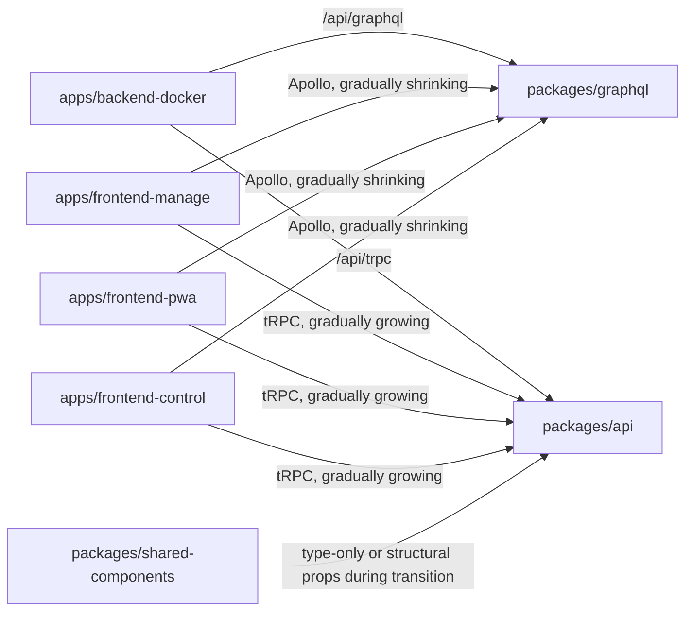
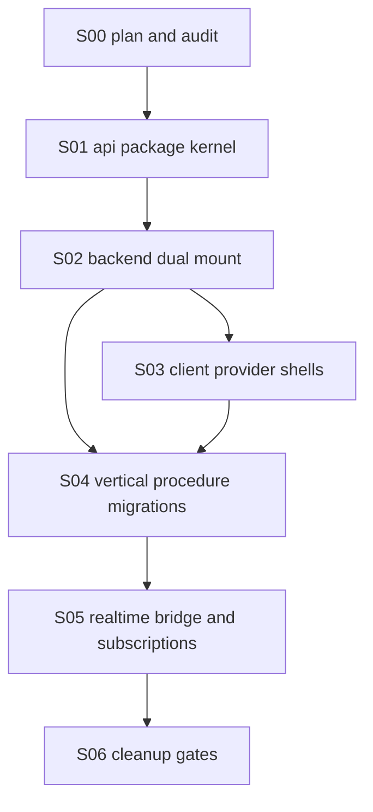

# GraphQL to tRPC Dual-API Migration Plan

## Goal

Introduce tRPC beside the existing GraphQL API, migrate clients one vertical workflow at a time, and remove GraphQL only after audits and runtime verification prove that no active app, subscription path, generated type, package script, or deployment path depends on it.

This is intentionally not a "delete GraphQL first" migration. GraphQL remains the production-compatible API during the transition.

## Current Baseline

- GraphQL server package: `packages/graphql`
- Backend app: `apps/backend-docker`
- Current GraphQL endpoint: `/api/graphql`
- Current GraphQL subscriptions: `graphql-ws` on the GraphQL endpoint
- Frontend state: Apollo Client and generated operations from `@klicker-uzh/graphql`
- Monorepo: pnpm 10, Turborepo, Node 20

## Target Architecture During Migration



## Slice Dependency Graph



## Non-Negotiable Migration Rules

- Keep `packages/graphql`, `/api/graphql`, GraphQL codegen, Apollo providers, and GraphQL subscriptions working until the final cleanup slice.
- Add new tRPC code in `packages/api` and route it through `/api/trpc`.
- Wrap existing services/resolvers where possible; do not rewrite business logic as part of transport migration.
- Use Zod for procedure inputs and SuperJSON for tRPC serialization.
- Export router types for clients. Avoid importing server runtime modules into browser bundles.
- Use DTO helpers for procedure outputs rather than returning broad Prisma records.
- Migrate one user workflow at a time and keep Apollo available for unmigrated workflows.
- Replace generated GraphQL types in shared helpers carefully; during mixed state, prefer narrow structural prop types when components are consumed by both Apollo and tRPC pages.
- Do not remove GraphQL dependencies, generated ops, codegen scripts, persisted query files, or Apollo until all cleanup audits are clean.

## Work Packages

| Slice | File | Outcome |
| --- | --- | --- |
| S00 | `S00-plan-and-audit.md` | Source-of-truth operation map and migration guardrails. |
| S01 | `S01-api-package-kernel.md` | New `@klicker-uzh/api` package with tRPC init, context, root router, and a smoke-test procedure. |
| S02 | `S02-backend-dual-mount.md` | Backend mounts `/api/trpc` while `/api/graphql` and GraphQL WS remain unchanged. |
| S03 | `S03-client-provider-shells.md` | Frontends can opt into tRPC beside Apollo without migrating screens yet. |
| S04 | `S04-vertical-migrations.md` | Domain routers and client workflows migrate incrementally. |
| S05 | `S05-realtime-migration.md` | Realtime event bridge supports GraphQL subscriptions and tRPC subscriptions during coexistence. |
| S06 | `S06-final-cleanup.md` | GraphQL removal only after audits, tests, and browser verification pass. |

## Initial Implementation Sequence

1. Commit this plan.
2. Implement S01 and the minimum safe part of S02:
   - create `packages/api`
   - expose `appRouter` and `AppRouter`
   - add a `system.health` query
   - mount `/api/trpc` in `apps/backend-docker`
   - keep `/api/graphql` unchanged
3. Verify package build/typecheck and audit that GraphQL is still present.
4. Commit S01/S02 foundation.
5. Continue with provider shells before migrating any UI workflow.

## Focused Verification Commands

Run as applicable after each slice:

```bash
pnpm install --frozen-lockfile
pnpm --filter @klicker-uzh/api check
pnpm --filter @klicker-uzh/api build
pnpm --filter @klicker-uzh/backend-docker check
pnpm --filter @klicker-uzh/backend-docker build
rg -n "/api/graphql|graphql-yoga|@apollo/client|graphql-codegen|@klicker-uzh/graphql" apps packages package.json pnpm-lock.yaml
rg -n "/api/trpc|@klicker-uzh/api|@trpc" apps packages package.json pnpm-lock.yaml
```

For frontend slices, additionally run the relevant app locally and verify the migrated workflow with `npx agent-browser` screenshots before claiming completion.

## Rollback Model

The first half of this migration should be easy to roll back:

- If `/api/trpc` fails, `/api/graphql` remains mounted and unchanged.
- If a migrated frontend workflow regresses, the specific vertical can be reverted without affecting unmigrated Apollo workflows.
- If realtime tRPC subscriptions prove risky, keep GraphQL subscriptions live and postpone S05.

## Documentation Sources

- Project-local codebase inspection on branch `codex/trpc-dual-api-migration`.
- The reusable `graphql-to-trpc-migration` skill and its GBL UZH case study.
- Current tRPC server-router documentation at `https://trpc.io/docs/server/routers`.
